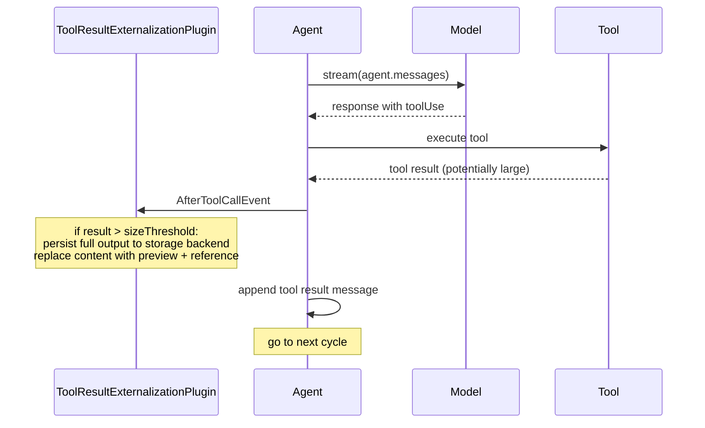

# Tool Result Externalization

**Status**: Proposed

**Date**: 2026-04-16

**Issue**: [#1296: Large Tool Result Externalization](https://github.com/strands-agents/sdk-python/issues/1296)

**Related**:
- [#1678: Large Content Aliasing](https://github.com/strands-agents/sdk-python/issues/1678)

**Scope**: TypeScript SDK. A parallel Python design will follow.

## Context

When a tool returns a large result (a file dump, API response, database query, or log output), the entire content enters the conversation history as a tool result message. A single oversized result can push context into overflow in one step.

The current `SlidingWindowConversationManager` handles this reactively: after a `ContextWindowOverflowError`, it replaces the result with a generic message:

```typescript
const toolResultTooLargeMessage = 'The tool result was too large!'
```

This has two problems.

1. **Data loss.** The full output is discarded permanently. The agent loses the ability to reference or reason about the content.

2. **Reactive timing.** The replacement only happens after the model has already rejected the request. The oversized result consumes context space, triggers an overflow, wastes a round-trip, and only then gets truncated.

This design proposes intercepting large tool results at execution time, before they enter the conversation. The full output is persisted to a pluggable storage backend, and the conversation receives a truncated preview with a reference to the stored artifact.

## Decision

We implement tool result externalization as a `Plugin` that hooks `AfterToolCallEvent`. If a tool result exceeds a configurable size threshold, the plugin externalizes the full output and replaces the conversation content according to a configurable strategy.

The following diagram shows where externalization fits in the agent loop:



The plugin accepts a `sizeThreshold` (default 10,000 characters) and a pluggable `ExternalizationStrategy` that controls where the full output is stored:

```typescript
export interface ExternalizationStrategy {
  externalize(content: string, toolName: string): Promise<string> | string
}
```

The SDK ships three built-in strategies:

| Strategy | Behavior | Use case |
|----------|----------|----------|
| `InMemoryExternalizationStrategy` | Stores content in memory. Zero config, no filesystem side effects. | Default. Context window optimization without persistence. |
| `FileExternalizationStrategy` | Writes to a local directory. | Debugging, auditing, offline retrieval. |
| `S3ExternalizationStrategy` | Writes to an S3 bucket. Follows the `S3SessionManager` pattern. | Production workloads, shared storage. |

The default is `InMemoryExternalizationStrategy` because the primary value of externalization is context window optimization, not artifact persistence. Long-running agents are exactly the use case where context pressure matters most, and they do not benefit from writing artifacts to disk. Users who need persistence can opt into `FileExternalizationStrategy` or `S3ExternalizationStrategy`.

When a tool result exceeds `sizeThreshold`, the hook passes the content to the strategy. The strategy stores the full output and returns a reference. The plugin then replaces the original content with a truncated preview plus that reference.

The replacement content looks like:

```
[Externalized: 125,432 chars | ref: mem://abc123]

<first 4,000 characters as preview>

[Full output stored externally: mem://abc123]
```

### Content Type Handling

Tool results can contain multiple content block types. The plugin handles each type as follows:

| Type | Behavior |
|------|----------|
| Text | Externalized: stored in the backend, replaced with a truncated preview. |
| JSON | Serialized via `JSON.stringify` (or `json.dumps` in Python), then externalized alongside text. |
| Image | Replaced with a `[image: format, N bytes]` placeholder. Follows the `SlidingWindowConversationManager` pattern. |
| Document | Replaced with a `[document: format, name, N bytes]` placeholder. |

The plugin measures the combined character count of all text and JSON blocks. If the total exceeds `sizeThreshold`, it externalizes the text content and replaces image and document blocks with lightweight placeholders.

### Retrieval Tool

The plugin vends a built-in retrieval tool that the agent can call to fetch externalized content by reference. This avoids requiring the user to separately configure a file-reading or S3 tool, and keeps the storage backend opaque to the model. The retrieval tool also supports the aliasing use case ([#1678](https://github.com/strands-agents/sdk-python/issues/1678)) because the model never needs to know where or how the content is stored.

This operates at tool execution time, before the result enters the conversation history. It prevents a single large result from consuming a disproportionate share of the context window. The full output is preserved in the configured storage backend for later retrieval by the agent or the user.

### SDK Changes Required

**New file: `plugins/tool-result-externalization.ts`.** Contains the `ToolResultExternalizationPlugin` class and its config interface.

Artifact filenames include the tool name and a timestamp for traceability. When using file or S3 storage, the artifact directory or prefix is created on first write. Cleanup of stored artifacts is the user's responsibility.

## Developer Experience

```typescript
import {
  Agent,
  ToolResultExternalizationPlugin,
  FileExternalizationStrategy,
  S3ExternalizationStrategy,
} from '@strands-agents/sdk'

// In-memory (default): zero config, context reduction only
const agent = new Agent({
  tools: [dataAnalysis, apiClient, fileProcessor],
  plugins: [
    new ToolResultExternalizationPlugin({
      sizeThreshold: 10_000,
    }),
  ],
})

// File storage: persists artifacts to disk
const agent = new Agent({
  tools: [dataAnalysis, apiClient, fileProcessor],
  plugins: [
    new ToolResultExternalizationPlugin({
      sizeThreshold: 10_000,
      strategy: new FileExternalizationStrategy({ artifactDir: './my-artifacts' }),
    }),
  ],
})

// S3 storage: persists artifacts to a bucket
const agent = new Agent({
  tools: [dataAnalysis, apiClient, fileProcessor],
  plugins: [
    new ToolResultExternalizationPlugin({
      sizeThreshold: 10_000,
      strategy: new S3ExternalizationStrategy({
        bucket: 'my-agent-artifacts',
        prefix: 'tool-results/',
      }),
    }),
  ],
})
```

Existing behavior is completely unchanged. Agents without the plugin continue to handle large results reactively.

## Alternatives Considered

### 1. Truncation Without Persistence

The current `SlidingWindowConversationManager` already truncates large results, but discards the full output. Truncation without persistence is simpler (no file system dependency) but loses data permanently. Externalization preserves the full output for debugging and potential retrieval by the agent.

### 2. Configuring Externalization on the Agent or Tool

Instead of a plugin, externalization could be a per-tool config or an agent-level setting. This would be more discoverable but would not compose as cleanly with other plugins. The plugin pattern keeps externalization independent and opt-in.

## Consequences

### What Becomes Easier

Large tool results no longer blow up the context window or get silently discarded. The full output is preserved in the configured storage backend while the conversation receives a compact preview. The built-in retrieval tool allows the agent to fetch the full output on demand without requiring the user to configure a separate file or S3 tool.

### What Becomes Harder or Requires Attention

When using file or S3 storage, artifacts accumulate and require cleanup. The preview may not contain the information the model needs, leading to follow-up retrieval tool calls. The `sizeThreshold` is character-based, not token-based, which is a rough proxy.

### Migration

No breaking changes. The plugin is purely additive and opt-in.

## Willingness to Implement

Yes.
