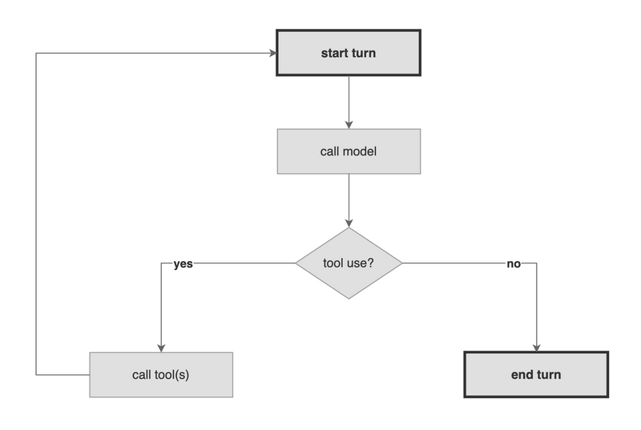
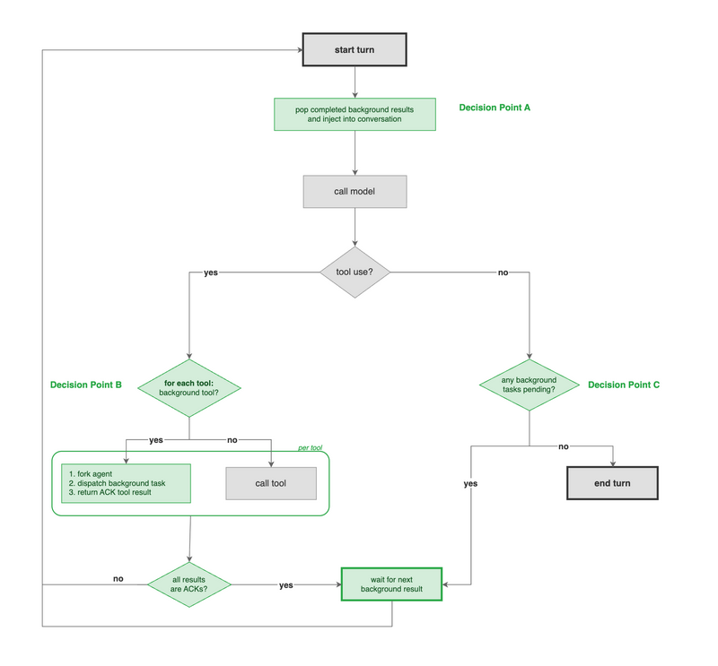

# Background Tasks: Non-Blocking, Async Concurrency for Strands Agents

**Status**: Proposed
**Date**: 2026-04-24
**Scope**: TypeScript SDK. Python SDK parity implementation to follow.

```
        STANDARD                                          BACKGROUND

  agent ▓▓▓·························▓▓▓            agent ▓▓▓▓▓▓▓▓▓▓▓▓▓▓▓▓▓
  tools    ████                                    tools    ████
               ████████                                    ████████
                        ██████████████                     ██████████████
        ├──────────────────────────────┤                ├────────────────┤
        0s                           30s               0s             15s
```

---

<details>
<summary><h2>Definitions</h2></summary>

| Term | Definition |
|------|-----------|
| **Background tool** | A tool declared in `backgroundTools` that the SDK dispatches on a fork instead of executing inline. The model calls it normally; the async behavior is invisible to the model except through the system prompt augmentation. |
| **Fork** | An independent copy of the agent created via `fork()`. Has its own conversation, execution lock, and task manager, but shares the parent's model client and tool registry. The isolation primitive that makes concurrent execution safe. |
| **Decision Point** | One of three locations in the modified agent loop where background task logic is injected. **A** (top of cycle): pop settled results. **B** (per tool): fork and dispatch or execute inline. **C** (end of turn): wait if tasks are pending. |
| **ACK** | The immediate `tool_result` returned to the model when a background tool is dispatched. Contains "Background task dispatched" or "Background task queued." Not a real result — the actual output arrives later via injection. |
| **Injection** | The mechanism by which background task results enter the parent's conversation. Results are appended as user text messages with a `[Background Task Result]` prefix and `toolUseId` for correlation. |
| **Settle window** | A configurable pause (default: 0ms) after a background task completes, giving closely-completing tasks a chance to finish so their results are injected as one batch rather than triggering separate model calls. |
| **Wait state** | The blocking state entered when the agent has no foreground work but background tasks are still in flight. Entered from Decision Point C (model ended turn) or after an all-ACK turn (every tool was background). |
| **BackgroundTask** | The handle wrapping a background operation. Provides synchronous status inspection (`status`, `result`, `error`), cancellation (`cancel()`), and implements `PromiseLike` for `await`. |
| **TaskManager** | Per-agent lifecycle manager for `BackgroundTask` instances. Owns concurrency limits, queuing, settlement detection, cancellation, and TTL enforcement. |

</details>

---
## Table of Contents

- [Problem(s)](#problems) · [Proposal](#proposal) · [How It Works](#how-it-works) · [New Primitives](#new-primitives) · [Failure Modes](#failure-modes) · [Retry](#retry) · [Cancellation](#cancellation) · [Context Management](#context-management) · [Consequences](#consequences) · [Design Decisions & Alternatives](#design-decisions--alternatives) · [Developer Experience](#developer-experience) · [Benchmark Results](#benchmark-results) · [Real-World Demos](#real-world-demos)
- Appendices: [A (Landscape Analysis)](#appendix-a-landscape-analysis) · [B (Interface Design)](#appendix-b-interface-design-rationale) · [C (Background Tasks vs Graph)](#appendix-c-background-tasks-vs-graph) · [D (Naming)](#appendix-d-naming-alternatives) · [E (Extensions & Roadmap)](#appendix-e-extension-to-containerized-dispatch) · [G (System Prompt Rationale)](#appendix-g-system-prompt-augmentation-rationale) · [H (Conversation Traces)](#appendix-h-conversation-traces) · [I (Development Plan)](#appendix-i-development-plan)

---

## Problem(s)

The agent loop is built on a synchronous assumption: the model calls tools, the SDK executes all of them, collects every result, and only *then* lets the model reason again. Even with concurrent tool execution within a turn (i.e. using `ConcurrentToolExecutor`), the model still waits for the slowest tool to finish before it can reason about any result.

### The agent blocks on every tool, with no ability to continue working in parallel

When the model calls six tools and one of them takes 30 seconds (while the rest complete in just a few), the agent remains idle for the entire 30 seconds. Every tool call is treated as part of the same batch, even though they might be completely independent and have their own follow-up work. Unrelated tasks should not block each other.

### The agent cannot drive concurrency on its own

Graph and Swarm multiagent primitives let developers define parallel pipelines, but this topology is *fixed* before the agent runs. The model has no way to dispatch tasks simultaneously based on its own reasoning nor adjust what it dispatches based on earlier results.

### A single agent instance cannot be invoked more than once at a time

The existing `.invoke()` and `.invokeAsync()` methods both acquire a per-instance `_isInvoking` lock. If a second call is made while the first is still running — whether via `Promise.all` or overlapping async calls — a `ConcurrentInvocationError` is immediately thrown. There is no built-in mechanism to create an independent copy of an agent and run it alongside the original.

## Proposal

Background task scheduling removes the synchronous assumption. Instead of a single execution path where everything queues behind everything else, the agent can now dispatch independent work onto *separate* paths and continue reasoning. Results flow back as they finish (success, error, cancellation). Existing framework-level parallelism (`ConcurrentToolExecutor`) continues to work for foreground tools — background tasks are complementary, not a replacement.

### The agent no longer blocks on every tool

Tools can now be executed asynchronously and independently, no longer blocking the agent. Results are injected back into the conversation as they finish – the model sees them on its next turn.

### The agent can now drive concurrency on its own

The model can dispatch multiple tools simultaneously, and they all begin executing immediately. As each result arrives, the model can react and adjust its strategy in real time, triggering follow-up work as needed or cancelling tasks that are no longer required. No predefined topology is required – the model's dispatch strategy emerges from its own reasoning.

### A single agent instance can now run concurrent work

The SDK now provides a built-in mechanism to "fork" an agent (create an independent copy) and run it alongside the original. No manual cloning, no lock conflicts, no coordination overhead.

**Zero overhead when not used.** Agents that don't configure `backgroundTools` pay no cost. No system prompt augmentation is injected, no management tools are registered, no token or context overhead is added. The decision points check `taskManager.size` and `_backgroundToolNames` and short-circuit immediately — no forks, no queues, no settlement checks. The agent loop behaves identically to today.

## How It Works

### Current Agent Loop



### Modified Agent Loop



Legend: <span style="color:#28a745">**green** = new</span>, **gray** = existing (unchanged from current loop)

### Three Decision Points

| Point | Location | Blocking | Purpose |
|-------|----------|----------|---------|
| **A** | Start of each loop cycle | No | Pop any background tasks that finished (success, error, or cancelled) since the last cycle and inject their results into the conversation as user messages. Proceeds immediately if none have settled. |
| **B** | Per tool, during dispatch | No | For each tool the model calls, check if it's designated as a background tool. If yes: fork the agent (or queue if `maxConcurrentBackgroundTasks` is reached), dispatch the tool on the fork, and return an immediate ACK to the model. If no: execute the tool inline as normal. The agent continues without waiting for background results. |
| **C** | End of turn, no foreground work remaining | Conditional | Wait for the next background task to settle, then re-enter the loop. Prevents the agent from exiting while work is still in flight. |

#### The Wait State — Why Block?

Two paths in the modified loop converge on the same blocking wait:

1. **Decision Point C**: The model ends its turn (no foreground work remaining) but background tasks are still in flight. Without the wait, the loop would exit and the `finally` block would cancel all pending tasks.
2. **All-ACK turns**: The model calls multiple tools and *all* of them are background tasks — every tool result is merely an acknowledgement. Without the wait, the model would re-enter the loop with nothing but ACKs to reason about, risking hallucinated results or redundant re-dispatches.

In both cases, the agent blocks until the next background task settles, injects the result into the conversation, and re-enters the loop. See [Cancellation](#cancellation) for the safety bounds that prevent indefinite waits.

### How the Model Sees Background Tasks

Background tools appear in the model's tool definitions identically to foreground tools — same name, same description, same input schema. There is no schema-level async marker. The model learns which tools run asynchronously and how to interact with them solely from the system prompt augmentation described below.

When any background tools are passed to the agent, the SDK auto-generates and appends the following block to the system prompt:

```
## Background Tools

The following tools run asynchronously:
- `searchWeb`
- `analyzeData`

**How it works:**
- Calling one returns: `Background task dispatched` (started immediately) or `Background task queued` (waiting for a slot).
- Do not fabricate results. You are not blocked — continue working or yield your turn.
- Results arrive as user messages:

[Background Task Result]
tool: <tool_name>
toolUseId: <tool_use_id>
status: success|error|cancelled

...output...

**Incorporate all [Background Task Result] messages into your work before producing your final response.**

**Management tools:**
- `list_background_tasks()` — check which tasks are still running and how long they've been running.
- `cancel_background_task({ toolUseId })` — cancel a specific task. `cancel_background_task({ toolName })` — cancel all instances of a tool.
```

The tool names are populated from the `backgroundTools` list. The block costs ~100 tokens, paid once per invocation. See [Appendix G](#appendix-g-system-prompt-augmentation-rationale) for why this augmentation is necessary and why alternatives were rejected.

#### Dispatch and Acknowledgement

When the model calls a background tool, it receives an immediate acknowledgement as a standard `tool_result` — satisfying the provider API's synchronous pairing requirement:

```
[assistant]  tool_use:    { toolUseId: "tu-1", name: "searchWeb",
                            input: { query: "research latest advancements in agentic AI" } }
[user]       tool_result: { toolUseId: "tu-1", status: "success",
                            content: "Background task dispatched" }
```

The ACK pairs with the original `tool_use` via `toolUseId`, just like any foreground tool result. The system prompt tells the model this is not a real result — actual output will arrive later.

#### Result Notification

When the background task completes, its result is injected into the conversation as a user text message — not a `tool_result`, since there is no `tool_use` to pair it with. The `toolUseId` from the original dispatch is echoed for correlation:

```
[user]  text: "[Background Task Result]
              tool: searchWeb
              toolUseId: tu-1
              status: success

              <tool output>"
```

This is the structural asymmetry at the heart of background tasks: the ACK uses native `tool_result` pairing, but the real result arrives as a plain text message. This is why the system prompt augmentation is necessary — see [Appendix G](#appendix-g-system-prompt-augmentation-rationale).

#### Model-Driven Task Management

Two foreground tools are auto-registered whenever background tools are configured:

**`list_background_tasks`** — Returns all currently pending tasks with their elapsed time, giving the model visibility into what's still running:

```
Model calls:  list_background_tasks()
Result:       "2 tasks in progress:
               - searchWeb (toolUseId: tu-1, elapsed: 12.3s)
               - analyzeData (toolUseId: tu-2, elapsed: 8.7s)"
```

The model can use this to make informed decisions — for example, checking whether a task is still running before dispatching a follow-up, or deciding whether to cancel a long-running task and try a different approach.

**`cancel_background_task`** — If the model determines that a pending task is no longer needed — because an earlier result already answered the question, or the user changed direction — it can cancel by `toolUseId` (specific task) or `toolName` (all instances). See [Cancellation](#cancellation) for the full cancellation API.

For full conversation traces covering mixed turns, all-ack turns, batched results, error scenarios, and non-deterministic ordering, see [Appendix H: Conversation Traces](#appendix-h-conversation-traces).

---
## New Primitives

### BackgroundTask

`BackgroundTask` is the foundational unit of background work in the SDK. Every background operation, whether dispatched by the model via `backgroundTools` or by the developer via `invokeBackground()`, is represented as a `BackgroundTask`. It wraps a Promise with synchronous status inspection and implements `PromiseLike` for direct `await`, enabling both the agent loop and the developer to check status, read results, or cancel work without blocking.

```typescript
type TaskStatus = 'queued' | 'inProgress' | 'success' | 'error' | 'cancelled'

class BackgroundTask implements PromiseLike<unknown> {
  readonly id: string          // UUID
  readonly name: string        // Human-readable label
  readonly createdAt: number   // ms since epoch
  get status(): TaskStatus
  get result(): unknown | undefined    // Defined when status is 'success'
  get error(): Error | undefined       // Defined when status is 'error'
  cancel(): void                       // Marks cancelled + fires fork abort signal
}
```

#### Awaiting

`BackgroundTask` implements `PromiseLike`, so the primary consumption path is `await`:

```typescript
// Success — resolves with the tool result
const result = await task

// Error — rejects with the tool's error
try {
  await task
} catch (e) {
  // e is the Error from the failed tool
}

// Cancelled — rejects with TaskCancelledError
try {
  await task
} catch (e) {
  if (e instanceof TaskCancelledError) {
    // Intentional cancellation, not a failure
  }
}
```

Cancellation follows the same pattern as `fetch` with an aborted `AbortSignal` — intentional cancellation is a rejection, not a silent resolve. The synchronous getters (`status`, `result`, `error`) enable inspection without awaiting.

#### Status Derivation

`status` is the single source of truth. The full lifecycle:

| Condition | `status` |
|---|---|
| Created but `maxConcurrentTasks` reached — waiting for a slot | `'queued'` |
| Slot available, fork created, tool executing | `'inProgress'` |
| `cancel()` called | `'cancelled'` |
| Promise rejected | `'error'` |
| Promise resolved, tool returned `status: 'error'` | `'error'` |
| Promise resolved, tool returned `status: 'success'` | `'success'` |

Task state is tracked via an internal discriminated union rather than promise state, because the agent loop must check settlement without blocking — a raw Promise offers no synchronous status inspection. The union carries the associated data for each state (result value, error, cancellation reason), eliminating the need for separate flags. When `cancel()` is called, status transitions to `'cancelled'` immediately regardless of current state (queued or inProgress). No-op if the task has already settled. See [Cancellation](#cancellation) for the full API.

#### TaskManager

`TaskManager` is the lifecycle manager for `BackgroundTask` instances created during the `backgroundTools` dispatch path ([Decision Point B](#three-decision-points)). It owns settlement detection, cancellation, and cleanup. Each agent instance holds its own `TaskManager`; forks get fresh instances with the same config. This isolation ensures a fork's background tasks are the fork's responsibility — the parent only sees the fork itself as one task, never the sub-tasks the fork may spawn internally.

These settings tune the agent loop's waiting behavior at [the wait state](#the-wait-state--why-block):

```typescript
interface TaskManagerConfig {
  heartbeatMs?: number           // How often to emit BackgroundTaskPendingEvent while waiting (default: 5000ms)
  settleWindowMs?: number        // How long to wait for additional tasks to finish before injecting (default: 0ms)
  maxCycles?: number             // Max loop re-entries from background results per invocation (default: 50)
  defaultTtlMs?: number          // Auto-cancel tasks that exceed this duration (no default — tasks live until settled)
  maxConcurrentTasks?: number    // Max simultaneous background tasks (default: 10). Excess dispatches queue until a slot opens.
}
```

These are exposed on `AgentConfig` as `backgroundToolHeartbeatMs`, `backgroundToolSettleWindowMs`, `maxBackgroundCycles`, `backgroundTaskTtlMs`, and `maxConcurrentBackgroundTasks` respectively.

`maxConcurrentTasks` prevents runaway forking. When the limit is reached, new dispatches are queued rather than forked immediately:

1. Decision Point B calls `TaskManager.enqueue()` instead of creating a fork directly.
2. If a slot is available (`runningCount < maxConcurrentTasks`), the task is forked and started immediately → status `inProgress`, ACK: `"Background task dispatched"`.
3. If no slot is available, the task enters an internal FIFO queue → status `queued`, ACK: `"Background task queued"`.
4. When a running task settles (via `popCompleted()` or cancellation), the TaskManager automatically drains the queue — pulls the next queued task, creates its fork, and starts execution. The task transitions from `queued` to `inProgress`.

The model receives an ACK for every dispatched tool immediately regardless of queue state. The distinction between "dispatched" and "queued" ACKs lets the model know whether work has started.

Key methods:

- **`enqueue()`** — the entry point for background dispatch. Creates a `BackgroundTask`, either starts it immediately or queues it based on concurrency, and returns the task handle with the appropriate ACK.
- **`popCompleted()`** — returns and removes all settled tasks from the registry. Triggers queue drain if slots opened. This is the only way tasks leave the registry, ensuring no task is accidentally lost or processed twice.
- **`cancel(id)`** — cancel a specific task by its internal ID. Works on both queued and running tasks. Cancelling a queued task removes it from the queue without ever forking.
- **`cancelByToolUseId(toolUseId)`** — cancel a specific task by its `toolUseId`. This is the primary path for model-driven cancellation, since the model knows `toolUseId` from its own `tool_use` blocks in conversation history.
- **`cancelByName(name)`** — cancel all in-progress and queued tasks with a given tool name. Returns the count. Available to both the model (via `cancel_background_task`) and developers directly.
- **`cancelAll()`** — cancel everything (running and queued) and clear the registry. Called by the agent loop's `finally` block on exit.

#### Events

Three new hookable events:

| Event | When | Key Fields |
|-------|------|------------|
| `BackgroundTaskDispatchEvent` | Tool call dispatched to background (Decision Point B) | `toolUse`, `taskId`, `taskName` |
| `BackgroundTaskResultEvent` | Task finishes and result injected (Decision Point A or C) | `taskId`, `taskName`, `result`, `durationMs`, `error?`, mutable `retry` |
| `BackgroundTaskPendingEvent` | Heartbeat while in the [wait state](#the-wait-state--why-block) | `pendingTasks: BackgroundTask[]`, `completedCount`, `elapsedMs` |

`BackgroundTaskResultEvent.error` carries the `Error` object when the tool failed or threw — available for logging, metrics, and retry decisions. The mutable `retry` flag lets hook callbacks suppress error notifications and re-dispatch the same tool call as a new background task. See [Retry](#retry) for the full three-layer retry story.

All three are available via hooks (`addHook`) and the streaming interface (`AgentStreamEvent`):

```typescript
agent.addHook(BackgroundTaskDispatchEvent, (event) => {
  console.log(`Dispatched ${event.toolUse.name} as task ${event.taskId}`)
})

agent.addHook(BackgroundTaskResultEvent, (event) => {
  if (event.error) {
    console.log(`Task ${event.taskName} failed in ${event.durationMs}ms: ${event.error.message}`)
  }
})
```

#### backgroundTools Config

`backgroundTools` accepts the same types as `tools` — `Tool`, `McpClient`, `Agent`, `Graph`, `Swarm`, or nested arrays. Anything that can be a tool can be a background tool.

```typescript
const agent = new Agent({
  tools: [calculateMetrics, formatReport],
  backgroundTools: [searchWeb, analyzeData, researcher],
})
```

The model sees background tools as normal tools in its tool definitions. A system prompt augmentation explains the async contract — see [How the Model Sees Background Tasks](#how-the-model-sees-background-tasks) for the full prompt block and message format details.

#### fork()

`fork()` creates an independent copy of the agent that can be invoked concurrently with the original. It is both the isolation primitive that makes background tasks possible (each dispatch at Decision Point B creates a fork) and a standalone capability for developers who want to parallelize work using the same agent configuration.

Why it's needed: `invoke()` on the same agent instance acquires an `_isInvoking` lock. A second concurrent call throws `ConcurrentInvocationError`. This is a deliberate safety rail — concurrent writes to the same `messages` array would corrupt conversation state. `fork()` gives each concurrent invocation its own messages, state, and lock:

```typescript
// This throws ConcurrentInvocationError
await Promise.all([
  agent.invoke('query A'),
  agent.invoke('query B'),
])

// fork() gives each invocation its own lock and state
const [a, b] = await Promise.all([
  agent.fork().invoke('query A'),
  agent.fork().invoke('query B'),
])
```

```typescript
interface ForkOptions {
  name?: string              // Override fork name
  messages?: Message[]       // Override conversation history
  systemPrompt?: SystemPrompt  // Override system prompt
  printer?: boolean          // Control output printing (false for background)
}
```

##### What gets shared vs. isolated

| What | Fork behavior |
|---|---|
| **Conversation** (messages, app state) | Deep-copied from parent. Independent after forking. Background tool forks start empty ([Context Management](#context-management)). |
| **Model and tools** | Shared reference. Same model, tool registry, and MCP clients. |
| **System prompt** | Copied from parent. Overridable via `ForkOptions`. |
| **Hooks** | Rebuilt with propagating callbacks only ([Hook Propagation](#hook-propagation)). |
| **Session** | Dropped. Forks do not persist to the parent's session. |
| **Execution** (invocation lock, cancellation, metrics) | Fresh. Each fork can be invoked and cancelled independently. |
| **Task management** | Fresh `TaskManager`, same config. Fork manages its own background tasks. |

Messages are deep-copied by default. For background tool forks specifically, the SDK automatically passes `messages: []` at Decision Point B — see [Context Management](#context-management) for why and how to opt out via `inheritMessages`.

Session managers are dropped — forks do not persist to the parent's session. Fork results reach the parent's session indirectly: they are injected into the parent's conversation, and the parent's session hooks persist them on the next save. Intermediate work inside forks (tool calls, reasoning steps) is not persisted.

##### Cancellation

Each fork has its own `AbortController`. Cancellation flows in one direction:

- **Parent exit → forks cancelled.** When the parent's agent loop exits (normal completion, error, or cancel), its `finally` block calls `taskManager.cancelAll()`, which fires each background fork's abort signal. No orphaned forks.
- **Fork cancelled → parent unaffected.** A fork's abort controller is independent. Cancelling a fork (via `BackgroundTask.cancel()` or TTL) does not propagate to the parent.
- **Manual forks.** For forks created directly by the developer (not via `backgroundTools` or `invokeBackground`), the developer is responsible for cancellation — there is no automatic cleanup.

##### Fork depth guard

A configurable depth limit (default: 20, set via `maxForkDepth` on `AgentConfig`) prevents infinite recursive forking — for example, a background tool that itself dispatches background tools. Throws if exceeded.

##### Model-driven self-forking (emergent capability)

This was not the primary use case for background tasks — the goal was unlocking async tool and agent-as-tool dispatch. But during development, a broader capability emerged: the `fork()` + `invokeBackground()` + result injection infrastructure composes to let the model spawn copies of itself.

A `fork_self` tool — a thin wrapper over `fork()` + `invokeBackground()` — would let the model dispatch a copy of itself with a new prompt. The fork has the same tools, model, and system prompt, but its own conversation and execution state. Results flow back via the standard background task injection mechanism.

This unlocks patterns that go beyond tool-level parallelism: self-parallelization (the model decomposes a task and dispatches a fork per sub-problem), context window extension (fork with a summarized conversation to work in a fresh context), speculative execution (fork to explore competing approaches in parallel), and recursive decomposition (forks that fork themselves, up to `maxForkDepth`).

The infrastructure is already in place — no new primitives are needed. A dedicated design document will explore model-driven self-forking patterns, system prompt strategies, and benchmark results.

#### Hook Propagation

Forks inherit hook callbacks selectively. An `options` parameter on `addHook` controls this:

```typescript
agent.addHook(AfterModelCallEvent, callback)                  // propagate: true (default)
agent.addHook(AfterModelCallEvent, callback, { propagate: false })  // stays on this agent only
```

Session persistence hooks and conversation manager overflow hooks must not propagate to forks. A fork writing to the parent's session or triggering the parent's overflow recovery would corrupt state. The built-in hooks set `propagate: false`:

- `ConversationManager.initAgent()` → overflow recovery hook
- `SlidingWindowConversationManager.initAgent()` → after-invocation trimming hook
- `SessionManager` → all persistence hooks

User-registered hooks propagate by default, which is the expected behavior for logging and guardrails. The `options` parameter is backwards-compatible — existing `addHook` calls without it continue to work with the default `propagate: true`.

#### invokeBackground()

Dispatches a full agent invocation as a background task:

```typescript
interface InvokeBackgroundOptions {
  name?: string          // Task label for debugging
  messages?: Message[]   // Override fork conversation
}
```

This creates a fork, starts its `invoke()`, wraps the resulting Promise in a `BackgroundTask`, and returns immediately. Unlike `backgroundTools` dispatch, `invokeBackground` does not route through the `TaskManager` — the developer is responsible for awaiting, cancelling, and handling errors on the returned task:

```typescript
const task = agent.invokeBackground(`Summarize: ${text}`, { name: 'summarizer' })
const result = await task
```

---

## Failure Modes

Background task failures produce a `[Background Task Result]` notification with one of two statuses: `error` for tool failures, `cancelled` for intentional stops (TTL expiration, developer cancellation, or model-driven cancellation via `cancel_background_task`). If a fork crashes entirely — unrecoverable context overflow, provider errors, unhandled exceptions — the parent is unaffected. The fork's promise rejects, the task settles with `status: error`, and the model receives the error notification like any other failure. Conversely, if the parent agent exits — whether normally, via error, or cancellation — all in-flight background tasks are cancelled automatically via the `finally` block.

**Tool-level failure (`status: error`).** The tool returns a `ToolResultBlock` with `status: 'error'`, or throws an exception (which `executeTool` catches and wraps in an error `ToolResultBlock`). The notification carries the tool's error text.

```
Model calls:        searchWeb({ query: "quantum computing" })
Tool result ACK:    "Background task dispatched"
Model continues working...

Tool fails → model receives:

[Background Task Result]
tool: searchWeb
toolUseId: tu-1
status: error

Connection timeout after 30000ms
```

**Cancellation (`status: cancelled`).** The task was intentionally stopped — by TTL expiration, developer `cancel()`, or the model's `cancel_background_task` tool. The TaskManager fires the fork's abort signal and the task's status transitions to `'cancelled'` immediately (see [What Cancellation Does to the Fork](#what-cancellation-does-to-the-fork)). Example with TTL:

```
Model calls:        analyzeData({ dataset: "large_corpus" })
Tool result ACK:    "Background task dispatched"

30 seconds pass, backgroundTaskTtlMs fires...

Model receives:

[Background Task Result]
tool: analyzeData
toolUseId: tu-2
status: cancelled

Task cancelled (TTL exceeded)
```

In both cases the model receives the notification inline with other results and can decide how to proceed. The distinction matters: `status: error` suggests retrying may help, while `status: cancelled` signals the task was intentionally stopped.

---

## Retry

Retry operates at three layers. Each layer handles a different failure granularity, and they compose — Layer 1 catches transient failures silently, Layer 2 gives developers programmatic retry policies, Layer 3 gives the model final say.

### Layer 1: Tool-Level Retry (Inside the Fork)

Register an `AfterToolCallEvent` hook. It fires inside the fork's `executeTool` loop when the tool fails. Set `retry = true` and the fork retries the tool internally. The parent never sees the failure.

This handles transient, mechanical failures — network timeouts, rate limits, flaky APIs. Already works with no changes needed; the same hook mechanism used for foreground tool retry propagates to forks automatically.

### Layer 2: Task-Level Retry (Developer-Controlled)

`BackgroundTaskResultEvent` carries the full `ToolResultBlock` result, the `Error` object (when available), and a mutable `retry` flag. When a hook callback sets `retry = true` on an error result, the framework suppresses the error notification (the model never sees it), creates a new fork, and re-dispatches the same tool call as a fresh background task.

```typescript
// Simplified — production code should track retry counts per task (e.g., keyed by event.taskId)
let retryCount = 0

agent.addHook(BackgroundTaskResultEvent, (event) => {
  if (event.result.status === 'error' && retryCount < 3) {
    retryCount++
    event.retry = true
  }
})
```

The `retry` flag is only honoured when `result.status === 'error'`. Setting it on a success or cancelled result is a no-op — cancelled tasks were intentionally stopped, so automatic retry would likely hit the same deadline. The re-dispatched task carries the original `ToolUseBlock`, so the retry uses the same tool name and input arguments.

**Safety bound:** `maxBackgroundCycles` (default: 50) limits how many times the agent loop can re-enter after injecting background results. Each retry dispatch settles on a future cycle, counting toward this limit. A hook that always sets `retry = true` will exhaust the cycle budget rather than loop infinitely.

### Layer 3: Model-Driven Retry

If retries at Layers 1 and 2 are exhausted (or not configured), the notification reaches the model as a `[Background Task Result]` with `status: error` or `status: cancelled`. The model can call the same tool again if it chooses — it's still in `backgroundTools`, so the new call dispatches as a fresh background task. The `error` vs `cancelled` distinction helps the model decide: errors may be worth retrying, cancellations typically are not.

**Validated:** The `demos/cases/error-retry` teaching example confirms Layer 2 end-to-end with Sonnet: a flaky tool (503 on first call) is retried transparently by the hook, the model never sees the error, and the coordinator synthesizes all three researcher results as if nothing failed.

---

## Cancellation

Four independent cancellation paths cover every actor that might need to stop background work.

### Developer Cancellation

`BackgroundTask` exposes a public `cancel()` method. This is the primary cancellation path for tasks created via `invokeBackground()`, where the developer holds the handle directly. For `backgroundTools` tasks, cancellation goes through the TaskManager or the model's `cancel_background_task` tool (see below).

```typescript
const task = agent.invokeBackground('Research topic A')
// ... later
task.cancel()  // marks cancelled, fires fork abort signal
```

### TaskManager Cancellation

`TaskManager.cancel(id)` cancels a specific task by internal ID. `TaskManager.cancelByToolUseId(toolUseId)` cancels by the model-facing `toolUseId`. `TaskManager.cancelByName(name)` cancels all in-progress tasks with a given tool name. `TaskManager.cancelAll()` cancels everything. The agent loop's `finally` block calls `cancelAll()` on exit, ensuring no orphaned tasks.

### Model-Driven Cancellation

A `cancel_background_task` tool is auto-registered whenever `backgroundTools` is configured. The model can cancel a specific task by `toolUseId`, or all instances of a tool by `toolName`:

```
// Cancel a specific task
Model calls:  cancel_background_task({ toolUseId: "tu-1" })
Result:       "Cancelled task for 'searchWeb' (toolUseId: tu-1)"

// Cancel all instances of a tool
Model calls:  cancel_background_task({ toolName: "searchWeb" })
Result:       "Cancelled 2 task(s) for 'searchWeb'"
```

The model knows both `toolUseId` and tool names from its own `tool_use` blocks in conversation history. `toolUseId` is the primary path for precise cancellation; `toolName` is the bulk option. This closes the asymmetry where the model can start background work but can't stop it.

### Automatic Cancellation (TTL)

TTL auto-cancels tasks that exceed a deadline. Configured via `backgroundTaskTtlMs` on `AgentConfig`, which applies to all background tasks dispatched by that agent.

### What Cancellation Does to the Fork

`cancel()` fires the fork's `AbortController.abort()`. The fork's agent loop checks `isCancelled` at built-in checkpoints (between cycles, during model streaming, between tool executions). If the fork is mid-tool-execution, cancellation depends on the tool: tools that check `cancelSignal` (e.g., `fetch()` with signal forwarding) abort immediately; tools that don't check will run to completion. The cancelled task's status transitions to `'cancelled'` immediately — the agent loop does not wait for an unresponsive fork.

**Validated:** The `demos/cases/cancellation` teaching example confirms developer cancellation end-to-end with Sonnet: 3 tasks dispatched via `invokeBackground()`, the fast one completes in 9.4s, the developer cancels the other two (which were still in progress), status transitions to `cancelled` immediately. Total: 9.4s instead of 90s+.

---

## Context Management

Background tasks create two pathways for context growth: fork creation copies conversation history (input side), and result injection adds content to the parent's conversation (output side). The strategy uses three layers — a structural fix for the input side, reactive compaction for the output side, and an opt-in mechanism for developers who want proactive control.

### Background Tool Forks Start with Empty Messages

When a background tool is dispatched at Decision Point B, the SDK creates a fork to execute the tool on. The fork is created with `messages: []` — it does not copy the parent's conversation history.

This is safe because the fork never reads its own messages. `executeTool()` passes the tool input directly from the `toolUseBlock` — the tool receives its arguments through `ToolContext.toolUse`, not from the conversation. The fork's `messages` array is accessible via `toolContext.agent.messages` but no built-in tool reads it. For Agent-as-tool specifically, `AgentAsTool` resets the sub-agent to its initial state via `loadSnapshot()` before invoking — the fork's messages are irrelevant.

Without this, each background tool fork deep-copies the parent's entire message history. Six concurrent forks of a 50-message conversation = six copies. As the parent's conversation grows with injected results, each subsequent wave of forks copies the now-larger conversation — a compounding cost eliminated by starting forks empty.

For tools that genuinely need conversation context when running in the background, `AgentAsToolOptions` accepts `inheritMessages?: boolean` (default `false`). When set to `true`, the fork copies the parent's messages instead of starting empty. This follows the same pattern as `propagate` on hooks — safe default, per-tool opt-in:

```typescript
// Default: fork starts with empty messages
const researcher = new Agent({ ... })

// Opt-in: fork inherits parent messages
const conversationAnalyzer = new Agent({ ... })
conversationAnalyzer.asTool({ inheritMessages: true })
```

When the tool runs as a foreground tool, `inheritMessages` is ignored — no fork is involved.

This does not affect `invokeBackground()` (developer-driven dispatch), which copies the parent's messages by default since the developer is invoking the fork as a full agent. For developer-driven dispatch where conversation context is not needed, `invokeBackground(prompt, { messages: [] })` is the recommended pattern — this is the developer's responsibility to manage.

### Reactive Compaction Handles Result Accumulation

When background task results are injected into the parent's conversation, the conversation grows. If it grows past the context window limit, the conversation manager's overflow recovery fires — the same mechanism used for any long conversation:

1. Background results are injected at the **end** of the conversation (appended as the most recent messages).
2. The model is called with the updated conversation.
3. If the conversation exceeds the context window, the model call fails with `ContextWindowOverflowError`.
4. The conversation manager compacts: `SlidingWindowConversationManager` trims messages from the **front** (oldest first); `SummarizingConversationManager` summarizes old messages.
5. The model call retries with the compacted conversation.

This ordering works well for background tasks: stale early results from earlier waves get trimmed while recent results survive. Crucially, the model always gets a full turn to process injected results before compaction can trim them — results are injected, the model is called, and only a subsequent overflow (from later injections or the model's own output) triggers compaction. Early results that the model already reasoned about are safe to trim because that reasoning is preserved in the model's own prior responses.

**Settle window batching helps.** When multiple background tasks finish within the settle window, their results are injected as one batch before the model is called. If the combined batch overflows the context, compaction fires once for the entire batch — one compaction pass for N results, not N separate passes.

**Limitation: compaction cannot recover if results alone exceed the context window.** If the combined size of injected results in a single batch exceeds the model's context window — even after all other messages are trimmed — compaction cannot help. This is an extreme case (e.g., six Agent-as-tool results each producing 10K+ tokens on a small context window) but it is real. Use structured output on sub-agents (below) to bound individual result sizes when running many concurrent background tools or targeting models with smaller context windows.

**Caveat for precision-critical workflows.** When compaction trims early background task results, specific data points that the model referenced but didn't reproduce verbatim in its own responses are lost from the context. In background task workflows, the model's inter-wave reasoning tends to be brief (dispatch tools, wait, incorporate results, dispatch more) — so compacted early results may carry data that the model's thin intermediate responses don't preserve. For most workflows this is acceptable. For precision-critical use cases (financial analysis, legal review, quantitative research) where exact figures must remain available for later reference, use structured output on sub-agents (below) to extract specific data points into compact named fields that survive compaction.

### Structured Output on Sub-Agents for Proactive Control

For developers who want to proactively control how much data crosses the fork-to-parent boundary, the recommended pattern is `structuredOutputSchema` on the sub-agent.

The context blowup problem is specific to Agent-as-tool, where an unconstrained model generates free-form text — including reasoning, prose, and verbose explanations — that becomes a tool result. Plain tools (FunctionTool, ZodTool, MCP tools) control their return value directly in the callback. Structured output on sub-agents strips the output down to just the actionable data, making the sub-agent behave more like a regular tool that returns structured results.

The sub-agent's agent loop runs freely — multiple tool calls, intermediate reasoning, as many cycles as needed. On the final cycle, the structured output tool forces the model to distill its work into the schema. `AgentAsTool` detects the structured output and returns a compact `JsonBlock` instead of the full free-form text:

```typescript
const researcher = new Agent({
  name: 'researcher',
  tools: [searchGitHub, searchArxiv, fetchUrl],
  systemPrompt: 'You are a research specialist. Search thoroughly and report your findings.',
  structuredOutputSchema: z.object({
    summary: z.string().describe('2-3 sentence executive summary'),
    findings: z.array(z.object({
      source: z.string(),
      finding: z.string(),
    })).max(5).describe('Top findings with sources'),
    sources: z.array(z.string()).max(5).describe('URLs of key sources'),
  }),
  printer: false,
})

const coordinator = new Agent({
  backgroundTools: [researcher, analyst, writer],
  systemPrompt: 'Dispatch all researchers, then synthesize findings.',
})
```

The researcher searches, reads, and reasons without restriction. Its final output is a compact JSON object — roughly 300-500 tokens crossing the boundary instead of 2000+. The sub-agent's reasoning quality is unaffected; structured output constrains only the final output format.

This is opt-in. Developers who don't set `structuredOutputSchema` get full free-form results. Reactive compaction (above) handles any resulting overflow.

### Summary

| Developer action | Input side | Output side |
|---|---|---|
| Nothing | Forks start with empty messages | Reactive compaction on context overflow |
| `structuredOutputSchema` on sub-agent | Forks start with empty messages | Compact structured JSON crosses the boundary |
| `inheritMessages: true` on tool | Fork copies parent messages | Reactive compaction on context overflow |
| `structuredOutputSchema` + `inheritMessages` | Fork copies parent messages | Compact structured JSON crosses the boundary |

A developer who does nothing gets safe defaults — empty forks and reactive compaction. A developer who wants tighter control adds structured output to their sub-agents.

**Fork-internal overflow.** Each fork has its own conversation manager. If a fork's tool execution pushes it over its own context window limit, the fork's overflow handler fires independently — the parent is unaffected.

---

## Design Decisions & Alternatives

### Why backgroundTools as a First-Class Config (And Not Something Else)

Two alternative approaches to giving the model async dispatch capability:

**1. Meta-tool: `run_in_background(tool_name, args)`**

A built-in tool the model calls to wrap any other tool call. Instead of the developer declaring which tools run in the background, the model decides at runtime.

- Pro: no new agent parameter. The model adapts per-conversation — it can background a tool in one context and run it foreground in another based on what the task requires.
- Con: the model must learn a wrapper pattern. Instead of calling `searchWeb({ query: "..." })` directly, it calls `run_in_background({ tool: "searchWeb", args: { query: "..." } })`. This is strictly more complex for the model, and the framework gets no new information from the indirection — it could have intercepted the direct call.
- Con: without guardrails, the model decides what's safe to background — but it has no knowledge of tool statefulness, latency, or fork safety. Adding a developer-specified allowlist to restrict what the meta-tool can dispatch solves this, but then the developer is declaring a list of backgroundable tools — which is what `backgroundTools` already is, without the meta-tool indirection.
- Con: incompatible with the system prompt augmentation strategy. The current augmentation lists specific tool names ("The following tools run asynchronously: searchWeb, analyzeData"). A meta-tool approach can't name the tools upfront because any tool could be backgrounded at runtime — the augmentation would have to be generic ("any tool you call through run_in_background is async"). Prompt ablation testing showed that less specific augmentations regressed model compliance (see [Appendix G](#appendix-g-system-prompt-augmentation-rationale)), and a fully generic instruction would be the least specific variant.

**2. Per-tool option: `{ tool: searchWeb, background: true }` in the tools array**

Same dispatch semantics, but expressed as a property on each tool entry rather than a separate parameter.

- Pro: single source of truth — each tool appears once with its configuration. No possibility of a developer adding the same tool to both `tools` and `backgroundTools` and wondering which wins.
- Pro: extensible wrapper — the config object could carry other per-tool options in the future (per-tool TTL, priority).
- Con: no precedent in the SDK. Tool arrays are flat lists of `Tool | McpClient | Agent | Graph | Swarm`. Introducing config wrapper objects is a new pattern that every consumer of the array — tool registry, model formatters, MCP integration — must handle, even if the unwrapping itself is trivial.
- Con: `backgroundTools` as a separate parameter achieves identical semantics with zero changes to the existing tools pipeline. It's additive to `AgentConfig` rather than a new shape in `ToolList`.
- Verdict: a valid alternative. We chose `backgroundTools` because it requires no type changes, is immediately discoverable via IDE autocomplete on `AgentConfig`, and keeps the existing tools pipeline untouched. If developer feedback shows that managing two lists is confusing, per-tool options can be added as a backwards-compatible enhancement later.

In both approaches, foreground/background assignment is static — declared at agent construction, not switchable at runtime. This is deliberate. The developer knows which tools are safe to fork (stateless, independent, no shared resources) and which must run inline. Static assignment also has a UX implication: background tool forks run with printing disabled, so the user does not see intermediate reasoning, streaming output, or tool call traces from background work. Developers who want real-time visibility into a tool's execution should keep it foreground. If different contexts require different modes for the same tool, use separate agent configurations.

**Prior art: Mastra's dynamic dispatch.** Mastra solves the "same tool, both modes" problem by allowing the model to include a `_background` field in tool call args to override background/foreground per-call. This is a valid approach that adds flexibility, but it adds a hidden parameter to every tool's input schema, requires the model to learn when to use it, and means the developer can't guarantee a tool will always run in a specific mode. We chose static assignment for v1 because it's simpler, predictable, and lets the developer reason about fork safety at construction time. Dynamic dispatch via an opt-in allowlist (developer pre-approves which tools can be dynamically backgrounded, model decides per-call) is the natural extension path if static assignment proves too restrictive.

**3. Task management tool: `manage_tasks({ action: "create" | "status" | "stop" | "get_result", ... })`**

A further extension of the meta-tool pattern where the model explicitly manages the full task lifecycle — creating tasks, polling for status, stopping tasks, and retrieving results.

- Pro: full visibility — the model can query task status at any time and make decisions based on it (e.g., "if task A is still running, start task B").
- Con: requires the model to learn a task management API and manually poll for results, adding complexity and wasted cycles. Each status check is a tool call that consumes a full agent loop cycle.
- Con: polling is fundamentally wasteful — the model repeatedly calls `manage_tasks({ action: "status", taskId: "..." })` instead of receiving results automatically.
- Our design eliminates the polling overhead: dispatch is transparent (the model calls tools normally), and result delivery is automatic (the agent loop's injection points push results to the model when they're ready). Rather than a monolithic task management API, we provide two focused tools — `list_background_tasks` for status visibility and `cancel_background_task` for stopping work. The model gets on-demand inspection without learning a lifecycle protocol, and results still arrive automatically without polling.

### How Overlap Between tools and backgroundTools Is Handled

If a tool name appears in both `tools` and `backgroundTools`, the agent logs a warning at construction and treats it as a background tool.

**Alternatives considered:**

- **Throw at construction.** Loudest signal, zero ambiguity. But it punishes a common progressive adoption pattern: developer starts with `tools: [a, b, c]`, moves `c` to `backgroundTools`, and forgets to remove it from `tools`. A hard error on what is most likely a migration-in-progress is unnecessarily harsh.

- **`backgroundTools` wins silently.** Does what the developer most likely intended (they added it to `backgroundTools` for a reason) but gives no signal that the overlap exists. A developer who thinks a tool is running foreground because they see it in `tools` will be confused when it actually runs in the background.

- **`tools` wins silently.** Foreground is the "safer" default — if in doubt, block. But this silently ignores the developer's explicit decision to put the tool in `backgroundTools`, which is worse than the reverse.

We chose warn + backgroundTools wins because it respects the developer's most likely intent (they want this tool backgrounded), surfaces the conflict visibly, and doesn't crash the application during an incremental migration.

### Why No `invokeAll()` Convenience Method

We considered adding `agent.invokeAll(['query A', 'query B', 'query C'])` as sugar over `Promise.all` + `invokeBackground`. It saves one line but loses composability — you can't cancel individual tasks, await them selectively, or mix them with other async work. Every variation (per-task timeout, partial result handling, error strategies) would require extending the method signature. `invokeBackground()` + `Promise.all` is explicit, composable, and only one step above the raw primitive.

### Why Fork Isolation (Not Shared State)

We considered having forks share the parent's `messages` array, with concurrent writes synchronized via a lock. This would eliminate the need for result injection — forks would write directly to the conversation. But concurrent writes to a shared conversation create ordering ambiguity, break the model's expectation of a linear conversation, and make debugging very difficult. Isolated forks with explicit result injection preserves linearity and keeps the decision points auditable.

### Why In-Process TaskManager (Not External Queue)

We considered delegating background execution to an external task queue (SQS, Redis, Temporal). This would enable durable execution and cross-process distribution, but introduces infrastructure dependencies that conflict with the SDK's zero-config philosophy. The in-process approach handles the common case — I/O-bound tool calls, sub-agent delegation — without requiring users to set up external services. The TaskManager's API surface is designed so that a persistent/distributed backend could replace the in-memory Maps without changing any consumer code (see [Appendix E: Extension to Containerized Dispatch](#appendix-e-extension-to-containerized-dispatch)).

### Why the Agent Loop Waits for Pending Tasks

The blocking wait (see [The Wait State](#the-wait-state--why-block)) serves two paths: Decision Point C (model ends turn, tasks still in flight) and all-ACK turns (every tool result is a background dispatch acknowledgement). In both cases, if the model still has foreground work (calling tools, reasoning, generating text), it continues normally — background tasks settle in the background and get picked up at Decision Point A on the next loop iteration. The wait never blocks the model from doing other work.

When the model has no foreground work and tasks are still pending, the loop blocks until at least one settles. Without this wait, the loop returns, the `finally` block fires `cancelAll()`, and pending tasks are killed — emails don't send, logs don't write. The wait keeps the loop alive so tasks can complete and results can be injected.

This means background tools cannot be true fire-and-forget today. Side-effect tools still benefit from parallel execution (three 4-second calls settle in ~4s instead of 12s), but the agent's response is held until all tasks finish. A near-term enhancement is a per-tool `fireAndForget` flag that excludes specific tasks from the wait — the agent returns immediately while those tasks complete on detached promises, avoiding the infrastructure cost of a persistent backend for the common case of side-effect tools where silent loss on process exit is acceptable.

The path to fire-and-forget is a persistent TaskManager backend (see [Appendix E](#appendix-e-extension-to-containerized-dispatch)). With external persistence, task state survives the invocation boundary: the loop returns immediately, tasks finish on their own and write results to the store, and the next `invoke()` picks them up at Decision Point A. The `SessionManager` is a natural near-term integration point — it already persists conversation state across invocations.

### Why Model-Level Concurrency (Not Just Framework-Level)

The state machine design ([0005](./0005-state-machine.md)) proposes `ConcurrentToolOrchestrator` as a sub-orchestrator that runs tool steps in parallel. This is complementary, not competing:

- `ConcurrentToolOrchestrator` parallelizes tools within a single model turn at the framework level. The model requests N tools, the SDK runs them concurrently, collects all results, and sends them back together. The model doesn't know concurrency happened.
- `backgroundTools` parallelizes across turns at the model level. The model dispatches work, continues reasoning, and incorporates results incrementally as they arrive. The model actively participates in the concurrency.

Both are useful. Concurrent tool execution is a performance optimization invisible to the model. Background dispatch is a capability the model uses to coordinate complex workflows. Once the state machine lands, a `ConcurrentToolOrchestrator` for foreground tools would compose naturally alongside background dispatch.

### Why a Sentinel in the ACK

The dispatch acknowledgment contains `\uE001STRANDS_BGT\uE001` — Unicode private-use area characters that are invisible in renderers and not typeable from a keyboard. Without this, a user could craft a message containing "Background task dispatched" and the agent loop's all-ack detection would misidentify it as a background dispatch, causing the agent to enter the blocking wait loop incorrectly. The sentinel is machine-generated only and makes this injection impossible. A tool's actual output cannot contain these characters — they are in Unicode's Private Use Area (U+E001), reserved for application-specific use and not produced by any standard text processing.

### Why System Prompt Augmentation (And Can It Be Eliminated?)

The ~100-token system prompt block is required because no model provider API supports async tool results natively, and two of the four augmentation bullets address behavioral failure modes (hallucination, premature finalization) that no structural change can eliminate. We investigated five alternative approaches — including synthetic tool_use fabrication, XML-style envelopes, and prompt ablation — and none matched the current augmentation's reliability across Sonnet, Haiku, and Nova at benchmark scale. See [Appendix G](#appendix-g-system-prompt-augmentation-rationale) for the full analysis.

### Why Three Decision Points (And Not One)

The current design has three distinct decision points: A (inject completed results), B (dispatch new tasks), C (wait for next task to finish). The all-ack scenario is a separate branch in the loop that converges on the same blocking wait as C (see [The Wait State](#the-wait-state--why-block)).

A natural simplification: collapse A, C, and all-ack into a single top-of-loop operation that (a) pops any settled bg results and (b) asks "does the model have anything new to reason about?". If yes, call the model. If no and tasks are pending, block and wait. If no and nothing is pending, return. B remains its own concern because it is structurally different (fires mid-turn on each tool call).

We considered this and kept the A/B/C structure for several reasons:

- **The A/B/C vocabulary is already load-bearing.** Implementation, tests, benchmarks, demos, and hook documentation reference specific decision points. A unified design would require renaming these touchpoints for marginal conceptual gain — and the unified design produces identical behavior.
- **The A/B/C labels are teachable.** Bug reports, stack traces, and hook documentation can reference specific points. "Result came from Point C" is crisper than "result came from the top-of-loop settlement check."
- **Three dedicated code paths are easier to reason about per-case than one unified predicate.** The predicate "is there anything new for the model?" must correctly answer across many states — foreground results, bg settlements, all-ack dispatch, TTL cancellations, interrupt resumption, structured output forcing. Separating these paths makes each easier to test in isolation.
- **Heartbeat semantics tied to Point C have a clear observability meaning** ("agent finished its turn, waiting on bg work"). Unifying the wait changes when heartbeats fire relative to turn boundaries — not harmful, but different from the current contract.

The unified design is a legitimate alternative that produces identical user-facing behavior (same events, same latency, same wall-clock results). If future constraints make A/B/C burdensome, it is a safe no-op refactor — no consumer code changes required. For the initial ship, A/B/C wins on clarity, debuggability, and alignment with the existing implementation.

---

## Consequences

### Unlocks

| | Before | After |
|---|---|---|
| **Tool-level parallelism** | Model calls tools sequentially, idles while each runs | Model dispatches tools to background, continues reasoning, incorporates results as they arrive |
| **Concurrent agent invocations** | `invoke()` on the same instance throws; manual cloning required | `fork()` + `invokeBackground()` — one line, guaranteed config match |
| **Non-blocking side effects** | Emails, logs, CRM updates block the agent until each completes | Fire concurrently — agent responds without waiting |
| **Adaptive pipelines** | Pipeline topology defined at build time (Graph nodes and edges) | Model discovers what to parallelize at runtime based on context and intermediate results |

### Tradeoffs

| | What you pay | How we're addressing it |
|---|---|---|
| **Token cost** | Output tokens: 1-18% increase across benchmarks (see Token Δ columns). Input tokens increase proportionally to cycle count — each additional model call re-reads the conversation including previously injected results. Both are the structural cost of incremental reasoning across multiple turns. | Settle window batching reduces turn count. Structured output on sub-agents reduces per-result size. Compaction reclaims context from stale results. |
| **Context growth** | Each injected result grows the parent's conversation. Multiple waves compound. | Three-layer strategy: empty forks (input), reactive compaction (output), structured output (proactive). See [Context Management](#context-management). |
| **Session gaps** | Fork internals not persisted. Pending results lost if session saves mid-flight. | v1 limitation. Fork results reach the session via parent injection. Persistent TaskManager (Phase 2) closes this gap fully. |
| **Fire-and-forget** | Agent loop waits for all tasks to settle before returning. | Side effects still run in parallel (3 emails in ~4s vs ~12s). True fire-and-forget lands with Phase 2 persistent execution. |

---

## Developer Experience

Common patterns using background tasks, from simplest to most advanced.

### Parallel Tool Execution

```typescript
const agent = new Agent({
  backgroundTools: [searchWeb, queryDatabase, analyzeCode],
})

const result = await agent.invoke(
  'Search for React best practices, check our DB for usage stats, and review the auth module'
)
```

### Mixed Foreground and Background Tools

Most agents will have some tools that should block and some that should run in the background. Foreground tools return results inline; background tools return ACKs and deliver results later:

```typescript
const agent = new Agent({
  tools: [quickLookup],
  backgroundTools: [deepResearch, analyzeDataset],
  systemPrompt: 'Look up the topic first, then dispatch research and analysis in parallel.',
})

const result = await agent.invoke('What are the latest trends in edge computing?')
```

The model can call `quickLookup` and get the result inline within the same turn. When it dispatches `deepResearch` and `analyzeDataset`, the SDK returns ACKs immediately and the model continues reasoning. Results arrive as they settle, and the model incorporates them on subsequent cycles.

### Multi-Agent Coordination

Agents convert to tools automatically via `asTool()`, so they can be passed directly to `backgroundTools`:

```typescript
const techResearcher = new Agent({ name: 'tech_researcher', tools: [searchWeb, readDocs] })
const marketAnalyst = new Agent({ name: 'market_analyst', tools: [searchMarket] })
const riskAssessor = new Agent({ name: 'risk_assessor', tools: [analyzeRisk] })

const coordinator = new Agent({
  backgroundTools: [techResearcher, marketAnalyst, riskAssessor],
  systemPrompt: 'You are a due diligence coordinator. Dispatch all three analysts, then synthesize.',
})

const result = await coordinator.invoke('Evaluate Acme Corp as an acquisition target')
```

### Pipeline as Background Tool

A Graph pipeline used as a background tool runs its entire DAG concurrently with the coordinator's foreground work:

```typescript
const researchPipeline = new Graph({
  id: 'research',
  nodes: [gatherAgent, analyzeAgent, synthesizeAgent],
  edges: [['gather', 'analyze'], ['analyze', 'synthesize']],
})

const coordinator = new Agent({
  backgroundTools: [researchPipeline.asTool({ name: 'deep_research', description: 'Run research pipeline' })],
})
```

### Developer-Driven Dispatch

When the developer — not the model — should control what runs concurrently. Each call to `invokeBackground()` forks the agent internally, so multiple concurrent calls on the same instance are safe. `maxForkDepth` (default 20) limits nested fork chains (a fork that forks another fork), not the number of concurrent tasks:

```typescript
const researcher = new Agent({ name: 'researcher', tools: [searchWeb] })

const tasks = [
  researcher.invokeBackground('Research lithium-ion batteries'),
  researcher.invokeBackground('Research solid-state batteries'),
  researcher.invokeBackground('Research hydrogen fuel cells'),
]

const results = await Promise.all(tasks)
```

`BackgroundTask` implements `PromiseLike`, so `await task` resolves on success and rejects on error. Use `Promise.allSettled` if individual failures should not reject the batch:

```typescript
const settled = await Promise.allSettled(tasks)
const successes = settled.filter(r => r.status === 'fulfilled').map(r => r.value)
const failures = settled.filter(r => r.status === 'rejected').map(r => r.reason)
```

### Bounded Results with Structured Output

For sub-agents running as background tools, `structuredOutputSchema` controls how much data crosses the fork-to-parent boundary — the sub-agent reasons freely, but its final output is constrained to a compact schema. This prevents context blowup when many sub-agents inject results in parallel. See [Context Management](#structured-output-on-sub-agents-for-proactive-control) for the full rationale and example.

### Observability

```typescript
agent.addHook(BackgroundTaskDispatchEvent, (event) => {
  console.log(`Dispatched ${event.toolUse.name} as task ${event.taskId}`)
})

agent.addHook(BackgroundTaskResultEvent, (event) => {
  console.log(`Task ${event.taskName} ${event.result.status} in ${event.durationMs}ms`)
})

agent.addHook(BackgroundTaskPendingEvent, (event) => {
  const names = event.pendingTasks.map(t => t.name).join(', ')
  console.log(`Waiting: ${names} — ${event.completedCount} completed, ${(event.elapsedMs / 1000).toFixed(1)}s elapsed`)
  if (event.elapsedMs > 60_000) {
    console.warn(`Tasks stalled — cancelling`)
    event.pendingTasks.forEach(t => t.cancel())
  }
})
```

### Configuration Tuning

```typescript
const agent = new Agent({
  backgroundTools: [searchWeb, analyzeData],
  backgroundToolHeartbeatMs: 3000,       // Faster heartbeat for time-sensitive workflows
  backgroundToolSettleWindowMs: 100,     // Enable batching for closely-completing tasks (default: 0)
  maxBackgroundCycles: 100,              // More re-entries for many-task workflows
  backgroundTaskTtlMs: 30_000,          // Auto-cancel after 30 seconds
  maxConcurrentBackgroundTasks: 5,       // Max simultaneous forks (excess queues until a slot opens)
  maxForkDepth: 5,                       // Limit recursive forking
})
```

---

## Benchmark Results

All benchmarks use 5-10 runs per configuration. Tool delays are deterministic stubs. Models are accessed via Amazon Bedrock. Validations check output content, tool trajectory, and token parity.

### Case 1: probe-dispatch (Single Layer, 6 Independent Tools)

A NASA mission controller dispatches probes to 3 planets and researches each one. 6 tool calls, 1 wave.

#### Cross-Model Summary

| Model | Runs | Avg Standard | Avg Background | Avg Speedup | σ | Token Δ | Validations |
|-------|------|-------------|----------------|-------------|---|---------|-------------|
| Sonnet 4.6 | 5 | 86.5s | 31.4s | **2.80x** | ±0.40 | 4.4% | 110/110 |
| Haiku 4.5 | 5 | 79.6s | 28.2s | **2.89x** | ±0.40 | 18.2% | 110/110 |

Context growth (avg messages): 6-7 standard vs 8-10 background. The additional messages are injected background task results — expected behavior, not overhead. Input tokens increase 11-40% due to the model seeing injected results across multiple turns rather than in a single batch. See [Context Management](#context-management).

### Case 2: due-diligence (Two Dependent Layers, 10 Tools)

An M&A analyst gathers data across 5 categories, then runs 5 analysis models that depend on the gathered data.

#### Cross-Model Summary

| Model | Runs | Avg Standard | Avg Background | Avg Speedup | σ | Token Δ | Validations |
|-------|------|-------------|----------------|-------------|---|---------|-------------|
| Sonnet 4.6 | 5 | 115.2s | 68.2s | **1.70x** | ±0.14 | 9.7% | 170/170 |
| Haiku 4.5 | 5 | 101.3s | 49.6s | **2.05x** | ±0.12 | 1.3% | 170/170 |

### Case 3: incident-response (Four Dependent Layers, 16 Tools)

A security responder triages an alert, investigates 6 data sources, correlates from 4 angles, then executes 4 containment actions.

#### Cross-Model Summary

| Model | Runs | Avg Standard | Avg Background | Avg Speedup | σ | Token Δ | Validations |
|-------|------|-------------|----------------|-------------|---|---------|-------------|
| Sonnet 4.6 | 5 | 199.5s | 114.6s | **1.75x** | ±0.17 | 9.1% | 240/240 |
| Haiku 4.5 | 5 | 158.9s | 73.9s | **2.17x** | ±0.22 | 4.5% | 240/240 |

### Case 4: session-enrichment (Multi-Turn, Developer-Driven Dispatch)

A customer support agent handles a 5-message conversation. After each response, an `AfterInvocationEvent` hook fires two enrichment agents (summarizer + sentiment analyzer). In standard mode, the hook `await`s both agents sequentially — blocking before `invoke()` returns. In background mode, the hook fires both via `invokeBackground()` — returning immediately so the next customer message can be processed without waiting for enrichment.

#### Cross-Model Summary

| Model | Runs | Avg Standard | Avg Background | Avg Speedup | σ | Token Δ | Validations |
|-------|------|-------------|----------------|-------------|---|---------|-------------|
| Sonnet 4.6 | 5 | 163.5s | 16.7s | **10.00x** | ±1.14 | 3.3% | 30/30 |
| Haiku 4.5 | 5 | 77.3s | 8.3s | **9.35x** | ±0.22 | 6.1% | 30/30 |

Session-enrichment shows the highest speedups because the enrichment work (two sub-agent invocations per turn × 5 turns) runs entirely in parallel via `invokeBackground()`. In standard mode, each enrichment pair blocks for ~12-30s. In background mode, `invokeBackground()` returns immediately — enrichment completes while the next customer message is processed. Message counts and token usage are identical between modes.

### Overall Summary

| Case | Layers | Tools | Best Speedup | Model |
|------|--------|-------|-------------|-------|
| probe-dispatch | 1 | 6 | 2.89x | Haiku 4.5 |
| due-diligence | 2 | 10 | 2.05x | Haiku 4.5 |
| incident-response | 4 | 16 | 2.17x | Haiku 4.5 |
| session-enrichment | multi-turn | 2 per turn | 10.00x | Sonnet 4.6 |

Patterns:
- **Model-driven dispatch** (probe-dispatch, due-diligence, incident-response): 1.7-2.9x speedup. The model dispatches tools in the background and reasons about results as they arrive. Speedup scales with the ratio of tool I/O to model reasoning time.
- **Developer-driven dispatch** (session-enrichment): 9-10x. `invokeBackground()` in hooks runs work in parallel with the main agent — the highest speedups come from patterns where the main agent doesn't need the background results to proceed.

Note on mixed foreground/background: Background tasks add the most value when there is substantial foreground work to overlap with background execution, or when the goal is non-blocking dispatch. When foreground work is fast and the agent is primarily waiting on background results, the async pattern adds model reasoning overhead (extra cycles processing injected results) that can offset the time saved. For these cases, standard sequential execution is simpler and equally fast.

---

## Real-World Demos

### Research Briefing Generator

A coordinator agent dispatches 4 researcher sub-agents — each an independent Agent-as-tool making real model calls and fetching from live public APIs (GitHub, ArXiv, HackerNews, web docs). Each researcher searches, reasons about results, and produces a structured summary. The coordinator synthesizes all findings into a briefing.

**Topic:** "Background task scheduling in AI agent frameworks"

| Event | Standard | Background |
|-------|----------|------------|
| github_researcher | +3.5s → +33.5s (30.0s) | dispatched +4.4s, arrived +31.4s |
| arxiv_researcher | +33.5s → +63.3s (29.8s) | dispatched +4.4s, arrived +33.3s |
| hackernews_researcher | +63.3s → +85.9s (22.6s) | dispatched +4.4s, arrived +26.9s |
| docs_researcher | +85.9s → +138.4s (52.5s) | dispatched +4.4s, arrived +66.2s |
| **Total research phase** | **134.9s (sequential)** | **66.2s (parallel)** |
| **Total wall clock** | **192.9s** | **121.9s** |

| Metric | Standard | Background | Delta |
|--------|----------|------------|-------|
| Wall clock | 192.9s | 121.9s | **1.58x speedup** |
| Output tokens | 3,042 | 3,177 | +4.4% |
| Briefing length | 10,302 chars | 10,887 chars | +5.7% |

### Parallel MCP Dispatch (Gmail Email Dispatch)

A project manager agent composes and sends personalized sprint update emails to 4 team members. The `send_email` tool is provided by a Gmail MCP server over stdio transport (stubbed with 3-5s SMTP delay). The agent doesn't need delivery results — all 4 emails execute in parallel rather than sequentially, and the agent waits for all to complete before returning.

**Key point:** The MCP tool is consumed identically to a real Gmail MCP server — same transport, same protocol, same tool discovery. The only code change is `tools: [mcpClient]` → `backgroundTools: [mcpClient]`.

| Event | Standard | Background |
|-------|----------|------------|
| send_email to alice@acme.com | +7.9s → +12.1s (4.2s) | dispatched +9.2s, delivered +13.3s |
| send_email to bob@acme.com | +12.1s → +15.6s (3.6s) | dispatched +9.2s, delivered +13.6s |
| send_email to carol@acme.com | +15.6s → +20.0s (4.4s) | dispatched +9.2s, delivered +13.0s |
| send_email to dave@acme.com | +20.0s → +23.7s (3.6s) | dispatched +9.2s, delivered +13.8s |
| **Total email time** | **15.8s (sequential)** | **4.6s (parallel)** |

| Metric | Standard | Background | Delta |
|--------|----------|------------|-------|
| Wall clock | 29.3s | 17.2s | **1.70x speedup** |
| Output tokens | 730 | 766 | +4.9% |

### Standard vs Background vs Graph (Product Launch Pipeline)

A product launch announcement generated through a 3-layer pipeline of 6 specialist agents. Three approaches execute the same pipeline:

- **Standard:** Single coordinator, all 6 sub-agents as `tools`. Sequential.
- **Background:** Single coordinator, all 6 sub-agents as `backgroundTools`. Model discovers parallelism.
- **Graph:** Explicit DAG with 6 nodes and 6 edges. Graph engine handles parallelism.

| Approach | Wall Clock | vs Standard | Output Length |
|----------|-----------|-------------|---------------|
| Standard | 98.1s | baseline | 4,006 chars |
| Background | 66.8s | **1.47x faster** | 3,371 chars |
| Graph | 34.8s | **2.82x faster** | 3,866 chars |

```
STANDARD (sequential):
 market_analyst   ██████████░░░░░░░░░░░░░░░░░░░░░░░░░░░░░░░░░░░░
 tech_researcher  ░░░░░░░░░░██████████░░░░░░░░░░░░░░░░░░░░░░░░░░
 competitor_scout ░░░░░░░░░░░░░░░░░░░░██████████░░░░░░░░░░░░░░░░
 marketing_writer ░░░░░░░░░░░░░░░░░░░░░░░░░░░░░░██████████░░░░░░
 technical_writer ░░░░░░░░░░░░░░░░░░░░░░░░░░░░░░░░░░░░░░░░██████
 editor           ░░░░░░░░░░░░░░░░░░░░░░░░░░░░░░░░░░░░░░░░░░░░░█
                  0s       20s       40s       60s       80s    97s

BACKGROUND (model-discovered parallelism):
 market_analyst   ██████████░░░░░░░░░░░░░░░░░░░░░░░░░
 tech_researcher  ██████████░░░░░░░░░░░░░░░░░░░░░░░░░  Layer 1
 competitor_scout ██████████░░░░░░░░░░░░░░░░░░░░░░░░░  concurrent
                  ──── coordinator model call ────
 marketing_writer ░░░░░░░░░░░░░░██████████░░░░░░░░░░░  Layer 2
 technical_writer ░░░░░░░░░░░░░░██████████░░░░░░░░░░░  concurrent
                  ──── coordinator model call ────
 editor           ░░░░░░░░░░░░░░░░░░░░░░░░░░██████░░░
                  0s       20s       40s       60s  74s

GRAPH (explicit DAG, zero orchestration overhead):
 market_analyst   ██████████░░░░░░░░░░░░
 tech_researcher  ██████████░░░░░░░░░░░░  Layer 1 concurrent
 competitor_scout ██████████░░░░░░░░░░░░
 marketing_writer ░░░░░░░░░░██████████░░  Layer 2 concurrent
 technical_writer ░░░░░░░░░░██████████░░
 editor           ░░░░░░░░░░░░░░░░░░░░██  Layer 3
                  0s       10s      20s  31s
```

For guidance on when to use each approach, see [Appendix C: Background Tasks vs Graph](#appendix-c-background-tasks-vs-graph).

---

<details>
<summary><strong>Appendix A: Landscape Analysis</strong></summary>

How other agent frameworks handle concurrent and async execution, as of April 2026.

**The key distinction this appendix tracks:** can the model dispatch a tool and continue reasoning before the result arrives? This is what `backgroundTools` enables. Most frameworks support a weaker form — parallel tool execution within a single turn, where multiple tools run concurrently but the model blocks until all complete.

| Capability | OpenAI Agents SDK | LangGraph | CrewAI | AutoGen | Google ADK | Mastra | **Strands (this design)** |
|---|---|---|---|---|---|---|---|
| **Background tools (model continues reasoning)** | No | No | No | No | No | Yes | **Yes** |
| **Parallel tool execution (same turn, model waits)** | No | Yes (ToolNode) | No | Yes | Yes | Unclear | Yes (ConcurrentToolExecutor, planned) |
| **Concurrent agent invocations** | Manual | Yes (fan-out/Send) | Yes (async threads) | Yes (actor model) | Yes (ParallelAgent) | Via backgroundTools config | **Yes (fork + invokeBackground)** |
| **Fork/clone isolation** | Shallow clone | Checkpoint forking | No | AgentId isolation | Deep clone + branch ctx | No agent fork — tools execute directly | **Deep fork with selective sharing** |
| **Cancellation** | Guardrail tripwire | interrupt\_before/after | No | CancellationToken | Task.cancel (limited) | AbortSignal + timeout | **Per-task cancel + TTL + model-driven** |
| **Task status tracking** | No | Checkpoint metadata | No | Queue state | Resumable invocations | Persistent storage with status enum | **BackgroundTask status + TaskManager** |

Only Mastra and Strands offer model-driven background dispatch. The remaining frameworks support parallel tool execution within a single turn (model waits for all results) but not async dispatch (model continues reasoning while tools run).

#### Mastra Comparison

Mastra is the only other framework with background tool support. Their feature shipped on April 15, 2026 ([PR #15307](https://github.com/mastra-ai/mastra/pull/15307)), with active follow-up work still in progress ([PR #15686](https://github.com/mastra-ai/mastra/pull/15686)). Comparison based on Mastra's source code and PR description:

| | Mastra | Strands (this design) |
|---|---|---|
| **Dispatch config** | Per-tool flag (`ToolBackgroundConfig.enabled`) with 4-level priority: LLM override → agent → tool → manager defaults | Separate `backgroundTools` list, static assignment at construction |
| **LLM dynamic dispatch** | Model includes `_background` field in tool args to override per-call | No dynamic dispatch in v1 — deferred as future extension |
| **Execution isolation** | None — background tools run as bare function calls, not inside an agent. No conversation copy, no independent lock, no per-task agent state. | Deep fork per background dispatch — full agent copy with isolated messages, state, hooks |
| **Result injection** | `ResultInjector` → `messageList.addToolResult()` — injected as a standard tool result | User text message with `[Background Task Result]` format and `toolUseId` correlation |
| **System prompt** | Generated section listing bg-eligible tools and defaults, plus `_background` schema field in tool definitions | ~100-token block with dispatch/result format and behavioral instructions. Ablation-tested across Sonnet, Haiku, Nova ([Appendix G](#appendix-g-system-prompt-augmentation-rationale)). |
| **Concurrency** | Global limit (default 10), per-agent limit (default 5), backpressure: queue / reject / fallback-sync | Per-agent `maxConcurrentTasks` (default 10), queue backpressure |
| **Cancellation** | Per-task `cancel()` via `BackgroundTaskHandle`, timeout per task | Per-task cancel + TTL + model-driven (`cancel_background_task` + `list_background_tasks`) |
| **Retry** | Configurable backoff, max retries, retryable error filter, PubSub nack redelivery | Three-layer: tool-level (hooks in fork), task-level (event flag), model-driven |
| **Persistence** | Storage-backed across Convex, Lance, in-memory. Tasks survive process restarts. Stale task recovery on startup. | In-process only (in-memory Maps). Persistent backend is Phase 2. |
| **Fire-and-forget** | Yes — `waitTimeoutMs` lets the loop end while tasks run. Results picked up on next user message. | No — agent loop waits for all tasks. Fire-and-forget requires Phase 2 persistence. |
| **Settlement** | `waitTimeoutMs` per-agent/per-tool, waits for next task one at a time | Heartbeat, settle window (batches closely-completing tasks), all-ack wait guard |
| **Model-facing tools** | None — model cannot inspect or cancel tasks directly | `list_background_tasks` + `cancel_background_task` auto-registered |
| **Server/API** | HTTP API, SSE streaming, client SDK, playground UI | None — in-process only |
| **Benchmarks** | No published benchmarks or cross-model validation data | 4 cases × 2 models, 1,100+ validations, 3 real-world demos with live APIs |

**Where Mastra is ahead:** Persistence (storage-backed, crash recovery, true fire-and-forget), dynamic dispatch (LLM override per-call), server integration (HTTP API, SSE, client SDK, playground UI), and more granular concurrency control (global + per-agent + three backpressure modes). Their architecture is distributed — PubSub for dispatch/result, pluggable storage backends.

**Where Strands is ahead:** Settlement mechanics (heartbeat, settle window batching, all-ack guard — prevents hallucination and redundant re-dispatches), model-facing tools (the model can inspect and cancel its own background work), fork isolation (full agent copy with explicit shared-vs-copied boundaries), and cross-model validation (benchmarked across Sonnet, Haiku, and Nova with published results and real-world demos).

**Key architectural difference — result injection:** Mastra injects results via `messageList.addToolResult()` — the result appears as a standard `tool_result` in the message history. This means the model sees a normal tool call/result pair and may not need to learn async semantics. Strands injects results as user text messages with a structured `[Background Task Result]` format, which requires system prompt augmentation to teach the model the async contract. We chose this approach because retroactive `tool_result` insertion mutates conversation history after the model has already reasoned past that point — see [Appendix G](#appendix-g-system-prompt-augmentation-rationale) for the full analysis. Whether Mastra's approach causes issues with model reasoning or history consistency is unknown — no benchmark or validation data has been published.

**Maturity context:** Mastra's background tasks shipped April 15, 2026, with active development continuing (open PRs for `streamUntilIdle` and sub-agent backgrounding). The feature is new for both frameworks — neither has significant production usage data yet.

#### Why Strands Is Uniquely Positioned for This

Strands' `Agent` class draws a clean boundary between per-invocation state (messages, abort controller, metrics, task manager, conversation manager) and shared infrastructure (model client, tool registry, MCP clients). This is what makes `fork()` both cheap and safe: deep-copy the mutable state, reference-share the immutable config. The result is a fully functional agent that can `invoke()` independently — make model calls, execute tools, manage its own conversation — without touching the parent's state.

The hook propagation system reinforces this: the `propagate` flag on `addHook` lets the framework control which callbacks make sense on a fork (logging, guardrails) and which don't (session persistence, overflow recovery), preventing forks from corrupting the parent's session state.

</details>

<details>
<summary><strong>Appendix B: Interface Design Rationale</strong></summary>

Key API shape decisions and alternatives rejected.

**Why `BackgroundTask` implements `PromiseLike` instead of exposing `.promise`.**

A developer who gets a task handle wants to `await` it. With `PromiseLike`, `await task` works directly. The alternative — `await task.promise` — is one extra property access that adds nothing and creates a second path to the same value. `PromiseLike` also lets `BackgroundTask` work with `Promise.all`, `Promise.race`, and any utility that accepts thenables.

**Why `BackgroundTask` tracks state with internal flags instead of delegating to the Promise.**

A Promise is either pending, fulfilled, or rejected — there is no "cancelled" or "queued" state. We need these as distinct statuses because TTL expiration, explicit cancel, and concurrency backpressure are not errors from the developer's perspective. A discriminated union tracks the full state (status + associated data: result value, error, or cancellation reason) synchronously, enabling race-safe status checks without awaiting the promise.

**Why `invokeBackground()` takes a prompt string, not a message array.**

It mirrors `invoke(prompt)`. The common case is "run this agent with this instruction." Developers who need full control over the conversation pass `{ messages }` in the options object — same pattern as `fork()`.

**Why `TaskManager` is per-agent-instance, not a singleton.**

Each agent's background tasks are scoped to that agent's lifecycle. When the agent's stream exits, its `TaskManager.cancelAll()` fires. A singleton would require tracking which tasks belong to which agent, and cleanup would depend on agents explicitly de-registering — a leak-prone pattern. Per-instance managers also mean forks get fresh, independent task tracking with no cross-contamination.

**Why `fork()` takes an options object instead of positional parameters.**

Every fork option is optional. Positional parameters would force callers to pass `undefined` for options they don't use: `agent.fork(undefined, undefined, customSystemPrompt)`. An options object lets callers specify only what they need: `agent.fork({ systemPrompt: customSystemPrompt })`.

**Why `backgroundTools` is a flat array, not a map of `{ name: config }`.**

Tools already have names. A map keyed by tool name (`{ searchWeb: { ttl: 30000 } }`) duplicates the name and creates a sync problem — if the tool is renamed, the map key must be updated separately. A flat array with optional per-tool config (deferred to a future iteration) avoids this. The current design intentionally keeps `backgroundTools` as simple as `tools`: just list them.

</details>

<details>
<summary><strong>Appendix C: Background Tasks vs Graph</strong></summary>

Both `backgroundTools` and `Graph` execute work concurrently. They solve different problems and compose together.

**Graph wins when the pipeline is known at build time.**

A Graph defines nodes, edges, and data flow before the agent runs. The engine resolves the DAG, runs independent nodes in parallel, and passes results along edges. No model calls are needed for orchestration — the topology IS the orchestration. This makes Graph faster (no coordinator model calls between layers) and deterministic (same graph, same execution order).

Use Graph when:
- The pipeline structure doesn't change between invocations
- Maximum throughput matters more than flexibility
- The steps and their dependencies are known upfront

**Background tasks win when the pipeline emerges from reasoning.**

With `backgroundTools`, the model decides what to dispatch based on context. It can dispatch follow-up work based on early results, skip steps that turn out to be unnecessary, or add steps that weren't anticipated. The pipeline is discovered at runtime, not declared at build time.

Use background tasks when:
- The number of steps, their ordering, or even which tools to call depends on intermediate results
- The workflow should adapt to user input without code changes (change the prompt, change the pipeline)
- Side-effect tools (emails, logs) should execute in parallel rather than sequentially

**They compose.**

A Graph pipeline used as a background tool gets both: the Graph engine handles internal parallelism within the pipeline, while background dispatch lets the coordinator continue reasoning while the entire pipeline runs:

```typescript
const coordinator = new Agent({
  backgroundTools: [
    researchPipeline.asTool({ name: 'deep_research', description: '...' }),
    quickLookup,
  ],
})
```

The coordinator dispatches `deep_research` (a full Graph DAG) in the background, calls `quickLookup` in the foreground, and reasons about both results as they arrive. The Graph handles its internal node-level concurrency; background tasks handle the agent-level concurrency.

**The speed gap is the cost of flexibility.**

In the Product Launch Pipeline demo, Graph was 2.8x faster than standard while background tasks were 1.5x faster. The difference is coordinator model calls — background tasks require the model to reason between dispatch waves, while Graph has zero orchestration overhead. This is a fundamental tradeoff, not a performance bug: the model calls are where the adaptive decision-making happens.

#### When to Use Each

| | Standard | Background | Graph |
|---|---|---|---|
| **Code complexity** | Simplest — list tools | One line change + prompt | Define nodes, edges, sources |
| **Parallelism** | None | Model-discovered | Developer-defined DAG |
| **Orchestration overhead** | None | 2-3 coordinator model calls | None |
| **Flexibility** | N/A | Change prompt → change pipeline | Change code → change pipeline |
| **Speed** | Slowest (baseline) | ~1.5x faster | ~2.8x faster |

- **Standard:** Simple workflows where parallelism doesn't matter.
- **Background:** Dynamic workflows where the pipeline may change. Trades speed for flexibility.
- **Graph:** Fixed pipelines where maximum throughput matters. Requires upfront design.

</details>

<details>
<summary><strong>Appendix D: Naming Alternatives</strong></summary>

Names considered for each new primitive. Current choices are bolded.

#### Agent Config

| Name | Pros | Cons |
|------|------|------|
| **`backgroundTools`** | Describes the relationship to the agent loop (runs in the background). Self-documenting. | Longer than alternatives |
| `asyncTools` | Shorter | In JS/TS, "async" means "returns a Promise" — all tools are already async in that sense. Misleading |
| `concurrentTools` | Technically accurate | Describes the execution model, not the relationship to the agent. Graph tools also run concurrently |
| `deferredTools` | Captures the result-delivery semantics | Sounds like the tool itself is delayed, not that its execution is non-blocking |
| `parallelTools` | Intuitive | Same problem as `concurrentTools` — Graph is also parallel |

#### Isolation Method

| Name | Pros | Cons |
|------|------|------|
| **`fork()`** | Established concurrency metaphor. Implies independent execution from a shared origin | OS-level fork connotation (process duplication) may mislead |
| `clone()` | Common in JS | Implies a full deep copy. We share immutable config — it's not a clone |
| `branch()` | Git-inspired, implies divergence from a common point | No established SDK precedent for this meaning |
| `spawn()` | Process/thread connotation, implies new independent execution | Implies heavier-weight than what we do (no new process) |

#### Developer Dispatch Method

| Name | Pros | Cons |
|------|------|------|
| **`invokeBackground()`** | Mirrors `invoke()`. The "Background" suffix is self-documenting | Verbose |
| `dispatch()` | Short, clean | Too generic — doesn't indicate non-blocking or background semantics |
| `invokeAsync()` | Mirrors `invoke()` | Already used in the SDK for a different purpose (async/await invocation that still blocks) |
| `spawnTask()` | Combines spawn + task | "spawn" isn't established in the Strands vocabulary |

#### Task Handle

| Name | Pros | Cons |
|------|------|------|
| **`BackgroundTask`** | Matches `backgroundTools`. Unambiguous | Verbose |
| `Task` | Short | Collides with too many things — DOM, Node.js, libraries |
| `AgentTask` | More specific to Strands | Doesn't indicate background/async nature |

#### Lifecycle Manager

| Name | Pros | Cons |
|------|------|------|
| **`TaskManager`** | Matches `BackgroundTask`. Clear responsibility | Generic — could mean anything that manages tasks |
| `TaskStore` | MCP precedent (`TaskStore` in MCP spec) | We do more than store — settlement, heartbeat, TTL. "Store" undersells |
| `TaskRegistry` | Focuses on registration/lookup | Doesn't capture lifecycle management (cancel, TTL, settlement) |
| `Scheduler` | Implies timing and ordering | We don't schedule in the traditional sense — tasks run immediately |

</details>

<details>
<summary><strong>Appendix E: Extension to Containerized Dispatch</strong></summary>

The TaskManager's API surface — `create`, `get`, `list`, `cancel`, `cancelAll`, `popCompleted`, `waitForNextSettlement` — maps directly to the operations needed for containerized/persistent agent dispatch:

| TaskManager (in-process) | Containerized equivalent |
|--------------------------|-------------------------|
| `create(name, promise, { onCancel })` | Spawn container, register task in persistent store |
| `cancel(id)` | Send stop signal to container |
| `popCompleted()` | Poll persistent store for settled tasks |
| `waitForNextSettlement()` | Subscribe to task status notifications |
| TTL timers | Container idle timeout / max runtime |

A future implementation could replace the in-memory Maps with HTTP calls + persistent storage without changing the agent loop or any consumer code. The interface is ready — only the storage layer would change.

This aligns with the [containerized Strands agents](https://github.com/mkmeral/containerized-strands-agents) approach, which uses MCP task-based communication between a host and Docker containers. The natural extension path:

1. **Phase 1 (this PR):** In-process background task scheduling with the TaskManager abstraction. Forks are ephemeral — they run to completion and return a result.
2. **Phase 2:** Pluggable TaskManager backend — persistent storage for crash recovery, distributed dispatch for containerized agents.
3. **Phase 3:** Persistent forks with message channels. Today, forks are ephemeral — the parent dispatches, the fork runs to completion, and the result comes back. The natural evolution is forks that survive invocation boundaries and accept follow-up messages — enabling interactive background agents. This requires `SessionManager` integration (fork state persists across process restarts), a communication primitive between parent and fork (message inbox per fork), and TaskManager awareness of long-lived tasks with pause/resume lifecycle.

#### Other Future Extensions

- **Task priority.** Results arrive in completion order, not dispatch order. The model cannot prioritize — if it dispatches A, B, C and needs A's result before deciding on D, it may receive B or C first. The queue could support priority levels so higher-priority tasks get slots first and their results are injected before lower-priority results that finished earlier.
- **Dynamic dispatch (LLM override).** Allow the model to include a `_background` flag in tool call args to override foreground/background per-call, gated by a developer-specified allowlist of tools eligible for dynamic dispatch. Inspired by Mastra's approach. See [Design Decisions](#why-backgroundtools-as-a-first-class-config-and-not-something-else).
- **`resultSchema` on `asTool()`.** Project a sub-agent's full output into a compact schema at the tool boundary, without constraining the sub-agent itself. Enables different output sizes for the same agent in foreground vs. background contexts.
- **Per-tool TTL.** Currently `backgroundTaskTtlMs` applies uniformly. Per-tool TTL would let developers set appropriate deadlines per tool (fast lookups get 10s, deep research gets 60s).
- **Context utilization metrics.** Injected result token count on `BackgroundTaskResultEvent`, context utilization percentage on `BackgroundTaskPendingEvent`. Gives developers observability into context growth from background tasks.

</details>


<details>
<summary><strong>Appendix G: System Prompt Augmentation Rationale</strong></summary>

The current design appends a ~100-token block to the system prompt explaining the async contract to the model. Can we eliminate this with pure API/struct changes?

**The hard constraint.** All major model provider APIs (Anthropic, OpenAI, Bedrock, Gemini) require synchronous `tool_use` → `tool_result` pairing within adjacent turns. There is no "pending" or "deferred" tool_result state. We are forced to return *something* synchronously when a bg tool is dispatched, and the real result — arriving later — cannot be a tool_result because the API rejects late-arriving pairs. It has to be some other content block.

**Two layers of the problem.** Eliminating the prompt would require fixing both:

1. **Wire protocol** — the API schema itself must accept a representation of async tool results. Only providers can change this.
2. **Model behavior** — given valid inputs, the model must interpret the async pattern correctly. This is partially a training artifact.

These are coupled: we cannot test whether frontier models would natively handle async semantics because we cannot send the API a structure that expresses one. The protocol gates the experiment.

**Why each bullet of the augmentation earns its place.** Each of the four bullets in the current augmentation was validated during benchmark development. Removing any one regresses a specific failure mode:

| Bullet | Prevents | Structural fix possible? |
|---|---|---|
| "Calling one returns: Background task dispatched" | Re-dispatch loops | Partially — richer ACK structure helps, not bulletproof |
| "Do not guess results. Continue working or yield." | Hallucination | No — training artifact |
| "Results arrive as user messages: [Background Task Result]..." | Ignoring inbound results | Partially — richer inbound format helps |
| "Incorporate all [Background Task Result] messages before final response." | Premature finalization | No — training artifact |

Two of the four are behavioral failures that no struct change eliminates. The other two are partially addressable at the cost of paying explanation tokens per message rather than once per invocation — worse scaling for multi-dispatch conversations.

**Alternatives considered.**

- **Retroactive history rewriting** — delete the ACK and intervening reasoning when the real result arrives, replace with the real `tool_result`. Rejected: destroys the async benefit by discarding the model's intervening work, corrupts audit trails, and requires sending fabricated history on every turn.

- **Additive `tool_result` injection (Mastra's approach)** — when the background task completes, insert the result as a `tool_result` entry in the message list paired with the original `tool_use`, without deleting the ACK or intervening reasoning. The model sees both the placeholder and the real result in its history. This is what Mastra ships ([PR #15307](https://github.com/mastra-ai/mastra/pull/15307), April 2026). The approach avoids needing the model to learn a new result format (it's a standard `tool_result`), but raises open questions: does the model get confused by two results for the same `tool_use` (ACK + real result)? Does the conversation history remain valid for providers that enforce strict `tool_use`/`tool_result` pairing? No published benchmarks or cross-model validation data exists for this approach. Our user-message injection with system prompt augmentation is more explicit but validated across 3 models with 1,100+ validations.

- **Self-describing ACK/result blocks** — make the ACK and inbound result formats so structurally obvious (e.g., `{"async": true, "status": "dispatched", "note": "..."}`) that the model infers the contract without system-level explanation. Eliminates the system prompt entry but pays explanation tokens *per message*. A conversation with 10 dispatches and 10 results pays 20x the tokens vs. one system prompt entry.

- **Two-tool dispatch/await pattern** — expose `dispatch_bg(name, args)` and `get_bg_result(task_id)` as explicit tools the model calls. Rejected: abandons the "model calls tools normally" UX that is the defining feature. The model must decide *when* to poll (too early = wasted round-trip, too late = unnecessary delay), each poll is a full model call with token and latency cost, and the conversation accumulates result-checking turns that add no reasoning value. Injection-based delivery eliminates all polling — results appear automatically when ready.

- **Synthetic `receive_task` tool_use + tool_result** — before injecting a settled result, forge an assistant `tool_use` for a fictional `receive_task` tool, then deliver the real result as a `tool_result` paired with it. Considered and deferred: the risks outweigh the benefit.
  - **In-context learning / confabulation.** The conversation history would permanently contain tool calls the model never authored. Models pick up the pattern mid-invocation and start emitting `receive_task` spontaneously.
  - **Provider validation is unforgiving.** Anthropic requires a `thinking` block to precede `tool_use` in the same assistant turn when extended thinking is enabled. Bedrock and OpenAI each have their own invariants. Per-provider fabrication layer is more surface area than the system-prompt entry.
  - **Prompt cache fragmentation.** Injecting synthesized assistant content invalidates prefix caches on every bg completion.
  - **Turn-boundary sharp edges.** If the model is mid-stream when a bg result settles, the synthetic `tool_use` has nowhere clean to land.

- **Tool schema injection** — add framework fields (e.g., `_background: { enabled, timeoutMs }`) to each background tool's input schema, letting the model control execution mode per-call. This is Mastra's approach. Rejected: pollutes every background tool's domain interface with framework-internal parameters, adds cognitive load for the model, and creates a vector for the model to misconfigure execution semantics. Tool schemas should describe the tool's interface, not its execution mode.

- **Per-tool description augmentation** — append "this tool runs asynchronously" to each background tool's description instead of a centralized system prompt block. Rejected: distributes the async contract across N tool descriptions instead of centralizing it. With 5 background tools, that's 5x the augmentation tokens vs one ~100-token block. Behavioral instructions ("don't fabricate results," "incorporate all results before responding") would need to be repeated per-tool or hoisted to the system prompt anyway.

- **Envelope refinement (XML-style delimiters)** — tested during benchmark development. Models hallucinated additional `<background_task_result>` tags in their output and confabulated results for tasks that never existed. XML tags carry heavier trained weight as authored content than as framework-injected data. Bracket-prefix avoids these confabulation modes.

- **Minimum-viable prompt** (ablation) — we tested shorter augmentations removing structural bullets while keeping only the behavioral ones. Haiku 4.5 regressed on re-dispatch loops.

**The long-term path.** If any provider adds `tool_result.status: "pending"` (or equivalent) to their API, this augmentation becomes obsolete. Async tool semantics will likely follow the same trajectory as streaming tool calls — framework-level experimentation first, native API support later.

</details>

<details>
<summary><strong>Appendix H: Conversation Traces</strong></summary>

Detailed message-level traces showing exact roles, content block types, and ordering for every background task scenario. Each trace shows what the model sees in its conversation history.

#### Mixed Turn (Foreground + Background)

The most common case. The model calls one foreground tool and one background tool in the same turn. The foreground result arrives inline; the background result arrives later.

```
Turn 1:
  [user]       text: "Search for agentic AI trends and calculate our current metrics"

Turn 2:
  [assistant]  text: "I'll search in the background and calculate metrics now."
               tool_use: { toolUseId: "tu-1", name: "searchWeb",
                           input: { query: "agentic AI trends 2026" } }
               tool_use: { toolUseId: "tu-2", name: "calculateMetrics",
                           input: { quarter: "Q2" } }

  [user]       tool_result: { toolUseId: "tu-1", status: "success",
                              content: "Background task dispatched" }
               tool_result: { toolUseId: "tu-2", status: "success",
                              content: "Revenue: $4.2M, Growth: 18%" }

Turn 3:
  [assistant]  text: "Metrics show $4.2M revenue with 18% growth.
                      I'll incorporate the search results when they arrive."

  ← searchWeb completes, SDK injects result →

  [user]       text: "[Background Task Result]
                      tool: searchWeb
                      toolUseId: tu-1
                      status: success

                      1. Multi-agent orchestration frameworks gaining traction...
                      2. Background task scheduling emerging as key differentiator..."

Turn 4:
  [assistant]  text: "Based on both the metrics and search results, here's my analysis..."
```

The model reasons about the foreground result immediately (Turn 3), then incorporates the background result when it arrives (Turn 4).

#### All-ACK Turn

Every tool in the batch is a background tool. The SDK waits for at least one real result before calling the model — the model never sees a turn of pure ACKs.

```
Turn 1:
  [assistant]  tool_use: { toolUseId: "tu-1", name: "searchWeb",
                           input: { query: "agentic AI" } }
               tool_use: { toolUseId: "tu-2", name: "analyzeData",
                           input: { dataset: "usage_logs" } }

  [user]       tool_result: { toolUseId: "tu-1", status: "success",
                              content: "Background task dispatched" }
               tool_result: { toolUseId: "tu-2", status: "success",
                              content: "Background task dispatched" }

  ← SDK waits. Model is NOT called yet. →
  ← searchWeb finishes first, SDK injects result →

  [user]       text: "[Background Task Result]
                      tool: searchWeb
                      toolUseId: tu-1
                      status: success

                      <tool output>"

Turn 2:
  [assistant]  text: "Search results show... I'll wait for the data analysis."

  ← analyzeData finishes, SDK injects result →

  [user]       text: "[Background Task Result]
                      tool: analyzeData
                      toolUseId: tu-2
                      status: success

                      <tool output>"

Turn 3:
  [assistant]  text: "Now that I have both results..."
```

The two `[user]` messages between Turn 1 and Turn 2 (the tool_result ACKs and the first background result) are both `role: user`. Providers that require alternating roles coalesce these automatically (Anthropic natively, Bedrock and Google via SDK adapter).

#### Batched Results

When `settleWindowMs` is configured (default: 0ms — disabled), multiple tasks that finish within the window are injected as separate `TextBlock`s in a single user message.

```
  ← searchWeb and analyzeData both finish within 100ms of each other →

  [user]       text: "[Background Task Result]
                      tool: searchWeb
                      toolUseId: tu-1
                      status: success

                      <search output>"

               text: "[Background Task Result]
                      tool: analyzeData
                      toolUseId: tu-2
                      status: success

                      <analysis output>"
```

The model sees both results at once and should process all of them before responding. This is a single user message with two `TextBlock`s, not two separate messages.

#### Non-Deterministic Ordering

Results arrive in completion order, not dispatch order. The `toolUseId` is the correlation key.

```
  Dispatch order:   searchWeb (tu-1), analyzeData (tu-2), fetchDocs (tu-3)
  Completion order: analyzeData (tu-2), fetchDocs (tu-3), searchWeb (tu-1)

  First injection:
  [user]       text: "[Background Task Result]
                      tool: analyzeData
                      toolUseId: tu-2
                      status: success
                      ..."

  Second injection:
  [user]       text: "[Background Task Result]
                      tool: fetchDocs
                      toolUseId: tu-3
                      status: success
                      ..."

  Third injection:
  [user]       text: "[Background Task Result]
                      tool: searchWeb
                      toolUseId: tu-1
                      status: success
                      ..."
```

The model must not assume results arrive in dispatch order. `toolUseId` correlates each result to its original `tool_use` block.

#### Error Result

A tool fails — the model sees `status: error` with the error text.

```
  [user]       text: "[Background Task Result]
                      tool: searchWeb
                      toolUseId: tu-1
                      status: error

                      Connection timeout after 30000ms"
```

The model can retry by calling the same tool again (it's still in `backgroundTools`), or proceed without the result. See [Retry](#retry) for the three-layer retry story.

#### Cancellation Result

A task was intentionally stopped — by TTL, developer `cancel()`, or the model's `cancel_background_task` tool.

```
  [user]       text: "[Background Task Result]
                      tool: analyzeData
                      toolUseId: tu-2
                      status: cancelled

                      Task cancelled (TTL exceeded)"
```

The `cancelled` status signals the task was intentionally stopped, not that it failed. Retrying is usually not appropriate — the same deadline or cancellation reason likely applies.

#### Model-Driven Cancellation

The model calls `cancel_background_task` to stop a specific task, then receives the cancellation notification when the task settles.

```
Turn N:
  [assistant]  text: "The earlier search result already answered this. I'll cancel the analysis."
               tool_use: { toolUseId: "tu-5", name: "cancel_background_task",
                           input: { toolUseId: "tu-2" } }

  [user]       tool_result: { toolUseId: "tu-5", status: "success",
                              content: "Cancelled task for 'analyzeData' (toolUseId: tu-2)" }

  ← cancelled task settles, SDK injects notification →

  [user]       text: "[Background Task Result]
                      tool: analyzeData
                      toolUseId: tu-2
                      status: cancelled

                      Task cancelled"
```

The `cancel_background_task` tool result confirms the cancellation. The `[Background Task Result]` notification arrives separately when the cancelled fork settles.

#### What the Model Does NOT See

The model's view is deliberately simplified to: dispatch → ACK → result. It never sees:

- **Internal task IDs** — the `BackgroundTask.id` (UUID) used by `TaskManager` internally. The model uses `toolUseId` for correlation.
- **Task lifecycle transitions** — `inProgress → success/error/cancelled` state changes happen inside the SDK.
- **Heartbeat events** — `BackgroundTaskPendingEvent` fires on the developer's hook/streaming interface, not in the conversation.
- **Fork internals** — the forked agent's conversation, intermediate tool calls, and reasoning steps. Only the final result crosses to the parent.
- **Settle windows and batching mechanics** — whether results were batched or injected individually is invisible to the model.

</details>

<details>
<summary><strong>Appendix I: Development Plan</strong></summary>

#### v1 (this design)

- `backgroundTools` config, `fork()`, `invokeBackground()`, `BackgroundTask`, `TaskManager`
- Three decision points (A/B/C) with settlement mechanics (heartbeat, settle window, all-ack wait)
- System prompt augmentation with `toolUseId` correlation
- `cancel_background_task` and `list_background_tasks` auto-registered tools
- Concurrency limits with queue backpressure (`maxConcurrentTasks`)
- Three-layer retry: tool-level (hooks), task-level (event flag), model-driven
- Context management: empty forks, reactive compaction, structured output on sub-agents
- Hook propagation with `propagate` flag
- Events: `BackgroundTaskDispatchEvent`, `BackgroundTaskResultEvent`, `BackgroundTaskPendingEvent`

#### Post-v1

- **Phase 2:** Persistent TaskManager backend — storage-backed tasks, crash recovery, true fire-and-forget
- **Phase 3:** Persistent forks with message channels — interactive background agents
- **Phase 4:** Model-driven self-forking via `fork_self` tool
- Dynamic dispatch — model overrides foreground/background per-call via developer allowlist
- Per-tool TTL, task priority, `resultSchema` on `asTool()`
- Context utilization metrics on events
- Python SDK parity implementation

</details>
