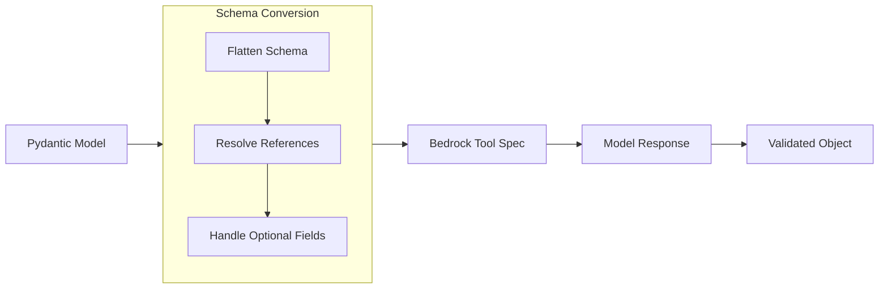

# Structured Output

Structured output enables you to get type-safe, validated responses from language models using Pydantic models. Instead of receiving raw text that you need to parse, you can define the exact structure you want and receive a validated Python object that matches your schema.

## What is Structured Output?

Structured output is a feature that allows you to constrain language model responses to follow a specific schema defined by a Pydantic model. This ensures that the model's response is properly formatted, validated, and type-safe, eliminating the need for manual parsing and validation of text responses. Structured output transforms how you work with language model responses, providing type safety, validation, and clear data contracts that make your applications more robust and maintainable.



Key benefits include:

- **Type Safety**: Get properly typed Python objects instead of raw strings
- **Automatic Validation**: Pydantic validates the model's response against your schema
- **Documentation**: Your schema serves as clear documentation of expected output
- **IDE Support**: Full autocomplete and type checking for response data
- **Error Prevention**: Catch malformed responses early in development

## How It Works

The structured output system converts your Pydantic models into tool specifications that guide the language model to produce correctly formatted responses.
Some combinations of model providers, LLMs, and SDKs support passing a Pydantic `BaseModel` directly, in which case we use that natively.

### The Conversion Process

1. **Schema Generation**: Pydantic generates a JSON schema from your model
2. **Reference Resolution**: The system resolves `$ref` references and flattens nested definitions
3. **Tool Specification**: The schema is converted to a Bedrock tool specification
4. **Model Invocation**: The model receives the tool spec and generates structured output
5. **Validation**: The response is validated against your original Pydantic model

```python
from pydantic import BaseModel
from strands import Agent

class Weather(BaseModel):
    """Weather information for a specific time."""
    time: str
    weather: str
    temperature: Optional[float] = None

agent = Agent()
result = agent.structured_output(Weather, "The time is 12:00 and the weather is sunny")
# Returns a validated Weather object
```

## Core Components

### Pydantic Model Definition

Define your desired output structure using Pydantic models. Strands will use the docstring and field descriptions to guide the model.

```python
from pydantic import BaseModel, Field
from typing import Optional, List

class WeatherForecast(BaseModel):
    """Complete weather forecast information."""
    location: str = Field(description="The location for this forecast")
    current_time: str = Field(description="Current time in HH:MM format")
    current_weather: str = Field(description="Current weather conditions")
    temperature: Optional[float] = Field(default=None, description="Temperature in Celsius")
    forecast_days: List[str] = Field(default_factory=list, description="Multi-day forecast")
```

### Agent Integration

The `Agent.structured_output()` method provides the main interface:

```python
def structured_output(self, output_model: Type[BaseModel], prompt: Optional[str] = None) -> BaseModel:
    """Get structured output from the agent.
    
    Args:
        output_model: The Pydantic model defining the expected structure
        prompt: Optional prompt to add to the conversation
        
    Returns:
        A validated instance of output_model
    """
```

## Usage Patterns

### Basic Usage

Extract structured information from text:

```python
from pydantic import BaseModel
from strands import Agent

class PersonInfo(BaseModel):
    name: str
    age: int
    occupation: str

agent = Agent()
result = agent.structured_output(
    PersonInfo, 
    "John Smith is a 30-year-old software engineer"
)

print(f"Name: {result.name}")      # "John Smith"
print(f"Age: {result.age}")        # 30
print(f"Job: {result.occupation}") # "software engineer"
```

### Using Conversation History

Structured output can work with existing conversation context:

```python
agent = Agent()

# Build up conversation context
agent("What do you know about Paris, France?")
agent("Tell me about the weather there in spring.")

# Extract structured information without additional prompt
class CityInfo(BaseModel):
    city: str
    country: str
    population: Optional[int] = None
    climate: str

# Uses existing conversation context
result = agent.structured_output(CityInfo)
```

### Complex Nested Models

Handle sophisticated data structures:

```python
from typing import List
from pydantic import BaseModel, Field

class Address(BaseModel):
    street: str
    city: str
    country: str
    postal_code: Optional[str] = None

class Contact(BaseModel):
    email: Optional[str] = None
    phone: Optional[str] = None

class Person(BaseModel):
    """Complete person information."""
    name: str = Field(description="Full name of the person")
    age: int = Field(description="Age in years")
    address: Address = Field(description="Home address")
    contacts: List[Contact] = Field(default_factory=list, description="Contact methods")
    skills: List[str] = Field(default_factory=list, description="Professional skills")

agent = Agent()
result = agent.structured_output(
    Person,
    "Extract info: Jane Doe, a systems admin, 28, lives at 123 Main St, New York, NY. Email: jane@example.com"
)

print(result.name)                    # "Jane Doe"
print(result.address.city)            # "New York"
print(result.contacts[0].email)       # "jane@example.com"
print(results.skills)                 # ["systems admin"]
```

## Advanced Features

### Optional vs Required Fields

The system properly handles optional and required fields:

```python
class ProductInfo(BaseModel):
    name: str                           # Required
    price: float                        # Required
    description: Optional[str] = None   # Optional - can be null
    category: str = "General"           # Optional with default
    tags: List[str] = Field(default_factory=list)  # Optional list
```

Required fields must be provided by the model, while optional fields can be omitted or set to null.

### Field Documentation

Use Pydantic's `Field` for detailed documentation:

```python
class AnalysisResult(BaseModel):
    """Results from data analysis."""
    
    confidence_score: float = Field(
        description="Confidence level from 0.0 to 1.0",
        ge=0.0,
        le=1.0
    )
    
    summary: str = Field(
        description="Brief summary of findings",
        min_length=10,
        max_length=500
    )
    
    recommendations: List[str] = Field(
        description="List of actionable recommendations",
        min_items=1
    )
```

### Error Handling

Handle validation errors gracefully:

```python
from pydantic import ValidationError

try:
    result = agent.structured_output(MyModel, prompt)
except ValidationError as e:
    print(f"Model validation failed: {e}")
    # Handle the validation error appropriately
except Exception as e:
    print(f"Unexpected error: {e}")
```

### Integration with Tool System

Structured output leverages the SDK's tool system:

1. **Tool Specification**: Pydantic models become tool specifications
2. **Model Invocation**: The model receives tools it can "use" to structure responses
3. **Response Processing**: Tool responses are validated against the original model
4. **Type Safety**: The final result is a properly typed Pydantic instance

## Best Practices

### Model Design

**Keep models focused and specific:**

```python
# Good - specific, focused model
class EmailSummary(BaseModel):
    subject: str
    sender: str
    key_points: List[str]
    action_required: bool

# Avoid - overly broad, unclear purpose
class GenericData(BaseModel):
    stuff: Any
    things: List[Any]
```

**Use descriptive field names and documentation:**

```python
class TaskAnalysis(BaseModel):
    """Analysis of a project task."""
    
    estimated_hours: float = Field(description="Estimated completion time in hours")
    difficulty_level: int = Field(description="Difficulty from 1-5 (5 being hardest)")
    required_skills: List[str] = Field(description="Skills needed to complete the task")
```

**Design for validation:**

```python
class UserPreferences(BaseModel):
    theme: Literal["light", "dark", "auto"] = "auto"
    font_size: int = Field(ge=8, le=24, default=12)
    notifications: bool = True
```

### Error Handling Strategies

**Validate business logic:**

```python
from pydantic import validator

class TimeRange(BaseModel):
    start_time: str
    end_time: str
    
    @validator('end_time')
    def end_after_start(cls, v, values):
        if 'start_time' in values and v <= values['start_time']:
            raise ValueError('end_time must be after start_time')
        return v
```

### Integration with Agent Workflow

**Combine with regular conversation:**

```python
agent = Agent()

# Regular conversation to gather context
agent("I need to analyze this sales data: [data here]")
agent("Focus on trends and key insights")

# Extract structured insights
class SalesAnalysis(BaseModel):
    total_revenue: float
    growth_rate: float
    top_products: List[str]
    insights: List[str]

analysis = agent.structured_output(SalesAnalysis)
```

**Use for data transformation:**

```python
# Transform unstructured input to structured output
raw_text = "Customer complaint: Order #12345, shipped late, wants refund"

class CustomerIssue(BaseModel):
    issue_type: Literal["complaint", "inquiry", "compliment"]
    order_id: Optional[str] = None
    priority: Literal["low", "medium", "high"] = Field(default="medium", description="The priority of the issue. Refund and complaint is high.")
    resolution_needed: bool

issue = agent.structured_output(CustomerIssue, raw_text)
```
