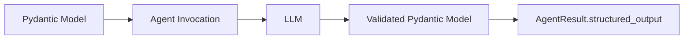

# Structured Output

!!! New
    We have revamped the devx for structured output and deprecated the `structured_output_async` and `structured_output` methods. The following guide details how to use structured output.

## Introduction

Structured output enables you to get type-safe, validated responses from language models using [Pydantic](https://docs.pydantic.dev/latest/concepts/models/) models. Instead of receiving raw text that you need to parse, you can define the exact structure you want and receive a validated Python object that matches your schema. This transforms unstructured LLM outputs into reliable, program-friendly data structures that integrate seamlessly with your application's type system and validation rules.



Key benefits:

- **Type Safety**: Get typed Python objects instead of raw strings
- **Automatic Validation**: Pydantic validates responses against your schema
- **Clear Documentation**: Schema serves as documentation of expected output
- **IDE Support**: IDE type hinting from LLM-generated responses
- **Error Prevention**: Catch malformed responses early


## Basic Usage

Define an output structure using a Pydantic model. Then, assign the model to the `structured_output_model` parameter when invoking the [`agent`](../../../api-reference/agent.md#strands.agent.agent). Then, access the Structured Output from the [`AgentResult`](../../../api-reference/agent.md#strands.agent.agent_result).

```python
from pydantic import BaseModel, Field
from strands import Agent

# 1) Define the Pydantic model
class PersonInfo(BaseModel):
    """Model that contains information about a Person"""
    name: str = Field(description="Name of the person")
    age: int = Field(description="Age of the person")
    occupation: str = Field(description="Occupation of the person")

# 2) Pass the model to the agent
agent = Agent()
result = agent(
    "John Smith is a 30 year-old software engineer",
    structured_output_model=PersonInfo
)

# 3) Access the `structured_output` from the result
person_info: PersonInfo = result.structured_output
print(f"Name: {person_info.name}")      # "John Smith"
print(f"Age: {person_info.age}")        # 30
print(f"Job: {person_info.occupation}") # "software engineer"
```

???+ tip "Async Support"
    Structured Output is supported with async via the `invoke_async` method:

    ```python
    import asyncio
    agent = Agent()
    result = asyncio.run(
        agent.invoke_async(
            "John Smith is a 30 year-old software engineer",
            structured_output_model=PersonInfo
        )
    )
    ```

## More Information

### How It Works

The structured output system converts your Pydantic models into tool specifications that guide the language model to produce correctly formatted responses. All of the model providers supported in Strands can work with Structured Output.

Strands handles this by accepting the `structured_output_model` parameter in [`agent`](../../../api-reference/agent.md#strands.agent.agent) invocations, which manages the conversion, validation, and response processing automatically. The validated result is available in the `AgentResult.structured_output` field.


### Error Handling

In the event there is an issue with parsing the structured output, Strands will throw a custom `StructuredOutputException` that can be caught and handled appropriately:

```python
from pydantic import ValidationError
from strands.types.exceptions import StructuredOutputException

try:
    result = agent(prompt, structured_output_model=MyModel)
except StructuredOutputException as e:
    print(f"Structured output failed: {e}")
```

### Migration from Legacy API

!!! warning "Deprecated API"
    The `Agent.structured_output()` and `Agent.structured_output_async()` methods are deprecated. Use the new `structured_output_model` parameter approach instead.

#### Before (Deprecated)

```python
# Old approach - deprecated
result = agent.structured_output(PersonInfo, "John is 30 years old")
print(result.name)  # Direct access to model fields
```

#### After (Recommended)

```python
# New approach - recommended
result = agent("John is 30 years old", structured_output_model=PersonInfo)
print(result.structured_output.name)  # Access via structured_output field
```

### Best Practices

- **Keep models focused**: Define specific models for clear purposes
- **Use descriptive field names**: Include helpful descriptions with `Field`
- **Handle errors gracefully**: Implement proper error handling strategies with fallbacks

### Related Documentation

Refer to Pydantic documentation for details on:

- [Models and schema definition](https://docs.pydantic.dev/latest/concepts/models/)
- [Field types and constraints](https://docs.pydantic.dev/latest/concepts/fields/)
- [Custom validators](https://docs.pydantic.dev/latest/concepts/validators/)

## Cookbook

### Auto Retries with Validation

Automatically retry validation when initial extraction fails due to field validators:

```python
from strands.agent import Agent
from pydantic import BaseModel, field_validator


class Name(BaseModel):
    first_name: str

    @field_validator("first_name")
    @classmethod
    def validate_first_name(cls, value: str) -> str:
        if not value.endswith('abc'):
            raise ValueError("You must append 'abc' to the end of my name")
        return value 


agent = Agent() 
result = agent("What is Aaron's name?", structured_output_model=Name)
```

### Streaming Structured Output

Stream structured output progressively while maintaining type safety and validation:

```python
from strands import Agent
from pydantic import BaseModel, Field

class WeatherForecast(BaseModel):
    """Weather forecast data."""
    location: str
    temperature: int
    condition: str
    humidity: int
    wind_speed: int
    forecast_date: str

streaming_agent = Agent()

async for event in streaming_agent.stream_async(
    "Generate a weather forecast for Seattle: 68°F, partly cloudy, 55% humidity, 8 mph winds, for tomorrow",
    structured_output_model=WeatherForecast
):
    if "data" in event:
        print(event["data"], end="", flush=True)
    elif "result" in event:
        print(f'The forcast for today is: {event["result"].structured_output}')
```

### Combining with Tools

Combine structured output with tool usage to format tool execution results:

```python
from strands import Agent
from strands_tools import calculator
from pydantic import BaseModel, Field

class MathResult(BaseModel):
    operation: str = Field(description="the performed operation")
    result: int = Field(description="the result of the operation")

tool_agent = Agent(
    tools=[calculator]
)
res = tool_agent("What is 42 + 8", structured_output_model=MathResult)
```

### Multiple Output Types

Reuse a single agent instance with different structured output models for varied extraction tasks:

```python
from strands import Agent
from pydantic import BaseModel, Field
from typing import Optional

class Person(BaseModel):
    """A person's basic information"""
    name: str = Field(description="Full name")
    age: int = Field(description="Age in years", ge=0, le=150)
    email: str = Field(description="Email address")
    phone: Optional[str] = Field(description="Phone number", default=None)

class Task(BaseModel):
    """A task or todo item"""
    title: str = Field(description="Task title")
    description: str = Field(description="Detailed description")
    priority: str = Field(description="Priority level: low, medium, high")
    completed: bool = Field(description="Whether task is completed", default=False)


agent = Agent()
person_res = agent("Extract person: John Doe, 35, john@test.com", structured_output_model=Person)
task_res = agent("Create task: Review code, high priority, completed", structured_output_model=Task)
```

### Using Conversation History

Extract structured information from prior conversation context without repeating questions:

```python
from strands import Agent
from pydantic import BaseModel
from typing import Optional

agent = Agent()

# Build up conversation context
agent("What do you know about Paris, France?")
agent("Tell me about the weather there in spring.")

class CityInfo(BaseModel):
    city: str
    country: str
    population: Optional[int] = None
    climate: str

# Extract structured information from the conversation
result = agent(
    "Extract structured information about Paris from our conversation",
    structured_output_model=CityInfo
)

print(f"City: {result.structured_output.city}")     # "Paris"
print(f"Country: {result.structured_output.country}") # "France"
```


### Agent-Level Defaults

You can also set a default structured output model that applies to all agent invocations:

```python
class PersonInfo(BaseModel):
    name: str
    age: int
    occupation: str

# Set default structured output model for all invocations
agent = Agent(structured_output_model=PersonInfo)
result = agent("John Smith is a 30 year-old software engineer")

print(f"Name: {result.structured_output.name}")      # "John Smith"
print(f"Age: {result.structured_output.age}")        # 30
print(f"Job: {result.structured_output.occupation}") # "software engineer"
```

!!! note "Note"
    Since this is on the agent init level, not the invocation level, the expectation is that the agent will attempt structured output for each invocation.


### Overriding Agent Defaults

Even when you set a default `structured_output_model` at the agent initialization level, you can override it for specific invocations by passing a different `structured_output_model` during the agent invocation:

```python
class PersonInfo(BaseModel):
    name: str
    age: int
    occupation: str

class CompanyInfo(BaseModel):
    name: str
    industry: str
    employees: int

# Agent with default PersonInfo model
agent = Agent(structured_output_model=PersonInfo)

# Override with CompanyInfo for this specific call
result = agent(
    "TechCorp is a software company with 500 employees",
    structured_output_model=CompanyInfo
)

print(f"Company: {result.structured_output.name}")      # "TechCorp"
print(f"Industry: {result.structured_output.industry}") # "software"
print(f"Size: {result.structured_output.employees}")    # 500
```

## Token Management

When working with structured output in production applications, managing token usage is critical to avoid "too many tokens" exceptions and ensure reliable operation. Language models have fixed context windows (maximum tokens they can process), and exceeding these limits will cause your application to fail. This section provides practical strategies and examples for managing tokens effectively when using structured output.

Token management becomes especially important when:

- Processing large documents or files that exceed context windows
- Building up long conversation histories over multiple interactions
- Extracting complex structured information that requires detailed prompts
- Working with nested Pydantic models that increase token overhead

The following strategies can be used individually or combined to handle different token management scenarios:

## Quick Reference

| Scenario | Recommended Strategy | Section |
|----------|---------------------|---------|
| Long conversations | Conversation Managers | [Strategy 1](#strategy-1-using-conversation-managers) |
| Large documents/files | Chunking | [Strategy 5](#strategy-5-chunking-large-inputs) |
| Cost optimization | Schema Optimization | [Strategy 3](#strategy-3-optimizing-schemas-and-prompts) |
| Production monitoring | Callback Handlers | [Strategy 2](#strategy-2-monitoring-with-callback-handlers) |
| Error recovery | Error Handling | [Strategy 4](#strategy-4-error-handling-and-recovery) |
| Previous conversation context | Conversation History Management | [Strategy 6](#strategy-6-managing-long-conversation-history) |

!!! warning "Common Pitfalls"
    - **Don't ignore token limits**: Unhandled token exceptions will crash your application
    - **Schema overhead matters**: Complex Pydantic models consume tokens even before processing input
    - **Conversation history grows**: Each interaction adds to token count - use conversation managers
    - **Test with realistic data**: Token usage varies significantly with actual production data

### Understanding Token Limits

Tokens are the basic units of text that language models process. A token is roughly equivalent to 4 characters or 0.75 words in English. For example, the sentence "Hello, how are you?" contains approximately 6 tokens.

Every language model has a maximum context window - the total number of tokens it can process in a single request. This includes both input tokens (your prompt, conversation history, schema definitions) and output tokens (the model's response). Common context windows include:

- **Claude 3.5 Sonnet**: 200,000 tokens (~150,000 words)
- **GPT-4**: 8,000-128,000 tokens depending on version
- **Claude 3 Haiku**: 200,000 tokens (~150,000 words)

When using structured output, several factors contribute to token usage:

- **Pydantic schema**: Field names, descriptions, and model structure
- **Conversation history**: Previous messages in the conversation
- **Input text**: The document or data you're processing
- **System prompts**: Instructions for the model
- **Output structure**: The generated structured response

Exceeding the context window results in errors that halt your application. Effective token management ensures reliable operation and optimal performance.

### Strategy 1: Using Conversation Managers

Conversation managers automatically handle token limits by managing conversation history. They're the simplest way to prevent token overflow without manual intervention. Strands provides built-in conversation managers that work seamlessly with structured output.

#### Using SlidingWindowConversationManager

The [`SlidingWindowConversationManager`](../../../api-reference/agent.md#strands.agent.conversation_manager.sliding_window_conversation_manager.SlidingWindowConversationManager) maintains a fixed number of recent messages, automatically removing older messages when the window is full. This is ideal for applications with ongoing conversations where recent context is most important.

```python
from strands import Agent
from strands.agent.conversation_manager import SlidingWindowConversationManager
from pydantic import BaseModel, Field
from typing import List

class DocumentSummary(BaseModel):
    """Summary of a document with key points"""
    title: str = Field(description="Document title")
    key_points: List[str] = Field(description="Main points from the document")
    sentiment: str = Field(description="Overall sentiment: positive, negative, or neutral")

# Create agent with sliding window to prevent token overflow
agent = Agent(
    conversation_manager=SlidingWindowConversationManager(
        window_size=20,  # Keep only the 20 most recent messages
        should_truncate_results=True  # Truncate large tool results if needed
    )
)

# Simulate a long conversation with multiple document analyses
documents = [
    "Document 1: Our Q1 results show strong growth...",
    "Document 2: Customer feedback has been overwhelmingly positive...",
    "Document 3: The new product launch exceeded expectations...",
    # ... many more documents
]

for doc in documents:
    result = agent(
        f"Analyze this document: {doc}",
        structured_output_model=DocumentSummary
    )
    print(f"Title: {result.structured_output.title}")
    print(f"Sentiment: {result.structured_output.sentiment}")

# The sliding window automatically removes old messages
# so the conversation never exceeds token limits
```

**How it works:**

- The conversation manager maintains only the most recent 20 messages
- When new messages are added, older messages are automatically removed
- If a single message exceeds the context window, tool results can be truncated
- The agent continues to function without manual context management

**When to use:**

- Long-running conversations with many interactions
- Applications where recent context is more important than full history
- Scenarios where you want automatic, hands-off token management

#### Using SummarizingConversationManager

The [`SummarizingConversationManager`](../../../api-reference/agent.md#strands.agent.conversation_manager.summarizing_conversation_manager.SummarizingConversationManager) preserves important information from older messages by summarizing them instead of discarding them. This maintains context while reducing token usage, making it ideal when historical information matters.

```python
from strands import Agent
from strands.agent.conversation_manager import SummarizingConversationManager
from pydantic import BaseModel, Field
from typing import List, Optional

class MeetingInsights(BaseModel):
    """Insights extracted from meeting discussions"""
    decisions_made: List[str] = Field(description="Key decisions from the meeting")
    action_items: List[str] = Field(description="Action items assigned")
    open_questions: List[str] = Field(description="Unresolved questions")
    next_steps: Optional[str] = Field(description="Planned next steps", default=None)

# Create agent with summarizing conversation manager
agent = Agent(
    conversation_manager=SummarizingConversationManager(
        summary_ratio=0.3,  # Summarize 30% of messages when reducing context
        preserve_recent_messages=10  # Always keep the 10 most recent messages
    )
)

# Simulate a long meeting with multiple discussion topics
meeting_transcript = [
    "Let's discuss the Q4 roadmap. We need to prioritize features...",
    "I think we should focus on the mobile app improvements first...",
    "What about the API performance issues? Those are critical...",
    "Good point. Let's assign Sarah to investigate the API bottlenecks...",
    "We also need to consider the budget constraints for Q4...",
    # ... many more discussion points
]

# Process the entire meeting transcript
for statement in meeting_transcript:
    agent(statement)

# Extract structured insights from the entire conversation
# The summarization preserves key information from earlier in the meeting
result = agent(
    "Based on our entire meeting discussion, extract the key insights",
    structured_output_model=MeetingInsights
)

print(f"Decisions: {result.structured_output.decisions_made}")
print(f"Action Items: {result.structured_output.action_items}")
print(f"Open Questions: {result.structured_output.open_questions}")
```

**How it works:**

- When context reduction is needed, older messages are summarized rather than deleted
- Recent messages (last 10 in this example) are always preserved in full
- Summaries maintain key information while using fewer tokens
- The agent can still reference historical context when extracting structured output

**Trade-offs compared to SlidingWindowConversationManager:**

| Feature | SlidingWindow | Summarizing |
|---------|--------------|-------------|
| **Token Efficiency** | High (discards old messages) | Medium (keeps summaries) |
| **Context Preservation** | Low (loses old information) | High (maintains key points) |
| **Processing Overhead** | Minimal | Higher (requires summarization) |
| **Best For** | Recent context only | Full conversation context |

**When to use:**

- Applications where historical context is important
- Meeting analysis, customer support, or consultation scenarios
- When you need to extract insights from long conversations
- Cases where losing early conversation details would be problematic

### Strategy 2: Monitoring with Callback Handlers

Proactive monitoring helps you identify token usage patterns and catch potential issues before they cause failures. Callback handlers in Strands can be simple functions or callable classes. We'll start with the function-based approach, then show a more sophisticated class-based tracker for production use.

#### Simple Token Monitoring

The simplest approach is to use a callback function that tracks token usage from the AgentResult:

```python
from strands import Agent
from pydantic import BaseModel, Field
from typing import List

class ProductReview(BaseModel):
    """Structured product review"""
    product_name: str = Field(description="Name of the product")
    rating: int = Field(description="Rating from 1-5", ge=1, le=5)
    pros: List[str] = Field(description="Positive aspects")
    cons: List[str] = Field(description="Negative aspects")

def token_monitor(**kwargs):
    """Simple callback to track token usage"""
    if "result" in kwargs:
        result = kwargs["result"]
        usage = result.metrics.accumulated_usage
        input_tokens = usage.get('inputTokens', 0)
        output_tokens = usage.get('outputTokens', 0)
        total = input_tokens + output_tokens
        print(f"Tokens - Input: {input_tokens}, Output: {output_tokens}, Total: {total}")

# Create agent with token monitoring
agent = Agent(callback_handler=token_monitor)

# Process reviews with automatic token tracking
reviews = [
    "The XYZ Laptop is amazing! Great performance and battery life, though a bit pricey.",
    "ABC Headphones have excellent sound quality but uncomfortable for long use.",
]

for review_text in reviews:
    result = agent(
        f"Extract structured information from this review: {review_text}",
        structured_output_model=ProductReview
    )
    print(f"Processed: {result.structured_output.product_name}\n")
```

**Example Output:**

```
Tokens - Input: 1250, Output: 180, Total: 1430
Processed: XYZ Laptop

Tokens - Input: 1420, Output: 165, Total: 1585
Processed: ABC Headphones
```

#### Advanced Monitoring with Warnings

For production applications, you can build a more sophisticated monitoring system using a class-based approach that tracks cumulative usage and warns when approaching limits:

```python
from strands import Agent
from pydantic import BaseModel, Field
from typing import List

class ProductReview(BaseModel):
    """Structured product review"""
    product_name: str = Field(description="Name of the product")
    rating: int = Field(description="Rating from 1-5", ge=1, le=5)
    pros: List[str] = Field(description="Positive aspects")
    cons: List[str] = Field(description="Negative aspects")

class TokenTracker:
    """Track token usage across multiple requests with warnings"""
    
    def __init__(self, warning_threshold: int = 160000, model_context_window: int = 200000):
        self.warning_threshold = warning_threshold
        self.model_context_window = model_context_window
        self.total_input_tokens = 0
        self.total_output_tokens = 0
        self.request_count = 0
    
    def __call__(self, **kwargs):
        """Callback function to track tokens"""
        if "result" in kwargs:
            result = kwargs["result"]
            usage = result.metrics.accumulated_usage
            input_tokens = usage.get('inputTokens', 0)
            output_tokens = usage.get('outputTokens', 0)
            total = input_tokens + output_tokens
            
            # Update cumulative totals
            self.total_input_tokens += input_tokens
            self.total_output_tokens += output_tokens
            self.request_count += 1
            
            print(f"Request #{self.request_count} - Input: {input_tokens}, Output: {output_tokens}, Total: {total}")
            
            # Warn if approaching context window limit
            if total >= self.warning_threshold:
                usage_pct = (total / self.model_context_window) * 100
                print(f"⚠️  WARNING: Token usage at {usage_pct:.1f}% of context window!")
    
    def get_summary(self):
        """Get summary of token usage"""
        total = self.total_input_tokens + self.total_output_tokens
        avg = total / self.request_count if self.request_count > 0 else 0
        return {
            'total_requests': self.request_count,
            'total_input_tokens': self.total_input_tokens,
            'total_output_tokens': self.total_output_tokens,
            'total_tokens': total,
            'avg_tokens_per_request': avg
        }

# Create tracker and agent
tracker = TokenTracker(warning_threshold=160000, model_context_window=200000)
agent = Agent(callback_handler=tracker)

# Process reviews
reviews = [
    "The XYZ Laptop is amazing! Great performance and battery life, though a bit pricey.",
    "ABC Headphones have excellent sound quality but uncomfortable for long use.",
]

for review_text in reviews:
    result = agent(
        f"Extract structured information from this review: {review_text}",
        structured_output_model=ProductReview
    )
    print(f"Processed: {result.structured_output.product_name}\n")

# Get summary
summary = tracker.get_summary()
print(f"Token Usage Summary:")
print(f"Total Requests: {summary['total_requests']}")
print(f"Total Tokens: {summary['total_tokens']}")
print(f"Average per Request: {summary['avg_tokens_per_request']:.0f}")
```

**Example Output:**

```
Request #1 - Input: 1250, Output: 180, Total: 1430
Processed: XYZ Laptop

Request #2 - Input: 1420, Output: 165, Total: 1585
Processed: ABC Headphones

Token Usage Summary:
Total Requests: 2
Total Tokens: 3015
Average per Request: 1508
```

**Benefits of token monitoring:**

- **Early Warning**: Catch token usage issues before they cause failures
- **Cost Tracking**: Monitor token consumption for billing and optimization
- **Performance Insights**: Identify which operations consume the most tokens
- **Debugging**: Understand token usage patterns in your application

#### Accessing Token Metrics Directly

You can also access token metrics directly from the AgentResult without using callbacks:

```python
from strands import Agent
from pydantic import BaseModel

class Summary(BaseModel):
    text: str

agent = Agent()
result = agent("Summarize this document...", structured_output_model=Summary)

# Access token usage from result
usage = result.metrics.accumulated_usage
print(f"Input tokens: {usage.get('inputTokens', 0)}")
print(f"Output tokens: {usage.get('outputTokens', 0)}")

# Check for cache usage (if caching is enabled)
cache_read = usage.get('cacheReadInputTokens', 0)
cache_write = usage.get('cacheWriteInputTokens', 0)
if cache_read > 0:
    print(f"Cache read tokens: {cache_read}")
if cache_write > 0:
    print(f"Cache write tokens: {cache_write}")
```

### Strategy 3: Optimizing Schemas and Prompts

The design of your Pydantic models directly impacts token usage. Verbose schemas with many fields, long descriptions, and deep nesting consume more tokens. Optimizing your schemas can significantly reduce token overhead while maintaining functionality.

#### Before: Verbose Schema

```python
from pydantic import BaseModel, Field
from typing import List, Optional
from datetime import datetime

class VerboseArticleAnalysis(BaseModel):
    """
    This is a comprehensive model for analyzing articles with detailed information
    about various aspects of the content, including metadata, content analysis,
    and recommendations for improvement.
    """
    article_title: str = Field(
        description="The complete title of the article as it appears in the document"
    )
    article_subtitle: Optional[str] = Field(
        description="The subtitle or secondary heading of the article if one exists",
        default=None
    )
    author_full_name: str = Field(
        description="The complete name of the author who wrote this article"
    )
    author_email_address: Optional[str] = Field(
        description="The email address of the author if available in the document",
        default=None
    )
    publication_date: Optional[str] = Field(
        description="The date when this article was originally published",
        default=None
    )
    last_updated_date: Optional[str] = Field(
        description="The date when this article was most recently updated or modified",
        default=None
    )
    primary_topic: str = Field(
        description="The main topic or subject matter that this article discusses"
    )
    secondary_topics: List[str] = Field(
        description="Additional topics or themes that are covered in the article",
        default_factory=list
    )
    target_audience_description: str = Field(
        description="A description of the intended audience for this article"
    )
    estimated_reading_time_minutes: Optional[int] = Field(
        description="Approximate time in minutes required to read the entire article",
        default=None
    )
    content_summary: str = Field(
        description="A comprehensive summary of the main points and arguments presented in the article"
    )
    key_takeaways: List[str] = Field(
        description="The most important points or lessons that readers should remember from this article"
    )
    strengths_of_article: List[str] = Field(
        description="Positive aspects and strong points of the article's content and presentation"
    )
    weaknesses_of_article: List[str] = Field(
        description="Areas where the article could be improved or aspects that are lacking"
    )
    recommendations_for_improvement: List[str] = Field(
        description="Specific suggestions for how the article could be enhanced or made better"
    )

# Using the verbose schema
agent = Agent()
result = agent(
    "Analyze this article: [article text]",
    structured_output_model=VerboseArticleAnalysis
)

# Approximate token overhead: ~800-1000 tokens just for the schema
```

**Problems with this schema:**

- Overly detailed field descriptions that repeat information
- Too many optional fields that may not always be needed
- Redundant fields (e.g., separate strengths/weaknesses/recommendations)
- Verbose field names that could be shorter
- Unnecessary model docstring that duplicates field information

#### After: Optimized Schema

```python
from pydantic import BaseModel, Field
from typing import List, Optional

class ArticleAnalysis(BaseModel):
    """Article analysis results"""
    title: str
    author: str
    topic: str = Field(description="Main topic")
    summary: str = Field(description="Key points")
    takeaways: List[str] = Field(description="Main lessons")
    feedback: List[str] = Field(description="Strengths, weaknesses, and suggestions")
    reading_time: Optional[int] = None

# Using the optimized schema
agent = Agent()
result = agent(
    "Analyze this article: [article text]",
    structured_output_model=ArticleAnalysis
)

# Approximate token overhead: ~200-300 tokens for the schema
# Token savings: ~500-700 tokens (60-70% reduction)
```

**Improvements made:**

- **Concise descriptions**: Only where needed for clarity
- **Merged related fields**: Combined strengths/weaknesses/recommendations into single `feedback` field
- **Shorter field names**: `article_title` → `title`, `author_full_name` → `author`
- **Removed redundancy**: Eliminated unnecessary optional fields
- **Simplified docstring**: Brief, informative description
- **Focused scope**: Only essential information

**Token savings comparison:**

| Aspect | Verbose Schema | Optimized Schema | Savings |
|--------|---------------|------------------|---------|
| Schema tokens | ~800-1000 | ~200-300 | 60-70% |
| Field count | 15 fields | 7 fields | 53% |
| Description length | ~500 chars | ~100 chars | 80% |

**Result**: Same functionality with significantly lower token overhead, allowing for longer input text or more conversation history.

#### Best Practices for Schema Optimization

**Field Descriptions:**

- Only add descriptions when the field name isn't self-explanatory
- Keep descriptions under 10 words when possible
- Avoid repeating the field name in the description
- Use descriptions to clarify constraints or expected formats

**Field Design:**

- Use shorter, clear field names (`email` instead of `email_address`)
- Combine related fields into lists or nested objects
- Make fields optional only when truly needed
- Use enums for fields with limited valid values

**Model Structure:**

- Keep models flat when possible (avoid deep nesting)
- Split complex models into smaller, focused models
- Remove fields that can be derived from other fields
- Consider whether all fields are necessary for your use case

**Prompt Optimization:**

```python
# Instead of verbose prompts:
prompt = """
Please carefully analyze the following article and extract all relevant 
information including the title, author, main topics, and provide a 
comprehensive summary of the content along with key takeaways.
"""

# Use concise prompts:
prompt = "Analyze this article and extract key information."
```

The model understands the task from your schema definition, so prompts can be brief.

### Strategy 4: Error Handling and Recovery

Even with proactive token management, you may encounter token limit exceptions. Implementing robust error handling ensures your application can recover gracefully from these failures.

#### Basic Exception Handling

```python
from strands import Agent
from strands.types.exceptions import StructuredOutputException
from pydantic import BaseModel, Field
from typing import List
import logging

logger = logging.getLogger(__name__)

class DataExtraction(BaseModel):
    """Extracted data from document"""
    key_points: List[str]
    summary: str
    category: str

def extract_with_error_handling(agent: Agent, document: str, model: type[BaseModel]):
    """Extract structured data with proper error handling"""
    try:
        result = agent(
            f"Extract information from: {document}",
            structured_output_model=model
        )
        return result.structured_output
    
    except StructuredOutputException as e:
        error_msg = str(e).lower()
        
        # Check if it's a token-related error
        if "token" in error_msg or "context" in error_msg or "length" in error_msg:
            logger.error(f"Token limit exceeded: {e}")
            logger.info("Consider using conversation managers or chunking the input")
            return None
        
        # Check if it's a validation error
        elif "validation" in error_msg:
            logger.error(f"Validation failed: {e}")
            logger.info("Check your Pydantic model constraints")
            return None
        
        else:
            logger.error(f"Structured output failed: {e}")
            raise
    
    except Exception as e:
        logger.error(f"Unexpected error: {e}")
        raise

# Usage
agent = Agent()
result = extract_with_error_handling(
    agent,
    "Long document text...",
    DataExtraction
)

if result:
    print(f"Extracted: {result.summary}")
else:
    print("Extraction failed - check logs for details")
```

#### Retry with Context Reduction

```python
from strands import Agent
from strands.agent.conversation_manager import SlidingWindowConversationManager
from strands.types.exceptions import StructuredOutputException
from pydantic import BaseModel
from typing import Optional
import logging

logger = logging.getLogger(__name__)

class Summary(BaseModel):
    """Document summary"""
    main_points: str
    conclusion: str

def extract_with_retry(
    document: str,
    model: type[BaseModel],
    max_retries: int = 3
) -> Optional[BaseModel]:
    """
    Extract structured output with automatic retry and context reduction.
    
    Args:
        document: Input document text
        model: Pydantic model for structured output
        max_retries: Maximum number of retry attempts
    
    Returns:
        Extracted structured output or None if all retries fail
    """
    # Start with a generous window size
    window_size = 50
    
    for attempt in range(max_retries):
        try:
            # Create agent with progressively smaller context window
            agent = Agent(
                conversation_manager=SlidingWindowConversationManager(
                    window_size=window_size,
                    should_truncate_results=True
                )
            )
            
            result = agent(
                f"Extract information from: {document}",
                structured_output_model=model
            )
            
            logger.info(f"Extraction succeeded on attempt {attempt + 1}")
            return result.structured_output
        
        except StructuredOutputException as e:
            error_msg = str(e).lower()
            
            if "token" in error_msg or "context" in error_msg:
                # Reduce context window for next attempt
                window_size = max(10, window_size - 15)
                logger.warning(
                    f"Attempt {attempt + 1} failed due to token limit. "
                    f"Retrying with window_size={window_size}"
                )
                
                if attempt == max_retries - 1:
                    logger.error("All retry attempts exhausted")
                    return None
            else:
                # Non-token error, don't retry
                logger.error(f"Non-recoverable error: {e}")
                raise
    
    return None

# Usage
result = extract_with_retry(
    "Very long document with extensive content...",
    Summary,
    max_retries=3
)

if result:
    print(f"Summary: {result.main_points}")
else:
    print("Failed to extract after all retries")
```

#### Fallback Strategies

```python
from strands import Agent
from strands.types.exceptions import StructuredOutputException
from pydantic import BaseModel, Field
from typing import List, Optional
import logging

logger = logging.getLogger(__name__)

# Primary model: Detailed extraction
class DetailedAnalysis(BaseModel):
    """Comprehensive document analysis"""
    title: str
    summary: str
    key_points: List[str]
    themes: List[str]
    sentiment: str
    recommendations: List[str]

# Fallback model: Simplified extraction
class BasicAnalysis(BaseModel):
    """Basic document analysis"""
    title: str
    summary: str
    key_points: List[str]

def extract_with_fallback(document: str) -> tuple[BaseModel, str]:
    """
    Extract structured output with fallback to simpler model.
    
    Returns:
        Tuple of (result, model_used)
    """
    agent = Agent()
    
    # Try detailed extraction first
    try:
        result = agent(
            f"Analyze this document: {document}",
            structured_output_model=DetailedAnalysis
        )
        logger.info("Detailed extraction succeeded")
        return result.structured_output, "detailed"
    
    except StructuredOutputException as e:
        if "token" in str(e).lower():
            logger.warning("Detailed extraction failed due to tokens, trying basic extraction")
            
            # Fallback to simpler model
            try:
                result = agent(
                    f"Provide basic analysis: {document[:5000]}",  # Truncate input
                    structured_output_model=BasicAnalysis
                )
                logger.info("Basic extraction succeeded")
                return result.structured_output, "basic"
            
            except StructuredOutputException as e2:
                logger.error(f"Both extraction attempts failed: {e2}")
                
                # Final fallback: Return minimal structure
                return BasicAnalysis(
                    title="Analysis Failed",
                    summary="Unable to process document due to size constraints",
                    key_points=["Document too large for processing"]
                ), "fallback"
        else:
            raise

# Usage
result, model_type = extract_with_fallback("Very long document...")

if model_type == "detailed":
    print(f"Full analysis: {result.recommendations}")
elif model_type == "basic":
    print(f"Basic analysis: {result.summary}")
else:
    print(f"Fallback: {result.summary}")
```

**Fallback strategy decision tree:**

1. **Try primary approach**: Full model with complete input
2. **If token error**: Reduce model complexity (fewer fields)
3. **If still failing**: Truncate input text
4. **Last resort**: Return minimal valid response with error indication

This ensures your application always returns a valid response, even if it's degraded functionality.

### Strategy 5: Chunking Large Inputs

When processing documents or files that exceed token limits, chunking allows you to split the input into manageable pieces, process each chunk separately, and aggregate the results. This is essential for handling large documents, long transcripts, or extensive data files.

#### Text Chunking Utility

```python
from typing import List
import math

def chunk_text(
    text: str,
    max_chunk_tokens: int = 3000,
    overlap_tokens: int = 200
) -> List[str]:
    """
    Split text into overlapping chunks based on approximate token count.
    
    Args:
        text: Input text to chunk
        max_chunk_tokens: Maximum tokens per chunk (approximate)
        overlap_tokens: Number of tokens to overlap between chunks
    
    Returns:
        List of text chunks with overlap
    """
    # Rough approximation: 1 token ≈ 4 characters
    chars_per_token = 4
    max_chunk_chars = max_chunk_tokens * chars_per_token
    overlap_chars = overlap_tokens * chars_per_token
    
    if len(text) <= max_chunk_chars:
        return [text]
    
    chunks = []
    start = 0
    
    while start < len(text):
        # Calculate end position for this chunk
        end = start + max_chunk_chars
        
        # If not the last chunk, try to break at a sentence boundary
        if end < len(text):
            # Look for sentence endings near the chunk boundary
            search_start = max(start, end - 200)
            sentence_end = max(
                text.rfind('. ', search_start, end),
                text.rfind('! ', search_start, end),
                text.rfind('? ', search_start, end),
                text.rfind('\n\n', search_start, end)
            )
            
            if sentence_end > start:
                end = sentence_end + 1
        
        chunk = text[start:end].strip()
        if chunk:
            chunks.append(chunk)
        
        # Move start position with overlap
        start = end - overlap_chars
        
        # Ensure we make progress
        if start <= chunks[-1] if chunks else 0:
            start = end
    
    return chunks

def estimate_tokens(text: str) -> int:
    """Estimate token count for text (rough approximation)"""
    return len(text) // 4

# Example usage
large_document = "..." * 10000  # Very long text
chunks = chunk_text(large_document, max_chunk_tokens=3000, overlap_tokens=200)

print(f"Split document into {len(chunks)} chunks")
for i, chunk in enumerate(chunks):
    print(f"Chunk {i+1}: ~{estimate_tokens(chunk)} tokens")
```

**Key features:**

- **Smart boundaries**: Attempts to break at sentence endings to maintain context
- **Overlap**: Includes overlap between chunks to preserve context across boundaries
- **Token estimation**: Uses character-based approximation (1 token ≈ 4 characters)
- **Flexible sizing**: Configurable chunk size and overlap

#### Processing Large Documents with Chunking

```python
from strands import Agent
from pydantic import BaseModel, Field
from typing import List, TypeVar

T = TypeVar('T', bound=BaseModel)

class ChunkInsights(BaseModel):
    """Insights extracted from a document chunk"""
    key_points: List[str] = Field(description="Main points from this section")
    entities: List[str] = Field(description="Important names, places, or terms")
    topics: List[str] = Field(description="Topics discussed")

class AggregatedInsights(BaseModel):
    """Combined insights from all chunks"""
    all_key_points: List[str]
    all_entities: List[str]
    all_topics: List[str]
    summary: str

def process_large_document(
    document: str,
    chunk_model: type[T],
    max_chunk_tokens: int = 3000
) -> List[T]:
    """
    Process a large document by chunking and extracting structured output from each chunk.
    
    Args:
        document: Large document text
        chunk_model: Pydantic model for chunk-level extraction
        max_chunk_tokens: Maximum tokens per chunk
    
    Returns:
        List of structured outputs, one per chunk
    """
    agent = Agent()
    
    # Split document into chunks
    chunks = chunk_text(document, max_chunk_tokens=max_chunk_tokens)
    print(f"Processing {len(chunks)} chunks...")
    
    results = []
    for i, chunk in enumerate(chunks, 1):
        print(f"Processing chunk {i}/{len(chunks)}...")
        
        result = agent(
            f"Extract insights from this document section (part {i} of {len(chunks)}):\n\n{chunk}",
            structured_output_model=chunk_model
        )
        results.append(result.structured_output)
    
    return results

def aggregate_results(chunk_results: List[ChunkInsights]) -> AggregatedInsights:
    """Aggregate results from multiple chunks into a single summary"""
    agent = Agent()
    
    # Combine all extracted information
    all_points = []
    all_entities = []
    all_topics = []
    
    for result in chunk_results:
        all_points.extend(result.key_points)
        all_entities.extend(result.entities)
        all_topics.extend(result.topics)
    
    # Remove duplicates while preserving order
    all_points = list(dict.fromkeys(all_points))
    all_entities = list(dict.fromkeys(all_entities))
    all_topics = list(dict.fromkeys(all_topics))
    
    # Create a summary of all chunks
    combined_info = f"""
    Key Points: {', '.join(all_points[:10])}
    Entities: {', '.join(all_entities[:10])}
    Topics: {', '.join(all_topics[:10])}
    """
    
    summary_result = agent(
        f"Create a brief summary based on these extracted insights:\n{combined_info}",
        structured_output_model=AggregatedInsights
    )
    
    return summary_result.structured_output

# Usage example
large_document = """
[Very long document text that exceeds token limits...]
This could be a research paper, legal document, book chapter, etc.
"""

# Process document in chunks
chunk_results = process_large_document(
    large_document,
    ChunkInsights,
    max_chunk_tokens=3000
)

# Aggregate results
final_insights = aggregate_results(chunk_results)

print(f"Extracted {len(final_insights.all_key_points)} key points")
print(f"Identified {len(final_insights.all_entities)} entities")
print(f"Summary: {final_insights.summary}")
```

**When to use chunking:**

- Documents longer than ~10,000 tokens (40,000 characters)
- Processing books, research papers, or long reports
- Analyzing transcripts from long meetings or interviews
- Extracting information from large datasets

**Tips for effective chunking:**

- Use overlap to maintain context between chunks
- Break at natural boundaries (paragraphs, sections)
- Include chunk position in prompts ("part 3 of 10")
- Deduplicate results when aggregating
- Consider using a final summarization pass

#### Practical Example: Processing Different File Types

```python
from strands import Agent
from pydantic import BaseModel, Field
from typing import List
import json

class LogEntry(BaseModel):
    """Structured log entry"""
    timestamp: str
    level: str
    message: str
    error_type: str = Field(default="none")

def process_log_file(file_path: str, max_chunk_lines: int = 1000) -> List[LogEntry]:
    """Process large log files by chunking lines"""
    agent = Agent()
    
    with open(file_path, 'r') as f:
        lines = f.readlines()
    
    # Chunk by line count for log files
    chunks = [lines[i:i + max_chunk_lines] for i in range(0, len(lines), max_chunk_lines)]
    
    all_entries = []
    for i, chunk in enumerate(chunks, 1):
        chunk_text = ''.join(chunk)
        print(f"Processing log chunk {i}/{len(chunks)}...")
        
        result = agent(
            f"Extract error entries from these logs:\n{chunk_text}",
            structured_output_model=LogEntry
        )
        all_entries.append(result.structured_output)
    
    return all_entries

def process_csv_file(file_path: str, max_chunk_rows: int = 500) -> List[BaseModel]:
    """Process large CSV files by chunking rows"""
    import csv
    
    agent = Agent()
    
    class RowData(BaseModel):
        """Extracted data from CSV rows"""
        summary: str
        anomalies: List[str]
        row_count: int
    
    with open(file_path, 'r') as f:
        reader = csv.reader(f)
        header = next(reader)
        rows = list(reader)
    
    # Chunk rows
    chunks = [rows[i:i + max_chunk_rows] for i in range(0, len(rows), max_chunk_rows)]
    
    results = []
    for i, chunk in enumerate(chunks, 1):
        # Convert chunk to text representation
        chunk_text = f"Header: {header}\n"
        chunk_text += "\n".join([",".join(row) for row in chunk[:10]])  # Sample
        
        result = agent(
            f"Analyze this CSV data (chunk {i}/{len(chunks)}, {len(chunk)} rows):\n{chunk_text}",
            structured_output_model=RowData
        )
        results.append(result.structured_output)
    
    return results

def process_json_file(file_path: str, max_chunk_items: int = 100) -> List[BaseModel]:
    """Process large JSON arrays by chunking items"""
    agent = Agent()
    
    class JsonInsights(BaseModel):
        """Insights from JSON data"""
        common_patterns: List[str]
        unique_values: List[str]
        item_count: int
    
    with open(file_path, 'r') as f:
        data = json.load(f)
    
    # Assume data is a list
    if isinstance(data, list):
        chunks = [data[i:i + max_chunk_items] for i in range(0, len(data), max_chunk_items)]
        
        results = []
        for i, chunk in enumerate(chunks, 1):
            chunk_text = json.dumps(chunk[:5], indent=2)  # Sample first 5 items
            
            result = agent(
                f"Analyze this JSON data (chunk {i}/{len(chunks)}):\n{chunk_text}",
                structured_output_model=JsonInsights
            )
            results.append(result.structured_output)
        
        return results

# Usage examples
# log_entries = process_log_file("large_application.log", max_chunk_lines=1000)
# csv_results = process_csv_file("large_dataset.csv", max_chunk_rows=500)
# json_insights = process_json_file("large_data.json", max_chunk_items=100)
```

**File-specific chunking strategies:**

| File Type | Chunking Strategy | Boundary Consideration |
|-----------|------------------|------------------------|
| **Text/Markdown** | By character count with sentence boundaries | Break at paragraphs or sections |
| **Log Files** | By line count | Keep related log entries together |
| **CSV** | By row count | Include header in each chunk context |
| **JSON** | By array items or object count | Maintain object integrity |
| **Code** | By function or class | Don't split function definitions |

### Strategy 6: Managing Long Conversation History

When extracting structured information from conversations, long conversation histories can quickly exceed token limits. This is especially common in customer support, consultation sessions, or multi-turn interactions where you need to extract insights from the entire conversation.

#### Automatic Management with Conversation Managers

The simplest approach is to use conversation managers that automatically handle context while you extract structured output.

```python
from strands import Agent
from strands.agent.conversation_manager import SummarizingConversationManager
from pydantic import BaseModel, Field
from typing import List

class ConversationInsights(BaseModel):
    """Key insights from a conversation"""
    main_topics: List[str] = Field(description="Topics discussed")
    decisions: List[str] = Field(description="Decisions made")
    action_items: List[str] = Field(description="Action items")
    sentiment: str = Field(description="Overall sentiment")
    next_steps: str = Field(description="Planned next steps")

# Create agent with summarizing conversation manager
# This preserves context from long conversations
agent = Agent(
    conversation_manager=SummarizingConversationManager(
        preserve_recent_messages=10,  # Keep last 10 messages in full
        summary_ratio=0.3  # Summarize 30% of older messages when needed
    )
)

# Simulate a long customer support conversation
conversation = [
    "Hi, I'm having issues with my account login",
    "I can help with that. What error message are you seeing?",
    "It says 'Invalid credentials' but I'm sure my password is correct",
    "Let me check your account. Can you provide your email?",
    "It's user@example.com",
    "I see the issue. Your account was locked due to multiple failed attempts",
    "Oh, I didn't realize. Can you unlock it?",
    "Yes, I've unlocked it. Please try resetting your password",
    "Great, that worked! While I have you, I also wanted to ask about...",
    # ... many more exchanges
]

# Build up the conversation history
for message in conversation:
    agent(message)

# Extract structured insights from the entire conversation
# The conversation manager ensures we don't exceed token limits
result = agent(
    "Based on our entire conversation, extract the key insights",
    structured_output_model=ConversationInsights
)

print(f"Topics: {result.structured_output.main_topics}")
print(f"Decisions: {result.structured_output.decisions}")
print(f"Action Items: {result.structured_output.action_items}")
```

**How it works:**

- The conversation manager automatically summarizes older messages
- Recent messages (last 10) are kept in full for context
- When extracting insights, the agent has access to both summaries and recent messages
- No manual context management required

**Benefits:**

- Fully automatic - no code changes needed for long conversations
- Preserves important information through summarization
- Works seamlessly with structured output
- Handles conversations of any length


#### Selective Context Inclusion

For more control, you can manually select which messages to include when extracting structured output. This is useful when you know which parts of the conversation are relevant.

```python
from strands import Agent
from pydantic import BaseModel, Field
from typing import List, Dict

class MeetingNotes(BaseModel):
    """Structured meeting notes"""
    attendees: List[str]
    agenda_items: List[str]
    key_decisions: List[str]
    assigned_tasks: Dict[str, str]  # person: task

def extract_from_selected_messages(
    all_messages: List[str],
    relevant_keywords: List[str],
    output_model: type[BaseModel]
) -> BaseModel:
    """
    Extract structured output from selected messages only.
    
    Args:
        all_messages: Complete conversation history
        relevant_keywords: Keywords to identify relevant messages
        output_model: Pydantic model for extraction
    
    Returns:
        Extracted structured output
    """
    # Filter messages that contain relevant keywords
    relevant_messages = []
    for msg in all_messages:
        if any(keyword.lower() in msg.lower() for keyword in relevant_keywords):
            relevant_messages.append(msg)
    
    # Create a new agent with only relevant context
    agent = Agent()
    
    # Add only relevant messages to context
    for msg in relevant_messages:
        agent(msg)
    
    # Extract structured output from filtered context
    result = agent(
        "Extract structured information from our discussion",
        structured_output_model=output_model
    )
    
    return result.structured_output

# Example: Long meeting transcript
meeting_transcript = [
    "Let's start the meeting. Today we'll discuss the Q4 roadmap",
    "First agenda item: mobile app features",
    "Sarah, can you lead the mobile discussion?",
    "Sure. We need to prioritize push notifications",
    "I agree. Let's assign that to the mobile team",
    "Moving on to the second item: API performance",
    "The API response times have been slow lately",
    "John, can you investigate the performance issues?",
    "Yes, I'll look into it this week",
    # ... 100+ more messages
]

# Extract meeting notes focusing on decisions and tasks
keywords = ["decide", "assign", "task", "action", "will", "should", "priority"]

meeting_notes = extract_from_selected_messages(
    meeting_transcript,
    keywords,
    MeetingNotes
)

print(f"Decisions: {meeting_notes.key_decisions}")
print(f"Tasks: {meeting_notes.assigned_tasks}")
```

**When to use selective context:**

- You know which parts of the conversation are relevant
- The conversation has distinct topics or phases
- You want to extract information about specific subjects
- Full conversation history would exceed token limits

**Filtering strategies:**

- **Keyword-based**: Filter messages containing specific terms
- **Time-based**: Include only recent messages or specific time ranges
- **Speaker-based**: Include messages from specific participants
- **Topic-based**: Use semantic similarity to find relevant messages


#### Summarize Before Extraction

Another approach is to first summarize the conversation, then extract structured information from the summary. This is efficient for very long conversations where you need high-level insights.

```python
from strands import Agent
from pydantic import BaseModel, Field
from typing import List

class ConversationSummary(BaseModel):
    """High-level conversation summary"""
    overview: str
    key_points: List[str]
    participants: List[str]

class DetailedInsights(BaseModel):
    """Detailed insights from conversation"""
    main_themes: List[str]
    outcomes: List[str]
    follow_up_needed: List[str]
    sentiment_analysis: str

def summarize_then_extract(
    conversation: List[str],
    output_model: type[BaseModel]
) -> tuple[str, BaseModel]:
    """
    First summarize the conversation, then extract structured insights.
    
    Args:
        conversation: List of conversation messages
        output_model: Pydantic model for final extraction
    
    Returns:
        Tuple of (summary_text, structured_output)
    """
    agent = Agent()
    
    # Step 1: Build conversation context
    for message in conversation:
        agent(message)  # Adds each message to agent's conversation history
    
    # Step 2: Generate a summary from the accumulated conversation
    summary_result = agent(
        "Provide a comprehensive summary of our entire conversation",
        structured_output_model=ConversationSummary
    )
    
    summary = summary_result.structured_output
    summary_text = (
        f"Overview: {summary.overview}\n"
        f"Key Points: {', '.join(summary.key_points)}\n"
        f"Participants: {', '.join(summary.participants)}"
    )
    
    # Step 3: Create new agent with just the summary
    extraction_agent = Agent()
    
    # Step 4: Extract detailed insights from the summary
    insights_result = extraction_agent(
        f"Based on this conversation summary, extract detailed insights:\n{summary_text}",
        structured_output_model=output_model
    )
    
    return summary_text, insights_result.structured_output

# Example: Very long consultation session
consultation = [
    "Welcome! Let's discuss your business needs",
    "We're looking to improve our customer retention",
    "What's your current retention rate?",
    "About 65%, but we'd like to get to 80%",
    # ... 200+ more messages covering multiple topics
]

# Summarize then extract
summary, insights = summarize_then_extract(consultation, DetailedInsights)

print("Summary:")
print(summary)
print("\nDetailed Insights:")
print(f"Themes: {insights.main_themes}")
print(f"Outcomes: {insights.outcomes}")
```

**Comparison: Direct vs. Summarize-First**

| Approach | Token Usage | Context Preservation | Best For |
|----------|-------------|---------------------|----------|
| **Direct Extraction** | High (full conversation) | Complete | Short conversations |
| **With Conversation Manager** | Medium (auto-managed) | Good (summarized) | Medium conversations |
| **Summarize First** | Low (summary only) | Moderate (compressed) | Very long conversations |
| **Selective Context** | Variable (filtered) | Focused | Topic-specific extraction |

**When to summarize first:**

- Conversations with 100+ messages
- You need high-level insights rather than details
- Token limits are a consistent issue
- Processing speed is important

**Trade-offs:**

- ✅ Significantly reduces token usage
- ✅ Faster processing
- ✅ Works with any conversation length
- ⚠️ May lose some nuanced details
- ⚠️ Requires two-step process


### Best Practices Summary

Choose the right token management strategy based on your use case:

**For ongoing conversations:**
- Use `SlidingWindowConversationManager` when only recent context matters
- Use `SummarizingConversationManager` when historical context is important
- Set appropriate window sizes based on your typical conversation length

**For large documents:**
- Chunk documents that exceed ~10,000 tokens
- Use overlap between chunks to maintain context
- Break at natural boundaries (sentences, paragraphs)
- Aggregate results intelligently after processing chunks

**For optimization:**
- Keep Pydantic schemas concise with short field descriptions
- Remove unnecessary optional fields
- Combine related fields into lists or nested objects
- Use brief prompts - let the schema define the task

**For error handling:**
- Implement try-catch blocks for `StructuredOutputException`
- Differentiate between token errors and validation errors
- Use retry logic with progressively reduced context
- Implement fallback strategies with simpler models

**For monitoring:**
- Use custom callback handlers to track token usage
- Set warning thresholds (e.g., 80% of context window)
- Log token consumption for cost tracking and optimization
- Monitor patterns to identify optimization opportunities

### Choosing the Right Strategy

Use this decision tree to select the appropriate approach:

```
Is your input a single large document?
├─ Yes → Use Strategy 5 (Chunking)
└─ No → Is it a long conversation?
    ├─ Yes → Do you need full history?
    │   ├─ Yes → Use Strategy 1 (Conversation Managers)
    │   └─ No → Use Strategy 6 (Selective Context)
    └─ No → Is token usage a concern?
        ├─ Yes → Use Strategy 3 (Schema Optimization)
        └─ No → Use Strategy 2 (Monitoring) for visibility
```

**Combining strategies:**

Multiple strategies can be used together for robust token management:

- **Conversation Manager + Monitoring**: Automatic management with visibility
- **Chunking + Error Handling**: Process large files with graceful failures
- **Schema Optimization + Monitoring**: Efficient schemas with usage tracking
- **All strategies**: Comprehensive token management for production applications

### Related Documentation

For more information on token management concepts:

- [Conversation Management](./conversation-management.md) - Detailed guide on conversation managers
- [Agent Loop](./agent-loop.md) - Understanding token limits in the event loop
- [Callback Handlers](../../../api-reference/handlers.md) - API reference for handlers
