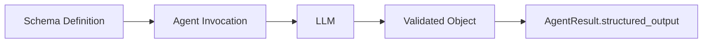

## Introduction

Structured output enables you to get type-safe, validated responses from language models using schema definitions. Instead of receiving raw text that you need to parse, you can define the exact structure you want and receive a validated object that matches your schema. This transforms unstructured LLM outputs into reliable, program-friendly data structures that integrate seamlessly with your application’s type system and validation rules.

In Python, structured output uses [Pydantic](https://docs.pydantic.dev/latest/concepts/models/) models. In TypeScript, it uses [Zod](https://zod.dev/) schemas for runtime validation and type inference.

Key benefits:

-   **Type Safety**: Get typed objects instead of raw strings
-   **Automatic Validation**: Schema validation ensures responses match your structure
-   **Clear Documentation**: Schema serves as documentation of expected output
-   **IDE Support**: IDE type hinting from LLM-generated responses
-   **Error Prevention**: Catch malformed responses early

## Basic Usage

Define an output structure using a schema. In Python, use a Pydantic model and pass it to `structured_output_model`. In TypeScript, use a Zod schema and pass it to `structuredOutputSchema`. Then, access the validated output from the `AgentResult`.

<starlight-tab-item data-label="Python"> &lt;div class=&quot;expressive-code&quot;&gt;&lt;figure class=&quot;frame&quot;&gt;&lt;figcaption class=&quot;header&quot;&gt;&lt;/figcaption&gt;&lt;pre data-language=&quot;python&quot; dir=&quot;ltr&quot;&gt;&lt;code&gt;&lt;div class=&quot;ec-line&quot;&gt;&lt;div class=&quot;code&quot;&gt;&lt;span style=&quot;--0:#BF3441;--1:#F97583&quot;&gt;from&lt;/span&gt;&lt;span style=&quot;--0:#24292E;--1:#E1E4E8&quot;&gt; pydantic &lt;/span&gt;&lt;span style=&quot;--0:#BF3441;--1:#F97583&quot;&gt;import&lt;/span&gt;&lt;span style=&quot;--0:#24292E;--1:#E1E4E8&quot;&gt; BaseModel, Field&lt;/span&gt;&lt;/div&gt;&lt;/div&gt;&lt;div class=&quot;ec-line&quot;&gt;&lt;div class=&quot;code&quot;&gt;&lt;span style=&quot;--0:#BF3441;--1:#F97583&quot;&gt;from&lt;/span&gt;&lt;span style=&quot;--0:#24292E;--1:#E1E4E8&quot;&gt; strands &lt;/span&gt;&lt;span style=&quot;--0:#BF3441;--1:#F97583&quot;&gt;import&lt;/span&gt;&lt;span style=&quot;--0:#24292E;--1:#E1E4E8&quot;&gt; Agent&lt;/span&gt;&lt;/div&gt;&lt;/div&gt;&lt;div class=&quot;ec-line&quot;&gt;&lt;div class=&quot;code&quot;&gt; &lt;/div&gt;&lt;/div&gt;&lt;div class=&quot;ec-line&quot;&gt;&lt;div class=&quot;code&quot;&gt;&lt;span style=&quot;--0:#616972;--1:#99A0A6&quot;&gt;# 1) Define the Pydantic model&lt;/span&gt;&lt;/div&gt;&lt;/div&gt;&lt;div class=&quot;ec-line&quot;&gt;&lt;div class=&quot;code&quot;&gt;&lt;span style=&quot;--0:#BF3441;--1:#F97583&quot;&gt;class&lt;/span&gt;&lt;span style=&quot;--0:#24292E;--1:#E1E4E8&quot;&gt; &lt;/span&gt;&lt;span style=&quot;--0:#6F42C1;--1:#B392F0&quot;&gt;PersonInfo&lt;/span&gt;&lt;span style=&quot;--0:#24292E;--1:#E1E4E8&quot;&gt;(&lt;/span&gt;&lt;span style=&quot;--0:#6F42C1;--1:#B392F0&quot;&gt;BaseModel&lt;/span&gt;&lt;span style=&quot;--0:#24292E;--1:#E1E4E8&quot;&gt;):&lt;/span&gt;&lt;/div&gt;&lt;/div&gt;&lt;div class=&quot;ec-line&quot;&gt;&lt;div class=&quot;code&quot;&gt;&lt;span class=&quot;indent&quot;&gt; &lt;/span&gt;&lt;span style=&quot;--0:#032F62;--1:#9ECBFF&quot;&gt;&amp;quot;&amp;quot;&amp;quot;Model that contains information about a Person&amp;quot;&amp;quot;&amp;quot;&lt;/span&gt;&lt;/div&gt;&lt;/div&gt;&lt;div class=&quot;ec-line&quot;&gt;&lt;div class=&quot;code&quot;&gt;&lt;span class=&quot;indent&quot;&gt;&lt;span style=&quot;--0:#24292E;--1:#E1E4E8&quot;&gt; &lt;/span&gt;&lt;/span&gt;&lt;span style=&quot;--0:#24292E;--1:#E1E4E8&quot;&gt;name: &lt;/span&gt;&lt;span style=&quot;--0:#005CC5;--1:#79B8FF&quot;&gt;str&lt;/span&gt;&lt;span style=&quot;--0:#24292E;--1:#E1E4E8&quot;&gt; &lt;/span&gt;&lt;span style=&quot;--0:#BF3441;--1:#F97583&quot;&gt;=&lt;/span&gt;&lt;span style=&quot;--0:#24292E;--1:#E1E4E8&quot;&gt; Field(&lt;/span&gt;&lt;span style=&quot;--0:#AE4B07;--1:#FFAB70&quot;&gt;description&lt;/span&gt;&lt;span style=&quot;--0:#BF3441;--1:#F97583&quot;&gt;=&lt;/span&gt;&lt;span style=&quot;--0:#032F62;--1:#9ECBFF&quot;&gt;&amp;quot;Name of the person&amp;quot;&lt;/span&gt;&lt;span style=&quot;--0:#24292E;--1:#E1E4E8&quot;&gt;)&lt;/span&gt;&lt;/div&gt;&lt;/div&gt;&lt;div class=&quot;ec-line&quot;&gt;&lt;div class=&quot;code&quot;&gt;&lt;span class=&quot;indent&quot;&gt;&lt;span style=&quot;--0:#24292E;--1:#E1E4E8&quot;&gt; &lt;/span&gt;&lt;/span&gt;&lt;span style=&quot;--0:#24292E;--1:#E1E4E8&quot;&gt;age: &lt;/span&gt;&lt;span style=&quot;--0:#005CC5;--1:#79B8FF&quot;&gt;int&lt;/span&gt;&lt;span style=&quot;--0:#24292E;--1:#E1E4E8&quot;&gt; &lt;/span&gt;&lt;span style=&quot;--0:#BF3441;--1:#F97583&quot;&gt;=&lt;/span&gt;&lt;span style=&quot;--0:#24292E;--1:#E1E4E8&quot;&gt; Field(&lt;/span&gt;&lt;span style=&quot;--0:#AE4B07;--1:#FFAB70&quot;&gt;description&lt;/span&gt;&lt;span style=&quot;--0:#BF3441;--1:#F97583&quot;&gt;=&lt;/span&gt;&lt;span style=&quot;--0:#032F62;--1:#9ECBFF&quot;&gt;&amp;quot;Age of the person&amp;quot;&lt;/span&gt;&lt;span style=&quot;--0:#24292E;--1:#E1E4E8&quot;&gt;)&lt;/span&gt;&lt;/div&gt;&lt;/div&gt;&lt;div class=&quot;ec-line&quot;&gt;&lt;div class=&quot;code&quot;&gt;&lt;span class=&quot;indent&quot;&gt;&lt;span style=&quot;--0:#24292E;--1:#E1E4E8&quot;&gt; &lt;/span&gt;&lt;/span&gt;&lt;span style=&quot;--0:#24292E;--1:#E1E4E8&quot;&gt;occupation: &lt;/span&gt;&lt;span style=&quot;--0:#005CC5;--1:#79B8FF&quot;&gt;str&lt;/span&gt;&lt;span style=&quot;--0:#24292E;--1:#E1E4E8&quot;&gt; &lt;/span&gt;&lt;span style=&quot;--0:#BF3441;--1:#F97583&quot;&gt;=&lt;/span&gt;&lt;span style=&quot;--0:#24292E;--1:#E1E4E8&quot;&gt; Field(&lt;/span&gt;&lt;span style=&quot;--0:#AE4B07;--1:#FFAB70&quot;&gt;description&lt;/span&gt;&lt;span style=&quot;--0:#BF3441;--1:#F97583&quot;&gt;=&lt;/span&gt;&lt;span style=&quot;--0:#032F62;--1:#9ECBFF&quot;&gt;&amp;quot;Occupation of the person&amp;quot;&lt;/span&gt;&lt;span style=&quot;--0:#24292E;--1:#E1E4E8&quot;&gt;)&lt;/span&gt;&lt;/div&gt;&lt;/div&gt;&lt;div class=&quot;ec-line&quot;&gt;&lt;div class=&quot;code&quot;&gt; &lt;/div&gt;&lt;/div&gt;&lt;div class=&quot;ec-line&quot;&gt;&lt;div class=&quot;code&quot;&gt;&lt;span style=&quot;--0:#616972;--1:#99A0A6&quot;&gt;# 2) Pass the model to the agent&lt;/span&gt;&lt;/div&gt;&lt;/div&gt;&lt;div class=&quot;ec-line&quot;&gt;&lt;div class=&quot;code&quot;&gt;&lt;span style=&quot;--0:#24292E;--1:#E1E4E8&quot;&gt;agent &lt;/span&gt;&lt;span style=&quot;--0:#BF3441;--1:#F97583&quot;&gt;=&lt;/span&gt;&lt;span style=&quot;--0:#24292E;--1:#E1E4E8&quot;&gt; Agent()&lt;/span&gt;&lt;/div&gt;&lt;/div&gt;&lt;div class=&quot;ec-line&quot;&gt;&lt;div class=&quot;code&quot;&gt;&lt;span style=&quot;--0:#24292E;--1:#E1E4E8&quot;&gt;result &lt;/span&gt;&lt;span style=&quot;--0:#BF3441;--1:#F97583&quot;&gt;=&lt;/span&gt;&lt;span style=&quot;--0:#24292E;--1:#E1E4E8&quot;&gt; agent(&lt;/span&gt;&lt;/div&gt;&lt;/div&gt;&lt;div class=&quot;ec-line&quot;&gt;&lt;div class=&quot;code&quot;&gt;&lt;span class=&quot;indent&quot;&gt; &lt;/span&gt;&lt;span style=&quot;--0:#032F62;--1:#9ECBFF&quot;&gt;&amp;quot;John Smith is a 30 year-old software engineer&amp;quot;&lt;/span&gt;&lt;span style=&quot;--0:#24292E;--1:#E1E4E8&quot;&gt;,&lt;/span&gt;&lt;/div&gt;&lt;/div&gt;&lt;div class=&quot;ec-line&quot;&gt;&lt;div class=&quot;code&quot;&gt;&lt;span class=&quot;indent&quot;&gt; &lt;/span&gt;&lt;span style=&quot;--0:#AE4B07;--1:#FFAB70&quot;&gt;structured\_output\_model&lt;/span&gt;&lt;span style=&quot;--0:#BF3441;--1:#F97583&quot;&gt;=&lt;/span&gt;&lt;span style=&quot;--0:#24292E;--1:#E1E4E8&quot;&gt;PersonInfo&lt;/span&gt;&lt;/div&gt;&lt;/div&gt;&lt;div class=&quot;ec-line&quot;&gt;&lt;div class=&quot;code&quot;&gt;&lt;span style=&quot;--0:#24292E;--1:#E1E4E8&quot;&gt;)&lt;/span&gt;&lt;/div&gt;&lt;/div&gt;&lt;div class=&quot;ec-line&quot;&gt;&lt;div class=&quot;code&quot;&gt; &lt;/div&gt;&lt;/div&gt;&lt;div class=&quot;ec-line&quot;&gt;&lt;div class=&quot;code&quot;&gt;&lt;span style=&quot;--0:#616972;--1:#99A0A6&quot;&gt;# 3) Access the \`structured\_output\` from the result&lt;/span&gt;&lt;/div&gt;&lt;/div&gt;&lt;div class=&quot;ec-line&quot;&gt;&lt;div class=&quot;code&quot;&gt;&lt;span style=&quot;--0:#24292E;--1:#E1E4E8&quot;&gt;person\_info: PersonInfo &lt;/span&gt;&lt;span style=&quot;--0:#BF3441;--1:#F97583&quot;&gt;=&lt;/span&gt;&lt;span style=&quot;--0:#24292E;--1:#E1E4E8&quot;&gt; result.structured\_output&lt;/span&gt;&lt;/div&gt;&lt;/div&gt;&lt;div class=&quot;ec-line&quot;&gt;&lt;div class=&quot;code&quot;&gt;&lt;span style=&quot;--0:#005CC5;--1:#79B8FF&quot;&gt;print&lt;/span&gt;&lt;span style=&quot;--0:#24292E;--1:#E1E4E8&quot;&gt;(&lt;/span&gt;&lt;span style=&quot;--0:#BF3441;--1:#F97583&quot;&gt;f&lt;/span&gt;&lt;span style=&quot;--0:#032F62;--1:#9ECBFF&quot;&gt;&amp;quot;Name: &lt;/span&gt;&lt;span style=&quot;--0:#005CC5;--1:#79B8FF&quot;&gt;{&lt;/span&gt;&lt;span style=&quot;--0:#24292E;--1:#E1E4E8&quot;&gt;person\_info.name&lt;/span&gt;&lt;span style=&quot;--0:#005CC5;--1:#79B8FF&quot;&gt;}&lt;/span&gt;&lt;span style=&quot;--0:#032F62;--1:#9ECBFF&quot;&gt;&amp;quot;&lt;/span&gt;&lt;span style=&quot;--0:#24292E;--1:#E1E4E8&quot;&gt;) &lt;/span&gt;&lt;span style=&quot;--0:#616972;--1:#99A0A6&quot;&gt;# &amp;quot;John Smith&amp;quot;&lt;/span&gt;&lt;/div&gt;&lt;/div&gt;&lt;div class=&quot;ec-line&quot;&gt;&lt;div class=&quot;code&quot;&gt;&lt;span style=&quot;--0:#005CC5;--1:#79B8FF&quot;&gt;print&lt;/span&gt;&lt;span style=&quot;--0:#24292E;--1:#E1E4E8&quot;&gt;(&lt;/span&gt;&lt;span style=&quot;--0:#BF3441;--1:#F97583&quot;&gt;f&lt;/span&gt;&lt;span style=&quot;--0:#032F62;--1:#9ECBFF&quot;&gt;&amp;quot;Age: &lt;/span&gt;&lt;span style=&quot;--0:#005CC5;--1:#79B8FF&quot;&gt;{&lt;/span&gt;&lt;span style=&quot;--0:#24292E;--1:#E1E4E8&quot;&gt;person\_info.age&lt;/span&gt;&lt;span style=&quot;--0:#005CC5;--1:#79B8FF&quot;&gt;}&lt;/span&gt;&lt;span style=&quot;--0:#032F62;--1:#9ECBFF&quot;&gt;&amp;quot;&lt;/span&gt;&lt;span style=&quot;--0:#24292E;--1:#E1E4E8&quot;&gt;) &lt;/span&gt;&lt;span style=&quot;--0:#616972;--1:#99A0A6&quot;&gt;# 30&lt;/span&gt;&lt;/div&gt;&lt;/div&gt;&lt;div class=&quot;ec-line&quot;&gt;&lt;div class=&quot;code&quot;&gt;&lt;span style=&quot;--0:#005CC5;--1:#79B8FF&quot;&gt;print&lt;/span&gt;&lt;span style=&quot;--0:#24292E;--1:#E1E4E8&quot;&gt;(&lt;/span&gt;&lt;span style=&quot;--0:#BF3441;--1:#F97583&quot;&gt;f&lt;/span&gt;&lt;span style=&quot;--0:#032F62;--1:#9ECBFF&quot;&gt;&amp;quot;Job: &lt;/span&gt;&lt;span style=&quot;--0:#005CC5;--1:#79B8FF&quot;&gt;{&lt;/span&gt;&lt;span style=&quot;--0:#24292E;--1:#E1E4E8&quot;&gt;person\_info.occupation&lt;/span&gt;&lt;span style=&quot;--0:#005CC5;--1:#79B8FF&quot;&gt;}&lt;/span&gt;&lt;span style=&quot;--0:#032F62;--1:#9ECBFF&quot;&gt;&amp;quot;&lt;/span&gt;&lt;span style=&quot;--0:#24292E;--1:#E1E4E8&quot;&gt;) &lt;/span&gt;&lt;span style=&quot;--0:#616972;--1:#99A0A6&quot;&gt;# &amp;quot;software engineer&amp;quot;&lt;/span&gt;&lt;/div&gt;&lt;/div&gt;&lt;/code&gt;&lt;/pre&gt;&lt;div class=&quot;copy&quot;&gt;&lt;div aria-live=&quot;polite&quot;&gt;&lt;/div&gt;&lt;button title=&quot;Copy to clipboard&quot; data-copied=&quot;Copied!&quot; data-code=&quot;from pydantic import BaseModel, Fieldfrom strands import Agent# 1) Define the Pydantic modelclass PersonInfo(BaseModel): &amp;#34;&amp;#34;&amp;#34;Model that contains information about a Person&amp;#34;&amp;#34;&amp;#34; name: str = Field(description=&amp;#34;Name of the person&amp;#34;) age: int = Field(description=&amp;#34;Age of the person&amp;#34;) occupation: str = Field(description=&amp;#34;Occupation of the person&amp;#34;)# 2) Pass the model to the agentagent = Agent()result = agent( &amp;#34;John Smith is a 30 year-old software engineer&amp;#34;, structured\_output\_model=PersonInfo)# 3) Access the \`structured\_output\` from the resultperson\_info: PersonInfo = result.structured\_outputprint(f&amp;#34;Name: {person\_info.name}&amp;#34;) # &amp;#34;John Smith&amp;#34;print(f&amp;#34;Age: {person\_info.age}&amp;#34;) # 30print(f&amp;#34;Job: {person\_info.occupation}&amp;#34;) # &amp;#34;software engineer&amp;#34;&quot;&gt;&lt;div&gt;&lt;/div&gt;&lt;/button&gt;&lt;/div&gt;&lt;/figure&gt;&lt;/div&gt; </starlight-tab-item><starlight-tab-item data-label="TypeScript"> &lt;div class=&quot;expressive-code&quot;&gt;&lt;figure class=&quot;frame&quot;&gt;&lt;figcaption class=&quot;header&quot;&gt;&lt;/figcaption&gt;&lt;pre data-language=&quot;typescript&quot; dir=&quot;ltr&quot;&gt;&lt;code&gt;&lt;div class=&quot;ec-line&quot;&gt;&lt;div class=&quot;code&quot;&gt;&lt;span style=&quot;--0:#616972;--1:#99A0A6&quot;&gt;// 1) Define the Zod schema&lt;/span&gt;&lt;/div&gt;&lt;/div&gt;&lt;div class=&quot;ec-line&quot;&gt;&lt;div class=&quot;code&quot;&gt;&lt;span style=&quot;--0:#BF3441;--1:#F97583&quot;&gt;const&lt;/span&gt;&lt;span style=&quot;--0:#24292E;--1:#E1E4E8&quot;&gt; &lt;/span&gt;&lt;span style=&quot;--0:#005CC5;--1:#79B8FF&quot;&gt;PersonSchema&lt;/span&gt;&lt;span style=&quot;--0:#24292E;--1:#E1E4E8&quot;&gt; &lt;/span&gt;&lt;span style=&quot;--0:#BF3441;--1:#F97583&quot;&gt;=&lt;/span&gt;&lt;span style=&quot;--0:#24292E;--1:#E1E4E8&quot;&gt; z.&lt;/span&gt;&lt;span style=&quot;--0:#6F42C1;--1:#B392F0&quot;&gt;object&lt;/span&gt;&lt;span style=&quot;--0:#24292E;--1:#E1E4E8&quot;&gt;({&lt;/span&gt;&lt;/div&gt;&lt;/div&gt;&lt;div class=&quot;ec-line&quot;&gt;&lt;div class=&quot;code&quot;&gt;&lt;span class=&quot;indent&quot;&gt;&lt;span style=&quot;--0:#24292E;--1:#E1E4E8&quot;&gt; &lt;/span&gt;&lt;/span&gt;&lt;span style=&quot;--0:#24292E;--1:#E1E4E8&quot;&gt;name: z.&lt;/span&gt;&lt;span style=&quot;--0:#6F42C1;--1:#B392F0&quot;&gt;string&lt;/span&gt;&lt;span style=&quot;--0:#24292E;--1:#E1E4E8&quot;&gt;().&lt;/span&gt;&lt;span style=&quot;--0:#6F42C1;--1:#B392F0&quot;&gt;describe&lt;/span&gt;&lt;span style=&quot;--0:#24292E;--1:#E1E4E8&quot;&gt;(&lt;/span&gt;&lt;span style=&quot;--0:#032F62;--1:#9ECBFF&quot;&gt;&amp;#39;Name of the person&amp;#39;&lt;/span&gt;&lt;span style=&quot;--0:#24292E;--1:#E1E4E8&quot;&gt;),&lt;/span&gt;&lt;/div&gt;&lt;/div&gt;&lt;div class=&quot;ec-line&quot;&gt;&lt;div class=&quot;code&quot;&gt;&lt;span class=&quot;indent&quot;&gt;&lt;span style=&quot;--0:#24292E;--1:#E1E4E8&quot;&gt; &lt;/span&gt;&lt;/span&gt;&lt;span style=&quot;--0:#24292E;--1:#E1E4E8&quot;&gt;age: z.&lt;/span&gt;&lt;span style=&quot;--0:#6F42C1;--1:#B392F0&quot;&gt;number&lt;/span&gt;&lt;span style=&quot;--0:#24292E;--1:#E1E4E8&quot;&gt;().&lt;/span&gt;&lt;span style=&quot;--0:#6F42C1;--1:#B392F0&quot;&gt;describe&lt;/span&gt;&lt;span style=&quot;--0:#24292E;--1:#E1E4E8&quot;&gt;(&lt;/span&gt;&lt;span style=&quot;--0:#032F62;--1:#9ECBFF&quot;&gt;&amp;#39;Age of the person&amp;#39;&lt;/span&gt;&lt;span style=&quot;--0:#24292E;--1:#E1E4E8&quot;&gt;),&lt;/span&gt;&lt;/div&gt;&lt;/div&gt;&lt;div class=&quot;ec-line&quot;&gt;&lt;div class=&quot;code&quot;&gt;&lt;span class=&quot;indent&quot;&gt;&lt;span style=&quot;--0:#24292E;--1:#E1E4E8&quot;&gt; &lt;/span&gt;&lt;/span&gt;&lt;span style=&quot;--0:#24292E;--1:#E1E4E8&quot;&gt;occupation: z.&lt;/span&gt;&lt;span style=&quot;--0:#6F42C1;--1:#B392F0&quot;&gt;string&lt;/span&gt;&lt;span style=&quot;--0:#24292E;--1:#E1E4E8&quot;&gt;().&lt;/span&gt;&lt;span style=&quot;--0:#6F42C1;--1:#B392F0&quot;&gt;describe&lt;/span&gt;&lt;span style=&quot;--0:#24292E;--1:#E1E4E8&quot;&gt;(&lt;/span&gt;&lt;span style=&quot;--0:#032F62;--1:#9ECBFF&quot;&gt;&amp;#39;Occupation of the person&amp;#39;&lt;/span&gt;&lt;span style=&quot;--0:#24292E;--1:#E1E4E8&quot;&gt;),&lt;/span&gt;&lt;/div&gt;&lt;/div&gt;&lt;div class=&quot;ec-line&quot;&gt;&lt;div class=&quot;code&quot;&gt;&lt;span style=&quot;--0:#24292E;--1:#E1E4E8&quot;&gt;})&lt;/span&gt;&lt;/div&gt;&lt;/div&gt;&lt;div class=&quot;ec-line&quot;&gt;&lt;div class=&quot;code&quot;&gt; &lt;/div&gt;&lt;/div&gt;&lt;div class=&quot;ec-line&quot;&gt;&lt;div class=&quot;code&quot;&gt;&lt;span style=&quot;--0:#BF3441;--1:#F97583&quot;&gt;type&lt;/span&gt;&lt;span style=&quot;--0:#24292E;--1:#E1E4E8&quot;&gt; &lt;/span&gt;&lt;span style=&quot;--0:#6F42C1;--1:#B392F0&quot;&gt;Person&lt;/span&gt;&lt;span style=&quot;--0:#24292E;--1:#E1E4E8&quot;&gt; &lt;/span&gt;&lt;span style=&quot;--0:#BF3441;--1:#F97583&quot;&gt;=&lt;/span&gt;&lt;span style=&quot;--0:#24292E;--1:#E1E4E8&quot;&gt; &lt;/span&gt;&lt;span style=&quot;--0:#6F42C1;--1:#B392F0&quot;&gt;z&lt;/span&gt;&lt;span style=&quot;--0:#24292E;--1:#E1E4E8&quot;&gt;.&lt;/span&gt;&lt;span style=&quot;--0:#6F42C1;--1:#B392F0&quot;&gt;infer&lt;/span&gt;&lt;span style=&quot;--0:#24292E;--1:#E1E4E8&quot;&gt;&amp;lt;&lt;/span&gt;&lt;span style=&quot;--0:#BF3441;--1:#F97583&quot;&gt;typeof&lt;/span&gt;&lt;span style=&quot;--0:#24292E;--1:#E1E4E8&quot;&gt; PersonSchema&amp;gt;&lt;/span&gt;&lt;/div&gt;&lt;/div&gt;&lt;div class=&quot;ec-line&quot;&gt;&lt;div class=&quot;code&quot;&gt; &lt;/div&gt;&lt;/div&gt;&lt;div class=&quot;ec-line&quot;&gt;&lt;div class=&quot;code&quot;&gt;&lt;span style=&quot;--0:#616972;--1:#99A0A6&quot;&gt;// 2) Pass the schema to the agent&lt;/span&gt;&lt;/div&gt;&lt;/div&gt;&lt;div class=&quot;ec-line&quot;&gt;&lt;div class=&quot;code&quot;&gt;&lt;span style=&quot;--0:#BF3441;--1:#F97583&quot;&gt;const&lt;/span&gt;&lt;span style=&quot;--0:#24292E;--1:#E1E4E8&quot;&gt; &lt;/span&gt;&lt;span style=&quot;--0:#005CC5;--1:#79B8FF&quot;&gt;agent&lt;/span&gt;&lt;span style=&quot;--0:#24292E;--1:#E1E4E8&quot;&gt; &lt;/span&gt;&lt;span style=&quot;--0:#BF3441;--1:#F97583&quot;&gt;=&lt;/span&gt;&lt;span style=&quot;--0:#24292E;--1:#E1E4E8&quot;&gt; &lt;/span&gt;&lt;span style=&quot;--0:#BF3441;--1:#F97583&quot;&gt;new&lt;/span&gt;&lt;span style=&quot;--0:#24292E;--1:#E1E4E8&quot;&gt; &lt;/span&gt;&lt;span style=&quot;--0:#6F42C1;--1:#B392F0&quot;&gt;Agent&lt;/span&gt;&lt;span style=&quot;--0:#24292E;--1:#E1E4E8&quot;&gt;({&lt;/span&gt;&lt;/div&gt;&lt;/div&gt;&lt;div class=&quot;ec-line&quot;&gt;&lt;div class=&quot;code&quot;&gt;&lt;span class=&quot;indent&quot;&gt;&lt;span style=&quot;--0:#24292E;--1:#E1E4E8&quot;&gt; &lt;/span&gt;&lt;/span&gt;&lt;span style=&quot;--0:#24292E;--1:#E1E4E8&quot;&gt;structuredOutputSchema: PersonSchema,&lt;/span&gt;&lt;/div&gt;&lt;/div&gt;&lt;div class=&quot;ec-line&quot;&gt;&lt;div class=&quot;code&quot;&gt;&lt;span style=&quot;--0:#24292E;--1:#E1E4E8&quot;&gt;})&lt;/span&gt;&lt;/div&gt;&lt;/div&gt;&lt;div class=&quot;ec-line&quot;&gt;&lt;div class=&quot;code&quot;&gt; &lt;/div&gt;&lt;/div&gt;&lt;div class=&quot;ec-line&quot;&gt;&lt;div class=&quot;code&quot;&gt;&lt;span style=&quot;--0:#BF3441;--1:#F97583&quot;&gt;const&lt;/span&gt;&lt;span style=&quot;--0:#24292E;--1:#E1E4E8&quot;&gt; &lt;/span&gt;&lt;span style=&quot;--0:#005CC5;--1:#79B8FF&quot;&gt;result&lt;/span&gt;&lt;span style=&quot;--0:#24292E;--1:#E1E4E8&quot;&gt; &lt;/span&gt;&lt;span style=&quot;--0:#BF3441;--1:#F97583&quot;&gt;=&lt;/span&gt;&lt;span style=&quot;--0:#24292E;--1:#E1E4E8&quot;&gt; &lt;/span&gt;&lt;span style=&quot;--0:#BF3441;--1:#F97583&quot;&gt;await&lt;/span&gt;&lt;span style=&quot;--0:#24292E;--1:#E1E4E8&quot;&gt; agent.&lt;/span&gt;&lt;span style=&quot;--0:#6F42C1;--1:#B392F0&quot;&gt;invoke&lt;/span&gt;&lt;span style=&quot;--0:#24292E;--1:#E1E4E8&quot;&gt;(&lt;/span&gt;&lt;span style=&quot;--0:#032F62;--1:#9ECBFF&quot;&gt;&amp;#39;John Smith is a 30 year-old software engineer&amp;#39;&lt;/span&gt;&lt;span style=&quot;--0:#24292E;--1:#E1E4E8&quot;&gt;)&lt;/span&gt;&lt;/div&gt;&lt;/div&gt;&lt;div class=&quot;ec-line&quot;&gt;&lt;div class=&quot;code&quot;&gt; &lt;/div&gt;&lt;/div&gt;&lt;div class=&quot;ec-line&quot;&gt;&lt;div class=&quot;code&quot;&gt;&lt;span style=&quot;--0:#616972;--1:#99A0A6&quot;&gt;// 3) Access the \`structuredOutput\` from the result&lt;/span&gt;&lt;/div&gt;&lt;/div&gt;&lt;div class=&quot;ec-line&quot;&gt;&lt;div class=&quot;code&quot;&gt;&lt;span style=&quot;--0:#616972;--1:#99A0A6&quot;&gt;// TypeScript infers the type from the schema&lt;/span&gt;&lt;/div&gt;&lt;/div&gt;&lt;div class=&quot;ec-line&quot;&gt;&lt;div class=&quot;code&quot;&gt;&lt;span style=&quot;--0:#BF3441;--1:#F97583&quot;&gt;const&lt;/span&gt;&lt;span style=&quot;--0:#24292E;--1:#E1E4E8&quot;&gt; &lt;/span&gt;&lt;span style=&quot;--0:#005CC5;--1:#79B8FF&quot;&gt;person&lt;/span&gt;&lt;span style=&quot;--0:#24292E;--1:#E1E4E8&quot;&gt; &lt;/span&gt;&lt;span style=&quot;--0:#BF3441;--1:#F97583&quot;&gt;=&lt;/span&gt;&lt;span style=&quot;--0:#24292E;--1:#E1E4E8&quot;&gt; result.structuredOutput &lt;/span&gt;&lt;span style=&quot;--0:#BF3441;--1:#F97583&quot;&gt;as&lt;/span&gt;&lt;span style=&quot;--0:#24292E;--1:#E1E4E8&quot;&gt; &lt;/span&gt;&lt;span style=&quot;--0:#6F42C1;--1:#B392F0&quot;&gt;Person&lt;/span&gt;&lt;/div&gt;&lt;/div&gt;&lt;div class=&quot;ec-line&quot;&gt;&lt;div class=&quot;code&quot;&gt;&lt;span style=&quot;--0:#24292E;--1:#E1E4E8&quot;&gt;console.&lt;/span&gt;&lt;span style=&quot;--0:#6F42C1;--1:#B392F0&quot;&gt;log&lt;/span&gt;&lt;span style=&quot;--0:#24292E;--1:#E1E4E8&quot;&gt;(&lt;/span&gt;&lt;span style=&quot;--0:#032F62;--1:#9ECBFF&quot;&gt;\`Name: ${&lt;/span&gt;&lt;span style=&quot;--0:#24292E;--1:#E1E4E8&quot;&gt;person&lt;/span&gt;&lt;span style=&quot;--0:#032F62;--1:#9ECBFF&quot;&gt;.&lt;/span&gt;&lt;span style=&quot;--0:#24292E;--1:#E1E4E8&quot;&gt;name&lt;/span&gt;&lt;span style=&quot;--0:#032F62;--1:#9ECBFF&quot;&gt;}\`&lt;/span&gt;&lt;span style=&quot;--0:#24292E;--1:#E1E4E8&quot;&gt;) &lt;/span&gt;&lt;span style=&quot;--0:#616972;--1:#99A0A6&quot;&gt;// &amp;quot;John Smith&amp;quot;&lt;/span&gt;&lt;/div&gt;&lt;/div&gt;&lt;div class=&quot;ec-line&quot;&gt;&lt;div class=&quot;code&quot;&gt;&lt;span style=&quot;--0:#24292E;--1:#E1E4E8&quot;&gt;console.&lt;/span&gt;&lt;span style=&quot;--0:#6F42C1;--1:#B392F0&quot;&gt;log&lt;/span&gt;&lt;span style=&quot;--0:#24292E;--1:#E1E4E8&quot;&gt;(&lt;/span&gt;&lt;span style=&quot;--0:#032F62;--1:#9ECBFF&quot;&gt;\`Age: ${&lt;/span&gt;&lt;span style=&quot;--0:#24292E;--1:#E1E4E8&quot;&gt;person&lt;/span&gt;&lt;span style=&quot;--0:#032F62;--1:#9ECBFF&quot;&gt;.&lt;/span&gt;&lt;span style=&quot;--0:#24292E;--1:#E1E4E8&quot;&gt;age&lt;/span&gt;&lt;span style=&quot;--0:#032F62;--1:#9ECBFF&quot;&gt;}\`&lt;/span&gt;&lt;span style=&quot;--0:#24292E;--1:#E1E4E8&quot;&gt;) &lt;/span&gt;&lt;span style=&quot;--0:#616972;--1:#99A0A6&quot;&gt;// 30&lt;/span&gt;&lt;/div&gt;&lt;/div&gt;&lt;div class=&quot;ec-line&quot;&gt;&lt;div class=&quot;code&quot;&gt;&lt;span style=&quot;--0:#24292E;--1:#E1E4E8&quot;&gt;console.&lt;/span&gt;&lt;span style=&quot;--0:#6F42C1;--1:#B392F0&quot;&gt;log&lt;/span&gt;&lt;span style=&quot;--0:#24292E;--1:#E1E4E8&quot;&gt;(&lt;/span&gt;&lt;span style=&quot;--0:#032F62;--1:#9ECBFF&quot;&gt;\`Job: ${&lt;/span&gt;&lt;span style=&quot;--0:#24292E;--1:#E1E4E8&quot;&gt;person&lt;/span&gt;&lt;span style=&quot;--0:#032F62;--1:#9ECBFF&quot;&gt;.&lt;/span&gt;&lt;span style=&quot;--0:#24292E;--1:#E1E4E8&quot;&gt;occupation&lt;/span&gt;&lt;span style=&quot;--0:#032F62;--1:#9ECBFF&quot;&gt;}\`&lt;/span&gt;&lt;span style=&quot;--0:#24292E;--1:#E1E4E8&quot;&gt;) &lt;/span&gt;&lt;span style=&quot;--0:#616972;--1:#99A0A6&quot;&gt;// &amp;quot;software engineer&amp;quot;&lt;/span&gt;&lt;/div&gt;&lt;/div&gt;&lt;/code&gt;&lt;/pre&gt;&lt;div class=&quot;copy&quot;&gt;&lt;div aria-live=&quot;polite&quot;&gt;&lt;/div&gt;&lt;button title=&quot;Copy to clipboard&quot; data-copied=&quot;Copied!&quot; data-code=&quot;// 1) Define the Zod schemaconst PersonSchema = z.object({ name: z.string().describe(&#39;Name of the person&#39;), age: z.number().describe(&#39;Age of the person&#39;), occupation: z.string().describe(&#39;Occupation of the person&#39;),})type Person = z.infer&lt;typeof PersonSchema&gt;// 2) Pass the schema to the agentconst agent = new Agent({ structuredOutputSchema: PersonSchema,})const result = await agent.invoke(&#39;John Smith is a 30 year-old software engineer&#39;)// 3) Access the \`structuredOutput\` from the result// TypeScript infers the type from the schemaconst person = result.structuredOutput as Personconsole.log(\`Name: ${person.name}\`) // &amp;#34;John Smith&amp;#34;console.log(\`Age: ${person.age}\`) // 30console.log(\`Job: ${person.occupation}\`) // &amp;#34;software engineer&amp;#34;&quot;&gt;&lt;div&gt;&lt;/div&gt;&lt;/button&gt;&lt;/div&gt;&lt;/figure&gt;&lt;/div&gt; </starlight-tab-item>

Async Support

Structured Output is supported with async in both Python and TypeScript:

<starlight-tab-item data-label="Python"> &lt;div class=&quot;expressive-code&quot;&gt;&lt;figure class=&quot;frame&quot;&gt;&lt;figcaption class=&quot;header&quot;&gt;&lt;/figcaption&gt;&lt;pre data-language=&quot;python&quot; dir=&quot;ltr&quot;&gt;&lt;code&gt;&lt;div class=&quot;ec-line&quot;&gt;&lt;div class=&quot;code&quot;&gt;&lt;span style=&quot;--0:#BF3441;--1:#F97583&quot;&gt;import&lt;/span&gt;&lt;span style=&quot;--0:#24292E;--1:#E1E4E8&quot;&gt; asyncio&lt;/span&gt;&lt;/div&gt;&lt;/div&gt;&lt;div class=&quot;ec-line&quot;&gt;&lt;div class=&quot;code&quot;&gt;&lt;span style=&quot;--0:#24292E;--1:#E1E4E8&quot;&gt;agent &lt;/span&gt;&lt;span style=&quot;--0:#BF3441;--1:#F97583&quot;&gt;=&lt;/span&gt;&lt;span style=&quot;--0:#24292E;--1:#E1E4E8&quot;&gt; Agent()&lt;/span&gt;&lt;/div&gt;&lt;/div&gt;&lt;div class=&quot;ec-line&quot;&gt;&lt;div class=&quot;code&quot;&gt;&lt;span style=&quot;--0:#24292E;--1:#E1E4E8&quot;&gt;result &lt;/span&gt;&lt;span style=&quot;--0:#BF3441;--1:#F97583&quot;&gt;=&lt;/span&gt;&lt;span style=&quot;--0:#24292E;--1:#E1E4E8&quot;&gt; asyncio.run(&lt;/span&gt;&lt;/div&gt;&lt;/div&gt;&lt;div class=&quot;ec-line&quot;&gt;&lt;div class=&quot;code&quot;&gt;&lt;span class=&quot;indent&quot;&gt;&lt;span style=&quot;--0:#24292E;--1:#E1E4E8&quot;&gt; &lt;/span&gt;&lt;/span&gt;&lt;span style=&quot;--0:#24292E;--1:#E1E4E8&quot;&gt;agent.invoke\_async(&lt;/span&gt;&lt;/div&gt;&lt;/div&gt;&lt;div class=&quot;ec-line&quot;&gt;&lt;div class=&quot;code&quot;&gt;&lt;span class=&quot;indent&quot;&gt; &lt;/span&gt;&lt;span style=&quot;--0:#032F62;--1:#9ECBFF&quot;&gt;&amp;quot;John Smith is a 30 year-old software engineer&amp;quot;&lt;/span&gt;&lt;span style=&quot;--0:#24292E;--1:#E1E4E8&quot;&gt;,&lt;/span&gt;&lt;/div&gt;&lt;/div&gt;&lt;div class=&quot;ec-line&quot;&gt;&lt;div class=&quot;code&quot;&gt;&lt;span class=&quot;indent&quot;&gt; &lt;/span&gt;&lt;span style=&quot;--0:#AE4B07;--1:#FFAB70&quot;&gt;structured\_output\_model&lt;/span&gt;&lt;span style=&quot;--0:#BF3441;--1:#F97583&quot;&gt;=&lt;/span&gt;&lt;span style=&quot;--0:#24292E;--1:#E1E4E8&quot;&gt;PersonInfo&lt;/span&gt;&lt;/div&gt;&lt;/div&gt;&lt;div class=&quot;ec-line&quot;&gt;&lt;div class=&quot;code&quot;&gt;&lt;span class=&quot;indent&quot;&gt;&lt;span style=&quot;--0:#24292E;--1:#E1E4E8&quot;&gt; &lt;/span&gt;&lt;/span&gt;&lt;span style=&quot;--0:#24292E;--1:#E1E4E8&quot;&gt;)&lt;/span&gt;&lt;/div&gt;&lt;/div&gt;&lt;div class=&quot;ec-line&quot;&gt;&lt;div class=&quot;code&quot;&gt;&lt;span style=&quot;--0:#24292E;--1:#E1E4E8&quot;&gt;)&lt;/span&gt;&lt;/div&gt;&lt;/div&gt;&lt;/code&gt;&lt;/pre&gt;&lt;div class=&quot;copy&quot;&gt;&lt;div aria-live=&quot;polite&quot;&gt;&lt;/div&gt;&lt;button title=&quot;Copy to clipboard&quot; data-copied=&quot;Copied!&quot; data-code=&quot;import asyncioagent = Agent()result = asyncio.run( agent.invoke\_async( &amp;#34;John Smith is a 30 year-old software engineer&amp;#34;, structured\_output\_model=PersonInfo ))&quot;&gt;&lt;div&gt;&lt;/div&gt;&lt;/button&gt;&lt;/div&gt;&lt;/figure&gt;&lt;/div&gt; </starlight-tab-item><starlight-tab-item data-label="TypeScript"> &lt;div class=&quot;expressive-code&quot;&gt;&lt;figure class=&quot;frame&quot;&gt;&lt;figcaption class=&quot;header&quot;&gt;&lt;/figcaption&gt;&lt;pre data-language=&quot;typescript&quot; dir=&quot;ltr&quot;&gt;&lt;code&gt;&lt;div class=&quot;ec-line&quot;&gt;&lt;div class=&quot;code&quot;&gt;&lt;span style=&quot;--0:#616972;--1:#99A0A6&quot;&gt;// Agent.invoke() is already async in TypeScript&lt;/span&gt;&lt;/div&gt;&lt;/div&gt;&lt;div class=&quot;ec-line&quot;&gt;&lt;div class=&quot;code&quot;&gt;&lt;span style=&quot;--0:#BF3441;--1:#F97583&quot;&gt;const&lt;/span&gt;&lt;span style=&quot;--0:#24292E;--1:#E1E4E8&quot;&gt; &lt;/span&gt;&lt;span style=&quot;--0:#005CC5;--1:#79B8FF&quot;&gt;agent&lt;/span&gt;&lt;span style=&quot;--0:#24292E;--1:#E1E4E8&quot;&gt; &lt;/span&gt;&lt;span style=&quot;--0:#BF3441;--1:#F97583&quot;&gt;=&lt;/span&gt;&lt;span style=&quot;--0:#24292E;--1:#E1E4E8&quot;&gt; &lt;/span&gt;&lt;span style=&quot;--0:#BF3441;--1:#F97583&quot;&gt;new&lt;/span&gt;&lt;span style=&quot;--0:#24292E;--1:#E1E4E8&quot;&gt; &lt;/span&gt;&lt;span style=&quot;--0:#6F42C1;--1:#B392F0&quot;&gt;Agent&lt;/span&gt;&lt;span style=&quot;--0:#24292E;--1:#E1E4E8&quot;&gt;({ structuredOutputSchema: PersonSchema })&lt;/span&gt;&lt;/div&gt;&lt;/div&gt;&lt;div class=&quot;ec-line&quot;&gt;&lt;div class=&quot;code&quot;&gt;&lt;span style=&quot;--0:#BF3441;--1:#F97583&quot;&gt;const&lt;/span&gt;&lt;span style=&quot;--0:#24292E;--1:#E1E4E8&quot;&gt; &lt;/span&gt;&lt;span style=&quot;--0:#005CC5;--1:#79B8FF&quot;&gt;result&lt;/span&gt;&lt;span style=&quot;--0:#24292E;--1:#E1E4E8&quot;&gt; &lt;/span&gt;&lt;span style=&quot;--0:#BF3441;--1:#F97583&quot;&gt;=&lt;/span&gt;&lt;span style=&quot;--0:#24292E;--1:#E1E4E8&quot;&gt; &lt;/span&gt;&lt;span style=&quot;--0:#BF3441;--1:#F97583&quot;&gt;await&lt;/span&gt;&lt;span style=&quot;--0:#24292E;--1:#E1E4E8&quot;&gt; agent.&lt;/span&gt;&lt;span style=&quot;--0:#6F42C1;--1:#B392F0&quot;&gt;invoke&lt;/span&gt;&lt;span style=&quot;--0:#24292E;--1:#E1E4E8&quot;&gt;(&lt;/span&gt;&lt;span style=&quot;--0:#032F62;--1:#9ECBFF&quot;&gt;&amp;#39;John Smith is a 30 year-old software engineer&amp;#39;&lt;/span&gt;&lt;span style=&quot;--0:#24292E;--1:#E1E4E8&quot;&gt;)&lt;/span&gt;&lt;/div&gt;&lt;/div&gt;&lt;/code&gt;&lt;/pre&gt;&lt;div class=&quot;copy&quot;&gt;&lt;div aria-live=&quot;polite&quot;&gt;&lt;/div&gt;&lt;button title=&quot;Copy to clipboard&quot; data-copied=&quot;Copied!&quot; data-code=&quot;// Agent.invoke() is already async in TypeScriptconst agent = new Agent({ structuredOutputSchema: PersonSchema })const result = await agent.invoke(&#39;John Smith is a 30 year-old software engineer&#39;)&quot;&gt;&lt;div&gt;&lt;/div&gt;&lt;/button&gt;&lt;/div&gt;&lt;/figure&gt;&lt;/div&gt; </starlight-tab-item>

## More Information

### How It Works

The structured output system converts your schema definitions into tool specifications that guide the language model to produce correctly formatted responses. All of the model providers supported in Strands can work with Structured Output.

In Python, Strands accepts the `structured_output_model` parameter in agent invocations, which manages the conversion, validation, and response processing automatically. In TypeScript, the `structuredOutputSchema` parameter (either at agent initialization or per-invocation) handles this process. The validated result is available in the `AgentResult.structured_output` (Python) or `AgentResult.structuredOutput` (TypeScript) field.

### Error Handling

When structured output validation fails, Strands throws a custom exception that can be caught and handled appropriately:

<starlight-tab-item data-label="Python"> &lt;div class=&quot;expressive-code&quot;&gt;&lt;figure class=&quot;frame&quot;&gt;&lt;figcaption class=&quot;header&quot;&gt;&lt;/figcaption&gt;&lt;pre data-language=&quot;python&quot; dir=&quot;ltr&quot;&gt;&lt;code&gt;&lt;div class=&quot;ec-line&quot;&gt;&lt;div class=&quot;code&quot;&gt;&lt;span style=&quot;--0:#BF3441;--1:#F97583&quot;&gt;from&lt;/span&gt;&lt;span style=&quot;--0:#24292E;--1:#E1E4E8&quot;&gt; pydantic &lt;/span&gt;&lt;span style=&quot;--0:#BF3441;--1:#F97583&quot;&gt;import&lt;/span&gt;&lt;span style=&quot;--0:#24292E;--1:#E1E4E8&quot;&gt; ValidationError&lt;/span&gt;&lt;/div&gt;&lt;/div&gt;&lt;div class=&quot;ec-line&quot;&gt;&lt;div class=&quot;code&quot;&gt;&lt;span style=&quot;--0:#BF3441;--1:#F97583&quot;&gt;from&lt;/span&gt;&lt;span style=&quot;--0:#24292E;--1:#E1E4E8&quot;&gt; strands.types.exceptions &lt;/span&gt;&lt;span style=&quot;--0:#BF3441;--1:#F97583&quot;&gt;import&lt;/span&gt;&lt;span style=&quot;--0:#24292E;--1:#E1E4E8&quot;&gt; StructuredOutputException&lt;/span&gt;&lt;/div&gt;&lt;/div&gt;&lt;div class=&quot;ec-line&quot;&gt;&lt;div class=&quot;code&quot;&gt; &lt;/div&gt;&lt;/div&gt;&lt;div class=&quot;ec-line&quot;&gt;&lt;div class=&quot;code&quot;&gt;&lt;span style=&quot;--0:#BF3441;--1:#F97583&quot;&gt;try&lt;/span&gt;&lt;span style=&quot;--0:#24292E;--1:#E1E4E8&quot;&gt;:&lt;/span&gt;&lt;/div&gt;&lt;/div&gt;&lt;div class=&quot;ec-line&quot;&gt;&lt;div class=&quot;code&quot;&gt;&lt;span class=&quot;indent&quot;&gt;&lt;span style=&quot;--0:#24292E;--1:#E1E4E8&quot;&gt; &lt;/span&gt;&lt;/span&gt;&lt;span style=&quot;--0:#24292E;--1:#E1E4E8&quot;&gt;result &lt;/span&gt;&lt;span style=&quot;--0:#BF3441;--1:#F97583&quot;&gt;=&lt;/span&gt;&lt;span style=&quot;--0:#24292E;--1:#E1E4E8&quot;&gt; agent(prompt, &lt;/span&gt;&lt;span style=&quot;--0:#AE4B07;--1:#FFAB70&quot;&gt;structured\_output\_model&lt;/span&gt;&lt;span style=&quot;--0:#BF3441;--1:#F97583&quot;&gt;=&lt;/span&gt;&lt;span style=&quot;--0:#24292E;--1:#E1E4E8&quot;&gt;MyModel)&lt;/span&gt;&lt;/div&gt;&lt;/div&gt;&lt;div class=&quot;ec-line&quot;&gt;&lt;div class=&quot;code&quot;&gt;&lt;span style=&quot;--0:#BF3441;--1:#F97583&quot;&gt;except&lt;/span&gt;&lt;span style=&quot;--0:#24292E;--1:#E1E4E8&quot;&gt; StructuredOutputException &lt;/span&gt;&lt;span style=&quot;--0:#BF3441;--1:#F97583&quot;&gt;as&lt;/span&gt;&lt;span style=&quot;--0:#24292E;--1:#E1E4E8&quot;&gt; e:&lt;/span&gt;&lt;/div&gt;&lt;/div&gt;&lt;div class=&quot;ec-line&quot;&gt;&lt;div class=&quot;code&quot;&gt;&lt;span class=&quot;indent&quot;&gt; &lt;/span&gt;&lt;span style=&quot;--0:#005CC5;--1:#79B8FF&quot;&gt;print&lt;/span&gt;&lt;span style=&quot;--0:#24292E;--1:#E1E4E8&quot;&gt;(&lt;/span&gt;&lt;span style=&quot;--0:#BF3441;--1:#F97583&quot;&gt;f&lt;/span&gt;&lt;span style=&quot;--0:#032F62;--1:#9ECBFF&quot;&gt;&amp;quot;Structured output failed: &lt;/span&gt;&lt;span style=&quot;--0:#005CC5;--1:#79B8FF&quot;&gt;{&lt;/span&gt;&lt;span style=&quot;--0:#24292E;--1:#E1E4E8&quot;&gt;e&lt;/span&gt;&lt;span style=&quot;--0:#005CC5;--1:#79B8FF&quot;&gt;}&lt;/span&gt;&lt;span style=&quot;--0:#032F62;--1:#9ECBFF&quot;&gt;&amp;quot;&lt;/span&gt;&lt;span style=&quot;--0:#24292E;--1:#E1E4E8&quot;&gt;)&lt;/span&gt;&lt;/div&gt;&lt;/div&gt;&lt;/code&gt;&lt;/pre&gt;&lt;div class=&quot;copy&quot;&gt;&lt;div aria-live=&quot;polite&quot;&gt;&lt;/div&gt;&lt;button title=&quot;Copy to clipboard&quot; data-copied=&quot;Copied!&quot; data-code=&quot;from pydantic import ValidationErrorfrom strands.types.exceptions import StructuredOutputExceptiontry: result = agent(prompt, structured\_output\_model=MyModel)except StructuredOutputException as e: print(f&amp;#34;Structured output failed: {e}&amp;#34;)&quot;&gt;&lt;div&gt;&lt;/div&gt;&lt;/button&gt;&lt;/div&gt;&lt;/figure&gt;&lt;/div&gt; </starlight-tab-item><starlight-tab-item data-label="TypeScript"> &lt;div class=&quot;expressive-code&quot;&gt;&lt;figure class=&quot;frame&quot;&gt;&lt;figcaption class=&quot;header&quot;&gt;&lt;/figcaption&gt;&lt;pre data-language=&quot;typescript&quot; dir=&quot;ltr&quot;&gt;&lt;code&gt;&lt;div class=&quot;ec-line&quot;&gt;&lt;div class=&quot;code&quot;&gt;&lt;span style=&quot;--0:#BF3441;--1:#F97583&quot;&gt;try&lt;/span&gt;&lt;span style=&quot;--0:#24292E;--1:#E1E4E8&quot;&gt; {&lt;/span&gt;&lt;/div&gt;&lt;/div&gt;&lt;div class=&quot;ec-line&quot;&gt;&lt;div class=&quot;code&quot;&gt;&lt;span class=&quot;indent&quot;&gt; &lt;/span&gt;&lt;span style=&quot;--0:#BF3441;--1:#F97583&quot;&gt;const&lt;/span&gt;&lt;span style=&quot;--0:#24292E;--1:#E1E4E8&quot;&gt; &lt;/span&gt;&lt;span style=&quot;--0:#005CC5;--1:#79B8FF&quot;&gt;result&lt;/span&gt;&lt;span style=&quot;--0:#24292E;--1:#E1E4E8&quot;&gt; &lt;/span&gt;&lt;span style=&quot;--0:#BF3441;--1:#F97583&quot;&gt;=&lt;/span&gt;&lt;span style=&quot;--0:#24292E;--1:#E1E4E8&quot;&gt; &lt;/span&gt;&lt;span style=&quot;--0:#BF3441;--1:#F97583&quot;&gt;await&lt;/span&gt;&lt;span style=&quot;--0:#24292E;--1:#E1E4E8&quot;&gt; agent.&lt;/span&gt;&lt;span style=&quot;--0:#6F42C1;--1:#B392F0&quot;&gt;invoke&lt;/span&gt;&lt;span style=&quot;--0:#24292E;--1:#E1E4E8&quot;&gt;(&lt;/span&gt;&lt;span style=&quot;--0:#032F62;--1:#9ECBFF&quot;&gt;&amp;#39;some prompt&amp;#39;&lt;/span&gt;&lt;span style=&quot;--0:#24292E;--1:#E1E4E8&quot;&gt;)&lt;/span&gt;&lt;/div&gt;&lt;/div&gt;&lt;div class=&quot;ec-line&quot;&gt;&lt;div class=&quot;code&quot;&gt;&lt;span style=&quot;--0:#24292E;--1:#E1E4E8&quot;&gt;} &lt;/span&gt;&lt;span style=&quot;--0:#BF3441;--1:#F97583&quot;&gt;catch&lt;/span&gt;&lt;span style=&quot;--0:#24292E;--1:#E1E4E8&quot;&gt; (error) {&lt;/span&gt;&lt;/div&gt;&lt;/div&gt;&lt;div class=&quot;ec-line&quot;&gt;&lt;div class=&quot;code&quot;&gt;&lt;span class=&quot;indent&quot;&gt; &lt;/span&gt;&lt;span style=&quot;--0:#BF3441;--1:#F97583&quot;&gt;if&lt;/span&gt;&lt;span style=&quot;--0:#24292E;--1:#E1E4E8&quot;&gt; (error &lt;/span&gt;&lt;span style=&quot;--0:#BF3441;--1:#F97583&quot;&gt;instanceof&lt;/span&gt;&lt;span style=&quot;--0:#24292E;--1:#E1E4E8&quot;&gt; &lt;/span&gt;&lt;span style=&quot;--0:#6F42C1;--1:#B392F0&quot;&gt;StructuredOutputError&lt;/span&gt;&lt;span style=&quot;--0:#24292E;--1:#E1E4E8&quot;&gt;) {&lt;/span&gt;&lt;/div&gt;&lt;/div&gt;&lt;div class=&quot;ec-line&quot;&gt;&lt;div class=&quot;code&quot;&gt;&lt;span class=&quot;indent&quot;&gt;&lt;span style=&quot;--0:#24292E;--1:#E1E4E8&quot;&gt; &lt;/span&gt;&lt;/span&gt;&lt;span style=&quot;--0:#24292E;--1:#E1E4E8&quot;&gt;console.&lt;/span&gt;&lt;span style=&quot;--0:#6F42C1;--1:#B392F0&quot;&gt;log&lt;/span&gt;&lt;span style=&quot;--0:#24292E;--1:#E1E4E8&quot;&gt;(&lt;/span&gt;&lt;span style=&quot;--0:#032F62;--1:#9ECBFF&quot;&gt;\`Structured output failed: ${&lt;/span&gt;&lt;span style=&quot;--0:#24292E;--1:#E1E4E8&quot;&gt;error&lt;/span&gt;&lt;span style=&quot;--0:#032F62;--1:#9ECBFF&quot;&gt;.&lt;/span&gt;&lt;span style=&quot;--0:#24292E;--1:#E1E4E8&quot;&gt;message&lt;/span&gt;&lt;span style=&quot;--0:#032F62;--1:#9ECBFF&quot;&gt;}\`&lt;/span&gt;&lt;span style=&quot;--0:#24292E;--1:#E1E4E8&quot;&gt;)&lt;/span&gt;&lt;/div&gt;&lt;/div&gt;&lt;div class=&quot;ec-line&quot;&gt;&lt;div class=&quot;code&quot;&gt;&lt;span class=&quot;indent&quot;&gt;&lt;span style=&quot;--0:#24292E;--1:#E1E4E8&quot;&gt; &lt;/span&gt;&lt;/span&gt;&lt;span style=&quot;--0:#24292E;--1:#E1E4E8&quot;&gt;}&lt;/span&gt;&lt;/div&gt;&lt;/div&gt;&lt;div class=&quot;ec-line&quot;&gt;&lt;div class=&quot;code&quot;&gt;&lt;span style=&quot;--0:#24292E;--1:#E1E4E8&quot;&gt;}&lt;/span&gt;&lt;/div&gt;&lt;/div&gt;&lt;/code&gt;&lt;/pre&gt;&lt;div class=&quot;copy&quot;&gt;&lt;div aria-live=&quot;polite&quot;&gt;&lt;/div&gt;&lt;button title=&quot;Copy to clipboard&quot; data-copied=&quot;Copied!&quot; data-code=&quot;try { const result = await agent.invoke(&#39;some prompt&#39;)} catch (error) { if (error instanceof StructuredOutputError) { console.log(\`Structured output failed: ${error.message}\`) }}&quot;&gt;&lt;div&gt;&lt;/div&gt;&lt;/button&gt;&lt;/div&gt;&lt;/figure&gt;&lt;/div&gt; </starlight-tab-item>

### Migration from Legacy API

Deprecated API (Python Only)

The `Agent.structured_output()` and `Agent.structured_output_async()` methods are deprecated in Python. Use the new `structured_output_model` parameter approach instead.

#### Before (Deprecated)

<starlight-tab-item data-label="Python"> &lt;div class=&quot;expressive-code&quot;&gt;&lt;figure class=&quot;frame&quot;&gt;&lt;figcaption class=&quot;header&quot;&gt;&lt;/figcaption&gt;&lt;pre data-language=&quot;python&quot; dir=&quot;ltr&quot;&gt;&lt;code&gt;&lt;div class=&quot;ec-line&quot;&gt;&lt;div class=&quot;code&quot;&gt;&lt;span style=&quot;--0:#616972;--1:#99A0A6&quot;&gt;# Old approach - deprecated&lt;/span&gt;&lt;/div&gt;&lt;/div&gt;&lt;div class=&quot;ec-line&quot;&gt;&lt;div class=&quot;code&quot;&gt;&lt;span style=&quot;--0:#24292E;--1:#E1E4E8&quot;&gt;result &lt;/span&gt;&lt;span style=&quot;--0:#BF3441;--1:#F97583&quot;&gt;=&lt;/span&gt;&lt;span style=&quot;--0:#24292E;--1:#E1E4E8&quot;&gt; agent.structured\_output(PersonInfo, &lt;/span&gt;&lt;span style=&quot;--0:#032F62;--1:#9ECBFF&quot;&gt;&amp;quot;John is 30 years old&amp;quot;&lt;/span&gt;&lt;span style=&quot;--0:#24292E;--1:#E1E4E8&quot;&gt;)&lt;/span&gt;&lt;/div&gt;&lt;/div&gt;&lt;div class=&quot;ec-line&quot;&gt;&lt;div class=&quot;code&quot;&gt;&lt;span style=&quot;--0:#005CC5;--1:#79B8FF&quot;&gt;print&lt;/span&gt;&lt;span style=&quot;--0:#24292E;--1:#E1E4E8&quot;&gt;(result.name) &lt;/span&gt;&lt;span style=&quot;--0:#616972;--1:#99A0A6&quot;&gt;# Direct access to model fields&lt;/span&gt;&lt;/div&gt;&lt;/div&gt;&lt;/code&gt;&lt;/pre&gt;&lt;div class=&quot;copy&quot;&gt;&lt;div aria-live=&quot;polite&quot;&gt;&lt;/div&gt;&lt;button title=&quot;Copy to clipboard&quot; data-copied=&quot;Copied!&quot; data-code=&quot;# Old approach - deprecatedresult = agent.structured\_output(PersonInfo, &amp;#34;John is 30 years old&amp;#34;)print(result.name) # Direct access to model fields&quot;&gt;&lt;div&gt;&lt;/div&gt;&lt;/button&gt;&lt;/div&gt;&lt;/figure&gt;&lt;/div&gt; </starlight-tab-item><starlight-tab-item data-label="TypeScript"> &lt;div class=&quot;expressive-code&quot;&gt;&lt;figure class=&quot;frame&quot;&gt;&lt;figcaption class=&quot;header&quot;&gt;&lt;/figcaption&gt;&lt;pre data-language=&quot;typescript&quot; dir=&quot;ltr&quot;&gt;&lt;code&gt;&lt;div class=&quot;ec-line&quot;&gt;&lt;div class=&quot;code&quot;&gt;&lt;span style=&quot;--0:#616972;--1:#99A0A6&quot;&gt;// No deprecated API in TypeScript&lt;/span&gt;&lt;/div&gt;&lt;/div&gt;&lt;/code&gt;&lt;/pre&gt;&lt;div class=&quot;copy&quot;&gt;&lt;div aria-live=&quot;polite&quot;&gt;&lt;/div&gt;&lt;button title=&quot;Copy to clipboard&quot; data-copied=&quot;Copied!&quot; data-code=&quot;// No deprecated API in TypeScript&quot;&gt;&lt;div&gt;&lt;/div&gt;&lt;/button&gt;&lt;/div&gt;&lt;/figure&gt;&lt;/div&gt; </starlight-tab-item>

#### After (Recommended)

<starlight-tab-item data-label="Python"> &lt;div class=&quot;expressive-code&quot;&gt;&lt;figure class=&quot;frame&quot;&gt;&lt;figcaption class=&quot;header&quot;&gt;&lt;/figcaption&gt;&lt;pre data-language=&quot;python&quot; dir=&quot;ltr&quot;&gt;&lt;code&gt;&lt;div class=&quot;ec-line&quot;&gt;&lt;div class=&quot;code&quot;&gt;&lt;span style=&quot;--0:#616972;--1:#99A0A6&quot;&gt;# New approach - recommended&lt;/span&gt;&lt;/div&gt;&lt;/div&gt;&lt;div class=&quot;ec-line&quot;&gt;&lt;div class=&quot;code&quot;&gt;&lt;span style=&quot;--0:#24292E;--1:#E1E4E8&quot;&gt;result &lt;/span&gt;&lt;span style=&quot;--0:#BF3441;--1:#F97583&quot;&gt;=&lt;/span&gt;&lt;span style=&quot;--0:#24292E;--1:#E1E4E8&quot;&gt; agent(&lt;/span&gt;&lt;span style=&quot;--0:#032F62;--1:#9ECBFF&quot;&gt;&amp;quot;John is 30 years old&amp;quot;&lt;/span&gt;&lt;span style=&quot;--0:#24292E;--1:#E1E4E8&quot;&gt;, &lt;/span&gt;&lt;span style=&quot;--0:#AE4B07;--1:#FFAB70&quot;&gt;structured\_output\_model&lt;/span&gt;&lt;span style=&quot;--0:#BF3441;--1:#F97583&quot;&gt;=&lt;/span&gt;&lt;span style=&quot;--0:#24292E;--1:#E1E4E8&quot;&gt;PersonInfo)&lt;/span&gt;&lt;/div&gt;&lt;/div&gt;&lt;div class=&quot;ec-line&quot;&gt;&lt;div class=&quot;code&quot;&gt;&lt;span style=&quot;--0:#005CC5;--1:#79B8FF&quot;&gt;print&lt;/span&gt;&lt;span style=&quot;--0:#24292E;--1:#E1E4E8&quot;&gt;(result.structured\_output.name) &lt;/span&gt;&lt;span style=&quot;--0:#616972;--1:#99A0A6&quot;&gt;# Access via structured\_output field&lt;/span&gt;&lt;/div&gt;&lt;/div&gt;&lt;/code&gt;&lt;/pre&gt;&lt;div class=&quot;copy&quot;&gt;&lt;div aria-live=&quot;polite&quot;&gt;&lt;/div&gt;&lt;button title=&quot;Copy to clipboard&quot; data-copied=&quot;Copied!&quot; data-code=&quot;# New approach - recommendedresult = agent(&amp;#34;John is 30 years old&amp;#34;, structured\_output\_model=PersonInfo)print(result.structured\_output.name) # Access via structured\_output field&quot;&gt;&lt;div&gt;&lt;/div&gt;&lt;/button&gt;&lt;/div&gt;&lt;/figure&gt;&lt;/div&gt; </starlight-tab-item><starlight-tab-item data-label="TypeScript"> &lt;div class=&quot;expressive-code&quot;&gt;&lt;figure class=&quot;frame&quot;&gt;&lt;figcaption class=&quot;header&quot;&gt;&lt;/figcaption&gt;&lt;pre data-language=&quot;typescript&quot; dir=&quot;ltr&quot;&gt;&lt;code&gt;&lt;div class=&quot;ec-line&quot;&gt;&lt;div class=&quot;code&quot;&gt;&lt;span style=&quot;--0:#616972;--1:#99A0A6&quot;&gt;// TypeScript approach&lt;/span&gt;&lt;/div&gt;&lt;/div&gt;&lt;div class=&quot;ec-line&quot;&gt;&lt;div class=&quot;code&quot;&gt;&lt;span style=&quot;--0:#BF3441;--1:#F97583&quot;&gt;const&lt;/span&gt;&lt;span style=&quot;--0:#24292E;--1:#E1E4E8&quot;&gt; &lt;/span&gt;&lt;span style=&quot;--0:#005CC5;--1:#79B8FF&quot;&gt;agent&lt;/span&gt;&lt;span style=&quot;--0:#24292E;--1:#E1E4E8&quot;&gt; &lt;/span&gt;&lt;span style=&quot;--0:#BF3441;--1:#F97583&quot;&gt;=&lt;/span&gt;&lt;span style=&quot;--0:#24292E;--1:#E1E4E8&quot;&gt; &lt;/span&gt;&lt;span style=&quot;--0:#BF3441;--1:#F97583&quot;&gt;new&lt;/span&gt;&lt;span style=&quot;--0:#24292E;--1:#E1E4E8&quot;&gt; &lt;/span&gt;&lt;span style=&quot;--0:#6F42C1;--1:#B392F0&quot;&gt;Agent&lt;/span&gt;&lt;span style=&quot;--0:#24292E;--1:#E1E4E8&quot;&gt;({ structuredOutputSchema: PersonSchema })&lt;/span&gt;&lt;/div&gt;&lt;/div&gt;&lt;div class=&quot;ec-line&quot;&gt;&lt;div class=&quot;code&quot;&gt;&lt;span style=&quot;--0:#BF3441;--1:#F97583&quot;&gt;const&lt;/span&gt;&lt;span style=&quot;--0:#24292E;--1:#E1E4E8&quot;&gt; &lt;/span&gt;&lt;span style=&quot;--0:#005CC5;--1:#79B8FF&quot;&gt;result&lt;/span&gt;&lt;span style=&quot;--0:#24292E;--1:#E1E4E8&quot;&gt; &lt;/span&gt;&lt;span style=&quot;--0:#BF3441;--1:#F97583&quot;&gt;=&lt;/span&gt;&lt;span style=&quot;--0:#24292E;--1:#E1E4E8&quot;&gt; &lt;/span&gt;&lt;span style=&quot;--0:#BF3441;--1:#F97583&quot;&gt;await&lt;/span&gt;&lt;span style=&quot;--0:#24292E;--1:#E1E4E8&quot;&gt; agent.&lt;/span&gt;&lt;span style=&quot;--0:#6F42C1;--1:#B392F0&quot;&gt;invoke&lt;/span&gt;&lt;span style=&quot;--0:#24292E;--1:#E1E4E8&quot;&gt;(&lt;/span&gt;&lt;span style=&quot;--0:#032F62;--1:#9ECBFF&quot;&gt;&amp;#39;John is 30 years old&amp;#39;&lt;/span&gt;&lt;span style=&quot;--0:#24292E;--1:#E1E4E8&quot;&gt;)&lt;/span&gt;&lt;/div&gt;&lt;/div&gt;&lt;div class=&quot;ec-line&quot;&gt;&lt;div class=&quot;code&quot;&gt;&lt;span style=&quot;--0:#24292E;--1:#E1E4E8&quot;&gt;console.&lt;/span&gt;&lt;span style=&quot;--0:#6F42C1;--1:#B392F0&quot;&gt;log&lt;/span&gt;&lt;span style=&quot;--0:#24292E;--1:#E1E4E8&quot;&gt;(result.structuredOutput.name) &lt;/span&gt;&lt;span style=&quot;--0:#616972;--1:#99A0A6&quot;&gt;// Access via structuredOutput field&lt;/span&gt;&lt;/div&gt;&lt;/div&gt;&lt;/code&gt;&lt;/pre&gt;&lt;div class=&quot;copy&quot;&gt;&lt;div aria-live=&quot;polite&quot;&gt;&lt;/div&gt;&lt;button title=&quot;Copy to clipboard&quot; data-copied=&quot;Copied!&quot; data-code=&quot;// TypeScript approachconst agent = new Agent({ structuredOutputSchema: PersonSchema })const result = await agent.invoke(&#39;John is 30 years old&#39;)console.log(result.structuredOutput.name) // Access via structuredOutput field&quot;&gt;&lt;div&gt;&lt;/div&gt;&lt;/button&gt;&lt;/div&gt;&lt;/figure&gt;&lt;/div&gt; </starlight-tab-item>

### Best Practices

-   **Keep schemas focused**: Define specific schemas for clear purposes
-   **Use descriptive field names**: Include helpful descriptions with field metadata
-   **Handle errors gracefully**: Implement proper error handling strategies with fallbacks

### Related Documentation

For Python, refer to Pydantic documentation:

-   [Models and schema definition](https://docs.pydantic.dev/latest/concepts/models/)
-   [Field types and constraints](https://docs.pydantic.dev/latest/concepts/fields/)
-   [Custom validators](https://docs.pydantic.dev/latest/concepts/validators/)

For TypeScript, refer to Zod documentation:

-   [Zod documentation](https://zod.dev/)
-   [Schema types](https://zod.dev/?id=primitives)
-   [Schema methods](https://zod.dev/?id=strings)

## Cookbook

### Auto Retries with Validation

Automatically retry validation when initial extraction fails due to schema validation:

<starlight-tab-item data-label="Python"> &lt;div class=&quot;expressive-code&quot;&gt;&lt;figure class=&quot;frame&quot;&gt;&lt;figcaption class=&quot;header&quot;&gt;&lt;/figcaption&gt;&lt;pre data-language=&quot;python&quot; dir=&quot;ltr&quot;&gt;&lt;code&gt;&lt;div class=&quot;ec-line&quot;&gt;&lt;div class=&quot;code&quot;&gt;&lt;span style=&quot;--0:#BF3441;--1:#F97583&quot;&gt;from&lt;/span&gt;&lt;span style=&quot;--0:#24292E;--1:#E1E4E8&quot;&gt; strands.agent &lt;/span&gt;&lt;span style=&quot;--0:#BF3441;--1:#F97583&quot;&gt;import&lt;/span&gt;&lt;span style=&quot;--0:#24292E;--1:#E1E4E8&quot;&gt; Agent&lt;/span&gt;&lt;/div&gt;&lt;/div&gt;&lt;div class=&quot;ec-line&quot;&gt;&lt;div class=&quot;code&quot;&gt;&lt;span style=&quot;--0:#BF3441;--1:#F97583&quot;&gt;from&lt;/span&gt;&lt;span style=&quot;--0:#24292E;--1:#E1E4E8&quot;&gt; pydantic &lt;/span&gt;&lt;span style=&quot;--0:#BF3441;--1:#F97583&quot;&gt;import&lt;/span&gt;&lt;span style=&quot;--0:#24292E;--1:#E1E4E8&quot;&gt; BaseModel, field\_validator&lt;/span&gt;&lt;/div&gt;&lt;/div&gt;&lt;div class=&quot;ec-line&quot;&gt;&lt;div class=&quot;code&quot;&gt; &lt;/div&gt;&lt;/div&gt;&lt;div class=&quot;ec-line&quot;&gt;&lt;div class=&quot;code&quot;&gt; &lt;/div&gt;&lt;/div&gt;&lt;div class=&quot;ec-line&quot;&gt;&lt;div class=&quot;code&quot;&gt;&lt;span style=&quot;--0:#BF3441;--1:#F97583&quot;&gt;class&lt;/span&gt;&lt;span style=&quot;--0:#24292E;--1:#E1E4E8&quot;&gt; &lt;/span&gt;&lt;span style=&quot;--0:#6F42C1;--1:#B392F0&quot;&gt;Name&lt;/span&gt;&lt;span style=&quot;--0:#24292E;--1:#E1E4E8&quot;&gt;(&lt;/span&gt;&lt;span style=&quot;--0:#6F42C1;--1:#B392F0&quot;&gt;BaseModel&lt;/span&gt;&lt;span style=&quot;--0:#24292E;--1:#E1E4E8&quot;&gt;):&lt;/span&gt;&lt;/div&gt;&lt;/div&gt;&lt;div class=&quot;ec-line&quot;&gt;&lt;div class=&quot;code&quot;&gt;&lt;span class=&quot;indent&quot;&gt;&lt;span style=&quot;--0:#24292E;--1:#E1E4E8&quot;&gt; &lt;/span&gt;&lt;/span&gt;&lt;span style=&quot;--0:#24292E;--1:#E1E4E8&quot;&gt;first\_name: &lt;/span&gt;&lt;span style=&quot;--0:#005CC5;--1:#79B8FF&quot;&gt;str&lt;/span&gt;&lt;/div&gt;&lt;/div&gt;&lt;div class=&quot;ec-line&quot;&gt;&lt;div class=&quot;code&quot;&gt; &lt;/div&gt;&lt;/div&gt;&lt;div class=&quot;ec-line&quot;&gt;&lt;div class=&quot;code&quot;&gt;&lt;span class=&quot;indent&quot;&gt; &lt;/span&gt;&lt;span style=&quot;--0:#6F42C1;--1:#B392F0&quot;&gt;@field\_validator&lt;/span&gt;&lt;span style=&quot;--0:#24292E;--1:#E1E4E8&quot;&gt;(&lt;/span&gt;&lt;span style=&quot;--0:#032F62;--1:#9ECBFF&quot;&gt;&amp;quot;first\_name&amp;quot;&lt;/span&gt;&lt;span style=&quot;--0:#24292E;--1:#E1E4E8&quot;&gt;)&lt;/span&gt;&lt;/div&gt;&lt;/div&gt;&lt;div class=&quot;ec-line&quot;&gt;&lt;div class=&quot;code&quot;&gt;&lt;span class=&quot;indent&quot;&gt; &lt;/span&gt;&lt;span style=&quot;--0:#6F42C1;--1:#B392F0&quot;&gt;@&lt;/span&gt;&lt;span style=&quot;--0:#005CC5;--1:#79B8FF&quot;&gt;classmethod&lt;/span&gt;&lt;/div&gt;&lt;/div&gt;&lt;div class=&quot;ec-line&quot;&gt;&lt;div class=&quot;code&quot;&gt;&lt;span class=&quot;indent&quot;&gt; &lt;/span&gt;&lt;span style=&quot;--0:#BF3441;--1:#F97583&quot;&gt;def&lt;/span&gt;&lt;span style=&quot;--0:#24292E;--1:#E1E4E8&quot;&gt; &lt;/span&gt;&lt;span style=&quot;--0:#6F42C1;--1:#B392F0&quot;&gt;validate\_first\_name&lt;/span&gt;&lt;span style=&quot;--0:#24292E;--1:#E1E4E8&quot;&gt;(cls, value: &lt;/span&gt;&lt;span style=&quot;--0:#005CC5;--1:#79B8FF&quot;&gt;str&lt;/span&gt;&lt;span style=&quot;--0:#24292E;--1:#E1E4E8&quot;&gt;) -&amp;gt; &lt;/span&gt;&lt;span style=&quot;--0:#005CC5;--1:#79B8FF&quot;&gt;str&lt;/span&gt;&lt;span style=&quot;--0:#24292E;--1:#E1E4E8&quot;&gt;:&lt;/span&gt;&lt;/div&gt;&lt;/div&gt;&lt;div class=&quot;ec-line&quot;&gt;&lt;div class=&quot;code&quot;&gt;&lt;span class=&quot;indent&quot;&gt; &lt;/span&gt;&lt;span style=&quot;--0:#BF3441;--1:#F97583&quot;&gt;if&lt;/span&gt;&lt;span style=&quot;--0:#24292E;--1:#E1E4E8&quot;&gt; &lt;/span&gt;&lt;span style=&quot;--0:#BF3441;--1:#F97583&quot;&gt;not&lt;/span&gt;&lt;span style=&quot;--0:#24292E;--1:#E1E4E8&quot;&gt; value.endswith(&lt;/span&gt;&lt;span style=&quot;--0:#032F62;--1:#9ECBFF&quot;&gt;&amp;#39;abc&amp;#39;&lt;/span&gt;&lt;span style=&quot;--0:#24292E;--1:#E1E4E8&quot;&gt;):&lt;/span&gt;&lt;/div&gt;&lt;/div&gt;&lt;div class=&quot;ec-line&quot;&gt;&lt;div class=&quot;code&quot;&gt;&lt;span class=&quot;indent&quot;&gt; &lt;/span&gt;&lt;span style=&quot;--0:#BF3441;--1:#F97583&quot;&gt;raise&lt;/span&gt;&lt;span style=&quot;--0:#24292E;--1:#E1E4E8&quot;&gt; &lt;/span&gt;&lt;span style=&quot;--0:#005CC5;--1:#79B8FF&quot;&gt;ValueError&lt;/span&gt;&lt;span style=&quot;--0:#24292E;--1:#E1E4E8&quot;&gt;(&lt;/span&gt;&lt;span style=&quot;--0:#032F62;--1:#9ECBFF&quot;&gt;&amp;quot;You must append &amp;#39;abc&amp;#39; to the end of my name&amp;quot;&lt;/span&gt;&lt;span style=&quot;--0:#24292E;--1:#E1E4E8&quot;&gt;)&lt;/span&gt;&lt;/div&gt;&lt;/div&gt;&lt;div class=&quot;ec-line&quot;&gt;&lt;div class=&quot;code&quot;&gt;&lt;span class=&quot;indent&quot;&gt; &lt;/span&gt;&lt;span style=&quot;--0:#BF3441;--1:#F97583&quot;&gt;return&lt;/span&gt;&lt;span style=&quot;--0:#24292E;--1:#E1E4E8&quot;&gt; value&lt;/span&gt;&lt;/div&gt;&lt;/div&gt;&lt;div class=&quot;ec-line&quot;&gt;&lt;div class=&quot;code&quot;&gt; &lt;/div&gt;&lt;/div&gt;&lt;div class=&quot;ec-line&quot;&gt;&lt;div class=&quot;code&quot;&gt; &lt;/div&gt;&lt;/div&gt;&lt;div class=&quot;ec-line&quot;&gt;&lt;div class=&quot;code&quot;&gt;&lt;span style=&quot;--0:#24292E;--1:#E1E4E8&quot;&gt;agent &lt;/span&gt;&lt;span style=&quot;--0:#BF3441;--1:#F97583&quot;&gt;=&lt;/span&gt;&lt;span style=&quot;--0:#24292E;--1:#E1E4E8&quot;&gt; Agent()&lt;/span&gt;&lt;/div&gt;&lt;/div&gt;&lt;div class=&quot;ec-line&quot;&gt;&lt;div class=&quot;code&quot;&gt;&lt;span style=&quot;--0:#24292E;--1:#E1E4E8&quot;&gt;result &lt;/span&gt;&lt;span style=&quot;--0:#BF3441;--1:#F97583&quot;&gt;=&lt;/span&gt;&lt;span style=&quot;--0:#24292E;--1:#E1E4E8&quot;&gt; agent(&lt;/span&gt;&lt;span style=&quot;--0:#032F62;--1:#9ECBFF&quot;&gt;&amp;quot;What is Aaron&amp;#39;s name?&amp;quot;&lt;/span&gt;&lt;span style=&quot;--0:#24292E;--1:#E1E4E8&quot;&gt;, &lt;/span&gt;&lt;span style=&quot;--0:#AE4B07;--1:#FFAB70&quot;&gt;structured\_output\_model&lt;/span&gt;&lt;span style=&quot;--0:#BF3441;--1:#F97583&quot;&gt;=&lt;/span&gt;&lt;span style=&quot;--0:#24292E;--1:#E1E4E8&quot;&gt;Name)&lt;/span&gt;&lt;/div&gt;&lt;/div&gt;&lt;/code&gt;&lt;/pre&gt;&lt;div class=&quot;copy&quot;&gt;&lt;div aria-live=&quot;polite&quot;&gt;&lt;/div&gt;&lt;button title=&quot;Copy to clipboard&quot; data-copied=&quot;Copied!&quot; data-code=&quot;from strands.agent import Agentfrom pydantic import BaseModel, field\_validatorclass Name(BaseModel): first\_name: str @field\_validator(&amp;#34;first\_name&amp;#34;) @classmethod def validate\_first\_name(cls, value: str) -&gt; str: if not value.endswith(&#39;abc&#39;): raise ValueError(&amp;#34;You must append &#39;abc&#39; to the end of my name&amp;#34;) return valueagent = Agent()result = agent(&amp;#34;What is Aaron&#39;s name?&amp;#34;, structured\_output\_model=Name)&quot;&gt;&lt;div&gt;&lt;/div&gt;&lt;/button&gt;&lt;/div&gt;&lt;/figure&gt;&lt;/div&gt; </starlight-tab-item><starlight-tab-item data-label="TypeScript"> &lt;div class=&quot;expressive-code&quot;&gt;&lt;figure class=&quot;frame&quot;&gt;&lt;figcaption class=&quot;header&quot;&gt;&lt;/figcaption&gt;&lt;pre data-language=&quot;typescript&quot; dir=&quot;ltr&quot;&gt;&lt;code&gt;&lt;div class=&quot;ec-line&quot;&gt;&lt;div class=&quot;code&quot;&gt;&lt;span style=&quot;--0:#BF3441;--1:#F97583&quot;&gt;const&lt;/span&gt;&lt;span style=&quot;--0:#24292E;--1:#E1E4E8&quot;&gt; &lt;/span&gt;&lt;span style=&quot;--0:#005CC5;--1:#79B8FF&quot;&gt;NameSchema&lt;/span&gt;&lt;span style=&quot;--0:#24292E;--1:#E1E4E8&quot;&gt; &lt;/span&gt;&lt;span style=&quot;--0:#BF3441;--1:#F97583&quot;&gt;=&lt;/span&gt;&lt;span style=&quot;--0:#24292E;--1:#E1E4E8&quot;&gt; z.&lt;/span&gt;&lt;span style=&quot;--0:#6F42C1;--1:#B392F0&quot;&gt;object&lt;/span&gt;&lt;span style=&quot;--0:#24292E;--1:#E1E4E8&quot;&gt;({&lt;/span&gt;&lt;/div&gt;&lt;/div&gt;&lt;div class=&quot;ec-line&quot;&gt;&lt;div class=&quot;code&quot;&gt;&lt;span class=&quot;indent&quot;&gt;&lt;span style=&quot;--0:#24292E;--1:#E1E4E8&quot;&gt; &lt;/span&gt;&lt;/span&gt;&lt;span style=&quot;--0:#24292E;--1:#E1E4E8&quot;&gt;firstName: z.&lt;/span&gt;&lt;span style=&quot;--0:#6F42C1;--1:#B392F0&quot;&gt;string&lt;/span&gt;&lt;span style=&quot;--0:#24292E;--1:#E1E4E8&quot;&gt;().&lt;/span&gt;&lt;span style=&quot;--0:#6F42C1;--1:#B392F0&quot;&gt;refine&lt;/span&gt;&lt;span style=&quot;--0:#24292E;--1:#E1E4E8&quot;&gt;((&lt;/span&gt;&lt;span style=&quot;--0:#AE4B07;--1:#FFAB70&quot;&gt;val&lt;/span&gt;&lt;span style=&quot;--0:#24292E;--1:#E1E4E8&quot;&gt;) &lt;/span&gt;&lt;span style=&quot;--0:#BF3441;--1:#F97583&quot;&gt;=&amp;gt;&lt;/span&gt;&lt;span style=&quot;--0:#24292E;--1:#E1E4E8&quot;&gt; val.&lt;/span&gt;&lt;span style=&quot;--0:#6F42C1;--1:#B392F0&quot;&gt;endsWith&lt;/span&gt;&lt;span style=&quot;--0:#24292E;--1:#E1E4E8&quot;&gt;(&lt;/span&gt;&lt;span style=&quot;--0:#032F62;--1:#9ECBFF&quot;&gt;&amp;#39;abc&amp;#39;&lt;/span&gt;&lt;span style=&quot;--0:#24292E;--1:#E1E4E8&quot;&gt;), {&lt;/span&gt;&lt;/div&gt;&lt;/div&gt;&lt;div class=&quot;ec-line&quot;&gt;&lt;div class=&quot;code&quot;&gt;&lt;span class=&quot;indent&quot;&gt;&lt;span style=&quot;--0:#24292E;--1:#E1E4E8&quot;&gt; &lt;/span&gt;&lt;/span&gt;&lt;span style=&quot;--0:#24292E;--1:#E1E4E8&quot;&gt;message: &lt;/span&gt;&lt;span style=&quot;--0:#032F62;--1:#9ECBFF&quot;&gt;&amp;quot;You must append &amp;#39;abc&amp;#39; to the end of my name&amp;quot;&lt;/span&gt;&lt;span style=&quot;--0:#24292E;--1:#E1E4E8&quot;&gt;,&lt;/span&gt;&lt;/div&gt;&lt;/div&gt;&lt;div class=&quot;ec-line&quot;&gt;&lt;div class=&quot;code&quot;&gt;&lt;span class=&quot;indent&quot;&gt;&lt;span style=&quot;--0:#24292E;--1:#E1E4E8&quot;&gt; &lt;/span&gt;&lt;/span&gt;&lt;span style=&quot;--0:#24292E;--1:#E1E4E8&quot;&gt;}),&lt;/span&gt;&lt;/div&gt;&lt;/div&gt;&lt;div class=&quot;ec-line&quot;&gt;&lt;div class=&quot;code&quot;&gt;&lt;span style=&quot;--0:#24292E;--1:#E1E4E8&quot;&gt;})&lt;/span&gt;&lt;/div&gt;&lt;/div&gt;&lt;div class=&quot;ec-line&quot;&gt;&lt;div class=&quot;code&quot;&gt; &lt;/div&gt;&lt;/div&gt;&lt;div class=&quot;ec-line&quot;&gt;&lt;div class=&quot;code&quot;&gt;&lt;span style=&quot;--0:#BF3441;--1:#F97583&quot;&gt;const&lt;/span&gt;&lt;span style=&quot;--0:#24292E;--1:#E1E4E8&quot;&gt; &lt;/span&gt;&lt;span style=&quot;--0:#005CC5;--1:#79B8FF&quot;&gt;agent&lt;/span&gt;&lt;span style=&quot;--0:#24292E;--1:#E1E4E8&quot;&gt; &lt;/span&gt;&lt;span style=&quot;--0:#BF3441;--1:#F97583&quot;&gt;=&lt;/span&gt;&lt;span style=&quot;--0:#24292E;--1:#E1E4E8&quot;&gt; &lt;/span&gt;&lt;span style=&quot;--0:#BF3441;--1:#F97583&quot;&gt;new&lt;/span&gt;&lt;span style=&quot;--0:#24292E;--1:#E1E4E8&quot;&gt; &lt;/span&gt;&lt;span style=&quot;--0:#6F42C1;--1:#B392F0&quot;&gt;Agent&lt;/span&gt;&lt;span style=&quot;--0:#24292E;--1:#E1E4E8&quot;&gt;({ structuredOutputSchema: NameSchema })&lt;/span&gt;&lt;/div&gt;&lt;/div&gt;&lt;div class=&quot;ec-line&quot;&gt;&lt;div class=&quot;code&quot;&gt;&lt;span style=&quot;--0:#BF3441;--1:#F97583&quot;&gt;const&lt;/span&gt;&lt;span style=&quot;--0:#24292E;--1:#E1E4E8&quot;&gt; &lt;/span&gt;&lt;span style=&quot;--0:#005CC5;--1:#79B8FF&quot;&gt;result&lt;/span&gt;&lt;span style=&quot;--0:#24292E;--1:#E1E4E8&quot;&gt; &lt;/span&gt;&lt;span style=&quot;--0:#BF3441;--1:#F97583&quot;&gt;=&lt;/span&gt;&lt;span style=&quot;--0:#24292E;--1:#E1E4E8&quot;&gt; &lt;/span&gt;&lt;span style=&quot;--0:#BF3441;--1:#F97583&quot;&gt;await&lt;/span&gt;&lt;span style=&quot;--0:#24292E;--1:#E1E4E8&quot;&gt; agent.&lt;/span&gt;&lt;span style=&quot;--0:#6F42C1;--1:#B392F0&quot;&gt;invoke&lt;/span&gt;&lt;span style=&quot;--0:#24292E;--1:#E1E4E8&quot;&gt;(&lt;/span&gt;&lt;span style=&quot;--0:#032F62;--1:#9ECBFF&quot;&gt;&amp;quot;What is Aaron&amp;#39;s name?&amp;quot;&lt;/span&gt;&lt;span style=&quot;--0:#24292E;--1:#E1E4E8&quot;&gt;)&lt;/span&gt;&lt;/div&gt;&lt;/div&gt;&lt;/code&gt;&lt;/pre&gt;&lt;div class=&quot;copy&quot;&gt;&lt;div aria-live=&quot;polite&quot;&gt;&lt;/div&gt;&lt;button title=&quot;Copy to clipboard&quot; data-copied=&quot;Copied!&quot; data-code=&quot;const NameSchema = z.object({ firstName: z.string().refine((val) =&gt; val.endsWith(&#39;abc&#39;), { message: &amp;#34;You must append &#39;abc&#39; to the end of my name&amp;#34;, }),})const agent = new Agent({ structuredOutputSchema: NameSchema })const result = await agent.invoke(&amp;#34;What is Aaron&#39;s name?&amp;#34;)&quot;&gt;&lt;div&gt;&lt;/div&gt;&lt;/button&gt;&lt;/div&gt;&lt;/figure&gt;&lt;/div&gt; </starlight-tab-item>

### Streaming Structured Output

Stream agent execution while using structured output. The structured output is available in the final result:

<starlight-tab-item data-label="Python"> &lt;div class=&quot;expressive-code&quot;&gt;&lt;figure class=&quot;frame&quot;&gt;&lt;figcaption class=&quot;header&quot;&gt;&lt;/figcaption&gt;&lt;pre data-language=&quot;python&quot; dir=&quot;ltr&quot;&gt;&lt;code&gt;&lt;div class=&quot;ec-line&quot;&gt;&lt;div class=&quot;code&quot;&gt;&lt;span style=&quot;--0:#BF3441;--1:#F97583&quot;&gt;from&lt;/span&gt;&lt;span style=&quot;--0:#24292E;--1:#E1E4E8&quot;&gt; strands &lt;/span&gt;&lt;span style=&quot;--0:#BF3441;--1:#F97583&quot;&gt;import&lt;/span&gt;&lt;span style=&quot;--0:#24292E;--1:#E1E4E8&quot;&gt; Agent&lt;/span&gt;&lt;/div&gt;&lt;/div&gt;&lt;div class=&quot;ec-line&quot;&gt;&lt;div class=&quot;code&quot;&gt;&lt;span style=&quot;--0:#BF3441;--1:#F97583&quot;&gt;from&lt;/span&gt;&lt;span style=&quot;--0:#24292E;--1:#E1E4E8&quot;&gt; pydantic &lt;/span&gt;&lt;span style=&quot;--0:#BF3441;--1:#F97583&quot;&gt;import&lt;/span&gt;&lt;span style=&quot;--0:#24292E;--1:#E1E4E8&quot;&gt; BaseModel, Field&lt;/span&gt;&lt;/div&gt;&lt;/div&gt;&lt;div class=&quot;ec-line&quot;&gt;&lt;div class=&quot;code&quot;&gt; &lt;/div&gt;&lt;/div&gt;&lt;div class=&quot;ec-line&quot;&gt;&lt;div class=&quot;code&quot;&gt;&lt;span style=&quot;--0:#BF3441;--1:#F97583&quot;&gt;class&lt;/span&gt;&lt;span style=&quot;--0:#24292E;--1:#E1E4E8&quot;&gt; &lt;/span&gt;&lt;span style=&quot;--0:#6F42C1;--1:#B392F0&quot;&gt;WeatherForecast&lt;/span&gt;&lt;span style=&quot;--0:#24292E;--1:#E1E4E8&quot;&gt;(&lt;/span&gt;&lt;span style=&quot;--0:#6F42C1;--1:#B392F0&quot;&gt;BaseModel&lt;/span&gt;&lt;span style=&quot;--0:#24292E;--1:#E1E4E8&quot;&gt;):&lt;/span&gt;&lt;/div&gt;&lt;/div&gt;&lt;div class=&quot;ec-line&quot;&gt;&lt;div class=&quot;code&quot;&gt;&lt;span class=&quot;indent&quot;&gt; &lt;/span&gt;&lt;span style=&quot;--0:#032F62;--1:#9ECBFF&quot;&gt;&amp;quot;&amp;quot;&amp;quot;Weather forecast data.&amp;quot;&amp;quot;&amp;quot;&lt;/span&gt;&lt;/div&gt;&lt;/div&gt;&lt;div class=&quot;ec-line&quot;&gt;&lt;div class=&quot;code&quot;&gt;&lt;span class=&quot;indent&quot;&gt;&lt;span style=&quot;--0:#24292E;--1:#E1E4E8&quot;&gt; &lt;/span&gt;&lt;/span&gt;&lt;span style=&quot;--0:#24292E;--1:#E1E4E8&quot;&gt;location: &lt;/span&gt;&lt;span style=&quot;--0:#005CC5;--1:#79B8FF&quot;&gt;str&lt;/span&gt;&lt;/div&gt;&lt;/div&gt;&lt;div class=&quot;ec-line&quot;&gt;&lt;div class=&quot;code&quot;&gt;&lt;span class=&quot;indent&quot;&gt;&lt;span style=&quot;--0:#24292E;--1:#E1E4E8&quot;&gt; &lt;/span&gt;&lt;/span&gt;&lt;span style=&quot;--0:#24292E;--1:#E1E4E8&quot;&gt;temperature: &lt;/span&gt;&lt;span style=&quot;--0:#005CC5;--1:#79B8FF&quot;&gt;int&lt;/span&gt;&lt;/div&gt;&lt;/div&gt;&lt;div class=&quot;ec-line&quot;&gt;&lt;div class=&quot;code&quot;&gt;&lt;span class=&quot;indent&quot;&gt;&lt;span style=&quot;--0:#24292E;--1:#E1E4E8&quot;&gt; &lt;/span&gt;&lt;/span&gt;&lt;span style=&quot;--0:#24292E;--1:#E1E4E8&quot;&gt;condition: &lt;/span&gt;&lt;span style=&quot;--0:#005CC5;--1:#79B8FF&quot;&gt;str&lt;/span&gt;&lt;/div&gt;&lt;/div&gt;&lt;div class=&quot;ec-line&quot;&gt;&lt;div class=&quot;code&quot;&gt;&lt;span class=&quot;indent&quot;&gt;&lt;span style=&quot;--0:#24292E;--1:#E1E4E8&quot;&gt; &lt;/span&gt;&lt;/span&gt;&lt;span style=&quot;--0:#24292E;--1:#E1E4E8&quot;&gt;humidity: &lt;/span&gt;&lt;span style=&quot;--0:#005CC5;--1:#79B8FF&quot;&gt;int&lt;/span&gt;&lt;/div&gt;&lt;/div&gt;&lt;div class=&quot;ec-line&quot;&gt;&lt;div class=&quot;code&quot;&gt;&lt;span class=&quot;indent&quot;&gt;&lt;span style=&quot;--0:#24292E;--1:#E1E4E8&quot;&gt; &lt;/span&gt;&lt;/span&gt;&lt;span style=&quot;--0:#24292E;--1:#E1E4E8&quot;&gt;wind\_speed: &lt;/span&gt;&lt;span style=&quot;--0:#005CC5;--1:#79B8FF&quot;&gt;int&lt;/span&gt;&lt;/div&gt;&lt;/div&gt;&lt;div class=&quot;ec-line&quot;&gt;&lt;div class=&quot;code&quot;&gt;&lt;span class=&quot;indent&quot;&gt;&lt;span style=&quot;--0:#24292E;--1:#E1E4E8&quot;&gt; &lt;/span&gt;&lt;/span&gt;&lt;span style=&quot;--0:#24292E;--1:#E1E4E8&quot;&gt;forecast\_date: &lt;/span&gt;&lt;span style=&quot;--0:#005CC5;--1:#79B8FF&quot;&gt;str&lt;/span&gt;&lt;/div&gt;&lt;/div&gt;&lt;div class=&quot;ec-line&quot;&gt;&lt;div class=&quot;code&quot;&gt; &lt;/div&gt;&lt;/div&gt;&lt;div class=&quot;ec-line&quot;&gt;&lt;div class=&quot;code&quot;&gt;&lt;span style=&quot;--0:#24292E;--1:#E1E4E8&quot;&gt;streaming\_agent &lt;/span&gt;&lt;span style=&quot;--0:#BF3441;--1:#F97583&quot;&gt;=&lt;/span&gt;&lt;span style=&quot;--0:#24292E;--1:#E1E4E8&quot;&gt; Agent()&lt;/span&gt;&lt;/div&gt;&lt;/div&gt;&lt;div class=&quot;ec-line&quot;&gt;&lt;div class=&quot;code&quot;&gt; &lt;/div&gt;&lt;/div&gt;&lt;div class=&quot;ec-line&quot;&gt;&lt;div class=&quot;code&quot;&gt;&lt;span style=&quot;--0:#BF3441;--1:#F97583&quot;&gt;async&lt;/span&gt;&lt;span style=&quot;--0:#24292E;--1:#E1E4E8&quot;&gt; &lt;/span&gt;&lt;span style=&quot;--0:#BF3441;--1:#F97583&quot;&gt;for&lt;/span&gt;&lt;span style=&quot;--0:#24292E;--1:#E1E4E8&quot;&gt; event &lt;/span&gt;&lt;span style=&quot;--0:#BF3441;--1:#F97583&quot;&gt;in&lt;/span&gt;&lt;span style=&quot;--0:#24292E;--1:#E1E4E8&quot;&gt; streaming\_agent.stream\_async(&lt;/span&gt;&lt;/div&gt;&lt;/div&gt;&lt;div class=&quot;ec-line&quot;&gt;&lt;div class=&quot;code&quot;&gt;&lt;span class=&quot;indent&quot;&gt; &lt;/span&gt;&lt;span style=&quot;--0:#032F62;--1:#9ECBFF&quot;&gt;&amp;quot;Generate a weather forecast for Seattle: 68°F, partly cloudy, 55&lt;/span&gt;&lt;span style=&quot;--0:#005CC5;--1:#79B8FF&quot;&gt;% hu&lt;/span&gt;&lt;span style=&quot;--0:#032F62;--1:#9ECBFF&quot;&gt;midity, 8 mph winds, for tomorrow&amp;quot;&lt;/span&gt;&lt;span style=&quot;--0:#24292E;--1:#E1E4E8&quot;&gt;,&lt;/span&gt;&lt;/div&gt;&lt;/div&gt;&lt;div class=&quot;ec-line&quot;&gt;&lt;div class=&quot;code&quot;&gt;&lt;span class=&quot;indent&quot;&gt; &lt;/span&gt;&lt;span style=&quot;--0:#AE4B07;--1:#FFAB70&quot;&gt;structured\_output\_model&lt;/span&gt;&lt;span style=&quot;--0:#BF3441;--1:#F97583&quot;&gt;=&lt;/span&gt;&lt;span style=&quot;--0:#24292E;--1:#E1E4E8&quot;&gt;WeatherForecast&lt;/span&gt;&lt;/div&gt;&lt;/div&gt;&lt;div class=&quot;ec-line&quot;&gt;&lt;div class=&quot;code&quot;&gt;&lt;span style=&quot;--0:#24292E;--1:#E1E4E8&quot;&gt;):&lt;/span&gt;&lt;/div&gt;&lt;/div&gt;&lt;div class=&quot;ec-line&quot;&gt;&lt;div class=&quot;code&quot;&gt;&lt;span class=&quot;indent&quot;&gt; &lt;/span&gt;&lt;span style=&quot;--0:#BF3441;--1:#F97583&quot;&gt;if&lt;/span&gt;&lt;span style=&quot;--0:#24292E;--1:#E1E4E8&quot;&gt; &lt;/span&gt;&lt;span style=&quot;--0:#032F62;--1:#9ECBFF&quot;&gt;&amp;quot;data&amp;quot;&lt;/span&gt;&lt;span style=&quot;--0:#24292E;--1:#E1E4E8&quot;&gt; &lt;/span&gt;&lt;span style=&quot;--0:#BF3441;--1:#F97583&quot;&gt;in&lt;/span&gt;&lt;span style=&quot;--0:#24292E;--1:#E1E4E8&quot;&gt; event:&lt;/span&gt;&lt;/div&gt;&lt;/div&gt;&lt;div class=&quot;ec-line&quot;&gt;&lt;div class=&quot;code&quot;&gt;&lt;span class=&quot;indent&quot;&gt; &lt;/span&gt;&lt;span style=&quot;--0:#005CC5;--1:#79B8FF&quot;&gt;print&lt;/span&gt;&lt;span style=&quot;--0:#24292E;--1:#E1E4E8&quot;&gt;(event\[&lt;/span&gt;&lt;span style=&quot;--0:#032F62;--1:#9ECBFF&quot;&gt;&amp;quot;data&amp;quot;&lt;/span&gt;&lt;span style=&quot;--0:#24292E;--1:#E1E4E8&quot;&gt;\], &lt;/span&gt;&lt;span style=&quot;--0:#AE4B07;--1:#FFAB70&quot;&gt;end&lt;/span&gt;&lt;span style=&quot;--0:#BF3441;--1:#F97583&quot;&gt;=&lt;/span&gt;&lt;span style=&quot;--0:#032F62;--1:#9ECBFF&quot;&gt;&amp;quot;&amp;quot;&lt;/span&gt;&lt;span style=&quot;--0:#24292E;--1:#E1E4E8&quot;&gt;, &lt;/span&gt;&lt;span style=&quot;--0:#AE4B07;--1:#FFAB70&quot;&gt;flush&lt;/span&gt;&lt;span style=&quot;--0:#BF3441;--1:#F97583&quot;&gt;=&lt;/span&gt;&lt;span style=&quot;--0:#005CC5;--1:#79B8FF&quot;&gt;True&lt;/span&gt;&lt;span style=&quot;--0:#24292E;--1:#E1E4E8&quot;&gt;)&lt;/span&gt;&lt;/div&gt;&lt;/div&gt;&lt;div class=&quot;ec-line&quot;&gt;&lt;div class=&quot;code&quot;&gt;&lt;span class=&quot;indent&quot;&gt; &lt;/span&gt;&lt;span style=&quot;--0:#BF3441;--1:#F97583&quot;&gt;elif&lt;/span&gt;&lt;span style=&quot;--0:#24292E;--1:#E1E4E8&quot;&gt; &lt;/span&gt;&lt;span style=&quot;--0:#032F62;--1:#9ECBFF&quot;&gt;&amp;quot;result&amp;quot;&lt;/span&gt;&lt;span style=&quot;--0:#24292E;--1:#E1E4E8&quot;&gt; &lt;/span&gt;&lt;span style=&quot;--0:#BF3441;--1:#F97583&quot;&gt;in&lt;/span&gt;&lt;span style=&quot;--0:#24292E;--1:#E1E4E8&quot;&gt; event:&lt;/span&gt;&lt;/div&gt;&lt;/div&gt;&lt;div class=&quot;ec-line&quot;&gt;&lt;div class=&quot;code&quot;&gt;&lt;span class=&quot;indent&quot;&gt; &lt;/span&gt;&lt;span style=&quot;--0:#005CC5;--1:#79B8FF&quot;&gt;print&lt;/span&gt;&lt;span style=&quot;--0:#24292E;--1:#E1E4E8&quot;&gt;(&lt;/span&gt;&lt;span style=&quot;--0:#BF3441;--1:#F97583&quot;&gt;f&lt;/span&gt;&lt;span style=&quot;--0:#032F62;--1:#9ECBFF&quot;&gt;&amp;#39;The forecast for today is: &lt;/span&gt;&lt;span style=&quot;--0:#005CC5;--1:#79B8FF&quot;&gt;{&lt;/span&gt;&lt;span style=&quot;--0:#24292E;--1:#E1E4E8&quot;&gt;event\[&lt;/span&gt;&lt;span style=&quot;--0:#032F62;--1:#9ECBFF&quot;&gt;&amp;quot;result&amp;quot;&lt;/span&gt;&lt;span style=&quot;--0:#24292E;--1:#E1E4E8&quot;&gt;\].structured\_output&lt;/span&gt;&lt;span style=&quot;--0:#005CC5;--1:#79B8FF&quot;&gt;}&lt;/span&gt;&lt;span style=&quot;--0:#032F62;--1:#9ECBFF&quot;&gt;&amp;#39;&lt;/span&gt;&lt;span style=&quot;--0:#24292E;--1:#E1E4E8&quot;&gt;)&lt;/span&gt;&lt;/div&gt;&lt;/div&gt;&lt;/code&gt;&lt;/pre&gt;&lt;div class=&quot;copy&quot;&gt;&lt;div aria-live=&quot;polite&quot;&gt;&lt;/div&gt;&lt;button title=&quot;Copy to clipboard&quot; data-copied=&quot;Copied!&quot; data-code=&quot;from strands import Agentfrom pydantic import BaseModel, Fieldclass WeatherForecast(BaseModel): &amp;#34;&amp;#34;&amp;#34;Weather forecast data.&amp;#34;&amp;#34;&amp;#34; location: str temperature: int condition: str humidity: int wind\_speed: int forecast\_date: strstreaming\_agent = Agent()async for event in streaming\_agent.stream\_async( &amp;#34;Generate a weather forecast for Seattle: 68°F, partly cloudy, 55% humidity, 8 mph winds, for tomorrow&amp;#34;, structured\_output\_model=WeatherForecast): if &amp;#34;data&amp;#34; in event: print(event\[&amp;#34;data&amp;#34;\], end=&amp;#34;&amp;#34;, flush=True) elif &amp;#34;result&amp;#34; in event: print(f&#39;The forecast for today is: {event\[&amp;#34;result&amp;#34;\].structured\_output}&#39;)&quot;&gt;&lt;div&gt;&lt;/div&gt;&lt;/button&gt;&lt;/div&gt;&lt;/figure&gt;&lt;/div&gt; </starlight-tab-item><starlight-tab-item data-label="TypeScript"> &lt;div class=&quot;expressive-code&quot;&gt;&lt;figure class=&quot;frame&quot;&gt;&lt;figcaption class=&quot;header&quot;&gt;&lt;/figcaption&gt;&lt;pre data-language=&quot;typescript&quot; dir=&quot;ltr&quot;&gt;&lt;code&gt;&lt;div class=&quot;ec-line&quot;&gt;&lt;div class=&quot;code&quot;&gt;&lt;span style=&quot;--0:#BF3441;--1:#F97583&quot;&gt;const&lt;/span&gt;&lt;span style=&quot;--0:#24292E;--1:#E1E4E8&quot;&gt; &lt;/span&gt;&lt;span style=&quot;--0:#005CC5;--1:#79B8FF&quot;&gt;WeatherForecastSchema&lt;/span&gt;&lt;span style=&quot;--0:#24292E;--1:#E1E4E8&quot;&gt; &lt;/span&gt;&lt;span style=&quot;--0:#BF3441;--1:#F97583&quot;&gt;=&lt;/span&gt;&lt;span style=&quot;--0:#24292E;--1:#E1E4E8&quot;&gt; z.&lt;/span&gt;&lt;span style=&quot;--0:#6F42C1;--1:#B392F0&quot;&gt;object&lt;/span&gt;&lt;span style=&quot;--0:#24292E;--1:#E1E4E8&quot;&gt;({&lt;/span&gt;&lt;/div&gt;&lt;/div&gt;&lt;div class=&quot;ec-line&quot;&gt;&lt;div class=&quot;code&quot;&gt;&lt;span class=&quot;indent&quot;&gt;&lt;span style=&quot;--0:#24292E;--1:#E1E4E8&quot;&gt; &lt;/span&gt;&lt;/span&gt;&lt;span style=&quot;--0:#24292E;--1:#E1E4E8&quot;&gt;location: z.&lt;/span&gt;&lt;span style=&quot;--0:#6F42C1;--1:#B392F0&quot;&gt;string&lt;/span&gt;&lt;span style=&quot;--0:#24292E;--1:#E1E4E8&quot;&gt;(),&lt;/span&gt;&lt;/div&gt;&lt;/div&gt;&lt;div class=&quot;ec-line&quot;&gt;&lt;div class=&quot;code&quot;&gt;&lt;span class=&quot;indent&quot;&gt;&lt;span style=&quot;--0:#24292E;--1:#E1E4E8&quot;&gt; &lt;/span&gt;&lt;/span&gt;&lt;span style=&quot;--0:#24292E;--1:#E1E4E8&quot;&gt;temperature: z.&lt;/span&gt;&lt;span style=&quot;--0:#6F42C1;--1:#B392F0&quot;&gt;number&lt;/span&gt;&lt;span style=&quot;--0:#24292E;--1:#E1E4E8&quot;&gt;(),&lt;/span&gt;&lt;/div&gt;&lt;/div&gt;&lt;div class=&quot;ec-line&quot;&gt;&lt;div class=&quot;code&quot;&gt;&lt;span class=&quot;indent&quot;&gt;&lt;span style=&quot;--0:#24292E;--1:#E1E4E8&quot;&gt; &lt;/span&gt;&lt;/span&gt;&lt;span style=&quot;--0:#24292E;--1:#E1E4E8&quot;&gt;condition: z.&lt;/span&gt;&lt;span style=&quot;--0:#6F42C1;--1:#B392F0&quot;&gt;string&lt;/span&gt;&lt;span style=&quot;--0:#24292E;--1:#E1E4E8&quot;&gt;(),&lt;/span&gt;&lt;/div&gt;&lt;/div&gt;&lt;div class=&quot;ec-line&quot;&gt;&lt;div class=&quot;code&quot;&gt;&lt;span class=&quot;indent&quot;&gt;&lt;span style=&quot;--0:#24292E;--1:#E1E4E8&quot;&gt; &lt;/span&gt;&lt;/span&gt;&lt;span style=&quot;--0:#24292E;--1:#E1E4E8&quot;&gt;humidity: z.&lt;/span&gt;&lt;span style=&quot;--0:#6F42C1;--1:#B392F0&quot;&gt;number&lt;/span&gt;&lt;span style=&quot;--0:#24292E;--1:#E1E4E8&quot;&gt;(),&lt;/span&gt;&lt;/div&gt;&lt;/div&gt;&lt;div class=&quot;ec-line&quot;&gt;&lt;div class=&quot;code&quot;&gt;&lt;span class=&quot;indent&quot;&gt;&lt;span style=&quot;--0:#24292E;--1:#E1E4E8&quot;&gt; &lt;/span&gt;&lt;/span&gt;&lt;span style=&quot;--0:#24292E;--1:#E1E4E8&quot;&gt;windSpeed: z.&lt;/span&gt;&lt;span style=&quot;--0:#6F42C1;--1:#B392F0&quot;&gt;number&lt;/span&gt;&lt;span style=&quot;--0:#24292E;--1:#E1E4E8&quot;&gt;(),&lt;/span&gt;&lt;/div&gt;&lt;/div&gt;&lt;div class=&quot;ec-line&quot;&gt;&lt;div class=&quot;code&quot;&gt;&lt;span class=&quot;indent&quot;&gt;&lt;span style=&quot;--0:#24292E;--1:#E1E4E8&quot;&gt; &lt;/span&gt;&lt;/span&gt;&lt;span style=&quot;--0:#24292E;--1:#E1E4E8&quot;&gt;forecastDate: z.&lt;/span&gt;&lt;span style=&quot;--0:#6F42C1;--1:#B392F0&quot;&gt;string&lt;/span&gt;&lt;span style=&quot;--0:#24292E;--1:#E1E4E8&quot;&gt;(),&lt;/span&gt;&lt;/div&gt;&lt;/div&gt;&lt;div class=&quot;ec-line&quot;&gt;&lt;div class=&quot;code&quot;&gt;&lt;span style=&quot;--0:#24292E;--1:#E1E4E8&quot;&gt;})&lt;/span&gt;&lt;/div&gt;&lt;/div&gt;&lt;div class=&quot;ec-line&quot;&gt;&lt;div class=&quot;code&quot;&gt; &lt;/div&gt;&lt;/div&gt;&lt;div class=&quot;ec-line&quot;&gt;&lt;div class=&quot;code&quot;&gt;&lt;span style=&quot;--0:#BF3441;--1:#F97583&quot;&gt;type&lt;/span&gt;&lt;span style=&quot;--0:#24292E;--1:#E1E4E8&quot;&gt; &lt;/span&gt;&lt;span style=&quot;--0:#6F42C1;--1:#B392F0&quot;&gt;WeatherForecast&lt;/span&gt;&lt;span style=&quot;--0:#24292E;--1:#E1E4E8&quot;&gt; &lt;/span&gt;&lt;span style=&quot;--0:#BF3441;--1:#F97583&quot;&gt;=&lt;/span&gt;&lt;span style=&quot;--0:#24292E;--1:#E1E4E8&quot;&gt; &lt;/span&gt;&lt;span style=&quot;--0:#6F42C1;--1:#B392F0&quot;&gt;z&lt;/span&gt;&lt;span style=&quot;--0:#24292E;--1:#E1E4E8&quot;&gt;.&lt;/span&gt;&lt;span style=&quot;--0:#6F42C1;--1:#B392F0&quot;&gt;infer&lt;/span&gt;&lt;span style=&quot;--0:#24292E;--1:#E1E4E8&quot;&gt;&amp;lt;&lt;/span&gt;&lt;span style=&quot;--0:#BF3441;--1:#F97583&quot;&gt;typeof&lt;/span&gt;&lt;span style=&quot;--0:#24292E;--1:#E1E4E8&quot;&gt; WeatherForecastSchema&amp;gt;&lt;/span&gt;&lt;/div&gt;&lt;/div&gt;&lt;div class=&quot;ec-line&quot;&gt;&lt;div class=&quot;code&quot;&gt; &lt;/div&gt;&lt;/div&gt;&lt;div class=&quot;ec-line&quot;&gt;&lt;div class=&quot;code&quot;&gt;&lt;span style=&quot;--0:#BF3441;--1:#F97583&quot;&gt;const&lt;/span&gt;&lt;span style=&quot;--0:#24292E;--1:#E1E4E8&quot;&gt; &lt;/span&gt;&lt;span style=&quot;--0:#005CC5;--1:#79B8FF&quot;&gt;agent&lt;/span&gt;&lt;span style=&quot;--0:#24292E;--1:#E1E4E8&quot;&gt; &lt;/span&gt;&lt;span style=&quot;--0:#BF3441;--1:#F97583&quot;&gt;=&lt;/span&gt;&lt;span style=&quot;--0:#24292E;--1:#E1E4E8&quot;&gt; &lt;/span&gt;&lt;span style=&quot;--0:#BF3441;--1:#F97583&quot;&gt;new&lt;/span&gt;&lt;span style=&quot;--0:#24292E;--1:#E1E4E8&quot;&gt; &lt;/span&gt;&lt;span style=&quot;--0:#6F42C1;--1:#B392F0&quot;&gt;Agent&lt;/span&gt;&lt;span style=&quot;--0:#24292E;--1:#E1E4E8&quot;&gt;({ structuredOutputSchema: WeatherForecastSchema })&lt;/span&gt;&lt;/div&gt;&lt;/div&gt;&lt;div class=&quot;ec-line&quot;&gt;&lt;div class=&quot;code&quot;&gt; &lt;/div&gt;&lt;/div&gt;&lt;div class=&quot;ec-line&quot;&gt;&lt;div class=&quot;code&quot;&gt;&lt;span style=&quot;--0:#BF3441;--1:#F97583&quot;&gt;for&lt;/span&gt;&lt;span style=&quot;--0:#24292E;--1:#E1E4E8&quot;&gt; &lt;/span&gt;&lt;span style=&quot;--0:#BF3441;--1:#F97583&quot;&gt;await&lt;/span&gt;&lt;span style=&quot;--0:#24292E;--1:#E1E4E8&quot;&gt; (&lt;/span&gt;&lt;span style=&quot;--0:#BF3441;--1:#F97583&quot;&gt;const&lt;/span&gt;&lt;span style=&quot;--0:#24292E;--1:#E1E4E8&quot;&gt; &lt;/span&gt;&lt;span style=&quot;--0:#005CC5;--1:#79B8FF&quot;&gt;event&lt;/span&gt;&lt;span style=&quot;--0:#24292E;--1:#E1E4E8&quot;&gt; &lt;/span&gt;&lt;span style=&quot;--0:#BF3441;--1:#F97583&quot;&gt;of&lt;/span&gt;&lt;span style=&quot;--0:#24292E;--1:#E1E4E8&quot;&gt; agent.&lt;/span&gt;&lt;span style=&quot;--0:#6F42C1;--1:#B392F0&quot;&gt;stream&lt;/span&gt;&lt;span style=&quot;--0:#24292E;--1:#E1E4E8&quot;&gt;(&lt;/span&gt;&lt;/div&gt;&lt;/div&gt;&lt;div class=&quot;ec-line&quot;&gt;&lt;div class=&quot;code&quot;&gt;&lt;span class=&quot;indent&quot;&gt; &lt;/span&gt;&lt;span style=&quot;--0:#032F62;--1:#9ECBFF&quot;&gt;&amp;#39;Generate a weather forecast for Seattle: 68°F, partly cloudy, 55% humidity, 8 mph winds, for tomorrow&amp;#39;&lt;/span&gt;&lt;/div&gt;&lt;/div&gt;&lt;div class=&quot;ec-line&quot;&gt;&lt;div class=&quot;code&quot;&gt;&lt;span style=&quot;--0:#24292E;--1:#E1E4E8&quot;&gt;)) {&lt;/span&gt;&lt;/div&gt;&lt;/div&gt;&lt;div class=&quot;ec-line&quot;&gt;&lt;div class=&quot;code&quot;&gt;&lt;span class=&quot;indent&quot;&gt; &lt;/span&gt;&lt;span style=&quot;--0:#BF3441;--1:#F97583&quot;&gt;if&lt;/span&gt;&lt;span style=&quot;--0:#24292E;--1:#E1E4E8&quot;&gt; (event.type &lt;/span&gt;&lt;span style=&quot;--0:#BF3441;--1:#F97583&quot;&gt;===&lt;/span&gt;&lt;span style=&quot;--0:#24292E;--1:#E1E4E8&quot;&gt; &lt;/span&gt;&lt;span style=&quot;--0:#032F62;--1:#9ECBFF&quot;&gt;&amp;#39;agentResultEvent&amp;#39;&lt;/span&gt;&lt;span style=&quot;--0:#24292E;--1:#E1E4E8&quot;&gt;) {&lt;/span&gt;&lt;/div&gt;&lt;/div&gt;&lt;div class=&quot;ec-line&quot;&gt;&lt;div class=&quot;code&quot;&gt;&lt;span class=&quot;indent&quot;&gt; &lt;/span&gt;&lt;span style=&quot;--0:#BF3441;--1:#F97583&quot;&gt;const&lt;/span&gt;&lt;span style=&quot;--0:#24292E;--1:#E1E4E8&quot;&gt; &lt;/span&gt;&lt;span style=&quot;--0:#005CC5;--1:#79B8FF&quot;&gt;forecast&lt;/span&gt;&lt;span style=&quot;--0:#24292E;--1:#E1E4E8&quot;&gt; &lt;/span&gt;&lt;span style=&quot;--0:#BF3441;--1:#F97583&quot;&gt;=&lt;/span&gt;&lt;span style=&quot;--0:#24292E;--1:#E1E4E8&quot;&gt; event.result.structuredOutput &lt;/span&gt;&lt;span style=&quot;--0:#BF3441;--1:#F97583&quot;&gt;as&lt;/span&gt;&lt;span style=&quot;--0:#24292E;--1:#E1E4E8&quot;&gt; &lt;/span&gt;&lt;span style=&quot;--0:#6F42C1;--1:#B392F0&quot;&gt;WeatherForecast&lt;/span&gt;&lt;/div&gt;&lt;/div&gt;&lt;div class=&quot;ec-line&quot;&gt;&lt;div class=&quot;code&quot;&gt;&lt;span class=&quot;indent&quot;&gt;&lt;span style=&quot;--0:#24292E;--1:#E1E4E8&quot;&gt; &lt;/span&gt;&lt;/span&gt;&lt;span style=&quot;--0:#24292E;--1:#E1E4E8&quot;&gt;console.&lt;/span&gt;&lt;span style=&quot;--0:#6F42C1;--1:#B392F0&quot;&gt;log&lt;/span&gt;&lt;span style=&quot;--0:#24292E;--1:#E1E4E8&quot;&gt;(&lt;/span&gt;&lt;span style=&quot;--0:#032F62;--1:#9ECBFF&quot;&gt;\`The forecast is: ${&lt;/span&gt;&lt;span style=&quot;--0:#005CC5;--1:#79B8FF&quot;&gt;JSON&lt;/span&gt;&lt;span style=&quot;--0:#032F62;--1:#9ECBFF&quot;&gt;.&lt;/span&gt;&lt;span style=&quot;--0:#6F42C1;--1:#B392F0&quot;&gt;stringify&lt;/span&gt;&lt;span style=&quot;--0:#032F62;--1:#9ECBFF&quot;&gt;(&lt;/span&gt;&lt;span style=&quot;--0:#24292E;--1:#E1E4E8&quot;&gt;forecast&lt;/span&gt;&lt;span style=&quot;--0:#032F62;--1:#9ECBFF&quot;&gt;)&lt;/span&gt;&lt;span style=&quot;--0:#032F62;--1:#9ECBFF&quot;&gt;}\`&lt;/span&gt;&lt;span style=&quot;--0:#24292E;--1:#E1E4E8&quot;&gt;)&lt;/span&gt;&lt;/div&gt;&lt;/div&gt;&lt;div class=&quot;ec-line&quot;&gt;&lt;div class=&quot;code&quot;&gt;&lt;span class=&quot;indent&quot;&gt;&lt;span style=&quot;--0:#24292E;--1:#E1E4E8&quot;&gt; &lt;/span&gt;&lt;/span&gt;&lt;span style=&quot;--0:#24292E;--1:#E1E4E8&quot;&gt;}&lt;/span&gt;&lt;/div&gt;&lt;/div&gt;&lt;div class=&quot;ec-line&quot;&gt;&lt;div class=&quot;code&quot;&gt;&lt;span style=&quot;--0:#24292E;--1:#E1E4E8&quot;&gt;}&lt;/span&gt;&lt;/div&gt;&lt;/div&gt;&lt;/code&gt;&lt;/pre&gt;&lt;div class=&quot;copy&quot;&gt;&lt;div aria-live=&quot;polite&quot;&gt;&lt;/div&gt;&lt;button title=&quot;Copy to clipboard&quot; data-copied=&quot;Copied!&quot; data-code=&quot;const WeatherForecastSchema = z.object({ location: z.string(), temperature: z.number(), condition: z.string(), humidity: z.number(), windSpeed: z.number(), forecastDate: z.string(),})type WeatherForecast = z.infer&lt;typeof WeatherForecastSchema&gt;const agent = new Agent({ structuredOutputSchema: WeatherForecastSchema })for await (const event of agent.stream( &#39;Generate a weather forecast for Seattle: 68°F, partly cloudy, 55% humidity, 8 mph winds, for tomorrow&#39;)) { if (event.type === &#39;agentResultEvent&#39;) { const forecast = event.result.structuredOutput as WeatherForecast console.log(\`The forecast is: ${JSON.stringify(forecast)}\`) }}&quot;&gt;&lt;div&gt;&lt;/div&gt;&lt;/button&gt;&lt;/div&gt;&lt;/figure&gt;&lt;/div&gt; </starlight-tab-item>

### Combining with Tools

Combine structured output with tool usage to format tool execution results:

<starlight-tab-item data-label="Python"> &lt;div class=&quot;expressive-code&quot;&gt;&lt;figure class=&quot;frame&quot;&gt;&lt;figcaption class=&quot;header&quot;&gt;&lt;/figcaption&gt;&lt;pre data-language=&quot;python&quot; dir=&quot;ltr&quot;&gt;&lt;code&gt;&lt;div class=&quot;ec-line&quot;&gt;&lt;div class=&quot;code&quot;&gt;&lt;span style=&quot;--0:#BF3441;--1:#F97583&quot;&gt;from&lt;/span&gt;&lt;span style=&quot;--0:#24292E;--1:#E1E4E8&quot;&gt; strands &lt;/span&gt;&lt;span style=&quot;--0:#BF3441;--1:#F97583&quot;&gt;import&lt;/span&gt;&lt;span style=&quot;--0:#24292E;--1:#E1E4E8&quot;&gt; Agent&lt;/span&gt;&lt;/div&gt;&lt;/div&gt;&lt;div class=&quot;ec-line&quot;&gt;&lt;div class=&quot;code&quot;&gt;&lt;span style=&quot;--0:#BF3441;--1:#F97583&quot;&gt;from&lt;/span&gt;&lt;span style=&quot;--0:#24292E;--1:#E1E4E8&quot;&gt; strands\_tools &lt;/span&gt;&lt;span style=&quot;--0:#BF3441;--1:#F97583&quot;&gt;import&lt;/span&gt;&lt;span style=&quot;--0:#24292E;--1:#E1E4E8&quot;&gt; calculator&lt;/span&gt;&lt;/div&gt;&lt;/div&gt;&lt;div class=&quot;ec-line&quot;&gt;&lt;div class=&quot;code&quot;&gt;&lt;span style=&quot;--0:#BF3441;--1:#F97583&quot;&gt;from&lt;/span&gt;&lt;span style=&quot;--0:#24292E;--1:#E1E4E8&quot;&gt; pydantic &lt;/span&gt;&lt;span style=&quot;--0:#BF3441;--1:#F97583&quot;&gt;import&lt;/span&gt;&lt;span style=&quot;--0:#24292E;--1:#E1E4E8&quot;&gt; BaseModel, Field&lt;/span&gt;&lt;/div&gt;&lt;/div&gt;&lt;div class=&quot;ec-line&quot;&gt;&lt;div class=&quot;code&quot;&gt; &lt;/div&gt;&lt;/div&gt;&lt;div class=&quot;ec-line&quot;&gt;&lt;div class=&quot;code&quot;&gt;&lt;span style=&quot;--0:#BF3441;--1:#F97583&quot;&gt;class&lt;/span&gt;&lt;span style=&quot;--0:#24292E;--1:#E1E4E8&quot;&gt; &lt;/span&gt;&lt;span style=&quot;--0:#6F42C1;--1:#B392F0&quot;&gt;MathResult&lt;/span&gt;&lt;span style=&quot;--0:#24292E;--1:#E1E4E8&quot;&gt;(&lt;/span&gt;&lt;span style=&quot;--0:#6F42C1;--1:#B392F0&quot;&gt;BaseModel&lt;/span&gt;&lt;span style=&quot;--0:#24292E;--1:#E1E4E8&quot;&gt;):&lt;/span&gt;&lt;/div&gt;&lt;/div&gt;&lt;div class=&quot;ec-line&quot;&gt;&lt;div class=&quot;code&quot;&gt;&lt;span class=&quot;indent&quot;&gt;&lt;span style=&quot;--0:#24292E;--1:#E1E4E8&quot;&gt; &lt;/span&gt;&lt;/span&gt;&lt;span style=&quot;--0:#24292E;--1:#E1E4E8&quot;&gt;operation: &lt;/span&gt;&lt;span style=&quot;--0:#005CC5;--1:#79B8FF&quot;&gt;str&lt;/span&gt;&lt;span style=&quot;--0:#24292E;--1:#E1E4E8&quot;&gt; &lt;/span&gt;&lt;span style=&quot;--0:#BF3441;--1:#F97583&quot;&gt;=&lt;/span&gt;&lt;span style=&quot;--0:#24292E;--1:#E1E4E8&quot;&gt; Field(&lt;/span&gt;&lt;span style=&quot;--0:#AE4B07;--1:#FFAB70&quot;&gt;description&lt;/span&gt;&lt;span style=&quot;--0:#BF3441;--1:#F97583&quot;&gt;=&lt;/span&gt;&lt;span style=&quot;--0:#032F62;--1:#9ECBFF&quot;&gt;&amp;quot;the performed operation&amp;quot;&lt;/span&gt;&lt;span style=&quot;--0:#24292E;--1:#E1E4E8&quot;&gt;)&lt;/span&gt;&lt;/div&gt;&lt;/div&gt;&lt;div class=&quot;ec-line&quot;&gt;&lt;div class=&quot;code&quot;&gt;&lt;span class=&quot;indent&quot;&gt;&lt;span style=&quot;--0:#24292E;--1:#E1E4E8&quot;&gt; &lt;/span&gt;&lt;/span&gt;&lt;span style=&quot;--0:#24292E;--1:#E1E4E8&quot;&gt;result: &lt;/span&gt;&lt;span style=&quot;--0:#005CC5;--1:#79B8FF&quot;&gt;int&lt;/span&gt;&lt;span style=&quot;--0:#24292E;--1:#E1E4E8&quot;&gt; &lt;/span&gt;&lt;span style=&quot;--0:#BF3441;--1:#F97583&quot;&gt;=&lt;/span&gt;&lt;span style=&quot;--0:#24292E;--1:#E1E4E8&quot;&gt; Field(&lt;/span&gt;&lt;span style=&quot;--0:#AE4B07;--1:#FFAB70&quot;&gt;description&lt;/span&gt;&lt;span style=&quot;--0:#BF3441;--1:#F97583&quot;&gt;=&lt;/span&gt;&lt;span style=&quot;--0:#032F62;--1:#9ECBFF&quot;&gt;&amp;quot;the result of the operation&amp;quot;&lt;/span&gt;&lt;span style=&quot;--0:#24292E;--1:#E1E4E8&quot;&gt;)&lt;/span&gt;&lt;/div&gt;&lt;/div&gt;&lt;div class=&quot;ec-line&quot;&gt;&lt;div class=&quot;code&quot;&gt; &lt;/div&gt;&lt;/div&gt;&lt;div class=&quot;ec-line&quot;&gt;&lt;div class=&quot;code&quot;&gt;&lt;span style=&quot;--0:#24292E;--1:#E1E4E8&quot;&gt;tool\_agent &lt;/span&gt;&lt;span style=&quot;--0:#BF3441;--1:#F97583&quot;&gt;=&lt;/span&gt;&lt;span style=&quot;--0:#24292E;--1:#E1E4E8&quot;&gt; Agent(&lt;/span&gt;&lt;/div&gt;&lt;/div&gt;&lt;div class=&quot;ec-line&quot;&gt;&lt;div class=&quot;code&quot;&gt;&lt;span class=&quot;indent&quot;&gt; &lt;/span&gt;&lt;span style=&quot;--0:#AE4B07;--1:#FFAB70&quot;&gt;tools&lt;/span&gt;&lt;span style=&quot;--0:#BF3441;--1:#F97583&quot;&gt;=&lt;/span&gt;&lt;span style=&quot;--0:#24292E;--1:#E1E4E8&quot;&gt;\[calculator\]&lt;/span&gt;&lt;/div&gt;&lt;/div&gt;&lt;div class=&quot;ec-line&quot;&gt;&lt;div class=&quot;code&quot;&gt;&lt;span style=&quot;--0:#24292E;--1:#E1E4E8&quot;&gt;)&lt;/span&gt;&lt;/div&gt;&lt;/div&gt;&lt;div class=&quot;ec-line&quot;&gt;&lt;div class=&quot;code&quot;&gt;&lt;span style=&quot;--0:#24292E;--1:#E1E4E8&quot;&gt;res &lt;/span&gt;&lt;span style=&quot;--0:#BF3441;--1:#F97583&quot;&gt;=&lt;/span&gt;&lt;span style=&quot;--0:#24292E;--1:#E1E4E8&quot;&gt; tool\_agent(&lt;/span&gt;&lt;span style=&quot;--0:#032F62;--1:#9ECBFF&quot;&gt;&amp;quot;What is 42 + 8&amp;quot;&lt;/span&gt;&lt;span style=&quot;--0:#24292E;--1:#E1E4E8&quot;&gt;, &lt;/span&gt;&lt;span style=&quot;--0:#AE4B07;--1:#FFAB70&quot;&gt;structured\_output\_model&lt;/span&gt;&lt;span style=&quot;--0:#BF3441;--1:#F97583&quot;&gt;=&lt;/span&gt;&lt;span style=&quot;--0:#24292E;--1:#E1E4E8&quot;&gt;MathResult)&lt;/span&gt;&lt;/div&gt;&lt;/div&gt;&lt;/code&gt;&lt;/pre&gt;&lt;div class=&quot;copy&quot;&gt;&lt;div aria-live=&quot;polite&quot;&gt;&lt;/div&gt;&lt;button title=&quot;Copy to clipboard&quot; data-copied=&quot;Copied!&quot; data-code=&quot;from strands import Agentfrom strands\_tools import calculatorfrom pydantic import BaseModel, Fieldclass MathResult(BaseModel): operation: str = Field(description=&amp;#34;the performed operation&amp;#34;) result: int = Field(description=&amp;#34;the result of the operation&amp;#34;)tool\_agent = Agent( tools=\[calculator\])res = tool\_agent(&amp;#34;What is 42 + 8&amp;#34;, structured\_output\_model=MathResult)&quot;&gt;&lt;div&gt;&lt;/div&gt;&lt;/button&gt;&lt;/div&gt;&lt;/figure&gt;&lt;/div&gt; </starlight-tab-item><starlight-tab-item data-label="TypeScript"> &lt;div class=&quot;expressive-code&quot;&gt;&lt;figure class=&quot;frame&quot;&gt;&lt;figcaption class=&quot;header&quot;&gt;&lt;/figcaption&gt;&lt;pre data-language=&quot;typescript&quot; dir=&quot;ltr&quot;&gt;&lt;code&gt;&lt;div class=&quot;ec-line&quot;&gt;&lt;div class=&quot;code&quot;&gt;&lt;span style=&quot;--0:#BF3441;--1:#F97583&quot;&gt;const&lt;/span&gt;&lt;span style=&quot;--0:#24292E;--1:#E1E4E8&quot;&gt; &lt;/span&gt;&lt;span style=&quot;--0:#005CC5;--1:#79B8FF&quot;&gt;calculatorTool&lt;/span&gt;&lt;span style=&quot;--0:#24292E;--1:#E1E4E8&quot;&gt; &lt;/span&gt;&lt;span style=&quot;--0:#BF3441;--1:#F97583&quot;&gt;=&lt;/span&gt;&lt;span style=&quot;--0:#24292E;--1:#E1E4E8&quot;&gt; &lt;/span&gt;&lt;span style=&quot;--0:#6F42C1;--1:#B392F0&quot;&gt;tool&lt;/span&gt;&lt;span style=&quot;--0:#24292E;--1:#E1E4E8&quot;&gt;({&lt;/span&gt;&lt;/div&gt;&lt;/div&gt;&lt;div class=&quot;ec-line&quot;&gt;&lt;div class=&quot;code&quot;&gt;&lt;span class=&quot;indent&quot;&gt;&lt;span style=&quot;--0:#24292E;--1:#E1E4E8&quot;&gt; &lt;/span&gt;&lt;/span&gt;&lt;span style=&quot;--0:#24292E;--1:#E1E4E8&quot;&gt;name: &lt;/span&gt;&lt;span style=&quot;--0:#032F62;--1:#9ECBFF&quot;&gt;&amp;#39;calculator&amp;#39;&lt;/span&gt;&lt;span style=&quot;--0:#24292E;--1:#E1E4E8&quot;&gt;,&lt;/span&gt;&lt;/div&gt;&lt;/div&gt;&lt;div class=&quot;ec-line&quot;&gt;&lt;div class=&quot;code&quot;&gt;&lt;span class=&quot;indent&quot;&gt;&lt;span style=&quot;--0:#24292E;--1:#E1E4E8&quot;&gt; &lt;/span&gt;&lt;/span&gt;&lt;span style=&quot;--0:#24292E;--1:#E1E4E8&quot;&gt;description: &lt;/span&gt;&lt;span style=&quot;--0:#032F62;--1:#9ECBFF&quot;&gt;&amp;#39;Perform basic arithmetic operations&amp;#39;&lt;/span&gt;&lt;span style=&quot;--0:#24292E;--1:#E1E4E8&quot;&gt;,&lt;/span&gt;&lt;/div&gt;&lt;/div&gt;&lt;div class=&quot;ec-line&quot;&gt;&lt;div class=&quot;code&quot;&gt;&lt;span class=&quot;indent&quot;&gt;&lt;span style=&quot;--0:#24292E;--1:#E1E4E8&quot;&gt; &lt;/span&gt;&lt;/span&gt;&lt;span style=&quot;--0:#24292E;--1:#E1E4E8&quot;&gt;inputSchema: z.&lt;/span&gt;&lt;span style=&quot;--0:#6F42C1;--1:#B392F0&quot;&gt;object&lt;/span&gt;&lt;span style=&quot;--0:#24292E;--1:#E1E4E8&quot;&gt;({&lt;/span&gt;&lt;/div&gt;&lt;/div&gt;&lt;div class=&quot;ec-line&quot;&gt;&lt;div class=&quot;code&quot;&gt;&lt;span class=&quot;indent&quot;&gt;&lt;span style=&quot;--0:#24292E;--1:#E1E4E8&quot;&gt; &lt;/span&gt;&lt;/span&gt;&lt;span style=&quot;--0:#24292E;--1:#E1E4E8&quot;&gt;operation: z.&lt;/span&gt;&lt;span style=&quot;--0:#6F42C1;--1:#B392F0&quot;&gt;enum&lt;/span&gt;&lt;span style=&quot;--0:#24292E;--1:#E1E4E8&quot;&gt;(\[&lt;/span&gt;&lt;span style=&quot;--0:#032F62;--1:#9ECBFF&quot;&gt;&amp;#39;add&amp;#39;&lt;/span&gt;&lt;span style=&quot;--0:#24292E;--1:#E1E4E8&quot;&gt;, &lt;/span&gt;&lt;span style=&quot;--0:#032F62;--1:#9ECBFF&quot;&gt;&amp;#39;subtract&amp;#39;&lt;/span&gt;&lt;span style=&quot;--0:#24292E;--1:#E1E4E8&quot;&gt;, &lt;/span&gt;&lt;span style=&quot;--0:#032F62;--1:#9ECBFF&quot;&gt;&amp;#39;multiply&amp;#39;&lt;/span&gt;&lt;span style=&quot;--0:#24292E;--1:#E1E4E8&quot;&gt;, &lt;/span&gt;&lt;span style=&quot;--0:#032F62;--1:#9ECBFF&quot;&gt;&amp;#39;divide&amp;#39;&lt;/span&gt;&lt;span style=&quot;--0:#24292E;--1:#E1E4E8&quot;&gt;\]),&lt;/span&gt;&lt;/div&gt;&lt;/div&gt;&lt;div class=&quot;ec-line&quot;&gt;&lt;div class=&quot;code&quot;&gt;&lt;span class=&quot;indent&quot;&gt;&lt;span style=&quot;--0:#24292E;--1:#E1E4E8&quot;&gt; &lt;/span&gt;&lt;/span&gt;&lt;span style=&quot;--0:#24292E;--1:#E1E4E8&quot;&gt;a: z.&lt;/span&gt;&lt;span style=&quot;--0:#6F42C1;--1:#B392F0&quot;&gt;number&lt;/span&gt;&lt;span style=&quot;--0:#24292E;--1:#E1E4E8&quot;&gt;(),&lt;/span&gt;&lt;/div&gt;&lt;/div&gt;&lt;div class=&quot;ec-line&quot;&gt;&lt;div class=&quot;code&quot;&gt;&lt;span class=&quot;indent&quot;&gt;&lt;span style=&quot;--0:#24292E;--1:#E1E4E8&quot;&gt; &lt;/span&gt;&lt;/span&gt;&lt;span style=&quot;--0:#24292E;--1:#E1E4E8&quot;&gt;b: z.&lt;/span&gt;&lt;span style=&quot;--0:#6F42C1;--1:#B392F0&quot;&gt;number&lt;/span&gt;&lt;span style=&quot;--0:#24292E;--1:#E1E4E8&quot;&gt;(),&lt;/span&gt;&lt;/div&gt;&lt;/div&gt;&lt;div class=&quot;ec-line&quot;&gt;&lt;div class=&quot;code&quot;&gt;&lt;span class=&quot;indent&quot;&gt;&lt;span style=&quot;--0:#24292E;--1:#E1E4E8&quot;&gt; &lt;/span&gt;&lt;/span&gt;&lt;span style=&quot;--0:#24292E;--1:#E1E4E8&quot;&gt;}),&lt;/span&gt;&lt;/div&gt;&lt;/div&gt;&lt;div class=&quot;ec-line&quot;&gt;&lt;div class=&quot;code&quot;&gt;&lt;span class=&quot;indent&quot;&gt; &lt;/span&gt;&lt;span style=&quot;--0:#6F42C1;--1:#B392F0&quot;&gt;callback&lt;/span&gt;&lt;span style=&quot;--0:#24292E;--1:#E1E4E8&quot;&gt;: (&lt;/span&gt;&lt;span style=&quot;--0:#AE4B07;--1:#FFAB70&quot;&gt;input&lt;/span&gt;&lt;span style=&quot;--0:#24292E;--1:#E1E4E8&quot;&gt;) &lt;/span&gt;&lt;span style=&quot;--0:#BF3441;--1:#F97583&quot;&gt;=&amp;gt;&lt;/span&gt;&lt;span style=&quot;--0:#24292E;--1:#E1E4E8&quot;&gt; {&lt;/span&gt;&lt;/div&gt;&lt;/div&gt;&lt;div class=&quot;ec-line&quot;&gt;&lt;div class=&quot;code&quot;&gt;&lt;span class=&quot;indent&quot;&gt; &lt;/span&gt;&lt;span style=&quot;--0:#BF3441;--1:#F97583&quot;&gt;const&lt;/span&gt;&lt;span style=&quot;--0:#24292E;--1:#E1E4E8&quot;&gt; &lt;/span&gt;&lt;span style=&quot;--0:#005CC5;--1:#79B8FF&quot;&gt;ops&lt;/span&gt;&lt;span style=&quot;--0:#24292E;--1:#E1E4E8&quot;&gt; &lt;/span&gt;&lt;span style=&quot;--0:#BF3441;--1:#F97583&quot;&gt;=&lt;/span&gt;&lt;span style=&quot;--0:#24292E;--1:#E1E4E8&quot;&gt; {&lt;/span&gt;&lt;/div&gt;&lt;/div&gt;&lt;div class=&quot;ec-line&quot;&gt;&lt;div class=&quot;code&quot;&gt;&lt;span class=&quot;indent&quot;&gt;&lt;span style=&quot;--0:#24292E;--1:#E1E4E8&quot;&gt; &lt;/span&gt;&lt;/span&gt;&lt;span style=&quot;--0:#24292E;--1:#E1E4E8&quot;&gt;add: input.a &lt;/span&gt;&lt;span style=&quot;--0:#BF3441;--1:#F97583&quot;&gt;+&lt;/span&gt;&lt;span style=&quot;--0:#24292E;--1:#E1E4E8&quot;&gt; input.b,&lt;/span&gt;&lt;/div&gt;&lt;/div&gt;&lt;div class=&quot;ec-line&quot;&gt;&lt;div class=&quot;code&quot;&gt;&lt;span class=&quot;indent&quot;&gt;&lt;span style=&quot;--0:#24292E;--1:#E1E4E8&quot;&gt; &lt;/span&gt;&lt;/span&gt;&lt;span style=&quot;--0:#24292E;--1:#E1E4E8&quot;&gt;subtract: input.a &lt;/span&gt;&lt;span style=&quot;--0:#BF3441;--1:#F97583&quot;&gt;-&lt;/span&gt;&lt;span style=&quot;--0:#24292E;--1:#E1E4E8&quot;&gt; input.b,&lt;/span&gt;&lt;/div&gt;&lt;/div&gt;&lt;div class=&quot;ec-line&quot;&gt;&lt;div class=&quot;code&quot;&gt;&lt;span class=&quot;indent&quot;&gt;&lt;span style=&quot;--0:#24292E;--1:#E1E4E8&quot;&gt; &lt;/span&gt;&lt;/span&gt;&lt;span style=&quot;--0:#24292E;--1:#E1E4E8&quot;&gt;multiply: input.a &lt;/span&gt;&lt;span style=&quot;--0:#BF3441;--1:#F97583&quot;&gt;\*&lt;/span&gt;&lt;span style=&quot;--0:#24292E;--1:#E1E4E8&quot;&gt; input.b,&lt;/span&gt;&lt;/div&gt;&lt;/div&gt;&lt;div class=&quot;ec-line&quot;&gt;&lt;div class=&quot;code&quot;&gt;&lt;span class=&quot;indent&quot;&gt;&lt;span style=&quot;--0:#24292E;--1:#E1E4E8&quot;&gt; &lt;/span&gt;&lt;/span&gt;&lt;span style=&quot;--0:#24292E;--1:#E1E4E8&quot;&gt;divide: input.a &lt;/span&gt;&lt;span style=&quot;--0:#BF3441;--1:#F97583&quot;&gt;/&lt;/span&gt;&lt;span style=&quot;--0:#24292E;--1:#E1E4E8&quot;&gt; input.b,&lt;/span&gt;&lt;/div&gt;&lt;/div&gt;&lt;div class=&quot;ec-line&quot;&gt;&lt;div class=&quot;code&quot;&gt;&lt;span class=&quot;indent&quot;&gt;&lt;span style=&quot;--0:#24292E;--1:#E1E4E8&quot;&gt; &lt;/span&gt;&lt;/span&gt;&lt;span style=&quot;--0:#24292E;--1:#E1E4E8&quot;&gt;}&lt;/span&gt;&lt;/div&gt;&lt;/div&gt;&lt;div class=&quot;ec-line&quot;&gt;&lt;div class=&quot;code&quot;&gt;&lt;span class=&quot;indent&quot;&gt; &lt;/span&gt;&lt;span style=&quot;--0:#BF3441;--1:#F97583&quot;&gt;return&lt;/span&gt;&lt;span style=&quot;--0:#24292E;--1:#E1E4E8&quot;&gt; ops\[input.operation\]&lt;/span&gt;&lt;/div&gt;&lt;/div&gt;&lt;div class=&quot;ec-line&quot;&gt;&lt;div class=&quot;code&quot;&gt;&lt;span class=&quot;indent&quot;&gt;&lt;span style=&quot;--0:#24292E;--1:#E1E4E8&quot;&gt; &lt;/span&gt;&lt;/span&gt;&lt;span style=&quot;--0:#24292E;--1:#E1E4E8&quot;&gt;},&lt;/span&gt;&lt;/div&gt;&lt;/div&gt;&lt;div class=&quot;ec-line&quot;&gt;&lt;div class=&quot;code&quot;&gt;&lt;span style=&quot;--0:#24292E;--1:#E1E4E8&quot;&gt;})&lt;/span&gt;&lt;/div&gt;&lt;/div&gt;&lt;div class=&quot;ec-line&quot;&gt;&lt;div class=&quot;code&quot;&gt; &lt;/div&gt;&lt;/div&gt;&lt;div class=&quot;ec-line&quot;&gt;&lt;div class=&quot;code&quot;&gt;&lt;span style=&quot;--0:#BF3441;--1:#F97583&quot;&gt;const&lt;/span&gt;&lt;span style=&quot;--0:#24292E;--1:#E1E4E8&quot;&gt; &lt;/span&gt;&lt;span style=&quot;--0:#005CC5;--1:#79B8FF&quot;&gt;MathResultSchema&lt;/span&gt;&lt;span style=&quot;--0:#24292E;--1:#E1E4E8&quot;&gt; &lt;/span&gt;&lt;span style=&quot;--0:#BF3441;--1:#F97583&quot;&gt;=&lt;/span&gt;&lt;span style=&quot;--0:#24292E;--1:#E1E4E8&quot;&gt; z.&lt;/span&gt;&lt;span style=&quot;--0:#6F42C1;--1:#B392F0&quot;&gt;object&lt;/span&gt;&lt;span style=&quot;--0:#24292E;--1:#E1E4E8&quot;&gt;({&lt;/span&gt;&lt;/div&gt;&lt;/div&gt;&lt;div class=&quot;ec-line&quot;&gt;&lt;div class=&quot;code&quot;&gt;&lt;span class=&quot;indent&quot;&gt;&lt;span style=&quot;--0:#24292E;--1:#E1E4E8&quot;&gt; &lt;/span&gt;&lt;/span&gt;&lt;span style=&quot;--0:#24292E;--1:#E1E4E8&quot;&gt;operation: z.&lt;/span&gt;&lt;span style=&quot;--0:#6F42C1;--1:#B392F0&quot;&gt;string&lt;/span&gt;&lt;span style=&quot;--0:#24292E;--1:#E1E4E8&quot;&gt;().&lt;/span&gt;&lt;span style=&quot;--0:#6F42C1;--1:#B392F0&quot;&gt;describe&lt;/span&gt;&lt;span style=&quot;--0:#24292E;--1:#E1E4E8&quot;&gt;(&lt;/span&gt;&lt;span style=&quot;--0:#032F62;--1:#9ECBFF&quot;&gt;&amp;#39;the performed operation&amp;#39;&lt;/span&gt;&lt;span style=&quot;--0:#24292E;--1:#E1E4E8&quot;&gt;),&lt;/span&gt;&lt;/div&gt;&lt;/div&gt;&lt;div class=&quot;ec-line&quot;&gt;&lt;div class=&quot;code&quot;&gt;&lt;span class=&quot;indent&quot;&gt;&lt;span style=&quot;--0:#24292E;--1:#E1E4E8&quot;&gt; &lt;/span&gt;&lt;/span&gt;&lt;span style=&quot;--0:#24292E;--1:#E1E4E8&quot;&gt;result: z.&lt;/span&gt;&lt;span style=&quot;--0:#6F42C1;--1:#B392F0&quot;&gt;number&lt;/span&gt;&lt;span style=&quot;--0:#24292E;--1:#E1E4E8&quot;&gt;().&lt;/span&gt;&lt;span style=&quot;--0:#6F42C1;--1:#B392F0&quot;&gt;describe&lt;/span&gt;&lt;span style=&quot;--0:#24292E;--1:#E1E4E8&quot;&gt;(&lt;/span&gt;&lt;span style=&quot;--0:#032F62;--1:#9ECBFF&quot;&gt;&amp;#39;the result of the operation&amp;#39;&lt;/span&gt;&lt;span style=&quot;--0:#24292E;--1:#E1E4E8&quot;&gt;),&lt;/span&gt;&lt;/div&gt;&lt;/div&gt;&lt;div class=&quot;ec-line&quot;&gt;&lt;div class=&quot;code&quot;&gt;&lt;span style=&quot;--0:#24292E;--1:#E1E4E8&quot;&gt;})&lt;/span&gt;&lt;/div&gt;&lt;/div&gt;&lt;div class=&quot;ec-line&quot;&gt;&lt;div class=&quot;code&quot;&gt; &lt;/div&gt;&lt;/div&gt;&lt;div class=&quot;ec-line&quot;&gt;&lt;div class=&quot;code&quot;&gt;&lt;span style=&quot;--0:#BF3441;--1:#F97583&quot;&gt;const&lt;/span&gt;&lt;span style=&quot;--0:#24292E;--1:#E1E4E8&quot;&gt; &lt;/span&gt;&lt;span style=&quot;--0:#005CC5;--1:#79B8FF&quot;&gt;agent&lt;/span&gt;&lt;span style=&quot;--0:#24292E;--1:#E1E4E8&quot;&gt; &lt;/span&gt;&lt;span style=&quot;--0:#BF3441;--1:#F97583&quot;&gt;=&lt;/span&gt;&lt;span style=&quot;--0:#24292E;--1:#E1E4E8&quot;&gt; &lt;/span&gt;&lt;span style=&quot;--0:#BF3441;--1:#F97583&quot;&gt;new&lt;/span&gt;&lt;span style=&quot;--0:#24292E;--1:#E1E4E8&quot;&gt; &lt;/span&gt;&lt;span style=&quot;--0:#6F42C1;--1:#B392F0&quot;&gt;Agent&lt;/span&gt;&lt;span style=&quot;--0:#24292E;--1:#E1E4E8&quot;&gt;({&lt;/span&gt;&lt;/div&gt;&lt;/div&gt;&lt;div class=&quot;ec-line&quot;&gt;&lt;div class=&quot;code&quot;&gt;&lt;span class=&quot;indent&quot;&gt;&lt;span style=&quot;--0:#24292E;--1:#E1E4E8&quot;&gt; &lt;/span&gt;&lt;/span&gt;&lt;span style=&quot;--0:#24292E;--1:#E1E4E8&quot;&gt;tools: \[calculatorTool\],&lt;/span&gt;&lt;/div&gt;&lt;/div&gt;&lt;div class=&quot;ec-line&quot;&gt;&lt;div class=&quot;code&quot;&gt;&lt;span class=&quot;indent&quot;&gt;&lt;span style=&quot;--0:#24292E;--1:#E1E4E8&quot;&gt; &lt;/span&gt;&lt;/span&gt;&lt;span style=&quot;--0:#24292E;--1:#E1E4E8&quot;&gt;structuredOutputSchema: MathResultSchema,&lt;/span&gt;&lt;/div&gt;&lt;/div&gt;&lt;div class=&quot;ec-line&quot;&gt;&lt;div class=&quot;code&quot;&gt;&lt;span style=&quot;--0:#24292E;--1:#E1E4E8&quot;&gt;})&lt;/span&gt;&lt;/div&gt;&lt;/div&gt;&lt;div class=&quot;ec-line&quot;&gt;&lt;div class=&quot;code&quot;&gt;&lt;span style=&quot;--0:#BF3441;--1:#F97583&quot;&gt;const&lt;/span&gt;&lt;span style=&quot;--0:#24292E;--1:#E1E4E8&quot;&gt; &lt;/span&gt;&lt;span style=&quot;--0:#005CC5;--1:#79B8FF&quot;&gt;result&lt;/span&gt;&lt;span style=&quot;--0:#24292E;--1:#E1E4E8&quot;&gt; &lt;/span&gt;&lt;span style=&quot;--0:#BF3441;--1:#F97583&quot;&gt;=&lt;/span&gt;&lt;span style=&quot;--0:#24292E;--1:#E1E4E8&quot;&gt; &lt;/span&gt;&lt;span style=&quot;--0:#BF3441;--1:#F97583&quot;&gt;await&lt;/span&gt;&lt;span style=&quot;--0:#24292E;--1:#E1E4E8&quot;&gt; agent.&lt;/span&gt;&lt;span style=&quot;--0:#6F42C1;--1:#B392F0&quot;&gt;invoke&lt;/span&gt;&lt;span style=&quot;--0:#24292E;--1:#E1E4E8&quot;&gt;(&lt;/span&gt;&lt;span style=&quot;--0:#032F62;--1:#9ECBFF&quot;&gt;&amp;#39;What is 42 + 8&amp;#39;&lt;/span&gt;&lt;span style=&quot;--0:#24292E;--1:#E1E4E8&quot;&gt;)&lt;/span&gt;&lt;/div&gt;&lt;/div&gt;&lt;/code&gt;&lt;/pre&gt;&lt;div class=&quot;copy&quot;&gt;&lt;div aria-live=&quot;polite&quot;&gt;&lt;/div&gt;&lt;button title=&quot;Copy to clipboard&quot; data-copied=&quot;Copied!&quot; data-code=&quot;const calculatorTool = tool({ name: &#39;calculator&#39;, description: &#39;Perform basic arithmetic operations&#39;, inputSchema: z.object({ operation: z.enum(\[&#39;add&#39;, &#39;subtract&#39;, &#39;multiply&#39;, &#39;divide&#39;\]), a: z.number(), b: z.number(), }), callback: (input) =&gt; { const ops = { add: input.a + input.b, subtract: input.a - input.b, multiply: input.a \* input.b, divide: input.a / input.b, } return ops\[input.operation\] },})const MathResultSchema = z.object({ operation: z.string().describe(&#39;the performed operation&#39;), result: z.number().describe(&#39;the result of the operation&#39;),})const agent = new Agent({ tools: \[calculatorTool\], structuredOutputSchema: MathResultSchema,})const result = await agent.invoke(&#39;What is 42 + 8&#39;)&quot;&gt;&lt;div&gt;&lt;/div&gt;&lt;/button&gt;&lt;/div&gt;&lt;/figure&gt;&lt;/div&gt; </starlight-tab-item>

### Multiple Output Types

Reuse a single agent instance with different structured output schemas for varied extraction tasks:

<starlight-tab-item data-label="Python"> &lt;div class=&quot;expressive-code&quot;&gt;&lt;figure class=&quot;frame&quot;&gt;&lt;figcaption class=&quot;header&quot;&gt;&lt;/figcaption&gt;&lt;pre data-language=&quot;python&quot; dir=&quot;ltr&quot;&gt;&lt;code&gt;&lt;div class=&quot;ec-line&quot;&gt;&lt;div class=&quot;code&quot;&gt;&lt;span style=&quot;--0:#BF3441;--1:#F97583&quot;&gt;from&lt;/span&gt;&lt;span style=&quot;--0:#24292E;--1:#E1E4E8&quot;&gt; strands &lt;/span&gt;&lt;span style=&quot;--0:#BF3441;--1:#F97583&quot;&gt;import&lt;/span&gt;&lt;span style=&quot;--0:#24292E;--1:#E1E4E8&quot;&gt; Agent&lt;/span&gt;&lt;/div&gt;&lt;/div&gt;&lt;div class=&quot;ec-line&quot;&gt;&lt;div class=&quot;code&quot;&gt;&lt;span style=&quot;--0:#BF3441;--1:#F97583&quot;&gt;from&lt;/span&gt;&lt;span style=&quot;--0:#24292E;--1:#E1E4E8&quot;&gt; pydantic &lt;/span&gt;&lt;span style=&quot;--0:#BF3441;--1:#F97583&quot;&gt;import&lt;/span&gt;&lt;span style=&quot;--0:#24292E;--1:#E1E4E8&quot;&gt; BaseModel, Field&lt;/span&gt;&lt;/div&gt;&lt;/div&gt;&lt;div class=&quot;ec-line&quot;&gt;&lt;div class=&quot;code&quot;&gt;&lt;span style=&quot;--0:#BF3441;--1:#F97583&quot;&gt;from&lt;/span&gt;&lt;span style=&quot;--0:#24292E;--1:#E1E4E8&quot;&gt; typing &lt;/span&gt;&lt;span style=&quot;--0:#BF3441;--1:#F97583&quot;&gt;import&lt;/span&gt;&lt;span style=&quot;--0:#24292E;--1:#E1E4E8&quot;&gt; Optional&lt;/span&gt;&lt;/div&gt;&lt;/div&gt;&lt;div class=&quot;ec-line&quot;&gt;&lt;div class=&quot;code&quot;&gt; &lt;/div&gt;&lt;/div&gt;&lt;div class=&quot;ec-line&quot;&gt;&lt;div class=&quot;code&quot;&gt;&lt;span style=&quot;--0:#BF3441;--1:#F97583&quot;&gt;class&lt;/span&gt;&lt;span style=&quot;--0:#24292E;--1:#E1E4E8&quot;&gt; &lt;/span&gt;&lt;span style=&quot;--0:#6F42C1;--1:#B392F0&quot;&gt;Person&lt;/span&gt;&lt;span style=&quot;--0:#24292E;--1:#E1E4E8&quot;&gt;(&lt;/span&gt;&lt;span style=&quot;--0:#6F42C1;--1:#B392F0&quot;&gt;BaseModel&lt;/span&gt;&lt;span style=&quot;--0:#24292E;--1:#E1E4E8&quot;&gt;):&lt;/span&gt;&lt;/div&gt;&lt;/div&gt;&lt;div class=&quot;ec-line&quot;&gt;&lt;div class=&quot;code&quot;&gt;&lt;span class=&quot;indent&quot;&gt; &lt;/span&gt;&lt;span style=&quot;--0:#032F62;--1:#9ECBFF&quot;&gt;&amp;quot;&amp;quot;&amp;quot;A person&amp;#39;s basic information&amp;quot;&amp;quot;&amp;quot;&lt;/span&gt;&lt;/div&gt;&lt;/div&gt;&lt;div class=&quot;ec-line&quot;&gt;&lt;div class=&quot;code&quot;&gt;&lt;span class=&quot;indent&quot;&gt;&lt;span style=&quot;--0:#24292E;--1:#E1E4E8&quot;&gt; &lt;/span&gt;&lt;/span&gt;&lt;span style=&quot;--0:#24292E;--1:#E1E4E8&quot;&gt;name: &lt;/span&gt;&lt;span style=&quot;--0:#005CC5;--1:#79B8FF&quot;&gt;str&lt;/span&gt;&lt;span style=&quot;--0:#24292E;--1:#E1E4E8&quot;&gt; &lt;/span&gt;&lt;span style=&quot;--0:#BF3441;--1:#F97583&quot;&gt;=&lt;/span&gt;&lt;span style=&quot;--0:#24292E;--1:#E1E4E8&quot;&gt; Field(&lt;/span&gt;&lt;span style=&quot;--0:#AE4B07;--1:#FFAB70&quot;&gt;description&lt;/span&gt;&lt;span style=&quot;--0:#BF3441;--1:#F97583&quot;&gt;=&lt;/span&gt;&lt;span style=&quot;--0:#032F62;--1:#9ECBFF&quot;&gt;&amp;quot;Full name&amp;quot;&lt;/span&gt;&lt;span style=&quot;--0:#24292E;--1:#E1E4E8&quot;&gt;)&lt;/span&gt;&lt;/div&gt;&lt;/div&gt;&lt;div class=&quot;ec-line&quot;&gt;&lt;div class=&quot;code&quot;&gt;&lt;span class=&quot;indent&quot;&gt;&lt;span style=&quot;--0:#24292E;--1:#E1E4E8&quot;&gt; &lt;/span&gt;&lt;/span&gt;&lt;span style=&quot;--0:#24292E;--1:#E1E4E8&quot;&gt;age: &lt;/span&gt;&lt;span style=&quot;--0:#005CC5;--1:#79B8FF&quot;&gt;int&lt;/span&gt;&lt;span style=&quot;--0:#24292E;--1:#E1E4E8&quot;&gt; &lt;/span&gt;&lt;span style=&quot;--0:#BF3441;--1:#F97583&quot;&gt;=&lt;/span&gt;&lt;span style=&quot;--0:#24292E;--1:#E1E4E8&quot;&gt; Field(&lt;/span&gt;&lt;span style=&quot;--0:#AE4B07;--1:#FFAB70&quot;&gt;description&lt;/span&gt;&lt;span style=&quot;--0:#BF3441;--1:#F97583&quot;&gt;=&lt;/span&gt;&lt;span style=&quot;--0:#032F62;--1:#9ECBFF&quot;&gt;&amp;quot;Age in years&amp;quot;&lt;/span&gt;&lt;span style=&quot;--0:#24292E;--1:#E1E4E8&quot;&gt;, &lt;/span&gt;&lt;span style=&quot;--0:#AE4B07;--1:#FFAB70&quot;&gt;ge&lt;/span&gt;&lt;span style=&quot;--0:#BF3441;--1:#F97583&quot;&gt;=&lt;/span&gt;&lt;span style=&quot;--0:#005CC5;--1:#79B8FF&quot;&gt;0&lt;/span&gt;&lt;span style=&quot;--0:#24292E;--1:#E1E4E8&quot;&gt;, &lt;/span&gt;&lt;span style=&quot;--0:#AE4B07;--1:#FFAB70&quot;&gt;le&lt;/span&gt;&lt;span style=&quot;--0:#BF3441;--1:#F97583&quot;&gt;=&lt;/span&gt;&lt;span style=&quot;--0:#005CC5;--1:#79B8FF&quot;&gt;150&lt;/span&gt;&lt;span style=&quot;--0:#24292E;--1:#E1E4E8&quot;&gt;)&lt;/span&gt;&lt;/div&gt;&lt;/div&gt;&lt;div class=&quot;ec-line&quot;&gt;&lt;div class=&quot;code&quot;&gt;&lt;span class=&quot;indent&quot;&gt;&lt;span style=&quot;--0:#24292E;--1:#E1E4E8&quot;&gt; &lt;/span&gt;&lt;/span&gt;&lt;span style=&quot;--0:#24292E;--1:#E1E4E8&quot;&gt;email: &lt;/span&gt;&lt;span style=&quot;--0:#005CC5;--1:#79B8FF&quot;&gt;str&lt;/span&gt;&lt;span style=&quot;--0:#24292E;--1:#E1E4E8&quot;&gt; &lt;/span&gt;&lt;span style=&quot;--0:#BF3441;--1:#F97583&quot;&gt;=&lt;/span&gt;&lt;span style=&quot;--0:#24292E;--1:#E1E4E8&quot;&gt; Field(&lt;/span&gt;&lt;span style=&quot;--0:#AE4B07;--1:#FFAB70&quot;&gt;description&lt;/span&gt;&lt;span style=&quot;--0:#BF3441;--1:#F97583&quot;&gt;=&lt;/span&gt;&lt;span style=&quot;--0:#032F62;--1:#9ECBFF&quot;&gt;&amp;quot;Email address&amp;quot;&lt;/span&gt;&lt;span style=&quot;--0:#24292E;--1:#E1E4E8&quot;&gt;)&lt;/span&gt;&lt;/div&gt;&lt;/div&gt;&lt;div class=&quot;ec-line&quot;&gt;&lt;div class=&quot;code&quot;&gt;&lt;span class=&quot;indent&quot;&gt;&lt;span style=&quot;--0:#24292E;--1:#E1E4E8&quot;&gt; &lt;/span&gt;&lt;/span&gt;&lt;span style=&quot;--0:#24292E;--1:#E1E4E8&quot;&gt;phone: Optional\[&lt;/span&gt;&lt;span style=&quot;--0:#005CC5;--1:#79B8FF&quot;&gt;str&lt;/span&gt;&lt;span style=&quot;--0:#24292E;--1:#E1E4E8&quot;&gt;\] &lt;/span&gt;&lt;span style=&quot;--0:#BF3441;--1:#F97583&quot;&gt;=&lt;/span&gt;&lt;span style=&quot;--0:#24292E;--1:#E1E4E8&quot;&gt; Field(&lt;/span&gt;&lt;span style=&quot;--0:#AE4B07;--1:#FFAB70&quot;&gt;description&lt;/span&gt;&lt;span style=&quot;--0:#BF3441;--1:#F97583&quot;&gt;=&lt;/span&gt;&lt;span style=&quot;--0:#032F62;--1:#9ECBFF&quot;&gt;&amp;quot;Phone number&amp;quot;&lt;/span&gt;&lt;span style=&quot;--0:#24292E;--1:#E1E4E8&quot;&gt;, &lt;/span&gt;&lt;span style=&quot;--0:#AE4B07;--1:#FFAB70&quot;&gt;default&lt;/span&gt;&lt;span style=&quot;--0:#BF3441;--1:#F97583&quot;&gt;=&lt;/span&gt;&lt;span style=&quot;--0:#005CC5;--1:#79B8FF&quot;&gt;None&lt;/span&gt;&lt;span style=&quot;--0:#24292E;--1:#E1E4E8&quot;&gt;)&lt;/span&gt;&lt;/div&gt;&lt;/div&gt;&lt;div class=&quot;ec-line&quot;&gt;&lt;div class=&quot;code&quot;&gt; &lt;/div&gt;&lt;/div&gt;&lt;div class=&quot;ec-line&quot;&gt;&lt;div class=&quot;code&quot;&gt;&lt;span style=&quot;--0:#BF3441;--1:#F97583&quot;&gt;class&lt;/span&gt;&lt;span style=&quot;--0:#24292E;--1:#E1E4E8&quot;&gt; &lt;/span&gt;&lt;span style=&quot;--0:#6F42C1;--1:#B392F0&quot;&gt;Task&lt;/span&gt;&lt;span style=&quot;--0:#24292E;--1:#E1E4E8&quot;&gt;(&lt;/span&gt;&lt;span style=&quot;--0:#6F42C1;--1:#B392F0&quot;&gt;BaseModel&lt;/span&gt;&lt;span style=&quot;--0:#24292E;--1:#E1E4E8&quot;&gt;):&lt;/span&gt;&lt;/div&gt;&lt;/div&gt;&lt;div class=&quot;ec-line&quot;&gt;&lt;div class=&quot;code&quot;&gt;&lt;span class=&quot;indent&quot;&gt; &lt;/span&gt;&lt;span style=&quot;--0:#032F62;--1:#9ECBFF&quot;&gt;&amp;quot;&amp;quot;&amp;quot;A task or todo item&amp;quot;&amp;quot;&amp;quot;&lt;/span&gt;&lt;/div&gt;&lt;/div&gt;&lt;div class=&quot;ec-line&quot;&gt;&lt;div class=&quot;code&quot;&gt;&lt;span class=&quot;indent&quot;&gt;&lt;span style=&quot;--0:#24292E;--1:#E1E4E8&quot;&gt; &lt;/span&gt;&lt;/span&gt;&lt;span style=&quot;--0:#24292E;--1:#E1E4E8&quot;&gt;title: &lt;/span&gt;&lt;span style=&quot;--0:#005CC5;--1:#79B8FF&quot;&gt;str&lt;/span&gt;&lt;span style=&quot;--0:#24292E;--1:#E1E4E8&quot;&gt; &lt;/span&gt;&lt;span style=&quot;--0:#BF3441;--1:#F97583&quot;&gt;=&lt;/span&gt;&lt;span style=&quot;--0:#24292E;--1:#E1E4E8&quot;&gt; Field(&lt;/span&gt;&lt;span style=&quot;--0:#AE4B07;--1:#FFAB70&quot;&gt;description&lt;/span&gt;&lt;span style=&quot;--0:#BF3441;--1:#F97583&quot;&gt;=&lt;/span&gt;&lt;span style=&quot;--0:#032F62;--1:#9ECBFF&quot;&gt;&amp;quot;Task title&amp;quot;&lt;/span&gt;&lt;span style=&quot;--0:#24292E;--1:#E1E4E8&quot;&gt;)&lt;/span&gt;&lt;/div&gt;&lt;/div&gt;&lt;div class=&quot;ec-line&quot;&gt;&lt;div class=&quot;code&quot;&gt;&lt;span class=&quot;indent&quot;&gt;&lt;span style=&quot;--0:#24292E;--1:#E1E4E8&quot;&gt; &lt;/span&gt;&lt;/span&gt;&lt;span style=&quot;--0:#24292E;--1:#E1E4E8&quot;&gt;description: &lt;/span&gt;&lt;span style=&quot;--0:#005CC5;--1:#79B8FF&quot;&gt;str&lt;/span&gt;&lt;span style=&quot;--0:#24292E;--1:#E1E4E8&quot;&gt; &lt;/span&gt;&lt;span style=&quot;--0:#BF3441;--1:#F97583&quot;&gt;=&lt;/span&gt;&lt;span style=&quot;--0:#24292E;--1:#E1E4E8&quot;&gt; Field(&lt;/span&gt;&lt;span style=&quot;--0:#AE4B07;--1:#FFAB70&quot;&gt;description&lt;/span&gt;&lt;span style=&quot;--0:#BF3441;--1:#F97583&quot;&gt;=&lt;/span&gt;&lt;span style=&quot;--0:#032F62;--1:#9ECBFF&quot;&gt;&amp;quot;Detailed description&amp;quot;&lt;/span&gt;&lt;span style=&quot;--0:#24292E;--1:#E1E4E8&quot;&gt;)&lt;/span&gt;&lt;/div&gt;&lt;/div&gt;&lt;div class=&quot;ec-line&quot;&gt;&lt;div class=&quot;code&quot;&gt;&lt;span class=&quot;indent&quot;&gt;&lt;span style=&quot;--0:#24292E;--1:#E1E4E8&quot;&gt; &lt;/span&gt;&lt;/span&gt;&lt;span style=&quot;--0:#24292E;--1:#E1E4E8&quot;&gt;priority: &lt;/span&gt;&lt;span style=&quot;--0:#005CC5;--1:#79B8FF&quot;&gt;str&lt;/span&gt;&lt;span style=&quot;--0:#24292E;--1:#E1E4E8&quot;&gt; &lt;/span&gt;&lt;span style=&quot;--0:#BF3441;--1:#F97583&quot;&gt;=&lt;/span&gt;&lt;span style=&quot;--0:#24292E;--1:#E1E4E8&quot;&gt; Field(&lt;/span&gt;&lt;span style=&quot;--0:#AE4B07;--1:#FFAB70&quot;&gt;description&lt;/span&gt;&lt;span style=&quot;--0:#BF3441;--1:#F97583&quot;&gt;=&lt;/span&gt;&lt;span style=&quot;--0:#032F62;--1:#9ECBFF&quot;&gt;&amp;quot;Priority level: low, medium, high&amp;quot;&lt;/span&gt;&lt;span style=&quot;--0:#24292E;--1:#E1E4E8&quot;&gt;)&lt;/span&gt;&lt;/div&gt;&lt;/div&gt;&lt;div class=&quot;ec-line&quot;&gt;&lt;div class=&quot;code&quot;&gt;&lt;span class=&quot;indent&quot;&gt;&lt;span style=&quot;--0:#24292E;--1:#E1E4E8&quot;&gt; &lt;/span&gt;&lt;/span&gt;&lt;span style=&quot;--0:#24292E;--1:#E1E4E8&quot;&gt;completed: &lt;/span&gt;&lt;span style=&quot;--0:#005CC5;--1:#79B8FF&quot;&gt;bool&lt;/span&gt;&lt;span style=&quot;--0:#24292E;--1:#E1E4E8&quot;&gt; &lt;/span&gt;&lt;span style=&quot;--0:#BF3441;--1:#F97583&quot;&gt;=&lt;/span&gt;&lt;span style=&quot;--0:#24292E;--1:#E1E4E8&quot;&gt; Field(&lt;/span&gt;&lt;span style=&quot;--0:#AE4B07;--1:#FFAB70&quot;&gt;description&lt;/span&gt;&lt;span style=&quot;--0:#BF3441;--1:#F97583&quot;&gt;=&lt;/span&gt;&lt;span style=&quot;--0:#032F62;--1:#9ECBFF&quot;&gt;&amp;quot;Whether task is completed&amp;quot;&lt;/span&gt;&lt;span style=&quot;--0:#24292E;--1:#E1E4E8&quot;&gt;, &lt;/span&gt;&lt;span style=&quot;--0:#AE4B07;--1:#FFAB70&quot;&gt;default&lt;/span&gt;&lt;span style=&quot;--0:#BF3441;--1:#F97583&quot;&gt;=&lt;/span&gt;&lt;span style=&quot;--0:#005CC5;--1:#79B8FF&quot;&gt;False&lt;/span&gt;&lt;span style=&quot;--0:#24292E;--1:#E1E4E8&quot;&gt;)&lt;/span&gt;&lt;/div&gt;&lt;/div&gt;&lt;div class=&quot;ec-line&quot;&gt;&lt;div class=&quot;code&quot;&gt; &lt;/div&gt;&lt;/div&gt;&lt;div class=&quot;ec-line&quot;&gt;&lt;div class=&quot;code&quot;&gt; &lt;/div&gt;&lt;/div&gt;&lt;div class=&quot;ec-line&quot;&gt;&lt;div class=&quot;code&quot;&gt;&lt;span style=&quot;--0:#24292E;--1:#E1E4E8&quot;&gt;agent &lt;/span&gt;&lt;span style=&quot;--0:#BF3441;--1:#F97583&quot;&gt;=&lt;/span&gt;&lt;span style=&quot;--0:#24292E;--1:#E1E4E8&quot;&gt; Agent()&lt;/span&gt;&lt;/div&gt;&lt;/div&gt;&lt;div class=&quot;ec-line&quot;&gt;&lt;div class=&quot;code&quot;&gt;&lt;span style=&quot;--0:#24292E;--1:#E1E4E8&quot;&gt;person\_res &lt;/span&gt;&lt;span style=&quot;--0:#BF3441;--1:#F97583&quot;&gt;=&lt;/span&gt;&lt;span style=&quot;--0:#24292E;--1:#E1E4E8&quot;&gt; agent(&lt;/span&gt;&lt;span style=&quot;--0:#032F62;--1:#9ECBFF&quot;&gt;&amp;quot;Extract person: John Doe, 35, john@test.com&amp;quot;&lt;/span&gt;&lt;span style=&quot;--0:#24292E;--1:#E1E4E8&quot;&gt;, &lt;/span&gt;&lt;span style=&quot;--0:#AE4B07;--1:#FFAB70&quot;&gt;structured\_output\_model&lt;/span&gt;&lt;span style=&quot;--0:#BF3441;--1:#F97583&quot;&gt;=&lt;/span&gt;&lt;span style=&quot;--0:#24292E;--1:#E1E4E8&quot;&gt;Person)&lt;/span&gt;&lt;/div&gt;&lt;/div&gt;&lt;div class=&quot;ec-line&quot;&gt;&lt;div class=&quot;code&quot;&gt;&lt;span style=&quot;--0:#24292E;--1:#E1E4E8&quot;&gt;task\_res &lt;/span&gt;&lt;span style=&quot;--0:#BF3441;--1:#F97583&quot;&gt;=&lt;/span&gt;&lt;span style=&quot;--0:#24292E;--1:#E1E4E8&quot;&gt; agent(&lt;/span&gt;&lt;span style=&quot;--0:#032F62;--1:#9ECBFF&quot;&gt;&amp;quot;Create task: Review code, high priority, completed&amp;quot;&lt;/span&gt;&lt;span style=&quot;--0:#24292E;--1:#E1E4E8&quot;&gt;, &lt;/span&gt;&lt;span style=&quot;--0:#AE4B07;--1:#FFAB70&quot;&gt;structured\_output\_model&lt;/span&gt;&lt;span style=&quot;--0:#BF3441;--1:#F97583&quot;&gt;=&lt;/span&gt;&lt;span style=&quot;--0:#24292E;--1:#E1E4E8&quot;&gt;Task)&lt;/span&gt;&lt;/div&gt;&lt;/div&gt;&lt;/code&gt;&lt;/pre&gt;&lt;div class=&quot;copy&quot;&gt;&lt;div aria-live=&quot;polite&quot;&gt;&lt;/div&gt;&lt;button title=&quot;Copy to clipboard&quot; data-copied=&quot;Copied!&quot; data-code=&quot;from strands import Agentfrom pydantic import BaseModel, Fieldfrom typing import Optionalclass Person(BaseModel): &amp;#34;&amp;#34;&amp;#34;A person&#39;s basic information&amp;#34;&amp;#34;&amp;#34; name: str = Field(description=&amp;#34;Full name&amp;#34;) age: int = Field(description=&amp;#34;Age in years&amp;#34;, ge=0, le=150) email: str = Field(description=&amp;#34;Email address&amp;#34;) phone: Optional\[str\] = Field(description=&amp;#34;Phone number&amp;#34;, default=None)class Task(BaseModel): &amp;#34;&amp;#34;&amp;#34;A task or todo item&amp;#34;&amp;#34;&amp;#34; title: str = Field(description=&amp;#34;Task title&amp;#34;) description: str = Field(description=&amp;#34;Detailed description&amp;#34;) priority: str = Field(description=&amp;#34;Priority level: low, medium, high&amp;#34;) completed: bool = Field(description=&amp;#34;Whether task is completed&amp;#34;, default=False)agent = Agent()person\_res = agent(&amp;#34;Extract person: John Doe, 35, john@test.com&amp;#34;, structured\_output\_model=Person)task\_res = agent(&amp;#34;Create task: Review code, high priority, completed&amp;#34;, structured\_output\_model=Task)&quot;&gt;&lt;div&gt;&lt;/div&gt;&lt;/button&gt;&lt;/div&gt;&lt;/figure&gt;&lt;/div&gt; </starlight-tab-item><starlight-tab-item data-label="TypeScript"> &lt;div class=&quot;expressive-code&quot;&gt;&lt;figure class=&quot;frame&quot;&gt;&lt;figcaption class=&quot;header&quot;&gt;&lt;/figcaption&gt;&lt;pre data-language=&quot;typescript&quot; dir=&quot;ltr&quot;&gt;&lt;code&gt;&lt;div class=&quot;ec-line&quot;&gt;&lt;div class=&quot;code&quot;&gt;&lt;span style=&quot;--0:#BF3441;--1:#F97583&quot;&gt;const&lt;/span&gt;&lt;span style=&quot;--0:#24292E;--1:#E1E4E8&quot;&gt; &lt;/span&gt;&lt;span style=&quot;--0:#005CC5;--1:#79B8FF&quot;&gt;PersonSchema&lt;/span&gt;&lt;span style=&quot;--0:#24292E;--1:#E1E4E8&quot;&gt; &lt;/span&gt;&lt;span style=&quot;--0:#BF3441;--1:#F97583&quot;&gt;=&lt;/span&gt;&lt;span style=&quot;--0:#24292E;--1:#E1E4E8&quot;&gt; z.&lt;/span&gt;&lt;span style=&quot;--0:#6F42C1;--1:#B392F0&quot;&gt;object&lt;/span&gt;&lt;span style=&quot;--0:#24292E;--1:#E1E4E8&quot;&gt;({&lt;/span&gt;&lt;/div&gt;&lt;/div&gt;&lt;div class=&quot;ec-line&quot;&gt;&lt;div class=&quot;code&quot;&gt;&lt;span class=&quot;indent&quot;&gt;&lt;span style=&quot;--0:#24292E;--1:#E1E4E8&quot;&gt; &lt;/span&gt;&lt;/span&gt;&lt;span style=&quot;--0:#24292E;--1:#E1E4E8&quot;&gt;name: z.&lt;/span&gt;&lt;span style=&quot;--0:#6F42C1;--1:#B392F0&quot;&gt;string&lt;/span&gt;&lt;span style=&quot;--0:#24292E;--1:#E1E4E8&quot;&gt;().&lt;/span&gt;&lt;span style=&quot;--0:#6F42C1;--1:#B392F0&quot;&gt;describe&lt;/span&gt;&lt;span style=&quot;--0:#24292E;--1:#E1E4E8&quot;&gt;(&lt;/span&gt;&lt;span style=&quot;--0:#032F62;--1:#9ECBFF&quot;&gt;&amp;#39;Full name&amp;#39;&lt;/span&gt;&lt;span style=&quot;--0:#24292E;--1:#E1E4E8&quot;&gt;),&lt;/span&gt;&lt;/div&gt;&lt;/div&gt;&lt;div class=&quot;ec-line&quot;&gt;&lt;div class=&quot;code&quot;&gt;&lt;span class=&quot;indent&quot;&gt;&lt;span style=&quot;--0:#24292E;--1:#E1E4E8&quot;&gt; &lt;/span&gt;&lt;/span&gt;&lt;span style=&quot;--0:#24292E;--1:#E1E4E8&quot;&gt;age: z.&lt;/span&gt;&lt;span style=&quot;--0:#6F42C1;--1:#B392F0&quot;&gt;number&lt;/span&gt;&lt;span style=&quot;--0:#24292E;--1:#E1E4E8&quot;&gt;().&lt;/span&gt;&lt;span style=&quot;--0:#6F42C1;--1:#B392F0&quot;&gt;min&lt;/span&gt;&lt;span style=&quot;--0:#24292E;--1:#E1E4E8&quot;&gt;(&lt;/span&gt;&lt;span style=&quot;--0:#005CC5;--1:#79B8FF&quot;&gt;0&lt;/span&gt;&lt;span style=&quot;--0:#24292E;--1:#E1E4E8&quot;&gt;).&lt;/span&gt;&lt;span style=&quot;--0:#6F42C1;--1:#B392F0&quot;&gt;max&lt;/span&gt;&lt;span style=&quot;--0:#24292E;--1:#E1E4E8&quot;&gt;(&lt;/span&gt;&lt;span style=&quot;--0:#005CC5;--1:#79B8FF&quot;&gt;150&lt;/span&gt;&lt;span style=&quot;--0:#24292E;--1:#E1E4E8&quot;&gt;).&lt;/span&gt;&lt;span style=&quot;--0:#6F42C1;--1:#B392F0&quot;&gt;describe&lt;/span&gt;&lt;span style=&quot;--0:#24292E;--1:#E1E4E8&quot;&gt;(&lt;/span&gt;&lt;span style=&quot;--0:#032F62;--1:#9ECBFF&quot;&gt;&amp;#39;Age in years&amp;#39;&lt;/span&gt;&lt;span style=&quot;--0:#24292E;--1:#E1E4E8&quot;&gt;),&lt;/span&gt;&lt;/div&gt;&lt;/div&gt;&lt;div class=&quot;ec-line&quot;&gt;&lt;div class=&quot;code&quot;&gt;&lt;span class=&quot;indent&quot;&gt;&lt;span style=&quot;--0:#24292E;--1:#E1E4E8&quot;&gt; &lt;/span&gt;&lt;/span&gt;&lt;span style=&quot;--0:#24292E;--1:#E1E4E8&quot;&gt;email: z.&lt;/span&gt;&lt;span style=&quot;--0:#6F42C1;--1:#B392F0&quot;&gt;string&lt;/span&gt;&lt;span style=&quot;--0:#24292E;--1:#E1E4E8&quot;&gt;().&lt;/span&gt;&lt;span style=&quot;--0:#6F42C1;--1:#B392F0&quot;&gt;email&lt;/span&gt;&lt;span style=&quot;--0:#24292E;--1:#E1E4E8&quot;&gt;().&lt;/span&gt;&lt;span style=&quot;--0:#6F42C1;--1:#B392F0&quot;&gt;describe&lt;/span&gt;&lt;span style=&quot;--0:#24292E;--1:#E1E4E8&quot;&gt;(&lt;/span&gt;&lt;span style=&quot;--0:#032F62;--1:#9ECBFF&quot;&gt;&amp;#39;Email address&amp;#39;&lt;/span&gt;&lt;span style=&quot;--0:#24292E;--1:#E1E4E8&quot;&gt;),&lt;/span&gt;&lt;/div&gt;&lt;/div&gt;&lt;div class=&quot;ec-line&quot;&gt;&lt;div class=&quot;code&quot;&gt;&lt;span class=&quot;indent&quot;&gt;&lt;span style=&quot;--0:#24292E;--1:#E1E4E8&quot;&gt; &lt;/span&gt;&lt;/span&gt;&lt;span style=&quot;--0:#24292E;--1:#E1E4E8&quot;&gt;phone: z.&lt;/span&gt;&lt;span style=&quot;--0:#6F42C1;--1:#B392F0&quot;&gt;string&lt;/span&gt;&lt;span style=&quot;--0:#24292E;--1:#E1E4E8&quot;&gt;().&lt;/span&gt;&lt;span style=&quot;--0:#6F42C1;--1:#B392F0&quot;&gt;optional&lt;/span&gt;&lt;span style=&quot;--0:#24292E;--1:#E1E4E8&quot;&gt;().&lt;/span&gt;&lt;span style=&quot;--0:#6F42C1;--1:#B392F0&quot;&gt;describe&lt;/span&gt;&lt;span style=&quot;--0:#24292E;--1:#E1E4E8&quot;&gt;(&lt;/span&gt;&lt;span style=&quot;--0:#032F62;--1:#9ECBFF&quot;&gt;&amp;#39;Phone number&amp;#39;&lt;/span&gt;&lt;span style=&quot;--0:#24292E;--1:#E1E4E8&quot;&gt;),&lt;/span&gt;&lt;/div&gt;&lt;/div&gt;&lt;div class=&quot;ec-line&quot;&gt;&lt;div class=&quot;code&quot;&gt;&lt;span style=&quot;--0:#24292E;--1:#E1E4E8&quot;&gt;})&lt;/span&gt;&lt;/div&gt;&lt;/div&gt;&lt;div class=&quot;ec-line&quot;&gt;&lt;div class=&quot;code&quot;&gt; &lt;/div&gt;&lt;/div&gt;&lt;div class=&quot;ec-line&quot;&gt;&lt;div class=&quot;code&quot;&gt;&lt;span style=&quot;--0:#BF3441;--1:#F97583&quot;&gt;const&lt;/span&gt;&lt;span style=&quot;--0:#24292E;--1:#E1E4E8&quot;&gt; &lt;/span&gt;&lt;span style=&quot;--0:#005CC5;--1:#79B8FF&quot;&gt;TaskSchema&lt;/span&gt;&lt;span style=&quot;--0:#24292E;--1:#E1E4E8&quot;&gt; &lt;/span&gt;&lt;span style=&quot;--0:#BF3441;--1:#F97583&quot;&gt;=&lt;/span&gt;&lt;span style=&quot;--0:#24292E;--1:#E1E4E8&quot;&gt; z.&lt;/span&gt;&lt;span style=&quot;--0:#6F42C1;--1:#B392F0&quot;&gt;object&lt;/span&gt;&lt;span style=&quot;--0:#24292E;--1:#E1E4E8&quot;&gt;({&lt;/span&gt;&lt;/div&gt;&lt;/div&gt;&lt;div class=&quot;ec-line&quot;&gt;&lt;div class=&quot;code&quot;&gt;&lt;span class=&quot;indent&quot;&gt;&lt;span style=&quot;--0:#24292E;--1:#E1E4E8&quot;&gt; &lt;/span&gt;&lt;/span&gt;&lt;span style=&quot;--0:#24292E;--1:#E1E4E8&quot;&gt;title: z.&lt;/span&gt;&lt;span style=&quot;--0:#6F42C1;--1:#B392F0&quot;&gt;string&lt;/span&gt;&lt;span style=&quot;--0:#24292E;--1:#E1E4E8&quot;&gt;().&lt;/span&gt;&lt;span style=&quot;--0:#6F42C1;--1:#B392F0&quot;&gt;describe&lt;/span&gt;&lt;span style=&quot;--0:#24292E;--1:#E1E4E8&quot;&gt;(&lt;/span&gt;&lt;span style=&quot;--0:#032F62;--1:#9ECBFF&quot;&gt;&amp;#39;Task title&amp;#39;&lt;/span&gt;&lt;span style=&quot;--0:#24292E;--1:#E1E4E8&quot;&gt;),&lt;/span&gt;&lt;/div&gt;&lt;/div&gt;&lt;div class=&quot;ec-line&quot;&gt;&lt;div class=&quot;code&quot;&gt;&lt;span class=&quot;indent&quot;&gt;&lt;span style=&quot;--0:#24292E;--1:#E1E4E8&quot;&gt; &lt;/span&gt;&lt;/span&gt;&lt;span style=&quot;--0:#24292E;--1:#E1E4E8&quot;&gt;description: z.&lt;/span&gt;&lt;span style=&quot;--0:#6F42C1;--1:#B392F0&quot;&gt;string&lt;/span&gt;&lt;span style=&quot;--0:#24292E;--1:#E1E4E8&quot;&gt;().&lt;/span&gt;&lt;span style=&quot;--0:#6F42C1;--1:#B392F0&quot;&gt;describe&lt;/span&gt;&lt;span style=&quot;--0:#24292E;--1:#E1E4E8&quot;&gt;(&lt;/span&gt;&lt;span style=&quot;--0:#032F62;--1:#9ECBFF&quot;&gt;&amp;#39;Detailed description&amp;#39;&lt;/span&gt;&lt;span style=&quot;--0:#24292E;--1:#E1E4E8&quot;&gt;),&lt;/span&gt;&lt;/div&gt;&lt;/div&gt;&lt;div class=&quot;ec-line&quot;&gt;&lt;div class=&quot;code&quot;&gt;&lt;span class=&quot;indent&quot;&gt;&lt;span style=&quot;--0:#24292E;--1:#E1E4E8&quot;&gt; &lt;/span&gt;&lt;/span&gt;&lt;span style=&quot;--0:#24292E;--1:#E1E4E8&quot;&gt;priority: z.&lt;/span&gt;&lt;span style=&quot;--0:#6F42C1;--1:#B392F0&quot;&gt;enum&lt;/span&gt;&lt;span style=&quot;--0:#24292E;--1:#E1E4E8&quot;&gt;(\[&lt;/span&gt;&lt;span style=&quot;--0:#032F62;--1:#9ECBFF&quot;&gt;&amp;#39;low&amp;#39;&lt;/span&gt;&lt;span style=&quot;--0:#24292E;--1:#E1E4E8&quot;&gt;, &lt;/span&gt;&lt;span style=&quot;--0:#032F62;--1:#9ECBFF&quot;&gt;&amp;#39;medium&amp;#39;&lt;/span&gt;&lt;span style=&quot;--0:#24292E;--1:#E1E4E8&quot;&gt;, &lt;/span&gt;&lt;span style=&quot;--0:#032F62;--1:#9ECBFF&quot;&gt;&amp;#39;high&amp;#39;&lt;/span&gt;&lt;span style=&quot;--0:#24292E;--1:#E1E4E8&quot;&gt;\]).&lt;/span&gt;&lt;span style=&quot;--0:#6F42C1;--1:#B392F0&quot;&gt;describe&lt;/span&gt;&lt;span style=&quot;--0:#24292E;--1:#E1E4E8&quot;&gt;(&lt;/span&gt;&lt;span style=&quot;--0:#032F62;--1:#9ECBFF&quot;&gt;&amp;#39;Priority level&amp;#39;&lt;/span&gt;&lt;span style=&quot;--0:#24292E;--1:#E1E4E8&quot;&gt;),&lt;/span&gt;&lt;/div&gt;&lt;/div&gt;&lt;div class=&quot;ec-line&quot;&gt;&lt;div class=&quot;code&quot;&gt;&lt;span class=&quot;indent&quot;&gt;&lt;span style=&quot;--0:#24292E;--1:#E1E4E8&quot;&gt; &lt;/span&gt;&lt;/span&gt;&lt;span style=&quot;--0:#24292E;--1:#E1E4E8&quot;&gt;completed: z.&lt;/span&gt;&lt;span style=&quot;--0:#6F42C1;--1:#B392F0&quot;&gt;boolean&lt;/span&gt;&lt;span style=&quot;--0:#24292E;--1:#E1E4E8&quot;&gt;().&lt;/span&gt;&lt;span style=&quot;--0:#6F42C1;--1:#B392F0&quot;&gt;default&lt;/span&gt;&lt;span style=&quot;--0:#24292E;--1:#E1E4E8&quot;&gt;(&lt;/span&gt;&lt;span style=&quot;--0:#005CC5;--1:#79B8FF&quot;&gt;false&lt;/span&gt;&lt;span style=&quot;--0:#24292E;--1:#E1E4E8&quot;&gt;).&lt;/span&gt;&lt;span style=&quot;--0:#6F42C1;--1:#B392F0&quot;&gt;describe&lt;/span&gt;&lt;span style=&quot;--0:#24292E;--1:#E1E4E8&quot;&gt;(&lt;/span&gt;&lt;span style=&quot;--0:#032F62;--1:#9ECBFF&quot;&gt;&amp;#39;Whether task is completed&amp;#39;&lt;/span&gt;&lt;span style=&quot;--0:#24292E;--1:#E1E4E8&quot;&gt;),&lt;/span&gt;&lt;/div&gt;&lt;/div&gt;&lt;div class=&quot;ec-line&quot;&gt;&lt;div class=&quot;code&quot;&gt;&lt;span style=&quot;--0:#24292E;--1:#E1E4E8&quot;&gt;})&lt;/span&gt;&lt;/div&gt;&lt;/div&gt;&lt;div class=&quot;ec-line&quot;&gt;&lt;div class=&quot;code&quot;&gt; &lt;/div&gt;&lt;/div&gt;&lt;div class=&quot;ec-line&quot;&gt;&lt;div class=&quot;code&quot;&gt;&lt;span style=&quot;--0:#BF3441;--1:#F97583&quot;&gt;type&lt;/span&gt;&lt;span style=&quot;--0:#24292E;--1:#E1E4E8&quot;&gt; &lt;/span&gt;&lt;span style=&quot;--0:#6F42C1;--1:#B392F0&quot;&gt;Person&lt;/span&gt;&lt;span style=&quot;--0:#24292E;--1:#E1E4E8&quot;&gt; &lt;/span&gt;&lt;span style=&quot;--0:#BF3441;--1:#F97583&quot;&gt;=&lt;/span&gt;&lt;span style=&quot;--0:#24292E;--1:#E1E4E8&quot;&gt; &lt;/span&gt;&lt;span style=&quot;--0:#6F42C1;--1:#B392F0&quot;&gt;z&lt;/span&gt;&lt;span style=&quot;--0:#24292E;--1:#E1E4E8&quot;&gt;.&lt;/span&gt;&lt;span style=&quot;--0:#6F42C1;--1:#B392F0&quot;&gt;infer&lt;/span&gt;&lt;span style=&quot;--0:#24292E;--1:#E1E4E8&quot;&gt;&amp;lt;&lt;/span&gt;&lt;span style=&quot;--0:#BF3441;--1:#F97583&quot;&gt;typeof&lt;/span&gt;&lt;span style=&quot;--0:#24292E;--1:#E1E4E8&quot;&gt; PersonSchema&amp;gt;&lt;/span&gt;&lt;/div&gt;&lt;/div&gt;&lt;div class=&quot;ec-line&quot;&gt;&lt;div class=&quot;code&quot;&gt;&lt;span style=&quot;--0:#BF3441;--1:#F97583&quot;&gt;type&lt;/span&gt;&lt;span style=&quot;--0:#24292E;--1:#E1E4E8&quot;&gt; &lt;/span&gt;&lt;span style=&quot;--0:#6F42C1;--1:#B392F0&quot;&gt;Task&lt;/span&gt;&lt;span style=&quot;--0:#24292E;--1:#E1E4E8&quot;&gt; &lt;/span&gt;&lt;span style=&quot;--0:#BF3441;--1:#F97583&quot;&gt;=&lt;/span&gt;&lt;span style=&quot;--0:#24292E;--1:#E1E4E8&quot;&gt; &lt;/span&gt;&lt;span style=&quot;--0:#6F42C1;--1:#B392F0&quot;&gt;z&lt;/span&gt;&lt;span style=&quot;--0:#24292E;--1:#E1E4E8&quot;&gt;.&lt;/span&gt;&lt;span style=&quot;--0:#6F42C1;--1:#B392F0&quot;&gt;infer&lt;/span&gt;&lt;span style=&quot;--0:#24292E;--1:#E1E4E8&quot;&gt;&amp;lt;&lt;/span&gt;&lt;span style=&quot;--0:#BF3441;--1:#F97583&quot;&gt;typeof&lt;/span&gt;&lt;span style=&quot;--0:#24292E;--1:#E1E4E8&quot;&gt; TaskSchema&amp;gt;&lt;/span&gt;&lt;/div&gt;&lt;/div&gt;&lt;div class=&quot;ec-line&quot;&gt;&lt;div class=&quot;code&quot;&gt; &lt;/div&gt;&lt;/div&gt;&lt;div class=&quot;ec-line&quot;&gt;&lt;div class=&quot;code&quot;&gt;&lt;span style=&quot;--0:#BF3441;--1:#F97583&quot;&gt;const&lt;/span&gt;&lt;span style=&quot;--0:#24292E;--1:#E1E4E8&quot;&gt; &lt;/span&gt;&lt;span style=&quot;--0:#005CC5;--1:#79B8FF&quot;&gt;personAgent&lt;/span&gt;&lt;span style=&quot;--0:#24292E;--1:#E1E4E8&quot;&gt; &lt;/span&gt;&lt;span style=&quot;--0:#BF3441;--1:#F97583&quot;&gt;=&lt;/span&gt;&lt;span style=&quot;--0:#24292E;--1:#E1E4E8&quot;&gt; &lt;/span&gt;&lt;span style=&quot;--0:#BF3441;--1:#F97583&quot;&gt;new&lt;/span&gt;&lt;span style=&quot;--0:#24292E;--1:#E1E4E8&quot;&gt; &lt;/span&gt;&lt;span style=&quot;--0:#6F42C1;--1:#B392F0&quot;&gt;Agent&lt;/span&gt;&lt;span style=&quot;--0:#24292E;--1:#E1E4E8&quot;&gt;({ structuredOutputSchema: PersonSchema })&lt;/span&gt;&lt;/div&gt;&lt;/div&gt;&lt;div class=&quot;ec-line&quot;&gt;&lt;div class=&quot;code&quot;&gt;&lt;span style=&quot;--0:#BF3441;--1:#F97583&quot;&gt;const&lt;/span&gt;&lt;span style=&quot;--0:#24292E;--1:#E1E4E8&quot;&gt; &lt;/span&gt;&lt;span style=&quot;--0:#005CC5;--1:#79B8FF&quot;&gt;taskAgent&lt;/span&gt;&lt;span style=&quot;--0:#24292E;--1:#E1E4E8&quot;&gt; &lt;/span&gt;&lt;span style=&quot;--0:#BF3441;--1:#F97583&quot;&gt;=&lt;/span&gt;&lt;span style=&quot;--0:#24292E;--1:#E1E4E8&quot;&gt; &lt;/span&gt;&lt;span style=&quot;--0:#BF3441;--1:#F97583&quot;&gt;new&lt;/span&gt;&lt;span style=&quot;--0:#24292E;--1:#E1E4E8&quot;&gt; &lt;/span&gt;&lt;span style=&quot;--0:#6F42C1;--1:#B392F0&quot;&gt;Agent&lt;/span&gt;&lt;span style=&quot;--0:#24292E;--1:#E1E4E8&quot;&gt;({ structuredOutputSchema: TaskSchema })&lt;/span&gt;&lt;/div&gt;&lt;/div&gt;&lt;div class=&quot;ec-line&quot;&gt;&lt;div class=&quot;code&quot;&gt; &lt;/div&gt;&lt;/div&gt;&lt;div class=&quot;ec-line&quot;&gt;&lt;div class=&quot;code&quot;&gt;&lt;span style=&quot;--0:#BF3441;--1:#F97583&quot;&gt;const&lt;/span&gt;&lt;span style=&quot;--0:#24292E;--1:#E1E4E8&quot;&gt; &lt;/span&gt;&lt;span style=&quot;--0:#005CC5;--1:#79B8FF&quot;&gt;personResult&lt;/span&gt;&lt;span style=&quot;--0:#24292E;--1:#E1E4E8&quot;&gt; &lt;/span&gt;&lt;span style=&quot;--0:#BF3441;--1:#F97583&quot;&gt;=&lt;/span&gt;&lt;span style=&quot;--0:#24292E;--1:#E1E4E8&quot;&gt; &lt;/span&gt;&lt;span style=&quot;--0:#BF3441;--1:#F97583&quot;&gt;await&lt;/span&gt;&lt;span style=&quot;--0:#24292E;--1:#E1E4E8&quot;&gt; personAgent.&lt;/span&gt;&lt;span style=&quot;--0:#6F42C1;--1:#B392F0&quot;&gt;invoke&lt;/span&gt;&lt;span style=&quot;--0:#24292E;--1:#E1E4E8&quot;&gt;(&lt;/span&gt;&lt;span style=&quot;--0:#032F62;--1:#9ECBFF&quot;&gt;&amp;#39;Extract person: John Doe, 35, john@test.com&amp;#39;&lt;/span&gt;&lt;span style=&quot;--0:#24292E;--1:#E1E4E8&quot;&gt;)&lt;/span&gt;&lt;/div&gt;&lt;/div&gt;&lt;div class=&quot;ec-line&quot;&gt;&lt;div class=&quot;code&quot;&gt;&lt;span style=&quot;--0:#BF3441;--1:#F97583&quot;&gt;const&lt;/span&gt;&lt;span style=&quot;--0:#24292E;--1:#E1E4E8&quot;&gt; &lt;/span&gt;&lt;span style=&quot;--0:#005CC5;--1:#79B8FF&quot;&gt;taskResult&lt;/span&gt;&lt;span style=&quot;--0:#24292E;--1:#E1E4E8&quot;&gt; &lt;/span&gt;&lt;span style=&quot;--0:#BF3441;--1:#F97583&quot;&gt;=&lt;/span&gt;&lt;span style=&quot;--0:#24292E;--1:#E1E4E8&quot;&gt; &lt;/span&gt;&lt;span style=&quot;--0:#BF3441;--1:#F97583&quot;&gt;await&lt;/span&gt;&lt;span style=&quot;--0:#24292E;--1:#E1E4E8&quot;&gt; taskAgent.&lt;/span&gt;&lt;span style=&quot;--0:#6F42C1;--1:#B392F0&quot;&gt;invoke&lt;/span&gt;&lt;span style=&quot;--0:#24292E;--1:#E1E4E8&quot;&gt;(&lt;/span&gt;&lt;span style=&quot;--0:#032F62;--1:#9ECBFF&quot;&gt;&amp;#39;Create task: Review code, high priority, completed&amp;#39;&lt;/span&gt;&lt;span style=&quot;--0:#24292E;--1:#E1E4E8&quot;&gt;)&lt;/span&gt;&lt;/div&gt;&lt;/div&gt;&lt;/code&gt;&lt;/pre&gt;&lt;div class=&quot;copy&quot;&gt;&lt;div aria-live=&quot;polite&quot;&gt;&lt;/div&gt;&lt;button title=&quot;Copy to clipboard&quot; data-copied=&quot;Copied!&quot; data-code=&quot;const PersonSchema = z.object({ name: z.string().describe(&#39;Full name&#39;), age: z.number().min(0).max(150).describe(&#39;Age in years&#39;), email: z.string().email().describe(&#39;Email address&#39;), phone: z.string().optional().describe(&#39;Phone number&#39;),})const TaskSchema = z.object({ title: z.string().describe(&#39;Task title&#39;), description: z.string().describe(&#39;Detailed description&#39;), priority: z.enum(\[&#39;low&#39;, &#39;medium&#39;, &#39;high&#39;\]).describe(&#39;Priority level&#39;), completed: z.boolean().default(false).describe(&#39;Whether task is completed&#39;),})type Person = z.infer&lt;typeof PersonSchema&gt;type Task = z.infer&lt;typeof TaskSchema&gt;const personAgent = new Agent({ structuredOutputSchema: PersonSchema })const taskAgent = new Agent({ structuredOutputSchema: TaskSchema })const personResult = await personAgent.invoke(&#39;Extract person: John Doe, 35, john@test.com&#39;)const taskResult = await taskAgent.invoke(&#39;Create task: Review code, high priority, completed&#39;)&quot;&gt;&lt;div&gt;&lt;/div&gt;&lt;/button&gt;&lt;/div&gt;&lt;/figure&gt;&lt;/div&gt; </starlight-tab-item>

### Using Conversation History

Extract structured information from prior conversation context without repeating questions:

<starlight-tab-item data-label="Python"> &lt;div class=&quot;expressive-code&quot;&gt;&lt;figure class=&quot;frame&quot;&gt;&lt;figcaption class=&quot;header&quot;&gt;&lt;/figcaption&gt;&lt;pre data-language=&quot;python&quot; dir=&quot;ltr&quot;&gt;&lt;code&gt;&lt;div class=&quot;ec-line&quot;&gt;&lt;div class=&quot;code&quot;&gt;&lt;span style=&quot;--0:#BF3441;--1:#F97583&quot;&gt;from&lt;/span&gt;&lt;span style=&quot;--0:#24292E;--1:#E1E4E8&quot;&gt; strands &lt;/span&gt;&lt;span style=&quot;--0:#BF3441;--1:#F97583&quot;&gt;import&lt;/span&gt;&lt;span style=&quot;--0:#24292E;--1:#E1E4E8&quot;&gt; Agent&lt;/span&gt;&lt;/div&gt;&lt;/div&gt;&lt;div class=&quot;ec-line&quot;&gt;&lt;div class=&quot;code&quot;&gt;&lt;span style=&quot;--0:#BF3441;--1:#F97583&quot;&gt;from&lt;/span&gt;&lt;span style=&quot;--0:#24292E;--1:#E1E4E8&quot;&gt; pydantic &lt;/span&gt;&lt;span style=&quot;--0:#BF3441;--1:#F97583&quot;&gt;import&lt;/span&gt;&lt;span style=&quot;--0:#24292E;--1:#E1E4E8&quot;&gt; BaseModel&lt;/span&gt;&lt;/div&gt;&lt;/div&gt;&lt;div class=&quot;ec-line&quot;&gt;&lt;div class=&quot;code&quot;&gt;&lt;span style=&quot;--0:#BF3441;--1:#F97583&quot;&gt;from&lt;/span&gt;&lt;span style=&quot;--0:#24292E;--1:#E1E4E8&quot;&gt; typing &lt;/span&gt;&lt;span style=&quot;--0:#BF3441;--1:#F97583&quot;&gt;import&lt;/span&gt;&lt;span style=&quot;--0:#24292E;--1:#E1E4E8&quot;&gt; Optional&lt;/span&gt;&lt;/div&gt;&lt;/div&gt;&lt;div class=&quot;ec-line&quot;&gt;&lt;div class=&quot;code&quot;&gt; &lt;/div&gt;&lt;/div&gt;&lt;div class=&quot;ec-line&quot;&gt;&lt;div class=&quot;code&quot;&gt;&lt;span style=&quot;--0:#24292E;--1:#E1E4E8&quot;&gt;agent &lt;/span&gt;&lt;span style=&quot;--0:#BF3441;--1:#F97583&quot;&gt;=&lt;/span&gt;&lt;span style=&quot;--0:#24292E;--1:#E1E4E8&quot;&gt; Agent()&lt;/span&gt;&lt;/div&gt;&lt;/div&gt;&lt;div class=&quot;ec-line&quot;&gt;&lt;div class=&quot;code&quot;&gt; &lt;/div&gt;&lt;/div&gt;&lt;div class=&quot;ec-line&quot;&gt;&lt;div class=&quot;code&quot;&gt;&lt;span style=&quot;--0:#616972;--1:#99A0A6&quot;&gt;# Build up conversation context&lt;/span&gt;&lt;/div&gt;&lt;/div&gt;&lt;div class=&quot;ec-line&quot;&gt;&lt;div class=&quot;code&quot;&gt;&lt;span style=&quot;--0:#24292E;--1:#E1E4E8&quot;&gt;agent(&lt;/span&gt;&lt;span style=&quot;--0:#032F62;--1:#9ECBFF&quot;&gt;&amp;quot;What do you know about Paris, France?&amp;quot;&lt;/span&gt;&lt;span style=&quot;--0:#24292E;--1:#E1E4E8&quot;&gt;)&lt;/span&gt;&lt;/div&gt;&lt;/div&gt;&lt;div class=&quot;ec-line&quot;&gt;&lt;div class=&quot;code&quot;&gt;&lt;span style=&quot;--0:#24292E;--1:#E1E4E8&quot;&gt;agent(&lt;/span&gt;&lt;span style=&quot;--0:#032F62;--1:#9ECBFF&quot;&gt;&amp;quot;Tell me about the weather there in spring.&amp;quot;&lt;/span&gt;&lt;span style=&quot;--0:#24292E;--1:#E1E4E8&quot;&gt;)&lt;/span&gt;&lt;/div&gt;&lt;/div&gt;&lt;div class=&quot;ec-line&quot;&gt;&lt;div class=&quot;code&quot;&gt; &lt;/div&gt;&lt;/div&gt;&lt;div class=&quot;ec-line&quot;&gt;&lt;div class=&quot;code&quot;&gt;&lt;span style=&quot;--0:#BF3441;--1:#F97583&quot;&gt;class&lt;/span&gt;&lt;span style=&quot;--0:#24292E;--1:#E1E4E8&quot;&gt; &lt;/span&gt;&lt;span style=&quot;--0:#6F42C1;--1:#B392F0&quot;&gt;CityInfo&lt;/span&gt;&lt;span style=&quot;--0:#24292E;--1:#E1E4E8&quot;&gt;(&lt;/span&gt;&lt;span style=&quot;--0:#6F42C1;--1:#B392F0&quot;&gt;BaseModel&lt;/span&gt;&lt;span style=&quot;--0:#24292E;--1:#E1E4E8&quot;&gt;):&lt;/span&gt;&lt;/div&gt;&lt;/div&gt;&lt;div class=&quot;ec-line&quot;&gt;&lt;div class=&quot;code&quot;&gt;&lt;span class=&quot;indent&quot;&gt;&lt;span style=&quot;--0:#24292E;--1:#E1E4E8&quot;&gt; &lt;/span&gt;&lt;/span&gt;&lt;span style=&quot;--0:#24292E;--1:#E1E4E8&quot;&gt;city: &lt;/span&gt;&lt;span style=&quot;--0:#005CC5;--1:#79B8FF&quot;&gt;str&lt;/span&gt;&lt;/div&gt;&lt;/div&gt;&lt;div class=&quot;ec-line&quot;&gt;&lt;div class=&quot;code&quot;&gt;&lt;span class=&quot;indent&quot;&gt;&lt;span style=&quot;--0:#24292E;--1:#E1E4E8&quot;&gt; &lt;/span&gt;&lt;/span&gt;&lt;span style=&quot;--0:#24292E;--1:#E1E4E8&quot;&gt;country: &lt;/span&gt;&lt;span style=&quot;--0:#005CC5;--1:#79B8FF&quot;&gt;str&lt;/span&gt;&lt;/div&gt;&lt;/div&gt;&lt;div class=&quot;ec-line&quot;&gt;&lt;div class=&quot;code&quot;&gt;&lt;span class=&quot;indent&quot;&gt;&lt;span style=&quot;--0:#24292E;--1:#E1E4E8&quot;&gt; &lt;/span&gt;&lt;/span&gt;&lt;span style=&quot;--0:#24292E;--1:#E1E4E8&quot;&gt;population: Optional\[&lt;/span&gt;&lt;span style=&quot;--0:#005CC5;--1:#79B8FF&quot;&gt;int&lt;/span&gt;&lt;span style=&quot;--0:#24292E;--1:#E1E4E8&quot;&gt;\] &lt;/span&gt;&lt;span style=&quot;--0:#BF3441;--1:#F97583&quot;&gt;=&lt;/span&gt;&lt;span style=&quot;--0:#24292E;--1:#E1E4E8&quot;&gt; &lt;/span&gt;&lt;span style=&quot;--0:#005CC5;--1:#79B8FF&quot;&gt;None&lt;/span&gt;&lt;/div&gt;&lt;/div&gt;&lt;div class=&quot;ec-line&quot;&gt;&lt;div class=&quot;code&quot;&gt;&lt;span class=&quot;indent&quot;&gt;&lt;span style=&quot;--0:#24292E;--1:#E1E4E8&quot;&gt; &lt;/span&gt;&lt;/span&gt;&lt;span style=&quot;--0:#24292E;--1:#E1E4E8&quot;&gt;climate: &lt;/span&gt;&lt;span style=&quot;--0:#005CC5;--1:#79B8FF&quot;&gt;str&lt;/span&gt;&lt;/div&gt;&lt;/div&gt;&lt;div class=&quot;ec-line&quot;&gt;&lt;div class=&quot;code&quot;&gt; &lt;/div&gt;&lt;/div&gt;&lt;div class=&quot;ec-line&quot;&gt;&lt;div class=&quot;code&quot;&gt;&lt;span style=&quot;--0:#616972;--1:#99A0A6&quot;&gt;# Extract structured information from the conversation&lt;/span&gt;&lt;/div&gt;&lt;/div&gt;&lt;div class=&quot;ec-line&quot;&gt;&lt;div class=&quot;code&quot;&gt;&lt;span style=&quot;--0:#24292E;--1:#E1E4E8&quot;&gt;result &lt;/span&gt;&lt;span style=&quot;--0:#BF3441;--1:#F97583&quot;&gt;=&lt;/span&gt;&lt;span style=&quot;--0:#24292E;--1:#E1E4E8&quot;&gt; agent(&lt;/span&gt;&lt;/div&gt;&lt;/div&gt;&lt;div class=&quot;ec-line&quot;&gt;&lt;div class=&quot;code&quot;&gt;&lt;span class=&quot;indent&quot;&gt; &lt;/span&gt;&lt;span style=&quot;--0:#032F62;--1:#9ECBFF&quot;&gt;&amp;quot;Extract structured information about Paris from our conversation&amp;quot;&lt;/span&gt;&lt;span style=&quot;--0:#24292E;--1:#E1E4E8&quot;&gt;,&lt;/span&gt;&lt;/div&gt;&lt;/div&gt;&lt;div class=&quot;ec-line&quot;&gt;&lt;div class=&quot;code&quot;&gt;&lt;span class=&quot;indent&quot;&gt; &lt;/span&gt;&lt;span style=&quot;--0:#AE4B07;--1:#FFAB70&quot;&gt;structured\_output\_model&lt;/span&gt;&lt;span style=&quot;--0:#BF3441;--1:#F97583&quot;&gt;=&lt;/span&gt;&lt;span style=&quot;--0:#24292E;--1:#E1E4E8&quot;&gt;CityInfo&lt;/span&gt;&lt;/div&gt;&lt;/div&gt;&lt;div class=&quot;ec-line&quot;&gt;&lt;div class=&quot;code&quot;&gt;&lt;span style=&quot;--0:#24292E;--1:#E1E4E8&quot;&gt;)&lt;/span&gt;&lt;/div&gt;&lt;/div&gt;&lt;div class=&quot;ec-line&quot;&gt;&lt;div class=&quot;code&quot;&gt; &lt;/div&gt;&lt;/div&gt;&lt;div class=&quot;ec-line&quot;&gt;&lt;div class=&quot;code&quot;&gt;&lt;span style=&quot;--0:#005CC5;--1:#79B8FF&quot;&gt;print&lt;/span&gt;&lt;span style=&quot;--0:#24292E;--1:#E1E4E8&quot;&gt;(&lt;/span&gt;&lt;span style=&quot;--0:#BF3441;--1:#F97583&quot;&gt;f&lt;/span&gt;&lt;span style=&quot;--0:#032F62;--1:#9ECBFF&quot;&gt;&amp;quot;City: &lt;/span&gt;&lt;span style=&quot;--0:#005CC5;--1:#79B8FF&quot;&gt;{&lt;/span&gt;&lt;span style=&quot;--0:#24292E;--1:#E1E4E8&quot;&gt;result.structured\_output.city&lt;/span&gt;&lt;span style=&quot;--0:#005CC5;--1:#79B8FF&quot;&gt;}&lt;/span&gt;&lt;span style=&quot;--0:#032F62;--1:#9ECBFF&quot;&gt;&amp;quot;&lt;/span&gt;&lt;span style=&quot;--0:#24292E;--1:#E1E4E8&quot;&gt;) &lt;/span&gt;&lt;span style=&quot;--0:#616972;--1:#99A0A6&quot;&gt;# &amp;quot;Paris&amp;quot;&lt;/span&gt;&lt;/div&gt;&lt;/div&gt;&lt;div class=&quot;ec-line&quot;&gt;&lt;div class=&quot;code&quot;&gt;&lt;span style=&quot;--0:#005CC5;--1:#79B8FF&quot;&gt;print&lt;/span&gt;&lt;span style=&quot;--0:#24292E;--1:#E1E4E8&quot;&gt;(&lt;/span&gt;&lt;span style=&quot;--0:#BF3441;--1:#F97583&quot;&gt;f&lt;/span&gt;&lt;span style=&quot;--0:#032F62;--1:#9ECBFF&quot;&gt;&amp;quot;Country: &lt;/span&gt;&lt;span style=&quot;--0:#005CC5;--1:#79B8FF&quot;&gt;{&lt;/span&gt;&lt;span style=&quot;--0:#24292E;--1:#E1E4E8&quot;&gt;result.structured\_output.country&lt;/span&gt;&lt;span style=&quot;--0:#005CC5;--1:#79B8FF&quot;&gt;}&lt;/span&gt;&lt;span style=&quot;--0:#032F62;--1:#9ECBFF&quot;&gt;&amp;quot;&lt;/span&gt;&lt;span style=&quot;--0:#24292E;--1:#E1E4E8&quot;&gt;) &lt;/span&gt;&lt;span style=&quot;--0:#616972;--1:#99A0A6&quot;&gt;# &amp;quot;France&amp;quot;&lt;/span&gt;&lt;/div&gt;&lt;/div&gt;&lt;/code&gt;&lt;/pre&gt;&lt;div class=&quot;copy&quot;&gt;&lt;div aria-live=&quot;polite&quot;&gt;&lt;/div&gt;&lt;button title=&quot;Copy to clipboard&quot; data-copied=&quot;Copied!&quot; data-code=&quot;from strands import Agentfrom pydantic import BaseModelfrom typing import Optionalagent = Agent()# Build up conversation contextagent(&amp;#34;What do you know about Paris, France?&amp;#34;)agent(&amp;#34;Tell me about the weather there in spring.&amp;#34;)class CityInfo(BaseModel): city: str country: str population: Optional\[int\] = None climate: str# Extract structured information from the conversationresult = agent( &amp;#34;Extract structured information about Paris from our conversation&amp;#34;, structured\_output\_model=CityInfo)print(f&amp;#34;City: {result.structured\_output.city}&amp;#34;) # &amp;#34;Paris&amp;#34;print(f&amp;#34;Country: {result.structured\_output.country}&amp;#34;) # &amp;#34;France&amp;#34;&quot;&gt;&lt;div&gt;&lt;/div&gt;&lt;/button&gt;&lt;/div&gt;&lt;/figure&gt;&lt;/div&gt; </starlight-tab-item><starlight-tab-item data-label="TypeScript"> &lt;div class=&quot;expressive-code&quot;&gt;&lt;figure class=&quot;frame&quot;&gt;&lt;figcaption class=&quot;header&quot;&gt;&lt;/figcaption&gt;&lt;pre data-language=&quot;typescript&quot; dir=&quot;ltr&quot;&gt;&lt;code&gt;&lt;div class=&quot;ec-line&quot;&gt;&lt;div class=&quot;code&quot;&gt;&lt;span style=&quot;--0:#BF3441;--1:#F97583&quot;&gt;const&lt;/span&gt;&lt;span style=&quot;--0:#24292E;--1:#E1E4E8&quot;&gt; &lt;/span&gt;&lt;span style=&quot;--0:#005CC5;--1:#79B8FF&quot;&gt;CityInfoSchema&lt;/span&gt;&lt;span style=&quot;--0:#24292E;--1:#E1E4E8&quot;&gt; &lt;/span&gt;&lt;span style=&quot;--0:#BF3441;--1:#F97583&quot;&gt;=&lt;/span&gt;&lt;span style=&quot;--0:#24292E;--1:#E1E4E8&quot;&gt; z.&lt;/span&gt;&lt;span style=&quot;--0:#6F42C1;--1:#B392F0&quot;&gt;object&lt;/span&gt;&lt;span style=&quot;--0:#24292E;--1:#E1E4E8&quot;&gt;({&lt;/span&gt;&lt;/div&gt;&lt;/div&gt;&lt;div class=&quot;ec-line&quot;&gt;&lt;div class=&quot;code&quot;&gt;&lt;span class=&quot;indent&quot;&gt;&lt;span style=&quot;--0:#24292E;--1:#E1E4E8&quot;&gt; &lt;/span&gt;&lt;/span&gt;&lt;span style=&quot;--0:#24292E;--1:#E1E4E8&quot;&gt;city: z.&lt;/span&gt;&lt;span style=&quot;--0:#6F42C1;--1:#B392F0&quot;&gt;string&lt;/span&gt;&lt;span style=&quot;--0:#24292E;--1:#E1E4E8&quot;&gt;(),&lt;/span&gt;&lt;/div&gt;&lt;/div&gt;&lt;div class=&quot;ec-line&quot;&gt;&lt;div class=&quot;code&quot;&gt;&lt;span class=&quot;indent&quot;&gt;&lt;span style=&quot;--0:#24292E;--1:#E1E4E8&quot;&gt; &lt;/span&gt;&lt;/span&gt;&lt;span style=&quot;--0:#24292E;--1:#E1E4E8&quot;&gt;country: z.&lt;/span&gt;&lt;span style=&quot;--0:#6F42C1;--1:#B392F0&quot;&gt;string&lt;/span&gt;&lt;span style=&quot;--0:#24292E;--1:#E1E4E8&quot;&gt;(),&lt;/span&gt;&lt;/div&gt;&lt;/div&gt;&lt;div class=&quot;ec-line&quot;&gt;&lt;div class=&quot;code&quot;&gt;&lt;span class=&quot;indent&quot;&gt;&lt;span style=&quot;--0:#24292E;--1:#E1E4E8&quot;&gt; &lt;/span&gt;&lt;/span&gt;&lt;span style=&quot;--0:#24292E;--1:#E1E4E8&quot;&gt;population: z.&lt;/span&gt;&lt;span style=&quot;--0:#6F42C1;--1:#B392F0&quot;&gt;number&lt;/span&gt;&lt;span style=&quot;--0:#24292E;--1:#E1E4E8&quot;&gt;().&lt;/span&gt;&lt;span style=&quot;--0:#6F42C1;--1:#B392F0&quot;&gt;optional&lt;/span&gt;&lt;span style=&quot;--0:#24292E;--1:#E1E4E8&quot;&gt;(),&lt;/span&gt;&lt;/div&gt;&lt;/div&gt;&lt;div class=&quot;ec-line&quot;&gt;&lt;div class=&quot;code&quot;&gt;&lt;span class=&quot;indent&quot;&gt;&lt;span style=&quot;--0:#24292E;--1:#E1E4E8&quot;&gt; &lt;/span&gt;&lt;/span&gt;&lt;span style=&quot;--0:#24292E;--1:#E1E4E8&quot;&gt;climate: z.&lt;/span&gt;&lt;span style=&quot;--0:#6F42C1;--1:#B392F0&quot;&gt;string&lt;/span&gt;&lt;span style=&quot;--0:#24292E;--1:#E1E4E8&quot;&gt;(),&lt;/span&gt;&lt;/div&gt;&lt;/div&gt;&lt;div class=&quot;ec-line&quot;&gt;&lt;div class=&quot;code&quot;&gt;&lt;span style=&quot;--0:#24292E;--1:#E1E4E8&quot;&gt;})&lt;/span&gt;&lt;/div&gt;&lt;/div&gt;&lt;div class=&quot;ec-line&quot;&gt;&lt;div class=&quot;code&quot;&gt; &lt;/div&gt;&lt;/div&gt;&lt;div class=&quot;ec-line&quot;&gt;&lt;div class=&quot;code&quot;&gt;&lt;span style=&quot;--0:#BF3441;--1:#F97583&quot;&gt;type&lt;/span&gt;&lt;span style=&quot;--0:#24292E;--1:#E1E4E8&quot;&gt; &lt;/span&gt;&lt;span style=&quot;--0:#6F42C1;--1:#B392F0&quot;&gt;CityInfo&lt;/span&gt;&lt;span style=&quot;--0:#24292E;--1:#E1E4E8&quot;&gt; &lt;/span&gt;&lt;span style=&quot;--0:#BF3441;--1:#F97583&quot;&gt;=&lt;/span&gt;&lt;span style=&quot;--0:#24292E;--1:#E1E4E8&quot;&gt; &lt;/span&gt;&lt;span style=&quot;--0:#6F42C1;--1:#B392F0&quot;&gt;z&lt;/span&gt;&lt;span style=&quot;--0:#24292E;--1:#E1E4E8&quot;&gt;.&lt;/span&gt;&lt;span style=&quot;--0:#6F42C1;--1:#B392F0&quot;&gt;infer&lt;/span&gt;&lt;span style=&quot;--0:#24292E;--1:#E1E4E8&quot;&gt;&amp;lt;&lt;/span&gt;&lt;span style=&quot;--0:#BF3441;--1:#F97583&quot;&gt;typeof&lt;/span&gt;&lt;span style=&quot;--0:#24292E;--1:#E1E4E8&quot;&gt; CityInfoSchema&amp;gt;&lt;/span&gt;&lt;/div&gt;&lt;/div&gt;&lt;div class=&quot;ec-line&quot;&gt;&lt;div class=&quot;code&quot;&gt; &lt;/div&gt;&lt;/div&gt;&lt;div class=&quot;ec-line&quot;&gt;&lt;div class=&quot;code&quot;&gt;&lt;span style=&quot;--0:#BF3441;--1:#F97583&quot;&gt;const&lt;/span&gt;&lt;span style=&quot;--0:#24292E;--1:#E1E4E8&quot;&gt; &lt;/span&gt;&lt;span style=&quot;--0:#005CC5;--1:#79B8FF&quot;&gt;agent&lt;/span&gt;&lt;span style=&quot;--0:#24292E;--1:#E1E4E8&quot;&gt; &lt;/span&gt;&lt;span style=&quot;--0:#BF3441;--1:#F97583&quot;&gt;=&lt;/span&gt;&lt;span style=&quot;--0:#24292E;--1:#E1E4E8&quot;&gt; &lt;/span&gt;&lt;span style=&quot;--0:#BF3441;--1:#F97583&quot;&gt;new&lt;/span&gt;&lt;span style=&quot;--0:#24292E;--1:#E1E4E8&quot;&gt; &lt;/span&gt;&lt;span style=&quot;--0:#6F42C1;--1:#B392F0&quot;&gt;Agent&lt;/span&gt;&lt;span style=&quot;--0:#24292E;--1:#E1E4E8&quot;&gt;({ structuredOutputSchema: CityInfoSchema })&lt;/span&gt;&lt;/div&gt;&lt;/div&gt;&lt;div class=&quot;ec-line&quot;&gt;&lt;div class=&quot;code&quot;&gt; &lt;/div&gt;&lt;/div&gt;&lt;div class=&quot;ec-line&quot;&gt;&lt;div class=&quot;code&quot;&gt;&lt;span style=&quot;--0:#616972;--1:#99A0A6&quot;&gt;// Build up conversation context&lt;/span&gt;&lt;/div&gt;&lt;/div&gt;&lt;div class=&quot;ec-line&quot;&gt;&lt;div class=&quot;code&quot;&gt;&lt;span style=&quot;--0:#BF3441;--1:#F97583&quot;&gt;await&lt;/span&gt;&lt;span style=&quot;--0:#24292E;--1:#E1E4E8&quot;&gt; agent.&lt;/span&gt;&lt;span style=&quot;--0:#6F42C1;--1:#B392F0&quot;&gt;invoke&lt;/span&gt;&lt;span style=&quot;--0:#24292E;--1:#E1E4E8&quot;&gt;(&lt;/span&gt;&lt;span style=&quot;--0:#032F62;--1:#9ECBFF&quot;&gt;&amp;#39;What do you know about Paris, France?&amp;#39;&lt;/span&gt;&lt;span style=&quot;--0:#24292E;--1:#E1E4E8&quot;&gt;)&lt;/span&gt;&lt;/div&gt;&lt;/div&gt;&lt;div class=&quot;ec-line&quot;&gt;&lt;div class=&quot;code&quot;&gt;&lt;span style=&quot;--0:#BF3441;--1:#F97583&quot;&gt;await&lt;/span&gt;&lt;span style=&quot;--0:#24292E;--1:#E1E4E8&quot;&gt; agent.&lt;/span&gt;&lt;span style=&quot;--0:#6F42C1;--1:#B392F0&quot;&gt;invoke&lt;/span&gt;&lt;span style=&quot;--0:#24292E;--1:#E1E4E8&quot;&gt;(&lt;/span&gt;&lt;span style=&quot;--0:#032F62;--1:#9ECBFF&quot;&gt;&amp;#39;Tell me about the weather there in spring.&amp;#39;&lt;/span&gt;&lt;span style=&quot;--0:#24292E;--1:#E1E4E8&quot;&gt;)&lt;/span&gt;&lt;/div&gt;&lt;/div&gt;&lt;div class=&quot;ec-line&quot;&gt;&lt;div class=&quot;code&quot;&gt; &lt;/div&gt;&lt;/div&gt;&lt;div class=&quot;ec-line&quot;&gt;&lt;div class=&quot;code&quot;&gt;&lt;span style=&quot;--0:#616972;--1:#99A0A6&quot;&gt;// Extract structured information from the conversation&lt;/span&gt;&lt;/div&gt;&lt;/div&gt;&lt;div class=&quot;ec-line&quot;&gt;&lt;div class=&quot;code&quot;&gt;&lt;span style=&quot;--0:#BF3441;--1:#F97583&quot;&gt;const&lt;/span&gt;&lt;span style=&quot;--0:#24292E;--1:#E1E4E8&quot;&gt; &lt;/span&gt;&lt;span style=&quot;--0:#005CC5;--1:#79B8FF&quot;&gt;result&lt;/span&gt;&lt;span style=&quot;--0:#24292E;--1:#E1E4E8&quot;&gt; &lt;/span&gt;&lt;span style=&quot;--0:#BF3441;--1:#F97583&quot;&gt;=&lt;/span&gt;&lt;span style=&quot;--0:#24292E;--1:#E1E4E8&quot;&gt; &lt;/span&gt;&lt;span style=&quot;--0:#BF3441;--1:#F97583&quot;&gt;await&lt;/span&gt;&lt;span style=&quot;--0:#24292E;--1:#E1E4E8&quot;&gt; agent.&lt;/span&gt;&lt;span style=&quot;--0:#6F42C1;--1:#B392F0&quot;&gt;invoke&lt;/span&gt;&lt;span style=&quot;--0:#24292E;--1:#E1E4E8&quot;&gt;(&lt;/span&gt;&lt;span style=&quot;--0:#032F62;--1:#9ECBFF&quot;&gt;&amp;#39;Extract structured information about Paris from our conversation&amp;#39;&lt;/span&gt;&lt;span style=&quot;--0:#24292E;--1:#E1E4E8&quot;&gt;)&lt;/span&gt;&lt;/div&gt;&lt;/div&gt;&lt;div class=&quot;ec-line&quot;&gt;&lt;div class=&quot;code&quot;&gt; &lt;/div&gt;&lt;/div&gt;&lt;div class=&quot;ec-line&quot;&gt;&lt;div class=&quot;code&quot;&gt;&lt;span style=&quot;--0:#BF3441;--1:#F97583&quot;&gt;const&lt;/span&gt;&lt;span style=&quot;--0:#24292E;--1:#E1E4E8&quot;&gt; &lt;/span&gt;&lt;span style=&quot;--0:#005CC5;--1:#79B8FF&quot;&gt;cityInfo&lt;/span&gt;&lt;span style=&quot;--0:#24292E;--1:#E1E4E8&quot;&gt; &lt;/span&gt;&lt;span style=&quot;--0:#BF3441;--1:#F97583&quot;&gt;=&lt;/span&gt;&lt;span style=&quot;--0:#24292E;--1:#E1E4E8&quot;&gt; result.structuredOutput &lt;/span&gt;&lt;span style=&quot;--0:#BF3441;--1:#F97583&quot;&gt;as&lt;/span&gt;&lt;span style=&quot;--0:#24292E;--1:#E1E4E8&quot;&gt; &lt;/span&gt;&lt;span style=&quot;--0:#6F42C1;--1:#B392F0&quot;&gt;CityInfo&lt;/span&gt;&lt;/div&gt;&lt;/div&gt;&lt;div class=&quot;ec-line&quot;&gt;&lt;div class=&quot;code&quot;&gt;&lt;span style=&quot;--0:#24292E;--1:#E1E4E8&quot;&gt;console.&lt;/span&gt;&lt;span style=&quot;--0:#6F42C1;--1:#B392F0&quot;&gt;log&lt;/span&gt;&lt;span style=&quot;--0:#24292E;--1:#E1E4E8&quot;&gt;(&lt;/span&gt;&lt;span style=&quot;--0:#032F62;--1:#9ECBFF&quot;&gt;\`City: ${&lt;/span&gt;&lt;span style=&quot;--0:#24292E;--1:#E1E4E8&quot;&gt;cityInfo&lt;/span&gt;&lt;span style=&quot;--0:#032F62;--1:#9ECBFF&quot;&gt;.&lt;/span&gt;&lt;span style=&quot;--0:#24292E;--1:#E1E4E8&quot;&gt;city&lt;/span&gt;&lt;span style=&quot;--0:#032F62;--1:#9ECBFF&quot;&gt;}\`&lt;/span&gt;&lt;span style=&quot;--0:#24292E;--1:#E1E4E8&quot;&gt;) &lt;/span&gt;&lt;span style=&quot;--0:#616972;--1:#99A0A6&quot;&gt;// &amp;quot;Paris&amp;quot;&lt;/span&gt;&lt;/div&gt;&lt;/div&gt;&lt;div class=&quot;ec-line&quot;&gt;&lt;div class=&quot;code&quot;&gt;&lt;span style=&quot;--0:#24292E;--1:#E1E4E8&quot;&gt;console.&lt;/span&gt;&lt;span style=&quot;--0:#6F42C1;--1:#B392F0&quot;&gt;log&lt;/span&gt;&lt;span style=&quot;--0:#24292E;--1:#E1E4E8&quot;&gt;(&lt;/span&gt;&lt;span style=&quot;--0:#032F62;--1:#9ECBFF&quot;&gt;\`Country: ${&lt;/span&gt;&lt;span style=&quot;--0:#24292E;--1:#E1E4E8&quot;&gt;cityInfo&lt;/span&gt;&lt;span style=&quot;--0:#032F62;--1:#9ECBFF&quot;&gt;.&lt;/span&gt;&lt;span style=&quot;--0:#24292E;--1:#E1E4E8&quot;&gt;country&lt;/span&gt;&lt;span style=&quot;--0:#032F62;--1:#9ECBFF&quot;&gt;}\`&lt;/span&gt;&lt;span style=&quot;--0:#24292E;--1:#E1E4E8&quot;&gt;) &lt;/span&gt;&lt;span style=&quot;--0:#616972;--1:#99A0A6&quot;&gt;// &amp;quot;France&amp;quot;&lt;/span&gt;&lt;/div&gt;&lt;/div&gt;&lt;/code&gt;&lt;/pre&gt;&lt;div class=&quot;copy&quot;&gt;&lt;div aria-live=&quot;polite&quot;&gt;&lt;/div&gt;&lt;button title=&quot;Copy to clipboard&quot; data-copied=&quot;Copied!&quot; data-code=&quot;const CityInfoSchema = z.object({ city: z.string(), country: z.string(), population: z.number().optional(), climate: z.string(),})type CityInfo = z.infer&lt;typeof CityInfoSchema&gt;const agent = new Agent({ structuredOutputSchema: CityInfoSchema })// Build up conversation contextawait agent.invoke(&#39;What do you know about Paris, France?&#39;)await agent.invoke(&#39;Tell me about the weather there in spring.&#39;)// Extract structured information from the conversationconst result = await agent.invoke(&#39;Extract structured information about Paris from our conversation&#39;)const cityInfo = result.structuredOutput as CityInfoconsole.log(\`City: ${cityInfo.city}\`) // &amp;#34;Paris&amp;#34;console.log(\`Country: ${cityInfo.country}\`) // &amp;#34;France&amp;#34;&quot;&gt;&lt;div&gt;&lt;/div&gt;&lt;/button&gt;&lt;/div&gt;&lt;/figure&gt;&lt;/div&gt; </starlight-tab-item>

### Agent-Level Defaults

You can also set a default structured output schema that applies to all agent invocations:

<starlight-tab-item data-label="Python"> &lt;div class=&quot;expressive-code&quot;&gt;&lt;figure class=&quot;frame&quot;&gt;&lt;figcaption class=&quot;header&quot;&gt;&lt;/figcaption&gt;&lt;pre data-language=&quot;python&quot; dir=&quot;ltr&quot;&gt;&lt;code&gt;&lt;div class=&quot;ec-line&quot;&gt;&lt;div class=&quot;code&quot;&gt;&lt;span style=&quot;--0:#BF3441;--1:#F97583&quot;&gt;class&lt;/span&gt;&lt;span style=&quot;--0:#24292E;--1:#E1E4E8&quot;&gt; &lt;/span&gt;&lt;span style=&quot;--0:#6F42C1;--1:#B392F0&quot;&gt;PersonInfo&lt;/span&gt;&lt;span style=&quot;--0:#24292E;--1:#E1E4E8&quot;&gt;(&lt;/span&gt;&lt;span style=&quot;--0:#6F42C1;--1:#B392F0&quot;&gt;BaseModel&lt;/span&gt;&lt;span style=&quot;--0:#24292E;--1:#E1E4E8&quot;&gt;):&lt;/span&gt;&lt;/div&gt;&lt;/div&gt;&lt;div class=&quot;ec-line&quot;&gt;&lt;div class=&quot;code&quot;&gt;&lt;span class=&quot;indent&quot;&gt;&lt;span style=&quot;--0:#24292E;--1:#E1E4E8&quot;&gt; &lt;/span&gt;&lt;/span&gt;&lt;span style=&quot;--0:#24292E;--1:#E1E4E8&quot;&gt;name: &lt;/span&gt;&lt;span style=&quot;--0:#005CC5;--1:#79B8FF&quot;&gt;str&lt;/span&gt;&lt;/div&gt;&lt;/div&gt;&lt;div class=&quot;ec-line&quot;&gt;&lt;div class=&quot;code&quot;&gt;&lt;span class=&quot;indent&quot;&gt;&lt;span style=&quot;--0:#24292E;--1:#E1E4E8&quot;&gt; &lt;/span&gt;&lt;/span&gt;&lt;span style=&quot;--0:#24292E;--1:#E1E4E8&quot;&gt;age: &lt;/span&gt;&lt;span style=&quot;--0:#005CC5;--1:#79B8FF&quot;&gt;int&lt;/span&gt;&lt;/div&gt;&lt;/div&gt;&lt;div class=&quot;ec-line&quot;&gt;&lt;div class=&quot;code&quot;&gt;&lt;span class=&quot;indent&quot;&gt;&lt;span style=&quot;--0:#24292E;--1:#E1E4E8&quot;&gt; &lt;/span&gt;&lt;/span&gt;&lt;span style=&quot;--0:#24292E;--1:#E1E4E8&quot;&gt;occupation: &lt;/span&gt;&lt;span style=&quot;--0:#005CC5;--1:#79B8FF&quot;&gt;str&lt;/span&gt;&lt;/div&gt;&lt;/div&gt;&lt;div class=&quot;ec-line&quot;&gt;&lt;div class=&quot;code&quot;&gt; &lt;/div&gt;&lt;/div&gt;&lt;div class=&quot;ec-line&quot;&gt;&lt;div class=&quot;code&quot;&gt;&lt;span style=&quot;--0:#616972;--1:#99A0A6&quot;&gt;# Set default structured output model for all invocations&lt;/span&gt;&lt;/div&gt;&lt;/div&gt;&lt;div class=&quot;ec-line&quot;&gt;&lt;div class=&quot;code&quot;&gt;&lt;span style=&quot;--0:#24292E;--1:#E1E4E8&quot;&gt;agent &lt;/span&gt;&lt;span style=&quot;--0:#BF3441;--1:#F97583&quot;&gt;=&lt;/span&gt;&lt;span style=&quot;--0:#24292E;--1:#E1E4E8&quot;&gt; Agent(&lt;/span&gt;&lt;span style=&quot;--0:#AE4B07;--1:#FFAB70&quot;&gt;structured\_output\_model&lt;/span&gt;&lt;span style=&quot;--0:#BF3441;--1:#F97583&quot;&gt;=&lt;/span&gt;&lt;span style=&quot;--0:#24292E;--1:#E1E4E8&quot;&gt;PersonInfo)&lt;/span&gt;&lt;/div&gt;&lt;/div&gt;&lt;div class=&quot;ec-line&quot;&gt;&lt;div class=&quot;code&quot;&gt;&lt;span style=&quot;--0:#24292E;--1:#E1E4E8&quot;&gt;result &lt;/span&gt;&lt;span style=&quot;--0:#BF3441;--1:#F97583&quot;&gt;=&lt;/span&gt;&lt;span style=&quot;--0:#24292E;--1:#E1E4E8&quot;&gt; agent(&lt;/span&gt;&lt;span style=&quot;--0:#032F62;--1:#9ECBFF&quot;&gt;&amp;quot;John Smith is a 30 year-old software engineer&amp;quot;&lt;/span&gt;&lt;span style=&quot;--0:#24292E;--1:#E1E4E8&quot;&gt;)&lt;/span&gt;&lt;/div&gt;&lt;/div&gt;&lt;div class=&quot;ec-line&quot;&gt;&lt;div class=&quot;code&quot;&gt; &lt;/div&gt;&lt;/div&gt;&lt;div class=&quot;ec-line&quot;&gt;&lt;div class=&quot;code&quot;&gt;&lt;span style=&quot;--0:#005CC5;--1:#79B8FF&quot;&gt;print&lt;/span&gt;&lt;span style=&quot;--0:#24292E;--1:#E1E4E8&quot;&gt;(&lt;/span&gt;&lt;span style=&quot;--0:#BF3441;--1:#F97583&quot;&gt;f&lt;/span&gt;&lt;span style=&quot;--0:#032F62;--1:#9ECBFF&quot;&gt;&amp;quot;Name: &lt;/span&gt;&lt;span style=&quot;--0:#005CC5;--1:#79B8FF&quot;&gt;{&lt;/span&gt;&lt;span style=&quot;--0:#24292E;--1:#E1E4E8&quot;&gt;result.structured\_output.name&lt;/span&gt;&lt;span style=&quot;--0:#005CC5;--1:#79B8FF&quot;&gt;}&lt;/span&gt;&lt;span style=&quot;--0:#032F62;--1:#9ECBFF&quot;&gt;&amp;quot;&lt;/span&gt;&lt;span style=&quot;--0:#24292E;--1:#E1E4E8&quot;&gt;) &lt;/span&gt;&lt;span style=&quot;--0:#616972;--1:#99A0A6&quot;&gt;# &amp;quot;John Smith&amp;quot;&lt;/span&gt;&lt;/div&gt;&lt;/div&gt;&lt;div class=&quot;ec-line&quot;&gt;&lt;div class=&quot;code&quot;&gt;&lt;span style=&quot;--0:#005CC5;--1:#79B8FF&quot;&gt;print&lt;/span&gt;&lt;span style=&quot;--0:#24292E;--1:#E1E4E8&quot;&gt;(&lt;/span&gt;&lt;span style=&quot;--0:#BF3441;--1:#F97583&quot;&gt;f&lt;/span&gt;&lt;span style=&quot;--0:#032F62;--1:#9ECBFF&quot;&gt;&amp;quot;Age: &lt;/span&gt;&lt;span style=&quot;--0:#005CC5;--1:#79B8FF&quot;&gt;{&lt;/span&gt;&lt;span style=&quot;--0:#24292E;--1:#E1E4E8&quot;&gt;result.structured\_output.age&lt;/span&gt;&lt;span style=&quot;--0:#005CC5;--1:#79B8FF&quot;&gt;}&lt;/span&gt;&lt;span style=&quot;--0:#032F62;--1:#9ECBFF&quot;&gt;&amp;quot;&lt;/span&gt;&lt;span style=&quot;--0:#24292E;--1:#E1E4E8&quot;&gt;) &lt;/span&gt;&lt;span style=&quot;--0:#616972;--1:#99A0A6&quot;&gt;# 30&lt;/span&gt;&lt;/div&gt;&lt;/div&gt;&lt;div class=&quot;ec-line&quot;&gt;&lt;div class=&quot;code&quot;&gt;&lt;span style=&quot;--0:#005CC5;--1:#79B8FF&quot;&gt;print&lt;/span&gt;&lt;span style=&quot;--0:#24292E;--1:#E1E4E8&quot;&gt;(&lt;/span&gt;&lt;span style=&quot;--0:#BF3441;--1:#F97583&quot;&gt;f&lt;/span&gt;&lt;span style=&quot;--0:#032F62;--1:#9ECBFF&quot;&gt;&amp;quot;Job: &lt;/span&gt;&lt;span style=&quot;--0:#005CC5;--1:#79B8FF&quot;&gt;{&lt;/span&gt;&lt;span style=&quot;--0:#24292E;--1:#E1E4E8&quot;&gt;result.structured\_output.occupation&lt;/span&gt;&lt;span style=&quot;--0:#005CC5;--1:#79B8FF&quot;&gt;}&lt;/span&gt;&lt;span style=&quot;--0:#032F62;--1:#9ECBFF&quot;&gt;&amp;quot;&lt;/span&gt;&lt;span style=&quot;--0:#24292E;--1:#E1E4E8&quot;&gt;) &lt;/span&gt;&lt;span style=&quot;--0:#616972;--1:#99A0A6&quot;&gt;# &amp;quot;software engineer&amp;quot;&lt;/span&gt;&lt;/div&gt;&lt;/div&gt;&lt;/code&gt;&lt;/pre&gt;&lt;div class=&quot;copy&quot;&gt;&lt;div aria-live=&quot;polite&quot;&gt;&lt;/div&gt;&lt;button title=&quot;Copy to clipboard&quot; data-copied=&quot;Copied!&quot; data-code=&quot;class PersonInfo(BaseModel): name: str age: int occupation: str# Set default structured output model for all invocationsagent = Agent(structured\_output\_model=PersonInfo)result = agent(&amp;#34;John Smith is a 30 year-old software engineer&amp;#34;)print(f&amp;#34;Name: {result.structured\_output.name}&amp;#34;) # &amp;#34;John Smith&amp;#34;print(f&amp;#34;Age: {result.structured\_output.age}&amp;#34;) # 30print(f&amp;#34;Job: {result.structured\_output.occupation}&amp;#34;) # &amp;#34;software engineer&amp;#34;&quot;&gt;&lt;div&gt;&lt;/div&gt;&lt;/button&gt;&lt;/div&gt;&lt;/figure&gt;&lt;/div&gt; </starlight-tab-item><starlight-tab-item data-label="TypeScript"> &lt;div class=&quot;expressive-code&quot;&gt;&lt;figure class=&quot;frame&quot;&gt;&lt;figcaption class=&quot;header&quot;&gt;&lt;/figcaption&gt;&lt;pre data-language=&quot;typescript&quot; dir=&quot;ltr&quot;&gt;&lt;code&gt;&lt;div class=&quot;ec-line&quot;&gt;&lt;div class=&quot;code&quot;&gt;&lt;span style=&quot;--0:#BF3441;--1:#F97583&quot;&gt;const&lt;/span&gt;&lt;span style=&quot;--0:#24292E;--1:#E1E4E8&quot;&gt; &lt;/span&gt;&lt;span style=&quot;--0:#005CC5;--1:#79B8FF&quot;&gt;PersonSchema&lt;/span&gt;&lt;span style=&quot;--0:#24292E;--1:#E1E4E8&quot;&gt; &lt;/span&gt;&lt;span style=&quot;--0:#BF3441;--1:#F97583&quot;&gt;=&lt;/span&gt;&lt;span style=&quot;--0:#24292E;--1:#E1E4E8&quot;&gt; z.&lt;/span&gt;&lt;span style=&quot;--0:#6F42C1;--1:#B392F0&quot;&gt;object&lt;/span&gt;&lt;span style=&quot;--0:#24292E;--1:#E1E4E8&quot;&gt;({&lt;/span&gt;&lt;/div&gt;&lt;/div&gt;&lt;div class=&quot;ec-line&quot;&gt;&lt;div class=&quot;code&quot;&gt;&lt;span class=&quot;indent&quot;&gt;&lt;span style=&quot;--0:#24292E;--1:#E1E4E8&quot;&gt; &lt;/span&gt;&lt;/span&gt;&lt;span style=&quot;--0:#24292E;--1:#E1E4E8&quot;&gt;name: z.&lt;/span&gt;&lt;span style=&quot;--0:#6F42C1;--1:#B392F0&quot;&gt;string&lt;/span&gt;&lt;span style=&quot;--0:#24292E;--1:#E1E4E8&quot;&gt;(),&lt;/span&gt;&lt;/div&gt;&lt;/div&gt;&lt;div class=&quot;ec-line&quot;&gt;&lt;div class=&quot;code&quot;&gt;&lt;span class=&quot;indent&quot;&gt;&lt;span style=&quot;--0:#24292E;--1:#E1E4E8&quot;&gt; &lt;/span&gt;&lt;/span&gt;&lt;span style=&quot;--0:#24292E;--1:#E1E4E8&quot;&gt;age: z.&lt;/span&gt;&lt;span style=&quot;--0:#6F42C1;--1:#B392F0&quot;&gt;number&lt;/span&gt;&lt;span style=&quot;--0:#24292E;--1:#E1E4E8&quot;&gt;(),&lt;/span&gt;&lt;/div&gt;&lt;/div&gt;&lt;div class=&quot;ec-line&quot;&gt;&lt;div class=&quot;code&quot;&gt;&lt;span class=&quot;indent&quot;&gt;&lt;span style=&quot;--0:#24292E;--1:#E1E4E8&quot;&gt; &lt;/span&gt;&lt;/span&gt;&lt;span style=&quot;--0:#24292E;--1:#E1E4E8&quot;&gt;occupation: z.&lt;/span&gt;&lt;span style=&quot;--0:#6F42C1;--1:#B392F0&quot;&gt;string&lt;/span&gt;&lt;span style=&quot;--0:#24292E;--1:#E1E4E8&quot;&gt;(),&lt;/span&gt;&lt;/div&gt;&lt;/div&gt;&lt;div class=&quot;ec-line&quot;&gt;&lt;div class=&quot;code&quot;&gt;&lt;span style=&quot;--0:#24292E;--1:#E1E4E8&quot;&gt;})&lt;/span&gt;&lt;/div&gt;&lt;/div&gt;&lt;div class=&quot;ec-line&quot;&gt;&lt;div class=&quot;code&quot;&gt; &lt;/div&gt;&lt;/div&gt;&lt;div class=&quot;ec-line&quot;&gt;&lt;div class=&quot;code&quot;&gt;&lt;span style=&quot;--0:#BF3441;--1:#F97583&quot;&gt;type&lt;/span&gt;&lt;span style=&quot;--0:#24292E;--1:#E1E4E8&quot;&gt; &lt;/span&gt;&lt;span style=&quot;--0:#6F42C1;--1:#B392F0&quot;&gt;Person&lt;/span&gt;&lt;span style=&quot;--0:#24292E;--1:#E1E4E8&quot;&gt; &lt;/span&gt;&lt;span style=&quot;--0:#BF3441;--1:#F97583&quot;&gt;=&lt;/span&gt;&lt;span style=&quot;--0:#24292E;--1:#E1E4E8&quot;&gt; &lt;/span&gt;&lt;span style=&quot;--0:#6F42C1;--1:#B392F0&quot;&gt;z&lt;/span&gt;&lt;span style=&quot;--0:#24292E;--1:#E1E4E8&quot;&gt;.&lt;/span&gt;&lt;span style=&quot;--0:#6F42C1;--1:#B392F0&quot;&gt;infer&lt;/span&gt;&lt;span style=&quot;--0:#24292E;--1:#E1E4E8&quot;&gt;&amp;lt;&lt;/span&gt;&lt;span style=&quot;--0:#BF3441;--1:#F97583&quot;&gt;typeof&lt;/span&gt;&lt;span style=&quot;--0:#24292E;--1:#E1E4E8&quot;&gt; PersonSchema&amp;gt;&lt;/span&gt;&lt;/div&gt;&lt;/div&gt;&lt;div class=&quot;ec-line&quot;&gt;&lt;div class=&quot;code&quot;&gt; &lt;/div&gt;&lt;/div&gt;&lt;div class=&quot;ec-line&quot;&gt;&lt;div class=&quot;code&quot;&gt;&lt;span style=&quot;--0:#616972;--1:#99A0A6&quot;&gt;// Set default structured output schema for all invocations&lt;/span&gt;&lt;/div&gt;&lt;/div&gt;&lt;div class=&quot;ec-line&quot;&gt;&lt;div class=&quot;code&quot;&gt;&lt;span style=&quot;--0:#BF3441;--1:#F97583&quot;&gt;const&lt;/span&gt;&lt;span style=&quot;--0:#24292E;--1:#E1E4E8&quot;&gt; &lt;/span&gt;&lt;span style=&quot;--0:#005CC5;--1:#79B8FF&quot;&gt;agent&lt;/span&gt;&lt;span style=&quot;--0:#24292E;--1:#E1E4E8&quot;&gt; &lt;/span&gt;&lt;span style=&quot;--0:#BF3441;--1:#F97583&quot;&gt;=&lt;/span&gt;&lt;span style=&quot;--0:#24292E;--1:#E1E4E8&quot;&gt; &lt;/span&gt;&lt;span style=&quot;--0:#BF3441;--1:#F97583&quot;&gt;new&lt;/span&gt;&lt;span style=&quot;--0:#24292E;--1:#E1E4E8&quot;&gt; &lt;/span&gt;&lt;span style=&quot;--0:#6F42C1;--1:#B392F0&quot;&gt;Agent&lt;/span&gt;&lt;span style=&quot;--0:#24292E;--1:#E1E4E8&quot;&gt;({ structuredOutputSchema: PersonSchema })&lt;/span&gt;&lt;/div&gt;&lt;/div&gt;&lt;div class=&quot;ec-line&quot;&gt;&lt;div class=&quot;code&quot;&gt;&lt;span style=&quot;--0:#BF3441;--1:#F97583&quot;&gt;const&lt;/span&gt;&lt;span style=&quot;--0:#24292E;--1:#E1E4E8&quot;&gt; &lt;/span&gt;&lt;span style=&quot;--0:#005CC5;--1:#79B8FF&quot;&gt;result&lt;/span&gt;&lt;span style=&quot;--0:#24292E;--1:#E1E4E8&quot;&gt; &lt;/span&gt;&lt;span style=&quot;--0:#BF3441;--1:#F97583&quot;&gt;=&lt;/span&gt;&lt;span style=&quot;--0:#24292E;--1:#E1E4E8&quot;&gt; &lt;/span&gt;&lt;span style=&quot;--0:#BF3441;--1:#F97583&quot;&gt;await&lt;/span&gt;&lt;span style=&quot;--0:#24292E;--1:#E1E4E8&quot;&gt; agent.&lt;/span&gt;&lt;span style=&quot;--0:#6F42C1;--1:#B392F0&quot;&gt;invoke&lt;/span&gt;&lt;span style=&quot;--0:#24292E;--1:#E1E4E8&quot;&gt;(&lt;/span&gt;&lt;span style=&quot;--0:#032F62;--1:#9ECBFF&quot;&gt;&amp;#39;John Smith is a 30 year-old software engineer&amp;#39;&lt;/span&gt;&lt;span style=&quot;--0:#24292E;--1:#E1E4E8&quot;&gt;)&lt;/span&gt;&lt;/div&gt;&lt;/div&gt;&lt;div class=&quot;ec-line&quot;&gt;&lt;div class=&quot;code&quot;&gt; &lt;/div&gt;&lt;/div&gt;&lt;div class=&quot;ec-line&quot;&gt;&lt;div class=&quot;code&quot;&gt;&lt;span style=&quot;--0:#BF3441;--1:#F97583&quot;&gt;const&lt;/span&gt;&lt;span style=&quot;--0:#24292E;--1:#E1E4E8&quot;&gt; &lt;/span&gt;&lt;span style=&quot;--0:#005CC5;--1:#79B8FF&quot;&gt;person&lt;/span&gt;&lt;span style=&quot;--0:#24292E;--1:#E1E4E8&quot;&gt; &lt;/span&gt;&lt;span style=&quot;--0:#BF3441;--1:#F97583&quot;&gt;=&lt;/span&gt;&lt;span style=&quot;--0:#24292E;--1:#E1E4E8&quot;&gt; result.structuredOutput &lt;/span&gt;&lt;span style=&quot;--0:#BF3441;--1:#F97583&quot;&gt;as&lt;/span&gt;&lt;span style=&quot;--0:#24292E;--1:#E1E4E8&quot;&gt; &lt;/span&gt;&lt;span style=&quot;--0:#6F42C1;--1:#B392F0&quot;&gt;Person&lt;/span&gt;&lt;/div&gt;&lt;/div&gt;&lt;div class=&quot;ec-line&quot;&gt;&lt;div class=&quot;code&quot;&gt;&lt;span style=&quot;--0:#24292E;--1:#E1E4E8&quot;&gt;console.&lt;/span&gt;&lt;span style=&quot;--0:#6F42C1;--1:#B392F0&quot;&gt;log&lt;/span&gt;&lt;span style=&quot;--0:#24292E;--1:#E1E4E8&quot;&gt;(&lt;/span&gt;&lt;span style=&quot;--0:#032F62;--1:#9ECBFF&quot;&gt;\`Name: ${&lt;/span&gt;&lt;span style=&quot;--0:#24292E;--1:#E1E4E8&quot;&gt;person&lt;/span&gt;&lt;span style=&quot;--0:#032F62;--1:#9ECBFF&quot;&gt;.&lt;/span&gt;&lt;span style=&quot;--0:#24292E;--1:#E1E4E8&quot;&gt;name&lt;/span&gt;&lt;span style=&quot;--0:#032F62;--1:#9ECBFF&quot;&gt;}\`&lt;/span&gt;&lt;span style=&quot;--0:#24292E;--1:#E1E4E8&quot;&gt;) &lt;/span&gt;&lt;span style=&quot;--0:#616972;--1:#99A0A6&quot;&gt;// &amp;quot;John Smith&amp;quot;&lt;/span&gt;&lt;/div&gt;&lt;/div&gt;&lt;div class=&quot;ec-line&quot;&gt;&lt;div class=&quot;code&quot;&gt;&lt;span style=&quot;--0:#24292E;--1:#E1E4E8&quot;&gt;console.&lt;/span&gt;&lt;span style=&quot;--0:#6F42C1;--1:#B392F0&quot;&gt;log&lt;/span&gt;&lt;span style=&quot;--0:#24292E;--1:#E1E4E8&quot;&gt;(&lt;/span&gt;&lt;span style=&quot;--0:#032F62;--1:#9ECBFF&quot;&gt;\`Age: ${&lt;/span&gt;&lt;span style=&quot;--0:#24292E;--1:#E1E4E8&quot;&gt;person&lt;/span&gt;&lt;span style=&quot;--0:#032F62;--1:#9ECBFF&quot;&gt;.&lt;/span&gt;&lt;span style=&quot;--0:#24292E;--1:#E1E4E8&quot;&gt;age&lt;/span&gt;&lt;span style=&quot;--0:#032F62;--1:#9ECBFF&quot;&gt;}\`&lt;/span&gt;&lt;span style=&quot;--0:#24292E;--1:#E1E4E8&quot;&gt;) &lt;/span&gt;&lt;span style=&quot;--0:#616972;--1:#99A0A6&quot;&gt;// 30&lt;/span&gt;&lt;/div&gt;&lt;/div&gt;&lt;div class=&quot;ec-line&quot;&gt;&lt;div class=&quot;code&quot;&gt;&lt;span style=&quot;--0:#24292E;--1:#E1E4E8&quot;&gt;console.&lt;/span&gt;&lt;span style=&quot;--0:#6F42C1;--1:#B392F0&quot;&gt;log&lt;/span&gt;&lt;span style=&quot;--0:#24292E;--1:#E1E4E8&quot;&gt;(&lt;/span&gt;&lt;span style=&quot;--0:#032F62;--1:#9ECBFF&quot;&gt;\`Job: ${&lt;/span&gt;&lt;span style=&quot;--0:#24292E;--1:#E1E4E8&quot;&gt;person&lt;/span&gt;&lt;span style=&quot;--0:#032F62;--1:#9ECBFF&quot;&gt;.&lt;/span&gt;&lt;span style=&quot;--0:#24292E;--1:#E1E4E8&quot;&gt;occupation&lt;/span&gt;&lt;span style=&quot;--0:#032F62;--1:#9ECBFF&quot;&gt;}\`&lt;/span&gt;&lt;span style=&quot;--0:#24292E;--1:#E1E4E8&quot;&gt;) &lt;/span&gt;&lt;span style=&quot;--0:#616972;--1:#99A0A6&quot;&gt;// &amp;quot;software engineer&amp;quot;&lt;/span&gt;&lt;/div&gt;&lt;/div&gt;&lt;/code&gt;&lt;/pre&gt;&lt;div class=&quot;copy&quot;&gt;&lt;div aria-live=&quot;polite&quot;&gt;&lt;/div&gt;&lt;button title=&quot;Copy to clipboard&quot; data-copied=&quot;Copied!&quot; data-code=&quot;const PersonSchema = z.object({ name: z.string(), age: z.number(), occupation: z.string(),})type Person = z.infer&lt;typeof PersonSchema&gt;// Set default structured output schema for all invocationsconst agent = new Agent({ structuredOutputSchema: PersonSchema })const result = await agent.invoke(&#39;John Smith is a 30 year-old software engineer&#39;)const person = result.structuredOutput as Personconsole.log(\`Name: ${person.name}\`) // &amp;#34;John Smith&amp;#34;console.log(\`Age: ${person.age}\`) // 30console.log(\`Job: ${person.occupation}\`) // &amp;#34;software engineer&amp;#34;&quot;&gt;&lt;div&gt;&lt;/div&gt;&lt;/button&gt;&lt;/div&gt;&lt;/figure&gt;&lt;/div&gt; </starlight-tab-item>

Note

Since this is on the agent init level, not the invocation level, the expectation is that the agent will attempt structured output for each invocation.

### Overriding Agent Defaults

Even when you set a default schema at the agent initialization level, you can override it for specific invocations:

<starlight-tab-item data-label="Python"> &lt;div class=&quot;expressive-code&quot;&gt;&lt;figure class=&quot;frame&quot;&gt;&lt;figcaption class=&quot;header&quot;&gt;&lt;/figcaption&gt;&lt;pre data-language=&quot;python&quot; dir=&quot;ltr&quot;&gt;&lt;code&gt;&lt;div class=&quot;ec-line&quot;&gt;&lt;div class=&quot;code&quot;&gt;&lt;span style=&quot;--0:#BF3441;--1:#F97583&quot;&gt;class&lt;/span&gt;&lt;span style=&quot;--0:#24292E;--1:#E1E4E8&quot;&gt; &lt;/span&gt;&lt;span style=&quot;--0:#6F42C1;--1:#B392F0&quot;&gt;PersonInfo&lt;/span&gt;&lt;span style=&quot;--0:#24292E;--1:#E1E4E8&quot;&gt;(&lt;/span&gt;&lt;span style=&quot;--0:#6F42C1;--1:#B392F0&quot;&gt;BaseModel&lt;/span&gt;&lt;span style=&quot;--0:#24292E;--1:#E1E4E8&quot;&gt;):&lt;/span&gt;&lt;/div&gt;&lt;/div&gt;&lt;div class=&quot;ec-line&quot;&gt;&lt;div class=&quot;code&quot;&gt;&lt;span class=&quot;indent&quot;&gt;&lt;span style=&quot;--0:#24292E;--1:#E1E4E8&quot;&gt; &lt;/span&gt;&lt;/span&gt;&lt;span style=&quot;--0:#24292E;--1:#E1E4E8&quot;&gt;name: &lt;/span&gt;&lt;span style=&quot;--0:#005CC5;--1:#79B8FF&quot;&gt;str&lt;/span&gt;&lt;/div&gt;&lt;/div&gt;&lt;div class=&quot;ec-line&quot;&gt;&lt;div class=&quot;code&quot;&gt;&lt;span class=&quot;indent&quot;&gt;&lt;span style=&quot;--0:#24292E;--1:#E1E4E8&quot;&gt; &lt;/span&gt;&lt;/span&gt;&lt;span style=&quot;--0:#24292E;--1:#E1E4E8&quot;&gt;age: &lt;/span&gt;&lt;span style=&quot;--0:#005CC5;--1:#79B8FF&quot;&gt;int&lt;/span&gt;&lt;/div&gt;&lt;/div&gt;&lt;div class=&quot;ec-line&quot;&gt;&lt;div class=&quot;code&quot;&gt;&lt;span class=&quot;indent&quot;&gt;&lt;span style=&quot;--0:#24292E;--1:#E1E4E8&quot;&gt; &lt;/span&gt;&lt;/span&gt;&lt;span style=&quot;--0:#24292E;--1:#E1E4E8&quot;&gt;occupation: &lt;/span&gt;&lt;span style=&quot;--0:#005CC5;--1:#79B8FF&quot;&gt;str&lt;/span&gt;&lt;/div&gt;&lt;/div&gt;&lt;div class=&quot;ec-line&quot;&gt;&lt;div class=&quot;code&quot;&gt; &lt;/div&gt;&lt;/div&gt;&lt;div class=&quot;ec-line&quot;&gt;&lt;div class=&quot;code&quot;&gt;&lt;span style=&quot;--0:#BF3441;--1:#F97583&quot;&gt;class&lt;/span&gt;&lt;span style=&quot;--0:#24292E;--1:#E1E4E8&quot;&gt; &lt;/span&gt;&lt;span style=&quot;--0:#6F42C1;--1:#B392F0&quot;&gt;CompanyInfo&lt;/span&gt;&lt;span style=&quot;--0:#24292E;--1:#E1E4E8&quot;&gt;(&lt;/span&gt;&lt;span style=&quot;--0:#6F42C1;--1:#B392F0&quot;&gt;BaseModel&lt;/span&gt;&lt;span style=&quot;--0:#24292E;--1:#E1E4E8&quot;&gt;):&lt;/span&gt;&lt;/div&gt;&lt;/div&gt;&lt;div class=&quot;ec-line&quot;&gt;&lt;div class=&quot;code&quot;&gt;&lt;span class=&quot;indent&quot;&gt;&lt;span style=&quot;--0:#24292E;--1:#E1E4E8&quot;&gt; &lt;/span&gt;&lt;/span&gt;&lt;span style=&quot;--0:#24292E;--1:#E1E4E8&quot;&gt;name: &lt;/span&gt;&lt;span style=&quot;--0:#005CC5;--1:#79B8FF&quot;&gt;str&lt;/span&gt;&lt;/div&gt;&lt;/div&gt;&lt;div class=&quot;ec-line&quot;&gt;&lt;div class=&quot;code&quot;&gt;&lt;span class=&quot;indent&quot;&gt;&lt;span style=&quot;--0:#24292E;--1:#E1E4E8&quot;&gt; &lt;/span&gt;&lt;/span&gt;&lt;span style=&quot;--0:#24292E;--1:#E1E4E8&quot;&gt;industry: &lt;/span&gt;&lt;span style=&quot;--0:#005CC5;--1:#79B8FF&quot;&gt;str&lt;/span&gt;&lt;/div&gt;&lt;/div&gt;&lt;div class=&quot;ec-line&quot;&gt;&lt;div class=&quot;code&quot;&gt;&lt;span class=&quot;indent&quot;&gt;&lt;span style=&quot;--0:#24292E;--1:#E1E4E8&quot;&gt; &lt;/span&gt;&lt;/span&gt;&lt;span style=&quot;--0:#24292E;--1:#E1E4E8&quot;&gt;employees: &lt;/span&gt;&lt;span style=&quot;--0:#005CC5;--1:#79B8FF&quot;&gt;int&lt;/span&gt;&lt;/div&gt;&lt;/div&gt;&lt;div class=&quot;ec-line&quot;&gt;&lt;div class=&quot;code&quot;&gt; &lt;/div&gt;&lt;/div&gt;&lt;div class=&quot;ec-line&quot;&gt;&lt;div class=&quot;code&quot;&gt;&lt;span style=&quot;--0:#616972;--1:#99A0A6&quot;&gt;# Agent with default PersonInfo model&lt;/span&gt;&lt;/div&gt;&lt;/div&gt;&lt;div class=&quot;ec-line&quot;&gt;&lt;div class=&quot;code&quot;&gt;&lt;span style=&quot;--0:#24292E;--1:#E1E4E8&quot;&gt;agent &lt;/span&gt;&lt;span style=&quot;--0:#BF3441;--1:#F97583&quot;&gt;=&lt;/span&gt;&lt;span style=&quot;--0:#24292E;--1:#E1E4E8&quot;&gt; Agent(&lt;/span&gt;&lt;span style=&quot;--0:#AE4B07;--1:#FFAB70&quot;&gt;structured\_output\_model&lt;/span&gt;&lt;span style=&quot;--0:#BF3441;--1:#F97583&quot;&gt;=&lt;/span&gt;&lt;span style=&quot;--0:#24292E;--1:#E1E4E8&quot;&gt;PersonInfo)&lt;/span&gt;&lt;/div&gt;&lt;/div&gt;&lt;div class=&quot;ec-line&quot;&gt;&lt;div class=&quot;code&quot;&gt; &lt;/div&gt;&lt;/div&gt;&lt;div class=&quot;ec-line&quot;&gt;&lt;div class=&quot;code&quot;&gt;&lt;span style=&quot;--0:#616972;--1:#99A0A6&quot;&gt;# Override with CompanyInfo for this specific call&lt;/span&gt;&lt;/div&gt;&lt;/div&gt;&lt;div class=&quot;ec-line&quot;&gt;&lt;div class=&quot;code&quot;&gt;&lt;span style=&quot;--0:#24292E;--1:#E1E4E8&quot;&gt;result &lt;/span&gt;&lt;span style=&quot;--0:#BF3441;--1:#F97583&quot;&gt;=&lt;/span&gt;&lt;span style=&quot;--0:#24292E;--1:#E1E4E8&quot;&gt; agent(&lt;/span&gt;&lt;/div&gt;&lt;/div&gt;&lt;div class=&quot;ec-line&quot;&gt;&lt;div class=&quot;code&quot;&gt;&lt;span class=&quot;indent&quot;&gt; &lt;/span&gt;&lt;span style=&quot;--0:#032F62;--1:#9ECBFF&quot;&gt;&amp;quot;TechCorp is a software company with 500 employees&amp;quot;&lt;/span&gt;&lt;span style=&quot;--0:#24292E;--1:#E1E4E8&quot;&gt;,&lt;/span&gt;&lt;/div&gt;&lt;/div&gt;&lt;div class=&quot;ec-line&quot;&gt;&lt;div class=&quot;code&quot;&gt;&lt;span class=&quot;indent&quot;&gt; &lt;/span&gt;&lt;span style=&quot;--0:#AE4B07;--1:#FFAB70&quot;&gt;structured\_output\_model&lt;/span&gt;&lt;span style=&quot;--0:#BF3441;--1:#F97583&quot;&gt;=&lt;/span&gt;&lt;span style=&quot;--0:#24292E;--1:#E1E4E8&quot;&gt;CompanyInfo&lt;/span&gt;&lt;/div&gt;&lt;/div&gt;&lt;div class=&quot;ec-line&quot;&gt;&lt;div class=&quot;code&quot;&gt;&lt;span style=&quot;--0:#24292E;--1:#E1E4E8&quot;&gt;)&lt;/span&gt;&lt;/div&gt;&lt;/div&gt;&lt;div class=&quot;ec-line&quot;&gt;&lt;div class=&quot;code&quot;&gt; &lt;/div&gt;&lt;/div&gt;&lt;div class=&quot;ec-line&quot;&gt;&lt;div class=&quot;code&quot;&gt;&lt;span style=&quot;--0:#005CC5;--1:#79B8FF&quot;&gt;print&lt;/span&gt;&lt;span style=&quot;--0:#24292E;--1:#E1E4E8&quot;&gt;(&lt;/span&gt;&lt;span style=&quot;--0:#BF3441;--1:#F97583&quot;&gt;f&lt;/span&gt;&lt;span style=&quot;--0:#032F62;--1:#9ECBFF&quot;&gt;&amp;quot;Company: &lt;/span&gt;&lt;span style=&quot;--0:#005CC5;--1:#79B8FF&quot;&gt;{&lt;/span&gt;&lt;span style=&quot;--0:#24292E;--1:#E1E4E8&quot;&gt;result.structured\_output.name&lt;/span&gt;&lt;span style=&quot;--0:#005CC5;--1:#79B8FF&quot;&gt;}&lt;/span&gt;&lt;span style=&quot;--0:#032F62;--1:#9ECBFF&quot;&gt;&amp;quot;&lt;/span&gt;&lt;span style=&quot;--0:#24292E;--1:#E1E4E8&quot;&gt;) &lt;/span&gt;&lt;span style=&quot;--0:#616972;--1:#99A0A6&quot;&gt;# &amp;quot;TechCorp&amp;quot;&lt;/span&gt;&lt;/div&gt;&lt;/div&gt;&lt;div class=&quot;ec-line&quot;&gt;&lt;div class=&quot;code&quot;&gt;&lt;span style=&quot;--0:#005CC5;--1:#79B8FF&quot;&gt;print&lt;/span&gt;&lt;span style=&quot;--0:#24292E;--1:#E1E4E8&quot;&gt;(&lt;/span&gt;&lt;span style=&quot;--0:#BF3441;--1:#F97583&quot;&gt;f&lt;/span&gt;&lt;span style=&quot;--0:#032F62;--1:#9ECBFF&quot;&gt;&amp;quot;Industry: &lt;/span&gt;&lt;span style=&quot;--0:#005CC5;--1:#79B8FF&quot;&gt;{&lt;/span&gt;&lt;span style=&quot;--0:#24292E;--1:#E1E4E8&quot;&gt;result.structured\_output.industry&lt;/span&gt;&lt;span style=&quot;--0:#005CC5;--1:#79B8FF&quot;&gt;}&lt;/span&gt;&lt;span style=&quot;--0:#032F62;--1:#9ECBFF&quot;&gt;&amp;quot;&lt;/span&gt;&lt;span style=&quot;--0:#24292E;--1:#E1E4E8&quot;&gt;) &lt;/span&gt;&lt;span style=&quot;--0:#616972;--1:#99A0A6&quot;&gt;# &amp;quot;software&amp;quot;&lt;/span&gt;&lt;/div&gt;&lt;/div&gt;&lt;div class=&quot;ec-line&quot;&gt;&lt;div class=&quot;code&quot;&gt;&lt;span style=&quot;--0:#005CC5;--1:#79B8FF&quot;&gt;print&lt;/span&gt;&lt;span style=&quot;--0:#24292E;--1:#E1E4E8&quot;&gt;(&lt;/span&gt;&lt;span style=&quot;--0:#BF3441;--1:#F97583&quot;&gt;f&lt;/span&gt;&lt;span style=&quot;--0:#032F62;--1:#9ECBFF&quot;&gt;&amp;quot;Size: &lt;/span&gt;&lt;span style=&quot;--0:#005CC5;--1:#79B8FF&quot;&gt;{&lt;/span&gt;&lt;span style=&quot;--0:#24292E;--1:#E1E4E8&quot;&gt;result.structured\_output.employees&lt;/span&gt;&lt;span style=&quot;--0:#005CC5;--1:#79B8FF&quot;&gt;}&lt;/span&gt;&lt;span style=&quot;--0:#032F62;--1:#9ECBFF&quot;&gt;&amp;quot;&lt;/span&gt;&lt;span style=&quot;--0:#24292E;--1:#E1E4E8&quot;&gt;) &lt;/span&gt;&lt;span style=&quot;--0:#616972;--1:#99A0A6&quot;&gt;# 500&lt;/span&gt;&lt;/div&gt;&lt;/div&gt;&lt;/code&gt;&lt;/pre&gt;&lt;div class=&quot;copy&quot;&gt;&lt;div aria-live=&quot;polite&quot;&gt;&lt;/div&gt;&lt;button title=&quot;Copy to clipboard&quot; data-copied=&quot;Copied!&quot; data-code=&quot;class PersonInfo(BaseModel): name: str age: int occupation: strclass CompanyInfo(BaseModel): name: str industry: str employees: int# Agent with default PersonInfo modelagent = Agent(structured\_output\_model=PersonInfo)# Override with CompanyInfo for this specific callresult = agent( &amp;#34;TechCorp is a software company with 500 employees&amp;#34;, structured\_output\_model=CompanyInfo)print(f&amp;#34;Company: {result.structured\_output.name}&amp;#34;) # &amp;#34;TechCorp&amp;#34;print(f&amp;#34;Industry: {result.structured\_output.industry}&amp;#34;) # &amp;#34;software&amp;#34;print(f&amp;#34;Size: {result.structured\_output.employees}&amp;#34;) # 500&quot;&gt;&lt;div&gt;&lt;/div&gt;&lt;/button&gt;&lt;/div&gt;&lt;/figure&gt;&lt;/div&gt; </starlight-tab-item><starlight-tab-item data-label="TypeScript"> &lt;div class=&quot;expressive-code&quot;&gt;&lt;figure class=&quot;frame&quot;&gt;&lt;figcaption class=&quot;header&quot;&gt;&lt;/figcaption&gt;&lt;pre data-language=&quot;typescript&quot; dir=&quot;ltr&quot;&gt;&lt;code&gt;&lt;div class=&quot;ec-line&quot;&gt;&lt;div class=&quot;code&quot;&gt;&lt;span style=&quot;--0:#BF3441;--1:#F97583&quot;&gt;const&lt;/span&gt;&lt;span style=&quot;--0:#24292E;--1:#E1E4E8&quot;&gt; &lt;/span&gt;&lt;span style=&quot;--0:#005CC5;--1:#79B8FF&quot;&gt;PersonSchema&lt;/span&gt;&lt;span style=&quot;--0:#24292E;--1:#E1E4E8&quot;&gt; &lt;/span&gt;&lt;span style=&quot;--0:#BF3441;--1:#F97583&quot;&gt;=&lt;/span&gt;&lt;span style=&quot;--0:#24292E;--1:#E1E4E8&quot;&gt; z.&lt;/span&gt;&lt;span style=&quot;--0:#6F42C1;--1:#B392F0&quot;&gt;object&lt;/span&gt;&lt;span style=&quot;--0:#24292E;--1:#E1E4E8&quot;&gt;({&lt;/span&gt;&lt;/div&gt;&lt;/div&gt;&lt;div class=&quot;ec-line&quot;&gt;&lt;div class=&quot;code&quot;&gt;&lt;span class=&quot;indent&quot;&gt;&lt;span style=&quot;--0:#24292E;--1:#E1E4E8&quot;&gt; &lt;/span&gt;&lt;/span&gt;&lt;span style=&quot;--0:#24292E;--1:#E1E4E8&quot;&gt;name: z.&lt;/span&gt;&lt;span style=&quot;--0:#6F42C1;--1:#B392F0&quot;&gt;string&lt;/span&gt;&lt;span style=&quot;--0:#24292E;--1:#E1E4E8&quot;&gt;(),&lt;/span&gt;&lt;/div&gt;&lt;/div&gt;&lt;div class=&quot;ec-line&quot;&gt;&lt;div class=&quot;code&quot;&gt;&lt;span class=&quot;indent&quot;&gt;&lt;span style=&quot;--0:#24292E;--1:#E1E4E8&quot;&gt; &lt;/span&gt;&lt;/span&gt;&lt;span style=&quot;--0:#24292E;--1:#E1E4E8&quot;&gt;age: z.&lt;/span&gt;&lt;span style=&quot;--0:#6F42C1;--1:#B392F0&quot;&gt;number&lt;/span&gt;&lt;span style=&quot;--0:#24292E;--1:#E1E4E8&quot;&gt;(),&lt;/span&gt;&lt;/div&gt;&lt;/div&gt;&lt;div class=&quot;ec-line&quot;&gt;&lt;div class=&quot;code&quot;&gt;&lt;span class=&quot;indent&quot;&gt;&lt;span style=&quot;--0:#24292E;--1:#E1E4E8&quot;&gt; &lt;/span&gt;&lt;/span&gt;&lt;span style=&quot;--0:#24292E;--1:#E1E4E8&quot;&gt;occupation: z.&lt;/span&gt;&lt;span style=&quot;--0:#6F42C1;--1:#B392F0&quot;&gt;string&lt;/span&gt;&lt;span style=&quot;--0:#24292E;--1:#E1E4E8&quot;&gt;(),&lt;/span&gt;&lt;/div&gt;&lt;/div&gt;&lt;div class=&quot;ec-line&quot;&gt;&lt;div class=&quot;code&quot;&gt;&lt;span style=&quot;--0:#24292E;--1:#E1E4E8&quot;&gt;})&lt;/span&gt;&lt;/div&gt;&lt;/div&gt;&lt;div class=&quot;ec-line&quot;&gt;&lt;div class=&quot;code&quot;&gt; &lt;/div&gt;&lt;/div&gt;&lt;div class=&quot;ec-line&quot;&gt;&lt;div class=&quot;code&quot;&gt;&lt;span style=&quot;--0:#BF3441;--1:#F97583&quot;&gt;const&lt;/span&gt;&lt;span style=&quot;--0:#24292E;--1:#E1E4E8&quot;&gt; &lt;/span&gt;&lt;span style=&quot;--0:#005CC5;--1:#79B8FF&quot;&gt;CompanySchema&lt;/span&gt;&lt;span style=&quot;--0:#24292E;--1:#E1E4E8&quot;&gt; &lt;/span&gt;&lt;span style=&quot;--0:#BF3441;--1:#F97583&quot;&gt;=&lt;/span&gt;&lt;span style=&quot;--0:#24292E;--1:#E1E4E8&quot;&gt; z.&lt;/span&gt;&lt;span style=&quot;--0:#6F42C1;--1:#B392F0&quot;&gt;object&lt;/span&gt;&lt;span style=&quot;--0:#24292E;--1:#E1E4E8&quot;&gt;({&lt;/span&gt;&lt;/div&gt;&lt;/div&gt;&lt;div class=&quot;ec-line&quot;&gt;&lt;div class=&quot;code&quot;&gt;&lt;span class=&quot;indent&quot;&gt;&lt;span style=&quot;--0:#24292E;--1:#E1E4E8&quot;&gt; &lt;/span&gt;&lt;/span&gt;&lt;span style=&quot;--0:#24292E;--1:#E1E4E8&quot;&gt;name: z.&lt;/span&gt;&lt;span style=&quot;--0:#6F42C1;--1:#B392F0&quot;&gt;string&lt;/span&gt;&lt;span style=&quot;--0:#24292E;--1:#E1E4E8&quot;&gt;(),&lt;/span&gt;&lt;/div&gt;&lt;/div&gt;&lt;div class=&quot;ec-line&quot;&gt;&lt;div class=&quot;code&quot;&gt;&lt;span class=&quot;indent&quot;&gt;&lt;span style=&quot;--0:#24292E;--1:#E1E4E8&quot;&gt; &lt;/span&gt;&lt;/span&gt;&lt;span style=&quot;--0:#24292E;--1:#E1E4E8&quot;&gt;industry: z.&lt;/span&gt;&lt;span style=&quot;--0:#6F42C1;--1:#B392F0&quot;&gt;string&lt;/span&gt;&lt;span style=&quot;--0:#24292E;--1:#E1E4E8&quot;&gt;(),&lt;/span&gt;&lt;/div&gt;&lt;/div&gt;&lt;div class=&quot;ec-line&quot;&gt;&lt;div class=&quot;code&quot;&gt;&lt;span class=&quot;indent&quot;&gt;&lt;span style=&quot;--0:#24292E;--1:#E1E4E8&quot;&gt; &lt;/span&gt;&lt;/span&gt;&lt;span style=&quot;--0:#24292E;--1:#E1E4E8&quot;&gt;employees: z.&lt;/span&gt;&lt;span style=&quot;--0:#6F42C1;--1:#B392F0&quot;&gt;number&lt;/span&gt;&lt;span style=&quot;--0:#24292E;--1:#E1E4E8&quot;&gt;(),&lt;/span&gt;&lt;/div&gt;&lt;/div&gt;&lt;div class=&quot;ec-line&quot;&gt;&lt;div class=&quot;code&quot;&gt;&lt;span style=&quot;--0:#24292E;--1:#E1E4E8&quot;&gt;})&lt;/span&gt;&lt;/div&gt;&lt;/div&gt;&lt;div class=&quot;ec-line&quot;&gt;&lt;div class=&quot;code&quot;&gt; &lt;/div&gt;&lt;/div&gt;&lt;div class=&quot;ec-line&quot;&gt;&lt;div class=&quot;code&quot;&gt;&lt;span style=&quot;--0:#BF3441;--1:#F97583&quot;&gt;type&lt;/span&gt;&lt;span style=&quot;--0:#24292E;--1:#E1E4E8&quot;&gt; &lt;/span&gt;&lt;span style=&quot;--0:#6F42C1;--1:#B392F0&quot;&gt;Company&lt;/span&gt;&lt;span style=&quot;--0:#24292E;--1:#E1E4E8&quot;&gt; &lt;/span&gt;&lt;span style=&quot;--0:#BF3441;--1:#F97583&quot;&gt;=&lt;/span&gt;&lt;span style=&quot;--0:#24292E;--1:#E1E4E8&quot;&gt; &lt;/span&gt;&lt;span style=&quot;--0:#6F42C1;--1:#B392F0&quot;&gt;z&lt;/span&gt;&lt;span style=&quot;--0:#24292E;--1:#E1E4E8&quot;&gt;.&lt;/span&gt;&lt;span style=&quot;--0:#6F42C1;--1:#B392F0&quot;&gt;infer&lt;/span&gt;&lt;span style=&quot;--0:#24292E;--1:#E1E4E8&quot;&gt;&amp;lt;&lt;/span&gt;&lt;span style=&quot;--0:#BF3441;--1:#F97583&quot;&gt;typeof&lt;/span&gt;&lt;span style=&quot;--0:#24292E;--1:#E1E4E8&quot;&gt; CompanySchema&amp;gt;&lt;/span&gt;&lt;/div&gt;&lt;/div&gt;&lt;div class=&quot;ec-line&quot;&gt;&lt;div class=&quot;code&quot;&gt; &lt;/div&gt;&lt;/div&gt;&lt;div class=&quot;ec-line&quot;&gt;&lt;div class=&quot;code&quot;&gt;&lt;span style=&quot;--0:#616972;--1:#99A0A6&quot;&gt;// Agent with default PersonInfo schema&lt;/span&gt;&lt;/div&gt;&lt;/div&gt;&lt;div class=&quot;ec-line&quot;&gt;&lt;div class=&quot;code&quot;&gt;&lt;span style=&quot;--0:#BF3441;--1:#F97583&quot;&gt;const&lt;/span&gt;&lt;span style=&quot;--0:#24292E;--1:#E1E4E8&quot;&gt; &lt;/span&gt;&lt;span style=&quot;--0:#005CC5;--1:#79B8FF&quot;&gt;personAgent&lt;/span&gt;&lt;span style=&quot;--0:#24292E;--1:#E1E4E8&quot;&gt; &lt;/span&gt;&lt;span style=&quot;--0:#BF3441;--1:#F97583&quot;&gt;=&lt;/span&gt;&lt;span style=&quot;--0:#24292E;--1:#E1E4E8&quot;&gt; &lt;/span&gt;&lt;span style=&quot;--0:#BF3441;--1:#F97583&quot;&gt;new&lt;/span&gt;&lt;span style=&quot;--0:#24292E;--1:#E1E4E8&quot;&gt; &lt;/span&gt;&lt;span style=&quot;--0:#6F42C1;--1:#B392F0&quot;&gt;Agent&lt;/span&gt;&lt;span style=&quot;--0:#24292E;--1:#E1E4E8&quot;&gt;({ structuredOutputSchema: PersonSchema })&lt;/span&gt;&lt;/div&gt;&lt;/div&gt;&lt;div class=&quot;ec-line&quot;&gt;&lt;div class=&quot;code&quot;&gt; &lt;/div&gt;&lt;/div&gt;&lt;div class=&quot;ec-line&quot;&gt;&lt;div class=&quot;code&quot;&gt;&lt;span style=&quot;--0:#616972;--1:#99A0A6&quot;&gt;// Create a new agent with CompanyInfo schema for this specific use case&lt;/span&gt;&lt;/div&gt;&lt;/div&gt;&lt;div class=&quot;ec-line&quot;&gt;&lt;div class=&quot;code&quot;&gt;&lt;span style=&quot;--0:#BF3441;--1:#F97583&quot;&gt;const&lt;/span&gt;&lt;span style=&quot;--0:#24292E;--1:#E1E4E8&quot;&gt; &lt;/span&gt;&lt;span style=&quot;--0:#005CC5;--1:#79B8FF&quot;&gt;companyAgent&lt;/span&gt;&lt;span style=&quot;--0:#24292E;--1:#E1E4E8&quot;&gt; &lt;/span&gt;&lt;span style=&quot;--0:#BF3441;--1:#F97583&quot;&gt;=&lt;/span&gt;&lt;span style=&quot;--0:#24292E;--1:#E1E4E8&quot;&gt; &lt;/span&gt;&lt;span style=&quot;--0:#BF3441;--1:#F97583&quot;&gt;new&lt;/span&gt;&lt;span style=&quot;--0:#24292E;--1:#E1E4E8&quot;&gt; &lt;/span&gt;&lt;span style=&quot;--0:#6F42C1;--1:#B392F0&quot;&gt;Agent&lt;/span&gt;&lt;span style=&quot;--0:#24292E;--1:#E1E4E8&quot;&gt;({ structuredOutputSchema: CompanySchema })&lt;/span&gt;&lt;/div&gt;&lt;/div&gt;&lt;div class=&quot;ec-line&quot;&gt;&lt;div class=&quot;code&quot;&gt;&lt;span style=&quot;--0:#BF3441;--1:#F97583&quot;&gt;const&lt;/span&gt;&lt;span style=&quot;--0:#24292E;--1:#E1E4E8&quot;&gt; &lt;/span&gt;&lt;span style=&quot;--0:#005CC5;--1:#79B8FF&quot;&gt;result&lt;/span&gt;&lt;span style=&quot;--0:#24292E;--1:#E1E4E8&quot;&gt; &lt;/span&gt;&lt;span style=&quot;--0:#BF3441;--1:#F97583&quot;&gt;=&lt;/span&gt;&lt;span style=&quot;--0:#24292E;--1:#E1E4E8&quot;&gt; &lt;/span&gt;&lt;span style=&quot;--0:#BF3441;--1:#F97583&quot;&gt;await&lt;/span&gt;&lt;span style=&quot;--0:#24292E;--1:#E1E4E8&quot;&gt; companyAgent.&lt;/span&gt;&lt;span style=&quot;--0:#6F42C1;--1:#B392F0&quot;&gt;invoke&lt;/span&gt;&lt;span style=&quot;--0:#24292E;--1:#E1E4E8&quot;&gt;(&lt;/span&gt;&lt;span style=&quot;--0:#032F62;--1:#9ECBFF&quot;&gt;&amp;#39;TechCorp is a software company with 500 employees&amp;#39;&lt;/span&gt;&lt;span style=&quot;--0:#24292E;--1:#E1E4E8&quot;&gt;)&lt;/span&gt;&lt;/div&gt;&lt;/div&gt;&lt;div class=&quot;ec-line&quot;&gt;&lt;div class=&quot;code&quot;&gt; &lt;/div&gt;&lt;/div&gt;&lt;div class=&quot;ec-line&quot;&gt;&lt;div class=&quot;code&quot;&gt;&lt;span style=&quot;--0:#BF3441;--1:#F97583&quot;&gt;const&lt;/span&gt;&lt;span style=&quot;--0:#24292E;--1:#E1E4E8&quot;&gt; &lt;/span&gt;&lt;span style=&quot;--0:#005CC5;--1:#79B8FF&quot;&gt;company&lt;/span&gt;&lt;span style=&quot;--0:#24292E;--1:#E1E4E8&quot;&gt; &lt;/span&gt;&lt;span style=&quot;--0:#BF3441;--1:#F97583&quot;&gt;=&lt;/span&gt;&lt;span style=&quot;--0:#24292E;--1:#E1E4E8&quot;&gt; result.structuredOutput &lt;/span&gt;&lt;span style=&quot;--0:#BF3441;--1:#F97583&quot;&gt;as&lt;/span&gt;&lt;span style=&quot;--0:#24292E;--1:#E1E4E8&quot;&gt; &lt;/span&gt;&lt;span style=&quot;--0:#6F42C1;--1:#B392F0&quot;&gt;Company&lt;/span&gt;&lt;/div&gt;&lt;/div&gt;&lt;div class=&quot;ec-line&quot;&gt;&lt;div class=&quot;code&quot;&gt;&lt;span style=&quot;--0:#24292E;--1:#E1E4E8&quot;&gt;console.&lt;/span&gt;&lt;span style=&quot;--0:#6F42C1;--1:#B392F0&quot;&gt;log&lt;/span&gt;&lt;span style=&quot;--0:#24292E;--1:#E1E4E8&quot;&gt;(&lt;/span&gt;&lt;span style=&quot;--0:#032F62;--1:#9ECBFF&quot;&gt;\`Company: ${&lt;/span&gt;&lt;span style=&quot;--0:#24292E;--1:#E1E4E8&quot;&gt;company&lt;/span&gt;&lt;span style=&quot;--0:#032F62;--1:#9ECBFF&quot;&gt;.&lt;/span&gt;&lt;span style=&quot;--0:#24292E;--1:#E1E4E8&quot;&gt;name&lt;/span&gt;&lt;span style=&quot;--0:#032F62;--1:#9ECBFF&quot;&gt;}\`&lt;/span&gt;&lt;span style=&quot;--0:#24292E;--1:#E1E4E8&quot;&gt;) &lt;/span&gt;&lt;span style=&quot;--0:#616972;--1:#99A0A6&quot;&gt;// &amp;quot;TechCorp&amp;quot;&lt;/span&gt;&lt;/div&gt;&lt;/div&gt;&lt;div class=&quot;ec-line&quot;&gt;&lt;div class=&quot;code&quot;&gt;&lt;span style=&quot;--0:#24292E;--1:#E1E4E8&quot;&gt;console.&lt;/span&gt;&lt;span style=&quot;--0:#6F42C1;--1:#B392F0&quot;&gt;log&lt;/span&gt;&lt;span style=&quot;--0:#24292E;--1:#E1E4E8&quot;&gt;(&lt;/span&gt;&lt;span style=&quot;--0:#032F62;--1:#9ECBFF&quot;&gt;\`Industry: ${&lt;/span&gt;&lt;span style=&quot;--0:#24292E;--1:#E1E4E8&quot;&gt;company&lt;/span&gt;&lt;span style=&quot;--0:#032F62;--1:#9ECBFF&quot;&gt;.&lt;/span&gt;&lt;span style=&quot;--0:#24292E;--1:#E1E4E8&quot;&gt;industry&lt;/span&gt;&lt;span style=&quot;--0:#032F62;--1:#9ECBFF&quot;&gt;}\`&lt;/span&gt;&lt;span style=&quot;--0:#24292E;--1:#E1E4E8&quot;&gt;) &lt;/span&gt;&lt;span style=&quot;--0:#616972;--1:#99A0A6&quot;&gt;// &amp;quot;software&amp;quot;&lt;/span&gt;&lt;/div&gt;&lt;/div&gt;&lt;div class=&quot;ec-line&quot;&gt;&lt;div class=&quot;code&quot;&gt;&lt;span style=&quot;--0:#24292E;--1:#E1E4E8&quot;&gt;console.&lt;/span&gt;&lt;span style=&quot;--0:#6F42C1;--1:#B392F0&quot;&gt;log&lt;/span&gt;&lt;span style=&quot;--0:#24292E;--1:#E1E4E8&quot;&gt;(&lt;/span&gt;&lt;span style=&quot;--0:#032F62;--1:#9ECBFF&quot;&gt;\`Size: ${&lt;/span&gt;&lt;span style=&quot;--0:#24292E;--1:#E1E4E8&quot;&gt;company&lt;/span&gt;&lt;span style=&quot;--0:#032F62;--1:#9ECBFF&quot;&gt;.&lt;/span&gt;&lt;span style=&quot;--0:#24292E;--1:#E1E4E8&quot;&gt;employees&lt;/span&gt;&lt;span style=&quot;--0:#032F62;--1:#9ECBFF&quot;&gt;}\`&lt;/span&gt;&lt;span style=&quot;--0:#24292E;--1:#E1E4E8&quot;&gt;) &lt;/span&gt;&lt;span style=&quot;--0:#616972;--1:#99A0A6&quot;&gt;// 500&lt;/span&gt;&lt;/div&gt;&lt;/div&gt;&lt;/code&gt;&lt;/pre&gt;&lt;div class=&quot;copy&quot;&gt;&lt;div aria-live=&quot;polite&quot;&gt;&lt;/div&gt;&lt;button title=&quot;Copy to clipboard&quot; data-copied=&quot;Copied!&quot; data-code=&quot;const PersonSchema = z.object({ name: z.string(), age: z.number(), occupation: z.string(),})const CompanySchema = z.object({ name: z.string(), industry: z.string(), employees: z.number(),})type Company = z.infer&lt;typeof CompanySchema&gt;// Agent with default PersonInfo schemaconst personAgent = new Agent({ structuredOutputSchema: PersonSchema })// Create a new agent with CompanyInfo schema for this specific use caseconst companyAgent = new Agent({ structuredOutputSchema: CompanySchema })const result = await companyAgent.invoke(&#39;TechCorp is a software company with 500 employees&#39;)const company = result.structuredOutput as Companyconsole.log(\`Company: ${company.name}\`) // &amp;#34;TechCorp&amp;#34;console.log(\`Industry: ${company.industry}\`) // &amp;#34;software&amp;#34;console.log(\`Size: ${company.employees}\`) // 500&quot;&gt;&lt;div&gt;&lt;/div&gt;&lt;/button&gt;&lt;/div&gt;&lt;/figure&gt;&lt;/div&gt; </starlight-tab-item>