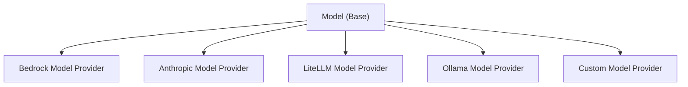

Strands Agents SDK provides an extensible interface for implementing custom model providers, allowing organizations to integrate their own LLM services while keeping implementation details private to their codebase.

## Model Provider Functionality

Custom model providers in Strands Agents support two primary interaction modes:

### Conversational Interaction

The standard conversational mode where agents exchange messages with the model. This is the default interaction pattern that is used when you call an agent directly:

<starlight-tab-item data-label="Python"> &lt;div class=&quot;expressive-code&quot;&gt;&lt;link rel=&quot;stylesheet&quot; href=&quot;/\_astro/ec.lgrc4.css&quot;/&gt;&lt;script type=&quot;module&quot; src=&quot;/\_astro/ec.0vx5m.js&quot;&gt;&lt;/script&gt;&lt;figure class=&quot;frame&quot;&gt;&lt;figcaption class=&quot;header&quot;&gt;&lt;/figcaption&gt;&lt;pre data-language=&quot;python&quot; dir=&quot;ltr&quot;&gt;&lt;code&gt;&lt;div class=&quot;ec-line&quot;&gt;&lt;div class=&quot;code&quot;&gt;&lt;span style=&quot;--0:#24292E;--1:#E1E4E8&quot;&gt;agent &lt;/span&gt;&lt;span style=&quot;--0:#BF3441;--1:#F97583&quot;&gt;=&lt;/span&gt;&lt;span style=&quot;--0:#24292E;--1:#E1E4E8&quot;&gt; Agent(&lt;/span&gt;&lt;span style=&quot;--0:#AE4B07;--1:#FFAB70&quot;&gt;model&lt;/span&gt;&lt;span style=&quot;--0:#BF3441;--1:#F97583&quot;&gt;=&lt;/span&gt;&lt;span style=&quot;--0:#24292E;--1:#E1E4E8&quot;&gt;your\_custom\_model)&lt;/span&gt;&lt;/div&gt;&lt;/div&gt;&lt;div class=&quot;ec-line&quot;&gt;&lt;div class=&quot;code&quot;&gt;&lt;span style=&quot;--0:#24292E;--1:#E1E4E8&quot;&gt;response &lt;/span&gt;&lt;span style=&quot;--0:#BF3441;--1:#F97583&quot;&gt;=&lt;/span&gt;&lt;span style=&quot;--0:#24292E;--1:#E1E4E8&quot;&gt; agent(&lt;/span&gt;&lt;span style=&quot;--0:#032F62;--1:#9ECBFF&quot;&gt;&amp;quot;Hello, how can you help me today?&amp;quot;&lt;/span&gt;&lt;span style=&quot;--0:#24292E;--1:#E1E4E8&quot;&gt;)&lt;/span&gt;&lt;/div&gt;&lt;/div&gt;&lt;/code&gt;&lt;/pre&gt;&lt;div class=&quot;copy&quot;&gt;&lt;div aria-live=&quot;polite&quot;&gt;&lt;/div&gt;&lt;button title=&quot;Copy to clipboard&quot; data-copied=&quot;Copied!&quot; data-code=&quot;agent = Agent(model=your\_custom\_model)response = agent(&amp;#34;Hello, how can you help me today?&amp;#34;)&quot;&gt;&lt;div&gt;&lt;/div&gt;&lt;/button&gt;&lt;/div&gt;&lt;/figure&gt;&lt;/div&gt; </starlight-tab-item><starlight-tab-item data-label="TypeScript"> &lt;div class=&quot;expressive-code&quot;&gt;&lt;figure class=&quot;frame&quot;&gt;&lt;figcaption class=&quot;header&quot;&gt;&lt;/figcaption&gt;&lt;pre data-language=&quot;typescript&quot; dir=&quot;ltr&quot;&gt;&lt;code&gt;&lt;div class=&quot;ec-line&quot;&gt;&lt;div class=&quot;code&quot;&gt;&lt;span style=&quot;--0:#BF3441;--1:#F97583&quot;&gt;const&lt;/span&gt;&lt;span style=&quot;--0:#24292E;--1:#E1E4E8&quot;&gt; &lt;/span&gt;&lt;span style=&quot;--0:#005CC5;--1:#79B8FF&quot;&gt;yourCustomModel&lt;/span&gt;&lt;span style=&quot;--0:#24292E;--1:#E1E4E8&quot;&gt; &lt;/span&gt;&lt;span style=&quot;--0:#BF3441;--1:#F97583&quot;&gt;=&lt;/span&gt;&lt;span style=&quot;--0:#24292E;--1:#E1E4E8&quot;&gt; &lt;/span&gt;&lt;span style=&quot;--0:#BF3441;--1:#F97583&quot;&gt;new&lt;/span&gt;&lt;span style=&quot;--0:#24292E;--1:#E1E4E8&quot;&gt; &lt;/span&gt;&lt;span style=&quot;--0:#6F42C1;--1:#B392F0&quot;&gt;YourCustomModel&lt;/span&gt;&lt;span style=&quot;--0:#24292E;--1:#E1E4E8&quot;&gt;()&lt;/span&gt;&lt;/div&gt;&lt;/div&gt;&lt;div class=&quot;ec-line&quot;&gt;&lt;div class=&quot;code&quot;&gt; &lt;/div&gt;&lt;/div&gt;&lt;div class=&quot;ec-line&quot;&gt;&lt;div class=&quot;code&quot;&gt;&lt;span style=&quot;--0:#BF3441;--1:#F97583&quot;&gt;const&lt;/span&gt;&lt;span style=&quot;--0:#24292E;--1:#E1E4E8&quot;&gt; &lt;/span&gt;&lt;span style=&quot;--0:#005CC5;--1:#79B8FF&quot;&gt;agent&lt;/span&gt;&lt;span style=&quot;--0:#24292E;--1:#E1E4E8&quot;&gt; &lt;/span&gt;&lt;span style=&quot;--0:#BF3441;--1:#F97583&quot;&gt;=&lt;/span&gt;&lt;span style=&quot;--0:#24292E;--1:#E1E4E8&quot;&gt; &lt;/span&gt;&lt;span style=&quot;--0:#BF3441;--1:#F97583&quot;&gt;new&lt;/span&gt;&lt;span style=&quot;--0:#24292E;--1:#E1E4E8&quot;&gt; &lt;/span&gt;&lt;span style=&quot;--0:#6F42C1;--1:#B392F0&quot;&gt;Agent&lt;/span&gt;&lt;span style=&quot;--0:#24292E;--1:#E1E4E8&quot;&gt;({ model: yourCustomModel })&lt;/span&gt;&lt;/div&gt;&lt;/div&gt;&lt;div class=&quot;ec-line&quot;&gt;&lt;div class=&quot;code&quot;&gt;&lt;span style=&quot;--0:#BF3441;--1:#F97583&quot;&gt;const&lt;/span&gt;&lt;span style=&quot;--0:#24292E;--1:#E1E4E8&quot;&gt; &lt;/span&gt;&lt;span style=&quot;--0:#005CC5;--1:#79B8FF&quot;&gt;response&lt;/span&gt;&lt;span style=&quot;--0:#24292E;--1:#E1E4E8&quot;&gt; &lt;/span&gt;&lt;span style=&quot;--0:#BF3441;--1:#F97583&quot;&gt;=&lt;/span&gt;&lt;span style=&quot;--0:#24292E;--1:#E1E4E8&quot;&gt; &lt;/span&gt;&lt;span style=&quot;--0:#BF3441;--1:#F97583&quot;&gt;await&lt;/span&gt;&lt;span style=&quot;--0:#24292E;--1:#E1E4E8&quot;&gt; agent.&lt;/span&gt;&lt;span style=&quot;--0:#6F42C1;--1:#B392F0&quot;&gt;invoke&lt;/span&gt;&lt;span style=&quot;--0:#24292E;--1:#E1E4E8&quot;&gt;(&lt;/span&gt;&lt;span style=&quot;--0:#032F62;--1:#9ECBFF&quot;&gt;&amp;#39;Hello, how can you help me today?&amp;#39;&lt;/span&gt;&lt;span style=&quot;--0:#24292E;--1:#E1E4E8&quot;&gt;)&lt;/span&gt;&lt;/div&gt;&lt;/div&gt;&lt;/code&gt;&lt;/pre&gt;&lt;div class=&quot;copy&quot;&gt;&lt;div aria-live=&quot;polite&quot;&gt;&lt;/div&gt;&lt;button title=&quot;Copy to clipboard&quot; data-copied=&quot;Copied!&quot; data-code=&quot;const yourCustomModel = new YourCustomModel()const agent = new Agent({ model: yourCustomModel })const response = await agent.invoke(&#39;Hello, how can you help me today?&#39;)&quot;&gt;&lt;div&gt;&lt;/div&gt;&lt;/button&gt;&lt;/div&gt;&lt;/figure&gt;&lt;/div&gt; </starlight-tab-item>

This invokes the underlying model provided to the agent.

### Structured Output

A specialized mode that returns type-safe, validated responses using validated data models instead of raw text. This enables reliable data extraction and processing:

<starlight-tab-item data-label="Python"> &lt;div class=&quot;expressive-code&quot;&gt;&lt;figure class=&quot;frame&quot;&gt;&lt;figcaption class=&quot;header&quot;&gt;&lt;/figcaption&gt;&lt;pre data-language=&quot;python&quot; dir=&quot;ltr&quot;&gt;&lt;code&gt;&lt;div class=&quot;ec-line&quot;&gt;&lt;div class=&quot;code&quot;&gt;&lt;span style=&quot;--0:#BF3441;--1:#F97583&quot;&gt;from&lt;/span&gt;&lt;span style=&quot;--0:#24292E;--1:#E1E4E8&quot;&gt; pydantic &lt;/span&gt;&lt;span style=&quot;--0:#BF3441;--1:#F97583&quot;&gt;import&lt;/span&gt;&lt;span style=&quot;--0:#24292E;--1:#E1E4E8&quot;&gt; BaseModel&lt;/span&gt;&lt;/div&gt;&lt;/div&gt;&lt;div class=&quot;ec-line&quot;&gt;&lt;div class=&quot;code&quot;&gt; &lt;/div&gt;&lt;/div&gt;&lt;div class=&quot;ec-line&quot;&gt;&lt;div class=&quot;code&quot;&gt;&lt;span style=&quot;--0:#BF3441;--1:#F97583&quot;&gt;class&lt;/span&gt;&lt;span style=&quot;--0:#24292E;--1:#E1E4E8&quot;&gt; &lt;/span&gt;&lt;span style=&quot;--0:#6F42C1;--1:#B392F0&quot;&gt;PersonInfo&lt;/span&gt;&lt;span style=&quot;--0:#24292E;--1:#E1E4E8&quot;&gt;(&lt;/span&gt;&lt;span style=&quot;--0:#6F42C1;--1:#B392F0&quot;&gt;BaseModel&lt;/span&gt;&lt;span style=&quot;--0:#24292E;--1:#E1E4E8&quot;&gt;):&lt;/span&gt;&lt;/div&gt;&lt;/div&gt;&lt;div class=&quot;ec-line&quot;&gt;&lt;div class=&quot;code&quot;&gt;&lt;span class=&quot;indent&quot;&gt;&lt;span style=&quot;--0:#24292E;--1:#E1E4E8&quot;&gt; &lt;/span&gt;&lt;/span&gt;&lt;span style=&quot;--0:#24292E;--1:#E1E4E8&quot;&gt;name: &lt;/span&gt;&lt;span style=&quot;--0:#005CC5;--1:#79B8FF&quot;&gt;str&lt;/span&gt;&lt;/div&gt;&lt;/div&gt;&lt;div class=&quot;ec-line&quot;&gt;&lt;div class=&quot;code&quot;&gt;&lt;span class=&quot;indent&quot;&gt;&lt;span style=&quot;--0:#24292E;--1:#E1E4E8&quot;&gt; &lt;/span&gt;&lt;/span&gt;&lt;span style=&quot;--0:#24292E;--1:#E1E4E8&quot;&gt;age: &lt;/span&gt;&lt;span style=&quot;--0:#005CC5;--1:#79B8FF&quot;&gt;int&lt;/span&gt;&lt;/div&gt;&lt;/div&gt;&lt;div class=&quot;ec-line&quot;&gt;&lt;div class=&quot;code&quot;&gt;&lt;span class=&quot;indent&quot;&gt;&lt;span style=&quot;--0:#24292E;--1:#E1E4E8&quot;&gt; &lt;/span&gt;&lt;/span&gt;&lt;span style=&quot;--0:#24292E;--1:#E1E4E8&quot;&gt;occupation: &lt;/span&gt;&lt;span style=&quot;--0:#005CC5;--1:#79B8FF&quot;&gt;str&lt;/span&gt;&lt;/div&gt;&lt;/div&gt;&lt;div class=&quot;ec-line&quot;&gt;&lt;div class=&quot;code&quot;&gt; &lt;/div&gt;&lt;/div&gt;&lt;div class=&quot;ec-line&quot;&gt;&lt;div class=&quot;code&quot;&gt;&lt;span style=&quot;--0:#24292E;--1:#E1E4E8&quot;&gt;result &lt;/span&gt;&lt;span style=&quot;--0:#BF3441;--1:#F97583&quot;&gt;=&lt;/span&gt;&lt;span style=&quot;--0:#24292E;--1:#E1E4E8&quot;&gt; agent.structured\_output(&lt;/span&gt;&lt;/div&gt;&lt;/div&gt;&lt;div class=&quot;ec-line&quot;&gt;&lt;div class=&quot;code&quot;&gt;&lt;span class=&quot;indent&quot;&gt;&lt;span style=&quot;--0:#24292E;--1:#E1E4E8&quot;&gt; &lt;/span&gt;&lt;/span&gt;&lt;span style=&quot;--0:#24292E;--1:#E1E4E8&quot;&gt;PersonInfo,&lt;/span&gt;&lt;/div&gt;&lt;/div&gt;&lt;div class=&quot;ec-line&quot;&gt;&lt;div class=&quot;code&quot;&gt;&lt;span class=&quot;indent&quot;&gt; &lt;/span&gt;&lt;span style=&quot;--0:#032F62;--1:#9ECBFF&quot;&gt;&amp;quot;Extract info: John Smith is a 30-year-old software engineer&amp;quot;&lt;/span&gt;&lt;/div&gt;&lt;/div&gt;&lt;div class=&quot;ec-line&quot;&gt;&lt;div class=&quot;code&quot;&gt;&lt;span style=&quot;--0:#24292E;--1:#E1E4E8&quot;&gt;)&lt;/span&gt;&lt;/div&gt;&lt;/div&gt;&lt;div class=&quot;ec-line&quot;&gt;&lt;div class=&quot;code&quot;&gt;&lt;span style=&quot;--0:#616972;--1:#99A0A6&quot;&gt;# Returns a validated PersonInfo object&lt;/span&gt;&lt;/div&gt;&lt;/div&gt;&lt;/code&gt;&lt;/pre&gt;&lt;div class=&quot;copy&quot;&gt;&lt;div aria-live=&quot;polite&quot;&gt;&lt;/div&gt;&lt;button title=&quot;Copy to clipboard&quot; data-copied=&quot;Copied!&quot; data-code=&quot;from pydantic import BaseModelclass PersonInfo(BaseModel): name: str age: int occupation: strresult = agent.structured\_output( PersonInfo, &amp;#34;Extract info: John Smith is a 30-year-old software engineer&amp;#34;)# Returns a validated PersonInfo object&quot;&gt;&lt;div&gt;&lt;/div&gt;&lt;/button&gt;&lt;/div&gt;&lt;/figure&gt;&lt;/div&gt; </starlight-tab-item><starlight-tab-item data-label="TypeScript"> &lt;div class=&quot;expressive-code&quot;&gt;&lt;figure class=&quot;frame&quot;&gt;&lt;figcaption class=&quot;header&quot;&gt;&lt;/figcaption&gt;&lt;pre data-language=&quot;ts&quot; dir=&quot;ltr&quot;&gt;&lt;code&gt;&lt;div class=&quot;ec-line&quot;&gt;&lt;div class=&quot;code&quot;&gt;&lt;span style=&quot;--0:#616972;--1:#99A0A6&quot;&gt;// Structured output is not available for custom model providers in TypeScript&lt;/span&gt;&lt;/div&gt;&lt;/div&gt;&lt;/code&gt;&lt;/pre&gt;&lt;div class=&quot;copy&quot;&gt;&lt;div aria-live=&quot;polite&quot;&gt;&lt;/div&gt;&lt;button title=&quot;Copy to clipboard&quot; data-copied=&quot;Copied!&quot; data-code=&quot;// Structured output is not available for custom model providers in TypeScript&quot;&gt;&lt;div&gt;&lt;/div&gt;&lt;/button&gt;&lt;/div&gt;&lt;/figure&gt;&lt;/div&gt; </starlight-tab-item>

Both modes work through the same underlying model provider interface, with structured output using tool calling capabilities to ensure schema compliance.

## Model Provider Architecture

Strands Agents uses an abstract `Model` class that defines the standard interface all model providers must implement:

## Implementation Overview

The process for implementing a custom model provider is similar across both languages:

<starlight-tab-item data-label="Python"> &lt;p&gt;In Python, you extend the &lt;code dir=&quot;auto&quot;&gt;Model&lt;/code&gt; class from &lt;code dir=&quot;auto&quot;&gt;strands.models&lt;/code&gt; and implement the required abstract methods:&lt;/p&gt;&lt;ul&gt; &lt;li&gt;&lt;code dir=&quot;auto&quot;&gt;stream()&lt;/code&gt;: Core method that handles model invocation and returns streaming events&lt;/li&gt; &lt;li&gt;&lt;code dir=&quot;auto&quot;&gt;update\_config()&lt;/code&gt;: Updates the model configuration&lt;/li&gt; &lt;li&gt;&lt;code dir=&quot;auto&quot;&gt;get\_config()&lt;/code&gt;: Returns the current model configuration&lt;/li&gt; &lt;/ul&gt;&lt;p&gt;The Python implementation uses async generators to yield &lt;code dir=&quot;auto&quot;&gt;StreamEvent&lt;/code&gt; objects.&lt;/p&gt; </starlight-tab-item><starlight-tab-item data-label="TypeScript"> &lt;p&gt;In TypeScript, you extend the &lt;code dir=&quot;auto&quot;&gt;Model&lt;/code&gt; class from &lt;code dir=&quot;auto&quot;&gt;@strands-agents/sdk&lt;/code&gt; and implement the required abstract methods:&lt;/p&gt;&lt;ul&gt; &lt;li&gt;&lt;code dir=&quot;auto&quot;&gt;stream()&lt;/code&gt;: Core method that handles model invocation and returns streaming events&lt;/li&gt; &lt;li&gt;&lt;code dir=&quot;auto&quot;&gt;updateConfig()&lt;/code&gt;: Updates the model configuration&lt;/li&gt; &lt;li&gt;&lt;code dir=&quot;auto&quot;&gt;getConfig()&lt;/code&gt;: Returns the current model configuration&lt;/li&gt; &lt;/ul&gt;&lt;p&gt;The TypeScript implementation uses async iterables to yield &lt;code dir=&quot;auto&quot;&gt;ModelStreamEvent&lt;/code&gt; objects.&lt;/p&gt;&lt;p&gt;&lt;strong&gt;TypeScript Model Reference&lt;/strong&gt;: The &lt;code dir=&quot;auto&quot;&gt;Model&lt;/code&gt; abstract class is available in the TypeScript SDK at &lt;code dir=&quot;auto&quot;&gt;src/models/model.ts&lt;/code&gt;. You can extend this class to create custom model providers that integrate with your own LLM services.&lt;/p&gt; </starlight-tab-item>

## Implementing a Custom Model Provider

### 1\. Create Your Model Class

Create a new module in your codebase that extends the Strands Agents `Model` class.

<starlight-tab-item data-label="Python"> &lt;p&gt;Create a new Python module that extends the &lt;code dir=&quot;auto&quot;&gt;Model&lt;/code&gt; class. Set up a &lt;code dir=&quot;auto&quot;&gt;ModelConfig&lt;/code&gt; to hold the configurations for invoking the model.&lt;/p&gt;&lt;div class=&quot;expressive-code&quot;&gt;&lt;figure class=&quot;frame has-title&quot;&gt;&lt;figcaption class=&quot;header&quot;&gt;&lt;span class=&quot;title&quot;&gt;your\_org/models/custom\_model.py&lt;/span&gt;&lt;/figcaption&gt;&lt;pre data-language=&quot;python&quot; dir=&quot;ltr&quot;&gt;&lt;code&gt;&lt;div class=&quot;ec-line&quot;&gt;&lt;div class=&quot;code&quot;&gt;&lt;span style=&quot;--0:#BF3441;--1:#F97583&quot;&gt;import&lt;/span&gt;&lt;span style=&quot;--0:#24292E;--1:#E1E4E8&quot;&gt; logging&lt;/span&gt;&lt;/div&gt;&lt;/div&gt;&lt;div class=&quot;ec-line&quot;&gt;&lt;div class=&quot;code&quot;&gt;&lt;span style=&quot;--0:#BF3441;--1:#F97583&quot;&gt;import&lt;/span&gt;&lt;span style=&quot;--0:#24292E;--1:#E1E4E8&quot;&gt; os&lt;/span&gt;&lt;/div&gt;&lt;/div&gt;&lt;div class=&quot;ec-line&quot;&gt;&lt;div class=&quot;code&quot;&gt;&lt;span style=&quot;--0:#BF3441;--1:#F97583&quot;&gt;from&lt;/span&gt;&lt;span style=&quot;--0:#24292E;--1:#E1E4E8&quot;&gt; typing &lt;/span&gt;&lt;span style=&quot;--0:#BF3441;--1:#F97583&quot;&gt;import&lt;/span&gt;&lt;span style=&quot;--0:#24292E;--1:#E1E4E8&quot;&gt; Any, Iterable, Optional, TypedDict&lt;/span&gt;&lt;/div&gt;&lt;/div&gt;&lt;div class=&quot;ec-line&quot;&gt;&lt;div class=&quot;code&quot;&gt;&lt;span style=&quot;--0:#BF3441;--1:#F97583&quot;&gt;from&lt;/span&gt;&lt;span style=&quot;--0:#24292E;--1:#E1E4E8&quot;&gt; typing\_extensions &lt;/span&gt;&lt;span style=&quot;--0:#BF3441;--1:#F97583&quot;&gt;import&lt;/span&gt;&lt;span style=&quot;--0:#24292E;--1:#E1E4E8&quot;&gt; Unpack&lt;/span&gt;&lt;/div&gt;&lt;/div&gt;&lt;div class=&quot;ec-line&quot;&gt;&lt;div class=&quot;code&quot;&gt; &lt;/div&gt;&lt;/div&gt;&lt;div class=&quot;ec-line&quot;&gt;&lt;div class=&quot;code&quot;&gt;&lt;span style=&quot;--0:#BF3441;--1:#F97583&quot;&gt;from&lt;/span&gt;&lt;span style=&quot;--0:#24292E;--1:#E1E4E8&quot;&gt; custom.model &lt;/span&gt;&lt;span style=&quot;--0:#BF3441;--1:#F97583&quot;&gt;import&lt;/span&gt;&lt;span style=&quot;--0:#24292E;--1:#E1E4E8&quot;&gt; CustomModelClient&lt;/span&gt;&lt;/div&gt;&lt;/div&gt;&lt;div class=&quot;ec-line&quot;&gt;&lt;div class=&quot;code&quot;&gt; &lt;/div&gt;&lt;/div&gt;&lt;div class=&quot;ec-line&quot;&gt;&lt;div class=&quot;code&quot;&gt;&lt;span style=&quot;--0:#BF3441;--1:#F97583&quot;&gt;from&lt;/span&gt;&lt;span style=&quot;--0:#24292E;--1:#E1E4E8&quot;&gt; strands.models &lt;/span&gt;&lt;span style=&quot;--0:#BF3441;--1:#F97583&quot;&gt;import&lt;/span&gt;&lt;span style=&quot;--0:#24292E;--1:#E1E4E8&quot;&gt; Model&lt;/span&gt;&lt;/div&gt;&lt;/div&gt;&lt;div class=&quot;ec-line&quot;&gt;&lt;div class=&quot;code&quot;&gt;&lt;span style=&quot;--0:#BF3441;--1:#F97583&quot;&gt;from&lt;/span&gt;&lt;span style=&quot;--0:#24292E;--1:#E1E4E8&quot;&gt; strands.types.content &lt;/span&gt;&lt;span style=&quot;--0:#BF3441;--1:#F97583&quot;&gt;import&lt;/span&gt;&lt;span style=&quot;--0:#24292E;--1:#E1E4E8&quot;&gt; Messages&lt;/span&gt;&lt;/div&gt;&lt;/div&gt;&lt;div class=&quot;ec-line&quot;&gt;&lt;div class=&quot;code&quot;&gt;&lt;span style=&quot;--0:#BF3441;--1:#F97583&quot;&gt;from&lt;/span&gt;&lt;span style=&quot;--0:#24292E;--1:#E1E4E8&quot;&gt; strands.types.streaming &lt;/span&gt;&lt;span style=&quot;--0:#BF3441;--1:#F97583&quot;&gt;import&lt;/span&gt;&lt;span style=&quot;--0:#24292E;--1:#E1E4E8&quot;&gt; StreamEvent&lt;/span&gt;&lt;/div&gt;&lt;/div&gt;&lt;div class=&quot;ec-line&quot;&gt;&lt;div class=&quot;code&quot;&gt;&lt;span style=&quot;--0:#BF3441;--1:#F97583&quot;&gt;from&lt;/span&gt;&lt;span style=&quot;--0:#24292E;--1:#E1E4E8&quot;&gt; strands.types.tools &lt;/span&gt;&lt;span style=&quot;--0:#BF3441;--1:#F97583&quot;&gt;import&lt;/span&gt;&lt;span style=&quot;--0:#24292E;--1:#E1E4E8&quot;&gt; ToolSpec&lt;/span&gt;&lt;/div&gt;&lt;/div&gt;&lt;div class=&quot;ec-line&quot;&gt;&lt;div class=&quot;code&quot;&gt; &lt;/div&gt;&lt;/div&gt;&lt;div class=&quot;ec-line&quot;&gt;&lt;div class=&quot;code&quot;&gt;&lt;span style=&quot;--0:#24292E;--1:#E1E4E8&quot;&gt;logger &lt;/span&gt;&lt;span style=&quot;--0:#BF3441;--1:#F97583&quot;&gt;=&lt;/span&gt;&lt;span style=&quot;--0:#24292E;--1:#E1E4E8&quot;&gt; logging.getLogger(&lt;/span&gt;&lt;span style=&quot;--0:#005CC5;--1:#79B8FF&quot;&gt;\_\_name\_\_&lt;/span&gt;&lt;span style=&quot;--0:#24292E;--1:#E1E4E8&quot;&gt;)&lt;/span&gt;&lt;/div&gt;&lt;/div&gt;&lt;div class=&quot;ec-line&quot;&gt;&lt;div class=&quot;code&quot;&gt; &lt;/div&gt;&lt;/div&gt;&lt;div class=&quot;ec-line&quot;&gt;&lt;div class=&quot;code&quot;&gt; &lt;/div&gt;&lt;/div&gt;&lt;div class=&quot;ec-line&quot;&gt;&lt;div class=&quot;code&quot;&gt;&lt;span style=&quot;--0:#BF3441;--1:#F97583&quot;&gt;class&lt;/span&gt;&lt;span style=&quot;--0:#24292E;--1:#E1E4E8&quot;&gt; &lt;/span&gt;&lt;span style=&quot;--0:#6F42C1;--1:#B392F0&quot;&gt;CustomModel&lt;/span&gt;&lt;span style=&quot;--0:#24292E;--1:#E1E4E8&quot;&gt;(&lt;/span&gt;&lt;span style=&quot;--0:#6F42C1;--1:#B392F0&quot;&gt;Model&lt;/span&gt;&lt;span style=&quot;--0:#24292E;--1:#E1E4E8&quot;&gt;):&lt;/span&gt;&lt;/div&gt;&lt;/div&gt;&lt;div class=&quot;ec-line&quot;&gt;&lt;div class=&quot;code&quot;&gt;&lt;span class=&quot;indent&quot;&gt; &lt;/span&gt;&lt;span style=&quot;--0:#032F62;--1:#9ECBFF&quot;&gt;&amp;quot;&amp;quot;&amp;quot;Your custom model provider implementation.&amp;quot;&amp;quot;&amp;quot;&lt;/span&gt;&lt;/div&gt;&lt;/div&gt;&lt;div class=&quot;ec-line&quot;&gt;&lt;div class=&quot;code&quot;&gt; &lt;/div&gt;&lt;/div&gt;&lt;div class=&quot;ec-line&quot;&gt;&lt;div class=&quot;code&quot;&gt;&lt;span class=&quot;indent&quot;&gt; &lt;/span&gt;&lt;span style=&quot;--0:#BF3441;--1:#F97583&quot;&gt;class&lt;/span&gt;&lt;span style=&quot;--0:#24292E;--1:#E1E4E8&quot;&gt; &lt;/span&gt;&lt;span style=&quot;--0:#6F42C1;--1:#B392F0&quot;&gt;ModelConfig&lt;/span&gt;&lt;span style=&quot;--0:#24292E;--1:#E1E4E8&quot;&gt;(&lt;/span&gt;&lt;span style=&quot;--0:#6F42C1;--1:#B392F0&quot;&gt;TypedDict&lt;/span&gt;&lt;span style=&quot;--0:#24292E;--1:#E1E4E8&quot;&gt;):&lt;/span&gt;&lt;/div&gt;&lt;/div&gt;&lt;div class=&quot;ec-line&quot;&gt;&lt;div class=&quot;code&quot;&gt;&lt;span class=&quot;indent&quot;&gt; &lt;/span&gt;&lt;span style=&quot;--0:#032F62;--1:#9ECBFF&quot;&gt;&amp;quot;&amp;quot;&amp;quot;&lt;/span&gt;&lt;/div&gt;&lt;/div&gt;&lt;div class=&quot;ec-line&quot;&gt;&lt;div class=&quot;code&quot;&gt;&lt;span class=&quot;indent&quot;&gt;&lt;span style=&quot;--0:#032F62;--1:#9ECBFF&quot;&gt; &lt;/span&gt;&lt;/span&gt;&lt;span style=&quot;--0:#032F62;--1:#9ECBFF&quot;&gt;Configuration your model.&lt;/span&gt;&lt;/div&gt;&lt;/div&gt;&lt;div class=&quot;ec-line&quot;&gt;&lt;div class=&quot;code&quot;&gt; &lt;/div&gt;&lt;/div&gt;&lt;div class=&quot;ec-line&quot;&gt;&lt;div class=&quot;code&quot;&gt;&lt;span class=&quot;indent&quot;&gt;&lt;span style=&quot;--0:#032F62;--1:#9ECBFF&quot;&gt; &lt;/span&gt;&lt;/span&gt;&lt;span style=&quot;--0:#032F62;--1:#9ECBFF&quot;&gt;Attributes:&lt;/span&gt;&lt;/div&gt;&lt;/div&gt;&lt;div class=&quot;ec-line&quot;&gt;&lt;div class=&quot;code&quot;&gt;&lt;span class=&quot;indent&quot;&gt;&lt;span style=&quot;--0:#032F62;--1:#9ECBFF&quot;&gt; &lt;/span&gt;&lt;/span&gt;&lt;span style=&quot;--0:#032F62;--1:#9ECBFF&quot;&gt;model\_id: ID of Custom model.&lt;/span&gt;&lt;/div&gt;&lt;/div&gt;&lt;div class=&quot;ec-line&quot;&gt;&lt;div class=&quot;code&quot;&gt;&lt;span class=&quot;indent&quot;&gt;&lt;span style=&quot;--0:#032F62;--1:#9ECBFF&quot;&gt; &lt;/span&gt;&lt;/span&gt;&lt;span style=&quot;--0:#032F62;--1:#9ECBFF&quot;&gt;params: Model parameters (e.g., max\_tokens).&lt;/span&gt;&lt;/div&gt;&lt;/div&gt;&lt;div class=&quot;ec-line&quot;&gt;&lt;div class=&quot;code&quot;&gt;&lt;span class=&quot;indent&quot;&gt;&lt;span style=&quot;--0:#032F62;--1:#9ECBFF&quot;&gt; &lt;/span&gt;&lt;/span&gt;&lt;span style=&quot;--0:#032F62;--1:#9ECBFF&quot;&gt;&amp;quot;&amp;quot;&amp;quot;&lt;/span&gt;&lt;/div&gt;&lt;/div&gt;&lt;div class=&quot;ec-line&quot;&gt;&lt;div class=&quot;code&quot;&gt;&lt;span class=&quot;indent&quot;&gt;&lt;span style=&quot;--0:#24292E;--1:#E1E4E8&quot;&gt; &lt;/span&gt;&lt;/span&gt;&lt;span style=&quot;--0:#24292E;--1:#E1E4E8&quot;&gt;model\_id: &lt;/span&gt;&lt;span style=&quot;--0:#005CC5;--1:#79B8FF&quot;&gt;str&lt;/span&gt;&lt;/div&gt;&lt;/div&gt;&lt;div class=&quot;ec-line&quot;&gt;&lt;div class=&quot;code&quot;&gt;&lt;span class=&quot;indent&quot;&gt;&lt;span style=&quot;--0:#24292E;--1:#E1E4E8&quot;&gt; &lt;/span&gt;&lt;/span&gt;&lt;span style=&quot;--0:#24292E;--1:#E1E4E8&quot;&gt;params: Optional\[dict\[&lt;/span&gt;&lt;span style=&quot;--0:#005CC5;--1:#79B8FF&quot;&gt;str&lt;/span&gt;&lt;span style=&quot;--0:#24292E;--1:#E1E4E8&quot;&gt;, Any\]\]&lt;/span&gt;&lt;/div&gt;&lt;/div&gt;&lt;div class=&quot;ec-line&quot;&gt;&lt;div class=&quot;code&quot;&gt;&lt;span class=&quot;indent&quot;&gt; &lt;/span&gt;&lt;span style=&quot;--0:#616972;--1:#99A0A6&quot;&gt;# Add any additional configuration parameters specific to your model&lt;/span&gt;&lt;/div&gt;&lt;/div&gt;&lt;div class=&quot;ec-line&quot;&gt;&lt;div class=&quot;code&quot;&gt; &lt;/div&gt;&lt;/div&gt;&lt;div class=&quot;ec-line&quot;&gt;&lt;div class=&quot;code&quot;&gt;&lt;span class=&quot;indent&quot;&gt; &lt;/span&gt;&lt;span style=&quot;--0:#BF3441;--1:#F97583&quot;&gt;def&lt;/span&gt;&lt;span style=&quot;--0:#24292E;--1:#E1E4E8&quot;&gt; &lt;/span&gt;&lt;span style=&quot;--0:#005CC5;--1:#79B8FF&quot;&gt;\_\_init\_\_&lt;/span&gt;&lt;span style=&quot;--0:#24292E;--1:#E1E4E8&quot;&gt;(&lt;/span&gt;&lt;/div&gt;&lt;/div&gt;&lt;div class=&quot;ec-line&quot;&gt;&lt;div class=&quot;code&quot;&gt;&lt;span class=&quot;indent&quot;&gt;&lt;span style=&quot;--0:#24292E;--1:#E1E4E8&quot;&gt; &lt;/span&gt;&lt;/span&gt;&lt;span style=&quot;--0:#24292E;--1:#E1E4E8&quot;&gt;self,&lt;/span&gt;&lt;/div&gt;&lt;/div&gt;&lt;div class=&quot;ec-line&quot;&gt;&lt;div class=&quot;code&quot;&gt;&lt;span class=&quot;indent&quot;&gt;&lt;span style=&quot;--0:#24292E;--1:#E1E4E8&quot;&gt; &lt;/span&gt;&lt;/span&gt;&lt;span style=&quot;--0:#24292E;--1:#E1E4E8&quot;&gt;api\_key: &lt;/span&gt;&lt;span style=&quot;--0:#005CC5;--1:#79B8FF&quot;&gt;str&lt;/span&gt;&lt;span style=&quot;--0:#24292E;--1:#E1E4E8&quot;&gt;,&lt;/span&gt;&lt;/div&gt;&lt;/div&gt;&lt;div class=&quot;ec-line&quot;&gt;&lt;div class=&quot;code&quot;&gt;&lt;span class=&quot;indent&quot;&gt; &lt;/span&gt;&lt;span style=&quot;--0:#BF3441;--1:#F97583&quot;&gt;\*&lt;/span&gt;&lt;span style=&quot;--0:#24292E;--1:#E1E4E8&quot;&gt;,&lt;/span&gt;&lt;/div&gt;&lt;/div&gt;&lt;div class=&quot;ec-line&quot;&gt;&lt;div class=&quot;code&quot;&gt;&lt;span class=&quot;indent&quot;&gt; &lt;/span&gt;&lt;span style=&quot;--0:#BF3441;--1:#F97583&quot;&gt;\*\*&lt;/span&gt;&lt;span style=&quot;--0:#24292E;--1:#E1E4E8&quot;&gt;model\_config: Unpack\[ModelConfig\]&lt;/span&gt;&lt;/div&gt;&lt;/div&gt;&lt;div class=&quot;ec-line&quot;&gt;&lt;div class=&quot;code&quot;&gt;&lt;span class=&quot;indent&quot;&gt;&lt;span style=&quot;--0:#24292E;--1:#E1E4E8&quot;&gt; &lt;/span&gt;&lt;/span&gt;&lt;span style=&quot;--0:#24292E;--1:#E1E4E8&quot;&gt;) -&amp;gt; &lt;/span&gt;&lt;span style=&quot;--0:#005CC5;--1:#79B8FF&quot;&gt;None&lt;/span&gt;&lt;span style=&quot;--0:#24292E;--1:#E1E4E8&quot;&gt;:&lt;/span&gt;&lt;/div&gt;&lt;/div&gt;&lt;div class=&quot;ec-line&quot;&gt;&lt;div class=&quot;code&quot;&gt;&lt;span class=&quot;indent&quot;&gt; &lt;/span&gt;&lt;span style=&quot;--0:#032F62;--1:#9ECBFF&quot;&gt;&amp;quot;&amp;quot;&amp;quot;Initialize provider instance.&lt;/span&gt;&lt;/div&gt;&lt;/div&gt;&lt;div class=&quot;ec-line&quot;&gt;&lt;div class=&quot;code&quot;&gt; &lt;/div&gt;&lt;/div&gt;&lt;div class=&quot;ec-line&quot;&gt;&lt;div class=&quot;code&quot;&gt;&lt;span class=&quot;indent&quot;&gt;&lt;span style=&quot;--0:#032F62;--1:#9ECBFF&quot;&gt; &lt;/span&gt;&lt;/span&gt;&lt;span style=&quot;--0:#032F62;--1:#9ECBFF&quot;&gt;Args:&lt;/span&gt;&lt;/div&gt;&lt;/div&gt;&lt;div class=&quot;ec-line&quot;&gt;&lt;div class=&quot;code&quot;&gt;&lt;span class=&quot;indent&quot;&gt;&lt;span style=&quot;--0:#032F62;--1:#9ECBFF&quot;&gt; &lt;/span&gt;&lt;/span&gt;&lt;span style=&quot;--0:#032F62;--1:#9ECBFF&quot;&gt;api\_key: The API key for connecting to your Custom model.&lt;/span&gt;&lt;/div&gt;&lt;/div&gt;&lt;div class=&quot;ec-line&quot;&gt;&lt;div class=&quot;code&quot;&gt;&lt;span class=&quot;indent&quot;&gt;&lt;span style=&quot;--0:#032F62;--1:#9ECBFF&quot;&gt; &lt;/span&gt;&lt;/span&gt;&lt;span style=&quot;--0:#032F62;--1:#9ECBFF&quot;&gt;\*\*model\_config: Configuration options for Custom model.&lt;/span&gt;&lt;/div&gt;&lt;/div&gt;&lt;div class=&quot;ec-line&quot;&gt;&lt;div class=&quot;code&quot;&gt;&lt;span class=&quot;indent&quot;&gt;&lt;span style=&quot;--0:#032F62;--1:#9ECBFF&quot;&gt; &lt;/span&gt;&lt;/span&gt;&lt;span style=&quot;--0:#032F62;--1:#9ECBFF&quot;&gt;&amp;quot;&amp;quot;&amp;quot;&lt;/span&gt;&lt;/div&gt;&lt;/div&gt;&lt;div class=&quot;ec-line&quot;&gt;&lt;div class=&quot;code&quot;&gt;&lt;span class=&quot;indent&quot;&gt; &lt;/span&gt;&lt;span style=&quot;--0:#005CC5;--1:#79B8FF&quot;&gt;self&lt;/span&gt;&lt;span style=&quot;--0:#24292E;--1:#E1E4E8&quot;&gt;.config &lt;/span&gt;&lt;span style=&quot;--0:#BF3441;--1:#F97583&quot;&gt;=&lt;/span&gt;&lt;span style=&quot;--0:#24292E;--1:#E1E4E8&quot;&gt; CustomModel.ModelConfig(&lt;/span&gt;&lt;span style=&quot;--0:#BF3441;--1:#F97583&quot;&gt;\*\*&lt;/span&gt;&lt;span style=&quot;--0:#24292E;--1:#E1E4E8&quot;&gt;model\_config)&lt;/span&gt;&lt;/div&gt;&lt;/div&gt;&lt;div class=&quot;ec-line&quot;&gt;&lt;div class=&quot;code&quot;&gt;&lt;span class=&quot;indent&quot;&gt;&lt;span style=&quot;--0:#24292E;--1:#E1E4E8&quot;&gt; &lt;/span&gt;&lt;/span&gt;&lt;span style=&quot;--0:#24292E;--1:#E1E4E8&quot;&gt;logger.debug(&lt;/span&gt;&lt;span style=&quot;--0:#032F62;--1:#9ECBFF&quot;&gt;&amp;quot;config=&amp;lt;&lt;/span&gt;&lt;span style=&quot;--0:#005CC5;--1:#79B8FF&quot;&gt;%s&lt;/span&gt;&lt;span style=&quot;--0:#032F62;--1:#9ECBFF&quot;&gt;&amp;gt; | initializing&amp;quot;&lt;/span&gt;&lt;span style=&quot;--0:#24292E;--1:#E1E4E8&quot;&gt;, &lt;/span&gt;&lt;span style=&quot;--0:#005CC5;--1:#79B8FF&quot;&gt;self&lt;/span&gt;&lt;span style=&quot;--0:#24292E;--1:#E1E4E8&quot;&gt;.config)&lt;/span&gt;&lt;/div&gt;&lt;/div&gt;&lt;div class=&quot;ec-line&quot;&gt;&lt;div class=&quot;code&quot;&gt; &lt;/div&gt;&lt;/div&gt;&lt;div class=&quot;ec-line&quot;&gt;&lt;div class=&quot;code&quot;&gt;&lt;span class=&quot;indent&quot;&gt; &lt;/span&gt;&lt;span style=&quot;--0:#005CC5;--1:#79B8FF&quot;&gt;self&lt;/span&gt;&lt;span style=&quot;--0:#24292E;--1:#E1E4E8&quot;&gt;.client &lt;/span&gt;&lt;span style=&quot;--0:#BF3441;--1:#F97583&quot;&gt;=&lt;/span&gt;&lt;span style=&quot;--0:#24292E;--1:#E1E4E8&quot;&gt; CustomModelClient(api\_key)&lt;/span&gt;&lt;/div&gt;&lt;/div&gt;&lt;div class=&quot;ec-line&quot;&gt;&lt;div class=&quot;code&quot;&gt; &lt;/div&gt;&lt;/div&gt;&lt;div class=&quot;ec-line&quot;&gt;&lt;div class=&quot;code&quot;&gt;&lt;span class=&quot;indent&quot;&gt; &lt;/span&gt;&lt;span style=&quot;--0:#6F42C1;--1:#B392F0&quot;&gt;@override&lt;/span&gt;&lt;/div&gt;&lt;/div&gt;&lt;div class=&quot;ec-line&quot;&gt;&lt;div class=&quot;code&quot;&gt;&lt;span class=&quot;indent&quot;&gt; &lt;/span&gt;&lt;span style=&quot;--0:#BF3441;--1:#F97583&quot;&gt;def&lt;/span&gt;&lt;span style=&quot;--0:#24292E;--1:#E1E4E8&quot;&gt; &lt;/span&gt;&lt;span style=&quot;--0:#6F42C1;--1:#B392F0&quot;&gt;update\_config&lt;/span&gt;&lt;span style=&quot;--0:#24292E;--1:#E1E4E8&quot;&gt;(self, &lt;/span&gt;&lt;span style=&quot;--0:#BF3441;--1:#F97583&quot;&gt;\*\*&lt;/span&gt;&lt;span style=&quot;--0:#24292E;--1:#E1E4E8&quot;&gt;model\_config: Unpack\[ModelConfig\]) -&amp;gt; &lt;/span&gt;&lt;span style=&quot;--0:#005CC5;--1:#79B8FF&quot;&gt;None&lt;/span&gt;&lt;span style=&quot;--0:#24292E;--1:#E1E4E8&quot;&gt;:&lt;/span&gt;&lt;/div&gt;&lt;/div&gt;&lt;div class=&quot;ec-line&quot;&gt;&lt;div class=&quot;code&quot;&gt;&lt;span class=&quot;indent&quot;&gt; &lt;/span&gt;&lt;span style=&quot;--0:#032F62;--1:#9ECBFF&quot;&gt;&amp;quot;&amp;quot;&amp;quot;Update the Custom model configuration with the provided arguments.&lt;/span&gt;&lt;/div&gt;&lt;/div&gt;&lt;div class=&quot;ec-line&quot;&gt;&lt;div class=&quot;code&quot;&gt; &lt;/div&gt;&lt;/div&gt;&lt;div class=&quot;ec-line&quot;&gt;&lt;div class=&quot;code&quot;&gt;&lt;span class=&quot;indent&quot;&gt;&lt;span style=&quot;--0:#032F62;--1:#9ECBFF&quot;&gt; &lt;/span&gt;&lt;/span&gt;&lt;span style=&quot;--0:#032F62;--1:#9ECBFF&quot;&gt;Can be invoked by tools to dynamically alter the model state for subsequent invocations by the agent.&lt;/span&gt;&lt;/div&gt;&lt;/div&gt;&lt;div class=&quot;ec-line&quot;&gt;&lt;div class=&quot;code&quot;&gt; &lt;/div&gt;&lt;/div&gt;&lt;div class=&quot;ec-line&quot;&gt;&lt;div class=&quot;code&quot;&gt;&lt;span class=&quot;indent&quot;&gt;&lt;span style=&quot;--0:#032F62;--1:#9ECBFF&quot;&gt; &lt;/span&gt;&lt;/span&gt;&lt;span style=&quot;--0:#032F62;--1:#9ECBFF&quot;&gt;Args:&lt;/span&gt;&lt;/div&gt;&lt;/div&gt;&lt;div class=&quot;ec-line&quot;&gt;&lt;div class=&quot;code&quot;&gt;&lt;span class=&quot;indent&quot;&gt;&lt;span style=&quot;--0:#032F62;--1:#9ECBFF&quot;&gt; &lt;/span&gt;&lt;/span&gt;&lt;span style=&quot;--0:#032F62;--1:#9ECBFF&quot;&gt;\*\*model\_config: Configuration overrides.&lt;/span&gt;&lt;/div&gt;&lt;/div&gt;&lt;div class=&quot;ec-line&quot;&gt;&lt;div class=&quot;code&quot;&gt;&lt;span class=&quot;indent&quot;&gt;&lt;span style=&quot;--0:#032F62;--1:#9ECBFF&quot;&gt; &lt;/span&gt;&lt;/span&gt;&lt;span style=&quot;--0:#032F62;--1:#9ECBFF&quot;&gt;&amp;quot;&amp;quot;&amp;quot;&lt;/span&gt;&lt;/div&gt;&lt;/div&gt;&lt;div class=&quot;ec-line&quot;&gt;&lt;div class=&quot;code&quot;&gt;&lt;span class=&quot;indent&quot;&gt; &lt;/span&gt;&lt;span style=&quot;--0:#005CC5;--1:#79B8FF&quot;&gt;self&lt;/span&gt;&lt;span style=&quot;--0:#24292E;--1:#E1E4E8&quot;&gt;.config.update(model\_config)&lt;/span&gt;&lt;/div&gt;&lt;/div&gt;&lt;div class=&quot;ec-line&quot;&gt;&lt;div class=&quot;code&quot;&gt; &lt;/div&gt;&lt;/div&gt;&lt;div class=&quot;ec-line&quot;&gt;&lt;div class=&quot;code&quot;&gt; &lt;/div&gt;&lt;/div&gt;&lt;div class=&quot;ec-line&quot;&gt;&lt;div class=&quot;code&quot;&gt;&lt;span class=&quot;indent&quot;&gt; &lt;/span&gt;&lt;span style=&quot;--0:#6F42C1;--1:#B392F0&quot;&gt;@override&lt;/span&gt;&lt;/div&gt;&lt;/div&gt;&lt;div class=&quot;ec-line&quot;&gt;&lt;div class=&quot;code&quot;&gt;&lt;span class=&quot;indent&quot;&gt; &lt;/span&gt;&lt;span style=&quot;--0:#BF3441;--1:#F97583&quot;&gt;def&lt;/span&gt;&lt;span style=&quot;--0:#24292E;--1:#E1E4E8&quot;&gt; &lt;/span&gt;&lt;span style=&quot;--0:#6F42C1;--1:#B392F0&quot;&gt;get\_config&lt;/span&gt;&lt;span style=&quot;--0:#24292E;--1:#E1E4E8&quot;&gt;(self) -&amp;gt; ModelConfig:&lt;/span&gt;&lt;/div&gt;&lt;/div&gt;&lt;div class=&quot;ec-line&quot;&gt;&lt;div class=&quot;code&quot;&gt;&lt;span class=&quot;indent&quot;&gt; &lt;/span&gt;&lt;span style=&quot;--0:#032F62;--1:#9ECBFF&quot;&gt;&amp;quot;&amp;quot;&amp;quot;Get the Custom model configuration.&lt;/span&gt;&lt;/div&gt;&lt;/div&gt;&lt;div class=&quot;ec-line&quot;&gt;&lt;div class=&quot;code&quot;&gt; &lt;/div&gt;&lt;/div&gt;&lt;div class=&quot;ec-line&quot;&gt;&lt;div class=&quot;code&quot;&gt;&lt;span class=&quot;indent&quot;&gt;&lt;span style=&quot;--0:#032F62;--1:#9ECBFF&quot;&gt; &lt;/span&gt;&lt;/span&gt;&lt;span style=&quot;--0:#032F62;--1:#9ECBFF&quot;&gt;Returns:&lt;/span&gt;&lt;/div&gt;&lt;/div&gt;&lt;div class=&quot;ec-line&quot;&gt;&lt;div class=&quot;code&quot;&gt;&lt;span class=&quot;indent&quot;&gt;&lt;span style=&quot;--0:#032F62;--1:#9ECBFF&quot;&gt; &lt;/span&gt;&lt;/span&gt;&lt;span style=&quot;--0:#032F62;--1:#9ECBFF&quot;&gt;The Custom model configuration.&lt;/span&gt;&lt;/div&gt;&lt;/div&gt;&lt;div class=&quot;ec-line&quot;&gt;&lt;div class=&quot;code&quot;&gt;&lt;span class=&quot;indent&quot;&gt;&lt;span style=&quot;--0:#032F62;--1:#9ECBFF&quot;&gt; &lt;/span&gt;&lt;/span&gt;&lt;span style=&quot;--0:#032F62;--1:#9ECBFF&quot;&gt;&amp;quot;&amp;quot;&amp;quot;&lt;/span&gt;&lt;/div&gt;&lt;/div&gt;&lt;div class=&quot;ec-line&quot;&gt;&lt;div class=&quot;code&quot;&gt;&lt;span class=&quot;indent&quot;&gt; &lt;/span&gt;&lt;span style=&quot;--0:#BF3441;--1:#F97583&quot;&gt;return&lt;/span&gt;&lt;span style=&quot;--0:#24292E;--1:#E1E4E8&quot;&gt; &lt;/span&gt;&lt;span style=&quot;--0:#005CC5;--1:#79B8FF&quot;&gt;self&lt;/span&gt;&lt;span style=&quot;--0:#24292E;--1:#E1E4E8&quot;&gt;.config&lt;/span&gt;&lt;/div&gt;&lt;/div&gt;&lt;/code&gt;&lt;/pre&gt;&lt;div class=&quot;copy&quot;&gt;&lt;div aria-live=&quot;polite&quot;&gt;&lt;/div&gt;&lt;button title=&quot;Copy to clipboard&quot; data-copied=&quot;Copied!&quot; data-code=&quot;import loggingimport osfrom typing import Any, Iterable, Optional, TypedDictfrom typing\_extensions import Unpackfrom custom.model import CustomModelClientfrom strands.models import Modelfrom strands.types.content import Messagesfrom strands.types.streaming import StreamEventfrom strands.types.tools import ToolSpeclogger = logging.getLogger(\_\_name\_\_)class CustomModel(Model): &amp;#34;&amp;#34;&amp;#34;Your custom model provider implementation.&amp;#34;&amp;#34;&amp;#34; class ModelConfig(TypedDict): &amp;#34;&amp;#34;&amp;#34; Configuration your model. Attributes: model\_id: ID of Custom model. params: Model parameters (e.g., max\_tokens). &amp;#34;&amp;#34;&amp;#34; model\_id: str params: Optional\[dict\[str, Any\]\] # Add any additional configuration parameters specific to your model def \_\_init\_\_( self, api\_key: str, \*, \*\*model\_config: Unpack\[ModelConfig\] ) -&gt; None: &amp;#34;&amp;#34;&amp;#34;Initialize provider instance. Args: api\_key: The API key for connecting to your Custom model. \*\*model\_config: Configuration options for Custom model. &amp;#34;&amp;#34;&amp;#34; self.config = CustomModel.ModelConfig(\*\*model\_config) logger.debug(&amp;#34;config=&lt;%s&gt; | initializing&amp;#34;, self.config) self.client = CustomModelClient(api\_key) @override def update\_config(self, \*\*model\_config: Unpack\[ModelConfig\]) -&gt; None: &amp;#34;&amp;#34;&amp;#34;Update the Custom model configuration with the provided arguments. Can be invoked by tools to dynamically alter the model state for subsequent invocations by the agent. Args: \*\*model\_config: Configuration overrides. &amp;#34;&amp;#34;&amp;#34; self.config.update(model\_config) @override def get\_config(self) -&gt; ModelConfig: &amp;#34;&amp;#34;&amp;#34;Get the Custom model configuration. Returns: The Custom model configuration. &amp;#34;&amp;#34;&amp;#34; return self.config&quot;&gt;&lt;div&gt;&lt;/div&gt;&lt;/button&gt;&lt;/div&gt;&lt;/figure&gt;&lt;/div&gt; </starlight-tab-item><starlight-tab-item data-label="TypeScript"> &lt;p&gt;Create a TypeScript module that extends the &lt;code dir=&quot;auto&quot;&gt;Model&lt;/code&gt; class. Define an interface for your model configuration to ensure type safety.&lt;/p&gt;&lt;div class=&quot;expressive-code&quot;&gt;&lt;figure class=&quot;frame has-title&quot;&gt;&lt;figcaption class=&quot;header&quot;&gt;&lt;span class=&quot;title&quot;&gt;src/models/custom-model.ts&lt;/span&gt;&lt;/figcaption&gt;&lt;pre data-language=&quot;typescript&quot; dir=&quot;ltr&quot;&gt;&lt;code&gt;&lt;div class=&quot;ec-line&quot;&gt;&lt;div class=&quot;code&quot;&gt;&lt;span style=&quot;--0:#616972;--1:#99A0A6&quot;&gt;// Mock client for documentation purposes&lt;/span&gt;&lt;/div&gt;&lt;/div&gt;&lt;div class=&quot;ec-line&quot;&gt;&lt;div class=&quot;code&quot;&gt;&lt;span style=&quot;--0:#BF3441;--1:#F97583&quot;&gt;interface&lt;/span&gt;&lt;span style=&quot;--0:#24292E;--1:#E1E4E8&quot;&gt; &lt;/span&gt;&lt;span style=&quot;--0:#6F42C1;--1:#B392F0&quot;&gt;CustomModelClient&lt;/span&gt;&lt;span style=&quot;--0:#24292E;--1:#E1E4E8&quot;&gt; {&lt;/span&gt;&lt;/div&gt;&lt;/div&gt;&lt;div class=&quot;ec-line&quot;&gt;&lt;div class=&quot;code&quot;&gt;&lt;span class=&quot;indent&quot;&gt; &lt;/span&gt;&lt;span style=&quot;--0:#6F42C1;--1:#B392F0&quot;&gt;streamCompletion&lt;/span&gt;&lt;span style=&quot;--0:#BF3441;--1:#F97583&quot;&gt;:&lt;/span&gt;&lt;span style=&quot;--0:#24292E;--1:#E1E4E8&quot;&gt; (&lt;/span&gt;&lt;span style=&quot;--0:#AE4B07;--1:#FFAB70&quot;&gt;request&lt;/span&gt;&lt;span style=&quot;--0:#BF3441;--1:#F97583&quot;&gt;:&lt;/span&gt;&lt;span style=&quot;--0:#24292E;--1:#E1E4E8&quot;&gt; &lt;/span&gt;&lt;span style=&quot;--0:#005CC5;--1:#79B8FF&quot;&gt;any&lt;/span&gt;&lt;span style=&quot;--0:#24292E;--1:#E1E4E8&quot;&gt;) &lt;/span&gt;&lt;span style=&quot;--0:#BF3441;--1:#F97583&quot;&gt;=&amp;gt;&lt;/span&gt;&lt;span style=&quot;--0:#24292E;--1:#E1E4E8&quot;&gt; &lt;/span&gt;&lt;span style=&quot;--0:#6F42C1;--1:#B392F0&quot;&gt;AsyncIterable&lt;/span&gt;&lt;span style=&quot;--0:#24292E;--1:#E1E4E8&quot;&gt;&amp;lt;&lt;/span&gt;&lt;span style=&quot;--0:#005CC5;--1:#79B8FF&quot;&gt;any&lt;/span&gt;&lt;span style=&quot;--0:#24292E;--1:#E1E4E8&quot;&gt;&amp;gt;&lt;/span&gt;&lt;/div&gt;&lt;/div&gt;&lt;div class=&quot;ec-line&quot;&gt;&lt;div class=&quot;code&quot;&gt;&lt;span style=&quot;--0:#24292E;--1:#E1E4E8&quot;&gt;}&lt;/span&gt;&lt;/div&gt;&lt;/div&gt;&lt;div class=&quot;ec-line&quot;&gt;&lt;div class=&quot;code&quot;&gt; &lt;/div&gt;&lt;/div&gt;&lt;div class=&quot;ec-line&quot;&gt;&lt;div class=&quot;code&quot;&gt;&lt;span style=&quot;--0:#616972;--1:#99A0A6&quot;&gt;/\*\*&lt;/span&gt;&lt;/div&gt;&lt;/div&gt;&lt;div class=&quot;ec-line&quot;&gt;&lt;div class=&quot;code&quot;&gt;&lt;span class=&quot;indent&quot;&gt;&lt;span style=&quot;--0:#616972;--1:#99A0A6&quot;&gt; &lt;/span&gt;&lt;/span&gt;&lt;span style=&quot;--0:#616972;--1:#99A0A6&quot;&gt;\* Configuration interface for the custom model.&lt;/span&gt;&lt;/div&gt;&lt;/div&gt;&lt;div class=&quot;ec-line&quot;&gt;&lt;div class=&quot;code&quot;&gt;&lt;span class=&quot;indent&quot;&gt;&lt;span style=&quot;--0:#616972;--1:#99A0A6&quot;&gt; &lt;/span&gt;&lt;/span&gt;&lt;span style=&quot;--0:#616972;--1:#99A0A6&quot;&gt;\*/&lt;/span&gt;&lt;/div&gt;&lt;/div&gt;&lt;div class=&quot;ec-line&quot;&gt;&lt;div class=&quot;code&quot;&gt;&lt;span style=&quot;--0:#BF3441;--1:#F97583&quot;&gt;export&lt;/span&gt;&lt;span style=&quot;--0:#24292E;--1:#E1E4E8&quot;&gt; &lt;/span&gt;&lt;span style=&quot;--0:#BF3441;--1:#F97583&quot;&gt;interface&lt;/span&gt;&lt;span style=&quot;--0:#24292E;--1:#E1E4E8&quot;&gt; &lt;/span&gt;&lt;span style=&quot;--0:#6F42C1;--1:#B392F0&quot;&gt;CustomModelConfig&lt;/span&gt;&lt;span style=&quot;--0:#24292E;--1:#E1E4E8&quot;&gt; &lt;/span&gt;&lt;span style=&quot;--0:#BF3441;--1:#F97583&quot;&gt;extends&lt;/span&gt;&lt;span style=&quot;--0:#24292E;--1:#E1E4E8&quot;&gt; &lt;/span&gt;&lt;span style=&quot;--0:#6F42C1;--1:#B392F0&quot;&gt;BaseModelConfig&lt;/span&gt;&lt;span style=&quot;--0:#24292E;--1:#E1E4E8&quot;&gt; {&lt;/span&gt;&lt;/div&gt;&lt;/div&gt;&lt;div class=&quot;ec-line&quot;&gt;&lt;div class=&quot;code&quot;&gt;&lt;span class=&quot;indent&quot;&gt; &lt;/span&gt;&lt;span style=&quot;--0:#AE4B07;--1:#FFAB70&quot;&gt;apiKey&lt;/span&gt;&lt;span style=&quot;--0:#BF3441;--1:#F97583&quot;&gt;?:&lt;/span&gt;&lt;span style=&quot;--0:#24292E;--1:#E1E4E8&quot;&gt; &lt;/span&gt;&lt;span style=&quot;--0:#005CC5;--1:#79B8FF&quot;&gt;string&lt;/span&gt;&lt;/div&gt;&lt;/div&gt;&lt;div class=&quot;ec-line&quot;&gt;&lt;div class=&quot;code&quot;&gt;&lt;span class=&quot;indent&quot;&gt; &lt;/span&gt;&lt;span style=&quot;--0:#AE4B07;--1:#FFAB70&quot;&gt;modelId&lt;/span&gt;&lt;span style=&quot;--0:#BF3441;--1:#F97583&quot;&gt;?:&lt;/span&gt;&lt;span style=&quot;--0:#24292E;--1:#E1E4E8&quot;&gt; &lt;/span&gt;&lt;span style=&quot;--0:#005CC5;--1:#79B8FF&quot;&gt;string&lt;/span&gt;&lt;/div&gt;&lt;/div&gt;&lt;div class=&quot;ec-line&quot;&gt;&lt;div class=&quot;code&quot;&gt;&lt;span class=&quot;indent&quot;&gt; &lt;/span&gt;&lt;span style=&quot;--0:#AE4B07;--1:#FFAB70&quot;&gt;maxTokens&lt;/span&gt;&lt;span style=&quot;--0:#BF3441;--1:#F97583&quot;&gt;?:&lt;/span&gt;&lt;span style=&quot;--0:#24292E;--1:#E1E4E8&quot;&gt; &lt;/span&gt;&lt;span style=&quot;--0:#005CC5;--1:#79B8FF&quot;&gt;number&lt;/span&gt;&lt;/div&gt;&lt;/div&gt;&lt;div class=&quot;ec-line&quot;&gt;&lt;div class=&quot;code&quot;&gt;&lt;span class=&quot;indent&quot;&gt; &lt;/span&gt;&lt;span style=&quot;--0:#AE4B07;--1:#FFAB70&quot;&gt;temperature&lt;/span&gt;&lt;span style=&quot;--0:#BF3441;--1:#F97583&quot;&gt;?:&lt;/span&gt;&lt;span style=&quot;--0:#24292E;--1:#E1E4E8&quot;&gt; &lt;/span&gt;&lt;span style=&quot;--0:#005CC5;--1:#79B8FF&quot;&gt;number&lt;/span&gt;&lt;/div&gt;&lt;/div&gt;&lt;div class=&quot;ec-line&quot;&gt;&lt;div class=&quot;code&quot;&gt;&lt;span class=&quot;indent&quot;&gt; &lt;/span&gt;&lt;span style=&quot;--0:#AE4B07;--1:#FFAB70&quot;&gt;topP&lt;/span&gt;&lt;span style=&quot;--0:#BF3441;--1:#F97583&quot;&gt;?:&lt;/span&gt;&lt;span style=&quot;--0:#24292E;--1:#E1E4E8&quot;&gt; &lt;/span&gt;&lt;span style=&quot;--0:#005CC5;--1:#79B8FF&quot;&gt;number&lt;/span&gt;&lt;/div&gt;&lt;/div&gt;&lt;div class=&quot;ec-line&quot;&gt;&lt;div class=&quot;code&quot;&gt;&lt;span class=&quot;indent&quot;&gt; &lt;/span&gt;&lt;span style=&quot;--0:#616972;--1:#99A0A6&quot;&gt;// Add any additional configuration parameters specific to your model&lt;/span&gt;&lt;/div&gt;&lt;/div&gt;&lt;div class=&quot;ec-line&quot;&gt;&lt;div class=&quot;code&quot;&gt;&lt;span style=&quot;--0:#24292E;--1:#E1E4E8&quot;&gt;}&lt;/span&gt;&lt;/div&gt;&lt;/div&gt;&lt;div class=&quot;ec-line&quot;&gt;&lt;div class=&quot;code&quot;&gt; &lt;/div&gt;&lt;/div&gt;&lt;div class=&quot;ec-line&quot;&gt;&lt;div class=&quot;code&quot;&gt;&lt;span style=&quot;--0:#616972;--1:#99A0A6&quot;&gt;/\*\*&lt;/span&gt;&lt;/div&gt;&lt;/div&gt;&lt;div class=&quot;ec-line&quot;&gt;&lt;div class=&quot;code&quot;&gt;&lt;span class=&quot;indent&quot;&gt;&lt;span style=&quot;--0:#616972;--1:#99A0A6&quot;&gt; &lt;/span&gt;&lt;/span&gt;&lt;span style=&quot;--0:#616972;--1:#99A0A6&quot;&gt;\* Custom model provider implementation.&lt;/span&gt;&lt;/div&gt;&lt;/div&gt;&lt;div class=&quot;ec-line&quot;&gt;&lt;div class=&quot;code&quot;&gt;&lt;span class=&quot;indent&quot;&gt;&lt;span style=&quot;--0:#616972;--1:#99A0A6&quot;&gt; &lt;/span&gt;&lt;/span&gt;&lt;span style=&quot;--0:#616972;--1:#99A0A6&quot;&gt;\*&lt;/span&gt;&lt;/div&gt;&lt;/div&gt;&lt;div class=&quot;ec-line&quot;&gt;&lt;div class=&quot;code&quot;&gt;&lt;span class=&quot;indent&quot;&gt;&lt;span style=&quot;--0:#616972;--1:#99A0A6&quot;&gt; &lt;/span&gt;&lt;/span&gt;&lt;span style=&quot;--0:#616972;--1:#99A0A6&quot;&gt;\* Note: In practice, you would extend the Model abstract class from the SDK.&lt;/span&gt;&lt;/div&gt;&lt;/div&gt;&lt;div class=&quot;ec-line&quot;&gt;&lt;div class=&quot;code&quot;&gt;&lt;span class=&quot;indent&quot;&gt;&lt;span style=&quot;--0:#616972;--1:#99A0A6&quot;&gt; &lt;/span&gt;&lt;/span&gt;&lt;span style=&quot;--0:#616972;--1:#99A0A6&quot;&gt;\* This example shows the interface implementation for documentation purposes.&lt;/span&gt;&lt;/div&gt;&lt;/div&gt;&lt;div class=&quot;ec-line&quot;&gt;&lt;div class=&quot;code&quot;&gt;&lt;span class=&quot;indent&quot;&gt;&lt;span style=&quot;--0:#616972;--1:#99A0A6&quot;&gt; &lt;/span&gt;&lt;/span&gt;&lt;span style=&quot;--0:#616972;--1:#99A0A6&quot;&gt;\*/&lt;/span&gt;&lt;/div&gt;&lt;/div&gt;&lt;div class=&quot;ec-line&quot;&gt;&lt;div class=&quot;code&quot;&gt;&lt;span style=&quot;--0:#BF3441;--1:#F97583&quot;&gt;export&lt;/span&gt;&lt;span style=&quot;--0:#24292E;--1:#E1E4E8&quot;&gt; &lt;/span&gt;&lt;span style=&quot;--0:#BF3441;--1:#F97583&quot;&gt;class&lt;/span&gt;&lt;span style=&quot;--0:#24292E;--1:#E1E4E8&quot;&gt; &lt;/span&gt;&lt;span style=&quot;--0:#6F42C1;--1:#B392F0&quot;&gt;CustomModel&lt;/span&gt;&lt;span style=&quot;--0:#24292E;--1:#E1E4E8&quot;&gt; {&lt;/span&gt;&lt;/div&gt;&lt;/div&gt;&lt;div class=&quot;ec-line&quot;&gt;&lt;div class=&quot;code&quot;&gt;&lt;span class=&quot;indent&quot;&gt; &lt;/span&gt;&lt;span style=&quot;--0:#BF3441;--1:#F97583&quot;&gt;private&lt;/span&gt;&lt;span style=&quot;--0:#24292E;--1:#E1E4E8&quot;&gt; &lt;/span&gt;&lt;span style=&quot;--0:#AE4B07;--1:#FFAB70&quot;&gt;client&lt;/span&gt;&lt;span style=&quot;--0:#BF3441;--1:#F97583&quot;&gt;:&lt;/span&gt;&lt;span style=&quot;--0:#24292E;--1:#E1E4E8&quot;&gt; &lt;/span&gt;&lt;span style=&quot;--0:#6F42C1;--1:#B392F0&quot;&gt;CustomModelClient&lt;/span&gt;&lt;/div&gt;&lt;/div&gt;&lt;div class=&quot;ec-line&quot;&gt;&lt;div class=&quot;code&quot;&gt;&lt;span class=&quot;indent&quot;&gt; &lt;/span&gt;&lt;span style=&quot;--0:#BF3441;--1:#F97583&quot;&gt;private&lt;/span&gt;&lt;span style=&quot;--0:#24292E;--1:#E1E4E8&quot;&gt; &lt;/span&gt;&lt;span style=&quot;--0:#AE4B07;--1:#FFAB70&quot;&gt;config&lt;/span&gt;&lt;span style=&quot;--0:#BF3441;--1:#F97583&quot;&gt;:&lt;/span&gt;&lt;span style=&quot;--0:#24292E;--1:#E1E4E8&quot;&gt; &lt;/span&gt;&lt;span style=&quot;--0:#6F42C1;--1:#B392F0&quot;&gt;CustomModelConfig&lt;/span&gt;&lt;/div&gt;&lt;/div&gt;&lt;div class=&quot;ec-line&quot;&gt;&lt;div class=&quot;code&quot;&gt; &lt;/div&gt;&lt;/div&gt;&lt;div class=&quot;ec-line&quot;&gt;&lt;div class=&quot;code&quot;&gt;&lt;span class=&quot;indent&quot;&gt; &lt;/span&gt;&lt;span style=&quot;--0:#BF3441;--1:#F97583&quot;&gt;constructor&lt;/span&gt;&lt;span style=&quot;--0:#24292E;--1:#E1E4E8&quot;&gt;(&lt;/span&gt;&lt;span style=&quot;--0:#AE4B07;--1:#FFAB70&quot;&gt;config&lt;/span&gt;&lt;span style=&quot;--0:#BF3441;--1:#F97583&quot;&gt;:&lt;/span&gt;&lt;span style=&quot;--0:#24292E;--1:#E1E4E8&quot;&gt; &lt;/span&gt;&lt;span style=&quot;--0:#6F42C1;--1:#B392F0&quot;&gt;CustomModelConfig&lt;/span&gt;&lt;span style=&quot;--0:#24292E;--1:#E1E4E8&quot;&gt;) {&lt;/span&gt;&lt;/div&gt;&lt;/div&gt;&lt;div class=&quot;ec-line&quot;&gt;&lt;div class=&quot;code&quot;&gt;&lt;span class=&quot;indent&quot;&gt; &lt;/span&gt;&lt;span style=&quot;--0:#005CC5;--1:#79B8FF&quot;&gt;this&lt;/span&gt;&lt;span style=&quot;--0:#24292E;--1:#E1E4E8&quot;&gt;.config &lt;/span&gt;&lt;span style=&quot;--0:#BF3441;--1:#F97583&quot;&gt;=&lt;/span&gt;&lt;span style=&quot;--0:#24292E;--1:#E1E4E8&quot;&gt; { &lt;/span&gt;&lt;span style=&quot;--0:#BF3441;--1:#F97583&quot;&gt;...&lt;/span&gt;&lt;span style=&quot;--0:#24292E;--1:#E1E4E8&quot;&gt;config }&lt;/span&gt;&lt;/div&gt;&lt;/div&gt;&lt;div class=&quot;ec-line&quot;&gt;&lt;div class=&quot;code&quot;&gt;&lt;span class=&quot;indent&quot;&gt; &lt;/span&gt;&lt;span style=&quot;--0:#616972;--1:#99A0A6&quot;&gt;// Initialize your custom model client&lt;/span&gt;&lt;/div&gt;&lt;/div&gt;&lt;div class=&quot;ec-line&quot;&gt;&lt;div class=&quot;code&quot;&gt;&lt;span class=&quot;indent&quot;&gt; &lt;/span&gt;&lt;span style=&quot;--0:#005CC5;--1:#79B8FF&quot;&gt;this&lt;/span&gt;&lt;span style=&quot;--0:#24292E;--1:#E1E4E8&quot;&gt;.client &lt;/span&gt;&lt;span style=&quot;--0:#BF3441;--1:#F97583&quot;&gt;=&lt;/span&gt;&lt;span style=&quot;--0:#24292E;--1:#E1E4E8&quot;&gt; {&lt;/span&gt;&lt;/div&gt;&lt;/div&gt;&lt;div class=&quot;ec-line&quot;&gt;&lt;div class=&quot;code&quot;&gt;&lt;span class=&quot;indent&quot;&gt; &lt;/span&gt;&lt;span style=&quot;--0:#6F42C1;--1:#B392F0&quot;&gt;streamCompletion&lt;/span&gt;&lt;span style=&quot;--0:#24292E;--1:#E1E4E8&quot;&gt;: &lt;/span&gt;&lt;span style=&quot;--0:#BF3441;--1:#F97583&quot;&gt;async&lt;/span&gt;&lt;span style=&quot;--0:#24292E;--1:#E1E4E8&quot;&gt; &lt;/span&gt;&lt;span style=&quot;--0:#BF3441;--1:#F97583&quot;&gt;function\*&lt;/span&gt;&lt;span style=&quot;--0:#24292E;--1:#E1E4E8&quot;&gt; () {&lt;/span&gt;&lt;/div&gt;&lt;/div&gt;&lt;div class=&quot;ec-line&quot;&gt;&lt;div class=&quot;code&quot;&gt;&lt;span class=&quot;indent&quot;&gt; &lt;/span&gt;&lt;span style=&quot;--0:#BF3441;--1:#F97583&quot;&gt;yield&lt;/span&gt;&lt;span style=&quot;--0:#24292E;--1:#E1E4E8&quot;&gt; { type: &lt;/span&gt;&lt;span style=&quot;--0:#032F62;--1:#9ECBFF&quot;&gt;&amp;#39;message\_start&amp;#39;&lt;/span&gt;&lt;span style=&quot;--0:#24292E;--1:#E1E4E8&quot;&gt;, role: &lt;/span&gt;&lt;span style=&quot;--0:#032F62;--1:#9ECBFF&quot;&gt;&amp;#39;assistant&amp;#39;&lt;/span&gt;&lt;span style=&quot;--0:#24292E;--1:#E1E4E8&quot;&gt; }&lt;/span&gt;&lt;/div&gt;&lt;/div&gt;&lt;div class=&quot;ec-line&quot;&gt;&lt;div class=&quot;code&quot;&gt;&lt;span class=&quot;indent&quot;&gt;&lt;span style=&quot;--0:#24292E;--1:#E1E4E8&quot;&gt; &lt;/span&gt;&lt;/span&gt;&lt;span style=&quot;--0:#24292E;--1:#E1E4E8&quot;&gt;},&lt;/span&gt;&lt;/div&gt;&lt;/div&gt;&lt;div class=&quot;ec-line&quot;&gt;&lt;div class=&quot;code&quot;&gt;&lt;span class=&quot;indent&quot;&gt;&lt;span style=&quot;--0:#24292E;--1:#E1E4E8&quot;&gt; &lt;/span&gt;&lt;/span&gt;&lt;span style=&quot;--0:#24292E;--1:#E1E4E8&quot;&gt;}&lt;/span&gt;&lt;/div&gt;&lt;/div&gt;&lt;div class=&quot;ec-line&quot;&gt;&lt;div class=&quot;code&quot;&gt;&lt;span class=&quot;indent&quot;&gt;&lt;span style=&quot;--0:#24292E;--1:#E1E4E8&quot;&gt; &lt;/span&gt;&lt;/span&gt;&lt;span style=&quot;--0:#24292E;--1:#E1E4E8&quot;&gt;}&lt;/span&gt;&lt;/div&gt;&lt;/div&gt;&lt;div class=&quot;ec-line&quot;&gt;&lt;div class=&quot;code&quot;&gt; &lt;/div&gt;&lt;/div&gt;&lt;div class=&quot;ec-line&quot;&gt;&lt;div class=&quot;code&quot;&gt;&lt;span class=&quot;indent&quot;&gt; &lt;/span&gt;&lt;span style=&quot;--0:#6F42C1;--1:#B392F0&quot;&gt;updateConfig&lt;/span&gt;&lt;span style=&quot;--0:#24292E;--1:#E1E4E8&quot;&gt;(&lt;/span&gt;&lt;span style=&quot;--0:#AE4B07;--1:#FFAB70&quot;&gt;config&lt;/span&gt;&lt;span style=&quot;--0:#BF3441;--1:#F97583&quot;&gt;:&lt;/span&gt;&lt;span style=&quot;--0:#24292E;--1:#E1E4E8&quot;&gt; &lt;/span&gt;&lt;span style=&quot;--0:#6F42C1;--1:#B392F0&quot;&gt;Partial&lt;/span&gt;&lt;span style=&quot;--0:#24292E;--1:#E1E4E8&quot;&gt;&amp;lt;&lt;/span&gt;&lt;span style=&quot;--0:#6F42C1;--1:#B392F0&quot;&gt;CustomModelConfig&lt;/span&gt;&lt;span style=&quot;--0:#24292E;--1:#E1E4E8&quot;&gt;&amp;gt;)&lt;/span&gt;&lt;span style=&quot;--0:#BF3441;--1:#F97583&quot;&gt;:&lt;/span&gt;&lt;span style=&quot;--0:#24292E;--1:#E1E4E8&quot;&gt; &lt;/span&gt;&lt;span style=&quot;--0:#005CC5;--1:#79B8FF&quot;&gt;void&lt;/span&gt;&lt;span style=&quot;--0:#24292E;--1:#E1E4E8&quot;&gt; {&lt;/span&gt;&lt;/div&gt;&lt;/div&gt;&lt;div class=&quot;ec-line&quot;&gt;&lt;div class=&quot;code&quot;&gt;&lt;span class=&quot;indent&quot;&gt; &lt;/span&gt;&lt;span style=&quot;--0:#005CC5;--1:#79B8FF&quot;&gt;this&lt;/span&gt;&lt;span style=&quot;--0:#24292E;--1:#E1E4E8&quot;&gt;.config &lt;/span&gt;&lt;span style=&quot;--0:#BF3441;--1:#F97583&quot;&gt;=&lt;/span&gt;&lt;span style=&quot;--0:#24292E;--1:#E1E4E8&quot;&gt; { &lt;/span&gt;&lt;span style=&quot;--0:#BF3441;--1:#F97583&quot;&gt;...&lt;/span&gt;&lt;span style=&quot;--0:#005CC5;--1:#79B8FF&quot;&gt;this&lt;/span&gt;&lt;span style=&quot;--0:#24292E;--1:#E1E4E8&quot;&gt;.config, &lt;/span&gt;&lt;span style=&quot;--0:#BF3441;--1:#F97583&quot;&gt;...&lt;/span&gt;&lt;span style=&quot;--0:#24292E;--1:#E1E4E8&quot;&gt;config }&lt;/span&gt;&lt;/div&gt;&lt;/div&gt;&lt;div class=&quot;ec-line&quot;&gt;&lt;div class=&quot;code&quot;&gt;&lt;span class=&quot;indent&quot;&gt;&lt;span style=&quot;--0:#24292E;--1:#E1E4E8&quot;&gt; &lt;/span&gt;&lt;/span&gt;&lt;span style=&quot;--0:#24292E;--1:#E1E4E8&quot;&gt;}&lt;/span&gt;&lt;/div&gt;&lt;/div&gt;&lt;div class=&quot;ec-line&quot;&gt;&lt;div class=&quot;code&quot;&gt; &lt;/div&gt;&lt;/div&gt;&lt;div class=&quot;ec-line&quot;&gt;&lt;div class=&quot;code&quot;&gt;&lt;span class=&quot;indent&quot;&gt; &lt;/span&gt;&lt;span style=&quot;--0:#6F42C1;--1:#B392F0&quot;&gt;getConfig&lt;/span&gt;&lt;span style=&quot;--0:#24292E;--1:#E1E4E8&quot;&gt;()&lt;/span&gt;&lt;span style=&quot;--0:#BF3441;--1:#F97583&quot;&gt;:&lt;/span&gt;&lt;span style=&quot;--0:#24292E;--1:#E1E4E8&quot;&gt; &lt;/span&gt;&lt;span style=&quot;--0:#6F42C1;--1:#B392F0&quot;&gt;CustomModelConfig&lt;/span&gt;&lt;span style=&quot;--0:#24292E;--1:#E1E4E8&quot;&gt; {&lt;/span&gt;&lt;/div&gt;&lt;/div&gt;&lt;div class=&quot;ec-line&quot;&gt;&lt;div class=&quot;code&quot;&gt;&lt;span class=&quot;indent&quot;&gt; &lt;/span&gt;&lt;span style=&quot;--0:#BF3441;--1:#F97583&quot;&gt;return&lt;/span&gt;&lt;span style=&quot;--0:#24292E;--1:#E1E4E8&quot;&gt; { &lt;/span&gt;&lt;span style=&quot;--0:#BF3441;--1:#F97583&quot;&gt;...&lt;/span&gt;&lt;span style=&quot;--0:#005CC5;--1:#79B8FF&quot;&gt;this&lt;/span&gt;&lt;span style=&quot;--0:#24292E;--1:#E1E4E8&quot;&gt;.config }&lt;/span&gt;&lt;/div&gt;&lt;/div&gt;&lt;div class=&quot;ec-line&quot;&gt;&lt;div class=&quot;code&quot;&gt;&lt;span class=&quot;indent&quot;&gt;&lt;span style=&quot;--0:#24292E;--1:#E1E4E8&quot;&gt; &lt;/span&gt;&lt;/span&gt;&lt;span style=&quot;--0:#24292E;--1:#E1E4E8&quot;&gt;}&lt;/span&gt;&lt;/div&gt;&lt;/div&gt;&lt;div class=&quot;ec-line&quot;&gt;&lt;div class=&quot;code&quot;&gt; &lt;/div&gt;&lt;/div&gt;&lt;div class=&quot;ec-line&quot;&gt;&lt;div class=&quot;code&quot;&gt;&lt;span class=&quot;indent&quot;&gt; &lt;/span&gt;&lt;span style=&quot;--0:#BF3441;--1:#F97583&quot;&gt;async&lt;/span&gt;&lt;span style=&quot;--0:#24292E;--1:#E1E4E8&quot;&gt; &lt;/span&gt;&lt;span style=&quot;--0:#BF3441;--1:#F97583&quot;&gt;\*&lt;/span&gt;&lt;span style=&quot;--0:#6F42C1;--1:#B392F0&quot;&gt;stream&lt;/span&gt;&lt;span style=&quot;--0:#24292E;--1:#E1E4E8&quot;&gt;(&lt;/span&gt;&lt;/div&gt;&lt;/div&gt;&lt;div class=&quot;ec-line&quot;&gt;&lt;div class=&quot;code&quot;&gt;&lt;span class=&quot;indent&quot;&gt; &lt;/span&gt;&lt;span style=&quot;--0:#AE4B07;--1:#FFAB70&quot;&gt;messages&lt;/span&gt;&lt;span style=&quot;--0:#BF3441;--1:#F97583&quot;&gt;:&lt;/span&gt;&lt;span style=&quot;--0:#24292E;--1:#E1E4E8&quot;&gt; &lt;/span&gt;&lt;span style=&quot;--0:#6F42C1;--1:#B392F0&quot;&gt;Message&lt;/span&gt;&lt;span style=&quot;--0:#24292E;--1:#E1E4E8&quot;&gt;\[\],&lt;/span&gt;&lt;/div&gt;&lt;/div&gt;&lt;div class=&quot;ec-line&quot;&gt;&lt;div class=&quot;code&quot;&gt;&lt;span class=&quot;indent&quot;&gt; &lt;/span&gt;&lt;span style=&quot;--0:#AE4B07;--1:#FFAB70&quot;&gt;options&lt;/span&gt;&lt;span style=&quot;--0:#BF3441;--1:#F97583&quot;&gt;?:&lt;/span&gt;&lt;span style=&quot;--0:#24292E;--1:#E1E4E8&quot;&gt; {&lt;/span&gt;&lt;/div&gt;&lt;/div&gt;&lt;div class=&quot;ec-line&quot;&gt;&lt;div class=&quot;code&quot;&gt;&lt;span class=&quot;indent&quot;&gt; &lt;/span&gt;&lt;span style=&quot;--0:#AE4B07;--1:#FFAB70&quot;&gt;systemPrompt&lt;/span&gt;&lt;span style=&quot;--0:#BF3441;--1:#F97583&quot;&gt;?:&lt;/span&gt;&lt;span style=&quot;--0:#24292E;--1:#E1E4E8&quot;&gt; &lt;/span&gt;&lt;span style=&quot;--0:#005CC5;--1:#79B8FF&quot;&gt;string&lt;/span&gt;&lt;span style=&quot;--0:#24292E;--1:#E1E4E8&quot;&gt; &lt;/span&gt;&lt;span style=&quot;--0:#BF3441;--1:#F97583&quot;&gt;|&lt;/span&gt;&lt;span style=&quot;--0:#24292E;--1:#E1E4E8&quot;&gt; &lt;/span&gt;&lt;span style=&quot;--0:#005CC5;--1:#79B8FF&quot;&gt;string&lt;/span&gt;&lt;span style=&quot;--0:#24292E;--1:#E1E4E8&quot;&gt;\[\]&lt;/span&gt;&lt;/div&gt;&lt;/div&gt;&lt;div class=&quot;ec-line&quot;&gt;&lt;div class=&quot;code&quot;&gt;&lt;span class=&quot;indent&quot;&gt; &lt;/span&gt;&lt;span style=&quot;--0:#AE4B07;--1:#FFAB70&quot;&gt;toolSpecs&lt;/span&gt;&lt;span style=&quot;--0:#BF3441;--1:#F97583&quot;&gt;?:&lt;/span&gt;&lt;span style=&quot;--0:#24292E;--1:#E1E4E8&quot;&gt; &lt;/span&gt;&lt;span style=&quot;--0:#6F42C1;--1:#B392F0&quot;&gt;ToolSpec&lt;/span&gt;&lt;span style=&quot;--0:#24292E;--1:#E1E4E8&quot;&gt;\[\]&lt;/span&gt;&lt;/div&gt;&lt;/div&gt;&lt;div class=&quot;ec-line&quot;&gt;&lt;div class=&quot;code&quot;&gt;&lt;span class=&quot;indent&quot;&gt; &lt;/span&gt;&lt;span style=&quot;--0:#AE4B07;--1:#FFAB70&quot;&gt;toolChoice&lt;/span&gt;&lt;span style=&quot;--0:#BF3441;--1:#F97583&quot;&gt;?:&lt;/span&gt;&lt;span style=&quot;--0:#24292E;--1:#E1E4E8&quot;&gt; &lt;/span&gt;&lt;span style=&quot;--0:#005CC5;--1:#79B8FF&quot;&gt;any&lt;/span&gt;&lt;/div&gt;&lt;/div&gt;&lt;div class=&quot;ec-line&quot;&gt;&lt;div class=&quot;code&quot;&gt;&lt;span class=&quot;indent&quot;&gt;&lt;span style=&quot;--0:#24292E;--1:#E1E4E8&quot;&gt; &lt;/span&gt;&lt;/span&gt;&lt;span style=&quot;--0:#24292E;--1:#E1E4E8&quot;&gt;}&lt;/span&gt;&lt;/div&gt;&lt;/div&gt;&lt;div class=&quot;ec-line&quot;&gt;&lt;div class=&quot;code&quot;&gt;&lt;span class=&quot;indent&quot;&gt;&lt;span style=&quot;--0:#24292E;--1:#E1E4E8&quot;&gt; &lt;/span&gt;&lt;/span&gt;&lt;span style=&quot;--0:#24292E;--1:#E1E4E8&quot;&gt;)&lt;/span&gt;&lt;span style=&quot;--0:#BF3441;--1:#F97583&quot;&gt;:&lt;/span&gt;&lt;span style=&quot;--0:#24292E;--1:#E1E4E8&quot;&gt; &lt;/span&gt;&lt;span style=&quot;--0:#6F42C1;--1:#B392F0&quot;&gt;AsyncIterable&lt;/span&gt;&lt;span style=&quot;--0:#24292E;--1:#E1E4E8&quot;&gt;&amp;lt;&lt;/span&gt;&lt;span style=&quot;--0:#6F42C1;--1:#B392F0&quot;&gt;ModelStreamEvent&lt;/span&gt;&lt;span style=&quot;--0:#24292E;--1:#E1E4E8&quot;&gt;&amp;gt; {&lt;/span&gt;&lt;/div&gt;&lt;/div&gt;&lt;div class=&quot;ec-line&quot;&gt;&lt;div class=&quot;code&quot;&gt;&lt;span class=&quot;indent&quot;&gt; &lt;/span&gt;&lt;span style=&quot;--0:#616972;--1:#99A0A6&quot;&gt;// Implementation in next section&lt;/span&gt;&lt;/div&gt;&lt;/div&gt;&lt;div class=&quot;ec-line&quot;&gt;&lt;div class=&quot;code&quot;&gt;&lt;span class=&quot;indent&quot;&gt; &lt;/span&gt;&lt;span style=&quot;--0:#616972;--1:#99A0A6&quot;&gt;// This is a placeholder that yields nothing&lt;/span&gt;&lt;/div&gt;&lt;/div&gt;&lt;div class=&quot;ec-line&quot;&gt;&lt;div class=&quot;code&quot;&gt;&lt;span class=&quot;indent&quot;&gt; &lt;/span&gt;&lt;span style=&quot;--0:#BF3441;--1:#F97583&quot;&gt;if&lt;/span&gt;&lt;span style=&quot;--0:#24292E;--1:#E1E4E8&quot;&gt; (&lt;/span&gt;&lt;span style=&quot;--0:#005CC5;--1:#79B8FF&quot;&gt;false&lt;/span&gt;&lt;span style=&quot;--0:#24292E;--1:#E1E4E8&quot;&gt;) &lt;/span&gt;&lt;span style=&quot;--0:#BF3441;--1:#F97583&quot;&gt;yield&lt;/span&gt;&lt;span style=&quot;--0:#24292E;--1:#E1E4E8&quot;&gt; {} &lt;/span&gt;&lt;span style=&quot;--0:#BF3441;--1:#F97583&quot;&gt;as&lt;/span&gt;&lt;span style=&quot;--0:#24292E;--1:#E1E4E8&quot;&gt; &lt;/span&gt;&lt;span style=&quot;--0:#6F42C1;--1:#B392F0&quot;&gt;ModelStreamEvent&lt;/span&gt;&lt;/div&gt;&lt;/div&gt;&lt;div class=&quot;ec-line&quot;&gt;&lt;div class=&quot;code&quot;&gt;&lt;span class=&quot;indent&quot;&gt;&lt;span style=&quot;--0:#24292E;--1:#E1E4E8&quot;&gt; &lt;/span&gt;&lt;/span&gt;&lt;span style=&quot;--0:#24292E;--1:#E1E4E8&quot;&gt;}&lt;/span&gt;&lt;/div&gt;&lt;/div&gt;&lt;div class=&quot;ec-line&quot;&gt;&lt;div class=&quot;code&quot;&gt;&lt;span style=&quot;--0:#24292E;--1:#E1E4E8&quot;&gt;}&lt;/span&gt;&lt;/div&gt;&lt;/div&gt;&lt;/code&gt;&lt;/pre&gt;&lt;div class=&quot;copy&quot;&gt;&lt;div aria-live=&quot;polite&quot;&gt;&lt;/div&gt;&lt;button title=&quot;Copy to clipboard&quot; data-copied=&quot;Copied!&quot; data-code=&quot;// Mock client for documentation purposesinterface CustomModelClient { streamCompletion: (request: any) =&gt; AsyncIterable&lt;any&gt;}/\*\* \* Configuration interface for the custom model. \*/export interface CustomModelConfig extends BaseModelConfig { apiKey?: string modelId?: string maxTokens?: number temperature?: number topP?: number // Add any additional configuration parameters specific to your model}/\*\* \* Custom model provider implementation. \* \* Note: In practice, you would extend the Model abstract class from the SDK. \* This example shows the interface implementation for documentation purposes. \*/export class CustomModel { private client: CustomModelClient private config: CustomModelConfig constructor(config: CustomModelConfig) { this.config = { ...config } // Initialize your custom model client this.client = { streamCompletion: async function\* () { yield { type: &#39;message\_start&#39;, role: &#39;assistant&#39; } }, } } updateConfig(config: Partial&lt;CustomModelConfig&gt;): void { this.config = { ...this.config, ...config } } getConfig(): CustomModelConfig { return { ...this.config } } async \*stream( messages: Message\[\], options?: { systemPrompt?: string | string\[\] toolSpecs?: ToolSpec\[\] toolChoice?: any } ): AsyncIterable&lt;ModelStreamEvent&gt; { // Implementation in next section // This is a placeholder that yields nothing if (false) yield {} as ModelStreamEvent }}&quot;&gt;&lt;div&gt;&lt;/div&gt;&lt;/button&gt;&lt;/div&gt;&lt;/figure&gt;&lt;/div&gt; </starlight-tab-item>

### 2\. Implement the `stream` Method

The core of the model interface is the `stream` method that serves as the single entry point for all model interactions. This method handles request formatting, model invocation, and response streaming.

<starlight-tab-item data-label="Python"> &lt;p&gt;The &lt;code dir=&quot;auto&quot;&gt;stream&lt;/code&gt; method accepts three parameters:&lt;/p&gt;&lt;ul&gt; &lt;li&gt;&lt;a href=&quot;/docs/api/python/strands.types.content/#Messages&quot;&gt;&amp;lt;code dir=&amp;quot;auto&amp;quot;&amp;gt;Messages&amp;lt;/code&amp;gt;&lt;/a&gt;: A list of Strands Agents messages, containing a &lt;a href=&quot;/docs/api/python/strands.types.content/#Role&quot;&gt;Role&lt;/a&gt; and a list of &lt;a href=&quot;/docs/api/python/strands.types.content/#ContentBlock&quot;&gt;ContentBlocks&lt;/a&gt;.&lt;/li&gt; &lt;li&gt;&lt;a href=&quot;/docs/api/python/strands.types.tools/#ToolSpec&quot;&gt;&amp;lt;code dir=&amp;quot;auto&amp;quot;&amp;gt;list\[ToolSpec\]&amp;lt;/code&amp;gt;&lt;/a&gt;: List of tool specifications that the model can decide to use.&lt;/li&gt; &lt;li&gt;&lt;code dir=&quot;auto&quot;&gt;SystemPrompt&lt;/code&gt;: A system prompt string given to the Model to prompt it how to answer the user.&lt;/li&gt; &lt;/ul&gt;&lt;div class=&quot;expressive-code&quot;&gt;&lt;figure class=&quot;frame&quot;&gt;&lt;figcaption class=&quot;header&quot;&gt;&lt;/figcaption&gt;&lt;pre data-language=&quot;python&quot; dir=&quot;ltr&quot;&gt;&lt;code&gt;&lt;div class=&quot;ec-line&quot;&gt;&lt;div class=&quot;code&quot;&gt;&lt;span class=&quot;indent&quot;&gt; &lt;/span&gt;&lt;span style=&quot;--0:#6F42C1;--1:#B392F0&quot;&gt;@override&lt;/span&gt;&lt;/div&gt;&lt;/div&gt;&lt;div class=&quot;ec-line&quot;&gt;&lt;div class=&quot;code&quot;&gt;&lt;span class=&quot;indent&quot;&gt; &lt;/span&gt;&lt;span style=&quot;--0:#BF3441;--1:#F97583&quot;&gt;async&lt;/span&gt;&lt;span style=&quot;--0:#24292E;--1:#E1E4E8&quot;&gt; &lt;/span&gt;&lt;span style=&quot;--0:#BF3441;--1:#F97583&quot;&gt;def&lt;/span&gt;&lt;span style=&quot;--0:#24292E;--1:#E1E4E8&quot;&gt; &lt;/span&gt;&lt;span style=&quot;--0:#6F42C1;--1:#B392F0&quot;&gt;stream&lt;/span&gt;&lt;span style=&quot;--0:#24292E;--1:#E1E4E8&quot;&gt;(&lt;/span&gt;&lt;/div&gt;&lt;/div&gt;&lt;div class=&quot;ec-line&quot;&gt;&lt;div class=&quot;code&quot;&gt;&lt;span class=&quot;indent&quot;&gt;&lt;span style=&quot;--0:#24292E;--1:#E1E4E8&quot;&gt; &lt;/span&gt;&lt;/span&gt;&lt;span style=&quot;--0:#24292E;--1:#E1E4E8&quot;&gt;self,&lt;/span&gt;&lt;/div&gt;&lt;/div&gt;&lt;div class=&quot;ec-line&quot;&gt;&lt;div class=&quot;code&quot;&gt;&lt;span class=&quot;indent&quot;&gt;&lt;span style=&quot;--0:#24292E;--1:#E1E4E8&quot;&gt; &lt;/span&gt;&lt;/span&gt;&lt;span style=&quot;--0:#24292E;--1:#E1E4E8&quot;&gt;messages: Messages,&lt;/span&gt;&lt;/div&gt;&lt;/div&gt;&lt;div class=&quot;ec-line&quot;&gt;&lt;div class=&quot;code&quot;&gt;&lt;span class=&quot;indent&quot;&gt;&lt;span style=&quot;--0:#24292E;--1:#E1E4E8&quot;&gt; &lt;/span&gt;&lt;/span&gt;&lt;span style=&quot;--0:#24292E;--1:#E1E4E8&quot;&gt;tool\_specs: Optional\[list\[ToolSpec\]\] &lt;/span&gt;&lt;span style=&quot;--0:#BF3441;--1:#F97583&quot;&gt;=&lt;/span&gt;&lt;span style=&quot;--0:#24292E;--1:#E1E4E8&quot;&gt; &lt;/span&gt;&lt;span style=&quot;--0:#005CC5;--1:#79B8FF&quot;&gt;None&lt;/span&gt;&lt;span style=&quot;--0:#24292E;--1:#E1E4E8&quot;&gt;,&lt;/span&gt;&lt;/div&gt;&lt;/div&gt;&lt;div class=&quot;ec-line&quot;&gt;&lt;div class=&quot;code&quot;&gt;&lt;span class=&quot;indent&quot;&gt;&lt;span style=&quot;--0:#24292E;--1:#E1E4E8&quot;&gt; &lt;/span&gt;&lt;/span&gt;&lt;span style=&quot;--0:#24292E;--1:#E1E4E8&quot;&gt;system\_prompt: Optional\[&lt;/span&gt;&lt;span style=&quot;--0:#005CC5;--1:#79B8FF&quot;&gt;str&lt;/span&gt;&lt;span style=&quot;--0:#24292E;--1:#E1E4E8&quot;&gt;\] &lt;/span&gt;&lt;span style=&quot;--0:#BF3441;--1:#F97583&quot;&gt;=&lt;/span&gt;&lt;span style=&quot;--0:#24292E;--1:#E1E4E8&quot;&gt; &lt;/span&gt;&lt;span style=&quot;--0:#005CC5;--1:#79B8FF&quot;&gt;None&lt;/span&gt;&lt;span style=&quot;--0:#24292E;--1:#E1E4E8&quot;&gt;,&lt;/span&gt;&lt;/div&gt;&lt;/div&gt;&lt;div class=&quot;ec-line&quot;&gt;&lt;div class=&quot;code&quot;&gt;&lt;span class=&quot;indent&quot;&gt; &lt;/span&gt;&lt;span style=&quot;--0:#BF3441;--1:#F97583&quot;&gt;\*\*&lt;/span&gt;&lt;span style=&quot;--0:#24292E;--1:#E1E4E8&quot;&gt;kwargs: Any&lt;/span&gt;&lt;/div&gt;&lt;/div&gt;&lt;div class=&quot;ec-line&quot;&gt;&lt;div class=&quot;code&quot;&gt;&lt;span class=&quot;indent&quot;&gt;&lt;span style=&quot;--0:#24292E;--1:#E1E4E8&quot;&gt; &lt;/span&gt;&lt;/span&gt;&lt;span style=&quot;--0:#24292E;--1:#E1E4E8&quot;&gt;) -&amp;gt; AsyncIterable\[StreamEvent\]:&lt;/span&gt;&lt;/div&gt;&lt;/div&gt;&lt;div class=&quot;ec-line&quot;&gt;&lt;div class=&quot;code&quot;&gt;&lt;span class=&quot;indent&quot;&gt; &lt;/span&gt;&lt;span style=&quot;--0:#032F62;--1:#9ECBFF&quot;&gt;&amp;quot;&amp;quot;&amp;quot;Stream responses from the Custom model.&lt;/span&gt;&lt;/div&gt;&lt;/div&gt;&lt;div class=&quot;ec-line&quot;&gt;&lt;div class=&quot;code&quot;&gt; &lt;/div&gt;&lt;/div&gt;&lt;div class=&quot;ec-line&quot;&gt;&lt;div class=&quot;code&quot;&gt;&lt;span class=&quot;indent&quot;&gt;&lt;span style=&quot;--0:#032F62;--1:#9ECBFF&quot;&gt; &lt;/span&gt;&lt;/span&gt;&lt;span style=&quot;--0:#032F62;--1:#9ECBFF&quot;&gt;Args:&lt;/span&gt;&lt;/div&gt;&lt;/div&gt;&lt;div class=&quot;ec-line&quot;&gt;&lt;div class=&quot;code&quot;&gt;&lt;span class=&quot;indent&quot;&gt;&lt;span style=&quot;--0:#032F62;--1:#9ECBFF&quot;&gt; &lt;/span&gt;&lt;/span&gt;&lt;span style=&quot;--0:#032F62;--1:#9ECBFF&quot;&gt;messages: List of conversation messages&lt;/span&gt;&lt;/div&gt;&lt;/div&gt;&lt;div class=&quot;ec-line&quot;&gt;&lt;div class=&quot;code&quot;&gt;&lt;span class=&quot;indent&quot;&gt;&lt;span style=&quot;--0:#032F62;--1:#9ECBFF&quot;&gt; &lt;/span&gt;&lt;/span&gt;&lt;span style=&quot;--0:#032F62;--1:#9ECBFF&quot;&gt;tool\_specs: Optional list of available tools&lt;/span&gt;&lt;/div&gt;&lt;/div&gt;&lt;div class=&quot;ec-line&quot;&gt;&lt;div class=&quot;code&quot;&gt;&lt;span class=&quot;indent&quot;&gt;&lt;span style=&quot;--0:#032F62;--1:#9ECBFF&quot;&gt; &lt;/span&gt;&lt;/span&gt;&lt;span style=&quot;--0:#032F62;--1:#9ECBFF&quot;&gt;system\_prompt: Optional system prompt&lt;/span&gt;&lt;/div&gt;&lt;/div&gt;&lt;div class=&quot;ec-line&quot;&gt;&lt;div class=&quot;code&quot;&gt;&lt;span class=&quot;indent&quot;&gt;&lt;span style=&quot;--0:#032F62;--1:#9ECBFF&quot;&gt; &lt;/span&gt;&lt;/span&gt;&lt;span style=&quot;--0:#032F62;--1:#9ECBFF&quot;&gt;\*\*kwargs: Additional keyword arguments for future extensibility&lt;/span&gt;&lt;/div&gt;&lt;/div&gt;&lt;div class=&quot;ec-line&quot;&gt;&lt;div class=&quot;code&quot;&gt; &lt;/div&gt;&lt;/div&gt;&lt;div class=&quot;ec-line&quot;&gt;&lt;div class=&quot;code&quot;&gt;&lt;span class=&quot;indent&quot;&gt;&lt;span style=&quot;--0:#032F62;--1:#9ECBFF&quot;&gt; &lt;/span&gt;&lt;/span&gt;&lt;span style=&quot;--0:#032F62;--1:#9ECBFF&quot;&gt;Returns:&lt;/span&gt;&lt;/div&gt;&lt;/div&gt;&lt;div class=&quot;ec-line&quot;&gt;&lt;div class=&quot;code&quot;&gt;&lt;span class=&quot;indent&quot;&gt;&lt;span style=&quot;--0:#032F62;--1:#9ECBFF&quot;&gt; &lt;/span&gt;&lt;/span&gt;&lt;span style=&quot;--0:#032F62;--1:#9ECBFF&quot;&gt;Iterator of StreamEvent objects&lt;/span&gt;&lt;/div&gt;&lt;/div&gt;&lt;div class=&quot;ec-line&quot;&gt;&lt;div class=&quot;code&quot;&gt;&lt;span class=&quot;indent&quot;&gt;&lt;span style=&quot;--0:#032F62;--1:#9ECBFF&quot;&gt; &lt;/span&gt;&lt;/span&gt;&lt;span style=&quot;--0:#032F62;--1:#9ECBFF&quot;&gt;&amp;quot;&amp;quot;&amp;quot;&lt;/span&gt;&lt;/div&gt;&lt;/div&gt;&lt;div class=&quot;ec-line&quot;&gt;&lt;div class=&quot;code&quot;&gt;&lt;span class=&quot;indent&quot;&gt;&lt;span style=&quot;--0:#24292E;--1:#E1E4E8&quot;&gt; &lt;/span&gt;&lt;/span&gt;&lt;span style=&quot;--0:#24292E;--1:#E1E4E8&quot;&gt;logger.debug(&lt;/span&gt;&lt;span style=&quot;--0:#032F62;--1:#9ECBFF&quot;&gt;&amp;quot;messages=&amp;lt;&lt;/span&gt;&lt;span style=&quot;--0:#005CC5;--1:#79B8FF&quot;&gt;%s&lt;/span&gt;&lt;span style=&quot;--0:#032F62;--1:#9ECBFF&quot;&gt;&amp;gt; tool\_specs=&amp;lt;&lt;/span&gt;&lt;span style=&quot;--0:#005CC5;--1:#79B8FF&quot;&gt;%s&lt;/span&gt;&lt;span style=&quot;--0:#032F62;--1:#9ECBFF&quot;&gt;&amp;gt; system\_prompt=&amp;lt;&lt;/span&gt;&lt;span style=&quot;--0:#005CC5;--1:#79B8FF&quot;&gt;%s&lt;/span&gt;&lt;span style=&quot;--0:#032F62;--1:#9ECBFF&quot;&gt;&amp;gt; | formatting request&amp;quot;&lt;/span&gt;&lt;span style=&quot;--0:#24292E;--1:#E1E4E8&quot;&gt;,&lt;/span&gt;&lt;/div&gt;&lt;/div&gt;&lt;div class=&quot;ec-line&quot;&gt;&lt;div class=&quot;code&quot;&gt;&lt;span class=&quot;indent&quot;&gt;&lt;span style=&quot;--0:#24292E;--1:#E1E4E8&quot;&gt; &lt;/span&gt;&lt;/span&gt;&lt;span style=&quot;--0:#24292E;--1:#E1E4E8&quot;&gt;messages, tool\_specs, system\_prompt)&lt;/span&gt;&lt;/div&gt;&lt;/div&gt;&lt;div class=&quot;ec-line&quot;&gt;&lt;div class=&quot;code&quot;&gt; &lt;/div&gt;&lt;/div&gt;&lt;div class=&quot;ec-line&quot;&gt;&lt;div class=&quot;code&quot;&gt;&lt;span class=&quot;indent&quot;&gt; &lt;/span&gt;&lt;span style=&quot;--0:#616972;--1:#99A0A6&quot;&gt;# Format the request for your model API&lt;/span&gt;&lt;/div&gt;&lt;/div&gt;&lt;div class=&quot;ec-line&quot;&gt;&lt;div class=&quot;code&quot;&gt;&lt;span class=&quot;indent&quot;&gt;&lt;span style=&quot;--0:#24292E;--1:#E1E4E8&quot;&gt; &lt;/span&gt;&lt;/span&gt;&lt;span style=&quot;--0:#24292E;--1:#E1E4E8&quot;&gt;request &lt;/span&gt;&lt;span style=&quot;--0:#BF3441;--1:#F97583&quot;&gt;=&lt;/span&gt;&lt;span style=&quot;--0:#24292E;--1:#E1E4E8&quot;&gt; {&lt;/span&gt;&lt;/div&gt;&lt;/div&gt;&lt;div class=&quot;ec-line&quot;&gt;&lt;div class=&quot;code&quot;&gt;&lt;span class=&quot;indent&quot;&gt; &lt;/span&gt;&lt;span style=&quot;--0:#032F62;--1:#9ECBFF&quot;&gt;&amp;quot;messages&amp;quot;&lt;/span&gt;&lt;span style=&quot;--0:#24292E;--1:#E1E4E8&quot;&gt;: messages,&lt;/span&gt;&lt;/div&gt;&lt;/div&gt;&lt;div class=&quot;ec-line&quot;&gt;&lt;div class=&quot;code&quot;&gt;&lt;span class=&quot;indent&quot;&gt; &lt;/span&gt;&lt;span style=&quot;--0:#032F62;--1:#9ECBFF&quot;&gt;&amp;quot;tools&amp;quot;&lt;/span&gt;&lt;span style=&quot;--0:#24292E;--1:#E1E4E8&quot;&gt;: tool\_specs,&lt;/span&gt;&lt;/div&gt;&lt;/div&gt;&lt;div class=&quot;ec-line&quot;&gt;&lt;div class=&quot;code&quot;&gt;&lt;span class=&quot;indent&quot;&gt; &lt;/span&gt;&lt;span style=&quot;--0:#032F62;--1:#9ECBFF&quot;&gt;&amp;quot;system\_prompt&amp;quot;&lt;/span&gt;&lt;span style=&quot;--0:#24292E;--1:#E1E4E8&quot;&gt;: system\_prompt,&lt;/span&gt;&lt;/div&gt;&lt;/div&gt;&lt;div class=&quot;ec-line&quot;&gt;&lt;div class=&quot;code&quot;&gt;&lt;span class=&quot;indent&quot;&gt; &lt;/span&gt;&lt;span style=&quot;--0:#BF3441;--1:#F97583&quot;&gt;\*\*&lt;/span&gt;&lt;span style=&quot;--0:#005CC5;--1:#79B8FF&quot;&gt;self&lt;/span&gt;&lt;span style=&quot;--0:#24292E;--1:#E1E4E8&quot;&gt;.config, &lt;/span&gt;&lt;span style=&quot;--0:#616972;--1:#99A0A6&quot;&gt;# Include model configuration&lt;/span&gt;&lt;/div&gt;&lt;/div&gt;&lt;div class=&quot;ec-line&quot;&gt;&lt;div class=&quot;code&quot;&gt;&lt;span class=&quot;indent&quot;&gt;&lt;span style=&quot;--0:#24292E;--1:#E1E4E8&quot;&gt; &lt;/span&gt;&lt;/span&gt;&lt;span style=&quot;--0:#24292E;--1:#E1E4E8&quot;&gt;}&lt;/span&gt;&lt;/div&gt;&lt;/div&gt;&lt;div class=&quot;ec-line&quot;&gt;&lt;div class=&quot;code&quot;&gt; &lt;/div&gt;&lt;/div&gt;&lt;div class=&quot;ec-line&quot;&gt;&lt;div class=&quot;code&quot;&gt;&lt;span class=&quot;indent&quot;&gt;&lt;span style=&quot;--0:#24292E;--1:#E1E4E8&quot;&gt; &lt;/span&gt;&lt;/span&gt;&lt;span style=&quot;--0:#24292E;--1:#E1E4E8&quot;&gt;logger.debug(&lt;/span&gt;&lt;span style=&quot;--0:#032F62;--1:#9ECBFF&quot;&gt;&amp;quot;request=&amp;lt;&lt;/span&gt;&lt;span style=&quot;--0:#005CC5;--1:#79B8FF&quot;&gt;%s&lt;/span&gt;&lt;span style=&quot;--0:#032F62;--1:#9ECBFF&quot;&gt;&amp;gt; | invoking model&amp;quot;&lt;/span&gt;&lt;span style=&quot;--0:#24292E;--1:#E1E4E8&quot;&gt;, request)&lt;/span&gt;&lt;/div&gt;&lt;/div&gt;&lt;div class=&quot;ec-line&quot;&gt;&lt;div class=&quot;code&quot;&gt; &lt;/div&gt;&lt;/div&gt;&lt;div class=&quot;ec-line&quot;&gt;&lt;div class=&quot;code&quot;&gt;&lt;span class=&quot;indent&quot;&gt; &lt;/span&gt;&lt;span style=&quot;--0:#616972;--1:#99A0A6&quot;&gt;# Invoke your model&lt;/span&gt;&lt;/div&gt;&lt;/div&gt;&lt;div class=&quot;ec-line&quot;&gt;&lt;div class=&quot;code&quot;&gt;&lt;span class=&quot;indent&quot;&gt; &lt;/span&gt;&lt;span style=&quot;--0:#BF3441;--1:#F97583&quot;&gt;try&lt;/span&gt;&lt;span style=&quot;--0:#24292E;--1:#E1E4E8&quot;&gt;:&lt;/span&gt;&lt;/div&gt;&lt;/div&gt;&lt;div class=&quot;ec-line&quot;&gt;&lt;div class=&quot;code&quot;&gt;&lt;span class=&quot;indent&quot;&gt;&lt;span style=&quot;--0:#24292E;--1:#E1E4E8&quot;&gt; &lt;/span&gt;&lt;/span&gt;&lt;span style=&quot;--0:#24292E;--1:#E1E4E8&quot;&gt;response &lt;/span&gt;&lt;span style=&quot;--0:#BF3441;--1:#F97583&quot;&gt;=&lt;/span&gt;&lt;span style=&quot;--0:#24292E;--1:#E1E4E8&quot;&gt; &lt;/span&gt;&lt;span style=&quot;--0:#BF3441;--1:#F97583&quot;&gt;await&lt;/span&gt;&lt;span style=&quot;--0:#24292E;--1:#E1E4E8&quot;&gt; &lt;/span&gt;&lt;span style=&quot;--0:#005CC5;--1:#79B8FF&quot;&gt;self&lt;/span&gt;&lt;span style=&quot;--0:#24292E;--1:#E1E4E8&quot;&gt;.client(&lt;/span&gt;&lt;span style=&quot;--0:#BF3441;--1:#F97583&quot;&gt;\*\*&lt;/span&gt;&lt;span style=&quot;--0:#24292E;--1:#E1E4E8&quot;&gt;request)&lt;/span&gt;&lt;/div&gt;&lt;/div&gt;&lt;div class=&quot;ec-line&quot;&gt;&lt;div class=&quot;code&quot;&gt;&lt;span class=&quot;indent&quot;&gt; &lt;/span&gt;&lt;span style=&quot;--0:#BF3441;--1:#F97583&quot;&gt;except&lt;/span&gt;&lt;span style=&quot;--0:#24292E;--1:#E1E4E8&quot;&gt; OverflowException &lt;/span&gt;&lt;span style=&quot;--0:#BF3441;--1:#F97583&quot;&gt;as&lt;/span&gt;&lt;span style=&quot;--0:#24292E;--1:#E1E4E8&quot;&gt; e:&lt;/span&gt;&lt;/div&gt;&lt;/div&gt;&lt;div class=&quot;ec-line&quot;&gt;&lt;div class=&quot;code&quot;&gt;&lt;span class=&quot;indent&quot;&gt; &lt;/span&gt;&lt;span style=&quot;--0:#BF3441;--1:#F97583&quot;&gt;raise&lt;/span&gt;&lt;span style=&quot;--0:#24292E;--1:#E1E4E8&quot;&gt; ContextWindowOverflowException() &lt;/span&gt;&lt;span style=&quot;--0:#BF3441;--1:#F97583&quot;&gt;from&lt;/span&gt;&lt;span style=&quot;--0:#24292E;--1:#E1E4E8&quot;&gt; e&lt;/span&gt;&lt;/div&gt;&lt;/div&gt;&lt;div class=&quot;ec-line&quot;&gt;&lt;div class=&quot;code&quot;&gt; &lt;/div&gt;&lt;/div&gt;&lt;div class=&quot;ec-line&quot;&gt;&lt;div class=&quot;code&quot;&gt;&lt;span class=&quot;indent&quot;&gt;&lt;span style=&quot;--0:#24292E;--1:#E1E4E8&quot;&gt; &lt;/span&gt;&lt;/span&gt;&lt;span style=&quot;--0:#24292E;--1:#E1E4E8&quot;&gt;logger.debug(&lt;/span&gt;&lt;span style=&quot;--0:#032F62;--1:#9ECBFF&quot;&gt;&amp;quot;response received | processing stream&amp;quot;&lt;/span&gt;&lt;span style=&quot;--0:#24292E;--1:#E1E4E8&quot;&gt;)&lt;/span&gt;&lt;/div&gt;&lt;/div&gt;&lt;div class=&quot;ec-line&quot;&gt;&lt;div class=&quot;code&quot;&gt; &lt;/div&gt;&lt;/div&gt;&lt;div class=&quot;ec-line&quot;&gt;&lt;div class=&quot;code&quot;&gt;&lt;span class=&quot;indent&quot;&gt; &lt;/span&gt;&lt;span style=&quot;--0:#616972;--1:#99A0A6&quot;&gt;# Process and yield streaming events&lt;/span&gt;&lt;/div&gt;&lt;/div&gt;&lt;div class=&quot;ec-line&quot;&gt;&lt;div class=&quot;code&quot;&gt;&lt;span class=&quot;indent&quot;&gt; &lt;/span&gt;&lt;span style=&quot;--0:#616972;--1:#99A0A6&quot;&gt;# If your model doesn&amp;#39;t return a MessageStart event, create one&lt;/span&gt;&lt;/div&gt;&lt;/div&gt;&lt;div class=&quot;ec-line&quot;&gt;&lt;div class=&quot;code&quot;&gt;&lt;span class=&quot;indent&quot;&gt; &lt;/span&gt;&lt;span style=&quot;--0:#BF3441;--1:#F97583&quot;&gt;yield&lt;/span&gt;&lt;span style=&quot;--0:#24292E;--1:#E1E4E8&quot;&gt; {&lt;/span&gt;&lt;/div&gt;&lt;/div&gt;&lt;div class=&quot;ec-line&quot;&gt;&lt;div class=&quot;code&quot;&gt;&lt;span class=&quot;indent&quot;&gt; &lt;/span&gt;&lt;span style=&quot;--0:#032F62;--1:#9ECBFF&quot;&gt;&amp;quot;messageStart&amp;quot;&lt;/span&gt;&lt;span style=&quot;--0:#24292E;--1:#E1E4E8&quot;&gt;: {&lt;/span&gt;&lt;/div&gt;&lt;/div&gt;&lt;div class=&quot;ec-line&quot;&gt;&lt;div class=&quot;code&quot;&gt;&lt;span class=&quot;indent&quot;&gt; &lt;/span&gt;&lt;span style=&quot;--0:#032F62;--1:#9ECBFF&quot;&gt;&amp;quot;role&amp;quot;&lt;/span&gt;&lt;span style=&quot;--0:#24292E;--1:#E1E4E8&quot;&gt;: &lt;/span&gt;&lt;span style=&quot;--0:#032F62;--1:#9ECBFF&quot;&gt;&amp;quot;assistant&amp;quot;&lt;/span&gt;&lt;/div&gt;&lt;/div&gt;&lt;div class=&quot;ec-line&quot;&gt;&lt;div class=&quot;code&quot;&gt;&lt;span class=&quot;indent&quot;&gt;&lt;span style=&quot;--0:#24292E;--1:#E1E4E8&quot;&gt; &lt;/span&gt;&lt;/span&gt;&lt;span style=&quot;--0:#24292E;--1:#E1E4E8&quot;&gt;}&lt;/span&gt;&lt;/div&gt;&lt;/div&gt;&lt;div class=&quot;ec-line&quot;&gt;&lt;div class=&quot;code&quot;&gt;&lt;span class=&quot;indent&quot;&gt;&lt;span style=&quot;--0:#24292E;--1:#E1E4E8&quot;&gt; &lt;/span&gt;&lt;/span&gt;&lt;span style=&quot;--0:#24292E;--1:#E1E4E8&quot;&gt;}&lt;/span&gt;&lt;/div&gt;&lt;/div&gt;&lt;div class=&quot;ec-line&quot;&gt;&lt;div class=&quot;code&quot;&gt; &lt;/div&gt;&lt;/div&gt;&lt;div class=&quot;ec-line&quot;&gt;&lt;div class=&quot;code&quot;&gt;&lt;span class=&quot;indent&quot;&gt; &lt;/span&gt;&lt;span style=&quot;--0:#616972;--1:#99A0A6&quot;&gt;# Process each chunk from your model&amp;#39;s response&lt;/span&gt;&lt;/div&gt;&lt;/div&gt;&lt;div class=&quot;ec-line&quot;&gt;&lt;div class=&quot;code&quot;&gt;&lt;span class=&quot;indent&quot;&gt; &lt;/span&gt;&lt;span style=&quot;--0:#BF3441;--1:#F97583&quot;&gt;async&lt;/span&gt;&lt;span style=&quot;--0:#24292E;--1:#E1E4E8&quot;&gt; &lt;/span&gt;&lt;span style=&quot;--0:#BF3441;--1:#F97583&quot;&gt;for&lt;/span&gt;&lt;span style=&quot;--0:#24292E;--1:#E1E4E8&quot;&gt; chunk &lt;/span&gt;&lt;span style=&quot;--0:#BF3441;--1:#F97583&quot;&gt;in&lt;/span&gt;&lt;span style=&quot;--0:#24292E;--1:#E1E4E8&quot;&gt; response\[&lt;/span&gt;&lt;span style=&quot;--0:#032F62;--1:#9ECBFF&quot;&gt;&amp;quot;stream&amp;quot;&lt;/span&gt;&lt;span style=&quot;--0:#24292E;--1:#E1E4E8&quot;&gt;\]:&lt;/span&gt;&lt;/div&gt;&lt;/div&gt;&lt;div class=&quot;ec-line&quot;&gt;&lt;div class=&quot;code&quot;&gt;&lt;span class=&quot;indent&quot;&gt; &lt;/span&gt;&lt;span style=&quot;--0:#616972;--1:#99A0A6&quot;&gt;# Convert your model&amp;#39;s event format to Strands Agents StreamEvent&lt;/span&gt;&lt;/div&gt;&lt;/div&gt;&lt;div class=&quot;ec-line&quot;&gt;&lt;div class=&quot;code&quot;&gt;&lt;span class=&quot;indent&quot;&gt; &lt;/span&gt;&lt;span style=&quot;--0:#BF3441;--1:#F97583&quot;&gt;if&lt;/span&gt;&lt;span style=&quot;--0:#24292E;--1:#E1E4E8&quot;&gt; chunk.get(&lt;/span&gt;&lt;span style=&quot;--0:#032F62;--1:#9ECBFF&quot;&gt;&amp;quot;type&amp;quot;&lt;/span&gt;&lt;span style=&quot;--0:#24292E;--1:#E1E4E8&quot;&gt;) &lt;/span&gt;&lt;span style=&quot;--0:#BF3441;--1:#F97583&quot;&gt;==&lt;/span&gt;&lt;span style=&quot;--0:#24292E;--1:#E1E4E8&quot;&gt; &lt;/span&gt;&lt;span style=&quot;--0:#032F62;--1:#9ECBFF&quot;&gt;&amp;quot;text\_delta&amp;quot;&lt;/span&gt;&lt;span style=&quot;--0:#24292E;--1:#E1E4E8&quot;&gt;:&lt;/span&gt;&lt;/div&gt;&lt;/div&gt;&lt;div class=&quot;ec-line&quot;&gt;&lt;div class=&quot;code&quot;&gt;&lt;span class=&quot;indent&quot;&gt; &lt;/span&gt;&lt;span style=&quot;--0:#BF3441;--1:#F97583&quot;&gt;yield&lt;/span&gt;&lt;span style=&quot;--0:#24292E;--1:#E1E4E8&quot;&gt; {&lt;/span&gt;&lt;/div&gt;&lt;/div&gt;&lt;div class=&quot;ec-line&quot;&gt;&lt;div class=&quot;code&quot;&gt;&lt;span class=&quot;indent&quot;&gt; &lt;/span&gt;&lt;span style=&quot;--0:#032F62;--1:#9ECBFF&quot;&gt;&amp;quot;contentBlockDelta&amp;quot;&lt;/span&gt;&lt;span style=&quot;--0:#24292E;--1:#E1E4E8&quot;&gt;: {&lt;/span&gt;&lt;/div&gt;&lt;/div&gt;&lt;div class=&quot;ec-line&quot;&gt;&lt;div class=&quot;code&quot;&gt;&lt;span class=&quot;indent&quot;&gt; &lt;/span&gt;&lt;span style=&quot;--0:#032F62;--1:#9ECBFF&quot;&gt;&amp;quot;delta&amp;quot;&lt;/span&gt;&lt;span style=&quot;--0:#24292E;--1:#E1E4E8&quot;&gt;: {&lt;/span&gt;&lt;/div&gt;&lt;/div&gt;&lt;div class=&quot;ec-line&quot;&gt;&lt;div class=&quot;code&quot;&gt;&lt;span class=&quot;indent&quot;&gt; &lt;/span&gt;&lt;span style=&quot;--0:#032F62;--1:#9ECBFF&quot;&gt;&amp;quot;text&amp;quot;&lt;/span&gt;&lt;span style=&quot;--0:#24292E;--1:#E1E4E8&quot;&gt;: chunk.get(&lt;/span&gt;&lt;span style=&quot;--0:#032F62;--1:#9ECBFF&quot;&gt;&amp;quot;text&amp;quot;&lt;/span&gt;&lt;span style=&quot;--0:#24292E;--1:#E1E4E8&quot;&gt;, &lt;/span&gt;&lt;span style=&quot;--0:#032F62;--1:#9ECBFF&quot;&gt;&amp;quot;&amp;quot;&lt;/span&gt;&lt;span style=&quot;--0:#24292E;--1:#E1E4E8&quot;&gt;)&lt;/span&gt;&lt;/div&gt;&lt;/div&gt;&lt;div class=&quot;ec-line&quot;&gt;&lt;div class=&quot;code&quot;&gt;&lt;span class=&quot;indent&quot;&gt;&lt;span style=&quot;--0:#24292E;--1:#E1E4E8&quot;&gt; &lt;/span&gt;&lt;/span&gt;&lt;span style=&quot;--0:#24292E;--1:#E1E4E8&quot;&gt;}&lt;/span&gt;&lt;/div&gt;&lt;/div&gt;&lt;div class=&quot;ec-line&quot;&gt;&lt;div class=&quot;code&quot;&gt;&lt;span class=&quot;indent&quot;&gt;&lt;span style=&quot;--0:#24292E;--1:#E1E4E8&quot;&gt; &lt;/span&gt;&lt;/span&gt;&lt;span style=&quot;--0:#24292E;--1:#E1E4E8&quot;&gt;}&lt;/span&gt;&lt;/div&gt;&lt;/div&gt;&lt;div class=&quot;ec-line&quot;&gt;&lt;div class=&quot;code&quot;&gt;&lt;span class=&quot;indent&quot;&gt;&lt;span style=&quot;--0:#24292E;--1:#E1E4E8&quot;&gt; &lt;/span&gt;&lt;/span&gt;&lt;span style=&quot;--0:#24292E;--1:#E1E4E8&quot;&gt;}&lt;/span&gt;&lt;/div&gt;&lt;/div&gt;&lt;div class=&quot;ec-line&quot;&gt;&lt;div class=&quot;code&quot;&gt;&lt;span class=&quot;indent&quot;&gt; &lt;/span&gt;&lt;span style=&quot;--0:#BF3441;--1:#F97583&quot;&gt;elif&lt;/span&gt;&lt;span style=&quot;--0:#24292E;--1:#E1E4E8&quot;&gt; chunk.get(&lt;/span&gt;&lt;span style=&quot;--0:#032F62;--1:#9ECBFF&quot;&gt;&amp;quot;type&amp;quot;&lt;/span&gt;&lt;span style=&quot;--0:#24292E;--1:#E1E4E8&quot;&gt;) &lt;/span&gt;&lt;span style=&quot;--0:#BF3441;--1:#F97583&quot;&gt;==&lt;/span&gt;&lt;span style=&quot;--0:#24292E;--1:#E1E4E8&quot;&gt; &lt;/span&gt;&lt;span style=&quot;--0:#032F62;--1:#9ECBFF&quot;&gt;&amp;quot;message\_stop&amp;quot;&lt;/span&gt;&lt;span style=&quot;--0:#24292E;--1:#E1E4E8&quot;&gt;:&lt;/span&gt;&lt;/div&gt;&lt;/div&gt;&lt;div class=&quot;ec-line&quot;&gt;&lt;div class=&quot;code&quot;&gt;&lt;span class=&quot;indent&quot;&gt; &lt;/span&gt;&lt;span style=&quot;--0:#BF3441;--1:#F97583&quot;&gt;yield&lt;/span&gt;&lt;span style=&quot;--0:#24292E;--1:#E1E4E8&quot;&gt; {&lt;/span&gt;&lt;/div&gt;&lt;/div&gt;&lt;div class=&quot;ec-line&quot;&gt;&lt;div class=&quot;code&quot;&gt;&lt;span class=&quot;indent&quot;&gt; &lt;/span&gt;&lt;span style=&quot;--0:#032F62;--1:#9ECBFF&quot;&gt;&amp;quot;messageStop&amp;quot;&lt;/span&gt;&lt;span style=&quot;--0:#24292E;--1:#E1E4E8&quot;&gt;: {&lt;/span&gt;&lt;/div&gt;&lt;/div&gt;&lt;div class=&quot;ec-line&quot;&gt;&lt;div class=&quot;code&quot;&gt;&lt;span class=&quot;indent&quot;&gt; &lt;/span&gt;&lt;span style=&quot;--0:#032F62;--1:#9ECBFF&quot;&gt;&amp;quot;stopReason&amp;quot;&lt;/span&gt;&lt;span style=&quot;--0:#24292E;--1:#E1E4E8&quot;&gt;: &lt;/span&gt;&lt;span style=&quot;--0:#032F62;--1:#9ECBFF&quot;&gt;&amp;quot;end\_turn&amp;quot;&lt;/span&gt;&lt;/div&gt;&lt;/div&gt;&lt;div class=&quot;ec-line&quot;&gt;&lt;div class=&quot;code&quot;&gt;&lt;span class=&quot;indent&quot;&gt;&lt;span style=&quot;--0:#24292E;--1:#E1E4E8&quot;&gt; &lt;/span&gt;&lt;/span&gt;&lt;span style=&quot;--0:#24292E;--1:#E1E4E8&quot;&gt;}&lt;/span&gt;&lt;/div&gt;&lt;/div&gt;&lt;div class=&quot;ec-line&quot;&gt;&lt;div class=&quot;code&quot;&gt;&lt;span class=&quot;indent&quot;&gt;&lt;span style=&quot;--0:#24292E;--1:#E1E4E8&quot;&gt; &lt;/span&gt;&lt;/span&gt;&lt;span style=&quot;--0:#24292E;--1:#E1E4E8&quot;&gt;}&lt;/span&gt;&lt;/div&gt;&lt;/div&gt;&lt;div class=&quot;ec-line&quot;&gt;&lt;div class=&quot;code&quot;&gt; &lt;/div&gt;&lt;/div&gt;&lt;div class=&quot;ec-line&quot;&gt;&lt;div class=&quot;code&quot;&gt;&lt;span class=&quot;indent&quot;&gt;&lt;span style=&quot;--0:#24292E;--1:#E1E4E8&quot;&gt; &lt;/span&gt;&lt;/span&gt;&lt;span style=&quot;--0:#24292E;--1:#E1E4E8&quot;&gt;logger.debug(&lt;/span&gt;&lt;span style=&quot;--0:#032F62;--1:#9ECBFF&quot;&gt;&amp;quot;stream processing complete&amp;quot;&lt;/span&gt;&lt;span style=&quot;--0:#24292E;--1:#E1E4E8&quot;&gt;)&lt;/span&gt;&lt;/div&gt;&lt;/div&gt;&lt;/code&gt;&lt;/pre&gt;&lt;div class=&quot;copy&quot;&gt;&lt;div aria-live=&quot;polite&quot;&gt;&lt;/div&gt;&lt;button title=&quot;Copy to clipboard&quot; data-copied=&quot;Copied!&quot; data-code=&quot; @override async def stream( self, messages: Messages, tool\_specs: Optional\[list\[ToolSpec\]\] = None, system\_prompt: Optional\[str\] = None, \*\*kwargs: Any ) -&gt; AsyncIterable\[StreamEvent\]: &amp;#34;&amp;#34;&amp;#34;Stream responses from the Custom model. Args: messages: List of conversation messages tool\_specs: Optional list of available tools system\_prompt: Optional system prompt \*\*kwargs: Additional keyword arguments for future extensibility Returns: Iterator of StreamEvent objects &amp;#34;&amp;#34;&amp;#34; logger.debug(&amp;#34;messages=&lt;%s&gt; tool\_specs=&lt;%s&gt; system\_prompt=&lt;%s&gt; | formatting request&amp;#34;, messages, tool\_specs, system\_prompt) # Format the request for your model API request = { &amp;#34;messages&amp;#34;: messages, &amp;#34;tools&amp;#34;: tool\_specs, &amp;#34;system\_prompt&amp;#34;: system\_prompt, \*\*self.config, # Include model configuration } logger.debug(&amp;#34;request=&lt;%s&gt; | invoking model&amp;#34;, request) # Invoke your model try: response = await self.client(\*\*request) except OverflowException as e: raise ContextWindowOverflowException() from e logger.debug(&amp;#34;response received | processing stream&amp;#34;) # Process and yield streaming events # If your model doesn&#39;t return a MessageStart event, create one yield { &amp;#34;messageStart&amp;#34;: { &amp;#34;role&amp;#34;: &amp;#34;assistant&amp;#34; } } # Process each chunk from your model&#39;s response async for chunk in response\[&amp;#34;stream&amp;#34;\]: # Convert your model&#39;s event format to Strands Agents StreamEvent if chunk.get(&amp;#34;type&amp;#34;) == &amp;#34;text\_delta&amp;#34;: yield { &amp;#34;contentBlockDelta&amp;#34;: { &amp;#34;delta&amp;#34;: { &amp;#34;text&amp;#34;: chunk.get(&amp;#34;text&amp;#34;, &amp;#34;&amp;#34;) } } } elif chunk.get(&amp;#34;type&amp;#34;) == &amp;#34;message\_stop&amp;#34;: yield { &amp;#34;messageStop&amp;#34;: { &amp;#34;stopReason&amp;#34;: &amp;#34;end\_turn&amp;#34; } } logger.debug(&amp;#34;stream processing complete&amp;#34;)&quot;&gt;&lt;div&gt;&lt;/div&gt;&lt;/button&gt;&lt;/div&gt;&lt;/figure&gt;&lt;/div&gt;&lt;p&gt;For more complex implementations, you may want to create helper methods to organize your code:&lt;/p&gt;&lt;div class=&quot;expressive-code&quot;&gt;&lt;figure class=&quot;frame&quot;&gt;&lt;figcaption class=&quot;header&quot;&gt;&lt;/figcaption&gt;&lt;pre data-language=&quot;python&quot; dir=&quot;ltr&quot;&gt;&lt;code&gt;&lt;div class=&quot;ec-line&quot;&gt;&lt;div class=&quot;code&quot;&gt;&lt;span class=&quot;indent&quot;&gt; &lt;/span&gt;&lt;span style=&quot;--0:#BF3441;--1:#F97583&quot;&gt;def&lt;/span&gt;&lt;span style=&quot;--0:#24292E;--1:#E1E4E8&quot;&gt; &lt;/span&gt;&lt;span style=&quot;--0:#6F42C1;--1:#B392F0&quot;&gt;\_format\_request&lt;/span&gt;&lt;span style=&quot;--0:#24292E;--1:#E1E4E8&quot;&gt;(&lt;/span&gt;&lt;/div&gt;&lt;/div&gt;&lt;div class=&quot;ec-line&quot;&gt;&lt;div class=&quot;code&quot;&gt;&lt;span class=&quot;indent&quot;&gt;&lt;span style=&quot;--0:#24292E;--1:#E1E4E8&quot;&gt; &lt;/span&gt;&lt;/span&gt;&lt;span style=&quot;--0:#24292E;--1:#E1E4E8&quot;&gt;self,&lt;/span&gt;&lt;/div&gt;&lt;/div&gt;&lt;div class=&quot;ec-line&quot;&gt;&lt;div class=&quot;code&quot;&gt;&lt;span class=&quot;indent&quot;&gt;&lt;span style=&quot;--0:#24292E;--1:#E1E4E8&quot;&gt; &lt;/span&gt;&lt;/span&gt;&lt;span style=&quot;--0:#24292E;--1:#E1E4E8&quot;&gt;messages: Messages,&lt;/span&gt;&lt;/div&gt;&lt;/div&gt;&lt;div class=&quot;ec-line&quot;&gt;&lt;div class=&quot;code&quot;&gt;&lt;span class=&quot;indent&quot;&gt;&lt;span style=&quot;--0:#24292E;--1:#E1E4E8&quot;&gt; &lt;/span&gt;&lt;/span&gt;&lt;span style=&quot;--0:#24292E;--1:#E1E4E8&quot;&gt;tool\_specs: Optional\[list\[ToolSpec\]\] &lt;/span&gt;&lt;span style=&quot;--0:#BF3441;--1:#F97583&quot;&gt;=&lt;/span&gt;&lt;span style=&quot;--0:#24292E;--1:#E1E4E8&quot;&gt; &lt;/span&gt;&lt;span style=&quot;--0:#005CC5;--1:#79B8FF&quot;&gt;None&lt;/span&gt;&lt;span style=&quot;--0:#24292E;--1:#E1E4E8&quot;&gt;,&lt;/span&gt;&lt;/div&gt;&lt;/div&gt;&lt;div class=&quot;ec-line&quot;&gt;&lt;div class=&quot;code&quot;&gt;&lt;span class=&quot;indent&quot;&gt;&lt;span style=&quot;--0:#24292E;--1:#E1E4E8&quot;&gt; &lt;/span&gt;&lt;/span&gt;&lt;span style=&quot;--0:#24292E;--1:#E1E4E8&quot;&gt;system\_prompt: Optional\[&lt;/span&gt;&lt;span style=&quot;--0:#005CC5;--1:#79B8FF&quot;&gt;str&lt;/span&gt;&lt;span style=&quot;--0:#24292E;--1:#E1E4E8&quot;&gt;\] &lt;/span&gt;&lt;span style=&quot;--0:#BF3441;--1:#F97583&quot;&gt;=&lt;/span&gt;&lt;span style=&quot;--0:#24292E;--1:#E1E4E8&quot;&gt; &lt;/span&gt;&lt;span style=&quot;--0:#005CC5;--1:#79B8FF&quot;&gt;None&lt;/span&gt;&lt;/div&gt;&lt;/div&gt;&lt;div class=&quot;ec-line&quot;&gt;&lt;div class=&quot;code&quot;&gt;&lt;span class=&quot;indent&quot;&gt;&lt;span style=&quot;--0:#24292E;--1:#E1E4E8&quot;&gt; &lt;/span&gt;&lt;/span&gt;&lt;span style=&quot;--0:#24292E;--1:#E1E4E8&quot;&gt;) -&amp;gt; dict\[&lt;/span&gt;&lt;span style=&quot;--0:#005CC5;--1:#79B8FF&quot;&gt;str&lt;/span&gt;&lt;span style=&quot;--0:#24292E;--1:#E1E4E8&quot;&gt;, Any\]:&lt;/span&gt;&lt;/div&gt;&lt;/div&gt;&lt;div class=&quot;ec-line&quot;&gt;&lt;div class=&quot;code&quot;&gt;&lt;span class=&quot;indent&quot;&gt; &lt;/span&gt;&lt;span style=&quot;--0:#032F62;--1:#9ECBFF&quot;&gt;&amp;quot;&amp;quot;&amp;quot;Optional helper method to format requests for your model API.&amp;quot;&amp;quot;&amp;quot;&lt;/span&gt;&lt;/div&gt;&lt;/div&gt;&lt;div class=&quot;ec-line&quot;&gt;&lt;div class=&quot;code&quot;&gt;&lt;span class=&quot;indent&quot;&gt; &lt;/span&gt;&lt;span style=&quot;--0:#BF3441;--1:#F97583&quot;&gt;return&lt;/span&gt;&lt;span style=&quot;--0:#24292E;--1:#E1E4E8&quot;&gt; {&lt;/span&gt;&lt;/div&gt;&lt;/div&gt;&lt;div class=&quot;ec-line&quot;&gt;&lt;div class=&quot;code&quot;&gt;&lt;span class=&quot;indent&quot;&gt; &lt;/span&gt;&lt;span style=&quot;--0:#032F62;--1:#9ECBFF&quot;&gt;&amp;quot;messages&amp;quot;&lt;/span&gt;&lt;span style=&quot;--0:#24292E;--1:#E1E4E8&quot;&gt;: messages,&lt;/span&gt;&lt;/div&gt;&lt;/div&gt;&lt;div class=&quot;ec-line&quot;&gt;&lt;div class=&quot;code&quot;&gt;&lt;span class=&quot;indent&quot;&gt; &lt;/span&gt;&lt;span style=&quot;--0:#032F62;--1:#9ECBFF&quot;&gt;&amp;quot;tools&amp;quot;&lt;/span&gt;&lt;span style=&quot;--0:#24292E;--1:#E1E4E8&quot;&gt;: tool\_specs,&lt;/span&gt;&lt;/div&gt;&lt;/div&gt;&lt;div class=&quot;ec-line&quot;&gt;&lt;div class=&quot;code&quot;&gt;&lt;span class=&quot;indent&quot;&gt; &lt;/span&gt;&lt;span style=&quot;--0:#032F62;--1:#9ECBFF&quot;&gt;&amp;quot;system\_prompt&amp;quot;&lt;/span&gt;&lt;span style=&quot;--0:#24292E;--1:#E1E4E8&quot;&gt;: system\_prompt,&lt;/span&gt;&lt;/div&gt;&lt;/div&gt;&lt;div class=&quot;ec-line&quot;&gt;&lt;div class=&quot;code&quot;&gt;&lt;span class=&quot;indent&quot;&gt; &lt;/span&gt;&lt;span style=&quot;--0:#BF3441;--1:#F97583&quot;&gt;\*\*&lt;/span&gt;&lt;span style=&quot;--0:#005CC5;--1:#79B8FF&quot;&gt;self&lt;/span&gt;&lt;span style=&quot;--0:#24292E;--1:#E1E4E8&quot;&gt;.config,&lt;/span&gt;&lt;/div&gt;&lt;/div&gt;&lt;div class=&quot;ec-line&quot;&gt;&lt;div class=&quot;code&quot;&gt;&lt;span class=&quot;indent&quot;&gt;&lt;span style=&quot;--0:#24292E;--1:#E1E4E8&quot;&gt; &lt;/span&gt;&lt;/span&gt;&lt;span style=&quot;--0:#24292E;--1:#E1E4E8&quot;&gt;}&lt;/span&gt;&lt;/div&gt;&lt;/div&gt;&lt;div class=&quot;ec-line&quot;&gt;&lt;div class=&quot;code&quot;&gt; &lt;/div&gt;&lt;/div&gt;&lt;div class=&quot;ec-line&quot;&gt;&lt;div class=&quot;code&quot;&gt;&lt;span class=&quot;indent&quot;&gt; &lt;/span&gt;&lt;span style=&quot;--0:#BF3441;--1:#F97583&quot;&gt;def&lt;/span&gt;&lt;span style=&quot;--0:#24292E;--1:#E1E4E8&quot;&gt; &lt;/span&gt;&lt;span style=&quot;--0:#6F42C1;--1:#B392F0&quot;&gt;\_format\_chunk&lt;/span&gt;&lt;span style=&quot;--0:#24292E;--1:#E1E4E8&quot;&gt;(self, event: Any) -&amp;gt; Optional\[StreamEvent\]:&lt;/span&gt;&lt;/div&gt;&lt;/div&gt;&lt;div class=&quot;ec-line&quot;&gt;&lt;div class=&quot;code&quot;&gt;&lt;span class=&quot;indent&quot;&gt; &lt;/span&gt;&lt;span style=&quot;--0:#032F62;--1:#9ECBFF&quot;&gt;&amp;quot;&amp;quot;&amp;quot;Optional helper method to format your model&amp;#39;s response events.&amp;quot;&amp;quot;&amp;quot;&lt;/span&gt;&lt;/div&gt;&lt;/div&gt;&lt;div class=&quot;ec-line&quot;&gt;&lt;div class=&quot;code&quot;&gt;&lt;span class=&quot;indent&quot;&gt; &lt;/span&gt;&lt;span style=&quot;--0:#BF3441;--1:#F97583&quot;&gt;if&lt;/span&gt;&lt;span style=&quot;--0:#24292E;--1:#E1E4E8&quot;&gt; event.get(&lt;/span&gt;&lt;span style=&quot;--0:#032F62;--1:#9ECBFF&quot;&gt;&amp;quot;type&amp;quot;&lt;/span&gt;&lt;span style=&quot;--0:#24292E;--1:#E1E4E8&quot;&gt;) &lt;/span&gt;&lt;span style=&quot;--0:#BF3441;--1:#F97583&quot;&gt;==&lt;/span&gt;&lt;span style=&quot;--0:#24292E;--1:#E1E4E8&quot;&gt; &lt;/span&gt;&lt;span style=&quot;--0:#032F62;--1:#9ECBFF&quot;&gt;&amp;quot;text\_delta&amp;quot;&lt;/span&gt;&lt;span style=&quot;--0:#24292E;--1:#E1E4E8&quot;&gt;:&lt;/span&gt;&lt;/div&gt;&lt;/div&gt;&lt;div class=&quot;ec-line&quot;&gt;&lt;div class=&quot;code&quot;&gt;&lt;span class=&quot;indent&quot;&gt; &lt;/span&gt;&lt;span style=&quot;--0:#BF3441;--1:#F97583&quot;&gt;return&lt;/span&gt;&lt;span style=&quot;--0:#24292E;--1:#E1E4E8&quot;&gt; {&lt;/span&gt;&lt;/div&gt;&lt;/div&gt;&lt;div class=&quot;ec-line&quot;&gt;&lt;div class=&quot;code&quot;&gt;&lt;span class=&quot;indent&quot;&gt; &lt;/span&gt;&lt;span style=&quot;--0:#032F62;--1:#9ECBFF&quot;&gt;&amp;quot;contentBlockDelta&amp;quot;&lt;/span&gt;&lt;span style=&quot;--0:#24292E;--1:#E1E4E8&quot;&gt;: {&lt;/span&gt;&lt;/div&gt;&lt;/div&gt;&lt;div class=&quot;ec-line&quot;&gt;&lt;div class=&quot;code&quot;&gt;&lt;span class=&quot;indent&quot;&gt; &lt;/span&gt;&lt;span style=&quot;--0:#032F62;--1:#9ECBFF&quot;&gt;&amp;quot;delta&amp;quot;&lt;/span&gt;&lt;span style=&quot;--0:#24292E;--1:#E1E4E8&quot;&gt;: {&lt;/span&gt;&lt;/div&gt;&lt;/div&gt;&lt;div class=&quot;ec-line&quot;&gt;&lt;div class=&quot;code&quot;&gt;&lt;span class=&quot;indent&quot;&gt; &lt;/span&gt;&lt;span style=&quot;--0:#032F62;--1:#9ECBFF&quot;&gt;&amp;quot;text&amp;quot;&lt;/span&gt;&lt;span style=&quot;--0:#24292E;--1:#E1E4E8&quot;&gt;: event.get(&lt;/span&gt;&lt;span style=&quot;--0:#032F62;--1:#9ECBFF&quot;&gt;&amp;quot;text&amp;quot;&lt;/span&gt;&lt;span style=&quot;--0:#24292E;--1:#E1E4E8&quot;&gt;, &lt;/span&gt;&lt;span style=&quot;--0:#032F62;--1:#9ECBFF&quot;&gt;&amp;quot;&amp;quot;&lt;/span&gt;&lt;span style=&quot;--0:#24292E;--1:#E1E4E8&quot;&gt;)&lt;/span&gt;&lt;/div&gt;&lt;/div&gt;&lt;div class=&quot;ec-line&quot;&gt;&lt;div class=&quot;code&quot;&gt;&lt;span class=&quot;indent&quot;&gt;&lt;span style=&quot;--0:#24292E;--1:#E1E4E8&quot;&gt; &lt;/span&gt;&lt;/span&gt;&lt;span style=&quot;--0:#24292E;--1:#E1E4E8&quot;&gt;}&lt;/span&gt;&lt;/div&gt;&lt;/div&gt;&lt;div class=&quot;ec-line&quot;&gt;&lt;div class=&quot;code&quot;&gt;&lt;span class=&quot;indent&quot;&gt;&lt;span style=&quot;--0:#24292E;--1:#E1E4E8&quot;&gt; &lt;/span&gt;&lt;/span&gt;&lt;span style=&quot;--0:#24292E;--1:#E1E4E8&quot;&gt;}&lt;/span&gt;&lt;/div&gt;&lt;/div&gt;&lt;div class=&quot;ec-line&quot;&gt;&lt;div class=&quot;code&quot;&gt;&lt;span class=&quot;indent&quot;&gt;&lt;span style=&quot;--0:#24292E;--1:#E1E4E8&quot;&gt; &lt;/span&gt;&lt;/span&gt;&lt;span style=&quot;--0:#24292E;--1:#E1E4E8&quot;&gt;}&lt;/span&gt;&lt;/div&gt;&lt;/div&gt;&lt;div class=&quot;ec-line&quot;&gt;&lt;div class=&quot;code&quot;&gt;&lt;span class=&quot;indent&quot;&gt; &lt;/span&gt;&lt;span style=&quot;--0:#BF3441;--1:#F97583&quot;&gt;elif&lt;/span&gt;&lt;span style=&quot;--0:#24292E;--1:#E1E4E8&quot;&gt; event.get(&lt;/span&gt;&lt;span style=&quot;--0:#032F62;--1:#9ECBFF&quot;&gt;&amp;quot;type&amp;quot;&lt;/span&gt;&lt;span style=&quot;--0:#24292E;--1:#E1E4E8&quot;&gt;) &lt;/span&gt;&lt;span style=&quot;--0:#BF3441;--1:#F97583&quot;&gt;==&lt;/span&gt;&lt;span style=&quot;--0:#24292E;--1:#E1E4E8&quot;&gt; &lt;/span&gt;&lt;span style=&quot;--0:#032F62;--1:#9ECBFF&quot;&gt;&amp;quot;message\_stop&amp;quot;&lt;/span&gt;&lt;span style=&quot;--0:#24292E;--1:#E1E4E8&quot;&gt;:&lt;/span&gt;&lt;/div&gt;&lt;/div&gt;&lt;div class=&quot;ec-line&quot;&gt;&lt;div class=&quot;code&quot;&gt;&lt;span class=&quot;indent&quot;&gt; &lt;/span&gt;&lt;span style=&quot;--0:#BF3441;--1:#F97583&quot;&gt;return&lt;/span&gt;&lt;span style=&quot;--0:#24292E;--1:#E1E4E8&quot;&gt; {&lt;/span&gt;&lt;/div&gt;&lt;/div&gt;&lt;div class=&quot;ec-line&quot;&gt;&lt;div class=&quot;code&quot;&gt;&lt;span class=&quot;indent&quot;&gt; &lt;/span&gt;&lt;span style=&quot;--0:#032F62;--1:#9ECBFF&quot;&gt;&amp;quot;messageStop&amp;quot;&lt;/span&gt;&lt;span style=&quot;--0:#24292E;--1:#E1E4E8&quot;&gt;: {&lt;/span&gt;&lt;/div&gt;&lt;/div&gt;&lt;div class=&quot;ec-line&quot;&gt;&lt;div class=&quot;code&quot;&gt;&lt;span class=&quot;indent&quot;&gt; &lt;/span&gt;&lt;span style=&quot;--0:#032F62;--1:#9ECBFF&quot;&gt;&amp;quot;stopReason&amp;quot;&lt;/span&gt;&lt;span style=&quot;--0:#24292E;--1:#E1E4E8&quot;&gt;: &lt;/span&gt;&lt;span style=&quot;--0:#032F62;--1:#9ECBFF&quot;&gt;&amp;quot;end\_turn&amp;quot;&lt;/span&gt;&lt;/div&gt;&lt;/div&gt;&lt;div class=&quot;ec-line&quot;&gt;&lt;div class=&quot;code&quot;&gt;&lt;span class=&quot;indent&quot;&gt;&lt;span style=&quot;--0:#24292E;--1:#E1E4E8&quot;&gt; &lt;/span&gt;&lt;/span&gt;&lt;span style=&quot;--0:#24292E;--1:#E1E4E8&quot;&gt;}&lt;/span&gt;&lt;/div&gt;&lt;/div&gt;&lt;div class=&quot;ec-line&quot;&gt;&lt;div class=&quot;code&quot;&gt;&lt;span class=&quot;indent&quot;&gt;&lt;span style=&quot;--0:#24292E;--1:#E1E4E8&quot;&gt; &lt;/span&gt;&lt;/span&gt;&lt;span style=&quot;--0:#24292E;--1:#E1E4E8&quot;&gt;}&lt;/span&gt;&lt;/div&gt;&lt;/div&gt;&lt;div class=&quot;ec-line&quot;&gt;&lt;div class=&quot;code&quot;&gt;&lt;span class=&quot;indent&quot;&gt; &lt;/span&gt;&lt;span style=&quot;--0:#BF3441;--1:#F97583&quot;&gt;return&lt;/span&gt;&lt;span style=&quot;--0:#24292E;--1:#E1E4E8&quot;&gt; &lt;/span&gt;&lt;span style=&quot;--0:#005CC5;--1:#79B8FF&quot;&gt;None&lt;/span&gt;&lt;/div&gt;&lt;/div&gt;&lt;/code&gt;&lt;/pre&gt;&lt;div class=&quot;copy&quot;&gt;&lt;div aria-live=&quot;polite&quot;&gt;&lt;/div&gt;&lt;button title=&quot;Copy to clipboard&quot; data-copied=&quot;Copied!&quot; data-code=&quot; def \_format\_request( self, messages: Messages, tool\_specs: Optional\[list\[ToolSpec\]\] = None, system\_prompt: Optional\[str\] = None ) -&gt; dict\[str, Any\]: &amp;#34;&amp;#34;&amp;#34;Optional helper method to format requests for your model API.&amp;#34;&amp;#34;&amp;#34; return { &amp;#34;messages&amp;#34;: messages, &amp;#34;tools&amp;#34;: tool\_specs, &amp;#34;system\_prompt&amp;#34;: system\_prompt, \*\*self.config, } def \_format\_chunk(self, event: Any) -&gt; Optional\[StreamEvent\]: &amp;#34;&amp;#34;&amp;#34;Optional helper method to format your model&#39;s response events.&amp;#34;&amp;#34;&amp;#34; if event.get(&amp;#34;type&amp;#34;) == &amp;#34;text\_delta&amp;#34;: return { &amp;#34;contentBlockDelta&amp;#34;: { &amp;#34;delta&amp;#34;: { &amp;#34;text&amp;#34;: event.get(&amp;#34;text&amp;#34;, &amp;#34;&amp;#34;) } } } elif event.get(&amp;#34;type&amp;#34;) == &amp;#34;message\_stop&amp;#34;: return { &amp;#34;messageStop&amp;#34;: { &amp;#34;stopReason&amp;#34;: &amp;#34;end\_turn&amp;#34; } } return None&quot;&gt;&lt;div&gt;&lt;/div&gt;&lt;/button&gt;&lt;/div&gt;&lt;/figure&gt;&lt;/div&gt;&lt;blockquote&gt; &lt;p&gt;Note: &lt;code dir=&quot;auto&quot;&gt;stream&lt;/code&gt; must be implemented async. If your client does not support async invocation, you may consider wrapping the relevant calls in a thread so as not to block the async event loop. For an example on how to achieve this, you can check out the &lt;a href=&quot;https://github.com/strands-agents/sdk-python/blob/main/src/strands/models/bedrock.py&quot;&gt;BedrockModel&lt;/a&gt; provider implementation.&lt;/p&gt; &lt;/blockquote&gt; </starlight-tab-item><starlight-tab-item data-label="TypeScript"> &lt;p&gt;The &lt;code dir=&quot;auto&quot;&gt;stream&lt;/code&gt; method is the core interface that handles model invocation and returns streaming events. This method must be implemented as an async generator.&lt;/p&gt;&lt;div class=&quot;expressive-code&quot;&gt;&lt;figure class=&quot;frame&quot;&gt;&lt;figcaption class=&quot;header&quot;&gt;&lt;/figcaption&gt;&lt;pre data-language=&quot;typescript&quot; dir=&quot;ltr&quot;&gt;&lt;code&gt;&lt;div class=&quot;ec-line&quot;&gt;&lt;div class=&quot;code&quot;&gt;&lt;span style=&quot;--0:#616972;--1:#99A0A6&quot;&gt;// Implementation of the stream method and helper methods&lt;/span&gt;&lt;/div&gt;&lt;/div&gt;&lt;div class=&quot;ec-line&quot;&gt;&lt;div class=&quot;code&quot;&gt; &lt;/div&gt;&lt;/div&gt;&lt;div class=&quot;ec-line&quot;&gt;&lt;div class=&quot;code&quot;&gt;&lt;span style=&quot;--0:#BF3441;--1:#F97583&quot;&gt;export&lt;/span&gt;&lt;span style=&quot;--0:#24292E;--1:#E1E4E8&quot;&gt; &lt;/span&gt;&lt;span style=&quot;--0:#BF3441;--1:#F97583&quot;&gt;class&lt;/span&gt;&lt;span style=&quot;--0:#24292E;--1:#E1E4E8&quot;&gt; &lt;/span&gt;&lt;span style=&quot;--0:#6F42C1;--1:#B392F0&quot;&gt;CustomModelStreamExample&lt;/span&gt;&lt;span style=&quot;--0:#24292E;--1:#E1E4E8&quot;&gt; {&lt;/span&gt;&lt;/div&gt;&lt;/div&gt;&lt;div class=&quot;ec-line&quot;&gt;&lt;div class=&quot;code&quot;&gt;&lt;span class=&quot;indent&quot;&gt; &lt;/span&gt;&lt;span style=&quot;--0:#BF3441;--1:#F97583&quot;&gt;private&lt;/span&gt;&lt;span style=&quot;--0:#24292E;--1:#E1E4E8&quot;&gt; &lt;/span&gt;&lt;span style=&quot;--0:#AE4B07;--1:#FFAB70&quot;&gt;config&lt;/span&gt;&lt;span style=&quot;--0:#BF3441;--1:#F97583&quot;&gt;:&lt;/span&gt;&lt;span style=&quot;--0:#24292E;--1:#E1E4E8&quot;&gt; &lt;/span&gt;&lt;span style=&quot;--0:#6F42C1;--1:#B392F0&quot;&gt;CustomModelConfig&lt;/span&gt;&lt;/div&gt;&lt;/div&gt;&lt;div class=&quot;ec-line&quot;&gt;&lt;div class=&quot;code&quot;&gt;&lt;span class=&quot;indent&quot;&gt; &lt;/span&gt;&lt;span style=&quot;--0:#BF3441;--1:#F97583&quot;&gt;private&lt;/span&gt;&lt;span style=&quot;--0:#24292E;--1:#E1E4E8&quot;&gt; &lt;/span&gt;&lt;span style=&quot;--0:#AE4B07;--1:#FFAB70&quot;&gt;client&lt;/span&gt;&lt;span style=&quot;--0:#BF3441;--1:#F97583&quot;&gt;:&lt;/span&gt;&lt;span style=&quot;--0:#24292E;--1:#E1E4E8&quot;&gt; &lt;/span&gt;&lt;span style=&quot;--0:#6F42C1;--1:#B392F0&quot;&gt;CustomModelClient&lt;/span&gt;&lt;/div&gt;&lt;/div&gt;&lt;div class=&quot;ec-line&quot;&gt;&lt;div class=&quot;code&quot;&gt; &lt;/div&gt;&lt;/div&gt;&lt;div class=&quot;ec-line&quot;&gt;&lt;div class=&quot;code&quot;&gt;&lt;span class=&quot;indent&quot;&gt; &lt;/span&gt;&lt;span style=&quot;--0:#BF3441;--1:#F97583&quot;&gt;constructor&lt;/span&gt;&lt;span style=&quot;--0:#24292E;--1:#E1E4E8&quot;&gt;(&lt;/span&gt;&lt;span style=&quot;--0:#AE4B07;--1:#FFAB70&quot;&gt;config&lt;/span&gt;&lt;span style=&quot;--0:#BF3441;--1:#F97583&quot;&gt;:&lt;/span&gt;&lt;span style=&quot;--0:#24292E;--1:#E1E4E8&quot;&gt; &lt;/span&gt;&lt;span style=&quot;--0:#6F42C1;--1:#B392F0&quot;&gt;CustomModelConfig&lt;/span&gt;&lt;span style=&quot;--0:#24292E;--1:#E1E4E8&quot;&gt;) {&lt;/span&gt;&lt;/div&gt;&lt;/div&gt;&lt;div class=&quot;ec-line&quot;&gt;&lt;div class=&quot;code&quot;&gt;&lt;span class=&quot;indent&quot;&gt; &lt;/span&gt;&lt;span style=&quot;--0:#005CC5;--1:#79B8FF&quot;&gt;this&lt;/span&gt;&lt;span style=&quot;--0:#24292E;--1:#E1E4E8&quot;&gt;.config &lt;/span&gt;&lt;span style=&quot;--0:#BF3441;--1:#F97583&quot;&gt;=&lt;/span&gt;&lt;span style=&quot;--0:#24292E;--1:#E1E4E8&quot;&gt; config&lt;/span&gt;&lt;/div&gt;&lt;/div&gt;&lt;div class=&quot;ec-line&quot;&gt;&lt;div class=&quot;code&quot;&gt;&lt;span class=&quot;indent&quot;&gt; &lt;/span&gt;&lt;span style=&quot;--0:#005CC5;--1:#79B8FF&quot;&gt;this&lt;/span&gt;&lt;span style=&quot;--0:#24292E;--1:#E1E4E8&quot;&gt;.client &lt;/span&gt;&lt;span style=&quot;--0:#BF3441;--1:#F97583&quot;&gt;=&lt;/span&gt;&lt;span style=&quot;--0:#24292E;--1:#E1E4E8&quot;&gt; {&lt;/span&gt;&lt;/div&gt;&lt;/div&gt;&lt;div class=&quot;ec-line&quot;&gt;&lt;div class=&quot;code&quot;&gt;&lt;span class=&quot;indent&quot;&gt; &lt;/span&gt;&lt;span style=&quot;--0:#6F42C1;--1:#B392F0&quot;&gt;streamCompletion&lt;/span&gt;&lt;span style=&quot;--0:#24292E;--1:#E1E4E8&quot;&gt;: &lt;/span&gt;&lt;span style=&quot;--0:#BF3441;--1:#F97583&quot;&gt;async&lt;/span&gt;&lt;span style=&quot;--0:#24292E;--1:#E1E4E8&quot;&gt; &lt;/span&gt;&lt;span style=&quot;--0:#BF3441;--1:#F97583&quot;&gt;function\*&lt;/span&gt;&lt;span style=&quot;--0:#24292E;--1:#E1E4E8&quot;&gt; () {&lt;/span&gt;&lt;/div&gt;&lt;/div&gt;&lt;div class=&quot;ec-line&quot;&gt;&lt;div class=&quot;code&quot;&gt;&lt;span class=&quot;indent&quot;&gt; &lt;/span&gt;&lt;span style=&quot;--0:#BF3441;--1:#F97583&quot;&gt;yield&lt;/span&gt;&lt;span style=&quot;--0:#24292E;--1:#E1E4E8&quot;&gt; { type: &lt;/span&gt;&lt;span style=&quot;--0:#032F62;--1:#9ECBFF&quot;&gt;&amp;#39;message\_start&amp;#39;&lt;/span&gt;&lt;span style=&quot;--0:#24292E;--1:#E1E4E8&quot;&gt;, role: &lt;/span&gt;&lt;span style=&quot;--0:#032F62;--1:#9ECBFF&quot;&gt;&amp;#39;assistant&amp;#39;&lt;/span&gt;&lt;span style=&quot;--0:#24292E;--1:#E1E4E8&quot;&gt; }&lt;/span&gt;&lt;/div&gt;&lt;/div&gt;&lt;div class=&quot;ec-line&quot;&gt;&lt;div class=&quot;code&quot;&gt;&lt;span class=&quot;indent&quot;&gt;&lt;span style=&quot;--0:#24292E;--1:#E1E4E8&quot;&gt; &lt;/span&gt;&lt;/span&gt;&lt;span style=&quot;--0:#24292E;--1:#E1E4E8&quot;&gt;},&lt;/span&gt;&lt;/div&gt;&lt;/div&gt;&lt;div class=&quot;ec-line&quot;&gt;&lt;div class=&quot;code&quot;&gt;&lt;span class=&quot;indent&quot;&gt;&lt;span style=&quot;--0:#24292E;--1:#E1E4E8&quot;&gt; &lt;/span&gt;&lt;/span&gt;&lt;span style=&quot;--0:#24292E;--1:#E1E4E8&quot;&gt;}&lt;/span&gt;&lt;/div&gt;&lt;/div&gt;&lt;div class=&quot;ec-line&quot;&gt;&lt;div class=&quot;code&quot;&gt;&lt;span class=&quot;indent&quot;&gt;&lt;span style=&quot;--0:#24292E;--1:#E1E4E8&quot;&gt; &lt;/span&gt;&lt;/span&gt;&lt;span style=&quot;--0:#24292E;--1:#E1E4E8&quot;&gt;}&lt;/span&gt;&lt;/div&gt;&lt;/div&gt;&lt;div class=&quot;ec-line&quot;&gt;&lt;div class=&quot;code&quot;&gt; &lt;/div&gt;&lt;/div&gt;&lt;div class=&quot;ec-line&quot;&gt;&lt;div class=&quot;code&quot;&gt;&lt;span class=&quot;indent&quot;&gt; &lt;/span&gt;&lt;span style=&quot;--0:#6F42C1;--1:#B392F0&quot;&gt;updateConfig&lt;/span&gt;&lt;span style=&quot;--0:#24292E;--1:#E1E4E8&quot;&gt;(&lt;/span&gt;&lt;span style=&quot;--0:#AE4B07;--1:#FFAB70&quot;&gt;config&lt;/span&gt;&lt;span style=&quot;--0:#BF3441;--1:#F97583&quot;&gt;:&lt;/span&gt;&lt;span style=&quot;--0:#24292E;--1:#E1E4E8&quot;&gt; &lt;/span&gt;&lt;span style=&quot;--0:#6F42C1;--1:#B392F0&quot;&gt;Partial&lt;/span&gt;&lt;span style=&quot;--0:#24292E;--1:#E1E4E8&quot;&gt;&amp;lt;&lt;/span&gt;&lt;span style=&quot;--0:#6F42C1;--1:#B392F0&quot;&gt;CustomModelConfig&lt;/span&gt;&lt;span style=&quot;--0:#24292E;--1:#E1E4E8&quot;&gt;&amp;gt;)&lt;/span&gt;&lt;span style=&quot;--0:#BF3441;--1:#F97583&quot;&gt;:&lt;/span&gt;&lt;span style=&quot;--0:#24292E;--1:#E1E4E8&quot;&gt; &lt;/span&gt;&lt;span style=&quot;--0:#005CC5;--1:#79B8FF&quot;&gt;void&lt;/span&gt;&lt;span style=&quot;--0:#24292E;--1:#E1E4E8&quot;&gt; {&lt;/span&gt;&lt;/div&gt;&lt;/div&gt;&lt;div class=&quot;ec-line&quot;&gt;&lt;div class=&quot;code&quot;&gt;&lt;span class=&quot;indent&quot;&gt; &lt;/span&gt;&lt;span style=&quot;--0:#005CC5;--1:#79B8FF&quot;&gt;this&lt;/span&gt;&lt;span style=&quot;--0:#24292E;--1:#E1E4E8&quot;&gt;.config &lt;/span&gt;&lt;span style=&quot;--0:#BF3441;--1:#F97583&quot;&gt;=&lt;/span&gt;&lt;span style=&quot;--0:#24292E;--1:#E1E4E8&quot;&gt; { &lt;/span&gt;&lt;span style=&quot;--0:#BF3441;--1:#F97583&quot;&gt;...&lt;/span&gt;&lt;span style=&quot;--0:#005CC5;--1:#79B8FF&quot;&gt;this&lt;/span&gt;&lt;span style=&quot;--0:#24292E;--1:#E1E4E8&quot;&gt;.config, &lt;/span&gt;&lt;span style=&quot;--0:#BF3441;--1:#F97583&quot;&gt;...&lt;/span&gt;&lt;span style=&quot;--0:#24292E;--1:#E1E4E8&quot;&gt;config }&lt;/span&gt;&lt;/div&gt;&lt;/div&gt;&lt;div class=&quot;ec-line&quot;&gt;&lt;div class=&quot;code&quot;&gt;&lt;span class=&quot;indent&quot;&gt;&lt;span style=&quot;--0:#24292E;--1:#E1E4E8&quot;&gt; &lt;/span&gt;&lt;/span&gt;&lt;span style=&quot;--0:#24292E;--1:#E1E4E8&quot;&gt;}&lt;/span&gt;&lt;/div&gt;&lt;/div&gt;&lt;div class=&quot;ec-line&quot;&gt;&lt;div class=&quot;code&quot;&gt; &lt;/div&gt;&lt;/div&gt;&lt;div class=&quot;ec-line&quot;&gt;&lt;div class=&quot;code&quot;&gt;&lt;span class=&quot;indent&quot;&gt; &lt;/span&gt;&lt;span style=&quot;--0:#6F42C1;--1:#B392F0&quot;&gt;getConfig&lt;/span&gt;&lt;span style=&quot;--0:#24292E;--1:#E1E4E8&quot;&gt;()&lt;/span&gt;&lt;span style=&quot;--0:#BF3441;--1:#F97583&quot;&gt;:&lt;/span&gt;&lt;span style=&quot;--0:#24292E;--1:#E1E4E8&quot;&gt; &lt;/span&gt;&lt;span style=&quot;--0:#6F42C1;--1:#B392F0&quot;&gt;CustomModelConfig&lt;/span&gt;&lt;span style=&quot;--0:#24292E;--1:#E1E4E8&quot;&gt; {&lt;/span&gt;&lt;/div&gt;&lt;/div&gt;&lt;div class=&quot;ec-line&quot;&gt;&lt;div class=&quot;code&quot;&gt;&lt;span class=&quot;indent&quot;&gt; &lt;/span&gt;&lt;span style=&quot;--0:#BF3441;--1:#F97583&quot;&gt;return&lt;/span&gt;&lt;span style=&quot;--0:#24292E;--1:#E1E4E8&quot;&gt; { &lt;/span&gt;&lt;span style=&quot;--0:#BF3441;--1:#F97583&quot;&gt;...&lt;/span&gt;&lt;span style=&quot;--0:#005CC5;--1:#79B8FF&quot;&gt;this&lt;/span&gt;&lt;span style=&quot;--0:#24292E;--1:#E1E4E8&quot;&gt;.config }&lt;/span&gt;&lt;/div&gt;&lt;/div&gt;&lt;div class=&quot;ec-line&quot;&gt;&lt;div class=&quot;code&quot;&gt;&lt;span class=&quot;indent&quot;&gt;&lt;span style=&quot;--0:#24292E;--1:#E1E4E8&quot;&gt; &lt;/span&gt;&lt;/span&gt;&lt;span style=&quot;--0:#24292E;--1:#E1E4E8&quot;&gt;}&lt;/span&gt;&lt;/div&gt;&lt;/div&gt;&lt;div class=&quot;ec-line&quot;&gt;&lt;div class=&quot;code&quot;&gt; &lt;/div&gt;&lt;/div&gt;&lt;div class=&quot;ec-line&quot;&gt;&lt;div class=&quot;code&quot;&gt;&lt;span class=&quot;indent&quot;&gt; &lt;/span&gt;&lt;span style=&quot;--0:#BF3441;--1:#F97583&quot;&gt;async&lt;/span&gt;&lt;span style=&quot;--0:#24292E;--1:#E1E4E8&quot;&gt; &lt;/span&gt;&lt;span style=&quot;--0:#BF3441;--1:#F97583&quot;&gt;\*&lt;/span&gt;&lt;span style=&quot;--0:#6F42C1;--1:#B392F0&quot;&gt;stream&lt;/span&gt;&lt;span style=&quot;--0:#24292E;--1:#E1E4E8&quot;&gt;(&lt;/span&gt;&lt;/div&gt;&lt;/div&gt;&lt;div class=&quot;ec-line&quot;&gt;&lt;div class=&quot;code&quot;&gt;&lt;span class=&quot;indent&quot;&gt; &lt;/span&gt;&lt;span style=&quot;--0:#AE4B07;--1:#FFAB70&quot;&gt;messages&lt;/span&gt;&lt;span style=&quot;--0:#BF3441;--1:#F97583&quot;&gt;:&lt;/span&gt;&lt;span style=&quot;--0:#24292E;--1:#E1E4E8&quot;&gt; &lt;/span&gt;&lt;span style=&quot;--0:#6F42C1;--1:#B392F0&quot;&gt;Message&lt;/span&gt;&lt;span style=&quot;--0:#24292E;--1:#E1E4E8&quot;&gt;\[\],&lt;/span&gt;&lt;/div&gt;&lt;/div&gt;&lt;div class=&quot;ec-line&quot;&gt;&lt;div class=&quot;code&quot;&gt;&lt;span class=&quot;indent&quot;&gt; &lt;/span&gt;&lt;span style=&quot;--0:#AE4B07;--1:#FFAB70&quot;&gt;options&lt;/span&gt;&lt;span style=&quot;--0:#BF3441;--1:#F97583&quot;&gt;?:&lt;/span&gt;&lt;span style=&quot;--0:#24292E;--1:#E1E4E8&quot;&gt; {&lt;/span&gt;&lt;/div&gt;&lt;/div&gt;&lt;div class=&quot;ec-line&quot;&gt;&lt;div class=&quot;code&quot;&gt;&lt;span class=&quot;indent&quot;&gt; &lt;/span&gt;&lt;span style=&quot;--0:#AE4B07;--1:#FFAB70&quot;&gt;systemPrompt&lt;/span&gt;&lt;span style=&quot;--0:#BF3441;--1:#F97583&quot;&gt;?:&lt;/span&gt;&lt;span style=&quot;--0:#24292E;--1:#E1E4E8&quot;&gt; &lt;/span&gt;&lt;span style=&quot;--0:#005CC5;--1:#79B8FF&quot;&gt;string&lt;/span&gt;&lt;span style=&quot;--0:#24292E;--1:#E1E4E8&quot;&gt; &lt;/span&gt;&lt;span style=&quot;--0:#BF3441;--1:#F97583&quot;&gt;|&lt;/span&gt;&lt;span style=&quot;--0:#24292E;--1:#E1E4E8&quot;&gt; &lt;/span&gt;&lt;span style=&quot;--0:#005CC5;--1:#79B8FF&quot;&gt;string&lt;/span&gt;&lt;span style=&quot;--0:#24292E;--1:#E1E4E8&quot;&gt;\[\]&lt;/span&gt;&lt;/div&gt;&lt;/div&gt;&lt;div class=&quot;ec-line&quot;&gt;&lt;div class=&quot;code&quot;&gt;&lt;span class=&quot;indent&quot;&gt; &lt;/span&gt;&lt;span style=&quot;--0:#AE4B07;--1:#FFAB70&quot;&gt;toolSpecs&lt;/span&gt;&lt;span style=&quot;--0:#BF3441;--1:#F97583&quot;&gt;?:&lt;/span&gt;&lt;span style=&quot;--0:#24292E;--1:#E1E4E8&quot;&gt; &lt;/span&gt;&lt;span style=&quot;--0:#6F42C1;--1:#B392F0&quot;&gt;ToolSpec&lt;/span&gt;&lt;span style=&quot;--0:#24292E;--1:#E1E4E8&quot;&gt;\[\]&lt;/span&gt;&lt;/div&gt;&lt;/div&gt;&lt;div class=&quot;ec-line&quot;&gt;&lt;div class=&quot;code&quot;&gt;&lt;span class=&quot;indent&quot;&gt; &lt;/span&gt;&lt;span style=&quot;--0:#AE4B07;--1:#FFAB70&quot;&gt;toolChoice&lt;/span&gt;&lt;span style=&quot;--0:#BF3441;--1:#F97583&quot;&gt;?:&lt;/span&gt;&lt;span style=&quot;--0:#24292E;--1:#E1E4E8&quot;&gt; &lt;/span&gt;&lt;span style=&quot;--0:#005CC5;--1:#79B8FF&quot;&gt;any&lt;/span&gt;&lt;/div&gt;&lt;/div&gt;&lt;div class=&quot;ec-line&quot;&gt;&lt;div class=&quot;code&quot;&gt;&lt;span class=&quot;indent&quot;&gt;&lt;span style=&quot;--0:#24292E;--1:#E1E4E8&quot;&gt; &lt;/span&gt;&lt;/span&gt;&lt;span style=&quot;--0:#24292E;--1:#E1E4E8&quot;&gt;}&lt;/span&gt;&lt;/div&gt;&lt;/div&gt;&lt;div class=&quot;ec-line&quot;&gt;&lt;div class=&quot;code&quot;&gt;&lt;span class=&quot;indent&quot;&gt;&lt;span style=&quot;--0:#24292E;--1:#E1E4E8&quot;&gt; &lt;/span&gt;&lt;/span&gt;&lt;span style=&quot;--0:#24292E;--1:#E1E4E8&quot;&gt;)&lt;/span&gt;&lt;span style=&quot;--0:#BF3441;--1:#F97583&quot;&gt;:&lt;/span&gt;&lt;span style=&quot;--0:#24292E;--1:#E1E4E8&quot;&gt; &lt;/span&gt;&lt;span style=&quot;--0:#6F42C1;--1:#B392F0&quot;&gt;AsyncIterable&lt;/span&gt;&lt;span style=&quot;--0:#24292E;--1:#E1E4E8&quot;&gt;&amp;lt;&lt;/span&gt;&lt;span style=&quot;--0:#6F42C1;--1:#B392F0&quot;&gt;ModelStreamEvent&lt;/span&gt;&lt;span style=&quot;--0:#24292E;--1:#E1E4E8&quot;&gt;&amp;gt; {&lt;/span&gt;&lt;/div&gt;&lt;/div&gt;&lt;div class=&quot;ec-line&quot;&gt;&lt;div class=&quot;code&quot;&gt;&lt;span class=&quot;indent&quot;&gt; &lt;/span&gt;&lt;span style=&quot;--0:#616972;--1:#99A0A6&quot;&gt;// 1. Format messages for your model&amp;#39;s API&lt;/span&gt;&lt;/div&gt;&lt;/div&gt;&lt;div class=&quot;ec-line&quot;&gt;&lt;div class=&quot;code&quot;&gt;&lt;span class=&quot;indent&quot;&gt; &lt;/span&gt;&lt;span style=&quot;--0:#BF3441;--1:#F97583&quot;&gt;const&lt;/span&gt;&lt;span style=&quot;--0:#24292E;--1:#E1E4E8&quot;&gt; &lt;/span&gt;&lt;span style=&quot;--0:#005CC5;--1:#79B8FF&quot;&gt;formattedMessages&lt;/span&gt;&lt;span style=&quot;--0:#24292E;--1:#E1E4E8&quot;&gt; &lt;/span&gt;&lt;span style=&quot;--0:#BF3441;--1:#F97583&quot;&gt;=&lt;/span&gt;&lt;span style=&quot;--0:#24292E;--1:#E1E4E8&quot;&gt; &lt;/span&gt;&lt;span style=&quot;--0:#005CC5;--1:#79B8FF&quot;&gt;this&lt;/span&gt;&lt;span style=&quot;--0:#24292E;--1:#E1E4E8&quot;&gt;.&lt;/span&gt;&lt;span style=&quot;--0:#6F42C1;--1:#B392F0&quot;&gt;formatMessages&lt;/span&gt;&lt;span style=&quot;--0:#24292E;--1:#E1E4E8&quot;&gt;(messages)&lt;/span&gt;&lt;/div&gt;&lt;/div&gt;&lt;div class=&quot;ec-line&quot;&gt;&lt;div class=&quot;code&quot;&gt;&lt;span class=&quot;indent&quot;&gt; &lt;/span&gt;&lt;span style=&quot;--0:#BF3441;--1:#F97583&quot;&gt;const&lt;/span&gt;&lt;span style=&quot;--0:#24292E;--1:#E1E4E8&quot;&gt; &lt;/span&gt;&lt;span style=&quot;--0:#005CC5;--1:#79B8FF&quot;&gt;formattedTools&lt;/span&gt;&lt;span style=&quot;--0:#24292E;--1:#E1E4E8&quot;&gt; &lt;/span&gt;&lt;span style=&quot;--0:#BF3441;--1:#F97583&quot;&gt;=&lt;/span&gt;&lt;span style=&quot;--0:#24292E;--1:#E1E4E8&quot;&gt; options?.toolSpecs &lt;/span&gt;&lt;span style=&quot;--0:#BF3441;--1:#F97583&quot;&gt;?&lt;/span&gt;&lt;span style=&quot;--0:#24292E;--1:#E1E4E8&quot;&gt; &lt;/span&gt;&lt;span style=&quot;--0:#005CC5;--1:#79B8FF&quot;&gt;this&lt;/span&gt;&lt;span style=&quot;--0:#24292E;--1:#E1E4E8&quot;&gt;.&lt;/span&gt;&lt;span style=&quot;--0:#6F42C1;--1:#B392F0&quot;&gt;formatTools&lt;/span&gt;&lt;span style=&quot;--0:#24292E;--1:#E1E4E8&quot;&gt;(options.toolSpecs) &lt;/span&gt;&lt;span style=&quot;--0:#BF3441;--1:#F97583&quot;&gt;:&lt;/span&gt;&lt;span style=&quot;--0:#24292E;--1:#E1E4E8&quot;&gt; &lt;/span&gt;&lt;span style=&quot;--0:#005CC5;--1:#79B8FF&quot;&gt;undefined&lt;/span&gt;&lt;/div&gt;&lt;/div&gt;&lt;div class=&quot;ec-line&quot;&gt;&lt;div class=&quot;code&quot;&gt; &lt;/div&gt;&lt;/div&gt;&lt;div class=&quot;ec-line&quot;&gt;&lt;div class=&quot;code&quot;&gt;&lt;span class=&quot;indent&quot;&gt; &lt;/span&gt;&lt;span style=&quot;--0:#616972;--1:#99A0A6&quot;&gt;// 2. Prepare the API request&lt;/span&gt;&lt;/div&gt;&lt;/div&gt;&lt;div class=&quot;ec-line&quot;&gt;&lt;div class=&quot;code&quot;&gt;&lt;span class=&quot;indent&quot;&gt; &lt;/span&gt;&lt;span style=&quot;--0:#BF3441;--1:#F97583&quot;&gt;const&lt;/span&gt;&lt;span style=&quot;--0:#24292E;--1:#E1E4E8&quot;&gt; &lt;/span&gt;&lt;span style=&quot;--0:#005CC5;--1:#79B8FF&quot;&gt;request&lt;/span&gt;&lt;span style=&quot;--0:#24292E;--1:#E1E4E8&quot;&gt; &lt;/span&gt;&lt;span style=&quot;--0:#BF3441;--1:#F97583&quot;&gt;=&lt;/span&gt;&lt;span style=&quot;--0:#24292E;--1:#E1E4E8&quot;&gt; {&lt;/span&gt;&lt;/div&gt;&lt;/div&gt;&lt;div class=&quot;ec-line&quot;&gt;&lt;div class=&quot;code&quot;&gt;&lt;span class=&quot;indent&quot;&gt;&lt;span style=&quot;--0:#24292E;--1:#E1E4E8&quot;&gt; &lt;/span&gt;&lt;/span&gt;&lt;span style=&quot;--0:#24292E;--1:#E1E4E8&quot;&gt;model: &lt;/span&gt;&lt;span style=&quot;--0:#005CC5;--1:#79B8FF&quot;&gt;this&lt;/span&gt;&lt;span style=&quot;--0:#24292E;--1:#E1E4E8&quot;&gt;.config.modelId,&lt;/span&gt;&lt;/div&gt;&lt;/div&gt;&lt;div class=&quot;ec-line&quot;&gt;&lt;div class=&quot;code&quot;&gt;&lt;span class=&quot;indent&quot;&gt;&lt;span style=&quot;--0:#24292E;--1:#E1E4E8&quot;&gt; &lt;/span&gt;&lt;/span&gt;&lt;span style=&quot;--0:#24292E;--1:#E1E4E8&quot;&gt;messages: formattedMessages,&lt;/span&gt;&lt;/div&gt;&lt;/div&gt;&lt;div class=&quot;ec-line&quot;&gt;&lt;div class=&quot;code&quot;&gt;&lt;span class=&quot;indent&quot;&gt;&lt;span style=&quot;--0:#24292E;--1:#E1E4E8&quot;&gt; &lt;/span&gt;&lt;/span&gt;&lt;span style=&quot;--0:#24292E;--1:#E1E4E8&quot;&gt;systemPrompt: options?.systemPrompt,&lt;/span&gt;&lt;/div&gt;&lt;/div&gt;&lt;div class=&quot;ec-line&quot;&gt;&lt;div class=&quot;code&quot;&gt;&lt;span class=&quot;indent&quot;&gt;&lt;span style=&quot;--0:#24292E;--1:#E1E4E8&quot;&gt; &lt;/span&gt;&lt;/span&gt;&lt;span style=&quot;--0:#24292E;--1:#E1E4E8&quot;&gt;tools: formattedTools,&lt;/span&gt;&lt;/div&gt;&lt;/div&gt;&lt;div class=&quot;ec-line&quot;&gt;&lt;div class=&quot;code&quot;&gt;&lt;span class=&quot;indent&quot;&gt;&lt;span style=&quot;--0:#24292E;--1:#E1E4E8&quot;&gt; &lt;/span&gt;&lt;/span&gt;&lt;span style=&quot;--0:#24292E;--1:#E1E4E8&quot;&gt;maxTokens: &lt;/span&gt;&lt;span style=&quot;--0:#005CC5;--1:#79B8FF&quot;&gt;this&lt;/span&gt;&lt;span style=&quot;--0:#24292E;--1:#E1E4E8&quot;&gt;.config.maxTokens,&lt;/span&gt;&lt;/div&gt;&lt;/div&gt;&lt;div class=&quot;ec-line&quot;&gt;&lt;div class=&quot;code&quot;&gt;&lt;span class=&quot;indent&quot;&gt;&lt;span style=&quot;--0:#24292E;--1:#E1E4E8&quot;&gt; &lt;/span&gt;&lt;/span&gt;&lt;span style=&quot;--0:#24292E;--1:#E1E4E8&quot;&gt;temperature: &lt;/span&gt;&lt;span style=&quot;--0:#005CC5;--1:#79B8FF&quot;&gt;this&lt;/span&gt;&lt;span style=&quot;--0:#24292E;--1:#E1E4E8&quot;&gt;.config.temperature,&lt;/span&gt;&lt;/div&gt;&lt;/div&gt;&lt;div class=&quot;ec-line&quot;&gt;&lt;div class=&quot;code&quot;&gt;&lt;span class=&quot;indent&quot;&gt;&lt;span style=&quot;--0:#24292E;--1:#E1E4E8&quot;&gt; &lt;/span&gt;&lt;/span&gt;&lt;span style=&quot;--0:#24292E;--1:#E1E4E8&quot;&gt;topP: &lt;/span&gt;&lt;span style=&quot;--0:#005CC5;--1:#79B8FF&quot;&gt;this&lt;/span&gt;&lt;span style=&quot;--0:#24292E;--1:#E1E4E8&quot;&gt;.config.topP,&lt;/span&gt;&lt;/div&gt;&lt;/div&gt;&lt;div class=&quot;ec-line&quot;&gt;&lt;div class=&quot;code&quot;&gt;&lt;span class=&quot;indent&quot;&gt;&lt;span style=&quot;--0:#24292E;--1:#E1E4E8&quot;&gt; &lt;/span&gt;&lt;/span&gt;&lt;span style=&quot;--0:#24292E;--1:#E1E4E8&quot;&gt;stream: &lt;/span&gt;&lt;span style=&quot;--0:#005CC5;--1:#79B8FF&quot;&gt;true&lt;/span&gt;&lt;span style=&quot;--0:#24292E;--1:#E1E4E8&quot;&gt;,&lt;/span&gt;&lt;/div&gt;&lt;/div&gt;&lt;div class=&quot;ec-line&quot;&gt;&lt;div class=&quot;code&quot;&gt;&lt;span class=&quot;indent&quot;&gt;&lt;span style=&quot;--0:#24292E;--1:#E1E4E8&quot;&gt; &lt;/span&gt;&lt;/span&gt;&lt;span style=&quot;--0:#24292E;--1:#E1E4E8&quot;&gt;}&lt;/span&gt;&lt;/div&gt;&lt;/div&gt;&lt;div class=&quot;ec-line&quot;&gt;&lt;div class=&quot;code&quot;&gt; &lt;/div&gt;&lt;/div&gt;&lt;div class=&quot;ec-line&quot;&gt;&lt;div class=&quot;code&quot;&gt;&lt;span class=&quot;indent&quot;&gt; &lt;/span&gt;&lt;span style=&quot;--0:#616972;--1:#99A0A6&quot;&gt;// 3. Call your model&amp;#39;s API and stream responses&lt;/span&gt;&lt;/div&gt;&lt;/div&gt;&lt;div class=&quot;ec-line&quot;&gt;&lt;div class=&quot;code&quot;&gt;&lt;span class=&quot;indent&quot;&gt; &lt;/span&gt;&lt;span style=&quot;--0:#BF3441;--1:#F97583&quot;&gt;const&lt;/span&gt;&lt;span style=&quot;--0:#24292E;--1:#E1E4E8&quot;&gt; &lt;/span&gt;&lt;span style=&quot;--0:#005CC5;--1:#79B8FF&quot;&gt;response&lt;/span&gt;&lt;span style=&quot;--0:#24292E;--1:#E1E4E8&quot;&gt; &lt;/span&gt;&lt;span style=&quot;--0:#BF3441;--1:#F97583&quot;&gt;=&lt;/span&gt;&lt;span style=&quot;--0:#24292E;--1:#E1E4E8&quot;&gt; &lt;/span&gt;&lt;span style=&quot;--0:#BF3441;--1:#F97583&quot;&gt;await&lt;/span&gt;&lt;span style=&quot;--0:#24292E;--1:#E1E4E8&quot;&gt; &lt;/span&gt;&lt;span style=&quot;--0:#005CC5;--1:#79B8FF&quot;&gt;this&lt;/span&gt;&lt;span style=&quot;--0:#24292E;--1:#E1E4E8&quot;&gt;.client.&lt;/span&gt;&lt;span style=&quot;--0:#6F42C1;--1:#B392F0&quot;&gt;streamCompletion&lt;/span&gt;&lt;span style=&quot;--0:#24292E;--1:#E1E4E8&quot;&gt;(request)&lt;/span&gt;&lt;/div&gt;&lt;/div&gt;&lt;div class=&quot;ec-line&quot;&gt;&lt;div class=&quot;code&quot;&gt; &lt;/div&gt;&lt;/div&gt;&lt;div class=&quot;ec-line&quot;&gt;&lt;div class=&quot;code&quot;&gt;&lt;span class=&quot;indent&quot;&gt; &lt;/span&gt;&lt;span style=&quot;--0:#616972;--1:#99A0A6&quot;&gt;// 4. Convert API events to Strands ModelStreamEvent format&lt;/span&gt;&lt;/div&gt;&lt;/div&gt;&lt;div class=&quot;ec-line&quot;&gt;&lt;div class=&quot;code&quot;&gt;&lt;span class=&quot;indent&quot;&gt; &lt;/span&gt;&lt;span style=&quot;--0:#BF3441;--1:#F97583&quot;&gt;for&lt;/span&gt;&lt;span style=&quot;--0:#24292E;--1:#E1E4E8&quot;&gt; &lt;/span&gt;&lt;span style=&quot;--0:#BF3441;--1:#F97583&quot;&gt;await&lt;/span&gt;&lt;span style=&quot;--0:#24292E;--1:#E1E4E8&quot;&gt; (&lt;/span&gt;&lt;span style=&quot;--0:#BF3441;--1:#F97583&quot;&gt;const&lt;/span&gt;&lt;span style=&quot;--0:#24292E;--1:#E1E4E8&quot;&gt; &lt;/span&gt;&lt;span style=&quot;--0:#005CC5;--1:#79B8FF&quot;&gt;chunk&lt;/span&gt;&lt;span style=&quot;--0:#24292E;--1:#E1E4E8&quot;&gt; &lt;/span&gt;&lt;span style=&quot;--0:#BF3441;--1:#F97583&quot;&gt;of&lt;/span&gt;&lt;span style=&quot;--0:#24292E;--1:#E1E4E8&quot;&gt; response) {&lt;/span&gt;&lt;/div&gt;&lt;/div&gt;&lt;div class=&quot;ec-line&quot;&gt;&lt;div class=&quot;code&quot;&gt;&lt;span class=&quot;indent&quot;&gt; &lt;/span&gt;&lt;span style=&quot;--0:#BF3441;--1:#F97583&quot;&gt;yield&lt;/span&gt;&lt;span style=&quot;--0:#24292E;--1:#E1E4E8&quot;&gt; &lt;/span&gt;&lt;span style=&quot;--0:#005CC5;--1:#79B8FF&quot;&gt;this&lt;/span&gt;&lt;span style=&quot;--0:#24292E;--1:#E1E4E8&quot;&gt;.&lt;/span&gt;&lt;span style=&quot;--0:#6F42C1;--1:#B392F0&quot;&gt;convertToModelStreamEvent&lt;/span&gt;&lt;span style=&quot;--0:#24292E;--1:#E1E4E8&quot;&gt;(chunk)&lt;/span&gt;&lt;/div&gt;&lt;/div&gt;&lt;div class=&quot;ec-line&quot;&gt;&lt;div class=&quot;code&quot;&gt;&lt;span class=&quot;indent&quot;&gt;&lt;span style=&quot;--0:#24292E;--1:#E1E4E8&quot;&gt; &lt;/span&gt;&lt;/span&gt;&lt;span style=&quot;--0:#24292E;--1:#E1E4E8&quot;&gt;}&lt;/span&gt;&lt;/div&gt;&lt;/div&gt;&lt;div class=&quot;ec-line&quot;&gt;&lt;div class=&quot;code&quot;&gt;&lt;span class=&quot;indent&quot;&gt;&lt;span style=&quot;--0:#24292E;--1:#E1E4E8&quot;&gt; &lt;/span&gt;&lt;/span&gt;&lt;span style=&quot;--0:#24292E;--1:#E1E4E8&quot;&gt;}&lt;/span&gt;&lt;/div&gt;&lt;/div&gt;&lt;div class=&quot;ec-line&quot;&gt;&lt;div class=&quot;code&quot;&gt; &lt;/div&gt;&lt;/div&gt;&lt;div class=&quot;ec-line&quot;&gt;&lt;div class=&quot;code&quot;&gt;&lt;span class=&quot;indent&quot;&gt; &lt;/span&gt;&lt;span style=&quot;--0:#BF3441;--1:#F97583&quot;&gt;private&lt;/span&gt;&lt;span style=&quot;--0:#24292E;--1:#E1E4E8&quot;&gt; &lt;/span&gt;&lt;span style=&quot;--0:#6F42C1;--1:#B392F0&quot;&gt;formatMessages&lt;/span&gt;&lt;span style=&quot;--0:#24292E;--1:#E1E4E8&quot;&gt;(&lt;/span&gt;&lt;span style=&quot;--0:#AE4B07;--1:#FFAB70&quot;&gt;messages&lt;/span&gt;&lt;span style=&quot;--0:#BF3441;--1:#F97583&quot;&gt;:&lt;/span&gt;&lt;span style=&quot;--0:#24292E;--1:#E1E4E8&quot;&gt; &lt;/span&gt;&lt;span style=&quot;--0:#6F42C1;--1:#B392F0&quot;&gt;Message&lt;/span&gt;&lt;span style=&quot;--0:#24292E;--1:#E1E4E8&quot;&gt;\[\])&lt;/span&gt;&lt;span style=&quot;--0:#BF3441;--1:#F97583&quot;&gt;:&lt;/span&gt;&lt;span style=&quot;--0:#24292E;--1:#E1E4E8&quot;&gt; &lt;/span&gt;&lt;span style=&quot;--0:#005CC5;--1:#79B8FF&quot;&gt;any&lt;/span&gt;&lt;span style=&quot;--0:#24292E;--1:#E1E4E8&quot;&gt;\[\] {&lt;/span&gt;&lt;/div&gt;&lt;/div&gt;&lt;div class=&quot;ec-line&quot;&gt;&lt;div class=&quot;code&quot;&gt;&lt;span class=&quot;indent&quot;&gt; &lt;/span&gt;&lt;span style=&quot;--0:#BF3441;--1:#F97583&quot;&gt;return&lt;/span&gt;&lt;span style=&quot;--0:#24292E;--1:#E1E4E8&quot;&gt; messages.&lt;/span&gt;&lt;span style=&quot;--0:#6F42C1;--1:#B392F0&quot;&gt;map&lt;/span&gt;&lt;span style=&quot;--0:#24292E;--1:#E1E4E8&quot;&gt;((&lt;/span&gt;&lt;span style=&quot;--0:#AE4B07;--1:#FFAB70&quot;&gt;message&lt;/span&gt;&lt;span style=&quot;--0:#24292E;--1:#E1E4E8&quot;&gt;) &lt;/span&gt;&lt;span style=&quot;--0:#BF3441;--1:#F97583&quot;&gt;=&amp;gt;&lt;/span&gt;&lt;span style=&quot;--0:#24292E;--1:#E1E4E8&quot;&gt; ({&lt;/span&gt;&lt;/div&gt;&lt;/div&gt;&lt;div class=&quot;ec-line&quot;&gt;&lt;div class=&quot;code&quot;&gt;&lt;span class=&quot;indent&quot;&gt;&lt;span style=&quot;--0:#24292E;--1:#E1E4E8&quot;&gt; &lt;/span&gt;&lt;/span&gt;&lt;span style=&quot;--0:#24292E;--1:#E1E4E8&quot;&gt;role: message.role,&lt;/span&gt;&lt;/div&gt;&lt;/div&gt;&lt;div class=&quot;ec-line&quot;&gt;&lt;div class=&quot;code&quot;&gt;&lt;span class=&quot;indent&quot;&gt;&lt;span style=&quot;--0:#24292E;--1:#E1E4E8&quot;&gt; &lt;/span&gt;&lt;/span&gt;&lt;span style=&quot;--0:#24292E;--1:#E1E4E8&quot;&gt;content: &lt;/span&gt;&lt;span style=&quot;--0:#005CC5;--1:#79B8FF&quot;&gt;this&lt;/span&gt;&lt;span style=&quot;--0:#24292E;--1:#E1E4E8&quot;&gt;.&lt;/span&gt;&lt;span style=&quot;--0:#6F42C1;--1:#B392F0&quot;&gt;formatContent&lt;/span&gt;&lt;span style=&quot;--0:#24292E;--1:#E1E4E8&quot;&gt;(message.content),&lt;/span&gt;&lt;/div&gt;&lt;/div&gt;&lt;div class=&quot;ec-line&quot;&gt;&lt;div class=&quot;code&quot;&gt;&lt;span class=&quot;indent&quot;&gt;&lt;span style=&quot;--0:#24292E;--1:#E1E4E8&quot;&gt; &lt;/span&gt;&lt;/span&gt;&lt;span style=&quot;--0:#24292E;--1:#E1E4E8&quot;&gt;}))&lt;/span&gt;&lt;/div&gt;&lt;/div&gt;&lt;div class=&quot;ec-line&quot;&gt;&lt;div class=&quot;code&quot;&gt;&lt;span class=&quot;indent&quot;&gt;&lt;span style=&quot;--0:#24292E;--1:#E1E4E8&quot;&gt; &lt;/span&gt;&lt;/span&gt;&lt;span style=&quot;--0:#24292E;--1:#E1E4E8&quot;&gt;}&lt;/span&gt;&lt;/div&gt;&lt;/div&gt;&lt;div class=&quot;ec-line&quot;&gt;&lt;div class=&quot;code&quot;&gt; &lt;/div&gt;&lt;/div&gt;&lt;div class=&quot;ec-line&quot;&gt;&lt;div class=&quot;code&quot;&gt;&lt;span class=&quot;indent&quot;&gt; &lt;/span&gt;&lt;span style=&quot;--0:#BF3441;--1:#F97583&quot;&gt;private&lt;/span&gt;&lt;span style=&quot;--0:#24292E;--1:#E1E4E8&quot;&gt; &lt;/span&gt;&lt;span style=&quot;--0:#6F42C1;--1:#B392F0&quot;&gt;formatContent&lt;/span&gt;&lt;span style=&quot;--0:#24292E;--1:#E1E4E8&quot;&gt;(&lt;/span&gt;&lt;span style=&quot;--0:#AE4B07;--1:#FFAB70&quot;&gt;content&lt;/span&gt;&lt;span style=&quot;--0:#BF3441;--1:#F97583&quot;&gt;:&lt;/span&gt;&lt;span style=&quot;--0:#24292E;--1:#E1E4E8&quot;&gt; &lt;/span&gt;&lt;span style=&quot;--0:#6F42C1;--1:#B392F0&quot;&gt;ContentBlock&lt;/span&gt;&lt;span style=&quot;--0:#24292E;--1:#E1E4E8&quot;&gt;\[\])&lt;/span&gt;&lt;span style=&quot;--0:#BF3441;--1:#F97583&quot;&gt;:&lt;/span&gt;&lt;span style=&quot;--0:#24292E;--1:#E1E4E8&quot;&gt; &lt;/span&gt;&lt;span style=&quot;--0:#005CC5;--1:#79B8FF&quot;&gt;any&lt;/span&gt;&lt;span style=&quot;--0:#24292E;--1:#E1E4E8&quot;&gt; {&lt;/span&gt;&lt;/div&gt;&lt;/div&gt;&lt;div class=&quot;ec-line&quot;&gt;&lt;div class=&quot;code&quot;&gt;&lt;span class=&quot;indent&quot;&gt; &lt;/span&gt;&lt;span style=&quot;--0:#616972;--1:#99A0A6&quot;&gt;// Convert Strands content blocks to your model&amp;#39;s format&lt;/span&gt;&lt;/div&gt;&lt;/div&gt;&lt;div class=&quot;ec-line&quot;&gt;&lt;div class=&quot;code&quot;&gt;&lt;span class=&quot;indent&quot;&gt; &lt;/span&gt;&lt;span style=&quot;--0:#BF3441;--1:#F97583&quot;&gt;return&lt;/span&gt;&lt;span style=&quot;--0:#24292E;--1:#E1E4E8&quot;&gt; content.&lt;/span&gt;&lt;span style=&quot;--0:#6F42C1;--1:#B392F0&quot;&gt;map&lt;/span&gt;&lt;span style=&quot;--0:#24292E;--1:#E1E4E8&quot;&gt;((&lt;/span&gt;&lt;span style=&quot;--0:#AE4B07;--1:#FFAB70&quot;&gt;block&lt;/span&gt;&lt;span style=&quot;--0:#24292E;--1:#E1E4E8&quot;&gt;) &lt;/span&gt;&lt;span style=&quot;--0:#BF3441;--1:#F97583&quot;&gt;=&amp;gt;&lt;/span&gt;&lt;span style=&quot;--0:#24292E;--1:#E1E4E8&quot;&gt; {&lt;/span&gt;&lt;/div&gt;&lt;/div&gt;&lt;div class=&quot;ec-line&quot;&gt;&lt;div class=&quot;code&quot;&gt;&lt;span class=&quot;indent&quot;&gt; &lt;/span&gt;&lt;span style=&quot;--0:#BF3441;--1:#F97583&quot;&gt;if&lt;/span&gt;&lt;span style=&quot;--0:#24292E;--1:#E1E4E8&quot;&gt; (block.type &lt;/span&gt;&lt;span style=&quot;--0:#BF3441;--1:#F97583&quot;&gt;===&lt;/span&gt;&lt;span style=&quot;--0:#24292E;--1:#E1E4E8&quot;&gt; &lt;/span&gt;&lt;span style=&quot;--0:#032F62;--1:#9ECBFF&quot;&gt;&amp;#39;textBlock&amp;#39;&lt;/span&gt;&lt;span style=&quot;--0:#24292E;--1:#E1E4E8&quot;&gt;) {&lt;/span&gt;&lt;/div&gt;&lt;/div&gt;&lt;div class=&quot;ec-line&quot;&gt;&lt;div class=&quot;code&quot;&gt;&lt;span class=&quot;indent&quot;&gt; &lt;/span&gt;&lt;span style=&quot;--0:#BF3441;--1:#F97583&quot;&gt;return&lt;/span&gt;&lt;span style=&quot;--0:#24292E;--1:#E1E4E8&quot;&gt; { type: &lt;/span&gt;&lt;span style=&quot;--0:#032F62;--1:#9ECBFF&quot;&gt;&amp;#39;text&amp;#39;&lt;/span&gt;&lt;span style=&quot;--0:#24292E;--1:#E1E4E8&quot;&gt;, text: block.text }&lt;/span&gt;&lt;/div&gt;&lt;/div&gt;&lt;div class=&quot;ec-line&quot;&gt;&lt;div class=&quot;code&quot;&gt;&lt;span class=&quot;indent&quot;&gt;&lt;span style=&quot;--0:#24292E;--1:#E1E4E8&quot;&gt; &lt;/span&gt;&lt;/span&gt;&lt;span style=&quot;--0:#24292E;--1:#E1E4E8&quot;&gt;}&lt;/span&gt;&lt;/div&gt;&lt;/div&gt;&lt;div class=&quot;ec-line&quot;&gt;&lt;div class=&quot;code&quot;&gt;&lt;span class=&quot;indent&quot;&gt; &lt;/span&gt;&lt;span style=&quot;--0:#616972;--1:#99A0A6&quot;&gt;// Handle other content types...&lt;/span&gt;&lt;/div&gt;&lt;/div&gt;&lt;div class=&quot;ec-line&quot;&gt;&lt;div class=&quot;code&quot;&gt;&lt;span class=&quot;indent&quot;&gt; &lt;/span&gt;&lt;span style=&quot;--0:#BF3441;--1:#F97583&quot;&gt;return&lt;/span&gt;&lt;span style=&quot;--0:#24292E;--1:#E1E4E8&quot;&gt; block&lt;/span&gt;&lt;/div&gt;&lt;/div&gt;&lt;div class=&quot;ec-line&quot;&gt;&lt;div class=&quot;code&quot;&gt;&lt;span class=&quot;indent&quot;&gt;&lt;span style=&quot;--0:#24292E;--1:#E1E4E8&quot;&gt; &lt;/span&gt;&lt;/span&gt;&lt;span style=&quot;--0:#24292E;--1:#E1E4E8&quot;&gt;})&lt;/span&gt;&lt;/div&gt;&lt;/div&gt;&lt;div class=&quot;ec-line&quot;&gt;&lt;div class=&quot;code&quot;&gt;&lt;span class=&quot;indent&quot;&gt;&lt;span style=&quot;--0:#24292E;--1:#E1E4E8&quot;&gt; &lt;/span&gt;&lt;/span&gt;&lt;span style=&quot;--0:#24292E;--1:#E1E4E8&quot;&gt;}&lt;/span&gt;&lt;/div&gt;&lt;/div&gt;&lt;div class=&quot;ec-line&quot;&gt;&lt;div class=&quot;code&quot;&gt; &lt;/div&gt;&lt;/div&gt;&lt;div class=&quot;ec-line&quot;&gt;&lt;div class=&quot;code&quot;&gt;&lt;span class=&quot;indent&quot;&gt; &lt;/span&gt;&lt;span style=&quot;--0:#BF3441;--1:#F97583&quot;&gt;private&lt;/span&gt;&lt;span style=&quot;--0:#24292E;--1:#E1E4E8&quot;&gt; &lt;/span&gt;&lt;span style=&quot;--0:#6F42C1;--1:#B392F0&quot;&gt;formatTools&lt;/span&gt;&lt;span style=&quot;--0:#24292E;--1:#E1E4E8&quot;&gt;(&lt;/span&gt;&lt;span style=&quot;--0:#AE4B07;--1:#FFAB70&quot;&gt;toolSpecs&lt;/span&gt;&lt;span style=&quot;--0:#BF3441;--1:#F97583&quot;&gt;:&lt;/span&gt;&lt;span style=&quot;--0:#24292E;--1:#E1E4E8&quot;&gt; &lt;/span&gt;&lt;span style=&quot;--0:#6F42C1;--1:#B392F0&quot;&gt;ToolSpec&lt;/span&gt;&lt;span style=&quot;--0:#24292E;--1:#E1E4E8&quot;&gt;\[\])&lt;/span&gt;&lt;span style=&quot;--0:#BF3441;--1:#F97583&quot;&gt;:&lt;/span&gt;&lt;span style=&quot;--0:#24292E;--1:#E1E4E8&quot;&gt; &lt;/span&gt;&lt;span style=&quot;--0:#005CC5;--1:#79B8FF&quot;&gt;any&lt;/span&gt;&lt;span style=&quot;--0:#24292E;--1:#E1E4E8&quot;&gt;\[\] {&lt;/span&gt;&lt;/div&gt;&lt;/div&gt;&lt;div class=&quot;ec-line&quot;&gt;&lt;div class=&quot;code&quot;&gt;&lt;span class=&quot;indent&quot;&gt; &lt;/span&gt;&lt;span style=&quot;--0:#BF3441;--1:#F97583&quot;&gt;return&lt;/span&gt;&lt;span style=&quot;--0:#24292E;--1:#E1E4E8&quot;&gt; toolSpecs.&lt;/span&gt;&lt;span style=&quot;--0:#6F42C1;--1:#B392F0&quot;&gt;map&lt;/span&gt;&lt;span style=&quot;--0:#24292E;--1:#E1E4E8&quot;&gt;((&lt;/span&gt;&lt;span style=&quot;--0:#AE4B07;--1:#FFAB70&quot;&gt;tool&lt;/span&gt;&lt;span style=&quot;--0:#24292E;--1:#E1E4E8&quot;&gt;) &lt;/span&gt;&lt;span style=&quot;--0:#BF3441;--1:#F97583&quot;&gt;=&amp;gt;&lt;/span&gt;&lt;span style=&quot;--0:#24292E;--1:#E1E4E8&quot;&gt; ({&lt;/span&gt;&lt;/div&gt;&lt;/div&gt;&lt;div class=&quot;ec-line&quot;&gt;&lt;div class=&quot;code&quot;&gt;&lt;span class=&quot;indent&quot;&gt;&lt;span style=&quot;--0:#24292E;--1:#E1E4E8&quot;&gt; &lt;/span&gt;&lt;/span&gt;&lt;span style=&quot;--0:#24292E;--1:#E1E4E8&quot;&gt;name: tool.name,&lt;/span&gt;&lt;/div&gt;&lt;/div&gt;&lt;div class=&quot;ec-line&quot;&gt;&lt;div class=&quot;code&quot;&gt;&lt;span class=&quot;indent&quot;&gt;&lt;span style=&quot;--0:#24292E;--1:#E1E4E8&quot;&gt; &lt;/span&gt;&lt;/span&gt;&lt;span style=&quot;--0:#24292E;--1:#E1E4E8&quot;&gt;description: tool.description,&lt;/span&gt;&lt;/div&gt;&lt;/div&gt;&lt;div class=&quot;ec-line&quot;&gt;&lt;div class=&quot;code&quot;&gt;&lt;span class=&quot;indent&quot;&gt;&lt;span style=&quot;--0:#24292E;--1:#E1E4E8&quot;&gt; &lt;/span&gt;&lt;/span&gt;&lt;span style=&quot;--0:#24292E;--1:#E1E4E8&quot;&gt;parameters: tool.inputSchema,&lt;/span&gt;&lt;/div&gt;&lt;/div&gt;&lt;div class=&quot;ec-line&quot;&gt;&lt;div class=&quot;code&quot;&gt;&lt;span class=&quot;indent&quot;&gt;&lt;span style=&quot;--0:#24292E;--1:#E1E4E8&quot;&gt; &lt;/span&gt;&lt;/span&gt;&lt;span style=&quot;--0:#24292E;--1:#E1E4E8&quot;&gt;}))&lt;/span&gt;&lt;/div&gt;&lt;/div&gt;&lt;div class=&quot;ec-line&quot;&gt;&lt;div class=&quot;code&quot;&gt;&lt;span class=&quot;indent&quot;&gt;&lt;span style=&quot;--0:#24292E;--1:#E1E4E8&quot;&gt; &lt;/span&gt;&lt;/span&gt;&lt;span style=&quot;--0:#24292E;--1:#E1E4E8&quot;&gt;}&lt;/span&gt;&lt;/div&gt;&lt;/div&gt;&lt;div class=&quot;ec-line&quot;&gt;&lt;div class=&quot;code&quot;&gt; &lt;/div&gt;&lt;/div&gt;&lt;div class=&quot;ec-line&quot;&gt;&lt;div class=&quot;code&quot;&gt;&lt;span class=&quot;indent&quot;&gt; &lt;/span&gt;&lt;span style=&quot;--0:#BF3441;--1:#F97583&quot;&gt;private&lt;/span&gt;&lt;span style=&quot;--0:#24292E;--1:#E1E4E8&quot;&gt; &lt;/span&gt;&lt;span style=&quot;--0:#6F42C1;--1:#B392F0&quot;&gt;convertToModelStreamEvent&lt;/span&gt;&lt;span style=&quot;--0:#24292E;--1:#E1E4E8&quot;&gt;(&lt;/span&gt;&lt;span style=&quot;--0:#AE4B07;--1:#FFAB70&quot;&gt;chunk&lt;/span&gt;&lt;span style=&quot;--0:#BF3441;--1:#F97583&quot;&gt;:&lt;/span&gt;&lt;span style=&quot;--0:#24292E;--1:#E1E4E8&quot;&gt; &lt;/span&gt;&lt;span style=&quot;--0:#005CC5;--1:#79B8FF&quot;&gt;any&lt;/span&gt;&lt;span style=&quot;--0:#24292E;--1:#E1E4E8&quot;&gt;)&lt;/span&gt;&lt;span style=&quot;--0:#BF3441;--1:#F97583&quot;&gt;:&lt;/span&gt;&lt;span style=&quot;--0:#24292E;--1:#E1E4E8&quot;&gt; &lt;/span&gt;&lt;span style=&quot;--0:#6F42C1;--1:#B392F0&quot;&gt;ModelStreamEvent&lt;/span&gt;&lt;span style=&quot;--0:#24292E;--1:#E1E4E8&quot;&gt; {&lt;/span&gt;&lt;/div&gt;&lt;/div&gt;&lt;div class=&quot;ec-line&quot;&gt;&lt;div class=&quot;code&quot;&gt;&lt;span class=&quot;indent&quot;&gt; &lt;/span&gt;&lt;span style=&quot;--0:#616972;--1:#99A0A6&quot;&gt;// Convert your model&amp;#39;s streaming response to ModelStreamEvent&lt;/span&gt;&lt;/div&gt;&lt;/div&gt;&lt;div class=&quot;ec-line&quot;&gt;&lt;div class=&quot;code&quot;&gt; &lt;/div&gt;&lt;/div&gt;&lt;div class=&quot;ec-line&quot;&gt;&lt;div class=&quot;code&quot;&gt;&lt;span class=&quot;indent&quot;&gt; &lt;/span&gt;&lt;span style=&quot;--0:#BF3441;--1:#F97583&quot;&gt;if&lt;/span&gt;&lt;span style=&quot;--0:#24292E;--1:#E1E4E8&quot;&gt; (chunk.type &lt;/span&gt;&lt;span style=&quot;--0:#BF3441;--1:#F97583&quot;&gt;===&lt;/span&gt;&lt;span style=&quot;--0:#24292E;--1:#E1E4E8&quot;&gt; &lt;/span&gt;&lt;span style=&quot;--0:#032F62;--1:#9ECBFF&quot;&gt;&amp;#39;message\_start&amp;#39;&lt;/span&gt;&lt;span style=&quot;--0:#24292E;--1:#E1E4E8&quot;&gt;) {&lt;/span&gt;&lt;/div&gt;&lt;/div&gt;&lt;div class=&quot;ec-line&quot;&gt;&lt;div class=&quot;code&quot;&gt;&lt;span class=&quot;indent&quot;&gt; &lt;/span&gt;&lt;span style=&quot;--0:#BF3441;--1:#F97583&quot;&gt;const&lt;/span&gt;&lt;span style=&quot;--0:#24292E;--1:#E1E4E8&quot;&gt; &lt;/span&gt;&lt;span style=&quot;--0:#005CC5;--1:#79B8FF&quot;&gt;event&lt;/span&gt;&lt;span style=&quot;--0:#BF3441;--1:#F97583&quot;&gt;:&lt;/span&gt;&lt;span style=&quot;--0:#24292E;--1:#E1E4E8&quot;&gt; &lt;/span&gt;&lt;span style=&quot;--0:#6F42C1;--1:#B392F0&quot;&gt;ModelMessageStartEventData&lt;/span&gt;&lt;span style=&quot;--0:#24292E;--1:#E1E4E8&quot;&gt; &lt;/span&gt;&lt;span style=&quot;--0:#BF3441;--1:#F97583&quot;&gt;=&lt;/span&gt;&lt;span style=&quot;--0:#24292E;--1:#E1E4E8&quot;&gt; {&lt;/span&gt;&lt;/div&gt;&lt;/div&gt;&lt;div class=&quot;ec-line&quot;&gt;&lt;div class=&quot;code&quot;&gt;&lt;span class=&quot;indent&quot;&gt;&lt;span style=&quot;--0:#24292E;--1:#E1E4E8&quot;&gt; &lt;/span&gt;&lt;/span&gt;&lt;span style=&quot;--0:#24292E;--1:#E1E4E8&quot;&gt;type: &lt;/span&gt;&lt;span style=&quot;--0:#032F62;--1:#9ECBFF&quot;&gt;&amp;#39;modelMessageStartEvent&amp;#39;&lt;/span&gt;&lt;span style=&quot;--0:#24292E;--1:#E1E4E8&quot;&gt;,&lt;/span&gt;&lt;/div&gt;&lt;/div&gt;&lt;div class=&quot;ec-line&quot;&gt;&lt;div class=&quot;code&quot;&gt;&lt;span class=&quot;indent&quot;&gt;&lt;span style=&quot;--0:#24292E;--1:#E1E4E8&quot;&gt; &lt;/span&gt;&lt;/span&gt;&lt;span style=&quot;--0:#24292E;--1:#E1E4E8&quot;&gt;role: chunk.role,&lt;/span&gt;&lt;/div&gt;&lt;/div&gt;&lt;div class=&quot;ec-line&quot;&gt;&lt;div class=&quot;code&quot;&gt;&lt;span class=&quot;indent&quot;&gt;&lt;span style=&quot;--0:#24292E;--1:#E1E4E8&quot;&gt; &lt;/span&gt;&lt;/span&gt;&lt;span style=&quot;--0:#24292E;--1:#E1E4E8&quot;&gt;}&lt;/span&gt;&lt;/div&gt;&lt;/div&gt;&lt;div class=&quot;ec-line&quot;&gt;&lt;div class=&quot;code&quot;&gt;&lt;span class=&quot;indent&quot;&gt; &lt;/span&gt;&lt;span style=&quot;--0:#BF3441;--1:#F97583&quot;&gt;return&lt;/span&gt;&lt;span style=&quot;--0:#24292E;--1:#E1E4E8&quot;&gt; event&lt;/span&gt;&lt;/div&gt;&lt;/div&gt;&lt;div class=&quot;ec-line&quot;&gt;&lt;div class=&quot;code&quot;&gt;&lt;span class=&quot;indent&quot;&gt;&lt;span style=&quot;--0:#24292E;--1:#E1E4E8&quot;&gt; &lt;/span&gt;&lt;/span&gt;&lt;span style=&quot;--0:#24292E;--1:#E1E4E8&quot;&gt;}&lt;/span&gt;&lt;/div&gt;&lt;/div&gt;&lt;div class=&quot;ec-line&quot;&gt;&lt;div class=&quot;code&quot;&gt; &lt;/div&gt;&lt;/div&gt;&lt;div class=&quot;ec-line&quot;&gt;&lt;div class=&quot;code&quot;&gt;&lt;span class=&quot;indent&quot;&gt; &lt;/span&gt;&lt;span style=&quot;--0:#BF3441;--1:#F97583&quot;&gt;if&lt;/span&gt;&lt;span style=&quot;--0:#24292E;--1:#E1E4E8&quot;&gt; (chunk.type &lt;/span&gt;&lt;span style=&quot;--0:#BF3441;--1:#F97583&quot;&gt;===&lt;/span&gt;&lt;span style=&quot;--0:#24292E;--1:#E1E4E8&quot;&gt; &lt;/span&gt;&lt;span style=&quot;--0:#032F62;--1:#9ECBFF&quot;&gt;&amp;#39;content\_block\_delta&amp;#39;&lt;/span&gt;&lt;span style=&quot;--0:#24292E;--1:#E1E4E8&quot;&gt;) {&lt;/span&gt;&lt;/div&gt;&lt;/div&gt;&lt;div class=&quot;ec-line&quot;&gt;&lt;div class=&quot;code&quot;&gt;&lt;span class=&quot;indent&quot;&gt; &lt;/span&gt;&lt;span style=&quot;--0:#BF3441;--1:#F97583&quot;&gt;if&lt;/span&gt;&lt;span style=&quot;--0:#24292E;--1:#E1E4E8&quot;&gt; (chunk.delta.type &lt;/span&gt;&lt;span style=&quot;--0:#BF3441;--1:#F97583&quot;&gt;===&lt;/span&gt;&lt;span style=&quot;--0:#24292E;--1:#E1E4E8&quot;&gt; &lt;/span&gt;&lt;span style=&quot;--0:#032F62;--1:#9ECBFF&quot;&gt;&amp;#39;text\_delta&amp;#39;&lt;/span&gt;&lt;span style=&quot;--0:#24292E;--1:#E1E4E8&quot;&gt;) {&lt;/span&gt;&lt;/div&gt;&lt;/div&gt;&lt;div class=&quot;ec-line&quot;&gt;&lt;div class=&quot;code&quot;&gt;&lt;span class=&quot;indent&quot;&gt; &lt;/span&gt;&lt;span style=&quot;--0:#BF3441;--1:#F97583&quot;&gt;const&lt;/span&gt;&lt;span style=&quot;--0:#24292E;--1:#E1E4E8&quot;&gt; &lt;/span&gt;&lt;span style=&quot;--0:#005CC5;--1:#79B8FF&quot;&gt;event&lt;/span&gt;&lt;span style=&quot;--0:#BF3441;--1:#F97583&quot;&gt;:&lt;/span&gt;&lt;span style=&quot;--0:#24292E;--1:#E1E4E8&quot;&gt; &lt;/span&gt;&lt;span style=&quot;--0:#6F42C1;--1:#B392F0&quot;&gt;ModelContentBlockDeltaEventData&lt;/span&gt;&lt;span style=&quot;--0:#24292E;--1:#E1E4E8&quot;&gt; &lt;/span&gt;&lt;span style=&quot;--0:#BF3441;--1:#F97583&quot;&gt;=&lt;/span&gt;&lt;span style=&quot;--0:#24292E;--1:#E1E4E8&quot;&gt; {&lt;/span&gt;&lt;/div&gt;&lt;/div&gt;&lt;div class=&quot;ec-line&quot;&gt;&lt;div class=&quot;code&quot;&gt;&lt;span class=&quot;indent&quot;&gt;&lt;span style=&quot;--0:#24292E;--1:#E1E4E8&quot;&gt; &lt;/span&gt;&lt;/span&gt;&lt;span style=&quot;--0:#24292E;--1:#E1E4E8&quot;&gt;type: &lt;/span&gt;&lt;span style=&quot;--0:#032F62;--1:#9ECBFF&quot;&gt;&amp;#39;modelContentBlockDeltaEvent&amp;#39;&lt;/span&gt;&lt;span style=&quot;--0:#24292E;--1:#E1E4E8&quot;&gt;,&lt;/span&gt;&lt;/div&gt;&lt;/div&gt;&lt;div class=&quot;ec-line&quot;&gt;&lt;div class=&quot;code&quot;&gt;&lt;span class=&quot;indent&quot;&gt;&lt;span style=&quot;--0:#24292E;--1:#E1E4E8&quot;&gt; &lt;/span&gt;&lt;/span&gt;&lt;span style=&quot;--0:#24292E;--1:#E1E4E8&quot;&gt;delta: {&lt;/span&gt;&lt;/div&gt;&lt;/div&gt;&lt;div class=&quot;ec-line&quot;&gt;&lt;div class=&quot;code&quot;&gt;&lt;span class=&quot;indent&quot;&gt;&lt;span style=&quot;--0:#24292E;--1:#E1E4E8&quot;&gt; &lt;/span&gt;&lt;/span&gt;&lt;span style=&quot;--0:#24292E;--1:#E1E4E8&quot;&gt;type: &lt;/span&gt;&lt;span style=&quot;--0:#032F62;--1:#9ECBFF&quot;&gt;&amp;#39;textDelta&amp;#39;&lt;/span&gt;&lt;span style=&quot;--0:#24292E;--1:#E1E4E8&quot;&gt;,&lt;/span&gt;&lt;/div&gt;&lt;/div&gt;&lt;div class=&quot;ec-line&quot;&gt;&lt;div class=&quot;code&quot;&gt;&lt;span class=&quot;indent&quot;&gt;&lt;span style=&quot;--0:#24292E;--1:#E1E4E8&quot;&gt; &lt;/span&gt;&lt;/span&gt;&lt;span style=&quot;--0:#24292E;--1:#E1E4E8&quot;&gt;text: chunk.delta.text,&lt;/span&gt;&lt;/div&gt;&lt;/div&gt;&lt;div class=&quot;ec-line&quot;&gt;&lt;div class=&quot;code&quot;&gt;&lt;span class=&quot;indent&quot;&gt;&lt;span style=&quot;--0:#24292E;--1:#E1E4E8&quot;&gt; &lt;/span&gt;&lt;/span&gt;&lt;span style=&quot;--0:#24292E;--1:#E1E4E8&quot;&gt;},&lt;/span&gt;&lt;/div&gt;&lt;/div&gt;&lt;div class=&quot;ec-line&quot;&gt;&lt;div class=&quot;code&quot;&gt;&lt;span class=&quot;indent&quot;&gt;&lt;span style=&quot;--0:#24292E;--1:#E1E4E8&quot;&gt; &lt;/span&gt;&lt;/span&gt;&lt;span style=&quot;--0:#24292E;--1:#E1E4E8&quot;&gt;}&lt;/span&gt;&lt;/div&gt;&lt;/div&gt;&lt;div class=&quot;ec-line&quot;&gt;&lt;div class=&quot;code&quot;&gt;&lt;span class=&quot;indent&quot;&gt; &lt;/span&gt;&lt;span style=&quot;--0:#BF3441;--1:#F97583&quot;&gt;return&lt;/span&gt;&lt;span style=&quot;--0:#24292E;--1:#E1E4E8&quot;&gt; event&lt;/span&gt;&lt;/div&gt;&lt;/div&gt;&lt;div class=&quot;ec-line&quot;&gt;&lt;div class=&quot;code&quot;&gt;&lt;span class=&quot;indent&quot;&gt;&lt;span style=&quot;--0:#24292E;--1:#E1E4E8&quot;&gt; &lt;/span&gt;&lt;/span&gt;&lt;span style=&quot;--0:#24292E;--1:#E1E4E8&quot;&gt;}&lt;/span&gt;&lt;/div&gt;&lt;/div&gt;&lt;div class=&quot;ec-line&quot;&gt;&lt;div class=&quot;code&quot;&gt;&lt;span class=&quot;indent&quot;&gt;&lt;span style=&quot;--0:#24292E;--1:#E1E4E8&quot;&gt; &lt;/span&gt;&lt;/span&gt;&lt;span style=&quot;--0:#24292E;--1:#E1E4E8&quot;&gt;}&lt;/span&gt;&lt;/div&gt;&lt;/div&gt;&lt;div class=&quot;ec-line&quot;&gt;&lt;div class=&quot;code&quot;&gt; &lt;/div&gt;&lt;/div&gt;&lt;div class=&quot;ec-line&quot;&gt;&lt;div class=&quot;code&quot;&gt;&lt;span class=&quot;indent&quot;&gt; &lt;/span&gt;&lt;span style=&quot;--0:#BF3441;--1:#F97583&quot;&gt;if&lt;/span&gt;&lt;span style=&quot;--0:#24292E;--1:#E1E4E8&quot;&gt; (chunk.type &lt;/span&gt;&lt;span style=&quot;--0:#BF3441;--1:#F97583&quot;&gt;===&lt;/span&gt;&lt;span style=&quot;--0:#24292E;--1:#E1E4E8&quot;&gt; &lt;/span&gt;&lt;span style=&quot;--0:#032F62;--1:#9ECBFF&quot;&gt;&amp;#39;message\_stop&amp;#39;&lt;/span&gt;&lt;span style=&quot;--0:#24292E;--1:#E1E4E8&quot;&gt;) {&lt;/span&gt;&lt;/div&gt;&lt;/div&gt;&lt;div class=&quot;ec-line&quot;&gt;&lt;div class=&quot;code&quot;&gt;&lt;span class=&quot;indent&quot;&gt; &lt;/span&gt;&lt;span style=&quot;--0:#BF3441;--1:#F97583&quot;&gt;const&lt;/span&gt;&lt;span style=&quot;--0:#24292E;--1:#E1E4E8&quot;&gt; &lt;/span&gt;&lt;span style=&quot;--0:#005CC5;--1:#79B8FF&quot;&gt;event&lt;/span&gt;&lt;span style=&quot;--0:#BF3441;--1:#F97583&quot;&gt;:&lt;/span&gt;&lt;span style=&quot;--0:#24292E;--1:#E1E4E8&quot;&gt; &lt;/span&gt;&lt;span style=&quot;--0:#6F42C1;--1:#B392F0&quot;&gt;ModelMessageStopEventData&lt;/span&gt;&lt;span style=&quot;--0:#24292E;--1:#E1E4E8&quot;&gt; &lt;/span&gt;&lt;span style=&quot;--0:#BF3441;--1:#F97583&quot;&gt;=&lt;/span&gt;&lt;span style=&quot;--0:#24292E;--1:#E1E4E8&quot;&gt; {&lt;/span&gt;&lt;/div&gt;&lt;/div&gt;&lt;div class=&quot;ec-line&quot;&gt;&lt;div class=&quot;code&quot;&gt;&lt;span class=&quot;indent&quot;&gt;&lt;span style=&quot;--0:#24292E;--1:#E1E4E8&quot;&gt; &lt;/span&gt;&lt;/span&gt;&lt;span style=&quot;--0:#24292E;--1:#E1E4E8&quot;&gt;type: &lt;/span&gt;&lt;span style=&quot;--0:#032F62;--1:#9ECBFF&quot;&gt;&amp;#39;modelMessageStopEvent&amp;#39;&lt;/span&gt;&lt;span style=&quot;--0:#24292E;--1:#E1E4E8&quot;&gt;,&lt;/span&gt;&lt;/div&gt;&lt;/div&gt;&lt;div class=&quot;ec-line&quot;&gt;&lt;div class=&quot;code&quot;&gt;&lt;span class=&quot;indent&quot;&gt;&lt;span style=&quot;--0:#24292E;--1:#E1E4E8&quot;&gt; &lt;/span&gt;&lt;/span&gt;&lt;span style=&quot;--0:#24292E;--1:#E1E4E8&quot;&gt;stopReason: &lt;/span&gt;&lt;span style=&quot;--0:#005CC5;--1:#79B8FF&quot;&gt;this&lt;/span&gt;&lt;span style=&quot;--0:#24292E;--1:#E1E4E8&quot;&gt;.&lt;/span&gt;&lt;span style=&quot;--0:#6F42C1;--1:#B392F0&quot;&gt;mapStopReason&lt;/span&gt;&lt;span style=&quot;--0:#24292E;--1:#E1E4E8&quot;&gt;(chunk.stopReason),&lt;/span&gt;&lt;/div&gt;&lt;/div&gt;&lt;div class=&quot;ec-line&quot;&gt;&lt;div class=&quot;code&quot;&gt;&lt;span class=&quot;indent&quot;&gt;&lt;span style=&quot;--0:#24292E;--1:#E1E4E8&quot;&gt; &lt;/span&gt;&lt;/span&gt;&lt;span style=&quot;--0:#24292E;--1:#E1E4E8&quot;&gt;}&lt;/span&gt;&lt;/div&gt;&lt;/div&gt;&lt;div class=&quot;ec-line&quot;&gt;&lt;div class=&quot;code&quot;&gt;&lt;span class=&quot;indent&quot;&gt; &lt;/span&gt;&lt;span style=&quot;--0:#BF3441;--1:#F97583&quot;&gt;return&lt;/span&gt;&lt;span style=&quot;--0:#24292E;--1:#E1E4E8&quot;&gt; event&lt;/span&gt;&lt;/div&gt;&lt;/div&gt;&lt;div class=&quot;ec-line&quot;&gt;&lt;div class=&quot;code&quot;&gt;&lt;span class=&quot;indent&quot;&gt;&lt;span style=&quot;--0:#24292E;--1:#E1E4E8&quot;&gt; &lt;/span&gt;&lt;/span&gt;&lt;span style=&quot;--0:#24292E;--1:#E1E4E8&quot;&gt;}&lt;/span&gt;&lt;/div&gt;&lt;/div&gt;&lt;div class=&quot;ec-line&quot;&gt;&lt;div class=&quot;code&quot;&gt; &lt;/div&gt;&lt;/div&gt;&lt;div class=&quot;ec-line&quot;&gt;&lt;div class=&quot;code&quot;&gt;&lt;span class=&quot;indent&quot;&gt; &lt;/span&gt;&lt;span style=&quot;--0:#BF3441;--1:#F97583&quot;&gt;throw&lt;/span&gt;&lt;span style=&quot;--0:#24292E;--1:#E1E4E8&quot;&gt; &lt;/span&gt;&lt;span style=&quot;--0:#BF3441;--1:#F97583&quot;&gt;new&lt;/span&gt;&lt;span style=&quot;--0:#24292E;--1:#E1E4E8&quot;&gt; &lt;/span&gt;&lt;span style=&quot;--0:#6F42C1;--1:#B392F0&quot;&gt;Error&lt;/span&gt;&lt;span style=&quot;--0:#24292E;--1:#E1E4E8&quot;&gt;(&lt;/span&gt;&lt;span style=&quot;--0:#032F62;--1:#9ECBFF&quot;&gt;\`Unsupported chunk type: ${&lt;/span&gt;&lt;span style=&quot;--0:#24292E;--1:#E1E4E8&quot;&gt;chunk&lt;/span&gt;&lt;span style=&quot;--0:#032F62;--1:#9ECBFF&quot;&gt;.&lt;/span&gt;&lt;span style=&quot;--0:#24292E;--1:#E1E4E8&quot;&gt;type&lt;/span&gt;&lt;span style=&quot;--0:#032F62;--1:#9ECBFF&quot;&gt;}\`&lt;/span&gt;&lt;span style=&quot;--0:#24292E;--1:#E1E4E8&quot;&gt;)&lt;/span&gt;&lt;/div&gt;&lt;/div&gt;&lt;div class=&quot;ec-line&quot;&gt;&lt;div class=&quot;code&quot;&gt;&lt;span class=&quot;indent&quot;&gt;&lt;span style=&quot;--0:#24292E;--1:#E1E4E8&quot;&gt; &lt;/span&gt;&lt;/span&gt;&lt;span style=&quot;--0:#24292E;--1:#E1E4E8&quot;&gt;}&lt;/span&gt;&lt;/div&gt;&lt;/div&gt;&lt;div class=&quot;ec-line&quot;&gt;&lt;div class=&quot;code&quot;&gt; &lt;/div&gt;&lt;/div&gt;&lt;div class=&quot;ec-line&quot;&gt;&lt;div class=&quot;code&quot;&gt;&lt;span class=&quot;indent&quot;&gt; &lt;/span&gt;&lt;span style=&quot;--0:#BF3441;--1:#F97583&quot;&gt;private&lt;/span&gt;&lt;span style=&quot;--0:#24292E;--1:#E1E4E8&quot;&gt; &lt;/span&gt;&lt;span style=&quot;--0:#6F42C1;--1:#B392F0&quot;&gt;mapStopReason&lt;/span&gt;&lt;span style=&quot;--0:#24292E;--1:#E1E4E8&quot;&gt;(&lt;/span&gt;&lt;span style=&quot;--0:#AE4B07;--1:#FFAB70&quot;&gt;reason&lt;/span&gt;&lt;span style=&quot;--0:#BF3441;--1:#F97583&quot;&gt;:&lt;/span&gt;&lt;span style=&quot;--0:#24292E;--1:#E1E4E8&quot;&gt; &lt;/span&gt;&lt;span style=&quot;--0:#005CC5;--1:#79B8FF&quot;&gt;string&lt;/span&gt;&lt;span style=&quot;--0:#24292E;--1:#E1E4E8&quot;&gt;)&lt;/span&gt;&lt;span style=&quot;--0:#BF3441;--1:#F97583&quot;&gt;:&lt;/span&gt;&lt;span style=&quot;--0:#24292E;--1:#E1E4E8&quot;&gt; &lt;/span&gt;&lt;span style=&quot;--0:#032F62;--1:#9ECBFF&quot;&gt;&amp;#39;endTurn&amp;#39;&lt;/span&gt;&lt;span style=&quot;--0:#24292E;--1:#E1E4E8&quot;&gt; &lt;/span&gt;&lt;span style=&quot;--0:#BF3441;--1:#F97583&quot;&gt;|&lt;/span&gt;&lt;span style=&quot;--0:#24292E;--1:#E1E4E8&quot;&gt; &lt;/span&gt;&lt;span style=&quot;--0:#032F62;--1:#9ECBFF&quot;&gt;&amp;#39;maxTokens&amp;#39;&lt;/span&gt;&lt;span style=&quot;--0:#24292E;--1:#E1E4E8&quot;&gt; &lt;/span&gt;&lt;span style=&quot;--0:#BF3441;--1:#F97583&quot;&gt;|&lt;/span&gt;&lt;span style=&quot;--0:#24292E;--1:#E1E4E8&quot;&gt; &lt;/span&gt;&lt;span style=&quot;--0:#032F62;--1:#9ECBFF&quot;&gt;&amp;#39;toolUse&amp;#39;&lt;/span&gt;&lt;span style=&quot;--0:#24292E;--1:#E1E4E8&quot;&gt; &lt;/span&gt;&lt;span style=&quot;--0:#BF3441;--1:#F97583&quot;&gt;|&lt;/span&gt;&lt;span style=&quot;--0:#24292E;--1:#E1E4E8&quot;&gt; &lt;/span&gt;&lt;span style=&quot;--0:#032F62;--1:#9ECBFF&quot;&gt;&amp;#39;stopSequence&amp;#39;&lt;/span&gt;&lt;span style=&quot;--0:#24292E;--1:#E1E4E8&quot;&gt; {&lt;/span&gt;&lt;/div&gt;&lt;/div&gt;&lt;div class=&quot;ec-line&quot;&gt;&lt;div class=&quot;code&quot;&gt;&lt;span class=&quot;indent&quot;&gt; &lt;/span&gt;&lt;span style=&quot;--0:#BF3441;--1:#F97583&quot;&gt;const&lt;/span&gt;&lt;span style=&quot;--0:#24292E;--1:#E1E4E8&quot;&gt; &lt;/span&gt;&lt;span style=&quot;--0:#005CC5;--1:#79B8FF&quot;&gt;stopReasonMap&lt;/span&gt;&lt;span style=&quot;--0:#BF3441;--1:#F97583&quot;&gt;:&lt;/span&gt;&lt;span style=&quot;--0:#24292E;--1:#E1E4E8&quot;&gt; &lt;/span&gt;&lt;span style=&quot;--0:#6F42C1;--1:#B392F0&quot;&gt;Record&lt;/span&gt;&lt;span style=&quot;--0:#24292E;--1:#E1E4E8&quot;&gt;&amp;lt;&lt;/span&gt;&lt;span style=&quot;--0:#005CC5;--1:#79B8FF&quot;&gt;string&lt;/span&gt;&lt;span style=&quot;--0:#24292E;--1:#E1E4E8&quot;&gt;, &lt;/span&gt;&lt;span style=&quot;--0:#032F62;--1:#9ECBFF&quot;&gt;&amp;#39;endTurn&amp;#39;&lt;/span&gt;&lt;span style=&quot;--0:#24292E;--1:#E1E4E8&quot;&gt; &lt;/span&gt;&lt;span style=&quot;--0:#BF3441;--1:#F97583&quot;&gt;|&lt;/span&gt;&lt;span style=&quot;--0:#24292E;--1:#E1E4E8&quot;&gt; &lt;/span&gt;&lt;span style=&quot;--0:#032F62;--1:#9ECBFF&quot;&gt;&amp;#39;maxTokens&amp;#39;&lt;/span&gt;&lt;span style=&quot;--0:#24292E;--1:#E1E4E8&quot;&gt; &lt;/span&gt;&lt;span style=&quot;--0:#BF3441;--1:#F97583&quot;&gt;|&lt;/span&gt;&lt;span style=&quot;--0:#24292E;--1:#E1E4E8&quot;&gt; &lt;/span&gt;&lt;span style=&quot;--0:#032F62;--1:#9ECBFF&quot;&gt;&amp;#39;toolUse&amp;#39;&lt;/span&gt;&lt;span style=&quot;--0:#24292E;--1:#E1E4E8&quot;&gt; &lt;/span&gt;&lt;span style=&quot;--0:#BF3441;--1:#F97583&quot;&gt;|&lt;/span&gt;&lt;span style=&quot;--0:#24292E;--1:#E1E4E8&quot;&gt; &lt;/span&gt;&lt;span style=&quot;--0:#032F62;--1:#9ECBFF&quot;&gt;&amp;#39;stopSequence&amp;#39;&lt;/span&gt;&lt;span style=&quot;--0:#24292E;--1:#E1E4E8&quot;&gt;&amp;gt; &lt;/span&gt;&lt;span style=&quot;--0:#BF3441;--1:#F97583&quot;&gt;=&lt;/span&gt;&lt;span style=&quot;--0:#24292E;--1:#E1E4E8&quot;&gt; {&lt;/span&gt;&lt;/div&gt;&lt;/div&gt;&lt;div class=&quot;ec-line&quot;&gt;&lt;div class=&quot;code&quot;&gt;&lt;span class=&quot;indent&quot;&gt;&lt;span style=&quot;--0:#24292E;--1:#E1E4E8&quot;&gt; &lt;/span&gt;&lt;/span&gt;&lt;span style=&quot;--0:#24292E;--1:#E1E4E8&quot;&gt;end\_turn: &lt;/span&gt;&lt;span style=&quot;--0:#032F62;--1:#9ECBFF&quot;&gt;&amp;#39;endTurn&amp;#39;&lt;/span&gt;&lt;span style=&quot;--0:#24292E;--1:#E1E4E8&quot;&gt;,&lt;/span&gt;&lt;/div&gt;&lt;/div&gt;&lt;div class=&quot;ec-line&quot;&gt;&lt;div class=&quot;code&quot;&gt;&lt;span class=&quot;indent&quot;&gt;&lt;span style=&quot;--0:#24292E;--1:#E1E4E8&quot;&gt; &lt;/span&gt;&lt;/span&gt;&lt;span style=&quot;--0:#24292E;--1:#E1E4E8&quot;&gt;max\_tokens: &lt;/span&gt;&lt;span style=&quot;--0:#032F62;--1:#9ECBFF&quot;&gt;&amp;#39;maxTokens&amp;#39;&lt;/span&gt;&lt;span style=&quot;--0:#24292E;--1:#E1E4E8&quot;&gt;,&lt;/span&gt;&lt;/div&gt;&lt;/div&gt;&lt;div class=&quot;ec-line&quot;&gt;&lt;div class=&quot;code&quot;&gt;&lt;span class=&quot;indent&quot;&gt;&lt;span style=&quot;--0:#24292E;--1:#E1E4E8&quot;&gt; &lt;/span&gt;&lt;/span&gt;&lt;span style=&quot;--0:#24292E;--1:#E1E4E8&quot;&gt;tool\_use: &lt;/span&gt;&lt;span style=&quot;--0:#032F62;--1:#9ECBFF&quot;&gt;&amp;#39;toolUse&amp;#39;&lt;/span&gt;&lt;span style=&quot;--0:#24292E;--1:#E1E4E8&quot;&gt;,&lt;/span&gt;&lt;/div&gt;&lt;/div&gt;&lt;div class=&quot;ec-line&quot;&gt;&lt;div class=&quot;code&quot;&gt;&lt;span class=&quot;indent&quot;&gt;&lt;span style=&quot;--0:#24292E;--1:#E1E4E8&quot;&gt; &lt;/span&gt;&lt;/span&gt;&lt;span style=&quot;--0:#24292E;--1:#E1E4E8&quot;&gt;stop\_sequence: &lt;/span&gt;&lt;span style=&quot;--0:#032F62;--1:#9ECBFF&quot;&gt;&amp;#39;stopSequence&amp;#39;&lt;/span&gt;&lt;span style=&quot;--0:#24292E;--1:#E1E4E8&quot;&gt;,&lt;/span&gt;&lt;/div&gt;&lt;/div&gt;&lt;div class=&quot;ec-line&quot;&gt;&lt;div class=&quot;code&quot;&gt;&lt;span class=&quot;indent&quot;&gt;&lt;span style=&quot;--0:#24292E;--1:#E1E4E8&quot;&gt; &lt;/span&gt;&lt;/span&gt;&lt;span style=&quot;--0:#24292E;--1:#E1E4E8&quot;&gt;}&lt;/span&gt;&lt;/div&gt;&lt;/div&gt;&lt;div class=&quot;ec-line&quot;&gt;&lt;div class=&quot;code&quot;&gt;&lt;span class=&quot;indent&quot;&gt; &lt;/span&gt;&lt;span style=&quot;--0:#BF3441;--1:#F97583&quot;&gt;return&lt;/span&gt;&lt;span style=&quot;--0:#24292E;--1:#E1E4E8&quot;&gt; stopReasonMap\[reason\] &lt;/span&gt;&lt;span style=&quot;--0:#BF3441;--1:#F97583&quot;&gt;||&lt;/span&gt;&lt;span style=&quot;--0:#24292E;--1:#E1E4E8&quot;&gt; &lt;/span&gt;&lt;span style=&quot;--0:#032F62;--1:#9ECBFF&quot;&gt;&amp;#39;endTurn&amp;#39;&lt;/span&gt;&lt;/div&gt;&lt;/div&gt;&lt;div class=&quot;ec-line&quot;&gt;&lt;div class=&quot;code&quot;&gt;&lt;span class=&quot;indent&quot;&gt;&lt;span style=&quot;--0:#24292E;--1:#E1E4E8&quot;&gt; &lt;/span&gt;&lt;/span&gt;&lt;span style=&quot;--0:#24292E;--1:#E1E4E8&quot;&gt;}&lt;/span&gt;&lt;/div&gt;&lt;/div&gt;&lt;div class=&quot;ec-line&quot;&gt;&lt;div class=&quot;code&quot;&gt;&lt;span style=&quot;--0:#24292E;--1:#E1E4E8&quot;&gt;}&lt;/span&gt;&lt;/div&gt;&lt;/div&gt;&lt;/code&gt;&lt;/pre&gt;&lt;div class=&quot;copy&quot;&gt;&lt;div aria-live=&quot;polite&quot;&gt;&lt;/div&gt;&lt;button title=&quot;Copy to clipboard&quot; data-copied=&quot;Copied!&quot; data-code=&quot;// Implementation of the stream method and helper methodsexport class CustomModelStreamExample { private config: CustomModelConfig private client: CustomModelClient constructor(config: CustomModelConfig) { this.config = config this.client = { streamCompletion: async function\* () { yield { type: &#39;message\_start&#39;, role: &#39;assistant&#39; } }, } } updateConfig(config: Partial&lt;CustomModelConfig&gt;): void { this.config = { ...this.config, ...config } } getConfig(): CustomModelConfig { return { ...this.config } } async \*stream( messages: Message\[\], options?: { systemPrompt?: string | string\[\] toolSpecs?: ToolSpec\[\] toolChoice?: any } ): AsyncIterable&lt;ModelStreamEvent&gt; { // 1. Format messages for your model&#39;s API const formattedMessages = this.formatMessages(messages) const formattedTools = options?.toolSpecs ? this.formatTools(options.toolSpecs) : undefined // 2. Prepare the API request const request = { model: this.config.modelId, messages: formattedMessages, systemPrompt: options?.systemPrompt, tools: formattedTools, maxTokens: this.config.maxTokens, temperature: this.config.temperature, topP: this.config.topP, stream: true, } // 3. Call your model&#39;s API and stream responses const response = await this.client.streamCompletion(request) // 4. Convert API events to Strands ModelStreamEvent format for await (const chunk of response) { yield this.convertToModelStreamEvent(chunk) } } private formatMessages(messages: Message\[\]): any\[\] { return messages.map((message) =&gt; ({ role: message.role, content: this.formatContent(message.content), })) } private formatContent(content: ContentBlock\[\]): any { // Convert Strands content blocks to your model&#39;s format return content.map((block) =&gt; { if (block.type === &#39;textBlock&#39;) { return { type: &#39;text&#39;, text: block.text } } // Handle other content types... return block }) } private formatTools(toolSpecs: ToolSpec\[\]): any\[\] { return toolSpecs.map((tool) =&gt; ({ name: tool.name, description: tool.description, parameters: tool.inputSchema, })) } private convertToModelStreamEvent(chunk: any): ModelStreamEvent { // Convert your model&#39;s streaming response to ModelStreamEvent if (chunk.type === &#39;message\_start&#39;) { const event: ModelMessageStartEventData = { type: &#39;modelMessageStartEvent&#39;, role: chunk.role, } return event } if (chunk.type === &#39;content\_block\_delta&#39;) { if (chunk.delta.type === &#39;text\_delta&#39;) { const event: ModelContentBlockDeltaEventData = { type: &#39;modelContentBlockDeltaEvent&#39;, delta: { type: &#39;textDelta&#39;, text: chunk.delta.text, }, } return event } } if (chunk.type === &#39;message\_stop&#39;) { const event: ModelMessageStopEventData = { type: &#39;modelMessageStopEvent&#39;, stopReason: this.mapStopReason(chunk.stopReason), } return event } throw new Error(\`Unsupported chunk type: ${chunk.type}\`) } private mapStopReason(reason: string): &#39;endTurn&#39; | &#39;maxTokens&#39; | &#39;toolUse&#39; | &#39;stopSequence&#39; { const stopReasonMap: Record&lt;string, &#39;endTurn&#39; | &#39;maxTokens&#39; | &#39;toolUse&#39; | &#39;stopSequence&#39;&gt; = { end\_turn: &#39;endTurn&#39;, max\_tokens: &#39;maxTokens&#39;, tool\_use: &#39;toolUse&#39;, stop\_sequence: &#39;stopSequence&#39;, } return stopReasonMap\[reason\] || &#39;endTurn&#39; }}&quot;&gt;&lt;div&gt;&lt;/div&gt;&lt;/button&gt;&lt;/div&gt;&lt;/figure&gt;&lt;/div&gt; </starlight-tab-item>

### 3\. Understanding StreamEvent Types

Your custom model provider needs to convert your model’s response events to Strands Agents streaming event format.

<starlight-tab-item data-label="Python"> &lt;p&gt;The Python SDK uses dictionary-based &lt;a href=&quot;/docs/api/python/strands.types.streaming/#StreamEvent&quot;&gt;StreamEvent&lt;/a&gt; format:&lt;/p&gt;&lt;ul&gt; &lt;li&gt;&lt;a href=&quot;/docs/api/python/strands.types.streaming/#MessageStartEvent&quot;&gt;&amp;lt;code dir=&amp;quot;auto&amp;quot;&amp;gt;messageStart&amp;lt;/code&amp;gt;&lt;/a&gt;: Event signaling the start of a message in a streaming response. This should have the &lt;code dir=&quot;auto&quot;&gt;role&lt;/code&gt;: &lt;code dir=&quot;auto&quot;&gt;assistant&lt;/code&gt;&lt;/li&gt; &lt;/ul&gt;&lt;div class=&quot;expressive-code&quot;&gt;&lt;figure class=&quot;frame&quot;&gt;&lt;figcaption class=&quot;header&quot;&gt;&lt;/figcaption&gt;&lt;pre data-language=&quot;python&quot; dir=&quot;ltr&quot;&gt;&lt;code&gt;&lt;div class=&quot;ec-line&quot;&gt;&lt;div class=&quot;code&quot;&gt;&lt;span style=&quot;--0:#24292E;--1:#E1E4E8&quot;&gt;{&lt;/span&gt;&lt;/div&gt;&lt;/div&gt;&lt;div class=&quot;ec-line&quot;&gt;&lt;div class=&quot;code&quot;&gt;&lt;span class=&quot;indent&quot;&gt; &lt;/span&gt;&lt;span style=&quot;--0:#032F62;--1:#9ECBFF&quot;&gt;&amp;quot;messageStart&amp;quot;&lt;/span&gt;&lt;span style=&quot;--0:#24292E;--1:#E1E4E8&quot;&gt;: {&lt;/span&gt;&lt;/div&gt;&lt;/div&gt;&lt;div class=&quot;ec-line&quot;&gt;&lt;div class=&quot;code&quot;&gt;&lt;span class=&quot;indent&quot;&gt; &lt;/span&gt;&lt;span style=&quot;--0:#032F62;--1:#9ECBFF&quot;&gt;&amp;quot;role&amp;quot;&lt;/span&gt;&lt;span style=&quot;--0:#24292E;--1:#E1E4E8&quot;&gt;: &lt;/span&gt;&lt;span style=&quot;--0:#032F62;--1:#9ECBFF&quot;&gt;&amp;quot;assistant&amp;quot;&lt;/span&gt;&lt;/div&gt;&lt;/div&gt;&lt;div class=&quot;ec-line&quot;&gt;&lt;div class=&quot;code&quot;&gt;&lt;span class=&quot;indent&quot;&gt;&lt;span style=&quot;--0:#24292E;--1:#E1E4E8&quot;&gt; &lt;/span&gt;&lt;/span&gt;&lt;span style=&quot;--0:#24292E;--1:#E1E4E8&quot;&gt;}&lt;/span&gt;&lt;/div&gt;&lt;/div&gt;&lt;div class=&quot;ec-line&quot;&gt;&lt;div class=&quot;code&quot;&gt;&lt;span style=&quot;--0:#24292E;--1:#E1E4E8&quot;&gt;}&lt;/span&gt;&lt;/div&gt;&lt;/div&gt;&lt;/code&gt;&lt;/pre&gt;&lt;div class=&quot;copy&quot;&gt;&lt;div aria-live=&quot;polite&quot;&gt;&lt;/div&gt;&lt;button title=&quot;Copy to clipboard&quot; data-copied=&quot;Copied!&quot; data-code=&quot;{ &amp;#34;messageStart&amp;#34;: { &amp;#34;role&amp;#34;: &amp;#34;assistant&amp;#34; }}&quot;&gt;&lt;div&gt;&lt;/div&gt;&lt;/button&gt;&lt;/div&gt;&lt;/figure&gt;&lt;/div&gt;&lt;ul&gt; &lt;li&gt;&lt;a href=&quot;/docs/api/python/strands.types.streaming/#ContentBlockStartEvent&quot;&gt;&amp;lt;code dir=&amp;quot;auto&amp;quot;&amp;gt;contentBlockStart&amp;lt;/code&amp;gt;&lt;/a&gt;: Event signaling the start of a content block. If this is the first event of a tool use request, then set the &lt;code dir=&quot;auto&quot;&gt;toolUse&lt;/code&gt; key to have the value &lt;a href=&quot;/docs/api/python/strands.types.content/#ContentBlockStartToolUse&quot;&gt;ContentBlockStartToolUse&lt;/a&gt;&lt;/li&gt; &lt;/ul&gt;&lt;div class=&quot;expressive-code&quot;&gt;&lt;figure class=&quot;frame&quot;&gt;&lt;figcaption class=&quot;header&quot;&gt;&lt;/figcaption&gt;&lt;pre data-language=&quot;python&quot; dir=&quot;ltr&quot;&gt;&lt;code&gt;&lt;div class=&quot;ec-line&quot;&gt;&lt;div class=&quot;code&quot;&gt;&lt;span style=&quot;--0:#24292E;--1:#E1E4E8&quot;&gt;{&lt;/span&gt;&lt;/div&gt;&lt;/div&gt;&lt;div class=&quot;ec-line&quot;&gt;&lt;div class=&quot;code&quot;&gt;&lt;span class=&quot;indent&quot;&gt; &lt;/span&gt;&lt;span style=&quot;--0:#032F62;--1:#9ECBFF&quot;&gt;&amp;quot;contentBlockStart&amp;quot;&lt;/span&gt;&lt;span style=&quot;--0:#24292E;--1:#E1E4E8&quot;&gt;: {&lt;/span&gt;&lt;/div&gt;&lt;/div&gt;&lt;div class=&quot;ec-line&quot;&gt;&lt;div class=&quot;code&quot;&gt;&lt;span class=&quot;indent&quot;&gt; &lt;/span&gt;&lt;span style=&quot;--0:#032F62;--1:#9ECBFF&quot;&gt;&amp;quot;start&amp;quot;&lt;/span&gt;&lt;span style=&quot;--0:#24292E;--1:#E1E4E8&quot;&gt;: {&lt;/span&gt;&lt;/div&gt;&lt;/div&gt;&lt;div class=&quot;ec-line&quot;&gt;&lt;div class=&quot;code&quot;&gt;&lt;span class=&quot;indent&quot;&gt; &lt;/span&gt;&lt;span style=&quot;--0:#032F62;--1:#9ECBFF&quot;&gt;&amp;quot;name&amp;quot;&lt;/span&gt;&lt;span style=&quot;--0:#24292E;--1:#E1E4E8&quot;&gt;: &lt;/span&gt;&lt;span style=&quot;--0:#032F62;--1:#9ECBFF&quot;&gt;&amp;quot;someToolName&amp;quot;&lt;/span&gt;&lt;span style=&quot;--0:#24292E;--1:#E1E4E8&quot;&gt;, &lt;/span&gt;&lt;span style=&quot;--0:#616972;--1:#99A0A6&quot;&gt;# Only include name and toolUseId if this is the start of a ToolUseContentBlock&lt;/span&gt;&lt;/div&gt;&lt;/div&gt;&lt;div class=&quot;ec-line&quot;&gt;&lt;div class=&quot;code&quot;&gt;&lt;span class=&quot;indent&quot;&gt; &lt;/span&gt;&lt;span style=&quot;--0:#032F62;--1:#9ECBFF&quot;&gt;&amp;quot;toolUseId&amp;quot;&lt;/span&gt;&lt;span style=&quot;--0:#24292E;--1:#E1E4E8&quot;&gt;: &lt;/span&gt;&lt;span style=&quot;--0:#032F62;--1:#9ECBFF&quot;&gt;&amp;quot;uniqueToolUseId&amp;quot;&lt;/span&gt;&lt;/div&gt;&lt;/div&gt;&lt;div class=&quot;ec-line&quot;&gt;&lt;div class=&quot;code&quot;&gt;&lt;span class=&quot;indent&quot;&gt;&lt;span style=&quot;--0:#24292E;--1:#E1E4E8&quot;&gt; &lt;/span&gt;&lt;/span&gt;&lt;span style=&quot;--0:#24292E;--1:#E1E4E8&quot;&gt;}&lt;/span&gt;&lt;/div&gt;&lt;/div&gt;&lt;div class=&quot;ec-line&quot;&gt;&lt;div class=&quot;code&quot;&gt;&lt;span class=&quot;indent&quot;&gt;&lt;span style=&quot;--0:#24292E;--1:#E1E4E8&quot;&gt; &lt;/span&gt;&lt;/span&gt;&lt;span style=&quot;--0:#24292E;--1:#E1E4E8&quot;&gt;}&lt;/span&gt;&lt;/div&gt;&lt;/div&gt;&lt;div class=&quot;ec-line&quot;&gt;&lt;div class=&quot;code&quot;&gt;&lt;span style=&quot;--0:#24292E;--1:#E1E4E8&quot;&gt;}&lt;/span&gt;&lt;/div&gt;&lt;/div&gt;&lt;/code&gt;&lt;/pre&gt;&lt;div class=&quot;copy&quot;&gt;&lt;div aria-live=&quot;polite&quot;&gt;&lt;/div&gt;&lt;button title=&quot;Copy to clipboard&quot; data-copied=&quot;Copied!&quot; data-code=&quot;{ &amp;#34;contentBlockStart&amp;#34;: { &amp;#34;start&amp;#34;: { &amp;#34;name&amp;#34;: &amp;#34;someToolName&amp;#34;, # Only include name and toolUseId if this is the start of a ToolUseContentBlock &amp;#34;toolUseId&amp;#34;: &amp;#34;uniqueToolUseId&amp;#34; } }}&quot;&gt;&lt;div&gt;&lt;/div&gt;&lt;/button&gt;&lt;/div&gt;&lt;/figure&gt;&lt;/div&gt;&lt;ul&gt; &lt;li&gt;&lt;a href=&quot;/docs/api/python/strands.types.streaming/#ContentBlockDeltaEvent&quot;&gt;&amp;lt;code dir=&amp;quot;auto&amp;quot;&amp;gt;contentBlockDelta&amp;lt;/code&amp;gt;&lt;/a&gt;: Event continuing a content block. This event can be sent several times, and each piece of content will be appended to the previously sent content.&lt;/li&gt; &lt;/ul&gt;&lt;div class=&quot;expressive-code&quot;&gt;&lt;figure class=&quot;frame&quot;&gt;&lt;figcaption class=&quot;header&quot;&gt;&lt;/figcaption&gt;&lt;pre data-language=&quot;python&quot; dir=&quot;ltr&quot;&gt;&lt;code&gt;&lt;div class=&quot;ec-line&quot;&gt;&lt;div class=&quot;code&quot;&gt;&lt;span style=&quot;--0:#24292E;--1:#E1E4E8&quot;&gt;{&lt;/span&gt;&lt;/div&gt;&lt;/div&gt;&lt;div class=&quot;ec-line&quot;&gt;&lt;div class=&quot;code&quot;&gt;&lt;span class=&quot;indent&quot;&gt; &lt;/span&gt;&lt;span style=&quot;--0:#032F62;--1:#9ECBFF&quot;&gt;&amp;quot;contentBlockDelta&amp;quot;&lt;/span&gt;&lt;span style=&quot;--0:#24292E;--1:#E1E4E8&quot;&gt;: {&lt;/span&gt;&lt;/div&gt;&lt;/div&gt;&lt;div class=&quot;ec-line&quot;&gt;&lt;div class=&quot;code&quot;&gt;&lt;span class=&quot;indent&quot;&gt; &lt;/span&gt;&lt;span style=&quot;--0:#032F62;--1:#9ECBFF&quot;&gt;&amp;quot;delta&amp;quot;&lt;/span&gt;&lt;span style=&quot;--0:#24292E;--1:#E1E4E8&quot;&gt;: { &lt;/span&gt;&lt;span style=&quot;--0:#616972;--1:#99A0A6&quot;&gt;# Only include one of the following keys in each event&lt;/span&gt;&lt;/div&gt;&lt;/div&gt;&lt;div class=&quot;ec-line&quot;&gt;&lt;div class=&quot;code&quot;&gt;&lt;span class=&quot;indent&quot;&gt; &lt;/span&gt;&lt;span style=&quot;--0:#032F62;--1:#9ECBFF&quot;&gt;&amp;quot;text&amp;quot;&lt;/span&gt;&lt;span style=&quot;--0:#24292E;--1:#E1E4E8&quot;&gt;: &lt;/span&gt;&lt;span style=&quot;--0:#032F62;--1:#9ECBFF&quot;&gt;&amp;quot;Some text&amp;quot;&lt;/span&gt;&lt;span style=&quot;--0:#24292E;--1:#E1E4E8&quot;&gt;, &lt;/span&gt;&lt;span style=&quot;--0:#616972;--1:#99A0A6&quot;&gt;# String response from a model&lt;/span&gt;&lt;/div&gt;&lt;/div&gt;&lt;div class=&quot;ec-line&quot;&gt;&lt;div class=&quot;code&quot;&gt;&lt;span class=&quot;indent&quot;&gt; &lt;/span&gt;&lt;span style=&quot;--0:#032F62;--1:#9ECBFF&quot;&gt;&amp;quot;reasoningContent&amp;quot;&lt;/span&gt;&lt;span style=&quot;--0:#24292E;--1:#E1E4E8&quot;&gt;: { &lt;/span&gt;&lt;span style=&quot;--0:#616972;--1:#99A0A6&quot;&gt;# Dictionary representing the reasoning of a model.&lt;/span&gt;&lt;/div&gt;&lt;/div&gt;&lt;div class=&quot;ec-line&quot;&gt;&lt;div class=&quot;code&quot;&gt;&lt;span class=&quot;indent&quot;&gt; &lt;/span&gt;&lt;span style=&quot;--0:#032F62;--1:#9ECBFF&quot;&gt;&amp;quot;redactedContent&amp;quot;&lt;/span&gt;&lt;span style=&quot;--0:#24292E;--1:#E1E4E8&quot;&gt;: &lt;/span&gt;&lt;span style=&quot;--0:#BF3441;--1:#F97583&quot;&gt;b&lt;/span&gt;&lt;span style=&quot;--0:#032F62;--1:#9ECBFF&quot;&gt;&amp;quot;Some encrypted bytes&amp;quot;&lt;/span&gt;&lt;span style=&quot;--0:#24292E;--1:#E1E4E8&quot;&gt;,&lt;/span&gt;&lt;/div&gt;&lt;/div&gt;&lt;div class=&quot;ec-line&quot;&gt;&lt;div class=&quot;code&quot;&gt;&lt;span class=&quot;indent&quot;&gt; &lt;/span&gt;&lt;span style=&quot;--0:#032F62;--1:#9ECBFF&quot;&gt;&amp;quot;signature&amp;quot;&lt;/span&gt;&lt;span style=&quot;--0:#24292E;--1:#E1E4E8&quot;&gt;: &lt;/span&gt;&lt;span style=&quot;--0:#032F62;--1:#9ECBFF&quot;&gt;&amp;quot;verification token&amp;quot;&lt;/span&gt;&lt;span style=&quot;--0:#24292E;--1:#E1E4E8&quot;&gt;,&lt;/span&gt;&lt;/div&gt;&lt;/div&gt;&lt;div class=&quot;ec-line&quot;&gt;&lt;div class=&quot;code&quot;&gt;&lt;span class=&quot;indent&quot;&gt; &lt;/span&gt;&lt;span style=&quot;--0:#032F62;--1:#9ECBFF&quot;&gt;&amp;quot;text&amp;quot;&lt;/span&gt;&lt;span style=&quot;--0:#24292E;--1:#E1E4E8&quot;&gt;: &lt;/span&gt;&lt;span style=&quot;--0:#032F62;--1:#9ECBFF&quot;&gt;&amp;quot;Some reasoning text&amp;quot;&lt;/span&gt;&lt;/div&gt;&lt;/div&gt;&lt;div class=&quot;ec-line&quot;&gt;&lt;div class=&quot;code&quot;&gt;&lt;span class=&quot;indent&quot;&gt;&lt;span style=&quot;--0:#24292E;--1:#E1E4E8&quot;&gt; &lt;/span&gt;&lt;/span&gt;&lt;span style=&quot;--0:#24292E;--1:#E1E4E8&quot;&gt;},&lt;/span&gt;&lt;/div&gt;&lt;/div&gt;&lt;div class=&quot;ec-line&quot;&gt;&lt;div class=&quot;code&quot;&gt;&lt;span class=&quot;indent&quot;&gt; &lt;/span&gt;&lt;span style=&quot;--0:#032F62;--1:#9ECBFF&quot;&gt;&amp;quot;toolUse&amp;quot;&lt;/span&gt;&lt;span style=&quot;--0:#24292E;--1:#E1E4E8&quot;&gt;: { &lt;/span&gt;&lt;span style=&quot;--0:#616972;--1:#99A0A6&quot;&gt;# Dictionary representing a toolUse request. This is a partial json string.&lt;/span&gt;&lt;/div&gt;&lt;/div&gt;&lt;div class=&quot;ec-line&quot;&gt;&lt;div class=&quot;code&quot;&gt;&lt;span class=&quot;indent&quot;&gt; &lt;/span&gt;&lt;span style=&quot;--0:#032F62;--1:#9ECBFF&quot;&gt;&amp;quot;input&amp;quot;&lt;/span&gt;&lt;span style=&quot;--0:#24292E;--1:#E1E4E8&quot;&gt;: &lt;/span&gt;&lt;span style=&quot;--0:#032F62;--1:#9ECBFF&quot;&gt;&amp;quot;Partial json serialized response&amp;quot;&lt;/span&gt;&lt;/div&gt;&lt;/div&gt;&lt;div class=&quot;ec-line&quot;&gt;&lt;div class=&quot;code&quot;&gt;&lt;span class=&quot;indent&quot;&gt;&lt;span style=&quot;--0:#24292E;--1:#E1E4E8&quot;&gt; &lt;/span&gt;&lt;/span&gt;&lt;span style=&quot;--0:#24292E;--1:#E1E4E8&quot;&gt;}&lt;/span&gt;&lt;/div&gt;&lt;/div&gt;&lt;div class=&quot;ec-line&quot;&gt;&lt;div class=&quot;code&quot;&gt;&lt;span class=&quot;indent&quot;&gt;&lt;span style=&quot;--0:#24292E;--1:#E1E4E8&quot;&gt; &lt;/span&gt;&lt;/span&gt;&lt;span style=&quot;--0:#24292E;--1:#E1E4E8&quot;&gt;}&lt;/span&gt;&lt;/div&gt;&lt;/div&gt;&lt;div class=&quot;ec-line&quot;&gt;&lt;div class=&quot;code&quot;&gt;&lt;span class=&quot;indent&quot;&gt;&lt;span style=&quot;--0:#24292E;--1:#E1E4E8&quot;&gt; &lt;/span&gt;&lt;/span&gt;&lt;span style=&quot;--0:#24292E;--1:#E1E4E8&quot;&gt;}&lt;/span&gt;&lt;/div&gt;&lt;/div&gt;&lt;div class=&quot;ec-line&quot;&gt;&lt;div class=&quot;code&quot;&gt;&lt;span style=&quot;--0:#24292E;--1:#E1E4E8&quot;&gt;}&lt;/span&gt;&lt;/div&gt;&lt;/div&gt;&lt;/code&gt;&lt;/pre&gt;&lt;div class=&quot;copy&quot;&gt;&lt;div aria-live=&quot;polite&quot;&gt;&lt;/div&gt;&lt;button title=&quot;Copy to clipboard&quot; data-copied=&quot;Copied!&quot; data-code=&quot;{ &amp;#34;contentBlockDelta&amp;#34;: { &amp;#34;delta&amp;#34;: { # Only include one of the following keys in each event &amp;#34;text&amp;#34;: &amp;#34;Some text&amp;#34;, # String response from a model &amp;#34;reasoningContent&amp;#34;: { # Dictionary representing the reasoning of a model. &amp;#34;redactedContent&amp;#34;: b&amp;#34;Some encrypted bytes&amp;#34;, &amp;#34;signature&amp;#34;: &amp;#34;verification token&amp;#34;, &amp;#34;text&amp;#34;: &amp;#34;Some reasoning text&amp;#34; }, &amp;#34;toolUse&amp;#34;: { # Dictionary representing a toolUse request. This is a partial json string. &amp;#34;input&amp;#34;: &amp;#34;Partial json serialized response&amp;#34; } } }}&quot;&gt;&lt;div&gt;&lt;/div&gt;&lt;/button&gt;&lt;/div&gt;&lt;/figure&gt;&lt;/div&gt;&lt;ul&gt; &lt;li&gt;&lt;a href=&quot;/docs/api/python/strands.types.streaming/#ContentBlockStopEvent&quot;&gt;&amp;lt;code dir=&amp;quot;auto&amp;quot;&amp;gt;contentBlockStop&amp;lt;/code&amp;gt;&lt;/a&gt;: Event marking the end of a content block. Once this event is sent, all previous events between the previous &lt;a href=&quot;/docs/api/python/strands.types.streaming/#ContentBlockStartEvent&quot;&gt;ContentBlockStartEvent&lt;/a&gt; and this one can be combined to create a &lt;a href=&quot;/docs/api/python/strands.types.content/#ContentBlock&quot;&gt;ContentBlock&lt;/a&gt;&lt;/li&gt; &lt;/ul&gt;&lt;div class=&quot;expressive-code&quot;&gt;&lt;figure class=&quot;frame&quot;&gt;&lt;figcaption class=&quot;header&quot;&gt;&lt;/figcaption&gt;&lt;pre data-language=&quot;python&quot; dir=&quot;ltr&quot;&gt;&lt;code&gt;&lt;div class=&quot;ec-line&quot;&gt;&lt;div class=&quot;code&quot;&gt;&lt;span style=&quot;--0:#24292E;--1:#E1E4E8&quot;&gt;{&lt;/span&gt;&lt;/div&gt;&lt;/div&gt;&lt;div class=&quot;ec-line&quot;&gt;&lt;div class=&quot;code&quot;&gt;&lt;span class=&quot;indent&quot;&gt; &lt;/span&gt;&lt;span style=&quot;--0:#032F62;--1:#9ECBFF&quot;&gt;&amp;quot;contentBlockStop&amp;quot;&lt;/span&gt;&lt;span style=&quot;--0:#24292E;--1:#E1E4E8&quot;&gt;: {}&lt;/span&gt;&lt;/div&gt;&lt;/div&gt;&lt;div class=&quot;ec-line&quot;&gt;&lt;div class=&quot;code&quot;&gt;&lt;span style=&quot;--0:#24292E;--1:#E1E4E8&quot;&gt;}&lt;/span&gt;&lt;/div&gt;&lt;/div&gt;&lt;/code&gt;&lt;/pre&gt;&lt;div class=&quot;copy&quot;&gt;&lt;div aria-live=&quot;polite&quot;&gt;&lt;/div&gt;&lt;button title=&quot;Copy to clipboard&quot; data-copied=&quot;Copied!&quot; data-code=&quot;{ &amp;#34;contentBlockStop&amp;#34;: {}}&quot;&gt;&lt;div&gt;&lt;/div&gt;&lt;/button&gt;&lt;/div&gt;&lt;/figure&gt;&lt;/div&gt;&lt;ul&gt; &lt;li&gt;&lt;a href=&quot;/docs/api/python/strands.types.streaming/#MessageStopEvent&quot;&gt;&amp;lt;code dir=&amp;quot;auto&amp;quot;&amp;gt;messageStop&amp;lt;/code&amp;gt;&lt;/a&gt;: Event marking the end of a streamed response, and the &lt;a href=&quot;/docs/api/python/strands.types.event\_loop/#StopReason&quot;&gt;StopReason&lt;/a&gt;. No more content block events are expected after this event is returned.&lt;/li&gt; &lt;/ul&gt;&lt;div class=&quot;expressive-code&quot;&gt;&lt;figure class=&quot;frame&quot;&gt;&lt;figcaption class=&quot;header&quot;&gt;&lt;/figcaption&gt;&lt;pre data-language=&quot;python&quot; dir=&quot;ltr&quot;&gt;&lt;code&gt;&lt;div class=&quot;ec-line&quot;&gt;&lt;div class=&quot;code&quot;&gt;&lt;span style=&quot;--0:#24292E;--1:#E1E4E8&quot;&gt;{&lt;/span&gt;&lt;/div&gt;&lt;/div&gt;&lt;div class=&quot;ec-line&quot;&gt;&lt;div class=&quot;code&quot;&gt;&lt;span class=&quot;indent&quot;&gt; &lt;/span&gt;&lt;span style=&quot;--0:#032F62;--1:#9ECBFF&quot;&gt;&amp;quot;messageStop&amp;quot;&lt;/span&gt;&lt;span style=&quot;--0:#24292E;--1:#E1E4E8&quot;&gt;: {&lt;/span&gt;&lt;/div&gt;&lt;/div&gt;&lt;div class=&quot;ec-line&quot;&gt;&lt;div class=&quot;code&quot;&gt;&lt;span class=&quot;indent&quot;&gt; &lt;/span&gt;&lt;span style=&quot;--0:#032F62;--1:#9ECBFF&quot;&gt;&amp;quot;stopReason&amp;quot;&lt;/span&gt;&lt;span style=&quot;--0:#24292E;--1:#E1E4E8&quot;&gt;: &lt;/span&gt;&lt;span style=&quot;--0:#032F62;--1:#9ECBFF&quot;&gt;&amp;quot;end\_turn&amp;quot;&lt;/span&gt;&lt;/div&gt;&lt;/div&gt;&lt;div class=&quot;ec-line&quot;&gt;&lt;div class=&quot;code&quot;&gt;&lt;span class=&quot;indent&quot;&gt;&lt;span style=&quot;--0:#24292E;--1:#E1E4E8&quot;&gt; &lt;/span&gt;&lt;/span&gt;&lt;span style=&quot;--0:#24292E;--1:#E1E4E8&quot;&gt;}&lt;/span&gt;&lt;/div&gt;&lt;/div&gt;&lt;div class=&quot;ec-line&quot;&gt;&lt;div class=&quot;code&quot;&gt;&lt;span style=&quot;--0:#24292E;--1:#E1E4E8&quot;&gt;}&lt;/span&gt;&lt;/div&gt;&lt;/div&gt;&lt;/code&gt;&lt;/pre&gt;&lt;div class=&quot;copy&quot;&gt;&lt;div aria-live=&quot;polite&quot;&gt;&lt;/div&gt;&lt;button title=&quot;Copy to clipboard&quot; data-copied=&quot;Copied!&quot; data-code=&quot;{ &amp;#34;messageStop&amp;#34;: { &amp;#34;stopReason&amp;#34;: &amp;#34;end\_turn&amp;#34; }}&quot;&gt;&lt;div&gt;&lt;/div&gt;&lt;/button&gt;&lt;/div&gt;&lt;/figure&gt;&lt;/div&gt;&lt;ul&gt; &lt;li&gt;&lt;a href=&quot;/docs/api/python/strands.types.streaming/#MetadataEvent&quot;&gt;&amp;lt;code dir=&amp;quot;auto&amp;quot;&amp;gt;metadata&amp;lt;/code&amp;gt;&lt;/a&gt;: Event representing the metadata of the response. This contains the input, output, and total token count, along with the latency of the request.&lt;/li&gt; &lt;/ul&gt;&lt;div class=&quot;expressive-code&quot;&gt;&lt;figure class=&quot;frame&quot;&gt;&lt;figcaption class=&quot;header&quot;&gt;&lt;/figcaption&gt;&lt;pre data-language=&quot;python&quot; dir=&quot;ltr&quot;&gt;&lt;code&gt;&lt;div class=&quot;ec-line&quot;&gt;&lt;div class=&quot;code&quot;&gt;&lt;span style=&quot;--0:#24292E;--1:#E1E4E8&quot;&gt;{&lt;/span&gt;&lt;/div&gt;&lt;/div&gt;&lt;div class=&quot;ec-line&quot;&gt;&lt;div class=&quot;code&quot;&gt;&lt;span class=&quot;indent&quot;&gt; &lt;/span&gt;&lt;span style=&quot;--0:#032F62;--1:#9ECBFF&quot;&gt;&amp;quot;metrics&amp;quot;&lt;/span&gt;&lt;span style=&quot;--0:#24292E;--1:#E1E4E8&quot;&gt;: {&lt;/span&gt;&lt;/div&gt;&lt;/div&gt;&lt;div class=&quot;ec-line&quot;&gt;&lt;div class=&quot;code&quot;&gt;&lt;span class=&quot;indent&quot;&gt; &lt;/span&gt;&lt;span style=&quot;--0:#032F62;--1:#9ECBFF&quot;&gt;&amp;quot;latencyMs&amp;quot;&lt;/span&gt;&lt;span style=&quot;--0:#24292E;--1:#E1E4E8&quot;&gt;: &lt;/span&gt;&lt;span style=&quot;--0:#005CC5;--1:#79B8FF&quot;&gt;123&lt;/span&gt;&lt;span style=&quot;--0:#24292E;--1:#E1E4E8&quot;&gt; &lt;/span&gt;&lt;span style=&quot;--0:#616972;--1:#99A0A6&quot;&gt;# Latency of the model request in milliseconds.&lt;/span&gt;&lt;/div&gt;&lt;/div&gt;&lt;div class=&quot;ec-line&quot;&gt;&lt;div class=&quot;code&quot;&gt;&lt;span class=&quot;indent&quot;&gt;&lt;span style=&quot;--0:#24292E;--1:#E1E4E8&quot;&gt; &lt;/span&gt;&lt;/span&gt;&lt;span style=&quot;--0:#24292E;--1:#E1E4E8&quot;&gt;},&lt;/span&gt;&lt;/div&gt;&lt;/div&gt;&lt;div class=&quot;ec-line&quot;&gt;&lt;div class=&quot;code&quot;&gt;&lt;span class=&quot;indent&quot;&gt; &lt;/span&gt;&lt;span style=&quot;--0:#032F62;--1:#9ECBFF&quot;&gt;&amp;quot;usage&amp;quot;&lt;/span&gt;&lt;span style=&quot;--0:#24292E;--1:#E1E4E8&quot;&gt;: {&lt;/span&gt;&lt;/div&gt;&lt;/div&gt;&lt;div class=&quot;ec-line&quot;&gt;&lt;div class=&quot;code&quot;&gt;&lt;span class=&quot;indent&quot;&gt; &lt;/span&gt;&lt;span style=&quot;--0:#032F62;--1:#9ECBFF&quot;&gt;&amp;quot;inputTokens&amp;quot;&lt;/span&gt;&lt;span style=&quot;--0:#24292E;--1:#E1E4E8&quot;&gt;: &lt;/span&gt;&lt;span style=&quot;--0:#005CC5;--1:#79B8FF&quot;&gt;234&lt;/span&gt;&lt;span style=&quot;--0:#24292E;--1:#E1E4E8&quot;&gt;, &lt;/span&gt;&lt;span style=&quot;--0:#616972;--1:#99A0A6&quot;&gt;# Number of tokens sent in the request to the model.&lt;/span&gt;&lt;/div&gt;&lt;/div&gt;&lt;div class=&quot;ec-line&quot;&gt;&lt;div class=&quot;code&quot;&gt;&lt;span class=&quot;indent&quot;&gt; &lt;/span&gt;&lt;span style=&quot;--0:#032F62;--1:#9ECBFF&quot;&gt;&amp;quot;outputTokens&amp;quot;&lt;/span&gt;&lt;span style=&quot;--0:#24292E;--1:#E1E4E8&quot;&gt;: &lt;/span&gt;&lt;span style=&quot;--0:#005CC5;--1:#79B8FF&quot;&gt;234&lt;/span&gt;&lt;span style=&quot;--0:#24292E;--1:#E1E4E8&quot;&gt;, &lt;/span&gt;&lt;span style=&quot;--0:#616972;--1:#99A0A6&quot;&gt;# Number of tokens that the model generated for the request.&lt;/span&gt;&lt;/div&gt;&lt;/div&gt;&lt;div class=&quot;ec-line&quot;&gt;&lt;div class=&quot;code&quot;&gt;&lt;span class=&quot;indent&quot;&gt; &lt;/span&gt;&lt;span style=&quot;--0:#032F62;--1:#9ECBFF&quot;&gt;&amp;quot;totalTokens&amp;quot;&lt;/span&gt;&lt;span style=&quot;--0:#24292E;--1:#E1E4E8&quot;&gt;: &lt;/span&gt;&lt;span style=&quot;--0:#005CC5;--1:#79B8FF&quot;&gt;468&lt;/span&gt;&lt;span style=&quot;--0:#24292E;--1:#E1E4E8&quot;&gt; &lt;/span&gt;&lt;span style=&quot;--0:#616972;--1:#99A0A6&quot;&gt;# Total number of tokens (input + output).&lt;/span&gt;&lt;/div&gt;&lt;/div&gt;&lt;div class=&quot;ec-line&quot;&gt;&lt;div class=&quot;code&quot;&gt;&lt;span class=&quot;indent&quot;&gt;&lt;span style=&quot;--0:#24292E;--1:#E1E4E8&quot;&gt; &lt;/span&gt;&lt;/span&gt;&lt;span style=&quot;--0:#24292E;--1:#E1E4E8&quot;&gt;}&lt;/span&gt;&lt;/div&gt;&lt;/div&gt;&lt;div class=&quot;ec-line&quot;&gt;&lt;div class=&quot;code&quot;&gt;&lt;span style=&quot;--0:#24292E;--1:#E1E4E8&quot;&gt;}&lt;/span&gt;&lt;/div&gt;&lt;/div&gt;&lt;/code&gt;&lt;/pre&gt;&lt;div class=&quot;copy&quot;&gt;&lt;div aria-live=&quot;polite&quot;&gt;&lt;/div&gt;&lt;button title=&quot;Copy to clipboard&quot; data-copied=&quot;Copied!&quot; data-code=&quot;{ &amp;#34;metrics&amp;#34;: { &amp;#34;latencyMs&amp;#34;: 123 # Latency of the model request in milliseconds. }, &amp;#34;usage&amp;#34;: { &amp;#34;inputTokens&amp;#34;: 234, # Number of tokens sent in the request to the model. &amp;#34;outputTokens&amp;#34;: 234, # Number of tokens that the model generated for the request. &amp;#34;totalTokens&amp;#34;: 468 # Total number of tokens (input + output). }}&quot;&gt;&lt;div&gt;&lt;/div&gt;&lt;/button&gt;&lt;/div&gt;&lt;/figure&gt;&lt;/div&gt;&lt;ul&gt; &lt;li&gt;&lt;a href=&quot;/docs/api/python/strands.types.streaming/#RedactContentEvent&quot;&gt;&amp;lt;code dir=&amp;quot;auto&amp;quot;&amp;gt;redactContent&amp;lt;/code&amp;gt;&lt;/a&gt;: Event that is used to redact the users input message, or the generated response of a model. This is useful for redacting content if a guardrail gets triggered.&lt;/li&gt; &lt;/ul&gt;&lt;div class=&quot;expressive-code&quot;&gt;&lt;figure class=&quot;frame&quot;&gt;&lt;figcaption class=&quot;header&quot;&gt;&lt;/figcaption&gt;&lt;pre data-language=&quot;python&quot; dir=&quot;ltr&quot;&gt;&lt;code&gt;&lt;div class=&quot;ec-line&quot;&gt;&lt;div class=&quot;code&quot;&gt;&lt;span style=&quot;--0:#24292E;--1:#E1E4E8&quot;&gt;{&lt;/span&gt;&lt;/div&gt;&lt;/div&gt;&lt;div class=&quot;ec-line&quot;&gt;&lt;div class=&quot;code&quot;&gt;&lt;span class=&quot;indent&quot;&gt; &lt;/span&gt;&lt;span style=&quot;--0:#032F62;--1:#9ECBFF&quot;&gt;&amp;quot;redactContent&amp;quot;&lt;/span&gt;&lt;span style=&quot;--0:#24292E;--1:#E1E4E8&quot;&gt;: {&lt;/span&gt;&lt;/div&gt;&lt;/div&gt;&lt;div class=&quot;ec-line&quot;&gt;&lt;div class=&quot;code&quot;&gt;&lt;span class=&quot;indent&quot;&gt; &lt;/span&gt;&lt;span style=&quot;--0:#032F62;--1:#9ECBFF&quot;&gt;&amp;quot;redactUserContentMessage&amp;quot;&lt;/span&gt;&lt;span style=&quot;--0:#24292E;--1:#E1E4E8&quot;&gt;: &lt;/span&gt;&lt;span style=&quot;--0:#032F62;--1:#9ECBFF&quot;&gt;&amp;quot;User input Redacted&amp;quot;&lt;/span&gt;&lt;span style=&quot;--0:#24292E;--1:#E1E4E8&quot;&gt;,&lt;/span&gt;&lt;/div&gt;&lt;/div&gt;&lt;div class=&quot;ec-line&quot;&gt;&lt;div class=&quot;code&quot;&gt;&lt;span class=&quot;indent&quot;&gt; &lt;/span&gt;&lt;span style=&quot;--0:#032F62;--1:#9ECBFF&quot;&gt;&amp;quot;redactAssistantContentMessage&amp;quot;&lt;/span&gt;&lt;span style=&quot;--0:#24292E;--1:#E1E4E8&quot;&gt;: &lt;/span&gt;&lt;span style=&quot;--0:#032F62;--1:#9ECBFF&quot;&gt;&amp;quot;Assistant output Redacted&amp;quot;&lt;/span&gt;&lt;/div&gt;&lt;/div&gt;&lt;div class=&quot;ec-line&quot;&gt;&lt;div class=&quot;code&quot;&gt;&lt;span class=&quot;indent&quot;&gt;&lt;span style=&quot;--0:#24292E;--1:#E1E4E8&quot;&gt; &lt;/span&gt;&lt;/span&gt;&lt;span style=&quot;--0:#24292E;--1:#E1E4E8&quot;&gt;}&lt;/span&gt;&lt;/div&gt;&lt;/div&gt;&lt;div class=&quot;ec-line&quot;&gt;&lt;div class=&quot;code&quot;&gt;&lt;span style=&quot;--0:#24292E;--1:#E1E4E8&quot;&gt;}&lt;/span&gt;&lt;/div&gt;&lt;/div&gt;&lt;/code&gt;&lt;/pre&gt;&lt;div class=&quot;copy&quot;&gt;&lt;div aria-live=&quot;polite&quot;&gt;&lt;/div&gt;&lt;button title=&quot;Copy to clipboard&quot; data-copied=&quot;Copied!&quot; data-code=&quot;{ &amp;#34;redactContent&amp;#34;: { &amp;#34;redactUserContentMessage&amp;#34;: &amp;#34;User input Redacted&amp;#34;, &amp;#34;redactAssistantContentMessage&amp;#34;: &amp;#34;Assistant output Redacted&amp;#34; }}&quot;&gt;&lt;div&gt;&lt;/div&gt;&lt;/button&gt;&lt;/div&gt;&lt;/figure&gt;&lt;/div&gt; </starlight-tab-item><starlight-tab-item data-label="TypeScript"> &lt;p&gt;The TypeScript SDK uses data interface types for &lt;code dir=&quot;auto&quot;&gt;ModelStreamEvent&lt;/code&gt;. Create events as plain objects matching these interfaces:&lt;/p&gt;&lt;ul&gt; &lt;li&gt;&lt;code dir=&quot;auto&quot;&gt;ModelMessageStartEvent&lt;/code&gt;: Signals the start of a message response&lt;/li&gt; &lt;/ul&gt;&lt;div class=&quot;expressive-code&quot;&gt;&lt;figure class=&quot;frame&quot;&gt;&lt;figcaption class=&quot;header&quot;&gt;&lt;/figcaption&gt;&lt;pre data-language=&quot;typescript&quot; dir=&quot;ltr&quot;&gt;&lt;code&gt;&lt;div class=&quot;ec-line&quot;&gt;&lt;div class=&quot;code&quot;&gt;&lt;span style=&quot;--0:#BF3441;--1:#F97583&quot;&gt;const&lt;/span&gt;&lt;span style=&quot;--0:#24292E;--1:#E1E4E8&quot;&gt; &lt;/span&gt;&lt;span style=&quot;--0:#005CC5;--1:#79B8FF&quot;&gt;messageStart&lt;/span&gt;&lt;span style=&quot;--0:#BF3441;--1:#F97583&quot;&gt;:&lt;/span&gt;&lt;span style=&quot;--0:#24292E;--1:#E1E4E8&quot;&gt; &lt;/span&gt;&lt;span style=&quot;--0:#6F42C1;--1:#B392F0&quot;&gt;ModelMessageStartEventData&lt;/span&gt;&lt;span style=&quot;--0:#24292E;--1:#E1E4E8&quot;&gt; &lt;/span&gt;&lt;span style=&quot;--0:#BF3441;--1:#F97583&quot;&gt;=&lt;/span&gt;&lt;span style=&quot;--0:#24292E;--1:#E1E4E8&quot;&gt; {&lt;/span&gt;&lt;/div&gt;&lt;/div&gt;&lt;div class=&quot;ec-line&quot;&gt;&lt;div class=&quot;code&quot;&gt;&lt;span class=&quot;indent&quot;&gt;&lt;span style=&quot;--0:#24292E;--1:#E1E4E8&quot;&gt; &lt;/span&gt;&lt;/span&gt;&lt;span style=&quot;--0:#24292E;--1:#E1E4E8&quot;&gt;type: &lt;/span&gt;&lt;span style=&quot;--0:#032F62;--1:#9ECBFF&quot;&gt;&amp;#39;modelMessageStartEvent&amp;#39;&lt;/span&gt;&lt;span style=&quot;--0:#24292E;--1:#E1E4E8&quot;&gt;,&lt;/span&gt;&lt;/div&gt;&lt;/div&gt;&lt;div class=&quot;ec-line&quot;&gt;&lt;div class=&quot;code&quot;&gt;&lt;span class=&quot;indent&quot;&gt;&lt;span style=&quot;--0:#24292E;--1:#E1E4E8&quot;&gt; &lt;/span&gt;&lt;/span&gt;&lt;span style=&quot;--0:#24292E;--1:#E1E4E8&quot;&gt;role: &lt;/span&gt;&lt;span style=&quot;--0:#032F62;--1:#9ECBFF&quot;&gt;&amp;#39;assistant&amp;#39;&lt;/span&gt;&lt;span style=&quot;--0:#24292E;--1:#E1E4E8&quot;&gt;,&lt;/span&gt;&lt;/div&gt;&lt;/div&gt;&lt;div class=&quot;ec-line&quot;&gt;&lt;div class=&quot;code&quot;&gt;&lt;span style=&quot;--0:#24292E;--1:#E1E4E8&quot;&gt;}&lt;/span&gt;&lt;/div&gt;&lt;/div&gt;&lt;/code&gt;&lt;/pre&gt;&lt;div class=&quot;copy&quot;&gt;&lt;div aria-live=&quot;polite&quot;&gt;&lt;/div&gt;&lt;button title=&quot;Copy to clipboard&quot; data-copied=&quot;Copied!&quot; data-code=&quot;const messageStart: ModelMessageStartEventData = { type: &#39;modelMessageStartEvent&#39;, role: &#39;assistant&#39;,}&quot;&gt;&lt;div&gt;&lt;/div&gt;&lt;/button&gt;&lt;/div&gt;&lt;/figure&gt;&lt;/div&gt;&lt;ul&gt; &lt;li&gt;&lt;code dir=&quot;auto&quot;&gt;ModelContentBlockStartEvent&lt;/code&gt;: Signals the start of a content block&lt;/li&gt; &lt;/ul&gt;&lt;div class=&quot;expressive-code&quot;&gt;&lt;figure class=&quot;frame&quot;&gt;&lt;figcaption class=&quot;header&quot;&gt;&lt;/figcaption&gt;&lt;pre data-language=&quot;typescript&quot; dir=&quot;ltr&quot;&gt;&lt;code&gt;&lt;div class=&quot;ec-line&quot;&gt;&lt;div class=&quot;code&quot;&gt;&lt;span style=&quot;--0:#616972;--1:#99A0A6&quot;&gt;// For text blocks&lt;/span&gt;&lt;/div&gt;&lt;/div&gt;&lt;div class=&quot;ec-line&quot;&gt;&lt;div class=&quot;code&quot;&gt;&lt;span style=&quot;--0:#BF3441;--1:#F97583&quot;&gt;const&lt;/span&gt;&lt;span style=&quot;--0:#24292E;--1:#E1E4E8&quot;&gt; &lt;/span&gt;&lt;span style=&quot;--0:#005CC5;--1:#79B8FF&quot;&gt;textBlockStart&lt;/span&gt;&lt;span style=&quot;--0:#BF3441;--1:#F97583&quot;&gt;:&lt;/span&gt;&lt;span style=&quot;--0:#24292E;--1:#E1E4E8&quot;&gt; &lt;/span&gt;&lt;span style=&quot;--0:#6F42C1;--1:#B392F0&quot;&gt;ModelContentBlockStartEventData&lt;/span&gt;&lt;span style=&quot;--0:#24292E;--1:#E1E4E8&quot;&gt; &lt;/span&gt;&lt;span style=&quot;--0:#BF3441;--1:#F97583&quot;&gt;=&lt;/span&gt;&lt;span style=&quot;--0:#24292E;--1:#E1E4E8&quot;&gt; {&lt;/span&gt;&lt;/div&gt;&lt;/div&gt;&lt;div class=&quot;ec-line&quot;&gt;&lt;div class=&quot;code&quot;&gt;&lt;span class=&quot;indent&quot;&gt;&lt;span style=&quot;--0:#24292E;--1:#E1E4E8&quot;&gt; &lt;/span&gt;&lt;/span&gt;&lt;span style=&quot;--0:#24292E;--1:#E1E4E8&quot;&gt;type: &lt;/span&gt;&lt;span style=&quot;--0:#032F62;--1:#9ECBFF&quot;&gt;&amp;#39;modelContentBlockStartEvent&amp;#39;&lt;/span&gt;&lt;span style=&quot;--0:#24292E;--1:#E1E4E8&quot;&gt;,&lt;/span&gt;&lt;/div&gt;&lt;/div&gt;&lt;div class=&quot;ec-line&quot;&gt;&lt;div class=&quot;code&quot;&gt;&lt;span style=&quot;--0:#24292E;--1:#E1E4E8&quot;&gt;}&lt;/span&gt;&lt;/div&gt;&lt;/div&gt;&lt;div class=&quot;ec-line&quot;&gt;&lt;div class=&quot;code&quot;&gt; &lt;/div&gt;&lt;/div&gt;&lt;div class=&quot;ec-line&quot;&gt;&lt;div class=&quot;code&quot;&gt;&lt;span style=&quot;--0:#616972;--1:#99A0A6&quot;&gt;// For tool use blocks&lt;/span&gt;&lt;/div&gt;&lt;/div&gt;&lt;div class=&quot;ec-line&quot;&gt;&lt;div class=&quot;code&quot;&gt;&lt;span style=&quot;--0:#BF3441;--1:#F97583&quot;&gt;const&lt;/span&gt;&lt;span style=&quot;--0:#24292E;--1:#E1E4E8&quot;&gt; &lt;/span&gt;&lt;span style=&quot;--0:#005CC5;--1:#79B8FF&quot;&gt;toolUseStart&lt;/span&gt;&lt;span style=&quot;--0:#BF3441;--1:#F97583&quot;&gt;:&lt;/span&gt;&lt;span style=&quot;--0:#24292E;--1:#E1E4E8&quot;&gt; &lt;/span&gt;&lt;span style=&quot;--0:#6F42C1;--1:#B392F0&quot;&gt;ModelContentBlockStartEventData&lt;/span&gt;&lt;span style=&quot;--0:#24292E;--1:#E1E4E8&quot;&gt; &lt;/span&gt;&lt;span style=&quot;--0:#BF3441;--1:#F97583&quot;&gt;=&lt;/span&gt;&lt;span style=&quot;--0:#24292E;--1:#E1E4E8&quot;&gt; {&lt;/span&gt;&lt;/div&gt;&lt;/div&gt;&lt;div class=&quot;ec-line&quot;&gt;&lt;div class=&quot;code&quot;&gt;&lt;span class=&quot;indent&quot;&gt;&lt;span style=&quot;--0:#24292E;--1:#E1E4E8&quot;&gt; &lt;/span&gt;&lt;/span&gt;&lt;span style=&quot;--0:#24292E;--1:#E1E4E8&quot;&gt;type: &lt;/span&gt;&lt;span style=&quot;--0:#032F62;--1:#9ECBFF&quot;&gt;&amp;#39;modelContentBlockStartEvent&amp;#39;&lt;/span&gt;&lt;span style=&quot;--0:#24292E;--1:#E1E4E8&quot;&gt;,&lt;/span&gt;&lt;/div&gt;&lt;/div&gt;&lt;div class=&quot;ec-line&quot;&gt;&lt;div class=&quot;code&quot;&gt;&lt;span class=&quot;indent&quot;&gt;&lt;span style=&quot;--0:#24292E;--1:#E1E4E8&quot;&gt; &lt;/span&gt;&lt;/span&gt;&lt;span style=&quot;--0:#24292E;--1:#E1E4E8&quot;&gt;start: {&lt;/span&gt;&lt;/div&gt;&lt;/div&gt;&lt;div class=&quot;ec-line&quot;&gt;&lt;div class=&quot;code&quot;&gt;&lt;span class=&quot;indent&quot;&gt;&lt;span style=&quot;--0:#24292E;--1:#E1E4E8&quot;&gt; &lt;/span&gt;&lt;/span&gt;&lt;span style=&quot;--0:#24292E;--1:#E1E4E8&quot;&gt;type: &lt;/span&gt;&lt;span style=&quot;--0:#032F62;--1:#9ECBFF&quot;&gt;&amp;#39;toolUseStart&amp;#39;&lt;/span&gt;&lt;span style=&quot;--0:#24292E;--1:#E1E4E8&quot;&gt;,&lt;/span&gt;&lt;/div&gt;&lt;/div&gt;&lt;div class=&quot;ec-line&quot;&gt;&lt;div class=&quot;code&quot;&gt;&lt;span class=&quot;indent&quot;&gt;&lt;span style=&quot;--0:#24292E;--1:#E1E4E8&quot;&gt; &lt;/span&gt;&lt;/span&gt;&lt;span style=&quot;--0:#24292E;--1:#E1E4E8&quot;&gt;toolUseId: &lt;/span&gt;&lt;span style=&quot;--0:#032F62;--1:#9ECBFF&quot;&gt;&amp;#39;tool\_123&amp;#39;&lt;/span&gt;&lt;span style=&quot;--0:#24292E;--1:#E1E4E8&quot;&gt;,&lt;/span&gt;&lt;/div&gt;&lt;/div&gt;&lt;div class=&quot;ec-line&quot;&gt;&lt;div class=&quot;code&quot;&gt;&lt;span class=&quot;indent&quot;&gt;&lt;span style=&quot;--0:#24292E;--1:#E1E4E8&quot;&gt; &lt;/span&gt;&lt;/span&gt;&lt;span style=&quot;--0:#24292E;--1:#E1E4E8&quot;&gt;name: &lt;/span&gt;&lt;span style=&quot;--0:#032F62;--1:#9ECBFF&quot;&gt;&amp;#39;calculator&amp;#39;&lt;/span&gt;&lt;span style=&quot;--0:#24292E;--1:#E1E4E8&quot;&gt;,&lt;/span&gt;&lt;/div&gt;&lt;/div&gt;&lt;div class=&quot;ec-line&quot;&gt;&lt;div class=&quot;code&quot;&gt;&lt;span class=&quot;indent&quot;&gt;&lt;span style=&quot;--0:#24292E;--1:#E1E4E8&quot;&gt; &lt;/span&gt;&lt;/span&gt;&lt;span style=&quot;--0:#24292E;--1:#E1E4E8&quot;&gt;},&lt;/span&gt;&lt;/div&gt;&lt;/div&gt;&lt;div class=&quot;ec-line&quot;&gt;&lt;div class=&quot;code&quot;&gt;&lt;span style=&quot;--0:#24292E;--1:#E1E4E8&quot;&gt;}&lt;/span&gt;&lt;/div&gt;&lt;/div&gt;&lt;/code&gt;&lt;/pre&gt;&lt;div class=&quot;copy&quot;&gt;&lt;div aria-live=&quot;polite&quot;&gt;&lt;/div&gt;&lt;button title=&quot;Copy to clipboard&quot; data-copied=&quot;Copied!&quot; data-code=&quot;// For text blocksconst textBlockStart: ModelContentBlockStartEventData = { type: &#39;modelContentBlockStartEvent&#39;,}// For tool use blocksconst toolUseStart: ModelContentBlockStartEventData = { type: &#39;modelContentBlockStartEvent&#39;, start: { type: &#39;toolUseStart&#39;, toolUseId: &#39;tool\_123&#39;, name: &#39;calculator&#39;, },}&quot;&gt;&lt;div&gt;&lt;/div&gt;&lt;/button&gt;&lt;/div&gt;&lt;/figure&gt;&lt;/div&gt;&lt;ul&gt; &lt;li&gt;&lt;code dir=&quot;auto&quot;&gt;ModelContentBlockDeltaEvent&lt;/code&gt;: Provides incremental content&lt;/li&gt; &lt;/ul&gt;&lt;div class=&quot;expressive-code&quot;&gt;&lt;figure class=&quot;frame&quot;&gt;&lt;figcaption class=&quot;header&quot;&gt;&lt;/figcaption&gt;&lt;pre data-language=&quot;typescript&quot; dir=&quot;ltr&quot;&gt;&lt;code&gt;&lt;div class=&quot;ec-line&quot;&gt;&lt;div class=&quot;code&quot;&gt;&lt;span style=&quot;--0:#616972;--1:#99A0A6&quot;&gt;// For text&lt;/span&gt;&lt;/div&gt;&lt;/div&gt;&lt;div class=&quot;ec-line&quot;&gt;&lt;div class=&quot;code&quot;&gt;&lt;span style=&quot;--0:#BF3441;--1:#F97583&quot;&gt;const&lt;/span&gt;&lt;span style=&quot;--0:#24292E;--1:#E1E4E8&quot;&gt; &lt;/span&gt;&lt;span style=&quot;--0:#005CC5;--1:#79B8FF&quot;&gt;textDelta&lt;/span&gt;&lt;span style=&quot;--0:#BF3441;--1:#F97583&quot;&gt;:&lt;/span&gt;&lt;span style=&quot;--0:#24292E;--1:#E1E4E8&quot;&gt; &lt;/span&gt;&lt;span style=&quot;--0:#6F42C1;--1:#B392F0&quot;&gt;ModelContentBlockDeltaEventData&lt;/span&gt;&lt;span style=&quot;--0:#24292E;--1:#E1E4E8&quot;&gt; &lt;/span&gt;&lt;span style=&quot;--0:#BF3441;--1:#F97583&quot;&gt;=&lt;/span&gt;&lt;span style=&quot;--0:#24292E;--1:#E1E4E8&quot;&gt; {&lt;/span&gt;&lt;/div&gt;&lt;/div&gt;&lt;div class=&quot;ec-line&quot;&gt;&lt;div class=&quot;code&quot;&gt;&lt;span class=&quot;indent&quot;&gt;&lt;span style=&quot;--0:#24292E;--1:#E1E4E8&quot;&gt; &lt;/span&gt;&lt;/span&gt;&lt;span style=&quot;--0:#24292E;--1:#E1E4E8&quot;&gt;type: &lt;/span&gt;&lt;span style=&quot;--0:#032F62;--1:#9ECBFF&quot;&gt;&amp;#39;modelContentBlockDeltaEvent&amp;#39;&lt;/span&gt;&lt;span style=&quot;--0:#24292E;--1:#E1E4E8&quot;&gt;,&lt;/span&gt;&lt;/div&gt;&lt;/div&gt;&lt;div class=&quot;ec-line&quot;&gt;&lt;div class=&quot;code&quot;&gt;&lt;span class=&quot;indent&quot;&gt;&lt;span style=&quot;--0:#24292E;--1:#E1E4E8&quot;&gt; &lt;/span&gt;&lt;/span&gt;&lt;span style=&quot;--0:#24292E;--1:#E1E4E8&quot;&gt;delta: { type: &lt;/span&gt;&lt;span style=&quot;--0:#032F62;--1:#9ECBFF&quot;&gt;&amp;#39;textDelta&amp;#39;&lt;/span&gt;&lt;span style=&quot;--0:#24292E;--1:#E1E4E8&quot;&gt;, text: &lt;/span&gt;&lt;span style=&quot;--0:#032F62;--1:#9ECBFF&quot;&gt;&amp;#39;Hello&amp;#39;&lt;/span&gt;&lt;span style=&quot;--0:#24292E;--1:#E1E4E8&quot;&gt; },&lt;/span&gt;&lt;/div&gt;&lt;/div&gt;&lt;div class=&quot;ec-line&quot;&gt;&lt;div class=&quot;code&quot;&gt;&lt;span style=&quot;--0:#24292E;--1:#E1E4E8&quot;&gt;}&lt;/span&gt;&lt;/div&gt;&lt;/div&gt;&lt;div class=&quot;ec-line&quot;&gt;&lt;div class=&quot;code&quot;&gt; &lt;/div&gt;&lt;/div&gt;&lt;div class=&quot;ec-line&quot;&gt;&lt;div class=&quot;code&quot;&gt;&lt;span style=&quot;--0:#616972;--1:#99A0A6&quot;&gt;// For tool input&lt;/span&gt;&lt;/div&gt;&lt;/div&gt;&lt;div class=&quot;ec-line&quot;&gt;&lt;div class=&quot;code&quot;&gt;&lt;span style=&quot;--0:#BF3441;--1:#F97583&quot;&gt;const&lt;/span&gt;&lt;span style=&quot;--0:#24292E;--1:#E1E4E8&quot;&gt; &lt;/span&gt;&lt;span style=&quot;--0:#005CC5;--1:#79B8FF&quot;&gt;toolInputDelta&lt;/span&gt;&lt;span style=&quot;--0:#BF3441;--1:#F97583&quot;&gt;:&lt;/span&gt;&lt;span style=&quot;--0:#24292E;--1:#E1E4E8&quot;&gt; &lt;/span&gt;&lt;span style=&quot;--0:#6F42C1;--1:#B392F0&quot;&gt;ModelContentBlockDeltaEventData&lt;/span&gt;&lt;span style=&quot;--0:#24292E;--1:#E1E4E8&quot;&gt; &lt;/span&gt;&lt;span style=&quot;--0:#BF3441;--1:#F97583&quot;&gt;=&lt;/span&gt;&lt;span style=&quot;--0:#24292E;--1:#E1E4E8&quot;&gt; {&lt;/span&gt;&lt;/div&gt;&lt;/div&gt;&lt;div class=&quot;ec-line&quot;&gt;&lt;div class=&quot;code&quot;&gt;&lt;span class=&quot;indent&quot;&gt;&lt;span style=&quot;--0:#24292E;--1:#E1E4E8&quot;&gt; &lt;/span&gt;&lt;/span&gt;&lt;span style=&quot;--0:#24292E;--1:#E1E4E8&quot;&gt;type: &lt;/span&gt;&lt;span style=&quot;--0:#032F62;--1:#9ECBFF&quot;&gt;&amp;#39;modelContentBlockDeltaEvent&amp;#39;&lt;/span&gt;&lt;span style=&quot;--0:#24292E;--1:#E1E4E8&quot;&gt;,&lt;/span&gt;&lt;/div&gt;&lt;/div&gt;&lt;div class=&quot;ec-line&quot;&gt;&lt;div class=&quot;code&quot;&gt;&lt;span class=&quot;indent&quot;&gt;&lt;span style=&quot;--0:#24292E;--1:#E1E4E8&quot;&gt; &lt;/span&gt;&lt;/span&gt;&lt;span style=&quot;--0:#24292E;--1:#E1E4E8&quot;&gt;delta: { type: &lt;/span&gt;&lt;span style=&quot;--0:#032F62;--1:#9ECBFF&quot;&gt;&amp;#39;toolUseInputDelta&amp;#39;&lt;/span&gt;&lt;span style=&quot;--0:#24292E;--1:#E1E4E8&quot;&gt;, input: &lt;/span&gt;&lt;span style=&quot;--0:#032F62;--1:#9ECBFF&quot;&gt;&amp;#39;{&amp;quot;x&amp;quot;: 1&amp;#39;&lt;/span&gt;&lt;span style=&quot;--0:#24292E;--1:#E1E4E8&quot;&gt; },&lt;/span&gt;&lt;/div&gt;&lt;/div&gt;&lt;div class=&quot;ec-line&quot;&gt;&lt;div class=&quot;code&quot;&gt;&lt;span style=&quot;--0:#24292E;--1:#E1E4E8&quot;&gt;}&lt;/span&gt;&lt;/div&gt;&lt;/div&gt;&lt;div class=&quot;ec-line&quot;&gt;&lt;div class=&quot;code&quot;&gt; &lt;/div&gt;&lt;/div&gt;&lt;div class=&quot;ec-line&quot;&gt;&lt;div class=&quot;code&quot;&gt;&lt;span style=&quot;--0:#616972;--1:#99A0A6&quot;&gt;// For reasoning content&lt;/span&gt;&lt;/div&gt;&lt;/div&gt;&lt;div class=&quot;ec-line&quot;&gt;&lt;div class=&quot;code&quot;&gt;&lt;span style=&quot;--0:#BF3441;--1:#F97583&quot;&gt;const&lt;/span&gt;&lt;span style=&quot;--0:#24292E;--1:#E1E4E8&quot;&gt; &lt;/span&gt;&lt;span style=&quot;--0:#005CC5;--1:#79B8FF&quot;&gt;reasoningDelta&lt;/span&gt;&lt;span style=&quot;--0:#BF3441;--1:#F97583&quot;&gt;:&lt;/span&gt;&lt;span style=&quot;--0:#24292E;--1:#E1E4E8&quot;&gt; &lt;/span&gt;&lt;span style=&quot;--0:#6F42C1;--1:#B392F0&quot;&gt;ModelContentBlockDeltaEventData&lt;/span&gt;&lt;span style=&quot;--0:#24292E;--1:#E1E4E8&quot;&gt; &lt;/span&gt;&lt;span style=&quot;--0:#BF3441;--1:#F97583&quot;&gt;=&lt;/span&gt;&lt;span style=&quot;--0:#24292E;--1:#E1E4E8&quot;&gt; {&lt;/span&gt;&lt;/div&gt;&lt;/div&gt;&lt;div class=&quot;ec-line&quot;&gt;&lt;div class=&quot;code&quot;&gt;&lt;span class=&quot;indent&quot;&gt;&lt;span style=&quot;--0:#24292E;--1:#E1E4E8&quot;&gt; &lt;/span&gt;&lt;/span&gt;&lt;span style=&quot;--0:#24292E;--1:#E1E4E8&quot;&gt;type: &lt;/span&gt;&lt;span style=&quot;--0:#032F62;--1:#9ECBFF&quot;&gt;&amp;#39;modelContentBlockDeltaEvent&amp;#39;&lt;/span&gt;&lt;span style=&quot;--0:#24292E;--1:#E1E4E8&quot;&gt;,&lt;/span&gt;&lt;/div&gt;&lt;/div&gt;&lt;div class=&quot;ec-line&quot;&gt;&lt;div class=&quot;code&quot;&gt;&lt;span class=&quot;indent&quot;&gt;&lt;span style=&quot;--0:#24292E;--1:#E1E4E8&quot;&gt; &lt;/span&gt;&lt;/span&gt;&lt;span style=&quot;--0:#24292E;--1:#E1E4E8&quot;&gt;delta: {&lt;/span&gt;&lt;/div&gt;&lt;/div&gt;&lt;div class=&quot;ec-line&quot;&gt;&lt;div class=&quot;code&quot;&gt;&lt;span class=&quot;indent&quot;&gt;&lt;span style=&quot;--0:#24292E;--1:#E1E4E8&quot;&gt; &lt;/span&gt;&lt;/span&gt;&lt;span style=&quot;--0:#24292E;--1:#E1E4E8&quot;&gt;type: &lt;/span&gt;&lt;span style=&quot;--0:#032F62;--1:#9ECBFF&quot;&gt;&amp;#39;reasoningContentDelta&amp;#39;&lt;/span&gt;&lt;span style=&quot;--0:#24292E;--1:#E1E4E8&quot;&gt;,&lt;/span&gt;&lt;/div&gt;&lt;/div&gt;&lt;div class=&quot;ec-line&quot;&gt;&lt;div class=&quot;code&quot;&gt;&lt;span class=&quot;indent&quot;&gt;&lt;span style=&quot;--0:#24292E;--1:#E1E4E8&quot;&gt; &lt;/span&gt;&lt;/span&gt;&lt;span style=&quot;--0:#24292E;--1:#E1E4E8&quot;&gt;text: &lt;/span&gt;&lt;span style=&quot;--0:#032F62;--1:#9ECBFF&quot;&gt;&amp;#39;thinking...&amp;#39;&lt;/span&gt;&lt;span style=&quot;--0:#24292E;--1:#E1E4E8&quot;&gt;,&lt;/span&gt;&lt;/div&gt;&lt;/div&gt;&lt;div class=&quot;ec-line&quot;&gt;&lt;div class=&quot;code&quot;&gt;&lt;span class=&quot;indent&quot;&gt;&lt;span style=&quot;--0:#24292E;--1:#E1E4E8&quot;&gt; &lt;/span&gt;&lt;/span&gt;&lt;span style=&quot;--0:#24292E;--1:#E1E4E8&quot;&gt;signature: &lt;/span&gt;&lt;span style=&quot;--0:#032F62;--1:#9ECBFF&quot;&gt;&amp;#39;sig&amp;#39;&lt;/span&gt;&lt;span style=&quot;--0:#24292E;--1:#E1E4E8&quot;&gt;,&lt;/span&gt;&lt;/div&gt;&lt;/div&gt;&lt;div class=&quot;ec-line&quot;&gt;&lt;div class=&quot;code&quot;&gt;&lt;span class=&quot;indent&quot;&gt;&lt;span style=&quot;--0:#24292E;--1:#E1E4E8&quot;&gt; &lt;/span&gt;&lt;/span&gt;&lt;span style=&quot;--0:#24292E;--1:#E1E4E8&quot;&gt;redactedContent: &lt;/span&gt;&lt;span style=&quot;--0:#BF3441;--1:#F97583&quot;&gt;new&lt;/span&gt;&lt;span style=&quot;--0:#24292E;--1:#E1E4E8&quot;&gt; &lt;/span&gt;&lt;span style=&quot;--0:#6F42C1;--1:#B392F0&quot;&gt;Uint8Array&lt;/span&gt;&lt;span style=&quot;--0:#24292E;--1:#E1E4E8&quot;&gt;(\[\]),&lt;/span&gt;&lt;/div&gt;&lt;/div&gt;&lt;div class=&quot;ec-line&quot;&gt;&lt;div class=&quot;code&quot;&gt;&lt;span class=&quot;indent&quot;&gt;&lt;span style=&quot;--0:#24292E;--1:#E1E4E8&quot;&gt; &lt;/span&gt;&lt;/span&gt;&lt;span style=&quot;--0:#24292E;--1:#E1E4E8&quot;&gt;},&lt;/span&gt;&lt;/div&gt;&lt;/div&gt;&lt;div class=&quot;ec-line&quot;&gt;&lt;div class=&quot;code&quot;&gt;&lt;span style=&quot;--0:#24292E;--1:#E1E4E8&quot;&gt;}&lt;/span&gt;&lt;/div&gt;&lt;/div&gt;&lt;/code&gt;&lt;/pre&gt;&lt;div class=&quot;copy&quot;&gt;&lt;div aria-live=&quot;polite&quot;&gt;&lt;/div&gt;&lt;button title=&quot;Copy to clipboard&quot; data-copied=&quot;Copied!&quot; data-code=&quot;// For textconst textDelta: ModelContentBlockDeltaEventData = { type: &#39;modelContentBlockDeltaEvent&#39;, delta: { type: &#39;textDelta&#39;, text: &#39;Hello&#39; },}// For tool inputconst toolInputDelta: ModelContentBlockDeltaEventData = { type: &#39;modelContentBlockDeltaEvent&#39;, delta: { type: &#39;toolUseInputDelta&#39;, input: &#39;{&amp;#34;x&amp;#34;: 1&#39; },}// For reasoning contentconst reasoningDelta: ModelContentBlockDeltaEventData = { type: &#39;modelContentBlockDeltaEvent&#39;, delta: { type: &#39;reasoningContentDelta&#39;, text: &#39;thinking...&#39;, signature: &#39;sig&#39;, redactedContent: new Uint8Array(\[\]), },}&quot;&gt;&lt;div&gt;&lt;/div&gt;&lt;/button&gt;&lt;/div&gt;&lt;/figure&gt;&lt;/div&gt;&lt;ul&gt; &lt;li&gt;&lt;code dir=&quot;auto&quot;&gt;ModelContentBlockStopEvent&lt;/code&gt;: Signals the end of a content block&lt;/li&gt; &lt;/ul&gt;&lt;div class=&quot;expressive-code&quot;&gt;&lt;figure class=&quot;frame&quot;&gt;&lt;figcaption class=&quot;header&quot;&gt;&lt;/figcaption&gt;&lt;pre data-language=&quot;typescript&quot; dir=&quot;ltr&quot;&gt;&lt;code&gt;&lt;div class=&quot;ec-line&quot;&gt;&lt;div class=&quot;code&quot;&gt;&lt;span style=&quot;--0:#BF3441;--1:#F97583&quot;&gt;const&lt;/span&gt;&lt;span style=&quot;--0:#24292E;--1:#E1E4E8&quot;&gt; &lt;/span&gt;&lt;span style=&quot;--0:#005CC5;--1:#79B8FF&quot;&gt;blockStop&lt;/span&gt;&lt;span style=&quot;--0:#BF3441;--1:#F97583&quot;&gt;:&lt;/span&gt;&lt;span style=&quot;--0:#24292E;--1:#E1E4E8&quot;&gt; &lt;/span&gt;&lt;span style=&quot;--0:#6F42C1;--1:#B392F0&quot;&gt;ModelStreamEvent&lt;/span&gt;&lt;span style=&quot;--0:#24292E;--1:#E1E4E8&quot;&gt; &lt;/span&gt;&lt;span style=&quot;--0:#BF3441;--1:#F97583&quot;&gt;=&lt;/span&gt;&lt;span style=&quot;--0:#24292E;--1:#E1E4E8&quot;&gt; {&lt;/span&gt;&lt;/div&gt;&lt;/div&gt;&lt;div class=&quot;ec-line&quot;&gt;&lt;div class=&quot;code&quot;&gt;&lt;span class=&quot;indent&quot;&gt;&lt;span style=&quot;--0:#24292E;--1:#E1E4E8&quot;&gt; &lt;/span&gt;&lt;/span&gt;&lt;span style=&quot;--0:#24292E;--1:#E1E4E8&quot;&gt;type: &lt;/span&gt;&lt;span style=&quot;--0:#032F62;--1:#9ECBFF&quot;&gt;&amp;#39;modelContentBlockStopEvent&amp;#39;&lt;/span&gt;&lt;span style=&quot;--0:#24292E;--1:#E1E4E8&quot;&gt;,&lt;/span&gt;&lt;/div&gt;&lt;/div&gt;&lt;div class=&quot;ec-line&quot;&gt;&lt;div class=&quot;code&quot;&gt;&lt;span style=&quot;--0:#24292E;--1:#E1E4E8&quot;&gt;}&lt;/span&gt;&lt;/div&gt;&lt;/div&gt;&lt;/code&gt;&lt;/pre&gt;&lt;div class=&quot;copy&quot;&gt;&lt;div aria-live=&quot;polite&quot;&gt;&lt;/div&gt;&lt;button title=&quot;Copy to clipboard&quot; data-copied=&quot;Copied!&quot; data-code=&quot;const blockStop: ModelStreamEvent = { type: &#39;modelContentBlockStopEvent&#39;,}&quot;&gt;&lt;div&gt;&lt;/div&gt;&lt;/button&gt;&lt;/div&gt;&lt;/figure&gt;&lt;/div&gt;&lt;ul&gt; &lt;li&gt;&lt;code dir=&quot;auto&quot;&gt;ModelMessageStopEvent&lt;/code&gt;: Signals the end of the message with stop reason&lt;/li&gt; &lt;/ul&gt;&lt;div class=&quot;expressive-code&quot;&gt;&lt;figure class=&quot;frame&quot;&gt;&lt;figcaption class=&quot;header&quot;&gt;&lt;/figcaption&gt;&lt;pre data-language=&quot;typescript&quot; dir=&quot;ltr&quot;&gt;&lt;code&gt;&lt;div class=&quot;ec-line&quot;&gt;&lt;div class=&quot;code&quot;&gt;&lt;span style=&quot;--0:#BF3441;--1:#F97583&quot;&gt;const&lt;/span&gt;&lt;span style=&quot;--0:#24292E;--1:#E1E4E8&quot;&gt; &lt;/span&gt;&lt;span style=&quot;--0:#005CC5;--1:#79B8FF&quot;&gt;messageStop&lt;/span&gt;&lt;span style=&quot;--0:#BF3441;--1:#F97583&quot;&gt;:&lt;/span&gt;&lt;span style=&quot;--0:#24292E;--1:#E1E4E8&quot;&gt; &lt;/span&gt;&lt;span style=&quot;--0:#6F42C1;--1:#B392F0&quot;&gt;ModelMessageStopEventData&lt;/span&gt;&lt;span style=&quot;--0:#24292E;--1:#E1E4E8&quot;&gt; &lt;/span&gt;&lt;span style=&quot;--0:#BF3441;--1:#F97583&quot;&gt;=&lt;/span&gt;&lt;span style=&quot;--0:#24292E;--1:#E1E4E8&quot;&gt; {&lt;/span&gt;&lt;/div&gt;&lt;/div&gt;&lt;div class=&quot;ec-line&quot;&gt;&lt;div class=&quot;code&quot;&gt;&lt;span class=&quot;indent&quot;&gt;&lt;span style=&quot;--0:#24292E;--1:#E1E4E8&quot;&gt; &lt;/span&gt;&lt;/span&gt;&lt;span style=&quot;--0:#24292E;--1:#E1E4E8&quot;&gt;type: &lt;/span&gt;&lt;span style=&quot;--0:#032F62;--1:#9ECBFF&quot;&gt;&amp;#39;modelMessageStopEvent&amp;#39;&lt;/span&gt;&lt;span style=&quot;--0:#24292E;--1:#E1E4E8&quot;&gt;,&lt;/span&gt;&lt;/div&gt;&lt;/div&gt;&lt;div class=&quot;ec-line&quot;&gt;&lt;div class=&quot;code&quot;&gt;&lt;span class=&quot;indent&quot;&gt;&lt;span style=&quot;--0:#24292E;--1:#E1E4E8&quot;&gt; &lt;/span&gt;&lt;/span&gt;&lt;span style=&quot;--0:#24292E;--1:#E1E4E8&quot;&gt;stopReason: &lt;/span&gt;&lt;span style=&quot;--0:#032F62;--1:#9ECBFF&quot;&gt;&amp;#39;endTurn&amp;#39;&lt;/span&gt;&lt;span style=&quot;--0:#24292E;--1:#E1E4E8&quot;&gt;, &lt;/span&gt;&lt;span style=&quot;--0:#616972;--1:#99A0A6&quot;&gt;// Or &amp;#39;maxTokens&amp;#39;, &amp;#39;toolUse&amp;#39;, &amp;#39;stopSequence&amp;#39;&lt;/span&gt;&lt;/div&gt;&lt;/div&gt;&lt;div class=&quot;ec-line&quot;&gt;&lt;div class=&quot;code&quot;&gt;&lt;span style=&quot;--0:#24292E;--1:#E1E4E8&quot;&gt;}&lt;/span&gt;&lt;/div&gt;&lt;/div&gt;&lt;/code&gt;&lt;/pre&gt;&lt;div class=&quot;copy&quot;&gt;&lt;div aria-live=&quot;polite&quot;&gt;&lt;/div&gt;&lt;button title=&quot;Copy to clipboard&quot; data-copied=&quot;Copied!&quot; data-code=&quot;const messageStop: ModelMessageStopEventData = { type: &#39;modelMessageStopEvent&#39;, stopReason: &#39;endTurn&#39;, // Or &#39;maxTokens&#39;, &#39;toolUse&#39;, &#39;stopSequence&#39;}&quot;&gt;&lt;div&gt;&lt;/div&gt;&lt;/button&gt;&lt;/div&gt;&lt;/figure&gt;&lt;/div&gt;&lt;ul&gt; &lt;li&gt;&lt;code dir=&quot;auto&quot;&gt;ModelMetadataEvent&lt;/code&gt;: Provides usage and metrics information&lt;/li&gt; &lt;/ul&gt;&lt;div class=&quot;expressive-code&quot;&gt;&lt;figure class=&quot;frame&quot;&gt;&lt;figcaption class=&quot;header&quot;&gt;&lt;/figcaption&gt;&lt;pre data-language=&quot;typescript&quot; dir=&quot;ltr&quot;&gt;&lt;code&gt;&lt;div class=&quot;ec-line&quot;&gt;&lt;div class=&quot;code&quot;&gt;&lt;span style=&quot;--0:#BF3441;--1:#F97583&quot;&gt;const&lt;/span&gt;&lt;span style=&quot;--0:#24292E;--1:#E1E4E8&quot;&gt; &lt;/span&gt;&lt;span style=&quot;--0:#005CC5;--1:#79B8FF&quot;&gt;metadata&lt;/span&gt;&lt;span style=&quot;--0:#BF3441;--1:#F97583&quot;&gt;:&lt;/span&gt;&lt;span style=&quot;--0:#24292E;--1:#E1E4E8&quot;&gt; &lt;/span&gt;&lt;span style=&quot;--0:#6F42C1;--1:#B392F0&quot;&gt;ModelMetadataEventData&lt;/span&gt;&lt;span style=&quot;--0:#24292E;--1:#E1E4E8&quot;&gt; &lt;/span&gt;&lt;span style=&quot;--0:#BF3441;--1:#F97583&quot;&gt;=&lt;/span&gt;&lt;span style=&quot;--0:#24292E;--1:#E1E4E8&quot;&gt; {&lt;/span&gt;&lt;/div&gt;&lt;/div&gt;&lt;div class=&quot;ec-line&quot;&gt;&lt;div class=&quot;code&quot;&gt;&lt;span class=&quot;indent&quot;&gt;&lt;span style=&quot;--0:#24292E;--1:#E1E4E8&quot;&gt; &lt;/span&gt;&lt;/span&gt;&lt;span style=&quot;--0:#24292E;--1:#E1E4E8&quot;&gt;type: &lt;/span&gt;&lt;span style=&quot;--0:#032F62;--1:#9ECBFF&quot;&gt;&amp;#39;modelMetadataEvent&amp;#39;&lt;/span&gt;&lt;span style=&quot;--0:#24292E;--1:#E1E4E8&quot;&gt;,&lt;/span&gt;&lt;/div&gt;&lt;/div&gt;&lt;div class=&quot;ec-line&quot;&gt;&lt;div class=&quot;code&quot;&gt;&lt;span class=&quot;indent&quot;&gt;&lt;span style=&quot;--0:#24292E;--1:#E1E4E8&quot;&gt; &lt;/span&gt;&lt;/span&gt;&lt;span style=&quot;--0:#24292E;--1:#E1E4E8&quot;&gt;usage: {&lt;/span&gt;&lt;/div&gt;&lt;/div&gt;&lt;div class=&quot;ec-line&quot;&gt;&lt;div class=&quot;code&quot;&gt;&lt;span class=&quot;indent&quot;&gt;&lt;span style=&quot;--0:#24292E;--1:#E1E4E8&quot;&gt; &lt;/span&gt;&lt;/span&gt;&lt;span style=&quot;--0:#24292E;--1:#E1E4E8&quot;&gt;inputTokens: &lt;/span&gt;&lt;span style=&quot;--0:#005CC5;--1:#79B8FF&quot;&gt;234&lt;/span&gt;&lt;span style=&quot;--0:#24292E;--1:#E1E4E8&quot;&gt;,&lt;/span&gt;&lt;/div&gt;&lt;/div&gt;&lt;div class=&quot;ec-line&quot;&gt;&lt;div class=&quot;code&quot;&gt;&lt;span class=&quot;indent&quot;&gt;&lt;span style=&quot;--0:#24292E;--1:#E1E4E8&quot;&gt; &lt;/span&gt;&lt;/span&gt;&lt;span style=&quot;--0:#24292E;--1:#E1E4E8&quot;&gt;outputTokens: &lt;/span&gt;&lt;span style=&quot;--0:#005CC5;--1:#79B8FF&quot;&gt;234&lt;/span&gt;&lt;span style=&quot;--0:#24292E;--1:#E1E4E8&quot;&gt;,&lt;/span&gt;&lt;/div&gt;&lt;/div&gt;&lt;div class=&quot;ec-line&quot;&gt;&lt;div class=&quot;code&quot;&gt;&lt;span class=&quot;indent&quot;&gt;&lt;span style=&quot;--0:#24292E;--1:#E1E4E8&quot;&gt; &lt;/span&gt;&lt;/span&gt;&lt;span style=&quot;--0:#24292E;--1:#E1E4E8&quot;&gt;totalTokens: &lt;/span&gt;&lt;span style=&quot;--0:#005CC5;--1:#79B8FF&quot;&gt;468&lt;/span&gt;&lt;span style=&quot;--0:#24292E;--1:#E1E4E8&quot;&gt;,&lt;/span&gt;&lt;/div&gt;&lt;/div&gt;&lt;div class=&quot;ec-line&quot;&gt;&lt;div class=&quot;code&quot;&gt;&lt;span class=&quot;indent&quot;&gt;&lt;span style=&quot;--0:#24292E;--1:#E1E4E8&quot;&gt; &lt;/span&gt;&lt;/span&gt;&lt;span style=&quot;--0:#24292E;--1:#E1E4E8&quot;&gt;},&lt;/span&gt;&lt;/div&gt;&lt;/div&gt;&lt;div class=&quot;ec-line&quot;&gt;&lt;div class=&quot;code&quot;&gt;&lt;span class=&quot;indent&quot;&gt;&lt;span style=&quot;--0:#24292E;--1:#E1E4E8&quot;&gt; &lt;/span&gt;&lt;/span&gt;&lt;span style=&quot;--0:#24292E;--1:#E1E4E8&quot;&gt;metrics: {&lt;/span&gt;&lt;/div&gt;&lt;/div&gt;&lt;div class=&quot;ec-line&quot;&gt;&lt;div class=&quot;code&quot;&gt;&lt;span class=&quot;indent&quot;&gt;&lt;span style=&quot;--0:#24292E;--1:#E1E4E8&quot;&gt; &lt;/span&gt;&lt;/span&gt;&lt;span style=&quot;--0:#24292E;--1:#E1E4E8&quot;&gt;latencyMs: &lt;/span&gt;&lt;span style=&quot;--0:#005CC5;--1:#79B8FF&quot;&gt;123&lt;/span&gt;&lt;span style=&quot;--0:#24292E;--1:#E1E4E8&quot;&gt;,&lt;/span&gt;&lt;/div&gt;&lt;/div&gt;&lt;div class=&quot;ec-line&quot;&gt;&lt;div class=&quot;code&quot;&gt;&lt;span class=&quot;indent&quot;&gt;&lt;span style=&quot;--0:#24292E;--1:#E1E4E8&quot;&gt; &lt;/span&gt;&lt;/span&gt;&lt;span style=&quot;--0:#24292E;--1:#E1E4E8&quot;&gt;},&lt;/span&gt;&lt;/div&gt;&lt;/div&gt;&lt;div class=&quot;ec-line&quot;&gt;&lt;div class=&quot;code&quot;&gt;&lt;span style=&quot;--0:#24292E;--1:#E1E4E8&quot;&gt;}&lt;/span&gt;&lt;/div&gt;&lt;/div&gt;&lt;/code&gt;&lt;/pre&gt;&lt;div class=&quot;copy&quot;&gt;&lt;div aria-live=&quot;polite&quot;&gt;&lt;/div&gt;&lt;button title=&quot;Copy to clipboard&quot; data-copied=&quot;Copied!&quot; data-code=&quot;const metadata: ModelMetadataEventData = { type: &#39;modelMetadataEvent&#39;, usage: { inputTokens: 234, outputTokens: 234, totalTokens: 468, }, metrics: { latencyMs: 123, },}&quot;&gt;&lt;div&gt;&lt;/div&gt;&lt;/button&gt;&lt;/div&gt;&lt;/figure&gt;&lt;/div&gt; </starlight-tab-item>

### 4\. Structured Output Support

<starlight-tab-item data-label="Python"> &lt;p&gt;To support structured output in your custom model provider, you need to implement a &lt;code dir=&quot;auto&quot;&gt;structured\_output()&lt;/code&gt; method that invokes your model and yields a JSON output. This method leverages the unified &lt;code dir=&quot;auto&quot;&gt;stream&lt;/code&gt; interface with tool specifications.&lt;/p&gt;&lt;div class=&quot;expressive-code&quot;&gt;&lt;figure class=&quot;frame&quot;&gt;&lt;figcaption class=&quot;header&quot;&gt;&lt;/figcaption&gt;&lt;pre data-language=&quot;python&quot; dir=&quot;ltr&quot;&gt;&lt;code&gt;&lt;div class=&quot;ec-line&quot;&gt;&lt;div class=&quot;code&quot;&gt;&lt;span style=&quot;--0:#24292E;--1:#E1E4E8&quot;&gt;T &lt;/span&gt;&lt;span style=&quot;--0:#BF3441;--1:#F97583&quot;&gt;=&lt;/span&gt;&lt;span style=&quot;--0:#24292E;--1:#E1E4E8&quot;&gt; TypeVar(&lt;/span&gt;&lt;span style=&quot;--0:#032F62;--1:#9ECBFF&quot;&gt;&amp;#39;T&amp;#39;&lt;/span&gt;&lt;span style=&quot;--0:#24292E;--1:#E1E4E8&quot;&gt;, &lt;/span&gt;&lt;span style=&quot;--0:#AE4B07;--1:#FFAB70&quot;&gt;bound&lt;/span&gt;&lt;span style=&quot;--0:#BF3441;--1:#F97583&quot;&gt;=&lt;/span&gt;&lt;span style=&quot;--0:#24292E;--1:#E1E4E8&quot;&gt;BaseModel)&lt;/span&gt;&lt;/div&gt;&lt;/div&gt;&lt;div class=&quot;ec-line&quot;&gt;&lt;div class=&quot;code&quot;&gt; &lt;/div&gt;&lt;/div&gt;&lt;div class=&quot;ec-line&quot;&gt;&lt;div class=&quot;code&quot;&gt;&lt;span style=&quot;--0:#6F42C1;--1:#B392F0&quot;&gt;@override&lt;/span&gt;&lt;/div&gt;&lt;/div&gt;&lt;div class=&quot;ec-line&quot;&gt;&lt;div class=&quot;code&quot;&gt;&lt;span style=&quot;--0:#BF3441;--1:#F97583&quot;&gt;async&lt;/span&gt;&lt;span style=&quot;--0:#24292E;--1:#E1E4E8&quot;&gt; &lt;/span&gt;&lt;span style=&quot;--0:#BF3441;--1:#F97583&quot;&gt;def&lt;/span&gt;&lt;span style=&quot;--0:#24292E;--1:#E1E4E8&quot;&gt; &lt;/span&gt;&lt;span style=&quot;--0:#6F42C1;--1:#B392F0&quot;&gt;structured\_output&lt;/span&gt;&lt;span style=&quot;--0:#24292E;--1:#E1E4E8&quot;&gt;(&lt;/span&gt;&lt;/div&gt;&lt;/div&gt;&lt;div class=&quot;ec-line&quot;&gt;&lt;div class=&quot;code&quot;&gt;&lt;span class=&quot;indent&quot;&gt;&lt;span style=&quot;--0:#24292E;--1:#E1E4E8&quot;&gt; &lt;/span&gt;&lt;/span&gt;&lt;span style=&quot;--0:#24292E;--1:#E1E4E8&quot;&gt;self,&lt;/span&gt;&lt;/div&gt;&lt;/div&gt;&lt;div class=&quot;ec-line&quot;&gt;&lt;div class=&quot;code&quot;&gt;&lt;span class=&quot;indent&quot;&gt;&lt;span style=&quot;--0:#24292E;--1:#E1E4E8&quot;&gt; &lt;/span&gt;&lt;/span&gt;&lt;span style=&quot;--0:#24292E;--1:#E1E4E8&quot;&gt;output\_model: Type\[T\],&lt;/span&gt;&lt;/div&gt;&lt;/div&gt;&lt;div class=&quot;ec-line&quot;&gt;&lt;div class=&quot;code&quot;&gt;&lt;span class=&quot;indent&quot;&gt;&lt;span style=&quot;--0:#24292E;--1:#E1E4E8&quot;&gt; &lt;/span&gt;&lt;/span&gt;&lt;span style=&quot;--0:#24292E;--1:#E1E4E8&quot;&gt;prompt: Messages,&lt;/span&gt;&lt;/div&gt;&lt;/div&gt;&lt;div class=&quot;ec-line&quot;&gt;&lt;div class=&quot;code&quot;&gt;&lt;span class=&quot;indent&quot;&gt;&lt;span style=&quot;--0:#24292E;--1:#E1E4E8&quot;&gt; &lt;/span&gt;&lt;/span&gt;&lt;span style=&quot;--0:#24292E;--1:#E1E4E8&quot;&gt;system\_prompt: Optional\[&lt;/span&gt;&lt;span style=&quot;--0:#005CC5;--1:#79B8FF&quot;&gt;str&lt;/span&gt;&lt;span style=&quot;--0:#24292E;--1:#E1E4E8&quot;&gt;\] &lt;/span&gt;&lt;span style=&quot;--0:#BF3441;--1:#F97583&quot;&gt;=&lt;/span&gt;&lt;span style=&quot;--0:#24292E;--1:#E1E4E8&quot;&gt; &lt;/span&gt;&lt;span style=&quot;--0:#005CC5;--1:#79B8FF&quot;&gt;None&lt;/span&gt;&lt;span style=&quot;--0:#24292E;--1:#E1E4E8&quot;&gt;,&lt;/span&gt;&lt;/div&gt;&lt;/div&gt;&lt;div class=&quot;ec-line&quot;&gt;&lt;div class=&quot;code&quot;&gt;&lt;span class=&quot;indent&quot;&gt; &lt;/span&gt;&lt;span style=&quot;--0:#BF3441;--1:#F97583&quot;&gt;\*\*&lt;/span&gt;&lt;span style=&quot;--0:#24292E;--1:#E1E4E8&quot;&gt;kwargs: Any&lt;/span&gt;&lt;/div&gt;&lt;/div&gt;&lt;div class=&quot;ec-line&quot;&gt;&lt;div class=&quot;code&quot;&gt;&lt;span style=&quot;--0:#24292E;--1:#E1E4E8&quot;&gt;) -&amp;gt; Generator\[dict\[&lt;/span&gt;&lt;span style=&quot;--0:#005CC5;--1:#79B8FF&quot;&gt;str&lt;/span&gt;&lt;span style=&quot;--0:#24292E;--1:#E1E4E8&quot;&gt;, Union\[T, Any\]\], &lt;/span&gt;&lt;span style=&quot;--0:#005CC5;--1:#79B8FF&quot;&gt;None&lt;/span&gt;&lt;span style=&quot;--0:#24292E;--1:#E1E4E8&quot;&gt;, &lt;/span&gt;&lt;span style=&quot;--0:#005CC5;--1:#79B8FF&quot;&gt;None&lt;/span&gt;&lt;span style=&quot;--0:#24292E;--1:#E1E4E8&quot;&gt;\]:&lt;/span&gt;&lt;/div&gt;&lt;/div&gt;&lt;div class=&quot;ec-line&quot;&gt;&lt;div class=&quot;code&quot;&gt;&lt;span class=&quot;indent&quot;&gt; &lt;/span&gt;&lt;span style=&quot;--0:#032F62;--1:#9ECBFF&quot;&gt;&amp;quot;&amp;quot;&amp;quot;Get structured output using tool calling.&lt;/span&gt;&lt;/div&gt;&lt;/div&gt;&lt;div class=&quot;ec-line&quot;&gt;&lt;div class=&quot;code&quot;&gt; &lt;/div&gt;&lt;/div&gt;&lt;div class=&quot;ec-line&quot;&gt;&lt;div class=&quot;code&quot;&gt;&lt;span class=&quot;indent&quot;&gt;&lt;span style=&quot;--0:#032F62;--1:#9ECBFF&quot;&gt; &lt;/span&gt;&lt;/span&gt;&lt;span style=&quot;--0:#032F62;--1:#9ECBFF&quot;&gt;Args:&lt;/span&gt;&lt;/div&gt;&lt;/div&gt;&lt;div class=&quot;ec-line&quot;&gt;&lt;div class=&quot;code&quot;&gt;&lt;span class=&quot;indent&quot;&gt;&lt;span style=&quot;--0:#032F62;--1:#9ECBFF&quot;&gt; &lt;/span&gt;&lt;/span&gt;&lt;span style=&quot;--0:#032F62;--1:#9ECBFF&quot;&gt;output\_model: The output model to use for the agent.&lt;/span&gt;&lt;/div&gt;&lt;/div&gt;&lt;div class=&quot;ec-line&quot;&gt;&lt;div class=&quot;code&quot;&gt;&lt;span class=&quot;indent&quot;&gt;&lt;span style=&quot;--0:#032F62;--1:#9ECBFF&quot;&gt; &lt;/span&gt;&lt;/span&gt;&lt;span style=&quot;--0:#032F62;--1:#9ECBFF&quot;&gt;prompt: The prompt messages to use for the agent.&lt;/span&gt;&lt;/div&gt;&lt;/div&gt;&lt;div class=&quot;ec-line&quot;&gt;&lt;div class=&quot;code&quot;&gt;&lt;span class=&quot;indent&quot;&gt;&lt;span style=&quot;--0:#032F62;--1:#9ECBFF&quot;&gt; &lt;/span&gt;&lt;/span&gt;&lt;span style=&quot;--0:#032F62;--1:#9ECBFF&quot;&gt;system\_prompt: The system prompt to use for the agent.&lt;/span&gt;&lt;/div&gt;&lt;/div&gt;&lt;div class=&quot;ec-line&quot;&gt;&lt;div class=&quot;code&quot;&gt;&lt;span class=&quot;indent&quot;&gt;&lt;span style=&quot;--0:#032F62;--1:#9ECBFF&quot;&gt; &lt;/span&gt;&lt;/span&gt;&lt;span style=&quot;--0:#032F62;--1:#9ECBFF&quot;&gt;\*\*kwargs: Additional keyword arguments for future extensibility.&lt;/span&gt;&lt;/div&gt;&lt;/div&gt;&lt;div class=&quot;ec-line&quot;&gt;&lt;div class=&quot;code&quot;&gt;&lt;span class=&quot;indent&quot;&gt;&lt;span style=&quot;--0:#032F62;--1:#9ECBFF&quot;&gt; &lt;/span&gt;&lt;/span&gt;&lt;span style=&quot;--0:#032F62;--1:#9ECBFF&quot;&gt;&amp;quot;&amp;quot;&amp;quot;&lt;/span&gt;&lt;/div&gt;&lt;/div&gt;&lt;div class=&quot;ec-line&quot;&gt;&lt;div class=&quot;code&quot;&gt; &lt;/div&gt;&lt;/div&gt;&lt;div class=&quot;ec-line&quot;&gt;&lt;div class=&quot;code&quot;&gt;&lt;span class=&quot;indent&quot;&gt; &lt;/span&gt;&lt;span style=&quot;--0:#616972;--1:#99A0A6&quot;&gt;# Convert Pydantic model to tool specification&lt;/span&gt;&lt;/div&gt;&lt;/div&gt;&lt;div class=&quot;ec-line&quot;&gt;&lt;div class=&quot;code&quot;&gt;&lt;span class=&quot;indent&quot;&gt;&lt;span style=&quot;--0:#24292E;--1:#E1E4E8&quot;&gt; &lt;/span&gt;&lt;/span&gt;&lt;span style=&quot;--0:#24292E;--1:#E1E4E8&quot;&gt;tool\_spec &lt;/span&gt;&lt;span style=&quot;--0:#BF3441;--1:#F97583&quot;&gt;=&lt;/span&gt;&lt;span style=&quot;--0:#24292E;--1:#E1E4E8&quot;&gt; convert\_pydantic\_to\_tool\_spec(output\_model)&lt;/span&gt;&lt;/div&gt;&lt;/div&gt;&lt;div class=&quot;ec-line&quot;&gt;&lt;div class=&quot;code&quot;&gt; &lt;/div&gt;&lt;/div&gt;&lt;div class=&quot;ec-line&quot;&gt;&lt;div class=&quot;code&quot;&gt;&lt;span class=&quot;indent&quot;&gt; &lt;/span&gt;&lt;span style=&quot;--0:#616972;--1:#99A0A6&quot;&gt;# Use the stream method with tool specification&lt;/span&gt;&lt;/div&gt;&lt;/div&gt;&lt;div class=&quot;ec-line&quot;&gt;&lt;div class=&quot;code&quot;&gt;&lt;span class=&quot;indent&quot;&gt;&lt;span style=&quot;--0:#24292E;--1:#E1E4E8&quot;&gt; &lt;/span&gt;&lt;/span&gt;&lt;span style=&quot;--0:#24292E;--1:#E1E4E8&quot;&gt;response &lt;/span&gt;&lt;span style=&quot;--0:#BF3441;--1:#F97583&quot;&gt;=&lt;/span&gt;&lt;span style=&quot;--0:#24292E;--1:#E1E4E8&quot;&gt; &lt;/span&gt;&lt;span style=&quot;--0:#BF3441;--1:#F97583&quot;&gt;await&lt;/span&gt;&lt;span style=&quot;--0:#24292E;--1:#E1E4E8&quot;&gt; &lt;/span&gt;&lt;span style=&quot;--0:#005CC5;--1:#79B8FF&quot;&gt;self&lt;/span&gt;&lt;span style=&quot;--0:#24292E;--1:#E1E4E8&quot;&gt;.stream(&lt;/span&gt;&lt;span style=&quot;--0:#AE4B07;--1:#FFAB70&quot;&gt;messages&lt;/span&gt;&lt;span style=&quot;--0:#BF3441;--1:#F97583&quot;&gt;=&lt;/span&gt;&lt;span style=&quot;--0:#24292E;--1:#E1E4E8&quot;&gt;prompt, &lt;/span&gt;&lt;span style=&quot;--0:#AE4B07;--1:#FFAB70&quot;&gt;tool\_specs&lt;/span&gt;&lt;span style=&quot;--0:#BF3441;--1:#F97583&quot;&gt;=&lt;/span&gt;&lt;span style=&quot;--0:#24292E;--1:#E1E4E8&quot;&gt;\[tool\_spec\], &lt;/span&gt;&lt;span style=&quot;--0:#AE4B07;--1:#FFAB70&quot;&gt;system\_prompt&lt;/span&gt;&lt;span style=&quot;--0:#BF3441;--1:#F97583&quot;&gt;=&lt;/span&gt;&lt;span style=&quot;--0:#24292E;--1:#E1E4E8&quot;&gt;system\_prompt, &lt;/span&gt;&lt;span style=&quot;--0:#BF3441;--1:#F97583&quot;&gt;\*\*&lt;/span&gt;&lt;span style=&quot;--0:#24292E;--1:#E1E4E8&quot;&gt;kwargs)&lt;/span&gt;&lt;/div&gt;&lt;/div&gt;&lt;div class=&quot;ec-line&quot;&gt;&lt;div class=&quot;code&quot;&gt; &lt;/div&gt;&lt;/div&gt;&lt;div class=&quot;ec-line&quot;&gt;&lt;div class=&quot;code&quot;&gt;&lt;span class=&quot;indent&quot;&gt; &lt;/span&gt;&lt;span style=&quot;--0:#616972;--1:#99A0A6&quot;&gt;# Process streaming response&lt;/span&gt;&lt;/div&gt;&lt;/div&gt;&lt;div class=&quot;ec-line&quot;&gt;&lt;div class=&quot;code&quot;&gt;&lt;span class=&quot;indent&quot;&gt; &lt;/span&gt;&lt;span style=&quot;--0:#BF3441;--1:#F97583&quot;&gt;async&lt;/span&gt;&lt;span style=&quot;--0:#24292E;--1:#E1E4E8&quot;&gt; &lt;/span&gt;&lt;span style=&quot;--0:#BF3441;--1:#F97583&quot;&gt;for&lt;/span&gt;&lt;span style=&quot;--0:#24292E;--1:#E1E4E8&quot;&gt; event &lt;/span&gt;&lt;span style=&quot;--0:#BF3441;--1:#F97583&quot;&gt;in&lt;/span&gt;&lt;span style=&quot;--0:#24292E;--1:#E1E4E8&quot;&gt; process\_stream(response, prompt):&lt;/span&gt;&lt;/div&gt;&lt;/div&gt;&lt;div class=&quot;ec-line&quot;&gt;&lt;div class=&quot;code&quot;&gt;&lt;span class=&quot;indent&quot;&gt; &lt;/span&gt;&lt;span style=&quot;--0:#BF3441;--1:#F97583&quot;&gt;yield&lt;/span&gt;&lt;span style=&quot;--0:#24292E;--1:#E1E4E8&quot;&gt; event &lt;/span&gt;&lt;span style=&quot;--0:#616972;--1:#99A0A6&quot;&gt;# Passed to callback handler configured in Agent instance&lt;/span&gt;&lt;/div&gt;&lt;/div&gt;&lt;div class=&quot;ec-line&quot;&gt;&lt;div class=&quot;code&quot;&gt; &lt;/div&gt;&lt;/div&gt;&lt;div class=&quot;ec-line&quot;&gt;&lt;div class=&quot;code&quot;&gt;&lt;span class=&quot;indent&quot;&gt;&lt;span style=&quot;--0:#24292E;--1:#E1E4E8&quot;&gt; &lt;/span&gt;&lt;/span&gt;&lt;span style=&quot;--0:#24292E;--1:#E1E4E8&quot;&gt;stop\_reason, messages, \_, \_ &lt;/span&gt;&lt;span style=&quot;--0:#BF3441;--1:#F97583&quot;&gt;=&lt;/span&gt;&lt;span style=&quot;--0:#24292E;--1:#E1E4E8&quot;&gt; event\[&lt;/span&gt;&lt;span style=&quot;--0:#032F62;--1:#9ECBFF&quot;&gt;&amp;quot;stop&amp;quot;&lt;/span&gt;&lt;span style=&quot;--0:#24292E;--1:#E1E4E8&quot;&gt;\]&lt;/span&gt;&lt;/div&gt;&lt;/div&gt;&lt;div class=&quot;ec-line&quot;&gt;&lt;div class=&quot;code&quot;&gt; &lt;/div&gt;&lt;/div&gt;&lt;div class=&quot;ec-line&quot;&gt;&lt;div class=&quot;code&quot;&gt;&lt;span class=&quot;indent&quot;&gt; &lt;/span&gt;&lt;span style=&quot;--0:#616972;--1:#99A0A6&quot;&gt;# Validate tool use response&lt;/span&gt;&lt;/div&gt;&lt;/div&gt;&lt;div class=&quot;ec-line&quot;&gt;&lt;div class=&quot;code&quot;&gt;&lt;span class=&quot;indent&quot;&gt; &lt;/span&gt;&lt;span style=&quot;--0:#BF3441;--1:#F97583&quot;&gt;if&lt;/span&gt;&lt;span style=&quot;--0:#24292E;--1:#E1E4E8&quot;&gt; stop\_reason &lt;/span&gt;&lt;span style=&quot;--0:#BF3441;--1:#F97583&quot;&gt;!=&lt;/span&gt;&lt;span style=&quot;--0:#24292E;--1:#E1E4E8&quot;&gt; &lt;/span&gt;&lt;span style=&quot;--0:#032F62;--1:#9ECBFF&quot;&gt;&amp;quot;tool\_use&amp;quot;&lt;/span&gt;&lt;span style=&quot;--0:#24292E;--1:#E1E4E8&quot;&gt;:&lt;/span&gt;&lt;/div&gt;&lt;/div&gt;&lt;div class=&quot;ec-line&quot;&gt;&lt;div class=&quot;code&quot;&gt;&lt;span class=&quot;indent&quot;&gt; &lt;/span&gt;&lt;span style=&quot;--0:#BF3441;--1:#F97583&quot;&gt;raise&lt;/span&gt;&lt;span style=&quot;--0:#24292E;--1:#E1E4E8&quot;&gt; &lt;/span&gt;&lt;span style=&quot;--0:#005CC5;--1:#79B8FF&quot;&gt;ValueError&lt;/span&gt;&lt;span style=&quot;--0:#24292E;--1:#E1E4E8&quot;&gt;(&lt;/span&gt;&lt;span style=&quot;--0:#032F62;--1:#9ECBFF&quot;&gt;&amp;quot;No valid tool use found in the model response.&amp;quot;&lt;/span&gt;&lt;span style=&quot;--0:#24292E;--1:#E1E4E8&quot;&gt;)&lt;/span&gt;&lt;/div&gt;&lt;/div&gt;&lt;div class=&quot;ec-line&quot;&gt;&lt;div class=&quot;code&quot;&gt; &lt;/div&gt;&lt;/div&gt;&lt;div class=&quot;ec-line&quot;&gt;&lt;div class=&quot;code&quot;&gt;&lt;span class=&quot;indent&quot;&gt; &lt;/span&gt;&lt;span style=&quot;--0:#616972;--1:#99A0A6&quot;&gt;# Extract tool use output&lt;/span&gt;&lt;/div&gt;&lt;/div&gt;&lt;div class=&quot;ec-line&quot;&gt;&lt;div class=&quot;code&quot;&gt;&lt;span class=&quot;indent&quot;&gt;&lt;span style=&quot;--0:#24292E;--1:#E1E4E8&quot;&gt; &lt;/span&gt;&lt;/span&gt;&lt;span style=&quot;--0:#24292E;--1:#E1E4E8&quot;&gt;content &lt;/span&gt;&lt;span style=&quot;--0:#BF3441;--1:#F97583&quot;&gt;=&lt;/span&gt;&lt;span style=&quot;--0:#24292E;--1:#E1E4E8&quot;&gt; messages\[&lt;/span&gt;&lt;span style=&quot;--0:#032F62;--1:#9ECBFF&quot;&gt;&amp;quot;content&amp;quot;&lt;/span&gt;&lt;span style=&quot;--0:#24292E;--1:#E1E4E8&quot;&gt;\]&lt;/span&gt;&lt;/div&gt;&lt;/div&gt;&lt;div class=&quot;ec-line&quot;&gt;&lt;div class=&quot;code&quot;&gt;&lt;span class=&quot;indent&quot;&gt; &lt;/span&gt;&lt;span style=&quot;--0:#BF3441;--1:#F97583&quot;&gt;for&lt;/span&gt;&lt;span style=&quot;--0:#24292E;--1:#E1E4E8&quot;&gt; block &lt;/span&gt;&lt;span style=&quot;--0:#BF3441;--1:#F97583&quot;&gt;in&lt;/span&gt;&lt;span style=&quot;--0:#24292E;--1:#E1E4E8&quot;&gt; content:&lt;/span&gt;&lt;/div&gt;&lt;/div&gt;&lt;div class=&quot;ec-line&quot;&gt;&lt;div class=&quot;code&quot;&gt;&lt;span class=&quot;indent&quot;&gt; &lt;/span&gt;&lt;span style=&quot;--0:#BF3441;--1:#F97583&quot;&gt;if&lt;/span&gt;&lt;span style=&quot;--0:#24292E;--1:#E1E4E8&quot;&gt; block.get(&lt;/span&gt;&lt;span style=&quot;--0:#032F62;--1:#9ECBFF&quot;&gt;&amp;quot;toolUse&amp;quot;&lt;/span&gt;&lt;span style=&quot;--0:#24292E;--1:#E1E4E8&quot;&gt;) &lt;/span&gt;&lt;span style=&quot;--0:#BF3441;--1:#F97583&quot;&gt;and&lt;/span&gt;&lt;span style=&quot;--0:#24292E;--1:#E1E4E8&quot;&gt; block\[&lt;/span&gt;&lt;span style=&quot;--0:#032F62;--1:#9ECBFF&quot;&gt;&amp;quot;toolUse&amp;quot;&lt;/span&gt;&lt;span style=&quot;--0:#24292E;--1:#E1E4E8&quot;&gt;\]\[&lt;/span&gt;&lt;span style=&quot;--0:#032F62;--1:#9ECBFF&quot;&gt;&amp;quot;name&amp;quot;&lt;/span&gt;&lt;span style=&quot;--0:#24292E;--1:#E1E4E8&quot;&gt;\] &lt;/span&gt;&lt;span style=&quot;--0:#BF3441;--1:#F97583&quot;&gt;==&lt;/span&gt;&lt;span style=&quot;--0:#24292E;--1:#E1E4E8&quot;&gt; tool\_spec\[&lt;/span&gt;&lt;span style=&quot;--0:#032F62;--1:#9ECBFF&quot;&gt;&amp;quot;name&amp;quot;&lt;/span&gt;&lt;span style=&quot;--0:#24292E;--1:#E1E4E8&quot;&gt;\]:&lt;/span&gt;&lt;/div&gt;&lt;/div&gt;&lt;div class=&quot;ec-line&quot;&gt;&lt;div class=&quot;code&quot;&gt;&lt;span class=&quot;indent&quot;&gt; &lt;/span&gt;&lt;span style=&quot;--0:#BF3441;--1:#F97583&quot;&gt;yield&lt;/span&gt;&lt;span style=&quot;--0:#24292E;--1:#E1E4E8&quot;&gt; {&lt;/span&gt;&lt;span style=&quot;--0:#032F62;--1:#9ECBFF&quot;&gt;&amp;quot;output&amp;quot;&lt;/span&gt;&lt;span style=&quot;--0:#24292E;--1:#E1E4E8&quot;&gt;: output\_model(&lt;/span&gt;&lt;span style=&quot;--0:#BF3441;--1:#F97583&quot;&gt;\*\*&lt;/span&gt;&lt;span style=&quot;--0:#24292E;--1:#E1E4E8&quot;&gt;block\[&lt;/span&gt;&lt;span style=&quot;--0:#032F62;--1:#9ECBFF&quot;&gt;&amp;quot;toolUse&amp;quot;&lt;/span&gt;&lt;span style=&quot;--0:#24292E;--1:#E1E4E8&quot;&gt;\]\[&lt;/span&gt;&lt;span style=&quot;--0:#032F62;--1:#9ECBFF&quot;&gt;&amp;quot;input&amp;quot;&lt;/span&gt;&lt;span style=&quot;--0:#24292E;--1:#E1E4E8&quot;&gt;\])}&lt;/span&gt;&lt;/div&gt;&lt;/div&gt;&lt;div class=&quot;ec-line&quot;&gt;&lt;div class=&quot;code&quot;&gt;&lt;span class=&quot;indent&quot;&gt; &lt;/span&gt;&lt;span style=&quot;--0:#BF3441;--1:#F97583&quot;&gt;return&lt;/span&gt;&lt;/div&gt;&lt;/div&gt;&lt;div class=&quot;ec-line&quot;&gt;&lt;div class=&quot;code&quot;&gt; &lt;/div&gt;&lt;/div&gt;&lt;div class=&quot;ec-line&quot;&gt;&lt;div class=&quot;code&quot;&gt;&lt;span class=&quot;indent&quot;&gt; &lt;/span&gt;&lt;span style=&quot;--0:#BF3441;--1:#F97583&quot;&gt;raise&lt;/span&gt;&lt;span style=&quot;--0:#24292E;--1:#E1E4E8&quot;&gt; &lt;/span&gt;&lt;span style=&quot;--0:#005CC5;--1:#79B8FF&quot;&gt;ValueError&lt;/span&gt;&lt;span style=&quot;--0:#24292E;--1:#E1E4E8&quot;&gt;(&lt;/span&gt;&lt;span style=&quot;--0:#032F62;--1:#9ECBFF&quot;&gt;&amp;quot;No valid tool use input found in the response.&amp;quot;&lt;/span&gt;&lt;span style=&quot;--0:#24292E;--1:#E1E4E8&quot;&gt;)&lt;/span&gt;&lt;/div&gt;&lt;/div&gt;&lt;/code&gt;&lt;/pre&gt;&lt;div class=&quot;copy&quot;&gt;&lt;div aria-live=&quot;polite&quot;&gt;&lt;/div&gt;&lt;button title=&quot;Copy to clipboard&quot; data-copied=&quot;Copied!&quot; data-code=&quot;T = TypeVar(&#39;T&#39;, bound=BaseModel)@overrideasync def structured\_output( self, output\_model: Type\[T\], prompt: Messages, system\_prompt: Optional\[str\] = None, \*\*kwargs: Any) -&gt; Generator\[dict\[str, Union\[T, Any\]\], None, None\]: &amp;#34;&amp;#34;&amp;#34;Get structured output using tool calling. Args: output\_model: The output model to use for the agent. prompt: The prompt messages to use for the agent. system\_prompt: The system prompt to use for the agent. \*\*kwargs: Additional keyword arguments for future extensibility. &amp;#34;&amp;#34;&amp;#34; # Convert Pydantic model to tool specification tool\_spec = convert\_pydantic\_to\_tool\_spec(output\_model) # Use the stream method with tool specification response = await self.stream(messages=prompt, tool\_specs=\[tool\_spec\], system\_prompt=system\_prompt, \*\*kwargs) # Process streaming response async for event in process\_stream(response, prompt): yield event # Passed to callback handler configured in Agent instance stop\_reason, messages, \_, \_ = event\[&amp;#34;stop&amp;#34;\] # Validate tool use response if stop\_reason != &amp;#34;tool\_use&amp;#34;: raise ValueError(&amp;#34;No valid tool use found in the model response.&amp;#34;) # Extract tool use output content = messages\[&amp;#34;content&amp;#34;\] for block in content: if block.get(&amp;#34;toolUse&amp;#34;) and block\[&amp;#34;toolUse&amp;#34;\]\[&amp;#34;name&amp;#34;\] == tool\_spec\[&amp;#34;name&amp;#34;\]: yield {&amp;#34;output&amp;#34;: output\_model(\*\*block\[&amp;#34;toolUse&amp;#34;\]\[&amp;#34;input&amp;#34;\])} return raise ValueError(&amp;#34;No valid tool use input found in the response.&amp;#34;)&quot;&gt;&lt;div&gt;&lt;/div&gt;&lt;/button&gt;&lt;/div&gt;&lt;/figure&gt;&lt;/div&gt;&lt;p&gt;&lt;strong&gt;Implementation Suggestions:&lt;/strong&gt;&lt;/p&gt;&lt;ol&gt; &lt;li&gt;&lt;strong&gt;Tool Integration&lt;/strong&gt;: Use the &lt;code dir=&quot;auto&quot;&gt;stream()&lt;/code&gt; method with tool specifications to invoke your model&lt;/li&gt; &lt;li&gt;&lt;strong&gt;Response Validation&lt;/strong&gt;: Use &lt;code dir=&quot;auto&quot;&gt;output\_model(\*\*data)&lt;/code&gt; to validate the response&lt;/li&gt; &lt;li&gt;&lt;strong&gt;Error Handling&lt;/strong&gt;: Provide clear error messages for parsing and validation failures&lt;/li&gt; &lt;/ol&gt;&lt;p&gt;For detailed structured output usage patterns, see the &lt;a href=&quot;/docs/user-guide/concepts/agents/structured-output/&quot;&gt;Structured Output documentation&lt;/a&gt;.&lt;/p&gt;&lt;blockquote&gt; &lt;p&gt;Note, similar to the &lt;code dir=&quot;auto&quot;&gt;stream&lt;/code&gt; method, &lt;code dir=&quot;auto&quot;&gt;structured\_output&lt;/code&gt; must be implemented async. If your client does not support async invocation, you may consider wrapping the relevant calls in a thread so as not to block the async event loop. Again, for an example on how to achieve this, you can check out the &lt;a href=&quot;https://github.com/strands-agents/sdk-python/blob/main/src/strands/models/bedrock.py&quot;&gt;BedrockModel&lt;/a&gt; provider implementation.&lt;/p&gt; &lt;/blockquote&gt; </starlight-tab-item><starlight-tab-item data-label="TypeScript"> &lt;div class=&quot;expressive-code&quot;&gt;&lt;figure class=&quot;frame&quot;&gt;&lt;figcaption class=&quot;header&quot;&gt;&lt;/figcaption&gt;&lt;pre data-language=&quot;ts&quot; dir=&quot;ltr&quot;&gt;&lt;code&gt;&lt;div class=&quot;ec-line&quot;&gt;&lt;div class=&quot;code&quot;&gt;&lt;span style=&quot;--0:#616972;--1:#99A0A6&quot;&gt;// Structured output is not available for custom model providers in TypeScript&lt;/span&gt;&lt;/div&gt;&lt;/div&gt;&lt;/code&gt;&lt;/pre&gt;&lt;div class=&quot;copy&quot;&gt;&lt;div aria-live=&quot;polite&quot;&gt;&lt;/div&gt;&lt;button title=&quot;Copy to clipboard&quot; data-copied=&quot;Copied!&quot; data-code=&quot;// Structured output is not available for custom model providers in TypeScript&quot;&gt;&lt;div&gt;&lt;/div&gt;&lt;/button&gt;&lt;/div&gt;&lt;/figure&gt;&lt;/div&gt; </starlight-tab-item>

### 5\. Use Your Custom Model Provider

Once implemented, you can use your custom model provider in your applications for regular agent invocation:

<starlight-tab-item data-label="Python"> &lt;div class=&quot;expressive-code&quot;&gt;&lt;figure class=&quot;frame&quot;&gt;&lt;figcaption class=&quot;header&quot;&gt;&lt;/figcaption&gt;&lt;pre data-language=&quot;python&quot; dir=&quot;ltr&quot;&gt;&lt;code&gt;&lt;div class=&quot;ec-line&quot;&gt;&lt;div class=&quot;code&quot;&gt;&lt;span style=&quot;--0:#BF3441;--1:#F97583&quot;&gt;from&lt;/span&gt;&lt;span style=&quot;--0:#24292E;--1:#E1E4E8&quot;&gt; strands &lt;/span&gt;&lt;span style=&quot;--0:#BF3441;--1:#F97583&quot;&gt;import&lt;/span&gt;&lt;span style=&quot;--0:#24292E;--1:#E1E4E8&quot;&gt; Agent&lt;/span&gt;&lt;/div&gt;&lt;/div&gt;&lt;div class=&quot;ec-line&quot;&gt;&lt;div class=&quot;code&quot;&gt;&lt;span style=&quot;--0:#BF3441;--1:#F97583&quot;&gt;from&lt;/span&gt;&lt;span style=&quot;--0:#24292E;--1:#E1E4E8&quot;&gt; your\_org.models.custom\_model &lt;/span&gt;&lt;span style=&quot;--0:#BF3441;--1:#F97583&quot;&gt;import&lt;/span&gt;&lt;span style=&quot;--0:#24292E;--1:#E1E4E8&quot;&gt; CustomModel&lt;/span&gt;&lt;/div&gt;&lt;/div&gt;&lt;div class=&quot;ec-line&quot;&gt;&lt;div class=&quot;code&quot;&gt; &lt;/div&gt;&lt;/div&gt;&lt;div class=&quot;ec-line&quot;&gt;&lt;div class=&quot;code&quot;&gt;&lt;span style=&quot;--0:#616972;--1:#99A0A6&quot;&gt;# Initialize your custom model provider&lt;/span&gt;&lt;/div&gt;&lt;/div&gt;&lt;div class=&quot;ec-line&quot;&gt;&lt;div class=&quot;code&quot;&gt;&lt;span style=&quot;--0:#24292E;--1:#E1E4E8&quot;&gt;custom\_model &lt;/span&gt;&lt;span style=&quot;--0:#BF3441;--1:#F97583&quot;&gt;=&lt;/span&gt;&lt;span style=&quot;--0:#24292E;--1:#E1E4E8&quot;&gt; CustomModel(&lt;/span&gt;&lt;/div&gt;&lt;/div&gt;&lt;div class=&quot;ec-line&quot;&gt;&lt;div class=&quot;code&quot;&gt;&lt;span class=&quot;indent&quot;&gt; &lt;/span&gt;&lt;span style=&quot;--0:#AE4B07;--1:#FFAB70&quot;&gt;api\_key&lt;/span&gt;&lt;span style=&quot;--0:#BF3441;--1:#F97583&quot;&gt;=&lt;/span&gt;&lt;span style=&quot;--0:#032F62;--1:#9ECBFF&quot;&gt;&amp;quot;your-api-key&amp;quot;&lt;/span&gt;&lt;span style=&quot;--0:#24292E;--1:#E1E4E8&quot;&gt;,&lt;/span&gt;&lt;/div&gt;&lt;/div&gt;&lt;div class=&quot;ec-line&quot;&gt;&lt;div class=&quot;code&quot;&gt;&lt;span class=&quot;indent&quot;&gt; &lt;/span&gt;&lt;span style=&quot;--0:#AE4B07;--1:#FFAB70&quot;&gt;model\_id&lt;/span&gt;&lt;span style=&quot;--0:#BF3441;--1:#F97583&quot;&gt;=&lt;/span&gt;&lt;span style=&quot;--0:#032F62;--1:#9ECBFF&quot;&gt;&amp;quot;your-model-id&amp;quot;&lt;/span&gt;&lt;span style=&quot;--0:#24292E;--1:#E1E4E8&quot;&gt;,&lt;/span&gt;&lt;/div&gt;&lt;/div&gt;&lt;div class=&quot;ec-line&quot;&gt;&lt;div class=&quot;code&quot;&gt;&lt;span class=&quot;indent&quot;&gt; &lt;/span&gt;&lt;span style=&quot;--0:#AE4B07;--1:#FFAB70&quot;&gt;params&lt;/span&gt;&lt;span style=&quot;--0:#BF3441;--1:#F97583&quot;&gt;=&lt;/span&gt;&lt;span style=&quot;--0:#24292E;--1:#E1E4E8&quot;&gt;{&lt;/span&gt;&lt;/div&gt;&lt;/div&gt;&lt;div class=&quot;ec-line&quot;&gt;&lt;div class=&quot;code&quot;&gt;&lt;span class=&quot;indent&quot;&gt; &lt;/span&gt;&lt;span style=&quot;--0:#032F62;--1:#9ECBFF&quot;&gt;&amp;quot;max\_tokens&amp;quot;&lt;/span&gt;&lt;span style=&quot;--0:#24292E;--1:#E1E4E8&quot;&gt;: &lt;/span&gt;&lt;span style=&quot;--0:#005CC5;--1:#79B8FF&quot;&gt;2000&lt;/span&gt;&lt;span style=&quot;--0:#24292E;--1:#E1E4E8&quot;&gt;,&lt;/span&gt;&lt;/div&gt;&lt;/div&gt;&lt;div class=&quot;ec-line&quot;&gt;&lt;div class=&quot;code&quot;&gt;&lt;span class=&quot;indent&quot;&gt; &lt;/span&gt;&lt;span style=&quot;--0:#032F62;--1:#9ECBFF&quot;&gt;&amp;quot;temperature&amp;quot;&lt;/span&gt;&lt;span style=&quot;--0:#24292E;--1:#E1E4E8&quot;&gt;: &lt;/span&gt;&lt;span style=&quot;--0:#005CC5;--1:#79B8FF&quot;&gt;0.7&lt;/span&gt;&lt;span style=&quot;--0:#24292E;--1:#E1E4E8&quot;&gt;,&lt;/span&gt;&lt;/div&gt;&lt;/div&gt;&lt;div class=&quot;ec-line&quot;&gt;&lt;div class=&quot;code&quot;&gt;&lt;span class=&quot;indent&quot;&gt;&lt;span style=&quot;--0:#24292E;--1:#E1E4E8&quot;&gt; &lt;/span&gt;&lt;/span&gt;&lt;span style=&quot;--0:#24292E;--1:#E1E4E8&quot;&gt;},&lt;/span&gt;&lt;/div&gt;&lt;/div&gt;&lt;div class=&quot;ec-line&quot;&gt;&lt;div class=&quot;code&quot;&gt;&lt;span style=&quot;--0:#24292E;--1:#E1E4E8&quot;&gt;)&lt;/span&gt;&lt;/div&gt;&lt;/div&gt;&lt;div class=&quot;ec-line&quot;&gt;&lt;div class=&quot;code&quot;&gt; &lt;/div&gt;&lt;/div&gt;&lt;div class=&quot;ec-line&quot;&gt;&lt;div class=&quot;code&quot;&gt;&lt;span style=&quot;--0:#616972;--1:#99A0A6&quot;&gt;# Create a Strands agent using your model&lt;/span&gt;&lt;/div&gt;&lt;/div&gt;&lt;div class=&quot;ec-line&quot;&gt;&lt;div class=&quot;code&quot;&gt;&lt;span style=&quot;--0:#24292E;--1:#E1E4E8&quot;&gt;agent &lt;/span&gt;&lt;span style=&quot;--0:#BF3441;--1:#F97583&quot;&gt;=&lt;/span&gt;&lt;span style=&quot;--0:#24292E;--1:#E1E4E8&quot;&gt; Agent(&lt;/span&gt;&lt;span style=&quot;--0:#AE4B07;--1:#FFAB70&quot;&gt;model&lt;/span&gt;&lt;span style=&quot;--0:#BF3441;--1:#F97583&quot;&gt;=&lt;/span&gt;&lt;span style=&quot;--0:#24292E;--1:#E1E4E8&quot;&gt;custom\_model)&lt;/span&gt;&lt;/div&gt;&lt;/div&gt;&lt;div class=&quot;ec-line&quot;&gt;&lt;div class=&quot;code&quot;&gt; &lt;/div&gt;&lt;/div&gt;&lt;div class=&quot;ec-line&quot;&gt;&lt;div class=&quot;code&quot;&gt;&lt;span style=&quot;--0:#616972;--1:#99A0A6&quot;&gt;# Use the agent as usual&lt;/span&gt;&lt;/div&gt;&lt;/div&gt;&lt;div class=&quot;ec-line&quot;&gt;&lt;div class=&quot;code&quot;&gt;&lt;span style=&quot;--0:#24292E;--1:#E1E4E8&quot;&gt;response &lt;/span&gt;&lt;span style=&quot;--0:#BF3441;--1:#F97583&quot;&gt;=&lt;/span&gt;&lt;span style=&quot;--0:#24292E;--1:#E1E4E8&quot;&gt; agent(&lt;/span&gt;&lt;span style=&quot;--0:#032F62;--1:#9ECBFF&quot;&gt;&amp;quot;Hello, how are you today?&amp;quot;&lt;/span&gt;&lt;span style=&quot;--0:#24292E;--1:#E1E4E8&quot;&gt;)&lt;/span&gt;&lt;/div&gt;&lt;/div&gt;&lt;/code&gt;&lt;/pre&gt;&lt;div class=&quot;copy&quot;&gt;&lt;div aria-live=&quot;polite&quot;&gt;&lt;/div&gt;&lt;button title=&quot;Copy to clipboard&quot; data-copied=&quot;Copied!&quot; data-code=&quot;from strands import Agentfrom your\_org.models.custom\_model import CustomModel# Initialize your custom model providercustom\_model = CustomModel( api\_key=&amp;#34;your-api-key&amp;#34;, model\_id=&amp;#34;your-model-id&amp;#34;, params={ &amp;#34;max\_tokens&amp;#34;: 2000, &amp;#34;temperature&amp;#34;: 0.7, },)# Create a Strands agent using your modelagent = Agent(model=custom\_model)# Use the agent as usualresponse = agent(&amp;#34;Hello, how are you today?&amp;#34;)&quot;&gt;&lt;div&gt;&lt;/div&gt;&lt;/button&gt;&lt;/div&gt;&lt;/figure&gt;&lt;/div&gt; </starlight-tab-item><starlight-tab-item data-label="TypeScript"> &lt;div class=&quot;expressive-code&quot;&gt;&lt;figure class=&quot;frame&quot;&gt;&lt;figcaption class=&quot;header&quot;&gt;&lt;/figcaption&gt;&lt;pre data-language=&quot;typescript&quot; dir=&quot;ltr&quot;&gt;&lt;code&gt;&lt;div class=&quot;ec-line&quot;&gt;&lt;div class=&quot;code&quot;&gt;&lt;span style=&quot;--0:#BF3441;--1:#F97583&quot;&gt;async&lt;/span&gt;&lt;span style=&quot;--0:#24292E;--1:#E1E4E8&quot;&gt; &lt;/span&gt;&lt;span style=&quot;--0:#BF3441;--1:#F97583&quot;&gt;function&lt;/span&gt;&lt;span style=&quot;--0:#24292E;--1:#E1E4E8&quot;&gt; &lt;/span&gt;&lt;span style=&quot;--0:#6F42C1;--1:#B392F0&quot;&gt;usageExample&lt;/span&gt;&lt;span style=&quot;--0:#24292E;--1:#E1E4E8&quot;&gt;() {&lt;/span&gt;&lt;/div&gt;&lt;/div&gt;&lt;div class=&quot;ec-line&quot;&gt;&lt;div class=&quot;code&quot;&gt;&lt;span class=&quot;indent&quot;&gt; &lt;/span&gt;&lt;span style=&quot;--0:#616972;--1:#99A0A6&quot;&gt;// Initialize your custom model provider&lt;/span&gt;&lt;/div&gt;&lt;/div&gt;&lt;div class=&quot;ec-line&quot;&gt;&lt;div class=&quot;code&quot;&gt;&lt;span class=&quot;indent&quot;&gt; &lt;/span&gt;&lt;span style=&quot;--0:#BF3441;--1:#F97583&quot;&gt;const&lt;/span&gt;&lt;span style=&quot;--0:#24292E;--1:#E1E4E8&quot;&gt; &lt;/span&gt;&lt;span style=&quot;--0:#005CC5;--1:#79B8FF&quot;&gt;customModel&lt;/span&gt;&lt;span style=&quot;--0:#24292E;--1:#E1E4E8&quot;&gt; &lt;/span&gt;&lt;span style=&quot;--0:#BF3441;--1:#F97583&quot;&gt;=&lt;/span&gt;&lt;span style=&quot;--0:#24292E;--1:#E1E4E8&quot;&gt; &lt;/span&gt;&lt;span style=&quot;--0:#BF3441;--1:#F97583&quot;&gt;new&lt;/span&gt;&lt;span style=&quot;--0:#24292E;--1:#E1E4E8&quot;&gt; &lt;/span&gt;&lt;span style=&quot;--0:#6F42C1;--1:#B392F0&quot;&gt;YourCustomModel&lt;/span&gt;&lt;span style=&quot;--0:#24292E;--1:#E1E4E8&quot;&gt;({&lt;/span&gt;&lt;/div&gt;&lt;/div&gt;&lt;div class=&quot;ec-line&quot;&gt;&lt;div class=&quot;code&quot;&gt;&lt;span class=&quot;indent&quot;&gt;&lt;span style=&quot;--0:#24292E;--1:#E1E4E8&quot;&gt; &lt;/span&gt;&lt;/span&gt;&lt;span style=&quot;--0:#24292E;--1:#E1E4E8&quot;&gt;maxTokens: &lt;/span&gt;&lt;span style=&quot;--0:#005CC5;--1:#79B8FF&quot;&gt;2000&lt;/span&gt;&lt;span style=&quot;--0:#24292E;--1:#E1E4E8&quot;&gt;,&lt;/span&gt;&lt;/div&gt;&lt;/div&gt;&lt;div class=&quot;ec-line&quot;&gt;&lt;div class=&quot;code&quot;&gt;&lt;span class=&quot;indent&quot;&gt;&lt;span style=&quot;--0:#24292E;--1:#E1E4E8&quot;&gt; &lt;/span&gt;&lt;/span&gt;&lt;span style=&quot;--0:#24292E;--1:#E1E4E8&quot;&gt;temperature: &lt;/span&gt;&lt;span style=&quot;--0:#005CC5;--1:#79B8FF&quot;&gt;0.7&lt;/span&gt;&lt;span style=&quot;--0:#24292E;--1:#E1E4E8&quot;&gt;,&lt;/span&gt;&lt;/div&gt;&lt;/div&gt;&lt;div class=&quot;ec-line&quot;&gt;&lt;div class=&quot;code&quot;&gt;&lt;span class=&quot;indent&quot;&gt;&lt;span style=&quot;--0:#24292E;--1:#E1E4E8&quot;&gt; &lt;/span&gt;&lt;/span&gt;&lt;span style=&quot;--0:#24292E;--1:#E1E4E8&quot;&gt;})&lt;/span&gt;&lt;/div&gt;&lt;/div&gt;&lt;div class=&quot;ec-line&quot;&gt;&lt;div class=&quot;code&quot;&gt; &lt;/div&gt;&lt;/div&gt;&lt;div class=&quot;ec-line&quot;&gt;&lt;div class=&quot;code&quot;&gt;&lt;span class=&quot;indent&quot;&gt; &lt;/span&gt;&lt;span style=&quot;--0:#616972;--1:#99A0A6&quot;&gt;// Create a Strands agent using your model&lt;/span&gt;&lt;/div&gt;&lt;/div&gt;&lt;div class=&quot;ec-line&quot;&gt;&lt;div class=&quot;code&quot;&gt;&lt;span class=&quot;indent&quot;&gt; &lt;/span&gt;&lt;span style=&quot;--0:#BF3441;--1:#F97583&quot;&gt;const&lt;/span&gt;&lt;span style=&quot;--0:#24292E;--1:#E1E4E8&quot;&gt; &lt;/span&gt;&lt;span style=&quot;--0:#005CC5;--1:#79B8FF&quot;&gt;agent&lt;/span&gt;&lt;span style=&quot;--0:#24292E;--1:#E1E4E8&quot;&gt; &lt;/span&gt;&lt;span style=&quot;--0:#BF3441;--1:#F97583&quot;&gt;=&lt;/span&gt;&lt;span style=&quot;--0:#24292E;--1:#E1E4E8&quot;&gt; &lt;/span&gt;&lt;span style=&quot;--0:#BF3441;--1:#F97583&quot;&gt;new&lt;/span&gt;&lt;span style=&quot;--0:#24292E;--1:#E1E4E8&quot;&gt; &lt;/span&gt;&lt;span style=&quot;--0:#6F42C1;--1:#B392F0&quot;&gt;Agent&lt;/span&gt;&lt;span style=&quot;--0:#24292E;--1:#E1E4E8&quot;&gt;({ model: customModel })&lt;/span&gt;&lt;/div&gt;&lt;/div&gt;&lt;div class=&quot;ec-line&quot;&gt;&lt;div class=&quot;code&quot;&gt; &lt;/div&gt;&lt;/div&gt;&lt;div class=&quot;ec-line&quot;&gt;&lt;div class=&quot;code&quot;&gt;&lt;span class=&quot;indent&quot;&gt; &lt;/span&gt;&lt;span style=&quot;--0:#616972;--1:#99A0A6&quot;&gt;// Use the agent as usual&lt;/span&gt;&lt;/div&gt;&lt;/div&gt;&lt;div class=&quot;ec-line&quot;&gt;&lt;div class=&quot;code&quot;&gt;&lt;span class=&quot;indent&quot;&gt; &lt;/span&gt;&lt;span style=&quot;--0:#BF3441;--1:#F97583&quot;&gt;const&lt;/span&gt;&lt;span style=&quot;--0:#24292E;--1:#E1E4E8&quot;&gt; &lt;/span&gt;&lt;span style=&quot;--0:#005CC5;--1:#79B8FF&quot;&gt;response&lt;/span&gt;&lt;span style=&quot;--0:#24292E;--1:#E1E4E8&quot;&gt; &lt;/span&gt;&lt;span style=&quot;--0:#BF3441;--1:#F97583&quot;&gt;=&lt;/span&gt;&lt;span style=&quot;--0:#24292E;--1:#E1E4E8&quot;&gt; &lt;/span&gt;&lt;span style=&quot;--0:#BF3441;--1:#F97583&quot;&gt;await&lt;/span&gt;&lt;span style=&quot;--0:#24292E;--1:#E1E4E8&quot;&gt; agent.&lt;/span&gt;&lt;span style=&quot;--0:#6F42C1;--1:#B392F0&quot;&gt;invoke&lt;/span&gt;&lt;span style=&quot;--0:#24292E;--1:#E1E4E8&quot;&gt;(&lt;/span&gt;&lt;span style=&quot;--0:#032F62;--1:#9ECBFF&quot;&gt;&amp;#39;Hello, how are you today?&amp;#39;&lt;/span&gt;&lt;span style=&quot;--0:#24292E;--1:#E1E4E8&quot;&gt;)&lt;/span&gt;&lt;/div&gt;&lt;/div&gt;&lt;div class=&quot;ec-line&quot;&gt;&lt;div class=&quot;code&quot;&gt;&lt;span style=&quot;--0:#24292E;--1:#E1E4E8&quot;&gt;}&lt;/span&gt;&lt;/div&gt;&lt;/div&gt;&lt;/code&gt;&lt;/pre&gt;&lt;div class=&quot;copy&quot;&gt;&lt;div aria-live=&quot;polite&quot;&gt;&lt;/div&gt;&lt;button title=&quot;Copy to clipboard&quot; data-copied=&quot;Copied!&quot; data-code=&quot;async function usageExample() { // Initialize your custom model provider const customModel = new YourCustomModel({ maxTokens: 2000, temperature: 0.7, }) // Create a Strands agent using your model const agent = new Agent({ model: customModel }) // Use the agent as usual const response = await agent.invoke(&#39;Hello, how are you today?&#39;)}&quot;&gt;&lt;div&gt;&lt;/div&gt;&lt;/button&gt;&lt;/div&gt;&lt;/figure&gt;&lt;/div&gt; </starlight-tab-item>

Or you can use the `structured_output` feature to generate structured output:

<starlight-tab-item data-label="Python"> &lt;div class=&quot;expressive-code&quot;&gt;&lt;figure class=&quot;frame&quot;&gt;&lt;figcaption class=&quot;header&quot;&gt;&lt;/figcaption&gt;&lt;pre data-language=&quot;python&quot; dir=&quot;ltr&quot;&gt;&lt;code&gt;&lt;div class=&quot;ec-line&quot;&gt;&lt;div class=&quot;code&quot;&gt;&lt;span style=&quot;--0:#BF3441;--1:#F97583&quot;&gt;from&lt;/span&gt;&lt;span style=&quot;--0:#24292E;--1:#E1E4E8&quot;&gt; strands &lt;/span&gt;&lt;span style=&quot;--0:#BF3441;--1:#F97583&quot;&gt;import&lt;/span&gt;&lt;span style=&quot;--0:#24292E;--1:#E1E4E8&quot;&gt; Agent&lt;/span&gt;&lt;/div&gt;&lt;/div&gt;&lt;div class=&quot;ec-line&quot;&gt;&lt;div class=&quot;code&quot;&gt;&lt;span style=&quot;--0:#BF3441;--1:#F97583&quot;&gt;from&lt;/span&gt;&lt;span style=&quot;--0:#24292E;--1:#E1E4E8&quot;&gt; your\_org.models.custom\_model &lt;/span&gt;&lt;span style=&quot;--0:#BF3441;--1:#F97583&quot;&gt;import&lt;/span&gt;&lt;span style=&quot;--0:#24292E;--1:#E1E4E8&quot;&gt; CustomModel&lt;/span&gt;&lt;/div&gt;&lt;/div&gt;&lt;div class=&quot;ec-line&quot;&gt;&lt;div class=&quot;code&quot;&gt;&lt;span style=&quot;--0:#BF3441;--1:#F97583&quot;&gt;from&lt;/span&gt;&lt;span style=&quot;--0:#24292E;--1:#E1E4E8&quot;&gt; pydantic &lt;/span&gt;&lt;span style=&quot;--0:#BF3441;--1:#F97583&quot;&gt;import&lt;/span&gt;&lt;span style=&quot;--0:#24292E;--1:#E1E4E8&quot;&gt; BaseModel, Field&lt;/span&gt;&lt;/div&gt;&lt;/div&gt;&lt;div class=&quot;ec-line&quot;&gt;&lt;div class=&quot;code&quot;&gt; &lt;/div&gt;&lt;/div&gt;&lt;div class=&quot;ec-line&quot;&gt;&lt;div class=&quot;code&quot;&gt;&lt;span style=&quot;--0:#BF3441;--1:#F97583&quot;&gt;class&lt;/span&gt;&lt;span style=&quot;--0:#24292E;--1:#E1E4E8&quot;&gt; &lt;/span&gt;&lt;span style=&quot;--0:#6F42C1;--1:#B392F0&quot;&gt;PersonInfo&lt;/span&gt;&lt;span style=&quot;--0:#24292E;--1:#E1E4E8&quot;&gt;(&lt;/span&gt;&lt;span style=&quot;--0:#6F42C1;--1:#B392F0&quot;&gt;BaseModel&lt;/span&gt;&lt;span style=&quot;--0:#24292E;--1:#E1E4E8&quot;&gt;):&lt;/span&gt;&lt;/div&gt;&lt;/div&gt;&lt;div class=&quot;ec-line&quot;&gt;&lt;div class=&quot;code&quot;&gt;&lt;span class=&quot;indent&quot;&gt;&lt;span style=&quot;--0:#24292E;--1:#E1E4E8&quot;&gt; &lt;/span&gt;&lt;/span&gt;&lt;span style=&quot;--0:#24292E;--1:#E1E4E8&quot;&gt;name: &lt;/span&gt;&lt;span style=&quot;--0:#005CC5;--1:#79B8FF&quot;&gt;str&lt;/span&gt;&lt;span style=&quot;--0:#24292E;--1:#E1E4E8&quot;&gt; &lt;/span&gt;&lt;span style=&quot;--0:#BF3441;--1:#F97583&quot;&gt;=&lt;/span&gt;&lt;span style=&quot;--0:#24292E;--1:#E1E4E8&quot;&gt; Field(&lt;/span&gt;&lt;span style=&quot;--0:#AE4B07;--1:#FFAB70&quot;&gt;description&lt;/span&gt;&lt;span style=&quot;--0:#BF3441;--1:#F97583&quot;&gt;=&lt;/span&gt;&lt;span style=&quot;--0:#032F62;--1:#9ECBFF&quot;&gt;&amp;quot;Full name&amp;quot;&lt;/span&gt;&lt;span style=&quot;--0:#24292E;--1:#E1E4E8&quot;&gt;)&lt;/span&gt;&lt;/div&gt;&lt;/div&gt;&lt;div class=&quot;ec-line&quot;&gt;&lt;div class=&quot;code&quot;&gt;&lt;span class=&quot;indent&quot;&gt;&lt;span style=&quot;--0:#24292E;--1:#E1E4E8&quot;&gt; &lt;/span&gt;&lt;/span&gt;&lt;span style=&quot;--0:#24292E;--1:#E1E4E8&quot;&gt;age: &lt;/span&gt;&lt;span style=&quot;--0:#005CC5;--1:#79B8FF&quot;&gt;int&lt;/span&gt;&lt;span style=&quot;--0:#24292E;--1:#E1E4E8&quot;&gt; &lt;/span&gt;&lt;span style=&quot;--0:#BF3441;--1:#F97583&quot;&gt;=&lt;/span&gt;&lt;span style=&quot;--0:#24292E;--1:#E1E4E8&quot;&gt; Field(&lt;/span&gt;&lt;span style=&quot;--0:#AE4B07;--1:#FFAB70&quot;&gt;description&lt;/span&gt;&lt;span style=&quot;--0:#BF3441;--1:#F97583&quot;&gt;=&lt;/span&gt;&lt;span style=&quot;--0:#032F62;--1:#9ECBFF&quot;&gt;&amp;quot;Age in years&amp;quot;&lt;/span&gt;&lt;span style=&quot;--0:#24292E;--1:#E1E4E8&quot;&gt;)&lt;/span&gt;&lt;/div&gt;&lt;/div&gt;&lt;div class=&quot;ec-line&quot;&gt;&lt;div class=&quot;code&quot;&gt;&lt;span class=&quot;indent&quot;&gt;&lt;span style=&quot;--0:#24292E;--1:#E1E4E8&quot;&gt; &lt;/span&gt;&lt;/span&gt;&lt;span style=&quot;--0:#24292E;--1:#E1E4E8&quot;&gt;occupation: &lt;/span&gt;&lt;span style=&quot;--0:#005CC5;--1:#79B8FF&quot;&gt;str&lt;/span&gt;&lt;span style=&quot;--0:#24292E;--1:#E1E4E8&quot;&gt; &lt;/span&gt;&lt;span style=&quot;--0:#BF3441;--1:#F97583&quot;&gt;=&lt;/span&gt;&lt;span style=&quot;--0:#24292E;--1:#E1E4E8&quot;&gt; Field(&lt;/span&gt;&lt;span style=&quot;--0:#AE4B07;--1:#FFAB70&quot;&gt;description&lt;/span&gt;&lt;span style=&quot;--0:#BF3441;--1:#F97583&quot;&gt;=&lt;/span&gt;&lt;span style=&quot;--0:#032F62;--1:#9ECBFF&quot;&gt;&amp;quot;Job title&amp;quot;&lt;/span&gt;&lt;span style=&quot;--0:#24292E;--1:#E1E4E8&quot;&gt;)&lt;/span&gt;&lt;/div&gt;&lt;/div&gt;&lt;div class=&quot;ec-line&quot;&gt;&lt;div class=&quot;code&quot;&gt; &lt;/div&gt;&lt;/div&gt;&lt;div class=&quot;ec-line&quot;&gt;&lt;div class=&quot;code&quot;&gt;&lt;span style=&quot;--0:#24292E;--1:#E1E4E8&quot;&gt;model &lt;/span&gt;&lt;span style=&quot;--0:#BF3441;--1:#F97583&quot;&gt;=&lt;/span&gt;&lt;span style=&quot;--0:#24292E;--1:#E1E4E8&quot;&gt; CustomModel(&lt;/span&gt;&lt;span style=&quot;--0:#AE4B07;--1:#FFAB70&quot;&gt;api\_key&lt;/span&gt;&lt;span style=&quot;--0:#BF3441;--1:#F97583&quot;&gt;=&lt;/span&gt;&lt;span style=&quot;--0:#032F62;--1:#9ECBFF&quot;&gt;&amp;quot;key&amp;quot;&lt;/span&gt;&lt;span style=&quot;--0:#24292E;--1:#E1E4E8&quot;&gt;, &lt;/span&gt;&lt;span style=&quot;--0:#AE4B07;--1:#FFAB70&quot;&gt;model\_id&lt;/span&gt;&lt;span style=&quot;--0:#BF3441;--1:#F97583&quot;&gt;=&lt;/span&gt;&lt;span style=&quot;--0:#032F62;--1:#9ECBFF&quot;&gt;&amp;quot;model&amp;quot;&lt;/span&gt;&lt;span style=&quot;--0:#24292E;--1:#E1E4E8&quot;&gt;)&lt;/span&gt;&lt;/div&gt;&lt;/div&gt;&lt;div class=&quot;ec-line&quot;&gt;&lt;div class=&quot;code&quot;&gt; &lt;/div&gt;&lt;/div&gt;&lt;div class=&quot;ec-line&quot;&gt;&lt;div class=&quot;code&quot;&gt;&lt;span style=&quot;--0:#24292E;--1:#E1E4E8&quot;&gt;agent &lt;/span&gt;&lt;span style=&quot;--0:#BF3441;--1:#F97583&quot;&gt;=&lt;/span&gt;&lt;span style=&quot;--0:#24292E;--1:#E1E4E8&quot;&gt; Agent(&lt;/span&gt;&lt;span style=&quot;--0:#AE4B07;--1:#FFAB70&quot;&gt;model&lt;/span&gt;&lt;span style=&quot;--0:#BF3441;--1:#F97583&quot;&gt;=&lt;/span&gt;&lt;span style=&quot;--0:#24292E;--1:#E1E4E8&quot;&gt;model)&lt;/span&gt;&lt;/div&gt;&lt;/div&gt;&lt;div class=&quot;ec-line&quot;&gt;&lt;div class=&quot;code&quot;&gt; &lt;/div&gt;&lt;/div&gt;&lt;div class=&quot;ec-line&quot;&gt;&lt;div class=&quot;code&quot;&gt;&lt;span style=&quot;--0:#24292E;--1:#E1E4E8&quot;&gt;result &lt;/span&gt;&lt;span style=&quot;--0:#BF3441;--1:#F97583&quot;&gt;=&lt;/span&gt;&lt;span style=&quot;--0:#24292E;--1:#E1E4E8&quot;&gt; agent.structured\_output(PersonInfo, &lt;/span&gt;&lt;span style=&quot;--0:#032F62;--1:#9ECBFF&quot;&gt;&amp;quot;John Smith is a 30-year-old engineer.&amp;quot;&lt;/span&gt;&lt;span style=&quot;--0:#24292E;--1:#E1E4E8&quot;&gt;)&lt;/span&gt;&lt;/div&gt;&lt;/div&gt;&lt;div class=&quot;ec-line&quot;&gt;&lt;div class=&quot;code&quot;&gt; &lt;/div&gt;&lt;/div&gt;&lt;div class=&quot;ec-line&quot;&gt;&lt;div class=&quot;code&quot;&gt;&lt;span style=&quot;--0:#005CC5;--1:#79B8FF&quot;&gt;print&lt;/span&gt;&lt;span style=&quot;--0:#24292E;--1:#E1E4E8&quot;&gt;(&lt;/span&gt;&lt;span style=&quot;--0:#BF3441;--1:#F97583&quot;&gt;f&lt;/span&gt;&lt;span style=&quot;--0:#032F62;--1:#9ECBFF&quot;&gt;&amp;quot;Name: &lt;/span&gt;&lt;span style=&quot;--0:#005CC5;--1:#79B8FF&quot;&gt;{&lt;/span&gt;&lt;span style=&quot;--0:#24292E;--1:#E1E4E8&quot;&gt;result.name&lt;/span&gt;&lt;span style=&quot;--0:#005CC5;--1:#79B8FF&quot;&gt;}&lt;/span&gt;&lt;span style=&quot;--0:#032F62;--1:#9ECBFF&quot;&gt;&amp;quot;&lt;/span&gt;&lt;span style=&quot;--0:#24292E;--1:#E1E4E8&quot;&gt;)&lt;/span&gt;&lt;/div&gt;&lt;/div&gt;&lt;div class=&quot;ec-line&quot;&gt;&lt;div class=&quot;code&quot;&gt;&lt;span style=&quot;--0:#005CC5;--1:#79B8FF&quot;&gt;print&lt;/span&gt;&lt;span style=&quot;--0:#24292E;--1:#E1E4E8&quot;&gt;(&lt;/span&gt;&lt;span style=&quot;--0:#BF3441;--1:#F97583&quot;&gt;f&lt;/span&gt;&lt;span style=&quot;--0:#032F62;--1:#9ECBFF&quot;&gt;&amp;quot;Age: &lt;/span&gt;&lt;span style=&quot;--0:#005CC5;--1:#79B8FF&quot;&gt;{&lt;/span&gt;&lt;span style=&quot;--0:#24292E;--1:#E1E4E8&quot;&gt;result.age&lt;/span&gt;&lt;span style=&quot;--0:#005CC5;--1:#79B8FF&quot;&gt;}&lt;/span&gt;&lt;span style=&quot;--0:#032F62;--1:#9ECBFF&quot;&gt;&amp;quot;&lt;/span&gt;&lt;span style=&quot;--0:#24292E;--1:#E1E4E8&quot;&gt;)&lt;/span&gt;&lt;/div&gt;&lt;/div&gt;&lt;div class=&quot;ec-line&quot;&gt;&lt;div class=&quot;code&quot;&gt;&lt;span style=&quot;--0:#005CC5;--1:#79B8FF&quot;&gt;print&lt;/span&gt;&lt;span style=&quot;--0:#24292E;--1:#E1E4E8&quot;&gt;(&lt;/span&gt;&lt;span style=&quot;--0:#BF3441;--1:#F97583&quot;&gt;f&lt;/span&gt;&lt;span style=&quot;--0:#032F62;--1:#9ECBFF&quot;&gt;&amp;quot;Occupation: &lt;/span&gt;&lt;span style=&quot;--0:#005CC5;--1:#79B8FF&quot;&gt;{&lt;/span&gt;&lt;span style=&quot;--0:#24292E;--1:#E1E4E8&quot;&gt;result.occupation&lt;/span&gt;&lt;span style=&quot;--0:#005CC5;--1:#79B8FF&quot;&gt;}&lt;/span&gt;&lt;span style=&quot;--0:#032F62;--1:#9ECBFF&quot;&gt;&amp;quot;&lt;/span&gt;&lt;span style=&quot;--0:#24292E;--1:#E1E4E8&quot;&gt;)&lt;/span&gt;&lt;/div&gt;&lt;/div&gt;&lt;/code&gt;&lt;/pre&gt;&lt;div class=&quot;copy&quot;&gt;&lt;div aria-live=&quot;polite&quot;&gt;&lt;/div&gt;&lt;button title=&quot;Copy to clipboard&quot; data-copied=&quot;Copied!&quot; data-code=&quot;from strands import Agentfrom your\_org.models.custom\_model import CustomModelfrom pydantic import BaseModel, Fieldclass PersonInfo(BaseModel): name: str = Field(description=&amp;#34;Full name&amp;#34;) age: int = Field(description=&amp;#34;Age in years&amp;#34;) occupation: str = Field(description=&amp;#34;Job title&amp;#34;)model = CustomModel(api\_key=&amp;#34;key&amp;#34;, model\_id=&amp;#34;model&amp;#34;)agent = Agent(model=model)result = agent.structured\_output(PersonInfo, &amp;#34;John Smith is a 30-year-old engineer.&amp;#34;)print(f&amp;#34;Name: {result.name}&amp;#34;)print(f&amp;#34;Age: {result.age}&amp;#34;)print(f&amp;#34;Occupation: {result.occupation}&amp;#34;)&quot;&gt;&lt;div&gt;&lt;/div&gt;&lt;/button&gt;&lt;/div&gt;&lt;/figure&gt;&lt;/div&gt; </starlight-tab-item><starlight-tab-item data-label="TypeScript"> &lt;div class=&quot;expressive-code&quot;&gt;&lt;figure class=&quot;frame&quot;&gt;&lt;figcaption class=&quot;header&quot;&gt;&lt;/figcaption&gt;&lt;pre data-language=&quot;ts&quot; dir=&quot;ltr&quot;&gt;&lt;code&gt;&lt;div class=&quot;ec-line&quot;&gt;&lt;div class=&quot;code&quot;&gt;&lt;span style=&quot;--0:#616972;--1:#99A0A6&quot;&gt;// Structured output is not available for custom model providers in TypeScript&lt;/span&gt;&lt;/div&gt;&lt;/div&gt;&lt;/code&gt;&lt;/pre&gt;&lt;div class=&quot;copy&quot;&gt;&lt;div aria-live=&quot;polite&quot;&gt;&lt;/div&gt;&lt;button title=&quot;Copy to clipboard&quot; data-copied=&quot;Copied!&quot; data-code=&quot;// Structured output is not available for custom model providers in TypeScript&quot;&gt;&lt;div&gt;&lt;/div&gt;&lt;/button&gt;&lt;/div&gt;&lt;/figure&gt;&lt;/div&gt; </starlight-tab-item>

## Key Implementation Considerations

### 1\. Stream Interface

The model interface centers around a single `stream` method that:

-   Accepts `messages`, `tool_specs`, and `system_prompt` directly as parameters
-   Handles request formatting, model invocation, and response processing internally
-   Provides debug logging for better observability

### 2\. Message Formatting

Strands Agents’ internal `Message`, `ToolSpec`, and `SystemPrompt` types must be converted to your model API’s expected format:

-   Strands Agents uses a structured message format with role and content fields
-   Your model API might expect a different structure
-   Handle the message content conversion in your `stream()` method

### 3\. Streaming Response Handling

Strands Agents expects streaming responses to be formatted according to its `StreamEvent` protocol:

-   `messageStart`: Indicates the start of a response message
-   `contentBlockStart`: Indicates the start of a content block
-   `contentBlockDelta`: Contains incremental content updates
-   `contentBlockStop`: Indicates the end of a content block
-   `messageStop`: Indicates the end of the response message with a stop reason
-   `metadata`: Indicates information about the response like input\_token count, output\_token count, and latency
-   `redactContent`: Used to redact either the user’s input, or the model’s response

Convert your API’s streaming format to match these expectations in your `stream()` method.

### 4\. Tool Support

If your model API supports tools or function calling:

-   Format tool specifications appropriately in `stream()`
-   Handle tool-related events in response processing
-   Ensure proper message formatting for tool calls and results

### 5\. Error Handling

Implement robust error handling for API communication:

-   Context window overflows
-   Connection errors
-   Authentication failures
-   Rate limits and quotas
-   Malformed responses

### 6\. Configuration Management

The built-in `get_config` and `update_config` methods allow for the model’s configuration to be changed at runtime:

-   `get_config` exposes the current model config
-   `update_config` allows for at-runtime updates to the model config
    -   For example, changing model\_id with a tool call