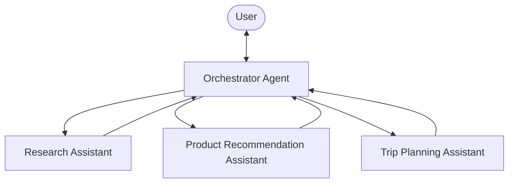

## The Concept: Agents as Tools

“Agents as Tools” is an architectural pattern in AI systems where specialized AI agents are wrapped as callable functions (tools) that can be used by other agents. This creates a hierarchical structure where:

1.  **A primary “orchestrator” agent** handles user interaction and determines which specialized agent to call
2.  **Specialized “tool agents”** perform domain-specific tasks when called by the orchestrator

This approach mimics human team dynamics, where a manager coordinates specialists, each bringing unique expertise to solve complex problems. Rather than a single agent trying to handle everything, tasks are delegated to the most appropriate specialized agent.

## Key Benefits and Core Principles

The “Agents as Tools” pattern offers several advantages:

-   **Separation of concerns**: Each agent has a focused area of responsibility, making the system easier to understand and maintain
-   **Hierarchical delegation**: The orchestrator decides which specialist to invoke, creating a clear chain of command
-   **Modular architecture**: Specialists can be added, removed, or modified independently without affecting the entire system
-   **Improved performance**: Each agent can have tailored system prompts and tools optimized for its specific task

## Strands Agents SDK Best Practices for Agent Tools

When implementing the “Agents as Tools” pattern with Strands Agents SDK:

1.  **Clear tool documentation**: Write descriptive docstrings that explain the agent’s expertise
2.  **Focused system prompts**: Keep each specialized agent tightly focused on its domain
3.  **Proper response handling**: Use consistent patterns to extract and format responses
4.  **Tool selection guidance**: Give the orchestrator clear criteria for when to use each specialized agent

## Implementing Agents as Tools with Strands Agents SDK

Strands Agents SDK provides a powerful framework for implementing the “Agents as Tools” pattern. Specialized agents are wrapped as callable tool functions that can be used by an orchestrator agent.

### Creating Specialized Tool Agents

First, define specialized agents as tool functions:

<starlight-tab-item data-label="Python"> &lt;div class=&quot;expressive-code&quot;&gt;&lt;figure class=&quot;frame&quot;&gt;&lt;figcaption class=&quot;header&quot;&gt;&lt;/figcaption&gt;&lt;pre data-language=&quot;python&quot; dir=&quot;ltr&quot;&gt;&lt;code&gt;&lt;div class=&quot;ec-line&quot;&gt;&lt;div class=&quot;code&quot;&gt;&lt;span style=&quot;--0:#BF3441;--1:#F97583&quot;&gt;from&lt;/span&gt;&lt;span style=&quot;--0:#24292E;--1:#E1E4E8&quot;&gt; strands &lt;/span&gt;&lt;span style=&quot;--0:#BF3441;--1:#F97583&quot;&gt;import&lt;/span&gt;&lt;span style=&quot;--0:#24292E;--1:#E1E4E8&quot;&gt; Agent, tool&lt;/span&gt;&lt;/div&gt;&lt;/div&gt;&lt;div class=&quot;ec-line&quot;&gt;&lt;div class=&quot;code&quot;&gt;&lt;span style=&quot;--0:#BF3441;--1:#F97583&quot;&gt;from&lt;/span&gt;&lt;span style=&quot;--0:#24292E;--1:#E1E4E8&quot;&gt; strands\_tools &lt;/span&gt;&lt;span style=&quot;--0:#BF3441;--1:#F97583&quot;&gt;import&lt;/span&gt;&lt;span style=&quot;--0:#24292E;--1:#E1E4E8&quot;&gt; retrieve, http\_request&lt;/span&gt;&lt;/div&gt;&lt;/div&gt;&lt;div class=&quot;ec-line&quot;&gt;&lt;div class=&quot;code&quot;&gt; &lt;/div&gt;&lt;/div&gt;&lt;div class=&quot;ec-line&quot;&gt;&lt;div class=&quot;code&quot;&gt;&lt;span style=&quot;--0:#616972;--1:#99A0A6&quot;&gt;# Define a specialized system prompt&lt;/span&gt;&lt;/div&gt;&lt;/div&gt;&lt;div class=&quot;ec-line&quot;&gt;&lt;div class=&quot;code&quot;&gt;&lt;span style=&quot;--0:#005CC5;--1:#79B8FF&quot;&gt;RESEARCH\_ASSISTANT\_PROMPT&lt;/span&gt;&lt;span style=&quot;--0:#24292E;--1:#E1E4E8&quot;&gt; &lt;/span&gt;&lt;span style=&quot;--0:#BF3441;--1:#F97583&quot;&gt;=&lt;/span&gt;&lt;span style=&quot;--0:#24292E;--1:#E1E4E8&quot;&gt; &lt;/span&gt;&lt;span style=&quot;--0:#032F62;--1:#9ECBFF&quot;&gt;&amp;quot;&amp;quot;&amp;quot;&lt;/span&gt;&lt;/div&gt;&lt;/div&gt;&lt;div class=&quot;ec-line&quot;&gt;&lt;div class=&quot;code&quot;&gt;&lt;span style=&quot;--0:#032F62;--1:#9ECBFF&quot;&gt;You are a specialized research assistant. Focus only on providing&lt;/span&gt;&lt;/div&gt;&lt;/div&gt;&lt;div class=&quot;ec-line&quot;&gt;&lt;div class=&quot;code&quot;&gt;&lt;span style=&quot;--0:#032F62;--1:#9ECBFF&quot;&gt;factual, well-sourced information in response to research questions.&lt;/span&gt;&lt;/div&gt;&lt;/div&gt;&lt;div class=&quot;ec-line&quot;&gt;&lt;div class=&quot;code&quot;&gt;&lt;span style=&quot;--0:#032F62;--1:#9ECBFF&quot;&gt;Always cite your sources when possible.&lt;/span&gt;&lt;/div&gt;&lt;/div&gt;&lt;div class=&quot;ec-line&quot;&gt;&lt;div class=&quot;code&quot;&gt;&lt;span style=&quot;--0:#032F62;--1:#9ECBFF&quot;&gt;&amp;quot;&amp;quot;&amp;quot;&lt;/span&gt;&lt;/div&gt;&lt;/div&gt;&lt;div class=&quot;ec-line&quot;&gt;&lt;div class=&quot;code&quot;&gt; &lt;/div&gt;&lt;/div&gt;&lt;div class=&quot;ec-line&quot;&gt;&lt;div class=&quot;code&quot;&gt;&lt;span style=&quot;--0:#6F42C1;--1:#B392F0&quot;&gt;@tool&lt;/span&gt;&lt;/div&gt;&lt;/div&gt;&lt;div class=&quot;ec-line&quot;&gt;&lt;div class=&quot;code&quot;&gt;&lt;span style=&quot;--0:#BF3441;--1:#F97583&quot;&gt;def&lt;/span&gt;&lt;span style=&quot;--0:#24292E;--1:#E1E4E8&quot;&gt; &lt;/span&gt;&lt;span style=&quot;--0:#6F42C1;--1:#B392F0&quot;&gt;research\_assistant&lt;/span&gt;&lt;span style=&quot;--0:#24292E;--1:#E1E4E8&quot;&gt;(query: &lt;/span&gt;&lt;span style=&quot;--0:#005CC5;--1:#79B8FF&quot;&gt;str&lt;/span&gt;&lt;span style=&quot;--0:#24292E;--1:#E1E4E8&quot;&gt;) -&amp;gt; &lt;/span&gt;&lt;span style=&quot;--0:#005CC5;--1:#79B8FF&quot;&gt;str&lt;/span&gt;&lt;span style=&quot;--0:#24292E;--1:#E1E4E8&quot;&gt;:&lt;/span&gt;&lt;/div&gt;&lt;/div&gt;&lt;div class=&quot;ec-line&quot;&gt;&lt;div class=&quot;code&quot;&gt;&lt;span class=&quot;indent&quot;&gt; &lt;/span&gt;&lt;span style=&quot;--0:#032F62;--1:#9ECBFF&quot;&gt;&amp;quot;&amp;quot;&amp;quot;&lt;/span&gt;&lt;/div&gt;&lt;/div&gt;&lt;div class=&quot;ec-line&quot;&gt;&lt;div class=&quot;code&quot;&gt;&lt;span class=&quot;indent&quot;&gt;&lt;span style=&quot;--0:#032F62;--1:#9ECBFF&quot;&gt; &lt;/span&gt;&lt;/span&gt;&lt;span style=&quot;--0:#032F62;--1:#9ECBFF&quot;&gt;Process and respond to research-related queries.&lt;/span&gt;&lt;/div&gt;&lt;/div&gt;&lt;div class=&quot;ec-line&quot;&gt;&lt;div class=&quot;code&quot;&gt; &lt;/div&gt;&lt;/div&gt;&lt;div class=&quot;ec-line&quot;&gt;&lt;div class=&quot;code&quot;&gt;&lt;span class=&quot;indent&quot;&gt;&lt;span style=&quot;--0:#032F62;--1:#9ECBFF&quot;&gt; &lt;/span&gt;&lt;/span&gt;&lt;span style=&quot;--0:#032F62;--1:#9ECBFF&quot;&gt;Args:&lt;/span&gt;&lt;/div&gt;&lt;/div&gt;&lt;div class=&quot;ec-line&quot;&gt;&lt;div class=&quot;code&quot;&gt;&lt;span class=&quot;indent&quot;&gt;&lt;span style=&quot;--0:#032F62;--1:#9ECBFF&quot;&gt; &lt;/span&gt;&lt;/span&gt;&lt;span style=&quot;--0:#032F62;--1:#9ECBFF&quot;&gt;query: A research question requiring factual information&lt;/span&gt;&lt;/div&gt;&lt;/div&gt;&lt;div class=&quot;ec-line&quot;&gt;&lt;div class=&quot;code&quot;&gt; &lt;/div&gt;&lt;/div&gt;&lt;div class=&quot;ec-line&quot;&gt;&lt;div class=&quot;code&quot;&gt;&lt;span class=&quot;indent&quot;&gt;&lt;span style=&quot;--0:#032F62;--1:#9ECBFF&quot;&gt; &lt;/span&gt;&lt;/span&gt;&lt;span style=&quot;--0:#032F62;--1:#9ECBFF&quot;&gt;Returns:&lt;/span&gt;&lt;/div&gt;&lt;/div&gt;&lt;div class=&quot;ec-line&quot;&gt;&lt;div class=&quot;code&quot;&gt;&lt;span class=&quot;indent&quot;&gt;&lt;span style=&quot;--0:#032F62;--1:#9ECBFF&quot;&gt; &lt;/span&gt;&lt;/span&gt;&lt;span style=&quot;--0:#032F62;--1:#9ECBFF&quot;&gt;A detailed research answer with citations&lt;/span&gt;&lt;/div&gt;&lt;/div&gt;&lt;div class=&quot;ec-line&quot;&gt;&lt;div class=&quot;code&quot;&gt;&lt;span class=&quot;indent&quot;&gt;&lt;span style=&quot;--0:#032F62;--1:#9ECBFF&quot;&gt; &lt;/span&gt;&lt;/span&gt;&lt;span style=&quot;--0:#032F62;--1:#9ECBFF&quot;&gt;&amp;quot;&amp;quot;&amp;quot;&lt;/span&gt;&lt;/div&gt;&lt;/div&gt;&lt;div class=&quot;ec-line&quot;&gt;&lt;div class=&quot;code&quot;&gt;&lt;span class=&quot;indent&quot;&gt; &lt;/span&gt;&lt;span style=&quot;--0:#BF3441;--1:#F97583&quot;&gt;try&lt;/span&gt;&lt;span style=&quot;--0:#24292E;--1:#E1E4E8&quot;&gt;:&lt;/span&gt;&lt;/div&gt;&lt;/div&gt;&lt;div class=&quot;ec-line&quot;&gt;&lt;div class=&quot;code&quot;&gt;&lt;span class=&quot;indent&quot;&gt; &lt;/span&gt;&lt;span style=&quot;--0:#616972;--1:#99A0A6&quot;&gt;# Strands Agents SDK makes it easy to create a specialized agent&lt;/span&gt;&lt;/div&gt;&lt;/div&gt;&lt;div class=&quot;ec-line&quot;&gt;&lt;div class=&quot;code&quot;&gt;&lt;span class=&quot;indent&quot;&gt;&lt;span style=&quot;--0:#24292E;--1:#E1E4E8&quot;&gt; &lt;/span&gt;&lt;/span&gt;&lt;span style=&quot;--0:#24292E;--1:#E1E4E8&quot;&gt;research\_agent &lt;/span&gt;&lt;span style=&quot;--0:#BF3441;--1:#F97583&quot;&gt;=&lt;/span&gt;&lt;span style=&quot;--0:#24292E;--1:#E1E4E8&quot;&gt; Agent(&lt;/span&gt;&lt;/div&gt;&lt;/div&gt;&lt;div class=&quot;ec-line&quot;&gt;&lt;div class=&quot;code&quot;&gt;&lt;span class=&quot;indent&quot;&gt; &lt;/span&gt;&lt;span style=&quot;--0:#AE4B07;--1:#FFAB70&quot;&gt;system\_prompt&lt;/span&gt;&lt;span style=&quot;--0:#BF3441;--1:#F97583&quot;&gt;=&lt;/span&gt;&lt;span style=&quot;--0:#005CC5;--1:#79B8FF&quot;&gt;RESEARCH\_ASSISTANT\_PROMPT&lt;/span&gt;&lt;span style=&quot;--0:#24292E;--1:#E1E4E8&quot;&gt;,&lt;/span&gt;&lt;/div&gt;&lt;/div&gt;&lt;div class=&quot;ec-line&quot;&gt;&lt;div class=&quot;code&quot;&gt;&lt;span class=&quot;indent&quot;&gt; &lt;/span&gt;&lt;span style=&quot;--0:#AE4B07;--1:#FFAB70&quot;&gt;tools&lt;/span&gt;&lt;span style=&quot;--0:#BF3441;--1:#F97583&quot;&gt;=&lt;/span&gt;&lt;span style=&quot;--0:#24292E;--1:#E1E4E8&quot;&gt;\[retrieve, http\_request\] &lt;/span&gt;&lt;span style=&quot;--0:#616972;--1:#99A0A6&quot;&gt;# Research-specific tools&lt;/span&gt;&lt;/div&gt;&lt;/div&gt;&lt;div class=&quot;ec-line&quot;&gt;&lt;div class=&quot;code&quot;&gt;&lt;span class=&quot;indent&quot;&gt;&lt;span style=&quot;--0:#24292E;--1:#E1E4E8&quot;&gt; &lt;/span&gt;&lt;/span&gt;&lt;span style=&quot;--0:#24292E;--1:#E1E4E8&quot;&gt;)&lt;/span&gt;&lt;/div&gt;&lt;/div&gt;&lt;div class=&quot;ec-line&quot;&gt;&lt;div class=&quot;code&quot;&gt; &lt;/div&gt;&lt;/div&gt;&lt;div class=&quot;ec-line&quot;&gt;&lt;div class=&quot;code&quot;&gt;&lt;span class=&quot;indent&quot;&gt; &lt;/span&gt;&lt;span style=&quot;--0:#616972;--1:#99A0A6&quot;&gt;# Call the agent and return its response&lt;/span&gt;&lt;/div&gt;&lt;/div&gt;&lt;div class=&quot;ec-line&quot;&gt;&lt;div class=&quot;code&quot;&gt;&lt;span class=&quot;indent&quot;&gt;&lt;span style=&quot;--0:#24292E;--1:#E1E4E8&quot;&gt; &lt;/span&gt;&lt;/span&gt;&lt;span style=&quot;--0:#24292E;--1:#E1E4E8&quot;&gt;response &lt;/span&gt;&lt;span style=&quot;--0:#BF3441;--1:#F97583&quot;&gt;=&lt;/span&gt;&lt;span style=&quot;--0:#24292E;--1:#E1E4E8&quot;&gt; research\_agent(query)&lt;/span&gt;&lt;/div&gt;&lt;/div&gt;&lt;div class=&quot;ec-line&quot;&gt;&lt;div class=&quot;code&quot;&gt;&lt;span class=&quot;indent&quot;&gt; &lt;/span&gt;&lt;span style=&quot;--0:#BF3441;--1:#F97583&quot;&gt;return&lt;/span&gt;&lt;span style=&quot;--0:#24292E;--1:#E1E4E8&quot;&gt; &lt;/span&gt;&lt;span style=&quot;--0:#005CC5;--1:#79B8FF&quot;&gt;str&lt;/span&gt;&lt;span style=&quot;--0:#24292E;--1:#E1E4E8&quot;&gt;(response)&lt;/span&gt;&lt;/div&gt;&lt;/div&gt;&lt;div class=&quot;ec-line&quot;&gt;&lt;div class=&quot;code&quot;&gt;&lt;span class=&quot;indent&quot;&gt; &lt;/span&gt;&lt;span style=&quot;--0:#BF3441;--1:#F97583&quot;&gt;except&lt;/span&gt;&lt;span style=&quot;--0:#24292E;--1:#E1E4E8&quot;&gt; &lt;/span&gt;&lt;span style=&quot;--0:#005CC5;--1:#79B8FF&quot;&gt;Exception&lt;/span&gt;&lt;span style=&quot;--0:#24292E;--1:#E1E4E8&quot;&gt; &lt;/span&gt;&lt;span style=&quot;--0:#BF3441;--1:#F97583&quot;&gt;as&lt;/span&gt;&lt;span style=&quot;--0:#24292E;--1:#E1E4E8&quot;&gt; e:&lt;/span&gt;&lt;/div&gt;&lt;/div&gt;&lt;div class=&quot;ec-line&quot;&gt;&lt;div class=&quot;code&quot;&gt;&lt;span class=&quot;indent&quot;&gt; &lt;/span&gt;&lt;span style=&quot;--0:#BF3441;--1:#F97583&quot;&gt;return&lt;/span&gt;&lt;span style=&quot;--0:#24292E;--1:#E1E4E8&quot;&gt; &lt;/span&gt;&lt;span style=&quot;--0:#BF3441;--1:#F97583&quot;&gt;f&lt;/span&gt;&lt;span style=&quot;--0:#032F62;--1:#9ECBFF&quot;&gt;&amp;quot;Error in research assistant: &lt;/span&gt;&lt;span style=&quot;--0:#005CC5;--1:#79B8FF&quot;&gt;{str&lt;/span&gt;&lt;span style=&quot;--0:#24292E;--1:#E1E4E8&quot;&gt;(e)&lt;/span&gt;&lt;span style=&quot;--0:#005CC5;--1:#79B8FF&quot;&gt;}&lt;/span&gt;&lt;span style=&quot;--0:#032F62;--1:#9ECBFF&quot;&gt;&amp;quot;&lt;/span&gt;&lt;/div&gt;&lt;/div&gt;&lt;/code&gt;&lt;/pre&gt;&lt;div class=&quot;copy&quot;&gt;&lt;div aria-live=&quot;polite&quot;&gt;&lt;/div&gt;&lt;button title=&quot;Copy to clipboard&quot; data-copied=&quot;Copied!&quot; data-code=&quot;from strands import Agent, toolfrom strands\_tools import retrieve, http\_request# Define a specialized system promptRESEARCH\_ASSISTANT\_PROMPT = &amp;#34;&amp;#34;&amp;#34;You are a specialized research assistant. Focus only on providingfactual, well-sourced information in response to research questions.Always cite your sources when possible.&amp;#34;&amp;#34;&amp;#34;@tooldef research\_assistant(query: str) -&gt; str: &amp;#34;&amp;#34;&amp;#34; Process and respond to research-related queries. Args: query: A research question requiring factual information Returns: A detailed research answer with citations &amp;#34;&amp;#34;&amp;#34; try: # Strands Agents SDK makes it easy to create a specialized agent research\_agent = Agent( system\_prompt=RESEARCH\_ASSISTANT\_PROMPT, tools=\[retrieve, http\_request\] # Research-specific tools ) # Call the agent and return its response response = research\_agent(query) return str(response) except Exception as e: return f&amp;#34;Error in research assistant: {str(e)}&amp;#34;&quot;&gt;&lt;div&gt;&lt;/div&gt;&lt;/button&gt;&lt;/div&gt;&lt;/figure&gt;&lt;/div&gt; </starlight-tab-item><starlight-tab-item data-label="TypeScript"> &lt;div class=&quot;expressive-code&quot;&gt;&lt;figure class=&quot;frame&quot;&gt;&lt;figcaption class=&quot;header&quot;&gt;&lt;/figcaption&gt;&lt;pre data-language=&quot;typescript&quot; dir=&quot;ltr&quot;&gt;&lt;code&gt;&lt;div class=&quot;ec-line&quot;&gt;&lt;div class=&quot;code&quot;&gt;&lt;span style=&quot;--0:#BF3441;--1:#F97583&quot;&gt;const&lt;/span&gt;&lt;span style=&quot;--0:#24292E;--1:#E1E4E8&quot;&gt; &lt;/span&gt;&lt;span style=&quot;--0:#005CC5;--1:#79B8FF&quot;&gt;researchAssistant&lt;/span&gt;&lt;span style=&quot;--0:#24292E;--1:#E1E4E8&quot;&gt; &lt;/span&gt;&lt;span style=&quot;--0:#BF3441;--1:#F97583&quot;&gt;=&lt;/span&gt;&lt;span style=&quot;--0:#24292E;--1:#E1E4E8&quot;&gt; &lt;/span&gt;&lt;span style=&quot;--0:#6F42C1;--1:#B392F0&quot;&gt;tool&lt;/span&gt;&lt;span style=&quot;--0:#24292E;--1:#E1E4E8&quot;&gt;({&lt;/span&gt;&lt;/div&gt;&lt;/div&gt;&lt;div class=&quot;ec-line&quot;&gt;&lt;div class=&quot;code&quot;&gt;&lt;span class=&quot;indent&quot;&gt;&lt;span style=&quot;--0:#24292E;--1:#E1E4E8&quot;&gt; &lt;/span&gt;&lt;/span&gt;&lt;span style=&quot;--0:#24292E;--1:#E1E4E8&quot;&gt;name: &lt;/span&gt;&lt;span style=&quot;--0:#032F62;--1:#9ECBFF&quot;&gt;&amp;#39;research\_assistant&amp;#39;&lt;/span&gt;&lt;span style=&quot;--0:#24292E;--1:#E1E4E8&quot;&gt;,&lt;/span&gt;&lt;/div&gt;&lt;/div&gt;&lt;div class=&quot;ec-line&quot;&gt;&lt;div class=&quot;code&quot;&gt;&lt;span class=&quot;indent&quot;&gt;&lt;span style=&quot;--0:#24292E;--1:#E1E4E8&quot;&gt; &lt;/span&gt;&lt;/span&gt;&lt;span style=&quot;--0:#24292E;--1:#E1E4E8&quot;&gt;description: &lt;/span&gt;&lt;span style=&quot;--0:#032F62;--1:#9ECBFF&quot;&gt;&amp;#39;Process and respond to research-related queries requiring factual information.&amp;#39;&lt;/span&gt;&lt;span style=&quot;--0:#24292E;--1:#E1E4E8&quot;&gt;,&lt;/span&gt;&lt;/div&gt;&lt;/div&gt;&lt;div class=&quot;ec-line&quot;&gt;&lt;div class=&quot;code&quot;&gt;&lt;span class=&quot;indent&quot;&gt;&lt;span style=&quot;--0:#24292E;--1:#E1E4E8&quot;&gt; &lt;/span&gt;&lt;/span&gt;&lt;span style=&quot;--0:#24292E;--1:#E1E4E8&quot;&gt;inputSchema: z.&lt;/span&gt;&lt;span style=&quot;--0:#6F42C1;--1:#B392F0&quot;&gt;object&lt;/span&gt;&lt;span style=&quot;--0:#24292E;--1:#E1E4E8&quot;&gt;({&lt;/span&gt;&lt;/div&gt;&lt;/div&gt;&lt;div class=&quot;ec-line&quot;&gt;&lt;div class=&quot;code&quot;&gt;&lt;span class=&quot;indent&quot;&gt;&lt;span style=&quot;--0:#24292E;--1:#E1E4E8&quot;&gt; &lt;/span&gt;&lt;/span&gt;&lt;span style=&quot;--0:#24292E;--1:#E1E4E8&quot;&gt;query: z.&lt;/span&gt;&lt;span style=&quot;--0:#6F42C1;--1:#B392F0&quot;&gt;string&lt;/span&gt;&lt;span style=&quot;--0:#24292E;--1:#E1E4E8&quot;&gt;().&lt;/span&gt;&lt;span style=&quot;--0:#6F42C1;--1:#B392F0&quot;&gt;describe&lt;/span&gt;&lt;span style=&quot;--0:#24292E;--1:#E1E4E8&quot;&gt;(&lt;/span&gt;&lt;span style=&quot;--0:#032F62;--1:#9ECBFF&quot;&gt;&amp;#39;A research question requiring factual information&amp;#39;&lt;/span&gt;&lt;span style=&quot;--0:#24292E;--1:#E1E4E8&quot;&gt;),&lt;/span&gt;&lt;/div&gt;&lt;/div&gt;&lt;div class=&quot;ec-line&quot;&gt;&lt;div class=&quot;code&quot;&gt;&lt;span class=&quot;indent&quot;&gt;&lt;span style=&quot;--0:#24292E;--1:#E1E4E8&quot;&gt; &lt;/span&gt;&lt;/span&gt;&lt;span style=&quot;--0:#24292E;--1:#E1E4E8&quot;&gt;}),&lt;/span&gt;&lt;/div&gt;&lt;/div&gt;&lt;div class=&quot;ec-line&quot;&gt;&lt;div class=&quot;code&quot;&gt;&lt;span class=&quot;indent&quot;&gt; &lt;/span&gt;&lt;span style=&quot;--0:#6F42C1;--1:#B392F0&quot;&gt;callback&lt;/span&gt;&lt;span style=&quot;--0:#24292E;--1:#E1E4E8&quot;&gt;: &lt;/span&gt;&lt;span style=&quot;--0:#BF3441;--1:#F97583&quot;&gt;async&lt;/span&gt;&lt;span style=&quot;--0:#24292E;--1:#E1E4E8&quot;&gt; (&lt;/span&gt;&lt;span style=&quot;--0:#AE4B07;--1:#FFAB70&quot;&gt;input&lt;/span&gt;&lt;span style=&quot;--0:#24292E;--1:#E1E4E8&quot;&gt;) &lt;/span&gt;&lt;span style=&quot;--0:#BF3441;--1:#F97583&quot;&gt;=&amp;gt;&lt;/span&gt;&lt;span style=&quot;--0:#24292E;--1:#E1E4E8&quot;&gt; {&lt;/span&gt;&lt;/div&gt;&lt;/div&gt;&lt;div class=&quot;ec-line&quot;&gt;&lt;div class=&quot;code&quot;&gt;&lt;span class=&quot;indent&quot;&gt; &lt;/span&gt;&lt;span style=&quot;--0:#BF3441;--1:#F97583&quot;&gt;const&lt;/span&gt;&lt;span style=&quot;--0:#24292E;--1:#E1E4E8&quot;&gt; &lt;/span&gt;&lt;span style=&quot;--0:#005CC5;--1:#79B8FF&quot;&gt;researchAgent&lt;/span&gt;&lt;span style=&quot;--0:#24292E;--1:#E1E4E8&quot;&gt; &lt;/span&gt;&lt;span style=&quot;--0:#BF3441;--1:#F97583&quot;&gt;=&lt;/span&gt;&lt;span style=&quot;--0:#24292E;--1:#E1E4E8&quot;&gt; &lt;/span&gt;&lt;span style=&quot;--0:#BF3441;--1:#F97583&quot;&gt;new&lt;/span&gt;&lt;span style=&quot;--0:#24292E;--1:#E1E4E8&quot;&gt; &lt;/span&gt;&lt;span style=&quot;--0:#6F42C1;--1:#B392F0&quot;&gt;Agent&lt;/span&gt;&lt;span style=&quot;--0:#24292E;--1:#E1E4E8&quot;&gt;({&lt;/span&gt;&lt;/div&gt;&lt;/div&gt;&lt;div class=&quot;ec-line&quot;&gt;&lt;div class=&quot;code&quot;&gt;&lt;span class=&quot;indent&quot;&gt;&lt;span style=&quot;--0:#24292E;--1:#E1E4E8&quot;&gt; &lt;/span&gt;&lt;/span&gt;&lt;span style=&quot;--0:#24292E;--1:#E1E4E8&quot;&gt;systemPrompt: &lt;/span&gt;&lt;span style=&quot;--0:#032F62;--1:#9ECBFF&quot;&gt;\`You are a specialized research assistant. Focus only on providing&lt;/span&gt;&lt;/div&gt;&lt;/div&gt;&lt;div class=&quot;ec-line&quot;&gt;&lt;div class=&quot;code&quot;&gt;&lt;span style=&quot;--0:#032F62;--1:#9ECBFF&quot;&gt;factual, well-sourced information in response to research questions.&lt;/span&gt;&lt;/div&gt;&lt;/div&gt;&lt;div class=&quot;ec-line&quot;&gt;&lt;div class=&quot;code&quot;&gt;&lt;span style=&quot;--0:#032F62;--1:#9ECBFF&quot;&gt;Always cite your sources when possible.\`&lt;/span&gt;&lt;span style=&quot;--0:#24292E;--1:#E1E4E8&quot;&gt;,&lt;/span&gt;&lt;/div&gt;&lt;/div&gt;&lt;div class=&quot;ec-line&quot;&gt;&lt;div class=&quot;code&quot;&gt;&lt;span class=&quot;indent&quot;&gt;&lt;span style=&quot;--0:#24292E;--1:#E1E4E8&quot;&gt; &lt;/span&gt;&lt;/span&gt;&lt;span style=&quot;--0:#24292E;--1:#E1E4E8&quot;&gt;})&lt;/span&gt;&lt;/div&gt;&lt;/div&gt;&lt;div class=&quot;ec-line&quot;&gt;&lt;div class=&quot;code&quot;&gt; &lt;/div&gt;&lt;/div&gt;&lt;div class=&quot;ec-line&quot;&gt;&lt;div class=&quot;code&quot;&gt;&lt;span class=&quot;indent&quot;&gt; &lt;/span&gt;&lt;span style=&quot;--0:#BF3441;--1:#F97583&quot;&gt;const&lt;/span&gt;&lt;span style=&quot;--0:#24292E;--1:#E1E4E8&quot;&gt; &lt;/span&gt;&lt;span style=&quot;--0:#005CC5;--1:#79B8FF&quot;&gt;response&lt;/span&gt;&lt;span style=&quot;--0:#24292E;--1:#E1E4E8&quot;&gt; &lt;/span&gt;&lt;span style=&quot;--0:#BF3441;--1:#F97583&quot;&gt;=&lt;/span&gt;&lt;span style=&quot;--0:#24292E;--1:#E1E4E8&quot;&gt; &lt;/span&gt;&lt;span style=&quot;--0:#BF3441;--1:#F97583&quot;&gt;await&lt;/span&gt;&lt;span style=&quot;--0:#24292E;--1:#E1E4E8&quot;&gt; researchAgent.&lt;/span&gt;&lt;span style=&quot;--0:#6F42C1;--1:#B392F0&quot;&gt;invoke&lt;/span&gt;&lt;span style=&quot;--0:#24292E;--1:#E1E4E8&quot;&gt;(input.query)&lt;/span&gt;&lt;/div&gt;&lt;/div&gt;&lt;div class=&quot;ec-line&quot;&gt;&lt;div class=&quot;code&quot;&gt;&lt;span class=&quot;indent&quot;&gt; &lt;/span&gt;&lt;span style=&quot;--0:#BF3441;--1:#F97583&quot;&gt;return&lt;/span&gt;&lt;span style=&quot;--0:#24292E;--1:#E1E4E8&quot;&gt; response.lastMessage.content.&lt;/span&gt;&lt;span style=&quot;--0:#6F42C1;--1:#B392F0&quot;&gt;map&lt;/span&gt;&lt;span style=&quot;--0:#24292E;--1:#E1E4E8&quot;&gt;((&lt;/span&gt;&lt;span style=&quot;--0:#AE4B07;--1:#FFAB70&quot;&gt;block&lt;/span&gt;&lt;span style=&quot;--0:#24292E;--1:#E1E4E8&quot;&gt;) &lt;/span&gt;&lt;span style=&quot;--0:#BF3441;--1:#F97583&quot;&gt;=&amp;gt;&lt;/span&gt;&lt;span style=&quot;--0:#24292E;--1:#E1E4E8&quot;&gt; (&lt;/span&gt;&lt;span style=&quot;--0:#032F62;--1:#9ECBFF&quot;&gt;&amp;#39;text&amp;#39;&lt;/span&gt;&lt;span style=&quot;--0:#24292E;--1:#E1E4E8&quot;&gt; &lt;/span&gt;&lt;span style=&quot;--0:#BF3441;--1:#F97583&quot;&gt;in&lt;/span&gt;&lt;span style=&quot;--0:#24292E;--1:#E1E4E8&quot;&gt; block &lt;/span&gt;&lt;span style=&quot;--0:#BF3441;--1:#F97583&quot;&gt;?&lt;/span&gt;&lt;span style=&quot;--0:#24292E;--1:#E1E4E8&quot;&gt; block.text &lt;/span&gt;&lt;span style=&quot;--0:#BF3441;--1:#F97583&quot;&gt;:&lt;/span&gt;&lt;span style=&quot;--0:#24292E;--1:#E1E4E8&quot;&gt; &lt;/span&gt;&lt;span style=&quot;--0:#032F62;--1:#9ECBFF&quot;&gt;&amp;#39;&amp;#39;&lt;/span&gt;&lt;span style=&quot;--0:#24292E;--1:#E1E4E8&quot;&gt;)).&lt;/span&gt;&lt;span style=&quot;--0:#6F42C1;--1:#B392F0&quot;&gt;join&lt;/span&gt;&lt;span style=&quot;--0:#24292E;--1:#E1E4E8&quot;&gt;(&lt;/span&gt;&lt;span style=&quot;--0:#032F62;--1:#9ECBFF&quot;&gt;&amp;#39;&amp;#39;&lt;/span&gt;&lt;span style=&quot;--0:#24292E;--1:#E1E4E8&quot;&gt;)&lt;/span&gt;&lt;/div&gt;&lt;/div&gt;&lt;div class=&quot;ec-line&quot;&gt;&lt;div class=&quot;code&quot;&gt;&lt;span class=&quot;indent&quot;&gt;&lt;span style=&quot;--0:#24292E;--1:#E1E4E8&quot;&gt; &lt;/span&gt;&lt;/span&gt;&lt;span style=&quot;--0:#24292E;--1:#E1E4E8&quot;&gt;},&lt;/span&gt;&lt;/div&gt;&lt;/div&gt;&lt;div class=&quot;ec-line&quot;&gt;&lt;div class=&quot;code&quot;&gt;&lt;span style=&quot;--0:#24292E;--1:#E1E4E8&quot;&gt;})&lt;/span&gt;&lt;/div&gt;&lt;/div&gt;&lt;/code&gt;&lt;/pre&gt;&lt;div class=&quot;copy&quot;&gt;&lt;div aria-live=&quot;polite&quot;&gt;&lt;/div&gt;&lt;button title=&quot;Copy to clipboard&quot; data-copied=&quot;Copied!&quot; data-code=&quot;const researchAssistant = tool({ name: &#39;research\_assistant&#39;, description: &#39;Process and respond to research-related queries requiring factual information.&#39;, inputSchema: z.object({ query: z.string().describe(&#39;A research question requiring factual information&#39;), }), callback: async (input) =&gt; { const researchAgent = new Agent({ systemPrompt: \`You are a specialized research assistant. Focus only on providingfactual, well-sourced information in response to research questions.Always cite your sources when possible.\`, }) const response = await researchAgent.invoke(input.query) return response.lastMessage.content.map((block) =&gt; (&#39;text&#39; in block ? block.text : &#39;&#39;)).join(&#39;&#39;) },})&quot;&gt;&lt;div&gt;&lt;/div&gt;&lt;/button&gt;&lt;/div&gt;&lt;/figure&gt;&lt;/div&gt; </starlight-tab-item>

You can create multiple specialized agents following the same pattern:

<starlight-tab-item data-label="Python"> &lt;div class=&quot;expressive-code&quot;&gt;&lt;figure class=&quot;frame&quot;&gt;&lt;figcaption class=&quot;header&quot;&gt;&lt;/figcaption&gt;&lt;pre data-language=&quot;python&quot; dir=&quot;ltr&quot;&gt;&lt;code&gt;&lt;div class=&quot;ec-line&quot;&gt;&lt;div class=&quot;code&quot;&gt;&lt;span style=&quot;--0:#6F42C1;--1:#B392F0&quot;&gt;@tool&lt;/span&gt;&lt;/div&gt;&lt;/div&gt;&lt;div class=&quot;ec-line&quot;&gt;&lt;div class=&quot;code&quot;&gt;&lt;span style=&quot;--0:#BF3441;--1:#F97583&quot;&gt;def&lt;/span&gt;&lt;span style=&quot;--0:#24292E;--1:#E1E4E8&quot;&gt; &lt;/span&gt;&lt;span style=&quot;--0:#6F42C1;--1:#B392F0&quot;&gt;product\_recommendation\_assistant&lt;/span&gt;&lt;span style=&quot;--0:#24292E;--1:#E1E4E8&quot;&gt;(query: &lt;/span&gt;&lt;span style=&quot;--0:#005CC5;--1:#79B8FF&quot;&gt;str&lt;/span&gt;&lt;span style=&quot;--0:#24292E;--1:#E1E4E8&quot;&gt;) -&amp;gt; &lt;/span&gt;&lt;span style=&quot;--0:#005CC5;--1:#79B8FF&quot;&gt;str&lt;/span&gt;&lt;span style=&quot;--0:#24292E;--1:#E1E4E8&quot;&gt;:&lt;/span&gt;&lt;/div&gt;&lt;/div&gt;&lt;div class=&quot;ec-line&quot;&gt;&lt;div class=&quot;code&quot;&gt;&lt;span class=&quot;indent&quot;&gt; &lt;/span&gt;&lt;span style=&quot;--0:#032F62;--1:#9ECBFF&quot;&gt;&amp;quot;&amp;quot;&amp;quot;&lt;/span&gt;&lt;/div&gt;&lt;/div&gt;&lt;div class=&quot;ec-line&quot;&gt;&lt;div class=&quot;code&quot;&gt;&lt;span class=&quot;indent&quot;&gt;&lt;span style=&quot;--0:#032F62;--1:#9ECBFF&quot;&gt; &lt;/span&gt;&lt;/span&gt;&lt;span style=&quot;--0:#032F62;--1:#9ECBFF&quot;&gt;Handle product recommendation queries by suggesting appropriate products.&lt;/span&gt;&lt;/div&gt;&lt;/div&gt;&lt;div class=&quot;ec-line&quot;&gt;&lt;div class=&quot;code&quot;&gt; &lt;/div&gt;&lt;/div&gt;&lt;div class=&quot;ec-line&quot;&gt;&lt;div class=&quot;code&quot;&gt;&lt;span class=&quot;indent&quot;&gt;&lt;span style=&quot;--0:#032F62;--1:#9ECBFF&quot;&gt; &lt;/span&gt;&lt;/span&gt;&lt;span style=&quot;--0:#032F62;--1:#9ECBFF&quot;&gt;Args:&lt;/span&gt;&lt;/div&gt;&lt;/div&gt;&lt;div class=&quot;ec-line&quot;&gt;&lt;div class=&quot;code&quot;&gt;&lt;span class=&quot;indent&quot;&gt;&lt;span style=&quot;--0:#032F62;--1:#9ECBFF&quot;&gt; &lt;/span&gt;&lt;/span&gt;&lt;span style=&quot;--0:#032F62;--1:#9ECBFF&quot;&gt;query: A product inquiry with user preferences&lt;/span&gt;&lt;/div&gt;&lt;/div&gt;&lt;div class=&quot;ec-line&quot;&gt;&lt;div class=&quot;code&quot;&gt; &lt;/div&gt;&lt;/div&gt;&lt;div class=&quot;ec-line&quot;&gt;&lt;div class=&quot;code&quot;&gt;&lt;span class=&quot;indent&quot;&gt;&lt;span style=&quot;--0:#032F62;--1:#9ECBFF&quot;&gt; &lt;/span&gt;&lt;/span&gt;&lt;span style=&quot;--0:#032F62;--1:#9ECBFF&quot;&gt;Returns:&lt;/span&gt;&lt;/div&gt;&lt;/div&gt;&lt;div class=&quot;ec-line&quot;&gt;&lt;div class=&quot;code&quot;&gt;&lt;span class=&quot;indent&quot;&gt;&lt;span style=&quot;--0:#032F62;--1:#9ECBFF&quot;&gt; &lt;/span&gt;&lt;/span&gt;&lt;span style=&quot;--0:#032F62;--1:#9ECBFF&quot;&gt;Personalized product recommendations with reasoning&lt;/span&gt;&lt;/div&gt;&lt;/div&gt;&lt;div class=&quot;ec-line&quot;&gt;&lt;div class=&quot;code&quot;&gt;&lt;span class=&quot;indent&quot;&gt;&lt;span style=&quot;--0:#032F62;--1:#9ECBFF&quot;&gt; &lt;/span&gt;&lt;/span&gt;&lt;span style=&quot;--0:#032F62;--1:#9ECBFF&quot;&gt;&amp;quot;&amp;quot;&amp;quot;&lt;/span&gt;&lt;/div&gt;&lt;/div&gt;&lt;div class=&quot;ec-line&quot;&gt;&lt;div class=&quot;code&quot;&gt;&lt;span class=&quot;indent&quot;&gt; &lt;/span&gt;&lt;span style=&quot;--0:#BF3441;--1:#F97583&quot;&gt;try&lt;/span&gt;&lt;span style=&quot;--0:#24292E;--1:#E1E4E8&quot;&gt;:&lt;/span&gt;&lt;/div&gt;&lt;/div&gt;&lt;div class=&quot;ec-line&quot;&gt;&lt;div class=&quot;code&quot;&gt;&lt;span class=&quot;indent&quot;&gt;&lt;span style=&quot;--0:#24292E;--1:#E1E4E8&quot;&gt; &lt;/span&gt;&lt;/span&gt;&lt;span style=&quot;--0:#24292E;--1:#E1E4E8&quot;&gt;product\_agent &lt;/span&gt;&lt;span style=&quot;--0:#BF3441;--1:#F97583&quot;&gt;=&lt;/span&gt;&lt;span style=&quot;--0:#24292E;--1:#E1E4E8&quot;&gt; Agent(&lt;/span&gt;&lt;/div&gt;&lt;/div&gt;&lt;div class=&quot;ec-line&quot;&gt;&lt;div class=&quot;code&quot;&gt;&lt;span class=&quot;indent&quot;&gt; &lt;/span&gt;&lt;span style=&quot;--0:#AE4B07;--1:#FFAB70&quot;&gt;system\_prompt&lt;/span&gt;&lt;span style=&quot;--0:#BF3441;--1:#F97583&quot;&gt;=&lt;/span&gt;&lt;span style=&quot;--0:#032F62;--1:#9ECBFF&quot;&gt;&amp;quot;&amp;quot;&amp;quot;You are a specialized product recommendation assistant.&lt;/span&gt;&lt;/div&gt;&lt;/div&gt;&lt;div class=&quot;ec-line&quot;&gt;&lt;div class=&quot;code&quot;&gt;&lt;span class=&quot;indent&quot;&gt;&lt;span style=&quot;--0:#032F62;--1:#9ECBFF&quot;&gt; &lt;/span&gt;&lt;/span&gt;&lt;span style=&quot;--0:#032F62;--1:#9ECBFF&quot;&gt;Provide personalized product suggestions based on user preferences.&amp;quot;&amp;quot;&amp;quot;&lt;/span&gt;&lt;span style=&quot;--0:#24292E;--1:#E1E4E8&quot;&gt;,&lt;/span&gt;&lt;/div&gt;&lt;/div&gt;&lt;div class=&quot;ec-line&quot;&gt;&lt;div class=&quot;code&quot;&gt;&lt;span class=&quot;indent&quot;&gt; &lt;/span&gt;&lt;span style=&quot;--0:#AE4B07;--1:#FFAB70&quot;&gt;tools&lt;/span&gt;&lt;span style=&quot;--0:#BF3441;--1:#F97583&quot;&gt;=&lt;/span&gt;&lt;span style=&quot;--0:#24292E;--1:#E1E4E8&quot;&gt;\[retrieve, http\_request, dialog\], &lt;/span&gt;&lt;span style=&quot;--0:#616972;--1:#99A0A6&quot;&gt;# Tools for getting product data&lt;/span&gt;&lt;/div&gt;&lt;/div&gt;&lt;div class=&quot;ec-line&quot;&gt;&lt;div class=&quot;code&quot;&gt;&lt;span class=&quot;indent&quot;&gt;&lt;span style=&quot;--0:#24292E;--1:#E1E4E8&quot;&gt; &lt;/span&gt;&lt;/span&gt;&lt;span style=&quot;--0:#24292E;--1:#E1E4E8&quot;&gt;)&lt;/span&gt;&lt;/div&gt;&lt;/div&gt;&lt;div class=&quot;ec-line&quot;&gt;&lt;div class=&quot;code&quot;&gt;&lt;span class=&quot;indent&quot;&gt; &lt;/span&gt;&lt;span style=&quot;--0:#616972;--1:#99A0A6&quot;&gt;# Implementation with response handling&lt;/span&gt;&lt;/div&gt;&lt;/div&gt;&lt;div class=&quot;ec-line&quot;&gt;&lt;div class=&quot;code&quot;&gt;&lt;span class=&quot;indent&quot;&gt; &lt;/span&gt;&lt;span style=&quot;--0:#616972;--1:#99A0A6&quot;&gt;# ...&lt;/span&gt;&lt;/div&gt;&lt;/div&gt;&lt;div class=&quot;ec-line&quot;&gt;&lt;div class=&quot;code&quot;&gt;&lt;span class=&quot;indent&quot;&gt; &lt;/span&gt;&lt;span style=&quot;--0:#BF3441;--1:#F97583&quot;&gt;return&lt;/span&gt;&lt;span style=&quot;--0:#24292E;--1:#E1E4E8&quot;&gt; processed\_response&lt;/span&gt;&lt;/div&gt;&lt;/div&gt;&lt;div class=&quot;ec-line&quot;&gt;&lt;div class=&quot;code&quot;&gt;&lt;span class=&quot;indent&quot;&gt; &lt;/span&gt;&lt;span style=&quot;--0:#BF3441;--1:#F97583&quot;&gt;except&lt;/span&gt;&lt;span style=&quot;--0:#24292E;--1:#E1E4E8&quot;&gt; &lt;/span&gt;&lt;span style=&quot;--0:#005CC5;--1:#79B8FF&quot;&gt;Exception&lt;/span&gt;&lt;span style=&quot;--0:#24292E;--1:#E1E4E8&quot;&gt; &lt;/span&gt;&lt;span style=&quot;--0:#BF3441;--1:#F97583&quot;&gt;as&lt;/span&gt;&lt;span style=&quot;--0:#24292E;--1:#E1E4E8&quot;&gt; e:&lt;/span&gt;&lt;/div&gt;&lt;/div&gt;&lt;div class=&quot;ec-line&quot;&gt;&lt;div class=&quot;code&quot;&gt;&lt;span class=&quot;indent&quot;&gt; &lt;/span&gt;&lt;span style=&quot;--0:#BF3441;--1:#F97583&quot;&gt;return&lt;/span&gt;&lt;span style=&quot;--0:#24292E;--1:#E1E4E8&quot;&gt; &lt;/span&gt;&lt;span style=&quot;--0:#BF3441;--1:#F97583&quot;&gt;f&lt;/span&gt;&lt;span style=&quot;--0:#032F62;--1:#9ECBFF&quot;&gt;&amp;quot;Error in product recommendation: &lt;/span&gt;&lt;span style=&quot;--0:#005CC5;--1:#79B8FF&quot;&gt;{str&lt;/span&gt;&lt;span style=&quot;--0:#24292E;--1:#E1E4E8&quot;&gt;(e)&lt;/span&gt;&lt;span style=&quot;--0:#005CC5;--1:#79B8FF&quot;&gt;}&lt;/span&gt;&lt;span style=&quot;--0:#032F62;--1:#9ECBFF&quot;&gt;&amp;quot;&lt;/span&gt;&lt;/div&gt;&lt;/div&gt;&lt;div class=&quot;ec-line&quot;&gt;&lt;div class=&quot;code&quot;&gt; &lt;/div&gt;&lt;/div&gt;&lt;div class=&quot;ec-line&quot;&gt;&lt;div class=&quot;code&quot;&gt;&lt;span style=&quot;--0:#6F42C1;--1:#B392F0&quot;&gt;@tool&lt;/span&gt;&lt;/div&gt;&lt;/div&gt;&lt;div class=&quot;ec-line&quot;&gt;&lt;div class=&quot;code&quot;&gt;&lt;span style=&quot;--0:#BF3441;--1:#F97583&quot;&gt;def&lt;/span&gt;&lt;span style=&quot;--0:#24292E;--1:#E1E4E8&quot;&gt; &lt;/span&gt;&lt;span style=&quot;--0:#6F42C1;--1:#B392F0&quot;&gt;trip\_planning\_assistant&lt;/span&gt;&lt;span style=&quot;--0:#24292E;--1:#E1E4E8&quot;&gt;(query: &lt;/span&gt;&lt;span style=&quot;--0:#005CC5;--1:#79B8FF&quot;&gt;str&lt;/span&gt;&lt;span style=&quot;--0:#24292E;--1:#E1E4E8&quot;&gt;) -&amp;gt; &lt;/span&gt;&lt;span style=&quot;--0:#005CC5;--1:#79B8FF&quot;&gt;str&lt;/span&gt;&lt;span style=&quot;--0:#24292E;--1:#E1E4E8&quot;&gt;:&lt;/span&gt;&lt;/div&gt;&lt;/div&gt;&lt;div class=&quot;ec-line&quot;&gt;&lt;div class=&quot;code&quot;&gt;&lt;span class=&quot;indent&quot;&gt; &lt;/span&gt;&lt;span style=&quot;--0:#032F62;--1:#9ECBFF&quot;&gt;&amp;quot;&amp;quot;&amp;quot;&lt;/span&gt;&lt;/div&gt;&lt;/div&gt;&lt;div class=&quot;ec-line&quot;&gt;&lt;div class=&quot;code&quot;&gt;&lt;span class=&quot;indent&quot;&gt;&lt;span style=&quot;--0:#032F62;--1:#9ECBFF&quot;&gt; &lt;/span&gt;&lt;/span&gt;&lt;span style=&quot;--0:#032F62;--1:#9ECBFF&quot;&gt;Create travel itineraries and provide travel advice.&lt;/span&gt;&lt;/div&gt;&lt;/div&gt;&lt;div class=&quot;ec-line&quot;&gt;&lt;div class=&quot;code&quot;&gt; &lt;/div&gt;&lt;/div&gt;&lt;div class=&quot;ec-line&quot;&gt;&lt;div class=&quot;code&quot;&gt;&lt;span class=&quot;indent&quot;&gt;&lt;span style=&quot;--0:#032F62;--1:#9ECBFF&quot;&gt; &lt;/span&gt;&lt;/span&gt;&lt;span style=&quot;--0:#032F62;--1:#9ECBFF&quot;&gt;Args:&lt;/span&gt;&lt;/div&gt;&lt;/div&gt;&lt;div class=&quot;ec-line&quot;&gt;&lt;div class=&quot;code&quot;&gt;&lt;span class=&quot;indent&quot;&gt;&lt;span style=&quot;--0:#032F62;--1:#9ECBFF&quot;&gt; &lt;/span&gt;&lt;/span&gt;&lt;span style=&quot;--0:#032F62;--1:#9ECBFF&quot;&gt;query: A travel planning request with destination and preferences&lt;/span&gt;&lt;/div&gt;&lt;/div&gt;&lt;div class=&quot;ec-line&quot;&gt;&lt;div class=&quot;code&quot;&gt; &lt;/div&gt;&lt;/div&gt;&lt;div class=&quot;ec-line&quot;&gt;&lt;div class=&quot;code&quot;&gt;&lt;span class=&quot;indent&quot;&gt;&lt;span style=&quot;--0:#032F62;--1:#9ECBFF&quot;&gt; &lt;/span&gt;&lt;/span&gt;&lt;span style=&quot;--0:#032F62;--1:#9ECBFF&quot;&gt;Returns:&lt;/span&gt;&lt;/div&gt;&lt;/div&gt;&lt;div class=&quot;ec-line&quot;&gt;&lt;div class=&quot;code&quot;&gt;&lt;span class=&quot;indent&quot;&gt;&lt;span style=&quot;--0:#032F62;--1:#9ECBFF&quot;&gt; &lt;/span&gt;&lt;/span&gt;&lt;span style=&quot;--0:#032F62;--1:#9ECBFF&quot;&gt;A detailed travel itinerary or travel advice&lt;/span&gt;&lt;/div&gt;&lt;/div&gt;&lt;div class=&quot;ec-line&quot;&gt;&lt;div class=&quot;code&quot;&gt;&lt;span class=&quot;indent&quot;&gt;&lt;span style=&quot;--0:#032F62;--1:#9ECBFF&quot;&gt; &lt;/span&gt;&lt;/span&gt;&lt;span style=&quot;--0:#032F62;--1:#9ECBFF&quot;&gt;&amp;quot;&amp;quot;&amp;quot;&lt;/span&gt;&lt;/div&gt;&lt;/div&gt;&lt;div class=&quot;ec-line&quot;&gt;&lt;div class=&quot;code&quot;&gt;&lt;span class=&quot;indent&quot;&gt; &lt;/span&gt;&lt;span style=&quot;--0:#BF3441;--1:#F97583&quot;&gt;try&lt;/span&gt;&lt;span style=&quot;--0:#24292E;--1:#E1E4E8&quot;&gt;:&lt;/span&gt;&lt;/div&gt;&lt;/div&gt;&lt;div class=&quot;ec-line&quot;&gt;&lt;div class=&quot;code&quot;&gt;&lt;span class=&quot;indent&quot;&gt;&lt;span style=&quot;--0:#24292E;--1:#E1E4E8&quot;&gt; &lt;/span&gt;&lt;/span&gt;&lt;span style=&quot;--0:#24292E;--1:#E1E4E8&quot;&gt;travel\_agent &lt;/span&gt;&lt;span style=&quot;--0:#BF3441;--1:#F97583&quot;&gt;=&lt;/span&gt;&lt;span style=&quot;--0:#24292E;--1:#E1E4E8&quot;&gt; Agent(&lt;/span&gt;&lt;/div&gt;&lt;/div&gt;&lt;div class=&quot;ec-line&quot;&gt;&lt;div class=&quot;code&quot;&gt;&lt;span class=&quot;indent&quot;&gt; &lt;/span&gt;&lt;span style=&quot;--0:#AE4B07;--1:#FFAB70&quot;&gt;system\_prompt&lt;/span&gt;&lt;span style=&quot;--0:#BF3441;--1:#F97583&quot;&gt;=&lt;/span&gt;&lt;span style=&quot;--0:#032F62;--1:#9ECBFF&quot;&gt;&amp;quot;&amp;quot;&amp;quot;You are a specialized travel planning assistant.&lt;/span&gt;&lt;/div&gt;&lt;/div&gt;&lt;div class=&quot;ec-line&quot;&gt;&lt;div class=&quot;code&quot;&gt;&lt;span class=&quot;indent&quot;&gt;&lt;span style=&quot;--0:#032F62;--1:#9ECBFF&quot;&gt; &lt;/span&gt;&lt;/span&gt;&lt;span style=&quot;--0:#032F62;--1:#9ECBFF&quot;&gt;Create detailed travel itineraries based on user preferences.&amp;quot;&amp;quot;&amp;quot;&lt;/span&gt;&lt;span style=&quot;--0:#24292E;--1:#E1E4E8&quot;&gt;,&lt;/span&gt;&lt;/div&gt;&lt;/div&gt;&lt;div class=&quot;ec-line&quot;&gt;&lt;div class=&quot;code&quot;&gt;&lt;span class=&quot;indent&quot;&gt; &lt;/span&gt;&lt;span style=&quot;--0:#AE4B07;--1:#FFAB70&quot;&gt;tools&lt;/span&gt;&lt;span style=&quot;--0:#BF3441;--1:#F97583&quot;&gt;=&lt;/span&gt;&lt;span style=&quot;--0:#24292E;--1:#E1E4E8&quot;&gt;\[retrieve, http\_request\], &lt;/span&gt;&lt;span style=&quot;--0:#616972;--1:#99A0A6&quot;&gt;# Travel information tools&lt;/span&gt;&lt;/div&gt;&lt;/div&gt;&lt;div class=&quot;ec-line&quot;&gt;&lt;div class=&quot;code&quot;&gt;&lt;span class=&quot;indent&quot;&gt;&lt;span style=&quot;--0:#24292E;--1:#E1E4E8&quot;&gt; &lt;/span&gt;&lt;/span&gt;&lt;span style=&quot;--0:#24292E;--1:#E1E4E8&quot;&gt;)&lt;/span&gt;&lt;/div&gt;&lt;/div&gt;&lt;div class=&quot;ec-line&quot;&gt;&lt;div class=&quot;code&quot;&gt;&lt;span class=&quot;indent&quot;&gt; &lt;/span&gt;&lt;span style=&quot;--0:#616972;--1:#99A0A6&quot;&gt;# Implementation with response handling&lt;/span&gt;&lt;/div&gt;&lt;/div&gt;&lt;div class=&quot;ec-line&quot;&gt;&lt;div class=&quot;code&quot;&gt;&lt;span class=&quot;indent&quot;&gt; &lt;/span&gt;&lt;span style=&quot;--0:#616972;--1:#99A0A6&quot;&gt;# ...&lt;/span&gt;&lt;/div&gt;&lt;/div&gt;&lt;div class=&quot;ec-line&quot;&gt;&lt;div class=&quot;code&quot;&gt;&lt;span class=&quot;indent&quot;&gt; &lt;/span&gt;&lt;span style=&quot;--0:#BF3441;--1:#F97583&quot;&gt;return&lt;/span&gt;&lt;span style=&quot;--0:#24292E;--1:#E1E4E8&quot;&gt; processed\_response&lt;/span&gt;&lt;/div&gt;&lt;/div&gt;&lt;div class=&quot;ec-line&quot;&gt;&lt;div class=&quot;code&quot;&gt;&lt;span class=&quot;indent&quot;&gt; &lt;/span&gt;&lt;span style=&quot;--0:#BF3441;--1:#F97583&quot;&gt;except&lt;/span&gt;&lt;span style=&quot;--0:#24292E;--1:#E1E4E8&quot;&gt; &lt;/span&gt;&lt;span style=&quot;--0:#005CC5;--1:#79B8FF&quot;&gt;Exception&lt;/span&gt;&lt;span style=&quot;--0:#24292E;--1:#E1E4E8&quot;&gt; &lt;/span&gt;&lt;span style=&quot;--0:#BF3441;--1:#F97583&quot;&gt;as&lt;/span&gt;&lt;span style=&quot;--0:#24292E;--1:#E1E4E8&quot;&gt; e:&lt;/span&gt;&lt;/div&gt;&lt;/div&gt;&lt;div class=&quot;ec-line&quot;&gt;&lt;div class=&quot;code&quot;&gt;&lt;span class=&quot;indent&quot;&gt; &lt;/span&gt;&lt;span style=&quot;--0:#BF3441;--1:#F97583&quot;&gt;return&lt;/span&gt;&lt;span style=&quot;--0:#24292E;--1:#E1E4E8&quot;&gt; &lt;/span&gt;&lt;span style=&quot;--0:#BF3441;--1:#F97583&quot;&gt;f&lt;/span&gt;&lt;span style=&quot;--0:#032F62;--1:#9ECBFF&quot;&gt;&amp;quot;Error in trip planning: &lt;/span&gt;&lt;span style=&quot;--0:#005CC5;--1:#79B8FF&quot;&gt;{str&lt;/span&gt;&lt;span style=&quot;--0:#24292E;--1:#E1E4E8&quot;&gt;(e)&lt;/span&gt;&lt;span style=&quot;--0:#005CC5;--1:#79B8FF&quot;&gt;}&lt;/span&gt;&lt;span style=&quot;--0:#032F62;--1:#9ECBFF&quot;&gt;&amp;quot;&lt;/span&gt;&lt;/div&gt;&lt;/div&gt;&lt;/code&gt;&lt;/pre&gt;&lt;div class=&quot;copy&quot;&gt;&lt;div aria-live=&quot;polite&quot;&gt;&lt;/div&gt;&lt;button title=&quot;Copy to clipboard&quot; data-copied=&quot;Copied!&quot; data-code=&quot;@tooldef product\_recommendation\_assistant(query: str) -&gt; str: &amp;#34;&amp;#34;&amp;#34; Handle product recommendation queries by suggesting appropriate products. Args: query: A product inquiry with user preferences Returns: Personalized product recommendations with reasoning &amp;#34;&amp;#34;&amp;#34; try: product\_agent = Agent( system\_prompt=&amp;#34;&amp;#34;&amp;#34;You are a specialized product recommendation assistant. Provide personalized product suggestions based on user preferences.&amp;#34;&amp;#34;&amp;#34;, tools=\[retrieve, http\_request, dialog\], # Tools for getting product data ) # Implementation with response handling # ... return processed\_response except Exception as e: return f&amp;#34;Error in product recommendation: {str(e)}&amp;#34;@tooldef trip\_planning\_assistant(query: str) -&gt; str: &amp;#34;&amp;#34;&amp;#34; Create travel itineraries and provide travel advice. Args: query: A travel planning request with destination and preferences Returns: A detailed travel itinerary or travel advice &amp;#34;&amp;#34;&amp;#34; try: travel\_agent = Agent( system\_prompt=&amp;#34;&amp;#34;&amp;#34;You are a specialized travel planning assistant. Create detailed travel itineraries based on user preferences.&amp;#34;&amp;#34;&amp;#34;, tools=\[retrieve, http\_request\], # Travel information tools ) # Implementation with response handling # ... return processed\_response except Exception as e: return f&amp;#34;Error in trip planning: {str(e)}&amp;#34;&quot;&gt;&lt;div&gt;&lt;/div&gt;&lt;/button&gt;&lt;/div&gt;&lt;/figure&gt;&lt;/div&gt; </starlight-tab-item><starlight-tab-item data-label="TypeScript"> &lt;div class=&quot;expressive-code&quot;&gt;&lt;figure class=&quot;frame&quot;&gt;&lt;figcaption class=&quot;header&quot;&gt;&lt;/figcaption&gt;&lt;pre data-language=&quot;typescript&quot; dir=&quot;ltr&quot;&gt;&lt;code&gt;&lt;div class=&quot;ec-line&quot;&gt;&lt;div class=&quot;code&quot;&gt;&lt;span style=&quot;--0:#BF3441;--1:#F97583&quot;&gt;const&lt;/span&gt;&lt;span style=&quot;--0:#24292E;--1:#E1E4E8&quot;&gt; &lt;/span&gt;&lt;span style=&quot;--0:#005CC5;--1:#79B8FF&quot;&gt;productRecommendationAssistant&lt;/span&gt;&lt;span style=&quot;--0:#24292E;--1:#E1E4E8&quot;&gt; &lt;/span&gt;&lt;span style=&quot;--0:#BF3441;--1:#F97583&quot;&gt;=&lt;/span&gt;&lt;span style=&quot;--0:#24292E;--1:#E1E4E8&quot;&gt; &lt;/span&gt;&lt;span style=&quot;--0:#6F42C1;--1:#B392F0&quot;&gt;tool&lt;/span&gt;&lt;span style=&quot;--0:#24292E;--1:#E1E4E8&quot;&gt;({&lt;/span&gt;&lt;/div&gt;&lt;/div&gt;&lt;div class=&quot;ec-line&quot;&gt;&lt;div class=&quot;code&quot;&gt;&lt;span class=&quot;indent&quot;&gt;&lt;span style=&quot;--0:#24292E;--1:#E1E4E8&quot;&gt; &lt;/span&gt;&lt;/span&gt;&lt;span style=&quot;--0:#24292E;--1:#E1E4E8&quot;&gt;name: &lt;/span&gt;&lt;span style=&quot;--0:#032F62;--1:#9ECBFF&quot;&gt;&amp;#39;product\_recommendation\_assistant&amp;#39;&lt;/span&gt;&lt;span style=&quot;--0:#24292E;--1:#E1E4E8&quot;&gt;,&lt;/span&gt;&lt;/div&gt;&lt;/div&gt;&lt;div class=&quot;ec-line&quot;&gt;&lt;div class=&quot;code&quot;&gt;&lt;span class=&quot;indent&quot;&gt;&lt;span style=&quot;--0:#24292E;--1:#E1E4E8&quot;&gt; &lt;/span&gt;&lt;/span&gt;&lt;span style=&quot;--0:#24292E;--1:#E1E4E8&quot;&gt;description: &lt;/span&gt;&lt;span style=&quot;--0:#032F62;--1:#9ECBFF&quot;&gt;&amp;#39;Handle product recommendation queries by suggesting appropriate products.&amp;#39;&lt;/span&gt;&lt;span style=&quot;--0:#24292E;--1:#E1E4E8&quot;&gt;,&lt;/span&gt;&lt;/div&gt;&lt;/div&gt;&lt;div class=&quot;ec-line&quot;&gt;&lt;div class=&quot;code&quot;&gt;&lt;span class=&quot;indent&quot;&gt;&lt;span style=&quot;--0:#24292E;--1:#E1E4E8&quot;&gt; &lt;/span&gt;&lt;/span&gt;&lt;span style=&quot;--0:#24292E;--1:#E1E4E8&quot;&gt;inputSchema: z.&lt;/span&gt;&lt;span style=&quot;--0:#6F42C1;--1:#B392F0&quot;&gt;object&lt;/span&gt;&lt;span style=&quot;--0:#24292E;--1:#E1E4E8&quot;&gt;({&lt;/span&gt;&lt;/div&gt;&lt;/div&gt;&lt;div class=&quot;ec-line&quot;&gt;&lt;div class=&quot;code&quot;&gt;&lt;span class=&quot;indent&quot;&gt;&lt;span style=&quot;--0:#24292E;--1:#E1E4E8&quot;&gt; &lt;/span&gt;&lt;/span&gt;&lt;span style=&quot;--0:#24292E;--1:#E1E4E8&quot;&gt;query: z.&lt;/span&gt;&lt;span style=&quot;--0:#6F42C1;--1:#B392F0&quot;&gt;string&lt;/span&gt;&lt;span style=&quot;--0:#24292E;--1:#E1E4E8&quot;&gt;().&lt;/span&gt;&lt;span style=&quot;--0:#6F42C1;--1:#B392F0&quot;&gt;describe&lt;/span&gt;&lt;span style=&quot;--0:#24292E;--1:#E1E4E8&quot;&gt;(&lt;/span&gt;&lt;span style=&quot;--0:#032F62;--1:#9ECBFF&quot;&gt;&amp;#39;A product inquiry with user preferences&amp;#39;&lt;/span&gt;&lt;span style=&quot;--0:#24292E;--1:#E1E4E8&quot;&gt;),&lt;/span&gt;&lt;/div&gt;&lt;/div&gt;&lt;div class=&quot;ec-line&quot;&gt;&lt;div class=&quot;code&quot;&gt;&lt;span class=&quot;indent&quot;&gt;&lt;span style=&quot;--0:#24292E;--1:#E1E4E8&quot;&gt; &lt;/span&gt;&lt;/span&gt;&lt;span style=&quot;--0:#24292E;--1:#E1E4E8&quot;&gt;}),&lt;/span&gt;&lt;/div&gt;&lt;/div&gt;&lt;div class=&quot;ec-line&quot;&gt;&lt;div class=&quot;code&quot;&gt;&lt;span class=&quot;indent&quot;&gt; &lt;/span&gt;&lt;span style=&quot;--0:#6F42C1;--1:#B392F0&quot;&gt;callback&lt;/span&gt;&lt;span style=&quot;--0:#24292E;--1:#E1E4E8&quot;&gt;: &lt;/span&gt;&lt;span style=&quot;--0:#BF3441;--1:#F97583&quot;&gt;async&lt;/span&gt;&lt;span style=&quot;--0:#24292E;--1:#E1E4E8&quot;&gt; (&lt;/span&gt;&lt;span style=&quot;--0:#AE4B07;--1:#FFAB70&quot;&gt;input&lt;/span&gt;&lt;span style=&quot;--0:#24292E;--1:#E1E4E8&quot;&gt;) &lt;/span&gt;&lt;span style=&quot;--0:#BF3441;--1:#F97583&quot;&gt;=&amp;gt;&lt;/span&gt;&lt;span style=&quot;--0:#24292E;--1:#E1E4E8&quot;&gt; {&lt;/span&gt;&lt;/div&gt;&lt;/div&gt;&lt;div class=&quot;ec-line&quot;&gt;&lt;div class=&quot;code&quot;&gt;&lt;span class=&quot;indent&quot;&gt; &lt;/span&gt;&lt;span style=&quot;--0:#BF3441;--1:#F97583&quot;&gt;const&lt;/span&gt;&lt;span style=&quot;--0:#24292E;--1:#E1E4E8&quot;&gt; &lt;/span&gt;&lt;span style=&quot;--0:#005CC5;--1:#79B8FF&quot;&gt;productAgent&lt;/span&gt;&lt;span style=&quot;--0:#24292E;--1:#E1E4E8&quot;&gt; &lt;/span&gt;&lt;span style=&quot;--0:#BF3441;--1:#F97583&quot;&gt;=&lt;/span&gt;&lt;span style=&quot;--0:#24292E;--1:#E1E4E8&quot;&gt; &lt;/span&gt;&lt;span style=&quot;--0:#BF3441;--1:#F97583&quot;&gt;new&lt;/span&gt;&lt;span style=&quot;--0:#24292E;--1:#E1E4E8&quot;&gt; &lt;/span&gt;&lt;span style=&quot;--0:#6F42C1;--1:#B392F0&quot;&gt;Agent&lt;/span&gt;&lt;span style=&quot;--0:#24292E;--1:#E1E4E8&quot;&gt;({&lt;/span&gt;&lt;/div&gt;&lt;/div&gt;&lt;div class=&quot;ec-line&quot;&gt;&lt;div class=&quot;code&quot;&gt;&lt;span class=&quot;indent&quot;&gt;&lt;span style=&quot;--0:#24292E;--1:#E1E4E8&quot;&gt; &lt;/span&gt;&lt;/span&gt;&lt;span style=&quot;--0:#24292E;--1:#E1E4E8&quot;&gt;systemPrompt: &lt;/span&gt;&lt;span style=&quot;--0:#032F62;--1:#9ECBFF&quot;&gt;\`You are a specialized product recommendation assistant.&lt;/span&gt;&lt;/div&gt;&lt;/div&gt;&lt;div class=&quot;ec-line&quot;&gt;&lt;div class=&quot;code&quot;&gt;&lt;span style=&quot;--0:#032F62;--1:#9ECBFF&quot;&gt;Provide personalized product suggestions based on user preferences.\`&lt;/span&gt;&lt;span style=&quot;--0:#24292E;--1:#E1E4E8&quot;&gt;,&lt;/span&gt;&lt;/div&gt;&lt;/div&gt;&lt;div class=&quot;ec-line&quot;&gt;&lt;div class=&quot;code&quot;&gt;&lt;span class=&quot;indent&quot;&gt;&lt;span style=&quot;--0:#24292E;--1:#E1E4E8&quot;&gt; &lt;/span&gt;&lt;/span&gt;&lt;span style=&quot;--0:#24292E;--1:#E1E4E8&quot;&gt;})&lt;/span&gt;&lt;/div&gt;&lt;/div&gt;&lt;div class=&quot;ec-line&quot;&gt;&lt;div class=&quot;code&quot;&gt; &lt;/div&gt;&lt;/div&gt;&lt;div class=&quot;ec-line&quot;&gt;&lt;div class=&quot;code&quot;&gt;&lt;span class=&quot;indent&quot;&gt; &lt;/span&gt;&lt;span style=&quot;--0:#BF3441;--1:#F97583&quot;&gt;const&lt;/span&gt;&lt;span style=&quot;--0:#24292E;--1:#E1E4E8&quot;&gt; &lt;/span&gt;&lt;span style=&quot;--0:#005CC5;--1:#79B8FF&quot;&gt;response&lt;/span&gt;&lt;span style=&quot;--0:#24292E;--1:#E1E4E8&quot;&gt; &lt;/span&gt;&lt;span style=&quot;--0:#BF3441;--1:#F97583&quot;&gt;=&lt;/span&gt;&lt;span style=&quot;--0:#24292E;--1:#E1E4E8&quot;&gt; &lt;/span&gt;&lt;span style=&quot;--0:#BF3441;--1:#F97583&quot;&gt;await&lt;/span&gt;&lt;span style=&quot;--0:#24292E;--1:#E1E4E8&quot;&gt; productAgent.&lt;/span&gt;&lt;span style=&quot;--0:#6F42C1;--1:#B392F0&quot;&gt;invoke&lt;/span&gt;&lt;span style=&quot;--0:#24292E;--1:#E1E4E8&quot;&gt;(input.query)&lt;/span&gt;&lt;/div&gt;&lt;/div&gt;&lt;div class=&quot;ec-line&quot;&gt;&lt;div class=&quot;code&quot;&gt;&lt;span class=&quot;indent&quot;&gt; &lt;/span&gt;&lt;span style=&quot;--0:#BF3441;--1:#F97583&quot;&gt;return&lt;/span&gt;&lt;span style=&quot;--0:#24292E;--1:#E1E4E8&quot;&gt; response.lastMessage.content.&lt;/span&gt;&lt;span style=&quot;--0:#6F42C1;--1:#B392F0&quot;&gt;map&lt;/span&gt;&lt;span style=&quot;--0:#24292E;--1:#E1E4E8&quot;&gt;((&lt;/span&gt;&lt;span style=&quot;--0:#AE4B07;--1:#FFAB70&quot;&gt;block&lt;/span&gt;&lt;span style=&quot;--0:#24292E;--1:#E1E4E8&quot;&gt;) &lt;/span&gt;&lt;span style=&quot;--0:#BF3441;--1:#F97583&quot;&gt;=&amp;gt;&lt;/span&gt;&lt;span style=&quot;--0:#24292E;--1:#E1E4E8&quot;&gt; (&lt;/span&gt;&lt;span style=&quot;--0:#032F62;--1:#9ECBFF&quot;&gt;&amp;#39;text&amp;#39;&lt;/span&gt;&lt;span style=&quot;--0:#24292E;--1:#E1E4E8&quot;&gt; &lt;/span&gt;&lt;span style=&quot;--0:#BF3441;--1:#F97583&quot;&gt;in&lt;/span&gt;&lt;span style=&quot;--0:#24292E;--1:#E1E4E8&quot;&gt; block &lt;/span&gt;&lt;span style=&quot;--0:#BF3441;--1:#F97583&quot;&gt;?&lt;/span&gt;&lt;span style=&quot;--0:#24292E;--1:#E1E4E8&quot;&gt; block.text &lt;/span&gt;&lt;span style=&quot;--0:#BF3441;--1:#F97583&quot;&gt;:&lt;/span&gt;&lt;span style=&quot;--0:#24292E;--1:#E1E4E8&quot;&gt; &lt;/span&gt;&lt;span style=&quot;--0:#032F62;--1:#9ECBFF&quot;&gt;&amp;#39;&amp;#39;&lt;/span&gt;&lt;span style=&quot;--0:#24292E;--1:#E1E4E8&quot;&gt;)).&lt;/span&gt;&lt;span style=&quot;--0:#6F42C1;--1:#B392F0&quot;&gt;join&lt;/span&gt;&lt;span style=&quot;--0:#24292E;--1:#E1E4E8&quot;&gt;(&lt;/span&gt;&lt;span style=&quot;--0:#032F62;--1:#9ECBFF&quot;&gt;&amp;#39;&amp;#39;&lt;/span&gt;&lt;span style=&quot;--0:#24292E;--1:#E1E4E8&quot;&gt;)&lt;/span&gt;&lt;/div&gt;&lt;/div&gt;&lt;div class=&quot;ec-line&quot;&gt;&lt;div class=&quot;code&quot;&gt;&lt;span class=&quot;indent&quot;&gt;&lt;span style=&quot;--0:#24292E;--1:#E1E4E8&quot;&gt; &lt;/span&gt;&lt;/span&gt;&lt;span style=&quot;--0:#24292E;--1:#E1E4E8&quot;&gt;},&lt;/span&gt;&lt;/div&gt;&lt;/div&gt;&lt;div class=&quot;ec-line&quot;&gt;&lt;div class=&quot;code&quot;&gt;&lt;span style=&quot;--0:#24292E;--1:#E1E4E8&quot;&gt;})&lt;/span&gt;&lt;/div&gt;&lt;/div&gt;&lt;div class=&quot;ec-line&quot;&gt;&lt;div class=&quot;code&quot;&gt; &lt;/div&gt;&lt;/div&gt;&lt;div class=&quot;ec-line&quot;&gt;&lt;div class=&quot;code&quot;&gt;&lt;span style=&quot;--0:#BF3441;--1:#F97583&quot;&gt;const&lt;/span&gt;&lt;span style=&quot;--0:#24292E;--1:#E1E4E8&quot;&gt; &lt;/span&gt;&lt;span style=&quot;--0:#005CC5;--1:#79B8FF&quot;&gt;tripPlanningAssistant&lt;/span&gt;&lt;span style=&quot;--0:#24292E;--1:#E1E4E8&quot;&gt; &lt;/span&gt;&lt;span style=&quot;--0:#BF3441;--1:#F97583&quot;&gt;=&lt;/span&gt;&lt;span style=&quot;--0:#24292E;--1:#E1E4E8&quot;&gt; &lt;/span&gt;&lt;span style=&quot;--0:#6F42C1;--1:#B392F0&quot;&gt;tool&lt;/span&gt;&lt;span style=&quot;--0:#24292E;--1:#E1E4E8&quot;&gt;({&lt;/span&gt;&lt;/div&gt;&lt;/div&gt;&lt;div class=&quot;ec-line&quot;&gt;&lt;div class=&quot;code&quot;&gt;&lt;span class=&quot;indent&quot;&gt;&lt;span style=&quot;--0:#24292E;--1:#E1E4E8&quot;&gt; &lt;/span&gt;&lt;/span&gt;&lt;span style=&quot;--0:#24292E;--1:#E1E4E8&quot;&gt;name: &lt;/span&gt;&lt;span style=&quot;--0:#032F62;--1:#9ECBFF&quot;&gt;&amp;#39;trip\_planning\_assistant&amp;#39;&lt;/span&gt;&lt;span style=&quot;--0:#24292E;--1:#E1E4E8&quot;&gt;,&lt;/span&gt;&lt;/div&gt;&lt;/div&gt;&lt;div class=&quot;ec-line&quot;&gt;&lt;div class=&quot;code&quot;&gt;&lt;span class=&quot;indent&quot;&gt;&lt;span style=&quot;--0:#24292E;--1:#E1E4E8&quot;&gt; &lt;/span&gt;&lt;/span&gt;&lt;span style=&quot;--0:#24292E;--1:#E1E4E8&quot;&gt;description: &lt;/span&gt;&lt;span style=&quot;--0:#032F62;--1:#9ECBFF&quot;&gt;&amp;#39;Create travel itineraries and provide travel advice.&amp;#39;&lt;/span&gt;&lt;span style=&quot;--0:#24292E;--1:#E1E4E8&quot;&gt;,&lt;/span&gt;&lt;/div&gt;&lt;/div&gt;&lt;div class=&quot;ec-line&quot;&gt;&lt;div class=&quot;code&quot;&gt;&lt;span class=&quot;indent&quot;&gt;&lt;span style=&quot;--0:#24292E;--1:#E1E4E8&quot;&gt; &lt;/span&gt;&lt;/span&gt;&lt;span style=&quot;--0:#24292E;--1:#E1E4E8&quot;&gt;inputSchema: z.&lt;/span&gt;&lt;span style=&quot;--0:#6F42C1;--1:#B392F0&quot;&gt;object&lt;/span&gt;&lt;span style=&quot;--0:#24292E;--1:#E1E4E8&quot;&gt;({&lt;/span&gt;&lt;/div&gt;&lt;/div&gt;&lt;div class=&quot;ec-line&quot;&gt;&lt;div class=&quot;code&quot;&gt;&lt;span class=&quot;indent&quot;&gt;&lt;span style=&quot;--0:#24292E;--1:#E1E4E8&quot;&gt; &lt;/span&gt;&lt;/span&gt;&lt;span style=&quot;--0:#24292E;--1:#E1E4E8&quot;&gt;query: z.&lt;/span&gt;&lt;span style=&quot;--0:#6F42C1;--1:#B392F0&quot;&gt;string&lt;/span&gt;&lt;span style=&quot;--0:#24292E;--1:#E1E4E8&quot;&gt;().&lt;/span&gt;&lt;span style=&quot;--0:#6F42C1;--1:#B392F0&quot;&gt;describe&lt;/span&gt;&lt;span style=&quot;--0:#24292E;--1:#E1E4E8&quot;&gt;(&lt;/span&gt;&lt;span style=&quot;--0:#032F62;--1:#9ECBFF&quot;&gt;&amp;#39;A travel planning request with destination and preferences&amp;#39;&lt;/span&gt;&lt;span style=&quot;--0:#24292E;--1:#E1E4E8&quot;&gt;),&lt;/span&gt;&lt;/div&gt;&lt;/div&gt;&lt;div class=&quot;ec-line&quot;&gt;&lt;div class=&quot;code&quot;&gt;&lt;span class=&quot;indent&quot;&gt;&lt;span style=&quot;--0:#24292E;--1:#E1E4E8&quot;&gt; &lt;/span&gt;&lt;/span&gt;&lt;span style=&quot;--0:#24292E;--1:#E1E4E8&quot;&gt;}),&lt;/span&gt;&lt;/div&gt;&lt;/div&gt;&lt;div class=&quot;ec-line&quot;&gt;&lt;div class=&quot;code&quot;&gt;&lt;span class=&quot;indent&quot;&gt; &lt;/span&gt;&lt;span style=&quot;--0:#6F42C1;--1:#B392F0&quot;&gt;callback&lt;/span&gt;&lt;span style=&quot;--0:#24292E;--1:#E1E4E8&quot;&gt;: &lt;/span&gt;&lt;span style=&quot;--0:#BF3441;--1:#F97583&quot;&gt;async&lt;/span&gt;&lt;span style=&quot;--0:#24292E;--1:#E1E4E8&quot;&gt; (&lt;/span&gt;&lt;span style=&quot;--0:#AE4B07;--1:#FFAB70&quot;&gt;input&lt;/span&gt;&lt;span style=&quot;--0:#24292E;--1:#E1E4E8&quot;&gt;) &lt;/span&gt;&lt;span style=&quot;--0:#BF3441;--1:#F97583&quot;&gt;=&amp;gt;&lt;/span&gt;&lt;span style=&quot;--0:#24292E;--1:#E1E4E8&quot;&gt; {&lt;/span&gt;&lt;/div&gt;&lt;/div&gt;&lt;div class=&quot;ec-line&quot;&gt;&lt;div class=&quot;code&quot;&gt;&lt;span class=&quot;indent&quot;&gt; &lt;/span&gt;&lt;span style=&quot;--0:#BF3441;--1:#F97583&quot;&gt;const&lt;/span&gt;&lt;span style=&quot;--0:#24292E;--1:#E1E4E8&quot;&gt; &lt;/span&gt;&lt;span style=&quot;--0:#005CC5;--1:#79B8FF&quot;&gt;travelAgent&lt;/span&gt;&lt;span style=&quot;--0:#24292E;--1:#E1E4E8&quot;&gt; &lt;/span&gt;&lt;span style=&quot;--0:#BF3441;--1:#F97583&quot;&gt;=&lt;/span&gt;&lt;span style=&quot;--0:#24292E;--1:#E1E4E8&quot;&gt; &lt;/span&gt;&lt;span style=&quot;--0:#BF3441;--1:#F97583&quot;&gt;new&lt;/span&gt;&lt;span style=&quot;--0:#24292E;--1:#E1E4E8&quot;&gt; &lt;/span&gt;&lt;span style=&quot;--0:#6F42C1;--1:#B392F0&quot;&gt;Agent&lt;/span&gt;&lt;span style=&quot;--0:#24292E;--1:#E1E4E8&quot;&gt;({&lt;/span&gt;&lt;/div&gt;&lt;/div&gt;&lt;div class=&quot;ec-line&quot;&gt;&lt;div class=&quot;code&quot;&gt;&lt;span class=&quot;indent&quot;&gt;&lt;span style=&quot;--0:#24292E;--1:#E1E4E8&quot;&gt; &lt;/span&gt;&lt;/span&gt;&lt;span style=&quot;--0:#24292E;--1:#E1E4E8&quot;&gt;systemPrompt: &lt;/span&gt;&lt;span style=&quot;--0:#032F62;--1:#9ECBFF&quot;&gt;\`You are a specialized travel planning assistant.&lt;/span&gt;&lt;/div&gt;&lt;/div&gt;&lt;div class=&quot;ec-line&quot;&gt;&lt;div class=&quot;code&quot;&gt;&lt;span style=&quot;--0:#032F62;--1:#9ECBFF&quot;&gt;Create detailed travel itineraries based on user preferences.\`&lt;/span&gt;&lt;span style=&quot;--0:#24292E;--1:#E1E4E8&quot;&gt;,&lt;/span&gt;&lt;/div&gt;&lt;/div&gt;&lt;div class=&quot;ec-line&quot;&gt;&lt;div class=&quot;code&quot;&gt;&lt;span class=&quot;indent&quot;&gt;&lt;span style=&quot;--0:#24292E;--1:#E1E4E8&quot;&gt; &lt;/span&gt;&lt;/span&gt;&lt;span style=&quot;--0:#24292E;--1:#E1E4E8&quot;&gt;})&lt;/span&gt;&lt;/div&gt;&lt;/div&gt;&lt;div class=&quot;ec-line&quot;&gt;&lt;div class=&quot;code&quot;&gt; &lt;/div&gt;&lt;/div&gt;&lt;div class=&quot;ec-line&quot;&gt;&lt;div class=&quot;code&quot;&gt;&lt;span class=&quot;indent&quot;&gt; &lt;/span&gt;&lt;span style=&quot;--0:#BF3441;--1:#F97583&quot;&gt;const&lt;/span&gt;&lt;span style=&quot;--0:#24292E;--1:#E1E4E8&quot;&gt; &lt;/span&gt;&lt;span style=&quot;--0:#005CC5;--1:#79B8FF&quot;&gt;response&lt;/span&gt;&lt;span style=&quot;--0:#24292E;--1:#E1E4E8&quot;&gt; &lt;/span&gt;&lt;span style=&quot;--0:#BF3441;--1:#F97583&quot;&gt;=&lt;/span&gt;&lt;span style=&quot;--0:#24292E;--1:#E1E4E8&quot;&gt; &lt;/span&gt;&lt;span style=&quot;--0:#BF3441;--1:#F97583&quot;&gt;await&lt;/span&gt;&lt;span style=&quot;--0:#24292E;--1:#E1E4E8&quot;&gt; travelAgent.&lt;/span&gt;&lt;span style=&quot;--0:#6F42C1;--1:#B392F0&quot;&gt;invoke&lt;/span&gt;&lt;span style=&quot;--0:#24292E;--1:#E1E4E8&quot;&gt;(input.query)&lt;/span&gt;&lt;/div&gt;&lt;/div&gt;&lt;div class=&quot;ec-line&quot;&gt;&lt;div class=&quot;code&quot;&gt;&lt;span class=&quot;indent&quot;&gt; &lt;/span&gt;&lt;span style=&quot;--0:#BF3441;--1:#F97583&quot;&gt;return&lt;/span&gt;&lt;span style=&quot;--0:#24292E;--1:#E1E4E8&quot;&gt; response.lastMessage.content.&lt;/span&gt;&lt;span style=&quot;--0:#6F42C1;--1:#B392F0&quot;&gt;map&lt;/span&gt;&lt;span style=&quot;--0:#24292E;--1:#E1E4E8&quot;&gt;((&lt;/span&gt;&lt;span style=&quot;--0:#AE4B07;--1:#FFAB70&quot;&gt;block&lt;/span&gt;&lt;span style=&quot;--0:#24292E;--1:#E1E4E8&quot;&gt;) &lt;/span&gt;&lt;span style=&quot;--0:#BF3441;--1:#F97583&quot;&gt;=&amp;gt;&lt;/span&gt;&lt;span style=&quot;--0:#24292E;--1:#E1E4E8&quot;&gt; (&lt;/span&gt;&lt;span style=&quot;--0:#032F62;--1:#9ECBFF&quot;&gt;&amp;#39;text&amp;#39;&lt;/span&gt;&lt;span style=&quot;--0:#24292E;--1:#E1E4E8&quot;&gt; &lt;/span&gt;&lt;span style=&quot;--0:#BF3441;--1:#F97583&quot;&gt;in&lt;/span&gt;&lt;span style=&quot;--0:#24292E;--1:#E1E4E8&quot;&gt; block &lt;/span&gt;&lt;span style=&quot;--0:#BF3441;--1:#F97583&quot;&gt;?&lt;/span&gt;&lt;span style=&quot;--0:#24292E;--1:#E1E4E8&quot;&gt; block.text &lt;/span&gt;&lt;span style=&quot;--0:#BF3441;--1:#F97583&quot;&gt;:&lt;/span&gt;&lt;span style=&quot;--0:#24292E;--1:#E1E4E8&quot;&gt; &lt;/span&gt;&lt;span style=&quot;--0:#032F62;--1:#9ECBFF&quot;&gt;&amp;#39;&amp;#39;&lt;/span&gt;&lt;span style=&quot;--0:#24292E;--1:#E1E4E8&quot;&gt;)).&lt;/span&gt;&lt;span style=&quot;--0:#6F42C1;--1:#B392F0&quot;&gt;join&lt;/span&gt;&lt;span style=&quot;--0:#24292E;--1:#E1E4E8&quot;&gt;(&lt;/span&gt;&lt;span style=&quot;--0:#032F62;--1:#9ECBFF&quot;&gt;&amp;#39;&amp;#39;&lt;/span&gt;&lt;span style=&quot;--0:#24292E;--1:#E1E4E8&quot;&gt;)&lt;/span&gt;&lt;/div&gt;&lt;/div&gt;&lt;div class=&quot;ec-line&quot;&gt;&lt;div class=&quot;code&quot;&gt;&lt;span class=&quot;indent&quot;&gt;&lt;span style=&quot;--0:#24292E;--1:#E1E4E8&quot;&gt; &lt;/span&gt;&lt;/span&gt;&lt;span style=&quot;--0:#24292E;--1:#E1E4E8&quot;&gt;},&lt;/span&gt;&lt;/div&gt;&lt;/div&gt;&lt;div class=&quot;ec-line&quot;&gt;&lt;div class=&quot;code&quot;&gt;&lt;span style=&quot;--0:#24292E;--1:#E1E4E8&quot;&gt;})&lt;/span&gt;&lt;/div&gt;&lt;/div&gt;&lt;/code&gt;&lt;/pre&gt;&lt;div class=&quot;copy&quot;&gt;&lt;div aria-live=&quot;polite&quot;&gt;&lt;/div&gt;&lt;button title=&quot;Copy to clipboard&quot; data-copied=&quot;Copied!&quot; data-code=&quot;const productRecommendationAssistant = tool({ name: &#39;product\_recommendation\_assistant&#39;, description: &#39;Handle product recommendation queries by suggesting appropriate products.&#39;, inputSchema: z.object({ query: z.string().describe(&#39;A product inquiry with user preferences&#39;), }), callback: async (input) =&gt; { const productAgent = new Agent({ systemPrompt: \`You are a specialized product recommendation assistant.Provide personalized product suggestions based on user preferences.\`, }) const response = await productAgent.invoke(input.query) return response.lastMessage.content.map((block) =&gt; (&#39;text&#39; in block ? block.text : &#39;&#39;)).join(&#39;&#39;) },})const tripPlanningAssistant = tool({ name: &#39;trip\_planning\_assistant&#39;, description: &#39;Create travel itineraries and provide travel advice.&#39;, inputSchema: z.object({ query: z.string().describe(&#39;A travel planning request with destination and preferences&#39;), }), callback: async (input) =&gt; { const travelAgent = new Agent({ systemPrompt: \`You are a specialized travel planning assistant.Create detailed travel itineraries based on user preferences.\`, }) const response = await travelAgent.invoke(input.query) return response.lastMessage.content.map((block) =&gt; (&#39;text&#39; in block ? block.text : &#39;&#39;)).join(&#39;&#39;) },})&quot;&gt;&lt;div&gt;&lt;/div&gt;&lt;/button&gt;&lt;/div&gt;&lt;/figure&gt;&lt;/div&gt; </starlight-tab-item>

### Creating the Orchestrator Agent

Next, create an orchestrator agent that has access to all specialized agents as tools:

<starlight-tab-item data-label="Python"> &lt;div class=&quot;expressive-code&quot;&gt;&lt;figure class=&quot;frame&quot;&gt;&lt;figcaption class=&quot;header&quot;&gt;&lt;/figcaption&gt;&lt;pre data-language=&quot;python&quot; dir=&quot;ltr&quot;&gt;&lt;code&gt;&lt;div class=&quot;ec-line&quot;&gt;&lt;div class=&quot;code&quot;&gt;&lt;span style=&quot;--0:#BF3441;--1:#F97583&quot;&gt;from&lt;/span&gt;&lt;span style=&quot;--0:#24292E;--1:#E1E4E8&quot;&gt; strands &lt;/span&gt;&lt;span style=&quot;--0:#BF3441;--1:#F97583&quot;&gt;import&lt;/span&gt;&lt;span style=&quot;--0:#24292E;--1:#E1E4E8&quot;&gt; Agent&lt;/span&gt;&lt;/div&gt;&lt;/div&gt;&lt;div class=&quot;ec-line&quot;&gt;&lt;div class=&quot;code&quot;&gt;&lt;span style=&quot;--0:#BF3441;--1:#F97583&quot;&gt;from&lt;/span&gt;&lt;span style=&quot;--0:#24292E;--1:#E1E4E8&quot;&gt; .specialized\_agents &lt;/span&gt;&lt;span style=&quot;--0:#BF3441;--1:#F97583&quot;&gt;import&lt;/span&gt;&lt;span style=&quot;--0:#24292E;--1:#E1E4E8&quot;&gt; research\_assistant, product\_recommendation\_assistant, trip\_planning\_assistant&lt;/span&gt;&lt;/div&gt;&lt;/div&gt;&lt;div class=&quot;ec-line&quot;&gt;&lt;div class=&quot;code&quot;&gt; &lt;/div&gt;&lt;/div&gt;&lt;div class=&quot;ec-line&quot;&gt;&lt;div class=&quot;code&quot;&gt;&lt;span style=&quot;--0:#616972;--1:#99A0A6&quot;&gt;# Define the orchestrator system prompt with clear tool selection guidance&lt;/span&gt;&lt;/div&gt;&lt;/div&gt;&lt;div class=&quot;ec-line&quot;&gt;&lt;div class=&quot;code&quot;&gt;&lt;span style=&quot;--0:#005CC5;--1:#79B8FF&quot;&gt;MAIN\_SYSTEM\_PROMPT&lt;/span&gt;&lt;span style=&quot;--0:#24292E;--1:#E1E4E8&quot;&gt; &lt;/span&gt;&lt;span style=&quot;--0:#BF3441;--1:#F97583&quot;&gt;=&lt;/span&gt;&lt;span style=&quot;--0:#24292E;--1:#E1E4E8&quot;&gt; &lt;/span&gt;&lt;span style=&quot;--0:#032F62;--1:#9ECBFF&quot;&gt;&amp;quot;&amp;quot;&amp;quot;&lt;/span&gt;&lt;/div&gt;&lt;/div&gt;&lt;div class=&quot;ec-line&quot;&gt;&lt;div class=&quot;code&quot;&gt;&lt;span style=&quot;--0:#032F62;--1:#9ECBFF&quot;&gt;You are an assistant that routes queries to specialized agents:&lt;/span&gt;&lt;/div&gt;&lt;/div&gt;&lt;div class=&quot;ec-line&quot;&gt;&lt;div class=&quot;code&quot;&gt;&lt;span style=&quot;--0:#032F62;--1:#9ECBFF&quot;&gt;- For research questions and factual information → Use the research\_assistant tool&lt;/span&gt;&lt;/div&gt;&lt;/div&gt;&lt;div class=&quot;ec-line&quot;&gt;&lt;div class=&quot;code&quot;&gt;&lt;span style=&quot;--0:#032F62;--1:#9ECBFF&quot;&gt;- For product recommendations and shopping advice → Use the product\_recommendation\_assistant tool&lt;/span&gt;&lt;/div&gt;&lt;/div&gt;&lt;div class=&quot;ec-line&quot;&gt;&lt;div class=&quot;code&quot;&gt;&lt;span style=&quot;--0:#032F62;--1:#9ECBFF&quot;&gt;- For travel planning and itineraries → Use the trip\_planning\_assistant tool&lt;/span&gt;&lt;/div&gt;&lt;/div&gt;&lt;div class=&quot;ec-line&quot;&gt;&lt;div class=&quot;code&quot;&gt;&lt;span style=&quot;--0:#032F62;--1:#9ECBFF&quot;&gt;- For simple questions not requiring specialized knowledge → Answer directly&lt;/span&gt;&lt;/div&gt;&lt;/div&gt;&lt;div class=&quot;ec-line&quot;&gt;&lt;div class=&quot;code&quot;&gt; &lt;/div&gt;&lt;/div&gt;&lt;div class=&quot;ec-line&quot;&gt;&lt;div class=&quot;code&quot;&gt;&lt;span style=&quot;--0:#032F62;--1:#9ECBFF&quot;&gt;Always select the most appropriate tool based on the user&amp;#39;s query.&lt;/span&gt;&lt;/div&gt;&lt;/div&gt;&lt;div class=&quot;ec-line&quot;&gt;&lt;div class=&quot;code&quot;&gt;&lt;span style=&quot;--0:#032F62;--1:#9ECBFF&quot;&gt;&amp;quot;&amp;quot;&amp;quot;&lt;/span&gt;&lt;/div&gt;&lt;/div&gt;&lt;div class=&quot;ec-line&quot;&gt;&lt;div class=&quot;code&quot;&gt; &lt;/div&gt;&lt;/div&gt;&lt;div class=&quot;ec-line&quot;&gt;&lt;div class=&quot;code&quot;&gt;&lt;span style=&quot;--0:#616972;--1:#99A0A6&quot;&gt;# Strands Agents SDK allows easy integration of agent tools&lt;/span&gt;&lt;/div&gt;&lt;/div&gt;&lt;div class=&quot;ec-line&quot;&gt;&lt;div class=&quot;code&quot;&gt;&lt;span style=&quot;--0:#24292E;--1:#E1E4E8&quot;&gt;orchestrator &lt;/span&gt;&lt;span style=&quot;--0:#BF3441;--1:#F97583&quot;&gt;=&lt;/span&gt;&lt;span style=&quot;--0:#24292E;--1:#E1E4E8&quot;&gt; Agent(&lt;/span&gt;&lt;/div&gt;&lt;/div&gt;&lt;div class=&quot;ec-line&quot;&gt;&lt;div class=&quot;code&quot;&gt;&lt;span class=&quot;indent&quot;&gt; &lt;/span&gt;&lt;span style=&quot;--0:#AE4B07;--1:#FFAB70&quot;&gt;system\_prompt&lt;/span&gt;&lt;span style=&quot;--0:#BF3441;--1:#F97583&quot;&gt;=&lt;/span&gt;&lt;span style=&quot;--0:#005CC5;--1:#79B8FF&quot;&gt;MAIN\_SYSTEM\_PROMPT&lt;/span&gt;&lt;span style=&quot;--0:#24292E;--1:#E1E4E8&quot;&gt;,&lt;/span&gt;&lt;/div&gt;&lt;/div&gt;&lt;div class=&quot;ec-line&quot;&gt;&lt;div class=&quot;code&quot;&gt;&lt;span class=&quot;indent&quot;&gt; &lt;/span&gt;&lt;span style=&quot;--0:#AE4B07;--1:#FFAB70&quot;&gt;callback\_handler&lt;/span&gt;&lt;span style=&quot;--0:#BF3441;--1:#F97583&quot;&gt;=&lt;/span&gt;&lt;span style=&quot;--0:#005CC5;--1:#79B8FF&quot;&gt;None&lt;/span&gt;&lt;span style=&quot;--0:#24292E;--1:#E1E4E8&quot;&gt;,&lt;/span&gt;&lt;/div&gt;&lt;/div&gt;&lt;div class=&quot;ec-line&quot;&gt;&lt;div class=&quot;code&quot;&gt;&lt;span class=&quot;indent&quot;&gt; &lt;/span&gt;&lt;span style=&quot;--0:#AE4B07;--1:#FFAB70&quot;&gt;tools&lt;/span&gt;&lt;span style=&quot;--0:#BF3441;--1:#F97583&quot;&gt;=&lt;/span&gt;&lt;span style=&quot;--0:#24292E;--1:#E1E4E8&quot;&gt;\[research\_assistant, product\_recommendation\_assistant, trip\_planning\_assistant\]&lt;/span&gt;&lt;/div&gt;&lt;/div&gt;&lt;div class=&quot;ec-line&quot;&gt;&lt;div class=&quot;code&quot;&gt;&lt;span style=&quot;--0:#24292E;--1:#E1E4E8&quot;&gt;)&lt;/span&gt;&lt;/div&gt;&lt;/div&gt;&lt;/code&gt;&lt;/pre&gt;&lt;div class=&quot;copy&quot;&gt;&lt;div aria-live=&quot;polite&quot;&gt;&lt;/div&gt;&lt;button title=&quot;Copy to clipboard&quot; data-copied=&quot;Copied!&quot; data-code=&quot;from strands import Agentfrom .specialized\_agents import research\_assistant, product\_recommendation\_assistant, trip\_planning\_assistant# Define the orchestrator system prompt with clear tool selection guidanceMAIN\_SYSTEM\_PROMPT = &amp;#34;&amp;#34;&amp;#34;You are an assistant that routes queries to specialized agents:- For research questions and factual information → Use the research\_assistant tool- For product recommendations and shopping advice → Use the product\_recommendation\_assistant tool- For travel planning and itineraries → Use the trip\_planning\_assistant tool- For simple questions not requiring specialized knowledge → Answer directlyAlways select the most appropriate tool based on the user&#39;s query.&amp;#34;&amp;#34;&amp;#34;# Strands Agents SDK allows easy integration of agent toolsorchestrator = Agent( system\_prompt=MAIN\_SYSTEM\_PROMPT, callback\_handler=None, tools=\[research\_assistant, product\_recommendation\_assistant, trip\_planning\_assistant\])&quot;&gt;&lt;div&gt;&lt;/div&gt;&lt;/button&gt;&lt;/div&gt;&lt;/figure&gt;&lt;/div&gt; </starlight-tab-item><starlight-tab-item data-label="TypeScript"> &lt;div class=&quot;expressive-code&quot;&gt;&lt;figure class=&quot;frame&quot;&gt;&lt;figcaption class=&quot;header&quot;&gt;&lt;/figcaption&gt;&lt;pre data-language=&quot;typescript&quot; dir=&quot;ltr&quot;&gt;&lt;code&gt;&lt;div class=&quot;ec-line&quot;&gt;&lt;div class=&quot;code&quot;&gt;&lt;span style=&quot;--0:#BF3441;--1:#F97583&quot;&gt;const&lt;/span&gt;&lt;span style=&quot;--0:#24292E;--1:#E1E4E8&quot;&gt; &lt;/span&gt;&lt;span style=&quot;--0:#005CC5;--1:#79B8FF&quot;&gt;orchestrator&lt;/span&gt;&lt;span style=&quot;--0:#24292E;--1:#E1E4E8&quot;&gt; &lt;/span&gt;&lt;span style=&quot;--0:#BF3441;--1:#F97583&quot;&gt;=&lt;/span&gt;&lt;span style=&quot;--0:#24292E;--1:#E1E4E8&quot;&gt; &lt;/span&gt;&lt;span style=&quot;--0:#BF3441;--1:#F97583&quot;&gt;new&lt;/span&gt;&lt;span style=&quot;--0:#24292E;--1:#E1E4E8&quot;&gt; &lt;/span&gt;&lt;span style=&quot;--0:#6F42C1;--1:#B392F0&quot;&gt;Agent&lt;/span&gt;&lt;span style=&quot;--0:#24292E;--1:#E1E4E8&quot;&gt;({&lt;/span&gt;&lt;/div&gt;&lt;/div&gt;&lt;div class=&quot;ec-line&quot;&gt;&lt;div class=&quot;code&quot;&gt;&lt;span class=&quot;indent&quot;&gt;&lt;span style=&quot;--0:#24292E;--1:#E1E4E8&quot;&gt; &lt;/span&gt;&lt;/span&gt;&lt;span style=&quot;--0:#24292E;--1:#E1E4E8&quot;&gt;systemPrompt: &lt;/span&gt;&lt;span style=&quot;--0:#032F62;--1:#9ECBFF&quot;&gt;\`You are an assistant that routes queries to specialized agents:&lt;/span&gt;&lt;/div&gt;&lt;/div&gt;&lt;div class=&quot;ec-line&quot;&gt;&lt;div class=&quot;code&quot;&gt;&lt;span style=&quot;--0:#032F62;--1:#9ECBFF&quot;&gt;- For research questions and factual information → Use the research\_assistant tool&lt;/span&gt;&lt;/div&gt;&lt;/div&gt;&lt;div class=&quot;ec-line&quot;&gt;&lt;div class=&quot;code&quot;&gt;&lt;span style=&quot;--0:#032F62;--1:#9ECBFF&quot;&gt;- For product recommendations and shopping advice → Use the product\_recommendation\_assistant tool&lt;/span&gt;&lt;/div&gt;&lt;/div&gt;&lt;div class=&quot;ec-line&quot;&gt;&lt;div class=&quot;code&quot;&gt;&lt;span style=&quot;--0:#032F62;--1:#9ECBFF&quot;&gt;- For travel planning and itineraries → Use the trip\_planning\_assistant tool&lt;/span&gt;&lt;/div&gt;&lt;/div&gt;&lt;div class=&quot;ec-line&quot;&gt;&lt;div class=&quot;code&quot;&gt;&lt;span style=&quot;--0:#032F62;--1:#9ECBFF&quot;&gt;- For simple questions not requiring specialized knowledge → Answer directly&lt;/span&gt;&lt;/div&gt;&lt;/div&gt;&lt;div class=&quot;ec-line&quot;&gt;&lt;div class=&quot;code&quot;&gt; &lt;/div&gt;&lt;/div&gt;&lt;div class=&quot;ec-line&quot;&gt;&lt;div class=&quot;code&quot;&gt;&lt;span style=&quot;--0:#032F62;--1:#9ECBFF&quot;&gt;Always select the most appropriate tool based on the user&amp;#39;s query.\`&lt;/span&gt;&lt;span style=&quot;--0:#24292E;--1:#E1E4E8&quot;&gt;,&lt;/span&gt;&lt;/div&gt;&lt;/div&gt;&lt;div class=&quot;ec-line&quot;&gt;&lt;div class=&quot;code&quot;&gt;&lt;span class=&quot;indent&quot;&gt;&lt;span style=&quot;--0:#24292E;--1:#E1E4E8&quot;&gt; &lt;/span&gt;&lt;/span&gt;&lt;span style=&quot;--0:#24292E;--1:#E1E4E8&quot;&gt;tools: \[researchAssistant, productRecommendationAssistant, tripPlanningAssistant\],&lt;/span&gt;&lt;/div&gt;&lt;/div&gt;&lt;div class=&quot;ec-line&quot;&gt;&lt;div class=&quot;code&quot;&gt;&lt;span class=&quot;indent&quot;&gt;&lt;span style=&quot;--0:#24292E;--1:#E1E4E8&quot;&gt; &lt;/span&gt;&lt;/span&gt;&lt;span style=&quot;--0:#24292E;--1:#E1E4E8&quot;&gt;})&lt;/span&gt;&lt;/div&gt;&lt;/div&gt;&lt;/code&gt;&lt;/pre&gt;&lt;div class=&quot;copy&quot;&gt;&lt;div aria-live=&quot;polite&quot;&gt;&lt;/div&gt;&lt;button title=&quot;Copy to clipboard&quot; data-copied=&quot;Copied!&quot; data-code=&quot;const orchestrator = new Agent({ systemPrompt: \`You are an assistant that routes queries to specialized agents:- For research questions and factual information → Use the research\_assistant tool- For product recommendations and shopping advice → Use the product\_recommendation\_assistant tool- For travel planning and itineraries → Use the trip\_planning\_assistant tool- For simple questions not requiring specialized knowledge → Answer directlyAlways select the most appropriate tool based on the user&#39;s query.\`, tools: \[researchAssistant, productRecommendationAssistant, tripPlanningAssistant\], })&quot;&gt;&lt;div&gt;&lt;/div&gt;&lt;/button&gt;&lt;/div&gt;&lt;/figure&gt;&lt;/div&gt; </starlight-tab-item>

### Real-World Example Scenario

Here’s how this multi-agent system might handle a complex user query:

<starlight-tab-item data-label="Python"> &lt;div class=&quot;expressive-code&quot;&gt;&lt;figure class=&quot;frame&quot;&gt;&lt;figcaption class=&quot;header&quot;&gt;&lt;/figcaption&gt;&lt;pre data-language=&quot;python&quot; dir=&quot;ltr&quot;&gt;&lt;code&gt;&lt;div class=&quot;ec-line&quot;&gt;&lt;div class=&quot;code&quot;&gt;&lt;span style=&quot;--0:#616972;--1:#99A0A6&quot;&gt;# Example: E-commerce Customer Service System&lt;/span&gt;&lt;/div&gt;&lt;/div&gt;&lt;div class=&quot;ec-line&quot;&gt;&lt;div class=&quot;code&quot;&gt;&lt;span style=&quot;--0:#24292E;--1:#E1E4E8&quot;&gt;customer\_query &lt;/span&gt;&lt;span style=&quot;--0:#BF3441;--1:#F97583&quot;&gt;=&lt;/span&gt;&lt;span style=&quot;--0:#24292E;--1:#E1E4E8&quot;&gt; &lt;/span&gt;&lt;span style=&quot;--0:#032F62;--1:#9ECBFF&quot;&gt;&amp;quot;I&amp;#39;m looking for hiking boots for a trip to Patagonia next month&amp;quot;&lt;/span&gt;&lt;/div&gt;&lt;/div&gt;&lt;div class=&quot;ec-line&quot;&gt;&lt;div class=&quot;code&quot;&gt; &lt;/div&gt;&lt;/div&gt;&lt;div class=&quot;ec-line&quot;&gt;&lt;div class=&quot;code&quot;&gt;&lt;span style=&quot;--0:#616972;--1:#99A0A6&quot;&gt;# The orchestrator automatically determines that this requires multiple specialized agents&lt;/span&gt;&lt;/div&gt;&lt;/div&gt;&lt;div class=&quot;ec-line&quot;&gt;&lt;div class=&quot;code&quot;&gt;&lt;span style=&quot;--0:#24292E;--1:#E1E4E8&quot;&gt;response &lt;/span&gt;&lt;span style=&quot;--0:#BF3441;--1:#F97583&quot;&gt;=&lt;/span&gt;&lt;span style=&quot;--0:#24292E;--1:#E1E4E8&quot;&gt; orchestrator(customer\_query)&lt;/span&gt;&lt;/div&gt;&lt;/div&gt;&lt;div class=&quot;ec-line&quot;&gt;&lt;div class=&quot;code&quot;&gt; &lt;/div&gt;&lt;/div&gt;&lt;div class=&quot;ec-line&quot;&gt;&lt;div class=&quot;code&quot;&gt;&lt;span style=&quot;--0:#616972;--1:#99A0A6&quot;&gt;# Behind the scenes, the orchestrator will:&lt;/span&gt;&lt;/div&gt;&lt;/div&gt;&lt;div class=&quot;ec-line&quot;&gt;&lt;div class=&quot;code&quot;&gt;&lt;span style=&quot;--0:#616972;--1:#99A0A6&quot;&gt;# 1. First call the trip\_planning\_assistant to understand travel requirements for Patagonia&lt;/span&gt;&lt;/div&gt;&lt;/div&gt;&lt;div class=&quot;ec-line&quot;&gt;&lt;div class=&quot;code&quot;&gt;&lt;span style=&quot;--0:#616972;--1:#99A0A6&quot;&gt;# - Weather conditions in the region next month&lt;/span&gt;&lt;/div&gt;&lt;/div&gt;&lt;div class=&quot;ec-line&quot;&gt;&lt;div class=&quot;code&quot;&gt;&lt;span style=&quot;--0:#616972;--1:#99A0A6&quot;&gt;# - Typical terrain and hiking conditions&lt;/span&gt;&lt;/div&gt;&lt;/div&gt;&lt;div class=&quot;ec-line&quot;&gt;&lt;div class=&quot;code&quot;&gt;&lt;span style=&quot;--0:#616972;--1:#99A0A6&quot;&gt;# 2. Then call product\_recommendation\_assistant with this context to suggest appropriate boots&lt;/span&gt;&lt;/div&gt;&lt;/div&gt;&lt;div class=&quot;ec-line&quot;&gt;&lt;div class=&quot;code&quot;&gt;&lt;span style=&quot;--0:#616972;--1:#99A0A6&quot;&gt;# - Waterproof options for potential rain&lt;/span&gt;&lt;/div&gt;&lt;/div&gt;&lt;div class=&quot;ec-line&quot;&gt;&lt;div class=&quot;code&quot;&gt;&lt;span style=&quot;--0:#616972;--1:#99A0A6&quot;&gt;# - Proper ankle support for uneven terrain&lt;/span&gt;&lt;/div&gt;&lt;/div&gt;&lt;div class=&quot;ec-line&quot;&gt;&lt;div class=&quot;code&quot;&gt;&lt;span style=&quot;--0:#616972;--1:#99A0A6&quot;&gt;# - Brands known for durability in harsh conditions&lt;/span&gt;&lt;/div&gt;&lt;/div&gt;&lt;div class=&quot;ec-line&quot;&gt;&lt;div class=&quot;code&quot;&gt;&lt;span style=&quot;--0:#616972;--1:#99A0A6&quot;&gt;# 3. Combine these specialized responses into a cohesive answer that addresses both the&lt;/span&gt;&lt;/div&gt;&lt;/div&gt;&lt;div class=&quot;ec-line&quot;&gt;&lt;div class=&quot;code&quot;&gt;&lt;span style=&quot;--0:#616972;--1:#99A0A6&quot;&gt;# travel planning and product recommendation aspects of the query&lt;/span&gt;&lt;/div&gt;&lt;/div&gt;&lt;/code&gt;&lt;/pre&gt;&lt;div class=&quot;copy&quot;&gt;&lt;div aria-live=&quot;polite&quot;&gt;&lt;/div&gt;&lt;button title=&quot;Copy to clipboard&quot; data-copied=&quot;Copied!&quot; data-code=&quot;# Example: E-commerce Customer Service Systemcustomer\_query = &amp;#34;I&#39;m looking for hiking boots for a trip to Patagonia next month&amp;#34;# The orchestrator automatically determines that this requires multiple specialized agentsresponse = orchestrator(customer\_query)# Behind the scenes, the orchestrator will:# 1. First call the trip\_planning\_assistant to understand travel requirements for Patagonia# - Weather conditions in the region next month# - Typical terrain and hiking conditions# 2. Then call product\_recommendation\_assistant with this context to suggest appropriate boots# - Waterproof options for potential rain# - Proper ankle support for uneven terrain# - Brands known for durability in harsh conditions# 3. Combine these specialized responses into a cohesive answer that addresses both the# travel planning and product recommendation aspects of the query&quot;&gt;&lt;div&gt;&lt;/div&gt;&lt;/button&gt;&lt;/div&gt;&lt;/figure&gt;&lt;/div&gt; </starlight-tab-item><starlight-tab-item data-label="TypeScript"> &lt;div class=&quot;expressive-code&quot;&gt;&lt;figure class=&quot;frame&quot;&gt;&lt;figcaption class=&quot;header&quot;&gt;&lt;/figcaption&gt;&lt;pre data-language=&quot;typescript&quot; dir=&quot;ltr&quot;&gt;&lt;code&gt;&lt;div class=&quot;ec-line&quot;&gt;&lt;div class=&quot;code&quot;&gt;&lt;span style=&quot;--0:#BF3441;--1:#F97583&quot;&gt;const&lt;/span&gt;&lt;span style=&quot;--0:#24292E;--1:#E1E4E8&quot;&gt; &lt;/span&gt;&lt;span style=&quot;--0:#005CC5;--1:#79B8FF&quot;&gt;response&lt;/span&gt;&lt;span style=&quot;--0:#24292E;--1:#E1E4E8&quot;&gt; &lt;/span&gt;&lt;span style=&quot;--0:#BF3441;--1:#F97583&quot;&gt;=&lt;/span&gt;&lt;span style=&quot;--0:#24292E;--1:#E1E4E8&quot;&gt; &lt;/span&gt;&lt;span style=&quot;--0:#BF3441;--1:#F97583&quot;&gt;await&lt;/span&gt;&lt;span style=&quot;--0:#24292E;--1:#E1E4E8&quot;&gt; orchestrator.&lt;/span&gt;&lt;span style=&quot;--0:#6F42C1;--1:#B392F0&quot;&gt;invoke&lt;/span&gt;&lt;span style=&quot;--0:#24292E;--1:#E1E4E8&quot;&gt;(&lt;/span&gt;&lt;span style=&quot;--0:#032F62;--1:#9ECBFF&quot;&gt;&amp;quot;I&amp;#39;m looking for hiking boots for a trip to Patagonia next month&amp;quot;&lt;/span&gt;&lt;span style=&quot;--0:#24292E;--1:#E1E4E8&quot;&gt;)&lt;/span&gt;&lt;/div&gt;&lt;/div&gt;&lt;/code&gt;&lt;/pre&gt;&lt;div class=&quot;copy&quot;&gt;&lt;div aria-live=&quot;polite&quot;&gt;&lt;/div&gt;&lt;button title=&quot;Copy to clipboard&quot; data-copied=&quot;Copied!&quot; data-code=&quot;const response = await orchestrator.invoke(&amp;#34;I&#39;m looking for hiking boots for a trip to Patagonia next month&amp;#34;)&quot;&gt;&lt;div&gt;&lt;/div&gt;&lt;/button&gt;&lt;/div&gt;&lt;/figure&gt;&lt;/div&gt; </starlight-tab-item>

This example demonstrates how Strands Agents SDK enables specialized experts to collaborate on complex queries requiring multiple domains of knowledge. The orchestrator intelligently routes different aspects of the query to the appropriate specialized agents, then synthesizes their responses into a comprehensive answer.

## Remote Agents with A2A

You can also use remote agents as tools through the [Agent-to-Agent (A2A) protocol](/docs/user-guide/concepts/multi-agent/agent-to-agent/index.md). The `A2AAgent` class lets you wrap a remote A2A-compatible agent as a tool in your orchestrator, following the same pattern described above but communicating over the network. See [A2AAgent as a Tool](/docs/user-guide/concepts/multi-agent/agent-to-agent/index.md#as-a-tool) for details.

## Complete Working Example

For complete implementations of this pattern, see the following examples:

<starlight-tab-item data-label="Python"> &lt;p&gt;The &lt;a href=&quot;/docs/examples/python/multi\_agent\_example/multi\_agent\_example/&quot;&gt;Teacher’s Assistant&lt;/a&gt; example demonstrates an orchestrator agent that routes student queries to specialized agents for math, English, language translation, computer science, and general knowledge.&lt;/p&gt; </starlight-tab-item><starlight-tab-item data-label="TypeScript"> &lt;p&gt;The &lt;a href=&quot;https://github.com/strands-agents/sdk-typescript/tree/main/examples/agents-as-tools&quot;&gt;Agents as Tools&lt;/a&gt; example demonstrates an orchestrator agent that routes student queries to specialized tool agents for math, English, computer science, and general knowledge.&lt;/p&gt; </starlight-tab-item>