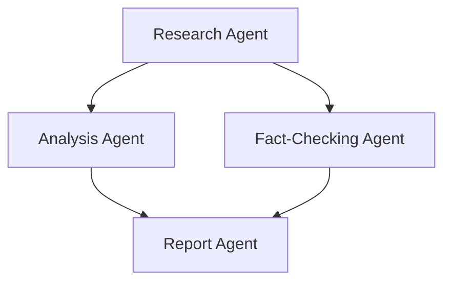
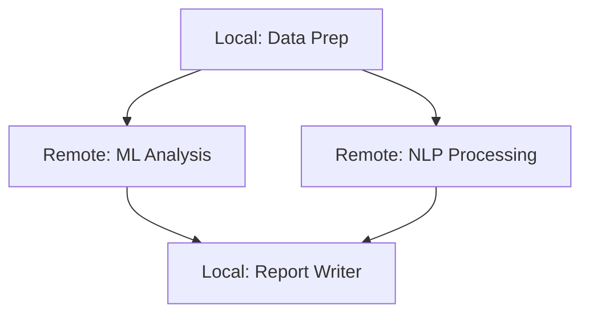
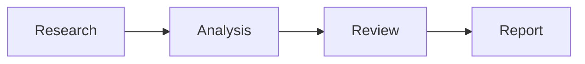
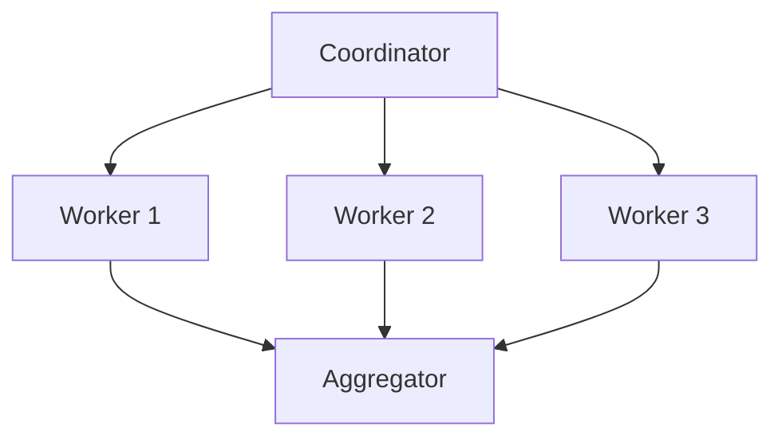
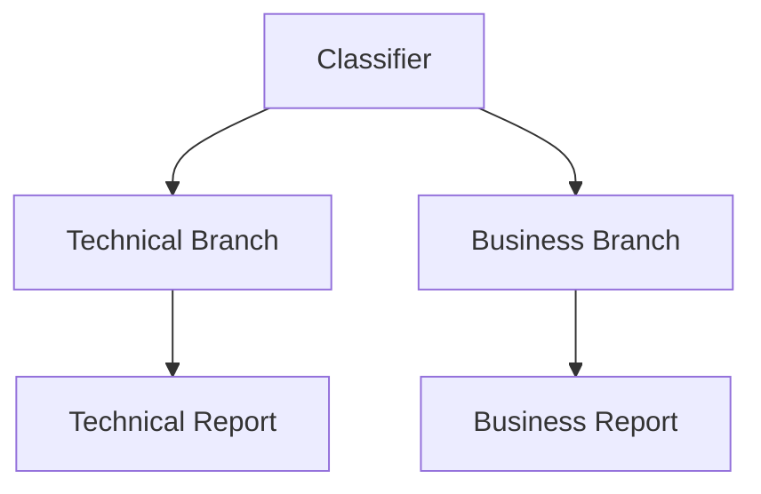
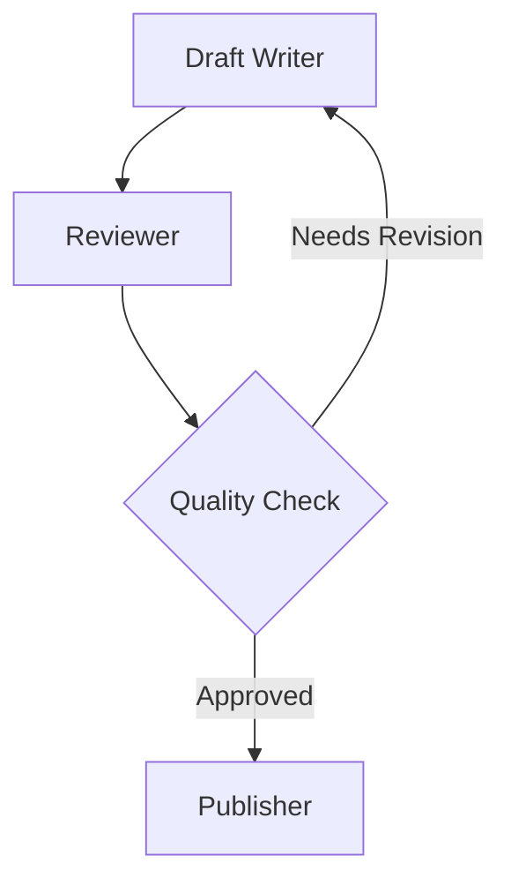

A Graph is a deterministic directed graph based agent orchestration system where agents, custom nodes, or other multi-agent systems (like [Swarm](/docs/user-guide/concepts/multi-agent/swarm/index.md) or nested Graphs) are nodes in a graph. Nodes are executed according to edge dependencies, with output from one node passed as input to connected nodes. The Graph pattern supports both acyclic (DAG) and cyclic topologies, enabling feedback loops and iterative refinement workflows.

-   **Deterministic execution order** based on graph structure
-   **Output propagation** along edges between nodes
-   **Clear dependency management** between agents
-   **Nested pattern support** (Graph as a node in another Graph)
-   **Remote agent support** via A2AAgent for distributed workflows
-   **Custom node types** for deterministic business logic and hybrid workflows
-   **Conditional edge traversal** for dynamic workflows
-   **Cyclic graph support** with execution limits and state management
-   **Multi-modal input support** for handling text, images, and other content types

## How Graphs Work

The Graph pattern operates on the principle of structured, deterministic workflows where:

1.  Nodes represent agents, custom nodes, or multi-agent systems
2.  Edges define dependencies and information flow between nodes
3.  Execution follows the graph structure, respecting dependencies
    1.  When multiple nodes have edges to a target node, the default behavior for when the target executes varies by SDK. See the [Conditional Edges](#conditional-edges) section for dynamic traversal.
4.  Output from one node becomes input for dependent nodes
5.  Entry points receive the original task as input
6.  Nodes can be revisited in cyclic patterns with proper exit conditions



## Graph Components

(( tab "Python" ))
### 1\. GraphNode

A [`GraphNode`](/docs/api/python/strands.multiagent.graph#GraphNode) represents a node in the graph with:

-   **node\_id**: Unique identifier for the node
-   **executor**: The Agent, A2AAgent, or MultiAgentBase instance to execute
-   **dependencies**: Set of nodes this node depends on
-   **execution\_status**: Current status (PENDING, EXECUTING, COMPLETED, FAILED)
-   **result**: The NodeResult after execution
-   **execution\_time**: Time taken to execute the node in milliseconds

### 2\. GraphEdge

A [`GraphEdge`](/docs/api/python/strands.multiagent.graph#GraphEdge) represents a connection between nodes with:

-   **from\_node**: Source node
-   **to\_node**: Target node
-   **condition**: Optional function that determines if the edge should be traversed

### 3\. GraphBuilder

The [`GraphBuilder`](/docs/api/python/strands.multiagent.graph#GraphBuilder) provides a simple interface for constructing graphs:

-   **add\_node()**: Add an agent or multi-agent system as a node
-   **add\_edge()**: Create a dependency between nodes
-   **set\_entry\_point()**: Define starting nodes for execution
-   **set\_max\_node\_executions()**: Limit total node executions (useful for cyclic graphs)
-   **set\_execution\_timeout()**: Set maximum execution time
-   **set\_node\_timeout()**: Set timeout for individual nodes
-   **reset\_on\_revisit()**: Control whether nodes reset state when revisited
-   **build()**: Validate and create the Graph instance
(( /tab "Python" ))

(( tab "TypeScript" ))
### Nodes

Nodes wrap agents or other orchestrators for execution within the graph. The SDK provides two built-in node types:

-   **AgentNode**: Wraps an `AgentBase` instance. Created automatically when you pass an agent to the `nodes` array. Uses the agent’s `id` as the node identifier.
-   **MultiAgentNode**: Wraps a `MultiAgentBase` instance (e.g. another `Graph` or `Swarm`). Created automatically when you pass an orchestrator to the `nodes` array. Uses the orchestrator’s `id` as the node identifier.

### Edges

Edges define directed connections between nodes. They can be specified as simple tuples or with an optional handler for conditional traversal:

-   **`[source, target]`**: Tuple of node IDs for unconditional edges
-   **`{ source, target, handler }`**: Object with an optional `EdgeHandler` function for conditional traversal

### Graph Constructor

The `Graph` constructor accepts:

-   **nodes**: Array of `AgentBase`, `MultiAgentBase`, or `Node` instances
-   **edges**: Array of edge definitions (tuples or objects with handlers)
-   **sources**: Entry point node IDs (auto-detected from nodes with no incoming edges)
-   **maxSteps**: Maximum total node executions (useful for cyclic graphs)
-   **maxConcurrency**: Maximum nodes executing in parallel
-   **plugins**: Plugins for event-driven extensibility
(( /tab "TypeScript" ))

## Creating a Graph

(( tab "Python" ))
To create a [`Graph`](/docs/api/python/strands.multiagent.graph#Graph), you use the [`GraphBuilder`](/docs/api/python/strands.multiagent.graph#GraphBuilder) to define nodes, edges, and entry points:

```python
import logging
from strands import Agent
from strands.multiagent import GraphBuilder

# Enable debug logs and print them to stderr
logging.getLogger("strands.multiagent").setLevel(logging.DEBUG)
logging.basicConfig(
    format="%(levelname)s | %(name)s | %(message)s",
    handlers=[logging.StreamHandler()]
)

# Create specialized agents
researcher = Agent(name="researcher", system_prompt="You are a research specialist...")
analyst = Agent(name="analyst", system_prompt="You are a data analysis specialist...")
fact_checker = Agent(name="fact_checker", system_prompt="You are a fact checking specialist...")
report_writer = Agent(name="report_writer", system_prompt="You are a report writing specialist...")

# Build the graph
builder = GraphBuilder()

# Add nodes
builder.add_node(researcher, "research")
builder.add_node(analyst, "analysis")
builder.add_node(fact_checker, "fact_check")
builder.add_node(report_writer, "report")

# Add edges (dependencies)
builder.add_edge("research", "analysis")
builder.add_edge("research", "fact_check")
builder.add_edge("analysis", "report")
builder.add_edge("fact_check", "report")

# Set entry points (optional - will be auto-detected if not specified)
builder.set_entry_point("research")

# Optional: Configure execution limits for safety
builder.set_execution_timeout(600)   # 10 minute timeout

# Build the graph
graph = builder.build()

# Execute the graph on a task
result = graph("Research the impact of AI on healthcare and create a comprehensive report")
# Or use invoke_async for async execution: result = await graph.invoke_async(...)

# Access the results
print(f"\nStatus: {result.status}")
print(f"Execution order: {[node.node_id for node in result.execution_order]}")
```
(( /tab "Python" ))

(( tab "TypeScript" ))
```typescript
// Create specialized agents
const researcher = new Agent({
  id: 'research',
  systemPrompt: 'You are a research specialist...',
})

const analyst = new Agent({
  id: 'analysis',
  systemPrompt: 'You are a data analysis specialist...',
})

const factChecker = new Agent({
  id: 'fact_check',
  systemPrompt: 'You are a fact checking specialist...',
})

const reportWriter = new Agent({
  id: 'report',
  systemPrompt: 'You are a report writing specialist...',
})

// Build the graph with nodes and edges
const graph = new Graph({
  nodes: [researcher, analyst, factChecker, reportWriter],
  edges: [
    ['research', 'analysis'],
    ['research', 'fact_check'],
    ['analysis', 'report'],
    ['fact_check', 'report'],
  ],
  // Optional: specify entry points (auto-detected from nodes with no incoming edges)
  sources: ['research'],
  // Optional: configure execution limits for safety
  maxSteps: 20,
})

// Execute the graph on a task
const result = await graph.invoke('Research the impact of AI on healthcare and create a comprehensive report')

// Access the results
console.log('Status:', result.status)
console.log('Execution order:', result.results.map((r) => r.nodeId).join(' -> '))
```
(( /tab "TypeScript" ))

## Conditional Edges

You can add conditional logic to edges to create dynamic workflows:

(( tab "Python" ))
```python
def only_if_research_successful(state):
    """Only traverse if research was successful."""
    research_node = state.results.get("research")
    if not research_node:
        return False

    # Check if research result contains success indicator
    result_text = str(research_node.result)
    return "successful" in result_text.lower()

# Add conditional edge
builder.add_edge("research", "analysis", condition=only_if_research_successful)
```
(( /tab "Python" ))

(( tab "TypeScript" ))
```typescript
const onlyIfResearchSuccessful: EdgeHandler = (state) => {
  const resultText = state.node('research')!.content.map((b) => ('text' in b ? b.text : '')).join('')
  return resultText.toLowerCase().includes('successful')
}

// Add conditional edge
const graph = new Graph({
  nodes: [researcher, analyst],
  edges: [{ source: 'research', target: 'analysis', handler: onlyIfResearchSuccessful }],
})
```
(( /tab "TypeScript" ))

### Waiting for All Dependencies

Python only

In Python, the default behavior is OR semantics — a target node fires when **any** incoming edge’s source completes. Use conditional edges to explicitly wait for all dependencies. In other SDKs, AND semantics are the default.

```python
from strands.multiagent.graph import GraphState
from strands.multiagent.base import Status

def all_dependencies_complete(required_nodes: list[str]):
    """Factory function to create AND condition for multiple dependencies."""
    def check_all_complete(state: GraphState) -> bool:
        return all(
            node_id in state.results and state.results[node_id].status == Status.COMPLETED
            for node_id in required_nodes
        )
    return check_all_complete

# Z will only execute when A AND B AND C have all completed
builder.add_edge("A", "Z", condition=all_dependencies_complete(["A", "B", "C"]))
builder.add_edge("B", "Z", condition=all_dependencies_complete(["A", "B", "C"]))
builder.add_edge("C", "Z", condition=all_dependencies_complete(["A", "B", "C"]))
```

## Nested Multi-Agent Patterns

You can use a Graph or Swarm as a node within another Graph:

(( tab "Python" ))
```python
from strands import Agent
from strands.multiagent import GraphBuilder, Swarm

# Create a swarm of research agents
research_agents = [
    Agent(name="medical_researcher", system_prompt="You are a medical research specialist..."),
    Agent(name="technology_researcher", system_prompt="You are a technology research specialist..."),
    Agent(name="economic_researcher", system_prompt="You are an economic research specialist...")
]
research_swarm = Swarm(research_agents)

# Create a single agent node too
analyst = Agent(system_prompt="Analyze the provided research.")

# Create a graph with the swarm as a node
builder = GraphBuilder()
builder.add_node(research_swarm, "research_team")
builder.add_node(analyst, "analysis")
builder.add_edge("research_team", "analysis")

graph = builder.build()

result = graph("Research the impact of AI on healthcare and create a comprehensive report")

# Access the results
print(f"\n{result}")
```
(( /tab "Python" ))

(( tab "TypeScript" ))
```typescript
const medicalResearcher = new Agent({
  id: 'medical_researcher',
  systemPrompt: 'You are a medical research specialist...',
})

const technologyResearcher = new Agent({
  id: 'technology_researcher',
  systemPrompt: 'You are a technology research specialist...',
})

const economicResearcher = new Agent({
  id: 'economic_researcher',
  systemPrompt: 'You are an economic research specialist...',
})

// Create a swarm of research agents
const researchSwarm = new Swarm({
  id: 'research_swarm',
  nodes: [medicalResearcher, technologyResearcher, economicResearcher],
})

// Create a single agent node
const analyst = new Agent({
  id: 'analysis',
  systemPrompt: 'Analyze the provided research.',
})

// Create a graph with the swarm as a node
const graph = new Graph({
  nodes: [researchSwarm, analyst],
  edges: [['research_swarm', 'analysis']],
})

const result = await graph.invoke('Research the impact of AI on healthcare and create a comprehensive report')
console.log(result)
```
(( /tab "TypeScript" ))

## Remote Agents with A2AAgent

Graphs support remote A2A agents as nodes through the [`A2AAgent`](/docs/user-guide/concepts/multi-agent/agent-to-agent/index.md#consuming-remote-agents) class. You can add it directly to a graph just like a local agent. This enables distributed architectures where orchestration happens locally while specialized tasks run on remote services.



(( tab "Python" ))
```python
import asyncio
from strands import Agent
from strands.agent.a2a_agent import A2AAgent
from strands.multiagent import GraphBuilder

# Local agents for orchestration
data_prep = Agent(
    name="data_prep",
    system_prompt="You prepare data for analysis, cleaning and formatting as needed."
)
report_writer = Agent(
    name="report_writer",
    system_prompt="You synthesize analysis results into clear, actionable reports."
)

# Remote specialized services
ml_analyzer = A2AAgent(
    endpoint="http://ml-service:9000",
    name="ml_analyzer",
    timeout=600  # Allow more time for ML operations
)
nlp_processor = A2AAgent(
    endpoint="http://nlp-service:9000",
    name="nlp_processor"
)

# Build the distributed graph
builder = GraphBuilder()
builder.add_node(data_prep, "prep")
builder.add_node(ml_analyzer, "ml")
builder.add_node(nlp_processor, "nlp")
builder.add_node(report_writer, "report")

builder.add_edge("prep", "ml")
builder.add_edge("prep", "nlp")
builder.add_edge("ml", "report")
builder.add_edge("nlp", "report")

builder.set_execution_timeout(900)
graph = builder.build()

# Execute the distributed workflow
async def main():
    result = await graph.invoke_async("Analyze customer feedback from Q4 2024")
    print(f"Status: {result.status}")

asyncio.run(main())
```
(( /tab "Python" ))

(( tab "TypeScript" ))
```typescript
// Local agents for orchestration
const dataPrep = new Agent({
  id: 'prep',
  systemPrompt: 'You prepare data for analysis, cleaning and formatting as needed.',
})

const reportWriter = new Agent({
  id: 'report',
  systemPrompt: 'You synthesize analysis results into clear, actionable reports.',
})

// Remote specialized services
const mlAnalyzer = new A2AAgent({ url: 'http://ml-service:9000', id: 'ml' })
const nlpProcessor = new A2AAgent({ url: 'http://nlp-service:9000', id: 'nlp' })

// Build the distributed graph
const graph = new Graph({
  nodes: [dataPrep, mlAnalyzer, nlpProcessor, reportWriter],
  edges: [
    ['prep', 'ml'],
    ['prep', 'nlp'],
    ['ml', 'report'],
    ['nlp', 'report'],
  ],
})

// Execute the distributed workflow
const result = await graph.invoke('Analyze customer feedback from Q4 2024')
console.log('Status:', result.status)
```
(( /tab "TypeScript" ))

## Custom Node Types

You can create custom node types to implement deterministic business logic, data processing pipelines, and hybrid workflows.

(( tab "Python" ))
Extend [`MultiAgentBase`](/docs/api/python/strands.multiagent.base#MultiAgentBase) to create custom nodes:

```python
from strands.multiagent.base import MultiAgentBase, NodeResult, Status, MultiAgentResult
from strands.agent.agent_result import AgentResult
from strands.types.content import ContentBlock, Message

class FunctionNode(MultiAgentBase):
    """Execute deterministic Python functions as graph nodes."""

    def __init__(self, func, name: str = None):
        super().__init__()
        self.func = func
        self.name = name or func.__name__

    async def invoke_async(self, task, invocation_state, **kwargs):
        # Execute function and create AgentResult
        result = self.func(task if isinstance(task, str) else str(task))

        agent_result = AgentResult(
            stop_reason="end_turn",
            message=Message(role="assistant", content=[ContentBlock(text=str(result))]),
            # ... metrics and state
        )

        # Return wrapped in MultiAgentResult
        return MultiAgentResult(
            status=Status.COMPLETED,
            results={self.name: NodeResult(result=agent_result, ...)},
            # ... execution details
        )

# Usage example
def validate_data(data):
    if not data.strip():
        raise ValueError("Empty input")
    return f"✅ Validated: {data[:50]}..."

validator = FunctionNode(func=validate_data, name="validator")
builder.add_node(validator, "validator")
```
(( /tab "Python" ))

(( tab "TypeScript" ))
Extend `Node` and implement the `handle` method:

```typescript
class ValidatorNode extends Node {
  async *handle(
    args: string | ContentBlock[],
    _state: MultiAgentState,
  ): AsyncGenerator<MultiAgentStreamEvent, NodeResultUpdate, undefined> {
    const input = typeof args === 'string' ? args : ''

    if (!input.trim()) {
      throw new Error('Empty input')
    }

    return { content: [new TextBlock(`Validated: ${input.slice(0, 50)}...`)] }
  }
}

// Pass the custom node directly to the graph
const validator = new ValidatorNode('validator', { description: 'Validates input data' })
const processor = new Agent({ id: 'processor', systemPrompt: 'Process the validated data.' })

const pipelineGraph = new Graph({
  nodes: [validator, processor],
  edges: [['validator', 'processor']],
})
```
(( /tab "TypeScript" ))

Custom nodes enable:

-   **Deterministic processing**: Guarantee execution for business logic
-   **Performance optimization**: Skip LLM calls for deterministic operations
-   **Hybrid workflows**: Combine AI creativity with deterministic control
-   **Business rules**: Implement complex business logic as graph nodes

## Multi-Modal Input Support

Graphs support multi-modal inputs like text and images:

(( tab "Python" ))
```python
from strands import Agent
from strands.multiagent import GraphBuilder
from strands.types.content import ContentBlock

# Create agents for image processing workflow
image_analyzer = Agent(system_prompt="You are an image analysis expert...")
summarizer = Agent(system_prompt="You are a summarization expert...")

# Build the graph
builder = GraphBuilder()
builder.add_node(image_analyzer, "image_analyzer")
builder.add_node(summarizer, "summarizer")
builder.add_edge("image_analyzer", "summarizer")
builder.set_entry_point("image_analyzer")

graph = builder.build()

# Create content blocks with text and image
content_blocks = [
    ContentBlock(text="Analyze this image and describe what you see:"),
    ContentBlock(image={"format": "png", "source": {"bytes": image_bytes}}),
]

# Execute the graph with multi-modal input
result = graph(content_blocks)
```
(( /tab "Python" ))

(( tab "TypeScript" ))
```typescript
// Create agents for image processing workflow
const imageAnalyzer = new Agent({
  id: 'image_analyzer',
  systemPrompt: 'You are an image analysis expert...',
})

const summarizer = new Agent({
  id: 'summarizer',
  systemPrompt: 'You are a summarization expert...',
})

// Build the graph
const graph = new Graph({
  nodes: [imageAnalyzer, summarizer],
  edges: [['image_analyzer', 'summarizer']],
  sources: ['image_analyzer'],
})

// Create content blocks with text and image
const imageBytes = new Uint8Array(/* your image data */)
const contentBlocks = [
  new TextBlock('Analyze this image and describe what you see:'),
  new ImageBlock({ format: 'png', source: { bytes: imageBytes } }),
]

// Execute the graph with multi-modal input
const result = await graph.invoke(contentBlocks)
```
(( /tab "TypeScript" ))

## Streaming Events

Graphs support real-time streaming of events during execution. This provides visibility into node execution, parallel processing, and nested multi-agent systems.

(( tab "Python" ))
```python
from strands import Agent
from strands.multiagent import GraphBuilder

# Create specialized agents
researcher = Agent(name="researcher", system_prompt="You are a research specialist...")
analyst = Agent(name="analyst", system_prompt="You are an analysis specialist...")

# Build the graph
builder = GraphBuilder()
builder.add_node(researcher, "research")
builder.add_node(analyst, "analysis")
builder.add_edge("research", "analysis")
builder.set_entry_point("research")
graph = builder.build()

# Stream events during execution
async for event in graph.stream_async("Research and analyze market trends"):
    # Track node execution
    if event.get("type") == "multiagent_node_start":
        print(f"🔄 Node {event['node_id']} starting")

    # Monitor agent events within nodes
    elif event.get("type") == "multiagent_node_stream":
        inner_event = event["event"]
        if "data" in inner_event:
            print(inner_event["data"], end="")

    # Track node completion
    elif event.get("type") == "multiagent_node_stop":
        node_result = event["node_result"]
        print(f"\n✅ Node {event['node_id']} completed in {node_result.execution_time}ms")

    # Get final result
    elif event.get("type") == "multiagent_result":
        result = event["result"]
        print(f"Graph completed: {result.status}")
```
(( /tab "Python" ))

(( tab "TypeScript" ))
```typescript
const graph = new Graph({
  nodes: [researcher, analyst],
  edges: [['research', 'analysis']],
  sources: ['research'],
})

for await (const event of graph.stream('Research and analyze market trends')) {
  switch (event.type) {
    // Track node execution
    case 'beforeNodeCallEvent':
      console.log(`\n🔄 Node ${event.nodeId} starting`)
      break

    // Monitor node completion
    case 'nodeResultEvent':
      console.log(`\n✅ Node ${event.nodeId} completed in ${event.result.duration}ms`)
      break

    // Track handoffs between nodes
    case 'multiAgentHandoffEvent':
      console.log(`\n🔀 Handoff: ${event.source} -> ${event.targets.join(', ')}`)
      break

    // Get final result
    case 'multiAgentResultEvent':
      console.log(`\nGraph completed: ${event.result.status}`)
      break
  }
}
```
(( /tab "TypeScript" ))

See the [streaming overview](/docs/user-guide/concepts/streaming/index.md#multi-agent-events) for details on all multi-agent event types.

## Graph Results

When a Graph completes execution, it returns a result object with detailed information:

(( tab "Python" ))
```python
result = graph("Research and analyze...")

# Check execution status
print(f"Status: {result.status}")  # COMPLETED, FAILED, etc.

# See which nodes were executed and in what order
for node in result.execution_order:
    print(f"Executed: {node.node_id}")

# Get results from specific nodes
analysis_result = result.results["analysis"].result
print(f"Analysis: {analysis_result}")

# Get performance metrics
print(f"Total nodes: {result.total_nodes}")
print(f"Completed nodes: {result.completed_nodes}")
print(f"Failed nodes: {result.failed_nodes}")
print(f"Execution time: {result.execution_time}ms")
print(f"Token usage: {result.accumulated_usage}")
```
(( /tab "Python" ))

(( tab "TypeScript" ))
```typescript
const graph = new Graph({
  nodes: [researcher, analyst],
  edges: [['research', 'analysis']],
})

const result = await graph.invoke('Research and analyze...')

// Check execution status
console.log('Status:', result.status)

// See which nodes were executed
for (const nodeResult of result.results) {
  console.log(`Node: ${nodeResult.nodeId}, Status: ${nodeResult.status}`)
}

// Get performance metrics
console.log('Duration:', result.duration, 'ms')

// Get the final output
console.log('Output:', result.content.find((b) => b.type === 'textBlock')?.text)
```
(( /tab "TypeScript" ))

## Input Propagation

The Graph automatically builds input for each node based on its dependencies:

1.  **Entry point nodes** receive the original task as input
2.  **Dependent nodes** receive a combined input that includes:
    -   The original task
    -   Results from all dependency nodes that have completed execution

This ensures each node has access to both the original context and the outputs from its dependencies.

## Shared State

Graphs support passing shared state to all agents. This enables sharing context and configuration across agents without exposing it to the LLM.

For detailed information about shared state, including examples and best practices, see [Shared State Across Multi-Agent Patterns](/docs/user-guide/concepts/multi-agent/multi-agent-patterns/index.md#shared-state-across-multi-agent-patterns).

## Graphs as a Tool

Python only

The `graph` tool is available in the [Strands tools package](/docs/user-guide/concepts/tools/community-tools-package/index.md) for Python.

Agents can dynamically create and orchestrate graphs by using the `graph` tool:

```python
from strands import Agent
from strands_tools import graph

agent = Agent(tools=[graph], system_prompt="Create a graph of agents to solve the user's query.")

agent("Design a TypeScript REST API and then write the code for it")
```

In this example:

1.  The agent uses the `graph` tool to dynamically create nodes and edges in a graph. These nodes might be architect, coder, and reviewer agents with edges defined as architect -> coder -> reviewer
2.  Next the agent executes the graph
3.  The agent analyzes the graph results and then decides to either create another graph and execute it, or answer the user’s query

## Common Graph Topologies

### 1\. Sequential Pipeline



(( tab "Python" ))
```python
builder = GraphBuilder()
builder.add_node(researcher, "research")
builder.add_node(analyst, "analysis")
builder.add_node(reviewer, "review")
builder.add_node(report_writer, "report")

builder.add_edge("research", "analysis")
builder.add_edge("analysis", "review")
builder.add_edge("review", "report")
```
(( /tab "Python" ))

(( tab "TypeScript" ))
```typescript
const graph = new Graph({
  nodes: [researcher, analyst, reviewer, reportWriter],
  edges: [
    ['research', 'analysis'],
    ['analysis', 'review'],
    ['review', 'report'],
  ],
})
```
(( /tab "TypeScript" ))

### 2\. Parallel Processing with Aggregation



(( tab "Python" ))
```python
builder = GraphBuilder()
builder.add_node(coordinator, "coordinator")
builder.add_node(worker1, "worker1")
builder.add_node(worker2, "worker2")
builder.add_node(worker3, "worker3")
builder.add_node(aggregator, "aggregator")

builder.add_edge("coordinator", "worker1")
builder.add_edge("coordinator", "worker2")
builder.add_edge("coordinator", "worker3")
builder.add_edge("worker1", "aggregator")
builder.add_edge("worker2", "aggregator")
builder.add_edge("worker3", "aggregator")
```
(( /tab "Python" ))

(( tab "TypeScript" ))
```typescript
const graph = new Graph({
  nodes: [coordinator, worker1, worker2, worker3, aggregator],
  edges: [
    ['coordinator', 'worker1'],
    ['coordinator', 'worker2'],
    ['coordinator', 'worker3'],
    ['worker1', 'aggregator'],
    ['worker2', 'aggregator'],
    ['worker3', 'aggregator'],
  ],
})
```
(( /tab "TypeScript" ))

### 3\. Branching Logic



(( tab "Python" ))
```python
def is_technical(state):
    classifier_result = state.results.get("classifier")
    if not classifier_result:
        return False
    result_text = str(classifier_result.result)
    return "technical" in result_text.lower()

def is_business(state):
    classifier_result = state.results.get("classifier")
    if not classifier_result:
        return False
    result_text = str(classifier_result.result)
    return "business" in result_text.lower()

builder = GraphBuilder()
builder.add_node(classifier, "classifier")
builder.add_node(tech_specialist, "tech_specialist")
builder.add_node(business_specialist, "business_specialist")
builder.add_node(tech_report, "tech_report")
builder.add_node(business_report, "business_report")

builder.add_edge("classifier", "tech_specialist", condition=is_technical)
builder.add_edge("classifier", "business_specialist", condition=is_business)
builder.add_edge("tech_specialist", "tech_report")
builder.add_edge("business_specialist", "business_report")
```
(( /tab "Python" ))

(( tab "TypeScript" ))
```typescript
const isTechnical: EdgeHandler = (state) => {
  const resultText = state.node('classifier')!.content.map((b) => ('text' in b ? b.text : '')).join('')
  return resultText.toLowerCase().includes('technical')
}

const isBusiness: EdgeHandler = (state) => {
  const resultText = state.node('classifier')!.content.map((b) => ('text' in b ? b.text : '')).join('')
  return resultText.toLowerCase().includes('business')
}

const graph = new Graph({
  nodes: [classifier, techSpecialist, businessSpecialist, techReport, businessReport],
  edges: [
    { source: 'classifier', target: 'tech_specialist', handler: isTechnical },
    { source: 'classifier', target: 'business_specialist', handler: isBusiness },
    ['tech_specialist', 'tech_report'],
    ['business_specialist', 'business_report'],
  ],
})
```
(( /tab "TypeScript" ))

### 4\. Feedback Loop



(( tab "Python" ))
```python
def needs_revision(state):
    review_result = state.results.get("reviewer")
    if not review_result:
        return False
    result_text = str(review_result.result)
    return "revision needed" in result_text.lower()

def is_approved(state):
    review_result = state.results.get("reviewer")
    if not review_result:
        return False
    result_text = str(review_result.result)
    return "approved" in result_text.lower()

builder = GraphBuilder()
builder.add_node(draft_writer, "draft_writer")
builder.add_node(reviewer, "reviewer")
builder.add_node(publisher, "publisher")

builder.add_edge("draft_writer", "reviewer")
builder.add_edge("reviewer", "draft_writer", condition=needs_revision)
builder.add_edge("reviewer", "publisher", condition=is_approved)

# Set execution limits to prevent infinite loops
builder.set_max_node_executions(10)  # Maximum 10 node executions total
builder.set_execution_timeout(300)   # 5 minute timeout
builder.reset_on_revisit(True)       # Reset node state when revisiting

graph = builder.build()
```
(( /tab "Python" ))

(( tab "TypeScript" ))
```typescript
const needsRevision: EdgeHandler = (state) => {
  const resultText = state.node('reviewer')!.content.map((b) => ('text' in b ? b.text : '')).join('')
  return resultText.toLowerCase().includes('revision needed')
}

const isApproved: EdgeHandler = (state) => {
  const resultText = state.node('reviewer')!.content.map((b) => ('text' in b ? b.text : '')).join('')
  return resultText.toLowerCase().includes('approved')
}

const graph = new Graph({
  nodes: [draftWriter, reviewer, publisher],
  edges: [
    ['draft_writer', 'reviewer'],
    { source: 'reviewer', target: 'draft_writer', handler: needsRevision },
    { source: 'reviewer', target: 'publisher', handler: isApproved },
  ],
  // Set execution limits to prevent infinite loops
  maxSteps: 10,
})
```
(( /tab "TypeScript" ))

## SDK Differences

The Graph pattern is available in multiple SDKs. While the core concept is the same, there are behavioral differences.

**Dependency resolution**: Python uses OR semantics, where a node fires when any single incoming edge from the completed batch is satisfied. TypeScript uses AND semantics, where a node runs only when all incoming edge sources are completed. This is more intuitive for join/diamond patterns where you want to wait for all inputs before proceeding.

**Scheduling**: Python executes in discrete batches, waiting for the entire batch to complete before scheduling the next set of nodes. TypeScript launches nodes individually as they become ready, up to `maxConcurrency`. This avoids artificial bottlenecks where a fast node waits for a slow sibling to finish before its dependents can start.

**Node state**: Python accumulates agent state across executions unless `reset_on_revisit` is explicitly enabled. TypeScript agent nodes are stateless by default, snapshotting and restoring the agent’s messages and state on each execution.

**Error handling**: Python node failures throw exceptions (fail-fast), while orchestrator-level limit violations return a FAILED result. TypeScript does the inverse: node failures produce a FAILED result, allowing parallel paths to continue, while orchestrator-level limits (`maxSteps`) throw exceptions to promote fail-fast behavior for global failures.

**Node cancellation**: Both SDKs support cancelling a node before execution via hook callbacks. In TypeScript, a cancelled node produces a CANCELLED result status, allowing the orchestrator to distinguish cancellation from failure. In Python, a cancelled node results in a FAILED status.