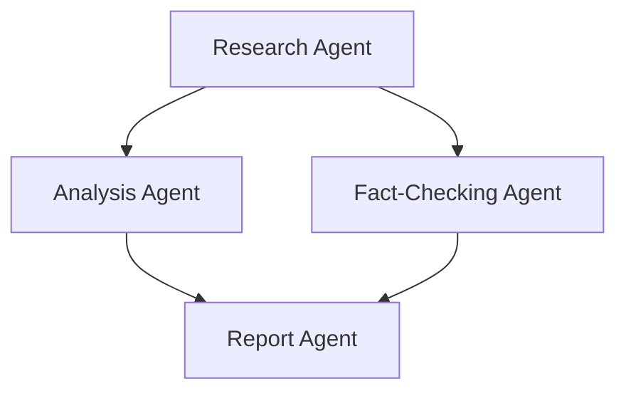
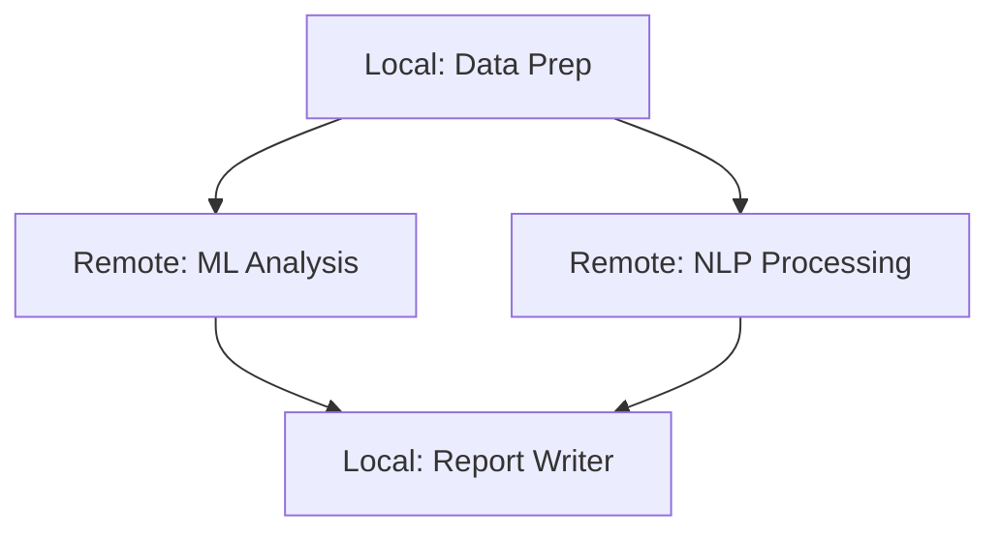
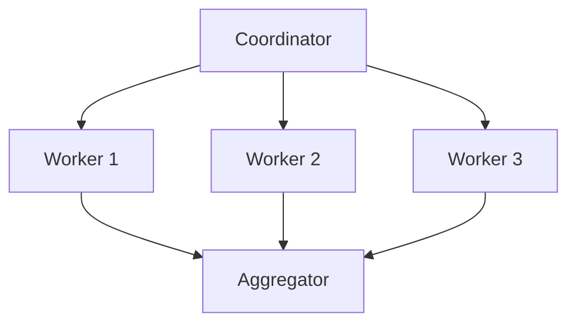
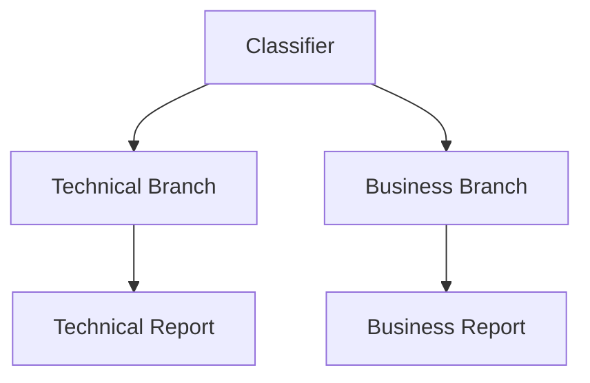
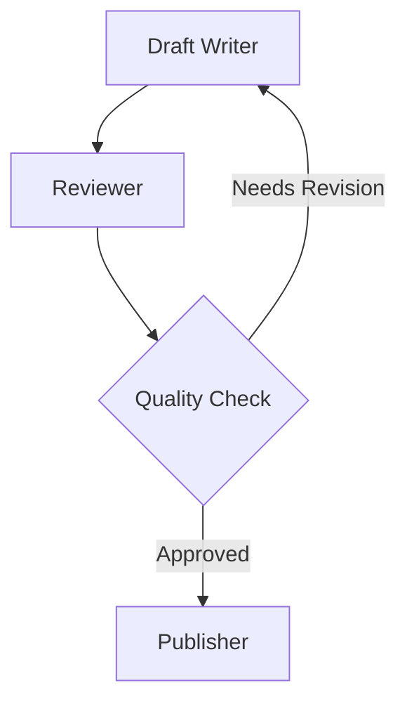

A Graph is a deterministic directed graph based agent orchestration system where agents, custom nodes, or other multi-agent systems (like [Swarm](/docs/user-guide/concepts/multi-agent/swarm/index.md) or nested Graphs) are nodes in a graph. Nodes are executed according to edge dependencies, with output from one node passed as input to connected nodes. The Graph pattern supports both acyclic (DAG) and cyclic topologies, enabling feedback loops and iterative refinement workflows.

-   **Deterministic execution order** based on graph structure
-   **Output propagation** along edges between nodes
-   **Clear dependency management** between agents
-   **Nested pattern support** (Graph as a node in another Graph)
-   **Remote agent support** via A2AAgent for distributed workflows
-   **Custom node types** for deterministic business logic and hybrid workflows
-   **Conditional edge traversal** for dynamic workflows
-   **Cyclic graph support** with execution limits and state management
-   **Multi-modal input support** for handling text, images, and other content types

## How Graphs Work

The Graph pattern operates on the principle of structured, deterministic workflows where:

1.  Nodes represent agents, custom nodes, or multi-agent systems
2.  Edges define dependencies and information flow between nodes
3.  Execution follows the graph structure, respecting dependencies
    1.  When multiple nodes have edges to a target node, the default behavior for when the target executes varies by SDK. See the [Conditional Edges](#conditional-edges) section for dynamic traversal.
4.  Output from one node becomes input for dependent nodes
5.  Entry points receive the original task as input
6.  Nodes can be revisited in cyclic patterns with proper exit conditions



## Graph Components

<starlight-tab-item data-label="Python"> &lt;div class=&quot;sl-heading-wrapper level-h3&quot;&gt;&lt;h3 id=&quot;1-graphnode&quot;&gt;1. GraphNode&lt;/h3&gt;&lt;a href=&quot;#1-graphnode&quot; class=&quot;sl-anchor-link&quot;&gt;&amp;lt;span aria-hidden=&amp;quot;true&amp;quot; class=&amp;quot;sl-anchor-icon&amp;quot;&amp;gt;&amp;lt;svg width=&amp;quot;16&amp;quot; height=&amp;quot;16&amp;quot; viewBox=&amp;quot;0 0 24 24&amp;quot;&amp;gt;&amp;lt;path fill=&amp;quot;currentcolor&amp;quot; d=&amp;quot;m12.11 15.39-3.88 3.88a2.52 2.52 0 0 1-3.5 0 2.47 2.47 0 0 1 0-3.5l3.88-3.88a1 1 0 0 0-1.42-1.42l-3.88 3.89a4.48 4.48 0 0 0 6.33 6.33l3.89-3.88a1 1 0 1 0-1.42-1.42Zm8.58-12.08a4.49 4.49 0 0 0-6.33 0l-3.89 3.88a1 1 0 0 0 1.42 1.42l3.88-3.88a2.52 2.52 0 0 1 3.5 0 2.47 2.47 0 0 1 0 3.5l-3.88 3.88a1 1 0 1 0 1.42 1.42l3.88-3.89a4.49 4.49 0 0 0 0-6.33ZM8.83 15.17a1 1 0 0 0 1.1.22 1 1 0 0 0 .32-.22l4.92-4.92a1 1 0 0 0-1.42-1.42l-4.92 4.92a1 1 0 0 0 0 1.42Z&amp;quot;&amp;gt;&amp;lt;/path&amp;gt;&amp;lt;/svg&amp;gt;&amp;lt;/span&amp;gt;&amp;lt;span class=&amp;quot;sr-only&amp;quot; data-pagefind-ignore=&amp;quot;true&amp;quot;&amp;gt;Section titled “1. GraphNode”&amp;lt;/span&amp;gt;&lt;/a&gt;&lt;/div&gt;&lt;p&gt;A &lt;a href=&quot;/docs/api/python/strands.multiagent.graph/#GraphNode&quot;&gt;&amp;lt;code dir=&amp;quot;auto&amp;quot;&amp;gt;GraphNode&amp;lt;/code&amp;gt;&lt;/a&gt; represents a node in the graph with:&lt;/p&gt;&lt;ul&gt; &lt;li&gt;&lt;strong&gt;node\_id&lt;/strong&gt;: Unique identifier for the node&lt;/li&gt; &lt;li&gt;&lt;strong&gt;executor&lt;/strong&gt;: The Agent, A2AAgent, or MultiAgentBase instance to execute&lt;/li&gt; &lt;li&gt;&lt;strong&gt;dependencies&lt;/strong&gt;: Set of nodes this node depends on&lt;/li&gt; &lt;li&gt;&lt;strong&gt;execution\_status&lt;/strong&gt;: Current status (PENDING, EXECUTING, COMPLETED, FAILED)&lt;/li&gt; &lt;li&gt;&lt;strong&gt;result&lt;/strong&gt;: The NodeResult after execution&lt;/li&gt; &lt;li&gt;&lt;strong&gt;execution\_time&lt;/strong&gt;: Time taken to execute the node in milliseconds&lt;/li&gt; &lt;/ul&gt;&lt;div class=&quot;sl-heading-wrapper level-h3&quot;&gt;&lt;h3 id=&quot;2-graphedge&quot;&gt;2. GraphEdge&lt;/h3&gt;&lt;a href=&quot;#2-graphedge&quot; class=&quot;sl-anchor-link&quot;&gt;&amp;lt;span aria-hidden=&amp;quot;true&amp;quot; class=&amp;quot;sl-anchor-icon&amp;quot;&amp;gt;&amp;lt;svg width=&amp;quot;16&amp;quot; height=&amp;quot;16&amp;quot; viewBox=&amp;quot;0 0 24 24&amp;quot;&amp;gt;&amp;lt;path fill=&amp;quot;currentcolor&amp;quot; d=&amp;quot;m12.11 15.39-3.88 3.88a2.52 2.52 0 0 1-3.5 0 2.47 2.47 0 0 1 0-3.5l3.88-3.88a1 1 0 0 0-1.42-1.42l-3.88 3.89a4.48 4.48 0 0 0 6.33 6.33l3.89-3.88a1 1 0 1 0-1.42-1.42Zm8.58-12.08a4.49 4.49 0 0 0-6.33 0l-3.89 3.88a1 1 0 0 0 1.42 1.42l3.88-3.88a2.52 2.52 0 0 1 3.5 0 2.47 2.47 0 0 1 0 3.5l-3.88 3.88a1 1 0 1 0 1.42 1.42l3.88-3.89a4.49 4.49 0 0 0 0-6.33ZM8.83 15.17a1 1 0 0 0 1.1.22 1 1 0 0 0 .32-.22l4.92-4.92a1 1 0 0 0-1.42-1.42l-4.92 4.92a1 1 0 0 0 0 1.42Z&amp;quot;&amp;gt;&amp;lt;/path&amp;gt;&amp;lt;/svg&amp;gt;&amp;lt;/span&amp;gt;&amp;lt;span class=&amp;quot;sr-only&amp;quot; data-pagefind-ignore=&amp;quot;true&amp;quot;&amp;gt;Section titled “2. GraphEdge”&amp;lt;/span&amp;gt;&lt;/a&gt;&lt;/div&gt;&lt;p&gt;A &lt;a href=&quot;/docs/api/python/strands.multiagent.graph/#GraphEdge&quot;&gt;&amp;lt;code dir=&amp;quot;auto&amp;quot;&amp;gt;GraphEdge&amp;lt;/code&amp;gt;&lt;/a&gt; represents a connection between nodes with:&lt;/p&gt;&lt;ul&gt; &lt;li&gt;&lt;strong&gt;from\_node&lt;/strong&gt;: Source node&lt;/li&gt; &lt;li&gt;&lt;strong&gt;to\_node&lt;/strong&gt;: Target node&lt;/li&gt; &lt;li&gt;&lt;strong&gt;condition&lt;/strong&gt;: Optional function that determines if the edge should be traversed&lt;/li&gt; &lt;/ul&gt;&lt;div class=&quot;sl-heading-wrapper level-h3&quot;&gt;&lt;h3 id=&quot;3-graphbuilder&quot;&gt;3. GraphBuilder&lt;/h3&gt;&lt;a href=&quot;#3-graphbuilder&quot; class=&quot;sl-anchor-link&quot;&gt;&amp;lt;span aria-hidden=&amp;quot;true&amp;quot; class=&amp;quot;sl-anchor-icon&amp;quot;&amp;gt;&amp;lt;svg width=&amp;quot;16&amp;quot; height=&amp;quot;16&amp;quot; viewBox=&amp;quot;0 0 24 24&amp;quot;&amp;gt;&amp;lt;path fill=&amp;quot;currentcolor&amp;quot; d=&amp;quot;m12.11 15.39-3.88 3.88a2.52 2.52 0 0 1-3.5 0 2.47 2.47 0 0 1 0-3.5l3.88-3.88a1 1 0 0 0-1.42-1.42l-3.88 3.89a4.48 4.48 0 0 0 6.33 6.33l3.89-3.88a1 1 0 1 0-1.42-1.42Zm8.58-12.08a4.49 4.49 0 0 0-6.33 0l-3.89 3.88a1 1 0 0 0 1.42 1.42l3.88-3.88a2.52 2.52 0 0 1 3.5 0 2.47 2.47 0 0 1 0 3.5l-3.88 3.88a1 1 0 1 0 1.42 1.42l3.88-3.89a4.49 4.49 0 0 0 0-6.33ZM8.83 15.17a1 1 0 0 0 1.1.22 1 1 0 0 0 .32-.22l4.92-4.92a1 1 0 0 0-1.42-1.42l-4.92 4.92a1 1 0 0 0 0 1.42Z&amp;quot;&amp;gt;&amp;lt;/path&amp;gt;&amp;lt;/svg&amp;gt;&amp;lt;/span&amp;gt;&amp;lt;span class=&amp;quot;sr-only&amp;quot; data-pagefind-ignore=&amp;quot;true&amp;quot;&amp;gt;Section titled “3. GraphBuilder”&amp;lt;/span&amp;gt;&lt;/a&gt;&lt;/div&gt;&lt;p&gt;The &lt;a href=&quot;/docs/api/python/strands.multiagent.graph/#GraphBuilder&quot;&gt;&amp;lt;code dir=&amp;quot;auto&amp;quot;&amp;gt;GraphBuilder&amp;lt;/code&amp;gt;&lt;/a&gt; provides a simple interface for constructing graphs:&lt;/p&gt;&lt;ul&gt; &lt;li&gt;&lt;strong&gt;add\_node()&lt;/strong&gt;: Add an agent or multi-agent system as a node&lt;/li&gt; &lt;li&gt;&lt;strong&gt;add\_edge()&lt;/strong&gt;: Create a dependency between nodes&lt;/li&gt; &lt;li&gt;&lt;strong&gt;set\_entry\_point()&lt;/strong&gt;: Define starting nodes for execution&lt;/li&gt; &lt;li&gt;&lt;strong&gt;set\_max\_node\_executions()&lt;/strong&gt;: Limit total node executions (useful for cyclic graphs)&lt;/li&gt; &lt;li&gt;&lt;strong&gt;set\_execution\_timeout()&lt;/strong&gt;: Set maximum execution time&lt;/li&gt; &lt;li&gt;&lt;strong&gt;set\_node\_timeout()&lt;/strong&gt;: Set timeout for individual nodes&lt;/li&gt; &lt;li&gt;&lt;strong&gt;reset\_on\_revisit()&lt;/strong&gt;: Control whether nodes reset state when revisited&lt;/li&gt; &lt;li&gt;&lt;strong&gt;build()&lt;/strong&gt;: Validate and create the Graph instance&lt;/li&gt; &lt;/ul&gt; </starlight-tab-item><starlight-tab-item data-label="TypeScript"> &lt;div class=&quot;sl-heading-wrapper level-h3&quot;&gt;&lt;h3 id=&quot;nodes&quot;&gt;Nodes&lt;/h3&gt;&lt;a href=&quot;#nodes&quot; class=&quot;sl-anchor-link&quot;&gt;&amp;lt;span aria-hidden=&amp;quot;true&amp;quot; class=&amp;quot;sl-anchor-icon&amp;quot;&amp;gt;&amp;lt;svg width=&amp;quot;16&amp;quot; height=&amp;quot;16&amp;quot; viewBox=&amp;quot;0 0 24 24&amp;quot;&amp;gt;&amp;lt;path fill=&amp;quot;currentcolor&amp;quot; d=&amp;quot;m12.11 15.39-3.88 3.88a2.52 2.52 0 0 1-3.5 0 2.47 2.47 0 0 1 0-3.5l3.88-3.88a1 1 0 0 0-1.42-1.42l-3.88 3.89a4.48 4.48 0 0 0 6.33 6.33l3.89-3.88a1 1 0 1 0-1.42-1.42Zm8.58-12.08a4.49 4.49 0 0 0-6.33 0l-3.89 3.88a1 1 0 0 0 1.42 1.42l3.88-3.88a2.52 2.52 0 0 1 3.5 0 2.47 2.47 0 0 1 0 3.5l-3.88 3.88a1 1 0 1 0 1.42 1.42l3.88-3.89a4.49 4.49 0 0 0 0-6.33ZM8.83 15.17a1 1 0 0 0 1.1.22 1 1 0 0 0 .32-.22l4.92-4.92a1 1 0 0 0-1.42-1.42l-4.92 4.92a1 1 0 0 0 0 1.42Z&amp;quot;&amp;gt;&amp;lt;/path&amp;gt;&amp;lt;/svg&amp;gt;&amp;lt;/span&amp;gt;&amp;lt;span class=&amp;quot;sr-only&amp;quot; data-pagefind-ignore=&amp;quot;true&amp;quot;&amp;gt;Section titled “Nodes”&amp;lt;/span&amp;gt;&lt;/a&gt;&lt;/div&gt;&lt;p&gt;Nodes wrap agents or other orchestrators for execution within the graph. The SDK provides two built-in node types:&lt;/p&gt;&lt;ul&gt; &lt;li&gt;&lt;strong&gt;AgentNode&lt;/strong&gt;: Wraps an &lt;code dir=&quot;auto&quot;&gt;AgentBase&lt;/code&gt; instance. Created automatically when you pass an agent to the &lt;code dir=&quot;auto&quot;&gt;nodes&lt;/code&gt; array. Uses the agent’s &lt;code dir=&quot;auto&quot;&gt;id&lt;/code&gt; as the node identifier.&lt;/li&gt; &lt;li&gt;&lt;strong&gt;MultiAgentNode&lt;/strong&gt;: Wraps a &lt;code dir=&quot;auto&quot;&gt;MultiAgentBase&lt;/code&gt; instance (e.g. another &lt;code dir=&quot;auto&quot;&gt;Graph&lt;/code&gt; or &lt;code dir=&quot;auto&quot;&gt;Swarm&lt;/code&gt;). Created automatically when you pass an orchestrator to the &lt;code dir=&quot;auto&quot;&gt;nodes&lt;/code&gt; array. Uses the orchestrator’s &lt;code dir=&quot;auto&quot;&gt;id&lt;/code&gt; as the node identifier.&lt;/li&gt; &lt;/ul&gt;&lt;div class=&quot;sl-heading-wrapper level-h3&quot;&gt;&lt;h3 id=&quot;edges&quot;&gt;Edges&lt;/h3&gt;&lt;a href=&quot;#edges&quot; class=&quot;sl-anchor-link&quot;&gt;&amp;lt;span aria-hidden=&amp;quot;true&amp;quot; class=&amp;quot;sl-anchor-icon&amp;quot;&amp;gt;&amp;lt;svg width=&amp;quot;16&amp;quot; height=&amp;quot;16&amp;quot; viewBox=&amp;quot;0 0 24 24&amp;quot;&amp;gt;&amp;lt;path fill=&amp;quot;currentcolor&amp;quot; d=&amp;quot;m12.11 15.39-3.88 3.88a2.52 2.52 0 0 1-3.5 0 2.47 2.47 0 0 1 0-3.5l3.88-3.88a1 1 0 0 0-1.42-1.42l-3.88 3.89a4.48 4.48 0 0 0 6.33 6.33l3.89-3.88a1 1 0 1 0-1.42-1.42Zm8.58-12.08a4.49 4.49 0 0 0-6.33 0l-3.89 3.88a1 1 0 0 0 1.42 1.42l3.88-3.88a2.52 2.52 0 0 1 3.5 0 2.47 2.47 0 0 1 0 3.5l-3.88 3.88a1 1 0 1 0 1.42 1.42l3.88-3.89a4.49 4.49 0 0 0 0-6.33ZM8.83 15.17a1 1 0 0 0 1.1.22 1 1 0 0 0 .32-.22l4.92-4.92a1 1 0 0 0-1.42-1.42l-4.92 4.92a1 1 0 0 0 0 1.42Z&amp;quot;&amp;gt;&amp;lt;/path&amp;gt;&amp;lt;/svg&amp;gt;&amp;lt;/span&amp;gt;&amp;lt;span class=&amp;quot;sr-only&amp;quot; data-pagefind-ignore=&amp;quot;true&amp;quot;&amp;gt;Section titled “Edges”&amp;lt;/span&amp;gt;&lt;/a&gt;&lt;/div&gt;&lt;p&gt;Edges define directed connections between nodes. They can be specified as simple tuples or with an optional handler for conditional traversal:&lt;/p&gt;&lt;ul&gt; &lt;li&gt;&lt;strong&gt;&lt;code dir=&quot;auto&quot;&gt;\[source, target\]&lt;/code&gt;&lt;/strong&gt;: Tuple of node IDs for unconditional edges&lt;/li&gt; &lt;li&gt;&lt;strong&gt;&lt;code dir=&quot;auto&quot;&gt;{ source, target, handler }&lt;/code&gt;&lt;/strong&gt;: Object with an optional &lt;code dir=&quot;auto&quot;&gt;EdgeHandler&lt;/code&gt; function for conditional traversal&lt;/li&gt; &lt;/ul&gt;&lt;div class=&quot;sl-heading-wrapper level-h3&quot;&gt;&lt;h3 id=&quot;graph-constructor&quot;&gt;Graph Constructor&lt;/h3&gt;&lt;a href=&quot;#graph-constructor&quot; class=&quot;sl-anchor-link&quot;&gt;&amp;lt;span aria-hidden=&amp;quot;true&amp;quot; class=&amp;quot;sl-anchor-icon&amp;quot;&amp;gt;&amp;lt;svg width=&amp;quot;16&amp;quot; height=&amp;quot;16&amp;quot; viewBox=&amp;quot;0 0 24 24&amp;quot;&amp;gt;&amp;lt;path fill=&amp;quot;currentcolor&amp;quot; d=&amp;quot;m12.11 15.39-3.88 3.88a2.52 2.52 0 0 1-3.5 0 2.47 2.47 0 0 1 0-3.5l3.88-3.88a1 1 0 0 0-1.42-1.42l-3.88 3.89a4.48 4.48 0 0 0 6.33 6.33l3.89-3.88a1 1 0 1 0-1.42-1.42Zm8.58-12.08a4.49 4.49 0 0 0-6.33 0l-3.89 3.88a1 1 0 0 0 1.42 1.42l3.88-3.88a2.52 2.52 0 0 1 3.5 0 2.47 2.47 0 0 1 0 3.5l-3.88 3.88a1 1 0 1 0 1.42 1.42l3.88-3.89a4.49 4.49 0 0 0 0-6.33ZM8.83 15.17a1 1 0 0 0 1.1.22 1 1 0 0 0 .32-.22l4.92-4.92a1 1 0 0 0-1.42-1.42l-4.92 4.92a1 1 0 0 0 0 1.42Z&amp;quot;&amp;gt;&amp;lt;/path&amp;gt;&amp;lt;/svg&amp;gt;&amp;lt;/span&amp;gt;&amp;lt;span class=&amp;quot;sr-only&amp;quot; data-pagefind-ignore=&amp;quot;true&amp;quot;&amp;gt;Section titled “Graph Constructor”&amp;lt;/span&amp;gt;&lt;/a&gt;&lt;/div&gt;&lt;p&gt;The &lt;code dir=&quot;auto&quot;&gt;Graph&lt;/code&gt; constructor accepts:&lt;/p&gt;&lt;ul&gt; &lt;li&gt;&lt;strong&gt;nodes&lt;/strong&gt;: Array of &lt;code dir=&quot;auto&quot;&gt;AgentBase&lt;/code&gt;, &lt;code dir=&quot;auto&quot;&gt;MultiAgentBase&lt;/code&gt;, or &lt;code dir=&quot;auto&quot;&gt;Node&lt;/code&gt; instances&lt;/li&gt; &lt;li&gt;&lt;strong&gt;edges&lt;/strong&gt;: Array of edge definitions (tuples or objects with handlers)&lt;/li&gt; &lt;li&gt;&lt;strong&gt;sources&lt;/strong&gt;: Entry point node IDs (auto-detected from nodes with no incoming edges)&lt;/li&gt; &lt;li&gt;&lt;strong&gt;maxSteps&lt;/strong&gt;: Maximum total node executions (useful for cyclic graphs)&lt;/li&gt; &lt;li&gt;&lt;strong&gt;maxConcurrency&lt;/strong&gt;: Maximum nodes executing in parallel&lt;/li&gt; &lt;li&gt;&lt;strong&gt;plugins&lt;/strong&gt;: Plugins for event-driven extensibility&lt;/li&gt; &lt;/ul&gt; </starlight-tab-item>

## Creating a Graph

<starlight-tab-item data-label="Python"> &lt;p&gt;To create a &lt;a href=&quot;/docs/api/python/strands.multiagent.graph/#Graph&quot;&gt;&amp;lt;code dir=&amp;quot;auto&amp;quot;&amp;gt;Graph&amp;lt;/code&amp;gt;&lt;/a&gt;, you use the &lt;a href=&quot;/docs/api/python/strands.multiagent.graph/#GraphBuilder&quot;&gt;&amp;lt;code dir=&amp;quot;auto&amp;quot;&amp;gt;GraphBuilder&amp;lt;/code&amp;gt;&lt;/a&gt; to define nodes, edges, and entry points:&lt;/p&gt;&lt;div class=&quot;expressive-code&quot;&gt;&lt;figure class=&quot;frame&quot;&gt;&lt;figcaption class=&quot;header&quot;&gt;&lt;/figcaption&gt;&lt;pre data-language=&quot;python&quot; dir=&quot;ltr&quot;&gt;&lt;code&gt;&lt;div class=&quot;ec-line&quot;&gt;&lt;div class=&quot;code&quot;&gt;&lt;span style=&quot;--0:#BF3441;--1:#F97583&quot;&gt;import&lt;/span&gt;&lt;span style=&quot;--0:#24292E;--1:#E1E4E8&quot;&gt; logging&lt;/span&gt;&lt;/div&gt;&lt;/div&gt;&lt;div class=&quot;ec-line&quot;&gt;&lt;div class=&quot;code&quot;&gt;&lt;span style=&quot;--0:#BF3441;--1:#F97583&quot;&gt;from&lt;/span&gt;&lt;span style=&quot;--0:#24292E;--1:#E1E4E8&quot;&gt; strands &lt;/span&gt;&lt;span style=&quot;--0:#BF3441;--1:#F97583&quot;&gt;import&lt;/span&gt;&lt;span style=&quot;--0:#24292E;--1:#E1E4E8&quot;&gt; Agent&lt;/span&gt;&lt;/div&gt;&lt;/div&gt;&lt;div class=&quot;ec-line&quot;&gt;&lt;div class=&quot;code&quot;&gt;&lt;span style=&quot;--0:#BF3441;--1:#F97583&quot;&gt;from&lt;/span&gt;&lt;span style=&quot;--0:#24292E;--1:#E1E4E8&quot;&gt; strands.multiagent &lt;/span&gt;&lt;span style=&quot;--0:#BF3441;--1:#F97583&quot;&gt;import&lt;/span&gt;&lt;span style=&quot;--0:#24292E;--1:#E1E4E8&quot;&gt; GraphBuilder&lt;/span&gt;&lt;/div&gt;&lt;/div&gt;&lt;div class=&quot;ec-line&quot;&gt;&lt;div class=&quot;code&quot;&gt; &lt;/div&gt;&lt;/div&gt;&lt;div class=&quot;ec-line&quot;&gt;&lt;div class=&quot;code&quot;&gt;&lt;span style=&quot;--0:#616972;--1:#99A0A6&quot;&gt;# Enable debug logs and print them to stderr&lt;/span&gt;&lt;/div&gt;&lt;/div&gt;&lt;div class=&quot;ec-line&quot;&gt;&lt;div class=&quot;code&quot;&gt;&lt;span style=&quot;--0:#24292E;--1:#E1E4E8&quot;&gt;logging.getLogger(&lt;/span&gt;&lt;span style=&quot;--0:#032F62;--1:#9ECBFF&quot;&gt;&amp;quot;strands.multiagent&amp;quot;&lt;/span&gt;&lt;span style=&quot;--0:#24292E;--1:#E1E4E8&quot;&gt;).setLevel(logging.&lt;/span&gt;&lt;span style=&quot;--0:#005CC5;--1:#79B8FF&quot;&gt;DEBUG&lt;/span&gt;&lt;span style=&quot;--0:#24292E;--1:#E1E4E8&quot;&gt;)&lt;/span&gt;&lt;/div&gt;&lt;/div&gt;&lt;div class=&quot;ec-line&quot;&gt;&lt;div class=&quot;code&quot;&gt;&lt;span style=&quot;--0:#24292E;--1:#E1E4E8&quot;&gt;logging.basicConfig(&lt;/span&gt;&lt;/div&gt;&lt;/div&gt;&lt;div class=&quot;ec-line&quot;&gt;&lt;div class=&quot;code&quot;&gt;&lt;span class=&quot;indent&quot;&gt; &lt;/span&gt;&lt;span style=&quot;--0:#AE4B07;--1:#FFAB70&quot;&gt;format&lt;/span&gt;&lt;span style=&quot;--0:#BF3441;--1:#F97583&quot;&gt;=&lt;/span&gt;&lt;span style=&quot;--0:#032F62;--1:#9ECBFF&quot;&gt;&amp;quot;&lt;/span&gt;&lt;span style=&quot;--0:#005CC5;--1:#79B8FF&quot;&gt;%(levelname)s&lt;/span&gt;&lt;span style=&quot;--0:#032F62;--1:#9ECBFF&quot;&gt; | &lt;/span&gt;&lt;span style=&quot;--0:#005CC5;--1:#79B8FF&quot;&gt;%(name)s&lt;/span&gt;&lt;span style=&quot;--0:#032F62;--1:#9ECBFF&quot;&gt; | &lt;/span&gt;&lt;span style=&quot;--0:#005CC5;--1:#79B8FF&quot;&gt;%(message)s&lt;/span&gt;&lt;span style=&quot;--0:#032F62;--1:#9ECBFF&quot;&gt;&amp;quot;&lt;/span&gt;&lt;span style=&quot;--0:#24292E;--1:#E1E4E8&quot;&gt;,&lt;/span&gt;&lt;/div&gt;&lt;/div&gt;&lt;div class=&quot;ec-line&quot;&gt;&lt;div class=&quot;code&quot;&gt;&lt;span class=&quot;indent&quot;&gt; &lt;/span&gt;&lt;span style=&quot;--0:#AE4B07;--1:#FFAB70&quot;&gt;handlers&lt;/span&gt;&lt;span style=&quot;--0:#BF3441;--1:#F97583&quot;&gt;=&lt;/span&gt;&lt;span style=&quot;--0:#24292E;--1:#E1E4E8&quot;&gt;\[logging.StreamHandler()\]&lt;/span&gt;&lt;/div&gt;&lt;/div&gt;&lt;div class=&quot;ec-line&quot;&gt;&lt;div class=&quot;code&quot;&gt;&lt;span style=&quot;--0:#24292E;--1:#E1E4E8&quot;&gt;)&lt;/span&gt;&lt;/div&gt;&lt;/div&gt;&lt;div class=&quot;ec-line&quot;&gt;&lt;div class=&quot;code&quot;&gt; &lt;/div&gt;&lt;/div&gt;&lt;div class=&quot;ec-line&quot;&gt;&lt;div class=&quot;code&quot;&gt;&lt;span style=&quot;--0:#616972;--1:#99A0A6&quot;&gt;# Create specialized agents&lt;/span&gt;&lt;/div&gt;&lt;/div&gt;&lt;div class=&quot;ec-line&quot;&gt;&lt;div class=&quot;code&quot;&gt;&lt;span style=&quot;--0:#24292E;--1:#E1E4E8&quot;&gt;researcher &lt;/span&gt;&lt;span style=&quot;--0:#BF3441;--1:#F97583&quot;&gt;=&lt;/span&gt;&lt;span style=&quot;--0:#24292E;--1:#E1E4E8&quot;&gt; Agent(&lt;/span&gt;&lt;span style=&quot;--0:#AE4B07;--1:#FFAB70&quot;&gt;name&lt;/span&gt;&lt;span style=&quot;--0:#BF3441;--1:#F97583&quot;&gt;=&lt;/span&gt;&lt;span style=&quot;--0:#032F62;--1:#9ECBFF&quot;&gt;&amp;quot;researcher&amp;quot;&lt;/span&gt;&lt;span style=&quot;--0:#24292E;--1:#E1E4E8&quot;&gt;, &lt;/span&gt;&lt;span style=&quot;--0:#AE4B07;--1:#FFAB70&quot;&gt;system\_prompt&lt;/span&gt;&lt;span style=&quot;--0:#BF3441;--1:#F97583&quot;&gt;=&lt;/span&gt;&lt;span style=&quot;--0:#032F62;--1:#9ECBFF&quot;&gt;&amp;quot;You are a research specialist...&amp;quot;&lt;/span&gt;&lt;span style=&quot;--0:#24292E;--1:#E1E4E8&quot;&gt;)&lt;/span&gt;&lt;/div&gt;&lt;/div&gt;&lt;div class=&quot;ec-line&quot;&gt;&lt;div class=&quot;code&quot;&gt;&lt;span style=&quot;--0:#24292E;--1:#E1E4E8&quot;&gt;analyst &lt;/span&gt;&lt;span style=&quot;--0:#BF3441;--1:#F97583&quot;&gt;=&lt;/span&gt;&lt;span style=&quot;--0:#24292E;--1:#E1E4E8&quot;&gt; Agent(&lt;/span&gt;&lt;span style=&quot;--0:#AE4B07;--1:#FFAB70&quot;&gt;name&lt;/span&gt;&lt;span style=&quot;--0:#BF3441;--1:#F97583&quot;&gt;=&lt;/span&gt;&lt;span style=&quot;--0:#032F62;--1:#9ECBFF&quot;&gt;&amp;quot;analyst&amp;quot;&lt;/span&gt;&lt;span style=&quot;--0:#24292E;--1:#E1E4E8&quot;&gt;, &lt;/span&gt;&lt;span style=&quot;--0:#AE4B07;--1:#FFAB70&quot;&gt;system\_prompt&lt;/span&gt;&lt;span style=&quot;--0:#BF3441;--1:#F97583&quot;&gt;=&lt;/span&gt;&lt;span style=&quot;--0:#032F62;--1:#9ECBFF&quot;&gt;&amp;quot;You are a data analysis specialist...&amp;quot;&lt;/span&gt;&lt;span style=&quot;--0:#24292E;--1:#E1E4E8&quot;&gt;)&lt;/span&gt;&lt;/div&gt;&lt;/div&gt;&lt;div class=&quot;ec-line&quot;&gt;&lt;div class=&quot;code&quot;&gt;&lt;span style=&quot;--0:#24292E;--1:#E1E4E8&quot;&gt;fact\_checker &lt;/span&gt;&lt;span style=&quot;--0:#BF3441;--1:#F97583&quot;&gt;=&lt;/span&gt;&lt;span style=&quot;--0:#24292E;--1:#E1E4E8&quot;&gt; Agent(&lt;/span&gt;&lt;span style=&quot;--0:#AE4B07;--1:#FFAB70&quot;&gt;name&lt;/span&gt;&lt;span style=&quot;--0:#BF3441;--1:#F97583&quot;&gt;=&lt;/span&gt;&lt;span style=&quot;--0:#032F62;--1:#9ECBFF&quot;&gt;&amp;quot;fact\_checker&amp;quot;&lt;/span&gt;&lt;span style=&quot;--0:#24292E;--1:#E1E4E8&quot;&gt;, &lt;/span&gt;&lt;span style=&quot;--0:#AE4B07;--1:#FFAB70&quot;&gt;system\_prompt&lt;/span&gt;&lt;span style=&quot;--0:#BF3441;--1:#F97583&quot;&gt;=&lt;/span&gt;&lt;span style=&quot;--0:#032F62;--1:#9ECBFF&quot;&gt;&amp;quot;You are a fact checking specialist...&amp;quot;&lt;/span&gt;&lt;span style=&quot;--0:#24292E;--1:#E1E4E8&quot;&gt;)&lt;/span&gt;&lt;/div&gt;&lt;/div&gt;&lt;div class=&quot;ec-line&quot;&gt;&lt;div class=&quot;code&quot;&gt;&lt;span style=&quot;--0:#24292E;--1:#E1E4E8&quot;&gt;report\_writer &lt;/span&gt;&lt;span style=&quot;--0:#BF3441;--1:#F97583&quot;&gt;=&lt;/span&gt;&lt;span style=&quot;--0:#24292E;--1:#E1E4E8&quot;&gt; Agent(&lt;/span&gt;&lt;span style=&quot;--0:#AE4B07;--1:#FFAB70&quot;&gt;name&lt;/span&gt;&lt;span style=&quot;--0:#BF3441;--1:#F97583&quot;&gt;=&lt;/span&gt;&lt;span style=&quot;--0:#032F62;--1:#9ECBFF&quot;&gt;&amp;quot;report\_writer&amp;quot;&lt;/span&gt;&lt;span style=&quot;--0:#24292E;--1:#E1E4E8&quot;&gt;, &lt;/span&gt;&lt;span style=&quot;--0:#AE4B07;--1:#FFAB70&quot;&gt;system\_prompt&lt;/span&gt;&lt;span style=&quot;--0:#BF3441;--1:#F97583&quot;&gt;=&lt;/span&gt;&lt;span style=&quot;--0:#032F62;--1:#9ECBFF&quot;&gt;&amp;quot;You are a report writing specialist...&amp;quot;&lt;/span&gt;&lt;span style=&quot;--0:#24292E;--1:#E1E4E8&quot;&gt;)&lt;/span&gt;&lt;/div&gt;&lt;/div&gt;&lt;div class=&quot;ec-line&quot;&gt;&lt;div class=&quot;code&quot;&gt; &lt;/div&gt;&lt;/div&gt;&lt;div class=&quot;ec-line&quot;&gt;&lt;div class=&quot;code&quot;&gt;&lt;span style=&quot;--0:#616972;--1:#99A0A6&quot;&gt;# Build the graph&lt;/span&gt;&lt;/div&gt;&lt;/div&gt;&lt;div class=&quot;ec-line&quot;&gt;&lt;div class=&quot;code&quot;&gt;&lt;span style=&quot;--0:#24292E;--1:#E1E4E8&quot;&gt;builder &lt;/span&gt;&lt;span style=&quot;--0:#BF3441;--1:#F97583&quot;&gt;=&lt;/span&gt;&lt;span style=&quot;--0:#24292E;--1:#E1E4E8&quot;&gt; GraphBuilder()&lt;/span&gt;&lt;/div&gt;&lt;/div&gt;&lt;div class=&quot;ec-line&quot;&gt;&lt;div class=&quot;code&quot;&gt; &lt;/div&gt;&lt;/div&gt;&lt;div class=&quot;ec-line&quot;&gt;&lt;div class=&quot;code&quot;&gt;&lt;span style=&quot;--0:#616972;--1:#99A0A6&quot;&gt;# Add nodes&lt;/span&gt;&lt;/div&gt;&lt;/div&gt;&lt;div class=&quot;ec-line&quot;&gt;&lt;div class=&quot;code&quot;&gt;&lt;span style=&quot;--0:#24292E;--1:#E1E4E8&quot;&gt;builder.add\_node(researcher, &lt;/span&gt;&lt;span style=&quot;--0:#032F62;--1:#9ECBFF&quot;&gt;&amp;quot;research&amp;quot;&lt;/span&gt;&lt;span style=&quot;--0:#24292E;--1:#E1E4E8&quot;&gt;)&lt;/span&gt;&lt;/div&gt;&lt;/div&gt;&lt;div class=&quot;ec-line&quot;&gt;&lt;div class=&quot;code&quot;&gt;&lt;span style=&quot;--0:#24292E;--1:#E1E4E8&quot;&gt;builder.add\_node(analyst, &lt;/span&gt;&lt;span style=&quot;--0:#032F62;--1:#9ECBFF&quot;&gt;&amp;quot;analysis&amp;quot;&lt;/span&gt;&lt;span style=&quot;--0:#24292E;--1:#E1E4E8&quot;&gt;)&lt;/span&gt;&lt;/div&gt;&lt;/div&gt;&lt;div class=&quot;ec-line&quot;&gt;&lt;div class=&quot;code&quot;&gt;&lt;span style=&quot;--0:#24292E;--1:#E1E4E8&quot;&gt;builder.add\_node(fact\_checker, &lt;/span&gt;&lt;span style=&quot;--0:#032F62;--1:#9ECBFF&quot;&gt;&amp;quot;fact\_check&amp;quot;&lt;/span&gt;&lt;span style=&quot;--0:#24292E;--1:#E1E4E8&quot;&gt;)&lt;/span&gt;&lt;/div&gt;&lt;/div&gt;&lt;div class=&quot;ec-line&quot;&gt;&lt;div class=&quot;code&quot;&gt;&lt;span style=&quot;--0:#24292E;--1:#E1E4E8&quot;&gt;builder.add\_node(report\_writer, &lt;/span&gt;&lt;span style=&quot;--0:#032F62;--1:#9ECBFF&quot;&gt;&amp;quot;report&amp;quot;&lt;/span&gt;&lt;span style=&quot;--0:#24292E;--1:#E1E4E8&quot;&gt;)&lt;/span&gt;&lt;/div&gt;&lt;/div&gt;&lt;div class=&quot;ec-line&quot;&gt;&lt;div class=&quot;code&quot;&gt; &lt;/div&gt;&lt;/div&gt;&lt;div class=&quot;ec-line&quot;&gt;&lt;div class=&quot;code&quot;&gt;&lt;span style=&quot;--0:#616972;--1:#99A0A6&quot;&gt;# Add edges (dependencies)&lt;/span&gt;&lt;/div&gt;&lt;/div&gt;&lt;div class=&quot;ec-line&quot;&gt;&lt;div class=&quot;code&quot;&gt;&lt;span style=&quot;--0:#24292E;--1:#E1E4E8&quot;&gt;builder.add\_edge(&lt;/span&gt;&lt;span style=&quot;--0:#032F62;--1:#9ECBFF&quot;&gt;&amp;quot;research&amp;quot;&lt;/span&gt;&lt;span style=&quot;--0:#24292E;--1:#E1E4E8&quot;&gt;, &lt;/span&gt;&lt;span style=&quot;--0:#032F62;--1:#9ECBFF&quot;&gt;&amp;quot;analysis&amp;quot;&lt;/span&gt;&lt;span style=&quot;--0:#24292E;--1:#E1E4E8&quot;&gt;)&lt;/span&gt;&lt;/div&gt;&lt;/div&gt;&lt;div class=&quot;ec-line&quot;&gt;&lt;div class=&quot;code&quot;&gt;&lt;span style=&quot;--0:#24292E;--1:#E1E4E8&quot;&gt;builder.add\_edge(&lt;/span&gt;&lt;span style=&quot;--0:#032F62;--1:#9ECBFF&quot;&gt;&amp;quot;research&amp;quot;&lt;/span&gt;&lt;span style=&quot;--0:#24292E;--1:#E1E4E8&quot;&gt;, &lt;/span&gt;&lt;span style=&quot;--0:#032F62;--1:#9ECBFF&quot;&gt;&amp;quot;fact\_check&amp;quot;&lt;/span&gt;&lt;span style=&quot;--0:#24292E;--1:#E1E4E8&quot;&gt;)&lt;/span&gt;&lt;/div&gt;&lt;/div&gt;&lt;div class=&quot;ec-line&quot;&gt;&lt;div class=&quot;code&quot;&gt;&lt;span style=&quot;--0:#24292E;--1:#E1E4E8&quot;&gt;builder.add\_edge(&lt;/span&gt;&lt;span style=&quot;--0:#032F62;--1:#9ECBFF&quot;&gt;&amp;quot;analysis&amp;quot;&lt;/span&gt;&lt;span style=&quot;--0:#24292E;--1:#E1E4E8&quot;&gt;, &lt;/span&gt;&lt;span style=&quot;--0:#032F62;--1:#9ECBFF&quot;&gt;&amp;quot;report&amp;quot;&lt;/span&gt;&lt;span style=&quot;--0:#24292E;--1:#E1E4E8&quot;&gt;)&lt;/span&gt;&lt;/div&gt;&lt;/div&gt;&lt;div class=&quot;ec-line&quot;&gt;&lt;div class=&quot;code&quot;&gt;&lt;span style=&quot;--0:#24292E;--1:#E1E4E8&quot;&gt;builder.add\_edge(&lt;/span&gt;&lt;span style=&quot;--0:#032F62;--1:#9ECBFF&quot;&gt;&amp;quot;fact\_check&amp;quot;&lt;/span&gt;&lt;span style=&quot;--0:#24292E;--1:#E1E4E8&quot;&gt;, &lt;/span&gt;&lt;span style=&quot;--0:#032F62;--1:#9ECBFF&quot;&gt;&amp;quot;report&amp;quot;&lt;/span&gt;&lt;span style=&quot;--0:#24292E;--1:#E1E4E8&quot;&gt;)&lt;/span&gt;&lt;/div&gt;&lt;/div&gt;&lt;div class=&quot;ec-line&quot;&gt;&lt;div class=&quot;code&quot;&gt; &lt;/div&gt;&lt;/div&gt;&lt;div class=&quot;ec-line&quot;&gt;&lt;div class=&quot;code&quot;&gt;&lt;span style=&quot;--0:#616972;--1:#99A0A6&quot;&gt;# Set entry points (optional - will be auto-detected if not specified)&lt;/span&gt;&lt;/div&gt;&lt;/div&gt;&lt;div class=&quot;ec-line&quot;&gt;&lt;div class=&quot;code&quot;&gt;&lt;span style=&quot;--0:#24292E;--1:#E1E4E8&quot;&gt;builder.set\_entry\_point(&lt;/span&gt;&lt;span style=&quot;--0:#032F62;--1:#9ECBFF&quot;&gt;&amp;quot;research&amp;quot;&lt;/span&gt;&lt;span style=&quot;--0:#24292E;--1:#E1E4E8&quot;&gt;)&lt;/span&gt;&lt;/div&gt;&lt;/div&gt;&lt;div class=&quot;ec-line&quot;&gt;&lt;div class=&quot;code&quot;&gt; &lt;/div&gt;&lt;/div&gt;&lt;div class=&quot;ec-line&quot;&gt;&lt;div class=&quot;code&quot;&gt;&lt;span style=&quot;--0:#616972;--1:#99A0A6&quot;&gt;# Optional: Configure execution limits for safety&lt;/span&gt;&lt;/div&gt;&lt;/div&gt;&lt;div class=&quot;ec-line&quot;&gt;&lt;div class=&quot;code&quot;&gt;&lt;span style=&quot;--0:#24292E;--1:#E1E4E8&quot;&gt;builder.set\_execution\_timeout(&lt;/span&gt;&lt;span style=&quot;--0:#005CC5;--1:#79B8FF&quot;&gt;600&lt;/span&gt;&lt;span style=&quot;--0:#24292E;--1:#E1E4E8&quot;&gt;) &lt;/span&gt;&lt;span style=&quot;--0:#616972;--1:#99A0A6&quot;&gt;# 10 minute timeout&lt;/span&gt;&lt;/div&gt;&lt;/div&gt;&lt;div class=&quot;ec-line&quot;&gt;&lt;div class=&quot;code&quot;&gt; &lt;/div&gt;&lt;/div&gt;&lt;div class=&quot;ec-line&quot;&gt;&lt;div class=&quot;code&quot;&gt;&lt;span style=&quot;--0:#616972;--1:#99A0A6&quot;&gt;# Build the graph&lt;/span&gt;&lt;/div&gt;&lt;/div&gt;&lt;div class=&quot;ec-line&quot;&gt;&lt;div class=&quot;code&quot;&gt;&lt;span style=&quot;--0:#24292E;--1:#E1E4E8&quot;&gt;graph &lt;/span&gt;&lt;span style=&quot;--0:#BF3441;--1:#F97583&quot;&gt;=&lt;/span&gt;&lt;span style=&quot;--0:#24292E;--1:#E1E4E8&quot;&gt; builder.build()&lt;/span&gt;&lt;/div&gt;&lt;/div&gt;&lt;div class=&quot;ec-line&quot;&gt;&lt;div class=&quot;code&quot;&gt; &lt;/div&gt;&lt;/div&gt;&lt;div class=&quot;ec-line&quot;&gt;&lt;div class=&quot;code&quot;&gt;&lt;span style=&quot;--0:#616972;--1:#99A0A6&quot;&gt;# Execute the graph on a task&lt;/span&gt;&lt;/div&gt;&lt;/div&gt;&lt;div class=&quot;ec-line&quot;&gt;&lt;div class=&quot;code&quot;&gt;&lt;span style=&quot;--0:#24292E;--1:#E1E4E8&quot;&gt;result &lt;/span&gt;&lt;span style=&quot;--0:#BF3441;--1:#F97583&quot;&gt;=&lt;/span&gt;&lt;span style=&quot;--0:#24292E;--1:#E1E4E8&quot;&gt; graph(&lt;/span&gt;&lt;span style=&quot;--0:#032F62;--1:#9ECBFF&quot;&gt;&amp;quot;Research the impact of AI on healthcare and create a comprehensive report&amp;quot;&lt;/span&gt;&lt;span style=&quot;--0:#24292E;--1:#E1E4E8&quot;&gt;)&lt;/span&gt;&lt;/div&gt;&lt;/div&gt;&lt;div class=&quot;ec-line&quot;&gt;&lt;div class=&quot;code&quot;&gt;&lt;span style=&quot;--0:#616972;--1:#99A0A6&quot;&gt;# Or use invoke\_async for async execution: result = await graph.invoke\_async(...)&lt;/span&gt;&lt;/div&gt;&lt;/div&gt;&lt;div class=&quot;ec-line&quot;&gt;&lt;div class=&quot;code&quot;&gt; &lt;/div&gt;&lt;/div&gt;&lt;div class=&quot;ec-line&quot;&gt;&lt;div class=&quot;code&quot;&gt;&lt;span style=&quot;--0:#616972;--1:#99A0A6&quot;&gt;# Access the results&lt;/span&gt;&lt;/div&gt;&lt;/div&gt;&lt;div class=&quot;ec-line&quot;&gt;&lt;div class=&quot;code&quot;&gt;&lt;span style=&quot;--0:#005CC5;--1:#79B8FF&quot;&gt;print&lt;/span&gt;&lt;span style=&quot;--0:#24292E;--1:#E1E4E8&quot;&gt;(&lt;/span&gt;&lt;span style=&quot;--0:#BF3441;--1:#F97583&quot;&gt;f&lt;/span&gt;&lt;span style=&quot;--0:#032F62;--1:#9ECBFF&quot;&gt;&amp;quot;&lt;/span&gt;&lt;span style=&quot;--0:#005CC5;--1:#79B8FF&quot;&gt;\\n&lt;/span&gt;&lt;span style=&quot;--0:#032F62;--1:#9ECBFF&quot;&gt;Status: &lt;/span&gt;&lt;span style=&quot;--0:#005CC5;--1:#79B8FF&quot;&gt;{&lt;/span&gt;&lt;span style=&quot;--0:#24292E;--1:#E1E4E8&quot;&gt;result.status&lt;/span&gt;&lt;span style=&quot;--0:#005CC5;--1:#79B8FF&quot;&gt;}&lt;/span&gt;&lt;span style=&quot;--0:#032F62;--1:#9ECBFF&quot;&gt;&amp;quot;&lt;/span&gt;&lt;span style=&quot;--0:#24292E;--1:#E1E4E8&quot;&gt;)&lt;/span&gt;&lt;/div&gt;&lt;/div&gt;&lt;div class=&quot;ec-line&quot;&gt;&lt;div class=&quot;code&quot;&gt;&lt;span style=&quot;--0:#005CC5;--1:#79B8FF&quot;&gt;print&lt;/span&gt;&lt;span style=&quot;--0:#24292E;--1:#E1E4E8&quot;&gt;(&lt;/span&gt;&lt;span style=&quot;--0:#BF3441;--1:#F97583&quot;&gt;f&lt;/span&gt;&lt;span style=&quot;--0:#032F62;--1:#9ECBFF&quot;&gt;&amp;quot;Execution order: &lt;/span&gt;&lt;span style=&quot;--0:#005CC5;--1:#79B8FF&quot;&gt;{&lt;/span&gt;&lt;span style=&quot;--0:#24292E;--1:#E1E4E8&quot;&gt;\[node.node\_id &lt;/span&gt;&lt;span style=&quot;--0:#BF3441;--1:#F97583&quot;&gt;for&lt;/span&gt;&lt;span style=&quot;--0:#24292E;--1:#E1E4E8&quot;&gt; node &lt;/span&gt;&lt;span style=&quot;--0:#BF3441;--1:#F97583&quot;&gt;in&lt;/span&gt;&lt;span style=&quot;--0:#24292E;--1:#E1E4E8&quot;&gt; result.execution\_order\]&lt;/span&gt;&lt;span style=&quot;--0:#005CC5;--1:#79B8FF&quot;&gt;}&lt;/span&gt;&lt;span style=&quot;--0:#032F62;--1:#9ECBFF&quot;&gt;&amp;quot;&lt;/span&gt;&lt;span style=&quot;--0:#24292E;--1:#E1E4E8&quot;&gt;)&lt;/span&gt;&lt;/div&gt;&lt;/div&gt;&lt;/code&gt;&lt;/pre&gt;&lt;div class=&quot;copy&quot;&gt;&lt;div aria-live=&quot;polite&quot;&gt;&lt;/div&gt;&lt;button title=&quot;Copy to clipboard&quot; data-copied=&quot;Copied!&quot; data-code=&quot;import loggingfrom strands import Agentfrom strands.multiagent import GraphBuilder# Enable debug logs and print them to stderrlogging.getLogger(&amp;#34;strands.multiagent&amp;#34;).setLevel(logging.DEBUG)logging.basicConfig( format=&amp;#34;%(levelname)s | %(name)s | %(message)s&amp;#34;, handlers=\[logging.StreamHandler()\])# Create specialized agentsresearcher = Agent(name=&amp;#34;researcher&amp;#34;, system\_prompt=&amp;#34;You are a research specialist...&amp;#34;)analyst = Agent(name=&amp;#34;analyst&amp;#34;, system\_prompt=&amp;#34;You are a data analysis specialist...&amp;#34;)fact\_checker = Agent(name=&amp;#34;fact\_checker&amp;#34;, system\_prompt=&amp;#34;You are a fact checking specialist...&amp;#34;)report\_writer = Agent(name=&amp;#34;report\_writer&amp;#34;, system\_prompt=&amp;#34;You are a report writing specialist...&amp;#34;)# Build the graphbuilder = GraphBuilder()# Add nodesbuilder.add\_node(researcher, &amp;#34;research&amp;#34;)builder.add\_node(analyst, &amp;#34;analysis&amp;#34;)builder.add\_node(fact\_checker, &amp;#34;fact\_check&amp;#34;)builder.add\_node(report\_writer, &amp;#34;report&amp;#34;)# Add edges (dependencies)builder.add\_edge(&amp;#34;research&amp;#34;, &amp;#34;analysis&amp;#34;)builder.add\_edge(&amp;#34;research&amp;#34;, &amp;#34;fact\_check&amp;#34;)builder.add\_edge(&amp;#34;analysis&amp;#34;, &amp;#34;report&amp;#34;)builder.add\_edge(&amp;#34;fact\_check&amp;#34;, &amp;#34;report&amp;#34;)# Set entry points (optional - will be auto-detected if not specified)builder.set\_entry\_point(&amp;#34;research&amp;#34;)# Optional: Configure execution limits for safetybuilder.set\_execution\_timeout(600) # 10 minute timeout# Build the graphgraph = builder.build()# Execute the graph on a taskresult = graph(&amp;#34;Research the impact of AI on healthcare and create a comprehensive report&amp;#34;)# Or use invoke\_async for async execution: result = await graph.invoke\_async(...)# Access the resultsprint(f&amp;#34;\\nStatus: {result.status}&amp;#34;)print(f&amp;#34;Execution order: {\[node.node\_id for node in result.execution\_order\]}&amp;#34;)&quot;&gt;&lt;div&gt;&lt;/div&gt;&lt;/button&gt;&lt;/div&gt;&lt;/figure&gt;&lt;/div&gt; </starlight-tab-item><starlight-tab-item data-label="TypeScript"> &lt;div class=&quot;expressive-code&quot;&gt;&lt;figure class=&quot;frame&quot;&gt;&lt;figcaption class=&quot;header&quot;&gt;&lt;/figcaption&gt;&lt;pre data-language=&quot;typescript&quot; dir=&quot;ltr&quot;&gt;&lt;code&gt;&lt;div class=&quot;ec-line&quot;&gt;&lt;div class=&quot;code&quot;&gt;&lt;span style=&quot;--0:#616972;--1:#99A0A6&quot;&gt;// Create specialized agents&lt;/span&gt;&lt;/div&gt;&lt;/div&gt;&lt;div class=&quot;ec-line&quot;&gt;&lt;div class=&quot;code&quot;&gt;&lt;span style=&quot;--0:#BF3441;--1:#F97583&quot;&gt;const&lt;/span&gt;&lt;span style=&quot;--0:#24292E;--1:#E1E4E8&quot;&gt; &lt;/span&gt;&lt;span style=&quot;--0:#005CC5;--1:#79B8FF&quot;&gt;researcher&lt;/span&gt;&lt;span style=&quot;--0:#24292E;--1:#E1E4E8&quot;&gt; &lt;/span&gt;&lt;span style=&quot;--0:#BF3441;--1:#F97583&quot;&gt;=&lt;/span&gt;&lt;span style=&quot;--0:#24292E;--1:#E1E4E8&quot;&gt; &lt;/span&gt;&lt;span style=&quot;--0:#BF3441;--1:#F97583&quot;&gt;new&lt;/span&gt;&lt;span style=&quot;--0:#24292E;--1:#E1E4E8&quot;&gt; &lt;/span&gt;&lt;span style=&quot;--0:#6F42C1;--1:#B392F0&quot;&gt;Agent&lt;/span&gt;&lt;span style=&quot;--0:#24292E;--1:#E1E4E8&quot;&gt;({&lt;/span&gt;&lt;/div&gt;&lt;/div&gt;&lt;div class=&quot;ec-line&quot;&gt;&lt;div class=&quot;code&quot;&gt;&lt;span class=&quot;indent&quot;&gt;&lt;span style=&quot;--0:#24292E;--1:#E1E4E8&quot;&gt; &lt;/span&gt;&lt;/span&gt;&lt;span style=&quot;--0:#24292E;--1:#E1E4E8&quot;&gt;id: &lt;/span&gt;&lt;span style=&quot;--0:#032F62;--1:#9ECBFF&quot;&gt;&amp;#39;research&amp;#39;&lt;/span&gt;&lt;span style=&quot;--0:#24292E;--1:#E1E4E8&quot;&gt;,&lt;/span&gt;&lt;/div&gt;&lt;/div&gt;&lt;div class=&quot;ec-line&quot;&gt;&lt;div class=&quot;code&quot;&gt;&lt;span class=&quot;indent&quot;&gt;&lt;span style=&quot;--0:#24292E;--1:#E1E4E8&quot;&gt; &lt;/span&gt;&lt;/span&gt;&lt;span style=&quot;--0:#24292E;--1:#E1E4E8&quot;&gt;systemPrompt: &lt;/span&gt;&lt;span style=&quot;--0:#032F62;--1:#9ECBFF&quot;&gt;&amp;#39;You are a research specialist...&amp;#39;&lt;/span&gt;&lt;span style=&quot;--0:#24292E;--1:#E1E4E8&quot;&gt;,&lt;/span&gt;&lt;/div&gt;&lt;/div&gt;&lt;div class=&quot;ec-line&quot;&gt;&lt;div class=&quot;code&quot;&gt;&lt;span style=&quot;--0:#24292E;--1:#E1E4E8&quot;&gt;})&lt;/span&gt;&lt;/div&gt;&lt;/div&gt;&lt;div class=&quot;ec-line&quot;&gt;&lt;div class=&quot;code&quot;&gt; &lt;/div&gt;&lt;/div&gt;&lt;div class=&quot;ec-line&quot;&gt;&lt;div class=&quot;code&quot;&gt;&lt;span style=&quot;--0:#BF3441;--1:#F97583&quot;&gt;const&lt;/span&gt;&lt;span style=&quot;--0:#24292E;--1:#E1E4E8&quot;&gt; &lt;/span&gt;&lt;span style=&quot;--0:#005CC5;--1:#79B8FF&quot;&gt;analyst&lt;/span&gt;&lt;span style=&quot;--0:#24292E;--1:#E1E4E8&quot;&gt; &lt;/span&gt;&lt;span style=&quot;--0:#BF3441;--1:#F97583&quot;&gt;=&lt;/span&gt;&lt;span style=&quot;--0:#24292E;--1:#E1E4E8&quot;&gt; &lt;/span&gt;&lt;span style=&quot;--0:#BF3441;--1:#F97583&quot;&gt;new&lt;/span&gt;&lt;span style=&quot;--0:#24292E;--1:#E1E4E8&quot;&gt; &lt;/span&gt;&lt;span style=&quot;--0:#6F42C1;--1:#B392F0&quot;&gt;Agent&lt;/span&gt;&lt;span style=&quot;--0:#24292E;--1:#E1E4E8&quot;&gt;({&lt;/span&gt;&lt;/div&gt;&lt;/div&gt;&lt;div class=&quot;ec-line&quot;&gt;&lt;div class=&quot;code&quot;&gt;&lt;span class=&quot;indent&quot;&gt;&lt;span style=&quot;--0:#24292E;--1:#E1E4E8&quot;&gt; &lt;/span&gt;&lt;/span&gt;&lt;span style=&quot;--0:#24292E;--1:#E1E4E8&quot;&gt;id: &lt;/span&gt;&lt;span style=&quot;--0:#032F62;--1:#9ECBFF&quot;&gt;&amp;#39;analysis&amp;#39;&lt;/span&gt;&lt;span style=&quot;--0:#24292E;--1:#E1E4E8&quot;&gt;,&lt;/span&gt;&lt;/div&gt;&lt;/div&gt;&lt;div class=&quot;ec-line&quot;&gt;&lt;div class=&quot;code&quot;&gt;&lt;span class=&quot;indent&quot;&gt;&lt;span style=&quot;--0:#24292E;--1:#E1E4E8&quot;&gt; &lt;/span&gt;&lt;/span&gt;&lt;span style=&quot;--0:#24292E;--1:#E1E4E8&quot;&gt;systemPrompt: &lt;/span&gt;&lt;span style=&quot;--0:#032F62;--1:#9ECBFF&quot;&gt;&amp;#39;You are a data analysis specialist...&amp;#39;&lt;/span&gt;&lt;span style=&quot;--0:#24292E;--1:#E1E4E8&quot;&gt;,&lt;/span&gt;&lt;/div&gt;&lt;/div&gt;&lt;div class=&quot;ec-line&quot;&gt;&lt;div class=&quot;code&quot;&gt;&lt;span style=&quot;--0:#24292E;--1:#E1E4E8&quot;&gt;})&lt;/span&gt;&lt;/div&gt;&lt;/div&gt;&lt;div class=&quot;ec-line&quot;&gt;&lt;div class=&quot;code&quot;&gt; &lt;/div&gt;&lt;/div&gt;&lt;div class=&quot;ec-line&quot;&gt;&lt;div class=&quot;code&quot;&gt;&lt;span style=&quot;--0:#BF3441;--1:#F97583&quot;&gt;const&lt;/span&gt;&lt;span style=&quot;--0:#24292E;--1:#E1E4E8&quot;&gt; &lt;/span&gt;&lt;span style=&quot;--0:#005CC5;--1:#79B8FF&quot;&gt;factChecker&lt;/span&gt;&lt;span style=&quot;--0:#24292E;--1:#E1E4E8&quot;&gt; &lt;/span&gt;&lt;span style=&quot;--0:#BF3441;--1:#F97583&quot;&gt;=&lt;/span&gt;&lt;span style=&quot;--0:#24292E;--1:#E1E4E8&quot;&gt; &lt;/span&gt;&lt;span style=&quot;--0:#BF3441;--1:#F97583&quot;&gt;new&lt;/span&gt;&lt;span style=&quot;--0:#24292E;--1:#E1E4E8&quot;&gt; &lt;/span&gt;&lt;span style=&quot;--0:#6F42C1;--1:#B392F0&quot;&gt;Agent&lt;/span&gt;&lt;span style=&quot;--0:#24292E;--1:#E1E4E8&quot;&gt;({&lt;/span&gt;&lt;/div&gt;&lt;/div&gt;&lt;div class=&quot;ec-line&quot;&gt;&lt;div class=&quot;code&quot;&gt;&lt;span class=&quot;indent&quot;&gt;&lt;span style=&quot;--0:#24292E;--1:#E1E4E8&quot;&gt; &lt;/span&gt;&lt;/span&gt;&lt;span style=&quot;--0:#24292E;--1:#E1E4E8&quot;&gt;id: &lt;/span&gt;&lt;span style=&quot;--0:#032F62;--1:#9ECBFF&quot;&gt;&amp;#39;fact\_check&amp;#39;&lt;/span&gt;&lt;span style=&quot;--0:#24292E;--1:#E1E4E8&quot;&gt;,&lt;/span&gt;&lt;/div&gt;&lt;/div&gt;&lt;div class=&quot;ec-line&quot;&gt;&lt;div class=&quot;code&quot;&gt;&lt;span class=&quot;indent&quot;&gt;&lt;span style=&quot;--0:#24292E;--1:#E1E4E8&quot;&gt; &lt;/span&gt;&lt;/span&gt;&lt;span style=&quot;--0:#24292E;--1:#E1E4E8&quot;&gt;systemPrompt: &lt;/span&gt;&lt;span style=&quot;--0:#032F62;--1:#9ECBFF&quot;&gt;&amp;#39;You are a fact checking specialist...&amp;#39;&lt;/span&gt;&lt;span style=&quot;--0:#24292E;--1:#E1E4E8&quot;&gt;,&lt;/span&gt;&lt;/div&gt;&lt;/div&gt;&lt;div class=&quot;ec-line&quot;&gt;&lt;div class=&quot;code&quot;&gt;&lt;span style=&quot;--0:#24292E;--1:#E1E4E8&quot;&gt;})&lt;/span&gt;&lt;/div&gt;&lt;/div&gt;&lt;div class=&quot;ec-line&quot;&gt;&lt;div class=&quot;code&quot;&gt; &lt;/div&gt;&lt;/div&gt;&lt;div class=&quot;ec-line&quot;&gt;&lt;div class=&quot;code&quot;&gt;&lt;span style=&quot;--0:#BF3441;--1:#F97583&quot;&gt;const&lt;/span&gt;&lt;span style=&quot;--0:#24292E;--1:#E1E4E8&quot;&gt; &lt;/span&gt;&lt;span style=&quot;--0:#005CC5;--1:#79B8FF&quot;&gt;reportWriter&lt;/span&gt;&lt;span style=&quot;--0:#24292E;--1:#E1E4E8&quot;&gt; &lt;/span&gt;&lt;span style=&quot;--0:#BF3441;--1:#F97583&quot;&gt;=&lt;/span&gt;&lt;span style=&quot;--0:#24292E;--1:#E1E4E8&quot;&gt; &lt;/span&gt;&lt;span style=&quot;--0:#BF3441;--1:#F97583&quot;&gt;new&lt;/span&gt;&lt;span style=&quot;--0:#24292E;--1:#E1E4E8&quot;&gt; &lt;/span&gt;&lt;span style=&quot;--0:#6F42C1;--1:#B392F0&quot;&gt;Agent&lt;/span&gt;&lt;span style=&quot;--0:#24292E;--1:#E1E4E8&quot;&gt;({&lt;/span&gt;&lt;/div&gt;&lt;/div&gt;&lt;div class=&quot;ec-line&quot;&gt;&lt;div class=&quot;code&quot;&gt;&lt;span class=&quot;indent&quot;&gt;&lt;span style=&quot;--0:#24292E;--1:#E1E4E8&quot;&gt; &lt;/span&gt;&lt;/span&gt;&lt;span style=&quot;--0:#24292E;--1:#E1E4E8&quot;&gt;id: &lt;/span&gt;&lt;span style=&quot;--0:#032F62;--1:#9ECBFF&quot;&gt;&amp;#39;report&amp;#39;&lt;/span&gt;&lt;span style=&quot;--0:#24292E;--1:#E1E4E8&quot;&gt;,&lt;/span&gt;&lt;/div&gt;&lt;/div&gt;&lt;div class=&quot;ec-line&quot;&gt;&lt;div class=&quot;code&quot;&gt;&lt;span class=&quot;indent&quot;&gt;&lt;span style=&quot;--0:#24292E;--1:#E1E4E8&quot;&gt; &lt;/span&gt;&lt;/span&gt;&lt;span style=&quot;--0:#24292E;--1:#E1E4E8&quot;&gt;systemPrompt: &lt;/span&gt;&lt;span style=&quot;--0:#032F62;--1:#9ECBFF&quot;&gt;&amp;#39;You are a report writing specialist...&amp;#39;&lt;/span&gt;&lt;span style=&quot;--0:#24292E;--1:#E1E4E8&quot;&gt;,&lt;/span&gt;&lt;/div&gt;&lt;/div&gt;&lt;div class=&quot;ec-line&quot;&gt;&lt;div class=&quot;code&quot;&gt;&lt;span style=&quot;--0:#24292E;--1:#E1E4E8&quot;&gt;})&lt;/span&gt;&lt;/div&gt;&lt;/div&gt;&lt;div class=&quot;ec-line&quot;&gt;&lt;div class=&quot;code&quot;&gt; &lt;/div&gt;&lt;/div&gt;&lt;div class=&quot;ec-line&quot;&gt;&lt;div class=&quot;code&quot;&gt;&lt;span style=&quot;--0:#616972;--1:#99A0A6&quot;&gt;// Build the graph with nodes and edges&lt;/span&gt;&lt;/div&gt;&lt;/div&gt;&lt;div class=&quot;ec-line&quot;&gt;&lt;div class=&quot;code&quot;&gt;&lt;span style=&quot;--0:#BF3441;--1:#F97583&quot;&gt;const&lt;/span&gt;&lt;span style=&quot;--0:#24292E;--1:#E1E4E8&quot;&gt; &lt;/span&gt;&lt;span style=&quot;--0:#005CC5;--1:#79B8FF&quot;&gt;graph&lt;/span&gt;&lt;span style=&quot;--0:#24292E;--1:#E1E4E8&quot;&gt; &lt;/span&gt;&lt;span style=&quot;--0:#BF3441;--1:#F97583&quot;&gt;=&lt;/span&gt;&lt;span style=&quot;--0:#24292E;--1:#E1E4E8&quot;&gt; &lt;/span&gt;&lt;span style=&quot;--0:#BF3441;--1:#F97583&quot;&gt;new&lt;/span&gt;&lt;span style=&quot;--0:#24292E;--1:#E1E4E8&quot;&gt; &lt;/span&gt;&lt;span style=&quot;--0:#6F42C1;--1:#B392F0&quot;&gt;Graph&lt;/span&gt;&lt;span style=&quot;--0:#24292E;--1:#E1E4E8&quot;&gt;({&lt;/span&gt;&lt;/div&gt;&lt;/div&gt;&lt;div class=&quot;ec-line&quot;&gt;&lt;div class=&quot;code&quot;&gt;&lt;span class=&quot;indent&quot;&gt;&lt;span style=&quot;--0:#24292E;--1:#E1E4E8&quot;&gt; &lt;/span&gt;&lt;/span&gt;&lt;span style=&quot;--0:#24292E;--1:#E1E4E8&quot;&gt;nodes: \[researcher, analyst, factChecker, reportWriter\],&lt;/span&gt;&lt;/div&gt;&lt;/div&gt;&lt;div class=&quot;ec-line&quot;&gt;&lt;div class=&quot;code&quot;&gt;&lt;span class=&quot;indent&quot;&gt;&lt;span style=&quot;--0:#24292E;--1:#E1E4E8&quot;&gt; &lt;/span&gt;&lt;/span&gt;&lt;span style=&quot;--0:#24292E;--1:#E1E4E8&quot;&gt;edges: \[&lt;/span&gt;&lt;/div&gt;&lt;/div&gt;&lt;div class=&quot;ec-line&quot;&gt;&lt;div class=&quot;code&quot;&gt;&lt;span class=&quot;indent&quot;&gt;&lt;span style=&quot;--0:#24292E;--1:#E1E4E8&quot;&gt; &lt;/span&gt;&lt;/span&gt;&lt;span style=&quot;--0:#24292E;--1:#E1E4E8&quot;&gt;\[&lt;/span&gt;&lt;span style=&quot;--0:#032F62;--1:#9ECBFF&quot;&gt;&amp;#39;research&amp;#39;&lt;/span&gt;&lt;span style=&quot;--0:#24292E;--1:#E1E4E8&quot;&gt;, &lt;/span&gt;&lt;span style=&quot;--0:#032F62;--1:#9ECBFF&quot;&gt;&amp;#39;analysis&amp;#39;&lt;/span&gt;&lt;span style=&quot;--0:#24292E;--1:#E1E4E8&quot;&gt;\],&lt;/span&gt;&lt;/div&gt;&lt;/div&gt;&lt;div class=&quot;ec-line&quot;&gt;&lt;div class=&quot;code&quot;&gt;&lt;span class=&quot;indent&quot;&gt;&lt;span style=&quot;--0:#24292E;--1:#E1E4E8&quot;&gt; &lt;/span&gt;&lt;/span&gt;&lt;span style=&quot;--0:#24292E;--1:#E1E4E8&quot;&gt;\[&lt;/span&gt;&lt;span style=&quot;--0:#032F62;--1:#9ECBFF&quot;&gt;&amp;#39;research&amp;#39;&lt;/span&gt;&lt;span style=&quot;--0:#24292E;--1:#E1E4E8&quot;&gt;, &lt;/span&gt;&lt;span style=&quot;--0:#032F62;--1:#9ECBFF&quot;&gt;&amp;#39;fact\_check&amp;#39;&lt;/span&gt;&lt;span style=&quot;--0:#24292E;--1:#E1E4E8&quot;&gt;\],&lt;/span&gt;&lt;/div&gt;&lt;/div&gt;&lt;div class=&quot;ec-line&quot;&gt;&lt;div class=&quot;code&quot;&gt;&lt;span class=&quot;indent&quot;&gt;&lt;span style=&quot;--0:#24292E;--1:#E1E4E8&quot;&gt; &lt;/span&gt;&lt;/span&gt;&lt;span style=&quot;--0:#24292E;--1:#E1E4E8&quot;&gt;\[&lt;/span&gt;&lt;span style=&quot;--0:#032F62;--1:#9ECBFF&quot;&gt;&amp;#39;analysis&amp;#39;&lt;/span&gt;&lt;span style=&quot;--0:#24292E;--1:#E1E4E8&quot;&gt;, &lt;/span&gt;&lt;span style=&quot;--0:#032F62;--1:#9ECBFF&quot;&gt;&amp;#39;report&amp;#39;&lt;/span&gt;&lt;span style=&quot;--0:#24292E;--1:#E1E4E8&quot;&gt;\],&lt;/span&gt;&lt;/div&gt;&lt;/div&gt;&lt;div class=&quot;ec-line&quot;&gt;&lt;div class=&quot;code&quot;&gt;&lt;span class=&quot;indent&quot;&gt;&lt;span style=&quot;--0:#24292E;--1:#E1E4E8&quot;&gt; &lt;/span&gt;&lt;/span&gt;&lt;span style=&quot;--0:#24292E;--1:#E1E4E8&quot;&gt;\[&lt;/span&gt;&lt;span style=&quot;--0:#032F62;--1:#9ECBFF&quot;&gt;&amp;#39;fact\_check&amp;#39;&lt;/span&gt;&lt;span style=&quot;--0:#24292E;--1:#E1E4E8&quot;&gt;, &lt;/span&gt;&lt;span style=&quot;--0:#032F62;--1:#9ECBFF&quot;&gt;&amp;#39;report&amp;#39;&lt;/span&gt;&lt;span style=&quot;--0:#24292E;--1:#E1E4E8&quot;&gt;\],&lt;/span&gt;&lt;/div&gt;&lt;/div&gt;&lt;div class=&quot;ec-line&quot;&gt;&lt;div class=&quot;code&quot;&gt;&lt;span class=&quot;indent&quot;&gt;&lt;span style=&quot;--0:#24292E;--1:#E1E4E8&quot;&gt; &lt;/span&gt;&lt;/span&gt;&lt;span style=&quot;--0:#24292E;--1:#E1E4E8&quot;&gt;\],&lt;/span&gt;&lt;/div&gt;&lt;/div&gt;&lt;div class=&quot;ec-line&quot;&gt;&lt;div class=&quot;code&quot;&gt;&lt;span class=&quot;indent&quot;&gt; &lt;/span&gt;&lt;span style=&quot;--0:#616972;--1:#99A0A6&quot;&gt;// Optional: specify entry points (auto-detected from nodes with no incoming edges)&lt;/span&gt;&lt;/div&gt;&lt;/div&gt;&lt;div class=&quot;ec-line&quot;&gt;&lt;div class=&quot;code&quot;&gt;&lt;span class=&quot;indent&quot;&gt;&lt;span style=&quot;--0:#24292E;--1:#E1E4E8&quot;&gt; &lt;/span&gt;&lt;/span&gt;&lt;span style=&quot;--0:#24292E;--1:#E1E4E8&quot;&gt;sources: \[&lt;/span&gt;&lt;span style=&quot;--0:#032F62;--1:#9ECBFF&quot;&gt;&amp;#39;research&amp;#39;&lt;/span&gt;&lt;span style=&quot;--0:#24292E;--1:#E1E4E8&quot;&gt;\],&lt;/span&gt;&lt;/div&gt;&lt;/div&gt;&lt;div class=&quot;ec-line&quot;&gt;&lt;div class=&quot;code&quot;&gt;&lt;span class=&quot;indent&quot;&gt; &lt;/span&gt;&lt;span style=&quot;--0:#616972;--1:#99A0A6&quot;&gt;// Optional: configure execution limits for safety&lt;/span&gt;&lt;/div&gt;&lt;/div&gt;&lt;div class=&quot;ec-line&quot;&gt;&lt;div class=&quot;code&quot;&gt;&lt;span class=&quot;indent&quot;&gt;&lt;span style=&quot;--0:#24292E;--1:#E1E4E8&quot;&gt; &lt;/span&gt;&lt;/span&gt;&lt;span style=&quot;--0:#24292E;--1:#E1E4E8&quot;&gt;maxSteps: &lt;/span&gt;&lt;span style=&quot;--0:#005CC5;--1:#79B8FF&quot;&gt;20&lt;/span&gt;&lt;span style=&quot;--0:#24292E;--1:#E1E4E8&quot;&gt;,&lt;/span&gt;&lt;/div&gt;&lt;/div&gt;&lt;div class=&quot;ec-line&quot;&gt;&lt;div class=&quot;code&quot;&gt;&lt;span style=&quot;--0:#24292E;--1:#E1E4E8&quot;&gt;})&lt;/span&gt;&lt;/div&gt;&lt;/div&gt;&lt;div class=&quot;ec-line&quot;&gt;&lt;div class=&quot;code&quot;&gt; &lt;/div&gt;&lt;/div&gt;&lt;div class=&quot;ec-line&quot;&gt;&lt;div class=&quot;code&quot;&gt;&lt;span style=&quot;--0:#616972;--1:#99A0A6&quot;&gt;// Execute the graph on a task&lt;/span&gt;&lt;/div&gt;&lt;/div&gt;&lt;div class=&quot;ec-line&quot;&gt;&lt;div class=&quot;code&quot;&gt;&lt;span style=&quot;--0:#BF3441;--1:#F97583&quot;&gt;const&lt;/span&gt;&lt;span style=&quot;--0:#24292E;--1:#E1E4E8&quot;&gt; &lt;/span&gt;&lt;span style=&quot;--0:#005CC5;--1:#79B8FF&quot;&gt;result&lt;/span&gt;&lt;span style=&quot;--0:#24292E;--1:#E1E4E8&quot;&gt; &lt;/span&gt;&lt;span style=&quot;--0:#BF3441;--1:#F97583&quot;&gt;=&lt;/span&gt;&lt;span style=&quot;--0:#24292E;--1:#E1E4E8&quot;&gt; &lt;/span&gt;&lt;span style=&quot;--0:#BF3441;--1:#F97583&quot;&gt;await&lt;/span&gt;&lt;span style=&quot;--0:#24292E;--1:#E1E4E8&quot;&gt; graph.&lt;/span&gt;&lt;span style=&quot;--0:#6F42C1;--1:#B392F0&quot;&gt;invoke&lt;/span&gt;&lt;span style=&quot;--0:#24292E;--1:#E1E4E8&quot;&gt;(&lt;/span&gt;&lt;span style=&quot;--0:#032F62;--1:#9ECBFF&quot;&gt;&amp;#39;Research the impact of AI on healthcare and create a comprehensive report&amp;#39;&lt;/span&gt;&lt;span style=&quot;--0:#24292E;--1:#E1E4E8&quot;&gt;)&lt;/span&gt;&lt;/div&gt;&lt;/div&gt;&lt;div class=&quot;ec-line&quot;&gt;&lt;div class=&quot;code&quot;&gt; &lt;/div&gt;&lt;/div&gt;&lt;div class=&quot;ec-line&quot;&gt;&lt;div class=&quot;code&quot;&gt;&lt;span style=&quot;--0:#616972;--1:#99A0A6&quot;&gt;// Access the results&lt;/span&gt;&lt;/div&gt;&lt;/div&gt;&lt;div class=&quot;ec-line&quot;&gt;&lt;div class=&quot;code&quot;&gt;&lt;span style=&quot;--0:#24292E;--1:#E1E4E8&quot;&gt;console.&lt;/span&gt;&lt;span style=&quot;--0:#6F42C1;--1:#B392F0&quot;&gt;log&lt;/span&gt;&lt;span style=&quot;--0:#24292E;--1:#E1E4E8&quot;&gt;(&lt;/span&gt;&lt;span style=&quot;--0:#032F62;--1:#9ECBFF&quot;&gt;&amp;#39;Status:&amp;#39;&lt;/span&gt;&lt;span style=&quot;--0:#24292E;--1:#E1E4E8&quot;&gt;, result.status)&lt;/span&gt;&lt;/div&gt;&lt;/div&gt;&lt;div class=&quot;ec-line&quot;&gt;&lt;div class=&quot;code&quot;&gt;&lt;span style=&quot;--0:#24292E;--1:#E1E4E8&quot;&gt;console.&lt;/span&gt;&lt;span style=&quot;--0:#6F42C1;--1:#B392F0&quot;&gt;log&lt;/span&gt;&lt;span style=&quot;--0:#24292E;--1:#E1E4E8&quot;&gt;(&lt;/span&gt;&lt;span style=&quot;--0:#032F62;--1:#9ECBFF&quot;&gt;&amp;#39;Execution order:&amp;#39;&lt;/span&gt;&lt;span style=&quot;--0:#24292E;--1:#E1E4E8&quot;&gt;, result.results.&lt;/span&gt;&lt;span style=&quot;--0:#6F42C1;--1:#B392F0&quot;&gt;map&lt;/span&gt;&lt;span style=&quot;--0:#24292E;--1:#E1E4E8&quot;&gt;((&lt;/span&gt;&lt;span style=&quot;--0:#AE4B07;--1:#FFAB70&quot;&gt;r&lt;/span&gt;&lt;span style=&quot;--0:#24292E;--1:#E1E4E8&quot;&gt;) &lt;/span&gt;&lt;span style=&quot;--0:#BF3441;--1:#F97583&quot;&gt;=&amp;gt;&lt;/span&gt;&lt;span style=&quot;--0:#24292E;--1:#E1E4E8&quot;&gt; r.nodeId).&lt;/span&gt;&lt;span style=&quot;--0:#6F42C1;--1:#B392F0&quot;&gt;join&lt;/span&gt;&lt;span style=&quot;--0:#24292E;--1:#E1E4E8&quot;&gt;(&lt;/span&gt;&lt;span style=&quot;--0:#032F62;--1:#9ECBFF&quot;&gt;&amp;#39; -&amp;gt; &amp;#39;&lt;/span&gt;&lt;span style=&quot;--0:#24292E;--1:#E1E4E8&quot;&gt;))&lt;/span&gt;&lt;/div&gt;&lt;/div&gt;&lt;/code&gt;&lt;/pre&gt;&lt;div class=&quot;copy&quot;&gt;&lt;div aria-live=&quot;polite&quot;&gt;&lt;/div&gt;&lt;button title=&quot;Copy to clipboard&quot; data-copied=&quot;Copied!&quot; data-code=&quot;// Create specialized agentsconst researcher = new Agent({ id: &#39;research&#39;, systemPrompt: &#39;You are a research specialist...&#39;,})const analyst = new Agent({ id: &#39;analysis&#39;, systemPrompt: &#39;You are a data analysis specialist...&#39;,})const factChecker = new Agent({ id: &#39;fact\_check&#39;, systemPrompt: &#39;You are a fact checking specialist...&#39;,})const reportWriter = new Agent({ id: &#39;report&#39;, systemPrompt: &#39;You are a report writing specialist...&#39;,})// Build the graph with nodes and edgesconst graph = new Graph({ nodes: \[researcher, analyst, factChecker, reportWriter\], edges: \[ \[&#39;research&#39;, &#39;analysis&#39;\], \[&#39;research&#39;, &#39;fact\_check&#39;\], \[&#39;analysis&#39;, &#39;report&#39;\], \[&#39;fact\_check&#39;, &#39;report&#39;\], \], // Optional: specify entry points (auto-detected from nodes with no incoming edges) sources: \[&#39;research&#39;\], // Optional: configure execution limits for safety maxSteps: 20,})// Execute the graph on a taskconst result = await graph.invoke(&#39;Research the impact of AI on healthcare and create a comprehensive report&#39;)// Access the resultsconsole.log(&#39;Status:&#39;, result.status)console.log(&#39;Execution order:&#39;, result.results.map((r) =&gt; r.nodeId).join(&#39; -&gt; &#39;))&quot;&gt;&lt;div&gt;&lt;/div&gt;&lt;/button&gt;&lt;/div&gt;&lt;/figure&gt;&lt;/div&gt; </starlight-tab-item>

## Conditional Edges

You can add conditional logic to edges to create dynamic workflows:

<starlight-tab-item data-label="Python"> &lt;div class=&quot;expressive-code&quot;&gt;&lt;figure class=&quot;frame&quot;&gt;&lt;figcaption class=&quot;header&quot;&gt;&lt;/figcaption&gt;&lt;pre data-language=&quot;python&quot; dir=&quot;ltr&quot;&gt;&lt;code&gt;&lt;div class=&quot;ec-line&quot;&gt;&lt;div class=&quot;code&quot;&gt;&lt;span style=&quot;--0:#BF3441;--1:#F97583&quot;&gt;def&lt;/span&gt;&lt;span style=&quot;--0:#24292E;--1:#E1E4E8&quot;&gt; &lt;/span&gt;&lt;span style=&quot;--0:#6F42C1;--1:#B392F0&quot;&gt;only\_if\_research\_successful&lt;/span&gt;&lt;span style=&quot;--0:#24292E;--1:#E1E4E8&quot;&gt;(state):&lt;/span&gt;&lt;/div&gt;&lt;/div&gt;&lt;div class=&quot;ec-line&quot;&gt;&lt;div class=&quot;code&quot;&gt;&lt;span class=&quot;indent&quot;&gt; &lt;/span&gt;&lt;span style=&quot;--0:#032F62;--1:#9ECBFF&quot;&gt;&amp;quot;&amp;quot;&amp;quot;Only traverse if research was successful.&amp;quot;&amp;quot;&amp;quot;&lt;/span&gt;&lt;/div&gt;&lt;/div&gt;&lt;div class=&quot;ec-line&quot;&gt;&lt;div class=&quot;code&quot;&gt;&lt;span class=&quot;indent&quot;&gt;&lt;span style=&quot;--0:#24292E;--1:#E1E4E8&quot;&gt; &lt;/span&gt;&lt;/span&gt;&lt;span style=&quot;--0:#24292E;--1:#E1E4E8&quot;&gt;research\_node &lt;/span&gt;&lt;span style=&quot;--0:#BF3441;--1:#F97583&quot;&gt;=&lt;/span&gt;&lt;span style=&quot;--0:#24292E;--1:#E1E4E8&quot;&gt; state.results.get(&lt;/span&gt;&lt;span style=&quot;--0:#032F62;--1:#9ECBFF&quot;&gt;&amp;quot;research&amp;quot;&lt;/span&gt;&lt;span style=&quot;--0:#24292E;--1:#E1E4E8&quot;&gt;)&lt;/span&gt;&lt;/div&gt;&lt;/div&gt;&lt;div class=&quot;ec-line&quot;&gt;&lt;div class=&quot;code&quot;&gt;&lt;span class=&quot;indent&quot;&gt; &lt;/span&gt;&lt;span style=&quot;--0:#BF3441;--1:#F97583&quot;&gt;if&lt;/span&gt;&lt;span style=&quot;--0:#24292E;--1:#E1E4E8&quot;&gt; &lt;/span&gt;&lt;span style=&quot;--0:#BF3441;--1:#F97583&quot;&gt;not&lt;/span&gt;&lt;span style=&quot;--0:#24292E;--1:#E1E4E8&quot;&gt; research\_node:&lt;/span&gt;&lt;/div&gt;&lt;/div&gt;&lt;div class=&quot;ec-line&quot;&gt;&lt;div class=&quot;code&quot;&gt;&lt;span class=&quot;indent&quot;&gt; &lt;/span&gt;&lt;span style=&quot;--0:#BF3441;--1:#F97583&quot;&gt;return&lt;/span&gt;&lt;span style=&quot;--0:#24292E;--1:#E1E4E8&quot;&gt; &lt;/span&gt;&lt;span style=&quot;--0:#005CC5;--1:#79B8FF&quot;&gt;False&lt;/span&gt;&lt;/div&gt;&lt;/div&gt;&lt;div class=&quot;ec-line&quot;&gt;&lt;div class=&quot;code&quot;&gt; &lt;/div&gt;&lt;/div&gt;&lt;div class=&quot;ec-line&quot;&gt;&lt;div class=&quot;code&quot;&gt;&lt;span class=&quot;indent&quot;&gt; &lt;/span&gt;&lt;span style=&quot;--0:#616972;--1:#99A0A6&quot;&gt;# Check if research result contains success indicator&lt;/span&gt;&lt;/div&gt;&lt;/div&gt;&lt;div class=&quot;ec-line&quot;&gt;&lt;div class=&quot;code&quot;&gt;&lt;span class=&quot;indent&quot;&gt;&lt;span style=&quot;--0:#24292E;--1:#E1E4E8&quot;&gt; &lt;/span&gt;&lt;/span&gt;&lt;span style=&quot;--0:#24292E;--1:#E1E4E8&quot;&gt;result\_text &lt;/span&gt;&lt;span style=&quot;--0:#BF3441;--1:#F97583&quot;&gt;=&lt;/span&gt;&lt;span style=&quot;--0:#24292E;--1:#E1E4E8&quot;&gt; &lt;/span&gt;&lt;span style=&quot;--0:#005CC5;--1:#79B8FF&quot;&gt;str&lt;/span&gt;&lt;span style=&quot;--0:#24292E;--1:#E1E4E8&quot;&gt;(research\_node.result)&lt;/span&gt;&lt;/div&gt;&lt;/div&gt;&lt;div class=&quot;ec-line&quot;&gt;&lt;div class=&quot;code&quot;&gt;&lt;span class=&quot;indent&quot;&gt; &lt;/span&gt;&lt;span style=&quot;--0:#BF3441;--1:#F97583&quot;&gt;return&lt;/span&gt;&lt;span style=&quot;--0:#24292E;--1:#E1E4E8&quot;&gt; &lt;/span&gt;&lt;span style=&quot;--0:#032F62;--1:#9ECBFF&quot;&gt;&amp;quot;successful&amp;quot;&lt;/span&gt;&lt;span style=&quot;--0:#24292E;--1:#E1E4E8&quot;&gt; &lt;/span&gt;&lt;span style=&quot;--0:#BF3441;--1:#F97583&quot;&gt;in&lt;/span&gt;&lt;span style=&quot;--0:#24292E;--1:#E1E4E8&quot;&gt; result\_text.lower()&lt;/span&gt;&lt;/div&gt;&lt;/div&gt;&lt;div class=&quot;ec-line&quot;&gt;&lt;div class=&quot;code&quot;&gt; &lt;/div&gt;&lt;/div&gt;&lt;div class=&quot;ec-line&quot;&gt;&lt;div class=&quot;code&quot;&gt;&lt;span style=&quot;--0:#616972;--1:#99A0A6&quot;&gt;# Add conditional edge&lt;/span&gt;&lt;/div&gt;&lt;/div&gt;&lt;div class=&quot;ec-line&quot;&gt;&lt;div class=&quot;code&quot;&gt;&lt;span style=&quot;--0:#24292E;--1:#E1E4E8&quot;&gt;builder.add\_edge(&lt;/span&gt;&lt;span style=&quot;--0:#032F62;--1:#9ECBFF&quot;&gt;&amp;quot;research&amp;quot;&lt;/span&gt;&lt;span style=&quot;--0:#24292E;--1:#E1E4E8&quot;&gt;, &lt;/span&gt;&lt;span style=&quot;--0:#032F62;--1:#9ECBFF&quot;&gt;&amp;quot;analysis&amp;quot;&lt;/span&gt;&lt;span style=&quot;--0:#24292E;--1:#E1E4E8&quot;&gt;, &lt;/span&gt;&lt;span style=&quot;--0:#AE4B07;--1:#FFAB70&quot;&gt;condition&lt;/span&gt;&lt;span style=&quot;--0:#BF3441;--1:#F97583&quot;&gt;=&lt;/span&gt;&lt;span style=&quot;--0:#24292E;--1:#E1E4E8&quot;&gt;only\_if\_research\_successful)&lt;/span&gt;&lt;/div&gt;&lt;/div&gt;&lt;/code&gt;&lt;/pre&gt;&lt;div class=&quot;copy&quot;&gt;&lt;div aria-live=&quot;polite&quot;&gt;&lt;/div&gt;&lt;button title=&quot;Copy to clipboard&quot; data-copied=&quot;Copied!&quot; data-code=&quot;def only\_if\_research\_successful(state): &amp;#34;&amp;#34;&amp;#34;Only traverse if research was successful.&amp;#34;&amp;#34;&amp;#34; research\_node = state.results.get(&amp;#34;research&amp;#34;) if not research\_node: return False # Check if research result contains success indicator result\_text = str(research\_node.result) return &amp;#34;successful&amp;#34; in result\_text.lower()# Add conditional edgebuilder.add\_edge(&amp;#34;research&amp;#34;, &amp;#34;analysis&amp;#34;, condition=only\_if\_research\_successful)&quot;&gt;&lt;div&gt;&lt;/div&gt;&lt;/button&gt;&lt;/div&gt;&lt;/figure&gt;&lt;/div&gt; </starlight-tab-item><starlight-tab-item data-label="TypeScript"> &lt;div class=&quot;expressive-code&quot;&gt;&lt;figure class=&quot;frame&quot;&gt;&lt;figcaption class=&quot;header&quot;&gt;&lt;/figcaption&gt;&lt;pre data-language=&quot;typescript&quot; dir=&quot;ltr&quot;&gt;&lt;code&gt;&lt;div class=&quot;ec-line&quot;&gt;&lt;div class=&quot;code&quot;&gt;&lt;span style=&quot;--0:#BF3441;--1:#F97583&quot;&gt;const&lt;/span&gt;&lt;span style=&quot;--0:#24292E;--1:#E1E4E8&quot;&gt; &lt;/span&gt;&lt;span style=&quot;--0:#6F42C1;--1:#B392F0&quot;&gt;onlyIfResearchSuccessful&lt;/span&gt;&lt;span style=&quot;--0:#BF3441;--1:#F97583&quot;&gt;:&lt;/span&gt;&lt;span style=&quot;--0:#24292E;--1:#E1E4E8&quot;&gt; &lt;/span&gt;&lt;span style=&quot;--0:#6F42C1;--1:#B392F0&quot;&gt;EdgeHandler&lt;/span&gt;&lt;span style=&quot;--0:#24292E;--1:#E1E4E8&quot;&gt; &lt;/span&gt;&lt;span style=&quot;--0:#BF3441;--1:#F97583&quot;&gt;=&lt;/span&gt;&lt;span style=&quot;--0:#24292E;--1:#E1E4E8&quot;&gt; (&lt;/span&gt;&lt;span style=&quot;--0:#AE4B07;--1:#FFAB70&quot;&gt;state&lt;/span&gt;&lt;span style=&quot;--0:#24292E;--1:#E1E4E8&quot;&gt;) &lt;/span&gt;&lt;span style=&quot;--0:#BF3441;--1:#F97583&quot;&gt;=&amp;gt;&lt;/span&gt;&lt;span style=&quot;--0:#24292E;--1:#E1E4E8&quot;&gt; {&lt;/span&gt;&lt;/div&gt;&lt;/div&gt;&lt;div class=&quot;ec-line&quot;&gt;&lt;div class=&quot;code&quot;&gt;&lt;span class=&quot;indent&quot;&gt; &lt;/span&gt;&lt;span style=&quot;--0:#BF3441;--1:#F97583&quot;&gt;const&lt;/span&gt;&lt;span style=&quot;--0:#24292E;--1:#E1E4E8&quot;&gt; &lt;/span&gt;&lt;span style=&quot;--0:#005CC5;--1:#79B8FF&quot;&gt;resultText&lt;/span&gt;&lt;span style=&quot;--0:#24292E;--1:#E1E4E8&quot;&gt; &lt;/span&gt;&lt;span style=&quot;--0:#BF3441;--1:#F97583&quot;&gt;=&lt;/span&gt;&lt;span style=&quot;--0:#24292E;--1:#E1E4E8&quot;&gt; state.&lt;/span&gt;&lt;span style=&quot;--0:#6F42C1;--1:#B392F0&quot;&gt;node&lt;/span&gt;&lt;span style=&quot;--0:#24292E;--1:#E1E4E8&quot;&gt;(&lt;/span&gt;&lt;span style=&quot;--0:#032F62;--1:#9ECBFF&quot;&gt;&amp;#39;research&amp;#39;&lt;/span&gt;&lt;span style=&quot;--0:#24292E;--1:#E1E4E8&quot;&gt;)&lt;/span&gt;&lt;span style=&quot;--0:#BF3441;--1:#F97583&quot;&gt;!&lt;/span&gt;&lt;span style=&quot;--0:#24292E;--1:#E1E4E8&quot;&gt;.content.&lt;/span&gt;&lt;span style=&quot;--0:#6F42C1;--1:#B392F0&quot;&gt;map&lt;/span&gt;&lt;span style=&quot;--0:#24292E;--1:#E1E4E8&quot;&gt;((&lt;/span&gt;&lt;span style=&quot;--0:#AE4B07;--1:#FFAB70&quot;&gt;b&lt;/span&gt;&lt;span style=&quot;--0:#24292E;--1:#E1E4E8&quot;&gt;) &lt;/span&gt;&lt;span style=&quot;--0:#BF3441;--1:#F97583&quot;&gt;=&amp;gt;&lt;/span&gt;&lt;span style=&quot;--0:#24292E;--1:#E1E4E8&quot;&gt; (&lt;/span&gt;&lt;span style=&quot;--0:#032F62;--1:#9ECBFF&quot;&gt;&amp;#39;text&amp;#39;&lt;/span&gt;&lt;span style=&quot;--0:#24292E;--1:#E1E4E8&quot;&gt; &lt;/span&gt;&lt;span style=&quot;--0:#BF3441;--1:#F97583&quot;&gt;in&lt;/span&gt;&lt;span style=&quot;--0:#24292E;--1:#E1E4E8&quot;&gt; b &lt;/span&gt;&lt;span style=&quot;--0:#BF3441;--1:#F97583&quot;&gt;?&lt;/span&gt;&lt;span style=&quot;--0:#24292E;--1:#E1E4E8&quot;&gt; b.text &lt;/span&gt;&lt;span style=&quot;--0:#BF3441;--1:#F97583&quot;&gt;:&lt;/span&gt;&lt;span style=&quot;--0:#24292E;--1:#E1E4E8&quot;&gt; &lt;/span&gt;&lt;span style=&quot;--0:#032F62;--1:#9ECBFF&quot;&gt;&amp;#39;&amp;#39;&lt;/span&gt;&lt;span style=&quot;--0:#24292E;--1:#E1E4E8&quot;&gt;)).&lt;/span&gt;&lt;span style=&quot;--0:#6F42C1;--1:#B392F0&quot;&gt;join&lt;/span&gt;&lt;span style=&quot;--0:#24292E;--1:#E1E4E8&quot;&gt;(&lt;/span&gt;&lt;span style=&quot;--0:#032F62;--1:#9ECBFF&quot;&gt;&amp;#39;&amp;#39;&lt;/span&gt;&lt;span style=&quot;--0:#24292E;--1:#E1E4E8&quot;&gt;)&lt;/span&gt;&lt;/div&gt;&lt;/div&gt;&lt;div class=&quot;ec-line&quot;&gt;&lt;div class=&quot;code&quot;&gt;&lt;span class=&quot;indent&quot;&gt; &lt;/span&gt;&lt;span style=&quot;--0:#BF3441;--1:#F97583&quot;&gt;return&lt;/span&gt;&lt;span style=&quot;--0:#24292E;--1:#E1E4E8&quot;&gt; resultText.&lt;/span&gt;&lt;span style=&quot;--0:#6F42C1;--1:#B392F0&quot;&gt;toLowerCase&lt;/span&gt;&lt;span style=&quot;--0:#24292E;--1:#E1E4E8&quot;&gt;().&lt;/span&gt;&lt;span style=&quot;--0:#6F42C1;--1:#B392F0&quot;&gt;includes&lt;/span&gt;&lt;span style=&quot;--0:#24292E;--1:#E1E4E8&quot;&gt;(&lt;/span&gt;&lt;span style=&quot;--0:#032F62;--1:#9ECBFF&quot;&gt;&amp;#39;successful&amp;#39;&lt;/span&gt;&lt;span style=&quot;--0:#24292E;--1:#E1E4E8&quot;&gt;)&lt;/span&gt;&lt;/div&gt;&lt;/div&gt;&lt;div class=&quot;ec-line&quot;&gt;&lt;div class=&quot;code&quot;&gt;&lt;span style=&quot;--0:#24292E;--1:#E1E4E8&quot;&gt;}&lt;/span&gt;&lt;/div&gt;&lt;/div&gt;&lt;div class=&quot;ec-line&quot;&gt;&lt;div class=&quot;code&quot;&gt; &lt;/div&gt;&lt;/div&gt;&lt;div class=&quot;ec-line&quot;&gt;&lt;div class=&quot;code&quot;&gt;&lt;span style=&quot;--0:#616972;--1:#99A0A6&quot;&gt;// Add conditional edge&lt;/span&gt;&lt;/div&gt;&lt;/div&gt;&lt;div class=&quot;ec-line&quot;&gt;&lt;div class=&quot;code&quot;&gt;&lt;span style=&quot;--0:#BF3441;--1:#F97583&quot;&gt;const&lt;/span&gt;&lt;span style=&quot;--0:#24292E;--1:#E1E4E8&quot;&gt; &lt;/span&gt;&lt;span style=&quot;--0:#005CC5;--1:#79B8FF&quot;&gt;graph&lt;/span&gt;&lt;span style=&quot;--0:#24292E;--1:#E1E4E8&quot;&gt; &lt;/span&gt;&lt;span style=&quot;--0:#BF3441;--1:#F97583&quot;&gt;=&lt;/span&gt;&lt;span style=&quot;--0:#24292E;--1:#E1E4E8&quot;&gt; &lt;/span&gt;&lt;span style=&quot;--0:#BF3441;--1:#F97583&quot;&gt;new&lt;/span&gt;&lt;span style=&quot;--0:#24292E;--1:#E1E4E8&quot;&gt; &lt;/span&gt;&lt;span style=&quot;--0:#6F42C1;--1:#B392F0&quot;&gt;Graph&lt;/span&gt;&lt;span style=&quot;--0:#24292E;--1:#E1E4E8&quot;&gt;({&lt;/span&gt;&lt;/div&gt;&lt;/div&gt;&lt;div class=&quot;ec-line&quot;&gt;&lt;div class=&quot;code&quot;&gt;&lt;span class=&quot;indent&quot;&gt;&lt;span style=&quot;--0:#24292E;--1:#E1E4E8&quot;&gt; &lt;/span&gt;&lt;/span&gt;&lt;span style=&quot;--0:#24292E;--1:#E1E4E8&quot;&gt;nodes: \[researcher, analyst\],&lt;/span&gt;&lt;/div&gt;&lt;/div&gt;&lt;div class=&quot;ec-line&quot;&gt;&lt;div class=&quot;code&quot;&gt;&lt;span class=&quot;indent&quot;&gt;&lt;span style=&quot;--0:#24292E;--1:#E1E4E8&quot;&gt; &lt;/span&gt;&lt;/span&gt;&lt;span style=&quot;--0:#24292E;--1:#E1E4E8&quot;&gt;edges: \[{ source: &lt;/span&gt;&lt;span style=&quot;--0:#032F62;--1:#9ECBFF&quot;&gt;&amp;#39;research&amp;#39;&lt;/span&gt;&lt;span style=&quot;--0:#24292E;--1:#E1E4E8&quot;&gt;, target: &lt;/span&gt;&lt;span style=&quot;--0:#032F62;--1:#9ECBFF&quot;&gt;&amp;#39;analysis&amp;#39;&lt;/span&gt;&lt;span style=&quot;--0:#24292E;--1:#E1E4E8&quot;&gt;, handler: onlyIfResearchSuccessful }\],&lt;/span&gt;&lt;/div&gt;&lt;/div&gt;&lt;div class=&quot;ec-line&quot;&gt;&lt;div class=&quot;code&quot;&gt;&lt;span style=&quot;--0:#24292E;--1:#E1E4E8&quot;&gt;})&lt;/span&gt;&lt;/div&gt;&lt;/div&gt;&lt;/code&gt;&lt;/pre&gt;&lt;div class=&quot;copy&quot;&gt;&lt;div aria-live=&quot;polite&quot;&gt;&lt;/div&gt;&lt;button title=&quot;Copy to clipboard&quot; data-copied=&quot;Copied!&quot; data-code=&quot;const onlyIfResearchSuccessful: EdgeHandler = (state) =&gt; { const resultText = state.node(&#39;research&#39;)!.content.map((b) =&gt; (&#39;text&#39; in b ? b.text : &#39;&#39;)).join(&#39;&#39;) return resultText.toLowerCase().includes(&#39;successful&#39;)}// Add conditional edgeconst graph = new Graph({ nodes: \[researcher, analyst\], edges: \[{ source: &#39;research&#39;, target: &#39;analysis&#39;, handler: onlyIfResearchSuccessful }\],})&quot;&gt;&lt;div&gt;&lt;/div&gt;&lt;/button&gt;&lt;/div&gt;&lt;/figure&gt;&lt;/div&gt; </starlight-tab-item>

### Waiting for All Dependencies

Python only

In Python, the default behavior is OR semantics — a target node fires when **any** incoming edge’s source completes. Use conditional edges to explicitly wait for all dependencies. In other SDKs, AND semantics are the default.

```python
from strands.multiagent.graph import GraphState
from strands.multiagent.base import Status

def all_dependencies_complete(required_nodes: list[str]):
    """Factory function to create AND condition for multiple dependencies."""
    def check_all_complete(state: GraphState) -> bool:
        return all(
            node_id in state.results and state.results[node_id].status == Status.COMPLETED
            for node_id in required_nodes
        )
    return check_all_complete

# Z will only execute when A AND B AND C have all completed
builder.add_edge("A", "Z", condition=all_dependencies_complete(["A", "B", "C"]))
builder.add_edge("B", "Z", condition=all_dependencies_complete(["A", "B", "C"]))
builder.add_edge("C", "Z", condition=all_dependencies_complete(["A", "B", "C"]))
```

## Nested Multi-Agent Patterns

You can use a Graph or Swarm as a node within another Graph:

<starlight-tab-item data-label="Python"> &lt;div class=&quot;expressive-code&quot;&gt;&lt;figure class=&quot;frame&quot;&gt;&lt;figcaption class=&quot;header&quot;&gt;&lt;/figcaption&gt;&lt;pre data-language=&quot;python&quot; dir=&quot;ltr&quot;&gt;&lt;code&gt;&lt;div class=&quot;ec-line&quot;&gt;&lt;div class=&quot;code&quot;&gt;&lt;span style=&quot;--0:#BF3441;--1:#F97583&quot;&gt;from&lt;/span&gt;&lt;span style=&quot;--0:#24292E;--1:#E1E4E8&quot;&gt; strands &lt;/span&gt;&lt;span style=&quot;--0:#BF3441;--1:#F97583&quot;&gt;import&lt;/span&gt;&lt;span style=&quot;--0:#24292E;--1:#E1E4E8&quot;&gt; Agent&lt;/span&gt;&lt;/div&gt;&lt;/div&gt;&lt;div class=&quot;ec-line&quot;&gt;&lt;div class=&quot;code&quot;&gt;&lt;span style=&quot;--0:#BF3441;--1:#F97583&quot;&gt;from&lt;/span&gt;&lt;span style=&quot;--0:#24292E;--1:#E1E4E8&quot;&gt; strands.multiagent &lt;/span&gt;&lt;span style=&quot;--0:#BF3441;--1:#F97583&quot;&gt;import&lt;/span&gt;&lt;span style=&quot;--0:#24292E;--1:#E1E4E8&quot;&gt; GraphBuilder, Swarm&lt;/span&gt;&lt;/div&gt;&lt;/div&gt;&lt;div class=&quot;ec-line&quot;&gt;&lt;div class=&quot;code&quot;&gt; &lt;/div&gt;&lt;/div&gt;&lt;div class=&quot;ec-line&quot;&gt;&lt;div class=&quot;code&quot;&gt;&lt;span style=&quot;--0:#616972;--1:#99A0A6&quot;&gt;# Create a swarm of research agents&lt;/span&gt;&lt;/div&gt;&lt;/div&gt;&lt;div class=&quot;ec-line&quot;&gt;&lt;div class=&quot;code&quot;&gt;&lt;span style=&quot;--0:#24292E;--1:#E1E4E8&quot;&gt;research\_agents &lt;/span&gt;&lt;span style=&quot;--0:#BF3441;--1:#F97583&quot;&gt;=&lt;/span&gt;&lt;span style=&quot;--0:#24292E;--1:#E1E4E8&quot;&gt; \[&lt;/span&gt;&lt;/div&gt;&lt;/div&gt;&lt;div class=&quot;ec-line&quot;&gt;&lt;div class=&quot;code&quot;&gt;&lt;span class=&quot;indent&quot;&gt;&lt;span style=&quot;--0:#24292E;--1:#E1E4E8&quot;&gt; &lt;/span&gt;&lt;/span&gt;&lt;span style=&quot;--0:#24292E;--1:#E1E4E8&quot;&gt;Agent(&lt;/span&gt;&lt;span style=&quot;--0:#AE4B07;--1:#FFAB70&quot;&gt;name&lt;/span&gt;&lt;span style=&quot;--0:#BF3441;--1:#F97583&quot;&gt;=&lt;/span&gt;&lt;span style=&quot;--0:#032F62;--1:#9ECBFF&quot;&gt;&amp;quot;medical\_researcher&amp;quot;&lt;/span&gt;&lt;span style=&quot;--0:#24292E;--1:#E1E4E8&quot;&gt;, &lt;/span&gt;&lt;span style=&quot;--0:#AE4B07;--1:#FFAB70&quot;&gt;system\_prompt&lt;/span&gt;&lt;span style=&quot;--0:#BF3441;--1:#F97583&quot;&gt;=&lt;/span&gt;&lt;span style=&quot;--0:#032F62;--1:#9ECBFF&quot;&gt;&amp;quot;You are a medical research specialist...&amp;quot;&lt;/span&gt;&lt;span style=&quot;--0:#24292E;--1:#E1E4E8&quot;&gt;),&lt;/span&gt;&lt;/div&gt;&lt;/div&gt;&lt;div class=&quot;ec-line&quot;&gt;&lt;div class=&quot;code&quot;&gt;&lt;span class=&quot;indent&quot;&gt;&lt;span style=&quot;--0:#24292E;--1:#E1E4E8&quot;&gt; &lt;/span&gt;&lt;/span&gt;&lt;span style=&quot;--0:#24292E;--1:#E1E4E8&quot;&gt;Agent(&lt;/span&gt;&lt;span style=&quot;--0:#AE4B07;--1:#FFAB70&quot;&gt;name&lt;/span&gt;&lt;span style=&quot;--0:#BF3441;--1:#F97583&quot;&gt;=&lt;/span&gt;&lt;span style=&quot;--0:#032F62;--1:#9ECBFF&quot;&gt;&amp;quot;technology\_researcher&amp;quot;&lt;/span&gt;&lt;span style=&quot;--0:#24292E;--1:#E1E4E8&quot;&gt;, &lt;/span&gt;&lt;span style=&quot;--0:#AE4B07;--1:#FFAB70&quot;&gt;system\_prompt&lt;/span&gt;&lt;span style=&quot;--0:#BF3441;--1:#F97583&quot;&gt;=&lt;/span&gt;&lt;span style=&quot;--0:#032F62;--1:#9ECBFF&quot;&gt;&amp;quot;You are a technology research specialist...&amp;quot;&lt;/span&gt;&lt;span style=&quot;--0:#24292E;--1:#E1E4E8&quot;&gt;),&lt;/span&gt;&lt;/div&gt;&lt;/div&gt;&lt;div class=&quot;ec-line&quot;&gt;&lt;div class=&quot;code&quot;&gt;&lt;span class=&quot;indent&quot;&gt;&lt;span style=&quot;--0:#24292E;--1:#E1E4E8&quot;&gt; &lt;/span&gt;&lt;/span&gt;&lt;span style=&quot;--0:#24292E;--1:#E1E4E8&quot;&gt;Agent(&lt;/span&gt;&lt;span style=&quot;--0:#AE4B07;--1:#FFAB70&quot;&gt;name&lt;/span&gt;&lt;span style=&quot;--0:#BF3441;--1:#F97583&quot;&gt;=&lt;/span&gt;&lt;span style=&quot;--0:#032F62;--1:#9ECBFF&quot;&gt;&amp;quot;economic\_researcher&amp;quot;&lt;/span&gt;&lt;span style=&quot;--0:#24292E;--1:#E1E4E8&quot;&gt;, &lt;/span&gt;&lt;span style=&quot;--0:#AE4B07;--1:#FFAB70&quot;&gt;system\_prompt&lt;/span&gt;&lt;span style=&quot;--0:#BF3441;--1:#F97583&quot;&gt;=&lt;/span&gt;&lt;span style=&quot;--0:#032F62;--1:#9ECBFF&quot;&gt;&amp;quot;You are an economic research specialist...&amp;quot;&lt;/span&gt;&lt;span style=&quot;--0:#24292E;--1:#E1E4E8&quot;&gt;)&lt;/span&gt;&lt;/div&gt;&lt;/div&gt;&lt;div class=&quot;ec-line&quot;&gt;&lt;div class=&quot;code&quot;&gt;&lt;span style=&quot;--0:#24292E;--1:#E1E4E8&quot;&gt;\]&lt;/span&gt;&lt;/div&gt;&lt;/div&gt;&lt;div class=&quot;ec-line&quot;&gt;&lt;div class=&quot;code&quot;&gt;&lt;span style=&quot;--0:#24292E;--1:#E1E4E8&quot;&gt;research\_swarm &lt;/span&gt;&lt;span style=&quot;--0:#BF3441;--1:#F97583&quot;&gt;=&lt;/span&gt;&lt;span style=&quot;--0:#24292E;--1:#E1E4E8&quot;&gt; Swarm(research\_agents)&lt;/span&gt;&lt;/div&gt;&lt;/div&gt;&lt;div class=&quot;ec-line&quot;&gt;&lt;div class=&quot;code&quot;&gt; &lt;/div&gt;&lt;/div&gt;&lt;div class=&quot;ec-line&quot;&gt;&lt;div class=&quot;code&quot;&gt;&lt;span style=&quot;--0:#616972;--1:#99A0A6&quot;&gt;# Create a single agent node too&lt;/span&gt;&lt;/div&gt;&lt;/div&gt;&lt;div class=&quot;ec-line&quot;&gt;&lt;div class=&quot;code&quot;&gt;&lt;span style=&quot;--0:#24292E;--1:#E1E4E8&quot;&gt;analyst &lt;/span&gt;&lt;span style=&quot;--0:#BF3441;--1:#F97583&quot;&gt;=&lt;/span&gt;&lt;span style=&quot;--0:#24292E;--1:#E1E4E8&quot;&gt; Agent(&lt;/span&gt;&lt;span style=&quot;--0:#AE4B07;--1:#FFAB70&quot;&gt;system\_prompt&lt;/span&gt;&lt;span style=&quot;--0:#BF3441;--1:#F97583&quot;&gt;=&lt;/span&gt;&lt;span style=&quot;--0:#032F62;--1:#9ECBFF&quot;&gt;&amp;quot;Analyze the provided research.&amp;quot;&lt;/span&gt;&lt;span style=&quot;--0:#24292E;--1:#E1E4E8&quot;&gt;)&lt;/span&gt;&lt;/div&gt;&lt;/div&gt;&lt;div class=&quot;ec-line&quot;&gt;&lt;div class=&quot;code&quot;&gt; &lt;/div&gt;&lt;/div&gt;&lt;div class=&quot;ec-line&quot;&gt;&lt;div class=&quot;code&quot;&gt;&lt;span style=&quot;--0:#616972;--1:#99A0A6&quot;&gt;# Create a graph with the swarm as a node&lt;/span&gt;&lt;/div&gt;&lt;/div&gt;&lt;div class=&quot;ec-line&quot;&gt;&lt;div class=&quot;code&quot;&gt;&lt;span style=&quot;--0:#24292E;--1:#E1E4E8&quot;&gt;builder &lt;/span&gt;&lt;span style=&quot;--0:#BF3441;--1:#F97583&quot;&gt;=&lt;/span&gt;&lt;span style=&quot;--0:#24292E;--1:#E1E4E8&quot;&gt; GraphBuilder()&lt;/span&gt;&lt;/div&gt;&lt;/div&gt;&lt;div class=&quot;ec-line&quot;&gt;&lt;div class=&quot;code&quot;&gt;&lt;span style=&quot;--0:#24292E;--1:#E1E4E8&quot;&gt;builder.add\_node(research\_swarm, &lt;/span&gt;&lt;span style=&quot;--0:#032F62;--1:#9ECBFF&quot;&gt;&amp;quot;research\_team&amp;quot;&lt;/span&gt;&lt;span style=&quot;--0:#24292E;--1:#E1E4E8&quot;&gt;)&lt;/span&gt;&lt;/div&gt;&lt;/div&gt;&lt;div class=&quot;ec-line&quot;&gt;&lt;div class=&quot;code&quot;&gt;&lt;span style=&quot;--0:#24292E;--1:#E1E4E8&quot;&gt;builder.add\_node(analyst, &lt;/span&gt;&lt;span style=&quot;--0:#032F62;--1:#9ECBFF&quot;&gt;&amp;quot;analysis&amp;quot;&lt;/span&gt;&lt;span style=&quot;--0:#24292E;--1:#E1E4E8&quot;&gt;)&lt;/span&gt;&lt;/div&gt;&lt;/div&gt;&lt;div class=&quot;ec-line&quot;&gt;&lt;div class=&quot;code&quot;&gt;&lt;span style=&quot;--0:#24292E;--1:#E1E4E8&quot;&gt;builder.add\_edge(&lt;/span&gt;&lt;span style=&quot;--0:#032F62;--1:#9ECBFF&quot;&gt;&amp;quot;research\_team&amp;quot;&lt;/span&gt;&lt;span style=&quot;--0:#24292E;--1:#E1E4E8&quot;&gt;, &lt;/span&gt;&lt;span style=&quot;--0:#032F62;--1:#9ECBFF&quot;&gt;&amp;quot;analysis&amp;quot;&lt;/span&gt;&lt;span style=&quot;--0:#24292E;--1:#E1E4E8&quot;&gt;)&lt;/span&gt;&lt;/div&gt;&lt;/div&gt;&lt;div class=&quot;ec-line&quot;&gt;&lt;div class=&quot;code&quot;&gt; &lt;/div&gt;&lt;/div&gt;&lt;div class=&quot;ec-line&quot;&gt;&lt;div class=&quot;code&quot;&gt;&lt;span style=&quot;--0:#24292E;--1:#E1E4E8&quot;&gt;graph &lt;/span&gt;&lt;span style=&quot;--0:#BF3441;--1:#F97583&quot;&gt;=&lt;/span&gt;&lt;span style=&quot;--0:#24292E;--1:#E1E4E8&quot;&gt; builder.build()&lt;/span&gt;&lt;/div&gt;&lt;/div&gt;&lt;div class=&quot;ec-line&quot;&gt;&lt;div class=&quot;code&quot;&gt; &lt;/div&gt;&lt;/div&gt;&lt;div class=&quot;ec-line&quot;&gt;&lt;div class=&quot;code&quot;&gt;&lt;span style=&quot;--0:#24292E;--1:#E1E4E8&quot;&gt;result &lt;/span&gt;&lt;span style=&quot;--0:#BF3441;--1:#F97583&quot;&gt;=&lt;/span&gt;&lt;span style=&quot;--0:#24292E;--1:#E1E4E8&quot;&gt; graph(&lt;/span&gt;&lt;span style=&quot;--0:#032F62;--1:#9ECBFF&quot;&gt;&amp;quot;Research the impact of AI on healthcare and create a comprehensive report&amp;quot;&lt;/span&gt;&lt;span style=&quot;--0:#24292E;--1:#E1E4E8&quot;&gt;)&lt;/span&gt;&lt;/div&gt;&lt;/div&gt;&lt;div class=&quot;ec-line&quot;&gt;&lt;div class=&quot;code&quot;&gt; &lt;/div&gt;&lt;/div&gt;&lt;div class=&quot;ec-line&quot;&gt;&lt;div class=&quot;code&quot;&gt;&lt;span style=&quot;--0:#616972;--1:#99A0A6&quot;&gt;# Access the results&lt;/span&gt;&lt;/div&gt;&lt;/div&gt;&lt;div class=&quot;ec-line&quot;&gt;&lt;div class=&quot;code&quot;&gt;&lt;span style=&quot;--0:#005CC5;--1:#79B8FF&quot;&gt;print&lt;/span&gt;&lt;span style=&quot;--0:#24292E;--1:#E1E4E8&quot;&gt;(&lt;/span&gt;&lt;span style=&quot;--0:#BF3441;--1:#F97583&quot;&gt;f&lt;/span&gt;&lt;span style=&quot;--0:#032F62;--1:#9ECBFF&quot;&gt;&amp;quot;&lt;/span&gt;&lt;span style=&quot;--0:#005CC5;--1:#79B8FF&quot;&gt;\\n{&lt;/span&gt;&lt;span style=&quot;--0:#24292E;--1:#E1E4E8&quot;&gt;result&lt;/span&gt;&lt;span style=&quot;--0:#005CC5;--1:#79B8FF&quot;&gt;}&lt;/span&gt;&lt;span style=&quot;--0:#032F62;--1:#9ECBFF&quot;&gt;&amp;quot;&lt;/span&gt;&lt;span style=&quot;--0:#24292E;--1:#E1E4E8&quot;&gt;)&lt;/span&gt;&lt;/div&gt;&lt;/div&gt;&lt;/code&gt;&lt;/pre&gt;&lt;div class=&quot;copy&quot;&gt;&lt;div aria-live=&quot;polite&quot;&gt;&lt;/div&gt;&lt;button title=&quot;Copy to clipboard&quot; data-copied=&quot;Copied!&quot; data-code=&quot;from strands import Agentfrom strands.multiagent import GraphBuilder, Swarm# Create a swarm of research agentsresearch\_agents = \[ Agent(name=&amp;#34;medical\_researcher&amp;#34;, system\_prompt=&amp;#34;You are a medical research specialist...&amp;#34;), Agent(name=&amp;#34;technology\_researcher&amp;#34;, system\_prompt=&amp;#34;You are a technology research specialist...&amp;#34;), Agent(name=&amp;#34;economic\_researcher&amp;#34;, system\_prompt=&amp;#34;You are an economic research specialist...&amp;#34;)\]research\_swarm = Swarm(research\_agents)# Create a single agent node tooanalyst = Agent(system\_prompt=&amp;#34;Analyze the provided research.&amp;#34;)# Create a graph with the swarm as a nodebuilder = GraphBuilder()builder.add\_node(research\_swarm, &amp;#34;research\_team&amp;#34;)builder.add\_node(analyst, &amp;#34;analysis&amp;#34;)builder.add\_edge(&amp;#34;research\_team&amp;#34;, &amp;#34;analysis&amp;#34;)graph = builder.build()result = graph(&amp;#34;Research the impact of AI on healthcare and create a comprehensive report&amp;#34;)# Access the resultsprint(f&amp;#34;\\n{result}&amp;#34;)&quot;&gt;&lt;div&gt;&lt;/div&gt;&lt;/button&gt;&lt;/div&gt;&lt;/figure&gt;&lt;/div&gt; </starlight-tab-item><starlight-tab-item data-label="TypeScript"> &lt;div class=&quot;expressive-code&quot;&gt;&lt;figure class=&quot;frame&quot;&gt;&lt;figcaption class=&quot;header&quot;&gt;&lt;/figcaption&gt;&lt;pre data-language=&quot;typescript&quot; dir=&quot;ltr&quot;&gt;&lt;code&gt;&lt;div class=&quot;ec-line&quot;&gt;&lt;div class=&quot;code&quot;&gt;&lt;span style=&quot;--0:#BF3441;--1:#F97583&quot;&gt;const&lt;/span&gt;&lt;span style=&quot;--0:#24292E;--1:#E1E4E8&quot;&gt; &lt;/span&gt;&lt;span style=&quot;--0:#005CC5;--1:#79B8FF&quot;&gt;medicalResearcher&lt;/span&gt;&lt;span style=&quot;--0:#24292E;--1:#E1E4E8&quot;&gt; &lt;/span&gt;&lt;span style=&quot;--0:#BF3441;--1:#F97583&quot;&gt;=&lt;/span&gt;&lt;span style=&quot;--0:#24292E;--1:#E1E4E8&quot;&gt; &lt;/span&gt;&lt;span style=&quot;--0:#BF3441;--1:#F97583&quot;&gt;new&lt;/span&gt;&lt;span style=&quot;--0:#24292E;--1:#E1E4E8&quot;&gt; &lt;/span&gt;&lt;span style=&quot;--0:#6F42C1;--1:#B392F0&quot;&gt;Agent&lt;/span&gt;&lt;span style=&quot;--0:#24292E;--1:#E1E4E8&quot;&gt;({&lt;/span&gt;&lt;/div&gt;&lt;/div&gt;&lt;div class=&quot;ec-line&quot;&gt;&lt;div class=&quot;code&quot;&gt;&lt;span class=&quot;indent&quot;&gt;&lt;span style=&quot;--0:#24292E;--1:#E1E4E8&quot;&gt; &lt;/span&gt;&lt;/span&gt;&lt;span style=&quot;--0:#24292E;--1:#E1E4E8&quot;&gt;id: &lt;/span&gt;&lt;span style=&quot;--0:#032F62;--1:#9ECBFF&quot;&gt;&amp;#39;medical\_researcher&amp;#39;&lt;/span&gt;&lt;span style=&quot;--0:#24292E;--1:#E1E4E8&quot;&gt;,&lt;/span&gt;&lt;/div&gt;&lt;/div&gt;&lt;div class=&quot;ec-line&quot;&gt;&lt;div class=&quot;code&quot;&gt;&lt;span class=&quot;indent&quot;&gt;&lt;span style=&quot;--0:#24292E;--1:#E1E4E8&quot;&gt; &lt;/span&gt;&lt;/span&gt;&lt;span style=&quot;--0:#24292E;--1:#E1E4E8&quot;&gt;systemPrompt: &lt;/span&gt;&lt;span style=&quot;--0:#032F62;--1:#9ECBFF&quot;&gt;&amp;#39;You are a medical research specialist...&amp;#39;&lt;/span&gt;&lt;span style=&quot;--0:#24292E;--1:#E1E4E8&quot;&gt;,&lt;/span&gt;&lt;/div&gt;&lt;/div&gt;&lt;div class=&quot;ec-line&quot;&gt;&lt;div class=&quot;code&quot;&gt;&lt;span style=&quot;--0:#24292E;--1:#E1E4E8&quot;&gt;})&lt;/span&gt;&lt;/div&gt;&lt;/div&gt;&lt;div class=&quot;ec-line&quot;&gt;&lt;div class=&quot;code&quot;&gt; &lt;/div&gt;&lt;/div&gt;&lt;div class=&quot;ec-line&quot;&gt;&lt;div class=&quot;code&quot;&gt;&lt;span style=&quot;--0:#BF3441;--1:#F97583&quot;&gt;const&lt;/span&gt;&lt;span style=&quot;--0:#24292E;--1:#E1E4E8&quot;&gt; &lt;/span&gt;&lt;span style=&quot;--0:#005CC5;--1:#79B8FF&quot;&gt;technologyResearcher&lt;/span&gt;&lt;span style=&quot;--0:#24292E;--1:#E1E4E8&quot;&gt; &lt;/span&gt;&lt;span style=&quot;--0:#BF3441;--1:#F97583&quot;&gt;=&lt;/span&gt;&lt;span style=&quot;--0:#24292E;--1:#E1E4E8&quot;&gt; &lt;/span&gt;&lt;span style=&quot;--0:#BF3441;--1:#F97583&quot;&gt;new&lt;/span&gt;&lt;span style=&quot;--0:#24292E;--1:#E1E4E8&quot;&gt; &lt;/span&gt;&lt;span style=&quot;--0:#6F42C1;--1:#B392F0&quot;&gt;Agent&lt;/span&gt;&lt;span style=&quot;--0:#24292E;--1:#E1E4E8&quot;&gt;({&lt;/span&gt;&lt;/div&gt;&lt;/div&gt;&lt;div class=&quot;ec-line&quot;&gt;&lt;div class=&quot;code&quot;&gt;&lt;span class=&quot;indent&quot;&gt;&lt;span style=&quot;--0:#24292E;--1:#E1E4E8&quot;&gt; &lt;/span&gt;&lt;/span&gt;&lt;span style=&quot;--0:#24292E;--1:#E1E4E8&quot;&gt;id: &lt;/span&gt;&lt;span style=&quot;--0:#032F62;--1:#9ECBFF&quot;&gt;&amp;#39;technology\_researcher&amp;#39;&lt;/span&gt;&lt;span style=&quot;--0:#24292E;--1:#E1E4E8&quot;&gt;,&lt;/span&gt;&lt;/div&gt;&lt;/div&gt;&lt;div class=&quot;ec-line&quot;&gt;&lt;div class=&quot;code&quot;&gt;&lt;span class=&quot;indent&quot;&gt;&lt;span style=&quot;--0:#24292E;--1:#E1E4E8&quot;&gt; &lt;/span&gt;&lt;/span&gt;&lt;span style=&quot;--0:#24292E;--1:#E1E4E8&quot;&gt;systemPrompt: &lt;/span&gt;&lt;span style=&quot;--0:#032F62;--1:#9ECBFF&quot;&gt;&amp;#39;You are a technology research specialist...&amp;#39;&lt;/span&gt;&lt;span style=&quot;--0:#24292E;--1:#E1E4E8&quot;&gt;,&lt;/span&gt;&lt;/div&gt;&lt;/div&gt;&lt;div class=&quot;ec-line&quot;&gt;&lt;div class=&quot;code&quot;&gt;&lt;span style=&quot;--0:#24292E;--1:#E1E4E8&quot;&gt;})&lt;/span&gt;&lt;/div&gt;&lt;/div&gt;&lt;div class=&quot;ec-line&quot;&gt;&lt;div class=&quot;code&quot;&gt; &lt;/div&gt;&lt;/div&gt;&lt;div class=&quot;ec-line&quot;&gt;&lt;div class=&quot;code&quot;&gt;&lt;span style=&quot;--0:#BF3441;--1:#F97583&quot;&gt;const&lt;/span&gt;&lt;span style=&quot;--0:#24292E;--1:#E1E4E8&quot;&gt; &lt;/span&gt;&lt;span style=&quot;--0:#005CC5;--1:#79B8FF&quot;&gt;economicResearcher&lt;/span&gt;&lt;span style=&quot;--0:#24292E;--1:#E1E4E8&quot;&gt; &lt;/span&gt;&lt;span style=&quot;--0:#BF3441;--1:#F97583&quot;&gt;=&lt;/span&gt;&lt;span style=&quot;--0:#24292E;--1:#E1E4E8&quot;&gt; &lt;/span&gt;&lt;span style=&quot;--0:#BF3441;--1:#F97583&quot;&gt;new&lt;/span&gt;&lt;span style=&quot;--0:#24292E;--1:#E1E4E8&quot;&gt; &lt;/span&gt;&lt;span style=&quot;--0:#6F42C1;--1:#B392F0&quot;&gt;Agent&lt;/span&gt;&lt;span style=&quot;--0:#24292E;--1:#E1E4E8&quot;&gt;({&lt;/span&gt;&lt;/div&gt;&lt;/div&gt;&lt;div class=&quot;ec-line&quot;&gt;&lt;div class=&quot;code&quot;&gt;&lt;span class=&quot;indent&quot;&gt;&lt;span style=&quot;--0:#24292E;--1:#E1E4E8&quot;&gt; &lt;/span&gt;&lt;/span&gt;&lt;span style=&quot;--0:#24292E;--1:#E1E4E8&quot;&gt;id: &lt;/span&gt;&lt;span style=&quot;--0:#032F62;--1:#9ECBFF&quot;&gt;&amp;#39;economic\_researcher&amp;#39;&lt;/span&gt;&lt;span style=&quot;--0:#24292E;--1:#E1E4E8&quot;&gt;,&lt;/span&gt;&lt;/div&gt;&lt;/div&gt;&lt;div class=&quot;ec-line&quot;&gt;&lt;div class=&quot;code&quot;&gt;&lt;span class=&quot;indent&quot;&gt;&lt;span style=&quot;--0:#24292E;--1:#E1E4E8&quot;&gt; &lt;/span&gt;&lt;/span&gt;&lt;span style=&quot;--0:#24292E;--1:#E1E4E8&quot;&gt;systemPrompt: &lt;/span&gt;&lt;span style=&quot;--0:#032F62;--1:#9ECBFF&quot;&gt;&amp;#39;You are an economic research specialist...&amp;#39;&lt;/span&gt;&lt;span style=&quot;--0:#24292E;--1:#E1E4E8&quot;&gt;,&lt;/span&gt;&lt;/div&gt;&lt;/div&gt;&lt;div class=&quot;ec-line&quot;&gt;&lt;div class=&quot;code&quot;&gt;&lt;span style=&quot;--0:#24292E;--1:#E1E4E8&quot;&gt;})&lt;/span&gt;&lt;/div&gt;&lt;/div&gt;&lt;div class=&quot;ec-line&quot;&gt;&lt;div class=&quot;code&quot;&gt; &lt;/div&gt;&lt;/div&gt;&lt;div class=&quot;ec-line&quot;&gt;&lt;div class=&quot;code&quot;&gt;&lt;span style=&quot;--0:#616972;--1:#99A0A6&quot;&gt;// Create a swarm of research agents&lt;/span&gt;&lt;/div&gt;&lt;/div&gt;&lt;div class=&quot;ec-line&quot;&gt;&lt;div class=&quot;code&quot;&gt;&lt;span style=&quot;--0:#BF3441;--1:#F97583&quot;&gt;const&lt;/span&gt;&lt;span style=&quot;--0:#24292E;--1:#E1E4E8&quot;&gt; &lt;/span&gt;&lt;span style=&quot;--0:#005CC5;--1:#79B8FF&quot;&gt;researchSwarm&lt;/span&gt;&lt;span style=&quot;--0:#24292E;--1:#E1E4E8&quot;&gt; &lt;/span&gt;&lt;span style=&quot;--0:#BF3441;--1:#F97583&quot;&gt;=&lt;/span&gt;&lt;span style=&quot;--0:#24292E;--1:#E1E4E8&quot;&gt; &lt;/span&gt;&lt;span style=&quot;--0:#BF3441;--1:#F97583&quot;&gt;new&lt;/span&gt;&lt;span style=&quot;--0:#24292E;--1:#E1E4E8&quot;&gt; &lt;/span&gt;&lt;span style=&quot;--0:#6F42C1;--1:#B392F0&quot;&gt;Swarm&lt;/span&gt;&lt;span style=&quot;--0:#24292E;--1:#E1E4E8&quot;&gt;({&lt;/span&gt;&lt;/div&gt;&lt;/div&gt;&lt;div class=&quot;ec-line&quot;&gt;&lt;div class=&quot;code&quot;&gt;&lt;span class=&quot;indent&quot;&gt;&lt;span style=&quot;--0:#24292E;--1:#E1E4E8&quot;&gt; &lt;/span&gt;&lt;/span&gt;&lt;span style=&quot;--0:#24292E;--1:#E1E4E8&quot;&gt;id: &lt;/span&gt;&lt;span style=&quot;--0:#032F62;--1:#9ECBFF&quot;&gt;&amp;#39;research\_swarm&amp;#39;&lt;/span&gt;&lt;span style=&quot;--0:#24292E;--1:#E1E4E8&quot;&gt;,&lt;/span&gt;&lt;/div&gt;&lt;/div&gt;&lt;div class=&quot;ec-line&quot;&gt;&lt;div class=&quot;code&quot;&gt;&lt;span class=&quot;indent&quot;&gt;&lt;span style=&quot;--0:#24292E;--1:#E1E4E8&quot;&gt; &lt;/span&gt;&lt;/span&gt;&lt;span style=&quot;--0:#24292E;--1:#E1E4E8&quot;&gt;nodes: \[medicalResearcher, technologyResearcher, economicResearcher\],&lt;/span&gt;&lt;/div&gt;&lt;/div&gt;&lt;div class=&quot;ec-line&quot;&gt;&lt;div class=&quot;code&quot;&gt;&lt;span style=&quot;--0:#24292E;--1:#E1E4E8&quot;&gt;})&lt;/span&gt;&lt;/div&gt;&lt;/div&gt;&lt;div class=&quot;ec-line&quot;&gt;&lt;div class=&quot;code&quot;&gt; &lt;/div&gt;&lt;/div&gt;&lt;div class=&quot;ec-line&quot;&gt;&lt;div class=&quot;code&quot;&gt;&lt;span style=&quot;--0:#616972;--1:#99A0A6&quot;&gt;// Create a single agent node&lt;/span&gt;&lt;/div&gt;&lt;/div&gt;&lt;div class=&quot;ec-line&quot;&gt;&lt;div class=&quot;code&quot;&gt;&lt;span style=&quot;--0:#BF3441;--1:#F97583&quot;&gt;const&lt;/span&gt;&lt;span style=&quot;--0:#24292E;--1:#E1E4E8&quot;&gt; &lt;/span&gt;&lt;span style=&quot;--0:#005CC5;--1:#79B8FF&quot;&gt;analyst&lt;/span&gt;&lt;span style=&quot;--0:#24292E;--1:#E1E4E8&quot;&gt; &lt;/span&gt;&lt;span style=&quot;--0:#BF3441;--1:#F97583&quot;&gt;=&lt;/span&gt;&lt;span style=&quot;--0:#24292E;--1:#E1E4E8&quot;&gt; &lt;/span&gt;&lt;span style=&quot;--0:#BF3441;--1:#F97583&quot;&gt;new&lt;/span&gt;&lt;span style=&quot;--0:#24292E;--1:#E1E4E8&quot;&gt; &lt;/span&gt;&lt;span style=&quot;--0:#6F42C1;--1:#B392F0&quot;&gt;Agent&lt;/span&gt;&lt;span style=&quot;--0:#24292E;--1:#E1E4E8&quot;&gt;({&lt;/span&gt;&lt;/div&gt;&lt;/div&gt;&lt;div class=&quot;ec-line&quot;&gt;&lt;div class=&quot;code&quot;&gt;&lt;span class=&quot;indent&quot;&gt;&lt;span style=&quot;--0:#24292E;--1:#E1E4E8&quot;&gt; &lt;/span&gt;&lt;/span&gt;&lt;span style=&quot;--0:#24292E;--1:#E1E4E8&quot;&gt;id: &lt;/span&gt;&lt;span style=&quot;--0:#032F62;--1:#9ECBFF&quot;&gt;&amp;#39;analysis&amp;#39;&lt;/span&gt;&lt;span style=&quot;--0:#24292E;--1:#E1E4E8&quot;&gt;,&lt;/span&gt;&lt;/div&gt;&lt;/div&gt;&lt;div class=&quot;ec-line&quot;&gt;&lt;div class=&quot;code&quot;&gt;&lt;span class=&quot;indent&quot;&gt;&lt;span style=&quot;--0:#24292E;--1:#E1E4E8&quot;&gt; &lt;/span&gt;&lt;/span&gt;&lt;span style=&quot;--0:#24292E;--1:#E1E4E8&quot;&gt;systemPrompt: &lt;/span&gt;&lt;span style=&quot;--0:#032F62;--1:#9ECBFF&quot;&gt;&amp;#39;Analyze the provided research.&amp;#39;&lt;/span&gt;&lt;span style=&quot;--0:#24292E;--1:#E1E4E8&quot;&gt;,&lt;/span&gt;&lt;/div&gt;&lt;/div&gt;&lt;div class=&quot;ec-line&quot;&gt;&lt;div class=&quot;code&quot;&gt;&lt;span style=&quot;--0:#24292E;--1:#E1E4E8&quot;&gt;})&lt;/span&gt;&lt;/div&gt;&lt;/div&gt;&lt;div class=&quot;ec-line&quot;&gt;&lt;div class=&quot;code&quot;&gt; &lt;/div&gt;&lt;/div&gt;&lt;div class=&quot;ec-line&quot;&gt;&lt;div class=&quot;code&quot;&gt;&lt;span style=&quot;--0:#616972;--1:#99A0A6&quot;&gt;// Create a graph with the swarm as a node&lt;/span&gt;&lt;/div&gt;&lt;/div&gt;&lt;div class=&quot;ec-line&quot;&gt;&lt;div class=&quot;code&quot;&gt;&lt;span style=&quot;--0:#BF3441;--1:#F97583&quot;&gt;const&lt;/span&gt;&lt;span style=&quot;--0:#24292E;--1:#E1E4E8&quot;&gt; &lt;/span&gt;&lt;span style=&quot;--0:#005CC5;--1:#79B8FF&quot;&gt;graph&lt;/span&gt;&lt;span style=&quot;--0:#24292E;--1:#E1E4E8&quot;&gt; &lt;/span&gt;&lt;span style=&quot;--0:#BF3441;--1:#F97583&quot;&gt;=&lt;/span&gt;&lt;span style=&quot;--0:#24292E;--1:#E1E4E8&quot;&gt; &lt;/span&gt;&lt;span style=&quot;--0:#BF3441;--1:#F97583&quot;&gt;new&lt;/span&gt;&lt;span style=&quot;--0:#24292E;--1:#E1E4E8&quot;&gt; &lt;/span&gt;&lt;span style=&quot;--0:#6F42C1;--1:#B392F0&quot;&gt;Graph&lt;/span&gt;&lt;span style=&quot;--0:#24292E;--1:#E1E4E8&quot;&gt;({&lt;/span&gt;&lt;/div&gt;&lt;/div&gt;&lt;div class=&quot;ec-line&quot;&gt;&lt;div class=&quot;code&quot;&gt;&lt;span class=&quot;indent&quot;&gt;&lt;span style=&quot;--0:#24292E;--1:#E1E4E8&quot;&gt; &lt;/span&gt;&lt;/span&gt;&lt;span style=&quot;--0:#24292E;--1:#E1E4E8&quot;&gt;nodes: \[researchSwarm, analyst\],&lt;/span&gt;&lt;/div&gt;&lt;/div&gt;&lt;div class=&quot;ec-line&quot;&gt;&lt;div class=&quot;code&quot;&gt;&lt;span class=&quot;indent&quot;&gt;&lt;span style=&quot;--0:#24292E;--1:#E1E4E8&quot;&gt; &lt;/span&gt;&lt;/span&gt;&lt;span style=&quot;--0:#24292E;--1:#E1E4E8&quot;&gt;edges: \[\[&lt;/span&gt;&lt;span style=&quot;--0:#032F62;--1:#9ECBFF&quot;&gt;&amp;#39;research\_swarm&amp;#39;&lt;/span&gt;&lt;span style=&quot;--0:#24292E;--1:#E1E4E8&quot;&gt;, &lt;/span&gt;&lt;span style=&quot;--0:#032F62;--1:#9ECBFF&quot;&gt;&amp;#39;analysis&amp;#39;&lt;/span&gt;&lt;span style=&quot;--0:#24292E;--1:#E1E4E8&quot;&gt;\]\],&lt;/span&gt;&lt;/div&gt;&lt;/div&gt;&lt;div class=&quot;ec-line&quot;&gt;&lt;div class=&quot;code&quot;&gt;&lt;span style=&quot;--0:#24292E;--1:#E1E4E8&quot;&gt;})&lt;/span&gt;&lt;/div&gt;&lt;/div&gt;&lt;div class=&quot;ec-line&quot;&gt;&lt;div class=&quot;code&quot;&gt; &lt;/div&gt;&lt;/div&gt;&lt;div class=&quot;ec-line&quot;&gt;&lt;div class=&quot;code&quot;&gt;&lt;span style=&quot;--0:#BF3441;--1:#F97583&quot;&gt;const&lt;/span&gt;&lt;span style=&quot;--0:#24292E;--1:#E1E4E8&quot;&gt; &lt;/span&gt;&lt;span style=&quot;--0:#005CC5;--1:#79B8FF&quot;&gt;result&lt;/span&gt;&lt;span style=&quot;--0:#24292E;--1:#E1E4E8&quot;&gt; &lt;/span&gt;&lt;span style=&quot;--0:#BF3441;--1:#F97583&quot;&gt;=&lt;/span&gt;&lt;span style=&quot;--0:#24292E;--1:#E1E4E8&quot;&gt; &lt;/span&gt;&lt;span style=&quot;--0:#BF3441;--1:#F97583&quot;&gt;await&lt;/span&gt;&lt;span style=&quot;--0:#24292E;--1:#E1E4E8&quot;&gt; graph.&lt;/span&gt;&lt;span style=&quot;--0:#6F42C1;--1:#B392F0&quot;&gt;invoke&lt;/span&gt;&lt;span style=&quot;--0:#24292E;--1:#E1E4E8&quot;&gt;(&lt;/span&gt;&lt;span style=&quot;--0:#032F62;--1:#9ECBFF&quot;&gt;&amp;#39;Research the impact of AI on healthcare and create a comprehensive report&amp;#39;&lt;/span&gt;&lt;span style=&quot;--0:#24292E;--1:#E1E4E8&quot;&gt;)&lt;/span&gt;&lt;/div&gt;&lt;/div&gt;&lt;div class=&quot;ec-line&quot;&gt;&lt;div class=&quot;code&quot;&gt;&lt;span style=&quot;--0:#24292E;--1:#E1E4E8&quot;&gt;console.&lt;/span&gt;&lt;span style=&quot;--0:#6F42C1;--1:#B392F0&quot;&gt;log&lt;/span&gt;&lt;span style=&quot;--0:#24292E;--1:#E1E4E8&quot;&gt;(result)&lt;/span&gt;&lt;/div&gt;&lt;/div&gt;&lt;/code&gt;&lt;/pre&gt;&lt;div class=&quot;copy&quot;&gt;&lt;div aria-live=&quot;polite&quot;&gt;&lt;/div&gt;&lt;button title=&quot;Copy to clipboard&quot; data-copied=&quot;Copied!&quot; data-code=&quot;const medicalResearcher = new Agent({ id: &#39;medical\_researcher&#39;, systemPrompt: &#39;You are a medical research specialist...&#39;,})const technologyResearcher = new Agent({ id: &#39;technology\_researcher&#39;, systemPrompt: &#39;You are a technology research specialist...&#39;,})const economicResearcher = new Agent({ id: &#39;economic\_researcher&#39;, systemPrompt: &#39;You are an economic research specialist...&#39;,})// Create a swarm of research agentsconst researchSwarm = new Swarm({ id: &#39;research\_swarm&#39;, nodes: \[medicalResearcher, technologyResearcher, economicResearcher\],})// Create a single agent nodeconst analyst = new Agent({ id: &#39;analysis&#39;, systemPrompt: &#39;Analyze the provided research.&#39;,})// Create a graph with the swarm as a nodeconst graph = new Graph({ nodes: \[researchSwarm, analyst\], edges: \[\[&#39;research\_swarm&#39;, &#39;analysis&#39;\]\],})const result = await graph.invoke(&#39;Research the impact of AI on healthcare and create a comprehensive report&#39;)console.log(result)&quot;&gt;&lt;div&gt;&lt;/div&gt;&lt;/button&gt;&lt;/div&gt;&lt;/figure&gt;&lt;/div&gt; </starlight-tab-item>

## Remote Agents with A2AAgent

Graphs support remote A2A agents as nodes through the [<code dir="auto">A2AAgent</code>](/docs/user-guide/concepts/multi-agent/agent-to-agent/index.md#consuming-remote-agents) class. You can add it directly to a graph just like a local agent. This enables distributed architectures where orchestration happens locally while specialized tasks run on remote services.



<starlight-tab-item data-label="Python"> &lt;div class=&quot;expressive-code&quot;&gt;&lt;figure class=&quot;frame&quot;&gt;&lt;figcaption class=&quot;header&quot;&gt;&lt;/figcaption&gt;&lt;pre data-language=&quot;python&quot; dir=&quot;ltr&quot;&gt;&lt;code&gt;&lt;div class=&quot;ec-line&quot;&gt;&lt;div class=&quot;code&quot;&gt;&lt;span style=&quot;--0:#BF3441;--1:#F97583&quot;&gt;import&lt;/span&gt;&lt;span style=&quot;--0:#24292E;--1:#E1E4E8&quot;&gt; asyncio&lt;/span&gt;&lt;/div&gt;&lt;/div&gt;&lt;div class=&quot;ec-line&quot;&gt;&lt;div class=&quot;code&quot;&gt;&lt;span style=&quot;--0:#BF3441;--1:#F97583&quot;&gt;from&lt;/span&gt;&lt;span style=&quot;--0:#24292E;--1:#E1E4E8&quot;&gt; strands &lt;/span&gt;&lt;span style=&quot;--0:#BF3441;--1:#F97583&quot;&gt;import&lt;/span&gt;&lt;span style=&quot;--0:#24292E;--1:#E1E4E8&quot;&gt; Agent&lt;/span&gt;&lt;/div&gt;&lt;/div&gt;&lt;div class=&quot;ec-line&quot;&gt;&lt;div class=&quot;code&quot;&gt;&lt;span style=&quot;--0:#BF3441;--1:#F97583&quot;&gt;from&lt;/span&gt;&lt;span style=&quot;--0:#24292E;--1:#E1E4E8&quot;&gt; strands.agent.a2a\_agent &lt;/span&gt;&lt;span style=&quot;--0:#BF3441;--1:#F97583&quot;&gt;import&lt;/span&gt;&lt;span style=&quot;--0:#24292E;--1:#E1E4E8&quot;&gt; A2AAgent&lt;/span&gt;&lt;/div&gt;&lt;/div&gt;&lt;div class=&quot;ec-line&quot;&gt;&lt;div class=&quot;code&quot;&gt;&lt;span style=&quot;--0:#BF3441;--1:#F97583&quot;&gt;from&lt;/span&gt;&lt;span style=&quot;--0:#24292E;--1:#E1E4E8&quot;&gt; strands.multiagent &lt;/span&gt;&lt;span style=&quot;--0:#BF3441;--1:#F97583&quot;&gt;import&lt;/span&gt;&lt;span style=&quot;--0:#24292E;--1:#E1E4E8&quot;&gt; GraphBuilder&lt;/span&gt;&lt;/div&gt;&lt;/div&gt;&lt;div class=&quot;ec-line&quot;&gt;&lt;div class=&quot;code&quot;&gt; &lt;/div&gt;&lt;/div&gt;&lt;div class=&quot;ec-line&quot;&gt;&lt;div class=&quot;code&quot;&gt;&lt;span style=&quot;--0:#616972;--1:#99A0A6&quot;&gt;# Local agents for orchestration&lt;/span&gt;&lt;/div&gt;&lt;/div&gt;&lt;div class=&quot;ec-line&quot;&gt;&lt;div class=&quot;code&quot;&gt;&lt;span style=&quot;--0:#24292E;--1:#E1E4E8&quot;&gt;data\_prep &lt;/span&gt;&lt;span style=&quot;--0:#BF3441;--1:#F97583&quot;&gt;=&lt;/span&gt;&lt;span style=&quot;--0:#24292E;--1:#E1E4E8&quot;&gt; Agent(&lt;/span&gt;&lt;/div&gt;&lt;/div&gt;&lt;div class=&quot;ec-line&quot;&gt;&lt;div class=&quot;code&quot;&gt;&lt;span class=&quot;indent&quot;&gt; &lt;/span&gt;&lt;span style=&quot;--0:#AE4B07;--1:#FFAB70&quot;&gt;name&lt;/span&gt;&lt;span style=&quot;--0:#BF3441;--1:#F97583&quot;&gt;=&lt;/span&gt;&lt;span style=&quot;--0:#032F62;--1:#9ECBFF&quot;&gt;&amp;quot;data\_prep&amp;quot;&lt;/span&gt;&lt;span style=&quot;--0:#24292E;--1:#E1E4E8&quot;&gt;,&lt;/span&gt;&lt;/div&gt;&lt;/div&gt;&lt;div class=&quot;ec-line&quot;&gt;&lt;div class=&quot;code&quot;&gt;&lt;span class=&quot;indent&quot;&gt; &lt;/span&gt;&lt;span style=&quot;--0:#AE4B07;--1:#FFAB70&quot;&gt;system\_prompt&lt;/span&gt;&lt;span style=&quot;--0:#BF3441;--1:#F97583&quot;&gt;=&lt;/span&gt;&lt;span style=&quot;--0:#032F62;--1:#9ECBFF&quot;&gt;&amp;quot;You prepare data for analysis, cleaning and formatting as needed.&amp;quot;&lt;/span&gt;&lt;/div&gt;&lt;/div&gt;&lt;div class=&quot;ec-line&quot;&gt;&lt;div class=&quot;code&quot;&gt;&lt;span style=&quot;--0:#24292E;--1:#E1E4E8&quot;&gt;)&lt;/span&gt;&lt;/div&gt;&lt;/div&gt;&lt;div class=&quot;ec-line&quot;&gt;&lt;div class=&quot;code&quot;&gt;&lt;span style=&quot;--0:#24292E;--1:#E1E4E8&quot;&gt;report\_writer &lt;/span&gt;&lt;span style=&quot;--0:#BF3441;--1:#F97583&quot;&gt;=&lt;/span&gt;&lt;span style=&quot;--0:#24292E;--1:#E1E4E8&quot;&gt; Agent(&lt;/span&gt;&lt;/div&gt;&lt;/div&gt;&lt;div class=&quot;ec-line&quot;&gt;&lt;div class=&quot;code&quot;&gt;&lt;span class=&quot;indent&quot;&gt; &lt;/span&gt;&lt;span style=&quot;--0:#AE4B07;--1:#FFAB70&quot;&gt;name&lt;/span&gt;&lt;span style=&quot;--0:#BF3441;--1:#F97583&quot;&gt;=&lt;/span&gt;&lt;span style=&quot;--0:#032F62;--1:#9ECBFF&quot;&gt;&amp;quot;report\_writer&amp;quot;&lt;/span&gt;&lt;span style=&quot;--0:#24292E;--1:#E1E4E8&quot;&gt;,&lt;/span&gt;&lt;/div&gt;&lt;/div&gt;&lt;div class=&quot;ec-line&quot;&gt;&lt;div class=&quot;code&quot;&gt;&lt;span class=&quot;indent&quot;&gt; &lt;/span&gt;&lt;span style=&quot;--0:#AE4B07;--1:#FFAB70&quot;&gt;system\_prompt&lt;/span&gt;&lt;span style=&quot;--0:#BF3441;--1:#F97583&quot;&gt;=&lt;/span&gt;&lt;span style=&quot;--0:#032F62;--1:#9ECBFF&quot;&gt;&amp;quot;You synthesize analysis results into clear, actionable reports.&amp;quot;&lt;/span&gt;&lt;/div&gt;&lt;/div&gt;&lt;div class=&quot;ec-line&quot;&gt;&lt;div class=&quot;code&quot;&gt;&lt;span style=&quot;--0:#24292E;--1:#E1E4E8&quot;&gt;)&lt;/span&gt;&lt;/div&gt;&lt;/div&gt;&lt;div class=&quot;ec-line&quot;&gt;&lt;div class=&quot;code&quot;&gt; &lt;/div&gt;&lt;/div&gt;&lt;div class=&quot;ec-line&quot;&gt;&lt;div class=&quot;code&quot;&gt;&lt;span style=&quot;--0:#616972;--1:#99A0A6&quot;&gt;# Remote specialized services&lt;/span&gt;&lt;/div&gt;&lt;/div&gt;&lt;div class=&quot;ec-line&quot;&gt;&lt;div class=&quot;code&quot;&gt;&lt;span style=&quot;--0:#24292E;--1:#E1E4E8&quot;&gt;ml\_analyzer &lt;/span&gt;&lt;span style=&quot;--0:#BF3441;--1:#F97583&quot;&gt;=&lt;/span&gt;&lt;span style=&quot;--0:#24292E;--1:#E1E4E8&quot;&gt; A2AAgent(&lt;/span&gt;&lt;/div&gt;&lt;/div&gt;&lt;div class=&quot;ec-line&quot;&gt;&lt;div class=&quot;code&quot;&gt;&lt;span class=&quot;indent&quot;&gt; &lt;/span&gt;&lt;span style=&quot;--0:#AE4B07;--1:#FFAB70&quot;&gt;endpoint&lt;/span&gt;&lt;span style=&quot;--0:#BF3441;--1:#F97583&quot;&gt;=&lt;/span&gt;&lt;span style=&quot;--0:#032F62;--1:#9ECBFF&quot;&gt;&amp;quot;http://ml-service:9000&amp;quot;&lt;/span&gt;&lt;span style=&quot;--0:#24292E;--1:#E1E4E8&quot;&gt;,&lt;/span&gt;&lt;/div&gt;&lt;/div&gt;&lt;div class=&quot;ec-line&quot;&gt;&lt;div class=&quot;code&quot;&gt;&lt;span class=&quot;indent&quot;&gt; &lt;/span&gt;&lt;span style=&quot;--0:#AE4B07;--1:#FFAB70&quot;&gt;name&lt;/span&gt;&lt;span style=&quot;--0:#BF3441;--1:#F97583&quot;&gt;=&lt;/span&gt;&lt;span style=&quot;--0:#032F62;--1:#9ECBFF&quot;&gt;&amp;quot;ml\_analyzer&amp;quot;&lt;/span&gt;&lt;span style=&quot;--0:#24292E;--1:#E1E4E8&quot;&gt;,&lt;/span&gt;&lt;/div&gt;&lt;/div&gt;&lt;div class=&quot;ec-line&quot;&gt;&lt;div class=&quot;code&quot;&gt;&lt;span class=&quot;indent&quot;&gt; &lt;/span&gt;&lt;span style=&quot;--0:#AE4B07;--1:#FFAB70&quot;&gt;timeout&lt;/span&gt;&lt;span style=&quot;--0:#BF3441;--1:#F97583&quot;&gt;=&lt;/span&gt;&lt;span style=&quot;--0:#005CC5;--1:#79B8FF&quot;&gt;600&lt;/span&gt;&lt;span style=&quot;--0:#24292E;--1:#E1E4E8&quot;&gt; &lt;/span&gt;&lt;span style=&quot;--0:#616972;--1:#99A0A6&quot;&gt;# Allow more time for ML operations&lt;/span&gt;&lt;/div&gt;&lt;/div&gt;&lt;div class=&quot;ec-line&quot;&gt;&lt;div class=&quot;code&quot;&gt;&lt;span style=&quot;--0:#24292E;--1:#E1E4E8&quot;&gt;)&lt;/span&gt;&lt;/div&gt;&lt;/div&gt;&lt;div class=&quot;ec-line&quot;&gt;&lt;div class=&quot;code&quot;&gt;&lt;span style=&quot;--0:#24292E;--1:#E1E4E8&quot;&gt;nlp\_processor &lt;/span&gt;&lt;span style=&quot;--0:#BF3441;--1:#F97583&quot;&gt;=&lt;/span&gt;&lt;span style=&quot;--0:#24292E;--1:#E1E4E8&quot;&gt; A2AAgent(&lt;/span&gt;&lt;/div&gt;&lt;/div&gt;&lt;div class=&quot;ec-line&quot;&gt;&lt;div class=&quot;code&quot;&gt;&lt;span class=&quot;indent&quot;&gt; &lt;/span&gt;&lt;span style=&quot;--0:#AE4B07;--1:#FFAB70&quot;&gt;endpoint&lt;/span&gt;&lt;span style=&quot;--0:#BF3441;--1:#F97583&quot;&gt;=&lt;/span&gt;&lt;span style=&quot;--0:#032F62;--1:#9ECBFF&quot;&gt;&amp;quot;http://nlp-service:9000&amp;quot;&lt;/span&gt;&lt;span style=&quot;--0:#24292E;--1:#E1E4E8&quot;&gt;,&lt;/span&gt;&lt;/div&gt;&lt;/div&gt;&lt;div class=&quot;ec-line&quot;&gt;&lt;div class=&quot;code&quot;&gt;&lt;span class=&quot;indent&quot;&gt; &lt;/span&gt;&lt;span style=&quot;--0:#AE4B07;--1:#FFAB70&quot;&gt;name&lt;/span&gt;&lt;span style=&quot;--0:#BF3441;--1:#F97583&quot;&gt;=&lt;/span&gt;&lt;span style=&quot;--0:#032F62;--1:#9ECBFF&quot;&gt;&amp;quot;nlp\_processor&amp;quot;&lt;/span&gt;&lt;/div&gt;&lt;/div&gt;&lt;div class=&quot;ec-line&quot;&gt;&lt;div class=&quot;code&quot;&gt;&lt;span style=&quot;--0:#24292E;--1:#E1E4E8&quot;&gt;)&lt;/span&gt;&lt;/div&gt;&lt;/div&gt;&lt;div class=&quot;ec-line&quot;&gt;&lt;div class=&quot;code&quot;&gt; &lt;/div&gt;&lt;/div&gt;&lt;div class=&quot;ec-line&quot;&gt;&lt;div class=&quot;code&quot;&gt;&lt;span style=&quot;--0:#616972;--1:#99A0A6&quot;&gt;# Build the distributed graph&lt;/span&gt;&lt;/div&gt;&lt;/div&gt;&lt;div class=&quot;ec-line&quot;&gt;&lt;div class=&quot;code&quot;&gt;&lt;span style=&quot;--0:#24292E;--1:#E1E4E8&quot;&gt;builder &lt;/span&gt;&lt;span style=&quot;--0:#BF3441;--1:#F97583&quot;&gt;=&lt;/span&gt;&lt;span style=&quot;--0:#24292E;--1:#E1E4E8&quot;&gt; GraphBuilder()&lt;/span&gt;&lt;/div&gt;&lt;/div&gt;&lt;div class=&quot;ec-line&quot;&gt;&lt;div class=&quot;code&quot;&gt;&lt;span style=&quot;--0:#24292E;--1:#E1E4E8&quot;&gt;builder.add\_node(data\_prep, &lt;/span&gt;&lt;span style=&quot;--0:#032F62;--1:#9ECBFF&quot;&gt;&amp;quot;prep&amp;quot;&lt;/span&gt;&lt;span style=&quot;--0:#24292E;--1:#E1E4E8&quot;&gt;)&lt;/span&gt;&lt;/div&gt;&lt;/div&gt;&lt;div class=&quot;ec-line&quot;&gt;&lt;div class=&quot;code&quot;&gt;&lt;span style=&quot;--0:#24292E;--1:#E1E4E8&quot;&gt;builder.add\_node(ml\_analyzer, &lt;/span&gt;&lt;span style=&quot;--0:#032F62;--1:#9ECBFF&quot;&gt;&amp;quot;ml&amp;quot;&lt;/span&gt;&lt;span style=&quot;--0:#24292E;--1:#E1E4E8&quot;&gt;)&lt;/span&gt;&lt;/div&gt;&lt;/div&gt;&lt;div class=&quot;ec-line&quot;&gt;&lt;div class=&quot;code&quot;&gt;&lt;span style=&quot;--0:#24292E;--1:#E1E4E8&quot;&gt;builder.add\_node(nlp\_processor, &lt;/span&gt;&lt;span style=&quot;--0:#032F62;--1:#9ECBFF&quot;&gt;&amp;quot;nlp&amp;quot;&lt;/span&gt;&lt;span style=&quot;--0:#24292E;--1:#E1E4E8&quot;&gt;)&lt;/span&gt;&lt;/div&gt;&lt;/div&gt;&lt;div class=&quot;ec-line&quot;&gt;&lt;div class=&quot;code&quot;&gt;&lt;span style=&quot;--0:#24292E;--1:#E1E4E8&quot;&gt;builder.add\_node(report\_writer, &lt;/span&gt;&lt;span style=&quot;--0:#032F62;--1:#9ECBFF&quot;&gt;&amp;quot;report&amp;quot;&lt;/span&gt;&lt;span style=&quot;--0:#24292E;--1:#E1E4E8&quot;&gt;)&lt;/span&gt;&lt;/div&gt;&lt;/div&gt;&lt;div class=&quot;ec-line&quot;&gt;&lt;div class=&quot;code&quot;&gt; &lt;/div&gt;&lt;/div&gt;&lt;div class=&quot;ec-line&quot;&gt;&lt;div class=&quot;code&quot;&gt;&lt;span style=&quot;--0:#24292E;--1:#E1E4E8&quot;&gt;builder.add\_edge(&lt;/span&gt;&lt;span style=&quot;--0:#032F62;--1:#9ECBFF&quot;&gt;&amp;quot;prep&amp;quot;&lt;/span&gt;&lt;span style=&quot;--0:#24292E;--1:#E1E4E8&quot;&gt;, &lt;/span&gt;&lt;span style=&quot;--0:#032F62;--1:#9ECBFF&quot;&gt;&amp;quot;ml&amp;quot;&lt;/span&gt;&lt;span style=&quot;--0:#24292E;--1:#E1E4E8&quot;&gt;)&lt;/span&gt;&lt;/div&gt;&lt;/div&gt;&lt;div class=&quot;ec-line&quot;&gt;&lt;div class=&quot;code&quot;&gt;&lt;span style=&quot;--0:#24292E;--1:#E1E4E8&quot;&gt;builder.add\_edge(&lt;/span&gt;&lt;span style=&quot;--0:#032F62;--1:#9ECBFF&quot;&gt;&amp;quot;prep&amp;quot;&lt;/span&gt;&lt;span style=&quot;--0:#24292E;--1:#E1E4E8&quot;&gt;, &lt;/span&gt;&lt;span style=&quot;--0:#032F62;--1:#9ECBFF&quot;&gt;&amp;quot;nlp&amp;quot;&lt;/span&gt;&lt;span style=&quot;--0:#24292E;--1:#E1E4E8&quot;&gt;)&lt;/span&gt;&lt;/div&gt;&lt;/div&gt;&lt;div class=&quot;ec-line&quot;&gt;&lt;div class=&quot;code&quot;&gt;&lt;span style=&quot;--0:#24292E;--1:#E1E4E8&quot;&gt;builder.add\_edge(&lt;/span&gt;&lt;span style=&quot;--0:#032F62;--1:#9ECBFF&quot;&gt;&amp;quot;ml&amp;quot;&lt;/span&gt;&lt;span style=&quot;--0:#24292E;--1:#E1E4E8&quot;&gt;, &lt;/span&gt;&lt;span style=&quot;--0:#032F62;--1:#9ECBFF&quot;&gt;&amp;quot;report&amp;quot;&lt;/span&gt;&lt;span style=&quot;--0:#24292E;--1:#E1E4E8&quot;&gt;)&lt;/span&gt;&lt;/div&gt;&lt;/div&gt;&lt;div class=&quot;ec-line&quot;&gt;&lt;div class=&quot;code&quot;&gt;&lt;span style=&quot;--0:#24292E;--1:#E1E4E8&quot;&gt;builder.add\_edge(&lt;/span&gt;&lt;span style=&quot;--0:#032F62;--1:#9ECBFF&quot;&gt;&amp;quot;nlp&amp;quot;&lt;/span&gt;&lt;span style=&quot;--0:#24292E;--1:#E1E4E8&quot;&gt;, &lt;/span&gt;&lt;span style=&quot;--0:#032F62;--1:#9ECBFF&quot;&gt;&amp;quot;report&amp;quot;&lt;/span&gt;&lt;span style=&quot;--0:#24292E;--1:#E1E4E8&quot;&gt;)&lt;/span&gt;&lt;/div&gt;&lt;/div&gt;&lt;div class=&quot;ec-line&quot;&gt;&lt;div class=&quot;code&quot;&gt; &lt;/div&gt;&lt;/div&gt;&lt;div class=&quot;ec-line&quot;&gt;&lt;div class=&quot;code&quot;&gt;&lt;span style=&quot;--0:#24292E;--1:#E1E4E8&quot;&gt;builder.set\_execution\_timeout(&lt;/span&gt;&lt;span style=&quot;--0:#005CC5;--1:#79B8FF&quot;&gt;900&lt;/span&gt;&lt;span style=&quot;--0:#24292E;--1:#E1E4E8&quot;&gt;)&lt;/span&gt;&lt;/div&gt;&lt;/div&gt;&lt;div class=&quot;ec-line&quot;&gt;&lt;div class=&quot;code&quot;&gt;&lt;span style=&quot;--0:#24292E;--1:#E1E4E8&quot;&gt;graph &lt;/span&gt;&lt;span style=&quot;--0:#BF3441;--1:#F97583&quot;&gt;=&lt;/span&gt;&lt;span style=&quot;--0:#24292E;--1:#E1E4E8&quot;&gt; builder.build()&lt;/span&gt;&lt;/div&gt;&lt;/div&gt;&lt;div class=&quot;ec-line&quot;&gt;&lt;div class=&quot;code&quot;&gt; &lt;/div&gt;&lt;/div&gt;&lt;div class=&quot;ec-line&quot;&gt;&lt;div class=&quot;code&quot;&gt;&lt;span style=&quot;--0:#616972;--1:#99A0A6&quot;&gt;# Execute the distributed workflow&lt;/span&gt;&lt;/div&gt;&lt;/div&gt;&lt;div class=&quot;ec-line&quot;&gt;&lt;div class=&quot;code&quot;&gt;&lt;span style=&quot;--0:#BF3441;--1:#F97583&quot;&gt;async&lt;/span&gt;&lt;span style=&quot;--0:#24292E;--1:#E1E4E8&quot;&gt; &lt;/span&gt;&lt;span style=&quot;--0:#BF3441;--1:#F97583&quot;&gt;def&lt;/span&gt;&lt;span style=&quot;--0:#24292E;--1:#E1E4E8&quot;&gt; &lt;/span&gt;&lt;span style=&quot;--0:#6F42C1;--1:#B392F0&quot;&gt;main&lt;/span&gt;&lt;span style=&quot;--0:#24292E;--1:#E1E4E8&quot;&gt;():&lt;/span&gt;&lt;/div&gt;&lt;/div&gt;&lt;div class=&quot;ec-line&quot;&gt;&lt;div class=&quot;code&quot;&gt;&lt;span class=&quot;indent&quot;&gt;&lt;span style=&quot;--0:#24292E;--1:#E1E4E8&quot;&gt; &lt;/span&gt;&lt;/span&gt;&lt;span style=&quot;--0:#24292E;--1:#E1E4E8&quot;&gt;result &lt;/span&gt;&lt;span style=&quot;--0:#BF3441;--1:#F97583&quot;&gt;=&lt;/span&gt;&lt;span style=&quot;--0:#24292E;--1:#E1E4E8&quot;&gt; &lt;/span&gt;&lt;span style=&quot;--0:#BF3441;--1:#F97583&quot;&gt;await&lt;/span&gt;&lt;span style=&quot;--0:#24292E;--1:#E1E4E8&quot;&gt; graph.invoke\_async(&lt;/span&gt;&lt;span style=&quot;--0:#032F62;--1:#9ECBFF&quot;&gt;&amp;quot;Analyze customer feedback from Q4 2024&amp;quot;&lt;/span&gt;&lt;span style=&quot;--0:#24292E;--1:#E1E4E8&quot;&gt;)&lt;/span&gt;&lt;/div&gt;&lt;/div&gt;&lt;div class=&quot;ec-line&quot;&gt;&lt;div class=&quot;code&quot;&gt;&lt;span class=&quot;indent&quot;&gt; &lt;/span&gt;&lt;span style=&quot;--0:#005CC5;--1:#79B8FF&quot;&gt;print&lt;/span&gt;&lt;span style=&quot;--0:#24292E;--1:#E1E4E8&quot;&gt;(&lt;/span&gt;&lt;span style=&quot;--0:#BF3441;--1:#F97583&quot;&gt;f&lt;/span&gt;&lt;span style=&quot;--0:#032F62;--1:#9ECBFF&quot;&gt;&amp;quot;Status: &lt;/span&gt;&lt;span style=&quot;--0:#005CC5;--1:#79B8FF&quot;&gt;{&lt;/span&gt;&lt;span style=&quot;--0:#24292E;--1:#E1E4E8&quot;&gt;result.status&lt;/span&gt;&lt;span style=&quot;--0:#005CC5;--1:#79B8FF&quot;&gt;}&lt;/span&gt;&lt;span style=&quot;--0:#032F62;--1:#9ECBFF&quot;&gt;&amp;quot;&lt;/span&gt;&lt;span style=&quot;--0:#24292E;--1:#E1E4E8&quot;&gt;)&lt;/span&gt;&lt;/div&gt;&lt;/div&gt;&lt;div class=&quot;ec-line&quot;&gt;&lt;div class=&quot;code&quot;&gt; &lt;/div&gt;&lt;/div&gt;&lt;div class=&quot;ec-line&quot;&gt;&lt;div class=&quot;code&quot;&gt;&lt;span style=&quot;--0:#24292E;--1:#E1E4E8&quot;&gt;asyncio.run(main())&lt;/span&gt;&lt;/div&gt;&lt;/div&gt;&lt;/code&gt;&lt;/pre&gt;&lt;div class=&quot;copy&quot;&gt;&lt;div aria-live=&quot;polite&quot;&gt;&lt;/div&gt;&lt;button title=&quot;Copy to clipboard&quot; data-copied=&quot;Copied!&quot; data-code=&quot;import asynciofrom strands import Agentfrom strands.agent.a2a\_agent import A2AAgentfrom strands.multiagent import GraphBuilder# Local agents for orchestrationdata\_prep = Agent( name=&amp;#34;data\_prep&amp;#34;, system\_prompt=&amp;#34;You prepare data for analysis, cleaning and formatting as needed.&amp;#34;)report\_writer = Agent( name=&amp;#34;report\_writer&amp;#34;, system\_prompt=&amp;#34;You synthesize analysis results into clear, actionable reports.&amp;#34;)# Remote specialized servicesml\_analyzer = A2AAgent( endpoint=&amp;#34;http://ml-service:9000&amp;#34;, name=&amp;#34;ml\_analyzer&amp;#34;, timeout=600 # Allow more time for ML operations)nlp\_processor = A2AAgent( endpoint=&amp;#34;http://nlp-service:9000&amp;#34;, name=&amp;#34;nlp\_processor&amp;#34;)# Build the distributed graphbuilder = GraphBuilder()builder.add\_node(data\_prep, &amp;#34;prep&amp;#34;)builder.add\_node(ml\_analyzer, &amp;#34;ml&amp;#34;)builder.add\_node(nlp\_processor, &amp;#34;nlp&amp;#34;)builder.add\_node(report\_writer, &amp;#34;report&amp;#34;)builder.add\_edge(&amp;#34;prep&amp;#34;, &amp;#34;ml&amp;#34;)builder.add\_edge(&amp;#34;prep&amp;#34;, &amp;#34;nlp&amp;#34;)builder.add\_edge(&amp;#34;ml&amp;#34;, &amp;#34;report&amp;#34;)builder.add\_edge(&amp;#34;nlp&amp;#34;, &amp;#34;report&amp;#34;)builder.set\_execution\_timeout(900)graph = builder.build()# Execute the distributed workflowasync def main(): result = await graph.invoke\_async(&amp;#34;Analyze customer feedback from Q4 2024&amp;#34;) print(f&amp;#34;Status: {result.status}&amp;#34;)asyncio.run(main())&quot;&gt;&lt;div&gt;&lt;/div&gt;&lt;/button&gt;&lt;/div&gt;&lt;/figure&gt;&lt;/div&gt; </starlight-tab-item><starlight-tab-item data-label="TypeScript"> &lt;div class=&quot;expressive-code&quot;&gt;&lt;figure class=&quot;frame&quot;&gt;&lt;figcaption class=&quot;header&quot;&gt;&lt;/figcaption&gt;&lt;pre data-language=&quot;typescript&quot; dir=&quot;ltr&quot;&gt;&lt;code&gt;&lt;div class=&quot;ec-line&quot;&gt;&lt;div class=&quot;code&quot;&gt;&lt;span style=&quot;--0:#616972;--1:#99A0A6&quot;&gt;// Local agents for orchestration&lt;/span&gt;&lt;/div&gt;&lt;/div&gt;&lt;div class=&quot;ec-line&quot;&gt;&lt;div class=&quot;code&quot;&gt;&lt;span style=&quot;--0:#BF3441;--1:#F97583&quot;&gt;const&lt;/span&gt;&lt;span style=&quot;--0:#24292E;--1:#E1E4E8&quot;&gt; &lt;/span&gt;&lt;span style=&quot;--0:#005CC5;--1:#79B8FF&quot;&gt;dataPrep&lt;/span&gt;&lt;span style=&quot;--0:#24292E;--1:#E1E4E8&quot;&gt; &lt;/span&gt;&lt;span style=&quot;--0:#BF3441;--1:#F97583&quot;&gt;=&lt;/span&gt;&lt;span style=&quot;--0:#24292E;--1:#E1E4E8&quot;&gt; &lt;/span&gt;&lt;span style=&quot;--0:#BF3441;--1:#F97583&quot;&gt;new&lt;/span&gt;&lt;span style=&quot;--0:#24292E;--1:#E1E4E8&quot;&gt; &lt;/span&gt;&lt;span style=&quot;--0:#6F42C1;--1:#B392F0&quot;&gt;Agent&lt;/span&gt;&lt;span style=&quot;--0:#24292E;--1:#E1E4E8&quot;&gt;({&lt;/span&gt;&lt;/div&gt;&lt;/div&gt;&lt;div class=&quot;ec-line&quot;&gt;&lt;div class=&quot;code&quot;&gt;&lt;span class=&quot;indent&quot;&gt;&lt;span style=&quot;--0:#24292E;--1:#E1E4E8&quot;&gt; &lt;/span&gt;&lt;/span&gt;&lt;span style=&quot;--0:#24292E;--1:#E1E4E8&quot;&gt;id: &lt;/span&gt;&lt;span style=&quot;--0:#032F62;--1:#9ECBFF&quot;&gt;&amp;#39;prep&amp;#39;&lt;/span&gt;&lt;span style=&quot;--0:#24292E;--1:#E1E4E8&quot;&gt;,&lt;/span&gt;&lt;/div&gt;&lt;/div&gt;&lt;div class=&quot;ec-line&quot;&gt;&lt;div class=&quot;code&quot;&gt;&lt;span class=&quot;indent&quot;&gt;&lt;span style=&quot;--0:#24292E;--1:#E1E4E8&quot;&gt; &lt;/span&gt;&lt;/span&gt;&lt;span style=&quot;--0:#24292E;--1:#E1E4E8&quot;&gt;systemPrompt: &lt;/span&gt;&lt;span style=&quot;--0:#032F62;--1:#9ECBFF&quot;&gt;&amp;#39;You prepare data for analysis, cleaning and formatting as needed.&amp;#39;&lt;/span&gt;&lt;span style=&quot;--0:#24292E;--1:#E1E4E8&quot;&gt;,&lt;/span&gt;&lt;/div&gt;&lt;/div&gt;&lt;div class=&quot;ec-line&quot;&gt;&lt;div class=&quot;code&quot;&gt;&lt;span style=&quot;--0:#24292E;--1:#E1E4E8&quot;&gt;})&lt;/span&gt;&lt;/div&gt;&lt;/div&gt;&lt;div class=&quot;ec-line&quot;&gt;&lt;div class=&quot;code&quot;&gt; &lt;/div&gt;&lt;/div&gt;&lt;div class=&quot;ec-line&quot;&gt;&lt;div class=&quot;code&quot;&gt;&lt;span style=&quot;--0:#BF3441;--1:#F97583&quot;&gt;const&lt;/span&gt;&lt;span style=&quot;--0:#24292E;--1:#E1E4E8&quot;&gt; &lt;/span&gt;&lt;span style=&quot;--0:#005CC5;--1:#79B8FF&quot;&gt;reportWriter&lt;/span&gt;&lt;span style=&quot;--0:#24292E;--1:#E1E4E8&quot;&gt; &lt;/span&gt;&lt;span style=&quot;--0:#BF3441;--1:#F97583&quot;&gt;=&lt;/span&gt;&lt;span style=&quot;--0:#24292E;--1:#E1E4E8&quot;&gt; &lt;/span&gt;&lt;span style=&quot;--0:#BF3441;--1:#F97583&quot;&gt;new&lt;/span&gt;&lt;span style=&quot;--0:#24292E;--1:#E1E4E8&quot;&gt; &lt;/span&gt;&lt;span style=&quot;--0:#6F42C1;--1:#B392F0&quot;&gt;Agent&lt;/span&gt;&lt;span style=&quot;--0:#24292E;--1:#E1E4E8&quot;&gt;({&lt;/span&gt;&lt;/div&gt;&lt;/div&gt;&lt;div class=&quot;ec-line&quot;&gt;&lt;div class=&quot;code&quot;&gt;&lt;span class=&quot;indent&quot;&gt;&lt;span style=&quot;--0:#24292E;--1:#E1E4E8&quot;&gt; &lt;/span&gt;&lt;/span&gt;&lt;span style=&quot;--0:#24292E;--1:#E1E4E8&quot;&gt;id: &lt;/span&gt;&lt;span style=&quot;--0:#032F62;--1:#9ECBFF&quot;&gt;&amp;#39;report&amp;#39;&lt;/span&gt;&lt;span style=&quot;--0:#24292E;--1:#E1E4E8&quot;&gt;,&lt;/span&gt;&lt;/div&gt;&lt;/div&gt;&lt;div class=&quot;ec-line&quot;&gt;&lt;div class=&quot;code&quot;&gt;&lt;span class=&quot;indent&quot;&gt;&lt;span style=&quot;--0:#24292E;--1:#E1E4E8&quot;&gt; &lt;/span&gt;&lt;/span&gt;&lt;span style=&quot;--0:#24292E;--1:#E1E4E8&quot;&gt;systemPrompt: &lt;/span&gt;&lt;span style=&quot;--0:#032F62;--1:#9ECBFF&quot;&gt;&amp;#39;You synthesize analysis results into clear, actionable reports.&amp;#39;&lt;/span&gt;&lt;span style=&quot;--0:#24292E;--1:#E1E4E8&quot;&gt;,&lt;/span&gt;&lt;/div&gt;&lt;/div&gt;&lt;div class=&quot;ec-line&quot;&gt;&lt;div class=&quot;code&quot;&gt;&lt;span style=&quot;--0:#24292E;--1:#E1E4E8&quot;&gt;})&lt;/span&gt;&lt;/div&gt;&lt;/div&gt;&lt;div class=&quot;ec-line&quot;&gt;&lt;div class=&quot;code&quot;&gt; &lt;/div&gt;&lt;/div&gt;&lt;div class=&quot;ec-line&quot;&gt;&lt;div class=&quot;code&quot;&gt;&lt;span style=&quot;--0:#616972;--1:#99A0A6&quot;&gt;// Remote specialized services&lt;/span&gt;&lt;/div&gt;&lt;/div&gt;&lt;div class=&quot;ec-line&quot;&gt;&lt;div class=&quot;code&quot;&gt;&lt;span style=&quot;--0:#BF3441;--1:#F97583&quot;&gt;const&lt;/span&gt;&lt;span style=&quot;--0:#24292E;--1:#E1E4E8&quot;&gt; &lt;/span&gt;&lt;span style=&quot;--0:#005CC5;--1:#79B8FF&quot;&gt;mlAnalyzer&lt;/span&gt;&lt;span style=&quot;--0:#24292E;--1:#E1E4E8&quot;&gt; &lt;/span&gt;&lt;span style=&quot;--0:#BF3441;--1:#F97583&quot;&gt;=&lt;/span&gt;&lt;span style=&quot;--0:#24292E;--1:#E1E4E8&quot;&gt; &lt;/span&gt;&lt;span style=&quot;--0:#BF3441;--1:#F97583&quot;&gt;new&lt;/span&gt;&lt;span style=&quot;--0:#24292E;--1:#E1E4E8&quot;&gt; &lt;/span&gt;&lt;span style=&quot;--0:#6F42C1;--1:#B392F0&quot;&gt;A2AAgent&lt;/span&gt;&lt;span style=&quot;--0:#24292E;--1:#E1E4E8&quot;&gt;({ url: &lt;/span&gt;&lt;span style=&quot;--0:#032F62;--1:#9ECBFF&quot;&gt;&amp;#39;http://ml-service:9000&amp;#39;&lt;/span&gt;&lt;span style=&quot;--0:#24292E;--1:#E1E4E8&quot;&gt;, id: &lt;/span&gt;&lt;span style=&quot;--0:#032F62;--1:#9ECBFF&quot;&gt;&amp;#39;ml&amp;#39;&lt;/span&gt;&lt;span style=&quot;--0:#24292E;--1:#E1E4E8&quot;&gt; })&lt;/span&gt;&lt;/div&gt;&lt;/div&gt;&lt;div class=&quot;ec-line&quot;&gt;&lt;div class=&quot;code&quot;&gt;&lt;span style=&quot;--0:#BF3441;--1:#F97583&quot;&gt;const&lt;/span&gt;&lt;span style=&quot;--0:#24292E;--1:#E1E4E8&quot;&gt; &lt;/span&gt;&lt;span style=&quot;--0:#005CC5;--1:#79B8FF&quot;&gt;nlpProcessor&lt;/span&gt;&lt;span style=&quot;--0:#24292E;--1:#E1E4E8&quot;&gt; &lt;/span&gt;&lt;span style=&quot;--0:#BF3441;--1:#F97583&quot;&gt;=&lt;/span&gt;&lt;span style=&quot;--0:#24292E;--1:#E1E4E8&quot;&gt; &lt;/span&gt;&lt;span style=&quot;--0:#BF3441;--1:#F97583&quot;&gt;new&lt;/span&gt;&lt;span style=&quot;--0:#24292E;--1:#E1E4E8&quot;&gt; &lt;/span&gt;&lt;span style=&quot;--0:#6F42C1;--1:#B392F0&quot;&gt;A2AAgent&lt;/span&gt;&lt;span style=&quot;--0:#24292E;--1:#E1E4E8&quot;&gt;({ url: &lt;/span&gt;&lt;span style=&quot;--0:#032F62;--1:#9ECBFF&quot;&gt;&amp;#39;http://nlp-service:9000&amp;#39;&lt;/span&gt;&lt;span style=&quot;--0:#24292E;--1:#E1E4E8&quot;&gt;, id: &lt;/span&gt;&lt;span style=&quot;--0:#032F62;--1:#9ECBFF&quot;&gt;&amp;#39;nlp&amp;#39;&lt;/span&gt;&lt;span style=&quot;--0:#24292E;--1:#E1E4E8&quot;&gt; })&lt;/span&gt;&lt;/div&gt;&lt;/div&gt;&lt;div class=&quot;ec-line&quot;&gt;&lt;div class=&quot;code&quot;&gt; &lt;/div&gt;&lt;/div&gt;&lt;div class=&quot;ec-line&quot;&gt;&lt;div class=&quot;code&quot;&gt;&lt;span style=&quot;--0:#616972;--1:#99A0A6&quot;&gt;// Build the distributed graph&lt;/span&gt;&lt;/div&gt;&lt;/div&gt;&lt;div class=&quot;ec-line&quot;&gt;&lt;div class=&quot;code&quot;&gt;&lt;span style=&quot;--0:#BF3441;--1:#F97583&quot;&gt;const&lt;/span&gt;&lt;span style=&quot;--0:#24292E;--1:#E1E4E8&quot;&gt; &lt;/span&gt;&lt;span style=&quot;--0:#005CC5;--1:#79B8FF&quot;&gt;graph&lt;/span&gt;&lt;span style=&quot;--0:#24292E;--1:#E1E4E8&quot;&gt; &lt;/span&gt;&lt;span style=&quot;--0:#BF3441;--1:#F97583&quot;&gt;=&lt;/span&gt;&lt;span style=&quot;--0:#24292E;--1:#E1E4E8&quot;&gt; &lt;/span&gt;&lt;span style=&quot;--0:#BF3441;--1:#F97583&quot;&gt;new&lt;/span&gt;&lt;span style=&quot;--0:#24292E;--1:#E1E4E8&quot;&gt; &lt;/span&gt;&lt;span style=&quot;--0:#6F42C1;--1:#B392F0&quot;&gt;Graph&lt;/span&gt;&lt;span style=&quot;--0:#24292E;--1:#E1E4E8&quot;&gt;({&lt;/span&gt;&lt;/div&gt;&lt;/div&gt;&lt;div class=&quot;ec-line&quot;&gt;&lt;div class=&quot;code&quot;&gt;&lt;span class=&quot;indent&quot;&gt;&lt;span style=&quot;--0:#24292E;--1:#E1E4E8&quot;&gt; &lt;/span&gt;&lt;/span&gt;&lt;span style=&quot;--0:#24292E;--1:#E1E4E8&quot;&gt;nodes: \[dataPrep, mlAnalyzer, nlpProcessor, reportWriter\],&lt;/span&gt;&lt;/div&gt;&lt;/div&gt;&lt;div class=&quot;ec-line&quot;&gt;&lt;div class=&quot;code&quot;&gt;&lt;span class=&quot;indent&quot;&gt;&lt;span style=&quot;--0:#24292E;--1:#E1E4E8&quot;&gt; &lt;/span&gt;&lt;/span&gt;&lt;span style=&quot;--0:#24292E;--1:#E1E4E8&quot;&gt;edges: \[&lt;/span&gt;&lt;/div&gt;&lt;/div&gt;&lt;div class=&quot;ec-line&quot;&gt;&lt;div class=&quot;code&quot;&gt;&lt;span class=&quot;indent&quot;&gt;&lt;span style=&quot;--0:#24292E;--1:#E1E4E8&quot;&gt; &lt;/span&gt;&lt;/span&gt;&lt;span style=&quot;--0:#24292E;--1:#E1E4E8&quot;&gt;\[&lt;/span&gt;&lt;span style=&quot;--0:#032F62;--1:#9ECBFF&quot;&gt;&amp;#39;prep&amp;#39;&lt;/span&gt;&lt;span style=&quot;--0:#24292E;--1:#E1E4E8&quot;&gt;, &lt;/span&gt;&lt;span style=&quot;--0:#032F62;--1:#9ECBFF&quot;&gt;&amp;#39;ml&amp;#39;&lt;/span&gt;&lt;span style=&quot;--0:#24292E;--1:#E1E4E8&quot;&gt;\],&lt;/span&gt;&lt;/div&gt;&lt;/div&gt;&lt;div class=&quot;ec-line&quot;&gt;&lt;div class=&quot;code&quot;&gt;&lt;span class=&quot;indent&quot;&gt;&lt;span style=&quot;--0:#24292E;--1:#E1E4E8&quot;&gt; &lt;/span&gt;&lt;/span&gt;&lt;span style=&quot;--0:#24292E;--1:#E1E4E8&quot;&gt;\[&lt;/span&gt;&lt;span style=&quot;--0:#032F62;--1:#9ECBFF&quot;&gt;&amp;#39;prep&amp;#39;&lt;/span&gt;&lt;span style=&quot;--0:#24292E;--1:#E1E4E8&quot;&gt;, &lt;/span&gt;&lt;span style=&quot;--0:#032F62;--1:#9ECBFF&quot;&gt;&amp;#39;nlp&amp;#39;&lt;/span&gt;&lt;span style=&quot;--0:#24292E;--1:#E1E4E8&quot;&gt;\],&lt;/span&gt;&lt;/div&gt;&lt;/div&gt;&lt;div class=&quot;ec-line&quot;&gt;&lt;div class=&quot;code&quot;&gt;&lt;span class=&quot;indent&quot;&gt;&lt;span style=&quot;--0:#24292E;--1:#E1E4E8&quot;&gt; &lt;/span&gt;&lt;/span&gt;&lt;span style=&quot;--0:#24292E;--1:#E1E4E8&quot;&gt;\[&lt;/span&gt;&lt;span style=&quot;--0:#032F62;--1:#9ECBFF&quot;&gt;&amp;#39;ml&amp;#39;&lt;/span&gt;&lt;span style=&quot;--0:#24292E;--1:#E1E4E8&quot;&gt;, &lt;/span&gt;&lt;span style=&quot;--0:#032F62;--1:#9ECBFF&quot;&gt;&amp;#39;report&amp;#39;&lt;/span&gt;&lt;span style=&quot;--0:#24292E;--1:#E1E4E8&quot;&gt;\],&lt;/span&gt;&lt;/div&gt;&lt;/div&gt;&lt;div class=&quot;ec-line&quot;&gt;&lt;div class=&quot;code&quot;&gt;&lt;span class=&quot;indent&quot;&gt;&lt;span style=&quot;--0:#24292E;--1:#E1E4E8&quot;&gt; &lt;/span&gt;&lt;/span&gt;&lt;span style=&quot;--0:#24292E;--1:#E1E4E8&quot;&gt;\[&lt;/span&gt;&lt;span style=&quot;--0:#032F62;--1:#9ECBFF&quot;&gt;&amp;#39;nlp&amp;#39;&lt;/span&gt;&lt;span style=&quot;--0:#24292E;--1:#E1E4E8&quot;&gt;, &lt;/span&gt;&lt;span style=&quot;--0:#032F62;--1:#9ECBFF&quot;&gt;&amp;#39;report&amp;#39;&lt;/span&gt;&lt;span style=&quot;--0:#24292E;--1:#E1E4E8&quot;&gt;\],&lt;/span&gt;&lt;/div&gt;&lt;/div&gt;&lt;div class=&quot;ec-line&quot;&gt;&lt;div class=&quot;code&quot;&gt;&lt;span class=&quot;indent&quot;&gt;&lt;span style=&quot;--0:#24292E;--1:#E1E4E8&quot;&gt; &lt;/span&gt;&lt;/span&gt;&lt;span style=&quot;--0:#24292E;--1:#E1E4E8&quot;&gt;\],&lt;/span&gt;&lt;/div&gt;&lt;/div&gt;&lt;div class=&quot;ec-line&quot;&gt;&lt;div class=&quot;code&quot;&gt;&lt;span style=&quot;--0:#24292E;--1:#E1E4E8&quot;&gt;})&lt;/span&gt;&lt;/div&gt;&lt;/div&gt;&lt;div class=&quot;ec-line&quot;&gt;&lt;div class=&quot;code&quot;&gt; &lt;/div&gt;&lt;/div&gt;&lt;div class=&quot;ec-line&quot;&gt;&lt;div class=&quot;code&quot;&gt;&lt;span style=&quot;--0:#616972;--1:#99A0A6&quot;&gt;// Execute the distributed workflow&lt;/span&gt;&lt;/div&gt;&lt;/div&gt;&lt;div class=&quot;ec-line&quot;&gt;&lt;div class=&quot;code&quot;&gt;&lt;span style=&quot;--0:#BF3441;--1:#F97583&quot;&gt;const&lt;/span&gt;&lt;span style=&quot;--0:#24292E;--1:#E1E4E8&quot;&gt; &lt;/span&gt;&lt;span style=&quot;--0:#005CC5;--1:#79B8FF&quot;&gt;result&lt;/span&gt;&lt;span style=&quot;--0:#24292E;--1:#E1E4E8&quot;&gt; &lt;/span&gt;&lt;span style=&quot;--0:#BF3441;--1:#F97583&quot;&gt;=&lt;/span&gt;&lt;span style=&quot;--0:#24292E;--1:#E1E4E8&quot;&gt; &lt;/span&gt;&lt;span style=&quot;--0:#BF3441;--1:#F97583&quot;&gt;await&lt;/span&gt;&lt;span style=&quot;--0:#24292E;--1:#E1E4E8&quot;&gt; graph.&lt;/span&gt;&lt;span style=&quot;--0:#6F42C1;--1:#B392F0&quot;&gt;invoke&lt;/span&gt;&lt;span style=&quot;--0:#24292E;--1:#E1E4E8&quot;&gt;(&lt;/span&gt;&lt;span style=&quot;--0:#032F62;--1:#9ECBFF&quot;&gt;&amp;#39;Analyze customer feedback from Q4 2024&amp;#39;&lt;/span&gt;&lt;span style=&quot;--0:#24292E;--1:#E1E4E8&quot;&gt;)&lt;/span&gt;&lt;/div&gt;&lt;/div&gt;&lt;div class=&quot;ec-line&quot;&gt;&lt;div class=&quot;code&quot;&gt;&lt;span style=&quot;--0:#24292E;--1:#E1E4E8&quot;&gt;console.&lt;/span&gt;&lt;span style=&quot;--0:#6F42C1;--1:#B392F0&quot;&gt;log&lt;/span&gt;&lt;span style=&quot;--0:#24292E;--1:#E1E4E8&quot;&gt;(&lt;/span&gt;&lt;span style=&quot;--0:#032F62;--1:#9ECBFF&quot;&gt;&amp;#39;Status:&amp;#39;&lt;/span&gt;&lt;span style=&quot;--0:#24292E;--1:#E1E4E8&quot;&gt;, result.status)&lt;/span&gt;&lt;/div&gt;&lt;/div&gt;&lt;/code&gt;&lt;/pre&gt;&lt;div class=&quot;copy&quot;&gt;&lt;div aria-live=&quot;polite&quot;&gt;&lt;/div&gt;&lt;button title=&quot;Copy to clipboard&quot; data-copied=&quot;Copied!&quot; data-code=&quot;// Local agents for orchestrationconst dataPrep = new Agent({ id: &#39;prep&#39;, systemPrompt: &#39;You prepare data for analysis, cleaning and formatting as needed.&#39;,})const reportWriter = new Agent({ id: &#39;report&#39;, systemPrompt: &#39;You synthesize analysis results into clear, actionable reports.&#39;,})// Remote specialized servicesconst mlAnalyzer = new A2AAgent({ url: &#39;http://ml-service:9000&#39;, id: &#39;ml&#39; })const nlpProcessor = new A2AAgent({ url: &#39;http://nlp-service:9000&#39;, id: &#39;nlp&#39; })// Build the distributed graphconst graph = new Graph({ nodes: \[dataPrep, mlAnalyzer, nlpProcessor, reportWriter\], edges: \[ \[&#39;prep&#39;, &#39;ml&#39;\], \[&#39;prep&#39;, &#39;nlp&#39;\], \[&#39;ml&#39;, &#39;report&#39;\], \[&#39;nlp&#39;, &#39;report&#39;\], \],})// Execute the distributed workflowconst result = await graph.invoke(&#39;Analyze customer feedback from Q4 2024&#39;)console.log(&#39;Status:&#39;, result.status)&quot;&gt;&lt;div&gt;&lt;/div&gt;&lt;/button&gt;&lt;/div&gt;&lt;/figure&gt;&lt;/div&gt; </starlight-tab-item>

## Custom Node Types

You can create custom node types to implement deterministic business logic, data processing pipelines, and hybrid workflows.

<starlight-tab-item data-label="Python"> &lt;p&gt;Extend &lt;a href=&quot;/docs/api/python/strands.multiagent.base/#MultiAgentBase&quot;&gt;&amp;lt;code dir=&amp;quot;auto&amp;quot;&amp;gt;MultiAgentBase&amp;lt;/code&amp;gt;&lt;/a&gt; to create custom nodes:&lt;/p&gt;&lt;div class=&quot;expressive-code&quot;&gt;&lt;figure class=&quot;frame&quot;&gt;&lt;figcaption class=&quot;header&quot;&gt;&lt;/figcaption&gt;&lt;pre data-language=&quot;python&quot; dir=&quot;ltr&quot;&gt;&lt;code&gt;&lt;div class=&quot;ec-line&quot;&gt;&lt;div class=&quot;code&quot;&gt;&lt;span style=&quot;--0:#BF3441;--1:#F97583&quot;&gt;from&lt;/span&gt;&lt;span style=&quot;--0:#24292E;--1:#E1E4E8&quot;&gt; strands.multiagent.base &lt;/span&gt;&lt;span style=&quot;--0:#BF3441;--1:#F97583&quot;&gt;import&lt;/span&gt;&lt;span style=&quot;--0:#24292E;--1:#E1E4E8&quot;&gt; MultiAgentBase, NodeResult, Status, MultiAgentResult&lt;/span&gt;&lt;/div&gt;&lt;/div&gt;&lt;div class=&quot;ec-line&quot;&gt;&lt;div class=&quot;code&quot;&gt;&lt;span style=&quot;--0:#BF3441;--1:#F97583&quot;&gt;from&lt;/span&gt;&lt;span style=&quot;--0:#24292E;--1:#E1E4E8&quot;&gt; strands.agent.agent\_result &lt;/span&gt;&lt;span style=&quot;--0:#BF3441;--1:#F97583&quot;&gt;import&lt;/span&gt;&lt;span style=&quot;--0:#24292E;--1:#E1E4E8&quot;&gt; AgentResult&lt;/span&gt;&lt;/div&gt;&lt;/div&gt;&lt;div class=&quot;ec-line&quot;&gt;&lt;div class=&quot;code&quot;&gt;&lt;span style=&quot;--0:#BF3441;--1:#F97583&quot;&gt;from&lt;/span&gt;&lt;span style=&quot;--0:#24292E;--1:#E1E4E8&quot;&gt; strands.types.content &lt;/span&gt;&lt;span style=&quot;--0:#BF3441;--1:#F97583&quot;&gt;import&lt;/span&gt;&lt;span style=&quot;--0:#24292E;--1:#E1E4E8&quot;&gt; ContentBlock, Message&lt;/span&gt;&lt;/div&gt;&lt;/div&gt;&lt;div class=&quot;ec-line&quot;&gt;&lt;div class=&quot;code&quot;&gt; &lt;/div&gt;&lt;/div&gt;&lt;div class=&quot;ec-line&quot;&gt;&lt;div class=&quot;code&quot;&gt;&lt;span style=&quot;--0:#BF3441;--1:#F97583&quot;&gt;class&lt;/span&gt;&lt;span style=&quot;--0:#24292E;--1:#E1E4E8&quot;&gt; &lt;/span&gt;&lt;span style=&quot;--0:#6F42C1;--1:#B392F0&quot;&gt;FunctionNode&lt;/span&gt;&lt;span style=&quot;--0:#24292E;--1:#E1E4E8&quot;&gt;(&lt;/span&gt;&lt;span style=&quot;--0:#6F42C1;--1:#B392F0&quot;&gt;MultiAgentBase&lt;/span&gt;&lt;span style=&quot;--0:#24292E;--1:#E1E4E8&quot;&gt;):&lt;/span&gt;&lt;/div&gt;&lt;/div&gt;&lt;div class=&quot;ec-line&quot;&gt;&lt;div class=&quot;code&quot;&gt;&lt;span class=&quot;indent&quot;&gt; &lt;/span&gt;&lt;span style=&quot;--0:#032F62;--1:#9ECBFF&quot;&gt;&amp;quot;&amp;quot;&amp;quot;Execute deterministic Python functions as graph nodes.&amp;quot;&amp;quot;&amp;quot;&lt;/span&gt;&lt;/div&gt;&lt;/div&gt;&lt;div class=&quot;ec-line&quot;&gt;&lt;div class=&quot;code&quot;&gt; &lt;/div&gt;&lt;/div&gt;&lt;div class=&quot;ec-line&quot;&gt;&lt;div class=&quot;code&quot;&gt;&lt;span class=&quot;indent&quot;&gt; &lt;/span&gt;&lt;span style=&quot;--0:#BF3441;--1:#F97583&quot;&gt;def&lt;/span&gt;&lt;span style=&quot;--0:#24292E;--1:#E1E4E8&quot;&gt; &lt;/span&gt;&lt;span style=&quot;--0:#005CC5;--1:#79B8FF&quot;&gt;\_\_init\_\_&lt;/span&gt;&lt;span style=&quot;--0:#24292E;--1:#E1E4E8&quot;&gt;(self, func, name: &lt;/span&gt;&lt;span style=&quot;--0:#005CC5;--1:#79B8FF&quot;&gt;str&lt;/span&gt;&lt;span style=&quot;--0:#24292E;--1:#E1E4E8&quot;&gt; &lt;/span&gt;&lt;span style=&quot;--0:#BF3441;--1:#F97583&quot;&gt;=&lt;/span&gt;&lt;span style=&quot;--0:#24292E;--1:#E1E4E8&quot;&gt; &lt;/span&gt;&lt;span style=&quot;--0:#005CC5;--1:#79B8FF&quot;&gt;None&lt;/span&gt;&lt;span style=&quot;--0:#24292E;--1:#E1E4E8&quot;&gt;):&lt;/span&gt;&lt;/div&gt;&lt;/div&gt;&lt;div class=&quot;ec-line&quot;&gt;&lt;div class=&quot;code&quot;&gt;&lt;span class=&quot;indent&quot;&gt; &lt;/span&gt;&lt;span style=&quot;--0:#005CC5;--1:#79B8FF&quot;&gt;super&lt;/span&gt;&lt;span style=&quot;--0:#24292E;--1:#E1E4E8&quot;&gt;().&lt;/span&gt;&lt;span style=&quot;--0:#005CC5;--1:#79B8FF&quot;&gt;\_\_init\_\_&lt;/span&gt;&lt;span style=&quot;--0:#24292E;--1:#E1E4E8&quot;&gt;()&lt;/span&gt;&lt;/div&gt;&lt;/div&gt;&lt;div class=&quot;ec-line&quot;&gt;&lt;div class=&quot;code&quot;&gt;&lt;span class=&quot;indent&quot;&gt; &lt;/span&gt;&lt;span style=&quot;--0:#005CC5;--1:#79B8FF&quot;&gt;self&lt;/span&gt;&lt;span style=&quot;--0:#24292E;--1:#E1E4E8&quot;&gt;.func &lt;/span&gt;&lt;span style=&quot;--0:#BF3441;--1:#F97583&quot;&gt;=&lt;/span&gt;&lt;span style=&quot;--0:#24292E;--1:#E1E4E8&quot;&gt; func&lt;/span&gt;&lt;/div&gt;&lt;/div&gt;&lt;div class=&quot;ec-line&quot;&gt;&lt;div class=&quot;code&quot;&gt;&lt;span class=&quot;indent&quot;&gt; &lt;/span&gt;&lt;span style=&quot;--0:#005CC5;--1:#79B8FF&quot;&gt;self&lt;/span&gt;&lt;span style=&quot;--0:#24292E;--1:#E1E4E8&quot;&gt;.name &lt;/span&gt;&lt;span style=&quot;--0:#BF3441;--1:#F97583&quot;&gt;=&lt;/span&gt;&lt;span style=&quot;--0:#24292E;--1:#E1E4E8&quot;&gt; name &lt;/span&gt;&lt;span style=&quot;--0:#BF3441;--1:#F97583&quot;&gt;or&lt;/span&gt;&lt;span style=&quot;--0:#24292E;--1:#E1E4E8&quot;&gt; func.&lt;/span&gt;&lt;span style=&quot;--0:#005CC5;--1:#79B8FF&quot;&gt;\_\_name\_\_&lt;/span&gt;&lt;/div&gt;&lt;/div&gt;&lt;div class=&quot;ec-line&quot;&gt;&lt;div class=&quot;code&quot;&gt; &lt;/div&gt;&lt;/div&gt;&lt;div class=&quot;ec-line&quot;&gt;&lt;div class=&quot;code&quot;&gt;&lt;span class=&quot;indent&quot;&gt; &lt;/span&gt;&lt;span style=&quot;--0:#BF3441;--1:#F97583&quot;&gt;async&lt;/span&gt;&lt;span style=&quot;--0:#24292E;--1:#E1E4E8&quot;&gt; &lt;/span&gt;&lt;span style=&quot;--0:#BF3441;--1:#F97583&quot;&gt;def&lt;/span&gt;&lt;span style=&quot;--0:#24292E;--1:#E1E4E8&quot;&gt; &lt;/span&gt;&lt;span style=&quot;--0:#6F42C1;--1:#B392F0&quot;&gt;invoke\_async&lt;/span&gt;&lt;span style=&quot;--0:#24292E;--1:#E1E4E8&quot;&gt;(self, task, invocation\_state, &lt;/span&gt;&lt;span style=&quot;--0:#BF3441;--1:#F97583&quot;&gt;\*\*&lt;/span&gt;&lt;span style=&quot;--0:#24292E;--1:#E1E4E8&quot;&gt;kwargs):&lt;/span&gt;&lt;/div&gt;&lt;/div&gt;&lt;div class=&quot;ec-line&quot;&gt;&lt;div class=&quot;code&quot;&gt;&lt;span class=&quot;indent&quot;&gt; &lt;/span&gt;&lt;span style=&quot;--0:#616972;--1:#99A0A6&quot;&gt;# Execute function and create AgentResult&lt;/span&gt;&lt;/div&gt;&lt;/div&gt;&lt;div class=&quot;ec-line&quot;&gt;&lt;div class=&quot;code&quot;&gt;&lt;span class=&quot;indent&quot;&gt;&lt;span style=&quot;--0:#24292E;--1:#E1E4E8&quot;&gt; &lt;/span&gt;&lt;/span&gt;&lt;span style=&quot;--0:#24292E;--1:#E1E4E8&quot;&gt;result &lt;/span&gt;&lt;span style=&quot;--0:#BF3441;--1:#F97583&quot;&gt;=&lt;/span&gt;&lt;span style=&quot;--0:#24292E;--1:#E1E4E8&quot;&gt; &lt;/span&gt;&lt;span style=&quot;--0:#005CC5;--1:#79B8FF&quot;&gt;self&lt;/span&gt;&lt;span style=&quot;--0:#24292E;--1:#E1E4E8&quot;&gt;.func(task &lt;/span&gt;&lt;span style=&quot;--0:#BF3441;--1:#F97583&quot;&gt;if&lt;/span&gt;&lt;span style=&quot;--0:#24292E;--1:#E1E4E8&quot;&gt; &lt;/span&gt;&lt;span style=&quot;--0:#005CC5;--1:#79B8FF&quot;&gt;isinstance&lt;/span&gt;&lt;span style=&quot;--0:#24292E;--1:#E1E4E8&quot;&gt;(task, &lt;/span&gt;&lt;span style=&quot;--0:#005CC5;--1:#79B8FF&quot;&gt;str&lt;/span&gt;&lt;span style=&quot;--0:#24292E;--1:#E1E4E8&quot;&gt;) &lt;/span&gt;&lt;span style=&quot;--0:#BF3441;--1:#F97583&quot;&gt;else&lt;/span&gt;&lt;span style=&quot;--0:#24292E;--1:#E1E4E8&quot;&gt; &lt;/span&gt;&lt;span style=&quot;--0:#005CC5;--1:#79B8FF&quot;&gt;str&lt;/span&gt;&lt;span style=&quot;--0:#24292E;--1:#E1E4E8&quot;&gt;(task))&lt;/span&gt;&lt;/div&gt;&lt;/div&gt;&lt;div class=&quot;ec-line&quot;&gt;&lt;div class=&quot;code&quot;&gt; &lt;/div&gt;&lt;/div&gt;&lt;div class=&quot;ec-line&quot;&gt;&lt;div class=&quot;code&quot;&gt;&lt;span class=&quot;indent&quot;&gt;&lt;span style=&quot;--0:#24292E;--1:#E1E4E8&quot;&gt; &lt;/span&gt;&lt;/span&gt;&lt;span style=&quot;--0:#24292E;--1:#E1E4E8&quot;&gt;agent\_result &lt;/span&gt;&lt;span style=&quot;--0:#BF3441;--1:#F97583&quot;&gt;=&lt;/span&gt;&lt;span style=&quot;--0:#24292E;--1:#E1E4E8&quot;&gt; AgentResult(&lt;/span&gt;&lt;/div&gt;&lt;/div&gt;&lt;div class=&quot;ec-line&quot;&gt;&lt;div class=&quot;code&quot;&gt;&lt;span class=&quot;indent&quot;&gt; &lt;/span&gt;&lt;span style=&quot;--0:#AE4B07;--1:#FFAB70&quot;&gt;stop\_reason&lt;/span&gt;&lt;span style=&quot;--0:#BF3441;--1:#F97583&quot;&gt;=&lt;/span&gt;&lt;span style=&quot;--0:#032F62;--1:#9ECBFF&quot;&gt;&amp;quot;end\_turn&amp;quot;&lt;/span&gt;&lt;span style=&quot;--0:#24292E;--1:#E1E4E8&quot;&gt;,&lt;/span&gt;&lt;/div&gt;&lt;/div&gt;&lt;div class=&quot;ec-line&quot;&gt;&lt;div class=&quot;code&quot;&gt;&lt;span class=&quot;indent&quot;&gt; &lt;/span&gt;&lt;span style=&quot;--0:#AE4B07;--1:#FFAB70&quot;&gt;message&lt;/span&gt;&lt;span style=&quot;--0:#BF3441;--1:#F97583&quot;&gt;=&lt;/span&gt;&lt;span style=&quot;--0:#24292E;--1:#E1E4E8&quot;&gt;Message(&lt;/span&gt;&lt;span style=&quot;--0:#AE4B07;--1:#FFAB70&quot;&gt;role&lt;/span&gt;&lt;span style=&quot;--0:#BF3441;--1:#F97583&quot;&gt;=&lt;/span&gt;&lt;span style=&quot;--0:#032F62;--1:#9ECBFF&quot;&gt;&amp;quot;assistant&amp;quot;&lt;/span&gt;&lt;span style=&quot;--0:#24292E;--1:#E1E4E8&quot;&gt;, &lt;/span&gt;&lt;span style=&quot;--0:#AE4B07;--1:#FFAB70&quot;&gt;content&lt;/span&gt;&lt;span style=&quot;--0:#BF3441;--1:#F97583&quot;&gt;=&lt;/span&gt;&lt;span style=&quot;--0:#24292E;--1:#E1E4E8&quot;&gt;\[ContentBlock(&lt;/span&gt;&lt;span style=&quot;--0:#AE4B07;--1:#FFAB70&quot;&gt;text&lt;/span&gt;&lt;span style=&quot;--0:#BF3441;--1:#F97583&quot;&gt;=&lt;/span&gt;&lt;span style=&quot;--0:#005CC5;--1:#79B8FF&quot;&gt;str&lt;/span&gt;&lt;span style=&quot;--0:#24292E;--1:#E1E4E8&quot;&gt;(result))\]),&lt;/span&gt;&lt;/div&gt;&lt;/div&gt;&lt;div class=&quot;ec-line&quot;&gt;&lt;div class=&quot;code&quot;&gt;&lt;span class=&quot;indent&quot;&gt; &lt;/span&gt;&lt;span style=&quot;--0:#616972;--1:#99A0A6&quot;&gt;# ... metrics and state&lt;/span&gt;&lt;/div&gt;&lt;/div&gt;&lt;div class=&quot;ec-line&quot;&gt;&lt;div class=&quot;code&quot;&gt;&lt;span class=&quot;indent&quot;&gt;&lt;span style=&quot;--0:#24292E;--1:#E1E4E8&quot;&gt; &lt;/span&gt;&lt;/span&gt;&lt;span style=&quot;--0:#24292E;--1:#E1E4E8&quot;&gt;)&lt;/span&gt;&lt;/div&gt;&lt;/div&gt;&lt;div class=&quot;ec-line&quot;&gt;&lt;div class=&quot;code&quot;&gt; &lt;/div&gt;&lt;/div&gt;&lt;div class=&quot;ec-line&quot;&gt;&lt;div class=&quot;code&quot;&gt;&lt;span class=&quot;indent&quot;&gt; &lt;/span&gt;&lt;span style=&quot;--0:#616972;--1:#99A0A6&quot;&gt;# Return wrapped in MultiAgentResult&lt;/span&gt;&lt;/div&gt;&lt;/div&gt;&lt;div class=&quot;ec-line&quot;&gt;&lt;div class=&quot;code&quot;&gt;&lt;span class=&quot;indent&quot;&gt; &lt;/span&gt;&lt;span style=&quot;--0:#BF3441;--1:#F97583&quot;&gt;return&lt;/span&gt;&lt;span style=&quot;--0:#24292E;--1:#E1E4E8&quot;&gt; MultiAgentResult(&lt;/span&gt;&lt;/div&gt;&lt;/div&gt;&lt;div class=&quot;ec-line&quot;&gt;&lt;div class=&quot;code&quot;&gt;&lt;span class=&quot;indent&quot;&gt; &lt;/span&gt;&lt;span style=&quot;--0:#AE4B07;--1:#FFAB70&quot;&gt;status&lt;/span&gt;&lt;span style=&quot;--0:#BF3441;--1:#F97583&quot;&gt;=&lt;/span&gt;&lt;span style=&quot;--0:#24292E;--1:#E1E4E8&quot;&gt;Status.&lt;/span&gt;&lt;span style=&quot;--0:#005CC5;--1:#79B8FF&quot;&gt;COMPLETED&lt;/span&gt;&lt;span style=&quot;--0:#24292E;--1:#E1E4E8&quot;&gt;,&lt;/span&gt;&lt;/div&gt;&lt;/div&gt;&lt;div class=&quot;ec-line&quot;&gt;&lt;div class=&quot;code&quot;&gt;&lt;span class=&quot;indent&quot;&gt; &lt;/span&gt;&lt;span style=&quot;--0:#AE4B07;--1:#FFAB70&quot;&gt;results&lt;/span&gt;&lt;span style=&quot;--0:#BF3441;--1:#F97583&quot;&gt;=&lt;/span&gt;&lt;span style=&quot;--0:#24292E;--1:#E1E4E8&quot;&gt;{&lt;/span&gt;&lt;span style=&quot;--0:#005CC5;--1:#79B8FF&quot;&gt;self&lt;/span&gt;&lt;span style=&quot;--0:#24292E;--1:#E1E4E8&quot;&gt;.name: NodeResult(&lt;/span&gt;&lt;span style=&quot;--0:#AE4B07;--1:#FFAB70&quot;&gt;result&lt;/span&gt;&lt;span style=&quot;--0:#BF3441;--1:#F97583&quot;&gt;=&lt;/span&gt;&lt;span style=&quot;--0:#24292E;--1:#E1E4E8&quot;&gt;agent\_result, &lt;/span&gt;&lt;span style=&quot;--0:#005CC5;--1:#79B8FF&quot;&gt;...&lt;/span&gt;&lt;span style=&quot;--0:#24292E;--1:#E1E4E8&quot;&gt;)},&lt;/span&gt;&lt;/div&gt;&lt;/div&gt;&lt;div class=&quot;ec-line&quot;&gt;&lt;div class=&quot;code&quot;&gt;&lt;span class=&quot;indent&quot;&gt; &lt;/span&gt;&lt;span style=&quot;--0:#616972;--1:#99A0A6&quot;&gt;# ... execution details&lt;/span&gt;&lt;/div&gt;&lt;/div&gt;&lt;div class=&quot;ec-line&quot;&gt;&lt;div class=&quot;code&quot;&gt;&lt;span class=&quot;indent&quot;&gt;&lt;span style=&quot;--0:#24292E;--1:#E1E4E8&quot;&gt; &lt;/span&gt;&lt;/span&gt;&lt;span style=&quot;--0:#24292E;--1:#E1E4E8&quot;&gt;)&lt;/span&gt;&lt;/div&gt;&lt;/div&gt;&lt;div class=&quot;ec-line&quot;&gt;&lt;div class=&quot;code&quot;&gt; &lt;/div&gt;&lt;/div&gt;&lt;div class=&quot;ec-line&quot;&gt;&lt;div class=&quot;code&quot;&gt;&lt;span style=&quot;--0:#616972;--1:#99A0A6&quot;&gt;# Usage example&lt;/span&gt;&lt;/div&gt;&lt;/div&gt;&lt;div class=&quot;ec-line&quot;&gt;&lt;div class=&quot;code&quot;&gt;&lt;span style=&quot;--0:#BF3441;--1:#F97583&quot;&gt;def&lt;/span&gt;&lt;span style=&quot;--0:#24292E;--1:#E1E4E8&quot;&gt; &lt;/span&gt;&lt;span style=&quot;--0:#6F42C1;--1:#B392F0&quot;&gt;validate\_data&lt;/span&gt;&lt;span style=&quot;--0:#24292E;--1:#E1E4E8&quot;&gt;(data):&lt;/span&gt;&lt;/div&gt;&lt;/div&gt;&lt;div class=&quot;ec-line&quot;&gt;&lt;div class=&quot;code&quot;&gt;&lt;span class=&quot;indent&quot;&gt; &lt;/span&gt;&lt;span style=&quot;--0:#BF3441;--1:#F97583&quot;&gt;if&lt;/span&gt;&lt;span style=&quot;--0:#24292E;--1:#E1E4E8&quot;&gt; &lt;/span&gt;&lt;span style=&quot;--0:#BF3441;--1:#F97583&quot;&gt;not&lt;/span&gt;&lt;span style=&quot;--0:#24292E;--1:#E1E4E8&quot;&gt; data.strip():&lt;/span&gt;&lt;/div&gt;&lt;/div&gt;&lt;div class=&quot;ec-line&quot;&gt;&lt;div class=&quot;code&quot;&gt;&lt;span class=&quot;indent&quot;&gt; &lt;/span&gt;&lt;span style=&quot;--0:#BF3441;--1:#F97583&quot;&gt;raise&lt;/span&gt;&lt;span style=&quot;--0:#24292E;--1:#E1E4E8&quot;&gt; &lt;/span&gt;&lt;span style=&quot;--0:#005CC5;--1:#79B8FF&quot;&gt;ValueError&lt;/span&gt;&lt;span style=&quot;--0:#24292E;--1:#E1E4E8&quot;&gt;(&lt;/span&gt;&lt;span style=&quot;--0:#032F62;--1:#9ECBFF&quot;&gt;&amp;quot;Empty input&amp;quot;&lt;/span&gt;&lt;span style=&quot;--0:#24292E;--1:#E1E4E8&quot;&gt;)&lt;/span&gt;&lt;/div&gt;&lt;/div&gt;&lt;div class=&quot;ec-line&quot;&gt;&lt;div class=&quot;code&quot;&gt;&lt;span class=&quot;indent&quot;&gt; &lt;/span&gt;&lt;span style=&quot;--0:#BF3441;--1:#F97583&quot;&gt;return&lt;/span&gt;&lt;span style=&quot;--0:#24292E;--1:#E1E4E8&quot;&gt; &lt;/span&gt;&lt;span style=&quot;--0:#BF3441;--1:#F97583&quot;&gt;f&lt;/span&gt;&lt;span style=&quot;--0:#032F62;--1:#9ECBFF&quot;&gt;&amp;quot;✅ Validated: &lt;/span&gt;&lt;span style=&quot;--0:#005CC5;--1:#79B8FF&quot;&gt;{&lt;/span&gt;&lt;span style=&quot;--0:#24292E;--1:#E1E4E8&quot;&gt;data\[:&lt;/span&gt;&lt;span style=&quot;--0:#005CC5;--1:#79B8FF&quot;&gt;50&lt;/span&gt;&lt;span style=&quot;--0:#24292E;--1:#E1E4E8&quot;&gt;\]&lt;/span&gt;&lt;span style=&quot;--0:#005CC5;--1:#79B8FF&quot;&gt;}&lt;/span&gt;&lt;span style=&quot;--0:#032F62;--1:#9ECBFF&quot;&gt;...&amp;quot;&lt;/span&gt;&lt;/div&gt;&lt;/div&gt;&lt;div class=&quot;ec-line&quot;&gt;&lt;div class=&quot;code&quot;&gt; &lt;/div&gt;&lt;/div&gt;&lt;div class=&quot;ec-line&quot;&gt;&lt;div class=&quot;code&quot;&gt;&lt;span style=&quot;--0:#24292E;--1:#E1E4E8&quot;&gt;validator &lt;/span&gt;&lt;span style=&quot;--0:#BF3441;--1:#F97583&quot;&gt;=&lt;/span&gt;&lt;span style=&quot;--0:#24292E;--1:#E1E4E8&quot;&gt; FunctionNode(&lt;/span&gt;&lt;span style=&quot;--0:#AE4B07;--1:#FFAB70&quot;&gt;func&lt;/span&gt;&lt;span style=&quot;--0:#BF3441;--1:#F97583&quot;&gt;=&lt;/span&gt;&lt;span style=&quot;--0:#24292E;--1:#E1E4E8&quot;&gt;validate\_data, &lt;/span&gt;&lt;span style=&quot;--0:#AE4B07;--1:#FFAB70&quot;&gt;name&lt;/span&gt;&lt;span style=&quot;--0:#BF3441;--1:#F97583&quot;&gt;=&lt;/span&gt;&lt;span style=&quot;--0:#032F62;--1:#9ECBFF&quot;&gt;&amp;quot;validator&amp;quot;&lt;/span&gt;&lt;span style=&quot;--0:#24292E;--1:#E1E4E8&quot;&gt;)&lt;/span&gt;&lt;/div&gt;&lt;/div&gt;&lt;div class=&quot;ec-line&quot;&gt;&lt;div class=&quot;code&quot;&gt;&lt;span style=&quot;--0:#24292E;--1:#E1E4E8&quot;&gt;builder.add\_node(validator, &lt;/span&gt;&lt;span style=&quot;--0:#032F62;--1:#9ECBFF&quot;&gt;&amp;quot;validator&amp;quot;&lt;/span&gt;&lt;span style=&quot;--0:#24292E;--1:#E1E4E8&quot;&gt;)&lt;/span&gt;&lt;/div&gt;&lt;/div&gt;&lt;/code&gt;&lt;/pre&gt;&lt;div class=&quot;copy&quot;&gt;&lt;div aria-live=&quot;polite&quot;&gt;&lt;/div&gt;&lt;button title=&quot;Copy to clipboard&quot; data-copied=&quot;Copied!&quot; data-code=&quot;from strands.multiagent.base import MultiAgentBase, NodeResult, Status, MultiAgentResultfrom strands.agent.agent\_result import AgentResultfrom strands.types.content import ContentBlock, Messageclass FunctionNode(MultiAgentBase): &amp;#34;&amp;#34;&amp;#34;Execute deterministic Python functions as graph nodes.&amp;#34;&amp;#34;&amp;#34; def \_\_init\_\_(self, func, name: str = None): super().\_\_init\_\_() self.func = func self.name = name or func.\_\_name\_\_ async def invoke\_async(self, task, invocation\_state, \*\*kwargs): # Execute function and create AgentResult result = self.func(task if isinstance(task, str) else str(task)) agent\_result = AgentResult( stop\_reason=&amp;#34;end\_turn&amp;#34;, message=Message(role=&amp;#34;assistant&amp;#34;, content=\[ContentBlock(text=str(result))\]), # ... metrics and state ) # Return wrapped in MultiAgentResult return MultiAgentResult( status=Status.COMPLETED, results={self.name: NodeResult(result=agent\_result, ...)}, # ... execution details )# Usage exampledef validate\_data(data): if not data.strip(): raise ValueError(&amp;#34;Empty input&amp;#34;) return f&amp;#34;✅ Validated: {data\[:50\]}...&amp;#34;validator = FunctionNode(func=validate\_data, name=&amp;#34;validator&amp;#34;)builder.add\_node(validator, &amp;#34;validator&amp;#34;)&quot;&gt;&lt;div&gt;&lt;/div&gt;&lt;/button&gt;&lt;/div&gt;&lt;/figure&gt;&lt;/div&gt; </starlight-tab-item><starlight-tab-item data-label="TypeScript"> &lt;p&gt;Extend &lt;code dir=&quot;auto&quot;&gt;Node&lt;/code&gt; and implement the &lt;code dir=&quot;auto&quot;&gt;handle&lt;/code&gt; method:&lt;/p&gt;&lt;div class=&quot;expressive-code&quot;&gt;&lt;figure class=&quot;frame&quot;&gt;&lt;figcaption class=&quot;header&quot;&gt;&lt;/figcaption&gt;&lt;pre data-language=&quot;typescript&quot; dir=&quot;ltr&quot;&gt;&lt;code&gt;&lt;div class=&quot;ec-line&quot;&gt;&lt;div class=&quot;code&quot;&gt;&lt;span style=&quot;--0:#BF3441;--1:#F97583&quot;&gt;class&lt;/span&gt;&lt;span style=&quot;--0:#24292E;--1:#E1E4E8&quot;&gt; &lt;/span&gt;&lt;span style=&quot;--0:#6F42C1;--1:#B392F0&quot;&gt;ValidatorNode&lt;/span&gt;&lt;span style=&quot;--0:#24292E;--1:#E1E4E8&quot;&gt; &lt;/span&gt;&lt;span style=&quot;--0:#BF3441;--1:#F97583&quot;&gt;extends&lt;/span&gt;&lt;span style=&quot;--0:#24292E;--1:#E1E4E8&quot;&gt; &lt;/span&gt;&lt;span style=&quot;--0:#6F42C1;--1:#B392F0&quot;&gt;Node&lt;/span&gt;&lt;span style=&quot;--0:#24292E;--1:#E1E4E8&quot;&gt; {&lt;/span&gt;&lt;/div&gt;&lt;/div&gt;&lt;div class=&quot;ec-line&quot;&gt;&lt;div class=&quot;code&quot;&gt;&lt;span class=&quot;indent&quot;&gt; &lt;/span&gt;&lt;span style=&quot;--0:#BF3441;--1:#F97583&quot;&gt;async&lt;/span&gt;&lt;span style=&quot;--0:#24292E;--1:#E1E4E8&quot;&gt; &lt;/span&gt;&lt;span style=&quot;--0:#BF3441;--1:#F97583&quot;&gt;\*&lt;/span&gt;&lt;span style=&quot;--0:#6F42C1;--1:#B392F0&quot;&gt;handle&lt;/span&gt;&lt;span style=&quot;--0:#24292E;--1:#E1E4E8&quot;&gt;(&lt;/span&gt;&lt;/div&gt;&lt;/div&gt;&lt;div class=&quot;ec-line&quot;&gt;&lt;div class=&quot;code&quot;&gt;&lt;span class=&quot;indent&quot;&gt; &lt;/span&gt;&lt;span style=&quot;--0:#AE4B07;--1:#FFAB70&quot;&gt;args&lt;/span&gt;&lt;span style=&quot;--0:#BF3441;--1:#F97583&quot;&gt;:&lt;/span&gt;&lt;span style=&quot;--0:#24292E;--1:#E1E4E8&quot;&gt; &lt;/span&gt;&lt;span style=&quot;--0:#005CC5;--1:#79B8FF&quot;&gt;string&lt;/span&gt;&lt;span style=&quot;--0:#24292E;--1:#E1E4E8&quot;&gt; &lt;/span&gt;&lt;span style=&quot;--0:#BF3441;--1:#F97583&quot;&gt;|&lt;/span&gt;&lt;span style=&quot;--0:#24292E;--1:#E1E4E8&quot;&gt; &lt;/span&gt;&lt;span style=&quot;--0:#6F42C1;--1:#B392F0&quot;&gt;ContentBlock&lt;/span&gt;&lt;span style=&quot;--0:#24292E;--1:#E1E4E8&quot;&gt;\[\],&lt;/span&gt;&lt;/div&gt;&lt;/div&gt;&lt;div class=&quot;ec-line&quot;&gt;&lt;div class=&quot;code&quot;&gt;&lt;span class=&quot;indent&quot;&gt; &lt;/span&gt;&lt;span style=&quot;--0:#AE4B07;--1:#FFAB70&quot;&gt;\_state&lt;/span&gt;&lt;span style=&quot;--0:#BF3441;--1:#F97583&quot;&gt;:&lt;/span&gt;&lt;span style=&quot;--0:#24292E;--1:#E1E4E8&quot;&gt; &lt;/span&gt;&lt;span style=&quot;--0:#6F42C1;--1:#B392F0&quot;&gt;MultiAgentState&lt;/span&gt;&lt;span style=&quot;--0:#24292E;--1:#E1E4E8&quot;&gt;,&lt;/span&gt;&lt;/div&gt;&lt;/div&gt;&lt;div class=&quot;ec-line&quot;&gt;&lt;div class=&quot;code&quot;&gt;&lt;span class=&quot;indent&quot;&gt;&lt;span style=&quot;--0:#24292E;--1:#E1E4E8&quot;&gt; &lt;/span&gt;&lt;/span&gt;&lt;span style=&quot;--0:#24292E;--1:#E1E4E8&quot;&gt;)&lt;/span&gt;&lt;span style=&quot;--0:#BF3441;--1:#F97583&quot;&gt;:&lt;/span&gt;&lt;span style=&quot;--0:#24292E;--1:#E1E4E8&quot;&gt; &lt;/span&gt;&lt;span style=&quot;--0:#6F42C1;--1:#B392F0&quot;&gt;AsyncGenerator&lt;/span&gt;&lt;span style=&quot;--0:#24292E;--1:#E1E4E8&quot;&gt;&amp;lt;&lt;/span&gt;&lt;span style=&quot;--0:#6F42C1;--1:#B392F0&quot;&gt;MultiAgentStreamEvent&lt;/span&gt;&lt;span style=&quot;--0:#24292E;--1:#E1E4E8&quot;&gt;, &lt;/span&gt;&lt;span style=&quot;--0:#6F42C1;--1:#B392F0&quot;&gt;NodeResultUpdate&lt;/span&gt;&lt;span style=&quot;--0:#24292E;--1:#E1E4E8&quot;&gt;, &lt;/span&gt;&lt;span style=&quot;--0:#005CC5;--1:#79B8FF&quot;&gt;undefined&lt;/span&gt;&lt;span style=&quot;--0:#24292E;--1:#E1E4E8&quot;&gt;&amp;gt; {&lt;/span&gt;&lt;/div&gt;&lt;/div&gt;&lt;div class=&quot;ec-line&quot;&gt;&lt;div class=&quot;code&quot;&gt;&lt;span class=&quot;indent&quot;&gt; &lt;/span&gt;&lt;span style=&quot;--0:#BF3441;--1:#F97583&quot;&gt;const&lt;/span&gt;&lt;span style=&quot;--0:#24292E;--1:#E1E4E8&quot;&gt; &lt;/span&gt;&lt;span style=&quot;--0:#005CC5;--1:#79B8FF&quot;&gt;input&lt;/span&gt;&lt;span style=&quot;--0:#24292E;--1:#E1E4E8&quot;&gt; &lt;/span&gt;&lt;span style=&quot;--0:#BF3441;--1:#F97583&quot;&gt;=&lt;/span&gt;&lt;span style=&quot;--0:#24292E;--1:#E1E4E8&quot;&gt; &lt;/span&gt;&lt;span style=&quot;--0:#BF3441;--1:#F97583&quot;&gt;typeof&lt;/span&gt;&lt;span style=&quot;--0:#24292E;--1:#E1E4E8&quot;&gt; args &lt;/span&gt;&lt;span style=&quot;--0:#BF3441;--1:#F97583&quot;&gt;===&lt;/span&gt;&lt;span style=&quot;--0:#24292E;--1:#E1E4E8&quot;&gt; &lt;/span&gt;&lt;span style=&quot;--0:#032F62;--1:#9ECBFF&quot;&gt;&amp;#39;string&amp;#39;&lt;/span&gt;&lt;span style=&quot;--0:#24292E;--1:#E1E4E8&quot;&gt; &lt;/span&gt;&lt;span style=&quot;--0:#BF3441;--1:#F97583&quot;&gt;?&lt;/span&gt;&lt;span style=&quot;--0:#24292E;--1:#E1E4E8&quot;&gt; args &lt;/span&gt;&lt;span style=&quot;--0:#BF3441;--1:#F97583&quot;&gt;:&lt;/span&gt;&lt;span style=&quot;--0:#24292E;--1:#E1E4E8&quot;&gt; &lt;/span&gt;&lt;span style=&quot;--0:#032F62;--1:#9ECBFF&quot;&gt;&amp;#39;&amp;#39;&lt;/span&gt;&lt;/div&gt;&lt;/div&gt;&lt;div class=&quot;ec-line&quot;&gt;&lt;div class=&quot;code&quot;&gt; &lt;/div&gt;&lt;/div&gt;&lt;div class=&quot;ec-line&quot;&gt;&lt;div class=&quot;code&quot;&gt;&lt;span class=&quot;indent&quot;&gt; &lt;/span&gt;&lt;span style=&quot;--0:#BF3441;--1:#F97583&quot;&gt;if&lt;/span&gt;&lt;span style=&quot;--0:#24292E;--1:#E1E4E8&quot;&gt; (&lt;/span&gt;&lt;span style=&quot;--0:#BF3441;--1:#F97583&quot;&gt;!&lt;/span&gt;&lt;span style=&quot;--0:#24292E;--1:#E1E4E8&quot;&gt;input.&lt;/span&gt;&lt;span style=&quot;--0:#6F42C1;--1:#B392F0&quot;&gt;trim&lt;/span&gt;&lt;span style=&quot;--0:#24292E;--1:#E1E4E8&quot;&gt;()) {&lt;/span&gt;&lt;/div&gt;&lt;/div&gt;&lt;div class=&quot;ec-line&quot;&gt;&lt;div class=&quot;code&quot;&gt;&lt;span class=&quot;indent&quot;&gt; &lt;/span&gt;&lt;span style=&quot;--0:#BF3441;--1:#F97583&quot;&gt;throw&lt;/span&gt;&lt;span style=&quot;--0:#24292E;--1:#E1E4E8&quot;&gt; &lt;/span&gt;&lt;span style=&quot;--0:#BF3441;--1:#F97583&quot;&gt;new&lt;/span&gt;&lt;span style=&quot;--0:#24292E;--1:#E1E4E8&quot;&gt; &lt;/span&gt;&lt;span style=&quot;--0:#6F42C1;--1:#B392F0&quot;&gt;Error&lt;/span&gt;&lt;span style=&quot;--0:#24292E;--1:#E1E4E8&quot;&gt;(&lt;/span&gt;&lt;span style=&quot;--0:#032F62;--1:#9ECBFF&quot;&gt;&amp;#39;Empty input&amp;#39;&lt;/span&gt;&lt;span style=&quot;--0:#24292E;--1:#E1E4E8&quot;&gt;)&lt;/span&gt;&lt;/div&gt;&lt;/div&gt;&lt;div class=&quot;ec-line&quot;&gt;&lt;div class=&quot;code&quot;&gt;&lt;span class=&quot;indent&quot;&gt;&lt;span style=&quot;--0:#24292E;--1:#E1E4E8&quot;&gt; &lt;/span&gt;&lt;/span&gt;&lt;span style=&quot;--0:#24292E;--1:#E1E4E8&quot;&gt;}&lt;/span&gt;&lt;/div&gt;&lt;/div&gt;&lt;div class=&quot;ec-line&quot;&gt;&lt;div class=&quot;code&quot;&gt; &lt;/div&gt;&lt;/div&gt;&lt;div class=&quot;ec-line&quot;&gt;&lt;div class=&quot;code&quot;&gt;&lt;span class=&quot;indent&quot;&gt; &lt;/span&gt;&lt;span style=&quot;--0:#BF3441;--1:#F97583&quot;&gt;return&lt;/span&gt;&lt;span style=&quot;--0:#24292E;--1:#E1E4E8&quot;&gt; { content: \[&lt;/span&gt;&lt;span style=&quot;--0:#BF3441;--1:#F97583&quot;&gt;new&lt;/span&gt;&lt;span style=&quot;--0:#24292E;--1:#E1E4E8&quot;&gt; &lt;/span&gt;&lt;span style=&quot;--0:#6F42C1;--1:#B392F0&quot;&gt;TextBlock&lt;/span&gt;&lt;span style=&quot;--0:#24292E;--1:#E1E4E8&quot;&gt;(&lt;/span&gt;&lt;span style=&quot;--0:#032F62;--1:#9ECBFF&quot;&gt;\`Validated: ${&lt;/span&gt;&lt;span style=&quot;--0:#24292E;--1:#E1E4E8&quot;&gt;input&lt;/span&gt;&lt;span style=&quot;--0:#032F62;--1:#9ECBFF&quot;&gt;.&lt;/span&gt;&lt;span style=&quot;--0:#6F42C1;--1:#B392F0&quot;&gt;slice&lt;/span&gt;&lt;span style=&quot;--0:#032F62;--1:#9ECBFF&quot;&gt;(&lt;/span&gt;&lt;span style=&quot;--0:#005CC5;--1:#79B8FF&quot;&gt;0&lt;/span&gt;&lt;span style=&quot;--0:#032F62;--1:#9ECBFF&quot;&gt;, &lt;/span&gt;&lt;span style=&quot;--0:#005CC5;--1:#79B8FF&quot;&gt;50&lt;/span&gt;&lt;span style=&quot;--0:#032F62;--1:#9ECBFF&quot;&gt;)&lt;/span&gt;&lt;span style=&quot;--0:#032F62;--1:#9ECBFF&quot;&gt;}...\`&lt;/span&gt;&lt;span style=&quot;--0:#24292E;--1:#E1E4E8&quot;&gt;)\] }&lt;/span&gt;&lt;/div&gt;&lt;/div&gt;&lt;div class=&quot;ec-line&quot;&gt;&lt;div class=&quot;code&quot;&gt;&lt;span class=&quot;indent&quot;&gt;&lt;span style=&quot;--0:#24292E;--1:#E1E4E8&quot;&gt; &lt;/span&gt;&lt;/span&gt;&lt;span style=&quot;--0:#24292E;--1:#E1E4E8&quot;&gt;}&lt;/span&gt;&lt;/div&gt;&lt;/div&gt;&lt;div class=&quot;ec-line&quot;&gt;&lt;div class=&quot;code&quot;&gt;&lt;span style=&quot;--0:#24292E;--1:#E1E4E8&quot;&gt;}&lt;/span&gt;&lt;/div&gt;&lt;/div&gt;&lt;div class=&quot;ec-line&quot;&gt;&lt;div class=&quot;code&quot;&gt; &lt;/div&gt;&lt;/div&gt;&lt;div class=&quot;ec-line&quot;&gt;&lt;div class=&quot;code&quot;&gt;&lt;span style=&quot;--0:#616972;--1:#99A0A6&quot;&gt;// Pass the custom node directly to the graph&lt;/span&gt;&lt;/div&gt;&lt;/div&gt;&lt;div class=&quot;ec-line&quot;&gt;&lt;div class=&quot;code&quot;&gt;&lt;span style=&quot;--0:#BF3441;--1:#F97583&quot;&gt;const&lt;/span&gt;&lt;span style=&quot;--0:#24292E;--1:#E1E4E8&quot;&gt; &lt;/span&gt;&lt;span style=&quot;--0:#005CC5;--1:#79B8FF&quot;&gt;validator&lt;/span&gt;&lt;span style=&quot;--0:#24292E;--1:#E1E4E8&quot;&gt; &lt;/span&gt;&lt;span style=&quot;--0:#BF3441;--1:#F97583&quot;&gt;=&lt;/span&gt;&lt;span style=&quot;--0:#24292E;--1:#E1E4E8&quot;&gt; &lt;/span&gt;&lt;span style=&quot;--0:#BF3441;--1:#F97583&quot;&gt;new&lt;/span&gt;&lt;span style=&quot;--0:#24292E;--1:#E1E4E8&quot;&gt; &lt;/span&gt;&lt;span style=&quot;--0:#6F42C1;--1:#B392F0&quot;&gt;ValidatorNode&lt;/span&gt;&lt;span style=&quot;--0:#24292E;--1:#E1E4E8&quot;&gt;(&lt;/span&gt;&lt;span style=&quot;--0:#032F62;--1:#9ECBFF&quot;&gt;&amp;#39;validator&amp;#39;&lt;/span&gt;&lt;span style=&quot;--0:#24292E;--1:#E1E4E8&quot;&gt;, { description: &lt;/span&gt;&lt;span style=&quot;--0:#032F62;--1:#9ECBFF&quot;&gt;&amp;#39;Validates input data&amp;#39;&lt;/span&gt;&lt;span style=&quot;--0:#24292E;--1:#E1E4E8&quot;&gt; })&lt;/span&gt;&lt;/div&gt;&lt;/div&gt;&lt;div class=&quot;ec-line&quot;&gt;&lt;div class=&quot;code&quot;&gt;&lt;span style=&quot;--0:#BF3441;--1:#F97583&quot;&gt;const&lt;/span&gt;&lt;span style=&quot;--0:#24292E;--1:#E1E4E8&quot;&gt; &lt;/span&gt;&lt;span style=&quot;--0:#005CC5;--1:#79B8FF&quot;&gt;processor&lt;/span&gt;&lt;span style=&quot;--0:#24292E;--1:#E1E4E8&quot;&gt; &lt;/span&gt;&lt;span style=&quot;--0:#BF3441;--1:#F97583&quot;&gt;=&lt;/span&gt;&lt;span style=&quot;--0:#24292E;--1:#E1E4E8&quot;&gt; &lt;/span&gt;&lt;span style=&quot;--0:#BF3441;--1:#F97583&quot;&gt;new&lt;/span&gt;&lt;span style=&quot;--0:#24292E;--1:#E1E4E8&quot;&gt; &lt;/span&gt;&lt;span style=&quot;--0:#6F42C1;--1:#B392F0&quot;&gt;Agent&lt;/span&gt;&lt;span style=&quot;--0:#24292E;--1:#E1E4E8&quot;&gt;({ id: &lt;/span&gt;&lt;span style=&quot;--0:#032F62;--1:#9ECBFF&quot;&gt;&amp;#39;processor&amp;#39;&lt;/span&gt;&lt;span style=&quot;--0:#24292E;--1:#E1E4E8&quot;&gt;, systemPrompt: &lt;/span&gt;&lt;span style=&quot;--0:#032F62;--1:#9ECBFF&quot;&gt;&amp;#39;Process the validated data.&amp;#39;&lt;/span&gt;&lt;span style=&quot;--0:#24292E;--1:#E1E4E8&quot;&gt; })&lt;/span&gt;&lt;/div&gt;&lt;/div&gt;&lt;div class=&quot;ec-line&quot;&gt;&lt;div class=&quot;code&quot;&gt; &lt;/div&gt;&lt;/div&gt;&lt;div class=&quot;ec-line&quot;&gt;&lt;div class=&quot;code&quot;&gt;&lt;span style=&quot;--0:#BF3441;--1:#F97583&quot;&gt;const&lt;/span&gt;&lt;span style=&quot;--0:#24292E;--1:#E1E4E8&quot;&gt; &lt;/span&gt;&lt;span style=&quot;--0:#005CC5;--1:#79B8FF&quot;&gt;pipelineGraph&lt;/span&gt;&lt;span style=&quot;--0:#24292E;--1:#E1E4E8&quot;&gt; &lt;/span&gt;&lt;span style=&quot;--0:#BF3441;--1:#F97583&quot;&gt;=&lt;/span&gt;&lt;span style=&quot;--0:#24292E;--1:#E1E4E8&quot;&gt; &lt;/span&gt;&lt;span style=&quot;--0:#BF3441;--1:#F97583&quot;&gt;new&lt;/span&gt;&lt;span style=&quot;--0:#24292E;--1:#E1E4E8&quot;&gt; &lt;/span&gt;&lt;span style=&quot;--0:#6F42C1;--1:#B392F0&quot;&gt;Graph&lt;/span&gt;&lt;span style=&quot;--0:#24292E;--1:#E1E4E8&quot;&gt;({&lt;/span&gt;&lt;/div&gt;&lt;/div&gt;&lt;div class=&quot;ec-line&quot;&gt;&lt;div class=&quot;code&quot;&gt;&lt;span class=&quot;indent&quot;&gt;&lt;span style=&quot;--0:#24292E;--1:#E1E4E8&quot;&gt; &lt;/span&gt;&lt;/span&gt;&lt;span style=&quot;--0:#24292E;--1:#E1E4E8&quot;&gt;nodes: \[validator, processor\],&lt;/span&gt;&lt;/div&gt;&lt;/div&gt;&lt;div class=&quot;ec-line&quot;&gt;&lt;div class=&quot;code&quot;&gt;&lt;span class=&quot;indent&quot;&gt;&lt;span style=&quot;--0:#24292E;--1:#E1E4E8&quot;&gt; &lt;/span&gt;&lt;/span&gt;&lt;span style=&quot;--0:#24292E;--1:#E1E4E8&quot;&gt;edges: \[\[&lt;/span&gt;&lt;span style=&quot;--0:#032F62;--1:#9ECBFF&quot;&gt;&amp;#39;validator&amp;#39;&lt;/span&gt;&lt;span style=&quot;--0:#24292E;--1:#E1E4E8&quot;&gt;, &lt;/span&gt;&lt;span style=&quot;--0:#032F62;--1:#9ECBFF&quot;&gt;&amp;#39;processor&amp;#39;&lt;/span&gt;&lt;span style=&quot;--0:#24292E;--1:#E1E4E8&quot;&gt;\]\],&lt;/span&gt;&lt;/div&gt;&lt;/div&gt;&lt;div class=&quot;ec-line&quot;&gt;&lt;div class=&quot;code&quot;&gt;&lt;span style=&quot;--0:#24292E;--1:#E1E4E8&quot;&gt;})&lt;/span&gt;&lt;/div&gt;&lt;/div&gt;&lt;/code&gt;&lt;/pre&gt;&lt;div class=&quot;copy&quot;&gt;&lt;div aria-live=&quot;polite&quot;&gt;&lt;/div&gt;&lt;button title=&quot;Copy to clipboard&quot; data-copied=&quot;Copied!&quot; data-code=&quot;class ValidatorNode extends Node { async \*handle( args: string | ContentBlock\[\], \_state: MultiAgentState, ): AsyncGenerator&lt;MultiAgentStreamEvent, NodeResultUpdate, undefined&gt; { const input = typeof args === &#39;string&#39; ? args : &#39;&#39; if (!input.trim()) { throw new Error(&#39;Empty input&#39;) } return { content: \[new TextBlock(\`Validated: ${input.slice(0, 50)}...\`)\] } }}// Pass the custom node directly to the graphconst validator = new ValidatorNode(&#39;validator&#39;, { description: &#39;Validates input data&#39; })const processor = new Agent({ id: &#39;processor&#39;, systemPrompt: &#39;Process the validated data.&#39; })const pipelineGraph = new Graph({ nodes: \[validator, processor\], edges: \[\[&#39;validator&#39;, &#39;processor&#39;\]\],})&quot;&gt;&lt;div&gt;&lt;/div&gt;&lt;/button&gt;&lt;/div&gt;&lt;/figure&gt;&lt;/div&gt; </starlight-tab-item>

Custom nodes enable:

-   **Deterministic processing**: Guarantee execution for business logic
-   **Performance optimization**: Skip LLM calls for deterministic operations
-   **Hybrid workflows**: Combine AI creativity with deterministic control
-   **Business rules**: Implement complex business logic as graph nodes

## Multi-Modal Input Support

Graphs support multi-modal inputs like text and images:

<starlight-tab-item data-label="Python"> &lt;div class=&quot;expressive-code&quot;&gt;&lt;figure class=&quot;frame&quot;&gt;&lt;figcaption class=&quot;header&quot;&gt;&lt;/figcaption&gt;&lt;pre data-language=&quot;python&quot; dir=&quot;ltr&quot;&gt;&lt;code&gt;&lt;div class=&quot;ec-line&quot;&gt;&lt;div class=&quot;code&quot;&gt;&lt;span style=&quot;--0:#BF3441;--1:#F97583&quot;&gt;from&lt;/span&gt;&lt;span style=&quot;--0:#24292E;--1:#E1E4E8&quot;&gt; strands &lt;/span&gt;&lt;span style=&quot;--0:#BF3441;--1:#F97583&quot;&gt;import&lt;/span&gt;&lt;span style=&quot;--0:#24292E;--1:#E1E4E8&quot;&gt; Agent&lt;/span&gt;&lt;/div&gt;&lt;/div&gt;&lt;div class=&quot;ec-line&quot;&gt;&lt;div class=&quot;code&quot;&gt;&lt;span style=&quot;--0:#BF3441;--1:#F97583&quot;&gt;from&lt;/span&gt;&lt;span style=&quot;--0:#24292E;--1:#E1E4E8&quot;&gt; strands.multiagent &lt;/span&gt;&lt;span style=&quot;--0:#BF3441;--1:#F97583&quot;&gt;import&lt;/span&gt;&lt;span style=&quot;--0:#24292E;--1:#E1E4E8&quot;&gt; GraphBuilder&lt;/span&gt;&lt;/div&gt;&lt;/div&gt;&lt;div class=&quot;ec-line&quot;&gt;&lt;div class=&quot;code&quot;&gt;&lt;span style=&quot;--0:#BF3441;--1:#F97583&quot;&gt;from&lt;/span&gt;&lt;span style=&quot;--0:#24292E;--1:#E1E4E8&quot;&gt; strands.types.content &lt;/span&gt;&lt;span style=&quot;--0:#BF3441;--1:#F97583&quot;&gt;import&lt;/span&gt;&lt;span style=&quot;--0:#24292E;--1:#E1E4E8&quot;&gt; ContentBlock&lt;/span&gt;&lt;/div&gt;&lt;/div&gt;&lt;div class=&quot;ec-line&quot;&gt;&lt;div class=&quot;code&quot;&gt; &lt;/div&gt;&lt;/div&gt;&lt;div class=&quot;ec-line&quot;&gt;&lt;div class=&quot;code&quot;&gt;&lt;span style=&quot;--0:#616972;--1:#99A0A6&quot;&gt;# Create agents for image processing workflow&lt;/span&gt;&lt;/div&gt;&lt;/div&gt;&lt;div class=&quot;ec-line&quot;&gt;&lt;div class=&quot;code&quot;&gt;&lt;span style=&quot;--0:#24292E;--1:#E1E4E8&quot;&gt;image\_analyzer &lt;/span&gt;&lt;span style=&quot;--0:#BF3441;--1:#F97583&quot;&gt;=&lt;/span&gt;&lt;span style=&quot;--0:#24292E;--1:#E1E4E8&quot;&gt; Agent(&lt;/span&gt;&lt;span style=&quot;--0:#AE4B07;--1:#FFAB70&quot;&gt;system\_prompt&lt;/span&gt;&lt;span style=&quot;--0:#BF3441;--1:#F97583&quot;&gt;=&lt;/span&gt;&lt;span style=&quot;--0:#032F62;--1:#9ECBFF&quot;&gt;&amp;quot;You are an image analysis expert...&amp;quot;&lt;/span&gt;&lt;span style=&quot;--0:#24292E;--1:#E1E4E8&quot;&gt;)&lt;/span&gt;&lt;/div&gt;&lt;/div&gt;&lt;div class=&quot;ec-line&quot;&gt;&lt;div class=&quot;code&quot;&gt;&lt;span style=&quot;--0:#24292E;--1:#E1E4E8&quot;&gt;summarizer &lt;/span&gt;&lt;span style=&quot;--0:#BF3441;--1:#F97583&quot;&gt;=&lt;/span&gt;&lt;span style=&quot;--0:#24292E;--1:#E1E4E8&quot;&gt; Agent(&lt;/span&gt;&lt;span style=&quot;--0:#AE4B07;--1:#FFAB70&quot;&gt;system\_prompt&lt;/span&gt;&lt;span style=&quot;--0:#BF3441;--1:#F97583&quot;&gt;=&lt;/span&gt;&lt;span style=&quot;--0:#032F62;--1:#9ECBFF&quot;&gt;&amp;quot;You are a summarization expert...&amp;quot;&lt;/span&gt;&lt;span style=&quot;--0:#24292E;--1:#E1E4E8&quot;&gt;)&lt;/span&gt;&lt;/div&gt;&lt;/div&gt;&lt;div class=&quot;ec-line&quot;&gt;&lt;div class=&quot;code&quot;&gt; &lt;/div&gt;&lt;/div&gt;&lt;div class=&quot;ec-line&quot;&gt;&lt;div class=&quot;code&quot;&gt;&lt;span style=&quot;--0:#616972;--1:#99A0A6&quot;&gt;# Build the graph&lt;/span&gt;&lt;/div&gt;&lt;/div&gt;&lt;div class=&quot;ec-line&quot;&gt;&lt;div class=&quot;code&quot;&gt;&lt;span style=&quot;--0:#24292E;--1:#E1E4E8&quot;&gt;builder &lt;/span&gt;&lt;span style=&quot;--0:#BF3441;--1:#F97583&quot;&gt;=&lt;/span&gt;&lt;span style=&quot;--0:#24292E;--1:#E1E4E8&quot;&gt; GraphBuilder()&lt;/span&gt;&lt;/div&gt;&lt;/div&gt;&lt;div class=&quot;ec-line&quot;&gt;&lt;div class=&quot;code&quot;&gt;&lt;span style=&quot;--0:#24292E;--1:#E1E4E8&quot;&gt;builder.add\_node(image\_analyzer, &lt;/span&gt;&lt;span style=&quot;--0:#032F62;--1:#9ECBFF&quot;&gt;&amp;quot;image\_analyzer&amp;quot;&lt;/span&gt;&lt;span style=&quot;--0:#24292E;--1:#E1E4E8&quot;&gt;)&lt;/span&gt;&lt;/div&gt;&lt;/div&gt;&lt;div class=&quot;ec-line&quot;&gt;&lt;div class=&quot;code&quot;&gt;&lt;span style=&quot;--0:#24292E;--1:#E1E4E8&quot;&gt;builder.add\_node(summarizer, &lt;/span&gt;&lt;span style=&quot;--0:#032F62;--1:#9ECBFF&quot;&gt;&amp;quot;summarizer&amp;quot;&lt;/span&gt;&lt;span style=&quot;--0:#24292E;--1:#E1E4E8&quot;&gt;)&lt;/span&gt;&lt;/div&gt;&lt;/div&gt;&lt;div class=&quot;ec-line&quot;&gt;&lt;div class=&quot;code&quot;&gt;&lt;span style=&quot;--0:#24292E;--1:#E1E4E8&quot;&gt;builder.add\_edge(&lt;/span&gt;&lt;span style=&quot;--0:#032F62;--1:#9ECBFF&quot;&gt;&amp;quot;image\_analyzer&amp;quot;&lt;/span&gt;&lt;span style=&quot;--0:#24292E;--1:#E1E4E8&quot;&gt;, &lt;/span&gt;&lt;span style=&quot;--0:#032F62;--1:#9ECBFF&quot;&gt;&amp;quot;summarizer&amp;quot;&lt;/span&gt;&lt;span style=&quot;--0:#24292E;--1:#E1E4E8&quot;&gt;)&lt;/span&gt;&lt;/div&gt;&lt;/div&gt;&lt;div class=&quot;ec-line&quot;&gt;&lt;div class=&quot;code&quot;&gt;&lt;span style=&quot;--0:#24292E;--1:#E1E4E8&quot;&gt;builder.set\_entry\_point(&lt;/span&gt;&lt;span style=&quot;--0:#032F62;--1:#9ECBFF&quot;&gt;&amp;quot;image\_analyzer&amp;quot;&lt;/span&gt;&lt;span style=&quot;--0:#24292E;--1:#E1E4E8&quot;&gt;)&lt;/span&gt;&lt;/div&gt;&lt;/div&gt;&lt;div class=&quot;ec-line&quot;&gt;&lt;div class=&quot;code&quot;&gt; &lt;/div&gt;&lt;/div&gt;&lt;div class=&quot;ec-line&quot;&gt;&lt;div class=&quot;code&quot;&gt;&lt;span style=&quot;--0:#24292E;--1:#E1E4E8&quot;&gt;graph &lt;/span&gt;&lt;span style=&quot;--0:#BF3441;--1:#F97583&quot;&gt;=&lt;/span&gt;&lt;span style=&quot;--0:#24292E;--1:#E1E4E8&quot;&gt; builder.build()&lt;/span&gt;&lt;/div&gt;&lt;/div&gt;&lt;div class=&quot;ec-line&quot;&gt;&lt;div class=&quot;code&quot;&gt; &lt;/div&gt;&lt;/div&gt;&lt;div class=&quot;ec-line&quot;&gt;&lt;div class=&quot;code&quot;&gt;&lt;span style=&quot;--0:#616972;--1:#99A0A6&quot;&gt;# Create content blocks with text and image&lt;/span&gt;&lt;/div&gt;&lt;/div&gt;&lt;div class=&quot;ec-line&quot;&gt;&lt;div class=&quot;code&quot;&gt;&lt;span style=&quot;--0:#24292E;--1:#E1E4E8&quot;&gt;content\_blocks &lt;/span&gt;&lt;span style=&quot;--0:#BF3441;--1:#F97583&quot;&gt;=&lt;/span&gt;&lt;span style=&quot;--0:#24292E;--1:#E1E4E8&quot;&gt; \[&lt;/span&gt;&lt;/div&gt;&lt;/div&gt;&lt;div class=&quot;ec-line&quot;&gt;&lt;div class=&quot;code&quot;&gt;&lt;span class=&quot;indent&quot;&gt;&lt;span style=&quot;--0:#24292E;--1:#E1E4E8&quot;&gt; &lt;/span&gt;&lt;/span&gt;&lt;span style=&quot;--0:#24292E;--1:#E1E4E8&quot;&gt;ContentBlock(&lt;/span&gt;&lt;span style=&quot;--0:#AE4B07;--1:#FFAB70&quot;&gt;text&lt;/span&gt;&lt;span style=&quot;--0:#BF3441;--1:#F97583&quot;&gt;=&lt;/span&gt;&lt;span style=&quot;--0:#032F62;--1:#9ECBFF&quot;&gt;&amp;quot;Analyze this image and describe what you see:&amp;quot;&lt;/span&gt;&lt;span style=&quot;--0:#24292E;--1:#E1E4E8&quot;&gt;),&lt;/span&gt;&lt;/div&gt;&lt;/div&gt;&lt;div class=&quot;ec-line&quot;&gt;&lt;div class=&quot;code&quot;&gt;&lt;span class=&quot;indent&quot;&gt;&lt;span style=&quot;--0:#24292E;--1:#E1E4E8&quot;&gt; &lt;/span&gt;&lt;/span&gt;&lt;span style=&quot;--0:#24292E;--1:#E1E4E8&quot;&gt;ContentBlock(&lt;/span&gt;&lt;span style=&quot;--0:#AE4B07;--1:#FFAB70&quot;&gt;image&lt;/span&gt;&lt;span style=&quot;--0:#BF3441;--1:#F97583&quot;&gt;=&lt;/span&gt;&lt;span style=&quot;--0:#24292E;--1:#E1E4E8&quot;&gt;{&lt;/span&gt;&lt;span style=&quot;--0:#032F62;--1:#9ECBFF&quot;&gt;&amp;quot;format&amp;quot;&lt;/span&gt;&lt;span style=&quot;--0:#24292E;--1:#E1E4E8&quot;&gt;: &lt;/span&gt;&lt;span style=&quot;--0:#032F62;--1:#9ECBFF&quot;&gt;&amp;quot;png&amp;quot;&lt;/span&gt;&lt;span style=&quot;--0:#24292E;--1:#E1E4E8&quot;&gt;, &lt;/span&gt;&lt;span style=&quot;--0:#032F62;--1:#9ECBFF&quot;&gt;&amp;quot;source&amp;quot;&lt;/span&gt;&lt;span style=&quot;--0:#24292E;--1:#E1E4E8&quot;&gt;: {&lt;/span&gt;&lt;span style=&quot;--0:#032F62;--1:#9ECBFF&quot;&gt;&amp;quot;bytes&amp;quot;&lt;/span&gt;&lt;span style=&quot;--0:#24292E;--1:#E1E4E8&quot;&gt;: image\_bytes}}),&lt;/span&gt;&lt;/div&gt;&lt;/div&gt;&lt;div class=&quot;ec-line&quot;&gt;&lt;div class=&quot;code&quot;&gt;&lt;span style=&quot;--0:#24292E;--1:#E1E4E8&quot;&gt;\]&lt;/span&gt;&lt;/div&gt;&lt;/div&gt;&lt;div class=&quot;ec-line&quot;&gt;&lt;div class=&quot;code&quot;&gt; &lt;/div&gt;&lt;/div&gt;&lt;div class=&quot;ec-line&quot;&gt;&lt;div class=&quot;code&quot;&gt;&lt;span style=&quot;--0:#616972;--1:#99A0A6&quot;&gt;# Execute the graph with multi-modal input&lt;/span&gt;&lt;/div&gt;&lt;/div&gt;&lt;div class=&quot;ec-line&quot;&gt;&lt;div class=&quot;code&quot;&gt;&lt;span style=&quot;--0:#24292E;--1:#E1E4E8&quot;&gt;result &lt;/span&gt;&lt;span style=&quot;--0:#BF3441;--1:#F97583&quot;&gt;=&lt;/span&gt;&lt;span style=&quot;--0:#24292E;--1:#E1E4E8&quot;&gt; graph(content\_blocks)&lt;/span&gt;&lt;/div&gt;&lt;/div&gt;&lt;/code&gt;&lt;/pre&gt;&lt;div class=&quot;copy&quot;&gt;&lt;div aria-live=&quot;polite&quot;&gt;&lt;/div&gt;&lt;button title=&quot;Copy to clipboard&quot; data-copied=&quot;Copied!&quot; data-code=&quot;from strands import Agentfrom strands.multiagent import GraphBuilderfrom strands.types.content import ContentBlock# Create agents for image processing workflowimage\_analyzer = Agent(system\_prompt=&amp;#34;You are an image analysis expert...&amp;#34;)summarizer = Agent(system\_prompt=&amp;#34;You are a summarization expert...&amp;#34;)# Build the graphbuilder = GraphBuilder()builder.add\_node(image\_analyzer, &amp;#34;image\_analyzer&amp;#34;)builder.add\_node(summarizer, &amp;#34;summarizer&amp;#34;)builder.add\_edge(&amp;#34;image\_analyzer&amp;#34;, &amp;#34;summarizer&amp;#34;)builder.set\_entry\_point(&amp;#34;image\_analyzer&amp;#34;)graph = builder.build()# Create content blocks with text and imagecontent\_blocks = \[ ContentBlock(text=&amp;#34;Analyze this image and describe what you see:&amp;#34;), ContentBlock(image={&amp;#34;format&amp;#34;: &amp;#34;png&amp;#34;, &amp;#34;source&amp;#34;: {&amp;#34;bytes&amp;#34;: image\_bytes}}),\]# Execute the graph with multi-modal inputresult = graph(content\_blocks)&quot;&gt;&lt;div&gt;&lt;/div&gt;&lt;/button&gt;&lt;/div&gt;&lt;/figure&gt;&lt;/div&gt; </starlight-tab-item><starlight-tab-item data-label="TypeScript"> &lt;div class=&quot;expressive-code&quot;&gt;&lt;figure class=&quot;frame&quot;&gt;&lt;figcaption class=&quot;header&quot;&gt;&lt;/figcaption&gt;&lt;pre data-language=&quot;typescript&quot; dir=&quot;ltr&quot;&gt;&lt;code&gt;&lt;div class=&quot;ec-line&quot;&gt;&lt;div class=&quot;code&quot;&gt;&lt;span style=&quot;--0:#616972;--1:#99A0A6&quot;&gt;// Create agents for image processing workflow&lt;/span&gt;&lt;/div&gt;&lt;/div&gt;&lt;div class=&quot;ec-line&quot;&gt;&lt;div class=&quot;code&quot;&gt;&lt;span style=&quot;--0:#BF3441;--1:#F97583&quot;&gt;const&lt;/span&gt;&lt;span style=&quot;--0:#24292E;--1:#E1E4E8&quot;&gt; &lt;/span&gt;&lt;span style=&quot;--0:#005CC5;--1:#79B8FF&quot;&gt;imageAnalyzer&lt;/span&gt;&lt;span style=&quot;--0:#24292E;--1:#E1E4E8&quot;&gt; &lt;/span&gt;&lt;span style=&quot;--0:#BF3441;--1:#F97583&quot;&gt;=&lt;/span&gt;&lt;span style=&quot;--0:#24292E;--1:#E1E4E8&quot;&gt; &lt;/span&gt;&lt;span style=&quot;--0:#BF3441;--1:#F97583&quot;&gt;new&lt;/span&gt;&lt;span style=&quot;--0:#24292E;--1:#E1E4E8&quot;&gt; &lt;/span&gt;&lt;span style=&quot;--0:#6F42C1;--1:#B392F0&quot;&gt;Agent&lt;/span&gt;&lt;span style=&quot;--0:#24292E;--1:#E1E4E8&quot;&gt;({&lt;/span&gt;&lt;/div&gt;&lt;/div&gt;&lt;div class=&quot;ec-line&quot;&gt;&lt;div class=&quot;code&quot;&gt;&lt;span class=&quot;indent&quot;&gt;&lt;span style=&quot;--0:#24292E;--1:#E1E4E8&quot;&gt; &lt;/span&gt;&lt;/span&gt;&lt;span style=&quot;--0:#24292E;--1:#E1E4E8&quot;&gt;id: &lt;/span&gt;&lt;span style=&quot;--0:#032F62;--1:#9ECBFF&quot;&gt;&amp;#39;image\_analyzer&amp;#39;&lt;/span&gt;&lt;span style=&quot;--0:#24292E;--1:#E1E4E8&quot;&gt;,&lt;/span&gt;&lt;/div&gt;&lt;/div&gt;&lt;div class=&quot;ec-line&quot;&gt;&lt;div class=&quot;code&quot;&gt;&lt;span class=&quot;indent&quot;&gt;&lt;span style=&quot;--0:#24292E;--1:#E1E4E8&quot;&gt; &lt;/span&gt;&lt;/span&gt;&lt;span style=&quot;--0:#24292E;--1:#E1E4E8&quot;&gt;systemPrompt: &lt;/span&gt;&lt;span style=&quot;--0:#032F62;--1:#9ECBFF&quot;&gt;&amp;#39;You are an image analysis expert...&amp;#39;&lt;/span&gt;&lt;span style=&quot;--0:#24292E;--1:#E1E4E8&quot;&gt;,&lt;/span&gt;&lt;/div&gt;&lt;/div&gt;&lt;div class=&quot;ec-line&quot;&gt;&lt;div class=&quot;code&quot;&gt;&lt;span style=&quot;--0:#24292E;--1:#E1E4E8&quot;&gt;})&lt;/span&gt;&lt;/div&gt;&lt;/div&gt;&lt;div class=&quot;ec-line&quot;&gt;&lt;div class=&quot;code&quot;&gt; &lt;/div&gt;&lt;/div&gt;&lt;div class=&quot;ec-line&quot;&gt;&lt;div class=&quot;code&quot;&gt;&lt;span style=&quot;--0:#BF3441;--1:#F97583&quot;&gt;const&lt;/span&gt;&lt;span style=&quot;--0:#24292E;--1:#E1E4E8&quot;&gt; &lt;/span&gt;&lt;span style=&quot;--0:#005CC5;--1:#79B8FF&quot;&gt;summarizer&lt;/span&gt;&lt;span style=&quot;--0:#24292E;--1:#E1E4E8&quot;&gt; &lt;/span&gt;&lt;span style=&quot;--0:#BF3441;--1:#F97583&quot;&gt;=&lt;/span&gt;&lt;span style=&quot;--0:#24292E;--1:#E1E4E8&quot;&gt; &lt;/span&gt;&lt;span style=&quot;--0:#BF3441;--1:#F97583&quot;&gt;new&lt;/span&gt;&lt;span style=&quot;--0:#24292E;--1:#E1E4E8&quot;&gt; &lt;/span&gt;&lt;span style=&quot;--0:#6F42C1;--1:#B392F0&quot;&gt;Agent&lt;/span&gt;&lt;span style=&quot;--0:#24292E;--1:#E1E4E8&quot;&gt;({&lt;/span&gt;&lt;/div&gt;&lt;/div&gt;&lt;div class=&quot;ec-line&quot;&gt;&lt;div class=&quot;code&quot;&gt;&lt;span class=&quot;indent&quot;&gt;&lt;span style=&quot;--0:#24292E;--1:#E1E4E8&quot;&gt; &lt;/span&gt;&lt;/span&gt;&lt;span style=&quot;--0:#24292E;--1:#E1E4E8&quot;&gt;id: &lt;/span&gt;&lt;span style=&quot;--0:#032F62;--1:#9ECBFF&quot;&gt;&amp;#39;summarizer&amp;#39;&lt;/span&gt;&lt;span style=&quot;--0:#24292E;--1:#E1E4E8&quot;&gt;,&lt;/span&gt;&lt;/div&gt;&lt;/div&gt;&lt;div class=&quot;ec-line&quot;&gt;&lt;div class=&quot;code&quot;&gt;&lt;span class=&quot;indent&quot;&gt;&lt;span style=&quot;--0:#24292E;--1:#E1E4E8&quot;&gt; &lt;/span&gt;&lt;/span&gt;&lt;span style=&quot;--0:#24292E;--1:#E1E4E8&quot;&gt;systemPrompt: &lt;/span&gt;&lt;span style=&quot;--0:#032F62;--1:#9ECBFF&quot;&gt;&amp;#39;You are a summarization expert...&amp;#39;&lt;/span&gt;&lt;span style=&quot;--0:#24292E;--1:#E1E4E8&quot;&gt;,&lt;/span&gt;&lt;/div&gt;&lt;/div&gt;&lt;div class=&quot;ec-line&quot;&gt;&lt;div class=&quot;code&quot;&gt;&lt;span style=&quot;--0:#24292E;--1:#E1E4E8&quot;&gt;})&lt;/span&gt;&lt;/div&gt;&lt;/div&gt;&lt;div class=&quot;ec-line&quot;&gt;&lt;div class=&quot;code&quot;&gt; &lt;/div&gt;&lt;/div&gt;&lt;div class=&quot;ec-line&quot;&gt;&lt;div class=&quot;code&quot;&gt;&lt;span style=&quot;--0:#616972;--1:#99A0A6&quot;&gt;// Build the graph&lt;/span&gt;&lt;/div&gt;&lt;/div&gt;&lt;div class=&quot;ec-line&quot;&gt;&lt;div class=&quot;code&quot;&gt;&lt;span style=&quot;--0:#BF3441;--1:#F97583&quot;&gt;const&lt;/span&gt;&lt;span style=&quot;--0:#24292E;--1:#E1E4E8&quot;&gt; &lt;/span&gt;&lt;span style=&quot;--0:#005CC5;--1:#79B8FF&quot;&gt;graph&lt;/span&gt;&lt;span style=&quot;--0:#24292E;--1:#E1E4E8&quot;&gt; &lt;/span&gt;&lt;span style=&quot;--0:#BF3441;--1:#F97583&quot;&gt;=&lt;/span&gt;&lt;span style=&quot;--0:#24292E;--1:#E1E4E8&quot;&gt; &lt;/span&gt;&lt;span style=&quot;--0:#BF3441;--1:#F97583&quot;&gt;new&lt;/span&gt;&lt;span style=&quot;--0:#24292E;--1:#E1E4E8&quot;&gt; &lt;/span&gt;&lt;span style=&quot;--0:#6F42C1;--1:#B392F0&quot;&gt;Graph&lt;/span&gt;&lt;span style=&quot;--0:#24292E;--1:#E1E4E8&quot;&gt;({&lt;/span&gt;&lt;/div&gt;&lt;/div&gt;&lt;div class=&quot;ec-line&quot;&gt;&lt;div class=&quot;code&quot;&gt;&lt;span class=&quot;indent&quot;&gt;&lt;span style=&quot;--0:#24292E;--1:#E1E4E8&quot;&gt; &lt;/span&gt;&lt;/span&gt;&lt;span style=&quot;--0:#24292E;--1:#E1E4E8&quot;&gt;nodes: \[imageAnalyzer, summarizer\],&lt;/span&gt;&lt;/div&gt;&lt;/div&gt;&lt;div class=&quot;ec-line&quot;&gt;&lt;div class=&quot;code&quot;&gt;&lt;span class=&quot;indent&quot;&gt;&lt;span style=&quot;--0:#24292E;--1:#E1E4E8&quot;&gt; &lt;/span&gt;&lt;/span&gt;&lt;span style=&quot;--0:#24292E;--1:#E1E4E8&quot;&gt;edges: \[\[&lt;/span&gt;&lt;span style=&quot;--0:#032F62;--1:#9ECBFF&quot;&gt;&amp;#39;image\_analyzer&amp;#39;&lt;/span&gt;&lt;span style=&quot;--0:#24292E;--1:#E1E4E8&quot;&gt;, &lt;/span&gt;&lt;span style=&quot;--0:#032F62;--1:#9ECBFF&quot;&gt;&amp;#39;summarizer&amp;#39;&lt;/span&gt;&lt;span style=&quot;--0:#24292E;--1:#E1E4E8&quot;&gt;\]\],&lt;/span&gt;&lt;/div&gt;&lt;/div&gt;&lt;div class=&quot;ec-line&quot;&gt;&lt;div class=&quot;code&quot;&gt;&lt;span class=&quot;indent&quot;&gt;&lt;span style=&quot;--0:#24292E;--1:#E1E4E8&quot;&gt; &lt;/span&gt;&lt;/span&gt;&lt;span style=&quot;--0:#24292E;--1:#E1E4E8&quot;&gt;sources: \[&lt;/span&gt;&lt;span style=&quot;--0:#032F62;--1:#9ECBFF&quot;&gt;&amp;#39;image\_analyzer&amp;#39;&lt;/span&gt;&lt;span style=&quot;--0:#24292E;--1:#E1E4E8&quot;&gt;\],&lt;/span&gt;&lt;/div&gt;&lt;/div&gt;&lt;div class=&quot;ec-line&quot;&gt;&lt;div class=&quot;code&quot;&gt;&lt;span style=&quot;--0:#24292E;--1:#E1E4E8&quot;&gt;})&lt;/span&gt;&lt;/div&gt;&lt;/div&gt;&lt;div class=&quot;ec-line&quot;&gt;&lt;div class=&quot;code&quot;&gt; &lt;/div&gt;&lt;/div&gt;&lt;div class=&quot;ec-line&quot;&gt;&lt;div class=&quot;code&quot;&gt;&lt;span style=&quot;--0:#616972;--1:#99A0A6&quot;&gt;// Create content blocks with text and image&lt;/span&gt;&lt;/div&gt;&lt;/div&gt;&lt;div class=&quot;ec-line&quot;&gt;&lt;div class=&quot;code&quot;&gt;&lt;span style=&quot;--0:#BF3441;--1:#F97583&quot;&gt;const&lt;/span&gt;&lt;span style=&quot;--0:#24292E;--1:#E1E4E8&quot;&gt; &lt;/span&gt;&lt;span style=&quot;--0:#005CC5;--1:#79B8FF&quot;&gt;imageBytes&lt;/span&gt;&lt;span style=&quot;--0:#24292E;--1:#E1E4E8&quot;&gt; &lt;/span&gt;&lt;span style=&quot;--0:#BF3441;--1:#F97583&quot;&gt;=&lt;/span&gt;&lt;span style=&quot;--0:#24292E;--1:#E1E4E8&quot;&gt; &lt;/span&gt;&lt;span style=&quot;--0:#BF3441;--1:#F97583&quot;&gt;new&lt;/span&gt;&lt;span style=&quot;--0:#24292E;--1:#E1E4E8&quot;&gt; &lt;/span&gt;&lt;span style=&quot;--0:#6F42C1;--1:#B392F0&quot;&gt;Uint8Array&lt;/span&gt;&lt;span style=&quot;--0:#24292E;--1:#E1E4E8&quot;&gt;(&lt;/span&gt;&lt;span style=&quot;--0:#616972;--1:#99A0A6&quot;&gt;/\* your image data \*/&lt;/span&gt;&lt;span style=&quot;--0:#24292E;--1:#E1E4E8&quot;&gt;)&lt;/span&gt;&lt;/div&gt;&lt;/div&gt;&lt;div class=&quot;ec-line&quot;&gt;&lt;div class=&quot;code&quot;&gt;&lt;span style=&quot;--0:#BF3441;--1:#F97583&quot;&gt;const&lt;/span&gt;&lt;span style=&quot;--0:#24292E;--1:#E1E4E8&quot;&gt; &lt;/span&gt;&lt;span style=&quot;--0:#005CC5;--1:#79B8FF&quot;&gt;contentBlocks&lt;/span&gt;&lt;span style=&quot;--0:#24292E;--1:#E1E4E8&quot;&gt; &lt;/span&gt;&lt;span style=&quot;--0:#BF3441;--1:#F97583&quot;&gt;=&lt;/span&gt;&lt;span style=&quot;--0:#24292E;--1:#E1E4E8&quot;&gt; \[&lt;/span&gt;&lt;/div&gt;&lt;/div&gt;&lt;div class=&quot;ec-line&quot;&gt;&lt;div class=&quot;code&quot;&gt;&lt;span class=&quot;indent&quot;&gt; &lt;/span&gt;&lt;span style=&quot;--0:#BF3441;--1:#F97583&quot;&gt;new&lt;/span&gt;&lt;span style=&quot;--0:#24292E;--1:#E1E4E8&quot;&gt; &lt;/span&gt;&lt;span style=&quot;--0:#6F42C1;--1:#B392F0&quot;&gt;TextBlock&lt;/span&gt;&lt;span style=&quot;--0:#24292E;--1:#E1E4E8&quot;&gt;(&lt;/span&gt;&lt;span style=&quot;--0:#032F62;--1:#9ECBFF&quot;&gt;&amp;#39;Analyze this image and describe what you see:&amp;#39;&lt;/span&gt;&lt;span style=&quot;--0:#24292E;--1:#E1E4E8&quot;&gt;),&lt;/span&gt;&lt;/div&gt;&lt;/div&gt;&lt;div class=&quot;ec-line&quot;&gt;&lt;div class=&quot;code&quot;&gt;&lt;span class=&quot;indent&quot;&gt; &lt;/span&gt;&lt;span style=&quot;--0:#BF3441;--1:#F97583&quot;&gt;new&lt;/span&gt;&lt;span style=&quot;--0:#24292E;--1:#E1E4E8&quot;&gt; &lt;/span&gt;&lt;span style=&quot;--0:#6F42C1;--1:#B392F0&quot;&gt;ImageBlock&lt;/span&gt;&lt;span style=&quot;--0:#24292E;--1:#E1E4E8&quot;&gt;({ format: &lt;/span&gt;&lt;span style=&quot;--0:#032F62;--1:#9ECBFF&quot;&gt;&amp;#39;png&amp;#39;&lt;/span&gt;&lt;span style=&quot;--0:#24292E;--1:#E1E4E8&quot;&gt;, source: { bytes: imageBytes } }),&lt;/span&gt;&lt;/div&gt;&lt;/div&gt;&lt;div class=&quot;ec-line&quot;&gt;&lt;div class=&quot;code&quot;&gt;&lt;span style=&quot;--0:#24292E;--1:#E1E4E8&quot;&gt;\]&lt;/span&gt;&lt;/div&gt;&lt;/div&gt;&lt;div class=&quot;ec-line&quot;&gt;&lt;div class=&quot;code&quot;&gt; &lt;/div&gt;&lt;/div&gt;&lt;div class=&quot;ec-line&quot;&gt;&lt;div class=&quot;code&quot;&gt;&lt;span style=&quot;--0:#616972;--1:#99A0A6&quot;&gt;// Execute the graph with multi-modal input&lt;/span&gt;&lt;/div&gt;&lt;/div&gt;&lt;div class=&quot;ec-line&quot;&gt;&lt;div class=&quot;code&quot;&gt;&lt;span style=&quot;--0:#BF3441;--1:#F97583&quot;&gt;const&lt;/span&gt;&lt;span style=&quot;--0:#24292E;--1:#E1E4E8&quot;&gt; &lt;/span&gt;&lt;span style=&quot;--0:#005CC5;--1:#79B8FF&quot;&gt;result&lt;/span&gt;&lt;span style=&quot;--0:#24292E;--1:#E1E4E8&quot;&gt; &lt;/span&gt;&lt;span style=&quot;--0:#BF3441;--1:#F97583&quot;&gt;=&lt;/span&gt;&lt;span style=&quot;--0:#24292E;--1:#E1E4E8&quot;&gt; &lt;/span&gt;&lt;span style=&quot;--0:#BF3441;--1:#F97583&quot;&gt;await&lt;/span&gt;&lt;span style=&quot;--0:#24292E;--1:#E1E4E8&quot;&gt; graph.&lt;/span&gt;&lt;span style=&quot;--0:#6F42C1;--1:#B392F0&quot;&gt;invoke&lt;/span&gt;&lt;span style=&quot;--0:#24292E;--1:#E1E4E8&quot;&gt;(contentBlocks)&lt;/span&gt;&lt;/div&gt;&lt;/div&gt;&lt;/code&gt;&lt;/pre&gt;&lt;div class=&quot;copy&quot;&gt;&lt;div aria-live=&quot;polite&quot;&gt;&lt;/div&gt;&lt;button title=&quot;Copy to clipboard&quot; data-copied=&quot;Copied!&quot; data-code=&quot;// Create agents for image processing workflowconst imageAnalyzer = new Agent({ id: &#39;image\_analyzer&#39;, systemPrompt: &#39;You are an image analysis expert...&#39;,})const summarizer = new Agent({ id: &#39;summarizer&#39;, systemPrompt: &#39;You are a summarization expert...&#39;,})// Build the graphconst graph = new Graph({ nodes: \[imageAnalyzer, summarizer\], edges: \[\[&#39;image\_analyzer&#39;, &#39;summarizer&#39;\]\], sources: \[&#39;image\_analyzer&#39;\],})// Create content blocks with text and imageconst imageBytes = new Uint8Array(/\* your image data \*/)const contentBlocks = \[ new TextBlock(&#39;Analyze this image and describe what you see:&#39;), new ImageBlock({ format: &#39;png&#39;, source: { bytes: imageBytes } }),\]// Execute the graph with multi-modal inputconst result = await graph.invoke(contentBlocks)&quot;&gt;&lt;div&gt;&lt;/div&gt;&lt;/button&gt;&lt;/div&gt;&lt;/figure&gt;&lt;/div&gt; </starlight-tab-item>

## Streaming Events

Graphs support real-time streaming of events during execution. This provides visibility into node execution, parallel processing, and nested multi-agent systems.

<starlight-tab-item data-label="Python"> &lt;div class=&quot;expressive-code&quot;&gt;&lt;figure class=&quot;frame&quot;&gt;&lt;figcaption class=&quot;header&quot;&gt;&lt;/figcaption&gt;&lt;pre data-language=&quot;python&quot; dir=&quot;ltr&quot;&gt;&lt;code&gt;&lt;div class=&quot;ec-line&quot;&gt;&lt;div class=&quot;code&quot;&gt;&lt;span style=&quot;--0:#BF3441;--1:#F97583&quot;&gt;from&lt;/span&gt;&lt;span style=&quot;--0:#24292E;--1:#E1E4E8&quot;&gt; strands &lt;/span&gt;&lt;span style=&quot;--0:#BF3441;--1:#F97583&quot;&gt;import&lt;/span&gt;&lt;span style=&quot;--0:#24292E;--1:#E1E4E8&quot;&gt; Agent&lt;/span&gt;&lt;/div&gt;&lt;/div&gt;&lt;div class=&quot;ec-line&quot;&gt;&lt;div class=&quot;code&quot;&gt;&lt;span style=&quot;--0:#BF3441;--1:#F97583&quot;&gt;from&lt;/span&gt;&lt;span style=&quot;--0:#24292E;--1:#E1E4E8&quot;&gt; strands.multiagent &lt;/span&gt;&lt;span style=&quot;--0:#BF3441;--1:#F97583&quot;&gt;import&lt;/span&gt;&lt;span style=&quot;--0:#24292E;--1:#E1E4E8&quot;&gt; GraphBuilder&lt;/span&gt;&lt;/div&gt;&lt;/div&gt;&lt;div class=&quot;ec-line&quot;&gt;&lt;div class=&quot;code&quot;&gt; &lt;/div&gt;&lt;/div&gt;&lt;div class=&quot;ec-line&quot;&gt;&lt;div class=&quot;code&quot;&gt;&lt;span style=&quot;--0:#616972;--1:#99A0A6&quot;&gt;# Create specialized agents&lt;/span&gt;&lt;/div&gt;&lt;/div&gt;&lt;div class=&quot;ec-line&quot;&gt;&lt;div class=&quot;code&quot;&gt;&lt;span style=&quot;--0:#24292E;--1:#E1E4E8&quot;&gt;researcher &lt;/span&gt;&lt;span style=&quot;--0:#BF3441;--1:#F97583&quot;&gt;=&lt;/span&gt;&lt;span style=&quot;--0:#24292E;--1:#E1E4E8&quot;&gt; Agent(&lt;/span&gt;&lt;span style=&quot;--0:#AE4B07;--1:#FFAB70&quot;&gt;name&lt;/span&gt;&lt;span style=&quot;--0:#BF3441;--1:#F97583&quot;&gt;=&lt;/span&gt;&lt;span style=&quot;--0:#032F62;--1:#9ECBFF&quot;&gt;&amp;quot;researcher&amp;quot;&lt;/span&gt;&lt;span style=&quot;--0:#24292E;--1:#E1E4E8&quot;&gt;, &lt;/span&gt;&lt;span style=&quot;--0:#AE4B07;--1:#FFAB70&quot;&gt;system\_prompt&lt;/span&gt;&lt;span style=&quot;--0:#BF3441;--1:#F97583&quot;&gt;=&lt;/span&gt;&lt;span style=&quot;--0:#032F62;--1:#9ECBFF&quot;&gt;&amp;quot;You are a research specialist...&amp;quot;&lt;/span&gt;&lt;span style=&quot;--0:#24292E;--1:#E1E4E8&quot;&gt;)&lt;/span&gt;&lt;/div&gt;&lt;/div&gt;&lt;div class=&quot;ec-line&quot;&gt;&lt;div class=&quot;code&quot;&gt;&lt;span style=&quot;--0:#24292E;--1:#E1E4E8&quot;&gt;analyst &lt;/span&gt;&lt;span style=&quot;--0:#BF3441;--1:#F97583&quot;&gt;=&lt;/span&gt;&lt;span style=&quot;--0:#24292E;--1:#E1E4E8&quot;&gt; Agent(&lt;/span&gt;&lt;span style=&quot;--0:#AE4B07;--1:#FFAB70&quot;&gt;name&lt;/span&gt;&lt;span style=&quot;--0:#BF3441;--1:#F97583&quot;&gt;=&lt;/span&gt;&lt;span style=&quot;--0:#032F62;--1:#9ECBFF&quot;&gt;&amp;quot;analyst&amp;quot;&lt;/span&gt;&lt;span style=&quot;--0:#24292E;--1:#E1E4E8&quot;&gt;, &lt;/span&gt;&lt;span style=&quot;--0:#AE4B07;--1:#FFAB70&quot;&gt;system\_prompt&lt;/span&gt;&lt;span style=&quot;--0:#BF3441;--1:#F97583&quot;&gt;=&lt;/span&gt;&lt;span style=&quot;--0:#032F62;--1:#9ECBFF&quot;&gt;&amp;quot;You are an analysis specialist...&amp;quot;&lt;/span&gt;&lt;span style=&quot;--0:#24292E;--1:#E1E4E8&quot;&gt;)&lt;/span&gt;&lt;/div&gt;&lt;/div&gt;&lt;div class=&quot;ec-line&quot;&gt;&lt;div class=&quot;code&quot;&gt; &lt;/div&gt;&lt;/div&gt;&lt;div class=&quot;ec-line&quot;&gt;&lt;div class=&quot;code&quot;&gt;&lt;span style=&quot;--0:#616972;--1:#99A0A6&quot;&gt;# Build the graph&lt;/span&gt;&lt;/div&gt;&lt;/div&gt;&lt;div class=&quot;ec-line&quot;&gt;&lt;div class=&quot;code&quot;&gt;&lt;span style=&quot;--0:#24292E;--1:#E1E4E8&quot;&gt;builder &lt;/span&gt;&lt;span style=&quot;--0:#BF3441;--1:#F97583&quot;&gt;=&lt;/span&gt;&lt;span style=&quot;--0:#24292E;--1:#E1E4E8&quot;&gt; GraphBuilder()&lt;/span&gt;&lt;/div&gt;&lt;/div&gt;&lt;div class=&quot;ec-line&quot;&gt;&lt;div class=&quot;code&quot;&gt;&lt;span style=&quot;--0:#24292E;--1:#E1E4E8&quot;&gt;builder.add\_node(researcher, &lt;/span&gt;&lt;span style=&quot;--0:#032F62;--1:#9ECBFF&quot;&gt;&amp;quot;research&amp;quot;&lt;/span&gt;&lt;span style=&quot;--0:#24292E;--1:#E1E4E8&quot;&gt;)&lt;/span&gt;&lt;/div&gt;&lt;/div&gt;&lt;div class=&quot;ec-line&quot;&gt;&lt;div class=&quot;code&quot;&gt;&lt;span style=&quot;--0:#24292E;--1:#E1E4E8&quot;&gt;builder.add\_node(analyst, &lt;/span&gt;&lt;span style=&quot;--0:#032F62;--1:#9ECBFF&quot;&gt;&amp;quot;analysis&amp;quot;&lt;/span&gt;&lt;span style=&quot;--0:#24292E;--1:#E1E4E8&quot;&gt;)&lt;/span&gt;&lt;/div&gt;&lt;/div&gt;&lt;div class=&quot;ec-line&quot;&gt;&lt;div class=&quot;code&quot;&gt;&lt;span style=&quot;--0:#24292E;--1:#E1E4E8&quot;&gt;builder.add\_edge(&lt;/span&gt;&lt;span style=&quot;--0:#032F62;--1:#9ECBFF&quot;&gt;&amp;quot;research&amp;quot;&lt;/span&gt;&lt;span style=&quot;--0:#24292E;--1:#E1E4E8&quot;&gt;, &lt;/span&gt;&lt;span style=&quot;--0:#032F62;--1:#9ECBFF&quot;&gt;&amp;quot;analysis&amp;quot;&lt;/span&gt;&lt;span style=&quot;--0:#24292E;--1:#E1E4E8&quot;&gt;)&lt;/span&gt;&lt;/div&gt;&lt;/div&gt;&lt;div class=&quot;ec-line&quot;&gt;&lt;div class=&quot;code&quot;&gt;&lt;span style=&quot;--0:#24292E;--1:#E1E4E8&quot;&gt;builder.set\_entry\_point(&lt;/span&gt;&lt;span style=&quot;--0:#032F62;--1:#9ECBFF&quot;&gt;&amp;quot;research&amp;quot;&lt;/span&gt;&lt;span style=&quot;--0:#24292E;--1:#E1E4E8&quot;&gt;)&lt;/span&gt;&lt;/div&gt;&lt;/div&gt;&lt;div class=&quot;ec-line&quot;&gt;&lt;div class=&quot;code&quot;&gt;&lt;span style=&quot;--0:#24292E;--1:#E1E4E8&quot;&gt;graph &lt;/span&gt;&lt;span style=&quot;--0:#BF3441;--1:#F97583&quot;&gt;=&lt;/span&gt;&lt;span style=&quot;--0:#24292E;--1:#E1E4E8&quot;&gt; builder.build()&lt;/span&gt;&lt;/div&gt;&lt;/div&gt;&lt;div class=&quot;ec-line&quot;&gt;&lt;div class=&quot;code&quot;&gt; &lt;/div&gt;&lt;/div&gt;&lt;div class=&quot;ec-line&quot;&gt;&lt;div class=&quot;code&quot;&gt;&lt;span style=&quot;--0:#616972;--1:#99A0A6&quot;&gt;# Stream events during execution&lt;/span&gt;&lt;/div&gt;&lt;/div&gt;&lt;div class=&quot;ec-line&quot;&gt;&lt;div class=&quot;code&quot;&gt;&lt;span style=&quot;--0:#BF3441;--1:#F97583&quot;&gt;async&lt;/span&gt;&lt;span style=&quot;--0:#24292E;--1:#E1E4E8&quot;&gt; &lt;/span&gt;&lt;span style=&quot;--0:#BF3441;--1:#F97583&quot;&gt;for&lt;/span&gt;&lt;span style=&quot;--0:#24292E;--1:#E1E4E8&quot;&gt; event &lt;/span&gt;&lt;span style=&quot;--0:#BF3441;--1:#F97583&quot;&gt;in&lt;/span&gt;&lt;span style=&quot;--0:#24292E;--1:#E1E4E8&quot;&gt; graph.stream\_async(&lt;/span&gt;&lt;span style=&quot;--0:#032F62;--1:#9ECBFF&quot;&gt;&amp;quot;Research and analyze market trends&amp;quot;&lt;/span&gt;&lt;span style=&quot;--0:#24292E;--1:#E1E4E8&quot;&gt;):&lt;/span&gt;&lt;/div&gt;&lt;/div&gt;&lt;div class=&quot;ec-line&quot;&gt;&lt;div class=&quot;code&quot;&gt;&lt;span class=&quot;indent&quot;&gt; &lt;/span&gt;&lt;span style=&quot;--0:#616972;--1:#99A0A6&quot;&gt;# Track node execution&lt;/span&gt;&lt;/div&gt;&lt;/div&gt;&lt;div class=&quot;ec-line&quot;&gt;&lt;div class=&quot;code&quot;&gt;&lt;span class=&quot;indent&quot;&gt; &lt;/span&gt;&lt;span style=&quot;--0:#BF3441;--1:#F97583&quot;&gt;if&lt;/span&gt;&lt;span style=&quot;--0:#24292E;--1:#E1E4E8&quot;&gt; event.get(&lt;/span&gt;&lt;span style=&quot;--0:#032F62;--1:#9ECBFF&quot;&gt;&amp;quot;type&amp;quot;&lt;/span&gt;&lt;span style=&quot;--0:#24292E;--1:#E1E4E8&quot;&gt;) &lt;/span&gt;&lt;span style=&quot;--0:#BF3441;--1:#F97583&quot;&gt;==&lt;/span&gt;&lt;span style=&quot;--0:#24292E;--1:#E1E4E8&quot;&gt; &lt;/span&gt;&lt;span style=&quot;--0:#032F62;--1:#9ECBFF&quot;&gt;&amp;quot;multiagent\_node\_start&amp;quot;&lt;/span&gt;&lt;span style=&quot;--0:#24292E;--1:#E1E4E8&quot;&gt;:&lt;/span&gt;&lt;/div&gt;&lt;/div&gt;&lt;div class=&quot;ec-line&quot;&gt;&lt;div class=&quot;code&quot;&gt;&lt;span class=&quot;indent&quot;&gt; &lt;/span&gt;&lt;span style=&quot;--0:#005CC5;--1:#79B8FF&quot;&gt;print&lt;/span&gt;&lt;span style=&quot;--0:#24292E;--1:#E1E4E8&quot;&gt;(&lt;/span&gt;&lt;span style=&quot;--0:#BF3441;--1:#F97583&quot;&gt;f&lt;/span&gt;&lt;span style=&quot;--0:#032F62;--1:#9ECBFF&quot;&gt;&amp;quot;🔄 Node &lt;/span&gt;&lt;span style=&quot;--0:#005CC5;--1:#79B8FF&quot;&gt;{&lt;/span&gt;&lt;span style=&quot;--0:#24292E;--1:#E1E4E8&quot;&gt;event\[&lt;/span&gt;&lt;span style=&quot;--0:#032F62;--1:#9ECBFF&quot;&gt;&amp;#39;node\_id&amp;#39;&lt;/span&gt;&lt;span style=&quot;--0:#24292E;--1:#E1E4E8&quot;&gt;\]&lt;/span&gt;&lt;span style=&quot;--0:#005CC5;--1:#79B8FF&quot;&gt;}&lt;/span&gt;&lt;span style=&quot;--0:#032F62;--1:#9ECBFF&quot;&gt; starting&amp;quot;&lt;/span&gt;&lt;span style=&quot;--0:#24292E;--1:#E1E4E8&quot;&gt;)&lt;/span&gt;&lt;/div&gt;&lt;/div&gt;&lt;div class=&quot;ec-line&quot;&gt;&lt;div class=&quot;code&quot;&gt; &lt;/div&gt;&lt;/div&gt;&lt;div class=&quot;ec-line&quot;&gt;&lt;div class=&quot;code&quot;&gt;&lt;span class=&quot;indent&quot;&gt; &lt;/span&gt;&lt;span style=&quot;--0:#616972;--1:#99A0A6&quot;&gt;# Monitor agent events within nodes&lt;/span&gt;&lt;/div&gt;&lt;/div&gt;&lt;div class=&quot;ec-line&quot;&gt;&lt;div class=&quot;code&quot;&gt;&lt;span class=&quot;indent&quot;&gt; &lt;/span&gt;&lt;span style=&quot;--0:#BF3441;--1:#F97583&quot;&gt;elif&lt;/span&gt;&lt;span style=&quot;--0:#24292E;--1:#E1E4E8&quot;&gt; event.get(&lt;/span&gt;&lt;span style=&quot;--0:#032F62;--1:#9ECBFF&quot;&gt;&amp;quot;type&amp;quot;&lt;/span&gt;&lt;span style=&quot;--0:#24292E;--1:#E1E4E8&quot;&gt;) &lt;/span&gt;&lt;span style=&quot;--0:#BF3441;--1:#F97583&quot;&gt;==&lt;/span&gt;&lt;span style=&quot;--0:#24292E;--1:#E1E4E8&quot;&gt; &lt;/span&gt;&lt;span style=&quot;--0:#032F62;--1:#9ECBFF&quot;&gt;&amp;quot;multiagent\_node\_stream&amp;quot;&lt;/span&gt;&lt;span style=&quot;--0:#24292E;--1:#E1E4E8&quot;&gt;:&lt;/span&gt;&lt;/div&gt;&lt;/div&gt;&lt;div class=&quot;ec-line&quot;&gt;&lt;div class=&quot;code&quot;&gt;&lt;span class=&quot;indent&quot;&gt;&lt;span style=&quot;--0:#24292E;--1:#E1E4E8&quot;&gt; &lt;/span&gt;&lt;/span&gt;&lt;span style=&quot;--0:#24292E;--1:#E1E4E8&quot;&gt;inner\_event &lt;/span&gt;&lt;span style=&quot;--0:#BF3441;--1:#F97583&quot;&gt;=&lt;/span&gt;&lt;span style=&quot;--0:#24292E;--1:#E1E4E8&quot;&gt; event\[&lt;/span&gt;&lt;span style=&quot;--0:#032F62;--1:#9ECBFF&quot;&gt;&amp;quot;event&amp;quot;&lt;/span&gt;&lt;span style=&quot;--0:#24292E;--1:#E1E4E8&quot;&gt;\]&lt;/span&gt;&lt;/div&gt;&lt;/div&gt;&lt;div class=&quot;ec-line&quot;&gt;&lt;div class=&quot;code&quot;&gt;&lt;span class=&quot;indent&quot;&gt; &lt;/span&gt;&lt;span style=&quot;--0:#BF3441;--1:#F97583&quot;&gt;if&lt;/span&gt;&lt;span style=&quot;--0:#24292E;--1:#E1E4E8&quot;&gt; &lt;/span&gt;&lt;span style=&quot;--0:#032F62;--1:#9ECBFF&quot;&gt;&amp;quot;data&amp;quot;&lt;/span&gt;&lt;span style=&quot;--0:#24292E;--1:#E1E4E8&quot;&gt; &lt;/span&gt;&lt;span style=&quot;--0:#BF3441;--1:#F97583&quot;&gt;in&lt;/span&gt;&lt;span style=&quot;--0:#24292E;--1:#E1E4E8&quot;&gt; inner\_event:&lt;/span&gt;&lt;/div&gt;&lt;/div&gt;&lt;div class=&quot;ec-line&quot;&gt;&lt;div class=&quot;code&quot;&gt;&lt;span class=&quot;indent&quot;&gt; &lt;/span&gt;&lt;span style=&quot;--0:#005CC5;--1:#79B8FF&quot;&gt;print&lt;/span&gt;&lt;span style=&quot;--0:#24292E;--1:#E1E4E8&quot;&gt;(inner\_event\[&lt;/span&gt;&lt;span style=&quot;--0:#032F62;--1:#9ECBFF&quot;&gt;&amp;quot;data&amp;quot;&lt;/span&gt;&lt;span style=&quot;--0:#24292E;--1:#E1E4E8&quot;&gt;\], &lt;/span&gt;&lt;span style=&quot;--0:#AE4B07;--1:#FFAB70&quot;&gt;end&lt;/span&gt;&lt;span style=&quot;--0:#BF3441;--1:#F97583&quot;&gt;=&lt;/span&gt;&lt;span style=&quot;--0:#032F62;--1:#9ECBFF&quot;&gt;&amp;quot;&amp;quot;&lt;/span&gt;&lt;span style=&quot;--0:#24292E;--1:#E1E4E8&quot;&gt;)&lt;/span&gt;&lt;/div&gt;&lt;/div&gt;&lt;div class=&quot;ec-line&quot;&gt;&lt;div class=&quot;code&quot;&gt; &lt;/div&gt;&lt;/div&gt;&lt;div class=&quot;ec-line&quot;&gt;&lt;div class=&quot;code&quot;&gt;&lt;span class=&quot;indent&quot;&gt; &lt;/span&gt;&lt;span style=&quot;--0:#616972;--1:#99A0A6&quot;&gt;# Track node completion&lt;/span&gt;&lt;/div&gt;&lt;/div&gt;&lt;div class=&quot;ec-line&quot;&gt;&lt;div class=&quot;code&quot;&gt;&lt;span class=&quot;indent&quot;&gt; &lt;/span&gt;&lt;span style=&quot;--0:#BF3441;--1:#F97583&quot;&gt;elif&lt;/span&gt;&lt;span style=&quot;--0:#24292E;--1:#E1E4E8&quot;&gt; event.get(&lt;/span&gt;&lt;span style=&quot;--0:#032F62;--1:#9ECBFF&quot;&gt;&amp;quot;type&amp;quot;&lt;/span&gt;&lt;span style=&quot;--0:#24292E;--1:#E1E4E8&quot;&gt;) &lt;/span&gt;&lt;span style=&quot;--0:#BF3441;--1:#F97583&quot;&gt;==&lt;/span&gt;&lt;span style=&quot;--0:#24292E;--1:#E1E4E8&quot;&gt; &lt;/span&gt;&lt;span style=&quot;--0:#032F62;--1:#9ECBFF&quot;&gt;&amp;quot;multiagent\_node\_stop&amp;quot;&lt;/span&gt;&lt;span style=&quot;--0:#24292E;--1:#E1E4E8&quot;&gt;:&lt;/span&gt;&lt;/div&gt;&lt;/div&gt;&lt;div class=&quot;ec-line&quot;&gt;&lt;div class=&quot;code&quot;&gt;&lt;span class=&quot;indent&quot;&gt;&lt;span style=&quot;--0:#24292E;--1:#E1E4E8&quot;&gt; &lt;/span&gt;&lt;/span&gt;&lt;span style=&quot;--0:#24292E;--1:#E1E4E8&quot;&gt;node\_result &lt;/span&gt;&lt;span style=&quot;--0:#BF3441;--1:#F97583&quot;&gt;=&lt;/span&gt;&lt;span style=&quot;--0:#24292E;--1:#E1E4E8&quot;&gt; event\[&lt;/span&gt;&lt;span style=&quot;--0:#032F62;--1:#9ECBFF&quot;&gt;&amp;quot;node\_result&amp;quot;&lt;/span&gt;&lt;span style=&quot;--0:#24292E;--1:#E1E4E8&quot;&gt;\]&lt;/span&gt;&lt;/div&gt;&lt;/div&gt;&lt;div class=&quot;ec-line&quot;&gt;&lt;div class=&quot;code&quot;&gt;&lt;span class=&quot;indent&quot;&gt; &lt;/span&gt;&lt;span style=&quot;--0:#005CC5;--1:#79B8FF&quot;&gt;print&lt;/span&gt;&lt;span style=&quot;--0:#24292E;--1:#E1E4E8&quot;&gt;(&lt;/span&gt;&lt;span style=&quot;--0:#BF3441;--1:#F97583&quot;&gt;f&lt;/span&gt;&lt;span style=&quot;--0:#032F62;--1:#9ECBFF&quot;&gt;&amp;quot;&lt;/span&gt;&lt;span style=&quot;--0:#005CC5;--1:#79B8FF&quot;&gt;\\n&lt;/span&gt;&lt;span style=&quot;--0:#032F62;--1:#9ECBFF&quot;&gt;✅ Node &lt;/span&gt;&lt;span style=&quot;--0:#005CC5;--1:#79B8FF&quot;&gt;{&lt;/span&gt;&lt;span style=&quot;--0:#24292E;--1:#E1E4E8&quot;&gt;event\[&lt;/span&gt;&lt;span style=&quot;--0:#032F62;--1:#9ECBFF&quot;&gt;&amp;#39;node\_id&amp;#39;&lt;/span&gt;&lt;span style=&quot;--0:#24292E;--1:#E1E4E8&quot;&gt;\]&lt;/span&gt;&lt;span style=&quot;--0:#005CC5;--1:#79B8FF&quot;&gt;}&lt;/span&gt;&lt;span style=&quot;--0:#032F62;--1:#9ECBFF&quot;&gt; completed in &lt;/span&gt;&lt;span style=&quot;--0:#005CC5;--1:#79B8FF&quot;&gt;{&lt;/span&gt;&lt;span style=&quot;--0:#24292E;--1:#E1E4E8&quot;&gt;node\_result.execution\_time&lt;/span&gt;&lt;span style=&quot;--0:#005CC5;--1:#79B8FF&quot;&gt;}&lt;/span&gt;&lt;span style=&quot;--0:#032F62;--1:#9ECBFF&quot;&gt;ms&amp;quot;&lt;/span&gt;&lt;span style=&quot;--0:#24292E;--1:#E1E4E8&quot;&gt;)&lt;/span&gt;&lt;/div&gt;&lt;/div&gt;&lt;div class=&quot;ec-line&quot;&gt;&lt;div class=&quot;code&quot;&gt; &lt;/div&gt;&lt;/div&gt;&lt;div class=&quot;ec-line&quot;&gt;&lt;div class=&quot;code&quot;&gt;&lt;span class=&quot;indent&quot;&gt; &lt;/span&gt;&lt;span style=&quot;--0:#616972;--1:#99A0A6&quot;&gt;# Get final result&lt;/span&gt;&lt;/div&gt;&lt;/div&gt;&lt;div class=&quot;ec-line&quot;&gt;&lt;div class=&quot;code&quot;&gt;&lt;span class=&quot;indent&quot;&gt; &lt;/span&gt;&lt;span style=&quot;--0:#BF3441;--1:#F97583&quot;&gt;elif&lt;/span&gt;&lt;span style=&quot;--0:#24292E;--1:#E1E4E8&quot;&gt; event.get(&lt;/span&gt;&lt;span style=&quot;--0:#032F62;--1:#9ECBFF&quot;&gt;&amp;quot;type&amp;quot;&lt;/span&gt;&lt;span style=&quot;--0:#24292E;--1:#E1E4E8&quot;&gt;) &lt;/span&gt;&lt;span style=&quot;--0:#BF3441;--1:#F97583&quot;&gt;==&lt;/span&gt;&lt;span style=&quot;--0:#24292E;--1:#E1E4E8&quot;&gt; &lt;/span&gt;&lt;span style=&quot;--0:#032F62;--1:#9ECBFF&quot;&gt;&amp;quot;multiagent\_result&amp;quot;&lt;/span&gt;&lt;span style=&quot;--0:#24292E;--1:#E1E4E8&quot;&gt;:&lt;/span&gt;&lt;/div&gt;&lt;/div&gt;&lt;div class=&quot;ec-line&quot;&gt;&lt;div class=&quot;code&quot;&gt;&lt;span class=&quot;indent&quot;&gt;&lt;span style=&quot;--0:#24292E;--1:#E1E4E8&quot;&gt; &lt;/span&gt;&lt;/span&gt;&lt;span style=&quot;--0:#24292E;--1:#E1E4E8&quot;&gt;result &lt;/span&gt;&lt;span style=&quot;--0:#BF3441;--1:#F97583&quot;&gt;=&lt;/span&gt;&lt;span style=&quot;--0:#24292E;--1:#E1E4E8&quot;&gt; event\[&lt;/span&gt;&lt;span style=&quot;--0:#032F62;--1:#9ECBFF&quot;&gt;&amp;quot;result&amp;quot;&lt;/span&gt;&lt;span style=&quot;--0:#24292E;--1:#E1E4E8&quot;&gt;\]&lt;/span&gt;&lt;/div&gt;&lt;/div&gt;&lt;div class=&quot;ec-line&quot;&gt;&lt;div class=&quot;code&quot;&gt;&lt;span class=&quot;indent&quot;&gt; &lt;/span&gt;&lt;span style=&quot;--0:#005CC5;--1:#79B8FF&quot;&gt;print&lt;/span&gt;&lt;span style=&quot;--0:#24292E;--1:#E1E4E8&quot;&gt;(&lt;/span&gt;&lt;span style=&quot;--0:#BF3441;--1:#F97583&quot;&gt;f&lt;/span&gt;&lt;span style=&quot;--0:#032F62;--1:#9ECBFF&quot;&gt;&amp;quot;Graph completed: &lt;/span&gt;&lt;span style=&quot;--0:#005CC5;--1:#79B8FF&quot;&gt;{&lt;/span&gt;&lt;span style=&quot;--0:#24292E;--1:#E1E4E8&quot;&gt;result.status&lt;/span&gt;&lt;span style=&quot;--0:#005CC5;--1:#79B8FF&quot;&gt;}&lt;/span&gt;&lt;span style=&quot;--0:#032F62;--1:#9ECBFF&quot;&gt;&amp;quot;&lt;/span&gt;&lt;span style=&quot;--0:#24292E;--1:#E1E4E8&quot;&gt;)&lt;/span&gt;&lt;/div&gt;&lt;/div&gt;&lt;/code&gt;&lt;/pre&gt;&lt;div class=&quot;copy&quot;&gt;&lt;div aria-live=&quot;polite&quot;&gt;&lt;/div&gt;&lt;button title=&quot;Copy to clipboard&quot; data-copied=&quot;Copied!&quot; data-code=&quot;from strands import Agentfrom strands.multiagent import GraphBuilder# Create specialized agentsresearcher = Agent(name=&amp;#34;researcher&amp;#34;, system\_prompt=&amp;#34;You are a research specialist...&amp;#34;)analyst = Agent(name=&amp;#34;analyst&amp;#34;, system\_prompt=&amp;#34;You are an analysis specialist...&amp;#34;)# Build the graphbuilder = GraphBuilder()builder.add\_node(researcher, &amp;#34;research&amp;#34;)builder.add\_node(analyst, &amp;#34;analysis&amp;#34;)builder.add\_edge(&amp;#34;research&amp;#34;, &amp;#34;analysis&amp;#34;)builder.set\_entry\_point(&amp;#34;research&amp;#34;)graph = builder.build()# Stream events during executionasync for event in graph.stream\_async(&amp;#34;Research and analyze market trends&amp;#34;): # Track node execution if event.get(&amp;#34;type&amp;#34;) == &amp;#34;multiagent\_node\_start&amp;#34;: print(f&amp;#34;🔄 Node {event\[&#39;node\_id&#39;\]} starting&amp;#34;) # Monitor agent events within nodes elif event.get(&amp;#34;type&amp;#34;) == &amp;#34;multiagent\_node\_stream&amp;#34;: inner\_event = event\[&amp;#34;event&amp;#34;\] if &amp;#34;data&amp;#34; in inner\_event: print(inner\_event\[&amp;#34;data&amp;#34;\], end=&amp;#34;&amp;#34;) # Track node completion elif event.get(&amp;#34;type&amp;#34;) == &amp;#34;multiagent\_node\_stop&amp;#34;: node\_result = event\[&amp;#34;node\_result&amp;#34;\] print(f&amp;#34;\\n✅ Node {event\[&#39;node\_id&#39;\]} completed in {node\_result.execution\_time}ms&amp;#34;) # Get final result elif event.get(&amp;#34;type&amp;#34;) == &amp;#34;multiagent\_result&amp;#34;: result = event\[&amp;#34;result&amp;#34;\] print(f&amp;#34;Graph completed: {result.status}&amp;#34;)&quot;&gt;&lt;div&gt;&lt;/div&gt;&lt;/button&gt;&lt;/div&gt;&lt;/figure&gt;&lt;/div&gt; </starlight-tab-item><starlight-tab-item data-label="TypeScript"> &lt;div class=&quot;expressive-code&quot;&gt;&lt;figure class=&quot;frame&quot;&gt;&lt;figcaption class=&quot;header&quot;&gt;&lt;/figcaption&gt;&lt;pre data-language=&quot;typescript&quot; dir=&quot;ltr&quot;&gt;&lt;code&gt;&lt;div class=&quot;ec-line&quot;&gt;&lt;div class=&quot;code&quot;&gt;&lt;span style=&quot;--0:#BF3441;--1:#F97583&quot;&gt;const&lt;/span&gt;&lt;span style=&quot;--0:#24292E;--1:#E1E4E8&quot;&gt; &lt;/span&gt;&lt;span style=&quot;--0:#005CC5;--1:#79B8FF&quot;&gt;graph&lt;/span&gt;&lt;span style=&quot;--0:#24292E;--1:#E1E4E8&quot;&gt; &lt;/span&gt;&lt;span style=&quot;--0:#BF3441;--1:#F97583&quot;&gt;=&lt;/span&gt;&lt;span style=&quot;--0:#24292E;--1:#E1E4E8&quot;&gt; &lt;/span&gt;&lt;span style=&quot;--0:#BF3441;--1:#F97583&quot;&gt;new&lt;/span&gt;&lt;span style=&quot;--0:#24292E;--1:#E1E4E8&quot;&gt; &lt;/span&gt;&lt;span style=&quot;--0:#6F42C1;--1:#B392F0&quot;&gt;Graph&lt;/span&gt;&lt;span style=&quot;--0:#24292E;--1:#E1E4E8&quot;&gt;({&lt;/span&gt;&lt;/div&gt;&lt;/div&gt;&lt;div class=&quot;ec-line&quot;&gt;&lt;div class=&quot;code&quot;&gt;&lt;span class=&quot;indent&quot;&gt;&lt;span style=&quot;--0:#24292E;--1:#E1E4E8&quot;&gt; &lt;/span&gt;&lt;/span&gt;&lt;span style=&quot;--0:#24292E;--1:#E1E4E8&quot;&gt;nodes: \[researcher, analyst\],&lt;/span&gt;&lt;/div&gt;&lt;/div&gt;&lt;div class=&quot;ec-line&quot;&gt;&lt;div class=&quot;code&quot;&gt;&lt;span class=&quot;indent&quot;&gt;&lt;span style=&quot;--0:#24292E;--1:#E1E4E8&quot;&gt; &lt;/span&gt;&lt;/span&gt;&lt;span style=&quot;--0:#24292E;--1:#E1E4E8&quot;&gt;edges: \[\[&lt;/span&gt;&lt;span style=&quot;--0:#032F62;--1:#9ECBFF&quot;&gt;&amp;#39;research&amp;#39;&lt;/span&gt;&lt;span style=&quot;--0:#24292E;--1:#E1E4E8&quot;&gt;, &lt;/span&gt;&lt;span style=&quot;--0:#032F62;--1:#9ECBFF&quot;&gt;&amp;#39;analysis&amp;#39;&lt;/span&gt;&lt;span style=&quot;--0:#24292E;--1:#E1E4E8&quot;&gt;\]\],&lt;/span&gt;&lt;/div&gt;&lt;/div&gt;&lt;div class=&quot;ec-line&quot;&gt;&lt;div class=&quot;code&quot;&gt;&lt;span class=&quot;indent&quot;&gt;&lt;span style=&quot;--0:#24292E;--1:#E1E4E8&quot;&gt; &lt;/span&gt;&lt;/span&gt;&lt;span style=&quot;--0:#24292E;--1:#E1E4E8&quot;&gt;sources: \[&lt;/span&gt;&lt;span style=&quot;--0:#032F62;--1:#9ECBFF&quot;&gt;&amp;#39;research&amp;#39;&lt;/span&gt;&lt;span style=&quot;--0:#24292E;--1:#E1E4E8&quot;&gt;\],&lt;/span&gt;&lt;/div&gt;&lt;/div&gt;&lt;div class=&quot;ec-line&quot;&gt;&lt;div class=&quot;code&quot;&gt;&lt;span style=&quot;--0:#24292E;--1:#E1E4E8&quot;&gt;})&lt;/span&gt;&lt;/div&gt;&lt;/div&gt;&lt;div class=&quot;ec-line&quot;&gt;&lt;div class=&quot;code&quot;&gt; &lt;/div&gt;&lt;/div&gt;&lt;div class=&quot;ec-line&quot;&gt;&lt;div class=&quot;code&quot;&gt;&lt;span style=&quot;--0:#BF3441;--1:#F97583&quot;&gt;for&lt;/span&gt;&lt;span style=&quot;--0:#24292E;--1:#E1E4E8&quot;&gt; &lt;/span&gt;&lt;span style=&quot;--0:#BF3441;--1:#F97583&quot;&gt;await&lt;/span&gt;&lt;span style=&quot;--0:#24292E;--1:#E1E4E8&quot;&gt; (&lt;/span&gt;&lt;span style=&quot;--0:#BF3441;--1:#F97583&quot;&gt;const&lt;/span&gt;&lt;span style=&quot;--0:#24292E;--1:#E1E4E8&quot;&gt; &lt;/span&gt;&lt;span style=&quot;--0:#005CC5;--1:#79B8FF&quot;&gt;event&lt;/span&gt;&lt;span style=&quot;--0:#24292E;--1:#E1E4E8&quot;&gt; &lt;/span&gt;&lt;span style=&quot;--0:#BF3441;--1:#F97583&quot;&gt;of&lt;/span&gt;&lt;span style=&quot;--0:#24292E;--1:#E1E4E8&quot;&gt; graph.&lt;/span&gt;&lt;span style=&quot;--0:#6F42C1;--1:#B392F0&quot;&gt;stream&lt;/span&gt;&lt;span style=&quot;--0:#24292E;--1:#E1E4E8&quot;&gt;(&lt;/span&gt;&lt;span style=&quot;--0:#032F62;--1:#9ECBFF&quot;&gt;&amp;#39;Research and analyze market trends&amp;#39;&lt;/span&gt;&lt;span style=&quot;--0:#24292E;--1:#E1E4E8&quot;&gt;)) {&lt;/span&gt;&lt;/div&gt;&lt;/div&gt;&lt;div class=&quot;ec-line&quot;&gt;&lt;div class=&quot;code&quot;&gt;&lt;span class=&quot;indent&quot;&gt; &lt;/span&gt;&lt;span style=&quot;--0:#BF3441;--1:#F97583&quot;&gt;switch&lt;/span&gt;&lt;span style=&quot;--0:#24292E;--1:#E1E4E8&quot;&gt; (event.type) {&lt;/span&gt;&lt;/div&gt;&lt;/div&gt;&lt;div class=&quot;ec-line&quot;&gt;&lt;div class=&quot;code&quot;&gt;&lt;span class=&quot;indent&quot;&gt; &lt;/span&gt;&lt;span style=&quot;--0:#616972;--1:#99A0A6&quot;&gt;// Track node execution&lt;/span&gt;&lt;/div&gt;&lt;/div&gt;&lt;div class=&quot;ec-line&quot;&gt;&lt;div class=&quot;code&quot;&gt;&lt;span class=&quot;indent&quot;&gt; &lt;/span&gt;&lt;span style=&quot;--0:#BF3441;--1:#F97583&quot;&gt;case&lt;/span&gt;&lt;span style=&quot;--0:#24292E;--1:#E1E4E8&quot;&gt; &lt;/span&gt;&lt;span style=&quot;--0:#032F62;--1:#9ECBFF&quot;&gt;&amp;#39;beforeNodeCallEvent&amp;#39;&lt;/span&gt;&lt;span style=&quot;--0:#24292E;--1:#E1E4E8&quot;&gt;:&lt;/span&gt;&lt;/div&gt;&lt;/div&gt;&lt;div class=&quot;ec-line&quot;&gt;&lt;div class=&quot;code&quot;&gt;&lt;span class=&quot;indent&quot;&gt;&lt;span style=&quot;--0:#24292E;--1:#E1E4E8&quot;&gt; &lt;/span&gt;&lt;/span&gt;&lt;span style=&quot;--0:#24292E;--1:#E1E4E8&quot;&gt;console.&lt;/span&gt;&lt;span style=&quot;--0:#6F42C1;--1:#B392F0&quot;&gt;log&lt;/span&gt;&lt;span style=&quot;--0:#24292E;--1:#E1E4E8&quot;&gt;(&lt;/span&gt;&lt;span style=&quot;--0:#032F62;--1:#9ECBFF&quot;&gt;\`&lt;/span&gt;&lt;span style=&quot;--0:#005CC5;--1:#79B8FF&quot;&gt;\\n&lt;/span&gt;&lt;span style=&quot;--0:#032F62;--1:#9ECBFF&quot;&gt;🔄 Node ${&lt;/span&gt;&lt;span style=&quot;--0:#24292E;--1:#E1E4E8&quot;&gt;event&lt;/span&gt;&lt;span style=&quot;--0:#032F62;--1:#9ECBFF&quot;&gt;.&lt;/span&gt;&lt;span style=&quot;--0:#24292E;--1:#E1E4E8&quot;&gt;nodeId&lt;/span&gt;&lt;span style=&quot;--0:#032F62;--1:#9ECBFF&quot;&gt;} starting\`&lt;/span&gt;&lt;span style=&quot;--0:#24292E;--1:#E1E4E8&quot;&gt;)&lt;/span&gt;&lt;/div&gt;&lt;/div&gt;&lt;div class=&quot;ec-line&quot;&gt;&lt;div class=&quot;code&quot;&gt;&lt;span class=&quot;indent&quot;&gt; &lt;/span&gt;&lt;span style=&quot;--0:#BF3441;--1:#F97583&quot;&gt;break&lt;/span&gt;&lt;/div&gt;&lt;/div&gt;&lt;div class=&quot;ec-line&quot;&gt;&lt;div class=&quot;code&quot;&gt; &lt;/div&gt;&lt;/div&gt;&lt;div class=&quot;ec-line&quot;&gt;&lt;div class=&quot;code&quot;&gt;&lt;span class=&quot;indent&quot;&gt; &lt;/span&gt;&lt;span style=&quot;--0:#616972;--1:#99A0A6&quot;&gt;// Monitor node completion&lt;/span&gt;&lt;/div&gt;&lt;/div&gt;&lt;div class=&quot;ec-line&quot;&gt;&lt;div class=&quot;code&quot;&gt;&lt;span class=&quot;indent&quot;&gt; &lt;/span&gt;&lt;span style=&quot;--0:#BF3441;--1:#F97583&quot;&gt;case&lt;/span&gt;&lt;span style=&quot;--0:#24292E;--1:#E1E4E8&quot;&gt; &lt;/span&gt;&lt;span style=&quot;--0:#032F62;--1:#9ECBFF&quot;&gt;&amp;#39;nodeResultEvent&amp;#39;&lt;/span&gt;&lt;span style=&quot;--0:#24292E;--1:#E1E4E8&quot;&gt;:&lt;/span&gt;&lt;/div&gt;&lt;/div&gt;&lt;div class=&quot;ec-line&quot;&gt;&lt;div class=&quot;code&quot;&gt;&lt;span class=&quot;indent&quot;&gt;&lt;span style=&quot;--0:#24292E;--1:#E1E4E8&quot;&gt; &lt;/span&gt;&lt;/span&gt;&lt;span style=&quot;--0:#24292E;--1:#E1E4E8&quot;&gt;console.&lt;/span&gt;&lt;span style=&quot;--0:#6F42C1;--1:#B392F0&quot;&gt;log&lt;/span&gt;&lt;span style=&quot;--0:#24292E;--1:#E1E4E8&quot;&gt;(&lt;/span&gt;&lt;span style=&quot;--0:#032F62;--1:#9ECBFF&quot;&gt;\`&lt;/span&gt;&lt;span style=&quot;--0:#005CC5;--1:#79B8FF&quot;&gt;\\n&lt;/span&gt;&lt;span style=&quot;--0:#032F62;--1:#9ECBFF&quot;&gt;✅ Node ${&lt;/span&gt;&lt;span style=&quot;--0:#24292E;--1:#E1E4E8&quot;&gt;event&lt;/span&gt;&lt;span style=&quot;--0:#032F62;--1:#9ECBFF&quot;&gt;.&lt;/span&gt;&lt;span style=&quot;--0:#24292E;--1:#E1E4E8&quot;&gt;nodeId&lt;/span&gt;&lt;span style=&quot;--0:#032F62;--1:#9ECBFF&quot;&gt;} completed in ${&lt;/span&gt;&lt;span style=&quot;--0:#24292E;--1:#E1E4E8&quot;&gt;event&lt;/span&gt;&lt;span style=&quot;--0:#032F62;--1:#9ECBFF&quot;&gt;.&lt;/span&gt;&lt;span style=&quot;--0:#24292E;--1:#E1E4E8&quot;&gt;result&lt;/span&gt;&lt;span style=&quot;--0:#032F62;--1:#9ECBFF&quot;&gt;.&lt;/span&gt;&lt;span style=&quot;--0:#24292E;--1:#E1E4E8&quot;&gt;duration&lt;/span&gt;&lt;span style=&quot;--0:#032F62;--1:#9ECBFF&quot;&gt;}ms\`&lt;/span&gt;&lt;span style=&quot;--0:#24292E;--1:#E1E4E8&quot;&gt;)&lt;/span&gt;&lt;/div&gt;&lt;/div&gt;&lt;div class=&quot;ec-line&quot;&gt;&lt;div class=&quot;code&quot;&gt;&lt;span class=&quot;indent&quot;&gt; &lt;/span&gt;&lt;span style=&quot;--0:#BF3441;--1:#F97583&quot;&gt;break&lt;/span&gt;&lt;/div&gt;&lt;/div&gt;&lt;div class=&quot;ec-line&quot;&gt;&lt;div class=&quot;code&quot;&gt; &lt;/div&gt;&lt;/div&gt;&lt;div class=&quot;ec-line&quot;&gt;&lt;div class=&quot;code&quot;&gt;&lt;span class=&quot;indent&quot;&gt; &lt;/span&gt;&lt;span style=&quot;--0:#616972;--1:#99A0A6&quot;&gt;// Track handoffs between nodes&lt;/span&gt;&lt;/div&gt;&lt;/div&gt;&lt;div class=&quot;ec-line&quot;&gt;&lt;div class=&quot;code&quot;&gt;&lt;span class=&quot;indent&quot;&gt; &lt;/span&gt;&lt;span style=&quot;--0:#BF3441;--1:#F97583&quot;&gt;case&lt;/span&gt;&lt;span style=&quot;--0:#24292E;--1:#E1E4E8&quot;&gt; &lt;/span&gt;&lt;span style=&quot;--0:#032F62;--1:#9ECBFF&quot;&gt;&amp;#39;multiAgentHandoffEvent&amp;#39;&lt;/span&gt;&lt;span style=&quot;--0:#24292E;--1:#E1E4E8&quot;&gt;:&lt;/span&gt;&lt;/div&gt;&lt;/div&gt;&lt;div class=&quot;ec-line&quot;&gt;&lt;div class=&quot;code&quot;&gt;&lt;span class=&quot;indent&quot;&gt;&lt;span style=&quot;--0:#24292E;--1:#E1E4E8&quot;&gt; &lt;/span&gt;&lt;/span&gt;&lt;span style=&quot;--0:#24292E;--1:#E1E4E8&quot;&gt;console.&lt;/span&gt;&lt;span style=&quot;--0:#6F42C1;--1:#B392F0&quot;&gt;log&lt;/span&gt;&lt;span style=&quot;--0:#24292E;--1:#E1E4E8&quot;&gt;(&lt;/span&gt;&lt;span style=&quot;--0:#032F62;--1:#9ECBFF&quot;&gt;\`&lt;/span&gt;&lt;span style=&quot;--0:#005CC5;--1:#79B8FF&quot;&gt;\\n&lt;/span&gt;&lt;span style=&quot;--0:#032F62;--1:#9ECBFF&quot;&gt;🔀 Handoff: ${&lt;/span&gt;&lt;span style=&quot;--0:#24292E;--1:#E1E4E8&quot;&gt;event&lt;/span&gt;&lt;span style=&quot;--0:#032F62;--1:#9ECBFF&quot;&gt;.&lt;/span&gt;&lt;span style=&quot;--0:#24292E;--1:#E1E4E8&quot;&gt;source&lt;/span&gt;&lt;span style=&quot;--0:#032F62;--1:#9ECBFF&quot;&gt;} -&amp;gt; ${&lt;/span&gt;&lt;span style=&quot;--0:#24292E;--1:#E1E4E8&quot;&gt;event&lt;/span&gt;&lt;span style=&quot;--0:#032F62;--1:#9ECBFF&quot;&gt;.&lt;/span&gt;&lt;span style=&quot;--0:#24292E;--1:#E1E4E8&quot;&gt;targets&lt;/span&gt;&lt;span style=&quot;--0:#032F62;--1:#9ECBFF&quot;&gt;.&lt;/span&gt;&lt;span style=&quot;--0:#6F42C1;--1:#B392F0&quot;&gt;join&lt;/span&gt;&lt;span style=&quot;--0:#032F62;--1:#9ECBFF&quot;&gt;(&lt;/span&gt;&lt;span style=&quot;--0:#032F62;--1:#9ECBFF&quot;&gt;&amp;#39;, &amp;#39;&lt;/span&gt;&lt;span style=&quot;--0:#032F62;--1:#9ECBFF&quot;&gt;)&lt;/span&gt;&lt;span style=&quot;--0:#032F62;--1:#9ECBFF&quot;&gt;}\`&lt;/span&gt;&lt;span style=&quot;--0:#24292E;--1:#E1E4E8&quot;&gt;)&lt;/span&gt;&lt;/div&gt;&lt;/div&gt;&lt;div class=&quot;ec-line&quot;&gt;&lt;div class=&quot;code&quot;&gt;&lt;span class=&quot;indent&quot;&gt; &lt;/span&gt;&lt;span style=&quot;--0:#BF3441;--1:#F97583&quot;&gt;break&lt;/span&gt;&lt;/div&gt;&lt;/div&gt;&lt;div class=&quot;ec-line&quot;&gt;&lt;div class=&quot;code&quot;&gt; &lt;/div&gt;&lt;/div&gt;&lt;div class=&quot;ec-line&quot;&gt;&lt;div class=&quot;code&quot;&gt;&lt;span class=&quot;indent&quot;&gt; &lt;/span&gt;&lt;span style=&quot;--0:#616972;--1:#99A0A6&quot;&gt;// Get final result&lt;/span&gt;&lt;/div&gt;&lt;/div&gt;&lt;div class=&quot;ec-line&quot;&gt;&lt;div class=&quot;code&quot;&gt;&lt;span class=&quot;indent&quot;&gt; &lt;/span&gt;&lt;span style=&quot;--0:#BF3441;--1:#F97583&quot;&gt;case&lt;/span&gt;&lt;span style=&quot;--0:#24292E;--1:#E1E4E8&quot;&gt; &lt;/span&gt;&lt;span style=&quot;--0:#032F62;--1:#9ECBFF&quot;&gt;&amp;#39;multiAgentResultEvent&amp;#39;&lt;/span&gt;&lt;span style=&quot;--0:#24292E;--1:#E1E4E8&quot;&gt;:&lt;/span&gt;&lt;/div&gt;&lt;/div&gt;&lt;div class=&quot;ec-line&quot;&gt;&lt;div class=&quot;code&quot;&gt;&lt;span class=&quot;indent&quot;&gt;&lt;span style=&quot;--0:#24292E;--1:#E1E4E8&quot;&gt; &lt;/span&gt;&lt;/span&gt;&lt;span style=&quot;--0:#24292E;--1:#E1E4E8&quot;&gt;console.&lt;/span&gt;&lt;span style=&quot;--0:#6F42C1;--1:#B392F0&quot;&gt;log&lt;/span&gt;&lt;span style=&quot;--0:#24292E;--1:#E1E4E8&quot;&gt;(&lt;/span&gt;&lt;span style=&quot;--0:#032F62;--1:#9ECBFF&quot;&gt;\`&lt;/span&gt;&lt;span style=&quot;--0:#005CC5;--1:#79B8FF&quot;&gt;\\n&lt;/span&gt;&lt;span style=&quot;--0:#032F62;--1:#9ECBFF&quot;&gt;Graph completed: ${&lt;/span&gt;&lt;span style=&quot;--0:#24292E;--1:#E1E4E8&quot;&gt;event&lt;/span&gt;&lt;span style=&quot;--0:#032F62;--1:#9ECBFF&quot;&gt;.&lt;/span&gt;&lt;span style=&quot;--0:#24292E;--1:#E1E4E8&quot;&gt;result&lt;/span&gt;&lt;span style=&quot;--0:#032F62;--1:#9ECBFF&quot;&gt;.&lt;/span&gt;&lt;span style=&quot;--0:#24292E;--1:#E1E4E8&quot;&gt;status&lt;/span&gt;&lt;span style=&quot;--0:#032F62;--1:#9ECBFF&quot;&gt;}\`&lt;/span&gt;&lt;span style=&quot;--0:#24292E;--1:#E1E4E8&quot;&gt;)&lt;/span&gt;&lt;/div&gt;&lt;/div&gt;&lt;div class=&quot;ec-line&quot;&gt;&lt;div class=&quot;code&quot;&gt;&lt;span class=&quot;indent&quot;&gt; &lt;/span&gt;&lt;span style=&quot;--0:#BF3441;--1:#F97583&quot;&gt;break&lt;/span&gt;&lt;/div&gt;&lt;/div&gt;&lt;div class=&quot;ec-line&quot;&gt;&lt;div class=&quot;code&quot;&gt;&lt;span class=&quot;indent&quot;&gt;&lt;span style=&quot;--0:#24292E;--1:#E1E4E8&quot;&gt; &lt;/span&gt;&lt;/span&gt;&lt;span style=&quot;--0:#24292E;--1:#E1E4E8&quot;&gt;}&lt;/span&gt;&lt;/div&gt;&lt;/div&gt;&lt;div class=&quot;ec-line&quot;&gt;&lt;div class=&quot;code&quot;&gt;&lt;span style=&quot;--0:#24292E;--1:#E1E4E8&quot;&gt;}&lt;/span&gt;&lt;/div&gt;&lt;/div&gt;&lt;/code&gt;&lt;/pre&gt;&lt;div class=&quot;copy&quot;&gt;&lt;div aria-live=&quot;polite&quot;&gt;&lt;/div&gt;&lt;button title=&quot;Copy to clipboard&quot; data-copied=&quot;Copied!&quot; data-code=&quot;const graph = new Graph({ nodes: \[researcher, analyst\], edges: \[\[&#39;research&#39;, &#39;analysis&#39;\]\], sources: \[&#39;research&#39;\],})for await (const event of graph.stream(&#39;Research and analyze market trends&#39;)) { switch (event.type) { // Track node execution case &#39;beforeNodeCallEvent&#39;: console.log(\`\\n🔄 Node ${event.nodeId} starting\`) break // Monitor node completion case &#39;nodeResultEvent&#39;: console.log(\`\\n✅ Node ${event.nodeId} completed in ${event.result.duration}ms\`) break // Track handoffs between nodes case &#39;multiAgentHandoffEvent&#39;: console.log(\`\\n🔀 Handoff: ${event.source} -&gt; ${event.targets.join(&#39;, &#39;)}\`) break // Get final result case &#39;multiAgentResultEvent&#39;: console.log(\`\\nGraph completed: ${event.result.status}\`) break }}&quot;&gt;&lt;div&gt;&lt;/div&gt;&lt;/button&gt;&lt;/div&gt;&lt;/figure&gt;&lt;/div&gt; </starlight-tab-item>

See the [streaming overview](/docs/user-guide/concepts/streaming/index.md#multi-agent-events) for details on all multi-agent event types.

## Graph Results

When a Graph completes execution, it returns a result object with detailed information:

<starlight-tab-item data-label="Python"> &lt;div class=&quot;expressive-code&quot;&gt;&lt;figure class=&quot;frame&quot;&gt;&lt;figcaption class=&quot;header&quot;&gt;&lt;/figcaption&gt;&lt;pre data-language=&quot;python&quot; dir=&quot;ltr&quot;&gt;&lt;code&gt;&lt;div class=&quot;ec-line&quot;&gt;&lt;div class=&quot;code&quot;&gt;&lt;span style=&quot;--0:#24292E;--1:#E1E4E8&quot;&gt;result &lt;/span&gt;&lt;span style=&quot;--0:#BF3441;--1:#F97583&quot;&gt;=&lt;/span&gt;&lt;span style=&quot;--0:#24292E;--1:#E1E4E8&quot;&gt; graph(&lt;/span&gt;&lt;span style=&quot;--0:#032F62;--1:#9ECBFF&quot;&gt;&amp;quot;Research and analyze...&amp;quot;&lt;/span&gt;&lt;span style=&quot;--0:#24292E;--1:#E1E4E8&quot;&gt;)&lt;/span&gt;&lt;/div&gt;&lt;/div&gt;&lt;div class=&quot;ec-line&quot;&gt;&lt;div class=&quot;code&quot;&gt; &lt;/div&gt;&lt;/div&gt;&lt;div class=&quot;ec-line&quot;&gt;&lt;div class=&quot;code&quot;&gt;&lt;span style=&quot;--0:#616972;--1:#99A0A6&quot;&gt;# Check execution status&lt;/span&gt;&lt;/div&gt;&lt;/div&gt;&lt;div class=&quot;ec-line&quot;&gt;&lt;div class=&quot;code&quot;&gt;&lt;span style=&quot;--0:#005CC5;--1:#79B8FF&quot;&gt;print&lt;/span&gt;&lt;span style=&quot;--0:#24292E;--1:#E1E4E8&quot;&gt;(&lt;/span&gt;&lt;span style=&quot;--0:#BF3441;--1:#F97583&quot;&gt;f&lt;/span&gt;&lt;span style=&quot;--0:#032F62;--1:#9ECBFF&quot;&gt;&amp;quot;Status: &lt;/span&gt;&lt;span style=&quot;--0:#005CC5;--1:#79B8FF&quot;&gt;{&lt;/span&gt;&lt;span style=&quot;--0:#24292E;--1:#E1E4E8&quot;&gt;result.status&lt;/span&gt;&lt;span style=&quot;--0:#005CC5;--1:#79B8FF&quot;&gt;}&lt;/span&gt;&lt;span style=&quot;--0:#032F62;--1:#9ECBFF&quot;&gt;&amp;quot;&lt;/span&gt;&lt;span style=&quot;--0:#24292E;--1:#E1E4E8&quot;&gt;) &lt;/span&gt;&lt;span style=&quot;--0:#616972;--1:#99A0A6&quot;&gt;# COMPLETED, FAILED, etc.&lt;/span&gt;&lt;/div&gt;&lt;/div&gt;&lt;div class=&quot;ec-line&quot;&gt;&lt;div class=&quot;code&quot;&gt; &lt;/div&gt;&lt;/div&gt;&lt;div class=&quot;ec-line&quot;&gt;&lt;div class=&quot;code&quot;&gt;&lt;span style=&quot;--0:#616972;--1:#99A0A6&quot;&gt;# See which nodes were executed and in what order&lt;/span&gt;&lt;/div&gt;&lt;/div&gt;&lt;div class=&quot;ec-line&quot;&gt;&lt;div class=&quot;code&quot;&gt;&lt;span style=&quot;--0:#BF3441;--1:#F97583&quot;&gt;for&lt;/span&gt;&lt;span style=&quot;--0:#24292E;--1:#E1E4E8&quot;&gt; node &lt;/span&gt;&lt;span style=&quot;--0:#BF3441;--1:#F97583&quot;&gt;in&lt;/span&gt;&lt;span style=&quot;--0:#24292E;--1:#E1E4E8&quot;&gt; result.execution\_order:&lt;/span&gt;&lt;/div&gt;&lt;/div&gt;&lt;div class=&quot;ec-line&quot;&gt;&lt;div class=&quot;code&quot;&gt;&lt;span class=&quot;indent&quot;&gt; &lt;/span&gt;&lt;span style=&quot;--0:#005CC5;--1:#79B8FF&quot;&gt;print&lt;/span&gt;&lt;span style=&quot;--0:#24292E;--1:#E1E4E8&quot;&gt;(&lt;/span&gt;&lt;span style=&quot;--0:#BF3441;--1:#F97583&quot;&gt;f&lt;/span&gt;&lt;span style=&quot;--0:#032F62;--1:#9ECBFF&quot;&gt;&amp;quot;Executed: &lt;/span&gt;&lt;span style=&quot;--0:#005CC5;--1:#79B8FF&quot;&gt;{&lt;/span&gt;&lt;span style=&quot;--0:#24292E;--1:#E1E4E8&quot;&gt;node.node\_id&lt;/span&gt;&lt;span style=&quot;--0:#005CC5;--1:#79B8FF&quot;&gt;}&lt;/span&gt;&lt;span style=&quot;--0:#032F62;--1:#9ECBFF&quot;&gt;&amp;quot;&lt;/span&gt;&lt;span style=&quot;--0:#24292E;--1:#E1E4E8&quot;&gt;)&lt;/span&gt;&lt;/div&gt;&lt;/div&gt;&lt;div class=&quot;ec-line&quot;&gt;&lt;div class=&quot;code&quot;&gt; &lt;/div&gt;&lt;/div&gt;&lt;div class=&quot;ec-line&quot;&gt;&lt;div class=&quot;code&quot;&gt;&lt;span style=&quot;--0:#616972;--1:#99A0A6&quot;&gt;# Get results from specific nodes&lt;/span&gt;&lt;/div&gt;&lt;/div&gt;&lt;div class=&quot;ec-line&quot;&gt;&lt;div class=&quot;code&quot;&gt;&lt;span style=&quot;--0:#24292E;--1:#E1E4E8&quot;&gt;analysis\_result &lt;/span&gt;&lt;span style=&quot;--0:#BF3441;--1:#F97583&quot;&gt;=&lt;/span&gt;&lt;span style=&quot;--0:#24292E;--1:#E1E4E8&quot;&gt; result.results\[&lt;/span&gt;&lt;span style=&quot;--0:#032F62;--1:#9ECBFF&quot;&gt;&amp;quot;analysis&amp;quot;&lt;/span&gt;&lt;span style=&quot;--0:#24292E;--1:#E1E4E8&quot;&gt;\].result&lt;/span&gt;&lt;/div&gt;&lt;/div&gt;&lt;div class=&quot;ec-line&quot;&gt;&lt;div class=&quot;code&quot;&gt;&lt;span style=&quot;--0:#005CC5;--1:#79B8FF&quot;&gt;print&lt;/span&gt;&lt;span style=&quot;--0:#24292E;--1:#E1E4E8&quot;&gt;(&lt;/span&gt;&lt;span style=&quot;--0:#BF3441;--1:#F97583&quot;&gt;f&lt;/span&gt;&lt;span style=&quot;--0:#032F62;--1:#9ECBFF&quot;&gt;&amp;quot;Analysis: &lt;/span&gt;&lt;span style=&quot;--0:#005CC5;--1:#79B8FF&quot;&gt;{&lt;/span&gt;&lt;span style=&quot;--0:#24292E;--1:#E1E4E8&quot;&gt;analysis\_result&lt;/span&gt;&lt;span style=&quot;--0:#005CC5;--1:#79B8FF&quot;&gt;}&lt;/span&gt;&lt;span style=&quot;--0:#032F62;--1:#9ECBFF&quot;&gt;&amp;quot;&lt;/span&gt;&lt;span style=&quot;--0:#24292E;--1:#E1E4E8&quot;&gt;)&lt;/span&gt;&lt;/div&gt;&lt;/div&gt;&lt;div class=&quot;ec-line&quot;&gt;&lt;div class=&quot;code&quot;&gt; &lt;/div&gt;&lt;/div&gt;&lt;div class=&quot;ec-line&quot;&gt;&lt;div class=&quot;code&quot;&gt;&lt;span style=&quot;--0:#616972;--1:#99A0A6&quot;&gt;# Get performance metrics&lt;/span&gt;&lt;/div&gt;&lt;/div&gt;&lt;div class=&quot;ec-line&quot;&gt;&lt;div class=&quot;code&quot;&gt;&lt;span style=&quot;--0:#005CC5;--1:#79B8FF&quot;&gt;print&lt;/span&gt;&lt;span style=&quot;--0:#24292E;--1:#E1E4E8&quot;&gt;(&lt;/span&gt;&lt;span style=&quot;--0:#BF3441;--1:#F97583&quot;&gt;f&lt;/span&gt;&lt;span style=&quot;--0:#032F62;--1:#9ECBFF&quot;&gt;&amp;quot;Total nodes: &lt;/span&gt;&lt;span style=&quot;--0:#005CC5;--1:#79B8FF&quot;&gt;{&lt;/span&gt;&lt;span style=&quot;--0:#24292E;--1:#E1E4E8&quot;&gt;result.total\_nodes&lt;/span&gt;&lt;span style=&quot;--0:#005CC5;--1:#79B8FF&quot;&gt;}&lt;/span&gt;&lt;span style=&quot;--0:#032F62;--1:#9ECBFF&quot;&gt;&amp;quot;&lt;/span&gt;&lt;span style=&quot;--0:#24292E;--1:#E1E4E8&quot;&gt;)&lt;/span&gt;&lt;/div&gt;&lt;/div&gt;&lt;div class=&quot;ec-line&quot;&gt;&lt;div class=&quot;code&quot;&gt;&lt;span style=&quot;--0:#005CC5;--1:#79B8FF&quot;&gt;print&lt;/span&gt;&lt;span style=&quot;--0:#24292E;--1:#E1E4E8&quot;&gt;(&lt;/span&gt;&lt;span style=&quot;--0:#BF3441;--1:#F97583&quot;&gt;f&lt;/span&gt;&lt;span style=&quot;--0:#032F62;--1:#9ECBFF&quot;&gt;&amp;quot;Completed nodes: &lt;/span&gt;&lt;span style=&quot;--0:#005CC5;--1:#79B8FF&quot;&gt;{&lt;/span&gt;&lt;span style=&quot;--0:#24292E;--1:#E1E4E8&quot;&gt;result.completed\_nodes&lt;/span&gt;&lt;span style=&quot;--0:#005CC5;--1:#79B8FF&quot;&gt;}&lt;/span&gt;&lt;span style=&quot;--0:#032F62;--1:#9ECBFF&quot;&gt;&amp;quot;&lt;/span&gt;&lt;span style=&quot;--0:#24292E;--1:#E1E4E8&quot;&gt;)&lt;/span&gt;&lt;/div&gt;&lt;/div&gt;&lt;div class=&quot;ec-line&quot;&gt;&lt;div class=&quot;code&quot;&gt;&lt;span style=&quot;--0:#005CC5;--1:#79B8FF&quot;&gt;print&lt;/span&gt;&lt;span style=&quot;--0:#24292E;--1:#E1E4E8&quot;&gt;(&lt;/span&gt;&lt;span style=&quot;--0:#BF3441;--1:#F97583&quot;&gt;f&lt;/span&gt;&lt;span style=&quot;--0:#032F62;--1:#9ECBFF&quot;&gt;&amp;quot;Failed nodes: &lt;/span&gt;&lt;span style=&quot;--0:#005CC5;--1:#79B8FF&quot;&gt;{&lt;/span&gt;&lt;span style=&quot;--0:#24292E;--1:#E1E4E8&quot;&gt;result.failed\_nodes&lt;/span&gt;&lt;span style=&quot;--0:#005CC5;--1:#79B8FF&quot;&gt;}&lt;/span&gt;&lt;span style=&quot;--0:#032F62;--1:#9ECBFF&quot;&gt;&amp;quot;&lt;/span&gt;&lt;span style=&quot;--0:#24292E;--1:#E1E4E8&quot;&gt;)&lt;/span&gt;&lt;/div&gt;&lt;/div&gt;&lt;div class=&quot;ec-line&quot;&gt;&lt;div class=&quot;code&quot;&gt;&lt;span style=&quot;--0:#005CC5;--1:#79B8FF&quot;&gt;print&lt;/span&gt;&lt;span style=&quot;--0:#24292E;--1:#E1E4E8&quot;&gt;(&lt;/span&gt;&lt;span style=&quot;--0:#BF3441;--1:#F97583&quot;&gt;f&lt;/span&gt;&lt;span style=&quot;--0:#032F62;--1:#9ECBFF&quot;&gt;&amp;quot;Execution time: &lt;/span&gt;&lt;span style=&quot;--0:#005CC5;--1:#79B8FF&quot;&gt;{&lt;/span&gt;&lt;span style=&quot;--0:#24292E;--1:#E1E4E8&quot;&gt;result.execution\_time&lt;/span&gt;&lt;span style=&quot;--0:#005CC5;--1:#79B8FF&quot;&gt;}&lt;/span&gt;&lt;span style=&quot;--0:#032F62;--1:#9ECBFF&quot;&gt;ms&amp;quot;&lt;/span&gt;&lt;span style=&quot;--0:#24292E;--1:#E1E4E8&quot;&gt;)&lt;/span&gt;&lt;/div&gt;&lt;/div&gt;&lt;div class=&quot;ec-line&quot;&gt;&lt;div class=&quot;code&quot;&gt;&lt;span style=&quot;--0:#005CC5;--1:#79B8FF&quot;&gt;print&lt;/span&gt;&lt;span style=&quot;--0:#24292E;--1:#E1E4E8&quot;&gt;(&lt;/span&gt;&lt;span style=&quot;--0:#BF3441;--1:#F97583&quot;&gt;f&lt;/span&gt;&lt;span style=&quot;--0:#032F62;--1:#9ECBFF&quot;&gt;&amp;quot;Token usage: &lt;/span&gt;&lt;span style=&quot;--0:#005CC5;--1:#79B8FF&quot;&gt;{&lt;/span&gt;&lt;span style=&quot;--0:#24292E;--1:#E1E4E8&quot;&gt;result.accumulated\_usage&lt;/span&gt;&lt;span style=&quot;--0:#005CC5;--1:#79B8FF&quot;&gt;}&lt;/span&gt;&lt;span style=&quot;--0:#032F62;--1:#9ECBFF&quot;&gt;&amp;quot;&lt;/span&gt;&lt;span style=&quot;--0:#24292E;--1:#E1E4E8&quot;&gt;)&lt;/span&gt;&lt;/div&gt;&lt;/div&gt;&lt;/code&gt;&lt;/pre&gt;&lt;div class=&quot;copy&quot;&gt;&lt;div aria-live=&quot;polite&quot;&gt;&lt;/div&gt;&lt;button title=&quot;Copy to clipboard&quot; data-copied=&quot;Copied!&quot; data-code=&quot;result = graph(&amp;#34;Research and analyze...&amp;#34;)# Check execution statusprint(f&amp;#34;Status: {result.status}&amp;#34;) # COMPLETED, FAILED, etc.# See which nodes were executed and in what orderfor node in result.execution\_order: print(f&amp;#34;Executed: {node.node\_id}&amp;#34;)# Get results from specific nodesanalysis\_result = result.results\[&amp;#34;analysis&amp;#34;\].resultprint(f&amp;#34;Analysis: {analysis\_result}&amp;#34;)# Get performance metricsprint(f&amp;#34;Total nodes: {result.total\_nodes}&amp;#34;)print(f&amp;#34;Completed nodes: {result.completed\_nodes}&amp;#34;)print(f&amp;#34;Failed nodes: {result.failed\_nodes}&amp;#34;)print(f&amp;#34;Execution time: {result.execution\_time}ms&amp;#34;)print(f&amp;#34;Token usage: {result.accumulated\_usage}&amp;#34;)&quot;&gt;&lt;div&gt;&lt;/div&gt;&lt;/button&gt;&lt;/div&gt;&lt;/figure&gt;&lt;/div&gt; </starlight-tab-item><starlight-tab-item data-label="TypeScript"> &lt;div class=&quot;expressive-code&quot;&gt;&lt;figure class=&quot;frame&quot;&gt;&lt;figcaption class=&quot;header&quot;&gt;&lt;/figcaption&gt;&lt;pre data-language=&quot;typescript&quot; dir=&quot;ltr&quot;&gt;&lt;code&gt;&lt;div class=&quot;ec-line&quot;&gt;&lt;div class=&quot;code&quot;&gt;&lt;span style=&quot;--0:#BF3441;--1:#F97583&quot;&gt;const&lt;/span&gt;&lt;span style=&quot;--0:#24292E;--1:#E1E4E8&quot;&gt; &lt;/span&gt;&lt;span style=&quot;--0:#005CC5;--1:#79B8FF&quot;&gt;graph&lt;/span&gt;&lt;span style=&quot;--0:#24292E;--1:#E1E4E8&quot;&gt; &lt;/span&gt;&lt;span style=&quot;--0:#BF3441;--1:#F97583&quot;&gt;=&lt;/span&gt;&lt;span style=&quot;--0:#24292E;--1:#E1E4E8&quot;&gt; &lt;/span&gt;&lt;span style=&quot;--0:#BF3441;--1:#F97583&quot;&gt;new&lt;/span&gt;&lt;span style=&quot;--0:#24292E;--1:#E1E4E8&quot;&gt; &lt;/span&gt;&lt;span style=&quot;--0:#6F42C1;--1:#B392F0&quot;&gt;Graph&lt;/span&gt;&lt;span style=&quot;--0:#24292E;--1:#E1E4E8&quot;&gt;({&lt;/span&gt;&lt;/div&gt;&lt;/div&gt;&lt;div class=&quot;ec-line&quot;&gt;&lt;div class=&quot;code&quot;&gt;&lt;span class=&quot;indent&quot;&gt;&lt;span style=&quot;--0:#24292E;--1:#E1E4E8&quot;&gt; &lt;/span&gt;&lt;/span&gt;&lt;span style=&quot;--0:#24292E;--1:#E1E4E8&quot;&gt;nodes: \[researcher, analyst\],&lt;/span&gt;&lt;/div&gt;&lt;/div&gt;&lt;div class=&quot;ec-line&quot;&gt;&lt;div class=&quot;code&quot;&gt;&lt;span class=&quot;indent&quot;&gt;&lt;span style=&quot;--0:#24292E;--1:#E1E4E8&quot;&gt; &lt;/span&gt;&lt;/span&gt;&lt;span style=&quot;--0:#24292E;--1:#E1E4E8&quot;&gt;edges: \[\[&lt;/span&gt;&lt;span style=&quot;--0:#032F62;--1:#9ECBFF&quot;&gt;&amp;#39;research&amp;#39;&lt;/span&gt;&lt;span style=&quot;--0:#24292E;--1:#E1E4E8&quot;&gt;, &lt;/span&gt;&lt;span style=&quot;--0:#032F62;--1:#9ECBFF&quot;&gt;&amp;#39;analysis&amp;#39;&lt;/span&gt;&lt;span style=&quot;--0:#24292E;--1:#E1E4E8&quot;&gt;\]\],&lt;/span&gt;&lt;/div&gt;&lt;/div&gt;&lt;div class=&quot;ec-line&quot;&gt;&lt;div class=&quot;code&quot;&gt;&lt;span style=&quot;--0:#24292E;--1:#E1E4E8&quot;&gt;})&lt;/span&gt;&lt;/div&gt;&lt;/div&gt;&lt;div class=&quot;ec-line&quot;&gt;&lt;div class=&quot;code&quot;&gt; &lt;/div&gt;&lt;/div&gt;&lt;div class=&quot;ec-line&quot;&gt;&lt;div class=&quot;code&quot;&gt;&lt;span style=&quot;--0:#BF3441;--1:#F97583&quot;&gt;const&lt;/span&gt;&lt;span style=&quot;--0:#24292E;--1:#E1E4E8&quot;&gt; &lt;/span&gt;&lt;span style=&quot;--0:#005CC5;--1:#79B8FF&quot;&gt;result&lt;/span&gt;&lt;span style=&quot;--0:#24292E;--1:#E1E4E8&quot;&gt; &lt;/span&gt;&lt;span style=&quot;--0:#BF3441;--1:#F97583&quot;&gt;=&lt;/span&gt;&lt;span style=&quot;--0:#24292E;--1:#E1E4E8&quot;&gt; &lt;/span&gt;&lt;span style=&quot;--0:#BF3441;--1:#F97583&quot;&gt;await&lt;/span&gt;&lt;span style=&quot;--0:#24292E;--1:#E1E4E8&quot;&gt; graph.&lt;/span&gt;&lt;span style=&quot;--0:#6F42C1;--1:#B392F0&quot;&gt;invoke&lt;/span&gt;&lt;span style=&quot;--0:#24292E;--1:#E1E4E8&quot;&gt;(&lt;/span&gt;&lt;span style=&quot;--0:#032F62;--1:#9ECBFF&quot;&gt;&amp;#39;Research and analyze...&amp;#39;&lt;/span&gt;&lt;span style=&quot;--0:#24292E;--1:#E1E4E8&quot;&gt;)&lt;/span&gt;&lt;/div&gt;&lt;/div&gt;&lt;div class=&quot;ec-line&quot;&gt;&lt;div class=&quot;code&quot;&gt; &lt;/div&gt;&lt;/div&gt;&lt;div class=&quot;ec-line&quot;&gt;&lt;div class=&quot;code&quot;&gt;&lt;span style=&quot;--0:#616972;--1:#99A0A6&quot;&gt;// Check execution status&lt;/span&gt;&lt;/div&gt;&lt;/div&gt;&lt;div class=&quot;ec-line&quot;&gt;&lt;div class=&quot;code&quot;&gt;&lt;span style=&quot;--0:#24292E;--1:#E1E4E8&quot;&gt;console.&lt;/span&gt;&lt;span style=&quot;--0:#6F42C1;--1:#B392F0&quot;&gt;log&lt;/span&gt;&lt;span style=&quot;--0:#24292E;--1:#E1E4E8&quot;&gt;(&lt;/span&gt;&lt;span style=&quot;--0:#032F62;--1:#9ECBFF&quot;&gt;&amp;#39;Status:&amp;#39;&lt;/span&gt;&lt;span style=&quot;--0:#24292E;--1:#E1E4E8&quot;&gt;, result.status)&lt;/span&gt;&lt;/div&gt;&lt;/div&gt;&lt;div class=&quot;ec-line&quot;&gt;&lt;div class=&quot;code&quot;&gt; &lt;/div&gt;&lt;/div&gt;&lt;div class=&quot;ec-line&quot;&gt;&lt;div class=&quot;code&quot;&gt;&lt;span style=&quot;--0:#616972;--1:#99A0A6&quot;&gt;// See which nodes were executed&lt;/span&gt;&lt;/div&gt;&lt;/div&gt;&lt;div class=&quot;ec-line&quot;&gt;&lt;div class=&quot;code&quot;&gt;&lt;span style=&quot;--0:#BF3441;--1:#F97583&quot;&gt;for&lt;/span&gt;&lt;span style=&quot;--0:#24292E;--1:#E1E4E8&quot;&gt; (&lt;/span&gt;&lt;span style=&quot;--0:#BF3441;--1:#F97583&quot;&gt;const&lt;/span&gt;&lt;span style=&quot;--0:#24292E;--1:#E1E4E8&quot;&gt; &lt;/span&gt;&lt;span style=&quot;--0:#005CC5;--1:#79B8FF&quot;&gt;nodeResult&lt;/span&gt;&lt;span style=&quot;--0:#24292E;--1:#E1E4E8&quot;&gt; &lt;/span&gt;&lt;span style=&quot;--0:#BF3441;--1:#F97583&quot;&gt;of&lt;/span&gt;&lt;span style=&quot;--0:#24292E;--1:#E1E4E8&quot;&gt; result.results) {&lt;/span&gt;&lt;/div&gt;&lt;/div&gt;&lt;div class=&quot;ec-line&quot;&gt;&lt;div class=&quot;code&quot;&gt;&lt;span class=&quot;indent&quot;&gt;&lt;span style=&quot;--0:#24292E;--1:#E1E4E8&quot;&gt; &lt;/span&gt;&lt;/span&gt;&lt;span style=&quot;--0:#24292E;--1:#E1E4E8&quot;&gt;console.&lt;/span&gt;&lt;span style=&quot;--0:#6F42C1;--1:#B392F0&quot;&gt;log&lt;/span&gt;&lt;span style=&quot;--0:#24292E;--1:#E1E4E8&quot;&gt;(&lt;/span&gt;&lt;span style=&quot;--0:#032F62;--1:#9ECBFF&quot;&gt;\`Node: ${&lt;/span&gt;&lt;span style=&quot;--0:#24292E;--1:#E1E4E8&quot;&gt;nodeResult&lt;/span&gt;&lt;span style=&quot;--0:#032F62;--1:#9ECBFF&quot;&gt;.&lt;/span&gt;&lt;span style=&quot;--0:#24292E;--1:#E1E4E8&quot;&gt;nodeId&lt;/span&gt;&lt;span style=&quot;--0:#032F62;--1:#9ECBFF&quot;&gt;}, Status: ${&lt;/span&gt;&lt;span style=&quot;--0:#24292E;--1:#E1E4E8&quot;&gt;nodeResult&lt;/span&gt;&lt;span style=&quot;--0:#032F62;--1:#9ECBFF&quot;&gt;.&lt;/span&gt;&lt;span style=&quot;--0:#24292E;--1:#E1E4E8&quot;&gt;status&lt;/span&gt;&lt;span style=&quot;--0:#032F62;--1:#9ECBFF&quot;&gt;}\`&lt;/span&gt;&lt;span style=&quot;--0:#24292E;--1:#E1E4E8&quot;&gt;)&lt;/span&gt;&lt;/div&gt;&lt;/div&gt;&lt;div class=&quot;ec-line&quot;&gt;&lt;div class=&quot;code&quot;&gt;&lt;span style=&quot;--0:#24292E;--1:#E1E4E8&quot;&gt;}&lt;/span&gt;&lt;/div&gt;&lt;/div&gt;&lt;div class=&quot;ec-line&quot;&gt;&lt;div class=&quot;code&quot;&gt; &lt;/div&gt;&lt;/div&gt;&lt;div class=&quot;ec-line&quot;&gt;&lt;div class=&quot;code&quot;&gt;&lt;span style=&quot;--0:#616972;--1:#99A0A6&quot;&gt;// Get performance metrics&lt;/span&gt;&lt;/div&gt;&lt;/div&gt;&lt;div class=&quot;ec-line&quot;&gt;&lt;div class=&quot;code&quot;&gt;&lt;span style=&quot;--0:#24292E;--1:#E1E4E8&quot;&gt;console.&lt;/span&gt;&lt;span style=&quot;--0:#6F42C1;--1:#B392F0&quot;&gt;log&lt;/span&gt;&lt;span style=&quot;--0:#24292E;--1:#E1E4E8&quot;&gt;(&lt;/span&gt;&lt;span style=&quot;--0:#032F62;--1:#9ECBFF&quot;&gt;&amp;#39;Duration:&amp;#39;&lt;/span&gt;&lt;span style=&quot;--0:#24292E;--1:#E1E4E8&quot;&gt;, result.duration, &lt;/span&gt;&lt;span style=&quot;--0:#032F62;--1:#9ECBFF&quot;&gt;&amp;#39;ms&amp;#39;&lt;/span&gt;&lt;span style=&quot;--0:#24292E;--1:#E1E4E8&quot;&gt;)&lt;/span&gt;&lt;/div&gt;&lt;/div&gt;&lt;div class=&quot;ec-line&quot;&gt;&lt;div class=&quot;code&quot;&gt; &lt;/div&gt;&lt;/div&gt;&lt;div class=&quot;ec-line&quot;&gt;&lt;div class=&quot;code&quot;&gt;&lt;span style=&quot;--0:#616972;--1:#99A0A6&quot;&gt;// Get the final output&lt;/span&gt;&lt;/div&gt;&lt;/div&gt;&lt;div class=&quot;ec-line&quot;&gt;&lt;div class=&quot;code&quot;&gt;&lt;span style=&quot;--0:#24292E;--1:#E1E4E8&quot;&gt;console.&lt;/span&gt;&lt;span style=&quot;--0:#6F42C1;--1:#B392F0&quot;&gt;log&lt;/span&gt;&lt;span style=&quot;--0:#24292E;--1:#E1E4E8&quot;&gt;(&lt;/span&gt;&lt;span style=&quot;--0:#032F62;--1:#9ECBFF&quot;&gt;&amp;#39;Output:&amp;#39;&lt;/span&gt;&lt;span style=&quot;--0:#24292E;--1:#E1E4E8&quot;&gt;, result.content.&lt;/span&gt;&lt;span style=&quot;--0:#6F42C1;--1:#B392F0&quot;&gt;find&lt;/span&gt;&lt;span style=&quot;--0:#24292E;--1:#E1E4E8&quot;&gt;((&lt;/span&gt;&lt;span style=&quot;--0:#AE4B07;--1:#FFAB70&quot;&gt;b&lt;/span&gt;&lt;span style=&quot;--0:#24292E;--1:#E1E4E8&quot;&gt;) &lt;/span&gt;&lt;span style=&quot;--0:#BF3441;--1:#F97583&quot;&gt;=&amp;gt;&lt;/span&gt;&lt;span style=&quot;--0:#24292E;--1:#E1E4E8&quot;&gt; b.type &lt;/span&gt;&lt;span style=&quot;--0:#BF3441;--1:#F97583&quot;&gt;===&lt;/span&gt;&lt;span style=&quot;--0:#24292E;--1:#E1E4E8&quot;&gt; &lt;/span&gt;&lt;span style=&quot;--0:#032F62;--1:#9ECBFF&quot;&gt;&amp;#39;textBlock&amp;#39;&lt;/span&gt;&lt;span style=&quot;--0:#24292E;--1:#E1E4E8&quot;&gt;)?.text)&lt;/span&gt;&lt;/div&gt;&lt;/div&gt;&lt;/code&gt;&lt;/pre&gt;&lt;div class=&quot;copy&quot;&gt;&lt;div aria-live=&quot;polite&quot;&gt;&lt;/div&gt;&lt;button title=&quot;Copy to clipboard&quot; data-copied=&quot;Copied!&quot; data-code=&quot;const graph = new Graph({ nodes: \[researcher, analyst\], edges: \[\[&#39;research&#39;, &#39;analysis&#39;\]\],})const result = await graph.invoke(&#39;Research and analyze...&#39;)// Check execution statusconsole.log(&#39;Status:&#39;, result.status)// See which nodes were executedfor (const nodeResult of result.results) { console.log(\`Node: ${nodeResult.nodeId}, Status: ${nodeResult.status}\`)}// Get performance metricsconsole.log(&#39;Duration:&#39;, result.duration, &#39;ms&#39;)// Get the final outputconsole.log(&#39;Output:&#39;, result.content.find((b) =&gt; b.type === &#39;textBlock&#39;)?.text)&quot;&gt;&lt;div&gt;&lt;/div&gt;&lt;/button&gt;&lt;/div&gt;&lt;/figure&gt;&lt;/div&gt; </starlight-tab-item>

## Input Propagation

The Graph automatically builds input for each node based on its dependencies:

1.  **Entry point nodes** receive the original task as input
2.  **Dependent nodes** receive a combined input that includes:
    -   The original task
    -   Results from all dependency nodes that have completed execution

This ensures each node has access to both the original context and the outputs from its dependencies.

## Shared State

Graphs support passing shared state to all agents. This enables sharing context and configuration across agents without exposing it to the LLM.

For detailed information about shared state, including examples and best practices, see [Shared State Across Multi-Agent Patterns](/docs/user-guide/concepts/multi-agent/multi-agent-patterns/index.md#shared-state-across-multi-agent-patterns).

## Graphs as a Tool

Python only

The `graph` tool is available in the [Strands tools package](/docs/user-guide/concepts/tools/community-tools-package/index.md) for Python.

Agents can dynamically create and orchestrate graphs by using the `graph` tool:

```python
from strands import Agent
from strands_tools import graph

agent = Agent(tools=[graph], system_prompt="Create a graph of agents to solve the user's query.")

agent("Design a TypeScript REST API and then write the code for it")
```

In this example:

1.  The agent uses the `graph` tool to dynamically create nodes and edges in a graph. These nodes might be architect, coder, and reviewer agents with edges defined as architect -> coder -> reviewer
2.  Next the agent executes the graph
3.  The agent analyzes the graph results and then decides to either create another graph and execute it, or answer the user’s query

## Common Graph Topologies

### 1\. Sequential Pipeline


<starlight-tab-item data-label="Python"> &lt;div class=&quot;expressive-code&quot;&gt;&lt;figure class=&quot;frame&quot;&gt;&lt;figcaption class=&quot;header&quot;&gt;&lt;/figcaption&gt;&lt;pre data-language=&quot;python&quot; dir=&quot;ltr&quot;&gt;&lt;code&gt;&lt;div class=&quot;ec-line&quot;&gt;&lt;div class=&quot;code&quot;&gt;&lt;span style=&quot;--0:#24292E;--1:#E1E4E8&quot;&gt;builder &lt;/span&gt;&lt;span style=&quot;--0:#BF3441;--1:#F97583&quot;&gt;=&lt;/span&gt;&lt;span style=&quot;--0:#24292E;--1:#E1E4E8&quot;&gt; GraphBuilder()&lt;/span&gt;&lt;/div&gt;&lt;/div&gt;&lt;div class=&quot;ec-line&quot;&gt;&lt;div class=&quot;code&quot;&gt;&lt;span style=&quot;--0:#24292E;--1:#E1E4E8&quot;&gt;builder.add\_node(researcher, &lt;/span&gt;&lt;span style=&quot;--0:#032F62;--1:#9ECBFF&quot;&gt;&amp;quot;research&amp;quot;&lt;/span&gt;&lt;span style=&quot;--0:#24292E;--1:#E1E4E8&quot;&gt;)&lt;/span&gt;&lt;/div&gt;&lt;/div&gt;&lt;div class=&quot;ec-line&quot;&gt;&lt;div class=&quot;code&quot;&gt;&lt;span style=&quot;--0:#24292E;--1:#E1E4E8&quot;&gt;builder.add\_node(analyst, &lt;/span&gt;&lt;span style=&quot;--0:#032F62;--1:#9ECBFF&quot;&gt;&amp;quot;analysis&amp;quot;&lt;/span&gt;&lt;span style=&quot;--0:#24292E;--1:#E1E4E8&quot;&gt;)&lt;/span&gt;&lt;/div&gt;&lt;/div&gt;&lt;div class=&quot;ec-line&quot;&gt;&lt;div class=&quot;code&quot;&gt;&lt;span style=&quot;--0:#24292E;--1:#E1E4E8&quot;&gt;builder.add\_node(reviewer, &lt;/span&gt;&lt;span style=&quot;--0:#032F62;--1:#9ECBFF&quot;&gt;&amp;quot;review&amp;quot;&lt;/span&gt;&lt;span style=&quot;--0:#24292E;--1:#E1E4E8&quot;&gt;)&lt;/span&gt;&lt;/div&gt;&lt;/div&gt;&lt;div class=&quot;ec-line&quot;&gt;&lt;div class=&quot;code&quot;&gt;&lt;span style=&quot;--0:#24292E;--1:#E1E4E8&quot;&gt;builder.add\_node(report\_writer, &lt;/span&gt;&lt;span style=&quot;--0:#032F62;--1:#9ECBFF&quot;&gt;&amp;quot;report&amp;quot;&lt;/span&gt;&lt;span style=&quot;--0:#24292E;--1:#E1E4E8&quot;&gt;)&lt;/span&gt;&lt;/div&gt;&lt;/div&gt;&lt;div class=&quot;ec-line&quot;&gt;&lt;div class=&quot;code&quot;&gt; &lt;/div&gt;&lt;/div&gt;&lt;div class=&quot;ec-line&quot;&gt;&lt;div class=&quot;code&quot;&gt;&lt;span style=&quot;--0:#24292E;--1:#E1E4E8&quot;&gt;builder.add\_edge(&lt;/span&gt;&lt;span style=&quot;--0:#032F62;--1:#9ECBFF&quot;&gt;&amp;quot;research&amp;quot;&lt;/span&gt;&lt;span style=&quot;--0:#24292E;--1:#E1E4E8&quot;&gt;, &lt;/span&gt;&lt;span style=&quot;--0:#032F62;--1:#9ECBFF&quot;&gt;&amp;quot;analysis&amp;quot;&lt;/span&gt;&lt;span style=&quot;--0:#24292E;--1:#E1E4E8&quot;&gt;)&lt;/span&gt;&lt;/div&gt;&lt;/div&gt;&lt;div class=&quot;ec-line&quot;&gt;&lt;div class=&quot;code&quot;&gt;&lt;span style=&quot;--0:#24292E;--1:#E1E4E8&quot;&gt;builder.add\_edge(&lt;/span&gt;&lt;span style=&quot;--0:#032F62;--1:#9ECBFF&quot;&gt;&amp;quot;analysis&amp;quot;&lt;/span&gt;&lt;span style=&quot;--0:#24292E;--1:#E1E4E8&quot;&gt;, &lt;/span&gt;&lt;span style=&quot;--0:#032F62;--1:#9ECBFF&quot;&gt;&amp;quot;review&amp;quot;&lt;/span&gt;&lt;span style=&quot;--0:#24292E;--1:#E1E4E8&quot;&gt;)&lt;/span&gt;&lt;/div&gt;&lt;/div&gt;&lt;div class=&quot;ec-line&quot;&gt;&lt;div class=&quot;code&quot;&gt;&lt;span style=&quot;--0:#24292E;--1:#E1E4E8&quot;&gt;builder.add\_edge(&lt;/span&gt;&lt;span style=&quot;--0:#032F62;--1:#9ECBFF&quot;&gt;&amp;quot;review&amp;quot;&lt;/span&gt;&lt;span style=&quot;--0:#24292E;--1:#E1E4E8&quot;&gt;, &lt;/span&gt;&lt;span style=&quot;--0:#032F62;--1:#9ECBFF&quot;&gt;&amp;quot;report&amp;quot;&lt;/span&gt;&lt;span style=&quot;--0:#24292E;--1:#E1E4E8&quot;&gt;)&lt;/span&gt;&lt;/div&gt;&lt;/div&gt;&lt;/code&gt;&lt;/pre&gt;&lt;div class=&quot;copy&quot;&gt;&lt;div aria-live=&quot;polite&quot;&gt;&lt;/div&gt;&lt;button title=&quot;Copy to clipboard&quot; data-copied=&quot;Copied!&quot; data-code=&quot;builder = GraphBuilder()builder.add\_node(researcher, &amp;#34;research&amp;#34;)builder.add\_node(analyst, &amp;#34;analysis&amp;#34;)builder.add\_node(reviewer, &amp;#34;review&amp;#34;)builder.add\_node(report\_writer, &amp;#34;report&amp;#34;)builder.add\_edge(&amp;#34;research&amp;#34;, &amp;#34;analysis&amp;#34;)builder.add\_edge(&amp;#34;analysis&amp;#34;, &amp;#34;review&amp;#34;)builder.add\_edge(&amp;#34;review&amp;#34;, &amp;#34;report&amp;#34;)&quot;&gt;&lt;div&gt;&lt;/div&gt;&lt;/button&gt;&lt;/div&gt;&lt;/figure&gt;&lt;/div&gt; </starlight-tab-item><starlight-tab-item data-label="TypeScript"> &lt;div class=&quot;expressive-code&quot;&gt;&lt;figure class=&quot;frame&quot;&gt;&lt;figcaption class=&quot;header&quot;&gt;&lt;/figcaption&gt;&lt;pre data-language=&quot;typescript&quot; dir=&quot;ltr&quot;&gt;&lt;code&gt;&lt;div class=&quot;ec-line&quot;&gt;&lt;div class=&quot;code&quot;&gt;&lt;span style=&quot;--0:#BF3441;--1:#F97583&quot;&gt;const&lt;/span&gt;&lt;span style=&quot;--0:#24292E;--1:#E1E4E8&quot;&gt; &lt;/span&gt;&lt;span style=&quot;--0:#005CC5;--1:#79B8FF&quot;&gt;graph&lt;/span&gt;&lt;span style=&quot;--0:#24292E;--1:#E1E4E8&quot;&gt; &lt;/span&gt;&lt;span style=&quot;--0:#BF3441;--1:#F97583&quot;&gt;=&lt;/span&gt;&lt;span style=&quot;--0:#24292E;--1:#E1E4E8&quot;&gt; &lt;/span&gt;&lt;span style=&quot;--0:#BF3441;--1:#F97583&quot;&gt;new&lt;/span&gt;&lt;span style=&quot;--0:#24292E;--1:#E1E4E8&quot;&gt; &lt;/span&gt;&lt;span style=&quot;--0:#6F42C1;--1:#B392F0&quot;&gt;Graph&lt;/span&gt;&lt;span style=&quot;--0:#24292E;--1:#E1E4E8&quot;&gt;({&lt;/span&gt;&lt;/div&gt;&lt;/div&gt;&lt;div class=&quot;ec-line&quot;&gt;&lt;div class=&quot;code&quot;&gt;&lt;span class=&quot;indent&quot;&gt;&lt;span style=&quot;--0:#24292E;--1:#E1E4E8&quot;&gt; &lt;/span&gt;&lt;/span&gt;&lt;span style=&quot;--0:#24292E;--1:#E1E4E8&quot;&gt;nodes: \[researcher, analyst, reviewer, reportWriter\],&lt;/span&gt;&lt;/div&gt;&lt;/div&gt;&lt;div class=&quot;ec-line&quot;&gt;&lt;div class=&quot;code&quot;&gt;&lt;span class=&quot;indent&quot;&gt;&lt;span style=&quot;--0:#24292E;--1:#E1E4E8&quot;&gt; &lt;/span&gt;&lt;/span&gt;&lt;span style=&quot;--0:#24292E;--1:#E1E4E8&quot;&gt;edges: \[&lt;/span&gt;&lt;/div&gt;&lt;/div&gt;&lt;div class=&quot;ec-line&quot;&gt;&lt;div class=&quot;code&quot;&gt;&lt;span class=&quot;indent&quot;&gt;&lt;span style=&quot;--0:#24292E;--1:#E1E4E8&quot;&gt; &lt;/span&gt;&lt;/span&gt;&lt;span style=&quot;--0:#24292E;--1:#E1E4E8&quot;&gt;\[&lt;/span&gt;&lt;span style=&quot;--0:#032F62;--1:#9ECBFF&quot;&gt;&amp;#39;research&amp;#39;&lt;/span&gt;&lt;span style=&quot;--0:#24292E;--1:#E1E4E8&quot;&gt;, &lt;/span&gt;&lt;span style=&quot;--0:#032F62;--1:#9ECBFF&quot;&gt;&amp;#39;analysis&amp;#39;&lt;/span&gt;&lt;span style=&quot;--0:#24292E;--1:#E1E4E8&quot;&gt;\],&lt;/span&gt;&lt;/div&gt;&lt;/div&gt;&lt;div class=&quot;ec-line&quot;&gt;&lt;div class=&quot;code&quot;&gt;&lt;span class=&quot;indent&quot;&gt;&lt;span style=&quot;--0:#24292E;--1:#E1E4E8&quot;&gt; &lt;/span&gt;&lt;/span&gt;&lt;span style=&quot;--0:#24292E;--1:#E1E4E8&quot;&gt;\[&lt;/span&gt;&lt;span style=&quot;--0:#032F62;--1:#9ECBFF&quot;&gt;&amp;#39;analysis&amp;#39;&lt;/span&gt;&lt;span style=&quot;--0:#24292E;--1:#E1E4E8&quot;&gt;, &lt;/span&gt;&lt;span style=&quot;--0:#032F62;--1:#9ECBFF&quot;&gt;&amp;#39;review&amp;#39;&lt;/span&gt;&lt;span style=&quot;--0:#24292E;--1:#E1E4E8&quot;&gt;\],&lt;/span&gt;&lt;/div&gt;&lt;/div&gt;&lt;div class=&quot;ec-line&quot;&gt;&lt;div class=&quot;code&quot;&gt;&lt;span class=&quot;indent&quot;&gt;&lt;span style=&quot;--0:#24292E;--1:#E1E4E8&quot;&gt; &lt;/span&gt;&lt;/span&gt;&lt;span style=&quot;--0:#24292E;--1:#E1E4E8&quot;&gt;\[&lt;/span&gt;&lt;span style=&quot;--0:#032F62;--1:#9ECBFF&quot;&gt;&amp;#39;review&amp;#39;&lt;/span&gt;&lt;span style=&quot;--0:#24292E;--1:#E1E4E8&quot;&gt;, &lt;/span&gt;&lt;span style=&quot;--0:#032F62;--1:#9ECBFF&quot;&gt;&amp;#39;report&amp;#39;&lt;/span&gt;&lt;span style=&quot;--0:#24292E;--1:#E1E4E8&quot;&gt;\],&lt;/span&gt;&lt;/div&gt;&lt;/div&gt;&lt;div class=&quot;ec-line&quot;&gt;&lt;div class=&quot;code&quot;&gt;&lt;span class=&quot;indent&quot;&gt;&lt;span style=&quot;--0:#24292E;--1:#E1E4E8&quot;&gt; &lt;/span&gt;&lt;/span&gt;&lt;span style=&quot;--0:#24292E;--1:#E1E4E8&quot;&gt;\],&lt;/span&gt;&lt;/div&gt;&lt;/div&gt;&lt;div class=&quot;ec-line&quot;&gt;&lt;div class=&quot;code&quot;&gt;&lt;span style=&quot;--0:#24292E;--1:#E1E4E8&quot;&gt;})&lt;/span&gt;&lt;/div&gt;&lt;/div&gt;&lt;/code&gt;&lt;/pre&gt;&lt;div class=&quot;copy&quot;&gt;&lt;div aria-live=&quot;polite&quot;&gt;&lt;/div&gt;&lt;button title=&quot;Copy to clipboard&quot; data-copied=&quot;Copied!&quot; data-code=&quot;const graph = new Graph({ nodes: \[researcher, analyst, reviewer, reportWriter\], edges: \[ \[&#39;research&#39;, &#39;analysis&#39;\], \[&#39;analysis&#39;, &#39;review&#39;\], \[&#39;review&#39;, &#39;report&#39;\], \],})&quot;&gt;&lt;div&gt;&lt;/div&gt;&lt;/button&gt;&lt;/div&gt;&lt;/figure&gt;&lt;/div&gt; </starlight-tab-item>

### 2\. Parallel Processing with Aggregation



<starlight-tab-item data-label="Python"> &lt;div class=&quot;expressive-code&quot;&gt;&lt;figure class=&quot;frame&quot;&gt;&lt;figcaption class=&quot;header&quot;&gt;&lt;/figcaption&gt;&lt;pre data-language=&quot;python&quot; dir=&quot;ltr&quot;&gt;&lt;code&gt;&lt;div class=&quot;ec-line&quot;&gt;&lt;div class=&quot;code&quot;&gt;&lt;span style=&quot;--0:#24292E;--1:#E1E4E8&quot;&gt;builder &lt;/span&gt;&lt;span style=&quot;--0:#BF3441;--1:#F97583&quot;&gt;=&lt;/span&gt;&lt;span style=&quot;--0:#24292E;--1:#E1E4E8&quot;&gt; GraphBuilder()&lt;/span&gt;&lt;/div&gt;&lt;/div&gt;&lt;div class=&quot;ec-line&quot;&gt;&lt;div class=&quot;code&quot;&gt;&lt;span style=&quot;--0:#24292E;--1:#E1E4E8&quot;&gt;builder.add\_node(coordinator, &lt;/span&gt;&lt;span style=&quot;--0:#032F62;--1:#9ECBFF&quot;&gt;&amp;quot;coordinator&amp;quot;&lt;/span&gt;&lt;span style=&quot;--0:#24292E;--1:#E1E4E8&quot;&gt;)&lt;/span&gt;&lt;/div&gt;&lt;/div&gt;&lt;div class=&quot;ec-line&quot;&gt;&lt;div class=&quot;code&quot;&gt;&lt;span style=&quot;--0:#24292E;--1:#E1E4E8&quot;&gt;builder.add\_node(worker1, &lt;/span&gt;&lt;span style=&quot;--0:#032F62;--1:#9ECBFF&quot;&gt;&amp;quot;worker1&amp;quot;&lt;/span&gt;&lt;span style=&quot;--0:#24292E;--1:#E1E4E8&quot;&gt;)&lt;/span&gt;&lt;/div&gt;&lt;/div&gt;&lt;div class=&quot;ec-line&quot;&gt;&lt;div class=&quot;code&quot;&gt;&lt;span style=&quot;--0:#24292E;--1:#E1E4E8&quot;&gt;builder.add\_node(worker2, &lt;/span&gt;&lt;span style=&quot;--0:#032F62;--1:#9ECBFF&quot;&gt;&amp;quot;worker2&amp;quot;&lt;/span&gt;&lt;span style=&quot;--0:#24292E;--1:#E1E4E8&quot;&gt;)&lt;/span&gt;&lt;/div&gt;&lt;/div&gt;&lt;div class=&quot;ec-line&quot;&gt;&lt;div class=&quot;code&quot;&gt;&lt;span style=&quot;--0:#24292E;--1:#E1E4E8&quot;&gt;builder.add\_node(worker3, &lt;/span&gt;&lt;span style=&quot;--0:#032F62;--1:#9ECBFF&quot;&gt;&amp;quot;worker3&amp;quot;&lt;/span&gt;&lt;span style=&quot;--0:#24292E;--1:#E1E4E8&quot;&gt;)&lt;/span&gt;&lt;/div&gt;&lt;/div&gt;&lt;div class=&quot;ec-line&quot;&gt;&lt;div class=&quot;code&quot;&gt;&lt;span style=&quot;--0:#24292E;--1:#E1E4E8&quot;&gt;builder.add\_node(aggregator, &lt;/span&gt;&lt;span style=&quot;--0:#032F62;--1:#9ECBFF&quot;&gt;&amp;quot;aggregator&amp;quot;&lt;/span&gt;&lt;span style=&quot;--0:#24292E;--1:#E1E4E8&quot;&gt;)&lt;/span&gt;&lt;/div&gt;&lt;/div&gt;&lt;div class=&quot;ec-line&quot;&gt;&lt;div class=&quot;code&quot;&gt; &lt;/div&gt;&lt;/div&gt;&lt;div class=&quot;ec-line&quot;&gt;&lt;div class=&quot;code&quot;&gt;&lt;span style=&quot;--0:#24292E;--1:#E1E4E8&quot;&gt;builder.add\_edge(&lt;/span&gt;&lt;span style=&quot;--0:#032F62;--1:#9ECBFF&quot;&gt;&amp;quot;coordinator&amp;quot;&lt;/span&gt;&lt;span style=&quot;--0:#24292E;--1:#E1E4E8&quot;&gt;, &lt;/span&gt;&lt;span style=&quot;--0:#032F62;--1:#9ECBFF&quot;&gt;&amp;quot;worker1&amp;quot;&lt;/span&gt;&lt;span style=&quot;--0:#24292E;--1:#E1E4E8&quot;&gt;)&lt;/span&gt;&lt;/div&gt;&lt;/div&gt;&lt;div class=&quot;ec-line&quot;&gt;&lt;div class=&quot;code&quot;&gt;&lt;span style=&quot;--0:#24292E;--1:#E1E4E8&quot;&gt;builder.add\_edge(&lt;/span&gt;&lt;span style=&quot;--0:#032F62;--1:#9ECBFF&quot;&gt;&amp;quot;coordinator&amp;quot;&lt;/span&gt;&lt;span style=&quot;--0:#24292E;--1:#E1E4E8&quot;&gt;, &lt;/span&gt;&lt;span style=&quot;--0:#032F62;--1:#9ECBFF&quot;&gt;&amp;quot;worker2&amp;quot;&lt;/span&gt;&lt;span style=&quot;--0:#24292E;--1:#E1E4E8&quot;&gt;)&lt;/span&gt;&lt;/div&gt;&lt;/div&gt;&lt;div class=&quot;ec-line&quot;&gt;&lt;div class=&quot;code&quot;&gt;&lt;span style=&quot;--0:#24292E;--1:#E1E4E8&quot;&gt;builder.add\_edge(&lt;/span&gt;&lt;span style=&quot;--0:#032F62;--1:#9ECBFF&quot;&gt;&amp;quot;coordinator&amp;quot;&lt;/span&gt;&lt;span style=&quot;--0:#24292E;--1:#E1E4E8&quot;&gt;, &lt;/span&gt;&lt;span style=&quot;--0:#032F62;--1:#9ECBFF&quot;&gt;&amp;quot;worker3&amp;quot;&lt;/span&gt;&lt;span style=&quot;--0:#24292E;--1:#E1E4E8&quot;&gt;)&lt;/span&gt;&lt;/div&gt;&lt;/div&gt;&lt;div class=&quot;ec-line&quot;&gt;&lt;div class=&quot;code&quot;&gt;&lt;span style=&quot;--0:#24292E;--1:#E1E4E8&quot;&gt;builder.add\_edge(&lt;/span&gt;&lt;span style=&quot;--0:#032F62;--1:#9ECBFF&quot;&gt;&amp;quot;worker1&amp;quot;&lt;/span&gt;&lt;span style=&quot;--0:#24292E;--1:#E1E4E8&quot;&gt;, &lt;/span&gt;&lt;span style=&quot;--0:#032F62;--1:#9ECBFF&quot;&gt;&amp;quot;aggregator&amp;quot;&lt;/span&gt;&lt;span style=&quot;--0:#24292E;--1:#E1E4E8&quot;&gt;)&lt;/span&gt;&lt;/div&gt;&lt;/div&gt;&lt;div class=&quot;ec-line&quot;&gt;&lt;div class=&quot;code&quot;&gt;&lt;span style=&quot;--0:#24292E;--1:#E1E4E8&quot;&gt;builder.add\_edge(&lt;/span&gt;&lt;span style=&quot;--0:#032F62;--1:#9ECBFF&quot;&gt;&amp;quot;worker2&amp;quot;&lt;/span&gt;&lt;span style=&quot;--0:#24292E;--1:#E1E4E8&quot;&gt;, &lt;/span&gt;&lt;span style=&quot;--0:#032F62;--1:#9ECBFF&quot;&gt;&amp;quot;aggregator&amp;quot;&lt;/span&gt;&lt;span style=&quot;--0:#24292E;--1:#E1E4E8&quot;&gt;)&lt;/span&gt;&lt;/div&gt;&lt;/div&gt;&lt;div class=&quot;ec-line&quot;&gt;&lt;div class=&quot;code&quot;&gt;&lt;span style=&quot;--0:#24292E;--1:#E1E4E8&quot;&gt;builder.add\_edge(&lt;/span&gt;&lt;span style=&quot;--0:#032F62;--1:#9ECBFF&quot;&gt;&amp;quot;worker3&amp;quot;&lt;/span&gt;&lt;span style=&quot;--0:#24292E;--1:#E1E4E8&quot;&gt;, &lt;/span&gt;&lt;span style=&quot;--0:#032F62;--1:#9ECBFF&quot;&gt;&amp;quot;aggregator&amp;quot;&lt;/span&gt;&lt;span style=&quot;--0:#24292E;--1:#E1E4E8&quot;&gt;)&lt;/span&gt;&lt;/div&gt;&lt;/div&gt;&lt;/code&gt;&lt;/pre&gt;&lt;div class=&quot;copy&quot;&gt;&lt;div aria-live=&quot;polite&quot;&gt;&lt;/div&gt;&lt;button title=&quot;Copy to clipboard&quot; data-copied=&quot;Copied!&quot; data-code=&quot;builder = GraphBuilder()builder.add\_node(coordinator, &amp;#34;coordinator&amp;#34;)builder.add\_node(worker1, &amp;#34;worker1&amp;#34;)builder.add\_node(worker2, &amp;#34;worker2&amp;#34;)builder.add\_node(worker3, &amp;#34;worker3&amp;#34;)builder.add\_node(aggregator, &amp;#34;aggregator&amp;#34;)builder.add\_edge(&amp;#34;coordinator&amp;#34;, &amp;#34;worker1&amp;#34;)builder.add\_edge(&amp;#34;coordinator&amp;#34;, &amp;#34;worker2&amp;#34;)builder.add\_edge(&amp;#34;coordinator&amp;#34;, &amp;#34;worker3&amp;#34;)builder.add\_edge(&amp;#34;worker1&amp;#34;, &amp;#34;aggregator&amp;#34;)builder.add\_edge(&amp;#34;worker2&amp;#34;, &amp;#34;aggregator&amp;#34;)builder.add\_edge(&amp;#34;worker3&amp;#34;, &amp;#34;aggregator&amp;#34;)&quot;&gt;&lt;div&gt;&lt;/div&gt;&lt;/button&gt;&lt;/div&gt;&lt;/figure&gt;&lt;/div&gt; </starlight-tab-item><starlight-tab-item data-label="TypeScript"> &lt;div class=&quot;expressive-code&quot;&gt;&lt;figure class=&quot;frame&quot;&gt;&lt;figcaption class=&quot;header&quot;&gt;&lt;/figcaption&gt;&lt;pre data-language=&quot;typescript&quot; dir=&quot;ltr&quot;&gt;&lt;code&gt;&lt;div class=&quot;ec-line&quot;&gt;&lt;div class=&quot;code&quot;&gt;&lt;span style=&quot;--0:#BF3441;--1:#F97583&quot;&gt;const&lt;/span&gt;&lt;span style=&quot;--0:#24292E;--1:#E1E4E8&quot;&gt; &lt;/span&gt;&lt;span style=&quot;--0:#005CC5;--1:#79B8FF&quot;&gt;graph&lt;/span&gt;&lt;span style=&quot;--0:#24292E;--1:#E1E4E8&quot;&gt; &lt;/span&gt;&lt;span style=&quot;--0:#BF3441;--1:#F97583&quot;&gt;=&lt;/span&gt;&lt;span style=&quot;--0:#24292E;--1:#E1E4E8&quot;&gt; &lt;/span&gt;&lt;span style=&quot;--0:#BF3441;--1:#F97583&quot;&gt;new&lt;/span&gt;&lt;span style=&quot;--0:#24292E;--1:#E1E4E8&quot;&gt; &lt;/span&gt;&lt;span style=&quot;--0:#6F42C1;--1:#B392F0&quot;&gt;Graph&lt;/span&gt;&lt;span style=&quot;--0:#24292E;--1:#E1E4E8&quot;&gt;({&lt;/span&gt;&lt;/div&gt;&lt;/div&gt;&lt;div class=&quot;ec-line&quot;&gt;&lt;div class=&quot;code&quot;&gt;&lt;span class=&quot;indent&quot;&gt;&lt;span style=&quot;--0:#24292E;--1:#E1E4E8&quot;&gt; &lt;/span&gt;&lt;/span&gt;&lt;span style=&quot;--0:#24292E;--1:#E1E4E8&quot;&gt;nodes: \[coordinator, worker1, worker2, worker3, aggregator\],&lt;/span&gt;&lt;/div&gt;&lt;/div&gt;&lt;div class=&quot;ec-line&quot;&gt;&lt;div class=&quot;code&quot;&gt;&lt;span class=&quot;indent&quot;&gt;&lt;span style=&quot;--0:#24292E;--1:#E1E4E8&quot;&gt; &lt;/span&gt;&lt;/span&gt;&lt;span style=&quot;--0:#24292E;--1:#E1E4E8&quot;&gt;edges: \[&lt;/span&gt;&lt;/div&gt;&lt;/div&gt;&lt;div class=&quot;ec-line&quot;&gt;&lt;div class=&quot;code&quot;&gt;&lt;span class=&quot;indent&quot;&gt;&lt;span style=&quot;--0:#24292E;--1:#E1E4E8&quot;&gt; &lt;/span&gt;&lt;/span&gt;&lt;span style=&quot;--0:#24292E;--1:#E1E4E8&quot;&gt;\[&lt;/span&gt;&lt;span style=&quot;--0:#032F62;--1:#9ECBFF&quot;&gt;&amp;#39;coordinator&amp;#39;&lt;/span&gt;&lt;span style=&quot;--0:#24292E;--1:#E1E4E8&quot;&gt;, &lt;/span&gt;&lt;span style=&quot;--0:#032F62;--1:#9ECBFF&quot;&gt;&amp;#39;worker1&amp;#39;&lt;/span&gt;&lt;span style=&quot;--0:#24292E;--1:#E1E4E8&quot;&gt;\],&lt;/span&gt;&lt;/div&gt;&lt;/div&gt;&lt;div class=&quot;ec-line&quot;&gt;&lt;div class=&quot;code&quot;&gt;&lt;span class=&quot;indent&quot;&gt;&lt;span style=&quot;--0:#24292E;--1:#E1E4E8&quot;&gt; &lt;/span&gt;&lt;/span&gt;&lt;span style=&quot;--0:#24292E;--1:#E1E4E8&quot;&gt;\[&lt;/span&gt;&lt;span style=&quot;--0:#032F62;--1:#9ECBFF&quot;&gt;&amp;#39;coordinator&amp;#39;&lt;/span&gt;&lt;span style=&quot;--0:#24292E;--1:#E1E4E8&quot;&gt;, &lt;/span&gt;&lt;span style=&quot;--0:#032F62;--1:#9ECBFF&quot;&gt;&amp;#39;worker2&amp;#39;&lt;/span&gt;&lt;span style=&quot;--0:#24292E;--1:#E1E4E8&quot;&gt;\],&lt;/span&gt;&lt;/div&gt;&lt;/div&gt;&lt;div class=&quot;ec-line&quot;&gt;&lt;div class=&quot;code&quot;&gt;&lt;span class=&quot;indent&quot;&gt;&lt;span style=&quot;--0:#24292E;--1:#E1E4E8&quot;&gt; &lt;/span&gt;&lt;/span&gt;&lt;span style=&quot;--0:#24292E;--1:#E1E4E8&quot;&gt;\[&lt;/span&gt;&lt;span style=&quot;--0:#032F62;--1:#9ECBFF&quot;&gt;&amp;#39;coordinator&amp;#39;&lt;/span&gt;&lt;span style=&quot;--0:#24292E;--1:#E1E4E8&quot;&gt;, &lt;/span&gt;&lt;span style=&quot;--0:#032F62;--1:#9ECBFF&quot;&gt;&amp;#39;worker3&amp;#39;&lt;/span&gt;&lt;span style=&quot;--0:#24292E;--1:#E1E4E8&quot;&gt;\],&lt;/span&gt;&lt;/div&gt;&lt;/div&gt;&lt;div class=&quot;ec-line&quot;&gt;&lt;div class=&quot;code&quot;&gt;&lt;span class=&quot;indent&quot;&gt;&lt;span style=&quot;--0:#24292E;--1:#E1E4E8&quot;&gt; &lt;/span&gt;&lt;/span&gt;&lt;span style=&quot;--0:#24292E;--1:#E1E4E8&quot;&gt;\[&lt;/span&gt;&lt;span style=&quot;--0:#032F62;--1:#9ECBFF&quot;&gt;&amp;#39;worker1&amp;#39;&lt;/span&gt;&lt;span style=&quot;--0:#24292E;--1:#E1E4E8&quot;&gt;, &lt;/span&gt;&lt;span style=&quot;--0:#032F62;--1:#9ECBFF&quot;&gt;&amp;#39;aggregator&amp;#39;&lt;/span&gt;&lt;span style=&quot;--0:#24292E;--1:#E1E4E8&quot;&gt;\],&lt;/span&gt;&lt;/div&gt;&lt;/div&gt;&lt;div class=&quot;ec-line&quot;&gt;&lt;div class=&quot;code&quot;&gt;&lt;span class=&quot;indent&quot;&gt;&lt;span style=&quot;--0:#24292E;--1:#E1E4E8&quot;&gt; &lt;/span&gt;&lt;/span&gt;&lt;span style=&quot;--0:#24292E;--1:#E1E4E8&quot;&gt;\[&lt;/span&gt;&lt;span style=&quot;--0:#032F62;--1:#9ECBFF&quot;&gt;&amp;#39;worker2&amp;#39;&lt;/span&gt;&lt;span style=&quot;--0:#24292E;--1:#E1E4E8&quot;&gt;, &lt;/span&gt;&lt;span style=&quot;--0:#032F62;--1:#9ECBFF&quot;&gt;&amp;#39;aggregator&amp;#39;&lt;/span&gt;&lt;span style=&quot;--0:#24292E;--1:#E1E4E8&quot;&gt;\],&lt;/span&gt;&lt;/div&gt;&lt;/div&gt;&lt;div class=&quot;ec-line&quot;&gt;&lt;div class=&quot;code&quot;&gt;&lt;span class=&quot;indent&quot;&gt;&lt;span style=&quot;--0:#24292E;--1:#E1E4E8&quot;&gt; &lt;/span&gt;&lt;/span&gt;&lt;span style=&quot;--0:#24292E;--1:#E1E4E8&quot;&gt;\[&lt;/span&gt;&lt;span style=&quot;--0:#032F62;--1:#9ECBFF&quot;&gt;&amp;#39;worker3&amp;#39;&lt;/span&gt;&lt;span style=&quot;--0:#24292E;--1:#E1E4E8&quot;&gt;, &lt;/span&gt;&lt;span style=&quot;--0:#032F62;--1:#9ECBFF&quot;&gt;&amp;#39;aggregator&amp;#39;&lt;/span&gt;&lt;span style=&quot;--0:#24292E;--1:#E1E4E8&quot;&gt;\],&lt;/span&gt;&lt;/div&gt;&lt;/div&gt;&lt;div class=&quot;ec-line&quot;&gt;&lt;div class=&quot;code&quot;&gt;&lt;span class=&quot;indent&quot;&gt;&lt;span style=&quot;--0:#24292E;--1:#E1E4E8&quot;&gt; &lt;/span&gt;&lt;/span&gt;&lt;span style=&quot;--0:#24292E;--1:#E1E4E8&quot;&gt;\],&lt;/span&gt;&lt;/div&gt;&lt;/div&gt;&lt;div class=&quot;ec-line&quot;&gt;&lt;div class=&quot;code&quot;&gt;&lt;span style=&quot;--0:#24292E;--1:#E1E4E8&quot;&gt;})&lt;/span&gt;&lt;/div&gt;&lt;/div&gt;&lt;/code&gt;&lt;/pre&gt;&lt;div class=&quot;copy&quot;&gt;&lt;div aria-live=&quot;polite&quot;&gt;&lt;/div&gt;&lt;button title=&quot;Copy to clipboard&quot; data-copied=&quot;Copied!&quot; data-code=&quot;const graph = new Graph({ nodes: \[coordinator, worker1, worker2, worker3, aggregator\], edges: \[ \[&#39;coordinator&#39;, &#39;worker1&#39;\], \[&#39;coordinator&#39;, &#39;worker2&#39;\], \[&#39;coordinator&#39;, &#39;worker3&#39;\], \[&#39;worker1&#39;, &#39;aggregator&#39;\], \[&#39;worker2&#39;, &#39;aggregator&#39;\], \[&#39;worker3&#39;, &#39;aggregator&#39;\], \],})&quot;&gt;&lt;div&gt;&lt;/div&gt;&lt;/button&gt;&lt;/div&gt;&lt;/figure&gt;&lt;/div&gt; </starlight-tab-item>

### 3\. Branching Logic



<starlight-tab-item data-label="Python"> &lt;div class=&quot;expressive-code&quot;&gt;&lt;figure class=&quot;frame&quot;&gt;&lt;figcaption class=&quot;header&quot;&gt;&lt;/figcaption&gt;&lt;pre data-language=&quot;python&quot; dir=&quot;ltr&quot;&gt;&lt;code&gt;&lt;div class=&quot;ec-line&quot;&gt;&lt;div class=&quot;code&quot;&gt;&lt;span style=&quot;--0:#BF3441;--1:#F97583&quot;&gt;def&lt;/span&gt;&lt;span style=&quot;--0:#24292E;--1:#E1E4E8&quot;&gt; &lt;/span&gt;&lt;span style=&quot;--0:#6F42C1;--1:#B392F0&quot;&gt;is\_technical&lt;/span&gt;&lt;span style=&quot;--0:#24292E;--1:#E1E4E8&quot;&gt;(state):&lt;/span&gt;&lt;/div&gt;&lt;/div&gt;&lt;div class=&quot;ec-line&quot;&gt;&lt;div class=&quot;code&quot;&gt;&lt;span class=&quot;indent&quot;&gt;&lt;span style=&quot;--0:#24292E;--1:#E1E4E8&quot;&gt; &lt;/span&gt;&lt;/span&gt;&lt;span style=&quot;--0:#24292E;--1:#E1E4E8&quot;&gt;classifier\_result &lt;/span&gt;&lt;span style=&quot;--0:#BF3441;--1:#F97583&quot;&gt;=&lt;/span&gt;&lt;span style=&quot;--0:#24292E;--1:#E1E4E8&quot;&gt; state.results.get(&lt;/span&gt;&lt;span style=&quot;--0:#032F62;--1:#9ECBFF&quot;&gt;&amp;quot;classifier&amp;quot;&lt;/span&gt;&lt;span style=&quot;--0:#24292E;--1:#E1E4E8&quot;&gt;)&lt;/span&gt;&lt;/div&gt;&lt;/div&gt;&lt;div class=&quot;ec-line&quot;&gt;&lt;div class=&quot;code&quot;&gt;&lt;span class=&quot;indent&quot;&gt; &lt;/span&gt;&lt;span style=&quot;--0:#BF3441;--1:#F97583&quot;&gt;if&lt;/span&gt;&lt;span style=&quot;--0:#24292E;--1:#E1E4E8&quot;&gt; &lt;/span&gt;&lt;span style=&quot;--0:#BF3441;--1:#F97583&quot;&gt;not&lt;/span&gt;&lt;span style=&quot;--0:#24292E;--1:#E1E4E8&quot;&gt; classifier\_result:&lt;/span&gt;&lt;/div&gt;&lt;/div&gt;&lt;div class=&quot;ec-line&quot;&gt;&lt;div class=&quot;code&quot;&gt;&lt;span class=&quot;indent&quot;&gt; &lt;/span&gt;&lt;span style=&quot;--0:#BF3441;--1:#F97583&quot;&gt;return&lt;/span&gt;&lt;span style=&quot;--0:#24292E;--1:#E1E4E8&quot;&gt; &lt;/span&gt;&lt;span style=&quot;--0:#005CC5;--1:#79B8FF&quot;&gt;False&lt;/span&gt;&lt;/div&gt;&lt;/div&gt;&lt;div class=&quot;ec-line&quot;&gt;&lt;div class=&quot;code&quot;&gt;&lt;span class=&quot;indent&quot;&gt;&lt;span style=&quot;--0:#24292E;--1:#E1E4E8&quot;&gt; &lt;/span&gt;&lt;/span&gt;&lt;span style=&quot;--0:#24292E;--1:#E1E4E8&quot;&gt;result\_text &lt;/span&gt;&lt;span style=&quot;--0:#BF3441;--1:#F97583&quot;&gt;=&lt;/span&gt;&lt;span style=&quot;--0:#24292E;--1:#E1E4E8&quot;&gt; &lt;/span&gt;&lt;span style=&quot;--0:#005CC5;--1:#79B8FF&quot;&gt;str&lt;/span&gt;&lt;span style=&quot;--0:#24292E;--1:#E1E4E8&quot;&gt;(classifier\_result.result)&lt;/span&gt;&lt;/div&gt;&lt;/div&gt;&lt;div class=&quot;ec-line&quot;&gt;&lt;div class=&quot;code&quot;&gt;&lt;span class=&quot;indent&quot;&gt; &lt;/span&gt;&lt;span style=&quot;--0:#BF3441;--1:#F97583&quot;&gt;return&lt;/span&gt;&lt;span style=&quot;--0:#24292E;--1:#E1E4E8&quot;&gt; &lt;/span&gt;&lt;span style=&quot;--0:#032F62;--1:#9ECBFF&quot;&gt;&amp;quot;technical&amp;quot;&lt;/span&gt;&lt;span style=&quot;--0:#24292E;--1:#E1E4E8&quot;&gt; &lt;/span&gt;&lt;span style=&quot;--0:#BF3441;--1:#F97583&quot;&gt;in&lt;/span&gt;&lt;span style=&quot;--0:#24292E;--1:#E1E4E8&quot;&gt; result\_text.lower()&lt;/span&gt;&lt;/div&gt;&lt;/div&gt;&lt;div class=&quot;ec-line&quot;&gt;&lt;div class=&quot;code&quot;&gt; &lt;/div&gt;&lt;/div&gt;&lt;div class=&quot;ec-line&quot;&gt;&lt;div class=&quot;code&quot;&gt;&lt;span style=&quot;--0:#BF3441;--1:#F97583&quot;&gt;def&lt;/span&gt;&lt;span style=&quot;--0:#24292E;--1:#E1E4E8&quot;&gt; &lt;/span&gt;&lt;span style=&quot;--0:#6F42C1;--1:#B392F0&quot;&gt;is\_business&lt;/span&gt;&lt;span style=&quot;--0:#24292E;--1:#E1E4E8&quot;&gt;(state):&lt;/span&gt;&lt;/div&gt;&lt;/div&gt;&lt;div class=&quot;ec-line&quot;&gt;&lt;div class=&quot;code&quot;&gt;&lt;span class=&quot;indent&quot;&gt;&lt;span style=&quot;--0:#24292E;--1:#E1E4E8&quot;&gt; &lt;/span&gt;&lt;/span&gt;&lt;span style=&quot;--0:#24292E;--1:#E1E4E8&quot;&gt;classifier\_result &lt;/span&gt;&lt;span style=&quot;--0:#BF3441;--1:#F97583&quot;&gt;=&lt;/span&gt;&lt;span style=&quot;--0:#24292E;--1:#E1E4E8&quot;&gt; state.results.get(&lt;/span&gt;&lt;span style=&quot;--0:#032F62;--1:#9ECBFF&quot;&gt;&amp;quot;classifier&amp;quot;&lt;/span&gt;&lt;span style=&quot;--0:#24292E;--1:#E1E4E8&quot;&gt;)&lt;/span&gt;&lt;/div&gt;&lt;/div&gt;&lt;div class=&quot;ec-line&quot;&gt;&lt;div class=&quot;code&quot;&gt;&lt;span class=&quot;indent&quot;&gt; &lt;/span&gt;&lt;span style=&quot;--0:#BF3441;--1:#F97583&quot;&gt;if&lt;/span&gt;&lt;span style=&quot;--0:#24292E;--1:#E1E4E8&quot;&gt; &lt;/span&gt;&lt;span style=&quot;--0:#BF3441;--1:#F97583&quot;&gt;not&lt;/span&gt;&lt;span style=&quot;--0:#24292E;--1:#E1E4E8&quot;&gt; classifier\_result:&lt;/span&gt;&lt;/div&gt;&lt;/div&gt;&lt;div class=&quot;ec-line&quot;&gt;&lt;div class=&quot;code&quot;&gt;&lt;span class=&quot;indent&quot;&gt; &lt;/span&gt;&lt;span style=&quot;--0:#BF3441;--1:#F97583&quot;&gt;return&lt;/span&gt;&lt;span style=&quot;--0:#24292E;--1:#E1E4E8&quot;&gt; &lt;/span&gt;&lt;span style=&quot;--0:#005CC5;--1:#79B8FF&quot;&gt;False&lt;/span&gt;&lt;/div&gt;&lt;/div&gt;&lt;div class=&quot;ec-line&quot;&gt;&lt;div class=&quot;code&quot;&gt;&lt;span class=&quot;indent&quot;&gt;&lt;span style=&quot;--0:#24292E;--1:#E1E4E8&quot;&gt; &lt;/span&gt;&lt;/span&gt;&lt;span style=&quot;--0:#24292E;--1:#E1E4E8&quot;&gt;result\_text &lt;/span&gt;&lt;span style=&quot;--0:#BF3441;--1:#F97583&quot;&gt;=&lt;/span&gt;&lt;span style=&quot;--0:#24292E;--1:#E1E4E8&quot;&gt; &lt;/span&gt;&lt;span style=&quot;--0:#005CC5;--1:#79B8FF&quot;&gt;str&lt;/span&gt;&lt;span style=&quot;--0:#24292E;--1:#E1E4E8&quot;&gt;(classifier\_result.result)&lt;/span&gt;&lt;/div&gt;&lt;/div&gt;&lt;div class=&quot;ec-line&quot;&gt;&lt;div class=&quot;code&quot;&gt;&lt;span class=&quot;indent&quot;&gt; &lt;/span&gt;&lt;span style=&quot;--0:#BF3441;--1:#F97583&quot;&gt;return&lt;/span&gt;&lt;span style=&quot;--0:#24292E;--1:#E1E4E8&quot;&gt; &lt;/span&gt;&lt;span style=&quot;--0:#032F62;--1:#9ECBFF&quot;&gt;&amp;quot;business&amp;quot;&lt;/span&gt;&lt;span style=&quot;--0:#24292E;--1:#E1E4E8&quot;&gt; &lt;/span&gt;&lt;span style=&quot;--0:#BF3441;--1:#F97583&quot;&gt;in&lt;/span&gt;&lt;span style=&quot;--0:#24292E;--1:#E1E4E8&quot;&gt; result\_text.lower()&lt;/span&gt;&lt;/div&gt;&lt;/div&gt;&lt;div class=&quot;ec-line&quot;&gt;&lt;div class=&quot;code&quot;&gt; &lt;/div&gt;&lt;/div&gt;&lt;div class=&quot;ec-line&quot;&gt;&lt;div class=&quot;code&quot;&gt;&lt;span style=&quot;--0:#24292E;--1:#E1E4E8&quot;&gt;builder &lt;/span&gt;&lt;span style=&quot;--0:#BF3441;--1:#F97583&quot;&gt;=&lt;/span&gt;&lt;span style=&quot;--0:#24292E;--1:#E1E4E8&quot;&gt; GraphBuilder()&lt;/span&gt;&lt;/div&gt;&lt;/div&gt;&lt;div class=&quot;ec-line&quot;&gt;&lt;div class=&quot;code&quot;&gt;&lt;span style=&quot;--0:#24292E;--1:#E1E4E8&quot;&gt;builder.add\_node(classifier, &lt;/span&gt;&lt;span style=&quot;--0:#032F62;--1:#9ECBFF&quot;&gt;&amp;quot;classifier&amp;quot;&lt;/span&gt;&lt;span style=&quot;--0:#24292E;--1:#E1E4E8&quot;&gt;)&lt;/span&gt;&lt;/div&gt;&lt;/div&gt;&lt;div class=&quot;ec-line&quot;&gt;&lt;div class=&quot;code&quot;&gt;&lt;span style=&quot;--0:#24292E;--1:#E1E4E8&quot;&gt;builder.add\_node(tech\_specialist, &lt;/span&gt;&lt;span style=&quot;--0:#032F62;--1:#9ECBFF&quot;&gt;&amp;quot;tech\_specialist&amp;quot;&lt;/span&gt;&lt;span style=&quot;--0:#24292E;--1:#E1E4E8&quot;&gt;)&lt;/span&gt;&lt;/div&gt;&lt;/div&gt;&lt;div class=&quot;ec-line&quot;&gt;&lt;div class=&quot;code&quot;&gt;&lt;span style=&quot;--0:#24292E;--1:#E1E4E8&quot;&gt;builder.add\_node(business\_specialist, &lt;/span&gt;&lt;span style=&quot;--0:#032F62;--1:#9ECBFF&quot;&gt;&amp;quot;business\_specialist&amp;quot;&lt;/span&gt;&lt;span style=&quot;--0:#24292E;--1:#E1E4E8&quot;&gt;)&lt;/span&gt;&lt;/div&gt;&lt;/div&gt;&lt;div class=&quot;ec-line&quot;&gt;&lt;div class=&quot;code&quot;&gt;&lt;span style=&quot;--0:#24292E;--1:#E1E4E8&quot;&gt;builder.add\_node(tech\_report, &lt;/span&gt;&lt;span style=&quot;--0:#032F62;--1:#9ECBFF&quot;&gt;&amp;quot;tech\_report&amp;quot;&lt;/span&gt;&lt;span style=&quot;--0:#24292E;--1:#E1E4E8&quot;&gt;)&lt;/span&gt;&lt;/div&gt;&lt;/div&gt;&lt;div class=&quot;ec-line&quot;&gt;&lt;div class=&quot;code&quot;&gt;&lt;span style=&quot;--0:#24292E;--1:#E1E4E8&quot;&gt;builder.add\_node(business\_report, &lt;/span&gt;&lt;span style=&quot;--0:#032F62;--1:#9ECBFF&quot;&gt;&amp;quot;business\_report&amp;quot;&lt;/span&gt;&lt;span style=&quot;--0:#24292E;--1:#E1E4E8&quot;&gt;)&lt;/span&gt;&lt;/div&gt;&lt;/div&gt;&lt;div class=&quot;ec-line&quot;&gt;&lt;div class=&quot;code&quot;&gt; &lt;/div&gt;&lt;/div&gt;&lt;div class=&quot;ec-line&quot;&gt;&lt;div class=&quot;code&quot;&gt;&lt;span style=&quot;--0:#24292E;--1:#E1E4E8&quot;&gt;builder.add\_edge(&lt;/span&gt;&lt;span style=&quot;--0:#032F62;--1:#9ECBFF&quot;&gt;&amp;quot;classifier&amp;quot;&lt;/span&gt;&lt;span style=&quot;--0:#24292E;--1:#E1E4E8&quot;&gt;, &lt;/span&gt;&lt;span style=&quot;--0:#032F62;--1:#9ECBFF&quot;&gt;&amp;quot;tech\_specialist&amp;quot;&lt;/span&gt;&lt;span style=&quot;--0:#24292E;--1:#E1E4E8&quot;&gt;, &lt;/span&gt;&lt;span style=&quot;--0:#AE4B07;--1:#FFAB70&quot;&gt;condition&lt;/span&gt;&lt;span style=&quot;--0:#BF3441;--1:#F97583&quot;&gt;=&lt;/span&gt;&lt;span style=&quot;--0:#24292E;--1:#E1E4E8&quot;&gt;is\_technical)&lt;/span&gt;&lt;/div&gt;&lt;/div&gt;&lt;div class=&quot;ec-line&quot;&gt;&lt;div class=&quot;code&quot;&gt;&lt;span style=&quot;--0:#24292E;--1:#E1E4E8&quot;&gt;builder.add\_edge(&lt;/span&gt;&lt;span style=&quot;--0:#032F62;--1:#9ECBFF&quot;&gt;&amp;quot;classifier&amp;quot;&lt;/span&gt;&lt;span style=&quot;--0:#24292E;--1:#E1E4E8&quot;&gt;, &lt;/span&gt;&lt;span style=&quot;--0:#032F62;--1:#9ECBFF&quot;&gt;&amp;quot;business\_specialist&amp;quot;&lt;/span&gt;&lt;span style=&quot;--0:#24292E;--1:#E1E4E8&quot;&gt;, &lt;/span&gt;&lt;span style=&quot;--0:#AE4B07;--1:#FFAB70&quot;&gt;condition&lt;/span&gt;&lt;span style=&quot;--0:#BF3441;--1:#F97583&quot;&gt;=&lt;/span&gt;&lt;span style=&quot;--0:#24292E;--1:#E1E4E8&quot;&gt;is\_business)&lt;/span&gt;&lt;/div&gt;&lt;/div&gt;&lt;div class=&quot;ec-line&quot;&gt;&lt;div class=&quot;code&quot;&gt;&lt;span style=&quot;--0:#24292E;--1:#E1E4E8&quot;&gt;builder.add\_edge(&lt;/span&gt;&lt;span style=&quot;--0:#032F62;--1:#9ECBFF&quot;&gt;&amp;quot;tech\_specialist&amp;quot;&lt;/span&gt;&lt;span style=&quot;--0:#24292E;--1:#E1E4E8&quot;&gt;, &lt;/span&gt;&lt;span style=&quot;--0:#032F62;--1:#9ECBFF&quot;&gt;&amp;quot;tech\_report&amp;quot;&lt;/span&gt;&lt;span style=&quot;--0:#24292E;--1:#E1E4E8&quot;&gt;)&lt;/span&gt;&lt;/div&gt;&lt;/div&gt;&lt;div class=&quot;ec-line&quot;&gt;&lt;div class=&quot;code&quot;&gt;&lt;span style=&quot;--0:#24292E;--1:#E1E4E8&quot;&gt;builder.add\_edge(&lt;/span&gt;&lt;span style=&quot;--0:#032F62;--1:#9ECBFF&quot;&gt;&amp;quot;business\_specialist&amp;quot;&lt;/span&gt;&lt;span style=&quot;--0:#24292E;--1:#E1E4E8&quot;&gt;, &lt;/span&gt;&lt;span style=&quot;--0:#032F62;--1:#9ECBFF&quot;&gt;&amp;quot;business\_report&amp;quot;&lt;/span&gt;&lt;span style=&quot;--0:#24292E;--1:#E1E4E8&quot;&gt;)&lt;/span&gt;&lt;/div&gt;&lt;/div&gt;&lt;/code&gt;&lt;/pre&gt;&lt;div class=&quot;copy&quot;&gt;&lt;div aria-live=&quot;polite&quot;&gt;&lt;/div&gt;&lt;button title=&quot;Copy to clipboard&quot; data-copied=&quot;Copied!&quot; data-code=&quot;def is\_technical(state): classifier\_result = state.results.get(&amp;#34;classifier&amp;#34;) if not classifier\_result: return False result\_text = str(classifier\_result.result) return &amp;#34;technical&amp;#34; in result\_text.lower()def is\_business(state): classifier\_result = state.results.get(&amp;#34;classifier&amp;#34;) if not classifier\_result: return False result\_text = str(classifier\_result.result) return &amp;#34;business&amp;#34; in result\_text.lower()builder = GraphBuilder()builder.add\_node(classifier, &amp;#34;classifier&amp;#34;)builder.add\_node(tech\_specialist, &amp;#34;tech\_specialist&amp;#34;)builder.add\_node(business\_specialist, &amp;#34;business\_specialist&amp;#34;)builder.add\_node(tech\_report, &amp;#34;tech\_report&amp;#34;)builder.add\_node(business\_report, &amp;#34;business\_report&amp;#34;)builder.add\_edge(&amp;#34;classifier&amp;#34;, &amp;#34;tech\_specialist&amp;#34;, condition=is\_technical)builder.add\_edge(&amp;#34;classifier&amp;#34;, &amp;#34;business\_specialist&amp;#34;, condition=is\_business)builder.add\_edge(&amp;#34;tech\_specialist&amp;#34;, &amp;#34;tech\_report&amp;#34;)builder.add\_edge(&amp;#34;business\_specialist&amp;#34;, &amp;#34;business\_report&amp;#34;)&quot;&gt;&lt;div&gt;&lt;/div&gt;&lt;/button&gt;&lt;/div&gt;&lt;/figure&gt;&lt;/div&gt; </starlight-tab-item><starlight-tab-item data-label="TypeScript"> &lt;div class=&quot;expressive-code&quot;&gt;&lt;figure class=&quot;frame&quot;&gt;&lt;figcaption class=&quot;header&quot;&gt;&lt;/figcaption&gt;&lt;pre data-language=&quot;typescript&quot; dir=&quot;ltr&quot;&gt;&lt;code&gt;&lt;div class=&quot;ec-line&quot;&gt;&lt;div class=&quot;code&quot;&gt;&lt;span style=&quot;--0:#BF3441;--1:#F97583&quot;&gt;const&lt;/span&gt;&lt;span style=&quot;--0:#24292E;--1:#E1E4E8&quot;&gt; &lt;/span&gt;&lt;span style=&quot;--0:#6F42C1;--1:#B392F0&quot;&gt;isTechnical&lt;/span&gt;&lt;span style=&quot;--0:#BF3441;--1:#F97583&quot;&gt;:&lt;/span&gt;&lt;span style=&quot;--0:#24292E;--1:#E1E4E8&quot;&gt; &lt;/span&gt;&lt;span style=&quot;--0:#6F42C1;--1:#B392F0&quot;&gt;EdgeHandler&lt;/span&gt;&lt;span style=&quot;--0:#24292E;--1:#E1E4E8&quot;&gt; &lt;/span&gt;&lt;span style=&quot;--0:#BF3441;--1:#F97583&quot;&gt;=&lt;/span&gt;&lt;span style=&quot;--0:#24292E;--1:#E1E4E8&quot;&gt; (&lt;/span&gt;&lt;span style=&quot;--0:#AE4B07;--1:#FFAB70&quot;&gt;state&lt;/span&gt;&lt;span style=&quot;--0:#24292E;--1:#E1E4E8&quot;&gt;) &lt;/span&gt;&lt;span style=&quot;--0:#BF3441;--1:#F97583&quot;&gt;=&amp;gt;&lt;/span&gt;&lt;span style=&quot;--0:#24292E;--1:#E1E4E8&quot;&gt; {&lt;/span&gt;&lt;/div&gt;&lt;/div&gt;&lt;div class=&quot;ec-line&quot;&gt;&lt;div class=&quot;code&quot;&gt;&lt;span class=&quot;indent&quot;&gt; &lt;/span&gt;&lt;span style=&quot;--0:#BF3441;--1:#F97583&quot;&gt;const&lt;/span&gt;&lt;span style=&quot;--0:#24292E;--1:#E1E4E8&quot;&gt; &lt;/span&gt;&lt;span style=&quot;--0:#005CC5;--1:#79B8FF&quot;&gt;resultText&lt;/span&gt;&lt;span style=&quot;--0:#24292E;--1:#E1E4E8&quot;&gt; &lt;/span&gt;&lt;span style=&quot;--0:#BF3441;--1:#F97583&quot;&gt;=&lt;/span&gt;&lt;span style=&quot;--0:#24292E;--1:#E1E4E8&quot;&gt; state.&lt;/span&gt;&lt;span style=&quot;--0:#6F42C1;--1:#B392F0&quot;&gt;node&lt;/span&gt;&lt;span style=&quot;--0:#24292E;--1:#E1E4E8&quot;&gt;(&lt;/span&gt;&lt;span style=&quot;--0:#032F62;--1:#9ECBFF&quot;&gt;&amp;#39;classifier&amp;#39;&lt;/span&gt;&lt;span style=&quot;--0:#24292E;--1:#E1E4E8&quot;&gt;)&lt;/span&gt;&lt;span style=&quot;--0:#BF3441;--1:#F97583&quot;&gt;!&lt;/span&gt;&lt;span style=&quot;--0:#24292E;--1:#E1E4E8&quot;&gt;.content.&lt;/span&gt;&lt;span style=&quot;--0:#6F42C1;--1:#B392F0&quot;&gt;map&lt;/span&gt;&lt;span style=&quot;--0:#24292E;--1:#E1E4E8&quot;&gt;((&lt;/span&gt;&lt;span style=&quot;--0:#AE4B07;--1:#FFAB70&quot;&gt;b&lt;/span&gt;&lt;span style=&quot;--0:#24292E;--1:#E1E4E8&quot;&gt;) &lt;/span&gt;&lt;span style=&quot;--0:#BF3441;--1:#F97583&quot;&gt;=&amp;gt;&lt;/span&gt;&lt;span style=&quot;--0:#24292E;--1:#E1E4E8&quot;&gt; (&lt;/span&gt;&lt;span style=&quot;--0:#032F62;--1:#9ECBFF&quot;&gt;&amp;#39;text&amp;#39;&lt;/span&gt;&lt;span style=&quot;--0:#24292E;--1:#E1E4E8&quot;&gt; &lt;/span&gt;&lt;span style=&quot;--0:#BF3441;--1:#F97583&quot;&gt;in&lt;/span&gt;&lt;span style=&quot;--0:#24292E;--1:#E1E4E8&quot;&gt; b &lt;/span&gt;&lt;span style=&quot;--0:#BF3441;--1:#F97583&quot;&gt;?&lt;/span&gt;&lt;span style=&quot;--0:#24292E;--1:#E1E4E8&quot;&gt; b.text &lt;/span&gt;&lt;span style=&quot;--0:#BF3441;--1:#F97583&quot;&gt;:&lt;/span&gt;&lt;span style=&quot;--0:#24292E;--1:#E1E4E8&quot;&gt; &lt;/span&gt;&lt;span style=&quot;--0:#032F62;--1:#9ECBFF&quot;&gt;&amp;#39;&amp;#39;&lt;/span&gt;&lt;span style=&quot;--0:#24292E;--1:#E1E4E8&quot;&gt;)).&lt;/span&gt;&lt;span style=&quot;--0:#6F42C1;--1:#B392F0&quot;&gt;join&lt;/span&gt;&lt;span style=&quot;--0:#24292E;--1:#E1E4E8&quot;&gt;(&lt;/span&gt;&lt;span style=&quot;--0:#032F62;--1:#9ECBFF&quot;&gt;&amp;#39;&amp;#39;&lt;/span&gt;&lt;span style=&quot;--0:#24292E;--1:#E1E4E8&quot;&gt;)&lt;/span&gt;&lt;/div&gt;&lt;/div&gt;&lt;div class=&quot;ec-line&quot;&gt;&lt;div class=&quot;code&quot;&gt;&lt;span class=&quot;indent&quot;&gt; &lt;/span&gt;&lt;span style=&quot;--0:#BF3441;--1:#F97583&quot;&gt;return&lt;/span&gt;&lt;span style=&quot;--0:#24292E;--1:#E1E4E8&quot;&gt; resultText.&lt;/span&gt;&lt;span style=&quot;--0:#6F42C1;--1:#B392F0&quot;&gt;toLowerCase&lt;/span&gt;&lt;span style=&quot;--0:#24292E;--1:#E1E4E8&quot;&gt;().&lt;/span&gt;&lt;span style=&quot;--0:#6F42C1;--1:#B392F0&quot;&gt;includes&lt;/span&gt;&lt;span style=&quot;--0:#24292E;--1:#E1E4E8&quot;&gt;(&lt;/span&gt;&lt;span style=&quot;--0:#032F62;--1:#9ECBFF&quot;&gt;&amp;#39;technical&amp;#39;&lt;/span&gt;&lt;span style=&quot;--0:#24292E;--1:#E1E4E8&quot;&gt;)&lt;/span&gt;&lt;/div&gt;&lt;/div&gt;&lt;div class=&quot;ec-line&quot;&gt;&lt;div class=&quot;code&quot;&gt;&lt;span style=&quot;--0:#24292E;--1:#E1E4E8&quot;&gt;}&lt;/span&gt;&lt;/div&gt;&lt;/div&gt;&lt;div class=&quot;ec-line&quot;&gt;&lt;div class=&quot;code&quot;&gt; &lt;/div&gt;&lt;/div&gt;&lt;div class=&quot;ec-line&quot;&gt;&lt;div class=&quot;code&quot;&gt;&lt;span style=&quot;--0:#BF3441;--1:#F97583&quot;&gt;const&lt;/span&gt;&lt;span style=&quot;--0:#24292E;--1:#E1E4E8&quot;&gt; &lt;/span&gt;&lt;span style=&quot;--0:#6F42C1;--1:#B392F0&quot;&gt;isBusiness&lt;/span&gt;&lt;span style=&quot;--0:#BF3441;--1:#F97583&quot;&gt;:&lt;/span&gt;&lt;span style=&quot;--0:#24292E;--1:#E1E4E8&quot;&gt; &lt;/span&gt;&lt;span style=&quot;--0:#6F42C1;--1:#B392F0&quot;&gt;EdgeHandler&lt;/span&gt;&lt;span style=&quot;--0:#24292E;--1:#E1E4E8&quot;&gt; &lt;/span&gt;&lt;span style=&quot;--0:#BF3441;--1:#F97583&quot;&gt;=&lt;/span&gt;&lt;span style=&quot;--0:#24292E;--1:#E1E4E8&quot;&gt; (&lt;/span&gt;&lt;span style=&quot;--0:#AE4B07;--1:#FFAB70&quot;&gt;state&lt;/span&gt;&lt;span style=&quot;--0:#24292E;--1:#E1E4E8&quot;&gt;) &lt;/span&gt;&lt;span style=&quot;--0:#BF3441;--1:#F97583&quot;&gt;=&amp;gt;&lt;/span&gt;&lt;span style=&quot;--0:#24292E;--1:#E1E4E8&quot;&gt; {&lt;/span&gt;&lt;/div&gt;&lt;/div&gt;&lt;div class=&quot;ec-line&quot;&gt;&lt;div class=&quot;code&quot;&gt;&lt;span class=&quot;indent&quot;&gt; &lt;/span&gt;&lt;span style=&quot;--0:#BF3441;--1:#F97583&quot;&gt;const&lt;/span&gt;&lt;span style=&quot;--0:#24292E;--1:#E1E4E8&quot;&gt; &lt;/span&gt;&lt;span style=&quot;--0:#005CC5;--1:#79B8FF&quot;&gt;resultText&lt;/span&gt;&lt;span style=&quot;--0:#24292E;--1:#E1E4E8&quot;&gt; &lt;/span&gt;&lt;span style=&quot;--0:#BF3441;--1:#F97583&quot;&gt;=&lt;/span&gt;&lt;span style=&quot;--0:#24292E;--1:#E1E4E8&quot;&gt; state.&lt;/span&gt;&lt;span style=&quot;--0:#6F42C1;--1:#B392F0&quot;&gt;node&lt;/span&gt;&lt;span style=&quot;--0:#24292E;--1:#E1E4E8&quot;&gt;(&lt;/span&gt;&lt;span style=&quot;--0:#032F62;--1:#9ECBFF&quot;&gt;&amp;#39;classifier&amp;#39;&lt;/span&gt;&lt;span style=&quot;--0:#24292E;--1:#E1E4E8&quot;&gt;)&lt;/span&gt;&lt;span style=&quot;--0:#BF3441;--1:#F97583&quot;&gt;!&lt;/span&gt;&lt;span style=&quot;--0:#24292E;--1:#E1E4E8&quot;&gt;.content.&lt;/span&gt;&lt;span style=&quot;--0:#6F42C1;--1:#B392F0&quot;&gt;map&lt;/span&gt;&lt;span style=&quot;--0:#24292E;--1:#E1E4E8&quot;&gt;((&lt;/span&gt;&lt;span style=&quot;--0:#AE4B07;--1:#FFAB70&quot;&gt;b&lt;/span&gt;&lt;span style=&quot;--0:#24292E;--1:#E1E4E8&quot;&gt;) &lt;/span&gt;&lt;span style=&quot;--0:#BF3441;--1:#F97583&quot;&gt;=&amp;gt;&lt;/span&gt;&lt;span style=&quot;--0:#24292E;--1:#E1E4E8&quot;&gt; (&lt;/span&gt;&lt;span style=&quot;--0:#032F62;--1:#9ECBFF&quot;&gt;&amp;#39;text&amp;#39;&lt;/span&gt;&lt;span style=&quot;--0:#24292E;--1:#E1E4E8&quot;&gt; &lt;/span&gt;&lt;span style=&quot;--0:#BF3441;--1:#F97583&quot;&gt;in&lt;/span&gt;&lt;span style=&quot;--0:#24292E;--1:#E1E4E8&quot;&gt; b &lt;/span&gt;&lt;span style=&quot;--0:#BF3441;--1:#F97583&quot;&gt;?&lt;/span&gt;&lt;span style=&quot;--0:#24292E;--1:#E1E4E8&quot;&gt; b.text &lt;/span&gt;&lt;span style=&quot;--0:#BF3441;--1:#F97583&quot;&gt;:&lt;/span&gt;&lt;span style=&quot;--0:#24292E;--1:#E1E4E8&quot;&gt; &lt;/span&gt;&lt;span style=&quot;--0:#032F62;--1:#9ECBFF&quot;&gt;&amp;#39;&amp;#39;&lt;/span&gt;&lt;span style=&quot;--0:#24292E;--1:#E1E4E8&quot;&gt;)).&lt;/span&gt;&lt;span style=&quot;--0:#6F42C1;--1:#B392F0&quot;&gt;join&lt;/span&gt;&lt;span style=&quot;--0:#24292E;--1:#E1E4E8&quot;&gt;(&lt;/span&gt;&lt;span style=&quot;--0:#032F62;--1:#9ECBFF&quot;&gt;&amp;#39;&amp;#39;&lt;/span&gt;&lt;span style=&quot;--0:#24292E;--1:#E1E4E8&quot;&gt;)&lt;/span&gt;&lt;/div&gt;&lt;/div&gt;&lt;div class=&quot;ec-line&quot;&gt;&lt;div class=&quot;code&quot;&gt;&lt;span class=&quot;indent&quot;&gt; &lt;/span&gt;&lt;span style=&quot;--0:#BF3441;--1:#F97583&quot;&gt;return&lt;/span&gt;&lt;span style=&quot;--0:#24292E;--1:#E1E4E8&quot;&gt; resultText.&lt;/span&gt;&lt;span style=&quot;--0:#6F42C1;--1:#B392F0&quot;&gt;toLowerCase&lt;/span&gt;&lt;span style=&quot;--0:#24292E;--1:#E1E4E8&quot;&gt;().&lt;/span&gt;&lt;span style=&quot;--0:#6F42C1;--1:#B392F0&quot;&gt;includes&lt;/span&gt;&lt;span style=&quot;--0:#24292E;--1:#E1E4E8&quot;&gt;(&lt;/span&gt;&lt;span style=&quot;--0:#032F62;--1:#9ECBFF&quot;&gt;&amp;#39;business&amp;#39;&lt;/span&gt;&lt;span style=&quot;--0:#24292E;--1:#E1E4E8&quot;&gt;)&lt;/span&gt;&lt;/div&gt;&lt;/div&gt;&lt;div class=&quot;ec-line&quot;&gt;&lt;div class=&quot;code&quot;&gt;&lt;span style=&quot;--0:#24292E;--1:#E1E4E8&quot;&gt;}&lt;/span&gt;&lt;/div&gt;&lt;/div&gt;&lt;div class=&quot;ec-line&quot;&gt;&lt;div class=&quot;code&quot;&gt; &lt;/div&gt;&lt;/div&gt;&lt;div class=&quot;ec-line&quot;&gt;&lt;div class=&quot;code&quot;&gt;&lt;span style=&quot;--0:#BF3441;--1:#F97583&quot;&gt;const&lt;/span&gt;&lt;span style=&quot;--0:#24292E;--1:#E1E4E8&quot;&gt; &lt;/span&gt;&lt;span style=&quot;--0:#005CC5;--1:#79B8FF&quot;&gt;graph&lt;/span&gt;&lt;span style=&quot;--0:#24292E;--1:#E1E4E8&quot;&gt; &lt;/span&gt;&lt;span style=&quot;--0:#BF3441;--1:#F97583&quot;&gt;=&lt;/span&gt;&lt;span style=&quot;--0:#24292E;--1:#E1E4E8&quot;&gt; &lt;/span&gt;&lt;span style=&quot;--0:#BF3441;--1:#F97583&quot;&gt;new&lt;/span&gt;&lt;span style=&quot;--0:#24292E;--1:#E1E4E8&quot;&gt; &lt;/span&gt;&lt;span style=&quot;--0:#6F42C1;--1:#B392F0&quot;&gt;Graph&lt;/span&gt;&lt;span style=&quot;--0:#24292E;--1:#E1E4E8&quot;&gt;({&lt;/span&gt;&lt;/div&gt;&lt;/div&gt;&lt;div class=&quot;ec-line&quot;&gt;&lt;div class=&quot;code&quot;&gt;&lt;span class=&quot;indent&quot;&gt;&lt;span style=&quot;--0:#24292E;--1:#E1E4E8&quot;&gt; &lt;/span&gt;&lt;/span&gt;&lt;span style=&quot;--0:#24292E;--1:#E1E4E8&quot;&gt;nodes: \[classifier, techSpecialist, businessSpecialist, techReport, businessReport\],&lt;/span&gt;&lt;/div&gt;&lt;/div&gt;&lt;div class=&quot;ec-line&quot;&gt;&lt;div class=&quot;code&quot;&gt;&lt;span class=&quot;indent&quot;&gt;&lt;span style=&quot;--0:#24292E;--1:#E1E4E8&quot;&gt; &lt;/span&gt;&lt;/span&gt;&lt;span style=&quot;--0:#24292E;--1:#E1E4E8&quot;&gt;edges: \[&lt;/span&gt;&lt;/div&gt;&lt;/div&gt;&lt;div class=&quot;ec-line&quot;&gt;&lt;div class=&quot;code&quot;&gt;&lt;span class=&quot;indent&quot;&gt;&lt;span style=&quot;--0:#24292E;--1:#E1E4E8&quot;&gt; &lt;/span&gt;&lt;/span&gt;&lt;span style=&quot;--0:#24292E;--1:#E1E4E8&quot;&gt;{ source: &lt;/span&gt;&lt;span style=&quot;--0:#032F62;--1:#9ECBFF&quot;&gt;&amp;#39;classifier&amp;#39;&lt;/span&gt;&lt;span style=&quot;--0:#24292E;--1:#E1E4E8&quot;&gt;, target: &lt;/span&gt;&lt;span style=&quot;--0:#032F62;--1:#9ECBFF&quot;&gt;&amp;#39;tech\_specialist&amp;#39;&lt;/span&gt;&lt;span style=&quot;--0:#24292E;--1:#E1E4E8&quot;&gt;, handler: isTechnical },&lt;/span&gt;&lt;/div&gt;&lt;/div&gt;&lt;div class=&quot;ec-line&quot;&gt;&lt;div class=&quot;code&quot;&gt;&lt;span class=&quot;indent&quot;&gt;&lt;span style=&quot;--0:#24292E;--1:#E1E4E8&quot;&gt; &lt;/span&gt;&lt;/span&gt;&lt;span style=&quot;--0:#24292E;--1:#E1E4E8&quot;&gt;{ source: &lt;/span&gt;&lt;span style=&quot;--0:#032F62;--1:#9ECBFF&quot;&gt;&amp;#39;classifier&amp;#39;&lt;/span&gt;&lt;span style=&quot;--0:#24292E;--1:#E1E4E8&quot;&gt;, target: &lt;/span&gt;&lt;span style=&quot;--0:#032F62;--1:#9ECBFF&quot;&gt;&amp;#39;business\_specialist&amp;#39;&lt;/span&gt;&lt;span style=&quot;--0:#24292E;--1:#E1E4E8&quot;&gt;, handler: isBusiness },&lt;/span&gt;&lt;/div&gt;&lt;/div&gt;&lt;div class=&quot;ec-line&quot;&gt;&lt;div class=&quot;code&quot;&gt;&lt;span class=&quot;indent&quot;&gt;&lt;span style=&quot;--0:#24292E;--1:#E1E4E8&quot;&gt; &lt;/span&gt;&lt;/span&gt;&lt;span style=&quot;--0:#24292E;--1:#E1E4E8&quot;&gt;\[&lt;/span&gt;&lt;span style=&quot;--0:#032F62;--1:#9ECBFF&quot;&gt;&amp;#39;tech\_specialist&amp;#39;&lt;/span&gt;&lt;span style=&quot;--0:#24292E;--1:#E1E4E8&quot;&gt;, &lt;/span&gt;&lt;span style=&quot;--0:#032F62;--1:#9ECBFF&quot;&gt;&amp;#39;tech\_report&amp;#39;&lt;/span&gt;&lt;span style=&quot;--0:#24292E;--1:#E1E4E8&quot;&gt;\],&lt;/span&gt;&lt;/div&gt;&lt;/div&gt;&lt;div class=&quot;ec-line&quot;&gt;&lt;div class=&quot;code&quot;&gt;&lt;span class=&quot;indent&quot;&gt;&lt;span style=&quot;--0:#24292E;--1:#E1E4E8&quot;&gt; &lt;/span&gt;&lt;/span&gt;&lt;span style=&quot;--0:#24292E;--1:#E1E4E8&quot;&gt;\[&lt;/span&gt;&lt;span style=&quot;--0:#032F62;--1:#9ECBFF&quot;&gt;&amp;#39;business\_specialist&amp;#39;&lt;/span&gt;&lt;span style=&quot;--0:#24292E;--1:#E1E4E8&quot;&gt;, &lt;/span&gt;&lt;span style=&quot;--0:#032F62;--1:#9ECBFF&quot;&gt;&amp;#39;business\_report&amp;#39;&lt;/span&gt;&lt;span style=&quot;--0:#24292E;--1:#E1E4E8&quot;&gt;\],&lt;/span&gt;&lt;/div&gt;&lt;/div&gt;&lt;div class=&quot;ec-line&quot;&gt;&lt;div class=&quot;code&quot;&gt;&lt;span class=&quot;indent&quot;&gt;&lt;span style=&quot;--0:#24292E;--1:#E1E4E8&quot;&gt; &lt;/span&gt;&lt;/span&gt;&lt;span style=&quot;--0:#24292E;--1:#E1E4E8&quot;&gt;\],&lt;/span&gt;&lt;/div&gt;&lt;/div&gt;&lt;div class=&quot;ec-line&quot;&gt;&lt;div class=&quot;code&quot;&gt;&lt;span style=&quot;--0:#24292E;--1:#E1E4E8&quot;&gt;})&lt;/span&gt;&lt;/div&gt;&lt;/div&gt;&lt;/code&gt;&lt;/pre&gt;&lt;div class=&quot;copy&quot;&gt;&lt;div aria-live=&quot;polite&quot;&gt;&lt;/div&gt;&lt;button title=&quot;Copy to clipboard&quot; data-copied=&quot;Copied!&quot; data-code=&quot;const isTechnical: EdgeHandler = (state) =&gt; { const resultText = state.node(&#39;classifier&#39;)!.content.map((b) =&gt; (&#39;text&#39; in b ? b.text : &#39;&#39;)).join(&#39;&#39;) return resultText.toLowerCase().includes(&#39;technical&#39;)}const isBusiness: EdgeHandler = (state) =&gt; { const resultText = state.node(&#39;classifier&#39;)!.content.map((b) =&gt; (&#39;text&#39; in b ? b.text : &#39;&#39;)).join(&#39;&#39;) return resultText.toLowerCase().includes(&#39;business&#39;)}const graph = new Graph({ nodes: \[classifier, techSpecialist, businessSpecialist, techReport, businessReport\], edges: \[ { source: &#39;classifier&#39;, target: &#39;tech\_specialist&#39;, handler: isTechnical }, { source: &#39;classifier&#39;, target: &#39;business\_specialist&#39;, handler: isBusiness }, \[&#39;tech\_specialist&#39;, &#39;tech\_report&#39;\], \[&#39;business\_specialist&#39;, &#39;business\_report&#39;\], \],})&quot;&gt;&lt;div&gt;&lt;/div&gt;&lt;/button&gt;&lt;/div&gt;&lt;/figure&gt;&lt;/div&gt; </starlight-tab-item>

### 4\. Feedback Loop



<starlight-tab-item data-label="Python"> &lt;div class=&quot;expressive-code&quot;&gt;&lt;figure class=&quot;frame&quot;&gt;&lt;figcaption class=&quot;header&quot;&gt;&lt;/figcaption&gt;&lt;pre data-language=&quot;python&quot; dir=&quot;ltr&quot;&gt;&lt;code&gt;&lt;div class=&quot;ec-line&quot;&gt;&lt;div class=&quot;code&quot;&gt;&lt;span style=&quot;--0:#BF3441;--1:#F97583&quot;&gt;def&lt;/span&gt;&lt;span style=&quot;--0:#24292E;--1:#E1E4E8&quot;&gt; &lt;/span&gt;&lt;span style=&quot;--0:#6F42C1;--1:#B392F0&quot;&gt;needs\_revision&lt;/span&gt;&lt;span style=&quot;--0:#24292E;--1:#E1E4E8&quot;&gt;(state):&lt;/span&gt;&lt;/div&gt;&lt;/div&gt;&lt;div class=&quot;ec-line&quot;&gt;&lt;div class=&quot;code&quot;&gt;&lt;span class=&quot;indent&quot;&gt;&lt;span style=&quot;--0:#24292E;--1:#E1E4E8&quot;&gt; &lt;/span&gt;&lt;/span&gt;&lt;span style=&quot;--0:#24292E;--1:#E1E4E8&quot;&gt;review\_result &lt;/span&gt;&lt;span style=&quot;--0:#BF3441;--1:#F97583&quot;&gt;=&lt;/span&gt;&lt;span style=&quot;--0:#24292E;--1:#E1E4E8&quot;&gt; state.results.get(&lt;/span&gt;&lt;span style=&quot;--0:#032F62;--1:#9ECBFF&quot;&gt;&amp;quot;reviewer&amp;quot;&lt;/span&gt;&lt;span style=&quot;--0:#24292E;--1:#E1E4E8&quot;&gt;)&lt;/span&gt;&lt;/div&gt;&lt;/div&gt;&lt;div class=&quot;ec-line&quot;&gt;&lt;div class=&quot;code&quot;&gt;&lt;span class=&quot;indent&quot;&gt; &lt;/span&gt;&lt;span style=&quot;--0:#BF3441;--1:#F97583&quot;&gt;if&lt;/span&gt;&lt;span style=&quot;--0:#24292E;--1:#E1E4E8&quot;&gt; &lt;/span&gt;&lt;span style=&quot;--0:#BF3441;--1:#F97583&quot;&gt;not&lt;/span&gt;&lt;span style=&quot;--0:#24292E;--1:#E1E4E8&quot;&gt; review\_result:&lt;/span&gt;&lt;/div&gt;&lt;/div&gt;&lt;div class=&quot;ec-line&quot;&gt;&lt;div class=&quot;code&quot;&gt;&lt;span class=&quot;indent&quot;&gt; &lt;/span&gt;&lt;span style=&quot;--0:#BF3441;--1:#F97583&quot;&gt;return&lt;/span&gt;&lt;span style=&quot;--0:#24292E;--1:#E1E4E8&quot;&gt; &lt;/span&gt;&lt;span style=&quot;--0:#005CC5;--1:#79B8FF&quot;&gt;False&lt;/span&gt;&lt;/div&gt;&lt;/div&gt;&lt;div class=&quot;ec-line&quot;&gt;&lt;div class=&quot;code&quot;&gt;&lt;span class=&quot;indent&quot;&gt;&lt;span style=&quot;--0:#24292E;--1:#E1E4E8&quot;&gt; &lt;/span&gt;&lt;/span&gt;&lt;span style=&quot;--0:#24292E;--1:#E1E4E8&quot;&gt;result\_text &lt;/span&gt;&lt;span style=&quot;--0:#BF3441;--1:#F97583&quot;&gt;=&lt;/span&gt;&lt;span style=&quot;--0:#24292E;--1:#E1E4E8&quot;&gt; &lt;/span&gt;&lt;span style=&quot;--0:#005CC5;--1:#79B8FF&quot;&gt;str&lt;/span&gt;&lt;span style=&quot;--0:#24292E;--1:#E1E4E8&quot;&gt;(review\_result.result)&lt;/span&gt;&lt;/div&gt;&lt;/div&gt;&lt;div class=&quot;ec-line&quot;&gt;&lt;div class=&quot;code&quot;&gt;&lt;span class=&quot;indent&quot;&gt; &lt;/span&gt;&lt;span style=&quot;--0:#BF3441;--1:#F97583&quot;&gt;return&lt;/span&gt;&lt;span style=&quot;--0:#24292E;--1:#E1E4E8&quot;&gt; &lt;/span&gt;&lt;span style=&quot;--0:#032F62;--1:#9ECBFF&quot;&gt;&amp;quot;revision needed&amp;quot;&lt;/span&gt;&lt;span style=&quot;--0:#24292E;--1:#E1E4E8&quot;&gt; &lt;/span&gt;&lt;span style=&quot;--0:#BF3441;--1:#F97583&quot;&gt;in&lt;/span&gt;&lt;span style=&quot;--0:#24292E;--1:#E1E4E8&quot;&gt; result\_text.lower()&lt;/span&gt;&lt;/div&gt;&lt;/div&gt;&lt;div class=&quot;ec-line&quot;&gt;&lt;div class=&quot;code&quot;&gt; &lt;/div&gt;&lt;/div&gt;&lt;div class=&quot;ec-line&quot;&gt;&lt;div class=&quot;code&quot;&gt;&lt;span style=&quot;--0:#BF3441;--1:#F97583&quot;&gt;def&lt;/span&gt;&lt;span style=&quot;--0:#24292E;--1:#E1E4E8&quot;&gt; &lt;/span&gt;&lt;span style=&quot;--0:#6F42C1;--1:#B392F0&quot;&gt;is\_approved&lt;/span&gt;&lt;span style=&quot;--0:#24292E;--1:#E1E4E8&quot;&gt;(state):&lt;/span&gt;&lt;/div&gt;&lt;/div&gt;&lt;div class=&quot;ec-line&quot;&gt;&lt;div class=&quot;code&quot;&gt;&lt;span class=&quot;indent&quot;&gt;&lt;span style=&quot;--0:#24292E;--1:#E1E4E8&quot;&gt; &lt;/span&gt;&lt;/span&gt;&lt;span style=&quot;--0:#24292E;--1:#E1E4E8&quot;&gt;review\_result &lt;/span&gt;&lt;span style=&quot;--0:#BF3441;--1:#F97583&quot;&gt;=&lt;/span&gt;&lt;span style=&quot;--0:#24292E;--1:#E1E4E8&quot;&gt; state.results.get(&lt;/span&gt;&lt;span style=&quot;--0:#032F62;--1:#9ECBFF&quot;&gt;&amp;quot;reviewer&amp;quot;&lt;/span&gt;&lt;span style=&quot;--0:#24292E;--1:#E1E4E8&quot;&gt;)&lt;/span&gt;&lt;/div&gt;&lt;/div&gt;&lt;div class=&quot;ec-line&quot;&gt;&lt;div class=&quot;code&quot;&gt;&lt;span class=&quot;indent&quot;&gt; &lt;/span&gt;&lt;span style=&quot;--0:#BF3441;--1:#F97583&quot;&gt;if&lt;/span&gt;&lt;span style=&quot;--0:#24292E;--1:#E1E4E8&quot;&gt; &lt;/span&gt;&lt;span style=&quot;--0:#BF3441;--1:#F97583&quot;&gt;not&lt;/span&gt;&lt;span style=&quot;--0:#24292E;--1:#E1E4E8&quot;&gt; review\_result:&lt;/span&gt;&lt;/div&gt;&lt;/div&gt;&lt;div class=&quot;ec-line&quot;&gt;&lt;div class=&quot;code&quot;&gt;&lt;span class=&quot;indent&quot;&gt; &lt;/span&gt;&lt;span style=&quot;--0:#BF3441;--1:#F97583&quot;&gt;return&lt;/span&gt;&lt;span style=&quot;--0:#24292E;--1:#E1E4E8&quot;&gt; &lt;/span&gt;&lt;span style=&quot;--0:#005CC5;--1:#79B8FF&quot;&gt;False&lt;/span&gt;&lt;/div&gt;&lt;/div&gt;&lt;div class=&quot;ec-line&quot;&gt;&lt;div class=&quot;code&quot;&gt;&lt;span class=&quot;indent&quot;&gt;&lt;span style=&quot;--0:#24292E;--1:#E1E4E8&quot;&gt; &lt;/span&gt;&lt;/span&gt;&lt;span style=&quot;--0:#24292E;--1:#E1E4E8&quot;&gt;result\_text &lt;/span&gt;&lt;span style=&quot;--0:#BF3441;--1:#F97583&quot;&gt;=&lt;/span&gt;&lt;span style=&quot;--0:#24292E;--1:#E1E4E8&quot;&gt; &lt;/span&gt;&lt;span style=&quot;--0:#005CC5;--1:#79B8FF&quot;&gt;str&lt;/span&gt;&lt;span style=&quot;--0:#24292E;--1:#E1E4E8&quot;&gt;(review\_result.result)&lt;/span&gt;&lt;/div&gt;&lt;/div&gt;&lt;div class=&quot;ec-line&quot;&gt;&lt;div class=&quot;code&quot;&gt;&lt;span class=&quot;indent&quot;&gt; &lt;/span&gt;&lt;span style=&quot;--0:#BF3441;--1:#F97583&quot;&gt;return&lt;/span&gt;&lt;span style=&quot;--0:#24292E;--1:#E1E4E8&quot;&gt; &lt;/span&gt;&lt;span style=&quot;--0:#032F62;--1:#9ECBFF&quot;&gt;&amp;quot;approved&amp;quot;&lt;/span&gt;&lt;span style=&quot;--0:#24292E;--1:#E1E4E8&quot;&gt; &lt;/span&gt;&lt;span style=&quot;--0:#BF3441;--1:#F97583&quot;&gt;in&lt;/span&gt;&lt;span style=&quot;--0:#24292E;--1:#E1E4E8&quot;&gt; result\_text.lower()&lt;/span&gt;&lt;/div&gt;&lt;/div&gt;&lt;div class=&quot;ec-line&quot;&gt;&lt;div class=&quot;code&quot;&gt; &lt;/div&gt;&lt;/div&gt;&lt;div class=&quot;ec-line&quot;&gt;&lt;div class=&quot;code&quot;&gt;&lt;span style=&quot;--0:#24292E;--1:#E1E4E8&quot;&gt;builder &lt;/span&gt;&lt;span style=&quot;--0:#BF3441;--1:#F97583&quot;&gt;=&lt;/span&gt;&lt;span style=&quot;--0:#24292E;--1:#E1E4E8&quot;&gt; GraphBuilder()&lt;/span&gt;&lt;/div&gt;&lt;/div&gt;&lt;div class=&quot;ec-line&quot;&gt;&lt;div class=&quot;code&quot;&gt;&lt;span style=&quot;--0:#24292E;--1:#E1E4E8&quot;&gt;builder.add\_node(draft\_writer, &lt;/span&gt;&lt;span style=&quot;--0:#032F62;--1:#9ECBFF&quot;&gt;&amp;quot;draft\_writer&amp;quot;&lt;/span&gt;&lt;span style=&quot;--0:#24292E;--1:#E1E4E8&quot;&gt;)&lt;/span&gt;&lt;/div&gt;&lt;/div&gt;&lt;div class=&quot;ec-line&quot;&gt;&lt;div class=&quot;code&quot;&gt;&lt;span style=&quot;--0:#24292E;--1:#E1E4E8&quot;&gt;builder.add\_node(reviewer, &lt;/span&gt;&lt;span style=&quot;--0:#032F62;--1:#9ECBFF&quot;&gt;&amp;quot;reviewer&amp;quot;&lt;/span&gt;&lt;span style=&quot;--0:#24292E;--1:#E1E4E8&quot;&gt;)&lt;/span&gt;&lt;/div&gt;&lt;/div&gt;&lt;div class=&quot;ec-line&quot;&gt;&lt;div class=&quot;code&quot;&gt;&lt;span style=&quot;--0:#24292E;--1:#E1E4E8&quot;&gt;builder.add\_node(publisher, &lt;/span&gt;&lt;span style=&quot;--0:#032F62;--1:#9ECBFF&quot;&gt;&amp;quot;publisher&amp;quot;&lt;/span&gt;&lt;span style=&quot;--0:#24292E;--1:#E1E4E8&quot;&gt;)&lt;/span&gt;&lt;/div&gt;&lt;/div&gt;&lt;div class=&quot;ec-line&quot;&gt;&lt;div class=&quot;code&quot;&gt; &lt;/div&gt;&lt;/div&gt;&lt;div class=&quot;ec-line&quot;&gt;&lt;div class=&quot;code&quot;&gt;&lt;span style=&quot;--0:#24292E;--1:#E1E4E8&quot;&gt;builder.add\_edge(&lt;/span&gt;&lt;span style=&quot;--0:#032F62;--1:#9ECBFF&quot;&gt;&amp;quot;draft\_writer&amp;quot;&lt;/span&gt;&lt;span style=&quot;--0:#24292E;--1:#E1E4E8&quot;&gt;, &lt;/span&gt;&lt;span style=&quot;--0:#032F62;--1:#9ECBFF&quot;&gt;&amp;quot;reviewer&amp;quot;&lt;/span&gt;&lt;span style=&quot;--0:#24292E;--1:#E1E4E8&quot;&gt;)&lt;/span&gt;&lt;/div&gt;&lt;/div&gt;&lt;div class=&quot;ec-line&quot;&gt;&lt;div class=&quot;code&quot;&gt;&lt;span style=&quot;--0:#24292E;--1:#E1E4E8&quot;&gt;builder.add\_edge(&lt;/span&gt;&lt;span style=&quot;--0:#032F62;--1:#9ECBFF&quot;&gt;&amp;quot;reviewer&amp;quot;&lt;/span&gt;&lt;span style=&quot;--0:#24292E;--1:#E1E4E8&quot;&gt;, &lt;/span&gt;&lt;span style=&quot;--0:#032F62;--1:#9ECBFF&quot;&gt;&amp;quot;draft\_writer&amp;quot;&lt;/span&gt;&lt;span style=&quot;--0:#24292E;--1:#E1E4E8&quot;&gt;, &lt;/span&gt;&lt;span style=&quot;--0:#AE4B07;--1:#FFAB70&quot;&gt;condition&lt;/span&gt;&lt;span style=&quot;--0:#BF3441;--1:#F97583&quot;&gt;=&lt;/span&gt;&lt;span style=&quot;--0:#24292E;--1:#E1E4E8&quot;&gt;needs\_revision)&lt;/span&gt;&lt;/div&gt;&lt;/div&gt;&lt;div class=&quot;ec-line&quot;&gt;&lt;div class=&quot;code&quot;&gt;&lt;span style=&quot;--0:#24292E;--1:#E1E4E8&quot;&gt;builder.add\_edge(&lt;/span&gt;&lt;span style=&quot;--0:#032F62;--1:#9ECBFF&quot;&gt;&amp;quot;reviewer&amp;quot;&lt;/span&gt;&lt;span style=&quot;--0:#24292E;--1:#E1E4E8&quot;&gt;, &lt;/span&gt;&lt;span style=&quot;--0:#032F62;--1:#9ECBFF&quot;&gt;&amp;quot;publisher&amp;quot;&lt;/span&gt;&lt;span style=&quot;--0:#24292E;--1:#E1E4E8&quot;&gt;, &lt;/span&gt;&lt;span style=&quot;--0:#AE4B07;--1:#FFAB70&quot;&gt;condition&lt;/span&gt;&lt;span style=&quot;--0:#BF3441;--1:#F97583&quot;&gt;=&lt;/span&gt;&lt;span style=&quot;--0:#24292E;--1:#E1E4E8&quot;&gt;is\_approved)&lt;/span&gt;&lt;/div&gt;&lt;/div&gt;&lt;div class=&quot;ec-line&quot;&gt;&lt;div class=&quot;code&quot;&gt; &lt;/div&gt;&lt;/div&gt;&lt;div class=&quot;ec-line&quot;&gt;&lt;div class=&quot;code&quot;&gt;&lt;span style=&quot;--0:#616972;--1:#99A0A6&quot;&gt;# Set execution limits to prevent infinite loops&lt;/span&gt;&lt;/div&gt;&lt;/div&gt;&lt;div class=&quot;ec-line&quot;&gt;&lt;div class=&quot;code&quot;&gt;&lt;span style=&quot;--0:#24292E;--1:#E1E4E8&quot;&gt;builder.set\_max\_node\_executions(&lt;/span&gt;&lt;span style=&quot;--0:#005CC5;--1:#79B8FF&quot;&gt;10&lt;/span&gt;&lt;span style=&quot;--0:#24292E;--1:#E1E4E8&quot;&gt;) &lt;/span&gt;&lt;span style=&quot;--0:#616972;--1:#99A0A6&quot;&gt;# Maximum 10 node executions total&lt;/span&gt;&lt;/div&gt;&lt;/div&gt;&lt;div class=&quot;ec-line&quot;&gt;&lt;div class=&quot;code&quot;&gt;&lt;span style=&quot;--0:#24292E;--1:#E1E4E8&quot;&gt;builder.set\_execution\_timeout(&lt;/span&gt;&lt;span style=&quot;--0:#005CC5;--1:#79B8FF&quot;&gt;300&lt;/span&gt;&lt;span style=&quot;--0:#24292E;--1:#E1E4E8&quot;&gt;) &lt;/span&gt;&lt;span style=&quot;--0:#616972;--1:#99A0A6&quot;&gt;# 5 minute timeout&lt;/span&gt;&lt;/div&gt;&lt;/div&gt;&lt;div class=&quot;ec-line&quot;&gt;&lt;div class=&quot;code&quot;&gt;&lt;span style=&quot;--0:#24292E;--1:#E1E4E8&quot;&gt;builder.reset\_on\_revisit(&lt;/span&gt;&lt;span style=&quot;--0:#005CC5;--1:#79B8FF&quot;&gt;True&lt;/span&gt;&lt;span style=&quot;--0:#24292E;--1:#E1E4E8&quot;&gt;) &lt;/span&gt;&lt;span style=&quot;--0:#616972;--1:#99A0A6&quot;&gt;# Reset node state when revisiting&lt;/span&gt;&lt;/div&gt;&lt;/div&gt;&lt;div class=&quot;ec-line&quot;&gt;&lt;div class=&quot;code&quot;&gt; &lt;/div&gt;&lt;/div&gt;&lt;div class=&quot;ec-line&quot;&gt;&lt;div class=&quot;code&quot;&gt;&lt;span style=&quot;--0:#24292E;--1:#E1E4E8&quot;&gt;graph &lt;/span&gt;&lt;span style=&quot;--0:#BF3441;--1:#F97583&quot;&gt;=&lt;/span&gt;&lt;span style=&quot;--0:#24292E;--1:#E1E4E8&quot;&gt; builder.build()&lt;/span&gt;&lt;/div&gt;&lt;/div&gt;&lt;/code&gt;&lt;/pre&gt;&lt;div class=&quot;copy&quot;&gt;&lt;div aria-live=&quot;polite&quot;&gt;&lt;/div&gt;&lt;button title=&quot;Copy to clipboard&quot; data-copied=&quot;Copied!&quot; data-code=&quot;def needs\_revision(state): review\_result = state.results.get(&amp;#34;reviewer&amp;#34;) if not review\_result: return False result\_text = str(review\_result.result) return &amp;#34;revision needed&amp;#34; in result\_text.lower()def is\_approved(state): review\_result = state.results.get(&amp;#34;reviewer&amp;#34;) if not review\_result: return False result\_text = str(review\_result.result) return &amp;#34;approved&amp;#34; in result\_text.lower()builder = GraphBuilder()builder.add\_node(draft\_writer, &amp;#34;draft\_writer&amp;#34;)builder.add\_node(reviewer, &amp;#34;reviewer&amp;#34;)builder.add\_node(publisher, &amp;#34;publisher&amp;#34;)builder.add\_edge(&amp;#34;draft\_writer&amp;#34;, &amp;#34;reviewer&amp;#34;)builder.add\_edge(&amp;#34;reviewer&amp;#34;, &amp;#34;draft\_writer&amp;#34;, condition=needs\_revision)builder.add\_edge(&amp;#34;reviewer&amp;#34;, &amp;#34;publisher&amp;#34;, condition=is\_approved)# Set execution limits to prevent infinite loopsbuilder.set\_max\_node\_executions(10) # Maximum 10 node executions totalbuilder.set\_execution\_timeout(300) # 5 minute timeoutbuilder.reset\_on\_revisit(True) # Reset node state when revisitinggraph = builder.build()&quot;&gt;&lt;div&gt;&lt;/div&gt;&lt;/button&gt;&lt;/div&gt;&lt;/figure&gt;&lt;/div&gt; </starlight-tab-item><starlight-tab-item data-label="TypeScript"> &lt;div class=&quot;expressive-code&quot;&gt;&lt;figure class=&quot;frame&quot;&gt;&lt;figcaption class=&quot;header&quot;&gt;&lt;/figcaption&gt;&lt;pre data-language=&quot;typescript&quot; dir=&quot;ltr&quot;&gt;&lt;code&gt;&lt;div class=&quot;ec-line&quot;&gt;&lt;div class=&quot;code&quot;&gt;&lt;span style=&quot;--0:#BF3441;--1:#F97583&quot;&gt;const&lt;/span&gt;&lt;span style=&quot;--0:#24292E;--1:#E1E4E8&quot;&gt; &lt;/span&gt;&lt;span style=&quot;--0:#6F42C1;--1:#B392F0&quot;&gt;needsRevision&lt;/span&gt;&lt;span style=&quot;--0:#BF3441;--1:#F97583&quot;&gt;:&lt;/span&gt;&lt;span style=&quot;--0:#24292E;--1:#E1E4E8&quot;&gt; &lt;/span&gt;&lt;span style=&quot;--0:#6F42C1;--1:#B392F0&quot;&gt;EdgeHandler&lt;/span&gt;&lt;span style=&quot;--0:#24292E;--1:#E1E4E8&quot;&gt; &lt;/span&gt;&lt;span style=&quot;--0:#BF3441;--1:#F97583&quot;&gt;=&lt;/span&gt;&lt;span style=&quot;--0:#24292E;--1:#E1E4E8&quot;&gt; (&lt;/span&gt;&lt;span style=&quot;--0:#AE4B07;--1:#FFAB70&quot;&gt;state&lt;/span&gt;&lt;span style=&quot;--0:#24292E;--1:#E1E4E8&quot;&gt;) &lt;/span&gt;&lt;span style=&quot;--0:#BF3441;--1:#F97583&quot;&gt;=&amp;gt;&lt;/span&gt;&lt;span style=&quot;--0:#24292E;--1:#E1E4E8&quot;&gt; {&lt;/span&gt;&lt;/div&gt;&lt;/div&gt;&lt;div class=&quot;ec-line&quot;&gt;&lt;div class=&quot;code&quot;&gt;&lt;span class=&quot;indent&quot;&gt; &lt;/span&gt;&lt;span style=&quot;--0:#BF3441;--1:#F97583&quot;&gt;const&lt;/span&gt;&lt;span style=&quot;--0:#24292E;--1:#E1E4E8&quot;&gt; &lt;/span&gt;&lt;span style=&quot;--0:#005CC5;--1:#79B8FF&quot;&gt;resultText&lt;/span&gt;&lt;span style=&quot;--0:#24292E;--1:#E1E4E8&quot;&gt; &lt;/span&gt;&lt;span style=&quot;--0:#BF3441;--1:#F97583&quot;&gt;=&lt;/span&gt;&lt;span style=&quot;--0:#24292E;--1:#E1E4E8&quot;&gt; state.&lt;/span&gt;&lt;span style=&quot;--0:#6F42C1;--1:#B392F0&quot;&gt;node&lt;/span&gt;&lt;span style=&quot;--0:#24292E;--1:#E1E4E8&quot;&gt;(&lt;/span&gt;&lt;span style=&quot;--0:#032F62;--1:#9ECBFF&quot;&gt;&amp;#39;reviewer&amp;#39;&lt;/span&gt;&lt;span style=&quot;--0:#24292E;--1:#E1E4E8&quot;&gt;)&lt;/span&gt;&lt;span style=&quot;--0:#BF3441;--1:#F97583&quot;&gt;!&lt;/span&gt;&lt;span style=&quot;--0:#24292E;--1:#E1E4E8&quot;&gt;.content.&lt;/span&gt;&lt;span style=&quot;--0:#6F42C1;--1:#B392F0&quot;&gt;map&lt;/span&gt;&lt;span style=&quot;--0:#24292E;--1:#E1E4E8&quot;&gt;((&lt;/span&gt;&lt;span style=&quot;--0:#AE4B07;--1:#FFAB70&quot;&gt;b&lt;/span&gt;&lt;span style=&quot;--0:#24292E;--1:#E1E4E8&quot;&gt;) &lt;/span&gt;&lt;span style=&quot;--0:#BF3441;--1:#F97583&quot;&gt;=&amp;gt;&lt;/span&gt;&lt;span style=&quot;--0:#24292E;--1:#E1E4E8&quot;&gt; (&lt;/span&gt;&lt;span style=&quot;--0:#032F62;--1:#9ECBFF&quot;&gt;&amp;#39;text&amp;#39;&lt;/span&gt;&lt;span style=&quot;--0:#24292E;--1:#E1E4E8&quot;&gt; &lt;/span&gt;&lt;span style=&quot;--0:#BF3441;--1:#F97583&quot;&gt;in&lt;/span&gt;&lt;span style=&quot;--0:#24292E;--1:#E1E4E8&quot;&gt; b &lt;/span&gt;&lt;span style=&quot;--0:#BF3441;--1:#F97583&quot;&gt;?&lt;/span&gt;&lt;span style=&quot;--0:#24292E;--1:#E1E4E8&quot;&gt; b.text &lt;/span&gt;&lt;span style=&quot;--0:#BF3441;--1:#F97583&quot;&gt;:&lt;/span&gt;&lt;span style=&quot;--0:#24292E;--1:#E1E4E8&quot;&gt; &lt;/span&gt;&lt;span style=&quot;--0:#032F62;--1:#9ECBFF&quot;&gt;&amp;#39;&amp;#39;&lt;/span&gt;&lt;span style=&quot;--0:#24292E;--1:#E1E4E8&quot;&gt;)).&lt;/span&gt;&lt;span style=&quot;--0:#6F42C1;--1:#B392F0&quot;&gt;join&lt;/span&gt;&lt;span style=&quot;--0:#24292E;--1:#E1E4E8&quot;&gt;(&lt;/span&gt;&lt;span style=&quot;--0:#032F62;--1:#9ECBFF&quot;&gt;&amp;#39;&amp;#39;&lt;/span&gt;&lt;span style=&quot;--0:#24292E;--1:#E1E4E8&quot;&gt;)&lt;/span&gt;&lt;/div&gt;&lt;/div&gt;&lt;div class=&quot;ec-line&quot;&gt;&lt;div class=&quot;code&quot;&gt;&lt;span class=&quot;indent&quot;&gt; &lt;/span&gt;&lt;span style=&quot;--0:#BF3441;--1:#F97583&quot;&gt;return&lt;/span&gt;&lt;span style=&quot;--0:#24292E;--1:#E1E4E8&quot;&gt; resultText.&lt;/span&gt;&lt;span style=&quot;--0:#6F42C1;--1:#B392F0&quot;&gt;toLowerCase&lt;/span&gt;&lt;span style=&quot;--0:#24292E;--1:#E1E4E8&quot;&gt;().&lt;/span&gt;&lt;span style=&quot;--0:#6F42C1;--1:#B392F0&quot;&gt;includes&lt;/span&gt;&lt;span style=&quot;--0:#24292E;--1:#E1E4E8&quot;&gt;(&lt;/span&gt;&lt;span style=&quot;--0:#032F62;--1:#9ECBFF&quot;&gt;&amp;#39;revision needed&amp;#39;&lt;/span&gt;&lt;span style=&quot;--0:#24292E;--1:#E1E4E8&quot;&gt;)&lt;/span&gt;&lt;/div&gt;&lt;/div&gt;&lt;div class=&quot;ec-line&quot;&gt;&lt;div class=&quot;code&quot;&gt;&lt;span style=&quot;--0:#24292E;--1:#E1E4E8&quot;&gt;}&lt;/span&gt;&lt;/div&gt;&lt;/div&gt;&lt;div class=&quot;ec-line&quot;&gt;&lt;div class=&quot;code&quot;&gt; &lt;/div&gt;&lt;/div&gt;&lt;div class=&quot;ec-line&quot;&gt;&lt;div class=&quot;code&quot;&gt;&lt;span style=&quot;--0:#BF3441;--1:#F97583&quot;&gt;const&lt;/span&gt;&lt;span style=&quot;--0:#24292E;--1:#E1E4E8&quot;&gt; &lt;/span&gt;&lt;span style=&quot;--0:#6F42C1;--1:#B392F0&quot;&gt;isApproved&lt;/span&gt;&lt;span style=&quot;--0:#BF3441;--1:#F97583&quot;&gt;:&lt;/span&gt;&lt;span style=&quot;--0:#24292E;--1:#E1E4E8&quot;&gt; &lt;/span&gt;&lt;span style=&quot;--0:#6F42C1;--1:#B392F0&quot;&gt;EdgeHandler&lt;/span&gt;&lt;span style=&quot;--0:#24292E;--1:#E1E4E8&quot;&gt; &lt;/span&gt;&lt;span style=&quot;--0:#BF3441;--1:#F97583&quot;&gt;=&lt;/span&gt;&lt;span style=&quot;--0:#24292E;--1:#E1E4E8&quot;&gt; (&lt;/span&gt;&lt;span style=&quot;--0:#AE4B07;--1:#FFAB70&quot;&gt;state&lt;/span&gt;&lt;span style=&quot;--0:#24292E;--1:#E1E4E8&quot;&gt;) &lt;/span&gt;&lt;span style=&quot;--0:#BF3441;--1:#F97583&quot;&gt;=&amp;gt;&lt;/span&gt;&lt;span style=&quot;--0:#24292E;--1:#E1E4E8&quot;&gt; {&lt;/span&gt;&lt;/div&gt;&lt;/div&gt;&lt;div class=&quot;ec-line&quot;&gt;&lt;div class=&quot;code&quot;&gt;&lt;span class=&quot;indent&quot;&gt; &lt;/span&gt;&lt;span style=&quot;--0:#BF3441;--1:#F97583&quot;&gt;const&lt;/span&gt;&lt;span style=&quot;--0:#24292E;--1:#E1E4E8&quot;&gt; &lt;/span&gt;&lt;span style=&quot;--0:#005CC5;--1:#79B8FF&quot;&gt;resultText&lt;/span&gt;&lt;span style=&quot;--0:#24292E;--1:#E1E4E8&quot;&gt; &lt;/span&gt;&lt;span style=&quot;--0:#BF3441;--1:#F97583&quot;&gt;=&lt;/span&gt;&lt;span style=&quot;--0:#24292E;--1:#E1E4E8&quot;&gt; state.&lt;/span&gt;&lt;span style=&quot;--0:#6F42C1;--1:#B392F0&quot;&gt;node&lt;/span&gt;&lt;span style=&quot;--0:#24292E;--1:#E1E4E8&quot;&gt;(&lt;/span&gt;&lt;span style=&quot;--0:#032F62;--1:#9ECBFF&quot;&gt;&amp;#39;reviewer&amp;#39;&lt;/span&gt;&lt;span style=&quot;--0:#24292E;--1:#E1E4E8&quot;&gt;)&lt;/span&gt;&lt;span style=&quot;--0:#BF3441;--1:#F97583&quot;&gt;!&lt;/span&gt;&lt;span style=&quot;--0:#24292E;--1:#E1E4E8&quot;&gt;.content.&lt;/span&gt;&lt;span style=&quot;--0:#6F42C1;--1:#B392F0&quot;&gt;map&lt;/span&gt;&lt;span style=&quot;--0:#24292E;--1:#E1E4E8&quot;&gt;((&lt;/span&gt;&lt;span style=&quot;--0:#AE4B07;--1:#FFAB70&quot;&gt;b&lt;/span&gt;&lt;span style=&quot;--0:#24292E;--1:#E1E4E8&quot;&gt;) &lt;/span&gt;&lt;span style=&quot;--0:#BF3441;--1:#F97583&quot;&gt;=&amp;gt;&lt;/span&gt;&lt;span style=&quot;--0:#24292E;--1:#E1E4E8&quot;&gt; (&lt;/span&gt;&lt;span style=&quot;--0:#032F62;--1:#9ECBFF&quot;&gt;&amp;#39;text&amp;#39;&lt;/span&gt;&lt;span style=&quot;--0:#24292E;--1:#E1E4E8&quot;&gt; &lt;/span&gt;&lt;span style=&quot;--0:#BF3441;--1:#F97583&quot;&gt;in&lt;/span&gt;&lt;span style=&quot;--0:#24292E;--1:#E1E4E8&quot;&gt; b &lt;/span&gt;&lt;span style=&quot;--0:#BF3441;--1:#F97583&quot;&gt;?&lt;/span&gt;&lt;span style=&quot;--0:#24292E;--1:#E1E4E8&quot;&gt; b.text &lt;/span&gt;&lt;span style=&quot;--0:#BF3441;--1:#F97583&quot;&gt;:&lt;/span&gt;&lt;span style=&quot;--0:#24292E;--1:#E1E4E8&quot;&gt; &lt;/span&gt;&lt;span style=&quot;--0:#032F62;--1:#9ECBFF&quot;&gt;&amp;#39;&amp;#39;&lt;/span&gt;&lt;span style=&quot;--0:#24292E;--1:#E1E4E8&quot;&gt;)).&lt;/span&gt;&lt;span style=&quot;--0:#6F42C1;--1:#B392F0&quot;&gt;join&lt;/span&gt;&lt;span style=&quot;--0:#24292E;--1:#E1E4E8&quot;&gt;(&lt;/span&gt;&lt;span style=&quot;--0:#032F62;--1:#9ECBFF&quot;&gt;&amp;#39;&amp;#39;&lt;/span&gt;&lt;span style=&quot;--0:#24292E;--1:#E1E4E8&quot;&gt;)&lt;/span&gt;&lt;/div&gt;&lt;/div&gt;&lt;div class=&quot;ec-line&quot;&gt;&lt;div class=&quot;code&quot;&gt;&lt;span class=&quot;indent&quot;&gt; &lt;/span&gt;&lt;span style=&quot;--0:#BF3441;--1:#F97583&quot;&gt;return&lt;/span&gt;&lt;span style=&quot;--0:#24292E;--1:#E1E4E8&quot;&gt; resultText.&lt;/span&gt;&lt;span style=&quot;--0:#6F42C1;--1:#B392F0&quot;&gt;toLowerCase&lt;/span&gt;&lt;span style=&quot;--0:#24292E;--1:#E1E4E8&quot;&gt;().&lt;/span&gt;&lt;span style=&quot;--0:#6F42C1;--1:#B392F0&quot;&gt;includes&lt;/span&gt;&lt;span style=&quot;--0:#24292E;--1:#E1E4E8&quot;&gt;(&lt;/span&gt;&lt;span style=&quot;--0:#032F62;--1:#9ECBFF&quot;&gt;&amp;#39;approved&amp;#39;&lt;/span&gt;&lt;span style=&quot;--0:#24292E;--1:#E1E4E8&quot;&gt;)&lt;/span&gt;&lt;/div&gt;&lt;/div&gt;&lt;div class=&quot;ec-line&quot;&gt;&lt;div class=&quot;code&quot;&gt;&lt;span style=&quot;--0:#24292E;--1:#E1E4E8&quot;&gt;}&lt;/span&gt;&lt;/div&gt;&lt;/div&gt;&lt;div class=&quot;ec-line&quot;&gt;&lt;div class=&quot;code&quot;&gt; &lt;/div&gt;&lt;/div&gt;&lt;div class=&quot;ec-line&quot;&gt;&lt;div class=&quot;code&quot;&gt;&lt;span style=&quot;--0:#BF3441;--1:#F97583&quot;&gt;const&lt;/span&gt;&lt;span style=&quot;--0:#24292E;--1:#E1E4E8&quot;&gt; &lt;/span&gt;&lt;span style=&quot;--0:#005CC5;--1:#79B8FF&quot;&gt;graph&lt;/span&gt;&lt;span style=&quot;--0:#24292E;--1:#E1E4E8&quot;&gt; &lt;/span&gt;&lt;span style=&quot;--0:#BF3441;--1:#F97583&quot;&gt;=&lt;/span&gt;&lt;span style=&quot;--0:#24292E;--1:#E1E4E8&quot;&gt; &lt;/span&gt;&lt;span style=&quot;--0:#BF3441;--1:#F97583&quot;&gt;new&lt;/span&gt;&lt;span style=&quot;--0:#24292E;--1:#E1E4E8&quot;&gt; &lt;/span&gt;&lt;span style=&quot;--0:#6F42C1;--1:#B392F0&quot;&gt;Graph&lt;/span&gt;&lt;span style=&quot;--0:#24292E;--1:#E1E4E8&quot;&gt;({&lt;/span&gt;&lt;/div&gt;&lt;/div&gt;&lt;div class=&quot;ec-line&quot;&gt;&lt;div class=&quot;code&quot;&gt;&lt;span class=&quot;indent&quot;&gt;&lt;span style=&quot;--0:#24292E;--1:#E1E4E8&quot;&gt; &lt;/span&gt;&lt;/span&gt;&lt;span style=&quot;--0:#24292E;--1:#E1E4E8&quot;&gt;nodes: \[draftWriter, reviewer, publisher\],&lt;/span&gt;&lt;/div&gt;&lt;/div&gt;&lt;div class=&quot;ec-line&quot;&gt;&lt;div class=&quot;code&quot;&gt;&lt;span class=&quot;indent&quot;&gt;&lt;span style=&quot;--0:#24292E;--1:#E1E4E8&quot;&gt; &lt;/span&gt;&lt;/span&gt;&lt;span style=&quot;--0:#24292E;--1:#E1E4E8&quot;&gt;edges: \[&lt;/span&gt;&lt;/div&gt;&lt;/div&gt;&lt;div class=&quot;ec-line&quot;&gt;&lt;div class=&quot;code&quot;&gt;&lt;span class=&quot;indent&quot;&gt;&lt;span style=&quot;--0:#24292E;--1:#E1E4E8&quot;&gt; &lt;/span&gt;&lt;/span&gt;&lt;span style=&quot;--0:#24292E;--1:#E1E4E8&quot;&gt;\[&lt;/span&gt;&lt;span style=&quot;--0:#032F62;--1:#9ECBFF&quot;&gt;&amp;#39;draft\_writer&amp;#39;&lt;/span&gt;&lt;span style=&quot;--0:#24292E;--1:#E1E4E8&quot;&gt;, &lt;/span&gt;&lt;span style=&quot;--0:#032F62;--1:#9ECBFF&quot;&gt;&amp;#39;reviewer&amp;#39;&lt;/span&gt;&lt;span style=&quot;--0:#24292E;--1:#E1E4E8&quot;&gt;\],&lt;/span&gt;&lt;/div&gt;&lt;/div&gt;&lt;div class=&quot;ec-line&quot;&gt;&lt;div class=&quot;code&quot;&gt;&lt;span class=&quot;indent&quot;&gt;&lt;span style=&quot;--0:#24292E;--1:#E1E4E8&quot;&gt; &lt;/span&gt;&lt;/span&gt;&lt;span style=&quot;--0:#24292E;--1:#E1E4E8&quot;&gt;{ source: &lt;/span&gt;&lt;span style=&quot;--0:#032F62;--1:#9ECBFF&quot;&gt;&amp;#39;reviewer&amp;#39;&lt;/span&gt;&lt;span style=&quot;--0:#24292E;--1:#E1E4E8&quot;&gt;, target: &lt;/span&gt;&lt;span style=&quot;--0:#032F62;--1:#9ECBFF&quot;&gt;&amp;#39;draft\_writer&amp;#39;&lt;/span&gt;&lt;span style=&quot;--0:#24292E;--1:#E1E4E8&quot;&gt;, handler: needsRevision },&lt;/span&gt;&lt;/div&gt;&lt;/div&gt;&lt;div class=&quot;ec-line&quot;&gt;&lt;div class=&quot;code&quot;&gt;&lt;span class=&quot;indent&quot;&gt;&lt;span style=&quot;--0:#24292E;--1:#E1E4E8&quot;&gt; &lt;/span&gt;&lt;/span&gt;&lt;span style=&quot;--0:#24292E;--1:#E1E4E8&quot;&gt;{ source: &lt;/span&gt;&lt;span style=&quot;--0:#032F62;--1:#9ECBFF&quot;&gt;&amp;#39;reviewer&amp;#39;&lt;/span&gt;&lt;span style=&quot;--0:#24292E;--1:#E1E4E8&quot;&gt;, target: &lt;/span&gt;&lt;span style=&quot;--0:#032F62;--1:#9ECBFF&quot;&gt;&amp;#39;publisher&amp;#39;&lt;/span&gt;&lt;span style=&quot;--0:#24292E;--1:#E1E4E8&quot;&gt;, handler: isApproved },&lt;/span&gt;&lt;/div&gt;&lt;/div&gt;&lt;div class=&quot;ec-line&quot;&gt;&lt;div class=&quot;code&quot;&gt;&lt;span class=&quot;indent&quot;&gt;&lt;span style=&quot;--0:#24292E;--1:#E1E4E8&quot;&gt; &lt;/span&gt;&lt;/span&gt;&lt;span style=&quot;--0:#24292E;--1:#E1E4E8&quot;&gt;\],&lt;/span&gt;&lt;/div&gt;&lt;/div&gt;&lt;div class=&quot;ec-line&quot;&gt;&lt;div class=&quot;code&quot;&gt;&lt;span class=&quot;indent&quot;&gt; &lt;/span&gt;&lt;span style=&quot;--0:#616972;--1:#99A0A6&quot;&gt;// Set execution limits to prevent infinite loops&lt;/span&gt;&lt;/div&gt;&lt;/div&gt;&lt;div class=&quot;ec-line&quot;&gt;&lt;div class=&quot;code&quot;&gt;&lt;span class=&quot;indent&quot;&gt;&lt;span style=&quot;--0:#24292E;--1:#E1E4E8&quot;&gt; &lt;/span&gt;&lt;/span&gt;&lt;span style=&quot;--0:#24292E;--1:#E1E4E8&quot;&gt;maxSteps: &lt;/span&gt;&lt;span style=&quot;--0:#005CC5;--1:#79B8FF&quot;&gt;10&lt;/span&gt;&lt;span style=&quot;--0:#24292E;--1:#E1E4E8&quot;&gt;,&lt;/span&gt;&lt;/div&gt;&lt;/div&gt;&lt;div class=&quot;ec-line&quot;&gt;&lt;div class=&quot;code&quot;&gt;&lt;span style=&quot;--0:#24292E;--1:#E1E4E8&quot;&gt;})&lt;/span&gt;&lt;/div&gt;&lt;/div&gt;&lt;/code&gt;&lt;/pre&gt;&lt;div class=&quot;copy&quot;&gt;&lt;div aria-live=&quot;polite&quot;&gt;&lt;/div&gt;&lt;button title=&quot;Copy to clipboard&quot; data-copied=&quot;Copied!&quot; data-code=&quot;const needsRevision: EdgeHandler = (state) =&gt; { const resultText = state.node(&#39;reviewer&#39;)!.content.map((b) =&gt; (&#39;text&#39; in b ? b.text : &#39;&#39;)).join(&#39;&#39;) return resultText.toLowerCase().includes(&#39;revision needed&#39;)}const isApproved: EdgeHandler = (state) =&gt; { const resultText = state.node(&#39;reviewer&#39;)!.content.map((b) =&gt; (&#39;text&#39; in b ? b.text : &#39;&#39;)).join(&#39;&#39;) return resultText.toLowerCase().includes(&#39;approved&#39;)}const graph = new Graph({ nodes: \[draftWriter, reviewer, publisher\], edges: \[ \[&#39;draft\_writer&#39;, &#39;reviewer&#39;\], { source: &#39;reviewer&#39;, target: &#39;draft\_writer&#39;, handler: needsRevision }, { source: &#39;reviewer&#39;, target: &#39;publisher&#39;, handler: isApproved }, \], // Set execution limits to prevent infinite loops maxSteps: 10,})&quot;&gt;&lt;div&gt;&lt;/div&gt;&lt;/button&gt;&lt;/div&gt;&lt;/figure&gt;&lt;/div&gt; </starlight-tab-item>

## SDK Differences

The Graph pattern is available in multiple SDKs. While the core concept is the same, there are behavioral differences.

**Dependency resolution**: Python uses OR semantics, where a node fires when any single incoming edge from the completed batch is satisfied. TypeScript uses AND semantics, where a node runs only when all incoming edge sources are completed. This is more intuitive for join/diamond patterns where you want to wait for all inputs before proceeding.

**Scheduling**: Python executes in discrete batches, waiting for the entire batch to complete before scheduling the next set of nodes. TypeScript launches nodes individually as they become ready, up to `maxConcurrency`. This avoids artificial bottlenecks where a fast node waits for a slow sibling to finish before its dependents can start.

**Node state**: Python accumulates agent state across executions unless `reset_on_revisit` is explicitly enabled. TypeScript agent nodes are stateless by default, snapshotting and restoring the agent’s messages and state on each execution.

**Error handling**: Python node failures throw exceptions (fail-fast), while orchestrator-level limit violations return a FAILED result. TypeScript does the inverse: node failures produce a FAILED result, allowing parallel paths to continue, while orchestrator-level limits (`maxSteps`) throw exceptions to promote fail-fast behavior for global failures.

**Node cancellation**: Both SDKs support cancelling a node before execution via hook callbacks. In TypeScript, a cancelled node produces a CANCELLED result status, allowing the orchestrator to distinguish cancellation from failure. In Python, a cancelled node results in a FAILED status.