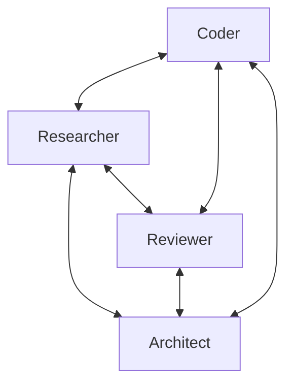

A Swarm is a collaborative agent orchestration system where multiple agents work together as a team to solve complex tasks. Unlike traditional sequential or hierarchical multi-agent systems, a Swarm enables autonomous coordination between agents with shared context and working memory.

-   **Self-organizing agent teams** with shared working memory
-   **Agent-driven coordination** through autonomous handoffs
-   **Autonomous agent collaboration** without central control
-   **Dynamic task distribution** based on agent capabilities
-   **Collective intelligence** through shared context
-   **Multi-modal input support** for handling text, images, and other content types

## How Swarms Work

Swarms operate on the principle of emergent intelligence - the idea that a group of specialized agents working together can solve problems more effectively than a single agent. Each agent in a Swarm:

1.  Has access to the full task context
2.  Can see the history of which agents have worked on the task
3.  Can access shared knowledge contributed by other agents
4.  Can decide when to hand off to another agent with different expertise



## Creating a Swarm

<starlight-tab-item data-label="Python"> &lt;p&gt;To create a Swarm, you need to define a collection of agents with different specializations. By default, the first agent in the list will receive the initial user request, but you can specify any agent as the entry point using the &lt;code dir=&quot;auto&quot;&gt;entry\_point&lt;/code&gt; parameter:&lt;/p&gt;&lt;div class=&quot;expressive-code&quot;&gt;&lt;figure class=&quot;frame&quot;&gt;&lt;figcaption class=&quot;header&quot;&gt;&lt;/figcaption&gt;&lt;pre data-language=&quot;python&quot; dir=&quot;ltr&quot;&gt;&lt;code&gt;&lt;div class=&quot;ec-line&quot;&gt;&lt;div class=&quot;code&quot;&gt;&lt;span style=&quot;--0:#BF3441;--1:#F97583&quot;&gt;import&lt;/span&gt;&lt;span style=&quot;--0:#24292E;--1:#E1E4E8&quot;&gt; logging&lt;/span&gt;&lt;/div&gt;&lt;/div&gt;&lt;div class=&quot;ec-line&quot;&gt;&lt;div class=&quot;code&quot;&gt;&lt;span style=&quot;--0:#BF3441;--1:#F97583&quot;&gt;from&lt;/span&gt;&lt;span style=&quot;--0:#24292E;--1:#E1E4E8&quot;&gt; strands &lt;/span&gt;&lt;span style=&quot;--0:#BF3441;--1:#F97583&quot;&gt;import&lt;/span&gt;&lt;span style=&quot;--0:#24292E;--1:#E1E4E8&quot;&gt; Agent&lt;/span&gt;&lt;/div&gt;&lt;/div&gt;&lt;div class=&quot;ec-line&quot;&gt;&lt;div class=&quot;code&quot;&gt;&lt;span style=&quot;--0:#BF3441;--1:#F97583&quot;&gt;from&lt;/span&gt;&lt;span style=&quot;--0:#24292E;--1:#E1E4E8&quot;&gt; strands.multiagent &lt;/span&gt;&lt;span style=&quot;--0:#BF3441;--1:#F97583&quot;&gt;import&lt;/span&gt;&lt;span style=&quot;--0:#24292E;--1:#E1E4E8&quot;&gt; Swarm&lt;/span&gt;&lt;/div&gt;&lt;/div&gt;&lt;div class=&quot;ec-line&quot;&gt;&lt;div class=&quot;code&quot;&gt; &lt;/div&gt;&lt;/div&gt;&lt;div class=&quot;ec-line&quot;&gt;&lt;div class=&quot;code&quot;&gt;&lt;span style=&quot;--0:#616972;--1:#99A0A6&quot;&gt;# Enable debug logs and print them to stderr&lt;/span&gt;&lt;/div&gt;&lt;/div&gt;&lt;div class=&quot;ec-line&quot;&gt;&lt;div class=&quot;code&quot;&gt;&lt;span style=&quot;--0:#24292E;--1:#E1E4E8&quot;&gt;logging.getLogger(&lt;/span&gt;&lt;span style=&quot;--0:#032F62;--1:#9ECBFF&quot;&gt;&amp;quot;strands.multiagent&amp;quot;&lt;/span&gt;&lt;span style=&quot;--0:#24292E;--1:#E1E4E8&quot;&gt;).setLevel(logging.&lt;/span&gt;&lt;span style=&quot;--0:#005CC5;--1:#79B8FF&quot;&gt;DEBUG&lt;/span&gt;&lt;span style=&quot;--0:#24292E;--1:#E1E4E8&quot;&gt;)&lt;/span&gt;&lt;/div&gt;&lt;/div&gt;&lt;div class=&quot;ec-line&quot;&gt;&lt;div class=&quot;code&quot;&gt;&lt;span style=&quot;--0:#24292E;--1:#E1E4E8&quot;&gt;logging.basicConfig(&lt;/span&gt;&lt;/div&gt;&lt;/div&gt;&lt;div class=&quot;ec-line&quot;&gt;&lt;div class=&quot;code&quot;&gt;&lt;span class=&quot;indent&quot;&gt; &lt;/span&gt;&lt;span style=&quot;--0:#AE4B07;--1:#FFAB70&quot;&gt;format&lt;/span&gt;&lt;span style=&quot;--0:#BF3441;--1:#F97583&quot;&gt;=&lt;/span&gt;&lt;span style=&quot;--0:#032F62;--1:#9ECBFF&quot;&gt;&amp;quot;&lt;/span&gt;&lt;span style=&quot;--0:#005CC5;--1:#79B8FF&quot;&gt;%(levelname)s&lt;/span&gt;&lt;span style=&quot;--0:#032F62;--1:#9ECBFF&quot;&gt; | &lt;/span&gt;&lt;span style=&quot;--0:#005CC5;--1:#79B8FF&quot;&gt;%(name)s&lt;/span&gt;&lt;span style=&quot;--0:#032F62;--1:#9ECBFF&quot;&gt; | &lt;/span&gt;&lt;span style=&quot;--0:#005CC5;--1:#79B8FF&quot;&gt;%(message)s&lt;/span&gt;&lt;span style=&quot;--0:#032F62;--1:#9ECBFF&quot;&gt;&amp;quot;&lt;/span&gt;&lt;span style=&quot;--0:#24292E;--1:#E1E4E8&quot;&gt;,&lt;/span&gt;&lt;/div&gt;&lt;/div&gt;&lt;div class=&quot;ec-line&quot;&gt;&lt;div class=&quot;code&quot;&gt;&lt;span class=&quot;indent&quot;&gt; &lt;/span&gt;&lt;span style=&quot;--0:#AE4B07;--1:#FFAB70&quot;&gt;handlers&lt;/span&gt;&lt;span style=&quot;--0:#BF3441;--1:#F97583&quot;&gt;=&lt;/span&gt;&lt;span style=&quot;--0:#24292E;--1:#E1E4E8&quot;&gt;\[logging.StreamHandler()\]&lt;/span&gt;&lt;/div&gt;&lt;/div&gt;&lt;div class=&quot;ec-line&quot;&gt;&lt;div class=&quot;code&quot;&gt;&lt;span style=&quot;--0:#24292E;--1:#E1E4E8&quot;&gt;)&lt;/span&gt;&lt;/div&gt;&lt;/div&gt;&lt;div class=&quot;ec-line&quot;&gt;&lt;div class=&quot;code&quot;&gt; &lt;/div&gt;&lt;/div&gt;&lt;div class=&quot;ec-line&quot;&gt;&lt;div class=&quot;code&quot;&gt;&lt;span style=&quot;--0:#616972;--1:#99A0A6&quot;&gt;# Create specialized agents&lt;/span&gt;&lt;/div&gt;&lt;/div&gt;&lt;div class=&quot;ec-line&quot;&gt;&lt;div class=&quot;code&quot;&gt;&lt;span style=&quot;--0:#24292E;--1:#E1E4E8&quot;&gt;researcher &lt;/span&gt;&lt;span style=&quot;--0:#BF3441;--1:#F97583&quot;&gt;=&lt;/span&gt;&lt;span style=&quot;--0:#24292E;--1:#E1E4E8&quot;&gt; Agent(&lt;/span&gt;&lt;span style=&quot;--0:#AE4B07;--1:#FFAB70&quot;&gt;name&lt;/span&gt;&lt;span style=&quot;--0:#BF3441;--1:#F97583&quot;&gt;=&lt;/span&gt;&lt;span style=&quot;--0:#032F62;--1:#9ECBFF&quot;&gt;&amp;quot;researcher&amp;quot;&lt;/span&gt;&lt;span style=&quot;--0:#24292E;--1:#E1E4E8&quot;&gt;, &lt;/span&gt;&lt;span style=&quot;--0:#AE4B07;--1:#FFAB70&quot;&gt;system\_prompt&lt;/span&gt;&lt;span style=&quot;--0:#BF3441;--1:#F97583&quot;&gt;=&lt;/span&gt;&lt;span style=&quot;--0:#032F62;--1:#9ECBFF&quot;&gt;&amp;quot;You are a research specialist...&amp;quot;&lt;/span&gt;&lt;span style=&quot;--0:#24292E;--1:#E1E4E8&quot;&gt;)&lt;/span&gt;&lt;/div&gt;&lt;/div&gt;&lt;div class=&quot;ec-line&quot;&gt;&lt;div class=&quot;code&quot;&gt;&lt;span style=&quot;--0:#24292E;--1:#E1E4E8&quot;&gt;coder &lt;/span&gt;&lt;span style=&quot;--0:#BF3441;--1:#F97583&quot;&gt;=&lt;/span&gt;&lt;span style=&quot;--0:#24292E;--1:#E1E4E8&quot;&gt; Agent(&lt;/span&gt;&lt;span style=&quot;--0:#AE4B07;--1:#FFAB70&quot;&gt;name&lt;/span&gt;&lt;span style=&quot;--0:#BF3441;--1:#F97583&quot;&gt;=&lt;/span&gt;&lt;span style=&quot;--0:#032F62;--1:#9ECBFF&quot;&gt;&amp;quot;coder&amp;quot;&lt;/span&gt;&lt;span style=&quot;--0:#24292E;--1:#E1E4E8&quot;&gt;, &lt;/span&gt;&lt;span style=&quot;--0:#AE4B07;--1:#FFAB70&quot;&gt;system\_prompt&lt;/span&gt;&lt;span style=&quot;--0:#BF3441;--1:#F97583&quot;&gt;=&lt;/span&gt;&lt;span style=&quot;--0:#032F62;--1:#9ECBFF&quot;&gt;&amp;quot;You are a coding specialist...&amp;quot;&lt;/span&gt;&lt;span style=&quot;--0:#24292E;--1:#E1E4E8&quot;&gt;)&lt;/span&gt;&lt;/div&gt;&lt;/div&gt;&lt;div class=&quot;ec-line&quot;&gt;&lt;div class=&quot;code&quot;&gt;&lt;span style=&quot;--0:#24292E;--1:#E1E4E8&quot;&gt;reviewer &lt;/span&gt;&lt;span style=&quot;--0:#BF3441;--1:#F97583&quot;&gt;=&lt;/span&gt;&lt;span style=&quot;--0:#24292E;--1:#E1E4E8&quot;&gt; Agent(&lt;/span&gt;&lt;span style=&quot;--0:#AE4B07;--1:#FFAB70&quot;&gt;name&lt;/span&gt;&lt;span style=&quot;--0:#BF3441;--1:#F97583&quot;&gt;=&lt;/span&gt;&lt;span style=&quot;--0:#032F62;--1:#9ECBFF&quot;&gt;&amp;quot;reviewer&amp;quot;&lt;/span&gt;&lt;span style=&quot;--0:#24292E;--1:#E1E4E8&quot;&gt;, &lt;/span&gt;&lt;span style=&quot;--0:#AE4B07;--1:#FFAB70&quot;&gt;system\_prompt&lt;/span&gt;&lt;span style=&quot;--0:#BF3441;--1:#F97583&quot;&gt;=&lt;/span&gt;&lt;span style=&quot;--0:#032F62;--1:#9ECBFF&quot;&gt;&amp;quot;You are a code review specialist...&amp;quot;&lt;/span&gt;&lt;span style=&quot;--0:#24292E;--1:#E1E4E8&quot;&gt;)&lt;/span&gt;&lt;/div&gt;&lt;/div&gt;&lt;div class=&quot;ec-line&quot;&gt;&lt;div class=&quot;code&quot;&gt;&lt;span style=&quot;--0:#24292E;--1:#E1E4E8&quot;&gt;architect &lt;/span&gt;&lt;span style=&quot;--0:#BF3441;--1:#F97583&quot;&gt;=&lt;/span&gt;&lt;span style=&quot;--0:#24292E;--1:#E1E4E8&quot;&gt; Agent(&lt;/span&gt;&lt;span style=&quot;--0:#AE4B07;--1:#FFAB70&quot;&gt;name&lt;/span&gt;&lt;span style=&quot;--0:#BF3441;--1:#F97583&quot;&gt;=&lt;/span&gt;&lt;span style=&quot;--0:#032F62;--1:#9ECBFF&quot;&gt;&amp;quot;architect&amp;quot;&lt;/span&gt;&lt;span style=&quot;--0:#24292E;--1:#E1E4E8&quot;&gt;, &lt;/span&gt;&lt;span style=&quot;--0:#AE4B07;--1:#FFAB70&quot;&gt;system\_prompt&lt;/span&gt;&lt;span style=&quot;--0:#BF3441;--1:#F97583&quot;&gt;=&lt;/span&gt;&lt;span style=&quot;--0:#032F62;--1:#9ECBFF&quot;&gt;&amp;quot;You are a system architecture specialist...&amp;quot;&lt;/span&gt;&lt;span style=&quot;--0:#24292E;--1:#E1E4E8&quot;&gt;)&lt;/span&gt;&lt;/div&gt;&lt;/div&gt;&lt;div class=&quot;ec-line&quot;&gt;&lt;div class=&quot;code&quot;&gt; &lt;/div&gt;&lt;/div&gt;&lt;div class=&quot;ec-line&quot;&gt;&lt;div class=&quot;code&quot;&gt;&lt;span style=&quot;--0:#616972;--1:#99A0A6&quot;&gt;# Create a swarm with these agents, starting with the researcher&lt;/span&gt;&lt;/div&gt;&lt;/div&gt;&lt;div class=&quot;ec-line&quot;&gt;&lt;div class=&quot;code&quot;&gt;&lt;span style=&quot;--0:#24292E;--1:#E1E4E8&quot;&gt;swarm &lt;/span&gt;&lt;span style=&quot;--0:#BF3441;--1:#F97583&quot;&gt;=&lt;/span&gt;&lt;span style=&quot;--0:#24292E;--1:#E1E4E8&quot;&gt; Swarm(&lt;/span&gt;&lt;/div&gt;&lt;/div&gt;&lt;div class=&quot;ec-line&quot;&gt;&lt;div class=&quot;code&quot;&gt;&lt;span class=&quot;indent&quot;&gt;&lt;span style=&quot;--0:#24292E;--1:#E1E4E8&quot;&gt; &lt;/span&gt;&lt;/span&gt;&lt;span style=&quot;--0:#24292E;--1:#E1E4E8&quot;&gt;\[coder, researcher, reviewer, architect\],&lt;/span&gt;&lt;/div&gt;&lt;/div&gt;&lt;div class=&quot;ec-line&quot;&gt;&lt;div class=&quot;code&quot;&gt;&lt;span class=&quot;indent&quot;&gt; &lt;/span&gt;&lt;span style=&quot;--0:#AE4B07;--1:#FFAB70&quot;&gt;entry\_point&lt;/span&gt;&lt;span style=&quot;--0:#BF3441;--1:#F97583&quot;&gt;=&lt;/span&gt;&lt;span style=&quot;--0:#24292E;--1:#E1E4E8&quot;&gt;researcher, &lt;/span&gt;&lt;span style=&quot;--0:#616972;--1:#99A0A6&quot;&gt;# Start with the researcher&lt;/span&gt;&lt;/div&gt;&lt;/div&gt;&lt;div class=&quot;ec-line&quot;&gt;&lt;div class=&quot;code&quot;&gt;&lt;span class=&quot;indent&quot;&gt; &lt;/span&gt;&lt;span style=&quot;--0:#AE4B07;--1:#FFAB70&quot;&gt;max\_handoffs&lt;/span&gt;&lt;span style=&quot;--0:#BF3441;--1:#F97583&quot;&gt;=&lt;/span&gt;&lt;span style=&quot;--0:#005CC5;--1:#79B8FF&quot;&gt;20&lt;/span&gt;&lt;span style=&quot;--0:#24292E;--1:#E1E4E8&quot;&gt;,&lt;/span&gt;&lt;/div&gt;&lt;/div&gt;&lt;div class=&quot;ec-line&quot;&gt;&lt;div class=&quot;code&quot;&gt;&lt;span class=&quot;indent&quot;&gt; &lt;/span&gt;&lt;span style=&quot;--0:#AE4B07;--1:#FFAB70&quot;&gt;max\_iterations&lt;/span&gt;&lt;span style=&quot;--0:#BF3441;--1:#F97583&quot;&gt;=&lt;/span&gt;&lt;span style=&quot;--0:#005CC5;--1:#79B8FF&quot;&gt;20&lt;/span&gt;&lt;span style=&quot;--0:#24292E;--1:#E1E4E8&quot;&gt;,&lt;/span&gt;&lt;/div&gt;&lt;/div&gt;&lt;div class=&quot;ec-line&quot;&gt;&lt;div class=&quot;code&quot;&gt;&lt;span class=&quot;indent&quot;&gt; &lt;/span&gt;&lt;span style=&quot;--0:#AE4B07;--1:#FFAB70&quot;&gt;execution\_timeout&lt;/span&gt;&lt;span style=&quot;--0:#BF3441;--1:#F97583&quot;&gt;=&lt;/span&gt;&lt;span style=&quot;--0:#005CC5;--1:#79B8FF&quot;&gt;900.0&lt;/span&gt;&lt;span style=&quot;--0:#24292E;--1:#E1E4E8&quot;&gt;, &lt;/span&gt;&lt;span style=&quot;--0:#616972;--1:#99A0A6&quot;&gt;# 15 minutes&lt;/span&gt;&lt;/div&gt;&lt;/div&gt;&lt;div class=&quot;ec-line&quot;&gt;&lt;div class=&quot;code&quot;&gt;&lt;span class=&quot;indent&quot;&gt; &lt;/span&gt;&lt;span style=&quot;--0:#AE4B07;--1:#FFAB70&quot;&gt;node\_timeout&lt;/span&gt;&lt;span style=&quot;--0:#BF3441;--1:#F97583&quot;&gt;=&lt;/span&gt;&lt;span style=&quot;--0:#005CC5;--1:#79B8FF&quot;&gt;300.0&lt;/span&gt;&lt;span style=&quot;--0:#24292E;--1:#E1E4E8&quot;&gt;, &lt;/span&gt;&lt;span style=&quot;--0:#616972;--1:#99A0A6&quot;&gt;# 5 minutes per agent&lt;/span&gt;&lt;/div&gt;&lt;/div&gt;&lt;div class=&quot;ec-line&quot;&gt;&lt;div class=&quot;code&quot;&gt;&lt;span class=&quot;indent&quot;&gt; &lt;/span&gt;&lt;span style=&quot;--0:#AE4B07;--1:#FFAB70&quot;&gt;repetitive\_handoff\_detection\_window&lt;/span&gt;&lt;span style=&quot;--0:#BF3441;--1:#F97583&quot;&gt;=&lt;/span&gt;&lt;span style=&quot;--0:#005CC5;--1:#79B8FF&quot;&gt;8&lt;/span&gt;&lt;span style=&quot;--0:#24292E;--1:#E1E4E8&quot;&gt;, &lt;/span&gt;&lt;span style=&quot;--0:#616972;--1:#99A0A6&quot;&gt;# There must be &amp;gt;= 3 unique agents in the last 8 handoffs&lt;/span&gt;&lt;/div&gt;&lt;/div&gt;&lt;div class=&quot;ec-line&quot;&gt;&lt;div class=&quot;code&quot;&gt;&lt;span class=&quot;indent&quot;&gt; &lt;/span&gt;&lt;span style=&quot;--0:#AE4B07;--1:#FFAB70&quot;&gt;repetitive\_handoff\_min\_unique\_agents&lt;/span&gt;&lt;span style=&quot;--0:#BF3441;--1:#F97583&quot;&gt;=&lt;/span&gt;&lt;span style=&quot;--0:#005CC5;--1:#79B8FF&quot;&gt;3&lt;/span&gt;&lt;/div&gt;&lt;/div&gt;&lt;div class=&quot;ec-line&quot;&gt;&lt;div class=&quot;code&quot;&gt;&lt;span style=&quot;--0:#24292E;--1:#E1E4E8&quot;&gt;)&lt;/span&gt;&lt;/div&gt;&lt;/div&gt;&lt;div class=&quot;ec-line&quot;&gt;&lt;div class=&quot;code&quot;&gt; &lt;/div&gt;&lt;/div&gt;&lt;div class=&quot;ec-line&quot;&gt;&lt;div class=&quot;code&quot;&gt;&lt;span style=&quot;--0:#616972;--1:#99A0A6&quot;&gt;# Execute the swarm on a task&lt;/span&gt;&lt;/div&gt;&lt;/div&gt;&lt;div class=&quot;ec-line&quot;&gt;&lt;div class=&quot;code&quot;&gt;&lt;span style=&quot;--0:#24292E;--1:#E1E4E8&quot;&gt;result &lt;/span&gt;&lt;span style=&quot;--0:#BF3441;--1:#F97583&quot;&gt;=&lt;/span&gt;&lt;span style=&quot;--0:#24292E;--1:#E1E4E8&quot;&gt; swarm(&lt;/span&gt;&lt;span style=&quot;--0:#032F62;--1:#9ECBFF&quot;&gt;&amp;quot;Design and implement a simple REST API for a todo app&amp;quot;&lt;/span&gt;&lt;span style=&quot;--0:#24292E;--1:#E1E4E8&quot;&gt;)&lt;/span&gt;&lt;/div&gt;&lt;/div&gt;&lt;div class=&quot;ec-line&quot;&gt;&lt;div class=&quot;code&quot;&gt;&lt;span style=&quot;--0:#616972;--1:#99A0A6&quot;&gt;# Or use invoke\_async for async execution: result = await swarm.invoke\_async(...)&lt;/span&gt;&lt;/div&gt;&lt;/div&gt;&lt;div class=&quot;ec-line&quot;&gt;&lt;div class=&quot;code&quot;&gt; &lt;/div&gt;&lt;/div&gt;&lt;div class=&quot;ec-line&quot;&gt;&lt;div class=&quot;code&quot;&gt;&lt;span style=&quot;--0:#616972;--1:#99A0A6&quot;&gt;# Access the final result&lt;/span&gt;&lt;/div&gt;&lt;/div&gt;&lt;div class=&quot;ec-line&quot;&gt;&lt;div class=&quot;code&quot;&gt;&lt;span style=&quot;--0:#005CC5;--1:#79B8FF&quot;&gt;print&lt;/span&gt;&lt;span style=&quot;--0:#24292E;--1:#E1E4E8&quot;&gt;(&lt;/span&gt;&lt;span style=&quot;--0:#BF3441;--1:#F97583&quot;&gt;f&lt;/span&gt;&lt;span style=&quot;--0:#032F62;--1:#9ECBFF&quot;&gt;&amp;quot;Status: &lt;/span&gt;&lt;span style=&quot;--0:#005CC5;--1:#79B8FF&quot;&gt;{&lt;/span&gt;&lt;span style=&quot;--0:#24292E;--1:#E1E4E8&quot;&gt;result.status&lt;/span&gt;&lt;span style=&quot;--0:#005CC5;--1:#79B8FF&quot;&gt;}&lt;/span&gt;&lt;span style=&quot;--0:#032F62;--1:#9ECBFF&quot;&gt;&amp;quot;&lt;/span&gt;&lt;span style=&quot;--0:#24292E;--1:#E1E4E8&quot;&gt;)&lt;/span&gt;&lt;/div&gt;&lt;/div&gt;&lt;div class=&quot;ec-line&quot;&gt;&lt;div class=&quot;code&quot;&gt;&lt;span style=&quot;--0:#005CC5;--1:#79B8FF&quot;&gt;print&lt;/span&gt;&lt;span style=&quot;--0:#24292E;--1:#E1E4E8&quot;&gt;(&lt;/span&gt;&lt;span style=&quot;--0:#BF3441;--1:#F97583&quot;&gt;f&lt;/span&gt;&lt;span style=&quot;--0:#032F62;--1:#9ECBFF&quot;&gt;&amp;quot;Node history: &lt;/span&gt;&lt;span style=&quot;--0:#005CC5;--1:#79B8FF&quot;&gt;{&lt;/span&gt;&lt;span style=&quot;--0:#24292E;--1:#E1E4E8&quot;&gt;\[node.node\_id &lt;/span&gt;&lt;span style=&quot;--0:#BF3441;--1:#F97583&quot;&gt;for&lt;/span&gt;&lt;span style=&quot;--0:#24292E;--1:#E1E4E8&quot;&gt; node &lt;/span&gt;&lt;span style=&quot;--0:#BF3441;--1:#F97583&quot;&gt;in&lt;/span&gt;&lt;span style=&quot;--0:#24292E;--1:#E1E4E8&quot;&gt; result.node\_history\]&lt;/span&gt;&lt;span style=&quot;--0:#005CC5;--1:#79B8FF&quot;&gt;}&lt;/span&gt;&lt;span style=&quot;--0:#032F62;--1:#9ECBFF&quot;&gt;&amp;quot;&lt;/span&gt;&lt;span style=&quot;--0:#24292E;--1:#E1E4E8&quot;&gt;)&lt;/span&gt;&lt;/div&gt;&lt;/div&gt;&lt;/code&gt;&lt;/pre&gt;&lt;div class=&quot;copy&quot;&gt;&lt;div aria-live=&quot;polite&quot;&gt;&lt;/div&gt;&lt;button title=&quot;Copy to clipboard&quot; data-copied=&quot;Copied!&quot; data-code=&quot;import loggingfrom strands import Agentfrom strands.multiagent import Swarm# Enable debug logs and print them to stderrlogging.getLogger(&amp;#34;strands.multiagent&amp;#34;).setLevel(logging.DEBUG)logging.basicConfig( format=&amp;#34;%(levelname)s | %(name)s | %(message)s&amp;#34;, handlers=\[logging.StreamHandler()\])# Create specialized agentsresearcher = Agent(name=&amp;#34;researcher&amp;#34;, system\_prompt=&amp;#34;You are a research specialist...&amp;#34;)coder = Agent(name=&amp;#34;coder&amp;#34;, system\_prompt=&amp;#34;You are a coding specialist...&amp;#34;)reviewer = Agent(name=&amp;#34;reviewer&amp;#34;, system\_prompt=&amp;#34;You are a code review specialist...&amp;#34;)architect = Agent(name=&amp;#34;architect&amp;#34;, system\_prompt=&amp;#34;You are a system architecture specialist...&amp;#34;)# Create a swarm with these agents, starting with the researcherswarm = Swarm( \[coder, researcher, reviewer, architect\], entry\_point=researcher, # Start with the researcher max\_handoffs=20, max\_iterations=20, execution\_timeout=900.0, # 15 minutes node\_timeout=300.0, # 5 minutes per agent repetitive\_handoff\_detection\_window=8, # There must be &gt;= 3 unique agents in the last 8 handoffs repetitive\_handoff\_min\_unique\_agents=3)# Execute the swarm on a taskresult = swarm(&amp;#34;Design and implement a simple REST API for a todo app&amp;#34;)# Or use invoke\_async for async execution: result = await swarm.invoke\_async(...)# Access the final resultprint(f&amp;#34;Status: {result.status}&amp;#34;)print(f&amp;#34;Node history: {\[node.node\_id for node in result.node\_history\]}&amp;#34;)&quot;&gt;&lt;div&gt;&lt;/div&gt;&lt;/button&gt;&lt;/div&gt;&lt;/figure&gt;&lt;/div&gt; </starlight-tab-item><starlight-tab-item data-label="TypeScript"> &lt;p&gt;To create a Swarm, define a collection of agents with different specializations. By default, the first agent in &lt;code dir=&quot;auto&quot;&gt;nodes&lt;/code&gt; receives the initial input. Use &lt;code dir=&quot;auto&quot;&gt;start&lt;/code&gt; to override this. Agent &lt;code dir=&quot;auto&quot;&gt;description&lt;/code&gt; fields help the swarm make informed routing decisions:&lt;/p&gt;&lt;div class=&quot;expressive-code&quot;&gt;&lt;figure class=&quot;frame&quot;&gt;&lt;figcaption class=&quot;header&quot;&gt;&lt;/figcaption&gt;&lt;pre data-language=&quot;typescript&quot; dir=&quot;ltr&quot;&gt;&lt;code&gt;&lt;div class=&quot;ec-line&quot;&gt;&lt;div class=&quot;code&quot;&gt;&lt;span style=&quot;--0:#BF3441;--1:#F97583&quot;&gt;const&lt;/span&gt;&lt;span style=&quot;--0:#24292E;--1:#E1E4E8&quot;&gt; &lt;/span&gt;&lt;span style=&quot;--0:#005CC5;--1:#79B8FF&quot;&gt;researcher&lt;/span&gt;&lt;span style=&quot;--0:#24292E;--1:#E1E4E8&quot;&gt; &lt;/span&gt;&lt;span style=&quot;--0:#BF3441;--1:#F97583&quot;&gt;=&lt;/span&gt;&lt;span style=&quot;--0:#24292E;--1:#E1E4E8&quot;&gt; &lt;/span&gt;&lt;span style=&quot;--0:#BF3441;--1:#F97583&quot;&gt;new&lt;/span&gt;&lt;span style=&quot;--0:#24292E;--1:#E1E4E8&quot;&gt; &lt;/span&gt;&lt;span style=&quot;--0:#6F42C1;--1:#B392F0&quot;&gt;Agent&lt;/span&gt;&lt;span style=&quot;--0:#24292E;--1:#E1E4E8&quot;&gt;({&lt;/span&gt;&lt;/div&gt;&lt;/div&gt;&lt;div class=&quot;ec-line&quot;&gt;&lt;div class=&quot;code&quot;&gt;&lt;span class=&quot;indent&quot;&gt;&lt;span style=&quot;--0:#24292E;--1:#E1E4E8&quot;&gt; &lt;/span&gt;&lt;/span&gt;&lt;span style=&quot;--0:#24292E;--1:#E1E4E8&quot;&gt;id: &lt;/span&gt;&lt;span style=&quot;--0:#032F62;--1:#9ECBFF&quot;&gt;&amp;#39;researcher&amp;#39;&lt;/span&gt;&lt;span style=&quot;--0:#24292E;--1:#E1E4E8&quot;&gt;,&lt;/span&gt;&lt;/div&gt;&lt;/div&gt;&lt;div class=&quot;ec-line&quot;&gt;&lt;div class=&quot;code&quot;&gt;&lt;span class=&quot;indent&quot;&gt;&lt;span style=&quot;--0:#24292E;--1:#E1E4E8&quot;&gt; &lt;/span&gt;&lt;/span&gt;&lt;span style=&quot;--0:#24292E;--1:#E1E4E8&quot;&gt;description: &lt;/span&gt;&lt;span style=&quot;--0:#032F62;--1:#9ECBFF&quot;&gt;&amp;#39;Researches topics and gathers information.&amp;#39;&lt;/span&gt;&lt;span style=&quot;--0:#24292E;--1:#E1E4E8&quot;&gt;,&lt;/span&gt;&lt;/div&gt;&lt;/div&gt;&lt;div class=&quot;ec-line&quot;&gt;&lt;div class=&quot;code&quot;&gt;&lt;span class=&quot;indent&quot;&gt;&lt;span style=&quot;--0:#24292E;--1:#E1E4E8&quot;&gt; &lt;/span&gt;&lt;/span&gt;&lt;span style=&quot;--0:#24292E;--1:#E1E4E8&quot;&gt;systemPrompt: &lt;/span&gt;&lt;span style=&quot;--0:#032F62;--1:#9ECBFF&quot;&gt;&amp;#39;You are a research specialist...&amp;#39;&lt;/span&gt;&lt;span style=&quot;--0:#24292E;--1:#E1E4E8&quot;&gt;,&lt;/span&gt;&lt;/div&gt;&lt;/div&gt;&lt;div class=&quot;ec-line&quot;&gt;&lt;div class=&quot;code&quot;&gt;&lt;span style=&quot;--0:#24292E;--1:#E1E4E8&quot;&gt;})&lt;/span&gt;&lt;/div&gt;&lt;/div&gt;&lt;div class=&quot;ec-line&quot;&gt;&lt;div class=&quot;code&quot;&gt; &lt;/div&gt;&lt;/div&gt;&lt;div class=&quot;ec-line&quot;&gt;&lt;div class=&quot;code&quot;&gt;&lt;span style=&quot;--0:#BF3441;--1:#F97583&quot;&gt;const&lt;/span&gt;&lt;span style=&quot;--0:#24292E;--1:#E1E4E8&quot;&gt; &lt;/span&gt;&lt;span style=&quot;--0:#005CC5;--1:#79B8FF&quot;&gt;architect&lt;/span&gt;&lt;span style=&quot;--0:#24292E;--1:#E1E4E8&quot;&gt; &lt;/span&gt;&lt;span style=&quot;--0:#BF3441;--1:#F97583&quot;&gt;=&lt;/span&gt;&lt;span style=&quot;--0:#24292E;--1:#E1E4E8&quot;&gt; &lt;/span&gt;&lt;span style=&quot;--0:#BF3441;--1:#F97583&quot;&gt;new&lt;/span&gt;&lt;span style=&quot;--0:#24292E;--1:#E1E4E8&quot;&gt; &lt;/span&gt;&lt;span style=&quot;--0:#6F42C1;--1:#B392F0&quot;&gt;Agent&lt;/span&gt;&lt;span style=&quot;--0:#24292E;--1:#E1E4E8&quot;&gt;({&lt;/span&gt;&lt;/div&gt;&lt;/div&gt;&lt;div class=&quot;ec-line&quot;&gt;&lt;div class=&quot;code&quot;&gt;&lt;span class=&quot;indent&quot;&gt;&lt;span style=&quot;--0:#24292E;--1:#E1E4E8&quot;&gt; &lt;/span&gt;&lt;/span&gt;&lt;span style=&quot;--0:#24292E;--1:#E1E4E8&quot;&gt;id: &lt;/span&gt;&lt;span style=&quot;--0:#032F62;--1:#9ECBFF&quot;&gt;&amp;#39;architect&amp;#39;&lt;/span&gt;&lt;span style=&quot;--0:#24292E;--1:#E1E4E8&quot;&gt;,&lt;/span&gt;&lt;/div&gt;&lt;/div&gt;&lt;div class=&quot;ec-line&quot;&gt;&lt;div class=&quot;code&quot;&gt;&lt;span class=&quot;indent&quot;&gt;&lt;span style=&quot;--0:#24292E;--1:#E1E4E8&quot;&gt; &lt;/span&gt;&lt;/span&gt;&lt;span style=&quot;--0:#24292E;--1:#E1E4E8&quot;&gt;description: &lt;/span&gt;&lt;span style=&quot;--0:#032F62;--1:#9ECBFF&quot;&gt;&amp;#39;Designs system architecture based on research.&amp;#39;&lt;/span&gt;&lt;span style=&quot;--0:#24292E;--1:#E1E4E8&quot;&gt;,&lt;/span&gt;&lt;/div&gt;&lt;/div&gt;&lt;div class=&quot;ec-line&quot;&gt;&lt;div class=&quot;code&quot;&gt;&lt;span class=&quot;indent&quot;&gt;&lt;span style=&quot;--0:#24292E;--1:#E1E4E8&quot;&gt; &lt;/span&gt;&lt;/span&gt;&lt;span style=&quot;--0:#24292E;--1:#E1E4E8&quot;&gt;systemPrompt: &lt;/span&gt;&lt;span style=&quot;--0:#032F62;--1:#9ECBFF&quot;&gt;&amp;#39;You are a system architecture specialist...&amp;#39;&lt;/span&gt;&lt;span style=&quot;--0:#24292E;--1:#E1E4E8&quot;&gt;,&lt;/span&gt;&lt;/div&gt;&lt;/div&gt;&lt;div class=&quot;ec-line&quot;&gt;&lt;div class=&quot;code&quot;&gt;&lt;span style=&quot;--0:#24292E;--1:#E1E4E8&quot;&gt;})&lt;/span&gt;&lt;/div&gt;&lt;/div&gt;&lt;div class=&quot;ec-line&quot;&gt;&lt;div class=&quot;code&quot;&gt; &lt;/div&gt;&lt;/div&gt;&lt;div class=&quot;ec-line&quot;&gt;&lt;div class=&quot;code&quot;&gt;&lt;span style=&quot;--0:#BF3441;--1:#F97583&quot;&gt;const&lt;/span&gt;&lt;span style=&quot;--0:#24292E;--1:#E1E4E8&quot;&gt; &lt;/span&gt;&lt;span style=&quot;--0:#005CC5;--1:#79B8FF&quot;&gt;coder&lt;/span&gt;&lt;span style=&quot;--0:#24292E;--1:#E1E4E8&quot;&gt; &lt;/span&gt;&lt;span style=&quot;--0:#BF3441;--1:#F97583&quot;&gt;=&lt;/span&gt;&lt;span style=&quot;--0:#24292E;--1:#E1E4E8&quot;&gt; &lt;/span&gt;&lt;span style=&quot;--0:#BF3441;--1:#F97583&quot;&gt;new&lt;/span&gt;&lt;span style=&quot;--0:#24292E;--1:#E1E4E8&quot;&gt; &lt;/span&gt;&lt;span style=&quot;--0:#6F42C1;--1:#B392F0&quot;&gt;Agent&lt;/span&gt;&lt;span style=&quot;--0:#24292E;--1:#E1E4E8&quot;&gt;({&lt;/span&gt;&lt;/div&gt;&lt;/div&gt;&lt;div class=&quot;ec-line&quot;&gt;&lt;div class=&quot;code&quot;&gt;&lt;span class=&quot;indent&quot;&gt;&lt;span style=&quot;--0:#24292E;--1:#E1E4E8&quot;&gt; &lt;/span&gt;&lt;/span&gt;&lt;span style=&quot;--0:#24292E;--1:#E1E4E8&quot;&gt;id: &lt;/span&gt;&lt;span style=&quot;--0:#032F62;--1:#9ECBFF&quot;&gt;&amp;#39;coder&amp;#39;&lt;/span&gt;&lt;span style=&quot;--0:#24292E;--1:#E1E4E8&quot;&gt;,&lt;/span&gt;&lt;/div&gt;&lt;/div&gt;&lt;div class=&quot;ec-line&quot;&gt;&lt;div class=&quot;code&quot;&gt;&lt;span class=&quot;indent&quot;&gt;&lt;span style=&quot;--0:#24292E;--1:#E1E4E8&quot;&gt; &lt;/span&gt;&lt;/span&gt;&lt;span style=&quot;--0:#24292E;--1:#E1E4E8&quot;&gt;description: &lt;/span&gt;&lt;span style=&quot;--0:#032F62;--1:#9ECBFF&quot;&gt;&amp;#39;Implements code based on architecture designs.&amp;#39;&lt;/span&gt;&lt;span style=&quot;--0:#24292E;--1:#E1E4E8&quot;&gt;,&lt;/span&gt;&lt;/div&gt;&lt;/div&gt;&lt;div class=&quot;ec-line&quot;&gt;&lt;div class=&quot;code&quot;&gt;&lt;span class=&quot;indent&quot;&gt;&lt;span style=&quot;--0:#24292E;--1:#E1E4E8&quot;&gt; &lt;/span&gt;&lt;/span&gt;&lt;span style=&quot;--0:#24292E;--1:#E1E4E8&quot;&gt;systemPrompt: &lt;/span&gt;&lt;span style=&quot;--0:#032F62;--1:#9ECBFF&quot;&gt;&amp;#39;You are a coding specialist...&amp;#39;&lt;/span&gt;&lt;span style=&quot;--0:#24292E;--1:#E1E4E8&quot;&gt;,&lt;/span&gt;&lt;/div&gt;&lt;/div&gt;&lt;div class=&quot;ec-line&quot;&gt;&lt;div class=&quot;code&quot;&gt;&lt;span style=&quot;--0:#24292E;--1:#E1E4E8&quot;&gt;})&lt;/span&gt;&lt;/div&gt;&lt;/div&gt;&lt;div class=&quot;ec-line&quot;&gt;&lt;div class=&quot;code&quot;&gt; &lt;/div&gt;&lt;/div&gt;&lt;div class=&quot;ec-line&quot;&gt;&lt;div class=&quot;code&quot;&gt;&lt;span style=&quot;--0:#BF3441;--1:#F97583&quot;&gt;const&lt;/span&gt;&lt;span style=&quot;--0:#24292E;--1:#E1E4E8&quot;&gt; &lt;/span&gt;&lt;span style=&quot;--0:#005CC5;--1:#79B8FF&quot;&gt;reviewer&lt;/span&gt;&lt;span style=&quot;--0:#24292E;--1:#E1E4E8&quot;&gt; &lt;/span&gt;&lt;span style=&quot;--0:#BF3441;--1:#F97583&quot;&gt;=&lt;/span&gt;&lt;span style=&quot;--0:#24292E;--1:#E1E4E8&quot;&gt; &lt;/span&gt;&lt;span style=&quot;--0:#BF3441;--1:#F97583&quot;&gt;new&lt;/span&gt;&lt;span style=&quot;--0:#24292E;--1:#E1E4E8&quot;&gt; &lt;/span&gt;&lt;span style=&quot;--0:#6F42C1;--1:#B392F0&quot;&gt;Agent&lt;/span&gt;&lt;span style=&quot;--0:#24292E;--1:#E1E4E8&quot;&gt;({&lt;/span&gt;&lt;/div&gt;&lt;/div&gt;&lt;div class=&quot;ec-line&quot;&gt;&lt;div class=&quot;code&quot;&gt;&lt;span class=&quot;indent&quot;&gt;&lt;span style=&quot;--0:#24292E;--1:#E1E4E8&quot;&gt; &lt;/span&gt;&lt;/span&gt;&lt;span style=&quot;--0:#24292E;--1:#E1E4E8&quot;&gt;id: &lt;/span&gt;&lt;span style=&quot;--0:#032F62;--1:#9ECBFF&quot;&gt;&amp;#39;reviewer&amp;#39;&lt;/span&gt;&lt;span style=&quot;--0:#24292E;--1:#E1E4E8&quot;&gt;,&lt;/span&gt;&lt;/div&gt;&lt;/div&gt;&lt;div class=&quot;ec-line&quot;&gt;&lt;div class=&quot;code&quot;&gt;&lt;span class=&quot;indent&quot;&gt;&lt;span style=&quot;--0:#24292E;--1:#E1E4E8&quot;&gt; &lt;/span&gt;&lt;/span&gt;&lt;span style=&quot;--0:#24292E;--1:#E1E4E8&quot;&gt;description: &lt;/span&gt;&lt;span style=&quot;--0:#032F62;--1:#9ECBFF&quot;&gt;&amp;#39;Reviews code and provides the final result.&amp;#39;&lt;/span&gt;&lt;span style=&quot;--0:#24292E;--1:#E1E4E8&quot;&gt;,&lt;/span&gt;&lt;/div&gt;&lt;/div&gt;&lt;div class=&quot;ec-line&quot;&gt;&lt;div class=&quot;code&quot;&gt;&lt;span class=&quot;indent&quot;&gt;&lt;span style=&quot;--0:#24292E;--1:#E1E4E8&quot;&gt; &lt;/span&gt;&lt;/span&gt;&lt;span style=&quot;--0:#24292E;--1:#E1E4E8&quot;&gt;systemPrompt: &lt;/span&gt;&lt;span style=&quot;--0:#032F62;--1:#9ECBFF&quot;&gt;&amp;#39;You are a code review specialist...&amp;#39;&lt;/span&gt;&lt;span style=&quot;--0:#24292E;--1:#E1E4E8&quot;&gt;,&lt;/span&gt;&lt;/div&gt;&lt;/div&gt;&lt;div class=&quot;ec-line&quot;&gt;&lt;div class=&quot;code&quot;&gt;&lt;span style=&quot;--0:#24292E;--1:#E1E4E8&quot;&gt;})&lt;/span&gt;&lt;/div&gt;&lt;/div&gt;&lt;div class=&quot;ec-line&quot;&gt;&lt;div class=&quot;code&quot;&gt; &lt;/div&gt;&lt;/div&gt;&lt;div class=&quot;ec-line&quot;&gt;&lt;div class=&quot;code&quot;&gt;&lt;span style=&quot;--0:#BF3441;--1:#F97583&quot;&gt;const&lt;/span&gt;&lt;span style=&quot;--0:#24292E;--1:#E1E4E8&quot;&gt; &lt;/span&gt;&lt;span style=&quot;--0:#005CC5;--1:#79B8FF&quot;&gt;swarm&lt;/span&gt;&lt;span style=&quot;--0:#24292E;--1:#E1E4E8&quot;&gt; &lt;/span&gt;&lt;span style=&quot;--0:#BF3441;--1:#F97583&quot;&gt;=&lt;/span&gt;&lt;span style=&quot;--0:#24292E;--1:#E1E4E8&quot;&gt; &lt;/span&gt;&lt;span style=&quot;--0:#BF3441;--1:#F97583&quot;&gt;new&lt;/span&gt;&lt;span style=&quot;--0:#24292E;--1:#E1E4E8&quot;&gt; &lt;/span&gt;&lt;span style=&quot;--0:#6F42C1;--1:#B392F0&quot;&gt;Swarm&lt;/span&gt;&lt;span style=&quot;--0:#24292E;--1:#E1E4E8&quot;&gt;({&lt;/span&gt;&lt;/div&gt;&lt;/div&gt;&lt;div class=&quot;ec-line&quot;&gt;&lt;div class=&quot;code&quot;&gt;&lt;span class=&quot;indent&quot;&gt;&lt;span style=&quot;--0:#24292E;--1:#E1E4E8&quot;&gt; &lt;/span&gt;&lt;/span&gt;&lt;span style=&quot;--0:#24292E;--1:#E1E4E8&quot;&gt;nodes: \[researcher, architect, coder, reviewer\],&lt;/span&gt;&lt;/div&gt;&lt;/div&gt;&lt;div class=&quot;ec-line&quot;&gt;&lt;div class=&quot;code&quot;&gt;&lt;span class=&quot;indent&quot;&gt;&lt;span style=&quot;--0:#24292E;--1:#E1E4E8&quot;&gt; &lt;/span&gt;&lt;/span&gt;&lt;span style=&quot;--0:#24292E;--1:#E1E4E8&quot;&gt;start: &lt;/span&gt;&lt;span style=&quot;--0:#032F62;--1:#9ECBFF&quot;&gt;&amp;#39;researcher&amp;#39;&lt;/span&gt;&lt;span style=&quot;--0:#24292E;--1:#E1E4E8&quot;&gt;,&lt;/span&gt;&lt;/div&gt;&lt;/div&gt;&lt;div class=&quot;ec-line&quot;&gt;&lt;div class=&quot;code&quot;&gt;&lt;span class=&quot;indent&quot;&gt;&lt;span style=&quot;--0:#24292E;--1:#E1E4E8&quot;&gt; &lt;/span&gt;&lt;/span&gt;&lt;span style=&quot;--0:#24292E;--1:#E1E4E8&quot;&gt;maxSteps: &lt;/span&gt;&lt;span style=&quot;--0:#005CC5;--1:#79B8FF&quot;&gt;10&lt;/span&gt;&lt;span style=&quot;--0:#24292E;--1:#E1E4E8&quot;&gt;,&lt;/span&gt;&lt;/div&gt;&lt;/div&gt;&lt;div class=&quot;ec-line&quot;&gt;&lt;div class=&quot;code&quot;&gt;&lt;span style=&quot;--0:#24292E;--1:#E1E4E8&quot;&gt;})&lt;/span&gt;&lt;/div&gt;&lt;/div&gt;&lt;div class=&quot;ec-line&quot;&gt;&lt;div class=&quot;code&quot;&gt; &lt;/div&gt;&lt;/div&gt;&lt;div class=&quot;ec-line&quot;&gt;&lt;div class=&quot;code&quot;&gt;&lt;span style=&quot;--0:#616972;--1:#99A0A6&quot;&gt;// Execute the swarm on a task&lt;/span&gt;&lt;/div&gt;&lt;/div&gt;&lt;div class=&quot;ec-line&quot;&gt;&lt;div class=&quot;code&quot;&gt;&lt;span style=&quot;--0:#BF3441;--1:#F97583&quot;&gt;const&lt;/span&gt;&lt;span style=&quot;--0:#24292E;--1:#E1E4E8&quot;&gt; &lt;/span&gt;&lt;span style=&quot;--0:#005CC5;--1:#79B8FF&quot;&gt;result&lt;/span&gt;&lt;span style=&quot;--0:#24292E;--1:#E1E4E8&quot;&gt; &lt;/span&gt;&lt;span style=&quot;--0:#BF3441;--1:#F97583&quot;&gt;=&lt;/span&gt;&lt;span style=&quot;--0:#24292E;--1:#E1E4E8&quot;&gt; &lt;/span&gt;&lt;span style=&quot;--0:#BF3441;--1:#F97583&quot;&gt;await&lt;/span&gt;&lt;span style=&quot;--0:#24292E;--1:#E1E4E8&quot;&gt; swarm.&lt;/span&gt;&lt;span style=&quot;--0:#6F42C1;--1:#B392F0&quot;&gt;invoke&lt;/span&gt;&lt;span style=&quot;--0:#24292E;--1:#E1E4E8&quot;&gt;(&lt;/span&gt;&lt;span style=&quot;--0:#032F62;--1:#9ECBFF&quot;&gt;&amp;#39;Design and implement a simple REST API for a todo app&amp;#39;&lt;/span&gt;&lt;span style=&quot;--0:#24292E;--1:#E1E4E8&quot;&gt;)&lt;/span&gt;&lt;/div&gt;&lt;/div&gt;&lt;div class=&quot;ec-line&quot;&gt;&lt;div class=&quot;code&quot;&gt; &lt;/div&gt;&lt;/div&gt;&lt;div class=&quot;ec-line&quot;&gt;&lt;div class=&quot;code&quot;&gt;&lt;span style=&quot;--0:#616972;--1:#99A0A6&quot;&gt;// Access the final result&lt;/span&gt;&lt;/div&gt;&lt;/div&gt;&lt;div class=&quot;ec-line&quot;&gt;&lt;div class=&quot;code&quot;&gt;&lt;span style=&quot;--0:#24292E;--1:#E1E4E8&quot;&gt;console.&lt;/span&gt;&lt;span style=&quot;--0:#6F42C1;--1:#B392F0&quot;&gt;log&lt;/span&gt;&lt;span style=&quot;--0:#24292E;--1:#E1E4E8&quot;&gt;(&lt;/span&gt;&lt;span style=&quot;--0:#032F62;--1:#9ECBFF&quot;&gt;&amp;#39;Status:&amp;#39;&lt;/span&gt;&lt;span style=&quot;--0:#24292E;--1:#E1E4E8&quot;&gt;, result.status)&lt;/span&gt;&lt;/div&gt;&lt;/div&gt;&lt;div class=&quot;ec-line&quot;&gt;&lt;div class=&quot;code&quot;&gt;&lt;span style=&quot;--0:#24292E;--1:#E1E4E8&quot;&gt;console.&lt;/span&gt;&lt;span style=&quot;--0:#6F42C1;--1:#B392F0&quot;&gt;log&lt;/span&gt;&lt;span style=&quot;--0:#24292E;--1:#E1E4E8&quot;&gt;(&lt;/span&gt;&lt;span style=&quot;--0:#032F62;--1:#9ECBFF&quot;&gt;&amp;#39;Node history:&amp;#39;&lt;/span&gt;&lt;span style=&quot;--0:#24292E;--1:#E1E4E8&quot;&gt;, result.results.&lt;/span&gt;&lt;span style=&quot;--0:#6F42C1;--1:#B392F0&quot;&gt;map&lt;/span&gt;&lt;span style=&quot;--0:#24292E;--1:#E1E4E8&quot;&gt;((&lt;/span&gt;&lt;span style=&quot;--0:#AE4B07;--1:#FFAB70&quot;&gt;r&lt;/span&gt;&lt;span style=&quot;--0:#24292E;--1:#E1E4E8&quot;&gt;) &lt;/span&gt;&lt;span style=&quot;--0:#BF3441;--1:#F97583&quot;&gt;=&amp;gt;&lt;/span&gt;&lt;span style=&quot;--0:#24292E;--1:#E1E4E8&quot;&gt; r.nodeId).&lt;/span&gt;&lt;span style=&quot;--0:#6F42C1;--1:#B392F0&quot;&gt;join&lt;/span&gt;&lt;span style=&quot;--0:#24292E;--1:#E1E4E8&quot;&gt;(&lt;/span&gt;&lt;span style=&quot;--0:#032F62;--1:#9ECBFF&quot;&gt;&amp;#39; -&amp;gt; &amp;#39;&lt;/span&gt;&lt;span style=&quot;--0:#24292E;--1:#E1E4E8&quot;&gt;))&lt;/span&gt;&lt;/div&gt;&lt;/div&gt;&lt;/code&gt;&lt;/pre&gt;&lt;div class=&quot;copy&quot;&gt;&lt;div aria-live=&quot;polite&quot;&gt;&lt;/div&gt;&lt;button title=&quot;Copy to clipboard&quot; data-copied=&quot;Copied!&quot; data-code=&quot;const researcher = new Agent({ id: &#39;researcher&#39;, description: &#39;Researches topics and gathers information.&#39;, systemPrompt: &#39;You are a research specialist...&#39;,})const architect = new Agent({ id: &#39;architect&#39;, description: &#39;Designs system architecture based on research.&#39;, systemPrompt: &#39;You are a system architecture specialist...&#39;,})const coder = new Agent({ id: &#39;coder&#39;, description: &#39;Implements code based on architecture designs.&#39;, systemPrompt: &#39;You are a coding specialist...&#39;,})const reviewer = new Agent({ id: &#39;reviewer&#39;, description: &#39;Reviews code and provides the final result.&#39;, systemPrompt: &#39;You are a code review specialist...&#39;,})const swarm = new Swarm({ nodes: \[researcher, architect, coder, reviewer\], start: &#39;researcher&#39;, maxSteps: 10,})// Execute the swarm on a taskconst result = await swarm.invoke(&#39;Design and implement a simple REST API for a todo app&#39;)// Access the final resultconsole.log(&#39;Status:&#39;, result.status)console.log(&#39;Node history:&#39;, result.results.map((r) =&gt; r.nodeId).join(&#39; -&gt; &#39;))&quot;&gt;&lt;div&gt;&lt;/div&gt;&lt;/button&gt;&lt;/div&gt;&lt;/figure&gt;&lt;/div&gt; </starlight-tab-item>

In this example:

1.  The `researcher` receives the initial request and might start by handing off to the `architect`
2.  The `architect` designs an API and system architecture
3.  Handoff to the `coder` to implement the API and architecture
4.  The `coder` writes the code
5.  Handoff to the `reviewer` for code review
6.  Finally, the `reviewer` provides the final result

## Swarm Configuration

The following initialization parameters control swarm behavior and safety limits:

<starlight-tab-item data-label="Python"> &lt;table&gt;&lt;thead&gt;&lt;tr&gt;&lt;th&gt;Parameter&lt;/th&gt;&lt;th&gt;Description&lt;/th&gt;&lt;th&gt;Default&lt;/th&gt;&lt;/tr&gt;&lt;/thead&gt;&lt;tbody&gt;&lt;tr&gt;&lt;td&gt;&lt;code dir=&quot;auto&quot;&gt;entry\_point&lt;/code&gt;&lt;/td&gt;&lt;td&gt;The agent instance to start with&lt;/td&gt;&lt;td&gt;None (uses first agent)&lt;/td&gt;&lt;/tr&gt;&lt;tr&gt;&lt;td&gt;&lt;code dir=&quot;auto&quot;&gt;max\_handoffs&lt;/code&gt;&lt;/td&gt;&lt;td&gt;Maximum number of agent handoffs allowed&lt;/td&gt;&lt;td&gt;20&lt;/td&gt;&lt;/tr&gt;&lt;tr&gt;&lt;td&gt;&lt;code dir=&quot;auto&quot;&gt;max\_iterations&lt;/code&gt;&lt;/td&gt;&lt;td&gt;Maximum total iterations across all agents&lt;/td&gt;&lt;td&gt;20&lt;/td&gt;&lt;/tr&gt;&lt;tr&gt;&lt;td&gt;&lt;code dir=&quot;auto&quot;&gt;execution\_timeout&lt;/code&gt;&lt;/td&gt;&lt;td&gt;Total execution timeout in seconds&lt;/td&gt;&lt;td&gt;900.0 (15 min)&lt;/td&gt;&lt;/tr&gt;&lt;tr&gt;&lt;td&gt;&lt;code dir=&quot;auto&quot;&gt;node\_timeout&lt;/code&gt;&lt;/td&gt;&lt;td&gt;Individual agent timeout in seconds&lt;/td&gt;&lt;td&gt;300.0 (5 min)&lt;/td&gt;&lt;/tr&gt;&lt;tr&gt;&lt;td&gt;&lt;code dir=&quot;auto&quot;&gt;repetitive\_handoff\_detection\_window&lt;/code&gt;&lt;/td&gt;&lt;td&gt;Number of recent nodes to check for ping-pong behavior&lt;/td&gt;&lt;td&gt;0 (disabled)&lt;/td&gt;&lt;/tr&gt;&lt;tr&gt;&lt;td&gt;&lt;code dir=&quot;auto&quot;&gt;repetitive\_handoff\_min\_unique\_agents&lt;/code&gt;&lt;/td&gt;&lt;td&gt;Minimum unique nodes required in recent sequence&lt;/td&gt;&lt;td&gt;0 (disabled)&lt;/td&gt;&lt;/tr&gt;&lt;/tbody&gt;&lt;/table&gt; </starlight-tab-item><starlight-tab-item data-label="TypeScript"> &lt;table&gt;&lt;thead&gt;&lt;tr&gt;&lt;th&gt;Parameter&lt;/th&gt;&lt;th&gt;Description&lt;/th&gt;&lt;th&gt;Default&lt;/th&gt;&lt;/tr&gt;&lt;/thead&gt;&lt;tbody&gt;&lt;tr&gt;&lt;td&gt;&lt;code dir=&quot;auto&quot;&gt;start&lt;/code&gt;&lt;/td&gt;&lt;td&gt;Agent ID that receives the initial input&lt;/td&gt;&lt;td&gt;First agent in &lt;code dir=&quot;auto&quot;&gt;nodes&lt;/code&gt;&lt;/td&gt;&lt;/tr&gt;&lt;tr&gt;&lt;td&gt;&lt;code dir=&quot;auto&quot;&gt;nodes&lt;/code&gt;&lt;/td&gt;&lt;td&gt;Array of agents (or &lt;code dir=&quot;auto&quot;&gt;AgentNodeOptions&lt;/code&gt;)&lt;/td&gt;&lt;td&gt;(required)&lt;/td&gt;&lt;/tr&gt;&lt;tr&gt;&lt;td&gt;&lt;code dir=&quot;auto&quot;&gt;maxSteps&lt;/code&gt;&lt;/td&gt;&lt;td&gt;Maximum total agent executions (including start)&lt;/td&gt;&lt;td&gt;Infinity&lt;/td&gt;&lt;/tr&gt;&lt;tr&gt;&lt;td&gt;&lt;code dir=&quot;auto&quot;&gt;plugins&lt;/code&gt;&lt;/td&gt;&lt;td&gt;Plugins for event-driven extensibility&lt;/td&gt;&lt;td&gt;None&lt;/td&gt;&lt;/tr&gt;&lt;/tbody&gt;&lt;/table&gt; </starlight-tab-item>

## Multi-Modal Input Support

Swarms support multi-modal inputs like text and images using content blocks:

<starlight-tab-item data-label="Python"> &lt;div class=&quot;expressive-code&quot;&gt;&lt;figure class=&quot;frame&quot;&gt;&lt;figcaption class=&quot;header&quot;&gt;&lt;/figcaption&gt;&lt;pre data-language=&quot;python&quot; dir=&quot;ltr&quot;&gt;&lt;code&gt;&lt;div class=&quot;ec-line&quot;&gt;&lt;div class=&quot;code&quot;&gt;&lt;span style=&quot;--0:#BF3441;--1:#F97583&quot;&gt;from&lt;/span&gt;&lt;span style=&quot;--0:#24292E;--1:#E1E4E8&quot;&gt; strands &lt;/span&gt;&lt;span style=&quot;--0:#BF3441;--1:#F97583&quot;&gt;import&lt;/span&gt;&lt;span style=&quot;--0:#24292E;--1:#E1E4E8&quot;&gt; Agent&lt;/span&gt;&lt;/div&gt;&lt;/div&gt;&lt;div class=&quot;ec-line&quot;&gt;&lt;div class=&quot;code&quot;&gt;&lt;span style=&quot;--0:#BF3441;--1:#F97583&quot;&gt;from&lt;/span&gt;&lt;span style=&quot;--0:#24292E;--1:#E1E4E8&quot;&gt; strands.multiagent &lt;/span&gt;&lt;span style=&quot;--0:#BF3441;--1:#F97583&quot;&gt;import&lt;/span&gt;&lt;span style=&quot;--0:#24292E;--1:#E1E4E8&quot;&gt; Swarm&lt;/span&gt;&lt;/div&gt;&lt;/div&gt;&lt;div class=&quot;ec-line&quot;&gt;&lt;div class=&quot;code&quot;&gt;&lt;span style=&quot;--0:#BF3441;--1:#F97583&quot;&gt;from&lt;/span&gt;&lt;span style=&quot;--0:#24292E;--1:#E1E4E8&quot;&gt; strands.types.content &lt;/span&gt;&lt;span style=&quot;--0:#BF3441;--1:#F97583&quot;&gt;import&lt;/span&gt;&lt;span style=&quot;--0:#24292E;--1:#E1E4E8&quot;&gt; ContentBlock&lt;/span&gt;&lt;/div&gt;&lt;/div&gt;&lt;div class=&quot;ec-line&quot;&gt;&lt;div class=&quot;code&quot;&gt; &lt;/div&gt;&lt;/div&gt;&lt;div class=&quot;ec-line&quot;&gt;&lt;div class=&quot;code&quot;&gt;&lt;span style=&quot;--0:#616972;--1:#99A0A6&quot;&gt;# Create agents for image processing workflow&lt;/span&gt;&lt;/div&gt;&lt;/div&gt;&lt;div class=&quot;ec-line&quot;&gt;&lt;div class=&quot;code&quot;&gt;&lt;span style=&quot;--0:#24292E;--1:#E1E4E8&quot;&gt;image\_analyzer &lt;/span&gt;&lt;span style=&quot;--0:#BF3441;--1:#F97583&quot;&gt;=&lt;/span&gt;&lt;span style=&quot;--0:#24292E;--1:#E1E4E8&quot;&gt; Agent(&lt;/span&gt;&lt;span style=&quot;--0:#AE4B07;--1:#FFAB70&quot;&gt;name&lt;/span&gt;&lt;span style=&quot;--0:#BF3441;--1:#F97583&quot;&gt;=&lt;/span&gt;&lt;span style=&quot;--0:#032F62;--1:#9ECBFF&quot;&gt;&amp;quot;image\_analyzer&amp;quot;&lt;/span&gt;&lt;span style=&quot;--0:#24292E;--1:#E1E4E8&quot;&gt;, &lt;/span&gt;&lt;span style=&quot;--0:#AE4B07;--1:#FFAB70&quot;&gt;system\_prompt&lt;/span&gt;&lt;span style=&quot;--0:#BF3441;--1:#F97583&quot;&gt;=&lt;/span&gt;&lt;span style=&quot;--0:#032F62;--1:#9ECBFF&quot;&gt;&amp;quot;You are an image analysis expert...&amp;quot;&lt;/span&gt;&lt;span style=&quot;--0:#24292E;--1:#E1E4E8&quot;&gt;)&lt;/span&gt;&lt;/div&gt;&lt;/div&gt;&lt;div class=&quot;ec-line&quot;&gt;&lt;div class=&quot;code&quot;&gt;&lt;span style=&quot;--0:#24292E;--1:#E1E4E8&quot;&gt;report\_writer &lt;/span&gt;&lt;span style=&quot;--0:#BF3441;--1:#F97583&quot;&gt;=&lt;/span&gt;&lt;span style=&quot;--0:#24292E;--1:#E1E4E8&quot;&gt; Agent(&lt;/span&gt;&lt;span style=&quot;--0:#AE4B07;--1:#FFAB70&quot;&gt;name&lt;/span&gt;&lt;span style=&quot;--0:#BF3441;--1:#F97583&quot;&gt;=&lt;/span&gt;&lt;span style=&quot;--0:#032F62;--1:#9ECBFF&quot;&gt;&amp;quot;report\_writer&amp;quot;&lt;/span&gt;&lt;span style=&quot;--0:#24292E;--1:#E1E4E8&quot;&gt;, &lt;/span&gt;&lt;span style=&quot;--0:#AE4B07;--1:#FFAB70&quot;&gt;system\_prompt&lt;/span&gt;&lt;span style=&quot;--0:#BF3441;--1:#F97583&quot;&gt;=&lt;/span&gt;&lt;span style=&quot;--0:#032F62;--1:#9ECBFF&quot;&gt;&amp;quot;You are a report writing expert...&amp;quot;&lt;/span&gt;&lt;span style=&quot;--0:#24292E;--1:#E1E4E8&quot;&gt;)&lt;/span&gt;&lt;/div&gt;&lt;/div&gt;&lt;div class=&quot;ec-line&quot;&gt;&lt;div class=&quot;code&quot;&gt; &lt;/div&gt;&lt;/div&gt;&lt;div class=&quot;ec-line&quot;&gt;&lt;div class=&quot;code&quot;&gt;&lt;span style=&quot;--0:#616972;--1:#99A0A6&quot;&gt;# Create the swarm&lt;/span&gt;&lt;/div&gt;&lt;/div&gt;&lt;div class=&quot;ec-line&quot;&gt;&lt;div class=&quot;code&quot;&gt;&lt;span style=&quot;--0:#24292E;--1:#E1E4E8&quot;&gt;swarm &lt;/span&gt;&lt;span style=&quot;--0:#BF3441;--1:#F97583&quot;&gt;=&lt;/span&gt;&lt;span style=&quot;--0:#24292E;--1:#E1E4E8&quot;&gt; Swarm(\[image\_analyzer, report\_writer\])&lt;/span&gt;&lt;/div&gt;&lt;/div&gt;&lt;div class=&quot;ec-line&quot;&gt;&lt;div class=&quot;code&quot;&gt; &lt;/div&gt;&lt;/div&gt;&lt;div class=&quot;ec-line&quot;&gt;&lt;div class=&quot;code&quot;&gt;&lt;span style=&quot;--0:#616972;--1:#99A0A6&quot;&gt;# Create content blocks with text and image&lt;/span&gt;&lt;/div&gt;&lt;/div&gt;&lt;div class=&quot;ec-line&quot;&gt;&lt;div class=&quot;code&quot;&gt;&lt;span style=&quot;--0:#24292E;--1:#E1E4E8&quot;&gt;content\_blocks &lt;/span&gt;&lt;span style=&quot;--0:#BF3441;--1:#F97583&quot;&gt;=&lt;/span&gt;&lt;span style=&quot;--0:#24292E;--1:#E1E4E8&quot;&gt; \[&lt;/span&gt;&lt;/div&gt;&lt;/div&gt;&lt;div class=&quot;ec-line&quot;&gt;&lt;div class=&quot;code&quot;&gt;&lt;span class=&quot;indent&quot;&gt;&lt;span style=&quot;--0:#24292E;--1:#E1E4E8&quot;&gt; &lt;/span&gt;&lt;/span&gt;&lt;span style=&quot;--0:#24292E;--1:#E1E4E8&quot;&gt;ContentBlock(&lt;/span&gt;&lt;span style=&quot;--0:#AE4B07;--1:#FFAB70&quot;&gt;text&lt;/span&gt;&lt;span style=&quot;--0:#BF3441;--1:#F97583&quot;&gt;=&lt;/span&gt;&lt;span style=&quot;--0:#032F62;--1:#9ECBFF&quot;&gt;&amp;quot;Analyze this image and create a report about what you see:&amp;quot;&lt;/span&gt;&lt;span style=&quot;--0:#24292E;--1:#E1E4E8&quot;&gt;),&lt;/span&gt;&lt;/div&gt;&lt;/div&gt;&lt;div class=&quot;ec-line&quot;&gt;&lt;div class=&quot;code&quot;&gt;&lt;span class=&quot;indent&quot;&gt;&lt;span style=&quot;--0:#24292E;--1:#E1E4E8&quot;&gt; &lt;/span&gt;&lt;/span&gt;&lt;span style=&quot;--0:#24292E;--1:#E1E4E8&quot;&gt;ContentBlock(&lt;/span&gt;&lt;span style=&quot;--0:#AE4B07;--1:#FFAB70&quot;&gt;image&lt;/span&gt;&lt;span style=&quot;--0:#BF3441;--1:#F97583&quot;&gt;=&lt;/span&gt;&lt;span style=&quot;--0:#24292E;--1:#E1E4E8&quot;&gt;{&lt;/span&gt;&lt;span style=&quot;--0:#032F62;--1:#9ECBFF&quot;&gt;&amp;quot;format&amp;quot;&lt;/span&gt;&lt;span style=&quot;--0:#24292E;--1:#E1E4E8&quot;&gt;: &lt;/span&gt;&lt;span style=&quot;--0:#032F62;--1:#9ECBFF&quot;&gt;&amp;quot;png&amp;quot;&lt;/span&gt;&lt;span style=&quot;--0:#24292E;--1:#E1E4E8&quot;&gt;, &lt;/span&gt;&lt;span style=&quot;--0:#032F62;--1:#9ECBFF&quot;&gt;&amp;quot;source&amp;quot;&lt;/span&gt;&lt;span style=&quot;--0:#24292E;--1:#E1E4E8&quot;&gt;: {&lt;/span&gt;&lt;span style=&quot;--0:#032F62;--1:#9ECBFF&quot;&gt;&amp;quot;bytes&amp;quot;&lt;/span&gt;&lt;span style=&quot;--0:#24292E;--1:#E1E4E8&quot;&gt;: image\_bytes}}),&lt;/span&gt;&lt;/div&gt;&lt;/div&gt;&lt;div class=&quot;ec-line&quot;&gt;&lt;div class=&quot;code&quot;&gt;&lt;span style=&quot;--0:#24292E;--1:#E1E4E8&quot;&gt;\]&lt;/span&gt;&lt;/div&gt;&lt;/div&gt;&lt;div class=&quot;ec-line&quot;&gt;&lt;div class=&quot;code&quot;&gt; &lt;/div&gt;&lt;/div&gt;&lt;div class=&quot;ec-line&quot;&gt;&lt;div class=&quot;code&quot;&gt;&lt;span style=&quot;--0:#616972;--1:#99A0A6&quot;&gt;# Execute the swarm with multi-modal input&lt;/span&gt;&lt;/div&gt;&lt;/div&gt;&lt;div class=&quot;ec-line&quot;&gt;&lt;div class=&quot;code&quot;&gt;&lt;span style=&quot;--0:#24292E;--1:#E1E4E8&quot;&gt;result &lt;/span&gt;&lt;span style=&quot;--0:#BF3441;--1:#F97583&quot;&gt;=&lt;/span&gt;&lt;span style=&quot;--0:#24292E;--1:#E1E4E8&quot;&gt; swarm(content\_blocks)&lt;/span&gt;&lt;/div&gt;&lt;/div&gt;&lt;/code&gt;&lt;/pre&gt;&lt;div class=&quot;copy&quot;&gt;&lt;div aria-live=&quot;polite&quot;&gt;&lt;/div&gt;&lt;button title=&quot;Copy to clipboard&quot; data-copied=&quot;Copied!&quot; data-code=&quot;from strands import Agentfrom strands.multiagent import Swarmfrom strands.types.content import ContentBlock# Create agents for image processing workflowimage\_analyzer = Agent(name=&amp;#34;image\_analyzer&amp;#34;, system\_prompt=&amp;#34;You are an image analysis expert...&amp;#34;)report\_writer = Agent(name=&amp;#34;report\_writer&amp;#34;, system\_prompt=&amp;#34;You are a report writing expert...&amp;#34;)# Create the swarmswarm = Swarm(\[image\_analyzer, report\_writer\])# Create content blocks with text and imagecontent\_blocks = \[ ContentBlock(text=&amp;#34;Analyze this image and create a report about what you see:&amp;#34;), ContentBlock(image={&amp;#34;format&amp;#34;: &amp;#34;png&amp;#34;, &amp;#34;source&amp;#34;: {&amp;#34;bytes&amp;#34;: image\_bytes}}),\]# Execute the swarm with multi-modal inputresult = swarm(content\_blocks)&quot;&gt;&lt;div&gt;&lt;/div&gt;&lt;/button&gt;&lt;/div&gt;&lt;/figure&gt;&lt;/div&gt; </starlight-tab-item><starlight-tab-item data-label="TypeScript"> &lt;div class=&quot;expressive-code&quot;&gt;&lt;figure class=&quot;frame&quot;&gt;&lt;figcaption class=&quot;header&quot;&gt;&lt;/figcaption&gt;&lt;pre data-language=&quot;typescript&quot; dir=&quot;ltr&quot;&gt;&lt;code&gt;&lt;div class=&quot;ec-line&quot;&gt;&lt;div class=&quot;code&quot;&gt;&lt;span style=&quot;--0:#616972;--1:#99A0A6&quot;&gt;// Create agents for image processing workflow&lt;/span&gt;&lt;/div&gt;&lt;/div&gt;&lt;div class=&quot;ec-line&quot;&gt;&lt;div class=&quot;code&quot;&gt;&lt;span style=&quot;--0:#BF3441;--1:#F97583&quot;&gt;const&lt;/span&gt;&lt;span style=&quot;--0:#24292E;--1:#E1E4E8&quot;&gt; &lt;/span&gt;&lt;span style=&quot;--0:#005CC5;--1:#79B8FF&quot;&gt;imageAnalyzer&lt;/span&gt;&lt;span style=&quot;--0:#24292E;--1:#E1E4E8&quot;&gt; &lt;/span&gt;&lt;span style=&quot;--0:#BF3441;--1:#F97583&quot;&gt;=&lt;/span&gt;&lt;span style=&quot;--0:#24292E;--1:#E1E4E8&quot;&gt; &lt;/span&gt;&lt;span style=&quot;--0:#BF3441;--1:#F97583&quot;&gt;new&lt;/span&gt;&lt;span style=&quot;--0:#24292E;--1:#E1E4E8&quot;&gt; &lt;/span&gt;&lt;span style=&quot;--0:#6F42C1;--1:#B392F0&quot;&gt;Agent&lt;/span&gt;&lt;span style=&quot;--0:#24292E;--1:#E1E4E8&quot;&gt;({&lt;/span&gt;&lt;/div&gt;&lt;/div&gt;&lt;div class=&quot;ec-line&quot;&gt;&lt;div class=&quot;code&quot;&gt;&lt;span class=&quot;indent&quot;&gt;&lt;span style=&quot;--0:#24292E;--1:#E1E4E8&quot;&gt; &lt;/span&gt;&lt;/span&gt;&lt;span style=&quot;--0:#24292E;--1:#E1E4E8&quot;&gt;id: &lt;/span&gt;&lt;span style=&quot;--0:#032F62;--1:#9ECBFF&quot;&gt;&amp;#39;image\_analyzer&amp;#39;&lt;/span&gt;&lt;span style=&quot;--0:#24292E;--1:#E1E4E8&quot;&gt;,&lt;/span&gt;&lt;/div&gt;&lt;/div&gt;&lt;div class=&quot;ec-line&quot;&gt;&lt;div class=&quot;code&quot;&gt;&lt;span class=&quot;indent&quot;&gt;&lt;span style=&quot;--0:#24292E;--1:#E1E4E8&quot;&gt; &lt;/span&gt;&lt;/span&gt;&lt;span style=&quot;--0:#24292E;--1:#E1E4E8&quot;&gt;description: &lt;/span&gt;&lt;span style=&quot;--0:#032F62;--1:#9ECBFF&quot;&gt;&amp;#39;Analyzes images and extracts key details.&amp;#39;&lt;/span&gt;&lt;span style=&quot;--0:#24292E;--1:#E1E4E8&quot;&gt;,&lt;/span&gt;&lt;/div&gt;&lt;/div&gt;&lt;div class=&quot;ec-line&quot;&gt;&lt;div class=&quot;code&quot;&gt;&lt;span class=&quot;indent&quot;&gt;&lt;span style=&quot;--0:#24292E;--1:#E1E4E8&quot;&gt; &lt;/span&gt;&lt;/span&gt;&lt;span style=&quot;--0:#24292E;--1:#E1E4E8&quot;&gt;systemPrompt: &lt;/span&gt;&lt;span style=&quot;--0:#032F62;--1:#9ECBFF&quot;&gt;&amp;#39;You are an image analysis expert...&amp;#39;&lt;/span&gt;&lt;span style=&quot;--0:#24292E;--1:#E1E4E8&quot;&gt;,&lt;/span&gt;&lt;/div&gt;&lt;/div&gt;&lt;div class=&quot;ec-line&quot;&gt;&lt;div class=&quot;code&quot;&gt;&lt;span style=&quot;--0:#24292E;--1:#E1E4E8&quot;&gt;})&lt;/span&gt;&lt;/div&gt;&lt;/div&gt;&lt;div class=&quot;ec-line&quot;&gt;&lt;div class=&quot;code&quot;&gt; &lt;/div&gt;&lt;/div&gt;&lt;div class=&quot;ec-line&quot;&gt;&lt;div class=&quot;code&quot;&gt;&lt;span style=&quot;--0:#BF3441;--1:#F97583&quot;&gt;const&lt;/span&gt;&lt;span style=&quot;--0:#24292E;--1:#E1E4E8&quot;&gt; &lt;/span&gt;&lt;span style=&quot;--0:#005CC5;--1:#79B8FF&quot;&gt;reportWriter&lt;/span&gt;&lt;span style=&quot;--0:#24292E;--1:#E1E4E8&quot;&gt; &lt;/span&gt;&lt;span style=&quot;--0:#BF3441;--1:#F97583&quot;&gt;=&lt;/span&gt;&lt;span style=&quot;--0:#24292E;--1:#E1E4E8&quot;&gt; &lt;/span&gt;&lt;span style=&quot;--0:#BF3441;--1:#F97583&quot;&gt;new&lt;/span&gt;&lt;span style=&quot;--0:#24292E;--1:#E1E4E8&quot;&gt; &lt;/span&gt;&lt;span style=&quot;--0:#6F42C1;--1:#B392F0&quot;&gt;Agent&lt;/span&gt;&lt;span style=&quot;--0:#24292E;--1:#E1E4E8&quot;&gt;({&lt;/span&gt;&lt;/div&gt;&lt;/div&gt;&lt;div class=&quot;ec-line&quot;&gt;&lt;div class=&quot;code&quot;&gt;&lt;span class=&quot;indent&quot;&gt;&lt;span style=&quot;--0:#24292E;--1:#E1E4E8&quot;&gt; &lt;/span&gt;&lt;/span&gt;&lt;span style=&quot;--0:#24292E;--1:#E1E4E8&quot;&gt;id: &lt;/span&gt;&lt;span style=&quot;--0:#032F62;--1:#9ECBFF&quot;&gt;&amp;#39;report\_writer&amp;#39;&lt;/span&gt;&lt;span style=&quot;--0:#24292E;--1:#E1E4E8&quot;&gt;,&lt;/span&gt;&lt;/div&gt;&lt;/div&gt;&lt;div class=&quot;ec-line&quot;&gt;&lt;div class=&quot;code&quot;&gt;&lt;span class=&quot;indent&quot;&gt;&lt;span style=&quot;--0:#24292E;--1:#E1E4E8&quot;&gt; &lt;/span&gt;&lt;/span&gt;&lt;span style=&quot;--0:#24292E;--1:#E1E4E8&quot;&gt;description: &lt;/span&gt;&lt;span style=&quot;--0:#032F62;--1:#9ECBFF&quot;&gt;&amp;#39;Writes reports based on analysis.&amp;#39;&lt;/span&gt;&lt;span style=&quot;--0:#24292E;--1:#E1E4E8&quot;&gt;,&lt;/span&gt;&lt;/div&gt;&lt;/div&gt;&lt;div class=&quot;ec-line&quot;&gt;&lt;div class=&quot;code&quot;&gt;&lt;span class=&quot;indent&quot;&gt;&lt;span style=&quot;--0:#24292E;--1:#E1E4E8&quot;&gt; &lt;/span&gt;&lt;/span&gt;&lt;span style=&quot;--0:#24292E;--1:#E1E4E8&quot;&gt;systemPrompt: &lt;/span&gt;&lt;span style=&quot;--0:#032F62;--1:#9ECBFF&quot;&gt;&amp;#39;You are a report writing expert...&amp;#39;&lt;/span&gt;&lt;span style=&quot;--0:#24292E;--1:#E1E4E8&quot;&gt;,&lt;/span&gt;&lt;/div&gt;&lt;/div&gt;&lt;div class=&quot;ec-line&quot;&gt;&lt;div class=&quot;code&quot;&gt;&lt;span style=&quot;--0:#24292E;--1:#E1E4E8&quot;&gt;})&lt;/span&gt;&lt;/div&gt;&lt;/div&gt;&lt;div class=&quot;ec-line&quot;&gt;&lt;div class=&quot;code&quot;&gt; &lt;/div&gt;&lt;/div&gt;&lt;div class=&quot;ec-line&quot;&gt;&lt;div class=&quot;code&quot;&gt;&lt;span style=&quot;--0:#616972;--1:#99A0A6&quot;&gt;// Create the swarm&lt;/span&gt;&lt;/div&gt;&lt;/div&gt;&lt;div class=&quot;ec-line&quot;&gt;&lt;div class=&quot;code&quot;&gt;&lt;span style=&quot;--0:#BF3441;--1:#F97583&quot;&gt;const&lt;/span&gt;&lt;span style=&quot;--0:#24292E;--1:#E1E4E8&quot;&gt; &lt;/span&gt;&lt;span style=&quot;--0:#005CC5;--1:#79B8FF&quot;&gt;swarm&lt;/span&gt;&lt;span style=&quot;--0:#24292E;--1:#E1E4E8&quot;&gt; &lt;/span&gt;&lt;span style=&quot;--0:#BF3441;--1:#F97583&quot;&gt;=&lt;/span&gt;&lt;span style=&quot;--0:#24292E;--1:#E1E4E8&quot;&gt; &lt;/span&gt;&lt;span style=&quot;--0:#BF3441;--1:#F97583&quot;&gt;new&lt;/span&gt;&lt;span style=&quot;--0:#24292E;--1:#E1E4E8&quot;&gt; &lt;/span&gt;&lt;span style=&quot;--0:#6F42C1;--1:#B392F0&quot;&gt;Swarm&lt;/span&gt;&lt;span style=&quot;--0:#24292E;--1:#E1E4E8&quot;&gt;({&lt;/span&gt;&lt;/div&gt;&lt;/div&gt;&lt;div class=&quot;ec-line&quot;&gt;&lt;div class=&quot;code&quot;&gt;&lt;span class=&quot;indent&quot;&gt;&lt;span style=&quot;--0:#24292E;--1:#E1E4E8&quot;&gt; &lt;/span&gt;&lt;/span&gt;&lt;span style=&quot;--0:#24292E;--1:#E1E4E8&quot;&gt;nodes: \[imageAnalyzer, reportWriter\],&lt;/span&gt;&lt;/div&gt;&lt;/div&gt;&lt;div class=&quot;ec-line&quot;&gt;&lt;div class=&quot;code&quot;&gt;&lt;span style=&quot;--0:#24292E;--1:#E1E4E8&quot;&gt;})&lt;/span&gt;&lt;/div&gt;&lt;/div&gt;&lt;div class=&quot;ec-line&quot;&gt;&lt;div class=&quot;code&quot;&gt; &lt;/div&gt;&lt;/div&gt;&lt;div class=&quot;ec-line&quot;&gt;&lt;div class=&quot;code&quot;&gt;&lt;span style=&quot;--0:#616972;--1:#99A0A6&quot;&gt;// Create content blocks with text and image&lt;/span&gt;&lt;/div&gt;&lt;/div&gt;&lt;div class=&quot;ec-line&quot;&gt;&lt;div class=&quot;code&quot;&gt;&lt;span style=&quot;--0:#BF3441;--1:#F97583&quot;&gt;const&lt;/span&gt;&lt;span style=&quot;--0:#24292E;--1:#E1E4E8&quot;&gt; &lt;/span&gt;&lt;span style=&quot;--0:#005CC5;--1:#79B8FF&quot;&gt;imageBytes&lt;/span&gt;&lt;span style=&quot;--0:#24292E;--1:#E1E4E8&quot;&gt; &lt;/span&gt;&lt;span style=&quot;--0:#BF3441;--1:#F97583&quot;&gt;=&lt;/span&gt;&lt;span style=&quot;--0:#24292E;--1:#E1E4E8&quot;&gt; &lt;/span&gt;&lt;span style=&quot;--0:#BF3441;--1:#F97583&quot;&gt;new&lt;/span&gt;&lt;span style=&quot;--0:#24292E;--1:#E1E4E8&quot;&gt; &lt;/span&gt;&lt;span style=&quot;--0:#6F42C1;--1:#B392F0&quot;&gt;Uint8Array&lt;/span&gt;&lt;span style=&quot;--0:#24292E;--1:#E1E4E8&quot;&gt;(&lt;/span&gt;&lt;span style=&quot;--0:#616972;--1:#99A0A6&quot;&gt;/\* your image data \*/&lt;/span&gt;&lt;span style=&quot;--0:#24292E;--1:#E1E4E8&quot;&gt;)&lt;/span&gt;&lt;/div&gt;&lt;/div&gt;&lt;div class=&quot;ec-line&quot;&gt;&lt;div class=&quot;code&quot;&gt;&lt;span style=&quot;--0:#BF3441;--1:#F97583&quot;&gt;const&lt;/span&gt;&lt;span style=&quot;--0:#24292E;--1:#E1E4E8&quot;&gt; &lt;/span&gt;&lt;span style=&quot;--0:#005CC5;--1:#79B8FF&quot;&gt;contentBlocks&lt;/span&gt;&lt;span style=&quot;--0:#24292E;--1:#E1E4E8&quot;&gt; &lt;/span&gt;&lt;span style=&quot;--0:#BF3441;--1:#F97583&quot;&gt;=&lt;/span&gt;&lt;span style=&quot;--0:#24292E;--1:#E1E4E8&quot;&gt; \[&lt;/span&gt;&lt;/div&gt;&lt;/div&gt;&lt;div class=&quot;ec-line&quot;&gt;&lt;div class=&quot;code&quot;&gt;&lt;span class=&quot;indent&quot;&gt; &lt;/span&gt;&lt;span style=&quot;--0:#BF3441;--1:#F97583&quot;&gt;new&lt;/span&gt;&lt;span style=&quot;--0:#24292E;--1:#E1E4E8&quot;&gt; &lt;/span&gt;&lt;span style=&quot;--0:#6F42C1;--1:#B392F0&quot;&gt;TextBlock&lt;/span&gt;&lt;span style=&quot;--0:#24292E;--1:#E1E4E8&quot;&gt;(&lt;/span&gt;&lt;span style=&quot;--0:#032F62;--1:#9ECBFF&quot;&gt;&amp;#39;Analyze this image and create a report about what you see:&amp;#39;&lt;/span&gt;&lt;span style=&quot;--0:#24292E;--1:#E1E4E8&quot;&gt;),&lt;/span&gt;&lt;/div&gt;&lt;/div&gt;&lt;div class=&quot;ec-line&quot;&gt;&lt;div class=&quot;code&quot;&gt;&lt;span class=&quot;indent&quot;&gt; &lt;/span&gt;&lt;span style=&quot;--0:#BF3441;--1:#F97583&quot;&gt;new&lt;/span&gt;&lt;span style=&quot;--0:#24292E;--1:#E1E4E8&quot;&gt; &lt;/span&gt;&lt;span style=&quot;--0:#6F42C1;--1:#B392F0&quot;&gt;ImageBlock&lt;/span&gt;&lt;span style=&quot;--0:#24292E;--1:#E1E4E8&quot;&gt;({ format: &lt;/span&gt;&lt;span style=&quot;--0:#032F62;--1:#9ECBFF&quot;&gt;&amp;#39;png&amp;#39;&lt;/span&gt;&lt;span style=&quot;--0:#24292E;--1:#E1E4E8&quot;&gt;, source: { bytes: imageBytes } }),&lt;/span&gt;&lt;/div&gt;&lt;/div&gt;&lt;div class=&quot;ec-line&quot;&gt;&lt;div class=&quot;code&quot;&gt;&lt;span style=&quot;--0:#24292E;--1:#E1E4E8&quot;&gt;\]&lt;/span&gt;&lt;/div&gt;&lt;/div&gt;&lt;div class=&quot;ec-line&quot;&gt;&lt;div class=&quot;code&quot;&gt; &lt;/div&gt;&lt;/div&gt;&lt;div class=&quot;ec-line&quot;&gt;&lt;div class=&quot;code&quot;&gt;&lt;span style=&quot;--0:#616972;--1:#99A0A6&quot;&gt;// Execute the swarm with multi-modal input&lt;/span&gt;&lt;/div&gt;&lt;/div&gt;&lt;div class=&quot;ec-line&quot;&gt;&lt;div class=&quot;code&quot;&gt;&lt;span style=&quot;--0:#BF3441;--1:#F97583&quot;&gt;const&lt;/span&gt;&lt;span style=&quot;--0:#24292E;--1:#E1E4E8&quot;&gt; &lt;/span&gt;&lt;span style=&quot;--0:#005CC5;--1:#79B8FF&quot;&gt;result&lt;/span&gt;&lt;span style=&quot;--0:#24292E;--1:#E1E4E8&quot;&gt; &lt;/span&gt;&lt;span style=&quot;--0:#BF3441;--1:#F97583&quot;&gt;=&lt;/span&gt;&lt;span style=&quot;--0:#24292E;--1:#E1E4E8&quot;&gt; &lt;/span&gt;&lt;span style=&quot;--0:#BF3441;--1:#F97583&quot;&gt;await&lt;/span&gt;&lt;span style=&quot;--0:#24292E;--1:#E1E4E8&quot;&gt; swarm.&lt;/span&gt;&lt;span style=&quot;--0:#6F42C1;--1:#B392F0&quot;&gt;invoke&lt;/span&gt;&lt;span style=&quot;--0:#24292E;--1:#E1E4E8&quot;&gt;(contentBlocks)&lt;/span&gt;&lt;/div&gt;&lt;/div&gt;&lt;/code&gt;&lt;/pre&gt;&lt;div class=&quot;copy&quot;&gt;&lt;div aria-live=&quot;polite&quot;&gt;&lt;/div&gt;&lt;button title=&quot;Copy to clipboard&quot; data-copied=&quot;Copied!&quot; data-code=&quot;// Create agents for image processing workflowconst imageAnalyzer = new Agent({ id: &#39;image\_analyzer&#39;, description: &#39;Analyzes images and extracts key details.&#39;, systemPrompt: &#39;You are an image analysis expert...&#39;,})const reportWriter = new Agent({ id: &#39;report\_writer&#39;, description: &#39;Writes reports based on analysis.&#39;, systemPrompt: &#39;You are a report writing expert...&#39;,})// Create the swarmconst swarm = new Swarm({ nodes: \[imageAnalyzer, reportWriter\],})// Create content blocks with text and imageconst imageBytes = new Uint8Array(/\* your image data \*/)const contentBlocks = \[ new TextBlock(&#39;Analyze this image and create a report about what you see:&#39;), new ImageBlock({ format: &#39;png&#39;, source: { bytes: imageBytes } }),\]// Execute the swarm with multi-modal inputconst result = await swarm.invoke(contentBlocks)&quot;&gt;&lt;div&gt;&lt;/div&gt;&lt;/button&gt;&lt;/div&gt;&lt;/figure&gt;&lt;/div&gt; </starlight-tab-item>

## Swarm Coordination

<starlight-tab-item data-label="Python"> &lt;div class=&quot;sl-heading-wrapper level-h3&quot;&gt;&lt;h3 id=&quot;handoff-tool&quot;&gt;Handoff Tool&lt;/h3&gt;&lt;a href=&quot;#handoff-tool&quot; class=&quot;sl-anchor-link&quot;&gt;&amp;lt;span aria-hidden=&amp;quot;true&amp;quot; class=&amp;quot;sl-anchor-icon&amp;quot;&amp;gt;&amp;lt;svg width=&amp;quot;16&amp;quot; height=&amp;quot;16&amp;quot; viewBox=&amp;quot;0 0 24 24&amp;quot;&amp;gt;&amp;lt;path fill=&amp;quot;currentcolor&amp;quot; d=&amp;quot;m12.11 15.39-3.88 3.88a2.52 2.52 0 0 1-3.5 0 2.47 2.47 0 0 1 0-3.5l3.88-3.88a1 1 0 0 0-1.42-1.42l-3.88 3.89a4.48 4.48 0 0 0 6.33 6.33l3.89-3.88a1 1 0 1 0-1.42-1.42Zm8.58-12.08a4.49 4.49 0 0 0-6.33 0l-3.89 3.88a1 1 0 0 0 1.42 1.42l3.88-3.88a2.52 2.52 0 0 1 3.5 0 2.47 2.47 0 0 1 0 3.5l-3.88 3.88a1 1 0 1 0 1.42 1.42l3.88-3.89a4.49 4.49 0 0 0 0-6.33ZM8.83 15.17a1 1 0 0 0 1.1.22 1 1 0 0 0 .32-.22l4.92-4.92a1 1 0 0 0-1.42-1.42l-4.92 4.92a1 1 0 0 0 0 1.42Z&amp;quot;&amp;gt;&amp;lt;/path&amp;gt;&amp;lt;/svg&amp;gt;&amp;lt;/span&amp;gt;&amp;lt;span class=&amp;quot;sr-only&amp;quot; data-pagefind-ignore=&amp;quot;true&amp;quot;&amp;gt;Section titled “Handoff Tool”&amp;lt;/span&amp;gt;&lt;/a&gt;&lt;/div&gt;&lt;p&gt;When you create a Swarm in Python, each agent is automatically equipped with special tools for coordination. Agents can transfer control to another agent when they need specialized help:&lt;/p&gt;&lt;div class=&quot;expressive-code&quot;&gt;&lt;figure class=&quot;frame&quot;&gt;&lt;figcaption class=&quot;header&quot;&gt;&lt;/figcaption&gt;&lt;pre data-language=&quot;python&quot; dir=&quot;ltr&quot;&gt;&lt;code&gt;&lt;div class=&quot;ec-line&quot;&gt;&lt;div class=&quot;code&quot;&gt;&lt;span style=&quot;--0:#616972;--1:#99A0A6&quot;&gt;# Handoff Tool Description: Transfer control to another agent in the swarm for specialized help.&lt;/span&gt;&lt;/div&gt;&lt;/div&gt;&lt;div class=&quot;ec-line&quot;&gt;&lt;div class=&quot;code&quot;&gt;&lt;span style=&quot;--0:#24292E;--1:#E1E4E8&quot;&gt;handoff\_to\_agent(&lt;/span&gt;&lt;/div&gt;&lt;/div&gt;&lt;div class=&quot;ec-line&quot;&gt;&lt;div class=&quot;code&quot;&gt;&lt;span class=&quot;indent&quot;&gt; &lt;/span&gt;&lt;span style=&quot;--0:#AE4B07;--1:#FFAB70&quot;&gt;agent\_name&lt;/span&gt;&lt;span style=&quot;--0:#BF3441;--1:#F97583&quot;&gt;=&lt;/span&gt;&lt;span style=&quot;--0:#032F62;--1:#9ECBFF&quot;&gt;&amp;quot;coder&amp;quot;&lt;/span&gt;&lt;span style=&quot;--0:#24292E;--1:#E1E4E8&quot;&gt;,&lt;/span&gt;&lt;/div&gt;&lt;/div&gt;&lt;div class=&quot;ec-line&quot;&gt;&lt;div class=&quot;code&quot;&gt;&lt;span class=&quot;indent&quot;&gt; &lt;/span&gt;&lt;span style=&quot;--0:#AE4B07;--1:#FFAB70&quot;&gt;message&lt;/span&gt;&lt;span style=&quot;--0:#BF3441;--1:#F97583&quot;&gt;=&lt;/span&gt;&lt;span style=&quot;--0:#032F62;--1:#9ECBFF&quot;&gt;&amp;quot;I need help implementing this algorithm in Python&amp;quot;&lt;/span&gt;&lt;span style=&quot;--0:#24292E;--1:#E1E4E8&quot;&gt;,&lt;/span&gt;&lt;/div&gt;&lt;/div&gt;&lt;div class=&quot;ec-line&quot;&gt;&lt;div class=&quot;code&quot;&gt;&lt;span class=&quot;indent&quot;&gt; &lt;/span&gt;&lt;span style=&quot;--0:#AE4B07;--1:#FFAB70&quot;&gt;context&lt;/span&gt;&lt;span style=&quot;--0:#BF3441;--1:#F97583&quot;&gt;=&lt;/span&gt;&lt;span style=&quot;--0:#24292E;--1:#E1E4E8&quot;&gt;{&lt;/span&gt;&lt;span style=&quot;--0:#032F62;--1:#9ECBFF&quot;&gt;&amp;quot;algorithm\_details&amp;quot;&lt;/span&gt;&lt;span style=&quot;--0:#24292E;--1:#E1E4E8&quot;&gt;: &lt;/span&gt;&lt;span style=&quot;--0:#032F62;--1:#9ECBFF&quot;&gt;&amp;quot;...&amp;quot;&lt;/span&gt;&lt;span style=&quot;--0:#24292E;--1:#E1E4E8&quot;&gt;}&lt;/span&gt;&lt;/div&gt;&lt;/div&gt;&lt;div class=&quot;ec-line&quot;&gt;&lt;div class=&quot;code&quot;&gt;&lt;span style=&quot;--0:#24292E;--1:#E1E4E8&quot;&gt;)&lt;/span&gt;&lt;/div&gt;&lt;/div&gt;&lt;/code&gt;&lt;/pre&gt;&lt;div class=&quot;copy&quot;&gt;&lt;div aria-live=&quot;polite&quot;&gt;&lt;/div&gt;&lt;button title=&quot;Copy to clipboard&quot; data-copied=&quot;Copied!&quot; data-code=&quot;# Handoff Tool Description: Transfer control to another agent in the swarm for specialized help.handoff\_to\_agent( agent\_name=&amp;#34;coder&amp;#34;, message=&amp;#34;I need help implementing this algorithm in Python&amp;#34;, context={&amp;#34;algorithm\_details&amp;#34;: &amp;#34;...&amp;#34;})&quot;&gt;&lt;div&gt;&lt;/div&gt;&lt;/button&gt;&lt;/div&gt;&lt;/figure&gt;&lt;/div&gt;&lt;div class=&quot;sl-heading-wrapper level-h3&quot;&gt;&lt;h3 id=&quot;shared-context&quot;&gt;Shared Context&lt;/h3&gt;&lt;a href=&quot;#shared-context&quot; class=&quot;sl-anchor-link&quot;&gt;&amp;lt;span aria-hidden=&amp;quot;true&amp;quot; class=&amp;quot;sl-anchor-icon&amp;quot;&amp;gt;&amp;lt;svg width=&amp;quot;16&amp;quot; height=&amp;quot;16&amp;quot; viewBox=&amp;quot;0 0 24 24&amp;quot;&amp;gt;&amp;lt;path fill=&amp;quot;currentcolor&amp;quot; d=&amp;quot;m12.11 15.39-3.88 3.88a2.52 2.52 0 0 1-3.5 0 2.47 2.47 0 0 1 0-3.5l3.88-3.88a1 1 0 0 0-1.42-1.42l-3.88 3.89a4.48 4.48 0 0 0 6.33 6.33l3.89-3.88a1 1 0 1 0-1.42-1.42Zm8.58-12.08a4.49 4.49 0 0 0-6.33 0l-3.89 3.88a1 1 0 0 0 1.42 1.42l3.88-3.88a2.52 2.52 0 0 1 3.5 0 2.47 2.47 0 0 1 0 3.5l-3.88 3.88a1 1 0 1 0 1.42 1.42l3.88-3.89a4.49 4.49 0 0 0 0-6.33ZM8.83 15.17a1 1 0 0 0 1.1.22 1 1 0 0 0 .32-.22l4.92-4.92a1 1 0 0 0-1.42-1.42l-4.92 4.92a1 1 0 0 0 0 1.42Z&amp;quot;&amp;gt;&amp;lt;/path&amp;gt;&amp;lt;/svg&amp;gt;&amp;lt;/span&amp;gt;&amp;lt;span class=&amp;quot;sr-only&amp;quot; data-pagefind-ignore=&amp;quot;true&amp;quot;&amp;gt;Section titled “Shared Context”&amp;lt;/span&amp;gt;&lt;/a&gt;&lt;/div&gt;&lt;p&gt;The Swarm maintains a shared context that all agents can access. This includes:&lt;/p&gt;&lt;ul&gt; &lt;li&gt;The original task description&lt;/li&gt; &lt;li&gt;History of which agents have worked on the task&lt;/li&gt; &lt;li&gt;Knowledge contributed by previous agents&lt;/li&gt; &lt;li&gt;List of available agents for collaboration&lt;/li&gt; &lt;/ul&gt;&lt;p&gt;The formatted context for each agent looks like:&lt;/p&gt;&lt;div class=&quot;expressive-code&quot;&gt;&lt;figure class=&quot;frame&quot;&gt;&lt;figcaption class=&quot;header&quot;&gt;&lt;/figcaption&gt;&lt;pre data-language=&quot;plaintext&quot; dir=&quot;ltr&quot;&gt;&lt;code&gt;&lt;div class=&quot;ec-line&quot;&gt;&lt;div class=&quot;code&quot;&gt;&lt;span style=&quot;--0:#24292e;--1:#e1e4e8&quot;&gt;Handoff Message: The user needs help with Python debugging - I&amp;#39;ve identified the issue but need someone with more expertise to fix it.&lt;/span&gt;&lt;/div&gt;&lt;/div&gt;&lt;div class=&quot;ec-line&quot;&gt;&lt;div class=&quot;code&quot;&gt; &lt;/div&gt;&lt;/div&gt;&lt;div class=&quot;ec-line&quot;&gt;&lt;div class=&quot;code&quot;&gt;&lt;span style=&quot;--0:#24292e;--1:#e1e4e8&quot;&gt;User Request: My Python script is throwing a KeyError when processing JSON data from an API&lt;/span&gt;&lt;/div&gt;&lt;/div&gt;&lt;div class=&quot;ec-line&quot;&gt;&lt;div class=&quot;code&quot;&gt; &lt;/div&gt;&lt;/div&gt;&lt;div class=&quot;ec-line&quot;&gt;&lt;div class=&quot;code&quot;&gt;&lt;span style=&quot;--0:#24292e;--1:#e1e4e8&quot;&gt;Previous agents who worked on this: data\_analyst → code\_reviewer&lt;/span&gt;&lt;/div&gt;&lt;/div&gt;&lt;div class=&quot;ec-line&quot;&gt;&lt;div class=&quot;code&quot;&gt; &lt;/div&gt;&lt;/div&gt;&lt;div class=&quot;ec-line&quot;&gt;&lt;div class=&quot;code&quot;&gt;&lt;span style=&quot;--0:#24292e;--1:#e1e4e8&quot;&gt;Shared knowledge from previous agents:&lt;/span&gt;&lt;/div&gt;&lt;/div&gt;&lt;div class=&quot;ec-line&quot;&gt;&lt;div class=&quot;code&quot;&gt;&lt;span style=&quot;--0:#24292e;--1:#e1e4e8&quot;&gt;• data\_analyst: {&amp;quot;issue\_location&amp;quot;: &amp;quot;line 42&amp;quot;, &amp;quot;error\_type&amp;quot;: &amp;quot;missing key validation&amp;quot;, &amp;quot;suggested\_fix&amp;quot;: &amp;quot;add key existence check&amp;quot;}&lt;/span&gt;&lt;/div&gt;&lt;/div&gt;&lt;div class=&quot;ec-line&quot;&gt;&lt;div class=&quot;code&quot;&gt;&lt;span style=&quot;--0:#24292e;--1:#e1e4e8&quot;&gt;• code\_reviewer: {&amp;quot;code\_quality&amp;quot;: &amp;quot;good overall structure&amp;quot;, &amp;quot;security\_notes&amp;quot;: &amp;quot;API key should be in environment variable&amp;quot;}&lt;/span&gt;&lt;/div&gt;&lt;/div&gt;&lt;div class=&quot;ec-line&quot;&gt;&lt;div class=&quot;code&quot;&gt; &lt;/div&gt;&lt;/div&gt;&lt;div class=&quot;ec-line&quot;&gt;&lt;div class=&quot;code&quot;&gt;&lt;span style=&quot;--0:#24292e;--1:#e1e4e8&quot;&gt;Other agents available for collaboration:&lt;/span&gt;&lt;/div&gt;&lt;/div&gt;&lt;div class=&quot;ec-line&quot;&gt;&lt;div class=&quot;code&quot;&gt;&lt;span style=&quot;--0:#24292e;--1:#e1e4e8&quot;&gt;Agent name: data\_analyst. Agent description: Analyzes data and provides deeper insights&lt;/span&gt;&lt;/div&gt;&lt;/div&gt;&lt;div class=&quot;ec-line&quot;&gt;&lt;div class=&quot;code&quot;&gt;&lt;span style=&quot;--0:#24292e;--1:#e1e4e8&quot;&gt;Agent name: code\_reviewer.&lt;/span&gt;&lt;/div&gt;&lt;/div&gt;&lt;div class=&quot;ec-line&quot;&gt;&lt;div class=&quot;code&quot;&gt;&lt;span style=&quot;--0:#24292e;--1:#e1e4e8&quot;&gt;Agent name: security\_specialist. Agent description: Focuses on secure coding practices and vulnerability assessment&lt;/span&gt;&lt;/div&gt;&lt;/div&gt;&lt;div class=&quot;ec-line&quot;&gt;&lt;div class=&quot;code&quot;&gt; &lt;/div&gt;&lt;/div&gt;&lt;div class=&quot;ec-line&quot;&gt;&lt;div class=&quot;code&quot;&gt;&lt;span style=&quot;--0:#24292e;--1:#e1e4e8&quot;&gt;You have access to swarm coordination tools if you need help from other agents.&lt;/span&gt;&lt;/div&gt;&lt;/div&gt;&lt;/code&gt;&lt;/pre&gt;&lt;div class=&quot;copy&quot;&gt;&lt;div aria-live=&quot;polite&quot;&gt;&lt;/div&gt;&lt;button title=&quot;Copy to clipboard&quot; data-copied=&quot;Copied!&quot; data-code=&quot;Handoff Message: The user needs help with Python debugging - I&#39;ve identified the issue but need someone with more expertise to fix it.User Request: My Python script is throwing a KeyError when processing JSON data from an APIPrevious agents who worked on this: data\_analyst → code\_reviewerShared knowledge from previous agents:• data\_analyst: {&amp;#34;issue\_location&amp;#34;: &amp;#34;line 42&amp;#34;, &amp;#34;error\_type&amp;#34;: &amp;#34;missing key validation&amp;#34;, &amp;#34;suggested\_fix&amp;#34;: &amp;#34;add key existence check&amp;#34;}• code\_reviewer: {&amp;#34;code\_quality&amp;#34;: &amp;#34;good overall structure&amp;#34;, &amp;#34;security\_notes&amp;#34;: &amp;#34;API key should be in environment variable&amp;#34;}Other agents available for collaboration:Agent name: data\_analyst. Agent description: Analyzes data and provides deeper insightsAgent name: code\_reviewer.Agent name: security\_specialist. Agent description: Focuses on secure coding practices and vulnerability assessmentYou have access to swarm coordination tools if you need help from other agents.&quot;&gt;&lt;div&gt;&lt;/div&gt;&lt;/button&gt;&lt;/div&gt;&lt;/figure&gt;&lt;/div&gt; </starlight-tab-item><starlight-tab-item data-label="TypeScript"> &lt;div class=&quot;sl-heading-wrapper level-h3&quot;&gt;&lt;h3 id=&quot;structured-output-routing&quot;&gt;Structured Output Routing&lt;/h3&gt;&lt;a href=&quot;#structured-output-routing&quot; class=&quot;sl-anchor-link&quot;&gt;&amp;lt;span aria-hidden=&amp;quot;true&amp;quot; class=&amp;quot;sl-anchor-icon&amp;quot;&amp;gt;&amp;lt;svg width=&amp;quot;16&amp;quot; height=&amp;quot;16&amp;quot; viewBox=&amp;quot;0 0 24 24&amp;quot;&amp;gt;&amp;lt;path fill=&amp;quot;currentcolor&amp;quot; d=&amp;quot;m12.11 15.39-3.88 3.88a2.52 2.52 0 0 1-3.5 0 2.47 2.47 0 0 1 0-3.5l3.88-3.88a1 1 0 0 0-1.42-1.42l-3.88 3.89a4.48 4.48 0 0 0 6.33 6.33l3.89-3.88a1 1 0 1 0-1.42-1.42Zm8.58-12.08a4.49 4.49 0 0 0-6.33 0l-3.89 3.88a1 1 0 0 0 1.42 1.42l3.88-3.88a2.52 2.52 0 0 1 3.5 0 2.47 2.47 0 0 1 0 3.5l-3.88 3.88a1 1 0 1 0 1.42 1.42l3.88-3.89a4.49 4.49 0 0 0 0-6.33ZM8.83 15.17a1 1 0 0 0 1.1.22 1 1 0 0 0 .32-.22l4.92-4.92a1 1 0 0 0-1.42-1.42l-4.92 4.92a1 1 0 0 0 0 1.42Z&amp;quot;&amp;gt;&amp;lt;/path&amp;gt;&amp;lt;/svg&amp;gt;&amp;lt;/span&amp;gt;&amp;lt;span class=&amp;quot;sr-only&amp;quot; data-pagefind-ignore=&amp;quot;true&amp;quot;&amp;gt;Section titled “Structured Output Routing”&amp;lt;/span&amp;gt;&lt;/a&gt;&lt;/div&gt;&lt;p&gt;Agents use structured output to decide the next step. Each agent’s response includes:&lt;/p&gt;&lt;ul&gt; &lt;li&gt;&lt;code dir=&quot;auto&quot;&gt;agentId&lt;/code&gt; — the agent to hand off to (omit to end the swarm and return a final response)&lt;/li&gt; &lt;li&gt;&lt;code dir=&quot;auto&quot;&gt;message&lt;/code&gt; — instructions for the next agent, or the final response if no handoff&lt;/li&gt; &lt;li&gt;&lt;code dir=&quot;auto&quot;&gt;context&lt;/code&gt; — optional structured data to pass along with the handoff&lt;/li&gt; &lt;/ul&gt;&lt;p&gt;Agent descriptions are used to help agents make informed routing decisions.&lt;/p&gt; </starlight-tab-item>

## Shared State

Swarms support passing shared state to all agents. This enables sharing context and configuration across agents without exposing it to the LLM, keeping it separate from the shared context used for collaboration.

For detailed information about shared state, including examples and best practices, see [Shared State Across Multi-Agent Patterns](/docs/user-guide/concepts/multi-agent/multi-agent-patterns/index.md#shared-state-across-multi-agent-patterns).

## Streaming Events

Swarms support real-time streaming of events during execution. This provides visibility into agent collaboration, handoffs, and autonomous coordination.

<starlight-tab-item data-label="Python"> &lt;div class=&quot;expressive-code&quot;&gt;&lt;figure class=&quot;frame&quot;&gt;&lt;figcaption class=&quot;header&quot;&gt;&lt;/figcaption&gt;&lt;pre data-language=&quot;python&quot; dir=&quot;ltr&quot;&gt;&lt;code&gt;&lt;div class=&quot;ec-line&quot;&gt;&lt;div class=&quot;code&quot;&gt;&lt;span style=&quot;--0:#BF3441;--1:#F97583&quot;&gt;from&lt;/span&gt;&lt;span style=&quot;--0:#24292E;--1:#E1E4E8&quot;&gt; strands &lt;/span&gt;&lt;span style=&quot;--0:#BF3441;--1:#F97583&quot;&gt;import&lt;/span&gt;&lt;span style=&quot;--0:#24292E;--1:#E1E4E8&quot;&gt; Agent&lt;/span&gt;&lt;/div&gt;&lt;/div&gt;&lt;div class=&quot;ec-line&quot;&gt;&lt;div class=&quot;code&quot;&gt;&lt;span style=&quot;--0:#BF3441;--1:#F97583&quot;&gt;from&lt;/span&gt;&lt;span style=&quot;--0:#24292E;--1:#E1E4E8&quot;&gt; strands.multiagent &lt;/span&gt;&lt;span style=&quot;--0:#BF3441;--1:#F97583&quot;&gt;import&lt;/span&gt;&lt;span style=&quot;--0:#24292E;--1:#E1E4E8&quot;&gt; Swarm&lt;/span&gt;&lt;/div&gt;&lt;/div&gt;&lt;div class=&quot;ec-line&quot;&gt;&lt;div class=&quot;code&quot;&gt; &lt;/div&gt;&lt;/div&gt;&lt;div class=&quot;ec-line&quot;&gt;&lt;div class=&quot;code&quot;&gt;&lt;span style=&quot;--0:#616972;--1:#99A0A6&quot;&gt;# Create specialized agents&lt;/span&gt;&lt;/div&gt;&lt;/div&gt;&lt;div class=&quot;ec-line&quot;&gt;&lt;div class=&quot;code&quot;&gt;&lt;span style=&quot;--0:#24292E;--1:#E1E4E8&quot;&gt;coordinator &lt;/span&gt;&lt;span style=&quot;--0:#BF3441;--1:#F97583&quot;&gt;=&lt;/span&gt;&lt;span style=&quot;--0:#24292E;--1:#E1E4E8&quot;&gt; Agent(&lt;/span&gt;&lt;span style=&quot;--0:#AE4B07;--1:#FFAB70&quot;&gt;name&lt;/span&gt;&lt;span style=&quot;--0:#BF3441;--1:#F97583&quot;&gt;=&lt;/span&gt;&lt;span style=&quot;--0:#032F62;--1:#9ECBFF&quot;&gt;&amp;quot;coordinator&amp;quot;&lt;/span&gt;&lt;span style=&quot;--0:#24292E;--1:#E1E4E8&quot;&gt;, &lt;/span&gt;&lt;span style=&quot;--0:#AE4B07;--1:#FFAB70&quot;&gt;system\_prompt&lt;/span&gt;&lt;span style=&quot;--0:#BF3441;--1:#F97583&quot;&gt;=&lt;/span&gt;&lt;span style=&quot;--0:#032F62;--1:#9ECBFF&quot;&gt;&amp;quot;You coordinate tasks...&amp;quot;&lt;/span&gt;&lt;span style=&quot;--0:#24292E;--1:#E1E4E8&quot;&gt;)&lt;/span&gt;&lt;/div&gt;&lt;/div&gt;&lt;div class=&quot;ec-line&quot;&gt;&lt;div class=&quot;code&quot;&gt;&lt;span style=&quot;--0:#24292E;--1:#E1E4E8&quot;&gt;specialist &lt;/span&gt;&lt;span style=&quot;--0:#BF3441;--1:#F97583&quot;&gt;=&lt;/span&gt;&lt;span style=&quot;--0:#24292E;--1:#E1E4E8&quot;&gt; Agent(&lt;/span&gt;&lt;span style=&quot;--0:#AE4B07;--1:#FFAB70&quot;&gt;name&lt;/span&gt;&lt;span style=&quot;--0:#BF3441;--1:#F97583&quot;&gt;=&lt;/span&gt;&lt;span style=&quot;--0:#032F62;--1:#9ECBFF&quot;&gt;&amp;quot;specialist&amp;quot;&lt;/span&gt;&lt;span style=&quot;--0:#24292E;--1:#E1E4E8&quot;&gt;, &lt;/span&gt;&lt;span style=&quot;--0:#AE4B07;--1:#FFAB70&quot;&gt;system\_prompt&lt;/span&gt;&lt;span style=&quot;--0:#BF3441;--1:#F97583&quot;&gt;=&lt;/span&gt;&lt;span style=&quot;--0:#032F62;--1:#9ECBFF&quot;&gt;&amp;quot;You handle specialized work...&amp;quot;&lt;/span&gt;&lt;span style=&quot;--0:#24292E;--1:#E1E4E8&quot;&gt;)&lt;/span&gt;&lt;/div&gt;&lt;/div&gt;&lt;div class=&quot;ec-line&quot;&gt;&lt;div class=&quot;code&quot;&gt; &lt;/div&gt;&lt;/div&gt;&lt;div class=&quot;ec-line&quot;&gt;&lt;div class=&quot;code&quot;&gt;&lt;span style=&quot;--0:#616972;--1:#99A0A6&quot;&gt;# Create swarm&lt;/span&gt;&lt;/div&gt;&lt;/div&gt;&lt;div class=&quot;ec-line&quot;&gt;&lt;div class=&quot;code&quot;&gt;&lt;span style=&quot;--0:#24292E;--1:#E1E4E8&quot;&gt;swarm &lt;/span&gt;&lt;span style=&quot;--0:#BF3441;--1:#F97583&quot;&gt;=&lt;/span&gt;&lt;span style=&quot;--0:#24292E;--1:#E1E4E8&quot;&gt; Swarm(\[coordinator, specialist\])&lt;/span&gt;&lt;/div&gt;&lt;/div&gt;&lt;div class=&quot;ec-line&quot;&gt;&lt;div class=&quot;code&quot;&gt; &lt;/div&gt;&lt;/div&gt;&lt;div class=&quot;ec-line&quot;&gt;&lt;div class=&quot;code&quot;&gt;&lt;span style=&quot;--0:#616972;--1:#99A0A6&quot;&gt;# Stream events during execution&lt;/span&gt;&lt;/div&gt;&lt;/div&gt;&lt;div class=&quot;ec-line&quot;&gt;&lt;div class=&quot;code&quot;&gt;&lt;span style=&quot;--0:#BF3441;--1:#F97583&quot;&gt;async&lt;/span&gt;&lt;span style=&quot;--0:#24292E;--1:#E1E4E8&quot;&gt; &lt;/span&gt;&lt;span style=&quot;--0:#BF3441;--1:#F97583&quot;&gt;for&lt;/span&gt;&lt;span style=&quot;--0:#24292E;--1:#E1E4E8&quot;&gt; event &lt;/span&gt;&lt;span style=&quot;--0:#BF3441;--1:#F97583&quot;&gt;in&lt;/span&gt;&lt;span style=&quot;--0:#24292E;--1:#E1E4E8&quot;&gt; swarm.stream\_async(&lt;/span&gt;&lt;span style=&quot;--0:#032F62;--1:#9ECBFF&quot;&gt;&amp;quot;Design and implement a REST API&amp;quot;&lt;/span&gt;&lt;span style=&quot;--0:#24292E;--1:#E1E4E8&quot;&gt;):&lt;/span&gt;&lt;/div&gt;&lt;/div&gt;&lt;div class=&quot;ec-line&quot;&gt;&lt;div class=&quot;code&quot;&gt;&lt;span class=&quot;indent&quot;&gt; &lt;/span&gt;&lt;span style=&quot;--0:#616972;--1:#99A0A6&quot;&gt;# Track node execution&lt;/span&gt;&lt;/div&gt;&lt;/div&gt;&lt;div class=&quot;ec-line&quot;&gt;&lt;div class=&quot;code&quot;&gt;&lt;span class=&quot;indent&quot;&gt; &lt;/span&gt;&lt;span style=&quot;--0:#BF3441;--1:#F97583&quot;&gt;if&lt;/span&gt;&lt;span style=&quot;--0:#24292E;--1:#E1E4E8&quot;&gt; event.get(&lt;/span&gt;&lt;span style=&quot;--0:#032F62;--1:#9ECBFF&quot;&gt;&amp;quot;type&amp;quot;&lt;/span&gt;&lt;span style=&quot;--0:#24292E;--1:#E1E4E8&quot;&gt;) &lt;/span&gt;&lt;span style=&quot;--0:#BF3441;--1:#F97583&quot;&gt;==&lt;/span&gt;&lt;span style=&quot;--0:#24292E;--1:#E1E4E8&quot;&gt; &lt;/span&gt;&lt;span style=&quot;--0:#032F62;--1:#9ECBFF&quot;&gt;&amp;quot;multiagent\_node\_start&amp;quot;&lt;/span&gt;&lt;span style=&quot;--0:#24292E;--1:#E1E4E8&quot;&gt;:&lt;/span&gt;&lt;/div&gt;&lt;/div&gt;&lt;div class=&quot;ec-line&quot;&gt;&lt;div class=&quot;code&quot;&gt;&lt;span class=&quot;indent&quot;&gt; &lt;/span&gt;&lt;span style=&quot;--0:#005CC5;--1:#79B8FF&quot;&gt;print&lt;/span&gt;&lt;span style=&quot;--0:#24292E;--1:#E1E4E8&quot;&gt;(&lt;/span&gt;&lt;span style=&quot;--0:#BF3441;--1:#F97583&quot;&gt;f&lt;/span&gt;&lt;span style=&quot;--0:#032F62;--1:#9ECBFF&quot;&gt;&amp;quot;🔄 Agent &lt;/span&gt;&lt;span style=&quot;--0:#005CC5;--1:#79B8FF&quot;&gt;{&lt;/span&gt;&lt;span style=&quot;--0:#24292E;--1:#E1E4E8&quot;&gt;event\[&lt;/span&gt;&lt;span style=&quot;--0:#032F62;--1:#9ECBFF&quot;&gt;&amp;#39;node\_id&amp;#39;&lt;/span&gt;&lt;span style=&quot;--0:#24292E;--1:#E1E4E8&quot;&gt;\]&lt;/span&gt;&lt;span style=&quot;--0:#005CC5;--1:#79B8FF&quot;&gt;}&lt;/span&gt;&lt;span style=&quot;--0:#032F62;--1:#9ECBFF&quot;&gt; taking control&amp;quot;&lt;/span&gt;&lt;span style=&quot;--0:#24292E;--1:#E1E4E8&quot;&gt;)&lt;/span&gt;&lt;/div&gt;&lt;/div&gt;&lt;div class=&quot;ec-line&quot;&gt;&lt;div class=&quot;code&quot;&gt; &lt;/div&gt;&lt;/div&gt;&lt;div class=&quot;ec-line&quot;&gt;&lt;div class=&quot;code&quot;&gt;&lt;span class=&quot;indent&quot;&gt; &lt;/span&gt;&lt;span style=&quot;--0:#616972;--1:#99A0A6&quot;&gt;# Monitor agent events&lt;/span&gt;&lt;/div&gt;&lt;/div&gt;&lt;div class=&quot;ec-line&quot;&gt;&lt;div class=&quot;code&quot;&gt;&lt;span class=&quot;indent&quot;&gt; &lt;/span&gt;&lt;span style=&quot;--0:#BF3441;--1:#F97583&quot;&gt;elif&lt;/span&gt;&lt;span style=&quot;--0:#24292E;--1:#E1E4E8&quot;&gt; event.get(&lt;/span&gt;&lt;span style=&quot;--0:#032F62;--1:#9ECBFF&quot;&gt;&amp;quot;type&amp;quot;&lt;/span&gt;&lt;span style=&quot;--0:#24292E;--1:#E1E4E8&quot;&gt;) &lt;/span&gt;&lt;span style=&quot;--0:#BF3441;--1:#F97583&quot;&gt;==&lt;/span&gt;&lt;span style=&quot;--0:#24292E;--1:#E1E4E8&quot;&gt; &lt;/span&gt;&lt;span style=&quot;--0:#032F62;--1:#9ECBFF&quot;&gt;&amp;quot;multiagent\_node\_stream&amp;quot;&lt;/span&gt;&lt;span style=&quot;--0:#24292E;--1:#E1E4E8&quot;&gt;:&lt;/span&gt;&lt;/div&gt;&lt;/div&gt;&lt;div class=&quot;ec-line&quot;&gt;&lt;div class=&quot;code&quot;&gt;&lt;span class=&quot;indent&quot;&gt;&lt;span style=&quot;--0:#24292E;--1:#E1E4E8&quot;&gt; &lt;/span&gt;&lt;/span&gt;&lt;span style=&quot;--0:#24292E;--1:#E1E4E8&quot;&gt;inner\_event &lt;/span&gt;&lt;span style=&quot;--0:#BF3441;--1:#F97583&quot;&gt;=&lt;/span&gt;&lt;span style=&quot;--0:#24292E;--1:#E1E4E8&quot;&gt; event\[&lt;/span&gt;&lt;span style=&quot;--0:#032F62;--1:#9ECBFF&quot;&gt;&amp;quot;event&amp;quot;&lt;/span&gt;&lt;span style=&quot;--0:#24292E;--1:#E1E4E8&quot;&gt;\]&lt;/span&gt;&lt;/div&gt;&lt;/div&gt;&lt;div class=&quot;ec-line&quot;&gt;&lt;div class=&quot;code&quot;&gt;&lt;span class=&quot;indent&quot;&gt; &lt;/span&gt;&lt;span style=&quot;--0:#BF3441;--1:#F97583&quot;&gt;if&lt;/span&gt;&lt;span style=&quot;--0:#24292E;--1:#E1E4E8&quot;&gt; &lt;/span&gt;&lt;span style=&quot;--0:#032F62;--1:#9ECBFF&quot;&gt;&amp;quot;data&amp;quot;&lt;/span&gt;&lt;span style=&quot;--0:#24292E;--1:#E1E4E8&quot;&gt; &lt;/span&gt;&lt;span style=&quot;--0:#BF3441;--1:#F97583&quot;&gt;in&lt;/span&gt;&lt;span style=&quot;--0:#24292E;--1:#E1E4E8&quot;&gt; inner\_event:&lt;/span&gt;&lt;/div&gt;&lt;/div&gt;&lt;div class=&quot;ec-line&quot;&gt;&lt;div class=&quot;code&quot;&gt;&lt;span class=&quot;indent&quot;&gt; &lt;/span&gt;&lt;span style=&quot;--0:#005CC5;--1:#79B8FF&quot;&gt;print&lt;/span&gt;&lt;span style=&quot;--0:#24292E;--1:#E1E4E8&quot;&gt;(inner\_event\[&lt;/span&gt;&lt;span style=&quot;--0:#032F62;--1:#9ECBFF&quot;&gt;&amp;quot;data&amp;quot;&lt;/span&gt;&lt;span style=&quot;--0:#24292E;--1:#E1E4E8&quot;&gt;\], &lt;/span&gt;&lt;span style=&quot;--0:#AE4B07;--1:#FFAB70&quot;&gt;end&lt;/span&gt;&lt;span style=&quot;--0:#BF3441;--1:#F97583&quot;&gt;=&lt;/span&gt;&lt;span style=&quot;--0:#032F62;--1:#9ECBFF&quot;&gt;&amp;quot;&amp;quot;&lt;/span&gt;&lt;span style=&quot;--0:#24292E;--1:#E1E4E8&quot;&gt;)&lt;/span&gt;&lt;/div&gt;&lt;/div&gt;&lt;div class=&quot;ec-line&quot;&gt;&lt;div class=&quot;code&quot;&gt; &lt;/div&gt;&lt;/div&gt;&lt;div class=&quot;ec-line&quot;&gt;&lt;div class=&quot;code&quot;&gt;&lt;span class=&quot;indent&quot;&gt; &lt;/span&gt;&lt;span style=&quot;--0:#616972;--1:#99A0A6&quot;&gt;# Track handoffs&lt;/span&gt;&lt;/div&gt;&lt;/div&gt;&lt;div class=&quot;ec-line&quot;&gt;&lt;div class=&quot;code&quot;&gt;&lt;span class=&quot;indent&quot;&gt; &lt;/span&gt;&lt;span style=&quot;--0:#BF3441;--1:#F97583&quot;&gt;elif&lt;/span&gt;&lt;span style=&quot;--0:#24292E;--1:#E1E4E8&quot;&gt; event.get(&lt;/span&gt;&lt;span style=&quot;--0:#032F62;--1:#9ECBFF&quot;&gt;&amp;quot;type&amp;quot;&lt;/span&gt;&lt;span style=&quot;--0:#24292E;--1:#E1E4E8&quot;&gt;) &lt;/span&gt;&lt;span style=&quot;--0:#BF3441;--1:#F97583&quot;&gt;==&lt;/span&gt;&lt;span style=&quot;--0:#24292E;--1:#E1E4E8&quot;&gt; &lt;/span&gt;&lt;span style=&quot;--0:#032F62;--1:#9ECBFF&quot;&gt;&amp;quot;multiagent\_handoff&amp;quot;&lt;/span&gt;&lt;span style=&quot;--0:#24292E;--1:#E1E4E8&quot;&gt;:&lt;/span&gt;&lt;/div&gt;&lt;/div&gt;&lt;div class=&quot;ec-line&quot;&gt;&lt;div class=&quot;code&quot;&gt;&lt;span class=&quot;indent&quot;&gt;&lt;span style=&quot;--0:#24292E;--1:#E1E4E8&quot;&gt; &lt;/span&gt;&lt;/span&gt;&lt;span style=&quot;--0:#24292E;--1:#E1E4E8&quot;&gt;from\_nodes &lt;/span&gt;&lt;span style=&quot;--0:#BF3441;--1:#F97583&quot;&gt;=&lt;/span&gt;&lt;span style=&quot;--0:#24292E;--1:#E1E4E8&quot;&gt; &lt;/span&gt;&lt;span style=&quot;--0:#032F62;--1:#9ECBFF&quot;&gt;&amp;quot;, &amp;quot;&lt;/span&gt;&lt;span style=&quot;--0:#24292E;--1:#E1E4E8&quot;&gt;.join(event\[&lt;/span&gt;&lt;span style=&quot;--0:#032F62;--1:#9ECBFF&quot;&gt;&amp;#39;from\_node\_ids&amp;#39;&lt;/span&gt;&lt;span style=&quot;--0:#24292E;--1:#E1E4E8&quot;&gt;\])&lt;/span&gt;&lt;/div&gt;&lt;/div&gt;&lt;div class=&quot;ec-line&quot;&gt;&lt;div class=&quot;code&quot;&gt;&lt;span class=&quot;indent&quot;&gt;&lt;span style=&quot;--0:#24292E;--1:#E1E4E8&quot;&gt; &lt;/span&gt;&lt;/span&gt;&lt;span style=&quot;--0:#24292E;--1:#E1E4E8&quot;&gt;to\_nodes &lt;/span&gt;&lt;span style=&quot;--0:#BF3441;--1:#F97583&quot;&gt;=&lt;/span&gt;&lt;span style=&quot;--0:#24292E;--1:#E1E4E8&quot;&gt; &lt;/span&gt;&lt;span style=&quot;--0:#032F62;--1:#9ECBFF&quot;&gt;&amp;quot;, &amp;quot;&lt;/span&gt;&lt;span style=&quot;--0:#24292E;--1:#E1E4E8&quot;&gt;.join(event\[&lt;/span&gt;&lt;span style=&quot;--0:#032F62;--1:#9ECBFF&quot;&gt;&amp;#39;to\_node\_ids&amp;#39;&lt;/span&gt;&lt;span style=&quot;--0:#24292E;--1:#E1E4E8&quot;&gt;\])&lt;/span&gt;&lt;/div&gt;&lt;/div&gt;&lt;div class=&quot;ec-line&quot;&gt;&lt;div class=&quot;code&quot;&gt;&lt;span class=&quot;indent&quot;&gt; &lt;/span&gt;&lt;span style=&quot;--0:#005CC5;--1:#79B8FF&quot;&gt;print&lt;/span&gt;&lt;span style=&quot;--0:#24292E;--1:#E1E4E8&quot;&gt;(&lt;/span&gt;&lt;span style=&quot;--0:#BF3441;--1:#F97583&quot;&gt;f&lt;/span&gt;&lt;span style=&quot;--0:#032F62;--1:#9ECBFF&quot;&gt;&amp;quot;&lt;/span&gt;&lt;span style=&quot;--0:#005CC5;--1:#79B8FF&quot;&gt;\\n&lt;/span&gt;&lt;span style=&quot;--0:#032F62;--1:#9ECBFF&quot;&gt;🔀 Handoff: &lt;/span&gt;&lt;span style=&quot;--0:#005CC5;--1:#79B8FF&quot;&gt;{&lt;/span&gt;&lt;span style=&quot;--0:#24292E;--1:#E1E4E8&quot;&gt;from\_nodes&lt;/span&gt;&lt;span style=&quot;--0:#005CC5;--1:#79B8FF&quot;&gt;}&lt;/span&gt;&lt;span style=&quot;--0:#032F62;--1:#9ECBFF&quot;&gt; → &lt;/span&gt;&lt;span style=&quot;--0:#005CC5;--1:#79B8FF&quot;&gt;{&lt;/span&gt;&lt;span style=&quot;--0:#24292E;--1:#E1E4E8&quot;&gt;to\_nodes&lt;/span&gt;&lt;span style=&quot;--0:#005CC5;--1:#79B8FF&quot;&gt;}&lt;/span&gt;&lt;span style=&quot;--0:#032F62;--1:#9ECBFF&quot;&gt;&amp;quot;&lt;/span&gt;&lt;span style=&quot;--0:#24292E;--1:#E1E4E8&quot;&gt;)&lt;/span&gt;&lt;/div&gt;&lt;/div&gt;&lt;div class=&quot;ec-line&quot;&gt;&lt;div class=&quot;code&quot;&gt; &lt;/div&gt;&lt;/div&gt;&lt;div class=&quot;ec-line&quot;&gt;&lt;div class=&quot;code&quot;&gt;&lt;span class=&quot;indent&quot;&gt; &lt;/span&gt;&lt;span style=&quot;--0:#616972;--1:#99A0A6&quot;&gt;# Get final result&lt;/span&gt;&lt;/div&gt;&lt;/div&gt;&lt;div class=&quot;ec-line&quot;&gt;&lt;div class=&quot;code&quot;&gt;&lt;span class=&quot;indent&quot;&gt; &lt;/span&gt;&lt;span style=&quot;--0:#BF3441;--1:#F97583&quot;&gt;elif&lt;/span&gt;&lt;span style=&quot;--0:#24292E;--1:#E1E4E8&quot;&gt; event.get(&lt;/span&gt;&lt;span style=&quot;--0:#032F62;--1:#9ECBFF&quot;&gt;&amp;quot;type&amp;quot;&lt;/span&gt;&lt;span style=&quot;--0:#24292E;--1:#E1E4E8&quot;&gt;) &lt;/span&gt;&lt;span style=&quot;--0:#BF3441;--1:#F97583&quot;&gt;==&lt;/span&gt;&lt;span style=&quot;--0:#24292E;--1:#E1E4E8&quot;&gt; &lt;/span&gt;&lt;span style=&quot;--0:#032F62;--1:#9ECBFF&quot;&gt;&amp;quot;multiagent\_result&amp;quot;&lt;/span&gt;&lt;span style=&quot;--0:#24292E;--1:#E1E4E8&quot;&gt;:&lt;/span&gt;&lt;/div&gt;&lt;/div&gt;&lt;div class=&quot;ec-line&quot;&gt;&lt;div class=&quot;code&quot;&gt;&lt;span class=&quot;indent&quot;&gt;&lt;span style=&quot;--0:#24292E;--1:#E1E4E8&quot;&gt; &lt;/span&gt;&lt;/span&gt;&lt;span style=&quot;--0:#24292E;--1:#E1E4E8&quot;&gt;result &lt;/span&gt;&lt;span style=&quot;--0:#BF3441;--1:#F97583&quot;&gt;=&lt;/span&gt;&lt;span style=&quot;--0:#24292E;--1:#E1E4E8&quot;&gt; event\[&lt;/span&gt;&lt;span style=&quot;--0:#032F62;--1:#9ECBFF&quot;&gt;&amp;quot;result&amp;quot;&lt;/span&gt;&lt;span style=&quot;--0:#24292E;--1:#E1E4E8&quot;&gt;\]&lt;/span&gt;&lt;/div&gt;&lt;/div&gt;&lt;div class=&quot;ec-line&quot;&gt;&lt;div class=&quot;code&quot;&gt;&lt;span class=&quot;indent&quot;&gt; &lt;/span&gt;&lt;span style=&quot;--0:#005CC5;--1:#79B8FF&quot;&gt;print&lt;/span&gt;&lt;span style=&quot;--0:#24292E;--1:#E1E4E8&quot;&gt;(&lt;/span&gt;&lt;span style=&quot;--0:#BF3441;--1:#F97583&quot;&gt;f&lt;/span&gt;&lt;span style=&quot;--0:#032F62;--1:#9ECBFF&quot;&gt;&amp;quot;&lt;/span&gt;&lt;span style=&quot;--0:#005CC5;--1:#79B8FF&quot;&gt;\\n&lt;/span&gt;&lt;span style=&quot;--0:#032F62;--1:#9ECBFF&quot;&gt;Swarm completed: &lt;/span&gt;&lt;span style=&quot;--0:#005CC5;--1:#79B8FF&quot;&gt;{&lt;/span&gt;&lt;span style=&quot;--0:#24292E;--1:#E1E4E8&quot;&gt;result.status&lt;/span&gt;&lt;span style=&quot;--0:#005CC5;--1:#79B8FF&quot;&gt;}&lt;/span&gt;&lt;span style=&quot;--0:#032F62;--1:#9ECBFF&quot;&gt;&amp;quot;&lt;/span&gt;&lt;span style=&quot;--0:#24292E;--1:#E1E4E8&quot;&gt;)&lt;/span&gt;&lt;/div&gt;&lt;/div&gt;&lt;/code&gt;&lt;/pre&gt;&lt;div class=&quot;copy&quot;&gt;&lt;div aria-live=&quot;polite&quot;&gt;&lt;/div&gt;&lt;button title=&quot;Copy to clipboard&quot; data-copied=&quot;Copied!&quot; data-code=&quot;from strands import Agentfrom strands.multiagent import Swarm# Create specialized agentscoordinator = Agent(name=&amp;#34;coordinator&amp;#34;, system\_prompt=&amp;#34;You coordinate tasks...&amp;#34;)specialist = Agent(name=&amp;#34;specialist&amp;#34;, system\_prompt=&amp;#34;You handle specialized work...&amp;#34;)# Create swarmswarm = Swarm(\[coordinator, specialist\])# Stream events during executionasync for event in swarm.stream\_async(&amp;#34;Design and implement a REST API&amp;#34;): # Track node execution if event.get(&amp;#34;type&amp;#34;) == &amp;#34;multiagent\_node\_start&amp;#34;: print(f&amp;#34;🔄 Agent {event\[&#39;node\_id&#39;\]} taking control&amp;#34;) # Monitor agent events elif event.get(&amp;#34;type&amp;#34;) == &amp;#34;multiagent\_node\_stream&amp;#34;: inner\_event = event\[&amp;#34;event&amp;#34;\] if &amp;#34;data&amp;#34; in inner\_event: print(inner\_event\[&amp;#34;data&amp;#34;\], end=&amp;#34;&amp;#34;) # Track handoffs elif event.get(&amp;#34;type&amp;#34;) == &amp;#34;multiagent\_handoff&amp;#34;: from\_nodes = &amp;#34;, &amp;#34;.join(event\[&#39;from\_node\_ids&#39;\]) to\_nodes = &amp;#34;, &amp;#34;.join(event\[&#39;to\_node\_ids&#39;\]) print(f&amp;#34;\\n🔀 Handoff: {from\_nodes} → {to\_nodes}&amp;#34;) # Get final result elif event.get(&amp;#34;type&amp;#34;) == &amp;#34;multiagent\_result&amp;#34;: result = event\[&amp;#34;result&amp;#34;\] print(f&amp;#34;\\nSwarm completed: {result.status}&amp;#34;)&quot;&gt;&lt;div&gt;&lt;/div&gt;&lt;/button&gt;&lt;/div&gt;&lt;/figure&gt;&lt;/div&gt; </starlight-tab-item><starlight-tab-item data-label="TypeScript"> &lt;div class=&quot;expressive-code&quot;&gt;&lt;figure class=&quot;frame&quot;&gt;&lt;figcaption class=&quot;header&quot;&gt;&lt;/figcaption&gt;&lt;pre data-language=&quot;typescript&quot; dir=&quot;ltr&quot;&gt;&lt;code&gt;&lt;div class=&quot;ec-line&quot;&gt;&lt;div class=&quot;code&quot;&gt;&lt;span style=&quot;--0:#BF3441;--1:#F97583&quot;&gt;const&lt;/span&gt;&lt;span style=&quot;--0:#24292E;--1:#E1E4E8&quot;&gt; &lt;/span&gt;&lt;span style=&quot;--0:#005CC5;--1:#79B8FF&quot;&gt;swarm&lt;/span&gt;&lt;span style=&quot;--0:#24292E;--1:#E1E4E8&quot;&gt; &lt;/span&gt;&lt;span style=&quot;--0:#BF3441;--1:#F97583&quot;&gt;=&lt;/span&gt;&lt;span style=&quot;--0:#24292E;--1:#E1E4E8&quot;&gt; &lt;/span&gt;&lt;span style=&quot;--0:#BF3441;--1:#F97583&quot;&gt;new&lt;/span&gt;&lt;span style=&quot;--0:#24292E;--1:#E1E4E8&quot;&gt; &lt;/span&gt;&lt;span style=&quot;--0:#6F42C1;--1:#B392F0&quot;&gt;Swarm&lt;/span&gt;&lt;span style=&quot;--0:#24292E;--1:#E1E4E8&quot;&gt;({&lt;/span&gt;&lt;/div&gt;&lt;/div&gt;&lt;div class=&quot;ec-line&quot;&gt;&lt;div class=&quot;code&quot;&gt;&lt;span class=&quot;indent&quot;&gt;&lt;span style=&quot;--0:#24292E;--1:#E1E4E8&quot;&gt; &lt;/span&gt;&lt;/span&gt;&lt;span style=&quot;--0:#24292E;--1:#E1E4E8&quot;&gt;nodes: \[coordinator, specialist\],&lt;/span&gt;&lt;/div&gt;&lt;/div&gt;&lt;div class=&quot;ec-line&quot;&gt;&lt;div class=&quot;code&quot;&gt;&lt;span class=&quot;indent&quot;&gt;&lt;span style=&quot;--0:#24292E;--1:#E1E4E8&quot;&gt; &lt;/span&gt;&lt;/span&gt;&lt;span style=&quot;--0:#24292E;--1:#E1E4E8&quot;&gt;maxSteps: &lt;/span&gt;&lt;span style=&quot;--0:#005CC5;--1:#79B8FF&quot;&gt;4&lt;/span&gt;&lt;span style=&quot;--0:#24292E;--1:#E1E4E8&quot;&gt;,&lt;/span&gt;&lt;/div&gt;&lt;/div&gt;&lt;div class=&quot;ec-line&quot;&gt;&lt;div class=&quot;code&quot;&gt;&lt;span style=&quot;--0:#24292E;--1:#E1E4E8&quot;&gt;})&lt;/span&gt;&lt;/div&gt;&lt;/div&gt;&lt;div class=&quot;ec-line&quot;&gt;&lt;div class=&quot;code&quot;&gt; &lt;/div&gt;&lt;/div&gt;&lt;div class=&quot;ec-line&quot;&gt;&lt;div class=&quot;code&quot;&gt;&lt;span style=&quot;--0:#BF3441;--1:#F97583&quot;&gt;for&lt;/span&gt;&lt;span style=&quot;--0:#24292E;--1:#E1E4E8&quot;&gt; &lt;/span&gt;&lt;span style=&quot;--0:#BF3441;--1:#F97583&quot;&gt;await&lt;/span&gt;&lt;span style=&quot;--0:#24292E;--1:#E1E4E8&quot;&gt; (&lt;/span&gt;&lt;span style=&quot;--0:#BF3441;--1:#F97583&quot;&gt;const&lt;/span&gt;&lt;span style=&quot;--0:#24292E;--1:#E1E4E8&quot;&gt; &lt;/span&gt;&lt;span style=&quot;--0:#005CC5;--1:#79B8FF&quot;&gt;event&lt;/span&gt;&lt;span style=&quot;--0:#24292E;--1:#E1E4E8&quot;&gt; &lt;/span&gt;&lt;span style=&quot;--0:#BF3441;--1:#F97583&quot;&gt;of&lt;/span&gt;&lt;span style=&quot;--0:#24292E;--1:#E1E4E8&quot;&gt; swarm.&lt;/span&gt;&lt;span style=&quot;--0:#6F42C1;--1:#B392F0&quot;&gt;stream&lt;/span&gt;&lt;span style=&quot;--0:#24292E;--1:#E1E4E8&quot;&gt;(&lt;/span&gt;&lt;span style=&quot;--0:#032F62;--1:#9ECBFF&quot;&gt;&amp;#39;Design and implement a REST API&amp;#39;&lt;/span&gt;&lt;span style=&quot;--0:#24292E;--1:#E1E4E8&quot;&gt;)) {&lt;/span&gt;&lt;/div&gt;&lt;/div&gt;&lt;div class=&quot;ec-line&quot;&gt;&lt;div class=&quot;code&quot;&gt;&lt;span class=&quot;indent&quot;&gt; &lt;/span&gt;&lt;span style=&quot;--0:#BF3441;--1:#F97583&quot;&gt;switch&lt;/span&gt;&lt;span style=&quot;--0:#24292E;--1:#E1E4E8&quot;&gt; (event.type) {&lt;/span&gt;&lt;/div&gt;&lt;/div&gt;&lt;div class=&quot;ec-line&quot;&gt;&lt;div class=&quot;code&quot;&gt;&lt;span class=&quot;indent&quot;&gt; &lt;/span&gt;&lt;span style=&quot;--0:#616972;--1:#99A0A6&quot;&gt;// Track handoffs between agents&lt;/span&gt;&lt;/div&gt;&lt;/div&gt;&lt;div class=&quot;ec-line&quot;&gt;&lt;div class=&quot;code&quot;&gt;&lt;span class=&quot;indent&quot;&gt; &lt;/span&gt;&lt;span style=&quot;--0:#BF3441;--1:#F97583&quot;&gt;case&lt;/span&gt;&lt;span style=&quot;--0:#24292E;--1:#E1E4E8&quot;&gt; &lt;/span&gt;&lt;span style=&quot;--0:#032F62;--1:#9ECBFF&quot;&gt;&amp;#39;multiAgentHandoffEvent&amp;#39;&lt;/span&gt;&lt;span style=&quot;--0:#24292E;--1:#E1E4E8&quot;&gt;:&lt;/span&gt;&lt;/div&gt;&lt;/div&gt;&lt;div class=&quot;ec-line&quot;&gt;&lt;div class=&quot;code&quot;&gt;&lt;span class=&quot;indent&quot;&gt;&lt;span style=&quot;--0:#24292E;--1:#E1E4E8&quot;&gt; &lt;/span&gt;&lt;/span&gt;&lt;span style=&quot;--0:#24292E;--1:#E1E4E8&quot;&gt;console.&lt;/span&gt;&lt;span style=&quot;--0:#6F42C1;--1:#B392F0&quot;&gt;log&lt;/span&gt;&lt;span style=&quot;--0:#24292E;--1:#E1E4E8&quot;&gt;(&lt;/span&gt;&lt;span style=&quot;--0:#032F62;--1:#9ECBFF&quot;&gt;\`&lt;/span&gt;&lt;span style=&quot;--0:#005CC5;--1:#79B8FF&quot;&gt;\\n&lt;/span&gt;&lt;span style=&quot;--0:#032F62;--1:#9ECBFF&quot;&gt;🔀 Handoff: ${&lt;/span&gt;&lt;span style=&quot;--0:#24292E;--1:#E1E4E8&quot;&gt;event&lt;/span&gt;&lt;span style=&quot;--0:#032F62;--1:#9ECBFF&quot;&gt;.&lt;/span&gt;&lt;span style=&quot;--0:#24292E;--1:#E1E4E8&quot;&gt;source&lt;/span&gt;&lt;span style=&quot;--0:#032F62;--1:#9ECBFF&quot;&gt;} -&amp;gt; ${&lt;/span&gt;&lt;span style=&quot;--0:#24292E;--1:#E1E4E8&quot;&gt;event&lt;/span&gt;&lt;span style=&quot;--0:#032F62;--1:#9ECBFF&quot;&gt;.&lt;/span&gt;&lt;span style=&quot;--0:#24292E;--1:#E1E4E8&quot;&gt;targets&lt;/span&gt;&lt;span style=&quot;--0:#032F62;--1:#9ECBFF&quot;&gt;.&lt;/span&gt;&lt;span style=&quot;--0:#6F42C1;--1:#B392F0&quot;&gt;join&lt;/span&gt;&lt;span style=&quot;--0:#032F62;--1:#9ECBFF&quot;&gt;(&lt;/span&gt;&lt;span style=&quot;--0:#032F62;--1:#9ECBFF&quot;&gt;&amp;#39;, &amp;#39;&lt;/span&gt;&lt;span style=&quot;--0:#032F62;--1:#9ECBFF&quot;&gt;)&lt;/span&gt;&lt;span style=&quot;--0:#032F62;--1:#9ECBFF&quot;&gt;}\`&lt;/span&gt;&lt;span style=&quot;--0:#24292E;--1:#E1E4E8&quot;&gt;)&lt;/span&gt;&lt;/div&gt;&lt;/div&gt;&lt;div class=&quot;ec-line&quot;&gt;&lt;div class=&quot;code&quot;&gt;&lt;span class=&quot;indent&quot;&gt; &lt;/span&gt;&lt;span style=&quot;--0:#BF3441;--1:#F97583&quot;&gt;break&lt;/span&gt;&lt;/div&gt;&lt;/div&gt;&lt;div class=&quot;ec-line&quot;&gt;&lt;div class=&quot;code&quot;&gt; &lt;/div&gt;&lt;/div&gt;&lt;div class=&quot;ec-line&quot;&gt;&lt;div class=&quot;code&quot;&gt;&lt;span class=&quot;indent&quot;&gt; &lt;/span&gt;&lt;span style=&quot;--0:#616972;--1:#99A0A6&quot;&gt;// Monitor individual node results&lt;/span&gt;&lt;/div&gt;&lt;/div&gt;&lt;div class=&quot;ec-line&quot;&gt;&lt;div class=&quot;code&quot;&gt;&lt;span class=&quot;indent&quot;&gt; &lt;/span&gt;&lt;span style=&quot;--0:#BF3441;--1:#F97583&quot;&gt;case&lt;/span&gt;&lt;span style=&quot;--0:#24292E;--1:#E1E4E8&quot;&gt; &lt;/span&gt;&lt;span style=&quot;--0:#032F62;--1:#9ECBFF&quot;&gt;&amp;#39;nodeResultEvent&amp;#39;&lt;/span&gt;&lt;span style=&quot;--0:#24292E;--1:#E1E4E8&quot;&gt;:&lt;/span&gt;&lt;/div&gt;&lt;/div&gt;&lt;div class=&quot;ec-line&quot;&gt;&lt;div class=&quot;code&quot;&gt;&lt;span class=&quot;indent&quot;&gt;&lt;span style=&quot;--0:#24292E;--1:#E1E4E8&quot;&gt; &lt;/span&gt;&lt;/span&gt;&lt;span style=&quot;--0:#24292E;--1:#E1E4E8&quot;&gt;console.&lt;/span&gt;&lt;span style=&quot;--0:#6F42C1;--1:#B392F0&quot;&gt;log&lt;/span&gt;&lt;span style=&quot;--0:#24292E;--1:#E1E4E8&quot;&gt;(&lt;/span&gt;&lt;span style=&quot;--0:#032F62;--1:#9ECBFF&quot;&gt;\`&lt;/span&gt;&lt;span style=&quot;--0:#005CC5;--1:#79B8FF&quot;&gt;\\n&lt;/span&gt;&lt;span style=&quot;--0:#032F62;--1:#9ECBFF&quot;&gt;✅ Node ${&lt;/span&gt;&lt;span style=&quot;--0:#24292E;--1:#E1E4E8&quot;&gt;event&lt;/span&gt;&lt;span style=&quot;--0:#032F62;--1:#9ECBFF&quot;&gt;.&lt;/span&gt;&lt;span style=&quot;--0:#24292E;--1:#E1E4E8&quot;&gt;result&lt;/span&gt;&lt;span style=&quot;--0:#032F62;--1:#9ECBFF&quot;&gt;.&lt;/span&gt;&lt;span style=&quot;--0:#24292E;--1:#E1E4E8&quot;&gt;nodeId&lt;/span&gt;&lt;span style=&quot;--0:#032F62;--1:#9ECBFF&quot;&gt;}: ${&lt;/span&gt;&lt;span style=&quot;--0:#24292E;--1:#E1E4E8&quot;&gt;event&lt;/span&gt;&lt;span style=&quot;--0:#032F62;--1:#9ECBFF&quot;&gt;.&lt;/span&gt;&lt;span style=&quot;--0:#24292E;--1:#E1E4E8&quot;&gt;result&lt;/span&gt;&lt;span style=&quot;--0:#032F62;--1:#9ECBFF&quot;&gt;.&lt;/span&gt;&lt;span style=&quot;--0:#24292E;--1:#E1E4E8&quot;&gt;status&lt;/span&gt;&lt;span style=&quot;--0:#032F62;--1:#9ECBFF&quot;&gt;}\`&lt;/span&gt;&lt;span style=&quot;--0:#24292E;--1:#E1E4E8&quot;&gt;)&lt;/span&gt;&lt;/div&gt;&lt;/div&gt;&lt;div class=&quot;ec-line&quot;&gt;&lt;div class=&quot;code&quot;&gt;&lt;span class=&quot;indent&quot;&gt; &lt;/span&gt;&lt;span style=&quot;--0:#BF3441;--1:#F97583&quot;&gt;break&lt;/span&gt;&lt;/div&gt;&lt;/div&gt;&lt;div class=&quot;ec-line&quot;&gt;&lt;div class=&quot;code&quot;&gt; &lt;/div&gt;&lt;/div&gt;&lt;div class=&quot;ec-line&quot;&gt;&lt;div class=&quot;code&quot;&gt;&lt;span class=&quot;indent&quot;&gt; &lt;/span&gt;&lt;span style=&quot;--0:#616972;--1:#99A0A6&quot;&gt;// Get final result&lt;/span&gt;&lt;/div&gt;&lt;/div&gt;&lt;div class=&quot;ec-line&quot;&gt;&lt;div class=&quot;code&quot;&gt;&lt;span class=&quot;indent&quot;&gt; &lt;/span&gt;&lt;span style=&quot;--0:#BF3441;--1:#F97583&quot;&gt;case&lt;/span&gt;&lt;span style=&quot;--0:#24292E;--1:#E1E4E8&quot;&gt; &lt;/span&gt;&lt;span style=&quot;--0:#032F62;--1:#9ECBFF&quot;&gt;&amp;#39;multiAgentResultEvent&amp;#39;&lt;/span&gt;&lt;span style=&quot;--0:#24292E;--1:#E1E4E8&quot;&gt;:&lt;/span&gt;&lt;/div&gt;&lt;/div&gt;&lt;div class=&quot;ec-line&quot;&gt;&lt;div class=&quot;code&quot;&gt;&lt;span class=&quot;indent&quot;&gt;&lt;span style=&quot;--0:#24292E;--1:#E1E4E8&quot;&gt; &lt;/span&gt;&lt;/span&gt;&lt;span style=&quot;--0:#24292E;--1:#E1E4E8&quot;&gt;console.&lt;/span&gt;&lt;span style=&quot;--0:#6F42C1;--1:#B392F0&quot;&gt;log&lt;/span&gt;&lt;span style=&quot;--0:#24292E;--1:#E1E4E8&quot;&gt;(&lt;/span&gt;&lt;span style=&quot;--0:#032F62;--1:#9ECBFF&quot;&gt;\`&lt;/span&gt;&lt;span style=&quot;--0:#005CC5;--1:#79B8FF&quot;&gt;\\n&lt;/span&gt;&lt;span style=&quot;--0:#032F62;--1:#9ECBFF&quot;&gt;Swarm completed: ${&lt;/span&gt;&lt;span style=&quot;--0:#24292E;--1:#E1E4E8&quot;&gt;event&lt;/span&gt;&lt;span style=&quot;--0:#032F62;--1:#9ECBFF&quot;&gt;.&lt;/span&gt;&lt;span style=&quot;--0:#24292E;--1:#E1E4E8&quot;&gt;result&lt;/span&gt;&lt;span style=&quot;--0:#032F62;--1:#9ECBFF&quot;&gt;.&lt;/span&gt;&lt;span style=&quot;--0:#24292E;--1:#E1E4E8&quot;&gt;status&lt;/span&gt;&lt;span style=&quot;--0:#032F62;--1:#9ECBFF&quot;&gt;}\`&lt;/span&gt;&lt;span style=&quot;--0:#24292E;--1:#E1E4E8&quot;&gt;)&lt;/span&gt;&lt;/div&gt;&lt;/div&gt;&lt;div class=&quot;ec-line&quot;&gt;&lt;div class=&quot;code&quot;&gt;&lt;span class=&quot;indent&quot;&gt; &lt;/span&gt;&lt;span style=&quot;--0:#BF3441;--1:#F97583&quot;&gt;break&lt;/span&gt;&lt;/div&gt;&lt;/div&gt;&lt;div class=&quot;ec-line&quot;&gt;&lt;div class=&quot;code&quot;&gt;&lt;span class=&quot;indent&quot;&gt;&lt;span style=&quot;--0:#24292E;--1:#E1E4E8&quot;&gt; &lt;/span&gt;&lt;/span&gt;&lt;span style=&quot;--0:#24292E;--1:#E1E4E8&quot;&gt;}&lt;/span&gt;&lt;/div&gt;&lt;/div&gt;&lt;div class=&quot;ec-line&quot;&gt;&lt;div class=&quot;code&quot;&gt;&lt;span style=&quot;--0:#24292E;--1:#E1E4E8&quot;&gt;}&lt;/span&gt;&lt;/div&gt;&lt;/div&gt;&lt;/code&gt;&lt;/pre&gt;&lt;div class=&quot;copy&quot;&gt;&lt;div aria-live=&quot;polite&quot;&gt;&lt;/div&gt;&lt;button title=&quot;Copy to clipboard&quot; data-copied=&quot;Copied!&quot; data-code=&quot;const swarm = new Swarm({ nodes: \[coordinator, specialist\], maxSteps: 4,})for await (const event of swarm.stream(&#39;Design and implement a REST API&#39;)) { switch (event.type) { // Track handoffs between agents case &#39;multiAgentHandoffEvent&#39;: console.log(\`\\n🔀 Handoff: ${event.source} -&gt; ${event.targets.join(&#39;, &#39;)}\`) break // Monitor individual node results case &#39;nodeResultEvent&#39;: console.log(\`\\n✅ Node ${event.result.nodeId}: ${event.result.status}\`) break // Get final result case &#39;multiAgentResultEvent&#39;: console.log(\`\\nSwarm completed: ${event.result.status}\`) break }}&quot;&gt;&lt;div&gt;&lt;/div&gt;&lt;/button&gt;&lt;/div&gt;&lt;/figure&gt;&lt;/div&gt; </starlight-tab-item>

See the [streaming overview](/docs/user-guide/concepts/streaming/index.md#multi-agent-events) for details on all multi-agent event types.

## Swarm Results

When a Swarm completes execution, it returns a result object with detailed information:

<starlight-tab-item data-label="Python"> &lt;div class=&quot;expressive-code&quot;&gt;&lt;figure class=&quot;frame&quot;&gt;&lt;figcaption class=&quot;header&quot;&gt;&lt;/figcaption&gt;&lt;pre data-language=&quot;python&quot; dir=&quot;ltr&quot;&gt;&lt;code&gt;&lt;div class=&quot;ec-line&quot;&gt;&lt;div class=&quot;code&quot;&gt;&lt;span style=&quot;--0:#24292E;--1:#E1E4E8&quot;&gt;result &lt;/span&gt;&lt;span style=&quot;--0:#BF3441;--1:#F97583&quot;&gt;=&lt;/span&gt;&lt;span style=&quot;--0:#24292E;--1:#E1E4E8&quot;&gt; swarm(&lt;/span&gt;&lt;span style=&quot;--0:#032F62;--1:#9ECBFF&quot;&gt;&amp;quot;Design a system architecture for...&amp;quot;&lt;/span&gt;&lt;span style=&quot;--0:#24292E;--1:#E1E4E8&quot;&gt;)&lt;/span&gt;&lt;/div&gt;&lt;/div&gt;&lt;div class=&quot;ec-line&quot;&gt;&lt;div class=&quot;code&quot;&gt; &lt;/div&gt;&lt;/div&gt;&lt;div class=&quot;ec-line&quot;&gt;&lt;div class=&quot;code&quot;&gt;&lt;span style=&quot;--0:#616972;--1:#99A0A6&quot;&gt;# Check execution status&lt;/span&gt;&lt;/div&gt;&lt;/div&gt;&lt;div class=&quot;ec-line&quot;&gt;&lt;div class=&quot;code&quot;&gt;&lt;span style=&quot;--0:#005CC5;--1:#79B8FF&quot;&gt;print&lt;/span&gt;&lt;span style=&quot;--0:#24292E;--1:#E1E4E8&quot;&gt;(&lt;/span&gt;&lt;span style=&quot;--0:#BF3441;--1:#F97583&quot;&gt;f&lt;/span&gt;&lt;span style=&quot;--0:#032F62;--1:#9ECBFF&quot;&gt;&amp;quot;Status: &lt;/span&gt;&lt;span style=&quot;--0:#005CC5;--1:#79B8FF&quot;&gt;{&lt;/span&gt;&lt;span style=&quot;--0:#24292E;--1:#E1E4E8&quot;&gt;result.status&lt;/span&gt;&lt;span style=&quot;--0:#005CC5;--1:#79B8FF&quot;&gt;}&lt;/span&gt;&lt;span style=&quot;--0:#032F62;--1:#9ECBFF&quot;&gt;&amp;quot;&lt;/span&gt;&lt;span style=&quot;--0:#24292E;--1:#E1E4E8&quot;&gt;) &lt;/span&gt;&lt;span style=&quot;--0:#616972;--1:#99A0A6&quot;&gt;# COMPLETED, FAILED, etc.&lt;/span&gt;&lt;/div&gt;&lt;/div&gt;&lt;div class=&quot;ec-line&quot;&gt;&lt;div class=&quot;code&quot;&gt; &lt;/div&gt;&lt;/div&gt;&lt;div class=&quot;ec-line&quot;&gt;&lt;div class=&quot;code&quot;&gt;&lt;span style=&quot;--0:#616972;--1:#99A0A6&quot;&gt;# See which agents were involved&lt;/span&gt;&lt;/div&gt;&lt;/div&gt;&lt;div class=&quot;ec-line&quot;&gt;&lt;div class=&quot;code&quot;&gt;&lt;span style=&quot;--0:#BF3441;--1:#F97583&quot;&gt;for&lt;/span&gt;&lt;span style=&quot;--0:#24292E;--1:#E1E4E8&quot;&gt; node &lt;/span&gt;&lt;span style=&quot;--0:#BF3441;--1:#F97583&quot;&gt;in&lt;/span&gt;&lt;span style=&quot;--0:#24292E;--1:#E1E4E8&quot;&gt; result.node\_history:&lt;/span&gt;&lt;/div&gt;&lt;/div&gt;&lt;div class=&quot;ec-line&quot;&gt;&lt;div class=&quot;code&quot;&gt;&lt;span class=&quot;indent&quot;&gt; &lt;/span&gt;&lt;span style=&quot;--0:#005CC5;--1:#79B8FF&quot;&gt;print&lt;/span&gt;&lt;span style=&quot;--0:#24292E;--1:#E1E4E8&quot;&gt;(&lt;/span&gt;&lt;span style=&quot;--0:#BF3441;--1:#F97583&quot;&gt;f&lt;/span&gt;&lt;span style=&quot;--0:#032F62;--1:#9ECBFF&quot;&gt;&amp;quot;Agent: &lt;/span&gt;&lt;span style=&quot;--0:#005CC5;--1:#79B8FF&quot;&gt;{&lt;/span&gt;&lt;span style=&quot;--0:#24292E;--1:#E1E4E8&quot;&gt;node.node\_id&lt;/span&gt;&lt;span style=&quot;--0:#005CC5;--1:#79B8FF&quot;&gt;}&lt;/span&gt;&lt;span style=&quot;--0:#032F62;--1:#9ECBFF&quot;&gt;&amp;quot;&lt;/span&gt;&lt;span style=&quot;--0:#24292E;--1:#E1E4E8&quot;&gt;)&lt;/span&gt;&lt;/div&gt;&lt;/div&gt;&lt;div class=&quot;ec-line&quot;&gt;&lt;div class=&quot;code&quot;&gt; &lt;/div&gt;&lt;/div&gt;&lt;div class=&quot;ec-line&quot;&gt;&lt;div class=&quot;code&quot;&gt;&lt;span style=&quot;--0:#616972;--1:#99A0A6&quot;&gt;# Get results from specific nodes&lt;/span&gt;&lt;/div&gt;&lt;/div&gt;&lt;div class=&quot;ec-line&quot;&gt;&lt;div class=&quot;code&quot;&gt;&lt;span style=&quot;--0:#24292E;--1:#E1E4E8&quot;&gt;analyst\_result &lt;/span&gt;&lt;span style=&quot;--0:#BF3441;--1:#F97583&quot;&gt;=&lt;/span&gt;&lt;span style=&quot;--0:#24292E;--1:#E1E4E8&quot;&gt; result.results\[&lt;/span&gt;&lt;span style=&quot;--0:#032F62;--1:#9ECBFF&quot;&gt;&amp;quot;analyst&amp;quot;&lt;/span&gt;&lt;span style=&quot;--0:#24292E;--1:#E1E4E8&quot;&gt;\].result&lt;/span&gt;&lt;/div&gt;&lt;/div&gt;&lt;div class=&quot;ec-line&quot;&gt;&lt;div class=&quot;code&quot;&gt;&lt;span style=&quot;--0:#005CC5;--1:#79B8FF&quot;&gt;print&lt;/span&gt;&lt;span style=&quot;--0:#24292E;--1:#E1E4E8&quot;&gt;(&lt;/span&gt;&lt;span style=&quot;--0:#BF3441;--1:#F97583&quot;&gt;f&lt;/span&gt;&lt;span style=&quot;--0:#032F62;--1:#9ECBFF&quot;&gt;&amp;quot;Analysis: &lt;/span&gt;&lt;span style=&quot;--0:#005CC5;--1:#79B8FF&quot;&gt;{&lt;/span&gt;&lt;span style=&quot;--0:#24292E;--1:#E1E4E8&quot;&gt;analyst\_result&lt;/span&gt;&lt;span style=&quot;--0:#005CC5;--1:#79B8FF&quot;&gt;}&lt;/span&gt;&lt;span style=&quot;--0:#032F62;--1:#9ECBFF&quot;&gt;&amp;quot;&lt;/span&gt;&lt;span style=&quot;--0:#24292E;--1:#E1E4E8&quot;&gt;)&lt;/span&gt;&lt;/div&gt;&lt;/div&gt;&lt;div class=&quot;ec-line&quot;&gt;&lt;div class=&quot;code&quot;&gt; &lt;/div&gt;&lt;/div&gt;&lt;div class=&quot;ec-line&quot;&gt;&lt;div class=&quot;code&quot;&gt;&lt;span style=&quot;--0:#616972;--1:#99A0A6&quot;&gt;# Get performance metrics&lt;/span&gt;&lt;/div&gt;&lt;/div&gt;&lt;div class=&quot;ec-line&quot;&gt;&lt;div class=&quot;code&quot;&gt;&lt;span style=&quot;--0:#005CC5;--1:#79B8FF&quot;&gt;print&lt;/span&gt;&lt;span style=&quot;--0:#24292E;--1:#E1E4E8&quot;&gt;(&lt;/span&gt;&lt;span style=&quot;--0:#BF3441;--1:#F97583&quot;&gt;f&lt;/span&gt;&lt;span style=&quot;--0:#032F62;--1:#9ECBFF&quot;&gt;&amp;quot;Total iterations: &lt;/span&gt;&lt;span style=&quot;--0:#005CC5;--1:#79B8FF&quot;&gt;{&lt;/span&gt;&lt;span style=&quot;--0:#24292E;--1:#E1E4E8&quot;&gt;result.execution\_count&lt;/span&gt;&lt;span style=&quot;--0:#005CC5;--1:#79B8FF&quot;&gt;}&lt;/span&gt;&lt;span style=&quot;--0:#032F62;--1:#9ECBFF&quot;&gt;&amp;quot;&lt;/span&gt;&lt;span style=&quot;--0:#24292E;--1:#E1E4E8&quot;&gt;)&lt;/span&gt;&lt;/div&gt;&lt;/div&gt;&lt;div class=&quot;ec-line&quot;&gt;&lt;div class=&quot;code&quot;&gt;&lt;span style=&quot;--0:#005CC5;--1:#79B8FF&quot;&gt;print&lt;/span&gt;&lt;span style=&quot;--0:#24292E;--1:#E1E4E8&quot;&gt;(&lt;/span&gt;&lt;span style=&quot;--0:#BF3441;--1:#F97583&quot;&gt;f&lt;/span&gt;&lt;span style=&quot;--0:#032F62;--1:#9ECBFF&quot;&gt;&amp;quot;Execution time: &lt;/span&gt;&lt;span style=&quot;--0:#005CC5;--1:#79B8FF&quot;&gt;{&lt;/span&gt;&lt;span style=&quot;--0:#24292E;--1:#E1E4E8&quot;&gt;result.execution\_time&lt;/span&gt;&lt;span style=&quot;--0:#005CC5;--1:#79B8FF&quot;&gt;}&lt;/span&gt;&lt;span style=&quot;--0:#032F62;--1:#9ECBFF&quot;&gt;ms&amp;quot;&lt;/span&gt;&lt;span style=&quot;--0:#24292E;--1:#E1E4E8&quot;&gt;)&lt;/span&gt;&lt;/div&gt;&lt;/div&gt;&lt;div class=&quot;ec-line&quot;&gt;&lt;div class=&quot;code&quot;&gt;&lt;span style=&quot;--0:#005CC5;--1:#79B8FF&quot;&gt;print&lt;/span&gt;&lt;span style=&quot;--0:#24292E;--1:#E1E4E8&quot;&gt;(&lt;/span&gt;&lt;span style=&quot;--0:#BF3441;--1:#F97583&quot;&gt;f&lt;/span&gt;&lt;span style=&quot;--0:#032F62;--1:#9ECBFF&quot;&gt;&amp;quot;Token usage: &lt;/span&gt;&lt;span style=&quot;--0:#005CC5;--1:#79B8FF&quot;&gt;{&lt;/span&gt;&lt;span style=&quot;--0:#24292E;--1:#E1E4E8&quot;&gt;result.accumulated\_usage&lt;/span&gt;&lt;span style=&quot;--0:#005CC5;--1:#79B8FF&quot;&gt;}&lt;/span&gt;&lt;span style=&quot;--0:#032F62;--1:#9ECBFF&quot;&gt;&amp;quot;&lt;/span&gt;&lt;span style=&quot;--0:#24292E;--1:#E1E4E8&quot;&gt;)&lt;/span&gt;&lt;/div&gt;&lt;/div&gt;&lt;/code&gt;&lt;/pre&gt;&lt;div class=&quot;copy&quot;&gt;&lt;div aria-live=&quot;polite&quot;&gt;&lt;/div&gt;&lt;button title=&quot;Copy to clipboard&quot; data-copied=&quot;Copied!&quot; data-code=&quot;result = swarm(&amp;#34;Design a system architecture for...&amp;#34;)# Check execution statusprint(f&amp;#34;Status: {result.status}&amp;#34;) # COMPLETED, FAILED, etc.# See which agents were involvedfor node in result.node\_history: print(f&amp;#34;Agent: {node.node\_id}&amp;#34;)# Get results from specific nodesanalyst\_result = result.results\[&amp;#34;analyst&amp;#34;\].resultprint(f&amp;#34;Analysis: {analyst\_result}&amp;#34;)# Get performance metricsprint(f&amp;#34;Total iterations: {result.execution\_count}&amp;#34;)print(f&amp;#34;Execution time: {result.execution\_time}ms&amp;#34;)print(f&amp;#34;Token usage: {result.accumulated\_usage}&amp;#34;)&quot;&gt;&lt;div&gt;&lt;/div&gt;&lt;/button&gt;&lt;/div&gt;&lt;/figure&gt;&lt;/div&gt; </starlight-tab-item><starlight-tab-item data-label="TypeScript"> &lt;div class=&quot;expressive-code&quot;&gt;&lt;figure class=&quot;frame&quot;&gt;&lt;figcaption class=&quot;header&quot;&gt;&lt;/figcaption&gt;&lt;pre data-language=&quot;typescript&quot; dir=&quot;ltr&quot;&gt;&lt;code&gt;&lt;div class=&quot;ec-line&quot;&gt;&lt;div class=&quot;code&quot;&gt;&lt;span style=&quot;--0:#BF3441;--1:#F97583&quot;&gt;const&lt;/span&gt;&lt;span style=&quot;--0:#24292E;--1:#E1E4E8&quot;&gt; &lt;/span&gt;&lt;span style=&quot;--0:#005CC5;--1:#79B8FF&quot;&gt;swarm&lt;/span&gt;&lt;span style=&quot;--0:#24292E;--1:#E1E4E8&quot;&gt; &lt;/span&gt;&lt;span style=&quot;--0:#BF3441;--1:#F97583&quot;&gt;=&lt;/span&gt;&lt;span style=&quot;--0:#24292E;--1:#E1E4E8&quot;&gt; &lt;/span&gt;&lt;span style=&quot;--0:#BF3441;--1:#F97583&quot;&gt;new&lt;/span&gt;&lt;span style=&quot;--0:#24292E;--1:#E1E4E8&quot;&gt; &lt;/span&gt;&lt;span style=&quot;--0:#6F42C1;--1:#B392F0&quot;&gt;Swarm&lt;/span&gt;&lt;span style=&quot;--0:#24292E;--1:#E1E4E8&quot;&gt;({&lt;/span&gt;&lt;/div&gt;&lt;/div&gt;&lt;div class=&quot;ec-line&quot;&gt;&lt;div class=&quot;code&quot;&gt;&lt;span class=&quot;indent&quot;&gt;&lt;span style=&quot;--0:#24292E;--1:#E1E4E8&quot;&gt; &lt;/span&gt;&lt;/span&gt;&lt;span style=&quot;--0:#24292E;--1:#E1E4E8&quot;&gt;nodes: \[researcher, writer\],&lt;/span&gt;&lt;/div&gt;&lt;/div&gt;&lt;div class=&quot;ec-line&quot;&gt;&lt;div class=&quot;code&quot;&gt;&lt;span class=&quot;indent&quot;&gt;&lt;span style=&quot;--0:#24292E;--1:#E1E4E8&quot;&gt; &lt;/span&gt;&lt;/span&gt;&lt;span style=&quot;--0:#24292E;--1:#E1E4E8&quot;&gt;maxSteps: &lt;/span&gt;&lt;span style=&quot;--0:#005CC5;--1:#79B8FF&quot;&gt;4&lt;/span&gt;&lt;span style=&quot;--0:#24292E;--1:#E1E4E8&quot;&gt;,&lt;/span&gt;&lt;/div&gt;&lt;/div&gt;&lt;div class=&quot;ec-line&quot;&gt;&lt;div class=&quot;code&quot;&gt;&lt;span style=&quot;--0:#24292E;--1:#E1E4E8&quot;&gt;})&lt;/span&gt;&lt;/div&gt;&lt;/div&gt;&lt;div class=&quot;ec-line&quot;&gt;&lt;div class=&quot;code&quot;&gt; &lt;/div&gt;&lt;/div&gt;&lt;div class=&quot;ec-line&quot;&gt;&lt;div class=&quot;code&quot;&gt;&lt;span style=&quot;--0:#BF3441;--1:#F97583&quot;&gt;const&lt;/span&gt;&lt;span style=&quot;--0:#24292E;--1:#E1E4E8&quot;&gt; &lt;/span&gt;&lt;span style=&quot;--0:#005CC5;--1:#79B8FF&quot;&gt;result&lt;/span&gt;&lt;span style=&quot;--0:#24292E;--1:#E1E4E8&quot;&gt; &lt;/span&gt;&lt;span style=&quot;--0:#BF3441;--1:#F97583&quot;&gt;=&lt;/span&gt;&lt;span style=&quot;--0:#24292E;--1:#E1E4E8&quot;&gt; &lt;/span&gt;&lt;span style=&quot;--0:#BF3441;--1:#F97583&quot;&gt;await&lt;/span&gt;&lt;span style=&quot;--0:#24292E;--1:#E1E4E8&quot;&gt; swarm.&lt;/span&gt;&lt;span style=&quot;--0:#6F42C1;--1:#B392F0&quot;&gt;invoke&lt;/span&gt;&lt;span style=&quot;--0:#24292E;--1:#E1E4E8&quot;&gt;(&lt;/span&gt;&lt;span style=&quot;--0:#032F62;--1:#9ECBFF&quot;&gt;&amp;#39;Design a system architecture for...&amp;#39;&lt;/span&gt;&lt;span style=&quot;--0:#24292E;--1:#E1E4E8&quot;&gt;)&lt;/span&gt;&lt;/div&gt;&lt;/div&gt;&lt;div class=&quot;ec-line&quot;&gt;&lt;div class=&quot;code&quot;&gt; &lt;/div&gt;&lt;/div&gt;&lt;div class=&quot;ec-line&quot;&gt;&lt;div class=&quot;code&quot;&gt;&lt;span style=&quot;--0:#616972;--1:#99A0A6&quot;&gt;// Check execution status&lt;/span&gt;&lt;/div&gt;&lt;/div&gt;&lt;div class=&quot;ec-line&quot;&gt;&lt;div class=&quot;code&quot;&gt;&lt;span style=&quot;--0:#24292E;--1:#E1E4E8&quot;&gt;console.&lt;/span&gt;&lt;span style=&quot;--0:#6F42C1;--1:#B392F0&quot;&gt;log&lt;/span&gt;&lt;span style=&quot;--0:#24292E;--1:#E1E4E8&quot;&gt;(&lt;/span&gt;&lt;span style=&quot;--0:#032F62;--1:#9ECBFF&quot;&gt;&amp;#39;Status:&amp;#39;&lt;/span&gt;&lt;span style=&quot;--0:#24292E;--1:#E1E4E8&quot;&gt;, result.status)&lt;/span&gt;&lt;/div&gt;&lt;/div&gt;&lt;div class=&quot;ec-line&quot;&gt;&lt;div class=&quot;code&quot;&gt; &lt;/div&gt;&lt;/div&gt;&lt;div class=&quot;ec-line&quot;&gt;&lt;div class=&quot;code&quot;&gt;&lt;span style=&quot;--0:#616972;--1:#99A0A6&quot;&gt;// See which agents were involved&lt;/span&gt;&lt;/div&gt;&lt;/div&gt;&lt;div class=&quot;ec-line&quot;&gt;&lt;div class=&quot;code&quot;&gt;&lt;span style=&quot;--0:#BF3441;--1:#F97583&quot;&gt;for&lt;/span&gt;&lt;span style=&quot;--0:#24292E;--1:#E1E4E8&quot;&gt; (&lt;/span&gt;&lt;span style=&quot;--0:#BF3441;--1:#F97583&quot;&gt;const&lt;/span&gt;&lt;span style=&quot;--0:#24292E;--1:#E1E4E8&quot;&gt; &lt;/span&gt;&lt;span style=&quot;--0:#005CC5;--1:#79B8FF&quot;&gt;nodeResult&lt;/span&gt;&lt;span style=&quot;--0:#24292E;--1:#E1E4E8&quot;&gt; &lt;/span&gt;&lt;span style=&quot;--0:#BF3441;--1:#F97583&quot;&gt;of&lt;/span&gt;&lt;span style=&quot;--0:#24292E;--1:#E1E4E8&quot;&gt; result.results) {&lt;/span&gt;&lt;/div&gt;&lt;/div&gt;&lt;div class=&quot;ec-line&quot;&gt;&lt;div class=&quot;code&quot;&gt;&lt;span class=&quot;indent&quot;&gt;&lt;span style=&quot;--0:#24292E;--1:#E1E4E8&quot;&gt; &lt;/span&gt;&lt;/span&gt;&lt;span style=&quot;--0:#24292E;--1:#E1E4E8&quot;&gt;console.&lt;/span&gt;&lt;span style=&quot;--0:#6F42C1;--1:#B392F0&quot;&gt;log&lt;/span&gt;&lt;span style=&quot;--0:#24292E;--1:#E1E4E8&quot;&gt;(&lt;/span&gt;&lt;span style=&quot;--0:#032F62;--1:#9ECBFF&quot;&gt;\`Agent: ${&lt;/span&gt;&lt;span style=&quot;--0:#24292E;--1:#E1E4E8&quot;&gt;nodeResult&lt;/span&gt;&lt;span style=&quot;--0:#032F62;--1:#9ECBFF&quot;&gt;.&lt;/span&gt;&lt;span style=&quot;--0:#24292E;--1:#E1E4E8&quot;&gt;nodeId&lt;/span&gt;&lt;span style=&quot;--0:#032F62;--1:#9ECBFF&quot;&gt;}\`&lt;/span&gt;&lt;span style=&quot;--0:#24292E;--1:#E1E4E8&quot;&gt;)&lt;/span&gt;&lt;/div&gt;&lt;/div&gt;&lt;div class=&quot;ec-line&quot;&gt;&lt;div class=&quot;code&quot;&gt;&lt;span style=&quot;--0:#24292E;--1:#E1E4E8&quot;&gt;}&lt;/span&gt;&lt;/div&gt;&lt;/div&gt;&lt;div class=&quot;ec-line&quot;&gt;&lt;div class=&quot;code&quot;&gt; &lt;/div&gt;&lt;/div&gt;&lt;div class=&quot;ec-line&quot;&gt;&lt;div class=&quot;code&quot;&gt;&lt;span style=&quot;--0:#616972;--1:#99A0A6&quot;&gt;// Get performance metrics&lt;/span&gt;&lt;/div&gt;&lt;/div&gt;&lt;div class=&quot;ec-line&quot;&gt;&lt;div class=&quot;code&quot;&gt;&lt;span style=&quot;--0:#24292E;--1:#E1E4E8&quot;&gt;console.&lt;/span&gt;&lt;span style=&quot;--0:#6F42C1;--1:#B392F0&quot;&gt;log&lt;/span&gt;&lt;span style=&quot;--0:#24292E;--1:#E1E4E8&quot;&gt;(&lt;/span&gt;&lt;span style=&quot;--0:#032F62;--1:#9ECBFF&quot;&gt;&amp;#39;Duration:&amp;#39;&lt;/span&gt;&lt;span style=&quot;--0:#24292E;--1:#E1E4E8&quot;&gt;, result.duration, &lt;/span&gt;&lt;span style=&quot;--0:#032F62;--1:#9ECBFF&quot;&gt;&amp;#39;ms&amp;#39;&lt;/span&gt;&lt;span style=&quot;--0:#24292E;--1:#E1E4E8&quot;&gt;)&lt;/span&gt;&lt;/div&gt;&lt;/div&gt;&lt;div class=&quot;ec-line&quot;&gt;&lt;div class=&quot;code&quot;&gt; &lt;/div&gt;&lt;/div&gt;&lt;div class=&quot;ec-line&quot;&gt;&lt;div class=&quot;code&quot;&gt;&lt;span style=&quot;--0:#616972;--1:#99A0A6&quot;&gt;// Get the final output&lt;/span&gt;&lt;/div&gt;&lt;/div&gt;&lt;div class=&quot;ec-line&quot;&gt;&lt;div class=&quot;code&quot;&gt;&lt;span style=&quot;--0:#24292E;--1:#E1E4E8&quot;&gt;console.&lt;/span&gt;&lt;span style=&quot;--0:#6F42C1;--1:#B392F0&quot;&gt;log&lt;/span&gt;&lt;span style=&quot;--0:#24292E;--1:#E1E4E8&quot;&gt;(&lt;/span&gt;&lt;span style=&quot;--0:#032F62;--1:#9ECBFF&quot;&gt;&amp;#39;Output:&amp;#39;&lt;/span&gt;&lt;span style=&quot;--0:#24292E;--1:#E1E4E8&quot;&gt;, result.content.&lt;/span&gt;&lt;span style=&quot;--0:#6F42C1;--1:#B392F0&quot;&gt;find&lt;/span&gt;&lt;span style=&quot;--0:#24292E;--1:#E1E4E8&quot;&gt;((&lt;/span&gt;&lt;span style=&quot;--0:#AE4B07;--1:#FFAB70&quot;&gt;b&lt;/span&gt;&lt;span style=&quot;--0:#24292E;--1:#E1E4E8&quot;&gt;) &lt;/span&gt;&lt;span style=&quot;--0:#BF3441;--1:#F97583&quot;&gt;=&amp;gt;&lt;/span&gt;&lt;span style=&quot;--0:#24292E;--1:#E1E4E8&quot;&gt; b.type &lt;/span&gt;&lt;span style=&quot;--0:#BF3441;--1:#F97583&quot;&gt;===&lt;/span&gt;&lt;span style=&quot;--0:#24292E;--1:#E1E4E8&quot;&gt; &lt;/span&gt;&lt;span style=&quot;--0:#032F62;--1:#9ECBFF&quot;&gt;&amp;#39;textBlock&amp;#39;&lt;/span&gt;&lt;span style=&quot;--0:#24292E;--1:#E1E4E8&quot;&gt;)?.text)&lt;/span&gt;&lt;/div&gt;&lt;/div&gt;&lt;/code&gt;&lt;/pre&gt;&lt;div class=&quot;copy&quot;&gt;&lt;div aria-live=&quot;polite&quot;&gt;&lt;/div&gt;&lt;button title=&quot;Copy to clipboard&quot; data-copied=&quot;Copied!&quot; data-code=&quot;const swarm = new Swarm({ nodes: \[researcher, writer\], maxSteps: 4,})const result = await swarm.invoke(&#39;Design a system architecture for...&#39;)// Check execution statusconsole.log(&#39;Status:&#39;, result.status)// See which agents were involvedfor (const nodeResult of result.results) { console.log(\`Agent: ${nodeResult.nodeId}\`)}// Get performance metricsconsole.log(&#39;Duration:&#39;, result.duration, &#39;ms&#39;)// Get the final outputconsole.log(&#39;Output:&#39;, result.content.find((b) =&gt; b.type === &#39;textBlock&#39;)?.text)&quot;&gt;&lt;div&gt;&lt;/div&gt;&lt;/button&gt;&lt;/div&gt;&lt;/figure&gt;&lt;/div&gt; </starlight-tab-item>

## Swarm as a Tool

Python only

The `swarm` tool from `strands-agents-tools` is currently only available in Python.

Agents can dynamically create and orchestrate swarms by using the `swarm` tool available in the [Strands tools package](/docs/user-guide/concepts/tools/community-tools-package/index.md).

```python
from strands import Agent
from strands_tools import swarm

agent = Agent(tools=[swarm], system_prompt="Create a swarm of agents to solve the user's query.")

agent("Research, analyze, and summarize the latest advancements in quantum computing")
```

In this example:

1.  The agent uses the `swarm` tool to dynamically create a team of specialized agents. These might include a researcher, an analyst, and a technical writer
2.  Next the agent executes the swarm
3.  The swarm agents collaborate autonomously, handing off to each other as needed
4.  The agent analyzes the swarm results and provides a comprehensive response to the user

## Safety Mechanisms

Swarms include several safety mechanisms to prevent infinite loops and ensure reliable execution:

1.  **Step limits**: Caps the total number of agent executions to prevent runaway loops
2.  **Execution timeout**: Sets a maximum total runtime for the Swarm
3.  **Node timeout**: Limits how long any single agent can run
4.  **Repetitive handoff detection**: Prevents agents from endlessly passing control back and forth

The specific parameters and their defaults vary by SDK. See the [Swarm Configuration](#swarm-configuration) table for details.

## Best Practices

1.  **Create specialized agents**: Define clear roles for each agent in your Swarm
2.  **Use descriptive agent names**: Names should reflect the agent’s specialty
3.  **Set appropriate timeouts**: Adjust based on task complexity and expected runtime
4.  **Enable repetitive handoff detection**: Configure detection parameters to prevent ping-pong behavior between agents
5.  **Include diverse expertise**: Ensure your Swarm has agents with complementary skills
6.  **Provide agent descriptions**: Add descriptions to your agents to help other agents understand their capabilities
7.  **Leverage multi-modal inputs**: Use ContentBlocks for rich inputs including images

## SDK Differences

The Swarm pattern is available in multiple SDKs. While the core concept is the same, there are behavioral differences.

**Handoff mechanism**: Python injects a `handoff_to_agent` tool that agents call to trigger handoffs. TypeScript uses a structured output schema (`{ agentId, message, context }`), meaning every agent’s response is shaped by this schema. When `agentId` is present, the orchestrator hands off to that agent with `message` as input. When omitted, `message` becomes the final swarm response. The final agent’s output is always shaped by the schema, though agents can still produce side effects (tool calls, API calls) during their turn.

**Shared context**: Python maintains a mutable `SharedContext` that accumulates key-value pairs across agents, where each agent can read and write to it. TypeScript passes context as a serialized JSON text block in the handoff input to the next agent, avoiding cross-agent mutable state.

**Step limits**: Python uses separate `max_handoffs` and `max_iterations` limits. TypeScript uses a single `maxSteps` that counts total agent executions including the start agent.

**Node input**: Python builds a rich context string for each receiving agent that includes the original task, full node history chain, accumulated shared context, and available agent descriptions. TypeScript passes only the handoff message and serialized context from the handing-off agent. Agent descriptions are already embedded in the structured output schema for routing decisions.

**Error handling**: In both SDKs, node failures produce a FAILED result. Orchestrator-level limit violations (e.g., exceeding `maxSteps`) throw an exception in TypeScript to promote fail-fast behavior for global failures. Python returns a FAILED result instead.

**Node cancellation**: Both SDKs support cancelling a node before execution via hook callbacks. In TypeScript, a cancelled node produces a CANCELLED result status, allowing the orchestrator to distinguish cancellation from failure. In Python, a cancelled node results in a FAILED status.