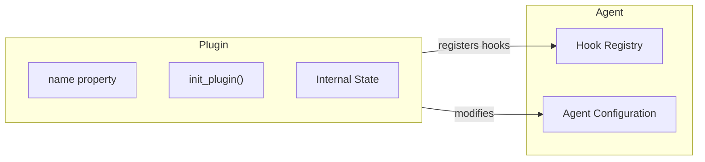

# Plugins

Plugins are a composable mechanism for extending agent functionality by encapsulating related hooks, configuration, and initialization logic into reusable packages. While [hooks](../agents/hooks.md) provide fine-grained control over agent lifecycle events, plugins offer a higher-level abstraction for packaging behavior changes that can be easily shared and reused.

## Overview

Plugins build on the hooks system to provide:

- **Encapsulation**: Bundle related hooks, configuration, and state into a single reusable unit
- **Initialization**: Perform setup tasks when attached to an agent (register hooks, modify attributes, etc.)
- **Composability**: Combine multiple plugins to build complex agent behaviors
- **Shareability**: Package and distribute agent extensions for others to use



## Basic Usage

### Using Plugins

Plugins are passed to agents during initialization via the `plugins` parameter:

=== "Python"

    ```python
    from strands import Agent
    from strands.experimental.steering import LLMSteeringHandler

    # Create an agent with plugins
    agent = Agent(
        tools=[my_tool],
        plugins=[LLMSteeringHandler(system_prompt="Guide the agent...")]
    )
    ```

{{ ts_not_supported_code("Plugins are not yet available in TypeScript SDK") }}

### Creating Custom Plugins

To create a plugin, extend the `Plugin` base class and implement the required `name` property and `init_plugin` method:

=== "Python"

    ```python
    from strands.plugins import Plugin
    from strands.hooks import BeforeToolCallEvent, AfterToolCallEvent
    from typing import TYPE_CHECKING

    if TYPE_CHECKING:
        from strands import Agent

    class LoggingPlugin(Plugin):
        """A plugin that logs all tool calls."""
        
        name = "logging-plugin"
        
        def init_plugin(self, agent: "Agent") -> None:
            """Initialize the plugin with an agent instance."""
            # Register hooks using the simplified add_hook API
            agent.add_hook(self.log_before_tool, BeforeToolCallEvent)
            agent.add_hook(self.log_after_tool, AfterToolCallEvent)
        
        def log_before_tool(self, event: BeforeToolCallEvent) -> None:
            print(f"Calling tool: {event.tool_use['name']}")
        
        def log_after_tool(self, event: AfterToolCallEvent) -> None:
            print(f"Tool completed: {event.tool_use['name']}")

    # Use the plugin
    agent = Agent(
        tools=[my_tool],
        plugins=[LoggingPlugin()]
    )
    ```

{{ ts_not_supported_code("Plugins are not yet available in TypeScript SDK") }}

## Plugin Interface

The `Plugin` base class defines the contract that all plugins must follow:

### Required Members

| Member | Type | Description |
|--------|------|-------------|
| `name` | `str` (property) | A stable string identifier for the plugin. Should be unique and descriptive. |
| `init_plugin(agent)` | Method | Called when the plugin is attached to an agent. Use this to register hooks, modify agent configuration, or perform other initialization. |

### The `init_plugin` Method

The `init_plugin` method receives the agent instance and can:

- Register hooks via `agent.add_hook(callback, EventType)`
- Access and modify agent attributes
- Store references for later use
- Perform async initialization (return an `Awaitable`)

=== "Python"

    ```python
    from strands.plugins import Plugin
    from strands.hooks import BeforeInvocationEvent

    class ConfigPlugin(Plugin):
        name = "config-plugin"
        
        def __init__(self, setting: str):
            self.setting = setting
        
        def init_plugin(self, agent: "Agent") -> None:
            # Access agent attributes
            print(f"Attaching to agent: {agent.name}")
            
            # Register hooks
            agent.add_hook(self.on_invocation, BeforeInvocationEvent)
            
            # Store agent reference if needed
            self.agent = agent
        
        def on_invocation(self, event: BeforeInvocationEvent) -> None:
            print(f"Using setting: {self.setting}")
    ```

{{ ts_not_supported_code("Plugins are not yet available in TypeScript SDK") }}

## Async Plugin Initialization

Plugins can perform asynchronous initialization by returning an `Awaitable` from `init_plugin`:

=== "Python"

    ```python
    import asyncio
    from strands.plugins import Plugin

    class AsyncPlugin(Plugin):
        name = "async-plugin"
        
        async def init_plugin(self, agent: "Agent") -> None:
            # Perform async setup
            self.config = await self.load_remote_config()
            agent.add_hook(self.handler, BeforeToolCallEvent)
        
        async def load_remote_config(self) -> dict:
            # Simulate async config loading
            await asyncio.sleep(0.1)
            return {"key": "value"}
    ```

{{ ts_not_supported_code("Plugins are not yet available in TypeScript SDK") }}

## Plugins vs. Hooks

Understanding when to use plugins versus raw hooks:

| Use Case | Recommended Approach |
|----------|---------------------|
| Simple, one-off event handling | Use hooks directly via `agent.add_hook()` |
| Reusable behavior packages | Create a plugin |
| Sharing extensions with others | Create a plugin |
| Complex initialization logic | Create a plugin |
| Stateful event handling | Create a plugin |
| Quick prototyping | Use hooks directly |

### When to Use Plugins

- **Packaging related hooks**: When you have multiple hooks that work together
- **Distributing extensions**: When you want others to use your agent extensions
- **Complex setup requirements**: When initialization involves configuration, validation, or async operations
- **Maintaining state**: When your hooks need shared state or configuration

### When to Use Hooks Directly

- **Simple callbacks**: Single event handlers that don't need state
- **Quick experiments**: Rapid prototyping during development
- **Application-specific logic**: Code that won't be reused elsewhere

## Advanced Patterns

### Plugin Composition

Combine multiple plugins to build complex agent behaviors:

=== "Python"

    ```python
    from strands import Agent

    # Compose multiple plugins
    agent = Agent(
        tools=[my_tools],
        plugins=[
            LoggingPlugin(),
            MetricsPlugin(),
            ValidationPlugin(rules=my_rules),
        ]
    )
    ```

{{ ts_not_supported_code("Plugins are not yet available in TypeScript SDK") }}

### Conditional Hook Registration

Register hooks based on runtime conditions:

=== "Python"

    ```python
    from strands.plugins import Plugin
    from strands.hooks import BeforeToolCallEvent, AfterToolCallEvent
    import os

    class ConditionalPlugin(Plugin):
        name = "conditional-plugin"
        
        def init_plugin(self, agent: "Agent") -> None:
            # Only register detailed logging in debug mode
            if os.getenv("DEBUG"):
                agent.add_hook(self.detailed_log, BeforeToolCallEvent)
                agent.add_hook(self.detailed_log_after, AfterToolCallEvent)
            else:
                agent.add_hook(self.simple_log, AfterToolCallEvent)
    ```

{{ ts_not_supported_code("Plugins are not yet available in TypeScript SDK") }}

### Error Handling in Plugins

Handle errors gracefully during initialization:

=== "Python"

    ```python
    from strands.plugins import Plugin
    import logging

    logger = logging.getLogger(__name__)

    class RobustPlugin(Plugin):
        name = "robust-plugin"
        
        def init_plugin(self, agent: "Agent") -> None:
            try:
                self.config = self.load_config()
                agent.add_hook(self.handler, BeforeToolCallEvent)
            except FileNotFoundError:
                logger.warning("Config not found, using defaults")
                self.config = self.default_config()
                agent.add_hook(self.handler, BeforeToolCallEvent)
    ```

{{ ts_not_supported_code("Plugins are not yet available in TypeScript SDK") }}

## Best Practices

### Naming Conventions

- Use descriptive, unique names for your plugins
- Consider namespacing if distributing: `"myorg-feature-plugin"`
- Keep names stable across versions for compatibility

### Plugin Design

- **Single responsibility**: Each plugin should have one clear purpose
- **Minimal side effects**: Avoid modifying global state
- **Document dependencies**: Clearly state what your plugin requires
- **Graceful degradation**: Handle missing dependencies or configuration gracefully

### Hook Registration

- Register only the hooks you need
- Use the simplified `agent.add_hook(callback, EventType)` API
- Clean up resources if your plugin maintains state

## Existing Plugins

### Steering Plugin

The [Steering](../experimental/steering.md) plugin provides modular prompting capabilities for complex agent tasks:

=== "Python"

    ```python
    from strands import Agent
    from strands.experimental.steering import LLMSteeringHandler

    handler = LLMSteeringHandler(
        system_prompt="""
        You provide guidance to ensure responses are appropriate.
        """
    )

    agent = Agent(
        tools=[my_tool],
        plugins=[handler]
    )
    ```

{{ ts_not_supported_code("Plugins are not yet available in TypeScript SDK") }}

## Sharing Plugins

Want to share your plugin with the community? See [Get Featured](../../../community/get-featured.md) for guidelines on contributing to the Strands ecosystem. Published plugins can be:

- Distributed via PyPI for easy installation
- Featured in the community catalog
- Discovered by other Strands developers

## Next Steps

- [Hooks](../agents/hooks.md) - Learn about the underlying hook system
- [Steering](../experimental/steering.md) - Explore the built-in steering plugin
- [Get Featured](../../../community/get-featured.md) - Share your plugins with the community
