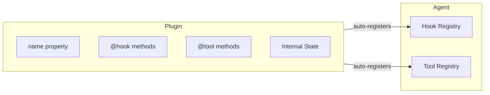

# Plugins

Plugins are a composable mechanism for extending agent functionality by encapsulating related hooks, configuration, and initialization logic into reusable packages. While [hooks](../agents/hooks.md) provide fine-grained control over agent lifecycle events, plugins offer a higher-level abstraction for packaging behavior changes that can be easily shared and reused.

## Overview

Plugins build on the hooks system to provide:

- **Declarative Registration**: Use the `@hook` decorator to automatically register hook callbacks
- **Auto-Discovery**: Plugin base class automatically discovers and registers decorated hooks and tools
- **Encapsulation**: Bundle related hooks, configuration, and state into a single reusable unit
- **Composability**: Combine multiple plugins to build complex agent behaviors
- **Shareability**: Package and distribute agent extensions for others to use


```mermaid
flowchart LR
    subgraph Plugin["Plugin"]
        direction TB
        Name["name property"]
        Hooks["@hook methods"]
        Tools["@tool methods"]
        State["Internal State"]
    end

    subgraph Agent["Agent"]
        direction TB
        HookRegistry["Hook Registry"]
        ToolRegistry["Tool Registry"]
    end

    Plugin -->|"auto-registers"| HookRegistry
    Plugin -->|"auto-registers"| ToolRegistry
```

## Basic Usage

### Using Plugins

Plugins are passed to agents during initialization via the `plugins` parameter:

=== "Python"

    ```python
    from strands import Agent
    from strands.experimental.steering import LLMSteeringHandler

    # Create an agent with plugins
    agent = Agent(
        tools=[my_tool],
        plugins=[LLMSteeringHandler(system_prompt="Guide the agent...")]
    )
    ```

{{ ts_not_supported_code("Plugins are not yet available in TypeScript SDK") }}

### Creating Custom Plugins

The simplest way to create a plugin is using the `@hook` decorator for declarative hook registration:

=== "Python"

    ```python
    from strands import Agent, tool
    from strands.plugins import Plugin, hook
    from strands.hooks import BeforeToolCallEvent, AfterToolCallEvent

    class LoggingPlugin(Plugin):
        """A plugin that logs all tool calls."""

        name = "logging-plugin"

        @hook
        def log_before_tool(self, event: BeforeToolCallEvent) -> None:
            """Automatically registered based on the event type hint."""
            print(f"Calling tool: {event.tool_use['name']}")

        @hook
        def log_after_tool(self, event: AfterToolCallEvent) -> None:
            """Automatically registered based on the event type hint."""
            print(f"Tool completed: {event.tool_use['name']}")

    # Use the plugin
    agent = Agent(
        tools=[my_tool],
        plugins=[LoggingPlugin()]
    )
    ```

{{ ts_not_supported_code("Plugins are not yet available in TypeScript SDK") }}

The `@hook` decorator automatically infers the event type from the callback's type hint, so you don't need to manually register hooks in `init_plugin()`.

## The `@hook` Decorator

The `@hook` decorator provides a declarative way to register hook callbacks within plugins.

### Basic Usage

=== "Python"

    ```python
    from strands.plugins import Plugin, hook
    from strands.hooks import BeforeModelCallEvent

    class MyPlugin(Plugin):
        name = "my-plugin"

        @hook
        def on_model_call(self, event: BeforeModelCallEvent) -> None:
            print(f"Model being called")
    ```

{{ ts_not_supported_code("Plugins are not yet available in TypeScript SDK") }}

### Event Type Inference

The decorator infers the event type from the callback's type hint:

=== "Python"

    ```python
    @hook
    def my_callback(self, event: BeforeToolCallEvent) -> None:
        # Event type is inferred from the type hint
        pass
    ```

{{ ts_not_supported_code("Plugins are not yet available in TypeScript SDK") }}

### Handling Multiple Event Types

Use union types to register a single callback for multiple event types:

=== "Python"

    ```python
    from strands.plugins import Plugin, hook
    from strands.hooks import BeforeModelCallEvent, AfterModelCallEvent

    class MultiEventPlugin(Plugin):
        name = "multi-event-plugin"

        @hook
        def on_any_model_event(self, event: BeforeModelCallEvent | AfterModelCallEvent) -> None:
            """Called for both before and after model call events."""
            print(f"Model event: {type(event).__name__}")
    ```

{{ ts_not_supported_code("Plugins are not yet available in TypeScript SDK") }}

## Auto-Discovery of Tools

Plugins can also include tools that are automatically added to the agent. Methods decorated with `@tool` are discovered and registered when the plugin is attached:

=== "Python"

    ```python
    from strands import tool
    from strands.plugins import Plugin, hook
    from strands.hooks import BeforeToolCallEvent

    class UtilityPlugin(Plugin):
        """A plugin that provides utility tools and logging."""

        name = "utility-plugin"

        @hook
        def log_tool_calls(self, event: BeforeToolCallEvent) -> None:
            print(f"Tool called: {event.tool_use['name']}")

        @tool
        def printer(self, message: str) -> str:
            """Print a message and return confirmation.

            Args:
                message: The message to print
            """
            print(message)
            return f"Printed: {message}"

    # The printer tool is automatically added to the agent
    agent = Agent(plugins=[UtilityPlugin()])
    agent("Please print 'Hello World'")  # Agent can use the printer tool
    ```

{{ ts_not_supported_code("Plugins are not yet available in TypeScript SDK") }}

## Plugin Interface

The `Plugin` base class defines the contract that all plugins must follow:

### Required Members

| Member | Type | Description |
|--------|------|-------------|
| `name` | `str` (property or class attribute) | A stable string identifier for the plugin. Should be unique and descriptive. |

### Auto-Discovery Behavior

When a plugin is attached to an agent, the base class automatically:

1. Scans for methods decorated with `@hook` and registers them with the agent's hook registry
2. Scans for methods decorated with `@tool` and adds them to the agent's tools

### Custom Initialization with `init_plugin`

For custom initialization logic, override the `init_plugin` method and call `super().init_plugin(agent)` to preserve auto-discovery:

=== "Python"

    ```python
    from strands.plugins import Plugin, hook
    from strands.hooks import BeforeInvocationEvent

    class ConfigPlugin(Plugin):
        name = "config-plugin"

        def __init__(self, setting: str):
            super().__init__()
            self.setting = setting

        def init_plugin(self, agent: "Agent") -> None:
            # Call super to auto-register @hook and @tool decorated methods
            super().init_plugin(agent)

            # Custom initialization
            print(f"Attaching to agent: {agent.name}")
            self.agent = agent

        @hook
        def on_invocation(self, event: BeforeInvocationEvent) -> None:
            print(f"Using setting: {self.setting}")
    ```

{{ ts_not_supported_code("Plugins are not yet available in TypeScript SDK") }}

### Manual Hook Registration

You can also register hooks manually in `init_plugin` if needed:

=== "Python"

    ```python
    from strands.plugins import Plugin
    from strands.hooks import BeforeToolCallEvent

    class ManualPlugin(Plugin):
        name = "manual-plugin"

        def init_plugin(self, agent: "Agent") -> None:
            # Manual registration (useful for dynamic or conditional hooks)
            agent.add_hook(self.my_callback, BeforeToolCallEvent)

        def my_callback(self, event: BeforeToolCallEvent) -> None:
            print(f"Tool: {event.tool_use['name']}")
    ```

{{ ts_not_supported_code("Plugins are not yet available in TypeScript SDK") }}

## Async Plugin Initialization

Plugins can perform asynchronous initialization by making `init_plugin` async:

=== "Python"

    ```python
    import asyncio
    from strands.plugins import Plugin, hook
    from strands.hooks import BeforeToolCallEvent

    class AsyncPlugin(Plugin):
        name = "async-plugin"

        async def init_plugin(self, agent: "Agent") -> None:
            # Call super for auto-discovery
            await super().init_plugin(agent)

            # Perform async setup
            self.config = await self.load_remote_config()

        async def load_remote_config(self) -> dict:
            # Simulate async config loading
            await asyncio.sleep(0.1)
            return {"key": "value"}

        @hook
        def handler(self, event: BeforeToolCallEvent) -> None:
            print(f"Config: {self.config}")
    ```

{{ ts_not_supported_code("Plugins are not yet available in TypeScript SDK") }}

## Plugins vs. Hooks

Understanding when to use plugins versus raw hooks:

| Use Case | Recommended Approach |
|----------|---------------------|
| Simple, one-off event handling | Use hooks directly via `agent.add_hook()` |
| Reusable behavior packages | Create a plugin with `@hook` |
| Bundling hooks with tools | Create a plugin with `@hook` and `@tool` |
| Sharing extensions with others | Create a plugin |
| Complex initialization logic | Create a plugin |
| Stateful event handling | Create a plugin |
| Quick prototyping | Use hooks directly |

### When to Use Plugins

- **Packaging related hooks**: When you have multiple hooks that work together
- **Bundling tools with behavior**: When hooks and tools are part of the same feature
- **Distributing extensions**: When you want others to use your agent extensions
- **Complex setup requirements**: When initialization involves configuration, validation, or async operations
- **Maintaining state**: When your hooks need shared state or configuration

### When to Use Hooks Directly

- **Simple callbacks**: Single event handlers that don't need state
- **Quick experiments**: Rapid prototyping during development
- **Application-specific logic**: Code that won't be reused elsewhere

## Advanced Patterns

### Plugin Composition

Combine multiple plugins to build complex agent behaviors:

=== "Python"

    ```python
    from strands import Agent

    # Compose multiple plugins
    agent = Agent(
        plugins=[
            LoggingPlugin(),
            MetricsPlugin(),
            ValidationPlugin(rules=my_rules),
        ]
    )
    ```

{{ ts_not_supported_code("Plugins are not yet available in TypeScript SDK") }}

### Conditional Hook Registration

For conditional registration, override `init_plugin` instead of using `@hook`:

=== "Python"

    ```python
    from strands.plugins import Plugin
    from strands.hooks import BeforeToolCallEvent, AfterToolCallEvent
    import os

    class ConditionalPlugin(Plugin):
        name = "conditional-plugin"

        def init_plugin(self, agent: "Agent") -> None:
            # Only register detailed logging in debug mode
            if os.getenv("DEBUG"):
                agent.add_hook(self.detailed_log, BeforeToolCallEvent)
                agent.add_hook(self.detailed_log_after, AfterToolCallEvent)
            else:
                agent.add_hook(self.simple_log, AfterToolCallEvent)

        def detailed_log(self, event: BeforeToolCallEvent) -> None:
            print(f"DEBUG: Calling {event.tool_use}")

        def detailed_log_after(self, event: AfterToolCallEvent) -> None:
            print(f"DEBUG: Completed {event.tool_use}")

        def simple_log(self, event: AfterToolCallEvent) -> None:
            print(f"Tool completed: {event.tool_use['name']}")
    ```

{{ ts_not_supported_code("Plugins are not yet available in TypeScript SDK") }}

### Error Handling in Plugins

Handle errors gracefully during initialization:

=== "Python"

    ```python
    from strands.plugins import Plugin, hook
    from strands.hooks import BeforeToolCallEvent
    import logging

    logger = logging.getLogger(__name__)

    class RobustPlugin(Plugin):
        name = "robust-plugin"

        def __init__(self, config_path: str = None):
            super().__init__()
            self.config_path = config_path
            self.config = {}

        def init_plugin(self, agent: "Agent") -> None:
            try:
                if self.config_path:
                    self.config = self.load_config()
            except FileNotFoundError:
                logger.warning("Config not found, using defaults")
                self.config = {"default": True}

            # Still register hooks via super()
            super().init_plugin(agent)

        @hook
        def handler(self, event: BeforeToolCallEvent) -> None:
            print(f"Config: {self.config}")
    ```

{{ ts_not_supported_code("Plugins are not yet available in TypeScript SDK") }}

### Multiple Agents with Same Plugin

A single plugin instance can be attached to multiple agents. Each agent gets its own hook registrations:

=== "Python"

    ```python
    from strands import Agent
    from strands.plugins import Plugin, hook
    from strands.hooks import BeforeInvocationEvent

    class SharedPlugin(Plugin):
        name = "shared-plugin"

        @hook
        def on_invoke(self, event: BeforeInvocationEvent) -> None:
            print(f"Agent {event.agent.name} invoked")

    # Same plugin instance, different agents
    plugin = SharedPlugin()
    agent1 = Agent(name="agent-1", plugins=[plugin])
    agent2 = Agent(name="agent-2", plugins=[plugin])
    ```

{{ ts_not_supported_code("Plugins are not yet available in TypeScript SDK") }}

## Best Practices

### Naming Conventions

- Use descriptive, unique names for your plugins
- Consider namespacing if distributing: `"myorg-feature-plugin"`
- Keep names stable across versions for compatibility

### Plugin Design

- **Single responsibility**: Each plugin should have one clear purpose
- **Prefer `@hook` decorator**: Use declarative registration when possible
- **Minimal side effects**: Avoid modifying global state
- **Document dependencies**: Clearly state what your plugin requires
- **Graceful degradation**: Handle missing dependencies or configuration gracefully

### Hook Registration

- Use `@hook` decorator for static hook registration
- Use manual registration in `init_plugin` for conditional or dynamic hooks
- Call `super().init_plugin(agent)` if overriding `init_plugin` to preserve auto-discovery

## Existing Plugins

### Steering Plugin

The [Steering](../experimental/steering.md) plugin provides modular prompting capabilities for complex agent tasks:

=== "Python"

    ```python
    from strands import Agent
    from strands.experimental.steering import LLMSteeringHandler

    handler = LLMSteeringHandler(
        system_prompt="""
        You provide guidance to ensure responses are appropriate.
        """
    )

    agent = Agent(
        tools=[my_tool],
        plugins=[handler]
    )
    ```

{{ ts_not_supported_code("Plugins are not yet available in TypeScript SDK") }}

## Sharing Plugins

Want to share your plugin with the community? See [Get Featured](../../../community/get-featured.md) for guidelines on contributing to the Strands ecosystem. Published plugins can be:

- Distributed via PyPI for easy installation
- Featured in the community catalog
- Discovered by other Strands developers

## Next Steps

- [Hooks](../agents/hooks.md) - Learn about the underlying hook system
- [Steering](../experimental/steering.md) - Explore the built-in steering plugin
- [Get Featured](../../../community/get-featured.md) - Share your plugins with the community
