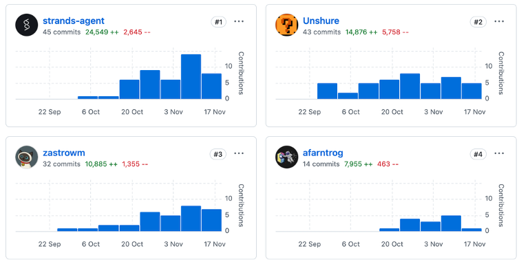

One of the [most requested features](https://github.com/strands-agents/sdk-python/issues/156) to the Strands team was to add support for running Strands in TypeScript. A feature request like this was expected, TypeScript and JavaScript together topped popular leaderboards as the most used language by developers in 2025 ([github](https://github.blog/news-insights/octoverse/octoverse-a-new-developer-joins-github-every-second-as-ai-leads-typescript-to-1/), [stack overflow](https://survey.stackoverflow.co/2025/technology#most-popular-technologies-language-language)).

As the team was considering this feature, we wanted to reflect on our experience of building the Strands Python SDK, and the challenges we faced. The Python codebase started as a passion project among some of the early engineers in the team, and was developed with the help of Coding Agents written by that very same codebase! These Agents were powered by models released in mid-2024 (think Claude 3.5) which were not nearly as capable as models we have available to us today. The LLM's of that generation were not known for their code quality, and lead to the reputation around "Vibe-Coding" we all know so well today, so its easy to understand that they required a lot of oversight in order to produce good results.

Looking forward to the development of a new SDK, we wanted to learn from our lessons and utilize agent to write code **better** and **faster**.

## Writing code better with agent SOPs

For writing code better, we turned to [agent SOPs](https://github.com/strands-agents/agent-sop) (standard operating procedures). An agent SOP is a structured, natural language specification that an agent follows step by step to accomplish a task. It has an overview, parameters, and a list of steps. The format makes it obvious what the agent is doing at each stage, which means it's debuggable. If the agent goes off track at step three, I know I need to give it more instruction at step three.

This matters more than it might seem. On teams where we were writing system prompts for agents, developers were afraid that changing the wording would cause unexpected behavior. SOPs remove that fear. The structure makes it clear where to intervene and gives you confidence that your changes won't break the system.

The idea for agent SOPs came from one of our principal engineers, James Hood, who was frustrated with the same problems we were seeing with early AI coding tools. He shared the concept with Amazon's internal builder community, and it took off. The last time I checked, over 5,000 SOPs had been authored and used across teams internally.

Two SOPs in particular became central to our workflow:

- **Prompt Driven Development**: An SOP that guides the agent through a question-and-answer process to refine a vague idea into an implementable task. The agent asks clarifying questions, explores the codebase, and takes notes on its progress. The output is a markdown specification for how to implement a feature. This matters because without it, agents take the shortest path to solving a problem, and the shortest path isn't necessarily the one you want. Sometimes you need the agent to use functions your team wrote, or follow patterns your team is familiar with.

- **Code Assist**: An SOP that takes the implementable task from Prompt Driven Development and writes the code using test-driven development. It writes the unit tests first, then the application code. After implementation, I review the code, give feedback, and iterate until it's done.

Together, these two SOPs solved the "writing code better" problem. But I was still the middleman, translating my team's feedback into instructions for the agent in my local IDE. That's where the "writing code faster" part comes in.

## Writing code faster with GitHub-based agents

Typically, a developer sits between their team and their coding tools. The team communicates through GitHub, leaving feedback on pull requests and issues. The developer reads that feedback, context-switches into their IDE, relays it to the agent, reviews the result, pushes the code, and repeats. That middleman role consumes a lot of time.

We wanted to remove the middleman by making GitHub a member of the team. We built a system using [GitHub Actions](https://github.com/strands-agents/devtools) that triggers a Strands agent in response to a `/strands` command on issues and pull requests. A Python Strands agent writes code for our TypeScript repository. The agent acts as another contributor on the team: it reads issues, responds to pull request feedback, and coordinates with the team directly through GitHub. I no longer need to relay information between my team and the agent.

### The refiner and implementer

We adapted Prompt Driven Development and Code Assist into two GitHub-native agents: the **refiner** and the **implementer**.

**The refiner** works on issues. Given a feature request, it checks out the repository, explores the codebase to understand the implications of the feature, and posts clarifying questions as a comment on the issue. I answer the questions, type `/strands` again, and we repeat until the agent determines the task is ready to implement. At that point, it updates the issue description with a comprehensive implementation specification, including acceptance criteria, technical approach, and files to modify.

**The implementer** takes over from there. Triggered by `/strands implement`, it creates a branch, checks out the codebase, and implements the feature using test-driven development. It commits the code and creates a pull request. On that pull request, I can leave feedback just like I would for any human team member. The agent reads my comments, updates the code, and responds with what it changed. If it's confused about a piece of feedback, it asks for clarification before making changes.

### How the system works under the hood

The `/strands` command triggers a GitHub Actions workflow with four stages:

1. **Authorization**: Verifies the commenter has appropriate repository access.
2. **Input parsing**: Determines which agent to invoke, generates a session ID, and prepares the system prompt.
3. **Agent execution**: Runs the selected agent in a read-only sandbox with the repository checked out. The agent uses AWS Bedrock for inference and captures any write operations (git push, PR creation) as deferred actions.
4. **Finalization**: Applies the deferred write operations, cleans up labels, and completes the workflow.

The read-only sandbox with deferred writes is a key design choice. It means the agent can't accidentally push broken code or create unintended pull requests. All write operations are reviewed and applied in a controlled finalization step.

We also built a **reviewer** agent (`/strands review`) that performs comprehensive code reviews on pull requests, posting inline comments and submitting formal GitHub reviews, and a **release notes generator** (`/strands release-notes`) that creates structured release notes from a range of commits.

### Debugging the system with SOPs

One thing I want to highlight is how the SOP format helped us iterate on these agents. Early on, the implementer agent couldn't create pull requests because it didn't have the right GitHub token permissions. Instead of spending time debugging the permissions model, we added a step to the SOP telling the agent to provide us a link so we could create the PR on its behalf. That's the kind of targeted fix that SOPs make easy: you identify which step went wrong and add more instruction at that step.

## Results

The efficiency gains have been significant. The key insight is the asynchronous nature of the workflow. I can kick off the implementer agent on a feature, and it runs for 30 minutes while I work on something else. I'm not sitting there writing and debugging code. I'm reviewing, refining, and bar-raising.

My team's principal engineer, Arron, described his experience:

> "I spent one hour of my time over three short 20-minute sessions total instead of perhaps half a day writing code."

That's roughly a 4x efficiency improvement. It's not always that dramatic, but we consistently find that low to medium complexity tasks are well-suited for agents. As developers, we focus on the high-complexity work and break it down into medium and lower complexity tasks that we can delegate.

We've tracked contributions to the TypeScript SDK, and the agent is the largest contributor of code. My own contribution is 43 commits and about 14,000 lines. The agent is slightly ahead. Every engineer on the team is using the system, but we're still writing code ourselves for complex tasks that agents can't yet handle.

## What we learned

Building the TypeScript SDK this way taught us a few things:

- **Spend less time writing code, more time reviewing it.** The traditional cycle of checking out a repo, context-switching, writing code, debugging, and writing tests can be offloaded to agents. Your time is better spent on review, refinement, and high-level design guidance.

- **Parallelize your work.** The async nature of GitHub-based agents means you can have multiple features being implemented simultaneously while you focus on tasks that agents can't do yet.

- **Treat agents as team members.** The agent participates in the same GitHub workflow as every other contributor. It reads issues, creates pull requests, and responds to code review. This isn't a special process; it's the same process your team already uses.

- **SOPs make agents debuggable.** When an agent does something unexpected, the SOP structure tells you exactly where to intervene. This gives developers the confidence to iterate on agent behavior without fear of breaking things.

## Get started

The tools we used to build the TypeScript SDK are all open source:

- [Strands Agents SDK](https://github.com/strands-agents/sdk-typescript) for TypeScript
- [Agent SOPs](https://github.com/strands-agents/agent-sop) for structured agent instructions
- [Devtools](https://github.com/strands-agents/devtools) for GitHub-based agent workflows

You can set up the `/strands` command in your own repositories using the reusable GitHub Actions provided in the devtools repo. We're continuing to develop and refine the system, and you can track our progress on the [TypeScript SDK repository](https://github.com/strands-agents/sdk-typescript).

We'd love to hear how you're using agents in your development workflow. Join us on [GitHub](https://github.com/strands-agents) or visit [strandsagents.com](https://strandsagents.com) to get started.
