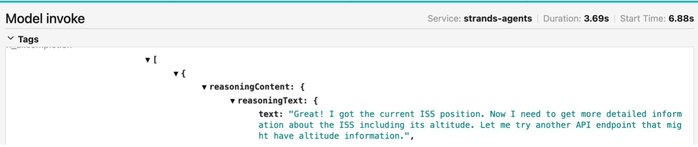

The Strands Agents SDK embraces a model-driven approach where developers equip a model with tools and a prompt, letting it plan, chain thoughts, call tools, and reflect. Claude 4 introduces a beta feature called **interleaved thinking** that fits perfectly with this approach, enabling Claude to reflect after tool calls and adjust its plan dynamically without completing the current event loop iteration.

## The Strands Event Loop

When you create a Strands agent, the SDK manages an event loop that handles model invocations, tool calling, and conversation management until the model provides a final answer. Here's how it works:

1. **Model invocation and reasoning**: The event loop calls the language model with the current conversation state, prompt, and tools. The model streams its responses, including step-by-step reasoning.

2. **Tool use detection and execution**: When the model decides to call a tool, the event loop detects the request, validates it, and executes the corresponding function with the provided parameters.

3. **Context update**: Tool execution results are appended to the ongoing conversation, allowing the model to incorporate new information in its next iteration.

Consider this example that calculates distances to the International Space Station:

```python
from strands import Agent
from strands_tools import http_request, python_repl

agent = Agent(
    model="us.anthropic.claude-sonnet-4-20250514-v1:0",
    tools=[http_request, python_repl]
)

prompt = """
Which of the following cities is closest to the ISS?
Portland, Vancouver, Seattle, or New York?

Include the current altitude of the ISS, and the distance
and vector from the closest city to the ISS.
"""

agent(prompt)
```

The agent uses its tools to make API calls for real-time ISS data and Python calculations to determine distances and vectors, then generates a comprehensive answer.

## Enabling Interleaved Thinking

Claude 4's interleaved thinking expands on the model's ability to self-reflect, correct errors, and orchestrate workflows of reasoning and tool use. With this feature, thought and action happen in one thinking block rather than requiring another complete loop.

To enable interleaved thinking with Amazon Bedrock as your model provider:

```python
from strands import Agent
from strands_tools import http_request, python_repl
from strands.models import BedrockModel

model = BedrockModel(
    model_id="us.anthropic.claude-sonnet-4-20250514-v1:0",
    additional_request_fields={
        "anthropic_beta": ["interleaved-thinking-2025-05-14"],
        "thinking": {"type": "enabled", "budget_tokens": 8000},
    },
)

agent = Agent(
    model=model,
    tools=[http_request, python_repl]
)
```

When you enable [tracing with Strands](/docs/user-guide/observability-evaluation/traces/), you'll see additional blocks of `reasoningContent` in your traces, including reasoning when Claude decides to interleave thinking after tool calls.



## Benefits of Interleaved Thinking

The interleaved thinking approach offers several advantages:

- **Faster reasoning**: Thought and action happen together rather than in separate loop iterations
- **Dynamic error correction**: The model can identify and fix calculation errors immediately before continuing
- **Reduced tool calls**: The model can recognize when it already has enough information, avoiding unnecessary API calls
- **More fluid reasoning**: Similar to a domain expert mentally processing information while explaining, rather than a step-by-step note-taking approach

For example, with interleaved thinking enabled, Claude can notice an erroneous calculation from a tool call and fix it immediately, before continuing to the next iteration. It can also reduce tool calls by recognizing when it can calculate an answer from information already retrieved.

## Learn More

These examples scratch the surface of what you can build with Strands and Claude 4 using interleaved thinking. Check out the [agent samples](https://github.com/strands-agents/samples/tree/main) for more complex examples, including [this notebook demonstrating interleaved thinking](https://github.com/strands-agents/samples/blob/main/01-tutorials/02-multi-agent-systems/01-agent-as-tool/agents-as-tools-interleaved.ipynb) with dynamic reasoning and error recovery.

Join the discussion at the [Strands Agents SDK repository](https://github.com/strands-agents/sdk-python) to share what you're building.
