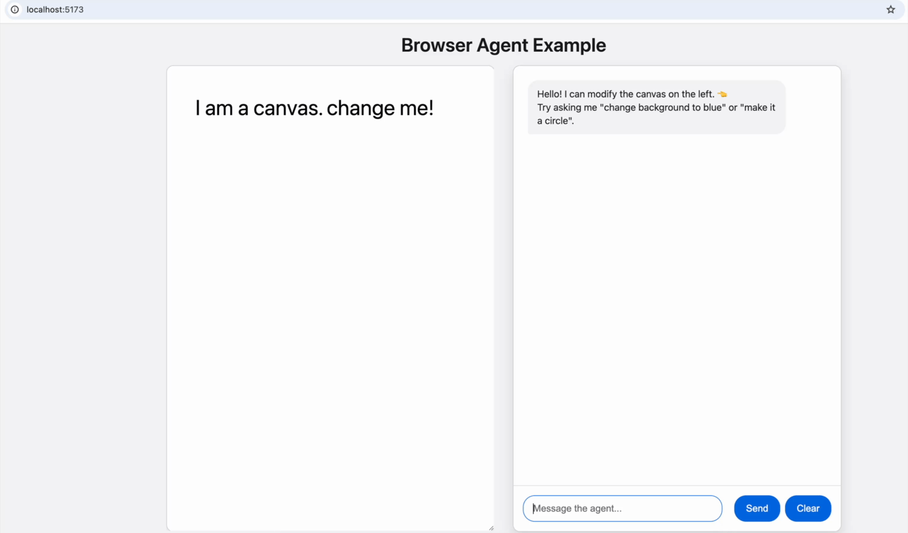

We're excited to announce version 1.0 of the [Strands Agents TypeScript SDK](https://strandsagents.com/docs/user-guide/quickstart/typescript/). The SDK brings the Strands model-driven approach to the TypeScript and JavaScript ecosystem. If you've been following Strands Agents, you know the Python SDK has been powering production agents across AWS and the broader community since May 2025, with over 25 million downloads and counting. Now, TypeScript developers can enjoy the same experience, with full type safety, custom tools, and the ability to run agents in both Node.js and the browser.

## Quick start

Getting started takes just a few lines of code:

```bash
npm install @strands-agents/sdk
```

```typescript
import { Agent } from '@strands-agents/sdk'

--8<-- "../blog/strands-agents-typescript-sdk-v1.ts:hello_world"
```

## What's in the box

The SDK ships with everything you need to go from prototype to production.

### Model providers

Amazon Bedrock is the default, with built-in support for OpenAI, Anthropic, Google, and any provider compatible with the Vercel AI SDK:

```typescript
import { Agent } from '@strands-agents/sdk'
import { BedrockModel } from '@strands-agents/sdk/models/bedrock'

--8<-- "../blog/strands-agents-typescript-sdk-v1.ts:model_provider"
```

### Tools

Define custom tools with a Zod schema and a callback. The SDK validates inputs at runtime and gives you full type inference at compile time:

```typescript
import { tool } from '@strands-agents/sdk'
import { z } from 'zod'

--8<-- "../blog/strands-agents-typescript-sdk-v1.ts:tool_definition"
```

The SDK already ships with ready-made tools for running shell commands, editing files, making HTTP requests, and working with notebooks. And with native [Model Context Protocol](https://modelcontextprotocol.io/) support, you can connect to any MCP-compatible tool server:

```typescript
import { Agent, McpClient } from '@strands-agents/sdk'
import { StdioClientTransport } from '@modelcontextprotocol/sdk/client/stdio.js'

--8<-- "../blog/strands-agents-typescript-sdk-v1.ts:mcp"
```

### Streaming

Stream responses as they're generated for responsive UIs and real-time feedback:

```typescript
import { Agent } from '@strands-agents/sdk'

--8<-- "../blog/strands-agents-typescript-sdk-v1.ts:streaming"
```

### Plugins

Strands is extensible by design. Simply hook in with the `Plugin` interface to customize behavior across 15+ lifecycle events spanning invocation, model calls, tool execution, and more:

```typescript
import { Agent, BeforeToolCallEvent, AfterToolCallEvent } from '@strands-agents/sdk'
import type { Plugin, LocalAgent } from '@strands-agents/sdk'

--8<-- "../blog/strands-agents-typescript-sdk-v1.ts:plugins"
```

The SDK vends its own plugins as well. [Agent Skills](https://strandsagents.com/docs/user-guide/concepts/plugins/skills/), for instance, lets your agent discover and activate instructions on demand rather than loading everything upfront.

### Multi-agent orchestration

Single agents are powerful on their own, but some workflows call for coordination. Strands offers three patterns to choose from. The most direct approach is agent-as-tool, where one agent is assigned as a tool on another agent:

```typescript
import { Agent } from '@strands-agents/sdk'

--8<-- "../blog/strands-agents-typescript-sdk-v1.ts:agent_as_tool"
```

When you need more control over execution order, Graph lets you define explicit dependencies between agents:

```typescript
import { Agent } from '@strands-agents/sdk'
import { Graph } from '@strands-agents/sdk/multiagent'

--8<-- "../blog/strands-agents-typescript-sdk-v1.ts:graph"
```

For fully dynamic routing, Swarm enables model-driven handoffs where agents decide at runtime which agent takes over next:

```typescript
import { Agent } from '@strands-agents/sdk'
import { Swarm } from '@strands-agents/sdk/multiagent'

--8<-- "../blog/strands-agents-typescript-sdk-v1.ts:swarm"
```

### And more

The SDK also includes structured output with Zod schema validation, conversation management (sliding window and summarization strategies), session persistence with pluggable storage (file and S3), cooperative cancellation via AbortSignal, token usage tracking and execution metrics, OpenTelemetry integration, and Agent-to-Agent (A2A) protocol support. Check the [docs](https://strandsagents.com) for the full rundown.

## See it in action

To show what's possible, we built a [browser agent demo](https://github.com/strands-agents/sdk-typescript/tree/main/strands-ts/examples/browser-agent). Chat with an agent to build and modify a live canvas in real time. Just describe what you want, and let the agent handle all the HTML, CSS, and JavaScript.



Clone the repo and try it yourself:

```bash
git clone https://github.com/strands-agents/sdk-typescript.git
cd sdk-typescript/strands-ts/examples/browser-agent
npm install && npm run dev
```

The SDK runs natively in the browser with no server required. This opens up a whole category of client-side agent experiences: interactive assistants, in-app copilots, local-first tools.

## Start building

```bash
npm install @strands-agents/sdk
```

- [TypeScript quickstart guide](https://strandsagents.com/docs/user-guide/quickstart/typescript/)
- [GitHub repo](https://github.com/strands-agents/sdk-typescript)
- [API documentation](https://strandsagents.com/docs/api/typescript/)
- [Examples](https://github.com/strands-agents/sdk-typescript/tree/main/strands-ts/examples)

We're building this in the open and contributions are welcome. Whether it's a bug fix, a new feature, or a cool example, we'd love to see what you build. Join us [on GitHub](https://github.com/strands-agents/sdk-typescript) and let us know what you think.
