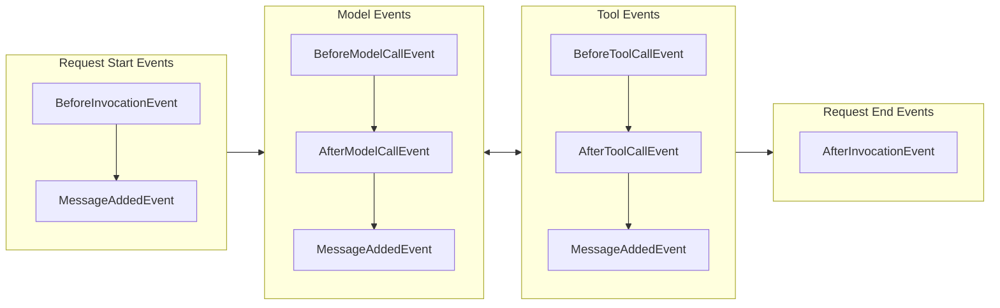
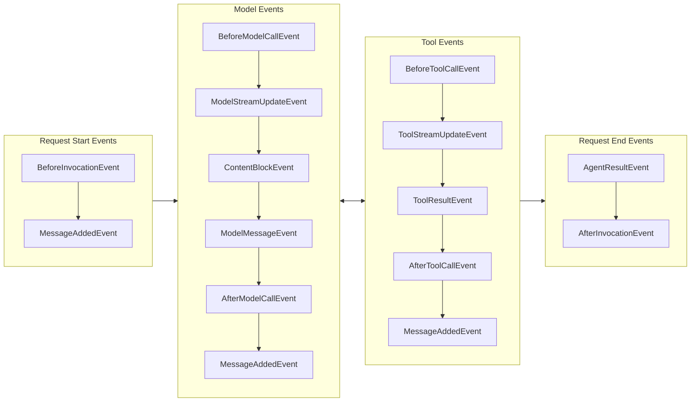
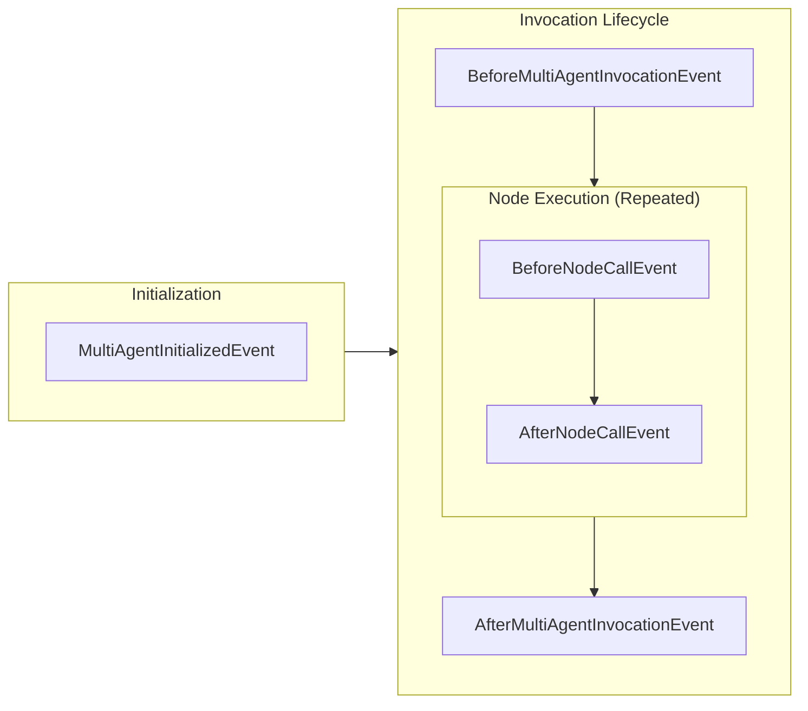
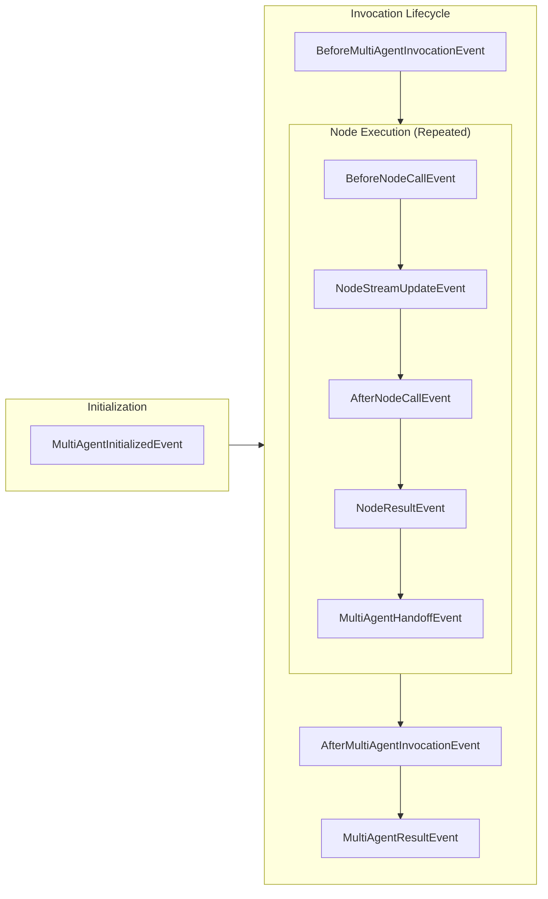

You use hooks to observe and modify agent behavior at runtime. Hooks fire at defined points in the agent loop: before and after model calls, tool calls, and full agent invocations. They are code, not prompt instructions, so they enforce behavior reliably.

This page covers the mental model for hooks. See the [usage guide](./usage) for registration patterns and the [cookbook](./cookbook) for ready-made recipes.

## How hooks work

Hooks subscribe to lifecycle events. Each event type has a before/after pair (for example, `BeforeToolCallEvent` and `AfterToolCallEvent`). When the agent reaches that point in the loop, it fires the event and passes an event object to every registered callback.

Callbacks receive a strongly typed event object carrying context for that stage of the lifecycle. Most event properties are read-only, but specific events expose writable properties that let you modify behavior: cancel a tool call, retry a model call, or rewrite a result.

Here is the simplest case: a callback that prints the tool name before every tool call.

<Tabs>
<Tab label="Python">

```python
from strands import Agent
from strands.hooks import BeforeToolCallEvent

agent = Agent()

def log_tool_name(event: BeforeToolCallEvent) -> None:
    print(f"Calling tool: {event.tool_use['name']}")

agent.add_hook(log_tool_name)
```

</Tab>
<Tab label="TypeScript">

```typescript
import { Agent, BeforeToolCallEvent } from '@strands-agents/sdk'

const agent = new Agent()

agent.addHook(BeforeToolCallEvent, (event) => {
  console.log(`Calling tool: ${event.toolUse.name}`)
})
```

</Tab>
</Tabs>

The callback runs in the agent loop. It receives the event, reads (or writes) properties, and returns. Both Python and TypeScript support async callbacks (`async def` / `Promise<void>`).

## Hook event lifecycle

### Single-agent lifecycle

The following diagram shows when hook events fire during a typical agent invocation where tools are called.

<Tabs>
<Tab label="Python">



</Tab>
<Tab label="TypeScript">

The TypeScript lifecycle includes additional streaming events between the before/after pairs.



</Tab>
</Tabs>

### Multi-agent lifecycle

The following diagram shows when multi-agent hook events fire during orchestrator execution.

<Tabs>
<Tab label="Python">



</Tab>
<Tab label="TypeScript">

The TypeScript multi-agent lifecycle includes streaming, result, and handoff events within node execution.



</Tab>
</Tabs>

## Available events

TypeScript includes additional streaming events (`ModelStreamUpdateEvent`, `ContentBlockEvent`, `ToolStreamUpdateEvent`, and others) not present in Python. Features marked Python-only in the [cookbook](./cookbook) are being added to TypeScript.

### Single-agent events

<Tabs>
<Tab label="Python">

| Event | Description |
|---|---|
| `AgentInitializedEvent` | Fired when the agent finishes construction at the end of its constructor |
| `BeforeInvocationEvent` | Fired at the start of a new agent invocation |
| `AfterInvocationEvent` | Fired at the end of an invocation, regardless of success or failure. Uses reverse callback ordering |
| `MessageAddedEvent` | Fired when a message is added to the agent's conversation messages |
| `BeforeModelCallEvent` | Fired before the model is called for inference |
| `AfterModelCallEvent` | Fired after model calling completes. Uses reverse callback ordering |
| `BeforeToolCallEvent` | Fired before a tool is called |
| `AfterToolCallEvent` | Fired after tool calling completes. Uses reverse callback ordering |

</Tab>
<Tab label="TypeScript">

All events extend `HookableEvent`, making them both streamable via `agent.stream()` and subscribable via hook callbacks.

| Event | Description |
|---|---|
| `InitializedEvent` | Fired when the agent finishes construction at the end of its constructor |
| `BeforeInvocationEvent` | Fired at the start of a new agent invocation |
| `AfterInvocationEvent` | Fired at the end of an invocation, regardless of success or failure. Uses reverse callback ordering |
| `MessageAddedEvent` | Fired when a message is added to the agent's conversation messages |
| `BeforeModelCallEvent` | Fired before the model is called for inference |
| `AfterModelCallEvent` | Fired after model calling completes. Uses reverse callback ordering |
| `ModelStreamUpdateEvent` | Wraps each transient streaming delta from the model during inference. Access via `.event` |
| `ContentBlockEvent` | Wraps a fully assembled content block (TextBlock, ToolUseBlock, ReasoningBlock). Access via `.contentBlock` |
| `ModelMessageEvent` | Wraps the complete model message after all blocks are assembled. Access via `.message` |
| `BeforeToolsEvent` | Fired before tools are called in a batch |
| `AfterToolsEvent` | Fired after tools are called in a batch. Uses reverse callback ordering |
| `BeforeToolCallEvent` | Fired before a tool is called |
| `AfterToolCallEvent` | Fired after tool calling completes. Uses reverse callback ordering |
| `ToolStreamUpdateEvent` | Wraps streaming progress events from tool calling. Access via `.event` |
| `ToolResultEvent` | Wraps a completed tool result. Access via `.result` |
| `AgentResultEvent` | Wraps the final agent result at the end of the invocation. Access via `.result` |

</Tab>
</Tabs>

### Multi-agent events

<Tabs>
<Tab label="Python">

| Event | Description |
|---|---|
| `MultiAgentInitializedEvent` | Fired when the multi-agent orchestrator is initialized |
| `BeforeMultiAgentInvocationEvent` | Fired before orchestrator execution starts |
| `AfterMultiAgentInvocationEvent` | Fired after orchestrator execution completes. Uses reverse callback ordering |
| `BeforeNodeCallEvent` | Fired before individual node execution starts |
| `AfterNodeCallEvent` | Fired after individual node execution completes. Uses reverse callback ordering |

</Tab>
<Tab label="TypeScript">

| Event | Description |
|---|---|
| `MultiAgentInitializedEvent` | Fired when the multi-agent orchestrator finishes initialization |
| `BeforeMultiAgentInvocationEvent` | Fired before orchestrator execution starts |
| `AfterMultiAgentInvocationEvent` | Fired after orchestrator execution completes. Uses reverse callback ordering |
| `BeforeNodeCallEvent` | Fired before individual node execution starts |
| `NodeStreamUpdateEvent` | Wraps an inner streaming event from a node with the node's identity. Access via `.event` |
| `NodeCancelEvent` | Fired when a node is cancelled via `BeforeNodeCallEvent.cancel` |
| `AfterNodeCallEvent` | Fired after individual node execution completes. Uses reverse callback ordering |
| `NodeResultEvent` | Wraps a completed node result. Access via `.result` |
| `MultiAgentHandoffEvent` | Fired when execution transitions between nodes |
| `MultiAgentResultEvent` | Wraps the final multi-agent result at the end of orchestration. Access via `.result` |

</Tab>
</Tabs>

## Modifiable event properties

Most event properties are read-only. The following events expose writable properties that change agent behavior.

<Tabs>
<Tab label="Python">

| Event | Writable property | Effect | Cookbook recipe |
|---|---|---|---|
| `BeforeToolCallEvent` | `cancel_tool` | Cancels tool calling with a message returned to the model | [Limit tool counts](./cookbook#limit-tool-counts) |
| `BeforeToolCallEvent` | `selected_tool` | Replaces the tool to be called | [Tool interception](./cookbook#tool-interception) |
| `BeforeToolCallEvent` | `tool_use` | Modifies tool parameters before calling | [Fixed tool arguments](./cookbook#fixed-tool-arguments) |
| `AfterModelCallEvent` | `retry` | Retries the model call | [Model call retry](./cookbook#model-call-retry) |
| `AfterToolCallEvent` | `result` | Rewrites the tool result | [Result modification](./cookbook#result-modification) |
| `AfterToolCallEvent` | `retry` | Retries the tool call | [Tool call retry](./cookbook#retry-tool-calls) |
| `AfterInvocationEvent` | `resume` | Triggers a follow-up invocation with new input | [Resume after invocation](./cookbook#resume-after-invocation) |

You can also read `AfterToolCallEvent.exception` to inspect the original error if the tool raised one.

</Tab>
<Tab label="TypeScript">

| Event | Writable property | Effect |
|---|---|---|
| `BeforeToolsEvent` | `cancel` | Cancels all tool calls in a batch with a message |
| `BeforeToolCallEvent` | `cancel` | Cancels tool calling with a message returned to the model |
| `AfterModelCallEvent` | `retry` | Retries the model call |
| `AfterToolCallEvent` | `retry` | Retries the tool call |

:::note
TypeScript does not yet support `selected_tool` replacement, `result` modification, or `resume`. These features are being added.
:::

</Tab>
</Tabs>

## When hooks are the wrong choice

Hooks run synchronously in the agent loop. Every millisecond a hook spends is a millisecond added to the agent's response time. Keep this in mind when deciding where to put logic.

**Long-running checks add latency.** If your hook makes a database lookup or API call, that latency applies to every model call or tool call (depending on the event). For expensive validation, consider these alternatives:

- Cache results in the hook's instance state and refresh periodically
- Move the check into the tool itself, where it runs only when that tool is called
- Use async patterns (Python hooks support `async def` callbacks)

**Hooks vs. prompts.** Prompts suggest behavior to the model. Hooks enforce it. A system prompt saying "never call the delete tool" is guidance the model might ignore under pressure. A `BeforeToolCallEvent` hook that cancels `delete` calls is a guarantee. Use prompts for guidance, hooks for guarantees.

**Hooks vs. guardrails.** Hooks are a mechanism. Guardrails are a policy. You implement guardrails using hooks (among other things). A "PII detection guardrail" is a policy decision; the `BeforeToolCallEvent` callback that scans inputs and cancels calls containing PII is the hook that enforces it.

**Why lifecycle hooks and not middleware chains.** We chose lifecycle hooks over middleware chains because hooks compose without ordering dependencies. In a middleware chain, the order you register middleware determines what runs first, and changing the order changes behavior. With hooks, every callback for a given event type runs independently. Before-event callbacks run in registration order; after-event callbacks run in reverse order (unwinding). This makes it safe to combine hooks from multiple plugins without worrying about interference.
