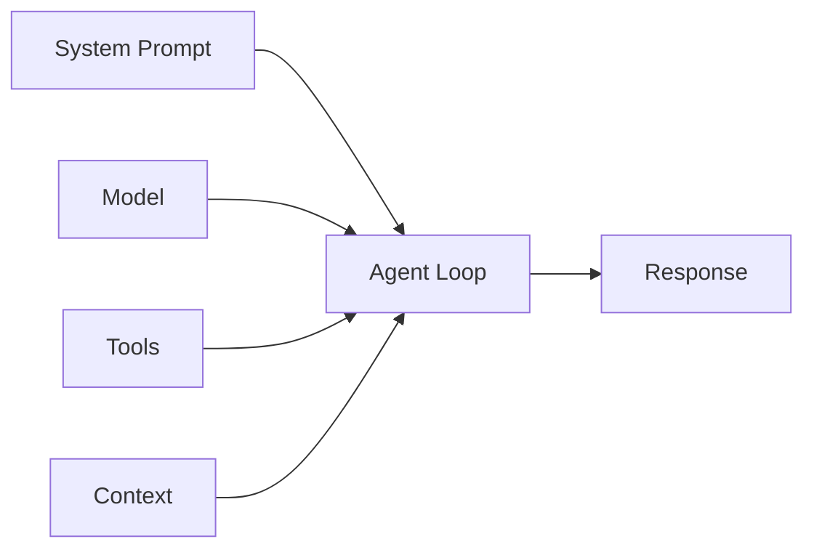

An agent is a program that uses a language model to decide what to do. Rather than following a fixed script, it reasons about a request, takes actions through tools, observes the results, and repeats until the task is complete.

In Strands, an agent is a lightweight runtime that coordinates four things: a **model**, a **system prompt**, **tools**, and **context**. The SDK manages the loop between them. You define the parts; the agent decides how to use them.

## The Four Parts of an Agent

Every Strands agent is composed of four parts:



### 1. Model

The model is the language model that powers the agent's reasoning. It decides what to say, which tools to call, and when the task is done. Strands supports multiple providers — Amazon Bedrock, OpenAI, Anthropic, Ollama, and others.

The model is the only required part. An agent with just a model behaves like a simple chatbot.

### 2. System Prompt

The system prompt defines the agent's role, constraints, and behavior. It is sent to the model at the start of every request and shapes how the model interprets user messages and selects tools.

A well-written system prompt is the most effective way to control agent behavior. See [Prompts](prompts.md) for details.

### 3. Tools

Tools are functions the agent can call to interact with the outside world — read files, query databases, call APIs, run code. The model decides when and how to use them based on the user's request and the tool descriptions you provide.

Without tools, an agent can only generate text. With tools, it can take action. See [Tools Overview](../tools/index.md) for details.

### 4. Context

Context is the conversation history: the sequence of user messages, assistant responses, and tool results that accumulates as the agent works. Each iteration of the agent loop adds to this history, giving the model a growing understanding of the task.

Context grows with every turn. When it approaches the model's token limit, the [Conversation Management](conversation-management.md) system automatically trims or summarizes it to keep the agent working. For persistence across sessions, see [Session Management](session-management.md).

## Putting It Together

Here is a minimal agent that uses all four parts:

```python
from strands import Agent, tool
from strands.models.bedrock import BedrockModel


@tool
def weather(city: str) -> str:
    """Get current weather for a city."""
    return f"Weather for {city}: Sunny, 72°F"


agent = Agent(
    model=BedrockModel(model_id="us.anthropic.claude-sonnet-4-20250514"),
    system_prompt="You are a helpful weather assistant.",
    tools=[weather],
)

agent("What's the weather in Seattle?")
```

```typescript
--8<-- "user-guide/concepts/agents/what-is-an-agent.ts:minimal_agent"
```

When this agent receives the request, the model reads the system prompt, reasons about the question, calls the `weather` tool, receives the result, and produces a final response. The [Agent Loop](agent-loop.md) page explains this cycle in detail.

## Agent Lifecycle and Scope

An agent instance owns its conversation history. This is the most important thing to understand about agent scope.

### One agent per conversation

Each conversation should use its own agent instance. When a user starts a new conversation, create a new agent. When the conversation ends, the agent can be discarded.

```python
# Correct: each request gets its own agent
def handle_request(user_message: str) -> str:
    agent = Agent(
        system_prompt="You are a helpful assistant.",
        tools=[search, calculator],
    )
    result = agent(user_message)
    return str(result)
```

```typescript
--8<-- "user-guide/concepts/agents/what-is-an-agent.ts:per_request_agent"
```

### Common anti-patterns

:::caution[Don't share agents across users or conversations]
Sharing a single agent instance across multiple users or conversations causes conversation history to bleed between them. User A's messages become visible to User B. This is both a correctness bug and a security risk.
:::

**Shared singleton agent** (incorrect):

```python
# Wrong: all users share the same conversation history
app_agent = Agent(system_prompt="You are a helpful assistant.")

def handle_request(user_message):
    return app_agent(user_message)  # History accumulates across all users
```

**Reusing an agent across conversations** (incorrect):

```python
# Wrong: previous conversation leaks into the next one
agent = Agent(system_prompt="You are a helpful assistant.")
agent("Help me draft an email to my manager")  # Conversation 1
agent("What is the capital of France?")  # Sees the email context
```

**Caching agents per user** (incorrect):

```python
# Wrong: treats agents like user profiles instead of conversation processors
user_agents = {}

def get_agent(user_id):
    if user_id not in user_agents:
        user_agents[user_id] = Agent(system_prompt="You are a helpful assistant.")
    return user_agents[user_id]  # History from old conversations leaks into new ones
```

**Sharing configuration, not instances** (correct):

If multiple conversations need the same setup, share the configuration and create fresh instances:

```python
AGENT_CONFIG = {
    "system_prompt": "You are a helpful assistant.",
    "tools": [search, calculator],
}

def handle_request(user_message: str) -> str:
    agent = Agent(**AGENT_CONFIG)
    return str(agent(user_message))
```

```typescript
--8<-- "user-guide/concepts/agents/what-is-an-agent.ts:shared_config"
```

For multi-turn conversations that span multiple requests, use [Session Management](session-management.md) to persist and restore conversation state rather than keeping a long-lived agent instance.

## What Comes Next

Now that you understand what an agent is and how to scope one correctly, explore the details:

- [Agent Loop](agent-loop.md) — How the reasoning-action cycle works
- [Prompts](prompts.md) — Writing effective system prompts
- [Tools Overview](../tools/index.md) — Building and using tools
- [State Management](state.md) — Conversation history, agent state, and request state
- [Session Management](session-management.md) — Persisting conversations across requests
- [Conversation Management](conversation-management.md) — Strategies for managing context window limits
