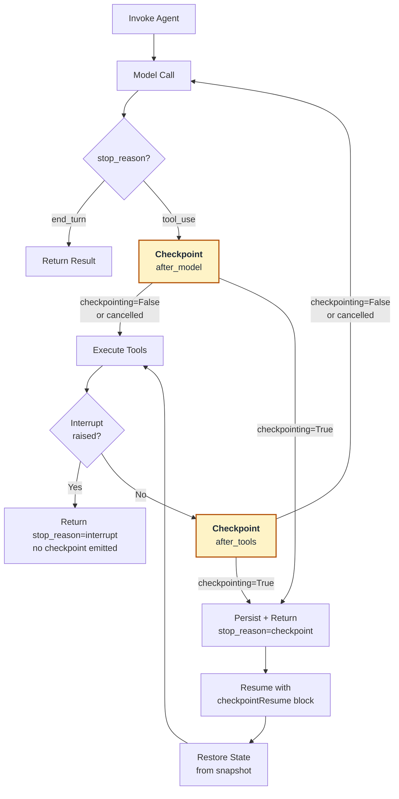

The checkpoint system enables durable agent execution by allowing agents to pause at safe cycle boundaries, persist their state externally, and resume later — potentially in a fresh process after a crash. When a checkpoint is emitted, the agent stops its loop and returns a serializable snapshot of its state. The user persists the snapshot anywhere they choose (database, workflow engine, object storage) and passes it back to resume. The agent rebuilds its state from the snapshot and continues execution from the same cycle boundary. Checkpoints fire at two positions per ReAct cycle — after the model call (before tools execute) and after tool execution (before the next model call) — both controlled by a single flag on the agent. The general flow looks as follows:



Checkpoints only bracket tool execution. An agent whose model call returns `end_turn` completes the cycle without emitting a checkpoint. After an `after_model` resume, state is restored and tools execute next. After an `after_tools` resume, state is restored and control loops back to the next model call — the restored `messages` already contain the tool results from the previous cycle, so those tools are not re-executed.

## Basic Usage

Enable checkpointing by passing `checkpointing=True` when constructing the agent. The agent pauses at cycle boundaries and returns an `AgentResult` with `stop_reason="checkpoint"` and a populated `checkpoint` field. To resume, pass the serialized checkpoint back as a `checkpointResume` content block.

```python
import json

from strands import Agent, tool


@tool
def get_weather(city: str) -> str:
    """Return the current weather for the given city."""
    return "sunny"


@tool
def get_forecast(city: str) -> str:
    """Return the weather forecast for the given city."""
    return "clear skies"


agent = Agent(
    tools=[get_weather, get_forecast],
    system_prompt="When asked about weather, call the get_weather and get_forecast tools.",
    checkpointing=True,
    callback_handler=None,
)

result = agent("What is the weather and forecast for Seattle?")

while result.stop_reason == "checkpoint":
    # Persist anywhere: database, workflow engine, object storage, etc.
    persisted = json.dumps(result.checkpoint.to_dict())

    # Later (potentially in a fresh process), reload and resume.
    checkpoint_dict = json.loads(persisted)
    result = agent([{"checkpointResume": {"checkpoint": checkpoint_dict}}])

print(f"MESSAGE: {json.dumps(result.message)}")
```

The key invariant: completed tool calls are never re-run on resume. At an `after_tools` checkpoint, the tool result message has already been appended to the agent's messages and captured in the snapshot, so the resumed agent's next model call sees the results and continues rather than retrying the tools.

> ⚠️ Checkpoints only emit when the model chooses to call a tool. If the model answers directly from its own knowledge, the loop exits with `stop_reason="end_turn"` on the first call and the `while` loop runs zero times. Encourage tool use through prompt and tool docstrings when you want to observe checkpointing end-to-end.

### Components

Checkpointing in Strands is comprised of the following components:

- `checkpointing=True` - Enables checkpoint emission at cycle boundaries. Defaults to `False`, so existing agents see no behavioral change.
- `result.stop_reason` - Check if the agent stopped due to `"checkpoint"`.
- `result.checkpoint` - The `Checkpoint` object containing the captured state.
    - `checkpoint.position` - Either `"after_model"` or `"after_tools"`, indicating which boundary fired.
    - `checkpoint.cycle_index` - Zero-based index of the ReAct cycle that emitted the checkpoint.
    - `checkpoint.to_dict()` - Serialize to a JSON-compatible dict for persistence.
    - `Checkpoint.from_dict(data)` - Reconstruct a `Checkpoint` from a persisted dict. Raises `CheckpointException` on schema version mismatch.
- `checkpointResume` - Content block type for resuming from a persisted checkpoint.
    - The `checkpoint` field must be a dict produced by `checkpoint.to_dict()`.
    - Must be the only content block in the prompt list.

For additional details on each of these components, refer to the [Python API Reference](@api/python/strands.experimental.checkpoint).

### Rules

Strands enforces the following rules for checkpointing:

- Checkpoints are only emitted on tool-use cycles. A cycle whose model call returns `end_turn` skips both boundaries and returns normally — an agent whose first call returns `end_turn` completes with no checkpoint at all.
- A resume prompt must contain exactly one `checkpointResume` content block and nothing else. Mixing with other content types raises a `TypeError`, and multiple blocks in the same prompt also raise a `TypeError`.
- The `checkpointResume` block must contain a `checkpoint` key; otherwise a `KeyError` is raised.
- Passing a `checkpointResume` block to an agent created with `checkpointing=False` raises a `ValueError`.
- A checkpoint whose `schema_version` does not match the current SDK raises a `CheckpointException` when loaded by `Checkpoint.from_dict`.
- Interrupts take precedence over checkpoints. If a tool raises an interrupt during a checkpointing cycle, the agent returns `stop_reason="interrupt"` and the `after_tools` checkpoint for that cycle is not emitted.
- Cancellation takes precedence over checkpoints. A cancel signal set at either checkpoint boundary suppresses emission and returns `stop_reason="cancelled"`.
- If `request_state["stop_event_loop"]` or a structured output stop signal fires after tools execute, the loop stops before the `after_tools` checkpoint and returns the normal stop reason rather than `"checkpoint"`.

## Fresh Agent Instances

The primary motivation for checkpointing is surviving process-level failures. The pattern: persist the checkpoint to durable storage on pause, build a new `Agent` instance on resume (same model, same tools, same system prompt), and pass the persisted checkpoint back.

```python
import json

from strands import Agent, tool


@tool
def expensive_lookup(key: str) -> str:
    # Implementation here
    return "result"


def build_agent() -> Agent:
    return Agent(
        tools=[expensive_lookup],
        checkpointing=True,
        callback_handler=None,
    )


def save(checkpoint_dict: dict) -> None:
    # Persist to database, blob storage, workflow event history, etc.
    pass


def load() -> dict | None:
    # Read from durable storage.
    return None


# --- First process ---
agent = build_agent()
result = agent("Look up several keys and summarize the results")

if result.stop_reason == "checkpoint":
    save(result.checkpoint.to_dict())

# Process crashes, is restarted, etc. No agent state survives.

# --- Fresh process ---
checkpoint_dict = load()
if checkpoint_dict is not None:
    agent = build_agent()
    result = agent([{"checkpointResume": {"checkpoint": checkpoint_dict}}])
    # Tools that already ran before the crash are not re-invoked.
    print(f"MESSAGE: {json.dumps(result.message)}")
```

### Components

Crash recovery builds on the core checkpointing components plus:

- `checkpoint.to_dict()` / `Checkpoint.from_dict()` - The serialization boundary. The output is JSON-compatible, so any storage backend that accepts structured data works.
- Deterministic agent construction - The resuming agent must be configured with the same tools, model, and system prompt as the original. State travels in the checkpoint; configuration does not.

### Rules

Crash-resilient checkpointing follows these additional rules:

- Snapshot data is opaque. Treat the output of `checkpoint.to_dict()` as a black box — do not modify it between persist and resume.
- `EventLoopMetrics` resets on each resume call. If you need aggregate metrics across a durable run, accumulate them yourself at the persistence layer.
- `BeforeInvocationEvent` and `AfterInvocationEvent` fire on every resume call, matching interrupt semantics. Hooks counting invocations will see each resume as a separate invocation.
- Streaming callbacks do not re-emit on replay. Only the post-resume cycle streams to the callback handler.

## Limitations

Checkpointing is experimental and has the following limitations in its current form:

- At `after_tools`, `result.message` is the assistant message that requested the tools. Tool results live inside `checkpoint.snapshot` and are restored on resume.
- `OpenAIResponsesModel(stateful=True)` is not supported. The server-side `response_id` is not captured in the snapshot.
- Per-tool granularity within a single cycle is not supported. Checkpoints operate at cycle boundaries; if a cycle contains multiple tools and one crashes mid-execution, the entire cycle re-runs on resume. For true per-tool durability, use a custom `ToolExecutor` that routes each tool to a separate durable activity.

## Interrupts

Checkpointing composes with the [interrupt system](../interrupts.md). An agent can use both in the same run: interrupts handle human-in-the-loop pauses, checkpoints handle worker-level durability. When both would fire in the same cycle, interrupts take precedence — the agent returns `stop_reason="interrupt"` and the `after_tools` checkpoint for that cycle is not emitted. Once all interrupts are resolved, the agent resumes normally and the next cycle can emit a checkpoint as usual.
