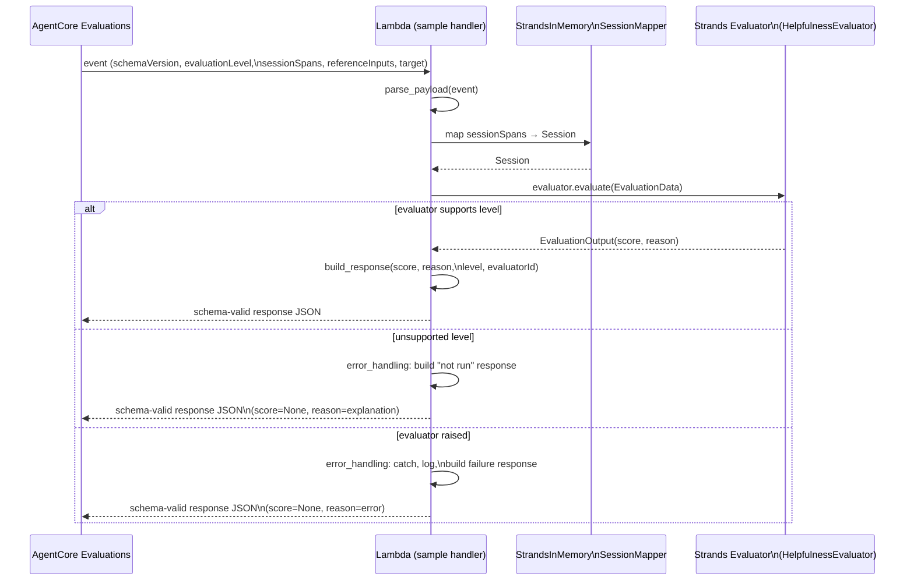

This guide is for a Strands developer who has deployed agents to Amazon Bedrock
AgentCore and wants to run Strands evaluators against those agents. It walks
through wrapping an evaluator from the Python Strands Evals SDK
(`strands-agents-evals`) as an AgentCore code-based evaluator — an AWS Lambda
function that AgentCore Evaluations invokes to score sessions, traces, or tool
calls.

## Prerequisites

Before following this guide, make sure you have:

- Python 3.10+
- `strands-agents` installed
- `strands-agents-evals` installed
- An AWS account with access to AWS Lambda

:::note
Evaluators that call Amazon Bedrock (for example `HelpfulnessEvaluator`)
require model access to be enabled in the Amazon Bedrock console. See the
[model-access instructions](../quickstart.md) in the Evals SDK quickstart.
:::

## How it fits together

The diagram below shows the control flow inside the Lambda handler at runtime,
from the moment AgentCore Evaluations invokes it to the schema-valid response
the handler returns.



## AgentCore request payload

AgentCore Evaluations invokes your Lambda with a JSON event defined by the
AWS [code-based evaluators contract](https://docs.aws.amazon.com/bedrock-agentcore/latest/devguide/code-based-evaluators.html).

The handler reads every field listed below:

- `schemaVersion` — contract version; currently `"1.0"`.
- `evaluatorId` — ARN of the registered code-based evaluator. Example:
  `"arn:aws:bedrock-agentcore:us-east-1:123456789012:evaluator/strands-helpfulness"`.
- `evaluatorName` — human-readable label. Example: `"strands-helpfulness"`.
- `evaluationLevel` — one of `TRACE`, `TOOL_CALL`, or `SESSION`. Selects which
  Strands evaluator level the handler can answer.
- `evaluationInput.sessionSpans` — array of OTel-style span dicts the handler
  feeds to `StrandsInMemorySessionMapper` to build a `Session`.
- `evaluationReferenceInputs` — optional reference data for evaluators that
  need it (for example `FaithfulnessEvaluator`). Example:
  `{"reference_output": "Paris"}`.
- `evaluationTarget` — metadata about the target agent or session. Example:
  `{"agentId": "my-agent", "sessionId": "abc-123"}`.

A complete request looks like this:

```json
{
  "schemaVersion": "1.0",
  "evaluatorId": "arn:aws:bedrock-agentcore:us-east-1:...:evaluator/...",
  "evaluatorName": "strands-helpfulness",
  "evaluationLevel": "TRACE",
  "evaluationInput": {
    "sessionSpans": [ /* array of OTel-style span dicts */ ]
  },
  "evaluationReferenceInputs": { /* optional reference data */ },
  "evaluationTarget": { /* metadata about the target agent/session */ }
}
```

## Evaluation-level mapping

AgentCore's `evaluationLevel` must line up with the Strands evaluator's declared
level for the handler to score the request. The table below shows the
one-to-one mapping the handler relies on:

| AgentCore `evaluationLevel` | Strands evaluator level | Typical Strands evaluators |
| --- | --- | --- |
| `TOOL_CALL` | `OUTPUT_LEVEL` | `OutputEvaluator`, deterministic evaluators |
| `TRACE` | `TRACE_LEVEL` | `HelpfulnessEvaluator`, `FaithfulnessEvaluator` |
| `SESSION` | `SESSION_LEVEL` | `TrajectoryEvaluator`, `GoalSuccessRateEvaluator` |

When the incoming level doesn't match the wrapped evaluator, the handler
returns a schema-valid "not-run" response instead of raising — the details of
that response shape are covered in the error-handling section later on this
page.
## Writing the Lambda handler

The rest of this section walks through the sample handler region by region.
Every code block is pulled verbatim from
[`agentcore_code_evaluator_handler.py`][sample-handler] via MkDocs snippet
syntax, so the docs and the runnable sample can't drift apart.

[sample-handler]: https://github.com/strands-agents/docs/blob/main/src/content/docs/user-guide/evals-sdk/how-to/agentcore_code_evaluator_handler.py

### Imports and constants

The `imports` region pulls in the stdlib utilities, the Strands Evals SDK
building blocks the handler needs, and the module-level constants echoed back
in every AgentCore response. The evaluator instance is created at module scope
rather than inside `lambda_handler` so warm Lambda invocations reuse the same
`HelpfulnessEvaluator` — and therefore the same judge-model client —
instead of re-initializing it on every call.

`SCHEMA_VERSION` is the AgentCore code-based evaluator contract version the
handler echoes in responses. `PASS_THRESHOLD_ENV` and `DEFAULT_PASS_THRESHOLD`
give deployers a way to override the numeric cutoff that maps evaluator scores
to `PASS` / `FAIL` without editing code. The `AGENTCORE_LEVEL_*` constants are
the exact string values AgentCore sends for `evaluationLevel`, defined once so
the rest of the handler can reference them symbolically.

```python
--8<-- "user-guide/evals-sdk/how-to/agentcore_code_evaluator_handler.py:imports"
```

### Entry point

`lambda_handler` is intentionally small: parse the event, invoke the
evaluator, build the response. Each step lives in its own helper so the docs
can introduce them one at a time, and so unit tests can exercise each stage
independently.

The outer `try/except` is the key part. AgentCore treats any Lambda error as
an evaluator failure that aborts the evaluation run, so the handler converts
every failure — level mismatches, validation errors, evaluator exceptions — 
into a schema-valid response. The two helpers referenced here,
`LevelMismatchError` and `_error_response`, are defined alongside the other
error-handling code further down.

```python
--8<-- "user-guide/evals-sdk/how-to/agentcore_code_evaluator_handler.py:handler"
```

### Parsing the request

`_parse_payload` translates the AgentCore request into a Strands
`EvaluationData`. It starts with a soft version check: an unexpected or
missing `schemaVersion` logs a warning but doesn't abort, because the rest of
the payload may still be readable. `evaluationLevel` is different — it's
required to pick the right evaluator path, so a missing value raises a
`ValueError` that the outer `try/except` turns into an `ERROR` response.

The OTel-style `sessionSpans` are fed to `StrandsInMemorySessionMapper` to
produce the `Session` object that Strands evaluators accept. Optional
passthroughs (`evaluationReferenceInputs` and `evaluationTarget`) are read
only when the evaluator needs them.

The `_recover_prompt` and `_recover_final_output` helpers are illustrative.
They pull the user prompt from the root span's attributes and the final
assistant message from the session's message list, which works for the shape
this sample assumes. Adapt both helpers to match the span and message schema
your agent actually records.

```python
--8<-- "user-guide/evals-sdk/how-to/agentcore_code_evaluator_handler.py:parse_payload"
```

### Invoking the evaluator

`_invoke_evaluator` enforces the level-compatibility check before calling the
evaluator. It reads the evaluator's declared Strands level (for
`HelpfulnessEvaluator` that's `TRACE_LEVEL`) and compares it to the expected
Strands level for the incoming AgentCore level via
`_AGENTCORE_TO_STRANDS_LEVEL`, the single mapping table the handler uses for
this translation.

On a mismatch, the function raises `LevelMismatchError`. Python resolves the
forward reference at call time, so the class can live in the error-handling
region below without a circular import. The outer handler catches the
mismatch and converts it into the `NOT_RUN` response.

```python
--8<-- "user-guide/evals-sdk/how-to/agentcore_code_evaluator_handler.py:invoke_evaluator"
```

### Building the response

`_build_response` shapes the AgentCore response the Lambda returns on the
happy path. The pass threshold is read per-invocation from
`STRANDS_EVAL_PASS_THRESHOLD` (falling back to `DEFAULT_PASS_THRESHOLD` when
the env var is missing or non-numeric), so tests and deployments can override
it without touching code.

`passed` and `label` follow an explicit precedence. If the evaluator sets
`test_pass` directly — deterministic evaluators often do — that value wins;
otherwise `passed` is derived by comparing `score` to the threshold. The
`label` preserves an evaluator-provided value when one exists, and otherwise
falls back to the AgentCore `PASS` / `FAIL` vocabulary. `schemaVersion`,
`evaluatorId`, `evaluatorName`, and `evaluationLevel` are echoed straight
from the request so AgentCore can correlate the response with the evaluation
it triggered.

```python
--8<-- "user-guide/evals-sdk/how-to/agentcore_code_evaluator_handler.py:build_response"
```

### Error handling

The `error_handling` region collects the three failure modes the handler is
prepared for:

- **Level mismatch.** `LevelMismatchError` is raised by `_invoke_evaluator`
  when the incoming `evaluationLevel` doesn't map to the evaluator's declared
  Strands level. The outer handler catches it and calls `_error_response`
  with `label="NOT_RUN"`, signalling that the evaluator is healthy but
  cannot score this request.
- **Unexpected exceptions.** Any other `Exception` — an evaluator crash,
  a Bedrock error, a bug in the mapping helpers — is caught by the generic
  `except Exception` in `lambda_handler`, logged with `logger.exception(...)`
  so the full traceback lands in CloudWatch, and converted into an `ERROR`
  response.
- **Missing required fields.** When `_parse_payload` encounters a missing
  `evaluationLevel`, it raises `ValueError`. That also falls into the generic
  catch above and surfaces as an `ERROR` response.

All three failure modes return schema-valid responses because AgentCore
treats an uncaught Lambda error as an evaluator failure that aborts the
evaluation run — surfacing a graceful score with a clear `reason` is almost
always more useful than taking the whole run down.

```python
--8<-- "user-guide/evals-sdk/how-to/agentcore_code_evaluator_handler.py:error_handling"
```

Swapping in a different built-in evaluator is a one-line change. Replace the
module-level `_EVALUATOR = HelpfulnessEvaluator()` with, for example,
`OutputEvaluator()` for `TOOL_CALL`-level requests or `TrajectoryEvaluator()`
for `SESSION`-level requests — the surrounding parse, invoke, and build-response
logic stays the same.

## AgentCore response schema

The handler returns JSON shaped to the AgentCore code-based evaluator response
contract — AgentCore uses this payload to record the score and attach it back
to the evaluation run.

The response carries these fields:

- `schemaVersion` — echoed from the request so AgentCore can confirm the
  contract version the handler answered.
- `results[0].evaluatorId` — echoed from the request; the ARN of the
  registered code-based evaluator.
- `results[0].evaluatorName` — echoed from the request; the human-readable
  evaluator label.
- `results[0].evaluationLevel` — echoed from the request (`TRACE`,
  `TOOL_CALL`, or `SESSION`).
- `results[0].score` — numeric score produced by the Strands evaluator, or
  `null` on the `NOT_RUN` / `ERROR` paths.
- `results[0].passed` — boolean pass indicator. See the defaults table below
  for how the sample handler derives it.
- `results[0].label` — short string label (`PASS` / `FAIL` / `NOT_RUN` /
  `ERROR`) that AgentCore surfaces in the dashboard.
- `results[0].reason` — human-readable rationale taken from the evaluator's
  `EvaluationOutput.reason`.

A successful response looks like this:

```json
{
  "schemaVersion": "1.0",
  "results": [
    {
      "evaluatorId": "arn:aws:bedrock-agentcore:...",
      "evaluatorName": "strands-helpfulness",
      "evaluationLevel": "TRACE",
      "score": 0.83,
      "passed": true,
      "label": "PASS",
      "reason": "Response directly answered the user's question with ..."
    }
  ]
}
```

AgentCore requires a handful of fields that Strands evaluators don't produce
on their own. The sample handler fills them in as follows:

| Field | Default source in sample handler |
| --- | --- |
| `schemaVersion` | Echoed from the request |
| `evaluatorId` / `evaluatorName` | Echoed from the request |
| `evaluationLevel` | Echoed from the request |
| `passed` | `test_pass`, else `score >= threshold` (env: `STRANDS_EVAL_PASS_THRESHOLD`) |
| `label` | `PASS` / `FAIL` from `passed` unless the evaluator sets an explicit `label` |
| `reason` | Taken from `evaluation_output.reason` |

## Round-trip translation

The sample handler preserves a simple round-trip property: parsing a valid
AgentCore payload, running the wrapped Strands evaluator, and serializing the
result produces an AgentCore response whose `score` equals the evaluator's
score and whose `evaluationLevel` equals the request's `evaluationLevel`. When
the evaluator doesn't support the incoming level, the response is still
schema-valid — a `NOT_RUN` result with `score: null` and a clear `reason`
explaining that the evaluator did not run.

### Request → evaluator input

When `_parse_payload` processes a request, each AgentCore field lands in a
specific slot on the Strands `EvaluationData` the evaluator receives:

- `evaluationInput.sessionSpans` → a `Session` built by
  `StrandsInMemorySessionMapper`, used as the `trajectory` on `EvaluationData`
  for `TRACE_LEVEL` and `SESSION_LEVEL` evaluators.
- `input` → the user prompt recovered from the root span's attributes by
  `_recover_prompt`.
- `actual_output` → the final assistant message in the mapped `Session`,
  recovered by `_recover_final_output`.
- `reference_input` → taken from `evaluationReferenceInputs` when present, so
  reference-based evaluators (for example `FaithfulnessEvaluator`) can read
  the keys they need.
- `evaluationTarget` → passed through untouched; the handler does not rewrite
  it, and evaluators that need agent or session metadata can read it directly.

### Evaluator output → response

When `_build_response` serializes the result, the evaluator's
`EvaluationOutput` maps back into the AgentCore response as follows:

- `score` → `results[0].score`, echoed verbatim (or `null` on the `NOT_RUN`
  and `ERROR` paths).
- `reason` → `results[0].reason`, echoed verbatim.
- `test_pass` / `label` → `results[0].passed` and `results[0].label`, with the
  precedence documented earlier: an evaluator-provided `test_pass` wins over
  the threshold comparison, and an evaluator-provided `label` wins over the
  derived `PASS` / `FAIL` vocabulary.
- `schemaVersion`, `evaluatorId`, `evaluatorName`, `evaluationLevel` → echoed
  straight from the request so AgentCore can correlate the response with the
  evaluation run that triggered it.

### Worked example

Given a `TRACE`-level request targeting the `HelpfulnessEvaluator`:

```json
{
  "schemaVersion": "1.0",
  "evaluatorId": "arn:aws:bedrock-agentcore:us-east-1:...:evaluator/helpfulness",
  "evaluatorName": "strands-helpfulness",
  "evaluationLevel": "TRACE",
  "evaluationInput": {
    "sessionSpans": [
      {
        "name": "invoke_agent",
        "attributes": {
          "gen_ai.prompt": "What's the capital of France?"
        }
      },
      {
        "name": "assistant.message",
        "attributes": {
          "gen_ai.completion": "The capital of France is Paris."
        }
      }
    ]
  },
  "evaluationReferenceInputs": {
    "reference_output": "Paris"
  },
  "evaluationTarget": {
    "agentId": "my-agent",
    "sessionId": "abc-123"
  }
}
```

The sample handler produces this response:

```json
{
  "schemaVersion": "1.0",
  "results": [
    {
      "evaluatorId": "arn:aws:bedrock-agentcore:us-east-1:...:evaluator/helpfulness",
      "evaluatorName": "strands-helpfulness",
      "evaluationLevel": "TRACE",
      "score": 0.9,
      "passed": true,
      "label": "PASS",
      "reason": "Response directly answered the user's question with Paris."
    }
  ]
}
```

## Deploy the Lambda function

With the handler code in place, the remaining work is packaging it, creating
the Lambda, and wiring up IAM so the function can call Bedrock (for
evaluators that need it) and write logs. This section collects the AWS-side
steps a Strands reader needs to get a code-based evaluator Lambda running.

### Package the function

Lambda expects a ZIP archive containing the handler module plus its
dependencies. The simplest approach is to `pip install` the Strands Evals
SDK into a local `package/` directory, drop the handler next to it, and zip
everything together:

```bash
mkdir -p package
pip install --target ./package strands-agents-evals
cp agentcore_code_evaluator_handler.py package/
cd package && zip -r ../function.zip . && cd ..
```

:::note
Lambda imposes a 250 MB unzipped deployment-package size limit (50 MB
zipped for direct upload). If `strands-agents-evals` plus its transitive
dependencies push a deployment package near that ceiling, move the library
into a Lambda layer and deploy the handler by itself. A layer also lets you
share a single `strands-agents-evals` install across multiple evaluator
Lambdas.
:::

### Create the Lambda

Once `function.zip` exists, create the Lambda with the AWS CLI. Use a
Python 3.11 runtime, point `--handler` at
`agentcore_code_evaluator_handler.lambda_handler`, and give the function
enough time and memory to load the SDK and invoke the judge model:

```bash
aws lambda create-function \
  --function-name strands-evals-helpfulness \
  --runtime python3.11 \
  --handler agentcore_code_evaluator_handler.lambda_handler \
  --timeout 60 \
  --memory-size 512 \
  --role arn:aws:iam::ACCOUNT_ID:role/StrandsEvalsLambdaRole \
  --zip-file fileb://function.zip
```

Replace `ACCOUNT_ID` with your AWS account ID and substitute the execution
role you create under *Execution-role IAM policy* below.

### Environment variables

The sample handler reads a small number of environment variables so
deployers can tune runtime behavior without editing code:

- `STRANDS_EVAL_PASS_THRESHOLD` — numeric cutoff the handler uses to derive
  `passed` from `score` when the evaluator doesn't set `test_pass`
  directly. Defaults to `0.5`. Non-numeric values fall back to the default.
- `AWS_REGION` — region the Strands Evals SDK uses for Bedrock model calls.
  Lambda sets this automatically to the function's region; override it
  only when you want the judge model to run in a different region than the
  Lambda.

Evaluators that instantiate `BedrockModel` also respect the standard
Bedrock SDK environment variables for overriding the model ID, endpoint,
and credentials — useful if you want to swap the judge model without
redeploying the handler.

### Execution-role IAM policy

The Lambda execution role needs just two permission families: call the
Bedrock models the evaluator uses, and write logs to CloudWatch. The
minimal policy below covers both:

```json
{
  "Version": "2012-10-17",
  "Statement": [
    {
      "Sid": "InvokeBedrockModel",
      "Effect": "Allow",
      "Action": "bedrock:InvokeModel",
      "Resource": "*"
    },
    {
      "Sid": "CloudWatchLogs",
      "Effect": "Allow",
      "Action": [
        "logs:CreateLogGroup",
        "logs:CreateLogStream",
        "logs:PutLogEvents"
      ],
      "Resource": "*"
    }
  ]
}
```

Scope `Resource` on `bedrock:InvokeModel` down to the specific model ARNs
your evaluator uses for a tighter policy in production. The wildcard shown
here keeps the example concise.

### Region and additional resources

The Lambda must live in a region that supports both AgentCore Evaluations
and the Bedrock models the chosen evaluator uses. Evaluators that call
Bedrock (for example `HelpfulnessEvaluator`) fail at runtime if the judge
model isn't available in the Lambda's region — pick a region that
satisfies both services before creating the function.

An IAM execution role must exist before `aws lambda create-function` will
succeed. See the AWS Lambda docs on
[creating an execution role](https://docs.aws.amazon.com/lambda/latest/dg/lambda-intro-execution-role.html)
for step-by-step guidance; attach the policy above to the role you create.

:::note
If your evaluator uses Amazon Bedrock (for example `HelpfulnessEvaluator`),
model access must be enabled in the Amazon Bedrock console before the
Lambda can invoke the judge model. See the
[model-access instructions](../quickstart.md) in the Evals SDK quickstart.
:::

## Register the code-based evaluator

With the Lambda deployed, the next step is to register it with AgentCore
Evaluations so that AgentCore knows which function to invoke for a given
evaluator. AgentCore's
[code-based evaluators dev guide](https://docs.aws.amazon.com/bedrock-agentcore/latest/devguide/code-based-evaluators.html)
covers the registration procedure in detail; this section summarizes what
registration accomplishes and the AWS-side IAM permissions AgentCore needs
to call the function.

Registration does three things. AgentCore records the Lambda ARN against a
new evaluator resource, assigns that resource an `evaluatorId` (the same
value that flows back into the `evaluatorId` field of every request the
handler receives), and grants itself invoke permissions on the function so
it can dispatch evaluation calls at runtime.

### AgentCore-side IAM policy

AgentCore needs permission to invoke and introspect the deployed Lambda.
The minimal policy below grants both, scoped to a single function ARN:

```json
{
  "Version": "2012-10-17",
  "Statement": [
    {
      "Sid": "InvokeEvaluatorLambda",
      "Effect": "Allow",
      "Action": [
        "lambda:InvokeFunction",
        "lambda:GetFunction"
      ],
      "Resource": "arn:aws:lambda:us-east-1:ACCOUNT_ID:function:strands-evals-helpfulness"
    }
  ]
}
```

AgentCore normally manages this policy automatically when you register the
evaluator through the registration console or API — the explicit policy
above is shown for reference and for deployments that prefer to attach it
manually.

## Run an evaluation

With the Lambda deployed and the evaluator registered, AgentCore Evaluations
can invoke the code-based evaluator against the target agent's traces,
sessions, or tool calls as part of an evaluation run. The CLI invocation
below is a minimal starting point that references the registered evaluator
by ARN and points at an agent and session to score:

```bash
aws bedrock-agentcore-control start-evaluation-run \
  --evaluator-id EVALUATOR_ARN \
  --target agentId=AGENT_ID,sessionId=SESSION_ID \
  --region us-east-1
```

The exact command name and arguments follow the AWS dev guide's current
code-based evaluators API — if the invocation above doesn't match what
your AWS CLI expects, the AWS page linked earlier in this guide is the
source of truth.

The evaluator's scores appear in the AgentCore Evaluations dashboard — see
[AgentCore Evaluation Dashboard](./agentcore_evaluation_dashboard.md) for
how to interpret the results.

## TypeScript support

:::note
This guide covers only the Python Strands Evals SDK
(`strands-agents-evals`). TypeScript coverage is out of scope for now and
is tracked by the upstream feature request at
[strands-agents/evals#204](https://github.com/strands-agents/evals/issues/204).
It will land once the
TypeScript Evals SDK ships.
:::

## Related documentation

- [Evals SDK quickstart](../quickstart.md) — install the SDK and write your
  first evaluator.
- [Evaluators overview](../evaluators/index.md) — the built-in evaluators
  available to wrap for AgentCore.
- [Custom evaluators](../evaluators/custom_evaluator.md) — build a
  domain-specific evaluator to wrap.
- [Deploy to AgentCore](../../deploy/deploy_to_bedrock_agentcore/index.md) —
  how to deploy the agent you're evaluating.
- [AgentCore Evaluation Dashboard](./agentcore_evaluation_dashboard.md) —
  interpret the scores your code-based evaluator produces.
